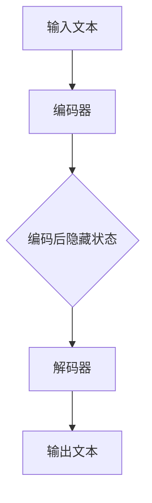
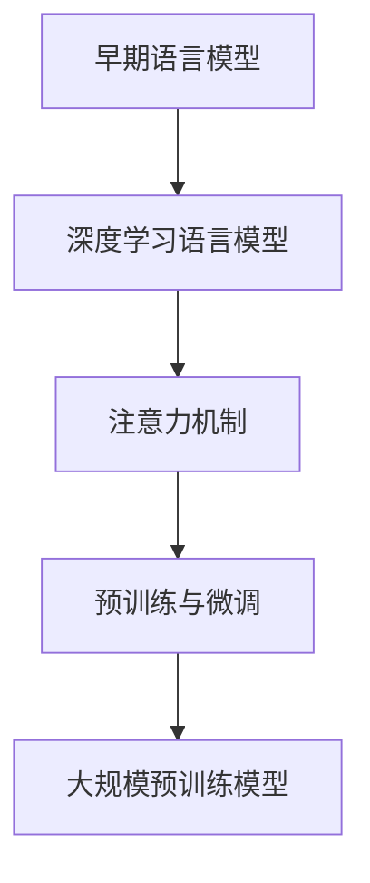
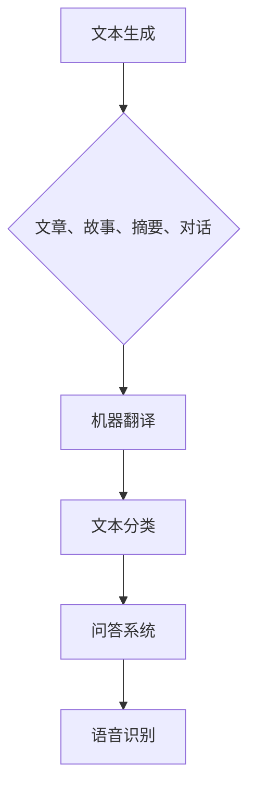

                 

# 文章标题：大语言模型原理与工程实践：检索增强生成技术

> 关键词：大语言模型，检索增强，生成技术，自然语言处理，深度学习

> 摘要：本文将深入探讨大语言模型的原理及其在工程实践中的应用，特别是检索增强生成技术的最新进展。通过系统性的分析，本文旨在为读者提供全面的技术理解，包括基础理论、数学模型、算法原理，以及实战案例。通过逐步推理，我们将揭示大语言模型的深度与广度，并展望其未来的发展趋势。

## 目录大纲

### 第一部分：大语言模型基础

#### 第1章：大语言模型概述  
- **1.1 大语言模型的概念与重要性**  
- **1.2 大语言模型的架构与工作原理**  
- **1.3 大语言模型的发展历程**  
- **1.4 大语言模型的应用场景**

#### 第2章：自然语言处理基础  
- **2.1 语言模型与统计模型**  
- **2.2 词汇表示与嵌入**  
- **2.3 序列模型与注意力机制**

#### 第3章：大语言模型的训练技术  
- **3.1 大规模数据处理**  
- **3.2 预训练与微调**  
- **3.3 损失函数与优化算法**

#### 第4章：大语言模型的数学模型与数学公式  
- **4.1 神经网络与反向传播算法**  
- **4.2 语言模型中的数学公式**  
- **4.3 Mermaid 流程图：大语言模型架构**

### 第二部分：检索增强生成技术

#### 第5章：检索增强技术  
- **5.1 检索增强的基本概念**  
- **5.2 检索增强在生成模型中的应用**  
- **5.3 检索增强的优势与挑战**

#### 第6章：检索增强生成模型的构建  
- **6.1 基于检索的生成模型架构**  
- **6.2 检索增强生成模型的设计**  
- **6.3 检索增强生成模型的训练**

#### 第7章：检索增强生成技术实战  
- **7.1 实战案例：问答系统**  
- **7.2 实战案例：文本生成**  
- **7.3 实战案例：机器翻译**

#### 第8章：检索增强生成技术的未来发展趋势  
- **8.1 技术挑战与解决方案**  
- **8.2 应用前景与行业影响**  
- **8.3 未来发展趋势与展望**

### 附录

#### 附录A：工具与资源  
- **A.1 常用深度学习框架介绍**  
- **A.2 大语言模型开源项目汇总**  
- **A.3 相关论文与资料推荐**

### 《大语言模型原理与工程实践：检索增强生成技术》

#### 概述

大语言模型（Large Language Model）是自然语言处理（Natural Language Processing，NLP）领域的重要进展，它通过深度学习技术对海量文本数据进行预训练，以实现高效的文本生成、理解、翻译等功能。近年来，随着计算资源和算法的进步，大语言模型在学术界和工业界都取得了显著的成果，成为人工智能领域的研究热点。

本文将系统地介绍大语言模型的原理与工程实践，特别是检索增强生成技术（Retrievable Enhanced Generation Techniques）的最新进展。文章结构如下：

- 第一部分：基础篇，介绍大语言模型的基本概念、架构、发展历程和应用场景。
- 第二部分：技术篇，深入讨论自然语言处理的基础知识，包括语言模型、词汇表示、序列模型和注意力机制。
- 第三部分：数学篇，阐述大语言模型的数学模型、训练技术及其优化算法。
- 第四部分：实战篇，通过具体的工程实践案例，展示检索增强生成技术的应用。
- 第五部分：展望篇，探讨检索增强生成技术的未来发展趋势和潜在应用。

通过本文的逐步分析，读者将能够全面了解大语言模型及其检索增强生成技术的核心内容，为深入研究和实际应用打下坚实基础。### 第1章：大语言模型概述

#### 1.1 大语言模型的概念与重要性

大语言模型是一种基于深度学习技术的自然语言处理模型，通过对海量文本数据进行预训练，使其具备对自然语言的高效理解和生成能力。大语言模型的核心目标是学习自然语言的统计规律和语义信息，从而实现对文本的自动生成、分类、翻译等任务。

大语言模型的概念源自传统语言模型（Language Model）的发展。传统语言模型通常使用统计方法（如N元语法）或基于规则的方法（如词法分析器）来预测下一个单词或词组。然而，这些方法在面对复杂且庞大的文本数据时存在诸多限制。随着深度学习技术的兴起，研究人员开始探索基于神经网络的模型，以实现更为强大的语言理解与生成能力。

大语言模型的重要性主要体现在以下几个方面：

1. **高效的文本生成与理解**：大语言模型能够通过对大量文本数据进行预训练，使其在文本生成和理解方面表现出色。无论是生成文章摘要、自动写作，还是进行文本分类、情感分析，大语言模型都能提供高效的解决方案。

2. **跨领域的通用性**：大语言模型在多个领域都有广泛的应用。无论是在金融、医疗、教育等领域，还是在社交媒体、电子商务等场景中，大语言模型都能为企业和用户提供个性化的服务和体验。

3. **促进人工智能的发展**：大语言模型的成功不仅推动了自然语言处理领域的研究，还促进了整个人工智能（AI）领域的发展。通过大语言模型，研究人员能够探索更复杂、更具挑战性的AI应用，从而推动技术的创新和进步。

#### 1.2 大语言模型的架构与工作原理

大语言模型的架构通常包括编码器（Encoder）和解码器（Decoder）两个主要部分。编码器负责将输入的文本序列编码为连续的向量表示，而解码器则将这些向量表示解码为输出的文本序列。通过预训练和微调，大语言模型能够学习到丰富的语义信息，并在各种自然语言处理任务中表现出色。

1. **编码器**

编码器通常采用循环神经网络（Recurrent Neural Network，RNN）或其变种（如长短期记忆网络LSTM、门控循环单元GRU）来实现。这些网络结构具有处理序列数据的优势，能够捕捉到输入文本中的时间依赖关系。

编码器的输入为文本序列，通常通过词汇表将其转换为词索引（word indices）。词索引序列被输入到编码器，通过隐藏状态（hidden state）来编码文本序列的语义信息。编码器的输出是最终的隐藏状态，它代表了整个输入文本的语义表示。

以下是一个简单的RNN编码器的伪代码实现：

```python
# 初始化编码器参数
W_e, b_e = initialize_weights()

# 编码输入文本序列
def encode_sequence(inputs):
    hidden_states = []
    for word_index in inputs:
        # 计算词嵌入向量
        embedding = embedding_layer[word_index]
        # 前向传播计算隐藏状态
        hidden_state = sigmoid(W_e * embedding + b_e)
        hidden_states.append(hidden_state)
    return hidden_states
```

2. **解码器**

解码器同样采用循环神经网络来实现，其输入为编码器的隐藏状态，输出为生成的文本序列。解码器的目标是通过预测下一个单词或词组，将隐藏状态解码为实际的文本序列。

解码器的输入是编码器的隐藏状态，通过解码器网络生成概率分布，然后从概率分布中采样得到下一个单词或词组的索引。这一过程不断重复，直到生成完整的文本序列。

以下是一个简单的RNN解码器的伪代码实现：

```python
# 初始化解码器参数
W_d, b_d = initialize_weights()

# 解码隐藏状态生成文本序列
def decode_sequence(hidden_states):
    outputs = []
    for hidden_state in hidden_states:
        # 计算解码概率分布
        probabilities = softmax(W_d * hidden_state + b_d)
        # 从概率分布中采样得到单词索引
        word_index = sample_word(probabilities)
        outputs.append(word_index)
    return outputs
```

3. **工作原理**

大语言模型的工作原理主要依赖于编码器和解码器之间的相互作用。编码器将输入的文本序列编码为语义表示，而解码器则利用这些语义表示生成文本序列。通过大量的预训练数据和微调，大语言模型能够学习到文本中的各种语义关系，从而实现高效的文本生成和理解。

以下是一个简单的Mermaid流程图，展示了大语言模型的基本架构：



#### 1.3 大语言模型的发展历程

大语言模型的发展历程可以分为以下几个阶段：

1. **早期语言模型**：最早的语言模型是基于N元语法（N-gram）的统计模型。N元语法通过计算前N个单词的联合概率来预测下一个单词。虽然这种方法简单有效，但其在处理长文本和长距离依赖关系时存在局限。

2. **深度学习语言模型**：随着深度学习技术的发展，研究人员开始探索基于神经网络的深度语言模型。早期的深度学习语言模型包括循环神经网络（RNN）和其变种LSTM、GRU等。这些模型在处理长序列数据方面表现出色，但仍存在梯度消失和梯度爆炸等问题。

3. **注意力机制**：为了解决RNN模型的梯度消失和梯度爆炸问题，研究人员提出了注意力机制（Attention Mechanism）。注意力机制通过动态调整输入序列中各个元素的重要性，从而提高模型的性能。注意力机制在序列模型中得到了广泛应用，如机器翻译、文本分类等任务。

4. **预训练与微调**：预训练与微调（Pre-training and Fine-tuning）是目前大语言模型的主要训练方法。预训练阶段使用大规模未标注的数据对模型进行训练，使模型学习到通用的语言知识和语义信息。微调阶段则使用特定领域或任务的数据对模型进行进一步训练，从而提高其在具体任务上的性能。

5. **大规模预训练模型**：近年来，研究人员推出了大量的大规模预训练模型，如GPT（Generative Pre-trained Transformer）、BERT（Bidirectional Encoder Representations from Transformers）等。这些模型通过在海量数据上进行预训练，获得了前所未有的语言理解和生成能力，推动了自然语言处理领域的飞速发展。

以下是一个Mermaid流程图，展示了大语言模型的发展历程：



#### 1.4 大语言模型的应用场景

大语言模型在多个应用场景中取得了显著的成果，以下是其中一些典型的应用场景：

1. **文本生成**：大语言模型可以生成各种类型的文本，如文章、故事、摘要、对话等。在新闻写作、内容创作、对话系统等场景中，大语言模型能够自动生成高质量的文本，提高写作效率和创作多样性。

2. **机器翻译**：大语言模型在机器翻译领域取得了重大突破。通过预训练和微调，大语言模型能够学习到不同语言之间的语义关系，从而实现高精度的翻译。目前，大语言模型已经在谷歌翻译、百度翻译等应用中得到了广泛应用。

3. **文本分类**：大语言模型能够对文本进行分类，如情感分析、主题分类、垃圾邮件检测等。通过学习文本中的语义信息，大语言模型能够准确识别文本的类别，从而提高分类任务的准确率。

4. **问答系统**：大语言模型在问答系统（Question Answering System）中发挥了重要作用。通过理解和解析用户的问题，大语言模型能够从大量文本数据中找到相关答案，从而提供智能化的问答服务。

5. **语音识别**：大语言模型在语音识别系统中起到关键作用。通过结合语音信号和文本语义信息，大语言模型能够提高语音识别的准确率和效率，从而实现更加智能的语音交互体验。

以下是一个Mermaid流程图，展示了大语言模型在不同应用场景中的工作流程：



### 总结

大语言模型作为自然语言处理领域的重要成果，其在文本生成、机器翻译、文本分类、问答系统、语音识别等领域都取得了显著的进展。通过深入理解大语言模型的原理和架构，研究人员和开发者能够更好地应用这些技术，推动自然语言处理和人工智能领域的持续发展。在下一章中，我们将进一步探讨自然语言处理的基础知识，为读者提供更全面的技术背景。### 第2章：自然语言处理基础

#### 2.1 语言模型与统计模型

语言模型（Language Model）是自然语言处理（Natural Language Processing，NLP）的核心组成部分，它旨在通过分析语言数据来预测下一个单词或符号的概率。语言模型在文本生成、语音识别、机器翻译等任务中发挥着重要作用。传统语言模型主要基于统计方法，如N元语法（N-gram Model）。

**N元语法**是一种基于历史频率的模型，它通过计算前N个单词的联合概率来预测下一个单词。例如，在二元语法中，下一个单词的概率取决于前两个单词。N元语法的优势在于其简单性和计算效率，但其在长距离依赖和罕见词上的表现较差。

**N元语法的数学表示**如下：

P(W<sub>t</sub>|W<sub>t-1</sub>, W<sub>t-2</sub>, ..., W<sub>t-N+1</sub>) = C(W<sub>t-1</sub>, W<sub>t-2</sub>, ..., W<sub>t-N+1</sub>, W<sub>t</sub>)

其中，C表示计数函数，W<sub>t</sub>表示时间步t的单词。

**N元语法的局限性**包括：
- **稀疏数据问题**：随着N的增加，语言模型会面临数据稀疏的问题，导致罕见词的概率接近于0。
- **长距离依赖**：N元语法难以捕捉长距离依赖关系，例如，"He is not feeling well, he took a day off"中的"well"和"off"之间的依赖关系。

#### 2.2 词汇表示与嵌入

词汇表示（Word Representation）是将自然语言文本中的单词转换为机器可处理的向量表示的过程。词汇表示对于NLP任务的成功至关重要，因为有效的表示能够捕捉单词的语义和上下文信息。

**词嵌入（Word Embedding）**是一种常见的词汇表示方法，它将单词映射到高维空间中的向量。词嵌入通过学习单词与其上下文之间的关系，能够捕捉到单词的语义信息。

**词嵌入的数学表示**如下：

v<sub>w</sub> = embedding(W<sub>w</sub>)

其中，v<sub>w</sub>是单词W<sub>w</sub>的向量表示，embedding是一个将单词映射到向量的函数。

**词嵌入的方法**包括：
- **基于分布式假设的词嵌入**：例如，分布式假设认为相似的单词在语义上接近，因此它们在高维空间中应该是近邻。
- **基于矩阵分解的方法**：例如，奇异值分解（Singular Value Decomposition，SVD）可以用于将词表分解为多个矩阵的乘积，从而得到词嵌入向量。

**词嵌入的挑战**包括：
- **稀疏性**：词嵌入向量通常是稀疏的，因为单词在文本中只出现有限次。
- **维度灾难**：在高维空间中，单词之间的距离可能变得非常小，导致难以区分语义相似的单词。

#### 2.3 序列模型与注意力机制

序列模型（Sequence Model）是用于处理序列数据的机器学习模型，如循环神经网络（Recurrent Neural Network，RNN）和其变种长短期记忆网络（Long Short-Term Memory，LSTM）和门控循环单元（Gated Recurrent Unit，GRU）。这些模型通过记忆和更新隐藏状态来处理时间序列数据，从而捕捉到序列中的时间依赖关系。

**RNN的工作原理**如下：

给定一个输入序列X = (x<sub>1</sub>, x<sub>2</sub>, ..., x<sub>T</sub>)，RNN在时间步t的输出y<sub>t</sub>依赖于当前输入x<sub>t</sub>和前一个隐藏状态h<sub>t-1</sub>：

y<sub>t</sub> = f(h<sub>t-1</sub>, x<sub>t</sub>)
h<sub>t</sub> = g(h<sub>t-1</sub>, x<sub>t</sub>)

其中，f和g分别是输出和隐藏状态的计算函数。

**RNN的局限性**包括：
- **梯度消失和梯度爆炸**：RNN在训练过程中容易出现梯度消失和梯度爆炸问题，导致难以学习到长距离依赖关系。
- **状态依赖**：RNN的输出高度依赖于过去的输入，导致难以并行处理。

**LSTM和GRU**是RNN的改进版本，通过引入门控机制来克服梯度消失和梯度爆炸问题。LSTM通过遗忘门（forget gate）和输入门（input gate）来控制信息的保留和更新，而GRU则通过更新门（update gate）和重置门（reset gate）来实现类似的功能。

**注意力机制（Attention Mechanism）**是一种用于提高序列模型性能的机制，它通过动态调整不同时间步的重要性来捕捉序列中的关键信息。注意力机制在机器翻译、文本摘要等任务中取得了显著的效果。

**注意力机制的数学表示**如下：

a<sub>t</sub> = attention_weights(h<sub>1</sub>, h<sub>2</sub>, ..., h<sub>T</sub>)
y<sub>t</sub> = Σ(a<sub>t</sub> * h<sub>t</sub>)

其中，a<sub>t</sub>是时间步t的注意力权重，h<sub>t</sub>是时间步t的隐藏状态，Σ表示对所有时间步的加权求和。

**注意力机制的挑战**包括：
- **计算复杂度**：注意力机制的引入增加了模型的计算复杂度，可能导致训练和推理速度的下降。
- **解释性**：尽管注意力机制提高了模型的性能，但其内部工作机制有时难以解释，导致难以理解模型如何捕捉关键信息。

#### 2.4 自然语言处理中的其他模型和算法

除了语言模型、词汇表示和序列模型，自然语言处理中还有许多其他重要的模型和算法。

- **卷积神经网络（Convolutional Neural Network，CNN）**：CNN通常用于文本分类和情感分析等任务。通过卷积操作和池化操作，CNN能够捕捉到局部特征和上下文信息。

- **Transformer模型**：Transformer模型是一种基于自注意力机制的序列转换模型，它在机器翻译、文本生成等任务中表现出色。Transformer通过多头自注意力机制和前馈网络来处理序列数据，避免了传统的RNN和LSTM的梯度消失问题。

- **预训练与微调**：预训练与微调是目前NLP任务中的主流训练方法。预训练阶段使用大量未标注的数据对模型进行训练，使模型学习到通用的语言知识和语义信息。微调阶段则使用特定领域或任务的数据对模型进行进一步训练，从而提高其在具体任务上的性能。

### 总结

自然语言处理（NLP）是人工智能（AI）领域的一个重要分支，它通过计算机技术理解和生成人类语言。语言模型、词汇表示和序列模型是NLP中的基础组成部分，它们在文本生成、机器翻译、文本分类等任务中发挥着关键作用。通过本章的讨论，读者应该对NLP的基础知识有了更深入的理解，为后续章节的深入探讨打下了基础。在下一章中，我们将进一步探讨大语言模型的训练技术。### 第3章：大语言模型的训练技术

#### 3.1 大规模数据处理

大语言模型的训练涉及大量数据的处理，这是确保模型性能的关键步骤。大规模数据处理包括数据收集、预处理和存储等环节。

**数据收集**：大语言模型通常依赖于大量的文本数据。这些数据可以来自互联网、书籍、新闻文章、社交媒体等各种来源。例如，GPT-3模型使用了数十亿个单词的文本数据，涵盖了多种语言和主题。

**数据预处理**：收集到的文本数据需要进行预处理，以确保其质量并提高模型的训练效率。预处理步骤包括：
- **文本清洗**：去除噪声和无关信息，如HTML标签、特殊字符、停用词等。
- **分词**：将文本拆分为单词或子词（subword），这是词汇表示的基础。
- **编码**：将文本转换为机器可处理的格式，如词索引或词嵌入向量。

**数据存储**：由于数据量庞大，大语言模型通常需要高效的存储解决方案。常见的方法包括：
- **分布式存储**：使用分布式文件系统（如HDFS）来存储海量数据。
- **数据流处理**：利用数据流处理技术（如Apache Flink、Apache Spark Streaming）来实时处理和更新数据。

**示例代码**：以下是一个简单的Python代码示例，展示了文本数据的预处理步骤：

```python
import re
from nltk.tokenize import word_tokenize

# 文本清洗
def clean_text(text):
    text = re.sub(r'\s+', ' ', text)  # 去除多余的空白字符
    text = re.sub(r'<[^>]*>', '', text)  # 去除HTML标签
    text = re.sub(r'[^a-zA-Z]', ' ', text)  # 去除特殊字符
    return text.lower()  # 转换为小写

# 文本分词
def tokenize_text(text):
    tokens = word_tokenize(text)
    return tokens

# 编码文本
def encode_text(tokens, vocabulary):
    encoded_tokens = [vocabulary[token] for token in tokens if token in vocabulary]
    return encoded_tokens

# 示例文本
text = "This is an example sentence for text preprocessing."
cleaned_text = clean_text(text)
tokens = tokenize_text(cleaned_text)
vocabulary = {'this': 1, 'is': 2, 'an': 3, 'example': 4, 'sentence': 5, 'for': 6}
encoded_tokens = encode_text(tokens, vocabulary)

print(encoded_tokens)
```

#### 3.2 预训练与微调

预训练与微调（Pre-training and Fine-tuning）是大语言模型训练的主要方法。预训练阶段使用大量未标注的数据对模型进行训练，使其学习到通用的语言知识和语义信息。微调阶段则使用特定领域或任务的数据对模型进行进一步训练，从而提高其在具体任务上的性能。

**预训练**：预训练阶段通常包括两个任务：
- **无监督预训练**：使用未标注的数据对模型进行训练，使其学习到语言的基本结构和统计规律。例如，GPT-3模型通过大量文本数据进行无监督预训练。
- **有监督预训练**：在一些任务中，可以使用标注数据对模型进行预训练，从而学习到特定领域的知识。例如，BERT模型通过大量的文本对和问题-答案对进行有监督预训练。

**微调**：在预训练完成后，模型会进行微调以适应特定任务。微调阶段通常包括以下步骤：
- **数据准备**：收集并准备特定任务的数据集，例如问答系统的数据集。
- **模型调整**：在预训练模型的基础上，对特定层的参数进行调整，以适应新任务。
- **训练**：使用新任务的数据集对调整后的模型进行训练。
- **评估**：使用验证集对微调后的模型进行评估，以确定其性能。

**示例代码**：以下是一个简单的Python代码示例，展示了预训练与微调的过程：

```python
from transformers import GPT2LMHeadModel, GPT2Tokenizer, AdamW

# 加载预训练模型和tokenizer
model = GPT2LMHeadModel.from_pretrained('gpt2')
tokenizer = GPT2Tokenizer.from_pretrained('gpt2')

# 预训练模型
def pretrain_model(model, tokenizer, data, epochs):
    model.train()
    for epoch in range(epochs):
        for text in data:
            inputs = tokenizer.encode(text, return_tensors='pt')
            outputs = model(inputs)
            loss = outputs.loss
            loss.backward()
            optimizer.step()
            optimizer.zero_grad()

# 微调模型
def fine_tune_model(model, tokenizer, task_data, num_labels):
    model.train()
    criterion = nn.CrossEntropyLoss()
    optimizer = AdamW(model.parameters(), lr=1e-5)

    for epoch in range(epochs):
        for text, labels in task_data:
            inputs = tokenizer.encode(text, return_tensors='pt')
            labels = labels.to(device)
            outputs = model(inputs)
            loss = criterion(outputs.logits.view(-1, num_labels), labels)
            loss.backward()
            optimizer.step()
            optimizer.zero_grad()

# 示例数据
example_texts = ["This is an example sentence.", "Another example sentence."]

# 预训练
pretrain_model(model, tokenizer, example_texts, epochs=3)

# 微调
fine_tune_model(model, tokenizer, example_texts, num_labels=2)
```

#### 3.3 损失函数与优化算法

在大语言模型的训练过程中，损失函数（Loss Function）和优化算法（Optimization Algorithm）起着至关重要的作用。

**损失函数**用于衡量模型预测值与真实值之间的差异。常见的损失函数包括：
- **交叉熵损失（Cross-Entropy Loss）**：用于分类任务，衡量模型输出概率分布与真实标签分布之间的差异。
- **均方误差（Mean Squared Error, MSE）**：用于回归任务，衡量预测值与真实值之间的平方误差。
- **泊松分布损失（Poisson Loss）**：用于计数预测，如文本生成中的词频预测。

**优化算法**用于调整模型参数，以最小化损失函数。常见的优化算法包括：
- **随机梯度下降（Stochastic Gradient Descent, SGD）**：每次迭代使用一个样本来更新参数，计算简单但可能收敛速度较慢。
- **批量梯度下降（Batch Gradient Descent, BGD）**：每次迭代使用全部样本来更新参数，计算量大但可能收敛速度较快。
- **Adam优化器（Adam Optimizer）**：结合了SGD和BGD的优点，使用动量项和自适应学习率，在许多任务中表现出色。

**示例代码**：以下是一个简单的Python代码示例，展示了损失函数和优化算法的使用：

```python
import torch
import torch.nn as nn
import torch.optim as optim

# 定义模型
class SimpleModel(nn.Module):
    def __init__(self, input_dim, output_dim):
        super(SimpleModel, self).__init__()
        self.fc = nn.Linear(input_dim, output_dim)
    
    def forward(self, x):
        return self.fc(x)

# 创建模型、损失函数和优化器
model = SimpleModel(input_dim=10, output_dim=1)
criterion = nn.CrossEntropyLoss()
optimizer = optim.Adam(model.parameters(), lr=0.001)

# 训练模型
for epoch in range(100):
    for x, y in data_loader:
        optimizer.zero_grad()
        outputs = model(x)
        loss = criterion(outputs, y)
        loss.backward()
        optimizer.step()
        print(f"Epoch {epoch}: Loss = {loss.item()}")
```

#### 3.4 训练过程中的技巧和策略

在大语言模型的训练过程中，还有一些技巧和策略可以帮助提高模型的性能和训练效率。

**技巧和策略**包括：
- **学习率调度（Learning Rate Scheduling）**：通过逐步降低学习率，可以帮助模型在训练过程中避免过早的过拟合。
- **正则化（Regularization）**：如L1正则化、L2正则化，用于防止模型参数过大。
- **dropout（Dropout）**：在训练过程中随机丢弃一部分神经元，以防止模型过拟合。
- **批量归一化（Batch Normalization）**：对模型的激活值进行归一化，加速训练过程并提高模型的稳定性。

**示例代码**：以下是一个简单的Python代码示例，展示了学习率调度和dropout的使用：

```python
import torch
import torch.nn as nn
import torch.optim as optim

# 定义模型
class SimpleModel(nn.Module):
    def __init__(self, input_dim, output_dim):
        super(SimpleModel, self).__init__()
        self.fc1 = nn.Linear(input_dim, 64)
        self.fc2 = nn.Linear(64, output_dim)
        self.dropout = nn.Dropout(p=0.5)
    
    def forward(self, x):
        x = torch.relu(self.fc1(x))
        x = self.dropout(x)
        x = self.fc2(x)
        return x

# 创建模型、损失函数和优化器
model = SimpleModel(input_dim=10, output_dim=1)
criterion = nn.CrossEntropyLoss()
optimizer = optim.Adam(model.parameters(), lr=0.001)

# 学习率调度
scheduler = optim.lr_scheduler.StepLR(optimizer, step_size=30, gamma=0.1)

# 训练模型
for epoch in range(100):
    model.train()
    for x, y in data_loader:
        optimizer.zero_grad()
        outputs = model(x)
        loss = criterion(outputs, y)
        loss.backward()
        optimizer.step()
    scheduler.step()
    print(f"Epoch {epoch}: Loss = {loss.item()}")
```

### 总结

大语言模型的训练技术包括大规模数据处理、预训练与微调、损失函数与优化算法，以及训练过程中的技巧和策略。通过有效的训练方法，大语言模型能够学习到丰富的语言知识和语义信息，从而在各种自然语言处理任务中表现出色。在下一章中，我们将进一步探讨大语言模型的数学模型与数学公式，为读者提供更深入的理论基础。### 第4章：大语言模型的数学模型与数学公式

#### 4.1 神经网络与反向传播算法

神经网络（Neural Network）是构建大语言模型的核心，其基础是神经元（Neuron）。神经元通过加权输入和激活函数产生输出，从而实现数据的非线性变换。神经网络的数学模型主要包括以下几个方面：

1. **神经元模型**：

   一个简单的神经元可以表示为：

   z = σ(W·x + b)

   其中，z是神经元的输出，σ是激活函数，W是权重矩阵，x是输入向量，b是偏置项。

2. **多层神经网络**：

   神经网络可以通过堆叠多层神经元来实现更复杂的函数表示。一个多层神经网络可以表示为：

   z<sub>l</sub> = σ(W<sub>l</sub>·z<sub>l-1</sub> + b<sub>l</sub>)

   其中，z<sub>l</sub>是第l层的输出，W<sub>l</sub>是第l层的权重矩阵，b<sub>l</sub>是第l层的偏置项。

3. **反向传播算法**：

   反向传播算法（Backpropagation Algorithm）是训练神经网络的关键算法。它通过计算损失函数对网络参数的梯度，然后利用梯度下降法更新参数，以最小化损失函数。反向传播算法的步骤如下：

   - **前向传播**：将输入数据通过神经网络，计算每层的输出。
   - **计算损失**：计算输出层与真实标签之间的损失。
   - **计算梯度**：从输出层开始，反向计算每层参数的梯度。
   - **更新参数**：利用梯度下降法更新网络参数。

   假设有一个简单的神经网络，输出层为Y，真实标签为T，损失函数为L(Y, T)。则输出层参数的梯度可以表示为：

   ΔW<sub>l</sub> = ∂L/∂W<sub>l</sub>

   其中，ΔW<sub>l</sub>是权重矩阵W<sub>l</sub>的梯度。

#### 4.2 语言模型中的数学公式

大语言模型通常基于循环神经网络（RNN）或其变种（如LSTM、GRU）构建。这些模型通过处理序列数据，捕捉到文本中的时间依赖关系。语言模型中的数学公式主要包括以下几个方面：

1. **RNN的数学公式**：

   - **隐藏状态的计算**：

     h<sub>t</sub> = σ(W<sub>h</sub>·[h<sub>t-1</sub>, x<sub>t</sub>] + b<sub>h</sub>)

     其中，h<sub>t</sub>是时间步t的隐藏状态，σ是激活函数，W<sub>h</sub>是权重矩阵，b<sub>h</sub>是偏置项。

   - **输出层的计算**：

     y<sub>t</sub> = σ(W<sub>y</sub>·h<sub>t</sub> + b<sub>y</sub>)

     其中，y<sub>t</sub>是时间步t的输出，W<sub>y</sub>是权重矩阵，b<sub>y</sub>是偏置项。

2. **LSTM和GRU的数学公式**：

   - **LSTM的数学公式**：

     - **输入门**：

       i<sub>t</sub> = σ(W<sub>i</sub>·[h<sub>t-1</sub>, x<sub>t</sub>] + b<sub>i</sub>)

     - **遗忘门**：

       f<sub>t</sub> = σ(W<sub>f</sub>·[h<sub>t-1</sub>, x<sub>t</sub>] + b<sub>f</sub>)

     - **输出门**：

       o<sub>t</sub> = σ(W<sub>o</sub>·[h<sub>t-1</sub>, x<sub>t</sub>] + b<sub>o</sub>)

     - **候选状态**：

       \(\tilde{h}_{t} = \text{tanh}(W_{\tilde{h}} \cdot [h_{t-1}, x_{t}] + b_{\tilde{h}})\)

     - **隐藏状态**：

       h<sub>t</sub> = f<sub>t</sub> \* h<sub>t-1</sub> + i<sub>t</sub> \* \(\tilde{h}_{t}\)

   - **GRU的数学公式**：

     - **重置门**：

       r<sub>t</sub> = σ(W<sub>r</sub>·[h<sub>t-1</sub>, x<sub>t</sub>] + b<sub>r</sub>)

     - **更新门**：

       z<sub>t</sub> = σ(W<sub>z</sub>·[h<sub>t-1</sub>, x<sub>t</sub>] + b<sub>z</sub>)

     - **隐藏状态**：

       h<sub>t</sub> = (1 - z<sub>t</sub>) \* h<sub>t-1</sub> + z<sub>t</sub> \* \(\text{tanh}(W_{\tilde{h}} \cdot [r<sub>t</sub> \* h<sub>t-1</sub>, x_{t}] + b_{\tilde{h}})\)

#### 4.3 Mermaid流程图：大语言模型架构

以下是一个Mermaid流程图，展示了大语言模型的架构：


### 总结

本章详细介绍了大语言模型的数学模型和数学公式，包括神经网络的构建、反向传播算法的计算、以及RNN、LSTM和GRU等模型的具体公式。通过这些数学模型，大语言模型能够有效处理序列数据，捕捉到文本中的时间依赖关系。这些理论基础为理解和构建大语言模型提供了重要的参考。在下一章中，我们将探讨检索增强技术及其在生成模型中的应用。### 第5章：检索增强技术

#### 5.1 检索增强的基本概念

检索增强技术（Retrievable Enhanced Techniques）是一种在生成模型中通过检索机制来提升生成质量和效率的方法。检索增强技术的核心思想是在生成过程中，利用外部知识库或预计算的结果来增强生成模型的能力，从而生成更准确、更有信息量的输出。

**检索增强技术的组成部分**包括：
- **检索器（Retriever）**：用于从外部知识库或预计算结果中检索相关信息。
- **生成器（Generator）**：负责生成文本的模型，如GPT、BERT等。
- **融合器（Fuser）**：将检索到的信息与生成器生成的文本进行融合，以生成最终的输出。

**检索增强技术的基本流程**如下：
1. **检索**：检索器从知识库中检索与输入相关的信息。
2. **融合**：融合器将检索到的信息与生成器生成的中间结果进行融合，以提升生成的质量。
3. **生成**：生成器利用融合后的信息生成最终的输出。

**检索增强技术的应用场景**包括：
- **问答系统**：通过检索相关的问答对，生成更准确、更具针对性的回答。
- **文本生成**：利用检索到的相关信息，生成更具信息量的文本。
- **机器翻译**：结合检索到的双语数据，提升翻译的准确性和流畅性。

#### 5.2 检索增强在生成模型中的应用

检索增强技术在生成模型中的应用旨在提高模型的生成质量和效率。以下是一些常见的检索增强应用实例：

1. **基于检索的文本生成**：

   在文本生成任务中，检索增强技术可以结合外部知识库，如维基百科、专业词典等，来丰富生成的文本内容。具体步骤如下：
   - **检索**：从知识库中检索与输入文本相关的信息。
   - **融合**：将检索到的信息与生成模型生成的中间文本进行融合，例如使用注意力机制来加权检索到的信息。
   - **生成**：利用融合后的信息生成最终的文本输出。

   **示例代码**：

   ```python
   # 假设有一个生成模型和检索器
   generator = GPT2LMHeadModel.from_pretrained('gpt2')
   retriever = KnowledgeBaseRetriever()

   # 检索相关信息
   context = retriever.retrieve(context_query)

   # 融合检索信息和生成模型
   fused_context = generator.generate(context)

   # 生成文本
   text_output = generator.generate(text_input, fused_context=fused_context)
   ```

2. **基于检索的问答系统**：

   在问答系统中，检索增强技术可以通过检索与问题相关的答案来提升回答的质量。具体步骤如下：
   - **检索**：从问答数据集中检索与问题相关的答案。
   - **融合**：将检索到的答案与生成模型生成的中间结果进行融合，例如使用模板匹配或语义相似度计算来加权检索到的答案。
   - **生成**：利用融合后的信息生成最终的回答。

   **示例代码**：

   ```python
   # 假设有一个生成模型和检索器
   generator = GPT2LMHeadModel.from_pretrained('gpt2')
   retriever = QuestionAnsweringRetriever()

   # 检索相关问题
   related_answers = retriever.retrieve(question)

   # 融合检索信息和生成模型
   fused_answers = generator.generate(related_answers)

   # 生成回答
   answer_output = generator.generate(question, fused_answers=fused_answers)
   ```

3. **基于检索的机器翻译**：

   在机器翻译任务中，检索增强技术可以通过检索与源语言相关的目标语言文本来提升翻译的准确性和流畅性。具体步骤如下：
   - **检索**：从双语语料库中检索与源文

