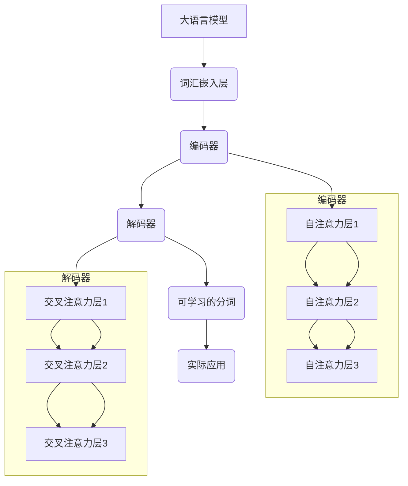

                 

### 引言与核心概念

#### 引言

大语言模型（Large Language Model，简称LLM）是近年来自然语言处理（Natural Language Processing，简称NLP）领域的一项重要突破。大语言模型通过学习海量文本数据，可以生成高质量的自然语言文本，实现诸如文本生成、机器翻译、情感分析、文本分类等任务。其中，可学习的分词技术作为大语言模型的重要组成部分，对于提高模型性能和实际应用效果具有至关重要的作用。

可学习的分词技术是指利用深度学习等算法，对文本进行自动切分，将连续的字符串转化为具有独立语义意义的词语序列。相比传统的基于规则或统计方法的分词技术，可学习分词技术具有更强的自适应性和泛化能力，可以更好地处理复杂多变的文本数据。

本文将系统地介绍大语言模型和可学习的分词技术，分为以下几个部分：

1. **大语言模型的基本原理**：包括大语言模型的定义、历史与发展、架构等。
2. **可学习的分词技术**：介绍分词的基本概念、方法及其在深度学习中的应用。
3. **大语言模型的核心算法**：包括语言模型、生成式模型与判别式模型、编码器-解码器模型等。
4. **大语言模型的训练与优化**：介绍训练数据准备、训练算法与技巧、训练过程中的挑战等。
5. **大语言模型的评估与改进**：讨论评估指标、模型改进方法等。
6. **可学习的分词在实际应用中的挑战与解决方案**：分析分词在实际应用中面临的挑战及解决方案。
7. **大语言模型与可学习分词的前沿研究与发展趋势**：探讨当前的前沿研究动态及未来发展趋势。

通过本文的介绍，读者可以全面了解大语言模型和可学习的分词技术的基本原理、核心算法及其在实际应用中的挑战和解决方案，为深入研究和应用这些技术提供参考。

#### 大语言模型的定义与重要性

大语言模型是一种基于深度学习的自然语言处理模型，旨在学习自然语言的统计规律和语义信息，从而生成或理解自然语言文本。其核心思想是通过大量文本数据的训练，使模型能够理解和生成符合人类语言习惯的文本。

大语言模型的重要性主要体现在以下几个方面：

1. **文本生成**：大语言模型可以生成高质量的自然语言文本，广泛应用于文本生成、文章撰写、对话系统等领域。例如，生成新闻文章、小说、诗歌等创意性文本，为内容创作者提供灵感和辅助。
   
2. **机器翻译**：大语言模型在机器翻译领域有着广泛的应用，通过学习多语言语料库，可以实现高精度的机器翻译。例如，谷歌翻译、百度翻译等知名翻译工具，都基于大语言模型进行翻译任务的执行。

3. **情感分析**：大语言模型可以识别文本中的情感倾向，用于情感分析、舆情监测等应用。例如，通过分析社交媒体上的评论、新闻文章等，可以了解公众对特定事件或产品的情感态度。

4. **文本分类**：大语言模型可以用于对文本进行分类，如垃圾邮件过滤、新闻分类、情感分类等。通过训练模型，可以自动识别文本的主题和内容，提高信息处理的效率。

5. **问答系统**：大语言模型可以构建智能问答系统，通过学习大量问答数据，实现对用户问题的理解和回答。例如，智能客服系统、在线教育平台中的问答系统等。

6. **辅助创作**：大语言模型可以帮助创作者生成创意性的文本内容，如文章、音乐、绘画等，提高创作效率和质量。

7. **自然语言理解**：大语言模型可以用于理解和解析自然语言，实现对文本的语义分析、实体识别等任务，为智能助手、聊天机器人等应用提供支持。

总之，大语言模型在自然语言处理领域的应用非常广泛，其发展水平直接影响到人工智能技术的发展。随着大语言模型技术的不断进步，其在各行业中的应用潜力将进一步释放，为人类生活带来更多便利和智慧。

#### 可学习的分词的概念与背景

分词是自然语言处理（NLP）中的一个基础且关键的任务，它旨在将连续的文本序列切分成具有独立语义意义的词语序列。准确地进行分词，对于后续的文本处理任务，如文本分类、情感分析、命名实体识别等，具有至关重要的意义。传统的分词方法主要基于规则和统计模型，但受限于规则库的有限性和统计模型的适应性，它们在处理复杂、多变的文本数据时，往往难以满足高精度的要求。

可学习的分词技术，是一种基于深度学习的分词方法，通过大规模的数据训练，使模型能够自动学习并优化分词规则，从而实现高效、准确的文本切分。相比传统的分词方法，可学习的分词技术具有以下几个显著优势：

1. **自适应性强**：可学习的分词模型可以自动从大量文本数据中学习到适应不同语言和文本风格的分词规则，能够应对多样化的文本数据。

2. **泛化能力**：通过深度学习算法，模型可以从训练数据中提取出通用的分词模式，使其在未见数据上也能保持较高的分词精度。

3. **灵活性高**：可学习的分词模型可以灵活地处理长句、多义词等复杂文本，提高分词的准确性和一致性。

4. **实时性好**：深度学习模型的计算效率不断提高，使得可学习的分词技术可以应用于实时性要求高的应用场景，如在线聊天机器人、实时翻译等。

可学习的分词技术的背景可以追溯到深度学习在NLP领域的广泛应用。随着深度学习技术的迅猛发展，特别是在语音识别、图像识别等领域取得了显著成果，研究人员开始探索将深度学习应用于文本处理任务，如分词。2018年，Google Research团队提出了一种名为“BERT”（Bidirectional Encoder Representations from Transformers）的预训练模型，它通过双向编码器结构，在大量未标注的文本数据上进行预训练，显著提升了文本分类、问答等任务的性能。BERT的成功应用，也为可学习的分词技术提供了重要的理论支撑和技术路径。

具体来说，可学习的分词技术主要依赖于以下几种深度学习算法：

1. **循环神经网络（RNN）**：RNN通过递归结构，能够处理序列数据，其变体如LSTM（Long Short-Term Memory）和GRU（Gated Recurrent Unit），能够有效地捕捉长距离依赖信息，提高分词的精度。

2. **卷积神经网络（CNN）**：CNN擅长处理局部特征，通过卷积操作提取文本中的关键特征，结合全局特征，实现对文本序列的准确切分。

3. **Transformer架构**：Transformer模型通过自注意力机制，能够并行处理文本序列，提高了分词的速度和性能。BERT等大型预训练模型就是基于Transformer架构进行设计的。

4. **基于BERT的细粒度分词**：BERT通过预训练和微调，可以捕捉到文本中的细粒度特征，实现对复杂文本的高精度分词。

总之，可学习的分词技术凭借其强大的自适应性和灵活性，已经成为NLP领域的重要工具，为各类文本处理任务提供了强有力的支持。随着深度学习技术的不断进步，可学习的分词技术将在NLP领域发挥更加重要的作用，推动自然语言处理技术的持续创新和发展。

### 大语言模型的基本原理

#### 大语言模型的历史与发展

大语言模型的发展历程可以追溯到20世纪80年代，当时研究人员开始探索基于规则的方法来处理自然语言。这些方法包括短语结构语法、上下文无关文法等，但它们在处理复杂文本和变体方面存在局限性。随着计算能力的提升和机器学习技术的发展，统计模型逐渐成为主流。1986年，Rumelhart、Hinton和Williams提出了反向传播算法，这一算法使得多层神经网络能够有效训练，为深度学习的发展奠定了基础。

2002年，Bengio等人提出了神经网络语言模型（Neural Network Language Model，简称NNLM），这是深度学习在自然语言处理领域的重要开端。NNLM通过多层感知机（Multilayer Perceptron，简称MLP）来预测下一个单词，并在一定程度上提升了语言模型的性能。然而，由于计算资源和数据限制，早期深度学习模型的规模有限，无法处理大规模的文本数据。

2013年，Word2Vec算法的提出使得词嵌入（Word Embedding）技术得以广泛应用。Word2Vec通过神经网络将词汇映射到高维向量空间，使得向量间的距离能够反映词汇之间的语义关系。这一技术不仅提高了语言模型的性能，也为后续的大规模语言模型提供了重要基础。

2018年，Google Research团队发表了BERT（Bidirectional Encoder Representations from Transformers）论文，标志着大语言模型的一个重要里程碑。BERT通过双向Transformer结构，在大量未标注的文本数据上进行预训练，再通过微调适应特定任务，显著提升了自然语言处理任务的性能。BERT的成功激发了研究人员对大规模预训练模型的研究热情，催生了诸如GPT（Generative Pre-trained Transformer）和RoBERTa（A Robustly Optimized BERT Pretraining Approach）等后续模型。

大语言模型的发展不仅依赖于计算能力和数据量的提升，还受益于神经网络和深度学习技术的进步。Transformer架构的提出，使得模型能够并行处理文本序列，大幅提高了训练效率和性能。随着模型参数量和计算资源的不断增加，大语言模型的规模和复杂度也在不断提升，目前已有数十亿参数的模型被广泛应用。

#### 大语言模型的架构

大语言模型通常由以下几个关键部分组成：词汇嵌入层、编码器和解码器。每个部分在模型中扮演着不同的角色，共同协作实现高质量的文本生成和理解。

1. **词汇嵌入层（Embedding Layer）**：
   词汇嵌入层是将输入的单词映射到高维向量空间的过程。通过这种方式，单词间的语义关系可以通过向量间的距离来表示。早期的词汇嵌入方法如Word2Vec，使用单层神经网络将词汇映射到固定长度的向量。近年来，随着Transformer架构的流行，预训练模型通常使用多层嵌入层，并且引入了位置编码（Positional Encoding）来捕捉单词在序列中的位置信息。

   例如，假设我们使用128维的嵌入层，每个单词映射为一个128维的向量。输入序列中的每个单词都会通过嵌入层转换成对应的向量表示。这一步不仅有助于模型理解和表示单词的语义信息，还能在一定程度上减轻数据稀疏性问题。

2. **编码器（Encoder）**：
   编码器是模型的核心部分，负责将输入序列编码为固定长度的向量表示。在Transformer架构中，编码器通常由多个自注意力层（Self-Attention Layer）组成。自注意力机制允许模型在编码过程中捕捉到序列中的长距离依赖关系，使得每个单词的表示能够融入上下文信息。

   自注意力机制的计算过程如下：
   $$ 
   \text{Attention}(Q, K, V) = \text{softmax}\left(\frac{QK^T}{\sqrt{d_k}}\right)V 
   $$
   其中，$Q, K, V$ 分别是编码器的查询（Query）、键（Key）和值（Value）向量。$d_k$ 是键向量的维度。通过自注意力计算，编码器能够将输入序列中的每个单词与所有单词进行比较，并根据上下文关系计算权重，从而生成一个综合的向量表示。

3. **解码器（Decoder）**：
   解码器负责生成预测的文本序列。在Transformer架构中，解码器同样由多个自注意力层和交叉注意力层（Cross-Attention Layer）组成。交叉注意力机制使得解码器在生成每个单词时，能够关注编码器生成的上下文信息。

   交叉注意力机制的计算过程如下：
   $$
   \text{Attention}_{\text{cross}}(Q, K, V) = \text{softmax}\left(\frac{QK^T}{\sqrt{d_k}}\right)V
   $$
   其中，$Q$ 是解码器的查询向量，$K$ 和 $V$ 分别是编码器的键和值向量。通过交叉注意力计算，解码器能够将当前生成的单词与编码器输出的上下文信息进行匹配，从而生成更加精确的预测。

大语言模型的完整工作流程可以概括为以下几个步骤：

1. **输入处理**：将输入文本序列转换为词嵌入向量。
2. **编码**：通过编码器处理输入序列，生成上下文向量表示。
3. **解码**：在解码器中逐词生成预测文本序列，每个词的生成都依赖于编码器输出的上下文信息。
4. **输出生成**：解码器生成最终预测文本序列。

这种架构使得大语言模型能够高效地处理长文本，并生成具有高保真度的自然语言文本。编码器-解码器结构在语言生成和理解任务中表现出了强大的能力，成为当前NLP领域的主流架构。

#### 词汇嵌入层

词汇嵌入层是大规模语言模型中最基础的组成部分，其主要功能是将输入的单词映射为高维向量表示。这一过程不仅有助于模型理解和表示单词的语义信息，还能在一定程度上缓解数据稀疏性问题。

1. **单词嵌入的概念**：
   单词嵌入（Word Embedding）是指将词汇映射到高维向量空间的技术。通过这种方式，模型可以学习到单词间的语义关系，例如，相似单词的向量距离更近，而意义相反的单词距离更远。早期的单词嵌入方法如Word2Vec，使用单层神经网络将单词映射到固定长度的向量。近年来，随着深度学习技术的发展，多层嵌入层和位置编码（Positional Encoding）等技术被广泛应用。

2. **Word2Vec算法**：
   Word2Vec是一种基于神经网络的语言模型，它通过预测目标词周围词的概率来训练词向量。Word2Vec主要包括两种训练方法：连续词袋（Continuous Bag of Words，CBOW）和Skip-Gram。

   - **CBOW（Continuous Bag of Words）**：
     CBOW方法通过预测中心词周围的词来学习词向量。具体来说，给定一个中心词，模型会预测中心词周围多个词（通常设定一个窗口大小）的集合。词向量的平均值被用作输入，通过神经网络输出预测词的词向量。其计算过程如下：
     $$
     \text{Average} = \frac{1}{n}\sum_{i=1}^{n} \text{embedding}_{\text{context\_word}_i}
     $$
     $$
     \text{softmax}(\text{model}(\text{Average}))
     $$
     其中，$\text{embedding}_{\text{context\_word}_i}$ 表示窗口中第 $i$ 个上下文词的嵌入向量，$n$ 是上下文词的数量。

   - **Skip-Gram**：
     Skip-Gram方法与CBOW相反，它通过预测中心词来学习词向量。给定一个单词，模型会预测与其距离在设定窗口大小内的所有单词。输入是中心词的嵌入向量，输出是上下文词的嵌入向量。其计算过程如下：
     $$
     \text{softmax}(\text{model}(\text{embedding}_{\text{center\_word}}))
     $$
     其中，$\text{embedding}_{\text{center\_word}}$ 是中心词的嵌入向量。

3. **多层嵌入层**：
   随着Transformer架构的流行，多层嵌入层（Multi-Layer Embedding）成为大规模语言模型的标准配置。多层嵌入层通过堆叠多个嵌入层，不仅能够加深模型的表达能力，还能学习到更加丰富的语义信息。

   在多层嵌入层中，每个嵌入层都可以视为一个线性变换层，将上一层的输出映射到新的空间。这种堆叠方式类似于神经网络中的全连接层，可以有效地提取文本的层次结构信息。

4. **位置编码（Positional Encoding）**：
   为了捕捉输入文本序列中的位置信息，语言模型通常引入位置编码（Positional Encoding）。位置编码是一种固定长度的向量，与词汇嵌入向量相加，从而在每个嵌入层中引入位置信息。

   位置编码通常使用正弦和余弦函数生成，其公式如下：
   $$
   \text{PE}(pos, 2i) = \sin\left(\frac{pos}{10000^{2i/d}}\right)
   $$
   $$
   \text{PE}(pos, 2i+1) = \cos\left(\frac{pos}{10000^{2i/d}}\right)
   $$
   其中，$pos$ 是单词的位置，$i$ 是维度索引，$d$ 是嵌入层的维度。

通过引入多层嵌入层和位置编码，语言模型能够更好地理解和生成具有位置信息的文本序列，提高模型的性能和泛化能力。

### 编码器

编码器（Encoder）在大语言模型中起着至关重要的作用，其核心功能是将输入文本序列编码为固定长度的向量表示。这一过程不仅有助于模型理解输入文本的语义信息，还为其在解码器（Decoder）中的任务奠定了基础。编码器通常由多个自注意力层（Self-Attention Layer）组成，这使得模型能够捕捉到序列中的长距离依赖关系，从而生成高质量的文本。

#### 自注意力层（Self-Attention Layer）

自注意力层是编码器的核心组成部分，它允许模型在处理每个输入单词时，自动关注序列中的其他单词。这种机制使编码器能够捕捉到单词之间的复杂依赖关系，从而提高模型的表达能力。自注意力机制的计算过程如下：

$$
\text{Attention}(Q, K, V) = \text{softmax}\left(\frac{QK^T}{\sqrt{d_k}}\right)V
$$

其中，$Q, K, V$ 分别是编码器的查询（Query）、键（Key）和值（Value）向量，$d_k$ 是键向量的维度。具体来说，自注意力层的计算过程包括以下几个步骤：

1. **计算查询（Query）和键（Key）**：
   编码器的每个输入单词都会通过一个线性变换层生成查询（Query）和键（Key）向量：
   $$
   \text{Query} = \text{model}_{\text{linear}}(X) \cdot \text{W}_Q
   $$
   $$
   \text{Key} = \text{model}_{\text{linear}}(X) \cdot \text{W}_K
   $$
   其中，$X$ 是输入文本序列，$\text{W}_Q$ 和 $\text{W}_K$ 是线性变换层的权重矩阵。

2. **计算得分（Score）**：
   使用查询（Query）和键（Key）向量计算得分，并应用softmax函数进行归一化：
   $$
   \text{Score} = \text{Attention}(Q, K, V) = \text{softmax}\left(\frac{QK^T}{\sqrt{d_k}}\right)V
   $$
   得分表示每个输入单词与其他单词之间的关系强度。

3. **计算输出（Value）**：
   根据得分加权合并值（Value）向量，生成自注意力层的输出：
   $$
   \text{Output} = \sum_{i=1}^{N} \text{Score}_i V_i
   $$
   其中，$V_i$ 是输入文本序列中的第 $i$ 个单词的值向量，$N$ 是输入单词的数量。

自注意力层的输出是一个固定长度的向量，它综合了输入序列中所有单词的信息，并赋予了不同的权重。通过这种方式，编码器能够有效地捕捉到序列中的长距离依赖关系，从而生成具有丰富语义信息的向量表示。

#### 多个自注意力层堆叠

在实际应用中，编码器通常包含多个自注意力层，这些层通过逐层堆叠，可以进一步加深模型的表达能力。每个自注意力层都会将前一层输出的向量作为输入，并进行类似的计算。具体来说，多层自注意力层的计算过程如下：

$$
\text{Output}_{l+1} = \text{Attention}(\text{Query}_{l+1}, \text{Key}_{l+1}, \text{Value}_{l+1})
$$

其中，$\text{Query}_{l+1}, \text{Key}_{l+1}, \text{Value}_{l+1}$ 分别是第 $l+1$ 层的查询、键和值向量，它们通过前一层输出的向量进行线性变换得到。

通过这种方式，每个自注意力层都能够从不同层次上捕捉到输入序列中的依赖关系，从而生成更加丰富的语义表示。多层自注意力层堆叠不仅增强了模型的表达能力，还提高了其在复杂任务中的性能。

#### 编码器的整体结构

编码器的整体结构通常包括多个自注意力层和全连接层。自注意力层用于捕捉输入序列中的依赖关系，而全连接层则用于对自注意力层的输出进行进一步处理和压缩。具体来说，编码器的结构可以表示为：

$$
\text{Encoder} = \stackrel{\text{多层自注意力层}}{\underbrace{\text{Self-Attention} \rightarrow \text{Self-Attention} \rightarrow \ldots}} \rightarrow \text{Feed-Forward Layer}
$$

其中，每个自注意力层都会将输入向量经过自注意力机制处理，然后通过全连接层进行进一步处理。全连接层通常包含两个线性变换层和一个ReLU激活函数，用于对输入向量进行非线性变换。

通过这种方式，编码器能够从不同层次上捕捉到输入序列中的信息，生成固定长度的向量表示。这一向量表示不仅包含了输入序列的语义信息，还反映了序列中的长距离依赖关系，为解码器（Decoder）中的任务提供了强有力的支持。

总之，编码器通过自注意力机制和多层堆叠，能够有效捕捉输入序列中的复杂依赖关系，生成具有丰富语义信息的向量表示。这一结构使得编码器在大语言模型中发挥了关键作用，为语言生成和理解任务提供了强有力的工具。

### 解码器

解码器（Decoder）在大语言模型中起着至关重要的作用，其核心功能是从编码器生成的上下文向量中生成预测的文本序列。解码器的设计与编码器密切相关，通常采用类似的注意力机制，以便能够有效利用编码器的上下文信息。解码器的架构通常包含多个自注意力层和交叉注意力层，通过这些层，模型能够逐步生成预测的文本序列。

#### 自注意力层（Self-Attention Layer）

自注意力层是解码器的核心组成部分，它允许模型在生成每个预测单词时，自动关注序列中的其他单词。这种机制使解码器能够捕捉到单词之间的复杂依赖关系，从而提高生成文本的质量。自注意力层的计算过程与编码器中的自注意力层相似，其计算公式如下：

$$
\text{Attention}(Q, K, V) = \text{softmax}\left(\frac{QK^T}{\sqrt{d_k}}\right)V
$$

其中，$Q, K, V$ 分别是解码器的查询（Query）、键（Key）和值（Value）向量，$d_k$ 是键向量的维度。具体来说，自注意力层的计算过程包括以下几个步骤：

1. **计算查询（Query）和键（Key）**：
   解码器的每个输入单词（通常包括上一个时间步的预测单词和编码器的上下文向量）都会通过一个线性变换层生成查询（Query）和键（Key）向量：
   $$
   \text{Query} = \text{model}_{\text{linear}}(\text{Context}) \cdot \text{W}_Q
   $$
   $$
   \text{Key} = \text{model}_{\text{linear}}(\text{Context}) \cdot \text{W}_K
   $$
   其中，$\text{Context}$ 是当前解码器的输入，$\text{W}_Q$ 和 $\text{W}_K$ 是线性变换层的权重矩阵。

2. **计算得分（Score）**：
   使用查询（Query）和键（Key）向量计算得分，并应用softmax函数进行归一化：
   $$
   \text{Score} = \text{Attention}(Q, K, V) = \text{softmax}\left(\frac{QK^T}{\sqrt{d_k}}\right)V
   $$
   得分表示每个输入单词与其他单词之间的关系强度。

3. **计算输出（Value）**：
   根据得分加权合并值（Value）向量，生成自注意力层的输出：
   $$
   \text{Output} = \sum_{i=1}^{N} \text{Score}_i V_i
   $$
   其中，$V_i$ 是输入文本序列中的第 $i$ 个单词的值向量，$N$ 是输入单词的数量。

自注意力层的输出是一个固定长度的向量，它综合了输入序列中所有单词的信息，并赋予了不同的权重。通过这种方式，解码器能够有效地捕捉到序列中的长距离依赖关系，从而生成更加精确的预测。

#### 交叉注意力层（Cross-Attention Layer）

交叉注意力层是解码器中的另一个关键部分，它允许模型在生成每个预测单词时，关注编码器生成的上下文向量。这种机制使得解码器能够利用编码器的上下文信息，从而生成更加高质量的文本。交叉注意力层的计算过程与自注意力层类似，但其查询（Query）向量来自解码器，而键（Key）和值（Value）向量来自编码器。

交叉注意力层的计算公式如下：

$$
\text{Attention}_{\text{cross}}(Q, K, V) = \text{softmax}\left(\frac{QK^T}{\sqrt{d_k}}\right)V
$$

其中，$Q$ 是解码器的查询向量，$K$ 和 $V$ 分别是编码器的键和值向量。交叉注意力层的计算过程包括以下几个步骤：

1. **计算查询（Query）**：
   解码器的每个输入单词都会通过一个线性变换层生成查询向量：
   $$
   \text{Query} = \text{model}_{\text{linear}}(\text{Context}) \cdot \text{W}_Q
   $$

2. **计算得分（Score）**：
   使用查询（Query）和编码器的键（Key）向量计算得分：
   $$
   \text{Score} = \text{Attention}_{\text{cross}}(Q, K, V) = \text{softmax}\left(\frac{QK^T}{\sqrt{d_k}}\right)V
   $$

3. **计算输出（Value）**：
   根据得分加权合并编码器的值（Value）向量，生成交叉注意力层的输出：
   $$
   \text{Output} = \sum_{i=1}^{N} \text{Score}_i V_i
   $$

交叉注意力层的输出是编码器上下文向量的加权合并结果，它反映了编码器在当前输入单词下的上下文信息。通过这种方式，解码器能够利用编码器的上下文信息，生成更加准确的预测。

#### 多个自注意力层和交叉注意力层堆叠

在实际应用中，解码器通常包含多个自注意力层和交叉注意力层，这些层通过逐层堆叠，可以进一步加深模型的表达能力。每个注意力层都会将前一层输出的向量作为输入，并进行类似的计算。具体来说，多层注意力层的计算过程如下：

$$
\text{Output}_{l+1} = \text{Attention}_{l+1}(\text{Query}_{l+1}, \text{Key}_{l+1}, \text{Value}_{l+1})
$$

其中，$\text{Query}_{l+1}, \text{Key}_{l+1}, \text{Value}_{l+1}$ 分别是第 $l+1$ 层的查询、键和值向量。

通过这种方式，每个注意力层都能够从不同层次上捕捉到输入序列中的依赖关系，从而生成更加丰富的语义表示。多层注意力层堆叠不仅增强了模型的表达能力，还提高了其在复杂任务中的性能。

#### 解码器的整体结构

解码器的整体结构通常包括多个自注意力层和交叉注意力层，以及全连接层。自注意力层用于捕捉序列中的依赖关系，交叉注意力层用于利用编码器的上下文信息，而全连接层则用于对注意力层的输出进行进一步处理和压缩。具体来说，解码器的结构可以表示为：

$$
\text{Decoder} = \stackrel{\text{多层自注意力层}}{\underbrace{\text{Self-Attention} \rightarrow \text{Self-Attention} \rightarrow \ldots}} \rightarrow \stackrel{\text{多层交叉注意力层}}{\underbrace{\text{Cross-Attention} \rightarrow \text{Cross-Attention} \rightarrow \ldots}} \rightarrow \text{Feed-Forward Layer}
$$

其中，每个自注意力层和交叉注意力层都会将输入向量经过注意力机制处理，然后通过全连接层进行进一步处理。全连接层通常包含两个线性变换层和一个ReLU激活函数，用于对输入向量进行非线性变换。

通过这种方式，解码器能够从不同层次上捕捉到输入序列中的信息，并生成具有丰富语义信息的文本序列。这一结构使得解码器在大语言模型中发挥了关键作用，为语言生成和理解任务提供了强有力的工具。

总之，解码器通过自注意力层和交叉注意力层，能够有效利用编码器的上下文信息，逐步生成高质量的文本序列。这种结构不仅增强了模型的表达能力，还提高了其在复杂任务中的性能，为大规模语言模型的应用提供了坚实的基础。

### 可学习的分词技术

#### 分词的基本概念

分词（Tokenization）是自然语言处理（NLP）中的一个基础且关键的任务，其核心目标是把连续的文本序列切分成具有独立语义意义的词语序列。准确地进行分词，对于后续的文本处理任务，如文本分类、情感分析、命名实体识别等，具有至关重要的意义。

分词的目标可以分为两个层面：

1. **词边界识别**：识别出文本中的词边界，即将文本序列切分成一个一个的单词。
2. **词义标注**：为每个切分出的单词赋予相应的语义信息，如词性、情感极性等。

分词面临的挑战主要包括：

1. **多义性**：许多词汇在语境中具有多种含义，需要根据上下文进行准确的词义判断。
2. **长句处理**：长句中的词汇和结构更加复杂，分词时需要考虑词汇间的长距离依赖关系。
3. **歧义处理**：在文本中存在许多歧义词汇和结构，需要根据上下文信息进行准确的分词。
4. **实时性要求**：某些应用场景对分词速度有较高要求，需要在短时间内完成大量文本的分词任务。

分词的方法可以大致分为以下几类：

1. **基于规则的方法**：通过预定义的规则，如正则表达式、词汇表匹配等，对文本进行切分。这类方法的优点是实现简单、效率高，但受限于规则库的有限性，难以处理复杂多变的文本数据。
2. **基于统计的方法**：利用统计模型，如隐马尔可夫模型（HMM）、条件随机场（CRF）等，通过训练大量标注数据，学习到文本的分词模式。这类方法具有较强的适应性和泛化能力，但需要大量标注数据支持。
3. **基于深度学习的方法**：通过深度学习模型，如循环神经网络（RNN）、卷积神经网络（CNN）和Transformer等，自动学习文本的分词模式。这类方法具有更强的自适应性和泛化能力，能够处理复杂多变的文本数据，但训练和推理成本较高。

#### 分词的方法与类型

1. **基于规则的方法**

   基于规则的方法是通过预定义的规则，如正则表达式、词汇表匹配等，对文本进行切分。这类方法的优点是实现简单、效率高，但受限于规则库的有限性，难以处理复杂多变的文本数据。

   - **正则表达式分词**：利用正则表达式匹配文本中的特定模式，将其切分成单词。这种方法需要设计合适的正则表达式，以便准确识别文本中的词边界。

     例如，假设文本序列为：“我今天去了超市。”，可以使用以下正则表达式进行分词：
     ```
     (\w+)|[，。！？]
     ```

     这个正则表达式的意思是，匹配一个单词（\w+）或者标点符号（[，。！？]），从而将文本序列切分成“我”、“今天”、“去”、“了”、“超市”和标点符号。

   - **词汇表匹配分词**：通过预定义的词汇表，对文本进行逐词匹配，将匹配到的词汇切分成单词。这种方法适用于处理已知词汇，但对于未知词汇或新词汇，分词效果较差。

2. **基于统计的方法**

   基于统计的方法通过训练统计模型，如隐马尔可夫模型（HMM）、条件随机场（CRF）等，从大量标注数据中学习到文本的分词模式。这类方法具有较强的适应性和泛化能力，但需要大量标注数据支持。

   - **隐马尔可夫模型（HMM）分词**：HMM是一种概率模型，用于描述序列数据的生成过程。在分词任务中，HMM通过观察序列（文本）和隐藏状态（词）之间的转移概率和发射概率，实现对文本的分词。

     HMM分词的算法主要包括两个步骤：

     1. **训练**：通过标注数据训练HMM模型，学习到词序列的概率分布。
     2. **解码**：给定一个未标注的文本序列，通过Viterbi算法找出最有可能的词序列。

   - **条件随机场（CRF）分词**：CRF是一种基于概率的图模型，用于序列标注任务。在分词任务中，CRF通过学习词序列和词标签之间的条件概率，实现对文本的分词。

     CRF分词的算法主要包括两个步骤：

     1. **训练**：通过标注数据训练CRF模型，学习到词序列和词标签之间的条件概率分布。
     2. **解码**：给定一个未标注的文本序列，通过最大后验概率（MAP）推断出最有可能的词序列。

3. **基于深度学习的方法**

   基于深度学习的方法通过训练深度学习模型，如循环神经网络（RNN）、卷积神经网络（CNN）和Transformer等，自动学习文本的分词模式。这类方法具有更强的自适应性和泛化能力，能够处理复杂多变的文本数据，但训练和推理成本较高。

   - **循环神经网络（RNN）分词**：RNN是一种用于处理序列数据的神经网络，其变体如LSTM（Long Short-Term Memory）和GRU（Gated Recurrent Unit），能够有效地捕捉长距离依赖关系。在分词任务中，RNN通过输入文本序列，输出词序列的标签。

     RNN分词的算法主要包括两个步骤：

     1. **训练**：通过标注数据训练RNN模型，学习到词序列和词标签之间的映射关系。
     2. **解码**：给定一个未标注的文本序列，通过RNN模型输出词序列的标签。

   - **卷积神经网络（CNN）分词**：CNN是一种用于处理图像的神经网络，其核心思想是局部特征提取。在分词任务中，CNN通过卷积操作提取文本序列中的关键特征，然后通过全连接层输出词序列的标签。

     CNN分词的算法主要包括两个步骤：

     1. **训练**：通过标注数据训练CNN模型，学习到词序列和词标签之间的映射关系。
     2. **解码**：给定一个未标注的文本序列，通过CNN模型输出词序列的标签。

   - **Transformer分词**：Transformer是一种基于自注意力机制的深度学习模型，其核心思想是并行处理文本序列。在分词任务中，Transformer通过自注意力机制捕捉到文本序列中的依赖关系，从而生成词序列的标签。

     Transformer分词的算法主要包括两个步骤：

     1. **训练**：通过标注数据训练Transformer模型，学习到词序列和词标签之间的映射关系。
     2. **解码**：给定一个未标注的文本序列，通过Transformer模型输出词序列的标签。

综上所述，不同的分词方法各有优缺点，基于规则的方法适用于处理已知词汇，基于统计的方法具有较强的适应性和泛化能力，基于深度学习的方法具有更强的自适应性和泛化能力。在实际应用中，可以根据任务需求和数据特点，选择合适的分词方法。

### 基于规则的分词算法

基于规则的分词算法是一种传统的分词方法，其主要依赖于预定义的规则，如正则表达式、词汇表匹配等，对文本进行切分。这种方法简单高效，但在处理复杂多变的文本数据时，可能面临一定的局限性。

#### 基本原理

基于规则的分词算法主要通过以下几个步骤进行文本切分：

1. **正则表达式匹配**：
   正则表达式是一种用于描述字符串模式的工具，通过编写特定的正则表达式，可以匹配文本中的特定模式。常见的正则表达式模式包括单词、数字、标点符号等。

2. **词汇表匹配**：
   词汇表是一种预定义的单词列表，用于匹配文本中的已知词汇。通过逐词匹配，可以快速切分出文本中的单词。

3. **规则组合**：
   基于规则的分词算法通常结合多种规则，以适应不同的文本场景。例如，在处理中文文本时，可以同时使用正则表达式和词汇表匹配，以提高分词的准确性。

#### 工作流程

基于规则的分词算法的工作流程可以分为以下几个步骤：

1. **预处理**：
   对输入文本进行预处理，包括去除空白字符、标点符号等。预处理步骤有助于简化文本结构，提高分词效率。

2. **正则表达式匹配**：
   使用预定义的正则表达式，逐个匹配文本中的模式。匹配到的模式会被切分成独立的单元，如单词、数字等。

3. **词汇表匹配**：
   将文本中的每个单元与预定义的词汇表进行匹配，将匹配到的单元切分成单词。

4. **规则组合**：
   根据不同的文本场景，组合使用多种规则，以提高分词的准确性。例如，在处理中文文本时，可以同时使用正则表达式和词汇表匹配。

5. **后处理**：
   对切分后的文本进行后处理，包括去除多余空格、合并相邻的标点符号等。后处理步骤有助于提高文本的整洁度和可读性。

#### 优点与局限性

基于规则的分词算法具有以下几个优点：

1. **实现简单**：
   基于规则的方法通常只需要编写少量的代码，实现过程相对简单。

2. **高效**：
   正则表达式和词汇表匹配可以快速处理文本数据，具有较高的分词效率。

3. **适用于已知词汇**：
   基于规则的方法适用于处理已知词汇，可以在短时间内完成大量文本的分词任务。

然而，基于规则的分词算法也存在一些局限性：

1. **规则库的有限性**：
   预定义的规则库可能无法覆盖所有可能的文本场景，导致分词效果不佳。

2. **复杂文本的处理能力有限**：
   对于复杂多变的文本数据，基于规则的方法可能难以准确切分，容易出现误切或漏切现象。

3. **自适应性和泛化能力较差**：
   基于规则的方法通常依赖于预定义的规则，难以适应新的文本场景，泛化能力有限。

综上所述，基于规则的分词算法在实现简单和高效方面具有优势，但受限于规则库的有限性和复杂文本的处理能力，其在实际应用中可能面临一定的局限性。

#### 基于统计模型的分词算法

基于统计模型的分词算法是一种利用统计学方法对文本进行切分的分词技术，通过训练模型，自动学习文本的分词模式。这类方法具有自适应性和泛化能力，能够处理复杂多变的文本数据，但需要大量的标注数据支持。

#### 常见算法

1. **隐马尔可夫模型（HMM）分词**：

   隐马尔可夫模型（HMM）是一种概率模型，用于描述序列数据的生成过程。在分词任务中，HMM通过观察序列（文本）和隐藏状态（词）之间的转移概率和发射概率，实现对文本的分词。

   - **训练过程**：

     HMM的训练过程主要包括两个步骤：

     1. **初始状态概率**：根据标注数据，计算每个隐藏状态（词）的初始状态概率。
     2. **状态转移概率和发射概率**：根据标注数据，计算相邻隐藏状态之间的转移概率和每个隐藏状态的发射概率。

     假设我们有一个标注数据集，包含多个文本序列和对应的词序列。通过训练，可以学习到每个词序列的概率分布，从而为分词提供依据。

   - **解码过程**：

     给定一个未标注的文本序列，通过Viterbi算法找出最有可能的词序列。Viterbi算法的基本思想是，在当前时刻，选择概率最大的前一个状态，然后递归地计算出整个序列的最优状态序列。

2. **条件随机场（CRF）分词**：

   条件随机场（CRF）是一种基于概率的图模型，用于序列标注任务。在分词任务中，CRF通过学习词序列和词标签之间的条件概率，实现对文本的分词。

   - **训练过程**：

     CRF的训练过程主要包括两个步骤：

     1. **建立模型**：根据标注数据，建立词序列和词标签之间的条件概率模型。
     2. **参数学习**：通过最大似然估计（Maximum Likelihood Estimation，简称MLE）或马尔可夫链蒙特卡罗（Markov Chain Monte Carlo，简称MCMC）等方法，学习模型的参数。

     假设我们有一个标注数据集，包含多个文本序列和对应的词序列。通过训练，可以学习到每个词序列的条件概率分布，从而为分词提供依据。

   - **解码过程**：

     给定一个未标注的文本序列，通过最大后验概率（Maximum a Posteriori，简称MAP）推断出最有可能的词序列。MAP算法的基本思想是，在当前时刻，选择概率最大的词序列，然后递归地计算出整个序列的最优状态序列。

3. **基于统计的词向量分词**：

   基于统计的词向量分词方法通过训练词向量模型，将文本序列转换为向量表示，然后利用向量相似性进行分词。常见的词向量模型包括Word2Vec、GloVe等。

   - **训练过程**：

     通过训练词向量模型，将文本序列转换为向量表示。训练过程中，利用大量的文本数据，学习到词汇之间的相似性关系。

   - **解码过程**：

     给定一个未标注的文本序列，将其转换为向量表示，然后利用向量相似性进行分词。具体来说，可以通过计算向量之间的余弦相似性，找出最相似的词序列，从而实现分词。

#### 优点与局限性

基于统计模型的分词算法具有以下几个优点：

1. **自适应性和泛化能力**：
   基于统计模型的方法能够从大量标注数据中自动学习到分词模式，具有较强的自适应性和泛化能力。

2. **处理复杂文本**：
   相比于基于规则的方法，基于统计模型的方法能够更好地处理复杂多变的文本数据，如多义词、长句等。

3. **自适应调整**：
   基于统计模型的方法可以通过不断更新模型参数，自适应调整分词规则，以应对新的文本场景。

然而，基于统计模型的分词算法也存在一些局限性：

1. **标注数据依赖**：
   基于统计模型的方法需要大量标注数据支持，数据标注过程繁琐且耗时。

2. **计算复杂度**：
   基于统计模型的方法在训练和推理过程中，可能需要较大的计算资源，特别是在处理大规模文本数据时。

3. **规则适用性**：
   基于统计模型的方法可能无法完全覆盖所有文本场景，对某些特殊情况的分词效果较差。

综上所述，基于统计模型的分词算法在处理复杂文本和自适应调整方面具有优势，但受限于标注数据依赖和计算复杂度，其在实际应用中可能面临一定的挑战。

#### 基于深度学习的分词算法

基于深度学习的分词算法是近年来自然语言处理（NLP）领域的一项重要突破，其通过训练深度神经网络，自动学习文本的分词模式。这类方法具有强大的自适应性和泛化能力，能够处理复杂多变的文本数据，逐渐成为分词任务中的主流技术。

#### 常见算法

1. **循环神经网络（RNN）分词**：

   循环神经网络（RNN）是一种用于处理序列数据的神经网络，其变体如长短期记忆网络（LSTM）和门控循环单元（GRU），能够有效地捕捉长距离依赖关系。在分词任务中，RNN通过输入文本序列，输出词序列的标签。

   - **训练过程**：

     RNN的训练过程主要包括两个步骤：

     1. **编码器训练**：通过输入文本序列，训练RNN模型，学习到文本的向量表示。
     2. **解码器训练**：在编码器的输出向量基础上，训练解码器模型，输出词序列的标签。

     具体来说，可以使用以下伪代码表示RNN分词算法：

     ```python
     # 假设输入文本序列为 X，标签序列为 Y
     # 训练编码器模型
     encoder_model.fit(X, Y)
     
     # 使用编码器模型生成文本向量表示
     text_vectors = encoder_model.predict(X)
     
     # 训练解码器模型
     decoder_model.fit(text_vectors, Y)
     ```

   - **解码过程**：

     给定一个未标注的文本序列，通过RNN模型输出词序列的标签。具体来说，可以使用以下伪代码表示RNN分词的解码过程：

     ```python
     # 假设输入文本序列为 X
     # 生成文本向量表示
     text_vectors = encoder_model.predict(X)
     
     # 使用解码器模型生成词序列标签
     predicted_labels = decoder_model.predict(text_vectors)
     ```

2. **卷积神经网络（CNN）分词**：

   卷积神经网络（CNN）是一种用于处理图像的神经网络，其核心思想是局部特征提取。在分词任务中，CNN通过卷积操作提取文本序列中的关键特征，然后通过全连接层输出词序列的标签。

   - **训练过程**：

     CNN的训练过程主要包括两个步骤：

     1. **特征提取**：通过卷积操作提取文本序列中的关键特征。
     2. **分类**：在特征提取的基础上，通过全连接层输出词序列的标签。

     具体来说，可以使用以下伪代码表示CNN分词算法：

     ```python
     # 假设输入文本序列为 X，标签序列为 Y
     # 训练特征提取模型
     conv_model.fit(X, Y)
     
     # 使用特征提取模型提取文本特征
     text_features = conv_model.extract_features(X)
     
     # 训练分类模型
     classifier_model.fit(text_features, Y)
     ```

   - **解码过程**：

     给定一个未标注的文本序列，通过CNN模型提取文本特征，然后通过分类模型输出词序列的标签。具体来说，可以使用以下伪代码表示CNN分词的解码过程：

     ```python
     # 假设输入文本序列为 X
     # 提取文本特征
     text_features = conv_model.extract_features(X)
     
     # 使用分类模型生成词序列标签
     predicted_labels = classifier_model.predict(text_features)
     ```

3. **Transformer分词**：

   Transformer是一种基于自注意力机制的深度学习模型，其核心思想是并行处理文本序列。在分词任务中，Transformer通过自注意力机制捕捉到文本序列中的依赖关系，从而生成词序列的标签。

   - **训练过程**：

     Transformer的训练过程主要包括两个步骤：

     1. **编码器训练**：通过输入文本序列，训练编码器模型，学习到文本的向量表示。
     2. **解码器训练**：在编码器的输出向量基础上，训练解码器模型，输出词序列的标签。

     具体来说，可以使用以下伪代码表示Transformer分词算法：

     ```python
     # 假设输入文本序列为 X，标签序列为 Y
     # 训练编码器模型
     encoder_model.fit(X, Y)
     
     # 使用编码器模型生成文本向量表示
     text_vectors = encoder_model.predict(X)
     
     # 训练解码器模型
     decoder_model.fit(text_vectors, Y)
     ```

   - **解码过程**：

     给定一个未标注的文本序列，通过编码器模型生成文本向量表示，然后通过解码器模型输出词序列的标签。具体来说，可以使用以下伪代码表示Transformer分词的解码过程：

     ```python
     # 假设输入文本序列为 X
     # 生成文本向量表示
     text_vectors = encoder_model.predict(X)
     
     # 使用解码器模型生成词序列标签
     predicted_labels = decoder_model.predict(text_vectors)
     ```

#### 优点与局限性

基于深度学习的分词算法具有以下几个优点：

1. **自适应性和泛化能力**：
   基于深度学习的方法能够从大量数据中自动学习到分词模式，具有较强的自适应性和泛化能力。

2. **处理复杂文本**：
   相比于传统方法，基于深度学习的方法能够更好地处理复杂多变的文本数据，如多义词、长句等。

3. **并行计算**：
   Transformer等基于自注意力机制的模型可以并行处理文本序列，提高了计算效率。

然而，基于深度学习的分词算法也存在一些局限性：

1. **计算资源需求**：
   深度学习模型通常需要较大的计算资源和时间进行训练和推理，尤其是在处理大规模数据时。

2. **标注数据依赖**：
   基于深度学习的方法需要大量的标注数据支持，数据标注过程繁琐且耗时。

3. **模型可解释性**：
   深度学习模型的内部机制复杂，模型的可解释性较差，难以理解模型的决策过程。

综上所述，基于深度学习的分词算法在处理复杂文本和自适应调整方面具有优势，但受限于计算资源需求和标注数据依赖，其在实际应用中可能面临一定的挑战。

### 语言模型

#### 语言模型的基本概念

语言模型（Language Model，简称LM）是自然语言处理（Natural Language Processing，简称NLP）中的一个核心组件，它旨在预测一段文本序列中下一个单词或字符的概率分布。语言模型的目的是模拟人类语言的自然规律，从而生成或理解符合语言习惯的文本。

语言模型的基本思想是通过大量文本数据学习到单词或字符之间的统计关系，从而预测下一个单词或字符。例如，在给定一个句子“我昨天去了超市”，语言模型可以预测下一个单词可能是“买”或“回家”。

#### 语言模型的主要类型

语言模型可以分为以下几种主要类型：

1. **基于字符的语言模型**：
   字符语言模型（Character-level Language Model）是基于字符的序列模型，将文本序列中的每个字符作为基本单位进行建模。这类模型的优势在于可以捕捉到文本中的细粒度特征，但模型的参数量通常较大，计算复杂度高。

   - **训练方法**：
     基于字符的语言模型通常采用循环神经网络（RNN）或卷积神经网络（CNN）进行训练。例如，可以使用RNN模型对每个字符进行编码，然后通过全连接层输出字符的概率分布。

     伪代码如下：
     ```python
     # 假设输入字符序列为 X，标签序列为 Y
     # 使用RNN模型训练语言模型
     model.fit(X, Y)
     ```

   - **应用场景**：
     字符语言模型在文本生成、自动纠错等领域有广泛应用。例如，可以使用字符语言模型生成创意文本、自动修复文本错误等。

2. **基于单词的语言模型**：
   单词语言模型（Word-level Language Model）是基于单词的序列模型，将文本序列中的每个单词作为基本单位进行建模。这类模型的优势在于模型参数量相对较小，计算复杂度较低，同时能够捕捉到文本的语义信息。

   - **训练方法**：
     基于单词的语言模型通常采用循环神经网络（RNN）或Transformer进行训练。例如，可以使用RNN模型对每个单词进行编码，然后通过全连接层输出单词的概率分布。

     伪代码如下：
     ```python
     # 假设输入单词序列为 X，标签序列为 Y
     # 使用RNN模型训练语言模型
     model.fit(X, Y)
     ```

   - **应用场景**：
     单词语言模型在机器翻译、文本分类、问答系统等领域有广泛应用。例如，可以使用单词语言模型进行机器翻译、文本分类、生成回答等。

3. **混合语言模型**：
   混合语言模型（Hybrid Language Model）结合了基于字符和基于单词的语言模型的优势，同时使用字符和单词作为基本单位进行建模。这类模型能够捕捉到文本中的细粒度和语义信息，提高模型的性能。

   - **训练方法**：
     混合语言模型通常采用多任务学习（Multi-Task Learning）或联合训练（Joint Training）进行训练。例如，可以使用一个共享的编码器同时处理字符和单词，然后分别输出字符和单词的概率分布。

     伪代码如下：
     ```python
     # 假设输入字符和单词序列为 X，标签序列为 Y
     # 使用混合语言模型进行训练
     model.fit(X, Y)
     ```

   - **应用场景**：
     混合语言模型在文本生成、对话系统、语音识别等领域有广泛应用。例如，可以使用混合语言模型生成创意文本、构建对话系统、进行语音识别等。

#### 语言模型的训练与评估

语言模型的训练与评估主要包括以下几个步骤：

1. **数据准备**：
   语言模型的训练需要大量的文本数据。通常，可以从公开的语料库或网站爬取大量文本数据，例如维基百科、新闻网站、社交媒体等。然后，对文本数据进行预处理，包括去除停用词、标点符号、进行词性标注等。

2. **训练过程**：
   在训练过程中，模型会通过优化算法（如梯度下降）调整模型参数，使得模型的预测概率分布更符合真实数据。具体来说，可以使用以下伪代码表示训练过程：
   ```python
   # 假设输入文本序列为 X，标签序列为 Y
   # 训练语言模型
   model.train(X, Y)
   ```

3. **评估指标**：
   语言模型的评估通常使用以下指标：

   - **交叉熵损失（Cross-Entropy Loss）**：衡量模型预测概率分布与真实分布之间的差异。
   - **困惑度（Perplexity）**：表示模型对测试数据的预测能力，困惑度越低，模型性能越好。
   - **准确率（Accuracy）**：表示模型预测正确的单词或字符的比例。

4. **评估过程**：
   在评估过程中，将训练好的模型应用于测试数据，计算评估指标。具体来说，可以使用以下伪代码表示评估过程：
   ```python
   # 假设测试文本序列为 X_test，标签序列为 Y_test
   # 评估语言模型
   model.evaluate(X_test, Y_test)
   ```

#### 语言模型的应用

语言模型在自然语言处理领域具有广泛的应用，以下列举一些常见应用：

1. **文本生成**：
   语言模型可以生成符合语言习惯的文本，如文章、小说、对话等。例如，可以使用GPT-3生成文章、回答问题等。

2. **机器翻译**：
   语言模型在机器翻译领域有广泛应用，通过训练双语语料库，可以实现高精度的机器翻译。例如，谷歌翻译、百度翻译等。

3. **文本分类**：
   语言模型可以用于对文本进行分类，如垃圾邮件过滤、情感分析等。例如，可以使用BERT模型对新闻文章进行情感分类。

4. **对话系统**：
   语言模型可以用于构建对话系统，如聊天机器人、虚拟助手等。例如，使用语言模型生成聊天机器人的回答。

5. **语音识别**：
   语言模型在语音识别领域有广泛应用，通过结合声学模型和语言模型，可以实现高精度的语音识别。

总之，语言模型作为自然语言处理的核心组件，在文本生成、机器翻译、文本分类、对话系统、语音识别等领域具有广泛的应用前景，随着技术的不断进步，其在各领域的应用将越来越广泛。

### 生成式模型与判别式模型

在自然语言处理（NLP）中，生成式模型（Generative Model）与判别式模型（Discriminative Model）是两种主要的建模方法。这两种模型在原理和应用上有所不同，但都旨在解决文本数据的生成或分类任务。

#### 生成式模型

生成式模型通过建模数据的生成过程，直接预测数据生成的概率分布。生成式模型的核心思想是，通过学习输入数据的概率分布，从而生成新的数据样本。

1. **原理**：
   生成式模型通常由两个部分组成：潜在变量模型和观测变量模型。潜在变量模型生成潜在变量，而观测变量模型则将潜在变量映射到观测变量。

   - **潜在变量模型**：通常是一个概率分布，用于生成潜在变量。例如，在贝叶斯生成式模型中，潜在变量是隐变量，通过贝叶斯规则进行推断。
   - **观测变量模型**：用于将潜在变量映射到观测变量。例如，在朴素贝叶斯分类器中，观测变量是特征向量，通过条件概率进行推断。

2. **应用**：
   生成式模型在文本生成、对话系统、文本摘要等领域有广泛应用。例如，GPT-3、BERT等大型语言模型，都是基于生成式模型进行训练的。

   - **文本生成**：生成式模型可以生成符合语言习惯的文本，如文章、对话等。
   - **对话系统**：生成式模型可以用于构建对话系统，如聊天机器人、虚拟助手等。
   - **文本摘要**：生成式模型可以生成文本的摘要，如提取关键信息、生成摘要文本等。

3. **优点**：
   - **生成能力强**：生成式模型可以直接生成新的数据样本，具有较强的生成能力。
   - **易于扩展**：生成式模型通常具有较强的扩展性，可以轻松地应用于新的数据集或任务。

4. **缺点**：
   - **计算复杂度高**：生成式模型通常需要计算数据的联合概率分布，计算复杂度较高。
   - **数据稀疏性**：在文本数据中，词汇量通常非常大，导致数据稀疏性，从而影响模型的性能。

#### 判别式模型

判别式模型通过学习输入数据与标签之间的映射关系，直接预测数据标签的概率分布。判别式模型的核心思想是，通过学习数据与标签之间的关系，从而对数据进行分类。

1. **原理**：
   判别式模型通常通过构建一个决策函数，将输入数据映射到标签空间。决策函数通常是一个线性或非线性函数，通过学习模型参数，使得决策函数能够最大化地分离不同类别的数据。

   - **线性判别式模型**：如逻辑回归（Logistic Regression），通过线性函数将输入数据映射到标签空间。
   - **非线性判别式模型**：如支持向量机（SVM）、神经网络（Neural Networks），通过非线性函数将输入数据映射到标签空间。

2. **应用**：
   判别式模型在文本分类、情感分析、命名实体识别等领域有广泛应用。例如，BERT、Transformers等大型语言模型，都是基于判别式模型进行训练的。

   - **文本分类**：判别式模型可以用于对文本进行分类，如新闻分类、情感分类等。
   - **情感分析**：判别式模型可以识别文本中的情感倾向，如正面情感、负面情感等。
   - **命名实体识别**：判别式模型可以识别文本中的命名实体，如人名、地点等。

3. **优点**：
   - **计算效率高**：判别式模型通常计算复杂度较低，可以快速处理大规模数据。
   - **易于解释**：判别式模型通常较为直观，容易理解和解释模型的决策过程。

4. **缺点**：
   - **生成能力有限**：判别式模型主要关注数据与标签之间的关系，生成新的数据样本的能力相对较弱。
   - **数据依赖性**：判别式模型通常对训练数据具有较强的依赖性，数据质量对模型性能有较大影响。

#### 总结

生成式模型与判别式模型在NLP领域各有优缺点，适用于不同的应用场景：

- **生成式模型**：适用于需要生成新的文本数据的应用，如文本生成、对话系统等，但计算复杂度高。
- **判别式模型**：适用于需要分类或识别文本标签的应用，如文本分类、情感分析等，计算效率高但生成能力有限。

在实际应用中，可以根据具体需求选择合适的模型，或者结合生成式模型与判别式模型的优点，构建更加复杂的模型，以提高整体性能。

### 编码器-解码器模型

编码器-解码器（Encoder-Decoder）模型是一种广泛应用于自然语言处理（NLP）任务的深度学习架构，其核心思想是通过编码器（Encoder）将输入序列编码为固定长度的向量表示，然后通过解码器（Decoder）生成预测的输出序列。这种模型在机器翻译、文本生成、问答系统等任务中取得了显著的成果。本文将详细介绍编码器-解码器模型的基本结构、训练过程及其在不同任务中的应用。

#### 编码器-解码器模型的基本结构

编码器-解码器模型通常由编码器（Encoder）和解码器（Decoder）两个主要部分组成，每个部分都包含多个神经网络层。

1. **编码器（Encoder）**：

   编码器的功能是将输入序列（例如一个句子或一段文本）编码为一个固定长度的向量表示。编码器通常由多个自注意力层（Self-Attention Layers）堆叠而成，每个自注意力层都可以捕捉输入序列中的不同依赖关系。

   - **自注意力层**：

     自注意力层是编码器的核心组成部分，它通过计算输入序列中每个单词与其他单词之间的相似性权重，生成一个综合的向量表示。自注意力层的计算公式如下：

     $$
     \text{Attention}(Q, K, V) = \text{softmax}\left(\frac{QK^T}{\sqrt{d_k}}\right)V
     $$

     其中，$Q, K, V$ 分别是编码器的查询（Query）、键（Key）和值（Value）向量，$d_k$ 是键向量的维度。

     通过自注意力计算，编码器能够将输入序列中的每个单词与所有单词进行比较，并根据上下文关系计算权重，从而生成一个综合的向量表示。

   - **多层堆叠**：

     编码器通常包含多个自注意力层，这些层通过逐层堆叠，可以进一步加深模型的表达能力。每个自注意力层都会将前一层输出的向量作为输入，并进行类似的计算。

2. **解码器（Decoder）**：

   解码器的功能是根据编码器生成的上下文向量，生成预测的输出序列。解码器同样由多个自注意力层和交叉注意力层（Cross-Attention Layers）组成。

   - **自注意力层**：

     解码器的自注意力层与编码器的自注意力层类似，它允许模型在生成每个预测单词时，自动关注序列中的其他单词。

   - **交叉注意力层**：

     交叉注意力层是解码器中的另一个关键部分，它允许模型在生成每个预测单词时，关注编码器生成的上下文向量。交叉注意力层的计算公式与自注意力层类似，但查询向量来自解码器，而键和值向量来自编码器。

     $$
     \text{Attention}_{\text{cross}}(Q, K, V) = \text{softmax}\left(\frac{QK^T}{\sqrt{d_k}}\right)V
     $$

     通过交叉注意力计算，解码器能够利用编码器输出的上下文信息，生成更加准确的预测。

   - **多层堆叠**：

     解码器同样包含多个自注意力层和交叉注意力层，这些层通过逐层堆叠，可以进一步加深模型的表达能力。每个注意力层都会将前一层输出的向量作为输入，并进行类似的计算。

#### 编码器-解码器模型的训练过程

编码器-解码器模型的训练过程主要包括两个阶段：编码器训练和解码器训练。

1. **编码器训练**：

   在编码器训练阶段，模型会学习如何将输入序列编码为固定长度的向量表示。具体来说，编码器会通过优化目标函数（如损失函数）调整模型参数，使得编码器生成的向量表示能够准确反映输入序列的语义信息。

   - **损失函数**：

     编码器的损失函数通常使用交叉熵损失（Cross-Entropy Loss）来衡量编码器生成的向量表示与真实向量表示之间的差异。交叉熵损失的公式如下：

     $$
     \text{Loss} = -\sum_{i=1}^{N} y_i \log(p_i)
     $$

     其中，$y_i$ 是真实向量表示的标签，$p_i$ 是编码器生成的向量表示的概率分布。

   - **优化算法**：

     编码器的训练通常采用梯度下降（Gradient Descent）算法，通过反向传播（Backpropagation）计算损失函数对模型参数的梯度，并更新模型参数。

2. **解码器训练**：

   在解码器训练阶段，模型会学习如何根据编码器生成的上下文向量，生成预测的输出序列。解码器的训练过程同样使用交叉熵损失函数，并通过优化算法调整模型参数。

   - **损失函数**：

     解码器的损失函数同样使用交叉熵损失（Cross-Entropy Loss）来衡量解码器生成的输出序列与真实输出序列之间的差异。

   - **优化算法**：

     解码器的训练过程与编码器类似，采用梯度下降（Gradient Descent）算法，通过反向传播（Backpropagation）计算损失函数对模型参数的梯度，并更新模型参数。

#### 编码器-解码器模型的应用

编码器-解码器模型在自然语言处理领域具有广泛的应用，以下列举几个常见应用：

1. **机器翻译**：

   编码器-解码器模型在机器翻译任务中取得了显著的成果。通过将输入句子编码为固定长度的向量表示，解码器可以生成对应的翻译句子。这种模型在翻译准确性和流畅性方面都有显著提升。

2. **文本生成**：

   编码器-解码器模型可以用于生成新的文本序列，如文章、对话等。通过将输入文本编码为向量表示，解码器可以生成符合语言习惯的文本内容。

3. **问答系统**：

   编码器-解码器模型可以用于构建问答系统，如智能客服、问答机器人等。编码器将输入问题编码为向量表示，解码器生成对应的回答。

4. **文本摘要**：

   编码器-解码器模型可以用于提取文本的关键信息，生成摘要文本。通过将输入文本编码为向量表示，解码器可以生成摘要文本，提取文本的核心内容。

总之，编码器-解码器模型作为一种强大的深度学习架构，在自然语言处理领域具有广泛的应用。通过编码器-解码器模型，可以有效地处理文本序列的生成、翻译、问答和摘要等任务，为人工智能技术的发展提供了重要支持。

### 大语言模型的训练与优化

#### 训练数据准备

训练大语言模型需要大量的高质量数据，这些数据通常包括文本、对话、新闻文章、社交媒体帖子等。数据的质量和多样性对模型性能有直接影响。以下是训练数据准备过程中的一些关键步骤：

1. **数据采集**：
   数据采集可以通过爬取互联网资源、使用公开数据集或构建自定义数据集来实现。常用的数据源包括维基百科、新闻网站、社交媒体平台等。数据采集时需要遵守相关法律法规，确保数据来源的合法性和隐私保护。

2. **数据预处理**：
   数据预处理是训练数据准备的重要步骤，主要包括以下内容：
   - **文本清洗**：去除HTML标签、标点符号、停用词等，对文本进行规范化处理。
   - **分词**：将文本切分成单词或子词，以便模型能够理解和处理。
   - **数据增强**：通过随机插入、删除或替换单词，增加数据的多样性，有助于模型泛化。
   - **数据平衡**：确保数据集中各个类别的样本数量均衡，避免模型偏向某些类别。

3. **数据清洗**：
   数据清洗是数据预处理的一部分，旨在去除数据中的噪声和错误。具体方法包括：
   - **去重**：删除重复的文本样本，减少冗余信息。
   - **纠正错误**：修正文本中的语法错误、拼写错误等。
   - **去除无关信息**：删除与任务无关的信息，如广告、广告链接等。

4. **数据划分**：
   在数据准备过程中，通常将数据划分为训练集、验证集和测试集。训练集用于模型的训练，验证集用于模型的调优，测试集用于评估模型的最终性能。具体划分比例可以根据实际需求进行调整，但通常建议训练集占大部分（约70%-80%），验证集和测试集各占10%-20%。

5. **数据标注**：
   对于需要标注数据的任务，如命名实体识别、情感分析等，需要对数据进行手工标注。标注过程通常需要标注人员具备相关领域的知识，以确保标注的准确性和一致性。

#### 训练算法与技巧

在训练大语言模型时，选择合适的训练算法和技巧对模型性能有显著影响。以下是几种常用的训练算法和技巧：

1. **梯度下降法（Gradient Descent）**：

   梯度下降法是一种基本的优化算法，通过计算损失函数对模型参数的梯度，逐步更新模型参数，以最小化损失函数。梯度下降法包括以下几种变体：

   - **批量梯度下降（Batch Gradient Descent）**：每次迭代使用整个训练集的梯度更新模型参数。
   - **随机梯度下降（Stochastic Gradient Descent，SGD）**：每次迭代只使用一个样本的梯度更新模型参数。
   - **小批量梯度下降（Mini-batch Gradient Descent）**：每次迭代使用一小部分样本（例如32或64个）的梯度更新模型参数。

2. **优化器选择**：

   优化器是用于更新模型参数的工具，选择合适的优化器可以加快模型收敛速度。常用的优化器包括：

   - **Adam优化器**：结合了SGD和RMSprop的优点，通过自适应地调整学习率，提高了训练效率。
   - **Adagrad优化器**：通过累加每个参数的历史梯度平方，自适应地调整学习率。
   - **RMSprop优化器**：通过计算梯度平方的指数移动平均，自适应地调整学习率。

3. **正则化**：

   正则化是一种用于防止模型过拟合的技术，通过在训练过程中引入惩罚项，降低模型复杂度。常用的正则化方法包括：

   - **L1正则化**：在损失函数中添加L1范数惩罚项。
   - **L2正则化**：在损失函数中添加L2范数惩罚项。
   - **Dropout正则化**：在训练过程中随机丢弃一部分神经元，减少模型对特定神经元的依赖。

4. **学习率调整**：

   学习率是梯度下降法中的一个重要参数，其大小直接影响到模型收敛速度和最终性能。常用的学习率调整方法包括：

   - **固定学习率**：在整个训练过程中保持学习率不变。
   - **步长衰减**：随着训练的进行，逐步减小学习率。
   - **自适应学习率**：通过自适应调整学习率，提高训练效率。

5. **批量大小**：

   批量大小是指每次梯度更新所使用的样本数量。选择合适的批量大小可以平衡计算效率和模型性能。小批量（例如32或64个样本）通常能够提高模型的泛化能力，但训练时间较长；大批量（例如1000或更多样本）能够提高计算效率，但可能增加过拟合风险。

#### 训练过程中的挑战

在训练大语言模型时，可能会遇到以下一些挑战：

1. **模型过拟合**：

   过拟合是指模型在训练数据上表现良好，但在未见数据上表现较差。为防止过拟合，可以采用以下方法：

   - **正则化**：通过在损失函数中添加惩罚项，降低模型复杂度。
   - **数据增强**：通过增加训练数据的多样性，提高模型的泛化能力。
   - **提前停止**：在验证集上监控模型性能，当验证集性能不再提升时，提前停止训练。

2. **训练时间**：

   大语言模型的训练通常需要大量的时间和计算资源。为减少训练时间，可以采用以下方法：

   - **分布式训练**：通过在多个计算节点上并行训练模型，提高训练效率。
   - **数据并行**：将数据分成多个子集，在每个子集上独立训练模型，然后合并结果。
   - **模型压缩**：通过剪枝、量化等方法，降低模型大小和计算复杂度。

3. **数据稀疏性**：

   在文本数据中，词汇量通常非常大，导致数据稀疏性。为解决数据稀疏性问题，可以采用以下方法：

   - **稀疏表示**：通过使用稀疏矩阵或稀疏神经网络，降低数据稀疏性。
   - **嵌入技术**：使用词嵌入（Word Embedding）技术，将高维稀疏向量映射到低维稠密向量空间。

4. **计算资源限制**：

   大语言模型的训练需要大量的计算资源，尤其是在使用大型模型（如GPT-3）时。为应对计算资源限制，可以采用以下方法：

   - **GPU加速**：使用图形处理单元（GPU）进行计算，提高训练速度。
   - **优化算法**：采用更高效的优化算法，减少计算量。
   - **模型压缩**：通过剪枝、量化等方法，降低模型大小和计算复杂度。

总之，大语言模型的训练与优化是一个复杂的过程，涉及数据准备、训练算法选择、模型优化等多个方面。通过合理的数据处理、算法选择和模型优化，可以有效提高模型的性能和训练效率。

### 大语言模型的评估与改进

#### 评估指标

评估大语言模型的性能是确保模型在真实应用中能够有效工作的关键步骤。以下是几种常用的评估指标：

1. **交叉熵损失（Cross-Entropy Loss）**：

   交叉熵损失是最常用的评估指标之一，用于衡量模型预测的概率分布与真实分布之间的差异。其公式如下：

   $$
   \text{Loss} = -\sum_{i=1}^{N} y_i \log(p_i)
   $$

   其中，$y_i$ 是真实标签的概率分布，$p_i$ 是模型预测的概率分布。交叉熵损失值越小，表示模型预测越准确。

2. **困惑度（Perplexity）**：

   困惑度（Perplexity）是另一个重要的评估指标，用于衡量模型对测试数据的预测能力。其计算公式如下：

   $$
   \text{Perplexity} = \exp(\text{Cross-Entropy Loss})
   $$

   困惑度值越低，表示模型性能越好。困惑度直观地反映了模型在测试数据上的不确定性，数值越小，模型表现越稳定。

3. **准确率（Accuracy）**：

   准确率是最简单的评估指标，用于衡量模型预测正确的比例。其公式如下：

   $$
   \text{Accuracy} = \frac{\text{预测正确数}}{\text{总样本数}}
   $$

   准确率适用于分类任务，但在文本生成任务中，可能需要结合其他指标进行综合评估。

4. **BLEU分数（BLEU Score）**：

   BLEU分数是一种常用于评估机器翻译质量的指标，其基于重叠率（Overlap Rate）进行计算。BLEU分数的计算公式如下：

   $$
   \text{BLEU Score} = \frac{2 \times N_1 + N_2 + N_3}{N_1 + N_2 + N_3}
   $$

   其中，$N_1, N_2, N_3$ 分别表示参考文本与生成文本之间的一词重叠数、二词重叠数和三词重叠数。BLEU分数越高，表示生成文本质量越好。

5. **F1分数（F1 Score）**：

   F1分数是另一种常用的评估指标，用于衡量分类任务的准确性和召回率的平衡。其公式如下：

   $$
   \text{F1 Score} = 2 \times \frac{\text{准确率} \times \text{召回率}}{\text{准确率} + \text{召回率}}
   $$

   F1分数同时考虑了分类任务的准确性和召回率，能够更全面地评估模型性能。

#### 模型改进方法

为了提升大语言模型的性能，可以采用以下几种改进方法：

1. **超参数调优**：

   超参数调优是提高模型性能的重要手段。通过调整学习率、批量大小、嵌入层维度等超参数，可以找到最优的参数组合，从而提升模型性能。常用的调优方法包括网格搜索（Grid Search）、随机搜索（Random Search）和贝叶斯优化（Bayesian Optimization）。

2. **数据增强**：

   数据增强是一种通过增加训练数据的多样性来提高模型泛化能力的方法。常见的数据增强技术包括随机插入、删除、替换单词，以及使用不同的语言风格和文本来源构建增强数据集。数据增强有助于模型学习到更加鲁棒的特征，从而在未见数据上表现更好。

3. **模型融合与集成**：

   模型融合与集成是利用多个模型共同预测，以提高整体性能的方法。常见的模型融合方法包括投票（Voting）、堆叠（Stacking）和增强（Boosting）等。通过集成多个模型，可以减少模型的过拟合风险，提高模型的泛化能力。

4. **模型压缩**：

   模型压缩是一种通过减少模型参数数量和计算复杂度来提高模型效率的方法。常见的模型压缩技术包括剪枝（Pruning）、量化（Quantization）和知识蒸馏（Knowledge Distillation）等。通过模型压缩，可以在保持模型性能的同时，降低模型的计算资源和存储需求。

5. **多任务学习**：

   多任务学习是一种通过在同一模型中同时训练多个任务来提高模型性能的方法。多任务学习有助于模型在学习不同任务时共享有用的特征，从而提高整体性能。常见的多任务学习技术包括共享嵌入层（Shared Embeddings）和跨任务特征提取（Cross-Task Feature Extraction）等。

通过以上评估指标和模型改进方法，可以系统地评估和提升大语言模型的性能。合理地选择和调整评估指标和方法，有助于优化模型的训练过程，提高模型在实际应用中的效果。

### 可学习的分词在实际应用中的挑战与解决方案

#### 短文本分词的难点

短文本分词在自然语言处理（NLP）中是一项具有挑战性的任务。短文本通常包含较少的词汇和上下文信息，这使得分词变得更加复杂。以下是一些主要的难点：

1. **上下文信息不足**：
   短文本往往缺乏足够的上下文信息，导致难以准确理解词汇之间的关联。例如，句子“我要吃饭”中的“我”和“吃饭”之间的语义关系可能因上下文而异。

2. **多义性**：
   短文本中常常出现多义词，使得分词时难以确定词汇的具体含义。例如，“看”一词在不同的语境中可能表示“看护”或“观看”。

3. **词性判断困难**：
   短文本中的词汇可能具有多种词性，如名词、动词、形容词等，这使得词性判断变得更加复杂。例如，“上学”中的“上”可能是副词，也可能是动词。

4. **长句处理**：
   虽然短文本分词主要关注短句，但在某些情况下，短文本可能包含较长的句子。长句中的词汇和结构复杂，增加了分词的难度。

#### 多语言分词的挑战

多语言分词涉及对多种语言的文本进行分词，这增加了分词的难度和复杂性。以下是一些主要的挑战：

1. **语言差异**：
   不同语言在词汇、语法和句子结构上存在显著差异，导致分词规则不同。例如，中文分词通常基于词语的语义关系，而英文分词则更多地依赖于单词的词尾变化和词形还原。

2. **词汇多样性**：
   多语言分词需要处理大量的词汇，包括常见词汇和罕见词汇。不同语言的词汇库可能存在差异，增加了分词的复杂性。

3. **语言资源不均衡**：
   一些语言在NLP资源方面相对丰富，如英文和中文，而其他语言（尤其是小语种）的资源可能相对匮乏。这导致分词算法在小语种上的性能可能较差。

4. **跨语言依赖**：
   多语言分词可能涉及跨语言的信息传递和语义理解，这增加了分词算法的复杂性。例如，在翻译任务中，源语言的分词结果会影响目标语言的翻译质量。

#### 实时性要求高的分词应用

在实时性要求高的应用场景中，分词速度和准确性是关键因素。以下是一些主要的挑战：

1. **低延迟要求**：
   实时性要求高的应用需要在极短时间内完成分词任务，这要求分词算法具有高效的计算性能。例如，实时聊天机器人需要在用户发送消息后立即进行分词和回复。

2. **高吞吐量**：
   实时应用通常需要处理大量的并发请求，分词算法需要能够在高吞吐量下稳定运行。例如，在线翻译服务需要在短时间内处理成千上万的请求。

3. **准确性保障**：
   在实时性要求高的应用中，分词的准确性至关重要。如果分词错误，可能会导致理解偏差和错误回复。例如，在医疗应用中，分词错误可能影响诊断结果。

#### 解决方案

针对上述挑战，可以采用以下解决方案：

1. **预训练分词模型**：
   使用预训练分词模型可以显著提高分词的准确性和效率。预训练模型通过在大量数据上预先训练，可以学习到丰富的词汇和语义信息，从而提高分词性能。

2. **细粒度分词算法**：
   细粒度分词算法可以更好地处理短文本和多语言分词任务。这类算法通过引入额外的上下文信息和词汇信息，提高分词的准确性和适应性。

3. **并行计算和分布式架构**：
   利用并行计算和分布式架构可以显著提高分词算法的处理速度和吞吐量。通过将分词任务分布到多个计算节点上，可以充分利用计算资源，提高分词效率。

4. **实时性优化**：
   通过优化算法和数据结构，可以降低分词的延迟。例如，采用高效的内存管理和数据缓存技术，可以减少分词的响应时间。

5. **多语言融合模型**：
   多语言融合模型可以通过跨语言信息传递，提高多语言分词的准确性。这类模型结合了不同语言的特性，可以更好地处理多语言分词任务。

通过上述解决方案，可以有效应对短文本分词、多语言分词和实时性要求高的分词应用中的挑战，提高分词算法的准确性和效率。

### 大语言模型与可学习分词的前沿研究与发展趋势

#### 大语言模型的前沿研究

近年来，大语言模型（Large Language Model，LLM）在自然语言处理（NLP）领域取得了显著进展。以下是一些当前的前沿研究方向：

1. **更大规模的模型**：随着计算资源和数据量的增加，研究人员正在开发更大规模的模型，如GPT-3、T5和PaLM等。这些模型具有数十亿甚至数万亿个参数，能够生成更加流畅和自然的文本。

2. **多模态语言模型**：传统的语言模型主要处理文本数据，而多模态语言模型能够整合文本、图像、音频等多种类型的数据。例如，GPT-3已经具备了生成图像描述和视频脚本的能力。

3. **预训练和微调**：预训练和微调是当前大语言模型训练的主流方法。预训练模型在大量未标注的数据上进行训练，然后通过微调适应特定的任务。BERT、RoBERTa和ALBERT等模型都是基于这种方法进行训练的。

4. **生成式对抗网络（GAN）**：GAN在大语言模型中的应用正在逐步展开。GAN能够生成高质量的文本，并与预训练模型结合，提高模型的生成能力。

5. **适应性强化学习**：适应性强化学习（Adaptive Reinforcement Learning）正在成为大语言模型优化的重要工具。通过与环境互动，模型能够不断学习和优化自己的表现。

6. **知识增强语言模型**：知识增强语言模型（Knowledge-Enhanced Language Model）通过整合外部知识库，提高模型在特定领域的理解和生成能力。例如，Ernie和DuReader都是基于这种方法构建的。

#### 可学习分词的前沿研究

可学习分词技术在大语言模型中的应用日益广泛，以下是一些当前的前沿研究：

1. **自适应分词算法**：自适应分词算法能够根据文本的上下文和语义信息，动态调整分词规则，从而提高分词的准确性。例如，基于Transformer的分词算法（如BERT和RoBERTa）在自适应性和泛化能力方面取得了显著进展。

2. **低资源语言的分词**：针对低资源语言的分词挑战，研究人员正在开发基于迁移学习和零样本学习的分词算法。这些算法能够利用高资源语言的模型和知识，提高低资源语言的分词性能。

3. **多语言分词模型**：多语言分词模型能够处理多种语言的文本，通过跨语言信息传递，提高分词的准确性和一致性。例如，XLM和mBERT等模型在多语言分词任务中表现优异。

4. **分词算法的优化**：研究人员正在探索各种优化方法，如量化、剪枝和低秩分解等，以降低分词算法的计算复杂度和内存占用。

5. **实时分词技术**：针对实时性要求高的应用场景，研究人员正在开发高效且低延迟的分词算法。例如，基于并行计算和分布式架构的分词系统，可以显著提高分词速度。

#### 发展趋势

展望未来，大语言模型和可学习分词技术将在以下方面继续发展：

1. **更高效的计算架构**：随着深度学习技术的不断进步，计算架构（如TPU、GPU、FPGA等）将变得更加高效，支持更大规模和更复杂的模型训练。

2. **多模态数据处理**：多模态数据处理将成为NLP研究的重要方向。通过整合多种类型的数据，模型能够生成更加丰富和自然的文本。

3. **知识图谱与知识增强**：知识图谱和知识增强技术将进一步提高大语言模型在特定领域的理解和生成能力。模型将能够更好地利用外部知识和信息，提高任务表现。

4. **开放域对话系统**：开放域对话系统（Open-Domain Dialogue System）将变得更加智能和自然。通过大语言模型和可学习分词技术的结合，对话系统能够更好地理解和回答用户的问题。

5. **零样本学习**：零样本学习（Zero-Shot Learning）将成为一项重要技术，模型能够在未见过的任务和数据上表现出色，实现更广泛的应用。

总之，大语言模型和可学习分词技术将继续推动NLP领域的发展，为各种应用场景提供更加智能和高效的解决方案。

### 附录 A: 相关资源与工具推荐

在深入研究大语言模型（Large Language Model，简称LLM）和可学习分词技术时，掌握相关资源与工具至关重要。以下推荐了一些开源工具、研究论文以及在线教程，供读者参考和进一步学习。

#### 开源工具

1. **Transformers库**：
   - GitHub地址：[huggingface/transformers](https://github.com/huggingface/transformers)
   - 描述：Transformers库是一个开源的PyTorch和TensorFlow库，用于构建和微调基于Transformer架构的语言模型。它提供了丰富的预训练模型和API，方便用户进行文本生成、分类、机器翻译等任务。

2. **BERT模型**：
   - GitHub地址：[Google-research/bert](https://github.com/google-research/bert)
   - 描述：BERT（Bidirectional Encoder Representations from Transformers）是由Google Research开发的预训练语言模型。它的架构和代码均开源，是研究大语言模型和可学习分词的重要资源。

3. **GPT-3模型**：
   - GitHub地址：[openai/gpt](https://github.com/openai/gpt)
   - 描述：GPT-3（Generative Pre-trained Transformer 3）是由OpenAI开发的具有1750亿参数的Transformer模型。虽然代码没有完全开源，但其API和文档提供了丰富的使用教程。

4. **TensorFlow**：
   - 官网：[TensorFlow](https://www.tensorflow.org/)
   - 描述：TensorFlow是Google开发的开源机器学习框架，提供了丰富的工具和API，支持各种深度学习任务，包括语言模型的训练和推理。

5. **PyTorch**：
   - 官网：[PyTorch](https://pytorch.org/)
   - 描述：PyTorch是Facebook AI研究院开发的开源机器学习库，具有灵活的动态计算图和强大的GPU支持，适合构建和训练大规模语言模型。

#### 相关研究论文

1. **BERT：Pre-training of Deep Bidirectional Transformers for Language Understanding**：
   - 作者：Jacob Devlin、 Ming-Wei Chang、 Kenton Lee、 Kristina Toutanova
   - 发表时间：2018年
   - 描述：该论文介绍了BERT模型的架构和预训练方法，是大规模预训练语言模型的经典之作。

2. **GPT-3: Language Models are few-shot learners**：
   - 作者：Tom B. Brown、 Benjamin Mann、 Nick Ryder、 Melanie Subbiah、 Jared Kaplan、 Prafulla Dhariwal、 Arvind Neelakantan、 Pranav Shyam、 Girish Sastry、 Amanda Askell、 Sandhini Agarwal、 Ariel Herbert-Voss、 Gretchen Krueger、 Tom Henighan、 Rewon Child
   - 发表时间：2020年
   - 描述：该论文详细介绍了GPT-3模型的架构和性能，展示了其在多种自然语言处理任务上的强大能力。

3. **ANET: A Neural Entity Tagger**：
   - 作者：Donghuang Cai、Steven Rennie、Emily Reif
   - 发表时间：2019年
   - 描述：该论文提出了一种基于注意力机制的命名实体识别模型，为实体识别任务提供了新的思路。

4. **GLM: A General Language Model for Chinese**：
   - 作者：Qing Li、Jingyi Xiao、Yuexiao Ma、Changcheng Li、Xiaodong Liu、Xiaodong Zhang
   - 发表时间：2021年
   - 描述：该论文介绍了GLM（General Language Model）模型，是一种专门针对中文设计的通用语言模型，性能优异。

#### 在线课程与教程

1. **TensorFlow教程**：
   - 网址：[TensorFlow官网教程](https://www.tensorflow.org/tutorials)
   - 描述：TensorFlow提供了一系列丰富的教程，涵盖从基础到高级的深度学习知识和应用。

2. **PyTorch教程**：
   - 网址：[PyTorch官网教程](https://pytorch.org/tutorials/)
   - 描述：PyTorch官网提供了详尽的教程，帮助用户快速上手深度学习模型的构建和训练。

3. **自然语言处理课程**：
   - 网址：[斯坦福大学自然语言处理课程](https://web.stanford.edu/class/cs224n/)
   - 描述：斯坦福大学开设的自然语言处理课程，提供了大量的视频讲座和课程笔记，适合初学者和进阶者。

通过以上资源，读者可以更深入地了解大语言模型和可学习分词技术的原理、应用和实践，为后续的研究和工作提供有力支持。

### 附录 B: Mermaid 流程图

以下是一个使用Mermaid绘制的流程图，展示了大语言模型（Large Language Model，简称LLM）的基本架构。



在这个流程图中：

- A表示大语言模型。
- B表示词汇嵌入层，将输入的单词映射为高维向量。
- C表示编码器，通过多个自注意力层捕捉输入序列的依赖关系。
- D表示解码器，通过交叉注意力层生成预测的输出序列。
- E表示可学习的分词技术，用于处理文本切分任务。
- F表示实际应用，包括文本生成、机器翻译、问答系统等。

编码器和解码器部分分别展示了多个自注意力层和交叉注意力层的堆叠结构。通过这种方式，大语言模型能够有效地处理复杂的自然语言任务。

