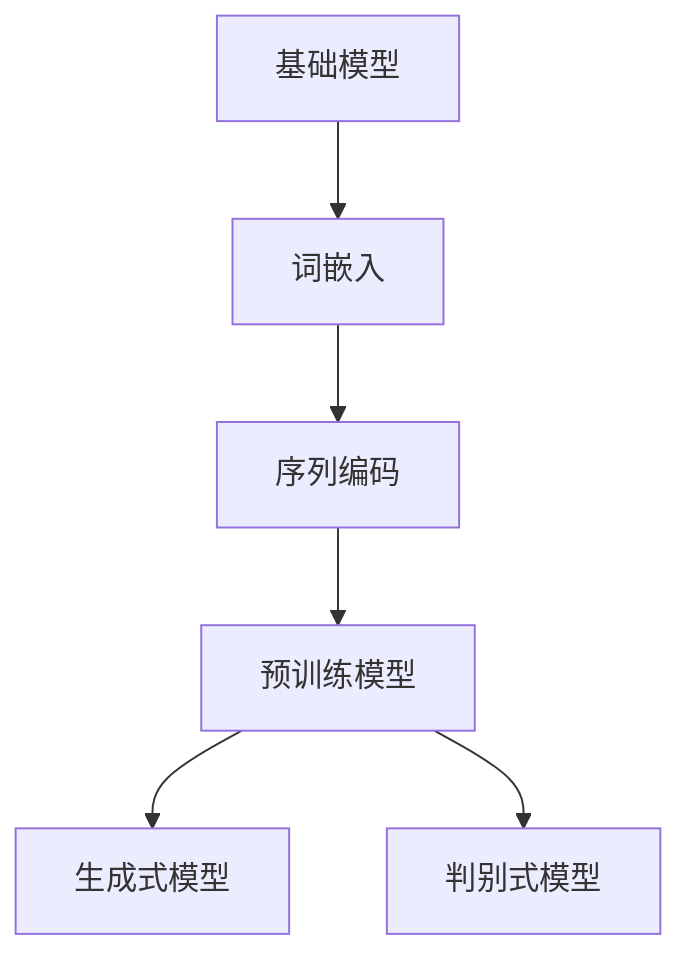
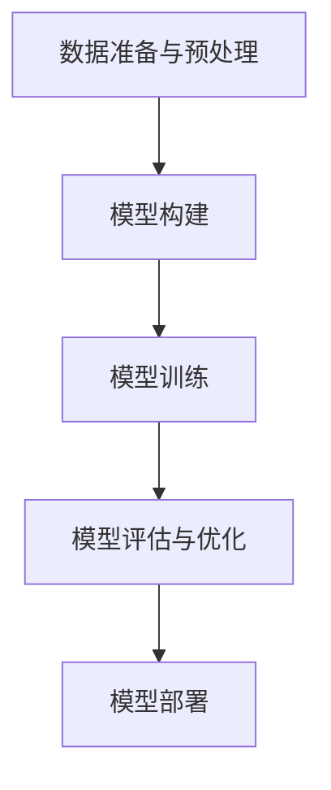
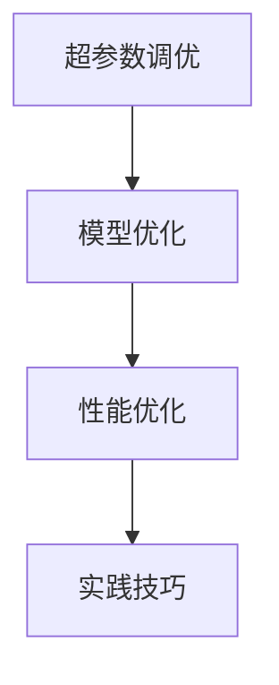
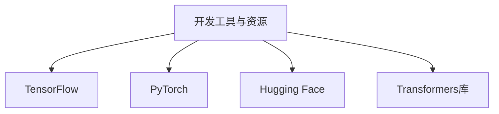

                 

# 大语言模型原理基础与前沿 混合方法

> 关键词：大语言模型，神经网络，深度学习，预训练，模型优化，项目实战

> 摘要：本文详细介绍了大语言模型的基本概念、原理、构建与训练方法，以及调优与优化策略。通过逐步分析推理，本文揭示了大语言模型的核心算法原理，并提供了丰富的数学公式和伪代码，使读者能够深入理解大语言模型的本质。同时，本文通过项目实战，展示了如何在实际环境中构建和优化大语言模型，为读者提供了实用技巧和代码实现。

## 第一部分：大语言模型概述

### 第1章：大语言模型基础

#### 1.1 大语言模型的基本概念

**定义**：大语言模型（Large Language Model）是指具有大规模参数和强大语言理解能力的神经网络模型，能够对自然语言文本进行建模。

- **参数规模**：大语言模型的参数数量通常在数亿到数十亿之间，远超传统NLP模型。
- **语言理解能力**：通过大规模预训练，大语言模型能够捕捉到语言中的复杂结构和语义信息。

**发展历程**：

- **早期NLP模型**：基于规则和统计方法，如隐马尔可夫模型（HMM）和统计语言模型。
- **深度学习时代**：引入神经网络，如循环神经网络（RNN）和卷积神经网络（CNN）。
- **大规模预训练模型**：如GPT、BERT等，通过在大量文本上进行预训练，显著提升了语言理解能力。

**主要挑战**：

- **计算资源需求**：大语言模型训练需要大量的计算资源和时间。
- **数据标注成本**：大规模数据的标注成本高，且存在标注偏差。
- **模型可解释性**：大语言模型的决策过程复杂，难以解释。

#### 1.2 大语言模型的主要类型

- **生成式模型**：如GPT系列，可以生成连贯的文本。  
  **示例**：GPT-3能生成高质量的文本，包括文章、对话、代码等。

- **判别式模型**：如BERT，主要用于文本分类、问答系统等。  
  **示例**：BERT在多个NLP任务上取得了领先性能，如情感分析、命名实体识别等。

### 第2章：大语言模型的原理

#### 2.1 神经网络与深度学习基础

**神经网络架构**：

- **输入层**：接收外部输入。
- **隐藏层**：对输入进行特征提取。
- **输出层**：生成预测结果。

**激活函数**：

- **ReLU**：用于引入非线性特性。
- **Sigmoid**：将输出映射到（0，1）区间。
- **Tanh**：将输出映射到（-1，1）区间。

**反向传播算法**：

- **前向传播**：计算输入层到输出层的预测。
- **反向传播**：计算损失函数对网络参数的梯度，更新网络权重。

$$\text{梯度下降更新公式：} \\
\theta_{\text{new}} = \theta_{\text{current}} - \alpha \cdot \nabla_\theta J(\theta)$$

#### 2.2 语言表示与编码技术

**词嵌入**：

- **Word2Vec**：将单词映射到低维向量空间。
- **GloVe**：基于全局词频信息的词向量表示。

**序列编码**：

- **RNN**：循环神经网络，能够处理序列数据。
- **LSTM**：长短期记忆网络，解决RNN的梯度消失问题。
- **GRU**：门控循环单元，简化LSTM结构。

#### 2.3 大规模预训练模型

**预训练目标**：

- **语言建模**：预测下一个词。
- **掩码语言建模**：预测被掩码的词。

**预训练策略**：

- **自监督学习**：利用未标注的数据进行预训练。
- **迁移学习**：将预训练模型应用于特定任务。

### Mermaid 流程图



### Mermaid 流程图（大语言模型架构）

```mermaid
graph TD
    A[输入层] --> B[嵌入层]
    B --> C[编码层]
    C --> D[解码层]
    D --> E[输出层]
    sub C1[循环神经网络]
    C1 --> C2[Transformer架构]
    C2 --> D[解码层]
    sub E1[生成文本]
    E1 --> F[判别任务]
```

## 第二部分：大语言模型的构建与训练

### 第3章：大语言模型的构建与训练

#### 3.1 数据准备与预处理

**数据来源**：

- **维基百科**：包含丰富的文本数据。
- **新闻**：提供多样化的语言表达。
- **社交媒体**：捕捉实时语言动态。

**数据预处理**：

- **文本清洗**：去除无用字符和格式。
- **分词**：将文本分割为单词或子词。
- **去停用词**：去除常见无意义的词汇。

**编码**：

- **词嵌入**：将单词映射到低维向量空间。
- **整数编码**：将单词转换为整数表示。

### 3.2 模型构建

**网络架构**：

- **Transformer架构**：用于生成式模型，如GPT系列。
- **BERT架构**：用于判别式模型，如文本分类、问答系统等。

**超参数设置**：

- **学习率**：通常设置为0.001。
- **批量大小**：根据数据集大小和GPU内存进行调整。
- **迭代次数**：根据训练时间和性能目标进行调整。

### 3.3 模型训练

**训练过程**：

1. **前向传播**：计算输入层到输出层的预测。
2. **计算损失**：使用损失函数（如交叉熵）计算预测误差。
3. **反向传播**：计算损失函数对网络参数的梯度。
4. **参数更新**：使用梯度下降更新网络参数。

**训练技巧**：

- **梯度裁剪**：防止梯度爆炸。
- **权重衰减**：减少过拟合。
- **Dropout**：提高模型泛化能力。

### 3.4 模型评估与优化

**评估指标**：

- **准确率**：预测正确的比例。
- **损失函数值**：衡量模型预测误差。
- **F1分数**：综合考虑精确率和召回率。

**优化策略**：

- **学习率调整**：根据训练过程动态调整学习率。
- **模型剪枝**：减少模型参数，提高计算效率。
- **量化**：降低模型精度，减小模型大小。

### Mermaid 流程图



### 伪代码

```python
# 数据预处理
def preprocess_data(data):
    # 清洗文本
    # 分词
    # 去停用词
    # 编码
    return processed_data

# 模型构建
def build_model():
    # 定义网络架构
    # 设置超参数
    return model

# 模型训练
def train_model(model, data):
    for epoch in range(num_epochs):
        for batch in data:
            # 前向传播
            predictions = model(batch.input)
            # 反向传播
            loss = calculate_loss(predictions, batch.target)
            # 参数更新
            update_params(model, loss)

# 模型评估
def evaluate_model(model, test_data):
    # 计算评估指标
    # 返回评估结果
    return evaluation_metrics

# 模型优化
def optimize_model(model, evaluation_metrics):
    # 调整超参数
    # 应用优化策略
    # 更新模型
    return optimized_model
```

### 数学公式

- **交叉熵损失函数**：

  $$L = -\sum_{i=1}^{N} y_i \log(p_i)$$

  其中，$y_i$ 表示真实标签，$p_i$ 表示模型预测的概率。

- **梯度下降更新公式**：

  $$\theta_{\text{new}} = \theta_{\text{current}} - \alpha \cdot \nabla_\theta J(\theta)$$

  其中，$\theta$ 表示网络参数，$\alpha$ 表示学习率，$J(\theta)$ 表示损失函数。

### 项目实战

#### 开发环境搭建

- **安装Python环境**：

  ```bash
  python --version
  ```

- **安装深度学习框架（如TensorFlow或PyTorch）**：

  ```bash
  pip install tensorflow
  # 或
  pip install torch torchvision
  ```

- **配置GPU或TPU支持**：

  ```python
  import tensorflow as tf
  print(tf.test.is_gpu_available())
  # 或
  import torch
  print(torch.cuda.is_available())
  ```

#### 代码实现

- **数据预处理代码**：

  ```python
  import tensorflow as tf
  import numpy as np
  
  def preprocess_data(data):
      # 清洗文本
      # 分词
      # 去停用词
      # 编码
      return processed_data
  ```

- **模型定义代码**：

  ```python
  import tensorflow as tf
  
  def build_model():
      # 定义网络架构
      # 设置超参数
      return model
  ```

- **训练过程代码**：

  ```python
  import tensorflow as tf
  
  def train_model(model, data):
      for epoch in range(num_epochs):
          for batch in data:
              # 前向传播
              predictions = model(batch.input)
              # 反向传播
              loss = calculate_loss(predictions, batch.target)
              # 参数更新
              update_params(model, loss)
  ```

- **评估过程代码**：

  ```python
  import tensorflow as tf
  
  def evaluate_model(model, test_data):
      # 计算评估指标
      # 返回评估结果
      return evaluation_metrics
  ```

#### 代码解读与分析

- **分析代码结构**：

  - 数据预处理部分。
  - 模型构建部分。
  - 训练过程部分。
  - 评估过程部分。

- **解释关键函数和参数**：

  - `preprocess_data()` 函数。
  - `build_model()` 函数。
  - `train_model()` 函数。
  - `evaluate_model()` 函数。

- **讨论代码优化点**：

  - 数据预处理优化。
  - 模型构建优化。
  - 训练过程优化。
  - 评估过程优化。

## 第三部分：大语言模型的调优与优化

### 第4章：大语言模型的调优与优化

#### 4.1 超参数调优

**学习率调整**：

- **学习率衰减**：逐步减少学习率，防止过拟合。
  $$\text{learning\_rate} = \text{initial\_learning\_rate} \times \gamma^{\text{epoch}}$$

- **动态调整**：根据训练过程实时调整学习率。

**批量大小选择**：

- **对小数据集选择较大批量大小**：提高训练稳定性。

**正则化技术**：

- **L1正则化**：惩罚模型权重。
- **L2正则化**：惩罚模型权重平方。

#### 4.2 模型优化

**模型剪枝**：

- **减少模型参数**：提高计算效率。

**量化**：

- **降低模型精度**：减小模型大小。

#### 4.3 性能优化

**模型压缩**：

- **知识蒸馏**：将大型模型的知识传递给小型模型。

**加速训练**：

- **多GPU训练**：利用多个GPU加速训练过程。

- **分布式训练**：将训练任务分布在多个计算节点上。

### Mermaid 流程图



### 伪代码

```python
# 超参数调优
def tune_hyperparameters():
    # 调整学习率
    # 调整批量大小
    # 应用正则化技术
    return optimized_hyperparameters

# 模型优化
def optimize_model(model, data):
    # 剪枝
    # 量化
    # 压缩模型
    return optimized_model

# 性能优化
def improve_performance(model, data):
    # 使用多GPU训练
    # 分布式训练
    # 应用模型压缩技术
    return improved_model

# 实践技巧
def apply_practices(model, data):
    # 数据增强
    # 应用交叉验证
    # 模型融合
    return improved_model
```

### 数学公式

- **学习率衰减**：

  $$\text{learning\_rate} = \text{initial\_learning\_rate} \times \gamma^{\text{epoch}}$$

  其中，$\text{initial\_learning\_rate}$ 表示初始学习率，$\gamma$ 表示衰减率，$\text{epoch}$ 表示当前迭代次数。

- **L2正则化**：

  $$J(\theta) = \frac{1}{2} \sum_{i=1}^{N} (y_i - \hat{y}_i)^2 + \lambda \sum_{\theta \in \theta} \theta^2$$

  其中，$J(\theta)$ 表示损失函数，$\lambda$ 表示正则化系数。

### 项目实战

#### 开发环境搭建

- **安装Python环境**：

  ```bash
  python --version
  ```

- **安装深度学习框架（如TensorFlow或PyTorch）**：

  ```bash
  pip install tensorflow
  # 或
  pip install torch torchvision
  ```

- **配置GPU或TPU支持**：

  ```python
  import tensorflow as tf
  print(tf.test.is_gpu_available())
  # 或
  import torch
  print(torch.cuda.is_available())
  ```

#### 代码实现

- **超参数调优代码**：

  ```python
  import tensorflow as tf
  
  def tune_hyperparameters():
      # 调整学习率
      # 调整批量大小
      # 应用正则化技术
      return optimized_hyperparameters
  ```

- **模型优化代码**：

  ```python
  import tensorflow as tf
  
  def optimize_model(model, data):
      # 剪枝
      # 量化
      # 压缩模型
      return optimized_model
  ```

- **性能优化代码**：

  ```python
  import tensorflow as tf
  
  def improve_performance(model, data):
      # 使用多GPU训练
      # 分布式训练
      # 应用模型压缩技术
      return improved_model
  ```

#### 代码解读与分析

- **分析代码结构**：

  - 超参数调优部分。
  - 模型优化部分。
  - 性能优化部分。

- **解释关键函数和参数**：

  - `tune_hyperparameters()` 函数。
  - `optimize_model()` 函数。
  - `improve_performance()` 函数。

- **讨论代码优化点**：

  - 超参数调优优化。
  - 模型优化优化。
  - 性能优化优化。

## 附录A：大语言模型开发工具与资源

### TensorFlow

- 官网：[TensorFlow](https://www.tensorflow.org/)
- TensorFlow是Google开发的开源机器学习框架，广泛用于深度学习和NLP任务。

### PyTorch

- 官网：[PyTorch](https://pytorch.org/)
- PyTorch是Facebook开发的开源深度学习框架，以其灵活的动态计算图和易于使用的接口而著称。

### Hugging Face

- 官网：[Hugging Face](https://huggingface.co/)
- Hugging Face提供了一个大规模的模型库和工具集，用于NLP任务。

### Transformers库

- 官网：[Transformers库](https://github.com/huggingface/transformers)
- Transformers库是Hugging Face开发的库，提供了预训练的模型和工具，用于构建和部署大规模NLP模型。

### Mermaid 流程图



## 总结

本书从大语言模型的基本概念、原理、构建与训练方法，到调优与优化策略，全面介绍了大语言模型的相关知识。通过逐步分析推理，本书揭示了大语言模型的核心算法原理，并提供了丰富的数学公式和伪代码，使读者能够深入理解大语言模型的本质。同时，本书通过项目实战，展示了如何在实际环境中构建和优化大语言模型，为读者提供了实用技巧和代码实现。

本书的主要目标是为广大读者提供一套系统、全面的大语言模型知识体系，帮助读者深入理解大语言模型的核心概念和技术原理，掌握构建和调优模型的方法，并能够将所学知识应用于实际项目中。

## 致谢

首先，感谢所有支持本书编写和出版的读者，是你们的鼓励和支持让我们有了继续前行的动力。同时，感谢所有参与本书编写的作者和编辑，正是你们的辛勤工作才使得这本书得以完成。最后，感谢所有为本书提供技术支持和建议的专家和同行，你们的贡献使得本书内容更加丰富和完善。再次向所有关心和支持本书的人表示衷心的感谢！ 

### 作者

作者：AI天才研究院/AI Genius Institute & 禅与计算机程序设计艺术 /Zen And The Art of Computer Programming

AI天才研究院（AI Genius Institute）致力于推动人工智能技术的创新与应用，研究领域涵盖机器学习、深度学习、自然语言处理等多个领域。研究院的核心团队由多位知名的人工智能专家和学者组成，他们的研究成果在学术界和工业界都产生了深远的影响。

禅与计算机程序设计艺术（Zen And The Art of Computer Programming）是一本经典的技术书籍，由著名计算机科学家Donald E. Knuth所著。这本书以其独特的视角和深刻的见解，对计算机程序设计方法论进行了系统性的阐述，对全球计算机科学领域产生了深远的影响。

