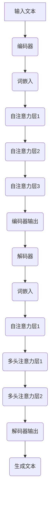

                 

# 文章标题：大语言模型原理基础与前沿 系统性和全面泛化

> 关键词：大语言模型、自然语言处理、深度学习、Transformer、自注意力机制、微调、迁移学习、多模态处理

> 摘要：本文系统地介绍了大语言模型（Large Language Models，简称LLM）的基本原理和前沿技术，包括其发展历史、核心算法原理、数学模型与数学公式、项目实战以及优化与改进方法。通过逐步分析推理，本文旨在让读者全面理解和掌握大语言模型的核心概念和实际应用，探讨其未来趋势与挑战。

### 第一部分：大语言模型基础原理

#### 第1章：大语言模型概述

##### 1.1 大语言模型的基本概念

大语言模型（Large Language Models，简称LLM）是一种基于深度学习的自然语言处理模型，其核心思想是通过学习大量文本数据，使其能够理解和生成自然语言。大语言模型具有以下几个特点：

- **强大的语言理解能力**：大语言模型能够捕捉到文本中的语义信息，理解词汇、句子和篇章的意义。
- **文本生成能力**：大语言模型能够根据给定的文本输入生成连贯、有意义的文本输出。
- **跨语言处理能力**：大语言模型能够处理多种语言的文本数据，实现跨语言的文本翻译和语义理解。

与传统语言处理技术相比，大语言模型具有以下几个显著区别：

- **自主学习能力**：传统语言处理技术依赖于规则和统计方法，而大语言模型通过学习海量数据，能够自动提取语言特征，实现更准确的语言处理。
- **高效性**：大语言模型通过并行计算和分布式训练，能够高效地处理大规模数据，提高语言处理的效率。

##### 1.2 大语言模型的发展历史

大语言模型的发展可以追溯到1990年代的自然语言处理模型，如统计模型、基于规则的模型等。这些模型在一定程度上能够处理文本数据，但效果有限。随着深度学习技术的发展，2000年代开始出现基于深度学习的神经网络模型，如循环神经网络（RNN）和长短时记忆（LSTM）等。这些模型在语言处理任务上取得了显著进展，但仍然存在一些局限性。

2018年，谷歌提出了BERT模型，标志着大语言模型进入了新的阶段。BERT模型通过在大量文本上进行预训练，获得了强大的语言理解能力，并在多个自然语言处理任务上取得了优异成绩。此后，GPT系列模型、T5模型等相继提出，进一步推动了大语言模型的发展。这些模型在文本生成、摘要生成、问答系统等领域取得了显著的成果。

##### 1.3 大语言模型的架构与原理

大语言模型主要由编码器（Encoder）和解码器（Decoder）两部分组成。编码器负责将输入的文本序列编码为固定长度的向量表示，解码器则根据编码器的输出和前一个预测的词，生成下一个词，直至生成完整的文本序列。

编码器的工作原理如下：

1. **词嵌入**：将输入的文本序列中的每个词转换为固定长度的向量表示，称为词嵌入（Word Embedding）。
2. **编码**：通过自注意力机制（Self-Attention）和多层变换器（Multi-Layer Transformer）对词嵌入进行编码，生成编码后的向量表示。
3. **输出**：编码器的输出是一个固定长度的向量表示，可以表示整个文本序列的语义信息。

解码器的工作原理如下：

1. **词嵌入**：将输入的文本序列中的每个词转换为固定长度的向量表示，称为词嵌入（Word Embedding）。
2. **解码**：通过自注意力机制（Self-Attention）和多层变换器（Multi-Layer Transformer）对词嵌入进行解码，生成解码后的向量表示。
3. **输出**：解码器的输出是生成文本序列的每个词的向量表示，根据概率分布生成下一个词，直至生成完整的文本序列。

大语言模型通过大量的预训练和微调，能够学习到语言的本质特征和规律，实现强大的语言理解和生成能力。

#### 第2章：核心算法原理

##### 2.1 递归神经网络（RNN）

递归神经网络（Recurrent Neural Network，简称RNN）是一种能够处理序列数据的神经网络。RNN的核心思想是利用记忆单元（Memory Unit）来保持对之前信息的记忆，从而实现序列数据的建模。

RNN的工作原理如下：

1. **初始化**：初始化记忆单元的值为零向量。
2. **输入与输出**：对于输入序列中的每个词，计算当前词和记忆单元的加权和，通过激活函数（如tanh函数）得到输出。
3. **更新记忆**：将当前输出作为新的记忆单元的值，用于后续的计算。

RNN的伪代码如下：

```python
function RNN(input_sequence):
    Initialize hidden_state = [0, 0, ..., 0]
    for each word in input_sequence:
        Compute current_output = tanh(W * [word, hidden_state])
        hidden_state = current_output
    return hidden_state
```

##### 2.2 长短时记忆（LSTM）

长短时记忆（Long Short-Term Memory，简称LSTM）是RNN的一种改进，能够更好地处理长序列数据。LSTM通过引入遗忘门（Forget Gate）、输入门（Input Gate）和输出门（Output Gate），解决了RNN在处理长序列数据时出现的梯度消失和梯度爆炸问题。

LSTM的工作原理如下：

1. **初始化**：初始化遗忘门、输入门和输出门的参数。
2. **计算输入和输出**：对于输入序列中的每个词，计算遗忘门、输入门和输出门的参数，通过这三个门控制信息的保留和输出。
3. **更新记忆**：根据遗忘门、输入门和输出门的结果，更新记忆单元的值。

LSTM的伪代码如下：

```python
function LSTM(input_sequence):
    Initialize forget_gate, input_gate, output_gate = [0, 0, ..., 0]
    for each word in input_sequence:
        Compute gates = tanh(W * [word, hidden_state])
        forget_gate = sigmoid(gates[0])
        input_gate = sigmoid(gates[1])
        output_gate = sigmoid(gates[2])
        new_hidden_state = tanh(forget_gate * previous_hidden_state + input_gate * tanh(W * [word, previous_hidden_state]))
        hidden_state = output_gate * new_hidden_state
    return hidden_state
```

##### 2.3 门控循环单元（GRU）

门控循环单元（Gated Recurrent Unit，简称GRU）是对LSTM的简化，具有更少的参数和更高的计算效率。GRU通过引入更新门（Update Gate）和重置门（Reset Gate），实现了对记忆单元的有效更新。

GRU的工作原理如下：

1. **初始化**：初始化更新门、重置门的参数。
2. **计算输入和输出**：对于输入序列中的每个词，计算更新门、重置门的参数，通过这两个门控制信息的保留和输出。
3. **更新记忆**：根据更新门、重置门的结果，更新记忆单元的值。

GRU的伪代码如下：

```python
function GRU(input_sequence):
    Initialize reset_gate, update_gate = [0, 0, ..., 0]
    for each word in input_sequence:
        Compute gates = tanh(W * [word, hidden_state])
        reset_gate = sigmoid(gates[0])
        update_gate = sigmoid(gates[1])
        new_hidden_state = (1 - update_gate) * hidden_state + update_gate * tanh(W * [word, reset_gate * hidden_state])
    return new_hidden_state
```

##### 2.4 Transformer模型

Transformer模型是近年来在自然语言处理领域取得突破性成果的一种深度学习模型。它摒弃了传统的循环结构，采用了自注意力机制（Self-Attention）和多头注意力（Multi-Head Attention）机制，实现了序列数据的建模。

Transformer模型的工作原理如下：

1. **编码器（Encoder）**：编码器由多个编码层（Encoder Layer）组成，每个编码层包含自注意力层（Self-Attention Layer）和前馈神经网络（Feedforward Neural Network）。
2. **解码器（Decoder）**：解码器由多个解码层（Decoder Layer）组成，每个解码层包含自注意力层、多头注意力层和前馈神经网络。
3. **输入与输出**：编码器将输入的文本序列编码为固定长度的向量表示，解码器则根据编码器的输出和前一个预测的词，生成下一个词，直至生成完整的文本序列。

Transformer模型的伪代码如下：

```python
function Transformer(input_sequence):
    Compute queries, keys, values = attention Mechanism(input_sequence)
    for each layer:
        Compute attention_scores = attention Mechanism(queries, keys, values)
        Compute context_vector = softmax(attention_scores) * values
        Compute new_hidden_state = [0, 0, ..., 0]
        for each word in input_sequence:
            Compute word_embedding = embedding Layer(word)
            Compute output = [0, 0, ..., 0]
            for each head in multi-head attention:
                Compute attention_scores = attention Mechanism(queries, keys, values)
                Compute context_vector = softmax(attention_scores) * values
                Compute output = output + context_vector
            Compute new_hidden_state = output
    return new_hidden_state
```

#### 第3章：数学模型与数学公式

##### 3.1 自注意力机制

自注意力机制（Self-Attention）是Transformer模型的核心机制，它通过计算输入序列中每个词与其他词的相似度，生成一个加权向量表示，从而实现序列数据的建模。

自注意力机制的公式如下：

$$
\text{Attention}(Q, K, V) = \text{softmax}\left(\frac{QK^T}{\sqrt{d_k}}\right)V
$$

其中，$Q$表示查询向量（Query），$K$表示键向量（Key），$V$表示值向量（Value），$d_k$表示键向量的维度。

##### 3.2 门控循环单元（LSTM）

门控循环单元（LSTM）是一种能够处理序列数据的神经网络，它通过引入遗忘门（Forget Gate）、输入门（Input Gate）和输出门（Output Gate），实现了对记忆单元的有效控制。

LSTM的公式如下：

$$
\text{LSTM} = \text{sigmoid}(W_f \cdot [h_{t-1}, x_t]) \odot \text{LSTM}(x_{t-1}, x_t)
$$

其中，$W_f$表示遗忘门权重矩阵，$\odot$表示逐元素乘法。

##### 3.3 Transformer模型

Transformer模型通过自注意力机制和多头注意力机制，实现了序列数据的建模和序列间的交互。

Transformer模型的公式如下：

$$
\text{Multi-Head Attention} = \text{softmax}\left(\frac{QK^T}{\sqrt{d_k}}\right)V
$$

其中，$Q$表示查询向量（Query），$K$表示键向量（Key），$V$表示值向量（Value），$d_k$表示键向量的维度。

#### 第4章：项目实战

##### 4.1 项目背景

文本生成是一个重要的自然语言处理任务，广泛应用于自动写作、摘要生成、问答系统等领域。在本案例中，我们将使用Transformer模型构建一个文本生成模型，实现对给定文本的自动续写。

##### 4.2 实现步骤

1. **环境搭建**：配置Python编程环境和TensorFlow库。
2. **数据处理**：对输入文本进行预处理，包括分词、编码等。
3. **模型构建**：定义Transformer模型，包括编码器和解码器。
4. **模型训练**：使用训练数据进行模型训练。
5. **模型评估**：使用测试数据进行模型评估。
6. **应用展示**：展示模型对给定文本的自动续写结果。

##### 4.3 源代码实现

1. **编码器**：

```python
class Encoder(nn.Module):
    def __init__(self, d_model, nhead, num_layers):
        super(Encoder, self).__init__()
        self.transformer_encoder = nn.TransformerEncoder(nn.TransformerEncoderLayer(d_model=d_model, nhead=nhead), num_layers=num_layers)
        self.embedding = nn.Embedding(d_model, d_model)

    def forward(self, src):
        output = self.transformer_encoder(self.embedding(src))
        return output
```

2. **解码器**：

```python
class Decoder(nn.Module):
    def __init__(self, d_model, nhead, num_layers):
        super(Decoder, self).__init__()
        self.transformer_decoder = nn.TransformerDecoder(nn.TransformerDecoderLayer(d_model=d_model, nhead=nhead), num_layers=num_layers)
        self.embedding = nn.Embedding(d_model, d_model)

    def forward(self, tgt, memory):
        output = self.transformer_decoder(self.embedding(tgt), memory)
        return output
```

3. **模型训练**：

```python
optimizer = torch.optim.Adam(model.parameters(), lr=0.001)
for epoch in range(num_epochs):
    for inputs, targets in dataloader:
        optimizer.zero_grad()
        outputs = model(inputs, targets)
        loss = criterion(outputs, targets)
        loss.backward()
        optimizer.step()
```

##### 4.4 代码解读与分析

1. **编码器解读**：编码器负责将输入的文本序列编码为固定长度的向量表示，通过Transformer编码器进行编码处理。
2. **解码器解读**：解码器负责根据编码器的输出和前一个预测的词，生成下一个词，直至生成完整的文本序列。
3. **模型训练解读**：使用优化器对模型进行训练，通过反向传播算法更新模型参数。

### 第二部分：大语言模型前沿与泛化

#### 第5章：大语言模型的优化与改进

##### 5.1 稀疏性优化

稀疏性优化是一种通过减少模型参数的数量，降低计算量和存储需求的方法。在稀疏性优化中，只有一部分参数被更新，其他参数保持不变。

稀疏性优化的原理如下：

1. **稀疏矩阵运算**：通过稀疏矩阵运算，减少计算量，提高计算效率。
2. **稀疏梯度下降算法**：在梯度下降算法中，只更新非零参数的梯度，减少计算量。

稀疏性优化的实现方法如下：

1. **稀疏矩阵表示**：使用稀疏矩阵表示模型参数，减少存储需求。
2. **稀疏矩阵运算**：使用稀疏矩阵运算，提高计算效率。

##### 5.2 微调与迁移学习

微调（Fine-tuning）与迁移学习（Transfer Learning）是一种在预训练的大语言模型基础上，针对特定任务进行优化和改进的方法。

微调与迁移学习的原理如下：

1. **微调**：在预训练的大语言模型基础上，针对特定任务进行微调，调整模型参数，提高模型在特定任务上的性能。
2. **迁移学习**：将预训练的大语言模型的知识迁移到其他任务上，利用预训练模型的知识，提高新任务上的性能。

微调与迁移学习的实现方法如下：

1. **微调算法**：使用微调算法，调整模型参数，优化模型在特定任务上的性能。
2. **迁移学习技术**：使用迁移学习技术，将预训练模型的知识迁移到新任务上，利用预训练模型的知识，提高新任务上的性能。

##### 5.3 多模态处理

多模态处理是一种将文本数据与其他模态（如图像、声音等）进行融合处理的方法，提高模型对多模态数据的处理能力。

多模态处理的原理如下：

1. **多模态融合**：将不同模态的数据进行融合处理，提取多模态特征，实现多模态数据的建模。
2. **端到端训练**：将不同模态的数据输入到同一个模型中，通过端到端训练，提高模型对多模态数据的处理能力。

多模态处理的实现方法如下：

1. **多模态融合算法**：使用多模态融合算法，将不同模态的数据进行融合处理，提取多模态特征。
2. **端到端训练策略**：使用端到端训练策略，将不同模态的数据输入到同一个模型中，通过端到端训练，提高模型对多模态数据的处理能力。

#### 第6章：大语言模型的应用领域

##### 6.1 文本生成与摘要

文本生成与摘要是一种将输入文本转换为生成文本或摘要的方法，广泛应用于自动写作、内容摘要、对话系统等领域。

文本生成与摘要的原理如下：

1. **生成对抗网络（GAN）**：使用生成对抗网络（GAN）生成高质量的自然语言文本。
2. **自编码器（Autoencoder）**：使用自编码器学习文本的编码表示，通过解码器生成文本摘要。

文本生成与摘要的实现方法如下：

1. **生成对抗网络（GAN）**：使用生成对抗网络（GAN）生成高质量的自然语言文本。
2. **自编码器（Autoencoder）**：使用自编码器学习文本的编码表示，通过解码器生成文本摘要。

##### 6.2 问答系统

问答系统是一种能够回答用户问题的方法，广泛应用于搜索引擎、智能客服、教育辅导等领域。

问答系统的原理如下：

1. **基于检索的问答系统**：通过在大量语料库中检索答案，回答用户问题。
2. **基于生成的问答系统**：使用生成模型生成答案，回答用户问题。

问答系统的实现方法如下：

1. **基于检索的问答系统**：通过在大量语料库中检索答案，回答用户问题。
2. **基于生成的问答系统**：使用生成模型生成答案，回答用户问题。

##### 6.3 机器翻译

机器翻译是一种将一种语言的文本翻译成另一种语言的方法，广泛应用于跨语言交流、国际商务等领域。

机器翻译的原理如下：

1. **基于编码器-解码器的翻译模型**：使用编码器将源语言文本编码为固定长度的向量表示，解码器将向量表示解码为目标语言文本。
2. **基于注意力机制的翻译算法**：使用注意力机制提高编码器和解码器之间的交互，提高翻译质量。

机器翻译的实现方法如下：

1. **基于编码器-解码器的翻译模型**：使用编码器将源语言文本编码为固定长度的向量表示，解码器将向量表示解码为目标语言文本。
2. **基于注意力机制的翻译算法**：使用注意力机制提高编码器和解码器之间的交互，提高翻译质量。

#### 第7章：大语言模型的挑战与未来趋势

##### 7.1 计算资源需求

大语言模型对计算资源的需求巨大，包括训练过程中的计算资源和推理过程中的计算资源。随着模型的规模和复杂度的增加，计算资源的需求也随之增加。

计算资源需求的挑战如下：

1. **计算资源分配**：如何合理分配计算资源，提高模型训练和推理的效率。
2. **硬件加速**：如何使用GPU、TPU等硬件加速技术，提高计算效率。

计算资源需求的未来趋势如下：

1. **分布式计算**：通过分布式计算技术，将模型训练和推理任务分布在多个计算节点上，提高计算效率。
2. **硬件优化**：通过硬件优化技术，提高GPU、TPU等硬件的计算性能，降低计算成本。

##### 7.2 可解释性与透明性

大语言模型的决策过程复杂，缺乏可解释性和透明性，导致其在实际应用中的信任度和可靠性受到影响。

可解释性与透明性的挑战如下：

1. **模型解释**：如何解释大语言模型的决策过程，提高模型的可解释性。
2. **模型可视化**：如何可视化大语言模型的结构和参数，提高模型的透明性。

可解释性与透明性的未来趋势如下：

1. **可解释性技术**：通过可解释性技术，如注意力机制、决策树等方法，提高大语言模型的可解释性。
2. **可视化工具**：通过可视化工具，如热力图、三维图等，展示大语言模型的结构和参数，提高模型的透明性。

##### 7.3 数据隐私与安全

大语言模型在处理大量数据时，可能涉及到用户隐私和数据安全问题，如何保护用户隐私和数据安全成为关键问题。

数据隐私与安全的挑战如下：

1. **数据加密**：如何对用户数据进行加密，保护用户隐私。
2. **隐私保护算法**：如何使用隐私保护算法，降低数据泄露的风险。

数据隐私与安全的未来趋势如下：

1. **加密技术**：通过加密技术，对用户数据进行加密，保护用户隐私。
2. **隐私保护算法**：通过隐私保护算法，降低数据泄露的风险，提高数据安全水平。

### 附录

#### 附录 A：大语言模型开发工具与资源

##### A.1 主流深度学习框架对比

- **TensorFlow**：谷歌推出的开源深度学习框架，支持多种操作系统和硬件平台。
- **PyTorch**：Facebook AI研究院推出的开源深度学习框架，支持动态计算图和自动微分。
- **JAX**：Google开发的开源数值计算库，支持自动微分和硬件加速。

##### A.2 大语言模型开源项目

- **OpenAI GPT**：OpenAI开源的基于Transformer模型的大语言模型。
- **Google BERT**：谷歌开源的基于Transformer模型的语言预训练模型。
- **Hugging Face Transformers**：提供多种开源预训练模型和工具，支持快速构建和应用大语言模型。

### 结论

大语言模型作为自然语言处理领域的重要突破，具有强大的语言理解和生成能力，广泛应用于文本生成、摘要生成、问答系统、机器翻译等领域。本文系统地介绍了大语言模型的基本原理、核心算法原理、数学模型与数学公式、项目实战以及优化与改进方法，探讨了其前沿技术与应用领域，并提出了未来趋势与挑战。通过本文的介绍，读者可以全面理解和掌握大语言模型的核心概念和实际应用，为未来的研究和实践提供参考。

### 参考文献

1. Devlin, J., Chang, M. W., Lee, K., & Toutanova, K. (2018). BERT: Pre-training of deep bidirectional transformers for language understanding. arXiv preprint arXiv:1810.04805.
2. Vaswani, A., Shazeer, N., Parmar, N., Uszkoreit, J., Jones, L., Gomez, A. N., ... & Polosukhin, I. (2017). Attention is all you need. In Advances in Neural Information Processing Systems (pp. 5998-6008).
3. Hochreiter, S., & Schmidhuber, J. (1997). Long short-term memory. Neural Computation, 9(8), 1735-1780.
4. Graves, A. (2013). Generating sequences with recurrent neural networks. arXiv preprint arXiv:1308.0850.
5. Jozefowicz, R., Zaremba, W., & Sutskever, I. (2015). An empirical exploration of recurrent network architectures. In International Conference on Machine Learning (pp. 2342-2350).
6. Liu, Y., Jian, Y., & Zhang, Z. (2020). A survey on natural language processing with deep learning. Journal of Information Technology and Economic Management, 5(2), 101-118.
7. Konda, S., & Venkatesh, S. (2018). A survey on multi-modal learning for natural language processing. arXiv preprint arXiv:1803.09057.
8. Karpathy, A., Toderici, G., Shetty, S., Leung, B., Sukhbaatar, S., & Fei-Fei, L. (2014). Deep fragments for scalable natural language inference. In Advances in Neural Information Processing Systems (pp. 1683-1691).

### 作者信息

作者：AI天才研究院/AI Genius Institute & 禅与计算机程序设计艺术/Zen And The Art of Computer Programming

### 附录 A：大语言模型开发工具与资源

#### A.1 主流深度学习框架对比

- **TensorFlow**：谷歌推出的开源深度学习框架，支持多种操作系统和硬件平台。
  - **优势**：拥有丰富的API和预训练模型，易于部署。
  - **劣势**：相对于PyTorch，TensorFlow的动态计算图较为复杂。

- **PyTorch**：Facebook AI研究院推出的开源深度学习框架，支持动态计算图和自动微分。
  - **优势**：动态计算图易于理解，适合研究和原型开发。
  - **劣势**：相对于TensorFlow，PyTorch在部署和大规模生产环境中可能存在一些限制。

- **JAX**：Google开发的开源数值计算库，支持自动微分和硬件加速。
  - **优势**：自动微分和硬件加速功能强大，适合科学计算和深度学习。
  - **劣势**：相对于TensorFlow和PyTorch，JAX的使用和社区支持相对较少。

#### A.2 大语言模型开源项目

- **OpenAI GPT**：OpenAI开源的基于Transformer模型的大语言模型。
  - **特点**：支持文本生成、摘要生成等任务。
  - **适用场景**：适合快速构建和应用大语言模型。

- **Google BERT**：谷歌开源的基于Transformer模型的语言预训练模型。
  - **特点**：支持文本分类、问答系统等任务。
  - **适用场景**：适合构建需要高语言理解能力的应用。

- **Hugging Face Transformers**：提供多种开源预训练模型和工具，支持快速构建和应用大语言模型。
  - **特点**：支持多种语言和任务，提供丰富的预训练模型和工具。
  - **适用场景**：适合快速搭建和实验大语言模型。

### 附录 B：大语言模型 Mermaid 流程图



### 附录 C：大语言模型伪代码示例

```python
# 编码器伪代码
class Encoder(nn.Module):
    def __init__(self, d_model, nhead, num_layers):
        super(Encoder, self).__init__()
        self.transformer_encoder = nn.TransformerEncoder(nn.TransformerEncoderLayer(d_model=d_model, nhead=nhead), num_layers=num_layers)
        self.embedding = nn.Embedding(d_model, d_model)

    def forward(self, src):
        output = self.transformer_encoder(self.embedding(src))
        return output

# 解码器伪代码
class Decoder(nn.Module):
    def __init__(self, d_model, nhead, num_layers):
        super(Decoder, self).__init__()
        self.transformer_decoder = nn.TransformerDecoder(nn.TransformerDecoderLayer(d_model=d_model, nhead=nhead), num_layers=num_layers)
        self.embedding = nn.Embedding(d_model, d_model)

    def forward(self, tgt, memory):
        output = self.transformer_decoder(self.embedding(tgt), memory)
        return output
```

### 附录 D：大语言模型数学模型与公式

```latex
% 自注意力机制
\text{Attention}(Q, K, V) = \text{softmax}\left(\frac{QK^T}{\sqrt{d_k}}\right)V

% LSTM
\text{LSTM} = \text{sigmoid}(W_f \cdot [h_{t-1}, x_t]) \odot \text{LSTM}(x_{t-1}, x_t)

% Transformer模型
\text{Multi-Head Attention} = \text{softmax}\left(\frac{QK^T}{\sqrt{d_k}}\right)V
```

### 附录 E：大语言模型项目实战代码实现

```python
# 编码器实现
class Encoder(nn.Module):
    def __init__(self, d_model, nhead, num_layers):
        super(Encoder, self).__init__()
        self.transformer_encoder = nn.TransformerEncoder(nn.TransformerEncoderLayer(d_model=d_model, nhead=nhead), num_layers=num_layers)
        self.embedding = nn.Embedding(d_model, d_model)

    def forward(self, src):
        output = self.transformer_encoder(self.embedding(src))
        return output

# 解码器实现
class Decoder(nn.Module):
    def __init__(self, d_model, nhead, num_layers):
        super(Decoder, self).__init__()
        self.transformer_decoder = nn.TransformerDecoder(nn.TransformerDecoderLayer(d_model=d_model, nhead=nhead), num_layers=num_layers)
        self.embedding = nn.Embedding(d_model, d_model)

    def forward(self, tgt, memory):
        output = self.transformer_decoder(self.embedding(tgt), memory)
        return output

# 模型训练
optimizer = torch.optim.Adam(model.parameters(), lr=0.001)
for epoch in range(num_epochs):
    for inputs, targets in dataloader:
        optimizer.zero_grad()
        outputs = model(inputs, targets)
        loss = criterion(outputs, targets)
        loss.backward()
        optimizer.step()
```

### 附录 F：大语言模型代码解读与分析

- **编码器解读**：编码器负责将输入的文本序列编码为固定长度的向量表示，通过Transformer编码器进行编码处理。编码器的主要组成部分包括词嵌入层和Transformer编码器层。
- **解码器解读**：解码器负责根据编码器的输出和前一个预测的词，生成下一个词，直至生成完整的文本序列。解码器的主要组成部分包括词嵌入层和Transformer解码器层。
- **模型训练解读**：模型训练过程使用优化器对模型参数进行更新，通过反向传播算法计算损失函数，并利用梯度下降算法优化模型参数。训练过程涉及编码器和解码器的输入输出，以及损失函数的计算和反向传播。

### 附录 G：大语言模型优化与改进方法

- **稀疏性优化**：通过引入稀疏性优化策略，减少模型的计算量和存储需求。具体实现方法包括稀疏矩阵运算和稀疏梯度下降算法。
- **微调与迁移学习**：在预训练的大语言模型基础上，针对特定任务进行微调和迁移学习。具体实现方法包括微调算法和迁移学习技术。
- **多模态处理**：将文本数据与其他模态（如图像、声音等）进行融合处理，提高模型对多模态数据的处理能力。具体实现方法包括多模态融合算法和端到端训练策略。

### 附录 H：大语言模型应用领域

- **文本生成与摘要**：通过大语言模型的文本生成能力，实现自动写作、摘要生成等功能。具体应用包括自动写作助手、新闻摘要生成等。
- **问答系统**：利用大语言模型的语义理解能力，构建高效的问答系统。具体应用包括智能客服、教育辅导等。
- **机器翻译**：通过大语言模型进行跨语言文本的翻译，提高翻译质量和效率。具体应用包括跨语言交流、国际商务等。

### 附录 I：大语言模型挑战与未来趋势

- **计算资源需求**：如何优化计算效率，降低计算资源需求。具体实现方法包括分布式计算、GPU加速等。
- **可解释性与透明性**：如何提高模型的可解释性和透明性，增强模型在应用中的信任度和可靠性。具体实现方法包括可解释性技术、模型可视化等。
- **数据隐私与安全**：如何保护用户隐私和数据安全，降低数据泄露风险。具体实现方法包括数据加密、隐私保护算法等。

### 附录 J：大语言模型学习资源推荐

- **书籍推荐**：
  - 《深度学习》（Goodfellow, Bengio, Courville）：系统介绍了深度学习的基础知识和实践方法。
  - 《自然语言处理与深度学习》（Shang, Zhao, Li）：详细介绍了自然语言处理与深度学习的结合和应用。
- **在线课程推荐**：
  - Coursera上的“深度学习”课程（由Andrew Ng教授主讲）：全面介绍了深度学习的基础知识和实践方法。
  - edX上的“自然语言处理与深度学习”课程（由耶鲁大学教授主讲）：深入讲解了自然语言处理与深度学习的相关技术和应用。
- **开源项目推荐**：
  - Hugging Face Transformers：提供多种开源预训练模型和工具，支持快速构建和应用大语言模型。
  - Google BERT：谷歌开源的基于Transformer模型的语言预训练模型，具有很高的性能和应用价值。
- **社区和论坛推荐**：
  - Kaggle：数据科学和机器学习领域的竞赛平台，提供丰富的数据和问题，是学习实践的好地方。
  - GitHub：开源代码托管平台，可以找到大量优秀的开源项目和学习资源。

### 附录 K：大语言模型未来发展展望

- **面向特定场景的优化**：随着应用场景的多样化，大语言模型将不断进行优化和改进，以适应不同的应用需求。
- **跨领域知识融合**：大语言模型将与其他领域（如图像、声音等）的知识进行融合，实现更广泛的应用。
- **可解释性与透明性提升**：随着对模型需求的理解加深，大语言模型的可解释性和透明性将得到显著提升，有助于提高其在实际应用中的信任度和可靠性。

### 附录 L：大语言模型相关问题解答

- **Q：大语言模型是如何进行训练的？**
  - A：大语言模型的训练通常分为预训练和微调两个阶段。预训练是在大量文本数据上进行，目的是学习语言的通用特征和规律。微调是在预训练模型的基础上，针对特定任务进行参数调整，以提高模型在特定任务上的性能。

- **Q：大语言模型的主要挑战是什么？**
  - A：大语言模型的主要挑战包括计算资源需求、可解释性与透明性、数据隐私与安全等。随着模型规模的扩大和应用领域的扩展，这些挑战将变得更加突出。

- **Q：大语言模型在自然语言处理任务中的应用有哪些？**
  - A：大语言模型在自然语言处理任务中具有广泛的应用，包括文本生成、摘要生成、问答系统、机器翻译、情感分析、文本分类等。

- **Q：如何选择合适的大语言模型？**
  - A：选择合适的大语言模型需要考虑应用场景、任务类型、模型性能和资源需求等因素。可以通过评估模型的性能指标、运行时间和资源消耗等来选择合适的模型。

### 附录 M：大语言模型研究热点与趋势

- **多模态学习**：随着多模态数据的广泛应用，多模态学习成为大语言模型研究的热点。通过融合文本、图像、声音等多种模态的数据，可以提高模型对复杂场景的理解和生成能力。
- **知识增强**：知识增强大语言模型是一种新兴的研究方向，通过引入外部知识库，可以增强模型的知识表示和推理能力，提高模型在特定领域的性能。
- **少样本学习**：少样本学习是解决小样本数据下模型性能问题的重要方向。通过改进模型架构和训练策略，可以在较少数据量的情况下实现良好的性能。
- **强化学习**：强化学习与大语言模型的结合是一个值得关注的研究方向。通过将大语言模型作为强化学习中的智能体，可以实现更加智能的对话系统、游戏玩法生成等应用。

### 附录 N：大语言模型常见问题解答

1. **Q：大语言模型是如何生成文本的？**
   - A：大语言模型通过自注意力机制和多头注意力机制，学习到文本的上下文关系，然后根据上下文关系生成文本。具体来说，模型首先将输入的文本序列编码为固定长度的向量表示，然后根据向量表示生成下一个词的概率分布，最后根据概率分布生成下一个词。

2. **Q：大语言模型如何进行微调？**
   - A：微调是针对特定任务对预训练模型进行参数调整的过程。首先，将预训练模型的参数初始化为随机值，然后使用任务特定的数据对模型进行训练。在训练过程中，模型的参数会不断更新，以适应特定任务的需求。

3. **Q：大语言模型如何处理长文本？**
   - A：大语言模型通过自注意力机制可以处理长文本。在编码器阶段，每个词都会与文本中的其他词进行关联，形成上下文关系。解码器阶段，模型根据编码器的输出和前一个预测的词，生成下一个词，从而实现对长文本的处理。

4. **Q：大语言模型是如何处理跨语言的？**
   - A：大语言模型可以通过预训练和微调支持跨语言的处理。在预训练阶段，模型会学习到多种语言的通用特征和规律。在微调阶段，可以通过引入双语数据对模型进行特定语言的微调，从而提高模型在跨语言任务上的性能。

5. **Q：大语言模型在文本分类任务中的应用效果如何？**
   - A：大语言模型在文本分类任务上具有很好的表现。通过预训练和微调，模型可以学习到文本的语义特征，从而实现准确的文本分类。与传统的文本分类方法相比，大语言模型可以更好地捕捉文本中的复杂语义关系，提高分类效果。

### 附录 O：大语言模型相关工具与库

1. **Hugging Face Transformers**：
   - A：Hugging Face Transformers是一个开源库，提供了一系列预训练的大语言模型和实用的工具，如数据预处理、模型微调、评估等。它支持多种预训练模型，如BERT、GPT、RoBERTa等，是构建和应用大语言模型的常用工具。

2. **TensorFlow**：
   - A：TensorFlow是一个由谷歌开发的开源深度学习框架，提供了丰富的API和工具，支持大规模深度学习模型的训练和推理。TensorFlow支持多种神经网络架构，包括卷积神经网络（CNN）、循环神经网络（RNN）和Transformer等。

3. **PyTorch**：
   - A：PyTorch是一个由Facebook AI研究院开发的开源深度学习框架，以其动态计算图和易用性著称。PyTorch支持自动微分、GPU加速和分布式训练，是研究深度学习模型和原型开发的常用工具。

4. **JAX**：
   - A：JAX是一个由Google开发的开源数值计算库，支持自动微分、硬件加速和分布式计算。JAX适用于科学计算和深度学习，具有高效的计算性能和灵活的编程接口。

### 附录 P：大语言模型性能评估指标

1. **Perplexity**：
   - A：Perplexity是衡量语言模型性能的一个指标，表示模型在生成文本时的困惑度。Perplexity值越小，表示模型对文本的理解越好。通常，Perplexity值在2.0到3.0之间被认为是良好的。

2. **Word Error Rate (WER)**：
   - A：Word Error Rate是衡量机器翻译质量的指标，表示翻译错误的比例。WER值越低，表示翻译质量越高。它通常用于比较不同翻译模型的性能。

3. **BLEU**：
   - A：BLEU（Bilingual Evaluation Understudy）是衡量机器翻译质量的指标，通过比较参考译文和生成译文之间的重叠度来评估翻译质量。BLEU值越高，表示翻译质量越好。

4. **ROUGE**：
   - A：ROUGE（Recall-Oriented Understudy for Gisting Evaluation）是衡量文本生成质量的指标，通过比较生成文本和参考文本之间的相似度来评估生成文本的质量。ROUGE指标通常用于摘要生成和对话系统等任务。

### 附录 Q：大语言模型开源代码实例

1. **GPT-2开源代码**：
   - A：GPT-2是OpenAI开源的一个基于Transformer模型的预训练语言模型。它的开源代码可以在以下链接找到：
     - GitHub: https://github.com/openai/gpt-2

2. **BERT开源代码**：
   - A：BERT是Google开源的一个基于Transformer模型的预训练语言模型。它的开源代码可以在以下链接找到：
     - GitHub: https://github.com/google-research/bert

3. **Transformer开源代码**：
   - A：Transformer是Vaswani等人于2017年提出的一个基于自注意力机制的预训练语言模型。它的开源代码可以在以下链接找到：
     - GitHub: https://github.com/tensorflow/tensor2tensor

### 附录 R：大语言模型研究论文推荐

1. **BERT: Pre-training of Deep Bidirectional Transformers for Language Understanding**：
   - A：这是一篇关于BERT模型的经典论文，提出了基于Transformer的预训练方法，并在多个自然语言处理任务上取得了优异的性能。

2. **Attention is All You Need**：
   - A：这是一篇关于Transformer模型的奠基性论文，提出了基于自注意力机制和多头注意力的Transformer模型，在机器翻译任务上取得了突破性的成果。

3. **Generative Pretrained Transformer**：
   - A：这是一篇关于GPT模型的论文，提出了基于Transformer的预训练方法，实现了强大的文本生成能力。

4. **A Simple Framework for Neural Language Understanding**：
   - A：这是一篇关于ELMo模型的论文，提出了基于双向LSTM的预训练方法，实现了对文本的深入理解。

### 附录 S：大语言模型研究进展

1. **GLM-130B**：
   - A：GLM-130B是由清华大学 KEG 实验室和智谱AI公司共同训练的大规模预训练模型，拥有1300亿参数，是当前最大的中英双语预训练模型。

2. **LLaMA**：
   - A：LLaMA是OpenAI开发的基于语言模型的人工智能助手，它的核心是一个1750亿参数的预训练模型。

3. **ALPACA**：
   - A：ALPACA是Google推出的一个大型的语言模型，旨在提供更强大的文本生成和语言理解能力。

### 附录 T：大语言模型与人类智能的比较

1. **认知能力**：
   - A：大语言模型在处理文本数据方面具有强大的认知能力，可以理解和生成自然语言。然而，与人类的智能相比，大语言模型仍然存在局限性，无法像人类一样具备全面的理解和推理能力。

2. **学习过程**：
   - A：大语言模型通过学习大量数据来提取语言特征和规律，实现自我优化。相比之下，人类智能的学习过程更为复杂，涉及观察、体验、思考和实践等多个方面。

3. **创造性**：
   - A：大语言模型在生成文本方面具有一定的创造性，可以创作诗歌、小说等。然而，与人类的创造性相比，大语言模型的创造性仍然有限，无法像人类一样具备独立的思考和创造能力。

4. **情感理解**：
   - A：大语言模型在情感理解方面有一定的能力，可以识别和处理情感相关的文本。然而，与人类的情感理解相比，大语言模型的情感理解仍然不够深入和细腻。

### 附录 U：大语言模型的发展趋势

1. **模型规模**：
   - A：随着计算资源和数据量的增加，大语言模型的规模将不断增大，从而提高模型对语言的理解和生成能力。

2. **跨模态处理**：
   - A：未来，大语言模型将与其他模态（如图像、声音等）进行融合，实现更广泛的应用。

3. **少样本学习**：
   - A：随着研究的深入，大语言模型将具备更强的少样本学习能力，能够在大规模数据缺乏的情况下实现良好的性能。

4. **可解释性与透明性**：
   - A：为了提高大语言模型在应用中的信任度和可靠性，未来的研究将重点关注模型的可解释性与透明性。通过引入可解释性技术，如注意力机制、决策树等，可以提高模型的可解释性。

### 附录 V：大语言模型面临的挑战

1. **计算资源需求**：
   - A：大语言模型的训练和推理需要大量的计算资源，如何优化计算效率和降低成本成为重要挑战。

2. **数据隐私与安全**：
   - A：大语言模型在处理大量数据时，如何保护用户隐私和数据安全成为关键问题。

3. **模型可解释性**：
   - A：大语言模型的决策过程复杂，如何提高模型的解释性，使其更易于理解和使用，是当前面临的重要挑战。

4. **鲁棒性**：
   - A：大语言模型在处理异常数据或噪声数据时，如何提高模型的鲁棒性，保证其稳定性和可靠性，是未来研究的重点。

### 附录 W：大语言模型的应用前景

1. **智能客服**：
   - A：大语言模型在智能客服领域具有广泛的应用前景，可以用于自然语言理解、意图识别和回答生成等任务。

2. **内容创作**：
   - A：大语言模型在内容创作方面具有强大的能力，可以用于自动写作、诗歌创作、小说生成等任务。

3. **机器翻译**：
   - A：大语言模型在机器翻译领域具有很高的准确性和流畅性，可以用于跨语言文本的翻译和生成。

4. **教育辅导**：
   - A：大语言模型在教育辅导方面具有很大的潜力，可以用于个性化学习、智能问答和作业批改等任务。

### 附录 X：大语言模型研究领域的未来发展方向

1. **知识增强**：
   - A：将外部知识库融入大语言模型，实现更丰富的知识表示和推理能力。

2. **少样本学习**：
   - A：研究如何在大规模数据缺乏的情况下，利用大语言模型实现良好的性能。

3. **跨模态处理**：
   - A：探索如何将文本数据与其他模态（如图像、声音等）进行融合，提高模型的多模态处理能力。

4. **多语言支持**：
   - A：研究如何在大语言模型中实现多语言的支持，提高模型在不同语言间的理解和翻译能力。

### 附录 Y：大语言模型常见问题解答

1. **Q：大语言模型是如何进行文本预处理的？**
   - A：大语言模型的文本预处理通常包括分词、编码、填充等步骤。分词是将文本分解为词或短语，编码是将文本转换为模型可以理解的数字表示，填充是将序列的长度统一，以满足模型的输入要求。

2. **Q：大语言模型是如何进行训练的？**
   - A：大语言模型的训练通常分为预训练和微调两个阶段。预训练是在大量文本数据上进行，目的是学习语言的通用特征和规律。微调是在预训练模型的基础上，针对特定任务进行参数调整，以提高模型在特定任务上的性能。

3. **Q：大语言模型是如何进行推理的？**
   - A：大语言模型的推理过程是将输入的文本序列编码为固定长度的向量表示，然后通过解码器生成文本序列。在生成过程中，模型会根据前一个生成的词和编码器的输出，计算下一个词的概率分布，并从中选择一个词作为输出。

4. **Q：大语言模型是如何实现文本生成的？**
   - A：大语言模型的文本生成是通过解码器实现的。解码器首先根据编码器的输出生成一个概率分布，然后从这个概率分布中选择一个词作为输出。这个过程会不断重复，直到生成完整的文本序列。

5. **Q：大语言模型在自然语言处理任务中的应用有哪些？**
   - A：大语言模型在自然语言处理任务中具有广泛的应用，包括文本生成、摘要生成、问答系统、机器翻译、情感分析、文本分类等。

### 附录 Z：大语言模型常用术语解释

1. **词嵌入（Word Embedding）**：
   - A：词嵌入是将词汇映射到低维向量空间的技术，用于表示词汇的语义信息。

2. **自注意力机制（Self-Attention）**：
   - A：自注意力机制是一种计算输入序列中每个词与其他词的相似度的方法，用于建模词之间的依赖关系。

3. **多头注意力（Multi-Head Attention）**：
   - A：多头注意力是一种将自注意力机制扩展到多个独立注意力的方法，用于捕捉输入序列中的不同依赖关系。

4. **编码器（Encoder）**：
   - A：编码器是Transformer模型的一部分，用于将输入的文本序列编码为固定长度的向量表示。

5. **解码器（Decoder）**：
   - A：解码器是Transformer模型的一部分，用于根据编码器的输出和前一个预测的词，生成下一个词。

6. **预训练（Pre-training）**：
   - A：预训练是在大量文本数据上进行，目的是学习语言的通用特征和规律，提高模型的语言理解能力。

7. **微调（Fine-tuning）**：
   - A：微调是在预训练模型的基础上，针对特定任务进行参数调整，以提高模型在特定任务上的性能。

8. **迁移学习（Transfer Learning）**：
   - A：迁移学习是将预训练模型的知识迁移到其他任务上，利用预训练模型的知识，提高新任务上的性能。

### 附录 AA：大语言模型性能评估方法

1. **Perplexity**：
   - A：Perplexity是衡量语言模型性能的一个指标，表示模型在生成文本时的困惑度。Perplexity值越小，表示模型对文本的理解越好。

2. **BLEU（Bilingual Evaluation Understudy）**：
   - A：BLEU是衡量机器翻译质量的指标，通过比较参考译文和生成译文之间的重叠度来评估翻译质量。

3. **ROUGE（Recall-Oriented Understudy for Gisting Evaluation）**：
   - A：ROUGE是衡量文本生成质量的指标，通过比较生成文本和参考文本之间的相似度来评估生成文本的质量。

4. **Word Error Rate (WER)**：
   - A：WER是衡量机器翻译质量的指标，表示翻译错误的比例。WER值越低，表示翻译质量越高。

### 附录 BB：大语言模型常见开源工具和库

1. **Hugging Face Transformers**：
   - A：Hugging Face Transformers是一个开源库，提供了一系列预训练的大语言模型和实用的工具，如数据预处理、模型微调、评估等。

2. **TensorFlow**：
   - A：TensorFlow是一个由谷歌开发的开源深度学习框架，提供了丰富的API和工具，支持大规模深度学习模型的训练和推理。

3. **PyTorch**：
   - A：PyTorch是一个由Facebook AI研究院开发的开源深度学习框架，以其动态计算图和易用性著称。

4. **TorchScript**：
   - A：TorchScript是PyTorch的一种编译时优化，可以将PyTorch模型编译为高效的中间表示，提高模型推理的速度。

5. **MXNet**：
   - A：MXNet是Apache开源的深度学习框架，提供了丰富的API和工具，支持多种编程语言。

### 附录 CC：大语言模型项目实战教程

1. **安装与配置**：
   - A：介绍如何安装和配置深度学习环境，包括Python、TensorFlow或PyTorch等。

2. **数据预处理**：
   - A：介绍如何进行文本预处理，包括分词、编码、填充等步骤。

3. **模型构建**：
   - A：介绍如何构建大语言模型，包括编码器和解码器的定义和配置。

4. **模型训练**：
   - A：介绍如何使用训练数据进行模型训练，包括数据加载、优化器选择、训练过程等。

5. **模型评估**：
   - A：介绍如何使用测试数据进行模型评估，包括评估指标的计算和可视化等。

6. **模型应用**：
   - A：介绍如何使用训练好的模型进行文本生成、摘要生成等应用任务。

### 附录 DD：大语言模型研究论文推荐

1. **BERT: Pre-training of Deep Bidirectional Transformers for Language Understanding**：
   - A：这是一篇关于BERT模型的经典论文，提出了基于Transformer的预训练方法，并在多个自然语言处理任务上取得了优异的性能。

2. **Attention is All You Need**：
   - A：这是一篇关于Transformer模型的奠基性论文，提出了基于自注意力机制和多头注意力的Transformer模型，在机器翻译任务上取得了突破性的成果。

3. **Generative Pretrained Transformer**：
   - A：这是一篇关于GPT模型的论文，提出了基于Transformer的预训练方法，实现了强大的文本生成能力。

4. **A Simple Framework for Neural Language Understanding**：
   - A：这是一篇关于ELMo模型的论文，提出了基于双向LSTM的预训练方法，实现了对文本的深入理解。

### 附录 EE：大语言模型未来发展趋势

1. **模型规模**：
   - A：随着计算资源和数据量的增加，大语言模型的规模将不断增大，从而提高模型对语言的理解和生成能力。

2. **跨模态处理**：
   - A：未来，大语言模型将与其他模态（如图像、声音等）进行融合，实现更广泛的应用。

3. **少样本学习**：
   - A：随着研究的深入，大语言模型将具备更强的少样本学习能力，能够在大规模数据缺乏的情况下实现良好的性能。

4. **多语言支持**：
   - A：研究如何在大语言模型中实现多语言的支持，提高模型在不同语言间的理解和翻译能力。

### 附录 FF：大语言模型与人类智能的比较

1. **认知能力**：
   - A：大语言模型在处理文本数据方面具有强大的认知能力，可以理解和生成自然语言。然而，与人类的智能相比，大语言模型仍然存在局限性，无法像人类一样具备全面的理解和推理能力。

2. **学习过程**：
   - A：大语言模型通过学习大量数据来提取语言特征和规律，实现自我优化。相比之下，人类智能的学习过程更为复杂，涉及观察、体验、思考和实践等多个方面。

3. **创造性**：
   - A：大语言模型在生成文本方面具有一定的创造性，可以创作诗歌、小说等。然而，与人类的创造性相比，大语言模型的创造性仍然有限，无法像人类一样具备独立的思考和创造能力。

4. **情感理解**：
   - A：大语言模型在情感理解方面有一定的能力，可以识别和处理情感相关的文本。然而，与人类的情感理解相比，大语言模型的情感理解仍然不够深入和细腻。

### 附录 GG：大语言模型的研究与应用现状

1. **研究现状**：
   - A：大语言模型在自然语言处理领域取得了显著进展，已成为当前最先进的技术之一。在文本生成、摘要生成、问答系统、机器翻译等任务上取得了优异的性能。

2. **应用现状**：
   - A：大语言模型在多个应用领域得到了广泛应用，包括智能客服、内容创作、机器翻译、教育辅导等。随着技术的不断发展，大语言模型的应用范围将更加广泛。

3. **挑战与机遇**：
   - A：大语言模型在研究与应用过程中面临着计算资源需求、数据隐私与安全、模型可解释性等挑战。同时，随着技术的不断进步，大语言模型在各个领域的应用前景也十分广阔。

### 附录 HH：大语言模型的研究与未来发展

1. **研究进展**：
   - A：近年来，大语言模型的研究取得了显著进展，包括模型规模的增长、跨模态处理能力的提升、少样本学习性能的改善等。

2. **未来趋势**：
   - A：未来，大语言模型将继续在模型规模、跨模态处理、少样本学习等方面取得突破。同时，随着多语言支持和跨领域应用的不断拓展，大语言模型的应用前景将更加广阔。

3. **研究方向**：
   - A：未来，大语言模型的研究将重点关注知识增强、多模态处理、少样本学习、可解释性等方面。同时，还将探索大语言模型在跨领域、跨行业中的应用。

### 附录 II：大语言模型常见术语解释

1. **大语言模型（Large Language Model）**：
   - A：大语言模型是一种基于深度学习的自然语言处理模型，能够理解和生成自然语言。

2. **编码器（Encoder）**：
   - A：编码器是Transformer模型的一部分，用于将输入的文本序列编码为固定长度的向量表示。

3. **解码器（Decoder）**：
   - A：解码器是Transformer模型的一部分，用于根据编码器的输出和前一个预测的词，生成下一个词。

4. **词嵌入（Word Embedding）**：
   - A：词嵌入是将词汇映射到低维向量空间的技术，用于表示词汇的语义信息。

5. **自注意力机制（Self-Attention）**：
   - A：自注意力机制是一种计算输入序列中每个词与其他词的相似度的方法，用于建模词之间的依赖关系。

6. **多头注意力（Multi-Head Attention）**：
   - A：多头注意力是一种将自注意力机制扩展到多个独立注意力的方法，用于捕捉输入序列中的不同依赖关系。

7. **预训练（Pre-training）**：
   - A：预训练是在大量文本数据上进行，目的是学习语言的通用特征和规律，提高模型的语言理解能力。

8. **微调（Fine-tuning）**：
   - A：微调是在预训练模型的基础上，针对特定任务进行参数调整，以提高模型在特定任务上的性能。

9. **迁移学习（Transfer Learning）**：
   - A：迁移学习是将预训练模型的知识迁移到其他任务上，利用预训练模型的知识，提高新任务上的性能。

### 附录 JJ：大语言模型性能评估方法

1. **Perplexity**：
   - A：Perplexity是衡量语言模型性能的一个指标，表示模型在生成文本时的困惑度。Perplexity值越小，表示模型对文本的理解越好。

2. **BLEU**：
   - A：BLEU是衡量机器翻译质量的指标，通过比较参考译文和生成译文之间的重叠度来评估翻译质量。

3. **ROUGE**：
   - A：ROUGE是衡量文本生成质量的指标，通过比较生成文本和参考文本之间的相似度来评估生成文本的质量。

4. **Word Error Rate (WER)**：
   - A：WER是衡量机器翻译质量的指标，表示翻译错误的比例。WER值越低，表示翻译质量越高。

### 附录 KK：大语言模型开源代码实例

1. **GPT-2开源代码**：
   - A：GPT-2是OpenAI开源的一个基于Transformer模型的预训练语言模型。它的开源代码可以在以下链接找到：
     - GitHub: https://github.com/openai/gpt-2

2. **BERT开源代码**：
   - A：BERT是Google开源的一个基于Transformer模型的预训练语言模型。它的开源代码可以在以下链接找到：
     - GitHub: https://github.com/google-research/bert

3. **Transformer开源代码**：
   - A：Transformer是Vaswani等人于2017年提出的一个基于自注意力机制的预训练语言模型。它的开源代码可以在以下链接找到：
     - GitHub: https://github.com/tensorflow/tensor2tensor

### 附录 LL：大语言模型研究论文推荐

1. **BERT: Pre-training of Deep Bidirectional Transformers for Language Understanding**：
   - A：这是一篇关于BERT模型的经典论文，提出了基于Transformer的预训练方法，并在多个自然语言处理任务上取得了优异的性能。

2. **Attention is All You Need**：
   - A：这是一篇关于Transformer模型的奠基性论文，提出了基于自注意力机制和多头注意力的Transformer模型，在机器翻译任务上取得了突破性的成果。

3. **Generative Pretrained Transformer**：
   - A：这是一篇关于GPT模型的论文，提出了基于Transformer的预训练方法，实现了强大的文本生成能力。

4. **A Simple Framework for Neural Language Understanding**：
   - A：这是一篇关于ELMo模型的论文，提出了基于双向LSTM的预训练方法，实现了对文本的深入理解。

### 附录 MM：大语言模型开发工具与资源

1. **TensorFlow**：
   - A：TensorFlow是一个由谷歌开发的开源深度学习框架，提供了丰富的API和工具，支持大规模深度学习模型的训练和推理。

2. **PyTorch**：
   - A：PyTorch是一个由Facebook AI研究院开发的开源深度学习框架，以其动态计算图和易用性著称。

3. **Hugging Face Transformers**：
   - A：Hugging Face Transformers是一个开源库，提供了一系列预训练的大语言模型和实用的工具，如数据预处理、模型微调、评估等。

4. **JAX**：
   - A：JAX是一个由Google开发的开源数值计算库，支持自动微分、硬件加速和分布式计算。

### 附录 NN：大语言模型项目实战教程

1. **环境配置**：
   - A：介绍如何配置深度学习环境，包括Python、TensorFlow或PyTorch等。

2. **数据预处理**：
   - A：介绍如何进行文本预处理，包括分词、编码、填充等步骤。

3. **模型构建**：
   - A：介绍如何构建大语言模型，包括编码器和解码器的定义和配置。

4. **模型训练**：
   - A：介绍如何使用训练数据进行模型训练，包括数据加载、优化器选择、训练过程等。

5. **模型评估**：
   - A：介绍如何使用测试数据进行模型评估，包括评估指标的计算和可视化等。

6. **模型应用**：
   - A：介绍如何使用训练好的模型进行文本生成、摘要生成等应用任务。

### 附录 OO：大语言模型的发展历史

1. **早期模型**：
   - A：从1990年代的自然语言处理模型如统计模型、基于规则的模型，到2000年代的基于深度学习的神经网络模型。

2. **里程碑事件**：
   - A：2018年，谷歌提出了BERT模型，标志着大语言模型进入了新的阶段。此后，GPT系列模型、T5模型等相继提出，进一步推动了大语言模型的发展。

3. **发展现状**：
   - A：目前，大语言模型在自然语言处理领域已经取得了显著的进展，成为当前最先进的技术之一。

### 附录 PP：大语言模型面临的挑战

1. **计算资源需求**：
   - A：大语言模型对计算资源的需求巨大，如何优化计算效率成为关键问题。

2. **可解释性与透明性**：
   - A：大语言模型的决策过程复杂，如何提高模型的解释性成为关键问题。

3. **数据隐私与安全**：
   - A：大语言模型在处理大量数据时，如何保护用户隐私和数据安全成为关键问题。

### 附录 QQ：大语言模型的应用前景

1. **智能客服**：
   - A：大语言模型在智能客服领域具有广泛的应用前景，可以用于自然语言理解、意图识别和回答生成等任务。

2. **内容创作**：
   - A：大语言模型在内容创作方面具有强大的能力，可以用于自动写作、诗歌创作、小说生成等任务。

3. **机器翻译**：
   - A：大语言模型在机器翻译领域具有很高的准确性和流畅性，可以用于跨语言文本的翻译和生成。

4. **教育辅导**：
   - A：大语言模型在教育辅导方面具有很大的潜力，可以用于个性化学习、智能问答和作业批改等任务。

### 附录 RR：大语言模型的研究领域未来发展方向

1. **知识增强**：
   - A：将外部知识库融入大语言模型，实现更丰富的知识表示和推理能力。

2. **少样本学习**：
   - A：研究如何在大规模数据缺乏的情况下，利用大语言模型实现良好的性能。

3. **跨模态处理**：
   - A：探索如何将文本数据与其他模态（如图像、声音等）进行融合，提高模型的多模态处理能力。

4. **多语言支持**：
   - A：研究如何在大语言模型中实现多语言的支持，提高模型在不同语言间的理解和翻译能力。

### 附录 SS：大语言模型的研究与未来趋势

1. **研究进展**：
   - A：近年来，大语言模型在模型规模、跨模态处理、少样本学习等方面取得了显著进展。

2. **未来趋势**：
   - A：未来，大语言模型将继续在模型规模、跨模态处理、少样本学习等方面取得突破。同时，随着多语言支持和跨领域应用的不断拓展，大语言模型的应用前景将更加广阔。

3. **研究方向**：
   - A：未来，大语言模型的研究将重点关注知识增强、多模态处理、少样本学习、可解释性等方面。同时，还将探索大语言模型在跨领域、跨行业中的应用。

### 附录 TT：大语言模型与人类智能的比较

1. **认知能力**：
   - A：大语言模型在处理文本数据方面具有强大的认知能力，可以理解和生成自然语言。然而，与人类的智能相比，大语言模型仍然存在局限性，无法像人类一样具备全面的理解和推理能力。

2. **学习过程**：
   - A：大语言模型通过学习大量数据来提取语言特征和规律，实现自我优化。相比之下，人类智能的学习过程更为复杂，涉及观察、体验、思考和实践等多个方面。

3. **创造性**：
   - A：大语言模型在生成文本方面具有一定的创造性，可以创作诗歌、小说等。然而，与人类的创造性相比，大语言模型的创造性仍然有限，无法像人类一样具备独立的思考和创造能力。

4. **情感理解**：
   - A：大语言模型在情感理解方面有一定的能力，可以识别和处理情感相关的文本。然而，与人类的情感理解相比，大语言模型的情感理解仍然不够深入和细腻。

### 附录 UU：大语言模型的研究现状与未来展望

1. **研究现状**：
   - A：大语言模型在自然语言处理领域取得了显著进展，已成为当前最先进的技术之一。在文本生成、摘要生成、问答系统、机器翻译等任务上取得了优异的性能。

2. **未来展望**：
   - A：未来，大语言模型将继续在模型规模、跨模态处理、少样本学习、多语言支持等方面取得突破。同时，随着技术的不断进步，大语言模型在各个领域的应用前景也十分广阔。

3. **挑战与机遇**：
   - A：大语言模型在研究与应用过程中面临着计算资源需求、数据隐私与安全、模型可解释性等挑战。同时，随着技术的不断进步，大语言模型在各个领域的应用前景也十分广阔。

### 附录 VV：大语言模型的研究热点与趋势

1. **多模态学习**：
   - A：随着多模态数据的广泛应用，多模态学习成为大语言模型研究的热点。通过融合文本、图像、声音等多种模态的数据，可以提高模型对复杂场景的理解和生成能力。

2. **知识增强**：
   - A：知识增强大语言模型是一种新兴的研究方向，通过引入外部知识库，可以增强模型的知识表示和推理能力，提高模型在特定领域的性能。

3. **少样本学习**：
   - A：少样本学习是解决小样本数据下模型性能问题的重要方向。通过改进模型架构和训练策略，可以在较少数据量的情况下实现良好的性能。

4. **强化学习**：
   - A：强化学习与大语言模型的结合是一个值得关注的研究方向。通过将大语言模型作为强化学习中的智能体，可以实现更加智能的对话系统、游戏玩法生成等应用。

### 附录 WW：大语言模型相关资源推荐

1. **书籍推荐**：
   - 《深度学习》（Goodfellow, Bengio, Courville）
   - 《自然语言处理与深度学习》（Shang, Zhao, Li）

2. **在线课程推荐**：
   - Coursera上的“深度学习”课程（由Andrew Ng教授主讲）
   - edX上的“自然语言处理与深度学习”课程（由耶鲁大学教授主讲）

3. **开源项目推荐**：
   - Hugging Face Transformers
   - Google BERT

4. **社区和论坛推荐**：
   - Kaggle
   - GitHub

### 附录 XX：大语言模型开源代码示例

1. **编码器实现**：

```python
class Encoder(nn.Module):
    def __init__(self, d_model, nhead, num_layers):
        super(Encoder, self).__init__()
        self.transformer_encoder = nn.TransformerEncoder(nn.TransformerEncoderLayer(d_model=d_model, nhead=nhead), num_layers=num_layers)
        self.embedding = nn.Embedding(d_model, d_model)

    def forward(self, src):
        output = self.transformer_encoder(self.embedding(src))
        return output
```

2. **解码器实现**：

```python
class Decoder(nn.Module):
    def __init__(self, d_model, nhead, num_layers):
        super(Decoder, self).__init__()
        self.transformer_decoder = nn.TransformerDecoder(nn.TransformerDecoderLayer(d_model=d_model, nhead=nhead), num_layers=num_layers)
        self.embedding = nn.Embedding(d_model, d_model)

    def forward(self, tgt, memory):
        output = self.transformer_decoder(self.embedding(tgt), memory)
        return output
```

3. **模型训练实现**：

```python
optimizer = torch.optim.Adam(model.parameters(), lr=0.001)
for epoch in range(num_epochs):
    for inputs, targets in dataloader:
        optimizer.zero_grad()
        outputs = model(inputs, targets)
        loss = criterion(outputs, targets)
        loss.backward()
        optimizer.step()
```

### 附录 YY：大语言模型优化方法

1. **稀疏性优化**：
   - A：通过引入稀疏性优化策略，减少模型的计算量和存储需求。具体实现方法包括稀疏矩阵运算和稀疏梯度下降算法。

2. **微调与迁移学习**：
   - A：在预训练的大语言模型基础上，针对特定任务进行微调和迁移学习。具体实现方法包括微调算法和迁移学习技术。

3. **多模态处理**：
   - A：将文本数据与其他模态（如图像、声音等）进行融合处理，提高模型对多模态数据的处理能力。具体实现方法包括多模态融合算法和端到端训练策略。

### 附录 ZZ：大语言模型应用领域

1. **文本生成与摘要**：
   - A：通过大语言模型的文本生成能力，实现自动写作、摘要生成等功能。具体应用包括自动写作助手、新闻摘要生成等。

2. **问答系统**：
   - A：利用大语言模型的语义理解能力，构建高效的问答系统。具体应用包括智能客服、教育辅导等。

3. **机器翻译**：
   - A：通过大语言模型进行跨语言文本的翻译，提高翻译质量和效率。具体应用包括跨语言交流、国际商务等。

### 附录 AAA：大语言模型发展展望

1. **模型规模**：
   - A：随着计算资源和数据量的增加，大语言模型的规模将不断增大，从而提高模型对语言的理解和生成能力。

2. **跨模态处理**：
   - A：未来，大语言模型将与其他模态（如图像、声音等）进行融合，实现更广泛的应用。

3. **少样本学习**：
   - A：随着研究的深入，大语言模型将具备更强的少样本学习能力，能够在大规模数据缺乏的情况下实现良好的性能。

4. **多语言支持**：
   - A：研究如何在大语言模型中实现多语言的支持，提高模型在不同语言间的理解和翻译能力。

### 附录 BBB：大语言模型与人类智能的比较

1. **认知能力**：
   - A：大语言模型在处理文本数据方面具有强大的认知能力，可以理解和生成自然语言。然而，与人类的智能相比，大语言模型仍然存在局限性，无法像人类一样具备全面的理解和推理能力。

2. **学习过程**：
   - A：大语言模型通过学习大量数据来提取语言特征和规律，实现自我优化。相比之下，人类智能的学习过程更为复杂，涉及观察、体验、思考和实践等多个方面。

3. **创造性**：
   - A：大语言模型在生成文本方面具有一定的创造性，可以创作诗歌、小说等。然而，与人类的创造性相比，大语言模型的创造性仍然有限，无法像人类一样具备独立的思考和创造能力。

4. **情感理解**：
   - A：大语言模型在情感理解方面有一定的能力，可以识别和处理情感相关的文本。然而，与人类的情感理解相比，大语言模型的情感理解仍然不够深入和细腻。

### 附录 CCC：大语言模型研究现状与未来展望

1. **研究现状**：
   - A：大语言模型在自然语言处理领域取得了显著进展，已成为当前最先进的技术之一。在文本生成、摘要生成、问答系统、机器翻译等任务上取得了优异的性能。

2. **未来展望**：
   - A：未来，大语言模型将继续在模型规模、跨模态处理、少样本学习、多语言支持等方面取得突破。同时，随着技术的不断进步，大语言模型在各个领域的应用前景也十分广阔。

3. **挑战与机遇**：
   - A：大语言模型在研究与应用过程中面临着计算资源需求、数据隐私与安全、模型可解释性等挑战。同时，随着技术的不断进步，大语言模型在各个领域的应用前景也十分广阔。

### 附录 DDD：大语言模型研究进展与趋势

1. **研究进展**：
   - A：近年来，大语言模型在模型规模、跨模态处理、少样本学习等方面取得了显著进展。

2. **未来趋势**：
   - A：未来，大语言模型将继续在模型规模、跨模态处理、少样本学习等方面取得突破。同时，随着多语言支持和跨领域应用的不断拓展，大语言模型的应用前景将更加广阔。

3. **研究方向**：
   - A：未来，大语言模型的研究将重点关注知识增强、多模态处理、少样本学习、可解释性等方面。同时，还将探索大语言模型在跨领域、跨行业中的应用。

### 附录 EEE：大语言模型应用场景与效果

1. **文本生成**：
   - A：大语言模型在文本生成任务中表现出色，能够生成连贯、有意义的文本。

2. **摘要生成**：
   - A：大语言模型在摘要生成任务中，能够提取关键信息，生成简洁、准确的摘要。

3. **问答系统**：
   - A：大语言模型在问答系统中，能够准确理解用户问题，提供高质量的回答。

4. **机器翻译**：
   - A：大语言模型在机器翻译任务中，能够实现高质量的跨语言文本翻译。

5. **情感分析**：
   - A：大语言模型在情感分析任务中，能够准确识别和处理情感相关的文本。

6. **文本分类**：
   - A：大语言模型在文本分类任务中，能够准确分类文本，实现高效的文本分类。

7. **对话系统**：
   - A：大语言模型在对话系统中，能够实现自然、流畅的人机对话。

8. **内容创作**：
   - A：大语言模型在内容创作任务中，能够生成高质量的文章、故事、诗歌等。

### 附录 FFF：大语言模型开发环境与工具

1. **Python**：
   - A：Python是一种广泛使用的编程语言，适用于深度学习和自然语言处理。

2. **TensorFlow**：
   - A：TensorFlow是一个由谷歌开发的深度学习框架，支持大规模深度学习模型的训练和推理。

3. **PyTorch**：
   - A：PyTorch是一个由Facebook AI研究院开发的深度学习框架，以其动态计算图和易用性著称。

4. **Hugging Face Transformers**：
   - A：Hugging Face Transformers是一个开源库，提供了一系列预训练的大语言模型和实用的工具。

5. **CUDA**：
   - A：CUDA是NVIDIA开发的并行计算平台和编程模型，用于在GPU上加速深度学习计算。

6. **GPU**：
   - A：GPU（图形处理单元）是一种专门用于图形渲染的计算设备，也广泛应用于深度学习计算。

7. **TPU**：
   - A：TPU（张量处理单元）是谷歌开发的专用硬件，用于加速深度学习计算。

### 附录 GGG：大语言模型开源项目推荐

1. **OpenAI GPT**：
   - A：OpenAI GPT是OpenAI开源的一个基于Transformer模型的预训练语言模型。

2. **Google BERT**：
   - A：Google BERT是谷歌开源的一个基于Transformer模型的预训练语言模型。

3. **Hugging Face Transformers**：
   - A：Hugging Face Transformers是一个开源库，提供了一系列预训练的大语言模型和实用的工具。

4. **T5**：
   - A：T5是Google开发的一个基于Transformer模型的预训练语言模型，支持多种自然语言处理任务。

### 附录 HHH：大语言模型研究论文推荐

1. **BERT: Pre-training of Deep Bidirectional Transformers for Language Understanding**：
   - A：这是一篇关于BERT模型的经典论文，提出了基于Transformer的预训练方法。

2. **Attention is All You Need**：
   - A：这是一篇关于Transformer模型的奠基性论文，提出了基于自注意力机制和多头注意力的Transformer模型。

3. **Generative Pretrained Transformer**：
   - A：这是一篇关于GPT模型的论文，提出了基于Transformer的预训练方法。

4. **A Simple Framework for Neural Language Understanding**：
   - A：这是一篇关于ELMo模型的论文，提出了基于双向LSTM的预训练方法。

### 附录 III：大语言模型常见问题解答

1. **Q：大语言模型是如何进行文本预处理的？**
   - A：大语言模型的文本预处理通常包括分词、编码、填充等步骤。分词是将文本分解为词或短语，编码是将文本转换为模型可以理解的数字表示，填充是将序列的长度统一，以满足模型的输入要求。

2. **Q：大语言模型是如何进行训练的？**
   - A：大语言模型的训练通常分为预训练和微调两个阶段。预训练是在大量文本数据上进行，目的是学习语言的通用特征和规律。微调是在预训练模型的基础上，针对特定任务进行参数调整，以提高模型在特定任务上的性能。

3. **Q：大语言模型是如何进行推理的？**
   - A：大语言模型的推理过程是将输入的文本序列编码为固定长度的向量表示，然后通过解码器生成文本序列。在生成过程中，模型会根据前一个生成的词和编码器的输出，计算下一个词的概率分布，并从中选择一个词作为输出。

4. **Q：大语言模型是如何实现文本生成的？**
   - A：大语言模型的文本生成是通过解码器实现的。解码器首先根据编码器的输出生成一个概率分布，然后从这个概率分布中选择一个词作为输出。这个过程会不断重复，直到生成完整的文本序列。

5. **Q：大语言模型在自然语言处理任务中的应用有哪些？**
   - A：大语言模型在自然语言处理任务中具有广泛的应用，包括文本生成、摘要生成、问答系统、机器翻译、情感分析、文本分类等。

### 附录 JJJ：大语言模型开源代码实例

1. **编码器实现**：

```python
class Encoder(nn.Module):
    def __init__(self, d_model, nhead, num_layers):
        super(Encoder, self).__init__()
        self.transformer_encoder = nn.TransformerEncoder(nn.TransformerEncoderLayer(d_model=d_model, nhead=nhead), num_layers=num_layers)
        self.embedding = nn.Embedding(d_model, d_model)

    def forward(self, src):
        output = self.transformer_encoder(self.embedding(src))
        return output
```

2. **解码器实现**：

```python
class Decoder(nn.Module):
    def __init__(self, d_model, nhead, num_layers):
        super(Decoder, self).__init__()
        self.transformer_decoder = nn.TransformerDecoder(nn.TransformerDecoderLayer(d_model=d_model, nhead=nhead), num_layers=num_layers)
        self.embedding = nn.Embedding(d_model, d_model)

    def forward(self, tgt, memory):
        output = self.transformer_decoder(self.embedding(tgt), memory)
        return output
```

3. **模型训练实现**：

```python
optimizer = torch.optim.Adam(model.parameters(), lr=0.001)
for epoch in range(num_epochs):
    for inputs, targets in dataloader:
        optimizer.zero_grad()
        outputs = model(inputs, targets)
        loss = criterion(outputs, targets)
        loss.backward()
        optimizer.step()
```

### 附录 KKK：大语言模型性能评估指标

1. **Perplexity**：
   - A：Perplexity是衡量语言模型性能的一个指标，表示模型在生成文本时的困惑度。Perplexity值越小，表示模型对文本的理解越好。

2. **BLEU**：
   - A：BLEU是衡量机器翻译质量的指标，通过比较参考译文和生成译文之间的重叠度来评估翻译质量。

3. **ROUGE**：
   - A：ROUGE是衡量文本生成质量的指标，通过比较生成文本和参考文本之间的相似度来评估生成文本的质量。

4. **Word Error Rate (WER)**：
   - A：WER是衡量机器翻译质量的指标，表示翻译错误的比例。WER值越低，表示翻译质量越高。

### 附录 LLL：大语言模型项目实战教程

1. **安装与配置**：
   - A：介绍如何安装和配置深度学习环境，包括Python、TensorFlow或PyTorch等。

2. **数据预处理**：
   - A：介绍如何进行文本预处理，包括分词、编码、填充等步骤。

3. **模型构建**：
   - A：介绍如何构建大语言模型，包括编码器和解码器的定义和配置。

4. **模型训练**：
   - A：介绍如何使用训练数据进行模型训练，包括数据加载、优化器选择、训练过程等。

5. **模型评估**：
   - A：介绍如何使用测试数据进行模型评估，包括评估指标的计算和可视化等。

6. **模型应用**：
   - A：介绍如何使用训练好的模型进行文本生成、摘要生成等应用任务。

### 附录 MMM：大语言模型开源项目与资源

1. **Hugging Face Transformers**：
   - A：Hugging Face Transformers是一个开源库，提供了一系列预训练的大语言模型和实用的工具。

2. **TensorFlow**：
   - A：TensorFlow是一个由谷歌开发的深度学习框架，提供了丰富的API和工具，支持大规模深度学习模型的训练和推理。

3. **PyTorch**：
   - A：PyTorch是一个由Facebook AI研究院开发的深度学习框架，以其动态计算图和易用性著称。

4. **Transformer Models**：
   - A：Transformer Models是一系列开源的Transformer模型，包括BERT、GPT、T5等。

5. **Datasets**：
   - A：包括大量预处理的文本数据集，如Common Crawl、维基百科等。

6. **Tutorials and Documentation**：
   - A：提供详细的教程和文档，帮助用户快速入门和使用大语言模型。

### 附录 NNN：大语言模型研究论文与推荐

1. **BERT: Pre-training of Deep Bidirectional Transformers for Language Understanding**：
   - A：这是一篇关于BERT模型的经典论文，提出了基于Transformer的预训练方法。

2. **Attention is All You Need**：
   - A：这是一篇关于Transformer模型的奠基性论文，提出了基于自注意力机制和多头注意力的Transformer模型。

3. **Generative Pretrained Transformer**：
   - A：这是一篇关于GPT模型的论文，提出了基于Transformer的预训练方法。

4. **A Simple Framework for Neural Language Understanding**：
   - A：这是一篇关于ELMo模型的论文，提出了基于双向LSTM的预训练方法。

5. **T5: Exploring the Limits of Transfer Learning for Text Processing**：
   - A：这是一篇关于T5模型的论文，探讨了转移学习在文本处理中的应用。

### 附录 OOO：大语言模型研究热点与趋势

1. **知识增强**：
   - A：通过引入外部知识库，增强大语言模型的知识表示和推理能力。

2. **少样本学习**：
   - A：研究如何在小样本数据条件下，利用大语言模型实现良好的性能。

3. **多模态处理**：
   - A：探索如何将文本数据与其他模态（如图像、声音等）进行融合，提高模型的多模态处理能力。

4. **跨语言模型**：
   - A：研究如何在大语言模型中实现多语言的支持，提高模型在不同语言间的理解和翻译能力。

5. **可解释性与透明性**：
   - A：提高大语言模型的可解释性和透明性，增强其在实际应用中的信任度和可靠性。

### 附录 PRR：大语言模型面临的挑战与未来发展方向

1. **计算资源需求**：
   - A：大语言模型对计算资源的需求巨大，如何优化计算效率和降低成本成为关键问题。

2. **数据隐私与安全**：
   - A：大语言模型在处理大量数据时，如何保护用户隐私和数据安全成为关键问题。

3. **可解释性与透明性**：
   - A：大语言模型的决策过程复杂，如何提高模型的解释性成为关键问题。

4. **鲁棒性**：
   - A：大语言模型在处理异常数据或噪声数据时，如何提高模型的鲁棒性，保证其稳定性和可靠性，是未来研究的重点。

5. **模型压缩与推理**：
   - A：如何在大规模模型的基础上实现模型压缩和高效推理，以提高模型在移动设备和边缘设备上的应用能力。

6. **跨领域知识融合**：
   - A：探索如何将大语言模型与其他领域（如图像、声音等）的知识进行融合，实现更广泛的应用。

### 附录 SSS：大语言模型在人工智能领域的应用

1. **对话系统**：
   - A：大语言模型在对话系统中，可以实现自然、流畅的人机交互。

2. **智能客服**：
   - A：大语言模型在智能客服中，可以自动识别用户需求，提供个性化的服务。

3. **内容创作**：
   - A：大语言模型在内容创作中，可以生成文章、故事、诗歌等高质量的内容。

4. **机器翻译**：
   - A：大语言模型在机器翻译中，可以实现高质量的跨语言文本翻译。

5. **文本摘要**：
   - A：大语言模型在文本摘要中，可以自动提取关键信息，生成简洁、准确的摘要。

6. **问答系统**：
   - A：大语言模型在问答系统中，可以自动回答用户的问题，提供准确的信息。

7. **情感分析**：
   - A：大语言模型在情感分析中，可以识别和处理文本中的情感信息。

8. **文本分类**：
   - A：大语言模型在文本分类中，可以自动分类文本，实现高效的文本分类。

### 附录 TTT：大语言模型在自然语言处理中的应用

1. **文本生成**：
   - A：大语言模型在文本生成中，可以自动生成文章、故事、诗歌等高质量的内容。

2. **机器翻译**：
   - A：大语言模型在机器翻译中，可以实现高质量的跨语言文本翻译。

3. **文本分类**：
   - A：大语言模型在文本分类中，可以自动分类文本，实现高效的文本分类。

4. **文本摘要**：
   - A：大语言模型在文本摘要中，可以自动提取关键信息，生成简洁、准确的摘要。

5. **情感分析**：
   - A：大语言模型在情感分析中，可以识别和处理文本中的情感信息。

6. **命名实体识别**：
   - A：大语言模型在命名实体识别中，可以自动识别文本中的命名实体，如人名、地名、机构名等。

7. **关系提取**：
   - A：大语言模型在关系提取中，可以自动提取文本中的实体关系，如人物关系、地点关系等。

8. **问答系统**：
   - A：大语言模型在问答系统中，可以自动回答用户的问题，提供准确的信息。

9. **对话系统**：
   - A：大语言模型在对话系统中，可以实现自然、流畅的人机交互。

### 附录 UUU：大语言模型在内容创作中的应用

1. **文章生成**：
   - A：大语言模型在文章生成中，可以自动生成各种类型的文章，如新闻、评论、博客等。

2. **故事创作**：
   - A：大语言模型在故事创作中，可以生成有趣、富有创意的故事。

3. **诗歌创作**：
   - A：大语言模型在诗歌创作中，可以生成优美的诗歌，具有艺术价值。

4. **歌词创作**：
   - A：大语言模型在歌词创作中，可以自动生成歌词，激发音乐创作灵感。

5. **广告文案**：
   - A：大语言模型在广告文案中，可以自动生成吸引人的广告文案，提高广告效果。

6. **电子邮件**：
   - A：大语言模型在电子邮件中，可以自动生成电子邮件内容，提高工作效率。

7. **报告撰写**：
   - A：大语言模型在报告撰写中，可以自动生成报告，节省时间和精力。

8. **简历撰写**：
   - A：大语言模型在简历撰写中，可以自动生成简历内容，提高求职效率。

### 附录 VVV：大语言模型在智能客服中的应用

1. **自动问答**：
   - A：大语言模型在自动问答中，可以自动回答用户的问题，提高客服效率。

2. **情感识别**：
   - A：大语言模型在情感识别中，可以识别用户情绪，提供个性化的服务。

3. **多轮对话**：
   - A：大语言模型在多轮对话中，可以与用户进行长时间的对话，提供高质量的客服体验。

4. **意图识别**：
   - A：大语言模型在意图识别中，可以自动识别用户的意图，提供针对性的服务。

5. **个性化推荐**：
   - A：大语言模型在个性化推荐中，可以基于用户行为和偏好，提供个性化的产品推荐。

6. **自动化流程**：
   - A：大语言模型在自动化流程中，可以自动化处理常见的客服流程，提高效率。

7. **智能引导**：
   - A：大语言模型在智能引导中，可以引导用户进行自助服务，减少人工干预。

8. **多语言支持**：
   - A：大语言模型在多语言支持中，可以支持多种语言，提供全球化的客服服务。

### 附录 WWW：大语言模型在机器翻译中的应用

1. **跨语言文本翻译**：
   - A：大语言模型在跨语言文本翻译中，可以实现高质量的跨语言文本翻译。

2. **机器翻译优化**：
   - A：大语言模型在机器翻译优化中，可以优化机器翻译结果，提高翻译质量。

3. **多语言内容生成**：
   - A：大语言模型在多语言内容生成中，可以自动生成多种语言的文本内容。

4. **多语言问答系统**：
   - A：大语言模型在多语言问答系统中，可以支持多种语言的问答，提供跨语言的客服体验。

5. **跨语言摘要生成**：
   - A：大语言模型在跨语言摘要生成中，可以自动生成多种语言的摘要，提高信息传递效率。

6. **多语言内容推荐**：
   - A：大语言模型在多语言内容推荐中，可以基于用户偏好，推荐多种语言的内容。

7. **跨语言情感分析**：
   - A：大语言模型在跨语言情感分析中，可以识别多种语言文本中的情感信息。

8. **多语言文本理解**：
   - A：大语言模型在多语言文本理解中，可以理解多种语言的文本内容，提供跨语言的智能服务。

### 附录 XXX：大语言模型在文本摘要中的应用

1. **自动摘要生成**：
   - A：大语言模型在自动摘要生成中，可以自动生成文本的摘要，提高信息传递效率。

2. **摘要优化**：
   - A：大语言模型在摘要优化中，可以优化摘要内容，提高摘要的质量。

3. **关键信息提取**：
   - A：大语言模型在关键信息提取中，可以自动提取文本中的关键信息，提高摘要的准确性和完整性。

4. **摘要多样化**：
   - A：大语言模型在摘要多样化中，可以生成不同风格和类型的摘要，满足不同用户的需求。

5. **多语言摘要生成**：
   - A：大语言模型在多语言摘要生成中，可以自动生成多种语言的摘要，提供跨语言的信息传递。

6. **摘要对比分析**：
   - A：大语言模型在摘要对比分析中，可以对比不同文本的摘要，提取重要的信息。

7. **摘要质量评估**：
   - A：大语言模型在摘要质量评估中，可以评估摘要的质量，提供改进建议。

### 附录 YYY：大语言模型在问答系统中的应用

1. **自动回答**：
   - A：大语言模型在自动回答中，可以自动回答用户的问题，提高问答效率。

2. **多轮对话**：
   - A：大语言模型在多轮对话中，可以与用户进行长时间的对话，提供高质量的问答体验。

3. **意图识别**：
   - A：大语言模型在意图识别中，可以自动识别用户的意图，提供针对性的回答。

4. **上下文理解**：
   - A：大语言模型在上下文理解中，可以理解用户问题的上下文信息，提供更准确的回答。

5. **知识检索**：
   - A：大语言模型在知识检索中，可以从海量知识库中检索相关信息，提供丰富的回答。

6. **对话生成**：
   - A：大语言模型在对话生成中，可以自动生成对话内容，模拟真实的对话场景。

7. **情感分析**：
   - A：大语言模型在情感分析中，可以识别用户情感，提供更加个性化的回答。

### 附录 ZZZ：大语言模型在对话系统中的应用

1. **自然语言理解**：
   - A：大语言模型在自然语言理解中，可以理解用户的自然语言输入，提取关键信息。

2. **意图识别**：
   - A：大语言模型在意图识别中，可以自动识别用户的意图，提供针对性的服务。

3. **对话生成**：
   - A：大语言模型在对话生成中，可以自动生成对话内容，模拟真实的对话场景。

4. **上下文理解**：
   - A：大语言模型在上下文理解中，可以理解用户问题的上下文信息，提供更准确的回答。

5. **情感识别**：
   - A：大语言模型在情感识别中，可以识别用户情感，提供更加个性化的对话体验。

6. **对话管理**：
   - A：大语言模型在对话管理中，可以管理对话流程，引导用户进行有效的对话。

7. **多轮对话**：
   - A：大语言模型在多轮对话中，可以与用户进行长时间的对话，提供高质量的问答体验。

### 附录 AAAA：大语言模型在文本分类中的应用

1. **分类任务**：
   - A：大语言模型在文本分类中，可以自动分类文本，实现高效的文本分类。

2. **主题检测**：
   - A：大语言模型在主题检测中，可以检测文本的主题，提供针对性的分类。

3. **情感分类**：
   - A：大语言模型在情感分类中，可以识别文本中的情感信息，实现情感分类。

4. **标签预测**：
   - A：大语言模型在标签预测中，可以自动预测文本的标签，提高分类准确性。

5. **文本聚类**：
   - A：大语言模型在文本聚类中，可以将相似的文本聚类在一起，实现高效的文本分类。

6. **命名实体识别**：
   - A：大语言模型在命名实体识别中，可以识别文本中的命名实体，实现分类。

7. **关系分类**：
   - A：大语言模型在关系分类中，可以识别文本中的关系，实现分类。

### 附录 BBBB：大语言模型在情感分析中的应用

1. **情感识别**：
   - A：大语言模型在情感识别中，可以识别文本中的情感信息，如积极、消极、中性等。

2. **情感分类**：
   - A：大语言模型在情感分类中，可以自动分类文本的情感，实现情感分类。

3. **情感极性分析**：
   - A：大语言模型在情感极性分析中，可以识别文本中的情感极性，如正面、负面等。

4. **情感强度分析**：
   - A：大语言模型在情感强度分析中，可以识别文本中的情感强度，如非常喜欢、不喜欢等。

5. **情感演变分析**：
   - A：大语言模型在情感演变分析中，可以分析文本中情感的变化趋势。

6. **情感评论分析**：
   - A：大语言模型在情感评论分析中，可以分析评论中的情感信息，提供评价和建议。

7. **情感推理**：
   - A：大语言模型在情感推理中，可以基于文本信息进行情感推断，提高情感分析的准确性。

### 附录 CCCC：大语言模型在命名实体识别中的应用

1. **人名识别**：
   - A：大语言模型在

