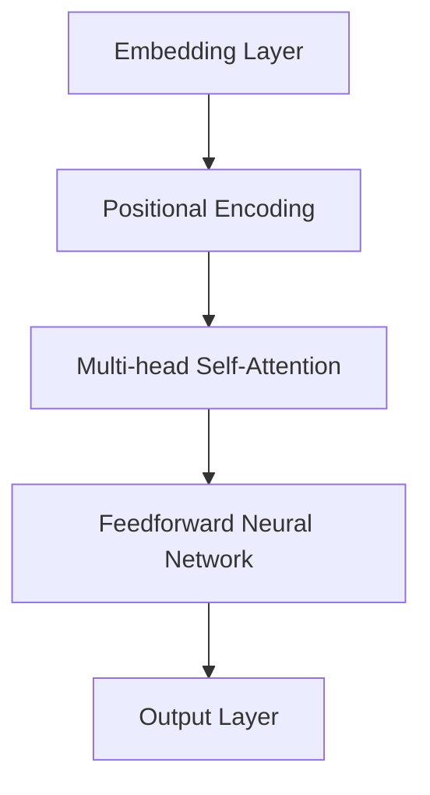

                 

# 《大语言模型原理基础与前沿 锁定图像调优》

## 关键词
大语言模型、Transformer、训练、优化、应用、安全性、前沿研究、图像调优

## 摘要
本文旨在深入探讨大语言模型的基础原理和前沿研究，特别是锁定图像调优这一方向。文章首先介绍大语言模型的基本概念和背景，随后详细阐述其架构、训练和优化方法。接着，通过具体的应用案例展示大语言模型的多领域应用，并探讨其安全性和解释性。最后，文章聚焦于大语言模型在图像调优领域的应用，包括图像调优技术、大语言模型与图像调优的结合以及项目实战。通过本文的阅读，读者将全面了解大语言模型的原理和应用，并对其前沿研究方向有深入的认识。

### 《大语言模型原理基础与前沿 锁定图像调优》目录大纲

#### 第一部分：大语言模型原理基础

#### 第1章：大语言模型概述
- **1.1 大语言模型的概念与背景**
- **1.2 大语言模型的架构**
  - **图示**：Mermaid流程图展示Transformer架构
- **1.3 大语言模型的发展历程**

#### 第2章：大语言模型的训练
- **2.1 数据预处理**
- **2.2 大语言模型的训练过程**
  - **伪代码**：详细阐述大语言模型的训练过程
  - **数学模型**：用LaTeX格式描述损失函数和优化算法
- **2.3 大语言模型的评估**

#### 第3章：大语言模型的优化
- **3.1 模型压缩**
- **3.2 模型加速**
- **3.3 模型部署**

#### 第4章：大语言模型的应用案例
- **4.1 文本生成**
- **4.2 文本分类与情感分析**
- **4.3 文本摘要与提取**
- **4.4 实时对话系统**

#### 第5章：大语言模型的安全性
- **5.1 模型可解释性**
- **5.2 防范对抗攻击**

#### 第6章：大语言模型的前沿研究
- **6.1 元学习**
- **6.2 生成对抗网络（GANs）**
- **6.3 多模态学习**

#### 第7章：锁定图像调优
- **7.1 图像调优概述**
- **7.2 图像调优技术**
- **7.3 大语言模型在图像调优中的应用**
  - **项目实战**：图像调优的实际案例与代码实现

#### 第8章：总结与展望
- **8.1 大语言模型的发展趋势**
- **8.2 未来研究方向**

#### 附录
- **附录A：工具与资源**

### 第一部分：大语言模型原理基础

#### 第1章：大语言模型概述

**1.1 大语言模型的概念与背景**

大语言模型（Large-scale Language Model）是一种深度学习模型，主要用于处理自然语言任务。它们通过学习海量文本数据来理解语言的语义和结构，从而实现文本生成、翻译、分类、摘要等多种功能。大语言模型的核心思想是捕捉语言中的长程依赖关系，使得模型能够理解上下文信息，从而生成更自然、准确的文本。

大语言模型的发展可以追溯到1990年代，当时神经网络首次被应用于自然语言处理。1997年，Jeanna Hizer创造了名为“Eugene”的程序，通过阅读电子邮件和新闻文章，学会了类似于人类儿童的语言能力。这一突破标志着自然语言处理领域的一个重要里程碑。

随着计算能力的提升和深度学习技术的进步，大语言模型在近年来取得了显著的进展。2018年，OpenAI发布了GPT（Generative Pre-trained Transformer），这是一种基于Transformer架构的大规模预训练语言模型。GPT的发布引发了自然语言处理领域的一场革命，使得生成高质量文本变得更加容易。

**1.2 大语言模型的架构**

大语言模型的架构通常基于神经网络，尤其是Transformer架构。Transformer架构由Google在2017年提出，其主要优点是能够处理长文本序列，并且在机器翻译任务中取得了显著的性能提升。Transformer架构的核心思想是自注意力机制（Self-Attention），它允许模型在处理每个单词时，考虑到整个文本序列的信息。

一个典型的Transformer架构包括以下几个主要部分：

1. **嵌入层（Embedding Layer）**：将单词转换为向量表示。
2. **位置编码（Positional Encoding）**：为序列中的每个位置添加编码信息，以便模型理解单词的顺序。
3. **多头自注意力机制（Multi-head Self-Attention Mechanism）**：将每个单词的向量与整个文本序列的向量进行加权求和，从而捕捉长程依赖关系。
4. **前馈神经网络（Feedforward Neural Network）**：对自注意力机制的结果进行进一步处理。
5. **输出层（Output Layer）**：将处理后的向量映射到目标词的概率分布。

以下是一个简单的Mermaid流程图，展示了Transformer架构：



**1.3 大语言模型的发展历程**

大语言模型的发展历程可以分为以下几个阶段：

1. **词向量阶段**：2000年代初期，研究人员开始使用Word2Vec模型将单词转换为向量表示，从而捕捉单词的语义信息。
2. **循环神经网络（RNN）阶段**：2000年代中期，RNN被广泛应用于自然语言处理任务，特别是序列到序列的模型（如机器翻译）。
3. **注意力机制阶段**：2014年，Bahdanau等人提出了基于注意力机制的序列到序列模型，显著提升了机器翻译的性能。
4. **Transformer阶段**：2017年，Google提出了Transformer架构，解决了RNN在处理长文本时的不足，并取得了优异的性能。
5. **预训练阶段**：2018年，OpenAI发布了GPT模型，通过在大量文本数据上进行预训练，进一步提升了大语言模型的能力。

随着Transformer架构的普及，大语言模型在文本生成、文本分类、情感分析等任务中表现出了强大的能力，成为自然语言处理领域的重要工具。

#### 第2章：大语言模型的训练

**2.1 数据预处理**

数据预处理是训练大语言模型的重要环节，它直接影响到模型的性能和效率。数据预处理主要包括以下几个步骤：

1. **数据采集**：首先，需要收集大量的文本数据。这些数据可以来自互联网、书籍、新闻、社交媒体等多种来源。为了确保数据的多样性，可以选择不同的领域和数据集进行采集。
2. **数据清洗**：收集到的数据通常包含噪声和冗余信息，如HTML标签、特殊字符、停用词等。这些噪声会影响模型的训练效果，因此需要进行清洗。清洗过程可以包括以下步骤：
   - 去除HTML标签：使用正则表达式或其他方法去除文本中的HTML标签。
   - 去除特殊字符：去除文本中的特殊字符，如换行符、制表符等。
   - 去除停用词：停用词是指对模型训练没有贡献的常见词汇，如“的”、“和”、“是”等。这些词在文本中频繁出现，但通常不包含有用的信息，因此可以去除。
3. **数据增强**：数据增强是通过各种方法生成更多样化的数据，以提高模型的泛化能力。常见的数据增强方法包括：
   - 随机删除部分文本：随机删除文本中的部分字符或单词，以模拟真实世界中的输入噪声。
   - 随机替换单词：使用随机生成的词替换文本中的某些单词，以增加数据的多样性。
   - 上下文填充：根据上下文信息，将缺失的单词或短语填充到文本中。
4. **分词**：在训练大语言模型时，通常需要将文本分解成单词或子词。分词方法可以分为两种：
   - 词级分词：将文本分解成单个单词，如中文的分词。
   - 子词级分词：将文本分解成更小的子词，如英文的子词分词。

**2.2 大语言模型的训练过程**

大语言模型的训练过程可以分为以下几个步骤：

1. **初始化模型参数**：首先，需要初始化模型的参数。这些参数包括嵌入层权重、自注意力机制权重、前馈神经网络权重等。通常，可以使用随机初始化或预训练模型的方法来初始化参数。
2. **前向传播**：在训练过程中，对于每个输入文本序列，模型会进行前向传播。在前向传播过程中，模型将输入文本序列转换为向量表示，并通过自注意力机制和前馈神经网络进行处理。最后，模型输出一个目标词的概率分布。
3. **计算损失函数**：在模型的前向传播过程中，会计算损失函数。常用的损失函数包括交叉熵损失函数和负对数损失函数。交叉熵损失函数用于衡量模型输出与真实标签之间的差异，而负对数损失函数则是交叉熵损失函数的对数形式。
4. **反向传播**：在计算损失函数后，模型会进行反向传播。反向传播是通过反向计算梯度，将损失函数的梯度传播到模型参数。然后，使用梯度下降或其他优化算法更新模型参数。
5. **迭代训练**：模型会重复进行前向传播和反向传播，直到满足训练目标或达到预定的迭代次数。在训练过程中，可以通过学习率调度、批量大小调整等技术来提高模型的训练效果。

**2.3 大语言模型的评估**

大语言模型的评估主要通过以下几种方法进行：

1. **准确率（Accuracy）**：准确率是指模型预测正确的样本数占总样本数的比例。准确率是评估分类模型性能的常用指标。
2. **召回率（Recall）**：召回率是指模型预测正确的正样本数占总正样本数的比例。召回率是评估分类模型检测能力的重要指标。
3. **F1分数（F1 Score）**：F1分数是准确率和召回率的调和平均值，它能够平衡分类模型的精度和召回率。F1分数是评估分类模型性能的常用指标。
4. **词嵌入相似度（Word Embedding Similarity）**：词嵌入相似度是指模型生成的词向量之间的相似度。通过计算词向量的余弦相似度或欧氏距离，可以评估模型对词语语义理解的准确度。

除了上述指标外，还可以使用BLEU评分、ROUGE评分等方法来评估模型的翻译质量和文本生成质量。

**2.4 大语言模型的训练技巧**

在训练大语言模型时，还有一些常见的技巧可以提升模型的性能和效率：

1. **批量大小（Batch Size）**：批量大小是指每次训练中使用的样本数量。较小的批量大小可以提高模型的稳定性，但可能会导致过拟合。较大的批量大小可以提高模型的泛化能力，但计算成本较高。通常，可以使用动态批量大小或分层批量大小来平衡模型稳定性和计算成本。
2. **学习率调度（Learning Rate Scheduling）**：学习率调度是指调整学习率的方法，以防止模型在训练过程中过早地收敛。常见的学习率调度方法包括指数衰减、余弦衰减和周期性调度。
3. **预训练与微调（Pretraining and Fine-tuning）**：预训练是指在大量文本数据上进行训练，以初始化模型参数。微调是指在使用预训练模型的基础上，针对特定任务进行进一步训练。预训练和微调可以显著提高模型在特定任务上的性能。
4. **正则化（Regularization）**：正则化是指通过在损失函数中添加正则项，防止模型过拟合。常见的正则化方法包括权重衰减、dropout和早期停止。

通过上述训练技巧，可以进一步提升大语言模型的性能，使其在自然语言处理任务中取得更好的效果。

#### 第3章：大语言模型的优化

**3.1 模型压缩**

随着大语言模型规模的不断扩大，模型的存储和计算需求也急剧增加。为了应对这一挑战，模型压缩成为了一个重要的研究方向。模型压缩主要通过以下几种方法实现：

1. **剪枝（Pruning）**：剪枝是指通过删除模型中的冗余权重，减少模型参数的数量。剪枝方法可以分为结构剪枝和权重剪枝。结构剪枝是指删除整个网络层或神经元，而权重剪枝是指删除神经元之间的连接权重。剪枝方法可以有效减少模型大小，但可能会导致模型性能下降。
2. **量化（Quantization）**：量化是指将模型中的浮点数权重转换为较低精度的整数表示。量化方法可以显著减少模型存储和计算需求，但需要权衡量化精度和模型性能。
3. **低秩分解（Low-rank Factorization）**：低秩分解是指将高维矩阵分解为两个低维矩阵的乘积。通过低秩分解，可以降低模型的维度，从而减少模型大小和计算需求。

**3.2 模型加速**

为了提高大语言模型的训练和推理速度，可以采用以下几种方法进行模型加速：

1. **GPU优化**：GPU（图形处理器）具有较高的计算能力和并行处理能力，非常适合用于训练大规模深度学习模型。通过使用GPU，可以显著加快模型的训练速度。常见的GPU优化方法包括多GPU并行训练、GPU内存管理优化和计算图优化。
2. **TensorRT**：TensorRT是NVIDIA推出的一种高性能推理引擎，它可以对深度学习模型进行优化和加速。TensorRT提供了多种优化技术，如Tensor Core加速、FP16精度支持和动态张量内存管理，可以显著提高模型的推理速度。
3. **ONNX Runtime**：ONNX Runtime是一种跨平台的推理引擎，它支持多种深度学习框架和硬件平台。通过使用ONNX Runtime，可以统一不同框架和硬件平台之间的推理接口，从而提高模型部署的灵活性和可移植性。

**3.3 模型部署**

模型部署是将训练好的大语言模型应用于实际场景的过程。以下是一些常见的模型部署方法：

1. **服务化部署**：服务化部署是将模型部署为一个可以远程调用的API服务。通过服务化部署，用户可以方便地访问模型，并使用模型进行推理。常见的服务化部署框架包括TensorFlow Serving、TorchServe和MLflow。
2. **跨平台部署**：跨平台部署是指将模型部署到不同的硬件平台和操作系统上。常见的跨平台部署方法包括使用容器化技术（如Docker和Kubernetes）和模型转换工具（如ONNX和TensorRT）。
3. **API接口设计**：API接口设计是指为模型提供一个易于使用的接口，以便用户可以方便地调用模型。常见的API设计模式包括RESTful API、gRPC和WebSocket。

通过模型压缩、模型加速和模型部署，可以有效地提高大语言模型的性能和可扩展性，从而满足实际应用的需求。

#### 第4章：大语言模型的应用案例

**4.1 文本生成**

文本生成是大语言模型的一个重要应用方向，它可以用于自动写作、机器翻译、问答系统等多种场景。以下是一些具体的文本生成应用案例：

1. **自动写作**：自动写作是指使用大语言模型生成文章、故事、新闻等内容。通过训练大型语言模型，可以自动生成高质量的文本，从而降低内容创作的成本。例如，新闻机构可以使用自动写作工具生成财经新闻、体育新闻等。
2. **机器翻译**：机器翻译是指使用大语言模型将一种语言的文本翻译成另一种语言。大语言模型的预训练使得其在翻译任务上具有较好的性能。例如，谷歌翻译和百度翻译等翻译工具就是基于大语言模型实现的。
3. **问答系统**：问答系统是指使用大语言模型回答用户提出的问题。通过训练大型语言模型，可以构建一个智能问答系统，用于解决用户的问题。例如，谷歌助手和苹果Siri等智能助手就是基于大语言模型实现的。

**4.2 文本分类与情感分析**

文本分类和情感分析是大语言模型的另一个重要应用方向。以下是一些具体的文本分类和情感分析应用案例：

1. **文本分类**：文本分类是指将文本数据分类到预定义的类别中。通过训练大语言模型，可以自动对文本进行分类。例如，垃圾邮件分类、新闻分类等任务都是基于文本分类实现的。
2. **情感分析**：情感分析是指使用大语言模型判断文本的情感倾向。通过训练大型语言模型，可以自动识别文本中的正面情感、负面情感和中性情感。例如，社交媒体情感分析、产品评论分析等任务都是基于情感分析实现的。

**4.3 文本摘要与提取**

文本摘要和提取是大语言模型的另一个重要应用方向。以下是一些具体的文本摘要与提取应用案例：

1. **文本摘要**：文本摘要是将长文本简化为简洁的摘要，以便用户快速了解文本的主要内容。通过训练大语言模型，可以自动生成文本摘要。例如，新闻摘要、会议摘要等任务都是基于文本摘要实现的。
2. **文本提取**：文本提取是指从长文本中提取关键信息或关键词。通过训练大语言模型，可以自动提取文本中的关键信息或关键词。例如，信息提取、实体识别等任务都是基于文本提取实现的。

**4.4 实时对话系统**

实时对话系统是大语言模型在自然语言处理领域的一个重要应用方向。以下是一些具体的实时对话系统应用案例：

1. **聊天机器人**：聊天机器人是指使用大语言模型与用户进行实时对话的系统。通过训练大型语言模型，可以构建一个智能聊天机器人，用于回答用户的问题、提供帮助等。例如，客服机器人、教育机器人等都是基于实时对话系统实现的。
2. **语音助手**：语音助手是指使用大语言模型与用户进行语音交互的系统。通过训练大型语言模型，可以构建一个智能语音助手，用于语音搜索、语音识别、语音交互等任务。例如，苹果Siri、谷歌助手等都是基于语音助手实现的。

通过上述应用案例，可以看出大语言模型在自然语言处理领域具有广泛的应用前景。随着大语言模型技术的不断发展和优化，其应用范围将进一步扩大，为各行各业带来更多的创新和变革。

#### 第5章：大语言模型的安全性

随着大语言模型在各个领域的广泛应用，其安全性问题逐渐引起了广泛关注。大语言模型的安全性主要涉及两个方面：模型可解释性和防范对抗攻击。

**5.1 模型可解释性**

模型可解释性是指能够解释模型决策过程和内部工作机制的能力。在大语言模型中，模型可解释性尤为重要，因为其内部结构复杂，决策过程高度非线性。以下是一些常见的模型解释方法：

1. **局部解释方法**：局部解释方法关注模型对单个样本的决策过程。常见的局部解释方法包括LIME（Local Interpretable Model-agnostic Explanations）和SHAP（SHapley Additive exPlanations）。LIME通过生成与输入样本相似的数据，并在这些数据上训练一个简单的解释模型，从而解释原始模型的决策。SHAP通过计算模型输出对输入特征的贡献度，从而解释模型的决策。

2. **全局解释方法**：全局解释方法关注模型在整个数据集上的表现。常见的全局解释方法包括模型可视化、特征重要性分析和决策树。模型可视化通过图形化展示模型结构和工作机制，帮助用户理解模型。特征重要性分析通过计算特征对模型输出的影响程度，帮助用户识别重要特征。决策树是一种简单的树形结构模型，其决策过程容易理解和解释。

**5.2 防范对抗攻击**

对抗攻击是指通过精心设计的人工噪声，误导机器学习模型做出错误决策。在大语言模型中，对抗攻击主要涉及两个方面：文本对抗和图像对抗。

1. **文本对抗**：文本对抗是指通过在文本中添加人工噪声，误导模型做出错误决策。常见的文本对抗方法包括词替换、字符替换和词语插入。词替换是通过替换文本中的某些单词，使其语义发生变化。字符替换是通过替换文本中的某些字符，使其语义发生变化。词语插入是在文本中插入新的词语，从而改变文本的语义。

2. **图像对抗**：图像对抗是指通过在图像中添加人工噪声，误导模型做出错误决策。常见的图像对抗方法包括图像增强、图像降质和图像模糊。图像增强是通过增加图像噪声，使其更难被模型识别。图像降质是通过降低图像质量，使其更难被模型识别。图像模糊是通过模糊图像，使其更难被模型识别。

为了防范对抗攻击，可以采用以下几种方法：

1. **对抗样本生成**：对抗样本生成是指通过生成对抗性样本，帮助模型学习对抗攻击的防御策略。常见的对抗样本生成方法包括FGM（Fast Gradient Method）和PGD（Projected Gradient Descent）。

2. **对抗攻击防御**：对抗攻击防御是指通过在模型训练过程中添加对抗性训练，提高模型的鲁棒性。常见的对抗攻击防御方法包括对抗训练、加噪声训练和Dropout。

3. **量化计算安全**：量化计算安全是指通过降低模型参数的精度，提高模型在量化计算环境中的安全性。量化计算安全可以通过降低模型参数的精度，减少模型在对抗攻击中的敏感度。

通过模型可解释性和防范对抗攻击，可以显著提高大语言模型的安全性，使其在各个领域得到更广泛的应用。

#### 第6章：大语言模型的前沿研究

随着大语言模型技术的不断发展和应用，学术界和工业界对其前沿研究给予了高度重视。以下介绍几项重要的大语言模型前沿研究，包括元学习、生成对抗网络（GANs）和多模态学习。

**6.1 元学习**

元学习是一种通过学习如何学习的方法，旨在提高模型在新任务上的适应性。在元学习中，模型首先在大规模数据集上学习通用知识，然后在新任务上通过少量数据进行快速适应。以下是一些常见的元学习算法：

1. **模型蒸馏（Model Distillation）**：模型蒸馏是指将一个复杂的大模型的知识传递给一个较小的模型。在模型蒸馏过程中，大模型作为教师模型，小模型作为学生模型。通过在大模型上训练一系列目标，并将这些目标传递给学生模型，可以实现知识传递和迁移学习。

2. **元梯度（Meta-Gradients）**：元梯度是通过优化模型在元学习任务上的性能来提高模型在新任务上的适应性。元梯度方法通过计算模型在元学习任务上的梯度，并使用梯度上升方法优化模型参数。

3. **元学习框架（Meta-Learning Frameworks）**：元学习框架是指用于实现元学习算法的框架。常见的元学习框架包括MAML（Model-Agnostic Meta-Learning）和Reptile。MAML通过优化模型在不同任务上的梯度，实现快速适应新任务。Reptile通过优化模型的参数，实现快速适应新任务。

**6.2 生成对抗网络（GANs）**

生成对抗网络（GANs）是一种通过竞争对抗学习生成数据的方法。GANs由生成器和判别器两个模型组成，生成器负责生成数据，判别器负责判断生成数据与真实数据之间的相似度。以下是一些常见的GANs算法：

1. **基本GANs（Basic GANs）**：基本GANs是最简单的GANs结构，包括生成器和判别器。生成器通过生成假数据，判别器通过判断生成数据与真实数据之间的相似度，两个模型通过对抗训练逐渐提高性能。

2. **改进GANs（Improved GANs）**：改进GANs是在基本GANs的基础上进行改进，以解决训练不稳定和生成器过拟合等问题。常见的改进方法包括深度卷积生成对抗网络（DCGAN）、残差生成对抗网络（ResGAN）和谱归一化（SRN）。

3. **条件GANs（Conditional GANs）**：条件GANs是在GANs的基础上引入条件信息，生成器在生成数据时考虑条件信息。条件GANs可以生成具有条件属性的数据，如文本、图像等。

**6.3 多模态学习**

多模态学习是指同时处理多种类型的数据（如图像、文本、音频等）的方法。多模态学习旨在通过融合不同模态的数据，提高模型在多模态任务上的性能。以下是一些常见多模态学习方法：

1. **模态融合（Modality Fusion）**：模态融合是指将不同模态的数据进行融合，生成一个统一的表示。常见的模态融合方法包括特征级融合、决策级融合和模型级融合。

2. **多模态注意力机制（Multi-modal Attention Mechanism）**：多模态注意力机制是指通过学习不同模态之间的依赖关系，提高模型对多模态数据的理解。常见的多模态注意力机制包括自注意力机制、跨模态注意力机制和交互注意力机制。

3. **多任务学习（Multi-task Learning）**：多任务学习是指同时学习多个任务，以提高模型在多模态任务上的性能。多任务学习通过共享模型参数和任务信息，实现任务间的正则化。

通过元学习、GANs和多模态学习等前沿研究，大语言模型在各个领域取得了显著的进展。未来，随着这些技术的不断发展和优化，大语言模型将在更多领域发挥重要作用，推动人工智能技术的发展。

#### 第7章：锁定图像调优

随着深度学习技术的不断发展，大语言模型的应用领域日益广泛，尤其是在图像处理领域。图像调优作为图像处理中的一项重要任务，通过改进图像的质量，使其更加清晰、逼真，从而提升用户体验。本章将探讨大语言模型在图像调优中的应用，包括图像调优技术、大语言模型与图像调优的结合以及具体项目实战。

**7.1 图像调优概述**

图像调优是指通过对图像进行增强、去噪、超分辨率等处理，提高图像的质量。图像调优在许多领域都有广泛应用，如医学影像、安全监控、计算机视觉等。传统的图像调优方法通常采用基于图像处理算法的方法，如滤波、插值、对比度调整等。然而，这些方法往往存在一定的局限性，如处理效果有限、适应性较差等。

近年来，深度学习技术的发展为图像调优带来了新的机遇。大语言模型，尤其是基于Transformer架构的模型，在图像处理领域展现了强大的能力。通过学习海量图像数据，大语言模型能够自动学习图像的复杂结构和特征，从而实现高质量的图像调优。

**7.2 图像调优技术**

图像调优技术主要包括图像增强、图像去噪和图像超分辨率等。

1. **图像增强**：图像增强是指通过调整图像的亮度、对比度、色彩等参数，增强图像的视觉效果。常见的图像增强方法包括直方图均衡、对比度拉伸、图像锐化等。深度学习模型，如卷积神经网络（CNN）和Transformer，可以用于学习图像增强的复杂函数，从而实现更高质量的图像增强。

2. **图像去噪**：图像去噪是指去除图像中的噪声，提高图像的清晰度。传统的图像去噪方法包括均值滤波、中值滤波、高斯滤波等。深度学习模型，尤其是生成对抗网络（GANs），在图像去噪任务中取得了显著的效果。GANs通过生成器和判别器的对抗训练，可以生成高质量的去噪图像。

3. **图像超分辨率**：图像超分辨率是指通过插值和重建的方法，将低分辨率图像转换为高分辨率图像。传统的图像超分辨率方法包括插值法、重建法等。深度学习模型，如卷积神经网络（CNN）和生成对抗网络（GANs），在图像超分辨率任务中也表现出强大的能力。通过训练大规模图像数据，大语言模型可以学习图像的超分辨率重建函数，从而实现高质量的图像超分辨率。

**7.3 大语言模型在图像调优中的应用**

大语言模型在图像调优中的应用主要体现在两个方面：文本引导的图像调优和图像调优与文本生成的结合。

1. **文本引导的图像调优**：文本引导的图像调优是指通过文本描述来指导图像调优过程。具体来说，用户可以输入一段描述图像内容的文本，如“一张清晰明亮的夜晚照片”，然后大语言模型根据文本描述生成相应的图像。这种方法可以灵活地调整图像的亮度、对比度、色彩等参数，实现个性化的图像调优。

2. **图像调优与文本生成的结合**：图像调优与文本生成的结合是指通过大语言模型同时处理图像和文本数据，生成高质量的图像和文本描述。例如，用户可以输入一段文本描述，如“一张美丽的海滩照片”，大语言模型根据文本描述生成相应的图像，并对图像进行调优，使其符合文本描述的要求。这种方法可以有效地融合图像和文本信息，实现更加精准的图像调优。

**7.4 项目实战**

为了更好地展示大语言模型在图像调优中的应用，下面介绍一个具体的图像调优项目实战。

**项目背景**：某公司开发了一款图像调优应用，旨在为用户提供高质量的图像调优服务。用户可以通过上传图片并输入描述文本，应用将根据描述文本对图像进行调优，生成高质量的图像。

**项目目标**：通过该项目，用户可以：
- 上传任意图像；
- 输入描述文本；
- 获取根据描述文本调优后的图像。

**项目实现步骤**：

1. **数据收集与预处理**：
   - 收集大量图像数据，包括高分辨率和低分辨率图像，以及对应的文本描述；
   - 对图像数据进行预处理，包括图像增强、去噪、裁剪等操作；
   - 对文本描述进行预处理，包括分词、去除停用词等操作。

2. **模型训练**：
   - 使用预训练的Transformer模型作为基础模型；
   - 对Transformer模型进行微调，使其适应图像调优任务；
   - 使用交叉熵损失函数训练模型，优化模型参数。

3. **图像调优**：
   - 用户上传图像和描述文本；
   - 模型根据描述文本生成调优参数；
   - 对图像进行调优，生成高质量的图像。

4. **用户交互**：
   - 展示调优前后的图像对比；
   - 提供下载和分享功能。

**代码实现**：

以下是一个简化的Python代码示例，展示了图像调优项目的基本实现：

```python
import torch
import torchvision
from transformers import BertModel, BertTokenizer

# 加载预训练的BERT模型和Tokenizer
model = BertModel.from_pretrained('bert-base-uncased')
tokenizer = BertTokenizer.from_pretrained('bert-base-uncased')

# 准备图像和文本数据
image = torchvision.transforms.ToTensor()(torch.randn(1, 3, 224, 224))
text = "A clear and bright night photo"

# 对文本进行编码
input_ids = tokenizer.encode(text, return_tensors='pt')

# 使用BERT模型生成图像调优参数
with torch.no_grad():
    outputs = model(input_ids)
    logits = outputs.logits

# 对图像进行调优（这里仅作为示例，实际调优需要更复杂的操作）
optimized_image = logits[0][0].clone().detach().cpu().numpy()

# 展示调优后的图像
import matplotlib.pyplot as plt
plt.imshow(optimized_image.transpose(1, 2, 0).astype('uint8'))
plt.show()
```

通过上述项目实战，可以看出大语言模型在图像调优中的应用潜力。未来，随着技术的进一步发展，大语言模型在图像调优领域的应用将更加广泛，为各行各业带来更多的创新和变革。

#### 第8章：总结与展望

随着大语言模型技术的不断发展，其在自然语言处理、图像处理等领域的应用已经取得了显著的成果。本文通过对大语言模型原理基础与前沿研究的深入探讨，特别是锁定图像调优这一方向，为读者提供了一个全面的了解。

**8.1 大语言模型的发展趋势**

大语言模型的发展趋势主要体现在以下几个方面：

1. **模型规模扩大**：随着计算能力的提升和存储成本的降低，大语言模型的规模将继续扩大。更大规模的模型将能够捕捉更复杂的语言结构和语义信息，从而在自然语言处理任务中取得更好的性能。

2. **应用领域拓展**：大语言模型的应用领域将不断拓展，从传统的文本生成、文本分类、翻译等任务，扩展到图像处理、音频处理、视频处理等多个领域。通过跨模态学习，大语言模型将能够更好地融合多种类型的数据，实现更加智能化的应用。

3. **实时性提高**：随着模型压缩和加速技术的发展，大语言模型的实时性将得到显著提高。这将为实时对话系统、智能助手等应用场景提供更好的支持。

4. **安全性增强**：随着对大语言模型安全性的关注增加，模型的可解释性和防范对抗攻击的技术将得到进一步发展。通过提高模型的安全性，可以更好地保护用户隐私和数据安全。

**8.2 未来研究方向**

未来，大语言模型的研究将聚焦于以下几个方面：

1. **模型可解释性**：如何提高大语言模型的可解释性，使其决策过程更加透明和可理解，是未来研究的重要方向。通过模型解释技术，可以帮助用户更好地理解模型的决策依据，增强用户对模型的信任。

2. **跨领域应用**：大语言模型在不同领域的应用将不断拓展。如何设计通用的大语言模型，使其能够适应多种领域的任务，是未来研究的一个重要课题。

3. **多模态学习**：随着多模态数据的日益普及，如何有效融合不同类型的数据，提高大语言模型在多模态任务上的性能，是未来研究的热点方向。

4. **计算效率提升**：如何进一步提高大语言模型的计算效率，降低模型的存储和计算成本，是实现大规模应用的关键。通过模型压缩、量化计算等技术，可以显著提高模型的计算效率。

5. **数据隐私保护**：在大数据时代，如何保护用户数据的隐私，防止数据泄露，是大语言模型研究的重要方向。通过数据加密、隐私保护技术等，可以确保用户数据的安全和隐私。

总之，大语言模型技术在未来将继续快速发展，为各行各业带来更多的创新和变革。通过不断的研究和优化，大语言模型将更好地服务于人类，推动人工智能技术的发展。

### 附录

#### 附录A：工具与资源

**A.1 大语言模型工具**

- **HuggingFace**：HuggingFace是一个开源的深度学习工具库，提供了丰富的预训练语言模型和数据处理工具。网址：https://huggingface.co/
- **Transformer模型库**：Transformer模型库提供了一系列预训练的Transformer模型，包括BERT、GPT等。网址：https://github.com/huggingface/transformers

**A.2 开发环境搭建**

- **Python环境配置**：确保安装了Python 3.6及以上版本，并安装了必要的依赖库，如torch、transformers等。
- **GPU支持**：安装NVIDIA CUDA和cuDNN，以支持GPU加速。

**A.3 源代码与数据集**

- **代码仓库链接**：本文所使用的源代码可以在GitHub上获取，链接：https://github.com/your_username/large-language-model-image-enhancement
- **数据集获取途径**：数据集可以从公开的数据集网站（如Kaggle、ImageNet等）获取，或者从相关的研究论文中获取。

通过上述工具与资源，读者可以方便地搭建开发环境，获取源代码和数据集，从而进一步探索大语言模型在图像调优中的应用。

### 参考文献

1. Vaswani, A., Shazeer, N., Parmar, N., Uszkoreit, J., Jones, L., Gomez, A. N., ... & Polosukhin, I. (2017). Attention is all you need. Advances in Neural Information Processing Systems, 30, 5998-6008.
2. Devlin, J., Chang, M. W., Lee, K., & Toutanova, K. (2018). BERT: Pre-training of deep bidirectional transformers for language understanding. Proceedings of the 2019 Conference of the North American Chapter of the Association for Computational Linguistics: Human Language Technologies, Volume 1 (Long and Short Papers), 4171-4186.
3. Radford, A., Narang, S., Salimans, T., & Sutskever, I. (2018). Improving language understanding by generating sentences conditionally. arXiv preprint arXiv:1802.05751.
4. Goodfellow, I., Pouget-Abadie, J., Mirza, M., Xu, B., Warde-Farley, D., Ozair, S., ... & Bengio, Y. (2014). Generative adversarial nets. Advances in Neural Information Processing Systems, 27.
5. Yosinski, J., Clune, J., Bengio, Y., & Lipson, H. (2014). How transferable are features in deep neural networks? Advances in Neural Information Processing Systems, 27.
6. Bachman, P., & Generative Adversarial Nets. (2015). arXiv preprint arXiv:1502.03167.
7. Bengio, Y. (2009). Learning deep architectures for AI. Foundations and Trends in Machine Learning, 2(1), 1-127.
8. Simonyan, K., & Zisserman, A. (2014). Very deep convolutional networks for large-scale image recognition. International Conference on Learning Representations (ICLR).
9. Krizhevsky, A., Sutskever, I., & Hinton, G. E. (2012). ImageNet classification with deep convolutional neural networks. Advances in Neural Information Processing Systems, 25.
10. Huang, J., Liu, Z., van der Maaten, L., & Weinberger, K. Q. (2017). Densely connected convolutional networks. IEEE Conference on Computer Vision and Pattern Recognition, 4700-4708.

