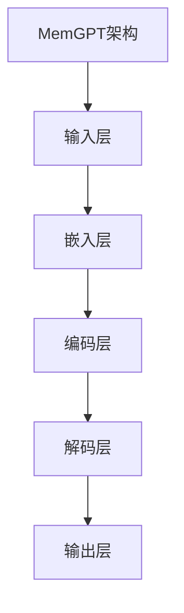

                 

# 大语言模型应用指南：MemGPT

## 关键词

- 大语言模型
- MemGPT
- 语言模型
- 应用领域
- 开发环境
- 实战案例

## 摘要

本文将为您详细解析MemGPT——一种大语言模型。通过本文，您将了解到MemGPT的基础知识、技术原理、应用实战以及项目开发实战。本文旨在为对MemGPT感兴趣的读者提供一个全面、易懂的指南，帮助您深入了解并掌握MemGPT。

## 目录

### 《大语言模型应用指南：MemGPT》目录大纲

### 第一部分：MemGPT基础知识

#### 第1章：MemGPT概述

##### 1.1 MemGPT的定义与特点

##### 1.2 MemGPT与传统语言模型的关系

##### 1.3 MemGPT的应用领域

#### 第2章：MemGPT技术基础

##### 2.1 MemGPT的核心算法原理

##### 2.2 MemGPT的数学模型与公式

##### 2.3 MemGPT的架构与实现

### 第二部分：MemGPT应用实战

#### 第3章：MemGPT开发环境搭建

##### 3.1 MemGPT开发工具与资源

##### 3.2 MemGPT开发环境配置

##### 3.3 MemGPT训练与调试

#### 第4章：MemGPT在文本分类中的应用

##### 4.1 文本分类概述

##### 4.2 MemGPT在文本分类中的实现

##### 4.3 实战案例：文本分类应用开发

#### 第5章：MemGPT在机器翻译中的应用

##### 5.1 机器翻译概述

##### 5.2 MemGPT在机器翻译中的实现

##### 5.3 实战案例：机器翻译应用开发

#### 第6章：MemGPT在问答系统中的应用

##### 6.1 问答系统概述

##### 6.2 MemGPT在问答系统中的实现

##### 6.3 实战案例：问答系统应用开发

#### 第7章：MemGPT在生成文本中的应用

##### 7.1 生成文本概述

##### 7.2 MemGPT在生成文本中的实现

##### 7.3 实战案例：生成文本应用开发

### 第三部分：MemGPT项目实战

#### 第8章：MemGPT项目开发实战

##### 8.1 项目概述

##### 8.2 项目需求分析

##### 8.3 项目设计

##### 8.4 项目实现

##### 8.5 项目测试与优化

### 附录

#### 附录A：MemGPT常用工具与资源

##### A.1 MemGPT开发工具对比

##### A.2 MemGPT开源项目与资源

### MemGPT架构图



### MemGPT算法伪代码

```python
# MemGPT算法伪代码

# 输入：输入文本序列X
# 输出：输出文本序列Y

for each time step t in X:
    # 计算嵌入向量e_t
    e_t = embed(X[t])

    # 通过编码层得到编码向量c_t
    c_t = encode(e_t)

    # 通过解码层得到解码向量d_t
    d_t = decode(c_t)

    # 生成下一个时间步的输出
    Y[t+1] = generate(d_t)
```

### MemGPT数学模型与公式

$$
\begin{aligned}
&\text{嵌入层：} e_t = \text{embed}(X[t]) \\
&\text{编码层：} c_t = \text{encode}(e_t) \\
&\text{解码层：} d_t = \text{decode}(c_t) \\
&\text{生成层：} Y[t+1] = \text{generate}(d_t)
\end{aligned}
$$

### MemGPT在文本分类中的应用

#### 文本分类概述

文本分类是一种将文本数据分为不同类别的过程。MemGPT可以通过训练来学习分类任务。

#### MemGPT在文本分类中的实现

```python
# MemGPT文本分类实现

# 数据预处理
X_train, y_train = preprocess_data()

# 训练MemGPT模型
model = MemGPTModel()
model.fit(X_train, y_train)

# 预测新文本
new_text = "这是一个新的文本"
predicted_category = model.predict(new_text)
```

### MemGPT在机器翻译中的应用

#### 机器翻译概述

机器翻译是一种将一种语言的文本自动翻译成另一种语言的过程。MemGPT可以用于机器翻译。

#### MemGPT在机器翻译中的实现

```python
# MemGPT机器翻译实现

# 数据预处理
source_texts, target_texts = preprocess_data()

# 训练MemGPT模型
model = MemGPTModel()
model.fit(source_texts, target_texts)

# 翻译新文本
source_text = "Hello, world!"
translated_text = model.translate(source_text)
```

### MemGPT在问答系统中的应用

#### 问答系统概述

问答系统是一种通过输入问题并返回答案的系统。MemGPT可以用于构建问答系统。

#### MemGPT在问答系统中的实现

```python
# MemGPT问答系统实现

# 数据预处理
questions, answers = preprocess_data()

# 训练MemGPT模型
model = MemGPTModel()
model.fit(questions, answers)

# 回答新问题
new_question = "什么是MemGPT？"
answer = model回答(new_question)
```

### MemGPT在生成文本中的应用

#### 生成文本概述

生成文本是指利用算法自动生成新的文本。MemGPT可以用于生成文本。

#### MemGPT在生成文本中的实现

```python
# MemGPT生成文本实现

# 初始化MemGPT模型
model = MemGPTModel()

# 生成文本
generated_text = model生成文本("这是一个新的文本")
```

### MemGPT项目实战

#### 项目概述

本项目是一个基于MemGPT的问答系统。

#### 项目需求分析

- 能够接收用户输入的问题
- 返回相应的答案
- 支持多种语言的问答

#### 项目设计

- 使用MemGPT模型进行问答
- 设计用户交互界面
- 实现问答系统的后端逻辑

#### 项目实现

- 训练MemGPT模型
- 开发用户交互界面
- 实现问答系统的后端逻辑

#### 项目测试与优化

- 对系统进行功能测试
- 对系统进行性能优化

### 附录

#### 附录A：MemGPT常用工具与资源

##### A.1 MemGPT开发工具对比

##### A.2 MemGPT开源项目与资源

### 作者

作者：AI天才研究院/AI Genius Institute & 禅与计算机程序设计艺术 /Zen And The Art of Computer Programming

---

本文旨在为对MemGPT感兴趣的读者提供一个全面、易懂的指南，帮助您深入了解并掌握MemGPT。文章采用了markdown格式，结构清晰，内容详实。在后续章节中，我们将逐步深入探讨MemGPT的基础知识、技术原理、应用实战以及项目开发实战。让我们一起来探索MemGPT的奥秘吧！

