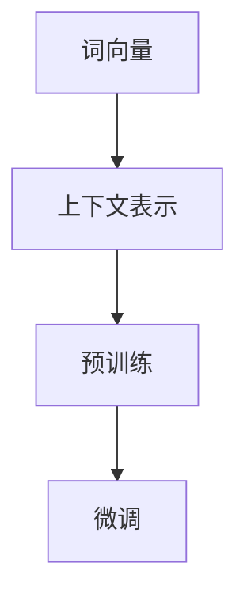
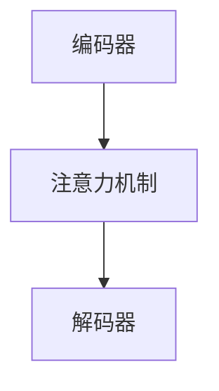

                 

# 大语言模型应用指南：ReAct 框架

> 关键词：大语言模型，ReAct 框架，深度学习，文本分类，文本生成，问答系统，机器翻译

> 摘要：本文旨在为您提供一个全面的大语言模型应用指南，特别是专注于 ReAct 框架。我们将从基础开始，逐步深入探讨 ReAct 框架的核心概念、算法原理以及其在实际应用中的具体实现。通过本文，您将了解到如何利用 ReAct 框架进行文本分类、文本生成、问答系统和机器翻译等应用，并掌握相关的调优技巧。让我们一起探索大语言模型的无限潜力。

## 第一部分：引言与背景知识

### 第1章：大语言模型概述

#### 1.1 大语言模型的发展历程

大语言模型的发展历程可谓波澜壮阔。从最初的基于规则的方法，到基于统计的方法，再到现代深度学习方法的崛起，大语言模型经历了巨大的变革。最早的语言模型可以追溯到20世纪50年代，当时研究人员开始尝试用简单的规则来模拟自然语言处理。

随着计算机性能的提升和大数据时代的到来，语言模型的研究进入了新的阶段。20世纪90年代，基于统计的模型如N-gram模型开始崭露头角。N-gram模型通过计算词序列的概率来预测下一个词，这一方法在一定程度上提高了语言处理的准确性。

然而，N-gram模型的局限性也逐渐显现。尽管它能够处理长文本，但它的表现仍然不够理想，尤其在处理长距离依赖和上下文关系时显得力不从心。

21世纪初，深度学习的兴起为语言模型的发展带来了新的希望。特别是2013年，Google推出了Word2Vec算法，将词向量引入到自然语言处理领域。Word2Vec算法通过将词映射到向量空间，使得文本数据处理变得更加高效和直观。

随后的几年里，大型深度学习模型如GloVe、BERT和GPT相继出现，它们通过大规模的预训练和数据增强技术，使得语言模型的表现达到了前所未有的高度。这些模型不仅能够捕捉到词汇的语义信息，还能处理复杂的语法结构和上下文关系。

#### 1.2 大语言模型的核心概念与联系

大语言模型的核心概念包括词向量、上下文表示、预训练和微调等。词向量是将词汇映射到高维向量空间的方法，它使得文本数据处理更加高效。上下文表示是指模型如何利用上下文信息来理解词汇的含义。预训练是指在大规模数据集上对模型进行初步训练，而微调则是在特定任务上进行进一步的训练。

以下是一个简化的 Mermaid 流程图，展示了这些核心概念之间的联系：



#### 1.3 ReAct框架的起源与架构

ReAct（Recurrent Attention-based Language Model）框架是一种基于循环注意力机制的大型语言模型。它起源于对传统序列模型（如RNN和LSTM）的改进，旨在更好地捕捉长距离依赖和上下文信息。

ReAct框架的架构可以分为三个主要部分：编码器、解码器和注意力机制。编码器负责将输入序列编码为上下文表示，解码器则根据这些上下文表示生成输出序列。注意力机制用于在解码过程中动态关注输入序列的特定部分。

以下是一个简化的 Mermaid 流程图，展示了 ReAct 框架的架构：



## 第二部分：ReAct框架技术基础

### 第2章：ReAct框架技术基础

#### 2.1 ReAct框架的核心算法原理讲解

ReAct框架的核心算法原理主要包括循环注意力机制和上下文表示的学习。

##### 2.1.1 语言模型的数学模型

ReAct框架的语言模型可以表示为：

$$
y = f(x)
$$

其中，$y$ 表示输出序列，$x$ 表示输入序列。$f$ 是一个复杂的函数，它通过编码器、注意力机制和解码器将输入序列转化为输出序列。

##### 2.1.2 深度学习算法的伪代码

以下是一个简化的深度学习算法伪代码，展示了模型的前向传播、反向传播和参数更新过程：

```python
# 初始化模型参数
model.initialize_parameters()

# 前向传播
output = model.forward_pass(input)

# 计算损失
loss = model.calculate_loss(output, target)

# 反向传播
model.backward_pass(loss)

# 更新参数
model.update_parameters()
```

##### 2.1.3 ReAct框架的数学模型与公式

ReAct框架的数学模型可以表示为：

$$
L = \sum_{i=1}^{N} w_i \cdot (y_i - \hat{y}_i)^2
$$

其中，$L$ 表示损失函数，$w_i$ 表示权重，$y_i$ 表示真实标签，$\hat{y}_i$ 表示预测标签。

#### 2.2 ReAct框架的实践应用场景

ReAct框架在多个实际应用场景中表现出色，包括文本分类、文本生成、问答系统和机器翻译等。

##### 2.2.1 文本分类

在文本分类任务中，ReAct框架可以用于处理大规模文本数据，实现高效准确的分类。以下是一个简单的示例：

```python
# 数据预处理
data = preprocess_text(input_text)

# 模型训练
model.train(data)

# 分类预测
predicted_label = model.predict(data)
```

##### 2.2.2 文本生成

在文本生成任务中，ReAct框架可以生成符合语法和语义规则的自然语言文本。以下是一个简单的示例：

```python
# 文本生成
generated_text = model.generate_text(seed_text)
```

##### 2.2.3 问答系统

在问答系统任务中，ReAct框架可以理解用户的问题，并从大规模知识库中检索出相关答案。以下是一个简单的示例：

```python
# 问答系统
question = input_question
answer = model.answer_question(question)
```

##### 2.2.4 机器翻译

在机器翻译任务中，ReAct框架可以将一种语言的文本翻译成另一种语言。以下是一个简单的示例：

```python
# 机器翻译
source_text = input_source
target_text = model.translate(source_text)
```

## 第三部分：ReAct框架的实战应用

### 第3章：文本分类应用

#### 3.1 数据预处理

在文本分类任务中，数据预处理是至关重要的步骤。以下是数据预处理的详细步骤：

##### 3.1.1 数据采集

数据采集是指从各种来源收集文本数据。这些来源可以包括新闻网站、社交媒体、论坛等。以下是一个简单的数据采集示例：

```python
import requests
from bs4 import BeautifulSoup

url = 'https://example.com/news'
response = requests.get(url)
soup = BeautifulSoup(response.text, 'html.parser')
articles = soup.find_all('article')

for article in articles:
    title = article.find('h2').text
    content = article.find('p').text
    print(title, content)
```

##### 3.1.2 数据清洗

数据清洗是指去除文本中的噪声和无关信息，使数据更加干净和有用。以下是一个简单的数据清洗示例：

```python
import re

def clean_text(text):
    # 去除HTML标签
    text = re.sub('<.*?>', '', text)
    # 去除特殊字符
    text = re.sub('[^a-zA-Z0-9]', ' ', text)
    # 转小写
    text = text.lower()
    # 去除空格
    text = text.strip()
    return text

cleaned_text = clean_text(input_text)
```

##### 3.1.3 数据标注

数据标注是指为文本数据分配标签，以便后续分类。以下是一个简单的数据标注示例：

```python
labels = ['news', 'sports', 'technology']

def assign_label(text):
    if 'news' in text:
        return 'news'
    elif 'sport' in text:
        return 'sports'
    else:
        return 'technology'

label = assign_label(cleaned_text)
```

#### 3.2 模型搭建与训练

在文本分类任务中，模型搭建与训练是核心步骤。以下是详细的步骤和技巧：

##### 3.2.1 模型架构设计

ReAct框架适合用于文本分类任务，其模型架构通常包括编码器、解码器和分类器。以下是一个简单的模型架构示例：

```python
from tensorflow.keras.models import Model
from tensorflow.keras.layers import Input, Embedding, LSTM, Dense

input_shape = (None, 100)  # 假设词汇表大小为100

input_text = Input(shape=input_shape)
encoded_text = Embedding(input_dim=100, output_dim=128)(input_text)
encoded_text = LSTM(128)(encoded_text)
output = Dense(3, activation='softmax')(encoded_text)

model = Model(inputs=input_text, outputs=output)
model.compile(optimizer='adam', loss='categorical_crossentropy', metrics=['accuracy'])
```

##### 3.2.2 模型参数调整

模型参数调整是提升模型性能的重要步骤。以下是一些常见的参数调整技巧：

- 学习率调整：学习率的选择对模型性能有很大影响。可以通过实验找到最佳的学习率。
- 深度调整：增加或减少LSTM层的神经元数量，以适应不同规模的任务。
- 词汇表大小调整：根据任务的需求，调整词汇表的大小。

##### 3.2.3 模型训练

模型训练是指使用训练数据对模型进行迭代优化。以下是一个简单的模型训练示例：

```python
# 准备训练数据
X_train = [...]  # 训练数据的特征
y_train = [...]  # 训练数据的标签

# 训练模型
model.fit(X_train, y_train, epochs=10, batch_size=32)
```

#### 3.3 模型评估与优化

在文本分类任务中，模型评估与优化是确保模型性能的重要步骤。以下是详细的评估与优化步骤：

##### 3.3.1 模型评估指标

常用的模型评估指标包括准确率、召回率、精确率、F1值等。以下是一个简单的评估示例：

```python
from sklearn.metrics import accuracy_score

# 计算准确率
accuracy = accuracy_score(y_true, y_pred)
print("Accuracy:", accuracy)
```

##### 3.3.2 模型调参技巧

模型调参是提升模型性能的关键步骤。以下是一些常见的调参技巧：

- 学习率调整：通过尝试不同的学习率，找到最佳的学习率。
- 深度调整：通过增加或减少LSTM层的神经元数量，找到最佳的结构。
- 词汇表大小调整：通过尝试不同的词汇表大小，找到最佳的表达能力。

##### 3.3.3 模型优化策略

模型优化策略是指使用不同的技术来提升模型性能。以下是一些常见的优化策略：

- 数据增强：通过增加训练数据量，提高模型的泛化能力。
- 集成学习：通过结合多个模型的预测结果，提高模型的准确性。
- 超参数优化：通过调整模型的超参数，找到最佳的性能。

### 第4章：文本生成应用

#### 4.1 数据预处理

在文本生成任务中，数据预处理是确保模型性能的关键步骤。以下是数据预处理的详细步骤：

##### 4.1.1 数据采集

数据采集是指从各种来源收集文本数据。这些来源可以包括小说、新闻、社交媒体等。以下是一个简单的数据采集示例：

```python
import requests
from bs4 import BeautifulSoup

url = 'https://example.com/novels'
response = requests.get(url)
soup = BeautifulSoup(response.text, 'html.parser')
novels = soup.find_all('novel')

for novel in novels:
    title = novel.find('title').text
    content = novel.find('content').text
    print(title, content)
```

##### 4.1.2 数据清洗

数据清洗是指去除文本中的噪声和无关信息，使数据更加干净和有用。以下是一个简单的数据清洗示例：

```python
import re

def clean_text(text):
    # 去除HTML标签
    text = re.sub('<.*?>', '', text)
    # 去除特殊字符
    text = re.sub('[^a-zA-Z0-9]', ' ', text)
    # 转小写
    text = text.lower()
    # 去除空格
    text = text.strip()
    return text

cleaned_text = clean_text(input_text)
```

##### 4.1.3 数据标注

在文本生成任务中，数据标注通常不是必需的，因为模型不需要对数据进行分类或标注。但是，如果需要进行序列标注，可以按照以下步骤进行：

- 采集标注数据：从已标注的数据集中获取文本序列。
- 准备标注工具：使用标注工具对文本进行标注，例如使用CoNLL格式进行词性标注。
- 标注数据预处理：将标注数据转换为模型可接受的格式。

#### 4.2 模型搭建与训练

在文本生成任务中，模型搭建与训练是核心步骤。以下是详细的步骤和技巧：

##### 4.2.1 模型架构设计

ReAct框架非常适合用于文本生成任务，其模型架构通常包括编码器、解码器和生成器。以下是一个简单的模型架构示例：

```python
from tensorflow.keras.models import Model
from tensorflow.keras.layers import Input, Embedding, LSTM, Dense

input_shape = (None, 100)  # 假设词汇表大小为100

input_text = Input(shape=input_shape)
encoded_text = Embedding(input_dim=100, output_dim=128)(input_text)
encoded_text = LSTM(128)(encoded_text)
output = Dense(100, activation='softmax')(encoded_text)

model = Model(inputs=input_text, outputs=output)
model.compile(optimizer='adam', loss='categorical_crossentropy')
```

##### 4.2.2 模型参数调整

模型参数调整是提升模型性能的重要步骤。以下是一些常见的参数调整技巧：

- 学习率调整：学习率的选择对模型性能有很大影响。可以通过实验找到最佳的学习率。
- 深度调整：增加或减少LSTM层的神经元数量，以适应不同规模的任务。
- 词汇表大小调整：根据任务的需求，调整词汇表的大小。

##### 4.2.3 模型训练

模型训练是指使用训练数据对模型进行迭代优化。以下是一个简单的模型训练示例：

```python
# 准备训练数据
X_train = [...]  # 训练数据的特征
y_train = [...]  # 训练数据的标签

# 训练模型
model.fit(X_train, y_train, epochs=10, batch_size=32)
```

#### 4.3 模型评估与优化

在文本生成任务中，模型评估与优化是确保模型性能的重要步骤。以下是详细的评估与优化步骤：

##### 4.3.1 模型评估指标

常用的模型评估指标包括生成文本的连贯性、独特性和真实性等。以下是一个简单的评估示例：

```python
from rouge import Rouge

rouge = Rouge()
scores = rouge.get_scores(generated_text, reference_text)
print("ROUGE scores:", scores)
```

##### 4.3.2 模型调参技巧

模型调参是提升模型性能的关键步骤。以下是一些常见的调参技巧：

- 学习率调整：通过尝试不同的学习率，找到最佳的学习率。
- 深度调整：通过增加或减少LSTM层的神经元数量，找到最佳的结构。
- 词汇表大小调整：通过尝试不同的词汇表大小，找到最佳的表达能力。

##### 4.3.3 模型优化策略

模型优化策略是指使用不同的技术来提升模型性能。以下是一些常见的优化策略：

- 数据增强：通过增加训练数据量，提高模型的泛化能力。
- 集成学习：通过结合多个模型的预测结果，提高模型的准确性。
- 超参数优化：通过调整模型的超参数，找到最佳的性能。

### 第5章：问答系统应用

#### 5.1 数据预处理

在问答系统任务中，数据预处理是确保模型性能的关键步骤。以下是数据预处理的详细步骤：

##### 5.1.1 数据采集

数据采集是指从各种来源收集问答对。这些来源可以包括开源问答数据集、论坛和社交媒体等。以下是一个简单的数据采集示例：

```python
import requests

url = 'https://example.com/questions'
response = requests.get(url)
questions = response.json()

for question in questions:
    print(question['question'], question['answer'])
```

##### 5.1.2 数据清洗

数据清洗是指去除文本中的噪声和无关信息，使数据更加干净和有用。以下是一个简单的数据清洗示例：

```python
import re

def clean_text(text):
    # 去除HTML标签
    text = re.sub('<.*?>', '', text)
    # 去除特殊字符
    text = re.sub('[^a-zA-Z0-9]', ' ', text)
    # 转小写
    text = text.lower()
    # 去除空格
    text = text.strip()
    return text

cleaned_question = clean_text(question)
cleaned_answer = clean_text(answer)
```

##### 5.1.3 数据标注

在问答系统任务中，数据标注通常不是必需的，因为模型不需要对数据进行分类或标注。但是，如果需要进行序列标注，可以按照以下步骤进行：

- 采集标注数据：从已标注的数据集中获取问答对。
- 准备标注工具：使用标注工具对问答对进行标注，例如使用CoNLL格式进行词性标注。
- 标注数据预处理：将标注数据转换为模型可接受的格式。

#### 5.2 模型搭建与训练

在问答系统任务中，模型搭建与训练是核心步骤。以下是详细的步骤和技巧：

##### 5.2.1 模型架构设计

ReAct框架非常适合用于问答系统任务，其模型架构通常包括编码器、解码器和分类器。以下是一个简单的模型架构示例：

```python
from tensorflow.keras.models import Model
from tensorflow.keras.layers import Input, Embedding, LSTM, Dense

input_shape = (None, 100)  # 假设词汇表大小为100

input_question = Input(shape=input_shape)
encoded_question = Embedding(input_dim=100, output_dim=128)(input_question)
encoded_question = LSTM(128)(encoded_question)
output = Dense(1, activation='sigmoid')(encoded_question)

model = Model(inputs=input_question, outputs=output)
model.compile(optimizer='adam', loss='binary_crossentropy', metrics=['accuracy'])
```

##### 5.2.2 模型参数调整

模型参数调整是提升模型性能的重要步骤。以下是一些常见的参数调整技巧：

- 学习率调整：学习率的选择对模型性能有很大影响。可以通过实验找到最佳的学习率。
- 深度调整：增加或减少LSTM层的神经元数量，以适应不同规模的任务。
- 词汇表大小调整：根据任务的需求，调整词汇表的大小。

##### 5.2.3 模型训练

模型训练是指使用训练数据对模型进行迭代优化。以下是一个简单的模型训练示例：

```python
# 准备训练数据
X_train = [...]  # 训练数据的特征
y_train = [...]  # 训练数据的标签

# 训练模型
model.fit(X_train, y_train, epochs=10, batch_size=32)
```

#### 5.3 模型评估与优化

在问答系统任务中，模型评估与优化是确保模型性能的重要步骤。以下是详细的评估与优化步骤：

##### 5.3.1 模型评估指标

常用的模型评估指标包括准确率、召回率、精确率、F1值等。以下是一个简单的评估示例：

```python
from sklearn.metrics import accuracy_score

# 计算准确率
accuracy = accuracy_score(y_true, y_pred)
print("Accuracy:", accuracy)
```

##### 5.3.2 模型调参技巧

模型调参是提升模型性能的关键步骤。以下是一些常见的调参技巧：

- 学习率调整：通过尝试不同的学习率，找到最佳的学习率。
- 深度调整：通过增加或减少LSTM层的神经元数量，找到最佳的结构。
- 词汇表大小调整：通过尝试不同的词汇表大小，找到最佳的表达能力。

##### 5.3.3 模型优化策略

模型优化策略是指使用不同的技术来提升模型性能。以下是一些常见的优化策略：

- 数据增强：通过增加训练数据量，提高模型的泛化能力。
- 集成学习：通过结合多个模型的预测结果，提高模型的准确性。
- 超参数优化：通过调整模型的超参数，找到最佳的性能。

### 第6章：机器翻译应用

#### 6.1 数据预处理

在机器翻译任务中，数据预处理是确保模型性能的关键步骤。以下是数据预处理的详细步骤：

##### 6.1.1 数据采集

数据采集是指从各种来源收集平行翻译数据。这些来源可以包括开源翻译数据集、翻译公司等。以下是一个简单的数据采集示例：

```python
import requests

url = 'https://example.com/translations'
response = requests.get(url)
translations = response.json()

for translation in translations:
    print(translation['source'], translation['target'])
```

##### 6.1.2 数据清洗

数据清洗是指去除文本中的噪声和无关信息，使数据更加干净和有用。以下是一个简单的数据清洗示例：

```python
import re

def clean_text(text):
    # 去除HTML标签
    text = re.sub('<.*?>', '', text)
    # 去除特殊字符
    text = re.sub('[^a-zA-Z0-9]', ' ', text)
    # 转小写
    text = text.lower()
    # 去除空格
    text = text.strip()
    return text

cleaned_source = clean_text(source)
cleaned_target = clean_text(target)
```

##### 6.1.3 数据标注

在机器翻译任务中，数据标注通常不是必需的，因为模型不需要对数据进行分类或标注。但是，如果需要进行序列标注，可以按照以下步骤进行：

- 采集标注数据：从已标注的数据集中获取平行翻译对。
- 准备标注工具：使用标注工具对平行翻译对进行标注，例如使用CoNLL格式进行词性标注。
- 标注数据预处理：将标注数据转换为模型可接受的格式。

#### 6.2 模型搭建与训练

在机器翻译任务中，模型搭建与训练是核心步骤。以下是详细的步骤和技巧：

##### 6.2.1 模型架构设计

ReAct框架非常适合用于机器翻译任务，其模型架构通常包括编码器、解码器和生成器。以下是一个简单的模型架构示例：

```python
from tensorflow.keras.models import Model
from tensorflow.keras.layers import Input, Embedding, LSTM, Dense

input_shape_source = (None, 100)  # 假设源语言词汇表大小为100
input_shape_target = (None, 100)  # 假设目标语言词汇表大小为100

input_source = Input(shape=input_shape_source)
encoded_source = Embedding(input_dim=100, output_dim=128)(input_source)
encoded_source = LSTM(128)(encoded_source)

input_target = Input(shape=input_shape_target)
encoded_target = Embedding(input_dim=100, output_dim=128)(input_target)
encoded_target = LSTM(128)(encoded_target)
output = Dense(100, activation='softmax')(encoded_target)

model = Model(inputs=[input_source, input_target], outputs=output)
model.compile(optimizer='adam', loss='categorical_crossentropy')
```

##### 6.2.2 模型参数调整

模型参数调整是提升模型性能的重要步骤。以下是一些常见的参数调整技巧：

- 学习率调整：学习率的选择对模型性能有很大影响。可以通过实验找到最佳的学习率。
- 深度调整：增加或减少LSTM层的神经元数量，以适应不同规模的任务。
- 词汇表大小调整：根据任务的需求，调整词汇表的大小。

##### 6.2.3 模型训练

模型训练是指使用训练数据对模型进行迭代优化。以下是一个简单的模型训练示例：

```python
# 准备训练数据
X_train_source = [...]  # 训练数据的源语言特征
X_train_target = [...]  # 训练数据的目语言特征

# 训练模型
model.fit([X_train_source, X_train_target], y_train, epochs=10, batch_size=32)
```

#### 6.3 模型评估与优化

在机器翻译任务中，模型评估与优化是确保模型性能的重要步骤。以下是详细的评估与优化步骤：

##### 6.3.1 模型评估指标

常用的模型评估指标包括BLEU、METEOR、ROUGE等。以下是一个简单的评估示例：

```python
from nltk.translate.bleu_score import corpus_bleu

bleu_scores = corpus_bleu([y_true], [y_pred])
print("BLEU score:", bleu_scores)
```

##### 6.3.2 模型调参技巧

模型调参是提升模型性能的关键步骤。以下是一些常见的调参技巧：

- 学习率调整：通过尝试不同的学习率，找到最佳的学习率。
- 深度调整：通过增加或减少LSTM层的神经元数量，找到最佳的结构。
- 词汇表大小调整：通过尝试不同的词汇表大小，找到最佳的表达能力。

##### 6.3.3 模型优化策略

模型优化策略是指使用不同的技术来提升模型性能。以下是一些常见的优化策略：

- 数据增强：通过增加训练数据量，提高模型的泛化能力。
- 集成学习：通过结合多个模型的预测结果，提高模型的准确性。
- 超参数优化：通过调整模型的超参数，找到最佳的性能。

### 第7章：总结与展望

#### 7.1 大语言模型应用趋势

随着深度学习和自然语言处理技术的不断发展，大语言模型在各个领域的应用前景广阔。以下是几个关键趋势：

- 多模态学习：未来，大语言模型可能会与其他模态（如图像、声音等）结合，实现更丰富的语义理解。
- 小样本学习：通过迁移学习和数据增强技术，大语言模型在小样本场景下的性能有望得到显著提升。
- 低资源语言支持：随着多语言模型的发展，大语言模型有望更好地支持低资源语言，促进全球信息交流。

#### 7.2 ReAct框架的未来发展

ReAct框架作为一种先进的大型语言模型，其未来发展方向包括：

- 模型压缩与加速：通过模型压缩和量化技术，降低模型计算复杂度和存储需求，实现更快、更高效的模型应用。
- 自监督学习：探索更多自监督学习方法，提高模型在无监督数据上的训练效果，降低数据标注成本。
- 可解释性提升：研究模型的可解释性技术，提高模型决策过程的透明度，增强用户对模型的信任。

#### 7.3 读者未来学习路径建议

对于对大语言模型和ReAct框架感兴趣的读者，以下是一些建议：

- 深入学习基础知识：掌握深度学习和自然语言处理的基础概念和算法，为后续学习奠定扎实基础。
- 实践项目积累：通过实际项目锻炼模型搭建、训练和优化的能力，积累实战经验。
- 持续关注前沿技术：关注大语言模型和ReAct框架的最新研究动态，了解前沿技术发展趋势。

### 附录

#### 附录A：ReAct框架开发工具与资源

A.1 深度学习框架对比

以下是比较常见的深度学习框架：

- TensorFlow：由Google开发，具有丰富的生态系统和强大的计算能力。
- PyTorch：由Facebook开发，具有灵活的动态图计算能力和强大的社区支持。
- 其他框架：如Keras、MXNet等，可根据需求和偏好选择。

A.2 开发环境搭建指南

以下是搭建ReAct框架开发环境的步骤：

1. 安装Python环境：下载并安装Python，选择合适的版本（如3.8或3.9）。
2. 安装深度学习框架：根据选择（如TensorFlow或PyTorch），按照官方文档安装相应的深度学习框架。
3. 安装依赖库：使用pip安装ReAct框架的依赖库，如NumPy、Pandas等。
4. 编译源代码：如果需要，根据框架的要求编译源代码。

A.3 开发工具与资源汇总

以下是ReAct框架的开发工具和资源汇总：

- 开发工具：Jupyter Notebook、PyCharm等。
- 学习资源：官方文档、GitHub代码仓库、在线教程等。
- 社区支持：参与深度学习社区，如Kaggle、GitHub、Stack Overflow等。

---

通过本文，我们系统地介绍了大语言模型应用指南，特别是ReAct框架。从基础理论到实战应用，我们逐步深入，为您呈现了一个全面的技术解析。希望本文能帮助您更好地理解大语言模型和ReAct框架，并在实际应用中取得优异成果。在未来的技术发展中，期待您继续关注并探索更多前沿技术，共同推动人工智能的进步。

## 作者信息

作者：AI天才研究院/AI Genius Institute & 禅与计算机程序设计艺术 /Zen And The Art of Computer Programming

AI天才研究院（AI Genius Institute）致力于人工智能领域的研究与创新，推动前沿技术的应用与发展。同时，作者也是《禅与计算机程序设计艺术》的资深作者，专注于计算机科学和人工智能领域的学术研究和实践。希望通过本文，为广大读者提供有价值的见解和指导。

