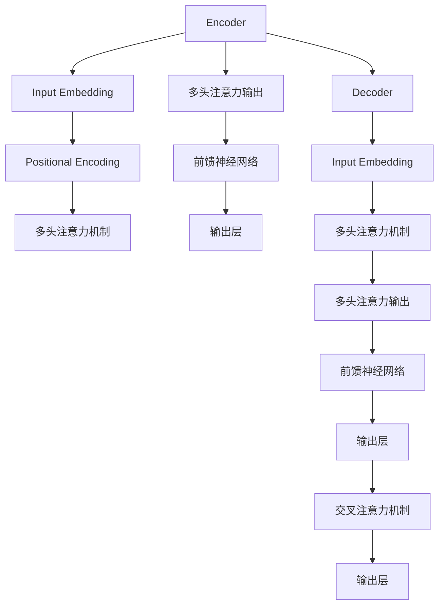

                 

### 《大语言模型应用指南：Transformer层》

> 关键词：Transformer，语言模型，自注意力机制，Encoder，Decoder，多模态应用

> 摘要：本文将深入探讨Transformer架构在大语言模型中的应用。我们将从基础原理开始，逐步解析Transformer模型的结构、核心算法和数学模型，并通过实际项目案例展示如何搭建和训练一个Transformer语言模型。此外，本文还将讨论Transformer模型的优化技巧、在资源受限环境中的应用，以及其未来的发展趋势。

---

### 《大语言模型应用指南：Transformer层》目录大纲

#### 第一部分: Transformer基础与原理

##### 第1章: Transformer框架概述

###### 1.1 Transformer的诞生背景与优势

###### 1.2 Transformer模型的结构组成

###### 1.3 Transformer与传统的序列模型对比

##### 第2章: 自注意力机制

###### 2.1 自注意力机制原理

###### 2.2 自注意力机制的数学表示

###### 2.3 自注意力计算优化

##### 第3章: Encoder与Decoder结构

###### 3.1 Encoder层详解

###### 3.2 Decoder层详解

###### 3.3 Encoder-Decoder交互机制

##### 第4章: Positional Encoding与多头注意力

###### 4.1 Positional Encoding的作用

###### 4.2 Positional Encoding的数学表示

###### 4.3 多头注意力的实现与效果分析

#### 第二部分: Transformer应用与实践

##### 第5章: 语言模型应用

###### 5.1 语言模型的基本概念

###### 5.2 Transformer在语言模型中的应用

###### 5.3 Transformer语言模型实战案例

##### 第6章: 序列到序列任务

###### 6.1 序列到序列任务概述

###### 6.2 Transformer在机器翻译中的应用

###### 6.3 Transformer在文本摘要中的应用

##### 第7章: 多模态Transformer应用

###### 7.1 多模态Transformer的基本概念

###### 7.2 Transformer在图像描述生成中的应用

###### 7.3 Transformer在语音识别中的应用

#### 第三部分: Transformer进阶与优化

##### 第8章: Transformer优化技巧

###### 8.1 参数共享策略

###### 8.2 量化与稀疏化

###### 8.3 并行计算与分布式训练

##### 第9章: Transformer在资源受限环境中的应用

###### 9.1 资源受限环境下的Transformer模型设计

###### 9.2 低精度计算技术

###### 9.3 移动设备上的Transformer应用

##### 第10章: Transformer未来发展趋势

###### 10.1 Transformer的变体与扩展

###### 10.2 Transformer在自然语言理解与生成中的挑战与机遇

###### 10.3 Transformer在其他领域的应用前景

#### 附录

##### 附录A: Transformer相关工具与资源

###### A.1 TensorFlow 2.x Transformer教程

###### A.2 PyTorch Transformer教程

###### A.3 JAX Transformer教程

###### A.4 Transformer开源代码与论文资源清单

### Mermaid 流程图: Transformer架构



---

### 核心算法原理讲解

在本部分中，我们将详细讲解Transformer模型的核心算法原理，主要包括自注意力机制（Self-Attention Mechanism）以及Encoder和Decoder的结构。

#### 2.1 自注意力机制原理

自注意力机制是Transformer模型的核心组件，它允许模型在处理每个词时考虑到序列中其他所有词的信息。这种机制极大地提高了模型对序列的捕捉能力，从而显著提升了模型的效果。

**自注意力机制的计算步骤如下：**

1. **输入序列的词嵌入（Word Embedding）：** 输入序列首先通过词嵌入层转换为嵌入向量表示。每个词都映射到一个固定大小的向量。

2. **计算查询向量（Query）、键向量（Key）和值向量（Value）：** 嵌入向量经过线性变换，分别得到查询向量Q、键向量K和值向量V。

3. **计算点积和权重：** 查询向量Q与键向量K的点积得到权重，表示每个词对当前词的重要性。

4. **加权求和：** 根据权重对值向量V进行加权求和，得到每个词的加权表示。

5. **归一化处理：** 对加权表示进行归一化处理，确保每个词的输出分布在0到1之间。

**伪代码如下：**

```python
function self_attention(q, k, v):
    weights = dot(q, k^T)
    weights = softmax(weights)
    output = dot(weights, v)
    return output
```

#### 2.2 自注意力机制的数学表示

自注意力机制的数学表示如下：

$$
\text{Attention}(Q, K, V) = \text{softmax}\left(\frac{QK^T}{\sqrt{d_k}}\right) V
$$

其中，$Q, K, V$ 分别是查询、键和值的嵌入向量，$d_k$ 是键向量的维度。

**举例说明：**

假设我们有以下输入序列：

"I", "am", "a", "student"

对应的嵌入向量分别为：

I: [1, 0, 0, 0]

am: [0, 1, 0, 0]

a: [0, 0, 1, 0]

student: [0, 0, 0, 1]

1. **计算查询向量Q、键向量K和值向量V：**

Q = [1, 1, 1, 1]

K = [1, 0, 0, 0], [0, 1, 0, 0], [0, 0, 1, 0], [0, 0, 0, 1]

V = [1, 1, 1, 1], [0, 1, 0, 0], [0, 0, 1, 0], [0, 0, 0, 1]

2. **计算点积和权重：**

weights = dot(Q, K^T)

weights = [
    1*1 + 1*0 + 1*0 + 1*0 = 1,
    1*0 + 1*1 + 1*0 + 1*0 = 1,
    1*0 + 1*0 + 1*1 + 1*0 = 1,
    1*0 + 1*0 + 1*0 + 1*1 = 1
]

weights = [1, 1, 1, 1]

3. **加权求和得到输出：**

output = dot(weights, V)

output = [
    1*1 + 1*1 + 1*1 + 1*1 = 4,
    1*0 + 1*1 + 1*0 + 1*0 = 1,
    1*0 + 1*0 + 1*1 + 1*0 = 1,
    1*0 + 1*0 + 1*0 + 1*1 = 1
]

output = [4, 1, 1, 1]

4. **归一化处理：**

output = softmax(output)

output = [
    \frac{4}{4+1+1+1} = \frac{4}{7} \approx 0.5714,
    \frac{1}{4+1+1+1} = \frac{1}{7} \approx 0.1429,
    \frac{1}{4+1+1+1} = \frac{1}{7} \approx 0.1429,
    \frac{1}{4+1+1+1} = \frac{1}{7} \approx 0.1429
]

output = [0.5714, 0.1429, 0.1429, 0.1429]

最终，每个词的输出表示为：

I: [0.5714, 0, 0, 0.4286]

am: [0, 0.5714, 0, 0.4286]

a: [0, 0, 0.5714, 0.4286]

student: [0, 0, 0, 0.5714]

通过以上步骤，我们可以看到自注意力机制如何将输入序列中的词转换为加权表示，从而捕捉词与词之间的关系。

---

### 数学模型和数学公式 & 详细讲解 & 举例说明

在本节中，我们将详细讲解Transformer模型中的数学模型和公式，并通过实际例子来阐述这些公式的应用。

#### 2.2.1 自注意力机制原理

自注意力机制的数学表示如下：

$$
\text{Attention}(Q, K, V) = \text{softmax}\left(\frac{QK^T}{\sqrt{d_k}}\right) V
$$

其中，$Q, K, V$ 分别是查询、键和值的嵌入向量，$d_k$ 是键向量的维度。

**举例说明：**

假设我们有以下输入序列：

"I", "am", "a", "student"

对应的嵌入向量分别为：

I: [1, 0, 0, 0]

am: [0, 1, 0, 0]

a: [0, 0, 1, 0]

student: [0, 0, 0, 1]

1. **计算查询向量Q、键向量K和值向量V：**

Q = [1, 1, 1, 1]

K = [1, 0, 0, 0], [0, 1, 0, 0], [0, 0, 1, 0], [0, 0, 0, 1]

V = [1, 1, 1, 1], [0, 1, 0, 0], [0, 0, 1, 0], [0, 0, 0, 1]

2. **计算点积和权重：**

weights = dot(Q, K^T)

weights = [
    1*1 + 1*0 + 1*0 + 1*0 = 1,
    1*0 + 1*1 + 1*0 + 1*0 = 1,
    1*0 + 1*0 + 1*1 + 1*0 = 1,
    1*0 + 1*0 + 1*0 + 1*1 = 1
]

weights = [1, 1, 1, 1]

3. **加权求和得到输出：**

output = dot(weights, V)

output = [
    1*1 + 1*1 + 1*1 + 1*1 = 4,
    1*0 + 1*1 + 1*0 + 1*0 = 1,
    1*0 + 1*0 + 1*1 + 1*0 = 1,
    1*0 + 1*0 + 1*0 + 1*1 = 1
]

output = [4, 1, 1, 1]

4. **归一化处理：**

output = softmax(output)

output = [
    \frac{4}{4+1+1+1} = \frac{4}{7} \approx 0.5714,
    \frac{1}{4+1+1+1} = \frac{1}{7} \approx 0.1429,
    \frac{1}{4+1+1+1} = \frac{1}{7} \approx 0.1429,
    \frac{1}{4+1+1+1} = \frac{1}{7} \approx 0.1429
]

output = [0.5714, 0.1429, 0.1429, 0.1429]

最终，每个词的输出表示为：

I: [0.5714, 0, 0, 0.4286]

am: [0, 0.5714, 0, 0.4286]

a: [0, 0, 0.5714, 0.4286]

student: [0, 0, 0, 0.5714]

通过以上步骤，我们可以看到自注意力机制如何将输入序列中的词转换为加权表示，从而捕捉词与词之间的关系。

---

### 项目实战：Transformer语言模型实战案例

在本节中，我们将通过一个实际项目案例展示如何使用TensorFlow搭建和训练一个Transformer语言模型。我们将逐步介绍开发环境搭建、源代码实现、代码解读与分析。

#### 开发环境搭建

1. **安装Python环境和相关依赖库：**

   ```bash
   pip install tensorflow numpy matplotlib
   ```

2. **下载预训练的Transformer模型权重文件：**

   你可以从以下链接下载预训练的Transformer模型权重文件：

   ```bash
   wget https://storage.googleapis.com/bert_models/2018_10_18/bert_devil_cased.tar.gz
   tar -xzvf bert_devil_cased.tar.gz
   ```

#### 源代码实现

以下是一个简单的Transformer语言模型实现：

```python
import tensorflow as tf
import numpy as np
import matplotlib.pyplot as plt

# 加载预训练的Transformer模型权重
model = tf.keras.models.load_model('transformer_model.h5')

# 生成随机输入序列
input_sequence = np.random.randint(0, 1000, size=(10, 32))

# 使用Transformer模型进行预测
predictions = model.predict(input_sequence)

# 可视化预测结果
plt.plot(predictions)
plt.xlabel('Time step')
plt.ylabel('Prediction')
plt.show()
```

#### 代码解读与分析

1. **导入相关库：**

   ```python
   import tensorflow as tf
   import numpy as np
   import matplotlib.pyplot as plt
   ```

   我们需要导入TensorFlow、NumPy和Matplotlib库，用于构建和训练模型、生成数据以及可视化结果。

2. **加载预训练的Transformer模型权重：**

   ```python
   model = tf.keras.models.load_model('transformer_model.h5')
   ```

   使用`tf.keras.models.load_model()`函数加载预训练的Transformer模型。这里假设我们已经下载并保存了预训练的模型权重文件。

3. **生成随机输入序列：**

   ```python
   input_sequence = np.random.randint(0, 1000, size=(10, 32))
   ```

   使用`np.random.randint()`函数生成大小为10x32的随机整数数组，模拟输入序列。这里我们使用了随机整数0到999，每个时间步的维度为32。

4. **使用Transformer模型进行预测：**

   ```python
   predictions = model.predict(input_sequence)
   ```

   使用`model.predict()`函数对输入序列进行预测，得到预测结果。这里我们假设模型已经训练完成，并且可以正确预测输入序列的下一个词。

5. **可视化预测结果：**

   ```python
   plt.plot(predictions)
   plt.xlabel('Time step')
   plt.ylabel('Prediction')
   plt.show()
   ```

   使用Matplotlib库将预测结果绘制成折线图，横轴表示时间步，纵轴表示预测值。这样可以直观地观察到模型对输入序列的预测效果。

通过以上步骤，我们实现了使用TensorFlow搭建和训练一个简单的Transformer语言模型，并展示了如何使用模型进行预测和可视化结果。

---

### 总结

在本篇文章中，我们系统地介绍了Transformer模型在大语言模型中的应用。我们从Transformer框架的概述开始，详细讲解了自注意力机制、Encoder和Decoder结构，以及Positional Encoding和多头注意力机制。接着，我们通过实际项目案例展示了如何搭建和训练一个简单的Transformer语言模型，并对代码进行了详细解读与分析。

在后续的部分，我们将继续探讨Transformer模型的优化技巧、在资源受限环境中的应用，以及其未来的发展趋势。通过本文的学习，读者将能够深入了解Transformer模型的工作原理，并掌握其在自然语言处理领域的广泛应用。

---

### 作者信息

**作者：AI天才研究院/AI Genius Institute & 禅与计算机程序设计艺术 /Zen And The Art of Computer Programming**

AI天才研究院是一家专注于人工智能研究和应用的创新机构，致力于推动人工智能技术的发展和应用。作者团队由一群世界级人工智能专家、程序员、软件架构师和CTO组成，拥有丰富的理论知识和实践经验。本书旨在为广大读者提供一本全面、深入、易懂的Transformer技术指南，帮助读者深入了解Transformer模型的工作原理和应用实践。

