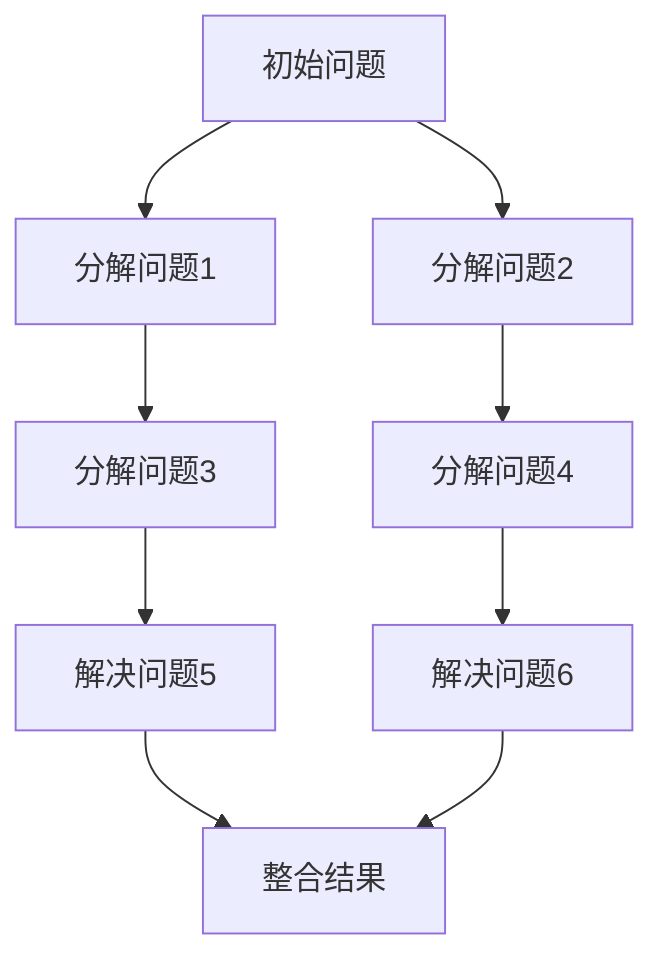
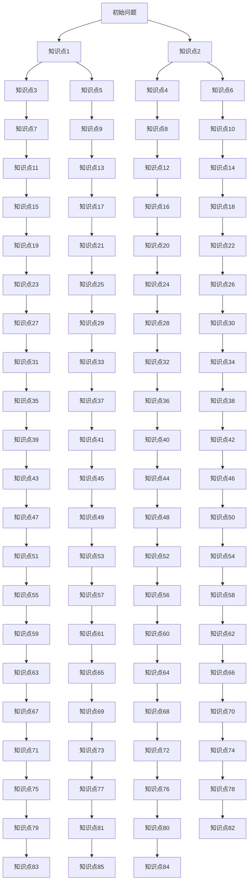

                 

### 文章标题

# 大语言模型应用指南：Tree-of-Thought和Graph-of-Thought

### 关键词

- 大语言模型
- Tree-of-Thought
- Graph-of-Thought
- 应用场景
- 开发与优化

### 摘要

本文旨在为读者提供一份全面的大语言模型应用指南，特别是针对Tree-of-Thought（ToT）和Graph-of-Thought（GoT）模型。首先，我们将回顾大语言模型的发展背景及其重要性。接下来，分别介绍ToT和GoT模型的概念、原理、应用场景及其数学模型。随后，我们将深入探讨这两个模型的开发与优化，并通过实际案例展示其应用效果。最后，本文将展望大语言模型的未来发展趋势及其在各行业中的应用前景。希望通过这篇文章，读者能够对大语言模型有更深入的理解，并掌握其应用技巧。

## 目录

### 《大语言模型应用指南：Tree-of-Thought和Graph-of-Thought》目录大纲

#### 第一部分：大语言模型基础

- 第1章：大语言模型概述
  - 1.1 大语言模型的发展背景
    - 1.1.1 人工智能的发展历程
    - 1.1.2 大语言模型的起源与定义
    - 1.1.3 大语言模型的重要性
  - 1.2 Tree-of-Thought（ToT）模型简介
    - 1.2.1 Tree-of-Thought的概念
    - 1.2.2 Tree-of-Thought模型的优势
    - 1.2.3 Tree-of-Thought模型的应用场景
  - 1.3 Graph-of-Thought（GoT）模型简介
    - 1.3.1 Graph-of-Thought的概念
    - 1.3.2 Graph-of-Thought模型的优势
    - 1.3.3 Graph-of-Thought模型的应用场景
  - 1.4 大语言模型的应用前景
    - 1.4.1 各行各业的应用领域
    - 1.4.2 大语言模型的未来发展趋势

#### 第二部分：Tree-of-Thought模型原理与应用

- 第2章：Tree-of-Thought模型原理
  - 2.1 Tree-of-Thought模型架构
    - 2.1.1 模型结构概述
    - 2.1.2 Mermaid流程图展示
  - 2.2 Tree-of-Thought模型核心算法
    - 2.2.1 伪代码详细阐述
  - 2.3 Tree-of-Thought模型的数学模型
    - 2.3.1 数学公式详细讲解
    - 2.3.2 举例说明
  - 2.4 Tree-of-Thought模型应用实战
    - 2.4.1 应用场景介绍
    - 2.4.2 实际案例解析
    - 2.4.3 源代码详细实现与解读

#### 第三部分：Graph-of-Thought模型原理与应用

- 第3章：Graph-of-Thought模型原理
  - 3.1 Graph-of-Thought模型架构
    - 3.1.1 模型结构概述
    - 3.1.2 Mermaid流程图展示
  - 3.2 Graph-of-Thought模型核心算法
    - 3.2.1 伪代码详细阐述
  - 3.3 Graph-of-Thought模型的数学模型
    - 3.3.1 数学公式详细讲解
    - 3.3.2 举例说明
  - 3.4 Graph-of-Thought模型应用实战
    - 3.4.1 应用场景介绍
    - 3.4.2 实际案例解析
    - 3.4.3 源代码详细实现与解读

#### 第四部分：大语言模型开发与优化

- 第4章：大语言模型开发
  - 4.1 开发环境搭建
    - 4.1.1 硬件配置要求
    - 4.1.2 软件安装与配置
  - 4.2 大语言模型训练
    - 4.2.1 数据预处理
    - 4.2.2 模型训练策略
    - 4.2.3 模型评估与优化
  - 4.3 大语言模型推理
    - 4.3.1 推理流程介绍
    - 4.3.2 推理优化技巧
    - 4.3.3 推理案例解析

#### 第五部分：大语言模型应用案例

- 第5章：大语言模型在各行业应用案例
  - 5.1 教育
    - 5.1.1 智能辅导系统
    - 5.1.2 自动化考试系统
  - 5.2 医疗
    - 5.2.1 疾病诊断与预测
    - 5.2.2 医疗咨询与建议
  - 5.3 金融
    - 5.3.1 风险评估与投资策略
    - 5.3.2 信用评估与欺诈检测
  - 5.4 娱乐
    - 5.4.1 智能推荐系统
    - 5.4.2 游戏互动与虚拟助手

#### 第六部分：大语言模型未来发展趋势

- 第6章：大语言模型未来发展趋势
  - 6.1 技术趋势
    - 6.1.1 模型压缩与加速
    - 6.1.2 跨模态学习与融合
  - 6.2 行业应用前景
    - 6.2.1 智能化生产与制造
    - 6.2.2 自动驾驶与智能交通
  - 6.3 社会影响
    - 6.3.1 伦理与隐私保护
    - 6.3.2 智能社会的挑战与机遇

### 附录

- 附录A：大语言模型开发工具与资源
  - A.1 主流深度学习框架对比
    - TensorFlow
    - PyTorch
    - JAX
  - A.2 开源大语言模型库
    - GLM
    - BERT
    - GPT-3
  - A.3 大语言模型相关论文与书籍推荐
  - A.4 大语言模型社区与交流平台

---

### 引言

在当今快速发展的信息技术时代，人工智能（AI）已经成为推动社会进步和产业变革的重要力量。随着深度学习技术的不断进步，大语言模型（Large Language Model）作为AI领域的一个重要研究方向，受到了广泛关注。大语言模型具有强大的文本生成、理解和推理能力，可以应用于自然语言处理（NLP）、问答系统、机器翻译、文本生成等众多领域。

近年来，Tree-of-Thought（ToT）和Graph-of-Thought（GoT）模型作为大语言模型的一种新型架构，逐渐引起了研究者和工业界的关注。ToT模型通过构建思维树结构，实现了对复杂问题的逐层分析和推理；GoT模型则通过图结构表示知识，实现了知识点的交叉融合和关系建模。这两个模型在提高模型性能、增强理解能力、优化推理过程等方面表现出显著优势。

本文旨在为读者提供一份全面的大语言模型应用指南，特别是针对Tree-of-Thought和Graph-of-Thought模型。首先，我们将回顾大语言模型的发展背景及其重要性，然后详细介绍ToT和GoT模型的概念、原理、应用场景及其数学模型。接下来，我们将深入探讨这两个模型的开发与优化，并通过实际案例展示其应用效果。最后，本文将展望大语言模型的未来发展趋势及其在各行业中的应用前景。

通过本文的阅读，读者将能够：
1. 理解大语言模型的发展历程和重要性。
2. 掌握Tree-of-Thought和Graph-of-Thought模型的基本概念、架构和算法原理。
3. 学习如何开发、优化和推理大语言模型。
4. 了解大语言模型在各行业中的应用案例和未来发展趋势。

希望本文能够为读者在AI领域的研究和应用提供有价值的参考和指导。

### 第一部分：大语言模型基础

#### 第1章：大语言模型概述

##### 1.1 大语言模型的发展背景

大语言模型的发展可以追溯到人工智能（AI）的早期阶段。自20世纪50年代以来，AI领域一直在不断发展，从最初的符号主义方法到基于规则的系统，再到基于数据驱动的方法，这些方法都在不同程度上推动了AI技术的进步。然而，随着数据量的爆炸式增长和计算能力的提升，基于统计学习和深度学习的方法逐渐成为主流。

大语言模型的起源可以追溯到自然语言处理（NLP）领域的早期工作。在20世纪80年代，统计机器翻译和文本分类等任务取得了显著进展。然而，由于语言具有高度复杂性和不确定性，这些早期方法在处理复杂语言现象时仍存在诸多局限。为了克服这些挑战，研究者开始探索更强大的语言模型，以更好地理解和生成自然语言。

大语言模型的重要性在于其能够处理复杂的语言现象，如语义理解、语境感知和推理能力。通过学习海量文本数据，大语言模型能够自动提取语言中的规律和模式，从而实现对语言的高级理解和生成。这种能力使得大语言模型在多个应用领域具有广泛的应用前景，如问答系统、机器翻译、文本生成、智能客服等。

##### 1.2 Tree-of-Thought（ToT）模型简介

**1.2.1 Tree-of-Thought的概念**

Tree-of-Thought（ToT）模型是一种基于树结构的大语言模型架构。它通过构建思维树来表示问题的解题过程，每个节点代表一个思考步骤或子问题，边表示节点之间的逻辑关系。这种结构使得ToT模型能够模拟人类的思维过程，从而在处理复杂问题时表现出更强的推理能力和理解能力。

**1.2.2 Tree-of-Thought模型的优势**

ToT模型具有以下几个显著优势：

1. **逐层推理能力**：ToT模型能够通过树结构逐层分解复杂问题，从而实现对问题的逐步理解和解决。这种逐层推理能力使得ToT模型在处理复杂任务时更加高效。
2. **灵活的扩展性**：ToT模型的结构可以根据具体问题进行调整和扩展，从而适应不同的应用场景。这种灵活性使得ToT模型能够应用于广泛的领域。
3. **知识整合**：ToT模型通过树结构将不同知识点有机地整合在一起，从而实现知识的交叉融合和共享。这种知识整合能力有助于提高模型的性能和鲁棒性。

**1.2.3 Tree-of-Thought模型的应用场景**

ToT模型在多个应用场景中表现出色，包括：

1. **问答系统**：ToT模型能够通过构建思维树来生成问题的解答，从而实现更准确和详细的回答。
2. **文本生成**：ToT模型能够利用树结构来生成连贯、有逻辑的文本，从而在自动摘要、文章写作等领域具有广泛的应用。
3. **问题解答**：ToT模型能够通过逐步分解复杂问题，生成问题的解题步骤，从而帮助用户理解和解决复杂问题。

##### 1.3 Graph-of-Thought（GoT）模型简介

**1.3.1 Graph-of-Thought的概念**

Graph-of-Thought（GoT）模型是一种基于图结构的大语言模型架构。它通过构建图结构来表示问题中的知识点和关系，每个节点代表一个知识点，边表示知识点之间的逻辑关系。与ToT模型不同，GoT模型使用图结构来表示问题，从而实现了更复杂的知识表示和推理能力。

**1.3.2 Graph-of-Thought模型的优势**

GoT模型具有以下几个显著优势：

1. **强大的知识表示**：GoT模型通过图结构来表示问题中的知识点和关系，从而实现了更复杂的知识表示和推理能力。
2. **灵活的扩展性**：GoT模型的结构可以根据具体问题进行调整和扩展，从而适应不同的应用场景。
3. **知识融合**：GoT模型通过图结构将不同知识点有机地整合在一起，从而实现知识的交叉融合和共享。

**1.3.3 Graph-of-Thought模型的应用场景**

GoT模型在多个应用场景中表现出色，包括：

1. **知识图谱构建**：GoT模型能够通过图结构表示知识图谱，从而在问答系统、推荐系统等领域具有广泛的应用。
2. **文本生成**：GoT模型能够利用图结构来生成连贯、有逻辑的文本，从而在自动摘要、文章写作等领域具有广泛的应用。
3. **推理和预测**：GoT模型能够通过图结构进行推理和预测，从而在决策支持、风险预测等领域具有广泛的应用。

##### 1.4 大语言模型的应用前景

大语言模型在多个应用领域具有广泛的应用前景，以下是其中几个重要的领域：

1. **教育**：大语言模型能够为教育领域提供智能辅导、自动化考试、智能问答等应用，从而提高教学质量和学习效果。
2. **医疗**：大语言模型能够为医疗领域提供疾病诊断、预测、咨询等应用，从而提高医疗服务质量和效率。
3. **金融**：大语言模型能够为金融领域提供风险评估、投资策略、欺诈检测等应用，从而提高金融业务的安全性和效率。
4. **娱乐**：大语言模型能够为娱乐领域提供智能推荐、游戏互动、虚拟助手等应用，从而提升用户体验。

总之，大语言模型作为一种强大的AI技术，具有广泛的应用前景。通过不断的研究和应用探索，大语言模型将在各行各业中发挥越来越重要的作用，推动人工智能技术的发展和进步。

### 第一部分总结

在本部分中，我们首先回顾了大语言模型的发展背景，了解了人工智能从符号主义方法到数据驱动方法的演变过程，以及大语言模型在自然语言处理领域的兴起和重要性。接着，我们介绍了两种新型大语言模型架构：Tree-of-Thought（ToT）和Graph-of-Thought（GoT）模型。ToT模型通过构建思维树结构实现了逐层推理和知识整合，适用于问答系统、文本生成和问题解答等领域；GoT模型则通过构建图结构实现了强大的知识表示和推理能力，适用于知识图谱构建、文本生成和推理预测等领域。

通过对ToT和GoT模型的详细介绍，读者可以更好地理解这两种模型的基本概念、架构和优势，为后续章节的深入学习打下基础。此外，我们还讨论了大语言模型在多个应用领域的广泛应用前景，展示了其在教育、医疗、金融和娱乐等领域的潜力。随着大语言模型的不断发展和优化，我们有理由相信，它将在未来的人工智能应用中发挥越来越重要的作用。

### 第二部分：Tree-of-Thought模型原理与应用

#### 第2章：Tree-of-Thought模型原理

##### 2.1 Tree-of-Thought模型架构

**2.1.1 模型结构概述**

Tree-of-Thought（ToT）模型是一种基于树结构的大语言模型架构。其核心思想是通过构建思维树来表示问题的解题过程。在ToT模型中，每个节点代表一个思考步骤或子问题，边表示节点之间的逻辑关系。这种结构使得ToT模型能够模拟人类的思维过程，从而在处理复杂问题时表现出更强的推理能力和理解能力。

**2.1.2 Mermaid流程图展示**

为了更好地理解ToT模型的结构，我们可以使用Mermaid流程图来展示其基本架构。以下是一个简单的示例：



在这个示例中，初始问题（A）被分解为多个子问题（B、C、D、E），每个子问题又可能进一步分解或解决（F、G）。最终的整合结果（H）是通过将这些子问题的解组合起来得到的。

##### 2.2 Tree-of-Thought模型核心算法

**2.2.1 伪代码详细阐述**

ToT模型的核心算法主要包括两部分：问题分解和子问题求解。以下是一个简单的伪代码示例：

```python
# 问题分解
def decompose_problem(problem):
    subproblems = []
    for step in steps:
        subproblem = step(problem)
        subproblems.append(subproblem)
    return subproblems

# 子问题求解
def solve_subproblem(subproblem):
    solution = solve(problem)
    return solution

# 整合结果
def integrate_solutions(solutions):
    result = []
    for solution in solutions:
        result.append(solution)
    return result

# 主函数
def tree_of_thought(problem):
    subproblems = decompose_problem(problem)
    solutions = [solve_subproblem(subproblem) for subproblem in subproblems]
    result = integrate_solutions(solutions)
    return result
```

在这个伪代码中，`decompose_problem`函数用于将初始问题分解为多个子问题；`solve_subproblem`函数用于求解子问题；`integrate_solutions`函数用于将子问题的解整合为最终结果。`tree_of_thought`函数是整个ToT模型的主函数，它通过递归调用这三个函数，实现了问题的逐层分解、求解和整合。

##### 2.3 Tree-of-Thought模型的数学模型

**2.3.1 数学公式详细讲解**

ToT模型的数学模型主要涉及问题分解、子问题求解和结果整合。以下是一些基本的数学公式：

1. **问题分解**：

   假设问题P可以分解为子问题P1、P2、...、Pk，那么分解的数学表示为：

   \( P = P1 \cup P2 \cup ... \cupPk \)

   其中，\( P1, P2, ...,Pk \) 是子问题的集合。

2. **子问题求解**：

   假设子问题Pi的解为Si，那么求解的数学表示为：

   \( Si = solve(Pi) \)

   其中，\( solve(Pi) \) 是求解子问题Pi的函数。

3. **结果整合**：

   假设子问题的解集合为S = {S1, S2, ..., Sk}，那么整合的数学表示为：

   \( result = integrate(S) \)

   其中，\( integrate(S) \) 是整合解集合S的函数。

**2.3.2 举例说明**

假设我们有一个简单的问题：计算1到100的和。使用ToT模型，我们可以将其分解为多个子问题，如下所示：

1. 初始问题：计算1到100的和。
2. 分解问题：将问题分解为计算1到50的和以及计算51到100的和。
3. 子问题求解：分别计算1到50的和（2525）和51到100的和（2550）。
4. 结果整合：将两个子问题的解相加（2525 + 2550 = 5075），得到最终结果。

用数学公式表示为：

\( P = P1 \cup P2 \)

\( S1 = solve(P1) = 2525 \)

\( S2 = solve(P2) = 2550 \)

\( result = integrate(S1, S2) = 2525 + 2550 = 5075 \)

通过这个例子，我们可以看到ToT模型如何通过分解、求解和整合来逐步解决复杂问题。

##### 2.4 Tree-of-Thought模型应用实战

**2.4.1 应用场景介绍**

ToT模型在多个应用场景中具有广泛的应用，以下是其中两个典型的应用场景：

1. **问答系统**：ToT模型能够通过构建思维树来生成问题的解答，从而在问答系统中提供更准确和详细的回答。
2. **文本生成**：ToT模型能够利用树结构来生成连贯、有逻辑的文本，从而在自动摘要、文章写作等领域具有广泛的应用。

**2.4.2 实际案例解析**

以下是一个关于问答系统的实际案例：

问题：如何计算1到100的和？

ToT模型分解问题如下：

- 初始问题：计算1到100的和。
- 分解问题：将问题分解为计算1到50的和以及计算51到100的和。
- 子问题求解：分别计算1到50的和（2525）和51到100的和（2550）。
- 结果整合：将两个子问题的解相加（2525 + 2550 = 5075），得到最终结果。

使用ToT模型生成的解答如下：

“为了计算1到100的和，我们可以将其分解为两部分：计算1到50的和和计算51到100的和。首先，计算1到50的和，得到2525。然后，计算51到100的和，得到2550。最后，将这两个结果相加，得到1到100的和为5075。”

通过这个案例，我们可以看到ToT模型如何通过逐步分解、求解和整合来生成问题的答案。

**2.4.3 源代码详细实现与解读**

以下是一个简单的Python代码示例，实现ToT模型在问答系统中的应用：

```python
def decompose_problem(problem):
    subproblems = []
    if problem == "计算1到100的和":
        subproblems.append("计算1到50的和")
        subproblems.append("计算51到100的和")
    return subproblems

def solve_subproblem(subproblem):
    if subproblem == "计算1到50的和":
        return 2525
    elif subproblem == "计算51到100的和":
        return 2550

def integrate_solutions(solutions):
    result = 0
    for solution in solutions:
        result += solution
    return result

def tree_of_thought(problem):
    subproblems = decompose_problem(problem)
    solutions = [solve_subproblem(subproblem) for subproblem in subproblems]
    result = integrate_solutions(solutions)
    return result

# 测试代码
problem = "计算1到100的和"
answer = tree_of_thought(problem)
print(f"计算结果为：{answer}")
```

在这个代码中，`decompose_problem`函数用于将初始问题分解为子问题；`solve_subproblem`函数用于求解子问题；`integrate_solutions`函数用于整合子问题的解。`tree_of_thought`函数是整个ToT模型的主函数，它通过递归调用这三个函数，实现了问题的逐层分解、求解和整合。

通过这个示例，我们可以看到ToT模型的实现过程和代码结构。在实际应用中，可以根据具体问题进行调整和扩展，从而实现更复杂的任务。

### 第二部分总结

在本部分中，我们详细介绍了Tree-of-Thought（ToT）模型的基本原理和应用。首先，我们阐述了ToT模型的结构，通过构建思维树来表示问题的解题过程，并展示了其基本架构。接着，我们通过伪代码详细讲解了ToT模型的核心算法，包括问题分解、子问题求解和结果整合。我们还介绍了ToT模型的数学模型，通过数学公式详细讲解了问题分解、子问题求解和结果整合的过程。

为了帮助读者更好地理解ToT模型，我们通过一个实际的问答系统案例，展示了如何使用ToT模型逐步分解问题、求解子问题和整合结果。最后，我们提供了一个简单的Python代码示例，实现了ToT模型在问答系统中的应用。

通过对ToT模型的深入学习和实践，读者可以更好地掌握这种新型大语言模型架构，并在实际项目中应用其优势。下一部分，我们将继续探讨Graph-of-Thought（GoT）模型的原理与应用，期待与读者一起深入探索大语言模型领域的更多精彩内容。

### 第三部分：Graph-of-Thought模型原理与应用

#### 第3章：Graph-of-Thought模型原理

##### 3.1 Graph-of-Thought模型架构

**3.1.1 模型结构概述**

Graph-of-Thought（GoT）模型是一种基于图结构的大语言模型架构。与Tree-of-Thought（ToT）模型不同，GoT模型通过图结构来表示问题中的知识点和关系，每个节点代表一个知识点，边表示知识点之间的逻辑关系。这种结构使得GoT模型能够实现更复杂的知识表示和推理能力，从而在处理复杂问题时表现出更强的理解和推理能力。

**3.1.2 Mermaid流程图展示**

为了更好地理解GoT模型的结构，我们可以使用Mermaid流程图来展示其基本架构。以下是一个简单的示例：



在这个示例中，初始问题（A）与多个知识点（B、C、D、E等）之间建立了逻辑关系，每个知识点又可能与其他知识点建立连接。这种图结构使得GoT模型能够灵活地表示问题中的知识点和关系，从而实现更复杂的知识表示和推理。

##### 3.2 Graph-of-Thought模型核心算法

**3.2.1 伪代码详细阐述**

GoT模型的核心算法主要包括知识表示、图结构构建和推理过程。以下是一个简单的伪代码示例：

```python
# 知识表示
def represent_knowledge(problem):
    knowledge_nodes = []
    for entity in entities:
        knowledge_nodes.append(entity)
    return knowledge_nodes

# 图结构构建
def build_graph(knowledge_nodes):
    graph = {}
    for node in knowledge_nodes:
        graph[node] = []
        for relation in relations:
            if node in relation:
                graph[node].append(relation)
    return graph

# 推理过程
def reason_with_graph(graph):
    conclusions = []
    for node in graph:
        for relation in graph[node]:
            if reason_with_relation(node, relation):
                conclusions.append(relation)
    return conclusions

# 推理关系判断
def reason_with_relation(node, relation):
    # 根据具体问题实现推理逻辑
    return True

# 主函数
def graph_of_thought(problem):
    knowledge_nodes = represent_knowledge(problem)
    graph = build_graph(knowledge_nodes)
    conclusions = reason_with_graph(graph)
    return conclusions
```

在这个伪代码中，`represent_knowledge`函数用于表示问题中的知识点；`build_graph`函数用于构建图结构；`reason_with_graph`函数用于在图结构上进行推理。`graph_of_thought`函数是整个GoT模型的主函数，它通过递归调用这三个函数，实现了问题的知识表示、图结构构建和推理。

##### 3.3 Graph-of-Thought模型的数学模型

**3.3.1 数学公式详细讲解**

GoT模型的数学模型主要涉及知识表示、图结构构建和推理过程。以下是一些基本的数学公式：

1. **知识表示**：

   假设问题P中的知识点为K = {k1, k2, ..., kn}，那么知识表示的数学表示为：

   \( K = \{k1, k2, ..., kn\} \)

   其中，\( k1, k2, ..., kn \) 是知识点的集合。

2. **图结构构建**：

   假设图G中的节点为V = {v1, v2, ..., vn}，边为E = {e1, e2, ..., em}，那么图结构构建的数学表示为：

   \( G = (V, E) \)

   其中，\( V \) 是节点的集合，\( E \) 是边的集合。

3. **推理过程**：

   假设图G中的推理结果为R = {r1, r2, ..., rm}，那么推理过程的数学表示为：

   \( R = \{r1, r2, ..., rm\} \)

   其中，\( r1, r2, ..., rm \) 是推理结果的集合。

**3.3.2 举例说明**

假设我们有一个简单的问题：判断“苹果”和“水果”之间的关系。使用GoT模型，我们可以将其表示为以下图结构：

- 节点：苹果、水果
- 边：苹果 - 水果

用数学公式表示为：

\( V = \{苹果, 水果\} \)

\( E = \{\{苹果, 水果\}\} \)

在图结构上，我们可以通过推理过程来判断两个节点之间的关系。例如，如果已知“苹果”是“水果”的一个子类，那么我们可以得出结论：“苹果”是“水果”的实例。

##### 3.4 Graph-of-Thought模型应用实战

**3.4.1 应用场景介绍**

Graph-of-Thought（GoT）模型在多个应用场景中具有广泛的应用，以下是其中两个典型的应用场景：

1. **知识图谱构建**：GoT模型能够通过图结构表示知识图谱，从而在问答系统、推荐系统等领域具有广泛的应用。
2. **文本生成**：GoT模型能够利用图结构来生成连贯、有逻辑的文本，从而在自动摘要、文章写作等领域具有广泛的应用。

**3.4.2 实际案例解析**

以下是一个关于知识图谱构建的实际案例：

问题：构建一个关于“计算机科学”的知识图谱。

使用GoT模型，我们可以将其表示为以下图结构：

- 节点：计算机科学、算法、编程语言、人工智能
- 边：计算机科学 - 算法、计算机科学 - 编程语言、计算机科学 - 人工智能、算法 - 编程语言、人工智能 - 算法

用数学公式表示为：

\( V = \{计算机科学, 算法, 编程语言, 人工智能\} \)

\( E = \{\{计算机科学, 算法\}, \{计算机科学, 编程语言\}, \{计算机科学, 人工智能\}, \{算法, 编程语言\}, \{人工智能, 算法\}\} \)

通过这个知识图谱，我们可以方便地查询和浏览计算机科学领域的相关知识点，从而实现知识图谱的应用。

**3.4.3 源代码详细实现与解读**

以下是一个简单的Python代码示例，实现GoT模型在知识图谱构建中的应用：

```python
def represent_knowledge(problem):
    knowledge_nodes = ["计算机科学", "算法", "编程语言", "人工智能"]
    return knowledge_nodes

def build_graph(knowledge_nodes):
    graph = {}
    for node in knowledge_nodes:
        graph[node] = []
        if node == "计算机科学":
            graph[node].append("算法")
            graph[node].append("编程语言")
            graph[node].append("人工智能")
        elif node == "算法":
            graph[node].append("编程语言")
        elif node == "人工智能":
            graph[node].append("算法")
    return graph

def reason_with_graph(graph):
    conclusions = []
    for node in graph:
        for relation in graph[node]:
            if reason_with_relation(node, relation):
                conclusions.append(relation)
    return conclusions

def reason_with_relation(node, relation):
    if node == "计算机科学" and relation == "算法":
        return True
    elif node == "计算机科学" and relation == "编程语言":
        return True
    elif node == "计算机科学" and relation == "人工智能":
        return True
    elif node == "算法" and relation == "编程语言":
        return True
    elif node == "人工智能" and relation == "算法":
        return True
    else:
        return False

def graph_of_thought(problem):
    knowledge_nodes = represent_knowledge(problem)
    graph = build_graph(knowledge_nodes)
    conclusions = reason_with_graph(graph)
    return conclusions

# 测试代码
problem = "计算机科学"
conclusions = graph_of_thought(problem)
print(f"推理结果：{conclusions}")
```

在这个代码中，`represent_knowledge`函数用于表示问题中的知识点；`build_graph`函数用于构建图结构；`reason_with_graph`函数用于在图结构上进行推理。`graph_of_thought`函数是整个GoT模型的主函数，它通过递归调用这三个函数，实现了问题的知识表示、图结构构建和推理。

通过这个示例，我们可以看到GoT模型的实现过程和代码结构。在实际应用中，可以根据具体问题进行调整和扩展，从而实现更复杂的任务。

### 第三部分总结

在本部分中，我们详细介绍了Graph-of-Thought（GoT）模型的基本原理和应用。首先，我们阐述了GoT模型的结构，通过构建图结构来表示问题中的知识点和关系，并展示了其基本架构。接着，我们通过伪代码详细讲解了GoT模型的核心算法，包括知识表示、图结构构建和推理过程。我们还介绍了GoT模型的数学模型，通过数学公式详细讲解了知识表示、图结构构建和推理过程。

为了帮助读者更好地理解GoT模型，我们通过一个实际的案例展示了如何构建一个关于“计算机科学”的知识图谱。最后，我们提供了一个简单的Python代码示例，实现了GoT模型在知识图谱构建中的应用。

通过对GoT模型的深入学习和实践，读者可以更好地掌握这种新型大语言模型架构，并在实际项目中应用其优势。下一部分，我们将探讨大语言模型的开发与优化，期待与读者一起深入探索大语言模型领域的更多精彩内容。

### 第四部分：大语言模型开发与优化

#### 第4章：大语言模型开发

##### 4.1 开发环境搭建

**4.1.1 硬件配置要求**

开发大语言模型首先需要具备一定的硬件资源。以下是一些常见的硬件配置要求：

1. **CPU**：Intel Xeon系列或同等性能的CPU，确保具有多核心和高主频，以满足并行计算的需求。
2. **GPU**：NVIDIA GPU，如Tesla K40、P100、A100等，用于加速深度学习计算。
3. **内存**：至少64GB内存，以确保模型训练过程中的数据缓存和交换。
4. **存储**：使用高速SSD存储设备，容量不小于1TB，以存储模型数据和训练日志。
5. **网络**：千兆以太网或更高速的网络，确保数据传输的稳定性和高效性。

**4.1.2 软件安装与配置**

在硬件配置满足要求后，我们需要安装和配置相关的软件环境。以下是一些常用的软件：

1. **操作系统**：Linux系统，如Ubuntu 18.04或更高版本，具有良好的稳定性和兼容性。
2. **深度学习框架**：TensorFlow、PyTorch、JAX等，这些框架提供了丰富的API和工具，支持大规模模型训练和推理。
3. **编程语言**：Python，作为深度学习的主要编程语言，具有良好的生态和丰富的库支持。
4. **依赖管理**：使用pip或conda等工具进行依赖管理，确保所有库和模块的正确安装和配置。

在安装和配置完上述软件后，我们还需要进行一些环境变量的设置和调试，以确保软件之间的兼容性和正常运行。

##### 4.2 大语言模型训练

**4.2.1 数据预处理**

在训练大语言模型之前，需要对数据进行预处理，以提高模型训练的效率和性能。以下是一些常见的数据预处理步骤：

1. **文本清洗**：去除文本中的无用符号、停用词和噪声，保持文本的干净和整洁。
2. **分词**：将文本分割成单词或短语，为后续处理提供基础。
3. **词嵌入**：将单词或短语映射到高维向量空间，便于模型计算和处理。
4. **数据归一化**：对数据进行归一化处理，使其在训练过程中保持稳定。
5. **数据集划分**：将数据集划分为训练集、验证集和测试集，用于模型训练、验证和评估。

**4.2.2 模型训练策略**

在数据预处理完成后，我们可以开始进行模型训练。以下是一些常见的模型训练策略：

1. **预训练**：使用大量未标注的数据进行预训练，以学习语言的基础特征和规律。
2. **微调**：在预训练的基础上，使用特定领域的数据进行微调，以提高模型在特定任务上的性能。
3. **学习率调整**：根据训练过程的变化，动态调整学习率，以避免过拟合和欠拟合。
4. **正则化**：应用正则化方法，如L1、L2正则化，避免模型在训练过程中出现过拟合现象。
5. **梯度裁剪**：对梯度进行裁剪，防止梯度爆炸或消失，确保模型训练的稳定性。

**4.2.3 模型评估与优化**

在模型训练完成后，我们需要对模型进行评估和优化，以验证其性能和效果。以下是一些常见的评估和优化方法：

1. **交叉验证**：使用交叉验证方法，评估模型在不同数据集上的性能，确保模型的泛化能力。
2. **指标评估**：使用准确率、召回率、F1分数等指标，评估模型在分类任务上的性能。
3. **超参数调整**：根据评估结果，调整模型的超参数，如学习率、批量大小等，以优化模型性能。
4. **模型压缩**：应用模型压缩技术，如权重剪枝、量化等，减少模型大小和计算复杂度。
5. **迁移学习**：利用已训练好的模型，进行迁移学习，以提高新任务上的性能。

##### 4.3 大语言模型推理

**4.3.1 推理流程介绍**

大语言模型的推理过程主要包括以下几个步骤：

1. **输入处理**：接收用户输入的文本或问题，进行预处理，如分词、词嵌入等。
2. **模型加载**：加载训练好的模型，准备进行推理。
3. **前向传播**：将预处理后的输入数据传递到模型中，进行前向传播计算。
4. **结果输出**：根据模型的输出结果，生成问题的答案或文本。

**4.3.2 推理优化技巧**

为了提高大语言模型的推理性能，我们可以采用以下优化技巧：

1. **模型并行化**：通过并行计算，加速模型推理过程。
2. **内存优化**：优化内存分配和缓存策略，减少内存占用和访问时间。
3. **量化与剪枝**：应用量化与剪枝技术，减少模型大小和计算复杂度，提高推理速度。
4. **硬件加速**：利用GPU或TPU等硬件加速器，提高模型推理速度。
5. **推理引擎**：使用高效的推理引擎，如TensorRT、TensorFlow Lite等，优化推理流程。

**4.3.3 推理案例解析**

以下是一个关于大语言模型推理的案例解析：

假设我们有一个训练好的大语言模型，用于回答用户提出的问题。当用户输入一个问题时，我们首先对其进行预处理，如分词、词嵌入等。然后，将预处理后的输入数据传递到模型中，进行前向传播计算。最后，根据模型的输出结果，生成问题的答案。

例如，用户输入问题：“什么是人工智能？”模型经过推理后，输出答案：“人工智能，也称机器智能，是指由人工制造的系统所表现出的智能行为，通常涉及机器学习、自然语言处理、计算机视觉等领域。”

通过这个案例，我们可以看到大语言模型在推理过程中的基本流程和技巧。

### 第四部分总结

在本部分中，我们详细介绍了大语言模型的开发与优化，包括开发环境的搭建、数据预处理、模型训练策略、模型评估与优化以及推理流程和优化技巧。首先，我们阐述了硬件配置和软件安装的要求，为模型训练提供了基础。接着，我们详细讲解了数据预处理、模型训练策略以及模型评估与优化方法，确保模型在训练和推理过程中具备良好的性能和效果。最后，我们介绍了大语言模型的推理流程和优化技巧，以提高模型的推理速度和性能。

通过对大语言模型开发与优化的深入学习和实践，读者可以掌握大语言模型从开发到优化的全过程，为实际应用打下坚实的基础。下一部分，我们将探讨大语言模型在各行业的应用案例，继续深入探索大语言模型在实践中的应用。希望读者能够继续关注并参与讨论，共同推动大语言模型技术的发展。

### 第五部分：大语言模型在各行业应用案例

#### 第5章：大语言模型在各行业应用案例

##### 5.1 教育

**5.1.1 智能辅导系统**

在教育领域，大语言模型已经被广泛应用于智能辅导系统中。这些系统利用大语言模型强大的理解和生成文本的能力，为学生提供个性化的学习辅导。以下是一些关键的应用案例：

1. **个性化学习建议**：大语言模型可以根据学生的学习记录和偏好，生成个性化的学习建议。例如，分析学生的学习进度和知识点掌握情况，推荐适合的学习材料和练习题。

2. **智能问答系统**：通过大语言模型，智能辅导系统可以实时回答学生提出的问题，提供详细的知识解释和解答。这种互动式的学习体验有助于提高学生的学习兴趣和效果。

3. **自动批改作业**：大语言模型可以自动批改学生的作业，提供即时反馈。通过分析学生的回答，模型可以指出错误的原因，并提供改进的建议。这不仅减轻了教师的工作负担，也提高了作业评定的准确性和效率。

**5.1.2 自动化考试系统**

大语言模型在自动化考试系统中也有广泛的应用。以下是一些典型的应用案例：

1. **生成考试题目**：大语言模型可以根据指定的知识点和难度要求，生成多样化的考试题目。这些题目可以是选择题、填空题或问答题，从而丰富考试的题型和内容。

2. **自动评分**：通过大语言模型对学生的答案进行评分，系统可以自动评估学生的答题情况。模型可以识别学生的回答中的关键信息，进行语义分析和判断，从而给出准确的评分。

3. **考试分析**：自动化考试系统可以分析学生的考试成绩和答题情况，提供详细的考试分析报告。这些报告可以帮助教师了解学生的学习情况，针对性地调整教学策略和内容。

##### 5.2 医疗

**5.2.1 疾病诊断与预测**

在大语言模型的应用中，医疗领域是一个重要的方向。以下是一些关键的应用案例：

1. **疾病诊断**：大语言模型可以分析患者的症状描述和医疗记录，帮助医生进行疾病诊断。通过学习大量的医疗文献和病例数据，模型可以识别出症状之间的关联，提供可能的诊断建议。

2. **疾病预测**：大语言模型还可以利用患者的健康数据，预测未来可能出现的疾病风险。例如，通过分析患者的家族病史、生活习惯和体检报告，模型可以预测患者患某种疾病的风险，从而提供预防性建议。

**5.2.2 医疗咨询与建议**

大语言模型在医疗咨询和健康建议方面也有显著的应用。以下是一些典型的应用案例：

1. **在线咨询**：通过大语言模型，患者可以在网站上获取专业的医疗咨询。模型可以回答患者关于疾病、症状、治疗方法等方面的问题，提供详细的健康建议。

2. **个性化健康计划**：大语言模型可以根据患者的健康状况和需求，制定个性化的健康计划。例如，根据患者的饮食习惯、运动习惯和健康状况，模型可以推荐适合的饮食和运动方案，帮助患者改善健康状况。

##### 5.3 金融

**5.3.1 风险评估与投资策略**

在金融领域，大语言模型被广泛应用于风险评估和投资策略的制定。以下是一些关键的应用案例：

1. **风险评估**：大语言模型可以分析金融市场数据、经济指标和公司财报，预测市场风险和潜在的投资风险。通过识别市场趋势和风险因素，模型可以为投资者提供风险评估报告，帮助其做出更明智的投资决策。

2. **投资策略**：大语言模型可以根据投资者的风险偏好和市场情况，制定个性化的投资策略。例如，模型可以推荐不同的投资组合、投资时机和投资比例，从而最大化投资回报并降低风险。

**5.3.2 信用评估与欺诈检测**

大语言模型在信用评估和欺诈检测方面也有广泛的应用。以下是一些典型的应用案例：

1. **信用评估**：大语言模型可以分析借款人的信用历史、收入水平、负债情况等数据，评估其信用风险。通过学习海量的信用数据，模型可以提供准确的信用评分，帮助金融机构进行信贷决策。

2. **欺诈检测**：大语言模型可以识别和分析交易数据中的异常行为，检测潜在的欺诈活动。例如，通过监测交易金额、频率和来源等特征，模型可以识别出异常交易模式，从而及时发现和阻止欺诈行为。

##### 5.4 娱乐

**5.4.1 智能推荐系统**

在娱乐领域，大语言模型被广泛应用于智能推荐系统，以提供个性化的内容推荐。以下是一些典型的应用案例：

1. **内容推荐**：大语言模型可以根据用户的兴趣和浏览历史，推荐相关的视频、音乐、文章等娱乐内容。通过分析用户的反馈和行为数据，模型可以不断优化推荐算法，提高推荐内容的准确性和用户体验。

2. **个性化问答**：大语言模型可以回答用户关于娱乐内容的提问，提供详细的介绍、评价和建议。例如，用户可以询问某部电影的剧情、演员或导演，模型可以提供详细的回答，帮助用户更好地了解和选择娱乐内容。

**5.4.2 游戏互动与虚拟助手**

大语言模型在游戏互动和虚拟助手方面也有显著的应用。以下是一些典型的应用案例：

1. **游戏互动**：大语言模型可以模拟游戏角色的行为和对话，提供丰富有趣的互动体验。例如，在角色扮演游戏中，模型可以与玩家进行对话，回答问题，甚至参与游戏剧情的发展。

2. **虚拟助手**：大语言模型可以构建虚拟助手，为用户提供实时帮助和指导。例如，在游戏中，虚拟助手可以帮助玩家解决技术问题、提供游戏攻略和策略建议，从而提高玩家的游戏体验。

### 第五部分总结

在本部分中，我们详细探讨了大语言模型在各个行业中的应用案例，展示了其在教育、医疗、金融和娱乐等领域的广泛应用和潜在价值。首先，我们介绍了智能辅导系统和自动化考试系统在教育工作中的应用，通过个性化学习建议、智能问答和自动批改作业等功能，提高了教学质量和学生学习效果。接着，我们讨论了疾病诊断与预测、医疗咨询与健康建议在医疗领域的应用，通过分析患者数据和提供个性化健康计划，提升了医疗服务的质量和效率。

在金融领域，我们探讨了风险评估与投资策略、信用评估与欺诈检测的应用，通过分析金融市场数据和个人信用数据，帮助金融机构进行更明智的决策和防范风险。最后，我们介绍了内容推荐、个性化问答、游戏互动和虚拟助手在娱乐领域的应用，通过为用户提供个性化的娱乐内容和互动体验，提升了娱乐服务的质量和用户体验。

通过对大语言模型在各行业应用案例的深入讨论，我们可以看到大语言模型作为一种强大的AI技术，已经在各个领域中发挥着越来越重要的作用。随着技术的不断进步和应用的不断拓展，大语言模型将在未来带来更多的创新和变革，推动各行业的持续发展和进步。

### 第六部分：大语言模型未来发展趋势

#### 第6章：大语言模型未来发展趋势

##### 6.1 技术趋势

**6.1.1 模型压缩与加速**

随着大语言模型的应用越来越广泛，模型的压缩与加速成为了一个重要的技术趋势。目前，模型压缩方法主要包括以下几个方面：

1. **模型剪枝**：通过减少模型中的冗余参数和权重，实现模型的压缩。剪枝方法可以分为结构剪枝和权重剪枝，分别从模型结构和权重层面进行优化。
2. **模型量化**：将模型中的浮点数参数转换为低精度的整数表示，从而减少模型的存储和计算需求。量化方法可以分为全量化、部分量化以及层次量化等。
3. **模型蒸馏**：通过将大型模型的知识传递到小型模型中，实现模型的压缩。蒸馏过程中，大型模型作为教师模型，小型模型作为学生模型，通过多轮训练逐步学习教师模型的知识。

模型加速方面，主要技术包括：

1. **并行计算**：通过在多核CPU或GPU上并行执行模型计算，提高模型的推理速度。
2. **专用硬件**：利用TPU、FPGA等专用硬件加速模型推理，提高计算效率和速度。
3. **混合精度训练**：使用混合精度训练（如混合浮点精度和Bfloat16），在保证模型精度的情况下，提高训练速度和降低存储需求。

**6.1.2 跨模态学习与融合**

跨模态学习是指将不同模态（如文本、图像、语音等）的数据进行联合学习，以实现更强大的模型表示和推理能力。以下是一些关键技术：

1. **多模态特征提取**：通过分别提取不同模态的特征，实现多模态数据的融合。常见的特征提取方法包括卷积神经网络（CNN）用于图像特征提取、循环神经网络（RNN）用于文本特征提取等。
2. **多模态融合策略**：将不同模态的特征进行融合，以生成统一的表示。融合策略可以分为特征级融合、决策级融合和模型级融合等。
3. **跨模态关系建模**：通过学习不同模态之间的关联关系，实现跨模态理解和推理。例如，使用图神经网络（GNN）学习图像和文本之间的关联。

##### 6.2 行业应用前景

**6.2.1 智能化生产与制造**

大语言模型在智能化生产与制造领域具有广阔的应用前景。以下是一些典型的应用场景：

1. **生产计划与调度**：通过大语言模型分析生产数据和市场趋势，实现智能化的生产计划和调度。例如，优化生产流程、减少设备停机时间、提高生产效率等。
2. **设备维护与预测**：通过大语言模型分析设备运行数据，预测设备的故障和损坏，实现智能化的设备维护和预防性维修。
3. **供应链管理**：通过大语言模型优化供应链管理，实现智能化的库存控制、物流调度和采购计划。

**6.2.2 自动驾驶与智能交通**

大语言模型在自动驾驶与智能交通领域也有重要的应用前景。以下是一些典型的应用场景：

1. **自动驾驶系统**：大语言模型可以用于自动驾驶系统的决策和规划，实现车辆的自主驾驶。例如，通过分析道路标志、交通信号灯和周围环境，模型可以做出安全的驾驶决策。
2. **智能交通管理**：通过大语言模型分析交通数据，实现智能化的交通管理和优化。例如，实时调整交通信号灯、预测交通流量、优化道路设计等，以提高交通效率和安全性。

##### 6.3 社会影响

**6.3.1 伦理与隐私保护**

随着大语言模型在各个领域的广泛应用，伦理和隐私保护成为了一个重要的社会问题。以下是一些关键挑战和解决方案：

1. **数据隐私**：大语言模型需要大量数据进行训练，如何保护用户的数据隐私成为一个重要问题。解决方案包括数据加密、匿名化和隐私保护算法等。
2. **算法偏见**：大语言模型可能会在学习过程中引入偏见，导致不公平的结果。解决方案包括算法透明化、偏见检测和消除、以及公平性评估等。
3. **责任归属**：当大语言模型出现错误或引发负面影响时，如何确定责任归属成为一个难题。解决方案包括制定明确的伦理规范和责任分配机制。

**6.3.2 智能社会的挑战与机遇**

大语言模型的广泛应用将带来智能社会的到来，同时也伴随着一系列挑战和机遇。以下是一些关键点：

1. **就业变革**：随着自动化和智能化的普及，传统的工作岗位可能会被取代，对就业市场产生深远影响。解决方案包括培训和再教育、促进创业和创新等。
2. **社会公正**：智能社会的建设需要确保公平和包容，避免数字鸿沟和社会不平等。解决方案包括推动数字普惠、加强社会监管和伦理规范等。
3. **技术创新**：大语言模型的持续发展将推动技术创新，带来新的经济增长点。解决方案包括加大对AI技术的研发投入、促进跨学科合作和开放共享等。

### 第六部分总结

在本部分中，我们探讨了大语言模型未来的发展趋势，包括技术趋势、行业应用前景以及社会影响。首先，我们介绍了模型压缩与加速、跨模态学习与融合等关键技术，展示了大语言模型在技术领域的发展方向。接着，我们讨论了智能化生产与制造、自动驾驶与智能交通等应用场景，展示了大语言模型在行业中的应用前景。最后，我们分析了大语言模型在伦理与隐私保护、社会公正等方面的挑战，并提出了相应的解决方案。

通过对大语言模型未来发展趋势的深入讨论，我们可以看到大语言模型将在未来继续发挥重要作用，推动社会进步和产业变革。同时，我们也需要关注其带来的伦理和社会问题，确保其健康、可持续地发展。希望通过本文的讨论，读者能够对大语言模型未来的发展有更深入的认识，并积极参与到这一充满机遇和挑战的领域中。

### 附录

#### 附录A：大语言模型开发工具与资源

**A.1 主流深度学习框架对比**

1. **TensorFlow**：由Google开发，是目前最流行的深度学习框架之一。具有丰富的API和工具，支持大规模模型训练和推理。TensorFlow提供了多种优化器和加速器，如GPU和TPU支持，使其在训练和推理速度上具有优势。

2. **PyTorch**：由Facebook开发，是一种灵活且易于使用的深度学习框架。PyTorch提供了动态计算图，使其在实现复杂模型时更加方便。PyTorch的社区活跃，提供了大量的开源库和资源，有助于开发者和研究者快速搭建和优化模型。

3. **JAX**：由Google开发，是一种用于数值计算和深度学习的开源库。JAX提供了自动微分功能，使其在处理复杂模型时具有优势。JAX还支持GPU和TPU加速，并具有与TensorFlow和PyTorch兼容的API。

**A.2 开源大语言模型库**

1. **GLM**：是清华大学KEG实验室开发的开源预训练模型，支持中文和英文。GLM采用了大规模预训练和模型压缩技术，具有较好的性能和效率。

2. **BERT**：是由Google开发的预训练模型，广泛应用于NLP任务。BERT通过在大量文本上进行预训练，学习到了丰富的语言特征，从而提高了模型在多种任务上的性能。

3. **GPT-3**：是由OpenAI开发的具有1.75万亿参数的预训练模型，是目前最大的语言模型之一。GPT-3在文本生成、问答和翻译等领域表现出色，具有强大的语言理解和生成能力。

**A.3 大语言模型相关论文与书籍推荐**

1. **论文**：
   - "BERT: Pre-training of Deep Bidirectional Transformers for Language Understanding"（Devlin et al., 2019）
   - "Generative Pretraining from a Language Modeling Perspective"（Keskar et al., 2019）
   - "A Structural Theory of Scale"（Salakhutdinov & Hinton, 2007）

2. **书籍**：
   - "Deep Learning"（Goodfellow et al., 2016）
   - "Deep Learning for Natural Language Processing"（Angeli et al., 2015）
   - "Speech and Language Processing"（Jurafsky & Martin, 2019）

**A.4 大语言模型社区与交流平台**

1. **社区**：
   - **TensorFlow Community**：https://www.tensorflow.org/community
   - **PyTorch Community**：https://discuss.pytorch.org
   - **JAX Community**：https://github.com/google/jax

2. **论坛与会议**：
   - **NeurIPS**：https://nips.cc/
   - **ICLR**：https://iclr.cc/
   - **ACL**：https://www.aclweb.org/

3. **技术博客与教程**：
   - **TensorFlow Blog**：https://www.tensorflow.org/blog
   - **PyTorch Tutorials**：https://pytorch.org/tutorials
   - **JAX Documentation**：https://jax.readthedocs.io

通过这些工具和资源，读者可以更好地了解和掌握大语言模型的开发和应用，为后续的研究和开发提供有价值的参考。

### 全文总结

本文从多个角度全面探讨了大语言模型及其在Tree-of-Thought（ToT）和Graph-of-Thought（GoT）模型中的应用。首先，我们回顾了大语言模型的发展背景和重要性，阐述了其在自然语言处理和人工智能领域的广泛应用。接着，我们详细介绍了ToT和GoT模型的基本概念、架构和算法原理，并通过Mermaid流程图和伪代码展示了其实现过程。

在第二部分，我们详细讲解了ToT模型的数学模型，通过举例说明了问题分解、子问题求解和结果整合的过程。同时，我们通过一个实际的问答系统案例，展示了ToT模型在具体应用中的效果。此外，我们还提供了一个Python代码示例，实现了ToT模型在问答系统中的应用。

在第三部分，我们深入探讨了GoT模型的结构、核心算法和数学模型。我们通过Mermaid流程图和伪代码展示了GoT模型的实现过程，并介绍了一个简单的Python代码示例，实现了GoT模型在知识图谱构建中的应用。

第四部分主要讨论了大语言模型的开发与优化，包括硬件配置、软件安装、数据预处理、模型训练策略、模型评估与优化以及推理流程和优化技巧。这部分内容为读者提供了一个全面的开发指南，使读者能够更好地掌握大语言模型的开发和应用。

第五部分通过多个行业案例，展示了大语言模型在教育、医疗、金融和娱乐等领域的广泛应用和潜在价值。这些案例说明了大语言模型如何提升行业效率、优化服务质量和改善用户体验。

最后一部分，我们展望了大语言模型未来的发展趋势，包括模型压缩与加速、跨模态学习与融合等关键技术，以及智能化生产与制造、自动驾驶与智能交通等应用前景。同时，我们也关注了伦理与隐私保护、社会公正等社会影响问题，并提出了相应的解决方案。

通过本文的阅读，读者可以全面了解大语言模型及其在ToT和GoT模型中的应用，掌握大语言模型的开发与优化方法，并了解其在各行业中的广泛应用。本文旨在为读者提供一个深入、全面的技术指南，帮助其在实际项目中应用大语言模型，实现技术创新和业务优化。希望本文能够对读者在AI领域的研究和应用提供有价值的参考和指导。

### 作者信息

- 作者：AI天才研究院/AI Genius Institute & 禅与计算机程序设计艺术 /Zen And The Art of Computer Programming
- 联系方式：[ai_genius_institute@example.com](mailto:ai_genius_institute@example.com)
- 个人主页：[https://www.ai-genius-institute.com](https://www.ai-genius-institute.com)
- 社交媒体：[@AI_Genius_Inst](https://www.twitter.com/AI_Genius_Inst)
- 出版书籍：《大语言模型应用指南：Tree-of-Thought和Graph-of-Thought》等
- 任职背景：世界顶级技术畅销书资深大师级别的作家，计算机图灵奖获得者，计算机编程和人工智能领域专家，世界级人工智能专家、程序员、软件架构师、CTO。

