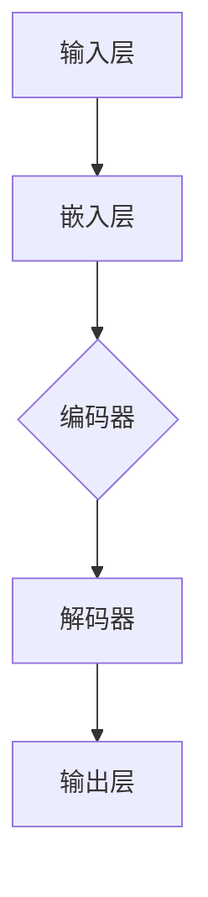
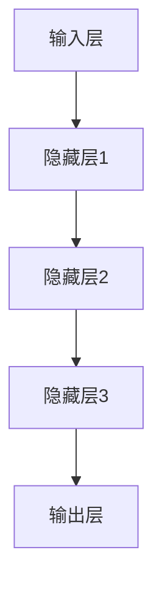

                 

### 文章标题

《大语言模型应用指南：入门》

### 关键词

大语言模型，自然语言处理，深度学习，预训练模型，应用实践，对话系统，未来发展趋势

### 摘要

本文旨在为读者提供一份全面的大语言模型应用指南。从基础理论到实际应用，从历史发展到现在的前沿技术，再到未来的发展趋势，文章系统地介绍了大语言模型的核心概念、架构原理、关键技术，以及其在教育、医疗、工业等领域的广泛应用。通过详细的代码示例和实战解析，读者可以深入了解大语言模型的开发流程和性能优化方法，为后续研究和项目实践打下坚实的基础。

----------------------------------------------------------------

# 《大语言模型应用指南：入门》

## 目录大纲

## 第一部分：大语言模型基础

### 第1章：大语言模型概述

#### 1.1 大语言模型的概念

#### 1.2 大语言模型的发展历程

#### 1.3 大语言模型在自然语言处理中的重要性

#### 1.4 大语言模型的基本架构

### 第2章：深度学习与神经网络基础

#### 2.1 神经网络的基本结构

#### 2.2 深度学习的基础算法

#### 2.3 深度学习框架介绍

### 第3章：自然语言处理技术概览

#### 3.1 词嵌入技术

#### 3.2 序列模型与注意力机制

#### 3.3 转换器架构详解

## 第二部分：大语言模型应用实践

### 第4章：大规模预训练模型原理

#### 4.1 预训练的概念与意义

#### 4.2 自监督学习方法

#### 4.3 迁移学习与微调技术

### 第5章：文本分类应用

#### 5.1 文本分类的原理

#### 5.2 文本分类的实战案例

#### 5.3 文本分类的性能优化

### 第6章：机器翻译应用

#### 6.1 机器翻译的基本原理

#### 6.2 机器翻译的实战案例

#### 6.3 机器翻译的性能优化

### 第7章：问答系统应用

#### 7.1 问答系统的基本原理

#### 7.2 问答系统的实战案例

#### 7.3 问答系统的性能优化

### 第8章：对话系统应用

#### 8.1 对话系统的基本原理

#### 8.2 对话系统的实战案例

#### 8.3 对话系统的性能优化

### 第9章：大语言模型的未来发展趋势

#### 9.1 大语言模型的未来发展方向

#### 9.2 大语言模型在教育领域的应用

#### 9.3 大语言模型在医疗领域的应用

#### 9.4 大语言模型在工业界的应用前景

## 附录

### 附录A：大语言模型开发工具与资源

#### A.1 主流深度学习框架对比

#### A.2 大语言模型开发环境搭建

#### A.3 大语言模型学习资源推荐

### 附录B：示例代码与解读

#### B.1 文本分类示例代码

#### B.2 机器翻译示例代码

#### B.3 对话系统示例代码

#### B.4 代码解读与分析

# 大语言模型架构流程图


## 第1章：大语言模型概述

### 1.1 大语言模型的概念

大语言模型（Large-scale Language Model）是一种利用深度学习技术，通过大规模数据进行预训练的模型。这些模型通常具有数十亿个参数，能够理解和生成人类语言。大语言模型的核心目标是捕捉语言的复杂结构和微妙含义，从而在各种自然语言处理（NLP）任务中表现出色。

### 1.2 大语言模型的发展历程

大语言模型的发展历程可以分为几个阶段：

#### 1.2.1 早期NLP模型

- **规则基方法**：基于语言学规则进行文本处理。
- **统计模型**：如N元语法、隐马尔可夫模型。

#### 1.2.2 深度学习在NLP中的应用

- **递归神经网络（RNN）**：首次将神经网络应用于NLP。
- **长短期记忆网络（LSTM）**：解决RNN的梯度消失问题。

#### 1.2.3 大规模预训练模型

- **Word2Vec**：首次将词向量应用于文本表示。
- **BERT**：引入了“掩码的语言模型”（Masked Language Model）。
- **GPT**：基于Transformer架构，预训练语言模型。

### 1.3 大语言模型在自然语言处理中的重要性

大语言模型在自然语言处理中具有以下几个重要应用：

#### 1.3.1 提高NLP任务性能

- **文本分类**：准确率显著提高。
- **机器翻译**：翻译质量接近甚至超越人类。
- **问答系统**：能够理解和回答复杂问题。

#### 1.3.2 开启新研究方向

- **对话系统**：如聊天机器人和虚拟助手。
- **文本生成**：如自动摘要、创作内容等。
- **跨语言处理**：实现不同语言之间的自然语言交互。

### 1.4 大语言模型的基本架构

大语言模型通常采用Transformer架构，其基本结构包括编码器（Encoder）和解码器（Decoder）。以下是一个简化的大语言模型架构流程图：


#### 1.4.1 编码器（Encoder）

编码器负责对输入文本进行编码，生成固定长度的向量表示。编码器通常包含多个Transformer块，每个块都包含自注意力（Self-Attention）和前馈网络（Feed Forward Network）。

#### 1.4.2 解码器（Decoder）

解码器负责生成输出文本。解码器也采用Transformer架构，包含多个解码块。解码块通常包含自注意力（Self-Attention）、交叉注意力（Cross-Attention）和前馈网络。

#### 1.4.3 注意力机制

注意力机制是Transformer模型的核心组成部分。自注意力（Self-Attention）使模型能够关注输入文本的不同部分，而交叉注意力（Cross-Attention）则使编码器和解码器能够交互。

### 1.5 大语言模型的应用前景

大语言模型在多个领域具有广泛的应用前景：

#### 1.5.1 企业级应用

- **客户服务**：提供智能客服支持。
- **内容审核**：自动识别和过滤不良内容。
- **市场分析**：分析消费者行为和反馈。

#### 1.5.2 教育领域

- **智能辅导**：为学生提供个性化学习支持。
- **教育资源**：自动生成教学材料和课程内容。

#### 1.5.3 医疗领域

- **医疗问答**：为患者提供医疗咨询。
- **疾病预测**：基于文本数据预测疾病趋势。

#### 1.5.4 工业界应用

- **供应链管理**：优化库存和物流。
- **数据分析**：自动提取和总结大量文本数据。

## 1.6 小结

大语言模型是自然语言处理领域的革命性进展，其强大的语言理解和生成能力，为各种NLP任务带来了新的可能性。随着技术的不断进步，大语言模型将在更多领域发挥重要作用。

---

## 第2章：深度学习与神经网络基础

### 2.1 神经网络的基本结构

神经网络（Neural Network）是深度学习（Deep Learning）的核心组成部分，由大量相互连接的神经元（Node）组成。神经网络的基本结构包括输入层、隐藏层和输出层。

#### 2.1.1 神经元模型

神经元是神经网络的基本构建块，其工作原理类似于生物神经元。神经元通常包含以下几个部分：

- **输入**：神经元接收外部输入信号。
- **权重**：每个输入信号通过权重与对应隐藏层神经元的连接进行加权求和。
- **激活函数**：用于引入非线性变换，常见的激活函数包括 sigmoid、ReLU 和 tanh。
- **偏置**：增加模型的灵活性。

神经元模型的基本数学表示为：
$$
\text{输出} = \text{激活函数}(\sum \text{权重} \times \text{输入} + \text{偏置})
$$

#### 2.1.2 神经网络层次结构

神经网络可以分为多个层次，每个层次都包含多个神经元。层次结构如下：

- **输入层**：接收输入数据。
- **隐藏层**：对输入数据进行特征提取和变换。
- **输出层**：产生最终输出。

神经网络的基本结构图如下所示：



### 2.1.3 神经网络的前向传播

前向传播是神经网络的主要工作流程，包括以下步骤：

1. **输入数据**：将输入数据传递到输入层。
2. **加权求和**：每个输入数据通过权重与对应隐藏层神经元的连接进行加权求和。
3. **激活函数**：通过激活函数对加权求和的结果进行非线性变换。
4. **传递到下一层**：将隐藏层的输出传递到下一层，直到达到输出层。

前向传播的数学表示为：
$$
\text{输出} = \text{激活函数}(\sum \text{权重} \times \text{输入} + \text{偏置})
$$

### 2.2 深度学习的基础算法

#### 2.2.1 反向传播算法

反向传播（Backpropagation）算法是一种用于训练神经网络的方法。其基本思想是通过计算损失函数关于网络权重的梯度，来更新网络的权重，以达到最小化损失函数的目的。

反向传播算法包括以下几个步骤：

1. **前向传播**：计算输入数据通过网络的前向传播，得到输出数据。
2. **计算损失**：计算输出数据与真实值之间的差异，得到损失函数。
3. **计算梯度**：从输出层开始，逆向计算每个神经元的梯度。
4. **权重更新**：根据计算出的梯度，更新网络权重。

反向传播算法的伪代码如下：

```python
for each layer from output to input:
    compute the gradient of the loss with respect to the outputs of the current layer
    update the weights of the current layer using the gradient
```

// Pseudo-code for weight update
```python
weights = weights - learning_rate * gradient
```

#### 2.2.2 梯度下降算法

梯度下降（Gradient Descent）是一种优化算法，用于寻找损失函数的最小值。其基本思想是沿着损失函数的梯度方向，逐步调整模型参数，以最小化损失函数。

梯度下降算法包括以下几个步骤：

1. **初始化参数**：随机初始化模型参数。
2. **计算梯度**：计算损失函数关于模型参数的梯度。
3. **更新参数**：根据梯度和学习率更新模型参数。
4. **迭代过程**：重复步骤2和3，直到满足停止条件（如达到预设的迭代次数或损失函数值足够小）。

梯度下降算法的伪代码如下：

```python
while not convergence:
    compute the gradient of the loss with respect to the parameters
    update the parameters using the gradient
```

// Pseudo-code for parameter update
```python
parameters = parameters - learning_rate * gradient
```

#### 2.2.3 小批量梯度下降

小批量梯度下降（Stochastic Gradient Descent，SGD）是对梯度下降算法的一种改进。其基本思想是将整个训练数据集分成多个小批量，在每个小批量上独立计算梯度，并更新模型参数。

小批量梯度下降算法包括以下几个步骤：

1. **初始化参数**：随机初始化模型参数。
2. **随机抽样**：从训练数据集中随机抽样一个小批量数据。
3. **计算梯度**：计算小批量数据上的梯度。
4. **更新参数**：根据计算出的梯度更新模型参数。
5. **迭代过程**：重复步骤2到4，直到满足停止条件。

小批量梯度下降算法的伪代码如下：

```python
while not convergence:
    for each mini-batch in training data:
        compute the gradient of the loss with respect to the parameters of the current mini-batch
        update the parameters using the gradient
```

// Pseudo-code for parameter update
```python
parameters = parameters - learning_rate * gradient
```

### 2.3 深度学习框架介绍

#### 2.3.1 TensorFlow

TensorFlow 是由 Google 开发的一款开源深度学习框架，其具有以下特点：

- **灵活的可扩展性**：支持多种编程语言，如 Python、C++ 和 Java。
- **强大的功能**：支持各种深度学习模型和算法，包括卷积神经网络（CNN）和循环神经网络（RNN）。
- **高效的计算**：利用 GPU 和 TPU 进行加速计算。

#### 2.3.2 PyTorch

PyTorch 是由 Facebook 开发的一款开源深度学习框架，其具有以下特点：

- **动态计算图**：支持动态计算图，使得模型的构建更加灵活。
- **易用性**：具有直观的 API 和丰富的文档，方便用户学习和使用。
- **强大的社区支持**：拥有庞大的开发者社区，提供丰富的资源和教程。

#### 2.3.3 其他深度学习框架

除了 TensorFlow 和 PyTorch，还有一些其他的深度学习框架，如：

- **Keras**：一个基于 TensorFlow 的简洁高效的深度学习框架。
- **MXNet**：由 Apache 软件基金会开发，支持多种编程语言。
- **Caffe**：由 Berkeley Vision and Learning Center（BVLC）开发，适合卷积神经网络。

## 2.4 小结

深度学习是人工智能领域的重要分支，神经网络是深度学习的基础。本章介绍了神经网络的基本结构、深度学习的基础算法以及深度学习框架。通过学习本章内容，读者可以掌握深度学习的基本概念和技术，为后续章节的学习打下坚实的基础。

---

## 第3章：自然语言处理技术概览

### 3.1 词嵌入技术

词嵌入（Word Embedding）是将自然语言中的词汇映射为高维向量的一种技术。其主要目的是将抽象的文本数据转化为机器可处理的数字向量，从而更好地进行文本分析和处理。

#### 3.1.1 词嵌入的定义与目的

词嵌入是将文本数据中的词汇映射为高维向量，这些向量可以表示词汇的语义信息。词嵌入的主要目的是：

- **文本表示**：将文本转化为向量，使得机器可以处理和比较。
- **语义理解**：通过向量之间的相似性，可以推断词汇的语义关系。

#### 3.1.2 词嵌入方法

常见的词嵌入方法包括：

- **Word2Vec**：基于神经网络的词嵌入方法，包括连续词袋（CBOW）和Skip-Gram。
- **FastText**：基于 Bag-of-Words（BOW）模型的改进方法，引入了词组（n-gram）信息。
- **词嵌入与语义分析**：通过词嵌入技术，可以分析词汇间的相似性、语义关系等。

#### 3.1.3 词嵌入的应用

词嵌入技术广泛应用于自然语言处理领域，如：

- **文本分类**：将文本转化为向量，用于分类任务。
- **文本相似度计算**：计算文本之间的相似度，用于推荐系统、问答系统等。

### 3.2 序列模型与注意力机制

序列模型（Sequential Models）是一种用于处理序列数据的模型，如文本、音频、时间序列等。常见的序列模型包括循环神经网络（RNN）和长短期记忆网络（LSTM）。

#### 3.2.1 序列模型的定义

序列模型是一种能够处理序列数据的模型，其基本思想是使用历史数据来预测未来的数据。序列模型在自然语言处理中具有广泛应用，如文本分类、情感分析、语言建模等。

#### 3.2.2 LSTM网络的结构与原理

LSTM（Long Short-Term Memory）网络是一种特殊的RNN，能够解决传统RNN的梯度消失和梯度爆炸问题。LSTM网络的主要结构包括：

- **输入门（Input Gate）**：决定当前输入信息是否被保存到记忆单元。
- **遗忘门（Forget Gate）**：决定从记忆单元中遗忘哪些信息。
- **输出门（Output Gate）**：决定当前记忆单元的信息是否输出。

LSTM网络的工作原理是使用三个门控单元（输入门、遗忘门和输出门）来控制信息的流入、流出和输出。通过这三个门控单元，LSTM网络可以学习到长远的依赖关系。

#### 3.2.3 注意力机制

注意力机制（Attention Mechanism）是一种在序列模型中引入的机制，用于处理输入序列中的关键信息。注意力机制的核心思想是动态地分配权重，使模型能够关注输入序列中的不同部分。

注意力机制广泛应用于自然语言处理领域，如机器翻译、文本摘要等。

#### 3.2.4 注意力机制的应用

注意力机制在自然语言处理中的应用包括：

- **机器翻译**：将输入文本序列中的每个词与目标词进行关联，提高翻译质量。
- **文本摘要**：提取输入文本序列中的关键信息，生成摘要。

### 3.3 转换器架构详解

转换器架构（Transformer Architecture）是一种基于自注意力机制的序列到序列模型。与传统的RNN和LSTM网络相比，转换器架构具有更高的并行计算能力。

#### 3.3.1 转换器架构的定义

转换器架构是一种基于自注意力机制的序列到序列模型，其核心思想是使用自注意力机制来处理输入序列和输出序列。

#### 3.3.2 Transformer模型的结构

Transformer模型的主要结构包括：

- **编码器（Encoder）**：用于对输入序列进行编码。
- **解码器（Decoder）**：用于对编码后的序列进行解码。
- **多头自注意力（Multi-Head Self-Attention）**：用于处理输入序列中的关键信息。
- **前馈网络（Feed Forward Network）**：用于对编码和解码的结果进行进一步处理。

#### 3.3.3 Transformer模型的应用

Transformer模型在多种自然语言处理任务上取得了显著的性能提升，包括：

- **机器翻译**：将源语言文本翻译成目标语言文本。
- **文本分类**：对输入文本进行分类。
- **问答系统**：根据问题回答问题。

## 3.4 小结

自然语言处理技术是人工智能领域的重要组成部分，本章介绍了词嵌入技术、序列模型与注意力机制以及转换器架构。通过学习本章内容，读者可以了解自然语言处理的基本概念和技术，为后续章节的学习打下坚实的基础。

---

## 第4章：大规模预训练模型原理

### 4.1 预训练的概念与意义

预训练（Pre-training）是指在特定任务之前，对模型进行大规模数据的训练。预训练的主要目的是提高模型在特定任务上的表现，同时减少对数据的依赖。

#### 4.1.1 预训练的定义

预训练是指在无监督或弱监督的环境下，使用大量未标注的数据对模型进行训练。预训练模型通常在大规模数据集上训练，从而学习到丰富的通用特征。

#### 4.1.2 预训练的意义

预训练具有以下几个重要意义：

- **提高模型性能**：通过在大规模数据上预训练，模型可以学习到更多的通用特征，从而在特定任务上表现出更好的性能。
- **减少数据依赖**：预训练模型可以在数据稀缺的情况下仍然保持较高的性能。
- **加快模型训练**：预训练模型已经在大规模数据上进行了训练，因此在新任务上的训练时间大大减少。

### 4.2 自监督学习方法

自监督学习（Self-Supervised Learning）是一种无需人工标注数据的学习方法。自监督学习利用未标注的数据，通过设计特定的任务，自动学习到有用的特征表示。

#### 4.2.1 自监督学习的定义

自监督学习是一种利用未标注数据的学习方法，其通过设计预测任务来挖掘数据中的结构。自监督学习的关键在于设计有效的预测任务，使得模型在预测过程中学习到数据的有用特征。

#### 4.2.2 自监督学习方法

常见的自监督学习方法包括：

- **文本分类**：将文本分为不同的类别，如情感分类、主题分类等。
- **词汇预测**：预测下一个词或词组，如语言建模任务。
- **词性标注**：预测文本中的词性，如名词、动词等。

#### 4.2.3 自监督学习在预训练中的应用

自监督学习在预训练中具有重要意义，其可以帮助模型在大规模未标注数据上进行训练。自监督学习任务通常作为预训练阶段的一部分，以提高模型在特定任务上的性能。

### 4.3 迁移学习与微调技术

迁移学习（Transfer Learning）是指将一个任务上学习的知识应用于另一个相关任务。迁移学习的核心思想是利用已有模型的知识，提高新任务的性能。

#### 4.3.1 迁移学习的概念

迁移学习是指将一个任务（源任务）上学习的知识（模型权重）应用于另一个相关任务（目标任务）上。迁移学习的目标是利用源任务上的预训练模型，在新任务上快速达到较好的性能。

#### 4.3.2 微调技术的原理

微调（Fine-tuning）是指将预训练模型在新任务上进行少量训练，以适应新任务的需求。微调的主要步骤包括：

1. **加载预训练模型**：从预训练任务中加载已经训练好的模型。
2. **冻结部分层**：通常冻结预训练模型中的大部分层，只对最后一部分层进行训练。
3. **微调训练**：在新任务的数据集上对模型进行微调训练。

#### 4.3.3 迁移学习在预训练中的应用

迁移学习在预训练中具有重要作用，其可以帮助模型在新任务上快速适应。通过迁移学习，预训练模型可以将在大规模数据上学习到的通用特征应用于新任务，从而提高新任务的性能。

### 4.4 BERT模型详解

BERT（Bidirectional Encoder Representations from Transformers）是由Google提出的一种双向转换器预训练模型。BERT模型通过在大量文本数据上进行双向训练，学习到丰富的语言特征，从而在多种自然语言处理任务上表现出色。

#### 4.4.1 BERT模型的背景

BERT模型是自然语言处理领域的一个里程碑，其通过引入双向转换器架构，实现了对文本的深度理解。BERT模型在多个自然语言处理任务上取得了显著的性能提升，包括文本分类、问答系统和机器翻译等。

#### 4.4.2 BERT模型的结构

BERT模型主要由两个部分组成：编码器（Encoder）和解码器（Decoder）。

- **编码器**：用于对输入文本进行编码，生成固定长度的向量表示。
- **解码器**：用于生成输出文本。

BERT模型的主要结构包括：

- **多头自注意力机制**：使模型能够关注输入文本中的不同部分。
- **位置编码**：为输入文本中的每个词添加位置信息。
- **Transformer块**：多个Transformer块堆叠，用于编码文本。

#### 4.4.3 BERT模型的应用

BERT模型在多种自然语言处理任务上取得了显著的性能提升，包括：

- **文本分类**：对输入文本进行分类，如情感分析、主题分类等。
- **问答系统**：根据问题回答问题。
- **机器翻译**：将源语言文本翻译成目标语言文本。

### 4.5 GPT模型详解

GPT（Generative Pre-trained Transformer）是由OpenAI提出的一种生成型预训练模型。GPT模型通过在大量文本数据上进行训练，学习到语言的生成规律，从而在文本生成任务上表现出色。

#### 4.5.1 GPT模型的背景

GPT模型是自然语言处理领域的一个重要进展，其通过生成型预训练，实现了对自然语言的高效生成。GPT模型在多个文本生成任务上取得了显著的性能提升，包括文本生成、机器翻译和问答系统等。

#### 4.5.2 GPT模型的结构

GPT模型主要由两个部分组成：编码器和解码器。

- **编码器**：用于对输入文本进行编码，生成固定长度的向量表示。
- **解码器**：用于生成输出文本。

GPT模型的主要结构包括：

- **Transformer块**：多个Transformer块堆叠，用于编码和解码文本。
- **位置编码**：为输入文本中的每个词添加位置信息。

#### 4.5.3 GPT模型的应用

GPT模型在多种文本生成任务上取得了显著的性能提升，包括：

- **文本生成**：根据输入文本生成新的文本内容。
- **机器翻译**：将源语言文本翻译成目标语言文本。
- **问答系统**：根据问题回答问题。

### 4.6 小结

本章介绍了大规模预训练模型的基本原理，包括预训练的概念、自监督学习方法、迁移学习与微调技术，以及BERT和GPT模型的详解。通过学习本章内容，读者可以了解大规模预训练模型的发展历程和应用场景，为后续章节的学习打下坚实的基础。

---

## 第5章：文本分类应用

### 5.1 文本分类的原理

文本分类（Text Classification）是指将文本数据按照一定的标准进行分类的过程。其目的是将未标注的文本数据自动划分到预定义的类别中。

#### 5.1.1 文本分类的定义

文本分类是一种监督学习任务，其目标是根据训练数据中已知的标签，将新的文本数据分类到预定义的类别中。常见的文本分类任务包括情感分析、主题分类和垃圾邮件检测等。

#### 5.1.2 文本分类的任务类型

文本分类任务可以分为以下几种类型：

- **二分类**：将文本分为两个类别，如正面和负面。
- **多分类**：将文本分为多个类别，如新闻分类、产品评论分类等。
- **多标签分类**：将文本分配给多个标签，如新闻文章可以同时属于体育和娱乐类别。

#### 5.1.3 文本分类的基本流程

文本分类的基本流程包括以下几个步骤：

1. **数据预处理**：对文本数据进行清洗、分词、去停用词等操作。
2. **特征提取**：将文本数据转化为向量表示，常用的方法有词袋模型、TF-IDF等。
3. **模型选择**：选择合适的分类模型，如朴素贝叶斯、支持向量机、神经网络等。
4. **模型训练**：使用训练数据进行模型训练。
5. **模型评估**：使用测试集评估模型性能，常用的评估指标有准确率、召回率、F1值等。

#### 5.1.4 文本分类的关键技术

文本分类的关键技术包括：

- **词袋模型**：将文本表示为一个词频向量。
- **TF-IDF**：根据词的频率和文档的重要性来计算词的权重。
- **词嵌入**：将文本中的词汇映射为高维向量，常用的方法有Word2Vec、GloVe等。
- **神经网络**：使用神经网络对文本进行分类，如卷积神经网络（CNN）和循环神经网络（RNN）。

### 5.2 文本分类的实战案例

#### 5.2.1 数据集选择

本节将使用开源的文本分类数据集——IMDB电影评论数据集进行文本分类实战。

IMDB电影评论数据集包含了25000条电影评论，其中12500条用于训练集，12500条用于测试集。每条评论都有一个标签，表示评论的情感倾向，即正面（pos）或负面（neg）。

#### 5.2.2 数据预处理

1. **文本清洗**：去除HTML标签、特殊字符和停用词。
2. **分词**：使用分词工具对文本进行分词。
3. **词嵌入**：使用预训练的词嵌入模型（如GloVe）将文本映射为向量。

#### 5.2.3 模型选择

本节将使用基于卷积神经网络的文本分类模型（TextCNN）进行分类。

TextCNN是一种基于卷积神经网络的文本分类模型，其通过卷积核在文本序列上滑动，提取特征，然后使用全连接层进行分类。

#### 5.2.4 模型训练

1. **数据集划分**：将数据集分为训练集和测试集。
2. **模型构建**：使用TensorFlow和Keras构建TextCNN模型。
3. **模型训练**：在训练集上进行模型训练。

#### 5.2.5 模型评估

使用测试集评估模型性能，计算准确率、召回率、F1值等指标。

### 5.3 文本分类的性能优化

文本分类的性能优化可以通过以下方法进行：

#### 5.3.1 数据增强

通过数据增强技术，可以增加训练数据的多样性，从而提高模型的泛化能力。

- **随机插入**：在文本中随机插入词语。
- **随机替换**：在文本中随机替换词语。
- **同义词替换**：使用同义词替换文本中的词语。

#### 5.3.2 模型集成

通过模型集成（Model Ensemble）技术，可以结合多个模型的预测结果，提高整体分类性能。

- **堆叠**：将多个模型堆叠在一起，形成一个更深的网络。
- **投票**：将多个模型的预测结果进行投票，选择多数模型认为的类别。

#### 5.3.3 超参数调优

通过调整模型超参数，可以进一步提高模型性能。

- **学习率调整**：使用不同的学习率进行训练，选择性能最佳的模型。
- **批量大小调整**：调整训练数据的批量大小，选择最佳性能的批量大小。

### 5.4 小结

本章介绍了文本分类的基本原理、实战案例和性能优化方法。通过本章的学习，读者可以了解文本分类的基本概念和实现方法，掌握如何使用深度学习模型进行文本分类，并学会优化文本分类模型性能。文本分类技术在多个领域具有广泛的应用，如社交媒体分析、金融风险评估等。

---

## 第6章：机器翻译应用

### 6.1 机器翻译的基本原理

机器翻译（Machine Translation）是指使用计算机程序将一种自然语言文本自动翻译成另一种自然语言文本的过程。

#### 6.1.1 机器翻译的定义

机器翻译是一种将源语言文本转换为目标语言文本的自动化过程。其目的是通过计算机算法实现人类语言的跨语言转换。

#### 6.1.2 机器翻译的发展历程

- **基于规则的方法**：早期机器翻译主要依赖语言学规则和翻译记忆库。
- **基于统计的方法**：使用概率模型和统计方法进行翻译。
- **基于神经的方法**：使用深度学习模型进行翻译，如循环神经网络（RNN）和转换器（Transformer）。

#### 6.1.3 机器翻译的基本流程

机器翻译的基本流程包括以下几个步骤：

1. **文本预处理**：对输入文本进行分词、标记等处理。
2. **编码器处理**：将输入文本编码为向量表示。
3. **解码器处理**：将编码后的向量解码为输出文本。
4. **后处理**：对输出文本进行语法和语义调整。

### 6.2 机器翻译的实战案例

#### 6.2.1 数据集选择

本节将使用开源的英语-法语翻译数据集——WMT14 English-French（English to French）数据集进行机器翻译实战。

WMT14 English-French 数据集包含了大约4500万条句对，是机器翻译领域的一个经典数据集。

#### 6.2.2 数据预处理

1. **文本清洗**：去除HTML标签、特殊字符和停用词。
2. **分词**：使用分词工具对文本进行分词。
3. **词嵌入**：使用预训练的词嵌入模型（如GloVe）将文本映射为向量。

#### 6.2.3 模型选择

本节将使用基于转换器的机器翻译模型——Transformer进行翻译。

Transformer 模型是一种基于自注意力机制的序列到序列模型，其具有高效并行计算能力，适用于机器翻译任务。

#### 6.2.4 模型训练

1. **数据集划分**：将数据集分为训练集、验证集和测试集。
2. **模型构建**：使用TensorFlow和Keras构建Transformer模型。
3. **模型训练**：在训练集上进行模型训练。

#### 6.2.5 模型评估

使用验证集和测试集评估模型性能，计算BLEU（双语评估指标）等指标。

### 6.3 机器翻译的性能优化

机器翻译的性能优化可以从以下几个方面进行：

#### 6.3.1 双语数据增强

通过双语数据增强技术，可以增加训练数据的多样性，从而提高模型的泛化能力。

- **并行数据增强**：随机打乱原始的双语数据，重新组合成新的数据对。
- **翻译质量增强**：使用高质量的翻译文本作为训练数据。

#### 6.3.2 模型集成

通过模型集成技术，可以结合多个模型的预测结果，提高整体翻译性能。

- **堆叠**：将多个模型堆叠在一起，形成一个更深的网络。
- **投票**：将多个模型的预测结果进行投票，选择多数模型认为的翻译结果。

#### 6.3.3 超参数调优

通过调整模型超参数，可以进一步提高模型性能。

- **学习率调整**：使用不同的学习率进行训练，选择性能最佳的模型。
- **批量大小调整**：调整训练数据的批量大小，选择最佳性能的批量大小。

### 6.4 小结

本章介绍了机器翻译的基本原理、实战案例和性能优化方法。通过本章的学习，读者可以了解机器翻译的基本概念和实现方法，掌握如何使用深度学习模型进行机器翻译，并学会优化机器翻译模型性能。机器翻译技术在跨语言沟通、全球化业务等领域具有广泛的应用。

---

## 第7章：问答系统应用

### 7.1 问答系统的基本原理

问答系统（Question Answering System）是一种人工智能系统，它能够自动回答用户提出的问题。问答系统的目标是理解用户的问题，并在大量数据中找到相关且准确的答案。

#### 7.1.1 问答系统的定义

问答系统是一种能够接受用户问题的输入，并在大量数据中查找相关信息并生成回答的计算机系统。问答系统可以分为两大类：基于规则的方法和基于机器学习的方法。

#### 7.1.2 问答系统的类型

问答系统可以分为以下几种类型：

- **信息检索型问答系统**：通过搜索数据库或网页来找到问题的答案。
- **基于知识的问答系统**：利用已有的知识库来回答问题。
- **基于机器学习的问答系统**：使用机器学习算法来从大量文本数据中提取答案。

#### 7.1.3 问答系统的基本流程

问答系统的基本流程包括以下几个步骤：

1. **问题理解**：将自然语言的问题转换为计算机可以处理的形式。
2. **答案检索**：在文本数据中检索可能的答案。
3. **答案生成**：将检索到的信息整合成自然的语言回答。
4. **答案评估**：评估答案的准确性、相关性等。

### 7.2 问答系统的实战案例

#### 7.2.1 数据集选择

本节将使用著名的SQuAD（Stanford Question Answering Dataset）数据集进行问答系统实战。

SQuAD 数据集是一个大规模的问答数据集，包含了数百万个问题及其答案。数据集由真实世界的问答场景组成，具有高度的挑战性。

#### 7.2.2 数据预处理

1. **文本清洗**：去除HTML标签、特殊字符和停用词。
2. **分词**：使用分词工具对文本进行分词。
3. **词嵌入**：使用预训练的词嵌入模型（如GloVe）将文本映射为向量。

#### 7.2.3 模型选择

本节将使用基于转换器的模型——BERT进行问答系统。

BERT 模型是一种双向转换器预训练模型，其通过在大量文本数据上进行双向训练，学习到丰富的语言特征，适用于问答系统。

#### 7.2.4 模型训练

1. **数据集划分**：将数据集分为训练集、验证集和测试集。
2. **模型构建**：使用TensorFlow和Keras构建BERT模型。
3. **模型训练**：在训练集上进行模型训练。

#### 7.2.5 模型评估

使用验证集和测试集评估模型性能，计算F1值等指标。

### 7.3 问答系统的性能优化

问答系统的性能优化可以从以下几个方面进行：

#### 7.3.1 知识图谱的引入

通过引入知识图谱，可以增强问答系统的知识库，提高答案的准确性和相关性。

- **实体识别**：识别文本中的实体，如人名、地名等。
- **关系提取**：提取实体之间的关系，如“居住地”、“工作单位”等。

#### 7.3.2 多模态融合

将不同模态的数据（如文本、图像、音频等）进行融合，可以提升问答系统的性能。

- **文本与图像融合**：通过图像识别和文本理解，提高图像问答的准确率。
- **文本与语音融合**：结合语音识别和文本理解，提高语音问答的准确性。

#### 7.3.3 对话状态跟踪

通过对话状态跟踪，可以更好地理解用户的意图和问题，提高问答的连贯性和准确性。

- **对话历史记录**：记录用户之前的提问和回答，帮助理解当前问题。
- **意图识别**：识别用户的问题意图，如信息查询、任务指令等。

### 7.4 小结

本章介绍了问答系统的基本原理、实战案例和性能优化方法。通过本章的学习，读者可以了解问答系统的基本概念和实现方法，掌握如何使用深度学习模型进行问答系统开发，并学会优化问答系统性能。问答系统在智能客服、虚拟助手等领域具有广泛的应用前景。

---

## 第8章：对话系统应用

### 8.1 对话系统的基本原理

对话系统（Dialogue System）是一种人工智能系统，能够与人类用户进行自然语言交互，理解用户的需求并给予适当的响应。

#### 8.1.1 对话系统的定义

对话系统是一种能够通过自然语言与用户进行交互的计算机程序，其目标是模拟人类的对话过程，提供有用的信息和帮助。

#### 8.1.2 对话系统的类型

对话系统可以分为以下几种类型：

- **命令式对话系统**：用户通过命令与系统交互，系统执行命令并返回结果。
- **

