                 

# 大语言模型应用指南：图灵机与神经网络

## 关键词

大语言模型，图灵机，神经网络，深度学习，自然语言处理，文本生成，对话系统，机器翻译，边缘计算，伦理与安全

## 摘要

本文将详细探讨大语言模型的应用指南，从图灵机的基础理论出发，深入讲解神经网络与深度学习的核心算法原理，并重点介绍GPT和BERT等主流大语言模型的架构、训练与优化策略。通过具体应用案例，本文将展示大语言模型在文本生成、对话系统、机器翻译等领域的实战应用。同时，本文还将探讨大语言模型在硬件加速、跨模态学习和边缘计算中的未来发展，以及其在伦理与安全方面的挑战与解决方案。希望通过本文的详细讲解，读者能够全面了解大语言模型的理论与实践，为未来的研究和应用打下坚实基础。

---

## 第一部分：大语言模型基础理论

### 第1章 大语言模型概述

#### 1.1 大语言模型的概念

大语言模型（Large Language Model）是一种基于深度学习的自然语言处理模型，能够理解和生成自然语言。它是通过在大量文本数据上进行预训练，从而学习到语言的统计特征和语义信息，进而实现文本生成、分类、翻译等任务。

**核心概念与联系**

- **自然语言处理（NLP）**：大语言模型是自然语言处理领域的重要分支，旨在使计算机能够理解和处理人类语言。
- **深度学习**：大语言模型基于深度学习技术，通过多层神经网络进行训练。
- **预训练**：大语言模型通过在大量文本数据上进行预训练，获得良好的语言理解能力。

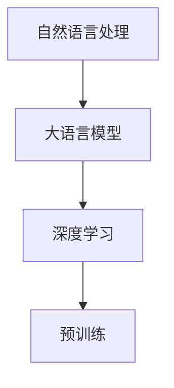

#### 1.2 大语言模型的历史与发展

大语言模型的发展可以追溯到20世纪50年代，随着计算机科学和人工智能技术的发展，大语言模型经历了从规则方法到统计模型，再到深度学习的演变。

- **规则方法**：早期的大语言模型基于规则进行语言处理。
- **统计模型**：随着统计学和机器学习技术的发展，统计模型成为主流，如n-gram模型。
- **深度学习**：近年来，随着计算能力的提升和深度学习技术的突破，大语言模型得到了飞速发展，如GPT、BERT等。

**核心概念与联系**

- **计算能力提升**：提供了更强大的计算资源，使得大语言模型能够处理更大规模的数据。
- **深度学习技术**：推动了大语言模型的性能提升。

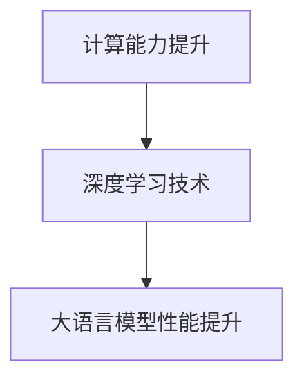

#### 1.3 大语言模型的应用领域

大语言模型在多个领域有着广泛的应用，包括文本生成、对话系统、机器翻译、自然语言理解等。

- **文本生成**：生成文章、故事、代码等。
- **对话系统**：构建智能客服、虚拟助手等。
- **机器翻译**：实现不同语言之间的自动翻译。
- **自然语言理解**：提取文本中的实体、关系等信息。

**核心概念与联系**

- **文本生成**：依赖于语言模型生成相关文本。
- **对话系统**：利用语言模型理解用户输入并生成响应。
- **机器翻译**：基于语言模型进行源语言到目标语言的转换。
- **自然语言理解**：通过语言模型提取文本的语义信息。

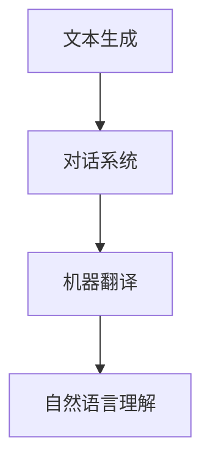

#### 1.4 大语言模型的关键技术

大语言模型的关键技术包括神经网络、深度学习、预训练、自监督学习等。

- **神经网络**：构建模型的基础，用于处理和生成数据。
- **深度学习**：通过多层神经网络提取特征。
- **预训练**：在大量数据上训练模型，提高其泛化能力。
- **自监督学习**：利用未标记数据训练模型。

**核心概念与联系**

- **神经网络**：实现数据的非线性变换。
- **深度学习**：通过多层网络提取复杂特征。
- **预训练**：利用大量未标记数据进行训练。
- **自监督学习**：提高模型的鲁棒性和效率。

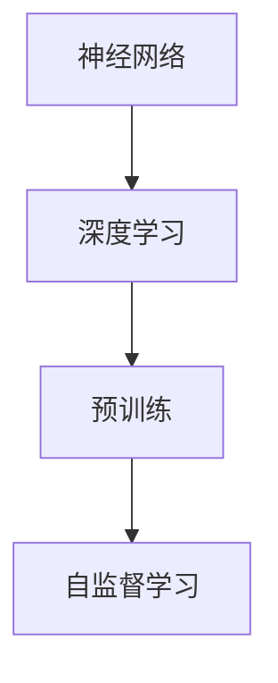

### 第2章 图灵机基础

#### 2.1 图灵机的定义与工作原理

图灵机是一种抽象的计算模型，由英国数学家艾伦·图灵在20世纪30年代提出。它由一个无限长的纸带、一个读写头和一组规则组成。

- **无限长的纸带**：用于存储数据和计算结果。
- **读写头**：用于在纸带上读取和写入数据。
- **规则**：定义读写头在纸带上的移动和数据的操作。

**核心概念与联系**

- **计算模型**：图灵机是一种计算模型，用于模拟计算机的计算过程。
- **存储和读写**：纸带和读写头用于存储和读取数据。
- **规则**：定义了计算过程的规则。

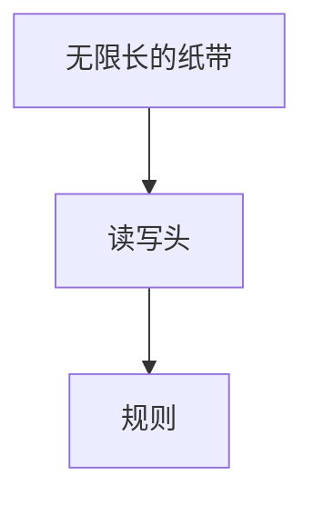

#### 2.2 图灵机的数学模型

图灵机的数学模型包括状态、符号和转移函数。

- **状态**：图灵机在计算过程中的不同状态。
- **符号**：纸带上的数据符号。
- **转移函数**：定义图灵机从一个状态到另一个状态的转换。

**核心概念与联系**

- **状态**：表示图灵机在计算过程中的位置和状态。
- **符号**：表示图灵机在纸带上的数据。
- **转移函数**：定义了图灵机的计算过程。

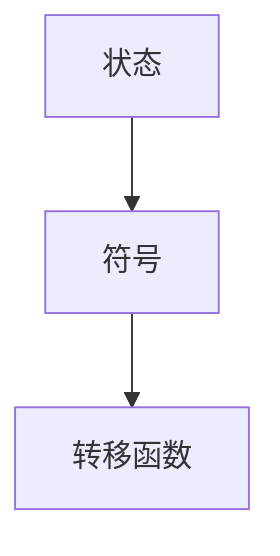

#### 2.3 图灵机的实现与限制

图灵机作为一种理论模型，虽然在理论上可以模拟任何计算过程，但在实际应用中存在一些限制。

- **存储限制**：纸带的长度是无限的，但在实际硬件中是有限的。
- **计算速度**：图灵机的计算速度较慢，不适合实时计算。
- **可扩展性**：图灵机的设计复杂，难以扩展和应用。

**核心概念与联系**

- **存储限制**：实际硬件中的存储空间有限。
- **计算速度**：图灵机的计算速度较慢。
- **可扩展性**：图灵机的设计复杂，难以扩展。

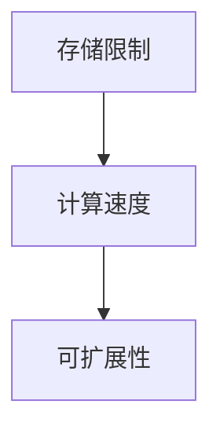

### 第3章 神经网络基础

#### 3.1 神经网络的概念

神经网络（Neural Network）是一种模仿生物神经系统的计算模型，由多个神经元组成。

- **神经元**：神经网络的基本单元，用于处理和传递数据。
- **连接**：神经元之间的连接，用于传递数据。
- **激活函数**：定义神经元的激活状态。

**核心概念与联系**

- **神经元**：神经网络的基本计算单元。
- **连接**：神经元之间的信息传递路径。
- **激活函数**：定义神经元的输出。

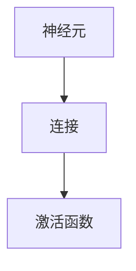

#### 3.2 前馈神经网络

前馈神经网络（Feedforward Neural Network）是一种常见的神经网络结构，信息从输入层流向输出层，不形成闭环。

- **输入层**：接收外部输入信息。
- **隐藏层**：进行数据变换和处理。
- **输出层**：产生最终输出。

**核心概念与联系**

- **输入层**：接收输入数据。
- **隐藏层**：进行数据变换和处理。
- **输出层**：产生输出结果。

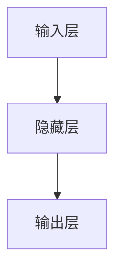

#### 3.3 循环神经网络

循环神经网络（Recurrent Neural Network，RNN）是一种能够处理序列数据的神经网络，具有记忆功能。

- **循环连接**：神经元之间的连接形成闭环。
- **隐藏状态**：用于存储和传递序列信息。
- **时间步**：序列数据的一个时间点。

**核心概念与联系**

- **循环连接**：用于存储序列信息。
- **隐藏状态**：用于存储和传递信息。
- **时间步**：序列数据的时间点。

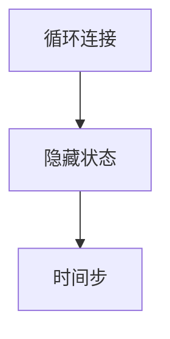

#### 3.4 卷积神经网络

卷积神经网络（Convolutional Neural Network，CNN）是一种用于图像处理和计算机视觉的神经网络，具有局部连接和平移不变性。

- **卷积层**：用于提取图像特征。
- **池化层**：用于减小数据规模和增加网络深度。
- **全连接层**：用于分类和回归。

**核心概念与联系**

- **卷积层**：提取图像特征。
- **池化层**：减小数据规模和增加网络深度。
- **全连接层**：分类和回归。

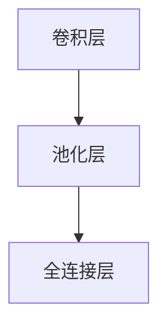

### 第4章 深度学习基础

#### 4.1

