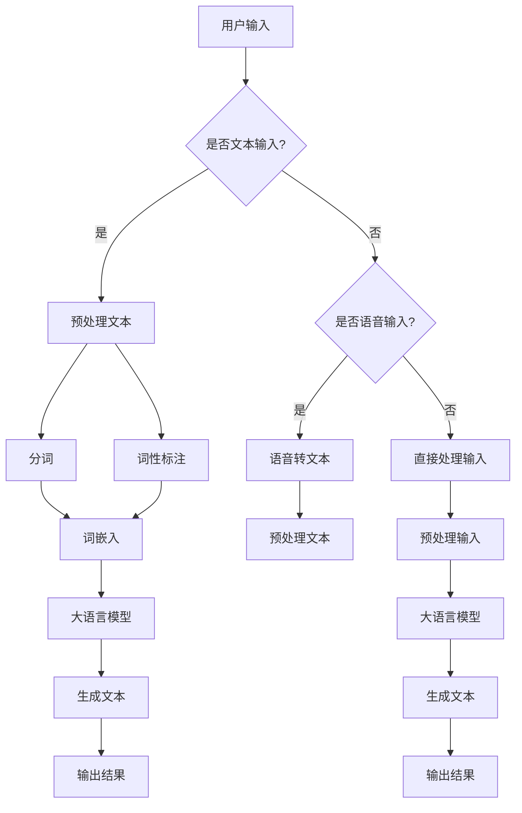

                 


### 摘要

本文旨在深入探讨大语言模型在自主Agent系统中的应用，分析其基本组成、核心技术、训练与优化策略，以及在实际应用案例中的挑战和未来发展趋势。自主Agent系统是指具有独立决策能力和自主行动能力的计算实体，能够感知环境、做出决策和执行行动。大语言模型是通过大规模数据训练得到的神经网络模型，能够对自然语言进行建模，实现文本分类、机器翻译、问答系统等多种自然语言处理任务。本文首先介绍了自主Agent系统的基本概念、特点和发展历程，然后阐述了大语言模型的定义、发展历程和主要类型。接下来，文章详细讲解了大语言模型的基础原理，包括神经网络与深度学习基础、语言模型的构建和预训练与微调技术。随后，文章介绍了大语言模型的训练与优化过程，包括数据处理与预处理、训练策略与技巧、优化算法与性能调优。此外，文章还探讨了大语言模型的应用架构，包括推理机制、自然语言处理应用和与其他技术的融合。在自主Agent系统中的大语言模型集成部分，文章详细介绍了自主Agent系统的基本组成、大语言模型在系统中的作用以及集成策略。接着，文章通过具体案例展示了大语言模型在智能客服系统、智能写作与编辑系统、智能问答与搜索引擎中的应用。最后，文章提出了自主Agent系统中的大语言模型面临的挑战，包括模型大小与计算资源挑战、模型可解释性挑战、安全性与隐私保护挑战，并展望了未来的发展趋势。本文旨在为读者提供关于大语言模型在自主Agent系统中应用的全景图，以及深入理解和应用这些技术的指导。

---

### 引言

自主Agent系统（Autonomous Agent System）是人工智能领域中的一个重要研究方向，旨在开发能够自主决策和执行任务的智能系统。在现代社会，随着信息技术的飞速发展和大数据的广泛应用，自主Agent系统在各个领域，如工业自动化、智能家居、智能交通等，都展现出了巨大的应用潜力。然而，要实现一个高效的自主Agent系统，需要解决许多关键技术问题，其中之一便是大语言模型的应用。

大语言模型（Large Language Model）是近年来自然语言处理领域的一项重要突破。通过在大量文本数据上训练，大语言模型能够捕捉语言中的复杂模式和规律，从而实现对自然语言的深度理解和生成。大语言模型在文本分类、机器翻译、问答系统等自然语言处理任务中表现出了卓越的性能，为自主Agent系统的智能交互提供了有力支持。

本文将围绕大语言模型在自主Agent系统中的应用，系统地探讨其基本组成、核心技术、训练与优化策略，以及在各个应用场景中的挑战和未来发展趋势。首先，我们将介绍自主Agent系统的基本概念、特点和发展历程，帮助读者了解自主Agent系统的基本框架。接着，我们将详细阐述大语言模型的定义、发展历程和主要类型，为进一步探讨其在自主Agent系统中的应用打下基础。

在基础原理部分，本文将深入讲解大语言模型的构建过程，包括神经网络与深度学习基础、语言模型的构建和预训练与微调技术。这部分内容将帮助读者理解大语言模型的工作机制和训练方法。

随后，本文将介绍大语言模型的训练与优化过程，包括数据处理与预处理、训练策略与技巧、优化算法与性能调优。这部分内容将帮助读者了解如何高效训练和优化大语言模型，以适应不同的应用需求。

在应用架构部分，本文将探讨大语言模型的应用架构，包括推理机制、自然语言处理应用和与其他技术的融合。这部分内容将展示大语言模型在自主Agent系统中的具体应用场景，以及如何与其他技术相结合，提高系统的智能性和鲁棒性。

在自主Agent系统中的大语言模型集成部分，本文将详细讨论自主Agent系统的基本组成、大语言模型在系统中的作用以及集成策略。这部分内容将帮助读者了解如何在大语言模型的支持下，构建一个高效、智能的自主Agent系统。

接下来，本文将通过具体案例展示大语言模型在智能客服系统、智能写作与编辑系统、智能问答与搜索引擎中的应用。这部分内容将帮助读者更直观地了解大语言模型在自主Agent系统中的实际应用效果。

最后，本文将提出自主Agent系统中的大语言模型面临的挑战，包括模型大小与计算资源挑战、模型可解释性挑战、安全性与隐私保护挑战，并展望未来的发展趋势。这部分内容将为读者提供关于大语言模型在自主Agent系统中应用的深入思考。

通过本文的探讨，我们希望能够为读者提供一个全面、系统的理解，帮助其在实际应用中更好地利用大语言模型，构建高效的自主Agent系统。

---

### 目录大纲

本文将分为八个主要部分，系统性地探讨大语言模型在自主Agent系统中的应用。

**第一部分：引论**

- **第1章：自主Agent系统的基本概念**
  - **1.1 自主Agent的定义与分类**
  - **1.2 自主Agent系统的特点**
  - **1.3 自主Agent的发展历程**

- **第2章：大语言模型概述**
  - **2.1 大语言模型的定义**
  - **2.2 大语言模型的发展历程**
  - **2.3 大语言模型的主要类型**

**第二部分：大语言模型的基础原理**

- **第3章：大语言模型的基础原理**
  - **3.1 神经网络与深度学习基础**
  - **3.2 语言模型的构建**
  - **3.3 预训练与微调技术**

- **第4章：大语言模型的训练与优化**
  - **4.1 数据处理与预处理**
  - **4.2 训练策略与技巧**
  - **4.3 优化算法与性能调优**

- **第5章：大语言模型的应用架构**
  - **5.1 大语言模型的推理机制**
  - **5.2 大语言模型在自然语言处理中的应用**
  - **5.3 大语言模型与其他技术的融合**

**第三部分：自主Agent系统中的大语言模型应用**

- **第6章：自主Agent系统中的大语言模型集成**
  - **6.1 自主Agent系统的基本组成**
  - **6.2 大语言模型在自主Agent系统中的作用**
  - **6.3 大语言模型在自主Agent系统中的集成策略**

- **第7章：大语言模型在自主Agent系统中的应用案例**
  - **7.1 智能客服系统**
  - **7.2 智能写作与编辑系统**
  - **7.3 智能问答与搜索引擎**

- **第8章：自主Agent系统中的大语言模型挑战与未来展望**
  - **8.1 模型大小与计算资源挑战**
  - **8.2 模型可解释性挑战**
  - **8.3 自主Agent系统的安全性与隐私保护**
  - **8.4 未来自主Agent系统与大语言模型的发展趋势**

**附录**

- **附录A：大语言模型常用工具与资源**
  - **A.1 常用深度学习框架**
  - **A.2 大语言模型开源资源**
  - **A.3 自主Agent系统开发工具与资源**

---

通过上述目录大纲，本文将系统性地介绍大语言模型在自主Agent系统中的应用，从基本概念、核心技术、训练与优化、应用架构、集成策略、应用案例、挑战与未来展望等方面进行深入探讨，旨在为读者提供一个全面的理解和实用的指导。

---

## 第一部分：引论

### 第1章：自主Agent系统的基本概念

### 1.1 自主Agent的定义与分类

自主Agent（Autonomous Agent）是指一种具有独立决策能力和自主行动能力的计算实体。自主Agent能够感知环境中的信息，根据当前的环境状态自主做出决策，并执行相应的行动。根据自主决策能力的不同，自主Agent可以分为以下几类：

#### 1.1.1 知觉Agent（Perceptual Agent）

知觉Agent主要负责感知环境中的信息。它们通过传感器获取环境数据，如图像、声音、温度等，并将这些信息转换为内部表示。知觉Agent的核心任务是提供环境感知能力，但它们无法独立做出决策。

#### 1.1.2 动作Agent（Acting Agent）

动作Agent具有决策能力，能够根据当前的环境状态选择合适的行动。动作Agent的核心功能是执行决策，通过执行特定的操作来改变环境状态。动作Agent通常与外部执行器（如机械臂、机器人腿）相连，实现自主行动。

#### 1.1.3 智能Agent（Intelligent Agent）

智能Agent不仅具备知觉和动作能力，还能够学习和适应环境变化。智能Agent通过经验学习和知识积累，不断提高决策能力和行动效率。智能Agent能够利用机器学习算法、自然语言处理技术等，实现更复杂的决策和行动。

### 1.2 自主Agent系统的特点

自主Agent系统具有以下几个显著特点：

#### 1.2.1 独立性

自主Agent系统能够独立运行，不受外部干预。每个自主Agent都能够自主决策和行动，系统中的Agent之间通过通信机制进行信息共享和协调。

#### 1.2.2 自主性

自主Agent系统能够根据当前环境状态自主做出决策。系统中的Agent能够根据感知到的环境信息，选择最优的行动方案，从而实现自主行为。

#### 1.2.3 学习性

自主Agent系统具有学习性，能够通过经验积累和知识更新，不断提高决策能力和行动效率。系统中的Agent可以通过机器学习算法，从环境中学习到新的知识和技能。

#### 1.2.4 社交性

自主Agent系统中的Agent能够相互通信和协作。通过共享信息和知识，多个Agent可以共同完成任务，实现更高效的系统运行。

### 1.3 自主Agent的发展历程

自主Agent的概念最早可以追溯到20世纪70年代。自那时起，自主Agent系统经历了以下几个发展阶段：

#### 1.3.1 初始阶段（1970-1980）

在初始阶段，自主Agent的研究主要集中在如何实现独立性和自主性。研究者们提出了许多基于规则和逻辑的方法，如基于生产式规则的Agent、基于面向对象的方法等。

#### 1.3.2 发展阶段（1980-2000）

随着计算机技术和人工智能的发展，自主Agent系统的研究开始关注如何实现学习性和社交性。在这一阶段，研究者们提出了许多基于强化学习、多Agent系统和分布式计算的方法，如Q-learning、SARSA等。

#### 1.3.3 繁荣阶段（2000-2010）

进入21世纪，随着互联网和电子商务的兴起，自主Agent系统的应用场景逐渐增多。研究者们开始关注如何在复杂环境中部署自主Agent系统，并提出了许多基于云计算和物联网的方法。

#### 1.3.4 现代阶段（2010年至今）

随着深度学习和大数据技术的应用，自主Agent系统取得了显著的进展。现代自主Agent系统采用了更先进的机器学习算法、自然语言处理技术和多模态感知技术，实现了更高的智能性和自主性。

## 第2章：大语言模型概述

### 2.1 大语言模型的定义

大语言模型（Large Language Model）是指具有大规模参数和训练数据，能够对自然语言进行建模的神经网络模型。大语言模型通过对大量文本数据的学习，能够捕捉语言中的复杂模式和规律，从而实现对自然语言的深度理解和生成。大语言模型的核心在于其规模，通常具有数十亿甚至数千亿的参数，这使得它们能够处理复杂的自然语言现象。

### 2.2 大语言模型的发展历程

大语言模型的发展历程可以分为以下几个阶段：

#### 2.2.1 初期阶段（20世纪50年代-20世纪80年代）

在初期阶段，语言模型主要是基于规则的方法，如基于上下文无关文法（CFG）的方法和基于语法规则的方法。这些方法通过手工编写规则来描述语言结构，但难以处理复杂的语言现象。

#### 2.2.2 早期阶段（20世纪80年代-20世纪90年代）

随着统计方法的兴起，语言模型开始采用基于N-gram的方法和隐马尔可夫模型（HMM）。这些方法通过统计文本中的单词序列和状态转移概率来预测下一个单词或字符，尽管效果有所提升，但仍然难以处理长距离依赖和语义理解问题。

#### 2.2.3 中期阶段（20世纪90年代-2010年）

在这一阶段，递归神经网络（RNN）和卷积神经网络（CNN）开始应用于语言模型。RNN能够处理序列数据，捕捉长距离依赖关系，但存在梯度消失和梯度爆炸的问题。CNN则通过卷积操作捕捉局部特征，但在处理序列数据时效果有限。

#### 2.2.4 现代阶段（2010年至今）

现代阶段，随着深度学习和计算能力的提升，大语言模型取得了突破性的进展。基于Transformer架构的模型，如GPT（Generative Pre-trained Transformer）和BERT（Bidirectional Encoder Representations from Transformers），通过预训练和微调技术，实现了前所未有的自然语言理解和生成能力。

### 2.3 大语言模型的主要类型

大语言模型可以分为以下几类：

#### 2.3.1 预训练语言模型

预训练语言模型（Pre-trained Language Model）是在大规模语料库上进行预训练，然后再针对特定任务进行微调的模型。预训练过程通过无监督学习，模型学习到语言的一般规律和模式，从而提高对各种语言任务的处理能力。例如，GPT和BERT都是典型的预训练语言模型。

#### 2.3.2 细粒度语言模型

细粒度语言模型（Fine-grained Language Model）是在预训练语言模型的基础上，针对特定领域或任务进行进一步训练的模型。细粒度语言模型能够更好地适应特定领域的语言特点，从而提高任务性能。例如，法律文本模型、医学文本模型等都是细粒度语言模型的例子。

#### 2.3.3 多模态语言模型

多模态语言模型（Multimodal Language Model）能够处理文本和图像、音频等多种数据类型。通过结合不同模态的信息，多模态语言模型能够实现更复杂的自然语言理解和生成任务。例如，视觉问答模型和语音识别模型都是多模态语言模型的应用场景。

## 第3章：大语言模型的基础原理

### 3.1 神经网络与深度学习基础

神经网络（Neural Network，简称NN）是一种模拟生物神经系统的计算模型。它由大量的神经元（节点）组成，每个神经元都与其他神经元相连，并通过权重进行信息传递。神经网络通过学习和调整权重，实现从输入到输出的映射。

#### 3.1.1 神经元结构与激活函数

神经元是神经网络的基本单元，通常由输入层、输出层和多个隐藏层组成。每个神经元有一个输入层，多个输入通过权重连接到神经元，再通过激活函数计算出输出。常用的激活函数包括Sigmoid、ReLU和Tanh等。

- **Sigmoid函数**：\[f(x) = \frac{1}{1 + e^{-x}}\]，
  - 输出范围在0到1之间，常用于二分类问题。
- **ReLU函数**：\[f(x) = \max(0, x)\]，
  - 非线性激活函数，能够提高神经网络的训练速度。
- **Tanh函数**：\[f(x) = \frac{e^x - e^{-x}}{e^x + e^{-x}}\]，
  - 输出范围在-1到1之间，常用于多层感知机（MLP）。

#### 3.1.2 前向传播与反向传播

神经网络通过前向传播（Forward Propagation）将输入数据传递到输出层，并通过反向传播（Back Propagation）更新权重和偏置，以达到预测目标。

- **前向传播**：输入数据通过神经网络层，每层神经元的输出作为下一层的输入。
- **反向传播**：计算输出层的误差，反向传播误差，更新权重和偏置。

### 3.2 语言模型的构建

语言模型（Language Model，简称LM）是用于预测下一个单词或字符的概率分布的模型，是自然语言处理（Natural Language Processing，简称NLP）的基础。

#### 3.2.1 词嵌入（Word Embedding）

词嵌入（Word Embedding）是将单词映射到低维稠密向量空间的方法，能够捕捉单词之间的语义关系。常用的词嵌入方法包括：

- **Word2Vec**：通过训练神经网络，将单词映射到固定维度的向量。
- **GloVe**：利用词频信息和单词共现关系，计算单词的向量表示。

#### 3.2.2 递归神经网络（RNN）

递归神经网络（Recurrent Neural Network，简称RNN）是一种能够处理序列数据的神经网络，通过循环连接来记忆前一个时间步的信息。

- **基本RNN**：通过隐藏状态 \( h_t = \sigma(W_h \cdot [h_{t-1}, x_t] + b_h)\) 来实现序列建模。
- **LSTM（长短时记忆网络）**：通过引入遗忘门、输入门和输出门，解决RNN的梯度消失和梯度爆炸问题。
- **GRU（门控循环单元）**：在LSTM的基础上简化结构，提高计算效率。

#### 3.2.3 长短时记忆（LSTM）与门控循环单元（GRU）

- **LSTM（长短时记忆网络）**：通过引入遗忘门、输入门和输出门，LSTM能够有效处理长序列数据。
  - **遗忘门**：决定哪些信息需要遗忘。
  - **输入门**：决定哪些新的信息需要被存储。
  - **输出门**：决定哪些信息需要输出。

- **GRU（门控循环单元）**：在LSTM的基础上简化结构，提高计算效率。
  - **更新门**：同时承担遗忘门和输入门的作用。
  - **重置门**：负责重置和更新隐藏状态。

### 3.3 预训练与微调技术

预训练（Pre-training）是指在特定任务之外，在大规模语料库上进行模型训练，以获取通用的语言理解能力。预训练语言模型通常分为两个阶段：

- **第一阶段**：无监督预训练，通过大量未标注的文本数据训练模型，使其学习到语言的通用特征。
- **第二阶段**：有监督微调，将预训练模型应用于特定任务，通过少量有标签的数据进行微调，提高模型在特定任务上的性能。

#### 3.3.1 零样本学习（Zero-shot Learning）

零样本学习（Zero-shot Learning，简称ZSL）是一种能够在未见过的类别上泛化的学习方法。它通过学习多个类别的特征，实现对新类别的预测。ZSL在跨领域、跨语言的场景中具有广泛的应用。

- **原型匹配**：将新类别与训练时学到的原型进行匹配，计算匹配得分，预测新类别。
- **元学习**：通过元学习算法，学习一个能够对新类别进行泛化的模型。

#### 3.3.2 迁移学习（Transfer Learning）

迁移学习（Transfer Learning，简称TL）是一种将一个任务学到的知识应用于其他相关任务的方法。迁移学习通过在特定任务上预训练模型，然后通过少量数据微调，提高模型在目标任务上的性能。

- **同构迁移**：目标任务和源任务具有相似的结构和数据分布。
- **异构迁移**：目标任务和源任务具有不同的结构或数据分布，需要通过模型调整或数据变换实现迁移。

## 第4章：大语言模型的训练与优化

### 4.1 数据处理与预处理

在大语言模型的训练过程中，数据处理与预处理（Data Processing and Preprocessing）是至关重要的一步。这一阶段的主要任务是将原始的文本数据转换为模型可以处理的格式，包括分词、词性标注、转换成向量等。以下是一些关键步骤：

#### 4.1.1 数据收集与标注

数据收集（Data Collection）是指从各种来源收集大量文本数据。这些数据可以来自互联网、书籍、新闻文章、社交媒体等。标注（Annotation）是指对文本数据进行标记，以便模型训练。例如，在情感分析任务中，需要对文本进行正面、负面或中性的标注。

- **文本清洗**：去除文本中的噪声，如HTML标签、特殊字符和无关的元数据。
- **统一格式**：将所有文本转换为统一的格式，如小写、去除停用词等。

#### 4.1.2 数据清洗与去重

数据清洗（Data Cleaning）是指去除文本数据中的噪声和错误。这包括去除重复的文本数据、纠正拼写错误、去除无关的信息等。

- **去除重复数据**：通过比较文本的哈希值或使用文本相似度算法，去除重复的文本数据。
- **纠正拼写错误**：使用拼写检查算法或人工标注，纠正文本中的拼写错误。

#### 4.1.3 数据预处理

数据预处理（Data Preprocessing）是指将文本数据转换为模型可以处理的格式。这通常包括分词、词性标注和向量化。

- **分词**：将文本分割成单词或字符序列。常用的分词方法包括分词词典、正则表达式和基于机器学习的方法。
- **词性标注**：对每个单词进行词性标注，如名词、动词、形容词等。词性标注有助于模型更好地理解文本的语义。
- **向量化**：将文本转换为向量表示。常用的向量化方法包括词袋模型、TF-IDF和词嵌入。

### 4.2 训练策略与技巧

训练策略与技巧（Training Strategies and Techniques）是确保模型性能的关键。以下是一些常用的训练策略和技巧：

#### 4.2.1 模型选择

模型选择（Model Selection）是指根据任务需求选择合适的模型架构。常用的模型包括基于RNN、LSTM、GRU和Transformer的模型。选择合适的模型可以提高训练效率和模型性能。

- **基于RNN的模型**：如LSTM和GRU，能够处理长序列数据。
- **基于Transformer的模型**：如BERT和GPT，能够捕获长距离依赖和全局信息。

#### 4.2.2 损失函数

损失函数（Loss Function）是评估模型预测结果与实际结果之间差异的函数。常用的损失函数包括交叉熵损失、均方误差损失和回归损失等。

- **交叉熵损失**：用于分类问题，计算模型预测概率分布与实际分布之间的差异。
- **均方误差损失**：用于回归问题，计算预测值与实际值之间的平均平方误差。

#### 4.2.3 优化算法

优化算法（Optimization Algorithm）是用于更新模型参数的算法，常用的优化算法包括随机梯度下降（SGD）、Adam和RMSprop等。

- **随机梯度下降（SGD）**：通过每次更新参数时使用全部数据的一个随机子集，以减小更新过程中的方差。
- **Adam**：结合了SGD和RMSprop的优点，通过自适应调整学习率，提高训练效率。

#### 4.2.4 正则化

正则化（Regularization）是用于防止模型过拟合的技术，常用的正则化方法包括权重衰减（Weight Decay）和Dropout等。

- **权重衰减**：通过在损失函数中加入权重项，惩罚大的权重，防止模型过拟合。
- **Dropout**：通过随机丢弃神经网络中的部分神经元，减少模型对特定神经元依赖，提高模型的泛化能力。

### 4.3 优化算法与性能调优

优化算法与性能调优（Optimization Algorithms and Performance Tuning）是提高模型性能的重要手段。以下是一些常用的优化算法和性能调优技巧：

#### 4.3.1 学习率调整

学习率调整（Learning Rate Adjustment）是优化算法中的一个关键参数，它影响模型收敛速度和最终性能。

- **学习率衰减**：随着训练的进行，逐渐减小学习率，以防止模型在训练过程中过早收敛。
- **自适应学习率**：如Adam优化器中的学习率自适应调整，提高训练效率。

#### 4.3.2 批量大小调整

批量大小调整（Batch Size Adjustment）是指调整每次训练的数据量，它影响模型训练速度和收敛性能。

- **小批量训练**：通过减小批量大小，可以更好地利用计算资源，提高模型训练的稳定性和收敛速度。
- **大数据量训练**：通过增加批量大小，可以更快地完成训练，但可能导致模型训练不稳定。

#### 4.3.3 预训练语言模型微调

预训练语言模型微调（Fine-tuning of Pre-trained Language Model）是指将预训练好的模型应用于特定任务，并通过少量数据进行微调。

- **微调策略**：在预训练模型的基础上，对特定层或特定任务进行微调，以保留预训练模型的知识和适应特定任务。
- **多任务微调**：将预训练模型应用于多个任务，通过多任务学习提高模型的泛化能力。

### 4.4 大语言模型的训练过程

大语言模型的训练过程（Training Process of Large Language Model）包括以下步骤：

#### 4.4.1 数据预处理

对收集到的文本数据进行清洗、去重和预处理，将其转换为模型可以处理的格式。

- **分词**：将文本分割成单词或字符序列。
- **词性标注**：对每个单词进行词性标注。
- **向量化**：将文本转换为向量表示。

#### 4.4.2 模型初始化

初始化模型参数，通常使用随机初始化或预训练模型参数。

- **随机初始化**：通过随机生成参数，初始化模型。
- **预训练模型参数**：使用预训练模型参数，初始化模型，以保留预训练模型的知识。

#### 4.4.3 模型训练

使用训练数据对模型进行训练，通过优化算法更新模型参数。

- **前向传播**：将输入数据通过模型的前向计算过程，得到输出结果。
- **反向传播**：计算损失函数，通过反向传播更新模型参数。

#### 4.4.4 模型评估

使用验证集或测试集对模型进行评估，评估指标包括准确率、召回率、F1分数等。

- **验证集**：用于调整模型参数，避免过拟合。
- **测试集**：用于最终评估模型的性能。

#### 4.4.5 模型调整

根据模型评估结果对模型进行调整，包括调整学习率、批量大小、损失函数等。

- **模型调整**：根据评估结果，调整模型的超参数，以提高模型性能。

### 4.5 大语言模型的训练挑战与解决方法

大语言模型的训练过程（Training Process of Large Language Model）面临以下挑战：

#### 4.5.1 计算资源消耗

大语言模型通常需要巨大的计算资源和存储空间，这对训练过程提出了挑战。

- **分布式训练**：将模型训练任务分布在多个计算节点上，以提高计算效率和降低计算成本。
- **模型压缩**：通过减少模型参数数量和计算量来降低模型大小，从而提高部署效率。

#### 4.5.2 训练时间消耗

大语言模型的训练时间可能非常长，这要求优化训练算法和硬件加速。

- **硬件加速**：利用GPU、TPU等硬件加速器，提高模型训练速度。
- **并行计算**：通过并行计算技术，提高模型训练的并行度，减少训练时间。

#### 4.5.3 模型可解释性

大语言模型的决策过程通常不透明，这给模型的可解释性带来了挑战。

- **可解释性方法**：通过可视化方法、层级解释等，提高模型的可解释性。
- **对比实验**：通过对比不同模型或不同设置下的表现，分析模型行为和性能。

#### 4.5.4 模型泛化能力

大语言模型可能过度拟合训练数据，这要求研究泛化能力强的模型。

- **迁移学习**：通过迁移学习，将预训练模型应用于特定任务，提高模型的泛化能力。
- **数据增强**：通过数据增强技术，增加训练数据的多样性，提高模型的泛化能力。

## 第5章：大语言模型的应用架构

### 5.1 大语言模型的推理机制

大语言模型的推理机制（Inference Mechanism of Large Language Model）是指模型在接收到输入后如何生成输出的过程。大语言模型的推理过程通常包括以下几个步骤：

#### 5.1.1 输入处理

首先，模型接收输入数据，通常是一段文本或一个问题。输入数据会被预处理，如分词、词性标注和向量化，以便模型可以处理。

#### 5.1.2 前向传播

接下来，模型通过前向传播（Forward Propagation）将输入数据传递到模型的各个层，并通过激活函数和权重进行计算，得到中间层的输出。

#### 5.1.3 概率分布计算

在模型的最外层，通常是一个全连接层，将中间层的输出映射到一个概率分布。这个概率分布表示了模型对于每个可能输出的概率估计。

#### 5.1.4 输出生成

最后，模型根据概率分布生成最终的输出。在文本生成任务中，模型会逐个生成单词或字符，直到达到指定的长度或达到终止条件。

### 5.2 大语言模型在自然语言处理中的应用

大语言模型在自然语言处理（NLP）中的应用（Applications of Large Language Model in Natural Language Processing）非常广泛，涵盖了文本分类、命名实体识别、机器翻译、情感分析等多个任务。以下是一些关键应用：

#### 5.2.1 文本分类

文本分类（Text Classification）是指将文本数据分类到预定义的类别中。大语言模型通过学习文本的特征，能够高效地对文本进行分类。

- **情感分析**：对文本的情感倾向进行分类，如正面、负面、中性等。
- **新闻分类**：将新闻文本分类到不同的主题类别中。

#### 5.2.2 命名实体识别

命名实体识别（Named Entity Recognition，简称NER）是指识别文本中的特定实体，如人名、组织名、地名等。

- **人名识别**：识别文本中的人名。
- **组织名识别**：识别文本中的组织名。

#### 5.2.3 机器翻译

机器翻译（Machine Translation）是指将一种语言的文本翻译成另一种语言的文本。大语言模型通过学习双语语料库，能够生成高质量的翻译结果。

- **句子翻译**：将单个句子从一种语言翻译成另一种语言。
- **篇章翻译**：将整个篇章从一种语言翻译成另一种语言。

#### 5.2.4 情感分析

情感分析（Sentiment Analysis）是指分析文本中的情感倾向，判断文本是正面、负面还是中性。

- **评论分析**：分析用户评论的情感倾向。
- **社交媒体分析**：分析社交媒体上的文本数据，了解公众的情感倾向。

### 5.3 大语言模型与其他技术的融合

大语言模型与其他技术的融合（Fusion of Large Language Model with Other Techniques）可以进一步提高模型性能和应用范围。以下是一些关键融合技术：

#### 5.3.1 多模态学习

多模态学习（Multimodal Learning）是指同时处理文本、图像、音频等多种类型的数据。大语言模型可以与图像识别模型、语音识别模型等结合，实现更复杂的多模态任务。

- **多模态文本生成**：将文本、图像、音频等多种类型的数据融合，生成连贯的文本。
- **多模态问答系统**：结合文本、图像、音频等多种类型的数据，实现更智能的问答系统。

#### 5.3.2 强化学习

强化学习（Reinforcement Learning）是指通过与环境的交互来学习最优策略。大语言模型可以与强化学习模型结合，实现更智能的决策和行动。

- **智能对话系统**：通过强化学习，大语言模型可以更好地理解用户的意图，提供更准确的回答。
- **智能推荐系统**：通过强化学习，大语言模型可以根据用户的反馈，不断优化推荐策略。

#### 5.3.3 对抗性学习

对抗性学习（Adversarial Learning）是指通过生成对抗性样本来提高模型的鲁棒性。大语言模型可以与对抗性学习模型结合，提高模型的抗攻击能力。

- **对抗性文本生成**：通过生成对抗性文本，训练大语言模型，提高其抗攻击能力。
- **对抗性文本分类**：通过对抗性样本训练，提高大语言模型在文本分类任务中的准确性。

## 第6章：自主Agent系统中的大语言模型集成

### 6.1 自主Agent系统的基本组成

自主Agent系统（Autonomous Agent System）是由多个自主Agent组成的系统，每个Agent都具有感知环境、做出决策和执行行动的能力。以下是一个自主Agent系统的基本组成：

#### 6.1.1 自主Agent

自主Agent是系统中的基本单元，通常包括以下几个组成部分：

- **感知器**：感知环境中的信息，如温度、湿度、图像、声音等。
- **决策模块**：根据感知到的信息和环境规则，做出决策。
- **执行器**：根据决策结果执行具体的行动，如移动、发送信号等。

#### 6.1.2 通信机制

自主Agent系统中的Agent之间需要通过通信机制进行信息共享和协调。通信机制可以是基于消息传递的，如ROS（Robot Operating System），也可以是基于无线网络协议的，如Wi-Fi、LoRa等。

#### 6.1.3 知识库

知识库是自主Agent系统的共享知识存储，包含环境模型、任务规则、决策策略等。知识库可以用于支持Agent的决策和行动，提高系统的智能性和鲁棒性。

#### 6.1.4 决策模块

决策模块是自主Agent系统的核心，负责根据当前环境和知识库中的信息做出决策。决策模块通常包括以下几个部分：

- **感知器**：接收感知到的环境信息。
- **推理机**：根据环境信息和知识库，生成可能的行动方案。
- **选择器**：从可能的行动方案中选择最优的方案。

#### 6.1.5 行动模块

行动模块是自主Agent系统执行决策的结果，负责将决策模块生成的行动方案转化为具体的行动。行动模块通常包括以下几个部分：

- **执行器**：执行具体的行动，如移动、发送信号等。
- **监控器**：监控行动的结果，反馈给决策模块，用于后续的决策。

### 6.2 大语言模型在自主Agent系统中的作用

大语言模型在自主Agent系统中的作用（Role of Large Language Model in Autonomous Agent System）主要体现在以下几个方面：

#### 6.2.1 语言理解

大语言模型能够对自然语言进行理解和解析，从而支持自主Agent的语言交互功能。在智能客服、智能写作、智能问答等场景中，大语言模型可以帮助Agent理解用户的意图和需求，生成合适的响应。

#### 6.2.2 语言生成

大语言模型能够根据给定的输入生成自然语言响应，从而支持自主Agent的语言生成功能。在自动写作、自动回复等任务中，大语言模型可以生成高质量的自然语言文本，提高系统的交互能力和用户体验。

#### 6.2.3 文本分析

大语言模型能够对文本进行深入分析，从而支持自主Agent的文本分析功能。在文本分类、命名实体识别、情感分析等任务中，大语言模型可以帮助Agent理解和处理复杂的文本数据，提高系统的智能性和准确性。

### 6.3 大语言模型在自主Agent系统中的集成策略

大语言模型在自主Agent系统中的集成策略（Integration Strategies of Large Language Model in Autonomous Agent System）主要包括以下几个方面：

#### 6.3.1 预训练模型集成

预训练模型集成是指将预训练的大语言模型直接应用于自主Agent系统中，以提高语言理解和生成能力。通过预训练，大语言模型已经学习到了大量语言模式和知识，可以直接应用于自主Agent系统的语言处理任务。

#### 6.3.2 微调模型集成

微调模型集成是指将预训练的大语言模型在特定领域或任务上进行微调，以适应自主Agent系统的需求。通过微调，大语言模型可以更好地适应特定的语言环境和任务，提高系统的性能和效果。

#### 6.3.3 多模态模型集成

多模态模型集成是指将大语言模型与其他类型的数据（如图像、音频）进行融合，以支持更复杂的任务。通过多模态学习，大语言模型可以更好地理解复杂的信息，提高自主Agent系统的智能性和鲁棒性。

#### 6.3.4 对抗性训练集成

对抗性训练集成是指通过对抗性训练提高大语言模型的鲁棒性和泛化能力，以应对现实世界的挑战。通过对抗性训练，大语言模型可以更好地应对对抗性攻击，提高系统的安全性和可靠性。

## 第7章：大语言模型在自主Agent系统中的应用案例

### 7.1 智能客服系统

智能客服系统（Intelligent Customer Service System）是一种利用大语言模型和自主Agent技术提供自动客服服务的系统。通过大语言模型，智能客服系统能够实现自然语言理解与生成，从而与用户进行智能交互。以下是一个具体的智能客服系统的应用案例：

#### 应用场景：

- **客户咨询**：用户通过文字或语音向客服系统提出问题。
- **智能回复**：系统使用大语言模型分析用户问题，生成智能回复。
- **知识库查询**：系统在内部知识库中查找相关信息，提供详细解答。
- **多轮对话**：系统与用户进行多轮对话，逐步理解用户需求，提供个性化服务。

#### 技术实现：

1. **自然语言理解**：
   - 用户提问通过大语言模型进行分词、词性标注、命名实体识别等预处理。
   - 大语言模型分析用户提问的语义，提取关键信息。

2. **智能回复生成**：
   - 系统根据用户提问的关键信息，在知识库中检索相关答案。
   - 大语言模型结合检索结果，生成自然、流畅的回复。

3. **多轮对话管理**：
   - 系统跟踪用户提问和回复，维持上下文关联。
   - 大语言模型在后续对话中利用上下文信息，提供更加准确的回答。

#### 实际案例：

- **某电商平台的智能客服**：
  - 用户通过文字提问：“我的订单何时能发货？”
  - 智能客服系统使用大语言模型解析问题，提取“订单”、“发货”等关键词。
  - 系统在知识库中查找相关订单发货信息，使用大语言模型生成回复：“您好，您的订单预计明天上午发货，您可以通过登录账号查看实时进度。”

### 7.2 智能写作与编辑系统

智能写作与编辑系统（Intelligent Writing and Editing System）是一种利用大语言模型和自主Agent技术辅助写作和编辑的系统。通过大语言模型，智能写作与编辑系统能够实现文本生成、纠错和内容推荐。以下是一个具体的智能写作与编辑系统的应用案例：

#### 应用场景：

- **文章生成**：用户输入主题或关键词，系统自动生成相关文章。
- **文本纠错**：系统检测用户文本中的错误，并提供修改建议。
- **内容推荐**：系统根据用户历史阅读记录和偏好，推荐相关文章。

#### 技术实现：

1. **文章生成**：
   - 用户输入主题或关键词，大语言模型根据输入生成文章。
   - 大语言模型结合上下文信息，确保生成文章的自然性和连贯性。

2. **文本纠错**：
   - 大语言模型分析用户文本，识别可能的错误。
   - 系统生成修改建议，用户可以选择接受或拒绝。

3. **内容推荐**：
   - 系统根据用户历史阅读记录和偏好，使用大语言模型推荐相关文章。

#### 实际案例：

- **某在线写作平台的智能写作助手**：
  - 用户输入关键词：“人工智能的发展”，系统生成一篇文章。
  - 大语言模型生成的文章结构清晰，内容丰富，符合用户需求。
  - 用户在撰写过程中，系统实时检测文本错误，并提供修改建议，如将“人工智能的”修改为“人工智能的”。

### 7.3 智能问答与搜索引擎

智能问答与搜索引擎（Intelligent Question Answering and Search Engine）是一种利用大语言模型和自主Agent技术提供智能问答和搜索服务的系统。通过大语言模型，智能问答与搜索引擎能够实现自然语言理解与生成，从而高效回答用户问题。以下是一个具体的智能问答与搜索引擎的应用案例：

#### 应用场景：

- **智能问答**：用户提出问题，系统快速、准确地给出答案。
- **搜索引擎**：用户输入关键词，系统返回相关的搜索结果。
- **知识图谱构建**：系统通过分析用户提问和回答，构建知识图谱，以支持后续的问答和搜索。

#### 技术实现：

1. **智能问答**：
   - 用户提问通过大语言模型进行解析，提取关键信息。
   - 大语言模型在知识库中检索相关信息，生成回答。

2. **搜索引擎**：
   - 用户关键词通过大语言模型处理，转换为语义向量。
   - 系统在索引数据库中查找与关键词语义相近的文档，返回搜索结果。

3. **知识图谱构建**：
   - 系统分析用户提问和回答，提取实体和关系。
   - 大语言模型将提取的信息构建成知识图谱，以支持后续的问答和搜索。

#### 实际案例：

- **某互联网公司的智能问答搜索引擎**：
  - 用户提问：“什么是人工智能？”
  - 智能问答系统使用大语言模型解析问题，从知识库中检索相关信息。
  - 系统生成回答：“人工智能是模拟、延伸和扩展人的智能的理论、方法、技术及应用系统。”
  - 用户输入关键词：“计算机视觉”，系统返回相关的搜索结果，如论文、博客、新闻等。
  - 系统不断分析用户提问和回答，构建知识图谱，以优化后续的问答和搜索服务。

## 第8章：自主Agent系统中的大语言模型挑战与未来展望

### 8.1 模型大小与计算资源挑战

大语言模型通常具有数十亿甚至数万亿的参数，这导致其模型大小庞大，对计算资源的需求极高。这种模型大小的挑战主要体现在以下几个方面：

#### 8.1.1 存储空间

由于模型参数数量庞大，大语言模型的存储需求显著增加。这要求在模型部署和训练过程中使用高效的存储解决方案，例如使用稀疏存储或分布式存储技术。

#### 8.1.2 计算能力

大语言模型训练和推理的过程需要大量的计算资源，特别是对于训练过程中涉及到的矩阵运算。因此，高效利用GPU、TPU等硬件加速器，以及采用分布式训练策略，是解决计算能力挑战的有效手段。

#### 8.1.3 能耗

大语言模型的训练和推理过程能耗巨大，这对环境造成了较大的负担。通过优化算法、使用能效更高的硬件设备，以及开发节能型算法，是应对能耗挑战的关键。

### 8.2 模型可解释性挑战

大语言模型通过复杂的学习过程，捕捉语言中的微妙关系和模式。然而，这种学习过程往往是黑箱化的，导致模型难以解释和理解。模型可解释性的挑战主要体现在以下几个方面：

#### 8.2.1 决策过程

大语言模型在生成文本或做出决策时，往往没有明确的解释机制。这使得用户难以理解模型的决策过程，特别是当模型做出错误决策时。

#### 8.2.2 参数重要性

大语言模型中的每个参数都起着重要作用，但难以量化其重要性。这导致难以分析模型在不同应用场景下的优势和劣势。

#### 8.2.3 可解释性工具

目前，可解释性的工具和方法相对有限，难以全面揭示大语言模型的工作机制。开发新的可解释性工具和方法，是提高模型可解释性的关键。

### 8.3 自主Agent系统的安全性与隐私保护

大语言模型在自主Agent系统中广泛应用，这涉及到大量的用户数据和隐私信息。因此，保障系统的安全性和隐私保护是至关重要的。自主Agent系统在安全性与隐私保护方面面临的挑战主要包括：

#### 8.3.1 数据泄露

大语言模型在处理用户数据时，可能存在数据泄露的风险。这需要通过加密技术、访问控制等手段，确保用户数据的机密性和完整性。

#### 8.3.2 恶意攻击

自主Agent系统可能遭受恶意攻击，例如通过注入恶意代码或篡改数据来破坏系统的正常运行。这需要开发强大的防御机制，以应对各种可能的攻击。

#### 8.3.3 隐私保护

大语言模型在处理用户数据时，需要遵守隐私保护法规和标准。这要求在数据处理过程中，确保用户隐私不被泄露和滥用。

### 8.4 未来自主Agent系统与大语言模型的发展趋势

未来自主Agent系统与大语言模型的发展将朝着更高效、更智能、更安全的方向迈进。以下是一些可能的发展趋势：

#### 8.4.1 多模态交互

随着技术的发展，自主Agent系统将支持多种模态的数据输入和输出，如语音、图像、视频等，实现更自然的交互。

#### 8.4.2 强化学习

强化学习在自主Agent系统中的应用将更加广泛，通过不断与环境的交互，自主Agent将不断优化其行为，提高自主性。

#### 8.4.3 跨领域应用

大语言模型将在更多领域得到应用，如医疗、金融、教育等，实现更广泛的知识共享和智能化服务。

#### 8.4.4 智能化协同

自主Agent系统将实现更高级的智能化协同，如多Agent系统协同完成任务，提高系统的整体性能。

### 附录A：大语言模型常用工具与资源

#### A.1 常用深度学习框架

#### A.1.1 TensorFlow

TensorFlow是由谷歌开发的开源深度学习框架，它支持多种类型的神经网络和机器学习算法。TensorFlow提供了丰富的API和工具，用于构建、训练和部署深度学习模型。以下是TensorFlow的主要特点和优势：

- **灵活性**：TensorFlow支持多种编程语言，包括Python、C++和Java，方便开发者根据需求进行编程。
- **模块化**：TensorFlow将计算图和执行分离，使得模型的设计和优化更加灵活。
- **生态丰富**：TensorFlow拥有庞大的社区和丰富的开源库，提供了大量的预训练模型和工具，如TensorFlow Hub、TensorFlow Serving等。

#### A.1.2 PyTorch

PyTorch是由Facebook开发的开源深度学习框架，它以动态计算图和简洁的API而闻名。PyTorch的动态计算图使得模型的设计和调试更加直观，而其丰富的API和强大的GPU支持，使得模型训练和推理速度更快。以下是PyTorch的主要特点和优势：

- **动态计算图**：PyTorch使用动态计算图，使得模型的设计和调试更加灵活。
- **GPU支持**：PyTorch具有强大的GPU支持，可以显著提高模型训练和推理速度。
- **简洁的API**：PyTorch的API设计简洁直观，便于开发者快速上手和使用。

#### A.1.3 PyTorch Lightning

PyTorch Lightning是一个高级库，它简化了PyTorch模型的训练和评估过程。PyTorch Lightning提供了许多实用的功能，如自动学习率调整、批量大小调整、分布式训练等，使得开发者能够更专注于模型设计，而不是训练过程的细节。以下是PyTorch Lightning的主要特点和优势：

- **简化训练过程**：PyTorch Lightning简化了模型训练和评估过程，提高了开发效率。
- **自动学习率调整**：PyTorch Lightning提供了自动学习率调整功能，使得模型训练更加高效。
- **分布式训练支持**：PyTorch Lightning支持分布式训练，可以显著提高模型训练速度。

#### A.1.4 Keras

Keras是一个高层次的神经网络API，它可以在TensorFlow和Theano上运行。Keras以简洁和易用性而闻名，它提供了丰富的预训练模型和工具，使得开发者可以轻松地构建和训练深度学习模型。以下是Keras的主要特点和优势：

- **简洁的API**：Keras的API设计简洁直观，易于使用。
- **预训练模型**：Keras提供了大量的预训练模型，方便开发者快速实现深度学习应用。
- **兼容性**：Keras可以在TensorFlow和Theano上运行，提供了良好的兼容性。

### A.2 大语言模型开源资源

#### A.2.1 Hugging Face Transformers

Hugging Face Transformers是一个开源库，它提供了大量的预训练语言模型和工具，用于自然语言处理任务。Hugging Face Transformers的主要优势包括：

- **丰富的预训练模型**：Hugging Face Transformers提供了多种预训练语言模型，如BERT、GPT-2、T5等。
- **易用性**：Hugging Face Transformers提供了简洁的API，方便开发者使用预训练模型。
- **兼容性**：Hugging Face Transformers支持多种深度学习框架，如PyTorch、TensorFlow等。

#### A.2.2 AllenNLP

AllenNLP是一个开源库，它提供了用于自然语言处理任务的深度学习模型和预训练语言模型。AllenNLP的主要优势包括：

- **强大的自然语言处理功能**：AllenNLP提供了丰富的自然语言处理功能，如文本分类、命名实体识别、情感分析等。
- **模块化设计**：AllenNLP采用了模块化设计，使得开发者可以方便地组合和使用不同的功能模块。
- **预训练模型**：AllenNLP提供了多种预训练语言模型，如BERT、GPT等。

#### A.2.3 GLM2

GLM2是由清华大学和智谱AI公司共同开发的预训练语言模型。GLM2的主要优势包括：

- **大规模预训练**：GLM2采用了大规模预训练技术，能够更好地捕捉语言中的微妙关系和模式。
- **高效推理**：GLM2采用了高效推理算法，可以在保证模型性能的同时，显著提高推理速度。
- **多语言支持**：GLM2支持多种语言，可以用于跨语言的自然语言处理任务。

### A.3 自主Agent系统开发工具与资源

#### A.3.1 Autoware

Autoware是一个开源的自动驾驶平台，它提供了用于自主Agent系统的工具和资源。Autoware的主要优势包括：

- **自动驾驶功能**：Autoware提供了完整的自动驾驶功能，包括感知、规划、控制等。
- **模块化设计**：Autoware采用了模块化设计，使得开发者可以方便地组合和使用不同的功能模块。
- **开源社区**：Autoware拥有庞大的开源社区，提供了丰富的文档和教程，方便开发者学习和使用。

#### A.3.2 ROS（Robot Operating System）

ROS是一个开源的机器人操作系统，它提供了用于自主Agent系统的框架和工具。ROS的主要优势包括：

- **机器人生态系统**：ROS是一个强大的机器人生态系统，提供了丰富的库和工具，用于机器人感知、规划和控制。
- **模块化设计**：ROS采用了模块化设计，使得开发者可以方便地组合和使用不同的功能模块。
- **跨平台支持**：ROS支持多种操作系统，如Linux、Windows等，方便开发者在不同平台上进行开发。

#### A.3.3 MatLab

MatLab是一个高级的数值计算和环境，它提供了用于自主Agent系统的仿真和建模工具。MatLab的主要优势包括：

- **强大的数值计算功能**：MatLab提供了丰富的数值计算功能，可以方便地进行建模和仿真。
- **可视化工具**：MatLab提供了强大的可视化工具，可以直观地展示模型和仿真结果。
- **丰富的工具箱**：MatLab提供了多个工具箱，用于各种应用场景，如信号处理、控制系统、机器学习等。

---

**Mermaid 流程图：大语言模型在自主Agent系统中的应用**



**伪代码：大语言模型的基本原理**

```python
# 输入：文本序列 X
# 输出：概率分布 P(Y|X)

# 前向传播
def forwardPropagation(X):
    # 将输入文本序列转换为词嵌入向量
    X_embedding = wordEmbedding(X)
    # 通过递归神经网络进行前向传播
    hidden_state = RNN(X_embedding)
    # 计算输出概率分布
    P_Y = softmax(hidden_state)
    return P_Y

# 反向传播
def backwardPropagation(X, Y, P_Y):
    # 计算损失函数
    loss = computeLoss(Y, P_Y)
    # 计算梯度
    gradients = computeGradients(X, Y, P_Y)
    # 更新模型参数
    updateParameters(gradients)
    return loss
```

**数学公式与详细讲解**

$$
P(Y|X) = \frac{e^{f_{model}(X, Y)}}{1 + \sum_{i=1}^{n} e^{f_{model}(X, y_i)}}
$$

其中，\(P(Y|X)\) 是模型预测的下一个单词或字符的概率分布，\(f_{model}(X, Y)\) 是模型对输入序列 \(X\) 和输出序列 \(Y\) 的评分，\(e\) 是自然对数的底数，

