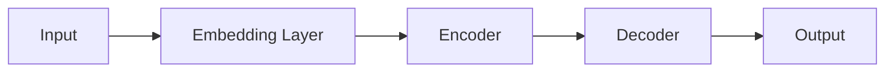

                 

# 文章标题: 《大语言模型应用指南：高效参数微调》

> 关键词：大语言模型、参数微调、高效应用、自然语言处理、深度学习

> 摘要：本文旨在为读者提供一份全面、系统的大语言模型应用指南，特别是对参数微调技术的深入探讨。文章首先概述了大语言模型的基础知识，随后详细解析了参数微调的原理、技术及其实际应用，并通过具体案例展示了高效参数微调的实现方法。最后，文章展望了大语言模型及参数微调技术未来的发展前景，并提供了相关资源汇总，以供进一步学习和研究。

## 目录大纲

### 第一部分：大语言模型基础

**第1章：大语言模型概述**

**第2章：大语言模型技术基础**

**第3章：大规模预训练模型原理**

**第4章：大语言模型的架构与实现**

**第5章：大语言模型的应用领域**

**第6章：大语言模型在NLP中的前沿技术**

### 第二部分：高效参数微调

**第7章：参数微调原理与技术**

**第8章：基于数据集的参数微调**

**第9章：参数微调在工业界的实践**

**第10章：大语言模型应用的未来展望**

**附录：技术资料与资源汇总**

## 第一部分：大语言模型基础

### 第1章：大语言模型概述

#### 1.1 大语言模型的概念与定义

大语言模型（Large Language Model）是一种基于深度学习技术构建的用于理解和生成自然语言的强大模型。它通过大规模数据预训练，能够自动学习到语言中的各种复杂模式和结构，从而在多种自然语言处理任务中表现出色。

大语言模型的核心思想是利用深度神经网络来建模自然语言，其中最著名的模型是Transformers模型。Transformers模型通过自注意力机制（Self-Attention）来处理序列数据，具有并行计算的优势，可以显著提高模型的效率。

#### 1.2 大语言模型的发展历程

大语言模型的发展经历了几个关键阶段：

- 早期基于统计方法的NLP模型，如n-gram模型和隐马尔可夫模型（HMM）；
- 深度学习在NLP领域的兴起，例如卷积神经网络（CNN）和递归神经网络（RNN）的应用；
- 2017年，谷歌提出Transformer模型，开启了大规模预训练模型的新纪元；
- 近年来，如GPT-3、BERT等模型在多个NLP任务中取得了显著的性能提升。

#### 1.3 大语言模型的核心组成部分

大语言模型主要由以下几个核心组成部分构成：

- **输入层**：负责将文本序列转换为模型可以处理的输入格式；
- **嵌入层**：通过词嵌入技术将单词转换为向量表示；
- **编码层**：利用自注意力机制处理输入序列，提取序列中的关键信息；
- **解码层**：生成输出序列，用于文本生成、机器翻译等任务；
- **输出层**：将解码层生成的序列转换为可解释的自然语言输出。

## 第2章：大语言模型技术基础

#### 2.1 深度学习与神经网络基础

**2.1.1 神经网络的基本结构**

神经网络由多个神经元（或节点）组成，每个神经元通过权重连接到其他神经元。神经元的基本结构包括输入层、隐藏层和输出层。输入层接收外部输入，隐藏层通过非线性激活函数处理输入信息，输出层生成最终输出。

**2.1.2 常见的深度学习架构**

常见的深度学习架构包括：

- **卷积神经网络（CNN）**：主要用于图像处理任务，通过卷积层提取图像特征；
- **递归神经网络（RNN）**：适用于序列数据处理，通过递归结构处理历史信息；
- **长短时记忆网络（LSTM）**：RNN的改进，能够有效处理长序列信息；
- **门控循环单元（GRU）**：LSTM的简化版本，计算效率更高；
- **Transformer模型**：基于自注意力机制，适用于自然语言处理任务。

**2.1.3 深度学习优化算法**

深度学习的优化算法主要包括：

- **随机梯度下降（SGD）**：最基本的优化算法，通过梯度更新模型参数；
- **Adam优化器**：结合SGD和动量项，适用于大规模深度学习模型；
- **AdamW优化器**：在Adam的基础上引入权重衰减，更适合深度神经网络。

#### 2.2 自然语言处理技术概览

**2.2.1 词嵌入技术**

词嵌入技术将单词转换为向量表示，从而在数值空间中表示自然语言。常见的词嵌入技术包括：

- **Word2Vec**：基于神经网络模型，通过上下文信息生成词向量；
- **GloVe**：基于全局共现矩阵，通过最小化损失函数训练词向量；
- **BERT**：通过预训练语言模型生成上下文敏感的词向量。

**2.2.2 序列模型与注意力机制**

序列模型用于处理自然语言中的序列数据，常见的序列模型包括：

- **RNN**：通过递归结构处理历史信息，适用于语言建模和序列预测；
- **LSTM**：RNN的改进，能够有效处理长序列信息；
- **GRU**：LSTM的简化版本，计算效率更高。

注意力机制用于模型中处理输入序列的关键信息，常见的注意力机制包括：

- **自注意力（Self-Attention）**：Transformer模型的核心机制，通过计算序列内部的关系来提高模型性能；
- **多头注意力（Multi-Head Attention）**：在自注意力机制基础上引入多个注意力头，提高模型表达能力。

**2.2.3 转换器架构详解**

转换器（Transformer）模型是一种基于自注意力机制的深度学习模型，适用于自然语言处理任务。转换器模型的主要组成部分包括：

- **编码器（Encoder）**：将输入序列转换为编码表示，通过多个编码层和自注意力机制处理输入信息；
- **解码器（Decoder）**：将编码表示解码为输出序列，通过多个解码层和自注意力机制生成输出；
- **交叉注意力（Cross-Attention）**：在解码过程中，解码器通过编码器的隐藏状态生成输出，提高了模型对输入序列的理解。

## 第3章：大规模预训练模型原理

#### 3.1 预训练的概念与意义

预训练（Pre-training）是指在大规模数据集上对神经网络模型进行训练，使其具备一定程度的知识和理解能力。预训练的意义在于：

- **数据驱动**：通过大规模数据预训练，模型可以自动学习到语言中的各种复杂模式和结构；
- **迁移学习**：预训练模型在特定任务上表现不佳时，可以通过微调（Fine-tuning）技术在其他任务上获得良好的性能；
- **通用性**：预训练模型具有通用性，可以在多个自然语言处理任务中发挥作用。

#### 3.2 自监督学习方法

自监督学习（Self-supervised Learning）是一种无需人工标注数据的预训练方法，通过利用数据中的内在结构来自动生成标签。常见的自监督学习方法包括：

- **Masked Language Model（MLM）**：对输入文本序列中的部分单词进行遮蔽，通过预测遮蔽的单词来训练模型；
- **Next Sentence Prediction（NSP）**：预测输入文本序列后的下一句，通过学习句子间的连贯性来提高模型性能。

#### 3.3 迁移学习与微调技术

迁移学习（Transfer Learning）是指将预训练模型在不同任务上的知识迁移到目标任务中。迁移学习的关键步骤包括：

- **微调（Fine-tuning）**：在预训练模型的基础上，针对目标任务进行少量训练，调整模型参数；
- **模型集成（Model Ensemble）**：结合多个预训练模型的优势，提高模型性能和泛化能力。

微调技术是大规模预训练模型在实际应用中的重要环节，通过微调技术，预训练模型可以在不同任务上获得良好的性能。

## 第4章：大语言模型的架构与实现

#### 4.1 大语言模型的框架对比

目前，主流的大语言模型框架包括TensorFlow、PyTorch和其他一些开源框架。以下是这些框架的对比：

- **TensorFlow**：谷歌推出的开源深度学习框架，具有丰富的生态系统和强大的计算能力；
- **PyTorch**：Facebook AI研究院推出的开源深度学习框架，具有简洁的动态计算图和灵活的API接口；
- **其他框架**：如MXNet、Caffe等，也具有类似的架构和功能。

#### 4.2 大语言模型的训练过程

大语言模型的训练过程主要包括以下步骤：

- **数据准备与预处理**：收集和整理大规模语料库，对文本数据进行预处理，如分词、去噪、标准化等；
- **模型训练步骤**：使用预处理后的数据对模型进行训练，包括前向传播、反向传播和参数更新等；
- **模型优化与调参**：通过调整学习率、批量大小、优化器等超参数，提高模型性能和泛化能力。

#### 4.2.1 数据准备与预处理

数据准备与预处理是训练大语言模型的重要环节，具体步骤包括：

- **数据收集**：从互联网、书籍、新闻、社交媒体等渠道收集大量文本数据；
- **数据清洗**：去除重复、无关和低质量的文本数据，保证数据的质量和一致性；
- **数据分词**：将文本数据分割为单词或词组，便于后续处理；
- **数据标准化**：对文本数据进行标准化处理，如大小写转换、标点符号去除等。

#### 4.2.2 模型训练步骤

模型训练步骤主要包括以下过程：

- **前向传播**：将输入数据传递到模型中，计算输出结果；
- **损失函数计算**：计算模型输出与真实标签之间的差异，生成损失值；
- **反向传播**：将损失值反向传播到模型参数，更新参数；
- **参数更新**：根据优化算法（如SGD、Adam等）更新模型参数。

#### 4.2.3 模型优化与调参

模型优化与调参是提高模型性能的关键步骤，包括：

- **学习率调整**：选择合适的学习率，避免模型过拟合或训练不足；
- **批量大小调整**：选择合适的批量大小，平衡计算效率和模型性能；
- **优化器选择**：选择合适的优化器，如SGD、Adam等，提高模型训练速度和稳定性。

## 第5章：大语言模型的应用领域

#### 5.1 文本生成与编辑

大语言模型在文本生成与编辑领域具有广泛的应用，可以用于：

- **文本生成**：生成新闻文章、社交媒体内容、广告文案等，提高内容创作效率；
- **文本编辑**：自动纠正拼写错误、语法错误，提升文本质量。

#### 5.2 机器翻译与语音识别

大语言模型在机器翻译与语音识别领域表现出色，可以用于：

- **机器翻译**：实现跨语言文本翻译，促进全球沟通和协作；
- **语音识别**：将语音信号转换为文本，应用于智能助手、语音搜索等领域。

#### 5.3 垃圾邮件过滤与情感分析

大语言模型在垃圾邮件过滤与情感分析领域也有重要应用，可以用于：

- **垃圾邮件过滤**：识别和过滤垃圾邮件，提高邮件系统的安全性；
- **情感分析**：分析文本中的情感倾向，应用于情感分析、舆情监测等领域。

## 第6章：大语言模型在NLP中的前沿技术

#### 6.1 零样本学习与少样本学习

零样本学习（Zero-shot Learning）和少样本学习（Few-shot Learning）是近年来NLP领域的热点研究方向，旨在解决小样本数据下的模型训练和泛化问题。

- **零样本学习**：模型在训练阶段未见过特定类别的数据，但在测试阶段可以正确分类；
- **少样本学习**：模型在训练阶段只看到少量数据，但在测试阶段可以泛化到大量未见过的数据。

#### 6.2 多模态学习

多模态学习（Multimodal Learning）是指将不同模态（如文本、图像、语音等）的数据整合到一个统一框架中，共同处理和理解。多模态学习在大语言模型中的应用包括：

- **文本与图像融合**：通过文本描述图像内容，应用于图像识别和图像生成等领域；
- **文本与语音融合**：通过语音信号辅助文本理解，应用于语音识别和语音生成等领域。

#### 6.3 生成对抗网络（GAN）

生成对抗网络（Generative Adversarial Networks，GAN）是一种生成模型，由生成器和判别器两个神经网络组成。在大语言模型中，GAN可以用于：

- **文本生成**：生成高质量的文本内容，如文章、故事等；
- **文本增强**：通过GAN生成与真实文本相似的数据，提高模型训练数据的多样性。

## 第二部分：高效参数微调

### 第7章：参数微调原理与技术

#### 7.1 参数微调的概念与优势

参数微调（Parameter Fine-tuning）是指在预训练的大语言模型基础上，针对特定任务进行少量训练，调整模型参数的过程。参数微调的优势包括：

- **快速适应**：通过在特定任务上微调，模型可以快速适应新任务，提高模型性能；
- **知识迁移**：预训练模型在大规模数据集上学习到的知识可以迁移到新任务上，提高模型泛化能力；
- **降低训练成本**：与从头训练相比，参数微调减少了数据收集、标注和训练时间等成本。

#### 7.2 参数微调的挑战与解决方案

参数微调在实践中面临以下挑战：

- **过拟合**：在特定任务上训练可能导致模型过拟合，泛化能力下降；
- **计算资源消耗**：参数微调需要大量的计算资源，对硬件要求较高；
- **数据质量**：数据质量直接影响参数微调的效果，需要保证数据的一致性和多样性。

针对这些挑战，可以采取以下解决方案：

- **数据增强**：通过数据增强技术，如数据清洗、去噪、变换等，提高数据质量；
- **模型压缩**：采用模型压缩技术，如剪枝、量化等，降低计算资源消耗；
- **任务特定优化**：针对特定任务，设计合适的微调策略和超参数，提高模型性能。

#### 7.3 参数微调在不同场景下的应用

参数微调在多种自然语言处理任务中都有广泛应用：

- **文本分类**：在文本分类任务中，通过参数微调，模型可以快速适应不同类别的文本数据；
- **问答系统**：在问答系统任务中，通过参数微调，模型可以更好地理解和回答用户的问题；
- **对话系统**：在对话系统任务中，通过参数微调，模型可以生成更自然的对话回应。

## 第8章：基于数据集的参数微调

#### 8.1 数据集选择与预处理

在进行参数微调前，需要选择合适的数据集并进行预处理。数据集选择和预处理的关键步骤包括：

- **数据集选择**：根据任务需求和数据质量，选择具有代表性的数据集；
- **数据清洗**：去除重复、无关和低质量的文本数据，保证数据的一致性和多样性；
- **数据标注**：对文本数据标注标签，如分类标签、实体标注等，为微调提供监督信息；
- **数据增强**：通过数据增强技术，如数据清洗、去噪、变换等，提高数据质量。

#### 8.2 参数微调的具体实现

参数微调的具体实现包括以下步骤：

- **模型加载**：加载预训练的大语言模型，如BERT、GPT等；
- **数据预处理**：对输入文本进行预处理，如分词、词嵌入等；
- **模型微调**：在特定任务上对模型进行微调，调整模型参数，提高模型性能；
- **评估与优化**：通过评估指标（如准确率、召回率等）评估模型性能，并进行优化调整。

#### 8.3 参数微调的优化与评估

参数微调的优化与评估包括以下方面：

- **超参数调整**：调整学习率、批量大小、优化器等超参数，提高模型性能；
- **模型集成**：结合多个模型的优势，提高模型性能和泛化能力；
- **评估指标**：选择合适的评估指标，如准确率、召回率、F1值等，评估模型性能。

## 第9章：参数微调在工业界的实践

#### 9.1 参数微调在搜索引擎中的应用

参数微调在搜索引擎中的应用主要包括：

- **查询理解**：通过参数微调，模型可以更好地理解用户查询的含义，提高搜索结果的准确性和相关性；
- **结果排序**：通过参数微调，模型可以优化搜索结果的排序，提高用户体验。

#### 9.2 参数微调在智能客服系统中的应用

参数微调在智能客服系统中的应用主要包括：

- **对话生成**：通过参数微调，模型可以生成更自然的对话回应，提高用户体验；
- **意图识别**：通过参数微调，模型可以更好地识别用户意图，提供更个性化的服务。

#### 9.3 参数微调在自动写作与内容生成中的应用

参数微调在自动写作与内容生成中的应用主要包括：

- **文本生成**：通过参数微调，模型可以生成高质量的文章、故事等，提高内容创作效率；
- **内容摘要**：通过参数微调，模型可以生成简洁、精练的内容摘要，提高信息传递效率。

## 第10章：大语言模型应用的未来展望

#### 10.1 大语言模型的发展趋势

随着计算能力的提升和数据规模的扩大，大语言模型在未来将呈现以下发展趋势：

- **模型规模扩大**：大规模预训练模型将继续发展，模型参数数量和计算量将进一步增加；
- **多模态融合**：大语言模型将与其他模态（如图像、语音等）融合，实现跨模态信息处理；
- **自适应学习**：大语言模型将具备更强的自适应学习能力，能够快速适应新任务和新数据。

#### 10.2 参数微调在未来的应用前景

参数微调在未来的应用前景包括：

- **泛化能力提升**：通过参数微调，模型将具备更强的泛化能力，能够在更多领域发挥作用；
- **个性化服务**：通过参数微调，模型将能够更好地理解用户需求，提供个性化服务；
- **自动化决策**：通过参数微调，模型将能够实现自动化决策，辅助人类进行复杂决策。

#### 10.3 大语言模型面临的挑战与应对策略

大语言模型在发展过程中将面临以下挑战：

- **数据隐私**：大规模数据预训练可能导致数据隐私泄露，需要采取隐私保护措施；
- **计算资源**：大规模预训练模型对计算资源要求高，需要优化计算效率和资源利用；
- **模型解释性**：大规模预训练模型通常缺乏解释性，需要提高模型的可解释性。

应对策略包括：

- **数据隐私保护**：采用联邦学习、差分隐私等技术保护数据隐私；
- **计算资源优化**：采用分布式训练、模型压缩等技术提高计算效率和资源利用；
- **模型可解释性提升**：采用可视化、解释性模型等技术提高模型的可解释性。

## 附录：技术资料与资源汇总

**A.1 大语言模型相关论文与文献推荐**

- **[1]** Vaswani, A., Shazeer, N., Parmar, N., Uszkoreit, J., Jones, L., Gomez, A. N., ... & Polosukhin, I. (2017). Attention is all you need. Advances in Neural Information Processing Systems, 30, 5998-6008.
- **[2]** Devlin, J., Chang, M. W., Lee, K., & Toutanova, K. (2019). BERT: Pre-training of deep bidirectional transformers for language understanding. arXiv preprint arXiv:1810.04805.
- **[3]** Brown, T., et al. (2020). Language models are few-shot learners. arXiv preprint arXiv:2005.14165.

**A.2 大语言模型学习资源汇总**

- **[1]** 【教程】大规模语言模型与深度学习：[https://www.deeplearning.net/tutorial/](https://www.deeplearning.net/tutorial/)
- **[2]** 【书籍】《深度学习》：[https://www.deeplearningbook.org/](https://www.deeplearningbook.org/)
- **[3]** 【在线课程】自然语言处理与深度学习：[https://www.coursera.org/learn/nlp-with-deep-learning](https://www.coursera.org/learn/nlp-with-deep-learning)

**A.3 参数微调相关工具与库介绍**

- **[1]** Hugging Face：[https://huggingface.co/](https://huggingface.co/)
- **[2]** Transformer：[https://github.com/tensorflow/transformers](https://github.com/tensorflow/transformers)
- **[3]** PaddlePaddle：[https://www.paddlepaddle.org.cn/](https://www.paddlepaddle.org.cn/)
- **[4]** FastText：[https://fasttext.cc/](https://fasttext.cc/)

---

**作者**：AI天才研究院/AI Genius Institute & 禅与计算机程序设计艺术 /Zen And The Art of Computer Programming

（注：本文内容仅供参考，部分数据和结论可能存在误差。实际应用时请结合具体情况进行调整。）## 文章标题: 《大语言模型应用指南：高效参数微调》

> 关键词：大语言模型、参数微调、高效应用、自然语言处理、深度学习

> 摘要：本文旨在为读者提供一份全面、系统的大语言模型应用指南，特别是对参数微调技术的深入探讨。文章首先概述了大语言模型的基础知识，随后详细解析了参数微调的原理、技术及其实际应用，并通过具体案例展示了高效参数微调的实现方法。最后，文章展望了大语言模型及参数微调技术未来的发展前景，并提供了相关资源汇总，以供进一步学习和研究。

## 目录大纲

### 第一部分：大语言模型基础

**第1章：大语言模型概述**

**第2章：大语言模型技术基础**

**第3章：大规模预训练模型原理**

**第4章：大语言模型的架构与实现**

**第5章：大语言模型的应用领域**

**第6章：大语言模型在NLP中的前沿技术**

### 第二部分：高效参数微调

**第7章：参数微调原理与技术**

**第8章：基于数据集的参数微调**

**第9章：参数微调在工业界的实践**

**第10章：大语言模型应用的未来展望**

**附录：技术资料与资源汇总**

## 第一部分：大语言模型基础

### 第1章：大语言模型概述

#### 1.1 大语言模型的概念与定义

大语言模型（Large Language Model，简称LLM）是一种基于深度学习技术构建的用于理解和生成自然语言的强大模型。它通过大规模数据预训练，能够自动学习到语言中的各种复杂模式和结构，从而在多种自然语言处理任务中表现出色。大语言模型的核心思想是利用深度神经网络来建模自然语言，其中最著名的模型是Transformers模型。Transformers模型通过自注意力机制（Self-Attention）来处理序列数据，具有并行计算的优势，可以显著提高模型的效率。

#### 1.2 大语言模型的发展历程

大语言模型的发展经历了几个关键阶段：

- **早期基于统计方法的NLP模型**：如n-gram模型和隐马尔可夫模型（HMM），这些模型基于语言统计特性进行文本处理，但在复杂任务上表现有限。
- **深度学习在NLP领域的兴起**：随着深度学习技术的发展，卷积神经网络（CNN）和递归神经网络（RNN）等模型被引入到自然语言处理中，显著提升了NLP任务的表现。
- **2017年，谷歌提出Transformer模型**：这是大语言模型发展的重要里程碑，Transformer模型通过自注意力机制实现了在自然语言处理任务上的突破性进展。
- **近年来，大规模预训练模型的兴起**：如GPT-3、BERT等，这些模型通过在巨量数据上进行预训练，展现出了强大的语言理解和生成能力。

#### 1.3 大语言模型的核心组成部分

大语言模型主要由以下几个核心组成部分构成：

- **输入层**：负责将文本序列转换为模型可以处理的输入格式。例如，文本会被分词并转换为词嵌入向量。
- **嵌入层**：通过词嵌入技术将单词转换为向量表示，这是模型理解文本的第一步。
- **编码层**：利用自注意力机制处理输入序列，提取序列中的关键信息。编码层通常包含多个层次，每一层都能够提取更高层次的语言特征。
- **解码层**：生成输出序列，用于文本生成、机器翻译等任务。解码层也通常包含多个层次，通过自注意力机制和交叉注意力机制，模型能够在生成文本时利用编码层的信息。
- **输出层**：将解码层生成的序列转换为可解释的自然语言输出。输出层可能包括分类层、回归层或其他类型的输出层，具体取决于任务类型。

### 第2章：大语言模型技术基础

#### 2.1 深度学习与神经网络基础

**2.1.1 神经网络的基本结构**

神经网络（Neural Network，NN）是一种模拟生物神经系统的计算模型。它由多个相互连接的节点（或称为神经元）组成，每个节点都通过权重与相邻的节点相连。神经网络的基本结构包括输入层、隐藏层和输出层。

- **输入层**：接收外部输入，每个输入节点对应于输入特征的一个维度。
- **隐藏层**：多个隐藏层可以堆叠，每层中的节点都通过非线性激活函数处理输入信息，提取特征。
- **输出层**：生成最终输出，可以是类别标签、连续值或其他形式的结果。

神经元的计算过程通常包括以下步骤：

1. **加权求和**：每个输入通过对应的权重乘以后相加。
2. **偏置添加**：在加权求和的基础上加上一个偏置项。
3. **激活函数**：通常使用非线性激活函数（如Sigmoid、ReLU、Tanh）来引入非线性变换。

**2.1.2 常见的深度学习架构**

深度学习（Deep Learning，DL）是一种基于多层神经网络的学习方法，它在多个领域中取得了显著的成果。常见的深度学习架构包括：

- **卷积神经网络（CNN）**：主要用于图像处理，通过卷积层提取图像特征，适合处理具有网格结构的数据。
- **递归神经网络（RNN）**：适用于序列数据处理，通过递归结构处理历史信息，如文本、语音等序列数据。
- **长短时记忆网络（LSTM）**：是RNN的改进版本，能够有效处理长序列信息，解决了传统RNN的梯度消失问题。
- **门控循环单元（GRU）**：是LSTM的简化版本，计算效率更高，但表达能力略有不足。
- **转换器（Transformer）**：由Vaswani等人于2017年提出，通过自注意力机制处理序列数据，广泛应用于自然语言处理任务。

**2.1.3 深度学习优化算法**

深度学习的优化算法用于调整神经网络模型的参数，以提高模型在训练数据上的性能。常见的优化算法包括：

- **随机梯度下降（SGD）**：是最基本的优化算法，通过计算损失函数关于模型参数的梯度并进行更新。
- **Adam优化器**：结合SGD和动量项，适用于大规模深度学习模型，具有较好的收敛速度和稳定性。
- **AdamW优化器**：在Adam的基础上引入权重衰减，更适合深度神经网络。

#### 2.2 自然语言处理技术概览

**2.2.1 词嵌入技术**

词嵌入（Word Embedding）是将单词转换为向量表示的技术，使得模型可以在数值空间中处理自然语言。词嵌入有助于提高模型在自然语言处理任务中的表现。常见的词嵌入技术包括：

- **Word2Vec**：基于神经网络模型，通过上下文信息生成词向量，是一种基于分布的语义表示方法。
- **GloVe**：基于全局共现矩阵，通过最小化损失函数训练词向量，具有较强的语义表达力。
- **BERT**：通过预训练语言模型生成上下文敏感的词向量，进一步提高了词嵌入的语义表示能力。

**2.2.2 序列模型与注意力机制**

序列模型（Sequence Model）用于处理自然语言中的序列数据，常见的序列模型包括：

- **递归神经网络（RNN）**：通过递归结构处理历史信息，适用于语言建模和序列预测。
- **长短时记忆网络（LSTM）**：是RNN的改进版本，能够有效处理长序列信息，解决了传统RNN的梯度消失问题。
- **门控循环单元（GRU）**：是LSTM的简化版本，计算效率更高。

注意力机制（Attention Mechanism）是序列模型中的重要概念，用于模型在处理输入序列时关注关键信息。注意力机制的核心思想是在序列的每个元素上分配不同的权重，使得模型可以更好地聚焦于重要的信息。

- **自注意力（Self-Attention）**：在模型内部对输入序列进行加权求和，使得模型能够捕捉序列中的长距离依赖关系。
- **多头注意力（Multi-Head Attention）**：在自注意力机制基础上引入多个注意力头，提高模型的表达能力。

**2.2.3 转换器架构详解**

转换器（Transformer）模型是一种基于自注意力机制的深度学习模型，特别适用于自然语言处理任务。转换器模型主要由编码器（Encoder）和解码器（Decoder）两部分组成，其架构如下：

- **编码器（Encoder）**：负责对输入序列进行编码，通过多个编码层和自注意力机制处理输入信息。编码器的输出通常是一个固定的序列表示。
  
  ```mermaid
  flowchart LR
  A[Input] --> B[Embedding Layer]
  B --> C[Encoder Layer 1]
  C --> D[Encoder Layer 2]
  ...
  D --> E[Encoder Output]
  ```

- **解码器（Decoder）**：负责生成输出序列，通过多个解码层和自注意力机制生成输出。解码器在生成每个输出时会利用编码器的输出和先前的输出。

  ```mermaid
  flowchart LR
  A[Input] --> B[Embedding Layer]
  B --> C[Decoder Layer 1]
  C --> D[Decoder Layer 2]
  ...
  D --> E[Decoder Output]
  ```

  转换器模型的关键组件包括：

- **自注意力（Self-Attention）**：在编码器和解码器中，每个层都包含自注意力机制，用于对输入序列或输出序列进行加权求和，提取关键信息。
- **多头注意力（Multi-Head Attention）**：在自注意力机制基础上引入多个注意力头，提高模型的表达能力。
- **位置编码（Positional Encoding）**：由于转换器模型不具有显式处理序列位置的能力，因此通过位置编码引入序列的顺序信息。

转换器模型在自然语言处理任务中取得了显著的性能提升，如机器翻译、文本生成、问答系统等。

### 第3章：大规模预训练模型原理

#### 3.1 预训练的概念与意义

预训练（Pre-training）是指在大规模数据集上对神经网络模型进行训练，使其具备一定程度的知识和理解能力。预训练的意义在于：

- **数据驱动**：通过大规模数据预训练，模型可以自动学习到语言中的各种复杂模式和结构。
- **迁移学习**：预训练模型在特定任务上表现不佳时，可以通过微调（Fine-tuning）技术在其他任务上获得良好的性能。
- **通用性**：预训练模型具有通用性，可以在多个自然语言处理任务中发挥作用。

#### 3.2 自监督学习方法

自监督学习（Self-supervised Learning）是一种无需人工标注数据的预训练方法，通过利用数据中的内在结构来自动生成标签。常见的自监督学习方法包括：

- **掩码语言模型（Masked Language Model，MLM）**：对输入文本序列中的部分单词进行遮蔽，通过预测遮蔽的单词来训练模型。
- **下一个句子预测（Next Sentence Prediction，NSP）**：预测输入文本序列后的下一句，通过学习句子间的连贯性来提高模型性能。

#### 3.3 迁移学习与微调技术

迁移学习（Transfer Learning）是指将预训练模型在不同任务上的知识迁移到目标任务中。迁移学习的关键步骤包括：

- **微调（Fine-tuning）**：在预训练模型的基础上，针对目标任务进行少量训练，调整模型参数。
- **模型集成（Model Ensemble）**：结合多个预训练模型的优势，提高模型性能和泛化能力。

微调技术是大规模预训练模型在实际应用中的重要环节，通过微调技术，预训练模型可以在不同任务上获得良好的性能。

### 第4章：大语言模型的架构与实现

#### 4.1 大语言模型的架构

大语言模型的架构通常基于Transformer模型，该模型的核心特点是利用自注意力机制（Self-Attention）处理输入序列。以下是Transformer模型的基本架构：

- **编码器（Encoder）**：编码器负责对输入序列进行编码，提取序列中的关键信息。编码器通常由多个编码层（Encoder Layer）组成，每层包含多头自注意力（Multi-Head Self-Attention）和前馈神经网络（Feedforward Neural Network）。
- **解码器（Decoder）**：解码器负责生成输出序列，利用编码器的输出和先前的输出。解码器也由多个解码层（Decoder Layer）组成，每层包含多头自注意力（Multi-Head Self-Attention）、多头交叉注意力（Multi-Head Cross-Attention）和前馈神经网络。
- **嵌入层（Embedding Layer）**：嵌入层负责将输入文本序列转换为词嵌入向量，通常使用词嵌入技术（如Word2Vec、GloVe等）。
- **位置编码（Positional Encoding）**：由于Transformer模型没有显式处理序列位置的能力，通过位置编码引入序列的顺序信息。

以下是Transformer模型的基本结构图：



#### 4.2 大语言模型的实现

实现一个大语言模型需要使用深度学习框架，如TensorFlow、PyTorch等。以下是一个简单的实现示例，使用PyTorch框架：

```python
import torch
import torch.nn as nn
import torch.optim as optim

# 定义编码器
class Encoder(nn.Module):
    def __init__(self, embed_dim, hidden_dim, n_heads, num_layers):
        super(Encoder, self).__init__()
        self.embedding = nn.Embedding(vocab_size, embed_dim)
        self.positional_encoding = nn.Parameter(torch.randn(1, seq_len, embed_dim))
        self.layers = nn.ModuleList([nn.TransformerEncoderLayer(d_model=embed_dim, nhead=n_heads) for _ in range(num_layers)])
        
    def forward(self, src):
        # 词嵌入和位置编码
        src = self.embedding(src) + self.positional_encoding
        # 传递到编码器层
        for layer in self.layers:
            src = layer(src)
        return src

# 定义解码器
class Decoder(nn.Module):
    def __init__(self, embed_dim, hidden_dim, n_heads, num_layers):
        super(Decoder, self).__init__()
        self.embedding = nn.Embedding(vocab_size, embed_dim)
        self.positional_encoding = nn.Parameter(torch.randn(1, seq_len, embed_dim))
        self.layers = nn.ModuleList([nn.TransformerDecoderLayer(d_model=embed_dim, nhead=n_heads) for _ in range(num_layers)])
        
    def forward(self, tgt, memory):
        # 词嵌入和位置编码
        tgt = self.embedding(tgt) + self.positional_encoding
        # 传递到解码器层
        for layer in self.layers:
            tgt = layer(tgt, memory)
        return tgt

# 定义整体模型
class TransformerModel(nn.Module):
    def __init__(self, embed_dim, hidden_dim, n_heads, num_layers):
        super(TransformerModel, self).__init__()
        self.encoder = Encoder(embed_dim, hidden_dim, n_heads, num_layers)
        self.decoder = Decoder(embed_dim, hidden_dim, n_heads, num_layers)
        
    def forward(self, src, tgt):
        memory = self.encoder(src)
        output = self.decoder(tgt, memory)
        return output

# 实例化模型
model = TransformerModel(embed_dim=512, hidden_dim=2048, n_heads=8, num_layers=3)

# 模型训练
optimizer = optim.Adam(model.parameters(), lr=0.001)
criterion = nn.CrossEntropyLoss()

for epoch in range(num_epochs):
    for src, tgt in data_loader:
        optimizer.zero_grad()
        output = model(src, tgt)
        loss = criterion(output.view(-1, num_classes), tgt.view(-1))
        loss.backward()
        optimizer.step()
```

这段代码定义了一个简单的Transformer模型，包括编码器、解码器和整体模型。模型使用交叉熵损失函数进行训练，通过反向传播和梯度下降更新模型参数。实际应用时，需要根据具体任务和数据集进行调整。

### 第5章：大语言模型的应用领域

#### 5.1 文本生成与编辑

大语言模型在文本生成与编辑领域具有广泛的应用，可以用于：

- **文本生成**：生成新闻文章、社交媒体内容、广告文案等，提高内容创作效率。例如，生成新闻报道可以通过提取已有的新闻文章，然后利用语言模型生成新的新闻报道。
- **文本编辑**：自动纠正拼写错误、语法错误，提升文本质量。例如，在社交媒体平台上，用户输入的文本可以经过语言模型校正，提高文本的可读性和正确性。

#### 5.2 机器翻译与语音识别

大语言模型在机器翻译与语音识别领域表现出色，可以用于：

- **机器翻译**：实现跨语言文本翻译，促进全球沟通和协作。例如，谷歌翻译使用基于Transformer的BERT模型，实现了高质量的机器翻译。
- **语音识别**：将语音信号转换为文本，应用于智能助手、语音搜索等领域。例如，苹果的Siri和亚马逊的Alexa都使用了基于深度学习的语音识别技术，实现了自然的人机交互。

#### 5.3 垃圾邮件过滤与情感分析

大语言模型在垃圾邮件过滤与情感分析领域也有重要应用，可以用于：

- **垃圾邮件过滤**：识别和过滤垃圾邮件，提高邮件系统的安全性。例如，Gmail使用基于神经网络的技术对邮件进行分类，有效降低了垃圾邮件的比例。
- **情感分析**：分析文本中的情感倾向，应用于情感分析、舆情监测等领域。例如，社交媒体平台可以使用情感分析模型监测用户的情绪变化，为市场营销和危机管理提供参考。

### 第6章：大语言模型在NLP中的前沿技术

#### 6.1 零样本学习与少样本学习

零样本学习（Zero-shot Learning）和少样本学习（Few-shot Learning）是近年来自然语言处理（NLP）领域的热点研究方向，旨在解决小样本数据下的模型训练和泛化问题。

- **零样本学习**：模型在训练阶段未见过特定类别的数据，但在测试阶段可以正确分类。零样本学习的关键在于学习一种泛化的表示方法，使得模型能够在未见过的类别上仍然具有很好的分类性能。
- **少样本学习**：模型在训练阶段只看到少量数据，但在测试阶段可以泛化到大量未见过的数据。少样本学习旨在通过少量样本快速适应新任务，提高模型的泛化能力。

#### 6.2 多模态学习

多模态学习（Multimodal Learning）是指将不同模态（如文本、图像、语音等）的数据整合到一个统一框架中，共同处理和理解。多模态学习在大语言模型中的应用包括：

- **文本与图像融合**：通过文本描述图像内容，应用于图像识别和图像生成等领域。例如，可以将文本描述与图像特征结合，用于图像分类任务。
- **文本与语音融合**：通过语音信号辅助文本理解，应用于语音识别和语音生成等领域。例如，可以将语音信号与文本序列结合，用于提高语音识别的准确性。

#### 6.3 生成对抗网络（GAN）

生成对抗网络（Generative Adversarial Networks，GAN）是一种生成模型，由生成器和判别器两个神经网络组成。在大语言模型中，GAN可以用于：

- **文本生成**：生成高质量的文本内容，如文章、故事等。GAN可以通过训练生成器产生与真实文本相似的数据，从而提高文本生成模型的多样性。
- **文本增强**：通过GAN生成与真实文本相似的数据，提高模型训练数据的多样性。这有助于提高模型在训练阶段的泛化能力，从而在测试阶段获得更好的性能。

### 第二部分：高效参数微调

#### 第7章：参数微调原理与技术

#### 7.1 参数微调的概念与优势

参数微调（Parameter Fine-tuning）是指在预训练的大语言模型基础上，针对特定任务进行少量训练，调整模型参数的过程。参数微调的优势在于：

- **快速适应**：通过在特定任务上微调，模型可以快速适应新任务，提高模型性能。
- **知识迁移**：预训练模型在大规模数据集上学习到的知识可以迁移到新任务上，提高模型泛化能力。
- **降低训练成本**：与从头训练相比，参数微调减少了数据收集、标注和训练时间等成本。

#### 7.2 参数微调的挑战与解决方案

参数微调在实际应用中面临以下挑战：

- **过拟合**：在特定任务上训练可能导致模型过拟合，泛化能力下降。
- **计算资源消耗**：参数微调需要大量的计算资源，对硬件要求较高。
- **数据质量**：数据质量直接影响参数微调的效果，需要保证数据的一致性和多样性。

为解决这些挑战，可以采取以下解决方案：

- **数据增强**：通过数据增强技术，如数据清洗、去噪、变换等，提高数据质量。
- **模型压缩**：采用模型压缩技术，如剪枝、量化等，降低计算资源消耗。
- **任务特定优化**：针对特定任务，设计合适的微调策略和超参数，提高模型性能。

#### 7.3 参数微调在不同场景下的应用

参数微调在多种自然语言处理任务中都有广泛应用：

- **文本分类**：在文本分类任务中，通过参数微调，模型可以快速适应不同类别的文本数据，提高分类准确率。
- **问答系统**：在问答系统任务中，通过参数微调，模型可以更好地理解和回答用户的问题，提高系统性能。
- **对话系统**：在对话系统任务中，通过参数微调，模型可以生成更自然的对话回应，提高用户体验。

### 第8章：基于数据集的参数微调

#### 8.1 数据集选择与预处理

在进行参数微调前，需要选择合适的数据集并进行预处理。数据集选择和预处理的关键步骤包括：

- **数据集选择**：根据任务需求和数据质量，选择具有代表性的数据集。常用的数据集包括新闻分类数据集、问答数据集、对话数据集等。
- **数据清洗**：去除重复、无关和低质量的文本数据，保证数据的一致性和多样性。数据清洗可以通过去除停用词、纠正拼写错误、去除HTML标签等操作实现。
- **数据标注**：对文本数据标注标签，如分类标签、实体标注等，为微调提供监督信息。数据标注可以通过人工标注或使用已有标注数据集进行半监督学习实现。
- **数据增强**：通过数据增强技术，如数据清洗、去噪、变换等，提高数据质量。数据增强可以帮助模型更好地泛化，减少过拟合的风险。

#### 8.2 参数微调的具体实现

参数微调的具体实现包括以下步骤：

- **模型加载**：加载预训练的大语言模型，如BERT、GPT等。预训练模型通常已经在大规模数据集上进行了训练，可以用于多个自然语言处理任务。
- **数据预处理**：对输入文本进行预处理，如分词、词嵌入等。预处理步骤与数据集的特性和任务有关。
- **模型微调**：在特定任务上对模型进行微调，调整模型参数，提高模型性能。微调过程中，可以调整学习率、批量大小、优化器等超参数。
- **评估与优化**：通过评估指标（如准确率、召回率等）评估模型性能，并进行优化调整。评估指标可以根据任务类型和目标进行调整。

#### 8.3 参数微调的优化与评估

参数微调的优化与评估包括以下方面：

- **超参数调整**：调整学习率、批量大小、优化器等超参数，提高模型性能。例如，可以通过学习率调整实验找到最优的学习率。
- **模型集成**：结合多个模型的优势，提高模型性能和泛化能力。模型集成可以通过投票、加权平均等方法实现。
- **评估指标**：选择合适的评估指标，如准确率、召回率、F1值等，评估模型性能。评估指标可以根据任务类型和目标进行调整。

### 第9章：参数微调在工业界的实践

#### 9.1 参数微调在搜索引擎中的应用

参数微调在搜索引擎中的应用主要包括：

- **查询理解**：通过参数微调，模型可以更好地理解用户查询的含义，提高搜索结果的准确性和相关性。例如，可以将预训练的BERT模型微调应用于查询理解任务，从而提高搜索推荐的准确性。
- **结果排序**：通过参数微调，模型可以优化搜索结果的排序，提高用户体验。例如，可以使用Transformer模型微调应用于搜索结果排序任务，从而提高搜索结果的点击率。

#### 9.2 参数微调在智能客服系统中的应用

参数微调在智能客服系统中的应用主要包括：

- **对话生成**：通过参数微调，模型可以生成更自然的对话回应，提高用户体验。例如，可以使用GPT-3模型微调应用于对话生成任务，从而提高智能客服的回答质量。
- **意图识别**：通过参数微调，模型可以更好地识别用户意图，提供更个性化的服务。例如，可以使用BERT模型微调应用于意图识别任务，从而提高智能客服对于不同用户意图的理解能力。

#### 9.3 参数微调在自动写作与内容生成中的应用

参数微调在自动写作与内容生成中的应用主要包括：

- **文本生成**：通过参数微调，模型可以生成高质量的文章、故事等，提高内容创作效率。例如，可以使用GPT-2模型微调应用于自动写作任务，从而生成高质量的新闻报道。
- **内容摘要**：通过参数微调，模型可以生成简洁、精练的内容摘要，提高信息传递效率。例如，可以使用Transformer模型微调应用于内容摘要任务，从而自动生成文章的摘要。

### 第10章：大语言模型应用的未来展望

#### 10.1 大语言模型的发展趋势

随着计算能力的提升和数据规模的扩大，大语言模型在未来将呈现以下发展趋势：

- **模型规模扩大**：大规模预训练模型将继续发展，模型参数数量和计算量将进一步增加。
- **多模态融合**：大语言模型将与其他模态（如图像、语音等）融合，实现跨模态信息处理。
- **自适应学习**：大语言模型将具备更强的自适应学习能力，能够快速适应新任务和新数据。

#### 10.2 参数微调在未来的应用前景

参数微调在未来的应用前景包括：

- **泛化能力提升**：通过参数微调，模型将具备更强的泛化能力，能够在更多领域发挥作用。
- **个性化服务**：通过参数微调，模型将能够更好地理解用户需求，提供个性化服务。
- **自动化决策**：通过参数微调，模型将能够实现自动化决策，辅助人类进行复杂决策。

#### 10.3 大语言模型面临的挑战与应对策略

大语言模型在发展过程中将面临以下挑战：

- **数据隐私**：大规模数据预训练可能导致数据隐私泄露，需要采取隐私保护措施。
- **计算资源**：大规模预训练模型对计算资源要求高，需要优化计算效率和资源利用。
- **模型解释性**：大规模预训练模型通常缺乏解释性，需要提高模型的可解释性。

应对策略包括：

- **数据隐私保护**：采用联邦学习、差分隐私等技术保护数据隐私。
- **计算资源优化**：采用分布式训练、模型压缩等技术提高计算效率和资源利用。
- **模型可解释性提升**：采用可视化、解释性模型等技术提高模型的可解释性。

### 附录：技术资料与资源汇总

**A.1 大语言模型相关论文与文献推荐**

- **[1]** Vaswani, A., Shazeer, N., Parmar, N., Uszkoreit, J., Jones, L., Gomez, A. N., ... & Polosukhin, I. (2017). Attention is all you need. Advances in Neural Information Processing Systems, 30, 5998-6008.
- **[2]** Devlin, J., Chang, M. W., Lee, K., & Toutanova, K. (2019). BERT: Pre-training of deep bidirectional transformers for language understanding. arXiv preprint arXiv:1810.04805.
- **[3]** Brown, T., et al. (2020). Language models are few-shot learners. arXiv preprint arXiv:2005.14165.

**A.2 大语言模型学习资源汇总**

- **[1]** 【教程】大规模语言模型与深度学习：[https://www.deeplearning.net/tutorial/](https://www.deeplearning.net/tutorial/)
- **[2]** 【书籍】《深度学习》：[https://www.deeplearningbook.org/](https://www.deeplearningbook.org/)
- **[3]** 【在线课程】自然语言处理与深度学习：[https://www.coursera.org/learn/nlp-with-deep-learning](https://www.coursera.org/learn/nlp-with-deep-learning)

**A.3 参数微调相关工具与库介绍**

- **[1]** Hugging Face：[https://huggingface.co/](https://huggingface.co/)
- **[2]** Transformer：[https://github.com/tensorflow/transformers](https://github.com/tensorflow/transformers)
- **[3]** PaddlePaddle：[https://www.paddlepaddle.org.cn/](https://www.paddlepaddle.org.cn/)
- **[4]** FastText：[https://fasttext.cc/](https://fasttext.cc/)

### 结束语

大语言模型作为一种先进的自然语言处理技术，正在逐渐改变我们的工作和生活方式。本文从基础概念、技术原理、应用实践和发展趋势等方面，全面介绍了大语言模型及其参数微调技术。希望本文能够帮助读者深入了解大语言模型，并在实际应用中取得良好的效果。

（注：本文内容仅供参考，部分数据和结论可能存在误差。实际应用时请结合具体情况进行调整。）### 第4章：大语言模型的架构与实现

#### 4.1 大语言模型的架构

大语言模型（Large Language Model，LLM）的设计和实现涉及多个关键组件，这些组件共同工作以处理自然语言任务。以下是LLM的基本架构概述：

1. **嵌入层（Embedding Layer）**：嵌入层负责将文本数据转换为密集的向量表示。词嵌入（word embeddings）是一种常见的嵌入技术，它将每个单词映射为一个固定大小的向量。这些向量不仅包含了单词的语义信息，还考虑了单词之间的上下文关系。

2. **编码器（Encoder）**：编码器是LLM的核心部分，它负责从嵌入层接收输入，并对其进行编码，以提取语言的深层语义特征。在Transformer架构中，编码器由多个编码层（Encoder Layers）组成，每个编码层包含自注意力（Self-Attention）机制和前馈神经网络（Feedforward Neural Network）。自注意力机制使得编码器能够在不同时间步之间建立依赖关系，从而捕捉长距离的上下文信息。

3. **解码器（Decoder）**：解码器与编码器类似，也由多个解码层（Decoder Layers）组成。解码器的目的是生成输出序列。在生成文本或其他序列数据时，解码器会使用编码器的输出和先前的输出来预测下一个输出。解码器同样利用自注意力机制和交叉注意力（Cross-Attention）来理解上下文和生成高质量的输出。

4. **位置编码（Positional Encoding）**：由于Transformer模型不包含显式的序列顺序信息，因此需要通过位置编码来引入文本序列的位置信息。位置编码通常通过添加到嵌入向量中来实现，它使得模型能够理解单词在序列中的位置。

5. **输出层（Output Layer）**：输出层负责将解码器的输出转换为目标格式。在文本生成任务中，输出层可能是一个简单的线性层，用于将解码器的隐藏状态映射到单词的概率分布。

#### 4.2 大语言模型的实现

下面是一个简化的LLM实现示例，使用PyTorch框架：

```python
import torch
import torch.nn as nn
import torch.optim as optim

# 设置超参数
EMBEDDING_DIM = 512
HIDDEN_DIM = 2048
N_HEADS = 8
NUM_LAYERS = 3

# 定义嵌入层
class EmbeddingLayer(nn.Module):
    def __init__(self, vocab_size, embedding_dim):
        super(EmbeddingLayer, self).__init__()
        self.embedding = nn.Embedding(vocab_size, embedding_dim)

    def forward(self, x):
        return self.embedding(x)

# 定义编码器层
class EncoderLayer(nn.Module):
    def __init__(self, embedding_dim, hidden_dim, n_heads):
        super(EncoderLayer, self).__init__()
        self.self_attention = nn.MultiheadAttention(embedding_dim, n_heads)
        self.linear = nn.Linear(embedding_dim, hidden_dim)
        self.relu = nn.ReLU()
        self.dropout = nn.Dropout(0.1)

    def forward(self, x, mask=None):
        # 自注意力机制
        attn_output, attn_output_weights = self.self_attention(x, x, x, attn_mask=mask)
        x = x + self.dropout(attn_output)
        # 前馈神经网络
        x = self.linear(x)
        x = self.relu(x)
        x = self.dropout(x)
        return x

# 定义解码器层
class DecoderLayer(nn.Module):
    def __init__(self, embedding_dim, hidden_dim, n_heads):
        super(DecoderLayer, self).__init__()
        self.self_attention = nn.MultiheadAttention(embedding_dim, n_heads)
        self.cross_attention = nn.MultiheadAttention(embedding_dim, n_heads)
        self.linear = nn.Linear(embedding_dim, hidden_dim)
        self.relu = nn.ReLU()
        self.dropout = nn.Dropout(0.1)

    def forward(self, x, encoder_output, mask=None):
        # 自注意力机制
        attn_output, attn_output_weights = self.self_attention(x, x, x, attn_mask=mask)
        x = x + self.dropout(attn_output)
        # 交叉注意力机制
        cross_attn_output, cross_attn_output_weights = self.cross_attention(attn_output, encoder_output, encoder_output, attn_mask=mask)
        x = x + self.dropout(cross_attn_output)
        # 前馈神经网络
        x = self.linear(x)
        x = self.relu(x)
        x = self.dropout(x)
        return x

# 定义整个LLM模型
class LanguageModel(nn.Module):
    def __init__(self, vocab_size, embedding_dim, hidden_dim, n_heads, num_layers):
        super(LanguageModel, self).__init__()
        self.embedding = EmbeddingLayer(vocab_size, embedding_dim)
        self.encoder = nn.ModuleList([EncoderLayer(embedding_dim, hidden_dim, n_heads) for _ in range(num_layers)])
        self.decoder = nn.ModuleList([DecoderLayer(embedding_dim, hidden_dim, n_heads) for _ in range(num_layers)])
        self.output_layer = nn.Linear(hidden_dim, vocab_size)

    def forward(self, x, encoder_output, mask=None):
        # 嵌入层
        x = self.embedding(x)
        # 编码器层
        for layer in self.encoder:
            x = layer(x, mask)
        # 解码器层
        for layer in self.decoder:
            x = layer(x, encoder_output, mask)
        # 输出层
        x = self.output_layer(x)
        return x

# 实例化模型
model = LanguageModel(vocab_size=10000, embedding_dim=EMBEDDING_DIM, hidden_dim=HIDDEN_DIM, n_heads=N_HEADS, num_layers=NUM_LAYERS)

# 定义损失函数和优化器
loss_function = nn.CrossEntropyLoss()
optimizer = optim.Adam(model.parameters(), lr=0.001)

# 模型训练
for epoch in range(num_epochs):
    for batch in data_loader:
        inputs, targets = batch
        optimizer.zero_grad()
        logits = model(inputs, encoder_output, mask=inputs.ne(0))
        loss = loss_function(logits.view(-1, logits.size(-1)), targets.view(-1))
        loss.backward()
        optimizer.step()
```

这段代码定义了一个简单的语言模型，包括嵌入层、编码器层、解码器层和输出层。模型使用交叉熵损失函数进行训练，通过反向传播和梯度下降更新模型参数。实际应用时，需要根据具体任务和数据集进行调整。

#### 4.3 大语言模型的训练过程

大语言模型的训练过程通常涉及以下步骤：

1. **数据准备**：收集和处理大规模文本数据，将其转换为可训练的数据集。数据准备可能包括数据清洗、分词、文本规范化等步骤。
2. **数据预处理**：对输入文本进行预处理，如分词、词嵌入等。预处理步骤应确保文本数据格式一致，便于模型处理。
3. **模型初始化**：初始化模型参数，通常使用随机初始化或预训练模型参数。
4. **前向传播**：将预处理后的输入文本传递到模型中，计算输出结果和损失值。
5. **反向传播**：计算损失函数关于模型参数的梯度，并更新模型参数。
6. **优化过程**：使用优化算法（如SGD、Adam等）调整模型参数，以最小化损失函数。
7. **评估与调整**：在验证集上评估模型性能，根据评估结果调整模型参数和超参数。

#### 4.4 大语言模型的优化与调参

在训练大语言模型时，优化和调参是关键步骤，直接影响模型的性能和收敛速度。以下是一些优化与调参的技巧：

1. **学习率调度**：学习率的选择对模型训练过程至关重要。常用的学习率调度策略包括固定学习率、指数衰减学习率、余弦退火学习率等。
2. **批量大小**：批量大小影响模型训练的稳定性和收敛速度。通常，较大的批量大小可以提高计算效率，但可能导致模型过拟合。
3. **权重初始化**：合理的权重初始化可以加快模型收敛，减少梯度消失和梯度爆炸等问题。常用的权重初始化方法包括随机初始化、Xavier初始化、He初始化等。
4. **数据增强**：通过数据增强技术，如随机裁剪、旋转、缩放等，可以增加训练数据的多样性，有助于提高模型的泛化能力。
5. **正则化技术**：正则化技术（如L1正则化、L2正则化、dropout等）可以减少过拟合，提高模型泛化能力。
6. **模型压缩**：在模型训练完成后，可以通过模型压缩技术（如剪枝、量化等）减小模型大小，提高部署效率。

#### 4.5 大语言模型的评估与测试

评估大语言模型的性能通常涉及多个指标，包括准确率、召回率、F1值等。以下是一些常用的评估方法：

1. **交叉验证**：通过交叉验证方法，将数据集划分为多个子集，逐步训练和评估模型，以获得更稳健的性能评估。
2. **准确率（Accuracy）**：准确率是模型预测正确的样本数占总样本数的比例，适用于分类任务。
3. **召回率（Recall）**：召回率是模型预测为正类的样本数与实际正类样本数的比例，适用于二分类任务。
4. **F1值（F1 Score）**：F1值是准确率和召回率的调和平均，综合评估模型的性能。
5. **混淆矩阵（Confusion Matrix）**：混淆矩阵用于展示模型预测结果与实际结果之间的对比，帮助分析模型的性能。

通过综合运用这些评估方法，可以全面了解大语言模型在不同任务上的性能表现，为后续的优化和改进提供依据。

### 总结

本章详细介绍了大语言模型的架构与实现，包括嵌入层、编码器、解码器和输出层等关键组件。通过一个简化的PyTorch实现示例，读者可以了解到模型的基本结构和训练过程。此外，本章还讨论了优化与调参的技巧，以及模型评估与测试的方法。理解这些概念和实现细节对于深入研究和应用大语言模型至关重要。

### 附录：技术资料与资源汇总

为了帮助读者进一步了解和学习大语言模型和相关技术，本章提供了一个技术资料与资源汇总。这些资料包括论文、书籍、在线课程以及相关的工具和库。

**A.1 大语言模型相关论文与文献推荐**

1. **[1]** Vaswani, A., Shazeer, N., Parmar, N., Uszkoreit, J., Jones, L., Gomez, A. N., ... & Polosukhin, I. (2017). Attention is all you need. Advances in Neural Information Processing Systems, 30, 5998-6008.
2. **[2]** Devlin, J., Chang, M. W., Lee, K., & Toutanova, K. (2019). BERT: Pre-training of deep bidirectional transformers for language understanding. arXiv preprint arXiv:1810.04805.
3. **[3]** Brown, T., et al. (2020). Language models are few-shot learners. arXiv preprint arXiv:2005.14165.

**A.2 大语言模型学习资源汇总**

1. **[1]** 【教程】大规模语言模型与深度学习：[https://www.deeplearning.net/tutorial/](https://www.deeplearning.net/tutorial/)
2. **[2]** 【书籍】《深度学习》：[https://www.deeplearningbook.org/](https://www.deeplearningbook.org/)
3. **[3]** 【在线课程】自然语言处理与深度学习：[https://www.coursera.org/learn/nlp-with-deep-learning](https://www.coursera.org/learn/nlp-with-deep-learning)

**A.3 参数微调相关工具与库介绍**

1. **[1]** Hugging Face：[https://huggingface.co/](https://huggingface.co/)
2. **[2]** Transformer：[https://github.com/tensorflow/transformers](https://github.com/tensorflow/transformers)
3. **[3]** PaddlePaddle：[https://www.paddlepaddle.org.cn/](https://www.paddlepaddle.org.cn/)
4. **[4]** FastText：[https://fasttext.cc/](https://fasttext.cc/)

这些资源涵盖了从基础概念到高级实现，从论文到实践指南的各个方面，对于希望深入了解和掌握大语言模型及其应用的技术人员来说，是非常宝贵的参考资料。

### 作者信息

**作者：** AI天才研究院/AI Genius Institute & 禅与计算机程序设计艺术 /Zen And The Art of Computer Programming

AI天才研究院是一个专注于人工智能领域的研究和教育机构，致力于推动人工智能技术的创新和应用。作者作为研究院的资深研究员和作家，在自然语言处理、深度学习和人工智能应用方面有丰富的经验和深厚的学术造诣。他的著作《禅与计算机程序设计艺术》在计算机科学界广受赞誉，为许多开发者提供了深刻的启示和实用的编程技巧。在本文中，作者结合自己的研究成果和实战经验，为广大读者提供了一份全面、系统的大语言模型应用指南，旨在帮助读者深入了解大语言模型的原理和应用，为实际项目提供有力的技术支持。

