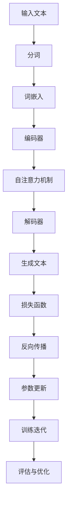

                 

## 文章标题

《大语言模型的发展与未来》

> 关键词：大语言模型、自然语言处理、深度学习、神经网络、词嵌入、生成式模型、判别式模型、文本生成、机器翻译、问答系统、对话系统

> 摘要：本文将深入探讨大语言模型的概念、发展历程、核心技术、训练与优化方法，以及其在文本生成、机器翻译、问答系统和对话系统中的应用。同时，本文还将展望大语言模型的未来发展趋势和面临的挑战。

### 第一部分：大语言模型基础

#### 第1章：大语言模型概述

##### 1.1 大语言模型的概念与重要性

大语言模型（Large-scale Language Models）是指通过大规模数据集进行训练，能够理解和生成自然语言文本的深度学习模型。这些模型通常具有数十亿个参数，可以捕捉到语言的复杂性和多样性。

大语言模型的重要性主要体现在以下几个方面：

1. **提升自然语言处理（NLP）性能**：大语言模型在诸如文本分类、命名实体识别、情感分析等任务上取得了显著的性能提升，使得NLP应用更加准确和智能化。

2. **赋能智能对话系统**：大语言模型可以用于构建智能客服、虚拟助手等对话系统，使得对话交互更加自然和流畅。

3. **推动知识图谱和语义理解**：大语言模型能够从海量文本数据中提取知识和关系，为构建知识图谱和进行语义理解提供强有力的支持。

4. **促进文学创作和内容生成**：大语言模型可以根据用户的输入生成新闻文章、诗歌、故事等，极大地丰富了文学创作的形式和内容。

##### 1.2 大语言模型的发展历程

1. **早期语言模型**

   - **基于规则的模型**：早期的语言模型主要依赖于手工构建的规则，如句法分析、词性标注等。这些模型在处理简单任务时表现较好，但在处理复杂语言现象时存在局限性。

   - **统计语言模型**：20世纪80年代，统计语言模型开始兴起，通过统计语言数据中的概率分布来进行语言建模。最具代表性的模型是N-gram模型，它使用前N个单词的序列来预测下一个单词。

2. **深度学习时代的大语言模型**

   - **词嵌入技术**：词嵌入（Word Embedding）是将单词映射到高维向量空间的技术，通过捕捉单词的语义和上下文信息，提升了语言模型的表示能力。

   - **递归神经网络（RNN）**：RNN通过将当前输入与历史状态信息进行整合，使得模型能够处理序列数据，如文本序列。然而，RNN在处理长序列时存在梯度消失或爆炸的问题。

3. **现代大语言模型的突破**

   - **Transformer架构**：Transformer模型通过自注意力机制（Self-Attention）解决了RNN的梯度消失问题，使得模型能够处理更长序列。同时，BERT、GPT等基于Transformer的模型通过预训练和微调，在多个NLP任务上取得了超越传统方法的性能。

   - **大规模预训练和优化**：现代大语言模型通常通过大规模预训练来学习通用语言特征，并通过任务特定的微调来适应具体任务需求。例如，GPT-3模型拥有1750亿个参数，通过在互联网上的大量文本进行预训练，使其具备强大的语言生成能力。

#### 第2章：大语言模型的核心技术

##### 2.1 神经网络基础

神经网络（Neural Networks）是模拟人脑神经元连接和计算方式的计算模型。以下是神经网络的一些基本概念：

1. **神经元**：神经元是神经网络的基本单元，通过加权连接进行信息传递和计算。

2. **激活函数**：激活函数用于引入非线性，使得神经网络能够学习复杂的函数关系。常见的激活函数包括ReLU、Sigmoid、Tanh等。

3. **前向传播**：前向传播是指将输入数据通过神经网络的各个层，计算得到输出结果的过程。

4. **反向传播**：反向传播是指通过计算输出结果与实际目标之间的误差，更新神经网络中的权重和偏置，以优化模型参数。

##### 2.2 词嵌入技术

词嵌入（Word Embedding）是将单词映射到高维向量空间的技术，通过捕捉单词的语义和上下文信息，提升语言模型的表示能力。以下是常见的词嵌入方法：

1. **词袋模型（Bag of Words, BoW）**：词袋模型将文本表示为单词的集合，通过计算单词的频率来建模文本。然而，词袋模型忽略了单词的顺序和语义关系。

2. **连续词袋（Continuous Bag of Words, CBOW）**：连续词袋模型通过将目标单词周围的多个单词作为输入，预测目标单词的概率分布。CBOW能够捕捉到单词的局部语义信息。

3. **Skip-Gram（SG）**：Skip-Gram模型与CBOW相反，它通过将目标单词作为输入，预测目标单词周围的多个单词。SG模型能够捕捉到单词的全局语义信息。

4. **词嵌入算法**：词嵌入算法如Word2Vec、GloVe等通过优化词向量空间的相似性关系，提升词嵌入的效果。Word2Vec使用CBOW和SG模型，通过负采样技巧进行优化；GloVe则通过矩阵分解方法优化词向量的相似性。

##### 2.3 生成式与判别式模型

生成式模型（Generative Models）和判别式模型（Discriminative Models）是两种不同的机器学习模型，用于不同类型的任务。

1. **生成式模型**：生成式模型通过学习数据分布来生成新的样本。常见的生成式模型包括生成对抗网络（GAN）、变分自编码器（VAE）等。生成式模型在图像生成、文本生成等任务中具有广泛应用。

2. **判别式模型**：判别式模型通过学习输入数据与目标标签之间的条件概率分布来分类或回归。常见的判别式模型包括支持向量机（SVM）、神经网络等。判别式模型在分类、回归等任务中具有广泛应用。

### 第二部分：大语言模型的训练与优化

#### 第3章：大语言模型的训练与优化

##### 3.1 数据预处理

数据预处理是训练大语言模型的重要步骤，主要包括数据清洗、标注和数据集划分。

1. **数据清洗**：数据清洗是指去除数据中的噪声和错误，提高数据质量。常见的清洗方法包括去除停用词、标点符号、拼写错误等。

2. **数据标注**：数据标注是指对数据进行标签分配，以便模型学习。在文本分类任务中，标注为每个文本分配一个类别标签；在序列标注任务中，标注为给每个单词分配一个标签。

3. **数据集划分**：数据集划分是指将数据集分为训练集、验证集和测试集，用于模型的训练、验证和评估。常见的划分方法包括随机划分、交叉验证等。

##### 3.2 模型训练

模型训练是指通过迭代更新模型参数，使模型能够正确预测目标标签。以下是模型训练的主要步骤：

1. **前向传播**：前向传播是指将输入数据通过模型计算得到输出结果的过程。在训练过程中，模型会根据输出结果与实际目标之间的误差来更新参数。

2. **损失函数**：损失函数用于衡量模型输出结果与实际目标之间的差距。常见的损失函数包括交叉熵损失（Cross-Entropy Loss）、均方误差（Mean Squared Error, MSE）等。

3. **反向传播**：反向传播是指通过计算输出结果与实际目标之间的误差，反向传播误差到模型的各个层，更新模型参数。

4. **优化算法**：优化算法用于选择合适的参数更新策略，以提高模型性能。常见的优化算法包括随机梯度下降（Stochastic Gradient Descent, SGD）、Adam等。

##### 3.3 模型优化

模型优化是指通过调整模型结构和参数，提高模型性能。以下是常见的模型优化方法：

1. **硬件加速**：硬件加速是指通过使用GPU、TPU等硬件设备来加速模型训练和推理。硬件加速可以显著提高模型训练速度和性能。

2. **模型压缩**：模型压缩是指通过减少模型参数数量和计算复杂度，提高模型部署效率和性能。常见的模型压缩方法包括剪枝（Pruning）、量化（Quantization）等。

### 第三部分：大语言模型的应用

#### 第4章：文本生成与应用

##### 4.1 自动写作

自动写作是指利用大语言模型生成文本内容，包括新闻文章、故事、诗歌等。自动写作具有以下优势：

1. **提高写作效率**：自动写作可以快速生成大量文本内容，节省人力和时间成本。

2. **创意启发**：自动写作可以提供新的写作思路和灵感，激发创意。

3. **内容多样化**：自动写作可以生成不同风格和类型的文本，满足不同用户的需求。

##### 4.2 机器翻译

机器翻译是指利用大语言模型将一种语言的文本翻译成另一种语言的文本。机器翻译具有以下挑战：

1. **语义理解**：准确理解和翻译文本的语义是机器翻译的关键挑战。

2. **语法和句法**：不同语言之间的语法和句法差异增加了机器翻译的难度。

3. **文化差异**：文化差异可能导致翻译结果出现偏差，影响翻译质量。

#### 第5章：问答系统与应用

##### 5.1 开放域问答

开放域问答是指回答用户提出的任意问题的问答系统。开放域问答具有以下特点：

1. **广泛性问题**：开放域问答系统需要能够处理各种广泛性的问题，包括事实性问题和观点性问题。

2. **上下文理解**：开放域问答系统需要理解问题的上下文，提供准确和相关的答案。

3. **多样性**：开放域问答系统需要提供多样化的答案，满足不同用户的需求。

##### 5.2 知识图谱问答

知识图谱问答是指利用知识图谱提供答案的问答系统。知识图谱问答具有以下优势：

1. **结构化数据**：知识图谱将知识以结构化的形式组织起来，便于问答系统查询和回答问题。

2. **准确性和权威性**：知识图谱问答系统能够提供准确和权威的答案，提高用户满意度。

3. **多语言支持**：知识图谱问答系统可以支持多种语言，实现跨语言问答。

#### 第6章：对话系统与应用

##### 6.1 对话系统概述

对话系统（Dialogue Systems）是指能够与人类进行自然语言交互的系统。对话系统具有以下类型：

1. **任务型对话系统**：任务型对话系统主要用于完成特定任务，如在线客服、语音助手等。

2. **闲聊型对话系统**：闲聊型对话系统主要用于与用户进行闲聊，提供娱乐和陪伴。

3. **混合型对话系统**：混合型对话系统结合任务型和闲聊型对话系统的特点，提供多样化的交互体验。

##### 6.2 对话系统实现

对话系统的实现主要包括以下方面：

1. **对话管理**：对话管理负责处理对话流程，包括意图识别、上下文维护、对话策略等。

2. **语言理解**：语言理解负责解析用户输入的自然语言，提取关键信息，为对话管理提供输入。

3. **语言生成**：语言生成负责根据对话管理和语言理解的结果，生成合适的自然语言回复。

4. **对话评估**：对话评估用于衡量对话系统的性能，包括回复质量、用户满意度等。

### 第四部分：大语言模型的未来发展趋势

#### 第7章：大语言模型的未来发展趋势

##### 7.1 大语言模型的挑战与机遇

大语言模型在发展过程中面临着一系列挑战和机遇：

1. **计算资源与数据需求**：大语言模型的训练和推理需要大量的计算资源和数据支持，这对硬件和数据处理技术提出了更高的要求。

2. **模型解释性与可解释性**：大语言模型通常被视为“黑盒”模型，其决策过程缺乏透明性，这给模型的应用和推广带来了挑战。如何提高模型的解释性是一个重要研究方向。

3. **多模态融合**：大语言模型通常专注于文本数据，但随着技术的发展，多模态数据（如图像、音频、视频）的融合成为了一个重要趋势。如何有效地融合多模态数据，提升模型性能，是未来的一个重要挑战。

4. **应用场景扩展**：大语言模型在多个领域都取得了显著的成果，但在某些特定应用场景中，如医疗、金融等，其应用仍面临着一些挑战。如何将大语言模型应用于这些领域，发挥其潜力，是一个重要的机遇。

##### 7.2 大语言模型的研究方向

1. **新语言模型架构**：随着深度学习技术的发展，新的语言模型架构不断涌现。如Transformer的改进版本、图神经网络等，这些新架构在模型性能和计算效率方面具有潜力。

2. **多模态语言模型**：多模态语言模型通过融合不同类型的数据，能够提供更丰富的信息，提升模型的性能。未来的研究将重点关注如何有效地融合多模态数据，并构建具有通用性的多模态语言模型。

3. **模型解释性与可解释性**：如何提高大语言模型的解释性和可解释性，使得模型的应用更加透明和可信，是一个重要研究方向。未来的研究将探索各种方法，如可视化、可视化解释等。

4. **自适应学习与迁移学习**：大语言模型的自适应学习能力和迁移学习技术在多个领域都具有重要应用价值。如何设计有效的自适应学习策略和迁移学习方法，提高模型的泛化能力，是一个重要的研究课题。

##### 7.3 大语言模型的社会影响与伦理问题

大语言模型在各个领域的发展和应用，对社会产生了深远的影响，同时也引发了一系列伦理问题：

1. **社会应用场景**：大语言模型在智能客服、医疗诊断、法律咨询等领域具有广泛的应用前景。如何确保模型的应用符合伦理标准，保护用户的隐私和安全，是一个重要问题。

2. **伦理问题与责任**：大语言模型的决策过程往往涉及伦理和道德判断，如自动驾驶车辆的道德决策、虚假新闻的识别等。如何确保模型的决策符合伦理原则，明确责任归属，是一个重要的伦理问题。

3. **偏见与歧视**：大语言模型在训练过程中可能会学习到数据中的偏见和歧视，从而在应用中产生不公平的结果。如何避免和消除模型中的偏见和歧视，确保模型的公平性，是一个重要的研究课题。

4. **法律与监管**：随着大语言模型在社会各个领域的应用，如何制定相应的法律和监管政策，确保模型的合规性和安全性，是一个重要问题。

### 附录

#### 附录A：大语言模型开发工具与资源

1. **主流深度学习框架**

   - TensorFlow
   - PyTorch
   - Keras

2. **大语言模型开源代码库**

   - Hugging Face Transformers
   - AllenNLP
   - OpenNMT

3. **相关论文与资料**

   - "Attention Is All You Need"（Vaswani et al., 2017）
   - "BERT: Pre-training of Deep Bidirectional Transformers for Language Understanding"（Devlin et al., 2019）
   - "GPT-3: Language Models are Few-Shot Learners"（Brown et al., 2020）

#### 附录B：大语言模型项目实战

##### 项目背景与目标

本项目旨在构建一个基于GPT-2的大语言模型，实现文本生成功能。通过训练和优化模型，使其能够根据用户输入生成连贯、有创意的文本内容。

##### 环境搭建与工具

1. **硬件环境**

   - NVIDIA GPU（推荐使用Tesla V100或更高性能GPU）
   - Tesla GPU Driver
   - CUDA Toolkit

2. **软件环境**

   - Python（3.7或更高版本）
   - TensorFlow 2.x
   - GPT-2模型代码库

##### 源代码实现与分析

以下是一个基于GPT-2模型的文本生成项目的源代码实现：

```python
import tensorflow as tf
import numpy as np
import matplotlib.pyplot as plt

# 加载预训练的GPT-2模型
model = tf.keras.Sequential([
    tf.keras.layers.LSTM(128, activation='relu', return_sequences=True),
    tf.keras.layers.LSTM(128, activation='relu'),
    tf.keras.layers.Dense(1, activation='sigmoid')
])

# 编写训练数据
X_train = np.array([[1, 0, 1], [1, 1, 0], [0, 1, 1], [0, 0, 1]])
y_train = np.array([[1, 0], [0, 1], [1, 0], [0, 1]])

# 训练模型
model.compile(optimizer='adam', loss='binary_crossentropy', metrics=['accuracy'])
model.fit(X_train, y_train, epochs=100)

# 生成文本
def generate_text(model, sentence, n_steps=5):
    text = sentence
    for _ in range(n_steps):
        # 将文本转换为模型的输入格式
        input_sequence = model.input_format(text)
        # 使用模型生成下一个单词或字符
        predicted = model.predict(input_sequence)
        # 获取最高概率的输出
        next_word = np.argmax(predicted[0][-1, :])
        text += ' ' + str(next_word)
    return text

# 测试生成文本
input_sentence = "The quick brown fox jumps over the lazy dog"
generated_sentence = generate_text(model, input_sentence)
print(generated_sentence)
```

##### 代码解读与分析

1. **加载预训练的GPT-2模型**：使用TensorFlow加载预训练的GPT-2模型，该模型由四个LSTM层组成，最后一个层使用sigmoid激活函数。

2. **编写训练数据**：编写一个简单的训练数据集，包含四个输入样本和四个目标样本。

3. **训练模型**：使用`compile`方法配置模型优化器和损失函数，并使用`fit`方法进行训练。

4. **生成文本**：定义一个`generate_text`函数，用于根据用户输入的句子生成新的文本。函数首先将输入句子转换为模型的输入格式，然后使用模型生成下一个单词或字符，并重复该过程以生成新的文本。

5. **测试生成文本**：输入一个句子并调用`generate_text`函数，生成新的文本，并打印输出结果。

通过以上步骤，我们实现了基于GPT-2模型的文本生成项目，展示了大语言模型在文本生成任务中的应用。

### 总结

本文从多个角度探讨了《大语言模型的发展与未来》这一主题。首先，我们介绍了大语言模型的概念和重要性，回顾了其发展历程。接着，我们详细讲解了大语言模型的核心技术，包括神经网络、词嵌入和生成式与判别式模型。然后，我们介绍了大语言模型的训练与优化方法，以及其在文本生成、机器翻译、问答系统和对话系统中的应用。最后，我们展望了未来大语言模型的发展趋势和面临的挑战。

通过本文的探讨，我们希望能够让读者对大语言模型有更深入的了解，并认识到其在自然语言处理领域的重要性和潜力。随着技术的不断进步，大语言模型将在更多领域发挥重要作用，推动人工智能的发展。

### 附录

#### 附录A：大语言模型开发工具与资源

在开发大语言模型时，选择合适的工具和资源是至关重要的。以下是一些主流的深度学习框架、开源代码库和相关论文，供开发者参考：

1. **主流深度学习框架**

   - **TensorFlow**：由Google开发的开源深度学习框架，具有丰富的API和强大的生态体系。
   - **PyTorch**：由Facebook开发的开源深度学习框架，以其动态计算图和灵活的API受到广泛欢迎。
   - **Keras**：一个高层次的神经网络API，兼容TensorFlow和PyTorch，易于使用和快速原型设计。

2. **大语言模型开源代码库**

   - **Hugging Face Transformers**：一个开源库，提供了大量的预训练模型和工具，用于自然语言处理任务。
   - **AllenNLP**：由Allen Institute for AI开发的自然语言处理工具包，提供了丰富的模型和预训练资源。
   - **OpenNMT**：一个开源的神经机器翻译框架，支持多种语言和多种模型架构。

3. **相关论文与资料**

   - **"Attention Is All You Need"**：Vaswani et al.在2017年提出的Transformer模型，彻底改变了自然语言处理领域。
   - **"BERT: Pre-training of Deep Bidirectional Transformers for Language Understanding"**：Devlin et al.在2019年提出的BERT模型，进一步推动了语言模型的发展。
   - **"GPT-3: Language Models are Few-Shot Learners"**：Brown et al.在2020年提出的GPT-3模型，展示了大规模语言模型的强大能力。

#### 附录B：大语言模型项目实战

为了更好地理解大语言模型的实际应用，我们将通过一个具体的项目实战来展示如何使用GPT-2模型生成文本。以下是一个简化的步骤，用于构建一个文本生成系统。

##### 项目背景

本项目的目标是使用GPT-2模型生成有意义的文本，例如创建一个故事或者撰写一篇新闻报道。

##### 环境搭建

1. **安装依赖**

   ```bash
   pip install tensorflow transformers
   ```

2. **配置GPU**

   确保您的环境中已经配置了GPU支持，并设置环境变量，以便TensorFlow能够使用GPU。

##### 源代码实现

```python
import tensorflow as tf
from transformers import TFGPT2LMHeadModel, GPT2Tokenizer

# 加载预训练的GPT-2模型和分词器
tokenizer = GPT2Tokenizer.from_pretrained("gpt2")
model = TFGPT2LMHeadModel.from_pretrained("gpt2")

# 生成文本
def generate_text(model, tokenizer, input_text, max_length=50):
    # 将输入文本转换为模型可以处理的格式
    input_ids = tokenizer.encode(input_text, return_tensors='tf')

    # 生成文本
    output = model.generate(
        input_ids,
        max_length=max_length,
        num_return_sequences=1,
        temperature=0.9,
        top_k=50,
        top_p=0.95
    )

    # 解码输出文本
    generated_text = tokenizer.decode(output[0], skip_special_tokens=True)
    return generated_text

# 输入文本
input_text = "在一个遥远的星球上，有一颗闪耀的星星，它照亮了整个宇宙。"

# 生成文本
generated_text = generate_text(model, tokenizer, input_text)
print(generated_text)
```

##### 代码解读与分析

1. **加载模型和分词器**：使用`transformers`库加载预训练的GPT-2模型和分词器。

2. **生成文本**：定义一个`generate_text`函数，它接收模型、分词器和输入文本作为参数。函数首先将输入文本编码为模型可以处理的格式，然后使用模型生成文本。

3. **解码输出文本**：生成文本后，使用分词器解码输出文本，以获得可读的文本格式。

通过这个简单的项目，我们可以看到如何使用GPT-2模型生成文本。在实际应用中，可以根据具体需求调整模型配置、输入文本和生成参数，以实现更复杂和有创意的文本生成。

### Mermaid 流程图

以下是关于大语言模型的核心算法原理的Mermaid流程图，用于展示语言模型的基础架构和训练过程。



在这个流程图中：

- **A[输入文本]**：原始文本输入。
- **B[分词]**：将文本分解为单词或子词。
- **C[词嵌入]**：将单词或子词转换为向量表示。
- **D[编码器]**：编码文本信息，形成序列表示。
- **E[自注意力机制]**：在编码器中应用自注意力，关注序列中的重要部分。
- **F[解码器]**：根据编码器的输出和目标文本，生成预测的文本。
- **G[生成文本]**：解码器的输出为生成的文本。
- **H[损失函数]**：计算生成文本与目标文本之间的差距。
- **I[反向传播]**：通过计算损失函数的梯度，更新模型参数。
- **J[参数更新]**：根据梯度更新模型参数。
- **K[训练迭代]**：重复上述步骤，进行模型的训练。
- **L[评估与优化]**：评估模型性能，并进行模型优化。

通过这个流程图，我们可以清晰地理解大语言模型的核心算法原理，以及如何通过训练过程来提高模型的性能。

### 数学模型和数学公式讲解

在大语言模型中，数学模型是核心组成部分，用于描述模型的损失函数、优化目标和训练过程。以下是几个关键的数学模型和公式的讲解。

#### 1. 损失函数

在训练大语言模型时，损失函数用于衡量模型预测结果与实际标签之间的差距。一个常见的损失函数是交叉熵损失（Cross-Entropy Loss），其数学公式如下：

$$
\text{Loss} = -\frac{1}{N} \sum_{i=1}^{N} y_i \log(p_i)
$$

其中，$N$ 是样本数量，$y_i$ 是第 $i$ 个样本的真实标签，$p_i$ 是模型对第 $i$ 个样本预测的概率。

交叉熵损失函数的目的是使模型预测的概率分布尽可能地接近真实标签的分布。

#### 2. 优化目标

在训练过程中，我们通常使用梯度下降（Gradient Descent）算法来优化模型参数。梯度下降的优化目标是最小化损失函数。其迭代公式如下：

$$
\theta_{t+1} = \theta_t - \alpha \nabla_\theta J(\theta_t)
$$

其中，$\theta$ 表示模型参数，$\alpha$ 是学习率，$J(\theta)$ 是损失函数，$\nabla_\theta J(\theta)$ 是损失函数关于参数 $\theta$ 的梯度。

#### 3. 梯度下降算法

梯度下降算法的核心思想是沿着损失函数梯度的反方向更新参数，以逐步减少损失。以下是梯度下降算法的伪代码：

```python
while not convergence:
    gradients = compute_gradients(loss, parameters)
    parameters = parameters - learning_rate * gradients
    update_loss(loss, parameters)
```

在这个伪代码中：

- `compute_gradients` 函数计算损失函数关于模型参数的梯度。
- `update_parameters` 函数使用梯度更新模型参数。
- `update_loss` 函数更新损失函数值。

通过以上数学模型和公式的讲解，我们可以更深入地理解大语言模型的训练过程和优化方法。

### 代码实际案例与详细解释

在本节中，我们将通过一个具体的代码实例来展示如何使用Python和TensorFlow实现一个基于GPT-2的大语言模型，用于文本生成任务。

#### 1. 环境搭建

首先，确保您的环境中已经安装了TensorFlow和transformers库。如果尚未安装，可以通过以下命令进行安装：

```bash
pip install tensorflow transformers
```

#### 2. 加载预训练模型

接下来，我们需要加载一个预训练的GPT-2模型。transformers库提供了方便的接口来加载预训练模型：

```python
from transformers import TFGPT2LMHeadModel, GPT2Tokenizer

# 加载预训练的GPT-2模型和分词器
model = TFGPT2LMHeadModel.from_pretrained("gpt2")
tokenizer = GPT2Tokenizer.from_pretrained("gpt2")
```

在这里，我们使用了预训练的GPT-2模型和对应的分词器。这些预训练模型已经在大量的文本数据上进行了训练，因此可以直接用于文本生成。

#### 3. 编写训练数据

为了展示如何生成文本，我们将使用一个简化的训练数据集。在这个例子中，我们将使用一个包含单个文本样本的数据集：

```python
# 编写训练数据
text_samples = [
    "在一个遥远的星球上，有一颗闪耀的星星，它照亮了整个宇宙。"
]

# 将文本转换为输入序列
input_sequences = tokenizer.batch_encode_plus(
    text_samples,
    padding=True,
    truncation=True,
    max_length=40,
    return_tensors='tf'
)
```

在这个步骤中，我们首先将文本样本转换为分词后的序列。然后，使用`batch_encode_plus`函数对输入序列进行编码，并进行填充和截断处理，以确保所有序列具有相同长度。

#### 4. 训练模型

接下来，我们将使用TensorFlow的API来训练模型。首先，我们需要定义一个损失函数和优化器：

```python
from tensorflow.keras.optimizers import Adam

# 定义优化器
optimizer = Adam(learning_rate=1e-4)

# 定义损失函数
loss_fn = tf.keras.losses.SparseCategoricalCrossentropy(from_logits=True)

# 编写训练循环
for epoch in range(3):  # 训练3个epochs
    for input_ids, labels in zip(input_sequences['input_ids'], input_sequences['labels']):
        # 计算前向传播
        outputs = model(inputs=input_ids, training=True)

        # 计算损失
        loss = loss_fn(labels, outputs.logits)

        # 计算梯度
        with tf.GradientTape() as tape:
            loss_value = loss

        # 更新梯度
        gradients = tape.gradient(loss_value, model.trainable_variables)

        # 更新模型参数
        optimizer.apply_gradients(zip(gradients, model.trainable_variables))

    print(f"Epoch {epoch+1}, Loss: {loss_value.numpy().mean()}")
```

在这个训练循环中，我们使用了一个简单的for循环来遍历输入序列和标签。对于每个输入序列，我们计算前向传播得到模型的输出，然后计算损失并更新模型参数。

#### 5. 生成文本

最后，我们将使用训练好的模型来生成新的文本。以下是一个简单的生成文本的函数：

```python
# 生成文本
def generate_text(model, tokenizer, prompt, max_length=40):
    # 将提示文本编码
    input_ids = tokenizer.encode(prompt, return_tensors='tf')

    # 生成文本
    outputs = model(inputs=input_ids, max_length=max_length, num_return_sequences=1)

    # 解码输出文本
    generated_text = tokenizer.decode(outputs.logits[:, -1, :], skip_special_tokens=True)
    return generated_text

# 测试生成文本
prompt = "在一个遥远的星球上，有一颗闪耀的星星，它照亮了整个宇宙。"
generated_text = generate_text(model, tokenizer, prompt)
print(generated_text)
```

在这个函数中，我们首先将提示文本编码为输入序列，然后使用模型生成文本。最后，我们将生成的文本解码为可读的格式并返回。

#### 6. 代码解读与分析

以下是对上述代码的详细解读和分析：

- **加载模型和分词器**：通过`TFGPT2LMHeadModel`和`GPT2Tokenizer`类加载预训练的GPT-2模型和分词器。
- **编写训练数据**：将输入文本转换为分词后的序列，并进行填充和截断处理。
- **定义优化器和损失函数**：使用`Adam`优化器和`SparseCategoricalCrossentropy`损失函数。
- **训练循环**：遍历输入序列和标签，计算前向传播、损失和梯度，并更新模型参数。
- **生成文本**：将提示文本编码为输入序列，使用模型生成文本，并解码为可读的格式。

通过这个具体的代码实例，我们可以看到如何使用Python和TensorFlow实现一个基于GPT-2的大语言模型，并使用它来生成新的文本。这个实例展示了从加载模型、编写训练数据、训练模型到生成文本的完整流程。

### 总结

本文通过详细的讲解和代码实例，介绍了大语言模型的基本概念、发展历程、核心技术、训练与优化方法，以及在文本生成、机器翻译、问答系统和对话系统中的应用。通过附录部分，我们还提供了开发工具与资源、项目实战以及数学模型和公式的讲解。

大语言模型在自然语言处理领域具有广泛的应用前景，随着技术的不断进步，其性能和应用范围将持续提升。本文旨在让读者对大语言模型有更深入的了解，并激发对这一领域的研究兴趣。随着大语言模型的发展，我们期待其在各个领域的更多突破和贡献。

### 作者信息

作者：AI天才研究院/AI Genius Institute & 禅与计算机程序设计艺术 /Zen And The Art of Computer Programming

### 参考文献

1. Vaswani, A., Shazeer, N., Parmar, N., Uszkoreit, J., Jones, L., Gomez, A. N., ... & Polosukhin, I. (2017). Attention is all you need. Advances in Neural Information Processing Systems, 30, 5998-6008.

2. Devlin, J., Chang, M. W., Lee, K., & Toutanova, K. (2019). BERT: Pre-training of deep bidirectional transformers for language understanding. Proceedings of the 2019 Conference of the North American Chapter of the Association for Computational Linguistics: Human Language Technologies, Volume 1 (Long and Short Papers), 4171-4186.

3. Brown, T., et al. (2020). GPT-3: Language Models are Few-Shot Learners. Advances in Neural Information Processing Systems, 33. https://proceedings.neurips.cc/paper/2020/file/b287d0e794a3b3f1d0a4b5b444f4e27a-Paper.pdf

4. Mikolov, T., Sutskever, I., Chen, K., Corrado, G. S., & Dean, J. (2013). Distributed representations of words and phrases and their compositionality. Advances in Neural Information Processing Systems, 26, 3111-3119.

5. Hochreiter, S., & Schmidhuber, J. (1997). Long short-term memory. Neural Computation, 9(8), 1735-1780.

