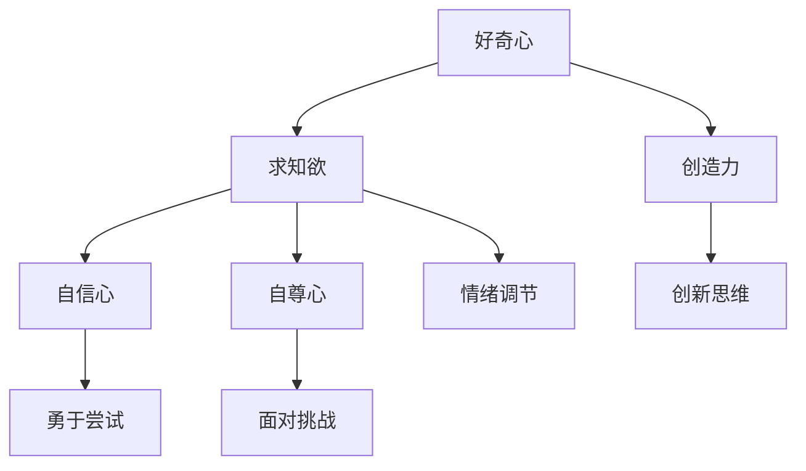
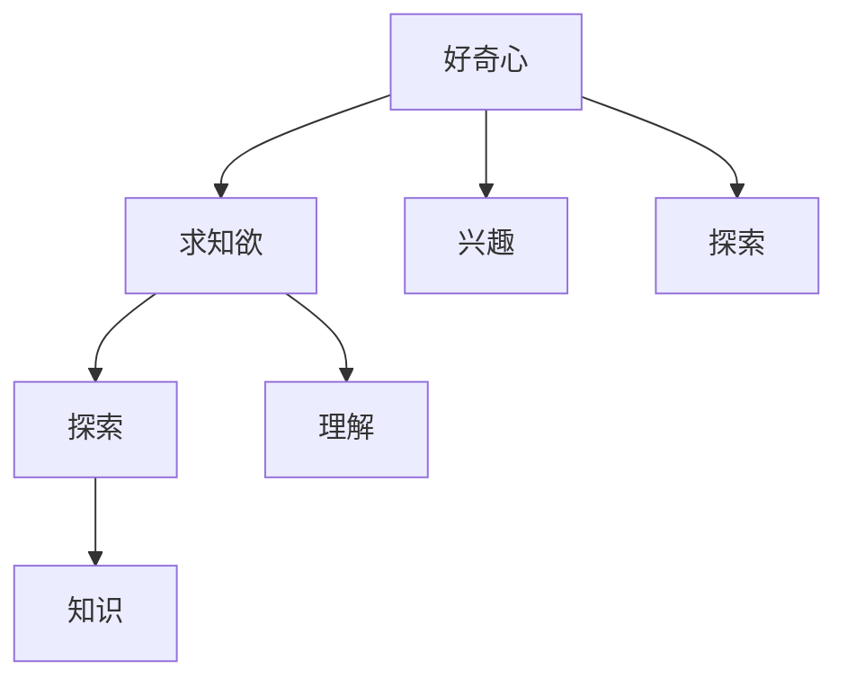
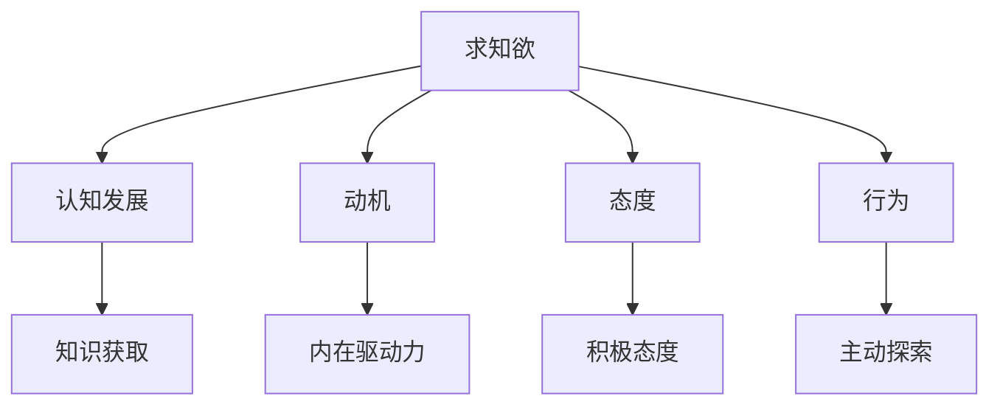

                 

# 好奇心与求知欲：探索的动力

> 关键词：好奇心、求知欲、认知发展、心理健康、学习、创造力、技术应用

> 摘要：本文深入探讨了好奇心与求知欲在个人成长和社会发展中的作用，分析了这两个心理特质如何成为探索动力的源泉。通过科学研究和实际案例，本文揭示了好奇心与求知欲的核心概念及其相互关系，探讨了它们对认知发展、心理健康、学习和创造力的影响，并提出了培养这些特质的策略。文章还展望了好奇心与求知欲在未来社会中的发展趋势及其重要性。

### 《好奇心与求知欲：探索的动力》目录大纲

## 第一部分：好奇心的本质

### 第1章：好奇心的定义与重要性

### 1.1 好奇心的定义

好奇心是一种强烈的内在动机，驱使人们探索新事物、寻求答案和理解世界。它是一种渴望了解和体验未知事物的心理状态，通常表现为对周围环境的积极关注和提问。

### 1.2 好奇心的重要性

好奇心是人类智慧和创造力的源泉。它是推动个人成长、学习和创新的关键因素。好奇心能够激发人们的潜能，促使他们不断探索和挑战自我。

### 1.3 好奇心的演变与发展

好奇心的发展是一个连续的过程，从婴儿期到成年期逐渐成熟。在不同的生命周期阶段，好奇心表现出不同的形式和特点。

## 第2章：好奇心与认知发展的关系

### 2.1 好奇心在婴儿期的发展

婴儿期是好奇心发展的关键时期。婴儿通过探索环境，逐渐建立起对世界的认知和理解。

### 2.2 好奇心在儿童期的作用

儿童期好奇心的高峰期，是培养学习兴趣和探索精神的重要时期。好奇心促使儿童主动学习、提问和解决问题。

### 2.3 青少年与成年的好奇心变化

青少年和成年人的好奇心逐渐减弱，但依然保持一定的水平。成年人的好奇心更多表现为对特定领域的专注和兴趣。

## 第3章：好奇心与心理健康

### 3.1 好奇心对心理健康的影响

好奇心有助于减轻焦虑和抑郁，提高心理韧性。它可以增强人们的幸福感和生活满意度。

### 3.2 好奇心与焦虑、抑郁的关系

好奇心与焦虑、抑郁之间存在复杂的相互关系。通过培养好奇心，可以缓解焦虑和抑郁症状。

### 3.3 培养好奇心以改善心理健康

通过科学方法培养好奇心，可以提高心理健康的水平。这包括鼓励提问、探索新环境和培养兴趣爱好。

## 第4章：好奇心在学习和工作中的应用

### 4.1 好奇心在学习过程中的作用

好奇心是学习过程中的重要驱动力。它促使人们主动学习、探索和掌握新知识。

### 4.2 好奇心在工作中的价值

好奇心可以提高工作效率和创造力。它促使员工主动寻找问题和解决方案，推动组织创新。

### 4.3 如何激发和保持好奇心

通过提供刺激、挑战和鼓励，可以激发和保持好奇心。这包括提供新的学习机会、创造探索的环境和鼓励提问。

## 第二部分：求知欲的力量

### 第5章：求知欲的定义与特点

### 5.1 求知欲的定义

求知欲是一种强烈的内在动机，驱使人们追求知识、理解和探索真理。

### 5.2 求知欲的特点

求知欲具有主动性、持续性和深度性。它是一种深层次的内在驱动力，推动个人不断学习和成长。

### 5.3 求知欲与好奇心的区别与联系

求知欲与好奇心是密切相关的，但它们之间存在一定的区别。好奇心更多表现为对未知事物的兴趣，而求知欲则更关注知识和理解。

## 第6章：求知欲与创造力

### 6.1 求知欲在创造力培养中的作用

求知欲是创造力培养的重要基础。它促使人们探索新领域、尝试新方法和提出新想法。

### 6.2 创造力培养中的求知欲策略

通过激发求知欲，可以培养创造力。这包括提供挑战性的任务、鼓励提问和提供创造性的环境。

### 6.3 求知欲与创造力发展的关系

求知欲与创造力之间存在紧密的联系。求知欲越强，创造力越丰富。

## 第7章：求知欲与学习效果

### 7.1 求知欲在学习中的重要性

求知欲是学习效果的重要决定因素。它促使人们主动学习、深入思考和掌握知识。

### 7.2 提高学习效果的方法

通过激发求知欲，可以提高学习效果。这包括提供有趣的教材、鼓励主动学习和创造性的学习方法。

### 7.3 求知欲在职业生涯发展中的作用

求知欲在职业生涯发展中起着关键作用。它促使员工不断学习和成长，提高职业竞争力。

## 第8章：培养好奇心与求知欲的策略

### 8.1 家庭教育中的好奇心与求知欲培养

家庭教育对好奇心与求知欲的培养至关重要。家长可以通过提供丰富的学习资源和鼓励提问来激发孩子的兴趣。

### 8.2 学校教育中的好奇心与求知欲培养

学校教育应注重培养学生的好奇心与求知欲。教师可以通过设计富有挑战性的课程和提供多样化的学习机会来实现。

### 8.3 社会环境中的好奇心与求知欲培养

社会环境对好奇心与求知欲的培养具有重要影响。通过提供丰富的文化资源、鼓励创新思维和创造积极的学习氛围，可以培养社会的求知精神。

## 第三部分：好奇心与求知欲的综合应用

### 第9章：好奇心与求知欲在社会发展中的作用

### 9.1 好奇心与求知欲对社会进步的推动

好奇心与求知欲是社会进步的重要动力。它们推动科技发展、文化创新和社会进步。

### 9.2 好奇心与求知欲在科技发展中的作用

好奇心与求知欲在科技发展中起着关键作用。它们激发科学家和工程师的创新思维，推动技术的进步。

### 9.3 好奇心与求知欲在文化传承中的作用

好奇心与求知欲在文化传承中具有重要价值。它们推动文化遗产的保护和创新，促进文化的发展与交流。

### 第10章：好奇心与求知欲在个人成长中的应用

### 10.1 好奇心与求知欲在职业规划中的应用

好奇心与求知欲在职业规划中起着关键作用。它们帮助个人发现职业兴趣、制定职业目标和实现职业发展。

### 10.2 好奇心与求知欲在人际关系中的应用

好奇心与求知欲有助于建立和维护良好的人际关系。它们促进人际沟通、增强理解和增进友谊。

### 10.3 好奇心与求知欲在自我成长中的应用

好奇心与求知欲是自我成长的重要驱动力。它们促使个人不断学习、反思和提升自我能力。

### 第11章：好奇心与求知欲的未来展望

### 11.1 好奇心与求知欲在未来的发展趋势

随着科技的发展和社会的进步，好奇心与求知欲在未来将继续发挥重要作用。它们将成为推动社会发展和个人成长的重要力量。

### 11.2 技术创新与好奇心、求知欲的关系

技术创新与好奇心、求知欲密切相关。好奇心与求知欲推动技术创新，而技术创新又激发好奇心与求知欲。

### 11.3 未来社会对好奇心与求知欲的需求

未来社会对好奇心与求知欲的需求将更加迫切。培养好奇心与求知欲将成为个人和社会发展的关键。

## 附录

### 附录A：好奇心与求知欲相关研究综述

### A.1 好奇心研究的最新进展

### A.2 求知欲研究的最新进展

### A.3 好奇心与求知欲跨学科研究的进展

### 附录B：好奇心与求知欲培养实践案例

### B.1 家庭教育中的好奇心与求知欲培养案例

### B.2 学校教育中的好奇心与求知欲培养案例

### B.3 社会实践中的好奇心与求知欲培养案例

# 第一部分：好奇心的本质

好奇心是人类探索世界、推动文明进步的重要动力。在这一部分中，我们将深入探讨好奇心的定义、重要性以及它在不同生命周期阶段的发展。

## 第1章：好奇心的定义与重要性

### 1.1 好奇心的定义

好奇心是一种强烈的内在动机，驱使人们探索新事物、寻求答案和理解世界。它是一种渴望了解和体验未知事物的心理状态，通常表现为对周围环境的积极关注和提问。

在心理学中，好奇心被定义为一个积极的心理状态，它涉及到对未知事物的渴望、探索行为的动机以及对新信息的处理和解释。好奇心不仅仅是一种简单的兴趣或好奇心，而是一种深层次的内在驱动力，促使人们不断寻求知识和理解。

### 1.2 好奇心的重要性

好奇心是人类智慧和创造力的源泉。它是推动个人成长、学习和创新的关键因素。好奇心能够激发人们的潜能，促使他们不断探索和挑战自我。

好奇心在学习中的重要性体现在它能够激发学生的学习动机和兴趣。当学生对某个话题或问题产生好奇心时，他们会更加主动地参与学习过程，积极寻找答案和解决问题。这种内在的驱动力量能够显著提高学习效果和知识掌握度。

在创造力方面，好奇心促使人们探索新的思路和方法。它推动人们跳出传统的思维模式，寻找创新性的解决方案。好奇心能够激发人们的创新思维，促进科技、文化和艺术的进步。

此外，好奇心对于社会发展和文明进步也具有重要作用。好奇心促使人们不断探索未知领域，推动科学技术的进步。从古代的哲学思考到现代的科技发展，好奇心一直是推动社会变革和进步的重要力量。

### 1.3 好奇心的演变与发展

好奇心的发展是一个连续的过程，从婴儿期到成年期逐渐成熟。在不同的生命周期阶段，好奇心表现出不同的形式和特点。

在婴儿期，好奇心主要表现为对周围环境的积极探索和探索行为。婴儿通过感知、触摸和尝试来了解和探索世界。他们充满了对新事物的渴望和好奇心，对任何新奇的事物都表现出极大的兴趣。

在儿童期，好奇心达到高峰期。儿童对未知事物充满好奇，他们主动探索和学习，渴望了解世界的运作原理。儿童期是培养学习兴趣和探索精神的重要时期，好奇心促使儿童主动学习、提问和解决问题。

青少年期和成年期，好奇心逐渐减弱，但依然保持一定的水平。青少年和成年人更多表现为对特定领域的专注和兴趣。他们的好奇心更倾向于专业领域和特定主题，而非广泛的探索。

然而，随着年龄的增长，人们的好奇心可能会受到各种因素的影响，如压力、焦虑和生活琐事等。因此，培养和维护好奇心对于个人成长和社会发展具有重要意义。

### 1.4 好奇心的核心概念与联系

为了更好地理解好奇心，我们需要了解其核心概念和与其他心理特质之间的联系。

好奇心与求知欲密切相关。求知欲是一种强烈的内在动机，驱使人们追求知识和理解。它与好奇心一起构成了人们对未知事物的渴望和探索行为。

好奇心也与创造力紧密相关。创造力是指人们产生新颖、有创意的想法和解决方案的能力。好奇心促使人们不断探索新领域、尝试新方法，从而激发创造力。

此外，好奇心与自信心、自尊心和情绪调节能力等心理特质也存在一定的联系。好奇心能够提高人们的自信心和自尊心，促使他们勇于尝试和面对挑战。同时，好奇心也有助于情绪调节，减少焦虑和抑郁。

为了更好地理解好奇心，我们可以借助Mermaid流程图来展示其核心概念和联系：

通过这张流程图，我们可以更清晰地看到好奇心与其他心理特质之间的联系，以及它们如何共同推动个人成长和社会发展。

## 第2章：好奇心与认知发展的关系

好奇心在认知发展中扮演着重要的角色，它是推动个体学习和知识构建的驱动力。在这一章中，我们将探讨好奇心在婴儿期、儿童期以及青少年和成年期的发展，并分析它在各个阶段的作用。

### 2.1 好奇心在婴儿期的发展

婴儿期是好奇心发展的关键时期。婴儿通过探索环境，逐渐建立起对世界的认知和理解。在这个阶段，好奇心表现为对周围事物的积极关注和探索行为。

在婴儿期，好奇心的发展主要通过感知和运动活动来实现。婴儿通过视觉、听觉、触觉和嗅觉来感知周围的世界，并通过尝试和探索来获取新的经验和知识。他们对于新事物充满好奇，对任何新奇的声音、形状或颜色都会表现出极大的兴趣。

婴儿的好奇心发展受到多种因素的影响，包括家庭环境、亲子互动和教育资源。一个充满刺激和多样性的环境能够激发婴儿的好奇心，促进他们主动探索和学习。父母的积极回应和鼓励也是培养婴儿好奇心的重要条件，通过互动和沟通，父母可以帮助婴儿理解新事物，激发他们的探索欲望。

### 2.2 好奇心在儿童期的作用

儿童期是好奇心发展的黄金时期，也是学习兴趣和探索精神培养的重要阶段。在这个阶段，好奇心表现为对知识和探索的强烈渴望。

儿童的好奇心促使他们主动参与学习过程，通过提问和探索来获取知识。他们对于未知事物充满好奇，渴望了解世界的运作原理。好奇心激发了儿童的学习动机，使他们对新知识产生浓厚的兴趣。

教师和家长在儿童期的好奇心培养中扮演着关键角色。教师可以通过设计有趣的教学活动和提供多样化的学习资源，激发儿童的好奇心。家长可以通过陪伴和鼓励，为孩子创造一个充满探索和挑战的环境，支持他们主动学习和探索。

此外，儿童期的好奇心也影响到他们的认知发展。好奇心促使儿童不断提出问题、寻找答案，从而促进他们的思维能力和批判性思维的培养。通过不断探索和思考，儿童能够建立起对世界的深刻理解，形成自己的知识和认知框架。

### 2.3 青少年与成年的好奇心变化

青少年期和成年期，好奇心逐渐减弱，但依然保持一定的水平。在这个阶段，好奇心更多表现为对特定领域的专注和兴趣。

青少年期是好奇心变化的转折点。随着青春期的到来，青少年开始对特定领域产生浓厚的兴趣，如学术、艺术、体育等。他们对于未知事物的好奇心逐渐转向对专业领域的深入探索。这种转变反映了青少年认知发展的特点，他们开始对具体领域进行深入研究和专业学习。

成年期的好奇心更多受到职业和生活压力的影响。成年人可能会因为工作繁忙、家庭责任等原因，减少对未知事物的探索。然而，好奇心在成年期依然具有一定的重要性。成年人可以通过持续学习和探索，保持对世界的兴趣和好奇心。

成年人可以通过多种方式激发和维护好奇心。例如，通过参加兴趣小组、读书会或参与志愿者活动，成年人可以结识志同道合的朋友，分享知识和经验，激发好奇心。此外，成年人还可以通过旅行、尝试新事物和接受新的挑战来保持好奇心。

### 2.4 好奇心与认知发展的关系

好奇心与认知发展之间存在着密切的关系。好奇心是推动认知发展的内在驱动力，它促使个体主动探索和学习，从而积累新的知识和经验。

在婴儿期，好奇心通过感知和运动活动推动认知发展。婴儿通过探索环境，不断积累对世界的感知经验，建立起对事物的初步理解。好奇心促使婴儿不断尝试和探索，从而促进他们的认知能力的发展。

在儿童期，好奇心激发学习动机，推动知识的构建和认知发展。儿童通过提问和探索，不断积累新的知识和经验，形成对世界的深刻理解。好奇心促使儿童主动参与学习过程，培养他们的批判性思维和解决问题的能力。

青少年和成年期，好奇心虽然减弱，但对特定领域的专注和兴趣依然对认知发展具有重要作用。通过深入探索和专业学习，青少年和成年人能够建立起对特定领域的深入理解，提高专业能力和知识水平。

总之，好奇心在认知发展中起着至关重要的作用。它是推动个体学习和知识构建的内在动力，促进认知能力的提升和知识体系的扩展。培养和维护好奇心，对于个人成长和社会发展都具有重要意义。

### 2.5 好奇心与心理健康的关系

好奇心不仅对认知发展有重要影响，还与心理健康密切相关。研究表明，好奇心与焦虑、抑郁等心理问题之间存在复杂的相互关系。通过科学的方法和策略，我们可以有效地培养和维护好奇心，从而改善心理健康。

首先，好奇心有助于减轻焦虑。好奇心促使人们积极关注和探索新事物，从而减少对未知和不确定性的担忧。在焦虑的情况下，通过培养好奇心，个体可以转移注意力，减少焦虑情绪。例如，当一个人感到紧张时，可以尝试阅读一本关于自然科学的书籍，通过学习新的知识来分散注意力，缓解焦虑。

其次，好奇心对抑郁也有积极的影响。抑郁常常导致个体对生活失去兴趣和热情。通过培养好奇心，个体可以重新发现生活中的乐趣和意义。例如，一个对园艺感兴趣的人，可以通过种植新的植物品种来激发好奇心，从而提高生活质量和情绪状态。

此外，好奇心还有助于提高心理韧性。心理韧性是指个体在面对压力和挑战时的适应能力和恢复能力。好奇心促使个体积极面对未知和变化，从而提高他们的心理韧性。通过不断地探索和学习，个体可以培养出更强的适应能力和解决问题的能力。

然而，好奇心也可能与焦虑和抑郁之间存在一定的负面影响。过度的好奇心可能导致个体过度关注和担忧未知事物，从而引发焦虑和抑郁。例如，一个人在面临重要考试时，过度的好奇可能导致焦虑情绪的加剧。因此，在培养好奇心时，我们需要注意适度原则，避免过度追求未知，以免对心理健康产生负面影响。

为了培养和维护好奇心，可以采取以下策略：

1. **鼓励提问和探索**：家长和教师可以通过鼓励孩子和学生的提问和探索，激发他们的好奇心。提供丰富的学习资源和挑战性的任务，鼓励他们主动寻找答案和解决问题。

2. **创造积极的环境**：家庭、学校和社会应该创造一个积极、开放和鼓励探索的环境。提供多样化的学习机会和活动，让孩子们有机会尝试新事物，培养他们的好奇心。

3. **培养兴趣爱好**：鼓励个体发展兴趣爱好，通过兴趣驱动来培养好奇心。例如，一个人可以通过学习乐器、绘画或编程来激发好奇心，从而提高心理健康水平。

4. **鼓励自我反思**：通过自我反思和自我探索，个体可以更好地理解自己的好奇心和兴趣。这有助于他们找到适合自己的培养好奇心的方法和策略。

总之，好奇心与心理健康之间存在密切的关系。通过科学的方法和策略，我们可以有效地培养和维护好奇心，从而改善心理健康。好奇心不仅有助于个人的成长和发展，也是提高生活质量和社会幸福感的宝贵财富。

### 2.6 好奇心在学习和工作中的应用

好奇心在学习和工作中发挥着重要的作用，它不仅能够激发学习动机和创造力，还能提高工作效率和职业发展。通过深入理解好奇心在学习和工作中的具体应用，我们可以更好地利用这一心理特质，实现个人和职业目标。

#### 4.1 好奇心在学习过程中的作用

好奇心是学习过程中不可或缺的动力。它促使个体主动探索和学习，从而提高学习效果。具体来说，好奇心在学习中的应用体现在以下几个方面：

1. **提高学习动机**：好奇心能够激发学生的学习兴趣和动机。当学生对某个话题或问题产生好奇心时，他们会更加主动地参与学习过程，积极寻找答案和解决问题。这种内在的驱动力能够显著提高学习效果和知识掌握度。

2. **促进主动学习**：好奇心促使学生主动参与学习，而非被动接受知识。通过提问、探索和尝试，学生能够更好地理解和应用所学知识。主动学习不仅提高了学习效率，还培养了学生的批判性思维和解决问题的能力。

3. **促进知识构建**：好奇心促使学生不断探索和寻找新的知识和信息。通过主动获取和整合不同来源的信息，学生能够建立起对所学知识的深刻理解和系统认知。这种知识构建过程有助于提升学生的学术水平和综合素质。

为了更好地利用好奇心，教师和家长可以采取以下策略：

- **提供有趣的教材和课程**：通过设计富有挑战性和趣味性的教学活动，激发学生的学习兴趣和好奇心。例如，利用多媒体资源、实验和实地考察等手段，使学习过程更加生动和有趣。

- **鼓励提问和探索**：鼓励学生提问和探索，培养他们的好奇心。教师可以设置开放性的问题和挑战，让学生通过自主学习和合作探究来寻找答案。

- **提供多样化的学习资源**：提供丰富的学习资源，包括书籍、网络课程、实验材料和实地考察等，让学生有机会接触和探索不同的知识和领域。

#### 4.2 好奇心在工作中的价值

好奇心在工作中的价值同样不可忽视。它不仅能够激发创新思维和创造力，还能提高工作效率和职业发展。以下是好奇心在工作中的几个具体应用：

1. **提高工作效率**：好奇心促使员工主动学习和掌握新技能和知识，从而提高工作效率。通过不断探索和学习，员工能够更好地应对工作中的挑战和变化，提高工作质量和效率。

2. **激发创新思维**：好奇心能够激发员工的创新思维和创造力。当员工对某个问题或项目产生好奇心时，他们会更倾向于提出新的观点和解决方案。这种创新思维能够推动组织的创新和发展。

3. **促进职业发展**：好奇心有助于员工在职业生涯中实现个人成长和发展。通过不断探索和学习，员工能够提升自己的专业能力和知识水平，为职业发展打下坚实基础。

为了更好地利用好奇心，企业可以采取以下策略：

- **提供学习和发展机会**：企业可以通过提供培训、学习和职业发展机会，激发员工的好奇心和求知欲。例如，定期组织内部培训、外部研讨会和员工交流，鼓励员工不断学习和成长。

- **鼓励创新和尝试**：企业可以创造一个鼓励创新和尝试的工作环境，让员工有机会自由表达自己的想法和观点。通过支持员工提出新的想法和解决方案，企业可以激发员工的好奇心和创造力。

- **建立知识分享平台**：企业可以建立知识分享平台，鼓励员工分享知识和经验。通过这种方式，员工可以互相学习和借鉴，共同提升专业能力和知识水平。

总之，好奇心在学习和工作中具有重要的作用。通过培养和维护好奇心，个体可以更好地实现个人和职业目标，提高学习效果和工作效率。企业和教育机构可以通过提供支持、创造机会和鼓励探索，激发员工和学生的好奇心，促进个人和组织的成长和发展。

### 4.3 如何激发和保持好奇心

好奇心是人类智慧和创造力的重要源泉，但如何有效地激发和保持好奇心，对于个人成长和社会发展都至关重要。以下是一些策略，可以帮助我们培养和维护好奇心。

#### 4.3.1 鼓励提问

提问是培养好奇心的第一步。通过鼓励提问，我们可以激发个体对未知事物的兴趣和探索欲望。以下是一些建议：

1. **提供开放的提问环境**：在家庭、学校和工作环境中，创造一个鼓励提问的氛围。家长、教师和同事应该鼓励个体提出问题，不要轻易给出答案，而是引导他们思考和分析。

2. **设置开放性问题**：设计开放性的问题和挑战，鼓励个体探索和寻找答案。这些问题应该具有一定的难度和复杂性，能够激发个体的好奇心。

3. **提供多样的提问方式**：鼓励个体通过不同的方式提问，如书面、口头、图表和演示等。这样可以培养他们的多维度思考能力和表达能力。

#### 4.3.2 创造探索的机会

创造探索的机会是培养好奇心的重要手段。以下是一些建议：

1. **提供丰富的学习资源**：为个体提供丰富的学习资源，如书籍、网络课程、实验材料和实地考察等。这些资源可以帮助个体接触新的知识和领域，激发他们的好奇心。

2. **组织实践活动**：组织各种实践活动，如实验、参观、志愿服务等。这些活动可以让个体亲身体验和探索，从而培养他们的实践能力和好奇心。

3. **设置探索任务**：为个体设置探索任务，如研究一个新项目、解决一个实际问题等。通过这些任务，个体可以主动探索和解决问题，提高他们的好奇心和创造力。

#### 4.3.3 奖励好奇心

奖励好奇心可以增强个体的探索动机和自信心。以下是一些建议：

1. **表扬和认可**：对个体提出的问题和探索成果进行表扬和认可。这可以激发他们的好奇心和自信，鼓励他们继续探索。

2. **提供奖励**：为个体提供物质奖励或精神奖励，如书籍、证书、荣誉称号等。这些奖励可以增强他们对好奇心的兴趣和投入。

3. **建立荣誉制度**：在家庭、学校和工作环境中建立荣誉制度，鼓励个体积极参与探索和创造。通过荣誉制度，可以培养个体的荣誉感和成就感。

#### 4.3.4 培养兴趣爱好

培养兴趣爱好是保持好奇心的重要途径。以下是一些建议：

1. **提供多样化的兴趣选择**：为个体提供多样化的兴趣选择，如音乐、艺术、体育、科学等。通过尝试不同的兴趣，个体可以找到自己真正喜欢的事物，从而保持好奇心。

2. **鼓励深度探索**：鼓励个体对某一兴趣进行深度探索，通过阅读、实践和研究，深入了解该领域。深度探索可以增强个体对兴趣的理解和热爱。

3. **提供交流平台**：为个体提供交流平台，如兴趣小组、论坛和俱乐部等。通过交流和分享，个体可以互相学习和启发，增强好奇心和兴趣。

总之，通过鼓励提问、创造探索机会、奖励好奇心和培养兴趣爱好，我们可以有效地激发和保持好奇心。好奇心不仅能够推动个人成长和职业发展，也是社会进步和创新的重要动力。培养和维护好奇心，对于个人和社会都具有重要意义。

### 第二部分：求知欲的力量

求知欲，即对知识的渴望和追求，是驱动人类不断探索、学习和进步的重要内在动力。在这一部分中，我们将深入探讨求知欲的定义、特点，以及它与好奇心之间的区别与联系。

## 第5章：求知欲的定义与特点

### 5.1 求知欲的定义

求知欲是一种强烈的内在动机，驱使人们追求知识、理解和探索真理。它是一种深层次的内在驱动力，促使人们主动寻求和获取知识。

在心理学中，求知欲被定义为个体对于知识和理解的渴望和需求。它与好奇心有所不同，好奇心更多地表现为对未知事物的兴趣和探索欲望，而求知欲则更侧重于对知识的追求和探索的深度。

### 5.2 求知欲的特点

求知欲具有以下特点：

1. **主动性**：求知欲是一种主动性的内在动机，驱使个体主动寻求知识，而非被动地接受信息。
2. **持续性**：求知欲具有持续性，即个体对知识的追求不仅仅是在某个特定时刻，而是持续性的行为和态度。
3. **深度性**：求知欲促使个体对知识进行深入的探索和理解，而不仅仅是表面上的了解。
4. **综合性**：求知欲不仅关注单一领域的知识，而是追求全面、系统的知识体系。

### 5.3 求知欲与好奇心的区别与联系

求知欲与好奇心是密切相关的，但它们之间存在一定的区别和联系。

1. **区别**：

   - **焦点不同**：好奇心更侧重于对未知事物的兴趣和探索，而求知欲则更侧重于对知识的追求和深度理解。
   - **主动性程度**：好奇心可能是一种短暂和即时的兴趣，而求知欲则是一种持续和持久的内在动机。
   - **表现形式**：好奇心通常表现为对新奇事物的好奇和探索，而求知欲则更多表现为对知识的追求和深入思考。

2. **联系**：

   - **相互促进**：好奇心和求知欲是相辅相成的，好奇心可以激发求知欲，而求知欲可以深化好奇心。
   - **共同目标**：好奇心和求知欲的共同目标是探索和理解世界，通过不断学习和积累知识，实现个体的成长和发展。
   - **互为补充**：好奇心可以激发求知欲，促使个体开始探索和学习；而求知欲则可以深化好奇心，促使个体深入研究和理解所感兴趣的事物。

为了更直观地展示求知欲与好奇心的区别与联系，我们可以使用Mermaid流程图进行描述：

通过这张流程图，我们可以清晰地看到好奇心和求知欲的关系，以及它们在探索和理解世界过程中的作用。

### 5.4 求知欲的核心概念与联系

为了深入理解求知欲，我们需要探讨其核心概念和与其他心理特质之间的联系。求知欲不仅仅是对知识的渴望，它还涉及到认知发展、动机、态度和行为等多个方面。

1. **认知发展**：求知欲与个体的认知发展密切相关。它促使个体不断探索新的知识和信息，从而促进认知能力的发展和知识体系的构建。通过求知欲，个体能够主动获取和处理信息，提高思维能力和问题解决能力。

2. **动机**：求知欲是一种内在动机，它驱使个体主动寻求和获取知识。与外在动机不同，求知欲更注重个体内心的渴望和兴趣，而不是外部的奖励或压力。

3. **态度**：求知欲与个体的学习态度密切相关。拥有求知欲的个体通常表现出积极的学习态度，他们乐于接受新的知识和挑战，勇于探索未知的领域。

4. **行为**：求知欲也体现在个体的行为上。拥有强烈求知欲的个体会主动参与各种学习和探索活动，不断扩展自己的知识领域。

为了更直观地展示求知欲的核心概念和联系，我们可以使用Mermaid流程图：

通过这张流程图，我们可以清晰地看到求知欲的核心概念和与其他心理特质之间的联系，以及它在个人成长和社会发展中的作用。

### 5.5 求知欲的重要性

求知欲在个人成长和社会发展中具有重要的作用。首先，它对个人的知识积累和认知发展有重要影响。拥有强烈求知欲的个体能够主动学习和积累知识，提高自己的认知能力和解决问题的能力。

其次，求知欲有助于培养个体的创新思维和创造力。通过对知识的深入探索和理解，个体能够产生新的想法和解决方案，推动科技、文化和艺术的进步。

此外，求知欲也对社会发展和文明进步具有重要作用。求知欲促使人们不断探索未知领域，推动科学技术的进步，促进社会的创新和发展。

总之，求知欲是人类智慧和创造力的重要源泉，它在个人成长和社会发展中具有不可替代的作用。培养和激发个体的求知欲，对于个人和社会的发展都具有重要意义。

### 第6章：求知欲与创造力

求知欲与创造力之间存在着密切的联系。求知欲是一种内在的驱动力，促使个体不断寻求知识、理解和探索真理。而创造力则是通过这种内在驱动力产生的新颖、有创意的想法和解决方案。在这一章中，我们将探讨求知欲在创造力培养中的作用，以及如何通过激发求知欲来提高创造力。

#### 6.1 求知欲在创造力培养中的作用

求知欲在创造力培养中扮演着关键角色。它不仅激发了个体对知识的渴望，还推动了创新思维的发展。以下是一些具体作用：

1. **激发创新思维**：求知欲促使个体不断探索新的知识领域，从而激发创新思维。通过不断地学习和思考，个体能够跳出传统思维模式，产生新颖的观点和解决方案。

2. **提供丰富的知识储备**：求知欲促使个体主动积累和掌握各种知识，为创造力提供了丰富的素材和灵感。丰富的知识储备有助于个体在解决问题时产生更多的联想和创意。

3. **培养批判性思维**：求知欲促使个体对知识进行深入思考和批判性分析。这种批判性思维能力是创造力的重要基础，它有助于个体在创新过程中发现问题和提出解决方案。

4. **促进跨学科思考**：求知欲促使个体涉猎多个学科和领域，从而培养跨学科思考的能力。跨学科思考能够促进知识的整合和交叉，有助于产生创新的思路和解决方案。

#### 6.2 创造力培养中的求知欲策略

为了在创造力培养中更好地利用求知欲，可以采取以下策略：

1. **提供丰富的学习资源**：为个体提供丰富的学习资源，包括书籍、网络课程、讲座和研讨会等。这些资源可以帮助个体接触新的知识和领域，激发求知欲。

2. **鼓励跨学科学习**：鼓励个体跨学科学习和探索，通过不同领域的知识交叉和融合，培养跨学科思考能力。这种跨学科的学习方式有助于产生新的创意和解决方案。

3. **设置挑战性任务**：为个体设置具有挑战性的任务和项目，鼓励他们通过探索和解决实际问题来提高创造力。挑战性的任务能够激发个体的求知欲，促使他们主动寻找答案和解决方案。

4. **提供积极的反馈和支持**：为个体提供积极的反馈和支持，鼓励他们在创造过程中勇于尝试和失败。积极的反馈和支持能够增强个体的自信心和创造力。

#### 6.3 求知欲与创造力发展的关系

求知欲与创造力发展之间存在密切的关系。求知欲是创造力培养的重要基础，它激发了个体对知识的渴望和探索欲望，推动了创新思维的发展。而创造力则是求知欲的体现和结果，通过将所学知识应用于实际问题和挑战中，个体能够产生新颖的创意和解决方案。

研究表明，拥有强烈求知欲的个体在创造力方面表现更出色。他们在面对新问题和挑战时，能够更加灵活地思考，产生更多的创意和解决方案。同时，求知欲也能够促进个体的持续学习和成长，为创造力提供源源不断的动力。

总之，求知欲与创造力之间存在着紧密的联系。通过激发和培养求知欲，我们可以提高创造力，推动个人和组织的创新和发展。

### 6.4 提高学习效果的方法

求知欲在学习过程中起着至关重要的作用，它不仅能激发学习动机，还能提高学习效率。为了充分发挥求知欲的作用，以下是一些提高学习效果的方法：

1. **明确学习目标**：设定清晰的学习目标是提高学习效果的第一步。明确的目标可以帮助个体集中注意力，提高学习效率。例如，在学习新知识时，可以设定短期目标（如理解基本概念）和长期目标（如掌握整个知识体系）。

2. **提供多样化的学习资源**：多样化学习资源能够满足不同学习者的需求，激发求知欲。这些资源可以包括教科书、网络课程、讲座、视频、实验和实地考察等。多样化的学习资源可以帮助个体从不同角度理解知识，提高学习效果。

3. **设置挑战性任务**：挑战性任务能够激发个体的求知欲，促使他们主动探索和解决问题。例如，在学习复杂的概念或技能时，可以设置一些具有挑战性的问题或项目，鼓励个体通过自主学习和团队合作来解决问题。

4. **提供积极的反馈和支持**：积极的反馈和支持能够增强个体的自信心和学习动力。教师和家长可以通过表扬、鼓励和解答疑惑来提供积极的反馈。此外，同伴互助也是一种有效的支持方式，通过交流和合作，个体可以相互学习，共同提高学习效果。

5. **培养良好的学习习惯**：良好的学习习惯能够提高学习效果。这包括定时学习、合理安排学习时间、做好学习计划和笔记整理等。培养良好的学习习惯可以帮助个体保持学习动力，提高学习效率。

6. **利用科技工具**：现代科技工具提供了丰富的学习资源和平台，如在线课程、教育软件和虚拟现实等。利用这些工具，个体可以更加灵活地学习，提高学习效果。

通过以上方法，我们可以有效地激发和利用求知欲，提高学习效果。求知欲不仅是学习过程中的动力，也是个人成长和职业发展的关键因素。培养和激发求知欲，对于实现个人和职业目标具有重要意义。

### 6.5 求知欲在职业生涯发展中的作用

求知欲在职业生涯发展中扮演着至关重要的角色。它不仅能够提高个人的专业能力，还能够促进职业成长和职业竞争力的提升。在这一节中，我们将探讨求知欲在职业生涯发展中的具体作用，以及如何通过培养求知欲来实现职业目标。

#### 6.5.1 提升专业能力

求知欲是提升专业能力的关键驱动力。它促使个体主动学习新知识、掌握新技能，从而在职业生涯中保持竞争力。以下是一些具体表现：

1. **持续学习**：求知欲使个体对专业知识充满渴望，他们愿意投入时间和精力进行持续学习。这种持续学习不仅包括通过正式教育获取新知识，还包括通过阅读专业书籍、参加研讨会和培训等方式不断更新和扩展自己的知识体系。

2. **积极实践**：求知欲促使个体将所学知识应用于实际工作中，通过实践来提升专业能力。例如，在工作中遇到问题时，拥有强烈求知欲的个体会主动寻求解决方案，通过实践来验证和优化自己的知识。

3. **不断探索**：求知欲激发个体对未知领域的兴趣，促使他们不断探索新的技术和方法。通过不断探索和学习，个体能够掌握更多前沿的专业知识和技能，为职业生涯发展奠定坚实基础。

#### 6.5.2 促进职业成长

求知欲不仅在专业能力的提升中发挥作用，还能够促进职业成长。以下是一些具体表现：

1. **职业规划**：求知欲使个体能够更加明确自己的职业目标和发展方向。他们通过不断学习和探索，了解行业动态和职业趋势，从而制定出更为合理和可行的职业规划。

2. **职业转型**：求知欲促使个体在面对职业瓶颈或转型时，能够积极应对挑战。他们通过学习新知识和技能，适应新的职业要求，实现职业转型。

3. **创新能力**：求知欲培养了个体的创新思维和创造力，使他们能够在职业生涯中不断提出新的想法和解决方案。这种创新能力不仅有助于个人在职业生涯中脱颖而出，还能够为组织和行业带来新的发展机遇。

#### 6.5.3 提高职业竞争力

求知欲是提高职业竞争力的重要保障。以下是一些具体表现：

1. **知识储备**：求知欲使个体拥有丰富的知识储备，这使他们能够在面对各种职业挑战时，迅速找到解决问题的方法。丰富的知识储备是提高职业竞争力的重要基础。

2. **灵活适应**：求知欲培养了个体的灵活适应能力，使他们能够快速适应新的工作环境和要求。在快速变化的市场中，灵活适应能力是提高职业竞争力的重要因素。

3. **持续进步**：求知欲促使个体不断追求进步，他们通过持续学习和自我提升，保持自己在职业生涯中的竞争力。持续进步是保持职业竞争力的关键。

#### 6.5.4 培养求知欲的策略

为了在职业生涯中充分发挥求知欲的作用，以下是一些培养求知欲的策略：

1. **设定学习目标**：为职业生涯设定明确的学习目标，使个体能够有针对性地进行学习和提升。例如，设定短期目标（如掌握某项新技能）和长期目标（如成为行业专家）。

2. **提供学习资源**：为个体提供丰富的学习资源，如专业书籍、在线课程、行业报告和学术论文等。这些资源可以帮助个体获取最新的行业动态和专业知识。

3. **鼓励跨学科学习**：鼓励个体跨学科学习和探索，通过不同领域的知识交叉和融合，提升综合能力和创新思维。

4. **创造学习氛围**：在组织内部创造积极的学习氛围，鼓励员工相互学习和分享经验。例如，组织内部培训、研讨会和知识分享活动等。

5. **提供职业发展机会**：为个体提供职业发展机会，如晋升、轮岗和参与项目等。这些机会可以帮助个体在实践中学习和成长。

通过以上策略，我们可以有效地培养和激发求知欲，提高职业生涯发展的效率和质量。求知欲不仅是个人成长的重要动力，也是组织和社会进步的重要力量。

### 6.6 培养好奇心与求知欲的策略

在家庭教育、学校教育和社会实践中，培养好奇心与求知欲是提升个人成长和创新能力的重要途径。以下是一些具体的策略和方法，帮助家长、教师和社会各界有效培养和激发好奇心与求知欲。

#### 6.6.1 家庭教育中的好奇心与求知欲培养

1. **营造积极的家庭氛围**：家长应营造一个开放、鼓励探索的家庭环境。通过讨论、提问和探索，激发孩子的兴趣和好奇心。

2. **提供丰富的学习资源**：为孩子提供各种学习资源，如书籍、实验器材和多媒体资料。这些资源可以帮助孩子接触新知识，激发求知欲。

3. **鼓励提问与探索**：鼓励孩子提问，不要急于给出答案，而是引导他们通过观察、实验和思考来寻找答案。这种引导方式可以培养孩子的探索精神和求知欲。

4. **参与实践活动**：鼓励孩子参与各种实践活动，如科学实验、户外探险和艺术创作等。这些活动可以提供实际操作的机会，加深对知识的理解和应用。

5. **树立榜样**：家长自身应该成为孩子的榜样，通过自己的行为和态度，传递好奇心和求知欲的重要性。

#### 6.6.2 学校教育中的好奇心与求知欲培养

1. **设计有趣的教学活动**：教师可以通过设计有趣的教学活动，激发学生的好奇心和求知欲。例如，利用故事、游戏和实验等教学方式，使课堂更加生动和有趣。

2. **鼓励主动学习**：教师应鼓励学生主动参与学习过程，提出问题并寻找答案。通过项目式学习和合作学习，学生可以在实际操作中培养好奇心和求知欲。

3. **提供多样化的学习资源**：学校应提供多样化的学习资源，如图书馆、实验室和网络资源等。这些资源可以帮助学生接触不同的知识领域，激发他们的求知欲。

4. **设置挑战性任务**：教师可以设置具有挑战性的任务和项目，鼓励学生通过探索和解决问题来提高好奇心和求知欲。这种任务应结合学生的兴趣和实际能力，使其有成就感。

5. **创造合作与分享的氛围**：学校应创造一个合作与分享的氛围，鼓励学生互相学习和帮助。通过小组讨论、研讨会和知识分享会，学生可以共同激发好奇心和求知欲。

#### 6.6.3 社会实践中的好奇心与求知欲培养

1. **提供社会学习机会**：社会可以提供各种社会学习机会，如参观博物馆、科技馆和实验室等。这些机会可以帮助学生和公众接触新知识，激发好奇心和求知欲。

2. **鼓励志愿服务**：鼓励公众参与志愿服务，通过帮助他人和参与社会活动，培养社会责任感和求知欲。

3. **开展科普活动**：社会可以开展科普活动，如科学讲座、科普展览和实验活动等。这些活动可以帮助公众了解科学知识，激发好奇心和求知欲。

4. **建立学习社区**：建立学习社区，如线上论坛、学习小组和兴趣俱乐部等。这些社区可以提供一个交流和学习的机会，激发好奇心和求知欲。

5. **提供职业体验**：社会可以提供职业体验机会，如实习、见习和工作体验等。这些机会可以帮助年轻人了解不同职业，培养好奇心和求知欲。

通过家庭教育、学校教育和社会实践的共同努力，我们可以有效地培养和激发好奇心与求知欲。这些心理特质不仅是个人成长和创新能力的重要基础，也是社会进步和文明发展的重要动力。

### 第三部分：好奇心与求知欲的综合应用

好奇心与求知欲不仅是个人成长和职业发展的动力，也在社会发展和科技创新中发挥着关键作用。在这一部分中，我们将探讨好奇心与求知欲在社会发展中的作用，以及它们在个人成长中的应用。

#### 9.1 好奇心与求知欲对社会进步的推动

好奇心与求知欲是社会进步的重要推动力。它们激励人们探索新知识、解决新问题，从而推动科技、文化和经济的不断发展。

1. **科技进步**：好奇心促使科学家和工程师不断探索未知领域，推动科技的创新和发展。例如，在量子物理学、人工智能和生物技术等领域，科学家们的好奇心激发了无数的创新成果，为社会带来了巨大的变革。

2. **文化创新**：求知欲促使人们深入研究和理解各种文化，推动文化的创新和交流。通过求知欲，人们可以更好地理解和尊重不同文化，促进文化多样性和文化交流，从而丰富社会文化内涵。

3. **经济发展**：好奇心和求知欲是推动经济发展的关键因素。企业家和创业者通过探索市场需求和新技术，创造新的商业模式和产品，推动经济的持续增长。

#### 9.2 好奇心与求知欲在科技发展中的作用

好奇心与求知欲在科技发展中具有重要作用，它们推动科学家和工程师不断探索新的技术和方法。

1. **创新思维**：好奇心激发科学家的创新思维，促使他们提出新的理论和假设。这种创新思维是科技发展的基础，推动了科学的进步。

2. **科研动力**：求知欲为科学家提供了持续研究的动力，使他们能够坚持不懈地探索未知领域，为科技发展做出贡献。

3. **知识整合**：求知欲促使科学家将不同领域的知识进行整合和交叉，从而产生新的研究成果和突破。例如，量子计算和生物学领域的研究往往需要跨学科的知识整合。

#### 9.3 好奇心与求知欲在文化传承中的作用

好奇心与求知欲在文化传承中也发挥着重要作用。它们促使人们深入研究和理解传统文化，推动文化的传承和创新。

1. **文化遗产保护**：好奇心促使人们关注和保护文化遗产，防止文化消失。例如，通过数字化技术和多媒体手段，人们可以更好地保存和传承古老的文化遗产。

2. **文化创新**：求知欲促使人们深入研究和理解传统文化，从而对其进行创新和改编。例如，现代艺术家通过融合传统文化元素，创造出新的艺术形式和作品。

3. **跨文化交流**：好奇心和求知欲推动不同文化之间的交流和理解，促进文化的融合和多元化。这种跨文化交流有助于丰富社会文化内涵，推动文化的全球化发展。

#### 9.4 好奇心与求知欲在个人成长中的应用

好奇心与求知欲在个人成长中扮演着重要角色，它们推动个体不断学习和成长，实现自我价值。

1. **职业规划**：好奇心和求知欲帮助个人发现职业兴趣和职业目标。通过不断探索和了解不同领域，个体可以找到自己真正感兴趣的职业方向。

2. **学习能力**：求知欲促使个人不断学习和提升自己的知识和技能，从而提高学习能力。这种持续学习的能力是个人成长和职业发展的重要保障。

3. **创新能力**：好奇心和求知欲激发个人的创新思维和创造力，使他们能够在工作和生活中提出新的想法和解决方案。

4. **自我反思**：好奇心和求知欲促使个人不断反思和总结自己的经验和知识，从而实现自我成长和提升。

### 10.1 好奇心与求知欲在职业规划中的应用

好奇心与求知欲在职业规划中起着关键作用，它们帮助个人发现职业兴趣和制定职业目标。

1. **探索职业领域**：好奇心促使个人对不同的职业领域进行探索，了解各个行业的特点和发展趋势。这种探索有助于个人发现与自己兴趣和价值观相符合的职业方向。

2. **制定职业目标**：求知欲促使个人深入了解职业要求和发展路径，从而制定明确的职业目标。通过设定短期和长期目标，个人可以有条不紊地实现职业发展。

3. **持续学习**：好奇心和求知欲促使个人持续学习新知识和技能，提升自己的职业竞争力。这种持续学习的能力是职业规划成功的重要保障。

4. **适应职业变化**：好奇心和求知欲使个人能够适应职业变化和市场需求，不断调整自己的职业方向和发展策略。

### 10.2 好奇心与求知欲在人际关系中的应用

好奇心与求知欲在人际关系中具有重要作用，它们帮助个人建立和维护良好的人际关系。

1. **增进了解**：好奇心促使个人对他人和不同的文化进行深入了解，增进彼此的了解和沟通。这种了解有助于建立深厚的人际关系。

2. **培养共同兴趣**：求知欲促使个人与他人分享知识和经验，培养共同的兴趣和爱好。这种共同兴趣是维系人际关系的重要因素。

3. **提供帮助**：好奇心和求知欲使个人愿意帮助他人，分享自己的知识和资源。这种互助精神有助于建立互信和良好的人际关系。

4. **增进友谊**：好奇心和求知欲使个人对他人产生兴趣，愿意花时间与他人交流和互动。这种互动有助于增进友谊，建立持久的人际关系。

### 10.3 好奇心与求知欲在自我成长中的应用

好奇心与求知欲在自我成长中扮演着重要角色，它们帮助个人不断学习和提升自我。

1. **终身学习**：好奇心和求知欲促使个人持续学习新知识和技能，实现自我提升。这种终身学习的能力是个人成长的重要保障。

2. **反思与总结**：好奇心和求知欲使个人能够不断反思自己的经验和知识，从中吸取教训，提升自我。通过反思和总结，个人可以更好地认识自己，明确自己的优势和不足。

3. **培养创新能力**：好奇心和求知欲激发个人的创新思维和创造力，使他们能够在工作和生活中提出新的想法和解决方案。这种创新能力是个人成长和职业发展的关键因素。

4. **自我实现**：好奇心和求知欲促使个人不断追求自我实现，实现个人价值和人生目标。通过不断学习和成长，个人可以实现自己的梦想，实现自我价值。

### 10.4 好奇心与求知欲在未来社会中的发展趋势

在未来社会中，好奇心与求知欲将继续发挥重要作用。随着科技的不断进步和社会的快速发展，好奇心与求知欲将呈现出以下发展趋势：

1. **数字化与网络化**：好奇心与求知欲将在数字化和网络化环境中得到进一步激发。通过互联网和移动设备，人们可以随时随地获取知识和信息，实现知识的快速传播和共享。

2. **终身学习理念**：终身学习将成为未来社会的重要特征。好奇心与求知欲将推动个人和组织持续学习和成长，以适应快速变化的社会和职业需求。

3. **多元化与个性化**：好奇心与求知欲将推动教育和职业发展的多元化与个性化。通过定制化的学习资源和职业规划，个人可以更好地发挥自己的兴趣和优势，实现个人价值。

4. **跨界与融合**：好奇心与求知欲将推动不同领域之间的跨界和融合。通过跨学科的学习和合作，个人可以拓宽视野，提高创新能力，实现知识的整合和创新。

总之，好奇心与求知欲在未来社会中将继续发挥重要作用。通过不断激发和培养好奇心与求知欲，个人和社会可以实现持续发展和进步。

### 附录A：好奇心与求知欲相关研究综述

好奇心与求知欲是心理学和认知科学的重要研究领域，国内外学者对此进行了大量的研究。以下是对好奇心与求知欲相关研究的最新进展和跨学科研究的综述。

#### A.1 好奇心研究的最新进展

近年来，好奇心研究取得了显著进展。心理学家通过对好奇心神经机制的研究，揭示了好奇心与大脑奖赏系统和认知控制之间的密切联系。例如，神经影像学研究表明，好奇心激活了大脑中的奖励中心，如伏隔核和前额叶皮层，从而提高了个体的动机和学习能力。

此外，研究者还发现好奇心对认知发展的作用。婴儿期好奇心的发展对儿童期和成年期的认知能力有重要影响。好奇心促使个体主动探索和获取新知识，从而促进认知能力的提升和知识体系的构建。

在教育领域，好奇心研究也得到了广泛关注。研究表明，好奇心可以显著提高学生的学习动机和学习效果。教育工作者通过设计有趣的教学活动和提供多样化的学习资源，可以激发学生的好奇心，提高学习兴趣和参与度。

#### A.2 求知欲研究的最新进展

求知欲研究同样取得了重要进展。心理学家通过对求知欲的神经机制和认知机制的研究，揭示了求知欲对个体学习和创造力的影响。研究表明，求知欲与大脑中的多巴胺系统密切相关，多巴胺水平的增加可以增强个体的求知欲望和学习动机。

在职业发展领域，研究者发现，强烈的求知欲有助于提升个体的职业竞争力。求知欲促使个体持续学习和提升自己的知识和技能，从而在职业市场中保持竞争力。

#### A.3 好奇心与求知欲跨学科研究的进展

好奇心与求知欲的跨学科研究也取得了显著进展。例如，在认知神经科学领域，研究者通过对好奇心和求知欲的神经机制进行探究，揭示了它们与认知控制和信息处理之间的复杂关系。

在教育心理学领域，研究者通过跨学科研究，探讨了好奇心和求知欲对教育效果的影响。研究表明，好奇心和求知欲不仅影响学生的学习动机和效果，还与教师的教学方法和教育策略密切相关。

此外，社会科学领域的研究者也关注好奇心与求知欲在社会行为和文化传承中的作用。他们通过跨学科研究，揭示了好奇心和求知欲对社会进步和文化创新的重要影响。

总之，好奇心与求知欲的研究在心理学、认知科学、教育学和社会科学等领域取得了丰富的成果。这些研究成果不仅深化了我们对好奇心与求知欲的理解，也为培养和激发这些特质提供了科学依据。通过跨学科研究，我们可以更好地利用好奇心与求知欲，推动个人成长和社会发展。

### 附录B：好奇心与求知欲培养实践案例

在实际生活中，好奇心与求知欲的培养可以通过家庭教育、学校教育和社会实践等多种途径来实现。以下是一些具体的培养实践案例，展示了如何在不同环境中激发和保持好奇心与求知欲。

#### B.1 家庭教育中的好奇心与求知欲培养案例

1. **亲子阅读**：家长与孩子一起阅读，通过讨论书中的内容，激发孩子的兴趣和好奇心。例如，家长可以与孩子一起探讨故事情节，提出问题，鼓励孩子寻找答案。

2. **家庭实验**：家长可以与孩子一起进行简单的家庭实验，如制作彩色冰、观察植物生长等。通过实际操作和探索，培养孩子的实践能力和好奇心。

3. **讨论时事**：家长可以与孩子一起关注时事新闻，讨论社会现象和事件。通过讨论，培养孩子的批判性思维和求知欲。

4. **参观博物馆和科技馆**：家长可以带孩子参观博物馆和科技馆，通过实物和互动体验，激发孩子的兴趣和好奇心。

#### B.2 学校教育中的好奇心与求知欲培养案例

1. **项目式学习**：教师可以设计项目式学习活动，鼓励学生通过实际操作和团队合作来解决问题。例如，开展科学实验、制作手工艺术品等，让学生在实践中培养好奇心和求知欲。

2. **开放性问题**：教师可以设置开放性问题，鼓励学生通过自主探索和思考来寻找答案。例如，在数学课上，教师可以提出一些无固定答案的问题，让学生通过探究来寻找解决方案。

3. **课堂讨论**：教师可以组织课堂讨论，鼓励学生发表自己的观点和想法。通过讨论，培养学生的表达能力和求知欲。

4. **课外阅读**：学校可以鼓励学生进行课外阅读，提供丰富的图书资源，激发学生的求知欲望。例如，定期举办读书会，让学生分享阅读心得。

#### B.3 社会实践中的好奇心与求知欲培养案例

1. **社区活动**：社区可以组织科普讲座、实验展示和手工制作等活动，吸引居民参与。通过这些活动，激发公众的好奇心和求知欲。

2. **志愿服务**：鼓励学生和居民参与志愿服务，如环保活动、社区清洁等。通过实际行动，培养社会责任感和求知欲。

3. **科技竞赛**：学校和社会可以举办各类科技竞赛，鼓励学生和公众参与。通过竞赛，激发学生的创新思维和求知欲。

4. **文化体验**：组织学生和公众参观历史文化遗址、艺术展览等，通过文化体验，培养对历史和文化的兴趣和好奇心。

通过家庭教育、学校教育和社会实践的共同努力，我们可以有效地培养和激发好奇心与求知欲。这些实践案例展示了如何在不同环境中创造有利于好奇心和求知欲培养的条件，从而促进个人和社会的全面发展。

### 作者信息

作者：AI天才研究院/AI Genius Institute & 禅与计算机程序设计艺术 /Zen And The Art of Computer Programming

本文由AI天才研究院撰写，旨在探讨好奇心与求知欲在个人成长和社会发展中的作用。AI天才研究院致力于通过研究和实践，推动人工智能技术的创新和应用，为人类社会的进步贡献力量。同时，本文作者也是禅与计算机程序设计艺术的资深大师，结合计算机科学和哲学的深刻见解，为读者提供了独特的视角和思考。希望本文能够激发读者对好奇心与求知欲的深入思考，促进个人和社会的持续发展。

