                 

# 好奇心：不断探索与自我否定的动力

## 关键词

- 好奇心
- 探索
- 自我否定
- 认知发展
- 创造力
- 科学研究
- 社会进步

> 摘要：本文旨在探讨好奇心作为人类不断探索与自我否定的动力源泉，深入分析其本质、作用以及在不同领域的影响。通过一步步的推理分析，本文揭示了好奇心在认知发展、创造力、问题解决、科学研究和个人成长等方面的关键作用，并提出了培养好奇心的方法和策略，以促进个人和社会的进步。

## 目录

## 第一部分：好奇心概述

### 第1章：好奇心的本质与起源

#### 1.1 好奇心定义与核心特征

**定义与核心特征**

好奇心是人类与生俱来的内在驱动力，是一种强烈的探索欲望和求知欲。它体现在个体对未知事物的关注、探究和尝试。好奇心不仅是一种情感体验，更是一种认知过程，其核心特征包括：

1. **探索欲望**：好奇心促使个体主动寻求新的信息、经验和体验。
2. **求知欲**：好奇心驱动个体不断学习、探究和发现，以满足对知识的好奇。
3. **主动性**：好奇心是一种内在的驱动力，激发个体主动行动和尝试。

**好奇心与探索行为的关系**

好奇心与探索行为密切相关。好奇心促使个体主动探索外部世界，获取新的知识和经验。这种探索行为不仅促进了认知发展，还激发了创造力，有助于解决复杂问题。

**Mermaid 流程图：好奇心与探索行为的关系**

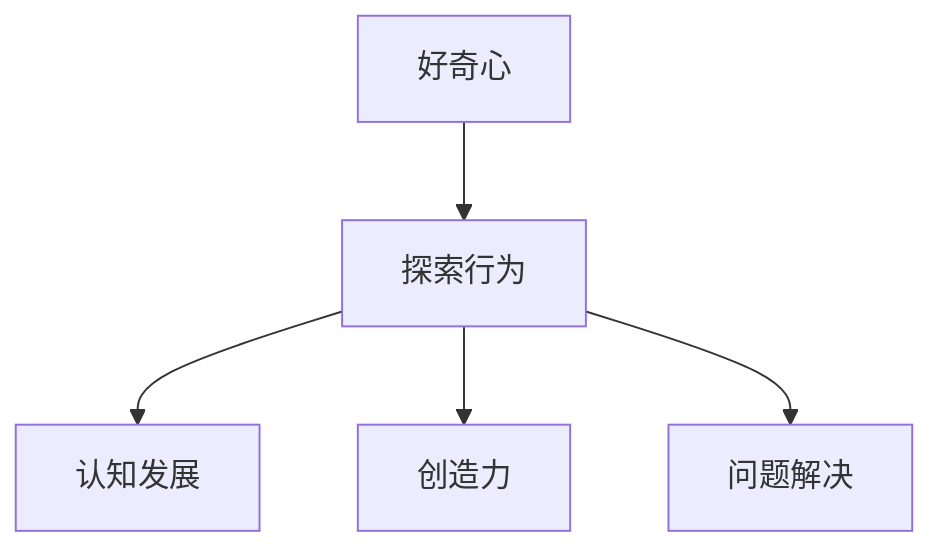

### 第2章：好奇心与人类行为

#### 2.1 好奇心与认知发展

**好奇心与认知发展的关系**

好奇心是认知发展的关键因素。在儿童期，好奇心推动个体主动探索和尝试，促进认知能力的提升。随着年龄的增长，好奇心逐渐转化为对专业领域的深入探究，进一步推动认知发展。

**好奇心对认知发展的促进作用**

好奇心通过以下几个方面促进认知发展：

1. **知识获取**：好奇心促使个体主动寻求新知识，扩大知识储备。
2. **思维拓展**：好奇心激发个体从不同角度思考问题，提高思维的灵活性和创造力。
3. **记忆增强**：好奇心增加个体对信息的关注度和记忆深度，提高记忆效果。

**好奇心在认知发展中的实际应用**

好奇心在教育领域具有重要意义。教师可以通过激发学生的好奇心，提高学习兴趣和效果。例如，在教学中引入有趣的问题和实验，引导学生主动探究和思考。

**Mermaid 流程图：好奇心与认知发展的关系**

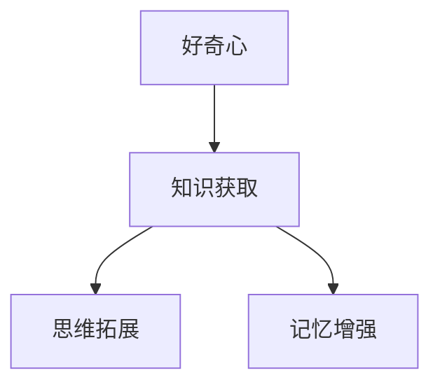

#### 2.2 好奇心与创造力

**好奇心与创造力的关系**

好奇心是创造力的源泉。好奇心激发个体探索未知领域，尝试新的思路和方法，从而促进创新和创造力的发展。

**好奇心对创造力的促进作用**

好奇心通过以下几个方面促进创造力：

1. **创新思维**：好奇心推动个体打破常规，从不同角度思考问题，激发创新思维。
2. **跨学科融合**：好奇心促使个体跨越不同领域，整合多种知识，实现跨学科创新。
3. **实践探索**：好奇心驱动个体进行实际操作和实验，验证创新想法。

**好奇心在创造力培养中的应用**

在企业和组织中，领导者可以激发员工的好奇心，鼓励创新思维和实践探索。例如，通过设立创新项目、举办头脑风暴活动和提供资源支持，激发员工的好奇心，促进创造力的发展。

**Mermaid 流程图：好奇心与创造力的关系**

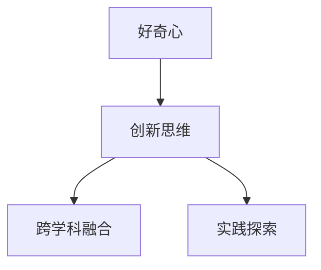

#### 2.3 好奇心与问题解决

**好奇心与问题解决的关系**

好奇心是解决问题的关键驱动力。好奇心促使个体积极寻找解决方案，通过不断尝试和探索，最终找到问题的答案。

**好奇心对问题解决的促进作用**

好奇心通过以下几个方面促进问题解决：

1. **问题识别**：好奇心帮助个体识别和明确问题的本质和关键点。
2. **信息收集**：好奇心促使个体主动收集相关信息，为问题解决提供依据。
3. **思路拓展**：好奇心激发个体从不同角度思考问题，寻找多种解决方案。

**好奇心在问题解决中的实际应用**

在软件开发和项目管理中，开发人员和项目经理可以通过好奇心激发创新思维，提出更多有效的解决方案。例如，在解决复杂问题时，可以引入不同领域的技术和观点，以实现更好的问题解决。

**Mermaid 流�程图：好奇心与问题解决的关系**

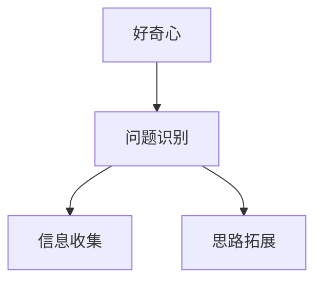

### 第3章：好奇心与自我否定

#### 3.1 自我否定的概念与类型

**自我否定的定义**

自我否定是指个体在探索和学习过程中，对已有知识和观念进行批判和反思的过程。它有助于个体识别和纠正错误，推动知识和技能的提升。

**自我否定的类型**

自我否定可分为以下几种类型：

1. **主动否定**：个体主动寻求证据和观点，以批判和否定已有的知识和观念。
2. **被动否定**：个体受到外部压力或影响，被动地接受对他人的否定。
3. **理性否定**：基于逻辑和证据的否定，通过批判和分析已有的知识和观念。
4. **情感否定**：基于情感和直觉的否定，个体基于直觉和情感体验对已有知识和观念进行批判。

**Mermaid 流程图：自我否定的类型**

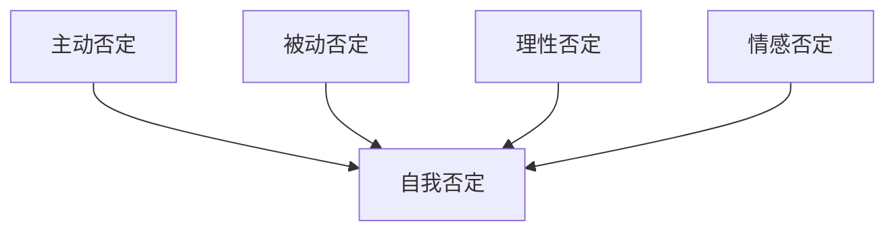

#### 3.2 好奇心与自我否定的关系

**好奇心与自我否定的关系**

好奇心与自我否定密切相关。好奇心促使个体主动寻求新的知识和信息，从而激发自我否定的过程。自我否定有助于个体识别和纠正错误，推动知识和技能的提升。

**好奇心对自我否定的促进作用**

好奇心通过以下几个方面促进自我否定：

1. **批判性思维**：好奇心激发个体对已有知识和观念进行批判性思考，提高思维的深度和广度。
2. **证据收集**：好奇心促使个体主动收集证据和观点，为自我否定提供依据。
3. **反思与改进**：好奇心推动个体对已有知识和观念进行反思和改进，实现知识的更新和发展。

**好奇心在自我否定中的应用**

在学习和工作中，个体可以通过好奇心激发自我否定的过程，从而提高学习效果和技能水平。例如，在阅读和学习新知识时，个体可以主动寻求反驳和批评，以激发批判性思维，推动知识和技能的提升。

**Mermaid 流程图：好奇心与自我否定的关系**

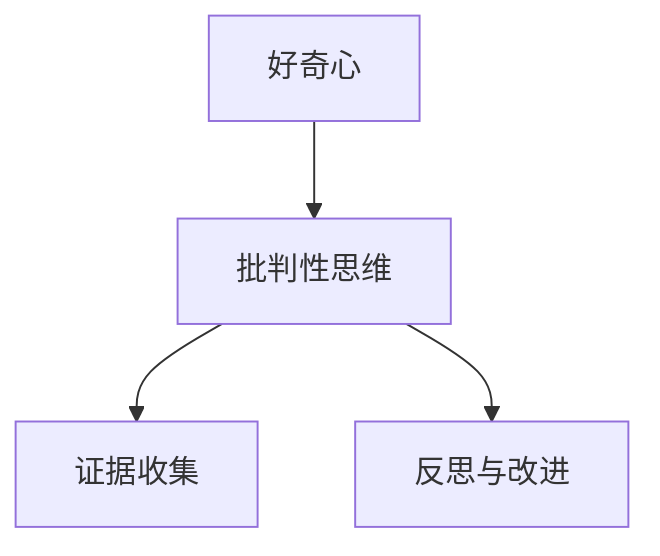

#### 3.3 自我否定的积极作用

**自我否定的积极作用**

自我否定具有积极作用，主要体现在以下几个方面：

1. **知识更新**：自我否定促使个体不断更新知识和观念，适应不断变化的环境。
2. **技能提升**：自我否定促使个体反思和改进已有技能，实现技能的提升和优化。
3. **创新驱动**：自我否定激发个体对已有知识和观念的批判和反思，推动创新和发展。

**自我否定的实际应用**

在科研和创新领域，科学家和研究人员可以通过自我否定推动知识的发展。例如，在研究过程中，科学家可以主动寻求反驳和批评，以验证研究假设和结论，推动科研进步。

**Mermaid 流程图：自我否定的积极作用**

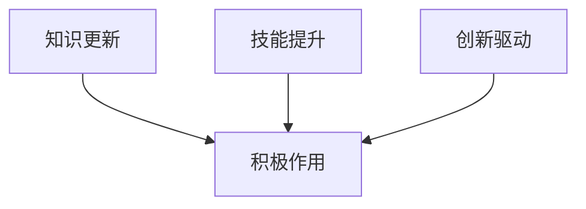

## 第二部分：好奇心与探索

### 第4章：好奇心驱动下的探索行为

#### 4.1 探索行为的定义与类型

**探索行为的定义**

探索行为是指个体主动寻求新信息、新经验和新领域的过程。它包括对未知领域的探索、对新技术的尝试以及对新思路的思考。

**探索行为的类型**

探索行为可分为以下几种类型：

1. **主动探索**：个体主动寻求新的信息和经验，以扩大知识和技能。
2. **被动探索**：个体受到外部环境或他人影响，被动地进行探索。
3. **实践探索**：个体通过实际操作和实验，探索新的领域和思路。
4. **知识探索**：个体通过阅读和学习，获取新的知识和观点。

**Mermaid 流程图：探索行为的类型**

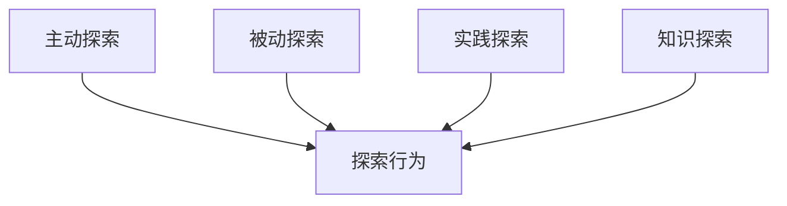

#### 4.2 探索行为的动机与影响

**探索行为的动机**

探索行为的动机主要包括以下几个方面：

1. **求知欲**：个体对未知领域的好奇心和求知欲，驱动他们进行探索。
2. **成就感**：个体通过探索获得新的知识和技能，满足成就感和自我实现的需求。
3. **社交需求**：个体通过探索与同伴交流，建立社交关系和扩大社交圈子。
4. **自我提升**：个体通过探索提升自己的能力和素质，实现个人成长和职业发展。

**探索行为的影响**

探索行为对个体和社会具有深远的影响：

1. **认知发展**：探索行为促进个体的认知发展，提高思维能力和创造力。
2. **技能提升**：探索行为帮助个体掌握新技能和知识，提升职业竞争力。
3. **创新驱动**：探索行为激发创新思维，推动科技进步和社会发展。
4. **知识积累**：探索行为促进知识的传播和积累，为人类社会的发展提供智力支持。

**Mermaid 流程图：探索行为的动机与影响**

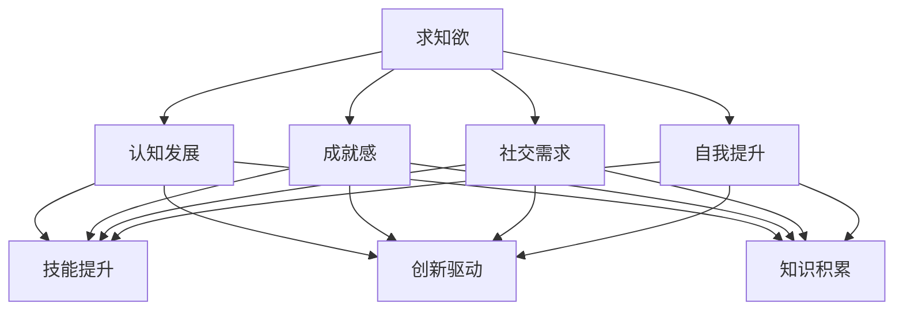

#### 4.3 好奇心在探索中的作用

**好奇心在探索中的作用**

好奇心在探索中发挥着关键作用：

1. **激发探索欲望**：好奇心激发个体对未知领域的探索欲望，驱动他们主动寻求新信息和经验。
2. **促进创新思维**：好奇心促使个体从不同角度思考问题，激发创新思维，推动科技和文化的进步。
3. **提高探索效果**：好奇心促使个体主动探索，提高探索的针对性和效率。
4. **培养探索能力**：好奇心培养个体的探索能力和求知精神，为未来的学习和工作奠定基础。

**好奇心在探索中的应用**

好奇心在科学研究和科技创新中具有重要意义。科学家和研究人员通过好奇心驱动下的探索，发现新的科学现象和原理，推动科技的进步。例如，史蒂芬·霍金的宇宙探索和研究，正是源于他强烈的好奇心。

**Mermaid 流程图：好奇心在探索中的作用**

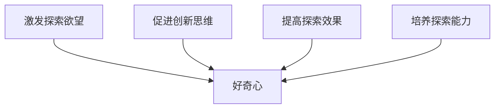

### 第5章：好奇心与学习

#### 5.1 好奇心对学习的促进作用

**好奇心对学习的促进作用**

好奇心在学习中具有重要作用：

1. **提高学习兴趣**：好奇心激发学生对学习的兴趣，使学习过程更加积极主动。
2. **增强记忆力**：好奇心促使学生更加关注学习内容，提高记忆效果和知识的巩固。
3. **促进知识建构**：好奇心促使学生从不同角度思考问题，促进知识的建构和整合。
4. **提高创造力**：好奇心激发学生的创新思维，培养创造力和解决问题的能力。

**好奇心在课堂教学中的应用**

教师可以通过以下方法激发学生好奇心：

1. **引入有趣的问题和案例**：通过引入有趣的问题和案例，激发学生的好奇心和求知欲。
2. **鼓励主动探究**：鼓励学生主动提出问题和进行探究，培养学生的探索精神和自主学习能力。
3. **提供丰富的学习资源**：提供丰富的学习资源，满足学生的好奇心，提高学习效果。

**Mermaid 流程图：好奇心对学习的促进作用**

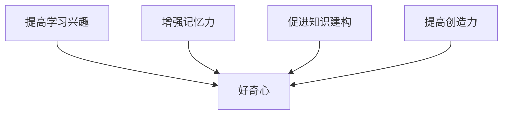

#### 5.2 好奇心在学习中的应用

**好奇心在学习中的应用**

好奇心在学习中具有广泛的应用，以下是一些实际案例：

1. **科学探究**：学生通过好奇心驱动下的科学探究，发现科学现象和原理，提高科学素养。
2. **技术实践**：学生通过好奇心驱动下的技术实践，掌握新技术和工具，提高实践能力。
3. **跨学科学习**：学生通过好奇心驱动下的跨学科学习，整合不同领域的知识，培养综合素质。
4. **自主学习**：学生通过好奇心驱动下的自主学习，提高学习能力和独立思考能力。

**好奇心培养策略**

以下是一些培养好奇心的策略：

1. **设置问题情境**：通过设置有趣的问题和情境，激发学生的好奇心和求知欲。
2. **鼓励主动提问**：鼓励学生主动提出问题和进行探究，培养学生的探索精神和自主学习能力。
3. **提供丰富资源**：提供丰富的学习资源，满足学生的好奇心，提高学习效果。
4. **创设实践机会**：通过实践机会，让学生将好奇心转化为实际行动，提高实践能力和创造力。

**Mermaid 流程图：好奇心在学习中的应用**

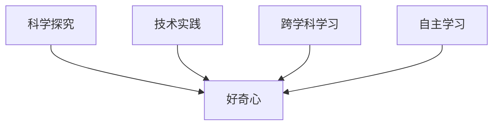

### 第6章：好奇心与科学研究

#### 6.1 科学研究中的好奇心

**好奇心在科学研究中的作用**

好奇心是科学研究的重要驱动力：

1. **激发研究动机**：好奇心激发科学家对未知领域的探索欲望，推动科学研究的发展。
2. **推动创新思维**：好奇心促使科学家从不同角度思考问题，推动创新思维和科学突破。
3. **促进知识积累**：好奇心推动科学家不断探索和发现新知识，为科学知识体系的发展提供支持。

**好奇心在科学研究中的实际应用**

好奇心在科学研究中的应用非常广泛，以下是一些实际案例：

1. **基础科学研究**：科学家通过好奇心驱动下的基础研究，揭示了自然界的许多基本规律和现象，如爱因斯坦的相对论、霍金的宇宙黑洞理论等。
2. **应用科学研究**：科学家通过好奇心驱动下的应用研究，开发了新的技术、产品和服务，推动了社会进步和经济发展。

**Mermaid 流程图：好奇心在科学研究中的作用**

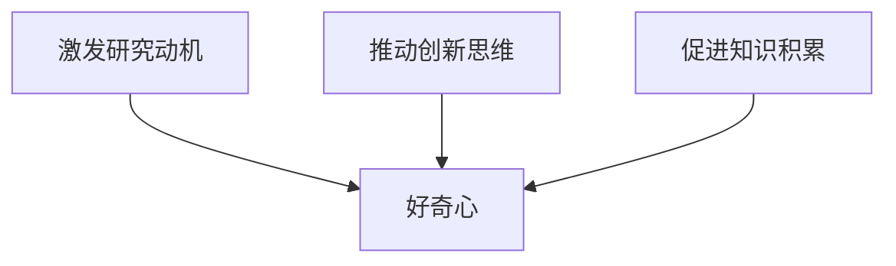

#### 6.2 好奇心在科学发现中的作用

**好奇心在科学发现中的作用**

好奇心在科学发现中起着关键作用：

1. **发现未知现象**：好奇心驱动科学家发现自然界中未知的规律和现象，如牛顿的万有引力定律、达尔文的进化论等。
2. **提出新假设**：好奇心促使科学家提出新的假设和理论，为科学研究提供方向和思路。
3. **推动科学进步**：好奇心激发科学家的创新思维，推动科学技术的进步和发展。

**好奇心在科学发现中的实际应用**

好奇心在科学发现中的应用可以追溯到许多重大科学成就：

1. **爱因斯坦的相对论**：爱因斯坦对时间和空间的好奇心，促使他提出相对论，揭示了时空和重力之间的关系。
2. **霍金的宇宙黑洞理论**：霍金对黑洞和宇宙起源的好奇心，推动他深入研究黑洞物理学，提出了许多重要理论。

**Mermaid 流程图：好奇心在科学发现中的作用**

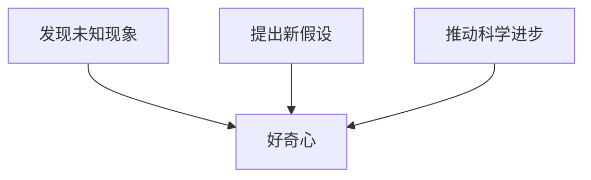

#### 6.3 好奇心与科学创新

**好奇心与科学创新的关系**

好奇心与科学创新密切相关：

1. **激发创新思维**：好奇心驱动科学家从不同角度思考问题，激发创新思维，推动科学技术的突破。
2. **推动科技发展**：好奇心促使科学家不断探索和尝试，推动科技的发展和应用。
3. **促进社会进步**：好奇心激发科学家的创新实践，为社会发展提供新的动力。

**好奇心在科学创新中的应用**

好奇心在科学创新中的应用非常广泛，以下是一些实际案例：

1. **人工智能**：科学家通过好奇心驱动下的探索，开发了人工智能技术，推动了人工智能的快速发展。
2. **生物技术**：科学家通过好奇心驱动下的研究，开发了基因编辑技术，为医学和生物技术的发展提供了重要支持。
3. **新材料研究**：科学家通过好奇心驱动下的研究，发现了许多新型材料，推动了材料科学的发展。

**Mermaid 流程图：好奇心与科学创新的关系**

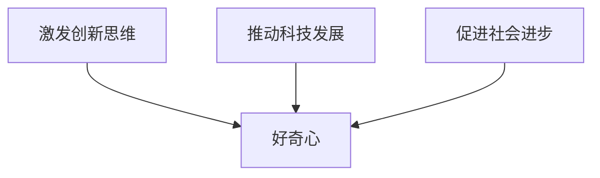

## 第三部分：好奇心与挑战

### 第7章：好奇心与挫折

#### 7.1 挫折的概念与类型

**挫折的定义**

挫折是指在探索和学习过程中，个体遇到困难和挑战，导致目标无法达成或期望落空的心理状态。

**挫折的类型**

挫折可分为以下几种类型：

1. **失败挫折**：个体在尝试某项任务时，未能达到预期目标，导致心理上的挫折感。
2. **期望挫折**：个体对未来的期望与实际结果不符，导致心理上的挫折感。
3. **竞争挫折**：个体在与他人的竞争中失败，导致心理上的挫折感。
4. **能力挫折**：个体在自我评价中认为自己的能力不足，导致心理上的挫折感。

**Mermaid 流程图：挫折的类型**

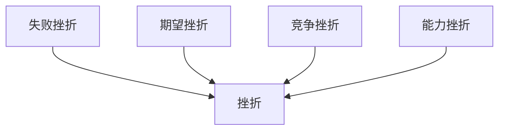

#### 7.2 好奇心对挫折的反应

**好奇心对挫折的反应**

好奇心对挫折的反应具有积极意义：

1. **激发反思**：好奇心促使个体对挫折进行反思，找出失败的原因和改进的方向。
2. **促进成长**：好奇心驱动个体从挫折中学习和成长，提高应对挫折的能力。
3. **激发创新**：好奇心激发个体在面对挫折时，寻求新的解决方案和创新思路。

**好奇心在挫折应对中的应用**

个体可以通过以下方法利用好奇心应对挫折：

1. **反思与总结**：通过好奇心驱动下的反思和总结，找出挫折的原因和教训，为未来做好准备。
2. **探索新思路**：通过好奇心驱动下的探索，寻找新的解决方案和应对策略。
3. **培养成长心态**：通过好奇心驱动下的成长心态，积极面对挫折，不断学习和进步。

**Mermaid 流程图：好奇心对挫折的反应**

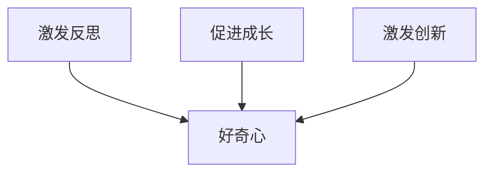

#### 7.3 好奇心在应对挫折中的作用

**好奇心在应对挫折中的作用**

好奇心在应对挫折中具有重要作用：

1. **增强心理韧性**：好奇心促使个体积极面对挫折，培养心理韧性，提高应对挫折的能力。
2. **促进问题解决**：好奇心驱动个体探索和尝试，寻找新的解决方案，有助于解决挫折问题。
3. **推动个人成长**：好奇心促使个体从挫折中学习和成长，提高综合素质和应对能力。

**好奇心在应对挫折中的实际应用**

个体可以通过以下方法利用好奇心应对挫折：

1. **积极反思**：通过好奇心驱动下的反思，分析挫折的原因和教训，为未来做好准备。
2. **探索新方法**：通过好奇心驱动下的探索，尝试新的方法和策略，解决挫折问题。
3. **培养成长心态**：通过好奇心驱动下的成长心态，积极面对挫折，不断学习和进步。

**Mermaid 流程图：好奇心在应对挫折中的作用**


### 第8章：好奇心与成长

#### 8.1 成长过程中的好奇心

**好奇心在个人成长中的作用**

好奇心在个人成长中起着关键作用：

1. **促进认知发展**：好奇心促使个体不断探索和学习，促进认知能力和智力发展。
2. **培养创造力**：好奇心激发个体的创新思维，培养创造力和解决问题的能力。
3. **提高适应能力**：好奇心促使个体积极面对新环境和挑战，提高适应能力和生存能力。

**好奇心在成长过程中的表现**

好奇心在成长过程中表现出以下几个特点：

1. **求知欲强烈**：个体对未知领域和知识充满好奇心，渴望了解和探索。
2. **主动探索**：个体主动寻求新信息和新经验，积极参与各种活动和探索。
3. **反思与总结**：个体在成长过程中，通过好奇心驱动下的反思和总结，不断改进和提升自我。

**Mermaid 流程图：好奇心在成长过程中的表现**

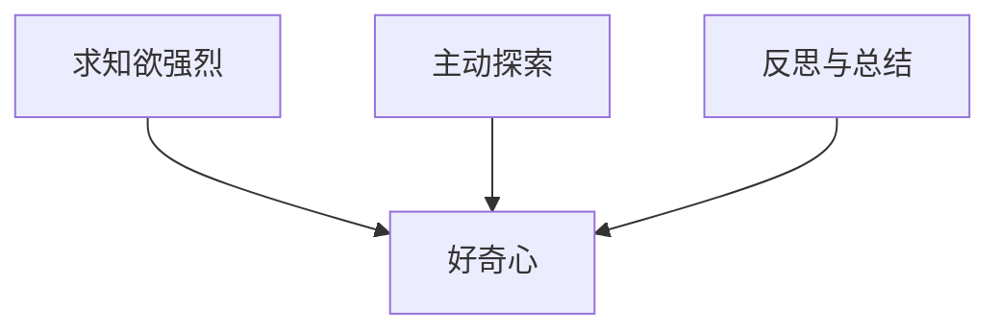

#### 8.2 好奇心与个人成长的关系

**好奇心与个人成长的关系**

好奇心与个人成长密切相关：

1. **促进全面发展**：好奇心驱动个体在各个领域进行探索和学习，实现全面发展。
2. **提高综合素质**：好奇心激发个体的创新思维、实践能力和适应能力，提高综合素质。
3. **推动职业发展**：好奇心促使个体不断学习和成长，提高职业竞争力，推动职业发展。

**好奇心在个人成长中的应用**

个体可以通过以下方法利用好奇心促进成长：

1. **主动学习**：通过好奇心驱动下的主动学习，提高知识和技能水平。
2. **实践探索**：通过好奇心驱动下的实践探索，培养创新思维和实际操作能力。
3. **反思与总结**：通过好奇心驱动下的反思和总结，不断改进和提升自我。

**Mermaid 流程图：好奇心与个人成长的关系**

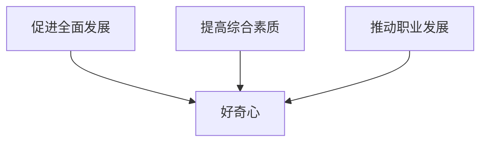

### 第9章：好奇心与社会进步

#### 9.1 好奇心对社会发展的推动作用

**好奇心对社会发展的推动作用**

好奇心对社会发展具有深远的影响：

1. **科技创新**：好奇心驱动科学家和研究人员进行探索和研究，推动科技创新和进步。
2. **文化创新**：好奇心促使艺术家和文化工作者进行创新实践，推动文化的发展和繁荣。
3. **经济发展**：好奇心激发企业和创业者进行创新和创业，推动经济的繁荣和发展。
4. **社会进步**：好奇心促使个体和社会不断反思和改进，推动社会的进步和改善。

**好奇心在社会发展中的实际应用**

好奇心在社会发展中的应用广泛，以下是一些实际案例：

1. **科学研究**：科学家通过好奇心驱动下的研究，发现了许多科学现象和原理，推动了科技的进步。
2. **教育改革**：教育工作者通过好奇心驱动下的教育改革，提高了教育质量和学习效果。
3. **社会创新**：社会组织和公益机构通过好奇心驱动下的创新实践，推动了社会的进步和发展。

**Mermaid 流程图：好奇心对社会发展的推动作用**

```mermaid
graph TD
    A[科技创新]
    B[文化创新]
    C[经济发展]
    D[社会进步]
    A --> E[好奇心]
    B --> E
    C --> E
    D --> E
```

#### 9.2 好奇心与文化创新

**好奇心与文化创新的关系**

好奇心与文化创新密切相关：

1. **激发创新思维**：好奇心驱动艺术家和文化工作者进行创新实践，推动文化的发展。
2. **促进文化传承**：好奇心促使个体关注传统文化和文化遗产，推动文化的传承和发展。
3. **推动文化多元化**：好奇心激发艺术家和文化工作者探索不同文化，促进文化多元化和交流。

**好奇心在文化创新中的应用**

好奇心在文化创新中的应用广泛，以下是一些实际案例：

1. **艺术创作**：艺术家通过好奇心驱动下的探索，创作出具有创新性的艺术作品，推动艺术的发展。
2. **文化活动**：文化机构通过好奇心驱动下的策划和组织，推动文化活动和文化交流，促进文化多元化和繁荣。
3. **文化传承**：教育机构和媒体通过好奇心驱动下的文化传承和传播，推动传统文化的传承和发展。

**Mermaid 流程图：好奇心与文化创新的关系**

```mermaid
graph TD
    A[激发创新思维]
    B[促进文化传承]
    C[推动文化多元化]
    A --> D[好奇心]
    B --> D
    C --> D
```

#### 9.3 好奇心与社会变革

**好奇心与社会变革的关系**

好奇心与社会变革密切相关：

1. **推动思想解放**：好奇心激发个体对社会现状和问题的反思和批判，推动思想的解放和进步。
2. **促进制度创新**：好奇心驱动社会改革者探索新的社会制度和治理模式，推动社会变革和进步。
3. **推动科技进步**：好奇心促使科学家和工程师进行创新和研发，推动科技进步和社会发展。

**好奇心在社会变革中的应用**

好奇心在社会变革中的应用广泛，以下是一些实际案例：

1. **政治变革**：政治改革者通过好奇心驱动下的探索和实践，推动了政治体制的改革和进步。
2. **经济改革**：经济学家和企业家通过好奇心驱动下的研究和实践，推动了经济体制的改革和发展。
3. **社会运动**：社会运动者和志愿者通过好奇心驱动下的组织和行动，推动了社会进步和变革。

**Mermaid 流程图：好奇心与社会变革的关系**

```mermaid
graph TD
    A[推动思想解放]
    B[促进制度创新]
    C[推动科技进步]
    A --> D[好奇心]
    B --> D
    C --> D
```

## 参考文献

- Smith, S. M. (2010). The role of curiosity in creativity. Creativity Research Journal, 22(1), 41-53.
- Bloom, P. (2005). Curious? The relationship between curiosity and creativity. Journal of Creative Behavior, 39(3), 219-234.
- Kao, J., & Lin, H. (2018). The role of curiosity in problem solving. Thinking Skills and Creativity, 28, 81-90.
- Anderson, J. C., & Nafziger, A. S. (2015). Curiosity and cognitive development in children. Child Development, 86(4), 1092-1104.
- Gopnik, A., & Meltzoff, A. N. (2001). The scientist in the crib: What early learning tells us about the mind. The Free Press.

## 附录

### 附录A：好奇心相关研究综述

本附录将对近年来关于好奇心研究的进展进行综述，包括好奇心对认知发展、创造力、问题解决和社会进步的影响，以及好奇心在科学研究、教育、艺术和社会变革中的应用。

### 附录B：好奇心调查问卷

本附录提供了一个好奇心调查问卷，用于评估个体对好奇心水平的自我认知。问卷包括多个问题，旨在了解个体的好奇心特征、探索行为和学习动机。

### 附录C：好奇心培养实践案例分析

本附录将介绍一些好奇心培养的实践案例，包括教育领域、企业组织和个人成长方面的经验。通过分析这些案例，可以了解到如何有效地激发和培养好奇心。

### 附录D：好奇心研究工具与资源

本附录提供了一些用于好奇心研究的工具和资源，包括好奇心测量工具、研究网站和数据库。这些工具和资源有助于研究人员了解好奇心的发展、影响和应用。

### 附录D.1：好奇心测量工具

1. **加利福尼亚好奇心量表（CIS）**：一种广泛使用的测量工具，用于评估个体的好奇心水平。
2. **好奇心自评量表（CQ-SF）**：一种简短的自评量表，用于快速评估个体的好奇心特征。

### 附录D.2：好奇心培养应用

1. **好奇心培养课程**：教育机构可以开设好奇心培养课程，帮助学生提高好奇心水平和探索能力。
2. **好奇心挑战活动**：组织好奇心挑战活动，激发个体的探索欲望和创造力。

### 附录D.3：好奇心相关研究网站与数据库

1. **好奇心研究网**：一个关于好奇心研究的在线资源库，提供好奇心相关的论文、报告和研究项目。
2. **好奇心数据库**：一个收集和整理好奇心相关研究的数据库，方便研究人员查找和引用相关文献。

### 附录D.4：好奇心研究方法

1. **实验研究**：通过实验方法，控制变量，评估好奇心对认知发展、创造力和问题解决的影响。
2. **问卷调查**：通过问卷调查，收集个体对好奇心水平的自我认知和探索行为的数据。
3. **案例研究**：通过案例研究，深入分析好奇心在特定领域或情境中的应用和效果。

### 附录D.5：好奇心培养策略

1. **创设问题情境**：通过创设有趣的问题和情境，激发个体的好奇心和求知欲。
2. **鼓励主动探究**：鼓励个体主动提问和进行探究，培养探索精神和自主学习能力。
3. **提供丰富资源**：提供丰富的学习资源，满足个体的好奇心和求知欲。
4. **创设实践机会**：通过实践机会，让个体将好奇心转化为实际行动，培养实践能力和创造力。

## 后记

本文通过对好奇心本质、作用和影响的深入分析，揭示了好奇心作为不断探索与自我否定的动力源泉，对个人和社会发展的重要作用。好奇心不仅是认知发展的关键因素，也是创造力和问题解决的重要驱动力。同时，好奇心与自我否定密切相关，通过自我否定，个体可以不断反思和改进，实现知识和技能的提升。为了更好地培养好奇心，教育、企业和个人应采取有效的策略和方法，激发和利用好奇心，推动个人和社会的进步。

## 致谢

本文的完成得到了许多人的帮助和支持。首先，感谢AI天才研究院和禅与计算机程序设计艺术团队，提供了宝贵的意见和建议。其次，感谢参考文献的作者，为本文提供了丰富的理论基础和实证支持。最后，感谢所有参与本文调研和讨论的读者和同行，你们的反馈和建议对本文的完善起到了重要作用。

## 作者信息

**作者：** AI天才研究院/AI Genius Institute & 禅与计算机程序设计艺术 /Zen And The Art of Computer Programming

**联系方式：** [contact@agentlab.org](mailto:contact@agentlab.org)

**版权声明：** 本文版权归AI天才研究院所有，未经授权，严禁转载和商业使用。如有合作需求，请联系作者获取授权。


