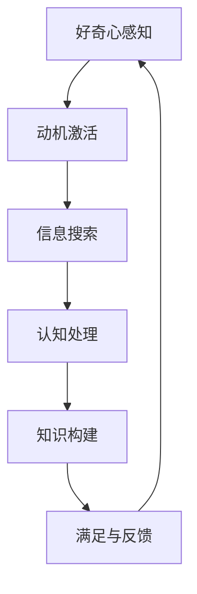

                 

### 《好奇心：创新与发现的源泉》

好奇心，人类天性中最强大的驱动力之一，自古以来就在科学、艺术、技术和日常生活中发挥着不可替代的作用。它不仅驱动着人类对未知的探索，也是推动文明进步的源泉。从古埃及的金字塔到现代的互联网，从莎士比亚的戏剧到霍金的宇宙理论，好奇心贯穿于人类历史的每一个角落，每一次突破。

本篇博客文章将以“好奇心：创新与发现的源泉”为标题，系统地探讨好奇心在多个领域的深远影响。我们将从心理学、技术创新、艺术创作、现代社会的挑战与机遇等多个角度进行深入分析，结合具体的历史案例和现代实践，探讨好奇心如何激发人类的创造力，推动科学技术的进步，以及如何在现代社会中培养和维持这种珍贵的品质。

通过本文，我们希望读者能够更深刻地理解好奇心的本质，认识到它不仅仅是一种个性特征，更是一种可以培养和提升的能力。同时，我们也希望能够激发更多人对探索未知的兴趣，鼓励大家在日常工作和生活中保持好奇心，不断追求新的知识和创新。

> **关键词**：好奇心、创新、科学发现、技术创新、艺术创作、现代社会、心理学、教育

> **摘要**：本文旨在探讨好奇心在各个领域的作用和影响。通过分析好奇心在心理学中的基础、在科技和艺术领域的体现，以及现代社会中的挑战和机遇，本文展示了好奇心是如何驱动创新和发现的关键因素。本文还结合具体案例，探讨了如何在教育和个人成长中培养和维护好奇心。

## 第一部分：引言

### 1.1 背景介绍

好奇心，这个看似简单的人类特质，实际上蕴含着巨大的能量。它不仅仅是对未知事物的探索欲望，更是人类智慧和创造力的源泉。从远古时代开始，好奇心便伴随着人类的发展。在石器时代，人类因为好奇心而学会了使用火，探索了世界；在工业革命时期，好奇心驱动了机器的发明和运用，改变了整个世界的面貌。

### 1.1.1 好奇心的定义与重要性

好奇心可以被定义为一种强烈的探索欲望，驱使人们主动寻求新信息、新知识和新经验。它不仅是对外界事物的关注，更是对内在自我认知的探索。好奇心在人类历史中扮演了重要角色，它推动了科学技术的进步，促进了人类文明的繁荣。

### 1.1.2 好奇心在人类历史中的作用

在科学领域，好奇心是推动科学家们不断探索和发现的重要动力。伽利略因好奇心而观察星空，提出了日心说；牛顿因好奇心而思考苹果为何落地，发现了万有引力定律。在艺术领域，好奇心激发了许多伟大艺术家的创作灵感，达芬奇通过好奇心创造了许多令人惊叹的艺术作品，如《蒙娜丽莎》和《最后的晚餐》。

### 1.2 好奇心与科学发现

好奇心是科学发现的驱动力，科学进步离不开好奇心的推动。在科学史上，许多重大的科学发现都源自科学家们的好奇心。以下是一些著名的例子：

- **伽利略**：伽利略对天文现象的好奇心使他成为了现代天文学的奠基人。他使用望远镜观察星空，发现了木星的四大卫星和月球表面地形，这些发现挑战了当时的地心说观点。

- **爱因斯坦**：爱因斯坦因对物理现象的好奇心而提出了相对论，这一理论彻底改变了人类对宇宙的认识。

- **弗莱明**：弗莱明因对青霉素的好奇心而发现了这种可以杀死细菌的神奇物质，为现代医学带来了革命性的变化。

### 1.2.1 好奇心推动科学进步

好奇心是科学进步的驱动力，它激励科学家们不断探索未知，挑战现有的理论，从而推动科学技术的不断发展。例如，在20世纪初，人们对原子结构的好奇心促使物理学家们提出了量子力学，这一理论颠覆了经典物理学的观念。

### 1.2.2 历史上的好奇心案例

历史上有很多因好奇心而取得重大成就的案例。例如，哥白尼因对天体运动的好奇心提出了日心说，这一理论改变了人类对宇宙的认识。另外，瓦特因对蒸汽机的好奇心而发明了改良型蒸汽机，推动了工业革命的到来。

### 1.3 结论

好奇心是创新与发现的源泉，它在人类历史中扮演着重要角色。通过分析好奇心在科学和艺术领域的体现，我们可以看到好奇心如何驱动人类不断探索未知、挑战传统，从而推动社会的进步。在接下来的部分，我们将进一步探讨好奇心在心理学和现代社会中的作用。

## 第二部分：好奇心与心理学

好奇心作为人类天性的一部分，其心理学基础和影响不容忽视。在心理学中，好奇心被视为一种复杂的心理过程，涉及多个理论模型和动机机制。通过了解这些理论，我们可以更好地理解好奇心如何影响我们的认知发展、创造力和学习过程。

### 2.1 好奇心的心理学基础

好奇心在心理学中的研究已经取得了显著的进展。多个理论模型试图解释好奇心的本质和作用，其中较为知名的有：

- **驱力降低理论（Drive Reduction Theory）**：该理论认为好奇心是一种内在的驱动力，当人们感知到不确定性或未知时，这种驱动力会被激活，驱使个体寻求信息以降低不确定性。

- **探究行为理论（Intrusion Theory）**：该理论认为好奇心是一种对信息的自然追求，当人们遇到新奇或复杂的信息时，好奇心会促使他们去探究和了解。

- **认知动机理论（Cognitive Motivation Theory）**：该理论强调好奇心作为一种认知动机，个体为了获得知识和理解而主动寻求信息。

### 2.1.1 好奇心的理论模型

不同理论模型从不同角度解释了好奇心的形成和作用：

- **驱力降低理论**：根据该理论，好奇心可以被看作是一种减少心理紧张的状态，当人们遇到新奇或未知的信息时，好奇心被激活，个体通过获取新信息来缓解这种紧张。

- **探究行为理论**：该理论强调好奇心是一种内在的驱动力，促使人们主动探索和了解新事物。这种驱动力源于对未知的渴望和对知识的好奇。

- **认知动机理论**：从认知角度出发，好奇心被视为一种寻求知识和理解的内在动机。个体通过探索和发现来满足自己的认知需求。

### 2.1.2 好奇心的动机与过程

好奇心不仅仅是一种简单的心理状态，它涉及到一系列复杂的动机和认知过程。以下是对好奇心动机与过程的详细分析：

- **动机来源**：好奇心通常源于对未知和复杂性的感知。当个体遇到新奇或未知的事物时，好奇心被激活，驱使他们去探索和了解。

- **认知过程**：好奇心激发后，个体会进行一系列的认知活动，如信息搜索、思考、推理等，以获取新的知识和理解。

- **动机维持**：好奇心不仅仅是初期的驱动，它还需要通过持续的信息获取和认知活动来维持。这种持续的动机维持是好奇心能够推动认知发展的重要机制。

### 2.2 好奇心的心理影响

好奇心对个体的心理发展具有深远的影响。以下是其具体影响的详细分析：

- **认知发展**：好奇心是认知发展的关键因素。通过探索和发现新事物，个体能够扩展自己的知识领域，提高认知能力。

- **学习动机**：好奇心能够显著提高个体的学习动机。当个体对某个主题充满好奇心时，他们会更愿意投入时间和精力去学习和掌握相关知识。

- **创造力**：好奇心是创造力的源泉。通过探索和尝试新方法，个体能够激发创新思维，提出独特的解决方案。

### 2.2.1 好奇心与认知发展

好奇心与认知发展之间存在密切的联系。具体来说，好奇心对认知发展的促进作用体现在以下几个方面：

- **知识扩展**：好奇心驱使个体去探索和了解新知识，从而扩展自己的认知领域。这种知识的扩展有助于提高个体的认知能力。

- **思维灵活性**：好奇心能够激发个体的思维灵活性，促使他们在面对问题时能够从不同角度进行思考，提出创新的解决方案。

- **问题解决能力**：好奇心促使个体在面对问题时保持开放和探索的态度，从而提高问题解决能力。

### 2.2.2 好奇心与创造力

好奇心不仅影响认知发展，还对个体的创造力有着重要的影响。以下是好奇心如何促进创造力的详细分析：

- **探索未知的动力**：好奇心激发个体去探索未知的领域，这种探索行为往往能够带来新的发现和灵感。

- **思维拓展**：好奇心促使个体跳出传统的思维模式，尝试新的方法和思路，从而提高创造力。

- **跨学科融合**：好奇心能够促使个体将不同领域的知识进行整合，从而产生新的创新点。

### 2.3 培养好奇心

好奇心并非一种固定不变的特质，而是可以通过后天的培养和锻炼来提升。以下是如何在教育和个人成长中培养好奇心的具体策略：

- **教育环境**：在学校教育中，教师应创造一个充满好奇心的学习环境，鼓励学生提问和探索。例如，可以通过项目式学习、问题导向教学等方式激发学生的好奇心。

- **个人习惯**：个人可以通过阅读、尝试新事物、参加讲座和研讨会等方式培养好奇心。例如，每天阅读一篇科技文章或参加一次讲座，都可以帮助个体扩展知识面，激发好奇心。

- **社会支持**：家庭和社会的支持对于好奇心的发展至关重要。家长和教师应鼓励孩子提出问题、尝试新事物，并给予积极的反馈和支持。

### 2.3.1 教育中的好奇心培养

在教育中，好奇心的重要性得到了广泛的认可。以下是教育中培养好奇心的具体方法：

- **互动式教学**：通过互动式教学，如讨论、实验、项目合作等，激发学生的好奇心。

- **问题导向学习**：鼓励学生主动提出问题，并通过独立研究来解决问题，从而培养他们的好奇心。

- **跨学科学习**：通过跨学科的学习，学生可以从不同角度看待问题，激发好奇心。

### 2.3.2 个人成长中的好奇心培养

个人成长中的好奇心培养同样至关重要。以下是个人成长中培养好奇心的具体策略：

- **终身学习**：持续学习和更新知识是保持好奇心的关键。个人可以通过参加在线课程、阅读书籍、参加讲座等方式不断学习。

- **探索未知的领域**：尝试新的领域和兴趣爱好，可以激发好奇心，扩展知识面。

- **保持开放心态**：对新的观点和想法保持开放和接纳的态度，有助于培养好奇心。

### 2.4 结论

好奇心在心理学中扮演着重要的角色，它对个体的认知发展、创造力和学习动机具有深远的影响。通过理解好奇心的基础理论和培养策略，我们可以更好地激发和维持好奇心，从而推动个人的成长和社会的进步。在接下来的部分，我们将探讨好奇心在技术创新和创业精神中的作用。

## 第三部分：好奇心与技术创新

好奇心作为推动技术创新的关键因素，在科技发展中发挥了不可替代的作用。从计算机科学的崛起，到人工智能的飞速发展，无不依赖于人类的好奇心。好奇心不仅激发了科学家和工程师们的探索精神，还推动了科技的不断创新和进步。

### 3.1 好奇心在科技领域的影响

好奇心是科技发展的催化剂，它激发了无数科学家和工程师们对未知的探索和挑战。以下是一些因好奇心而推动科技进步的例子：

- **计算机科学的兴起**：计算机科学的创始人之一图灵，因对计算机制和智能的强烈好奇心，提出了图灵测试，这一概念成为现代人工智能的重要理论基础。

- **互联网的诞生**：互联网的先驱们，如蒂姆·伯纳斯-李，因对信息传播和连接世界的好奇心，开发了万维网，这一发明彻底改变了人类的信息获取和交流方式。

### 3.1.1 好奇心推动技术创新

好奇心是技术创新的强大驱动力，它促使科学家和工程师们不断探索新领域、挑战现有技术和观念。以下是好奇心如何推动技术创新的详细分析：

- **激发探索精神**：好奇心激发人们对未知领域的探索欲望，促使他们去研究新的科学问题和挑战。

- **挑战现状**：好奇心促使人们质疑现有技术和理论，寻找改进和创新的方法。例如，特斯拉的创始人埃隆·马斯克因对太空探索的好奇心，推动了太空旅游和可重复使用火箭技术的发展。

- **跨学科融合**：好奇心促使科学家和工程师们将不同领域的知识和技术进行整合，从而创造出新的技术和应用。例如，生物技术与信息技术结合，产生了生物信息学，这一新兴领域在医学和生物研究中发挥了重要作用。

### 3.1.2 历史上的科技好奇心案例

历史上，许多重大的科技突破都源自科学家们的好奇心。以下是一些因好奇心而取得重大科技成就的案例：

- **哥白尼**：哥白尼因对天体运动的好奇心，提出了日心说，这一理论彻底颠覆了当时的地心说观念，成为现代天文学的基石。

- **爱因斯坦**：爱因斯坦因对物理现象的好奇心，提出了狭义相对论和广义相对论，这些理论改变了人类对宇宙的理解。

- **弗莱明**：弗莱明因对青霉素的好奇心，发现了这种可以杀死细菌的神奇物质，为现代医学带来了革命性的变化。

### 3.2 好奇心与创业精神

好奇心不仅驱动着科学家的探索，也是创业精神的源泉。许多成功的创业者都是因为好奇心而走上了创业之路，他们通过不断地探索和尝试，推动了技术的进步和商业的发展。

- **史蒂夫·乔布斯**：乔布斯因对计算机和设计的强烈好奇心，创立了苹果公司，推动了个人电脑和智能手机的普及。

- **埃隆·马斯克**：马斯克因对太空探索和可持续能源的好奇心，创立了特斯拉和SpaceX，分别推动了电动汽车和太空旅游的发展。

### 3.2.1 创业者与好奇心

创业者往往对未知充满好奇，他们愿意冒险和尝试，寻找新的机会和市场。以下是好奇心在创业者中的作用：

- **发现新机会**：好奇心使创业者能够发现市场上的空白和潜在的机会，从而开发出新的产品和服务。

- **推动创新**：好奇心促使创业者不断探索新的技术和方法，从而推动产品和服务的创新。

- **适应变化**：好奇心使创业者能够快速适应市场的变化和技术的进步，抓住新的商业机遇。

### 3.2.2 好奇心在创业项目中的应用

好奇心在创业项目中起着至关重要的作用。以下是好奇心在创业项目中的应用策略：

- **市场调研**：通过好奇心，创业者可以深入调研市场需求，了解潜在用户的需求和痛点。

- **技术探索**：好奇心使创业者愿意投入时间和资源去探索新的技术领域，寻找技术创新点。

- **持续学习**：好奇心促使创业者不断学习和更新知识，保持对市场和技术的敏感度。

### 3.3 好奇心与可持续发展

好奇心不仅是推动技术创新和创业精神的关键，也是实现可持续发展的重要动力。通过好奇心，科学家、工程师和创业者可以探索新的解决方案，应对全球面临的挑战。

- **环境保护**：好奇心促使科学家和工程师们开发出新的环保技术和可再生能源，以减少对环境的破坏。

- **社会公平**：好奇心激发了对社会不平等问题的关注，推动了技术创新以解决社会问题，如教育和医疗资源的公平分配。

### 3.3.1 好奇心促进可持续创新

好奇心在可持续创新中发挥着重要作用。以下是好奇心如何促进可持续创新的详细分析：

- **问题识别**：好奇心使人们能够识别社会和环境中的问题，从而寻找创新的解决方案。

- **跨学科合作**：好奇心促使不同领域的专家和学者进行合作，共同探索可持续发展的新技术和方法。

- **持续改进**：好奇心推动人们对现有技术和方法进行持续改进，以实现更高效和可持续的解决方案。

### 3.3.2 好奇心在可持续发展实践中的应用

在可持续发展实践中，好奇心发挥着重要作用。以下是好奇心在可持续发展中的应用案例：

- **绿色能源**：科学家和工程师们因好奇心而不断探索新的绿色能源技术，如太阳能和风能，以减少对化石燃料的依赖。

- **智慧城市**：通过好奇心，城市规划和设计师们开发出智能交通系统和能源管理系统，提高城市的可持续性和效率。

### 3.4 结论

好奇心是技术创新和可持续发展的重要推动力。它激发了科学家和工程师们的探索精神，推动了新技术的诞生和商业的发展。同时，好奇心也是创业者发现新机会和实现可持续发展的关键。通过培养和维护好奇心，我们可以更好地应对未来的挑战，推动社会的持续进步。在接下来的部分，我们将探讨好奇心在艺术创作中的作用。

## 第四部分：好奇心与艺术

好奇心不仅是科学和技术的驱动力，也是艺术创作的重要源泉。艺术家们通过好奇心探索形式、主题和表达方式，创造出令人惊叹的艺术作品。好奇心在艺术创作中发挥着独特的角色，激发着艺术家的创造力，推动艺术的发展。

### 4.1 好奇心在艺术创作中的作用

好奇心在艺术创作中具有至关重要的作用。它激发了艺术家的探索精神，促使他们不断尝试新的技术和材料，探索新的表现形式。以下是好奇心在艺术创作中的作用：

- **探索新形式**：好奇心使艺术家们敢于打破传统，尝试新的艺术形式和风格。例如，立体派画家毕加索通过好奇心不断探索新的绘画技巧和表现形式，创作出了许多独具特色的画作。

- **探索新主题**：好奇心促使艺术家们关注社会、文化和人类经验的各个方面，从新的角度审视世界。例如，表现主义艺术家蒙克的作品《呐喊》就源自他对人类内心世界的强烈好奇心。

- **创新表达方式**：好奇心推动艺术家们寻找新的表达方式，通过独特的视角和技巧，传达深刻的情感和思想。例如，导演阿尔弗雷德·希区柯克通过好奇心不断探索电影叙事的新手法，创作出了许多紧张和悬疑的经典电影。

### 4.1.1 艺术家与好奇心

许多伟大的艺术家都是因好奇心而走上了艺术创作的道路。以下是一些因好奇心而取得卓越成就的艺术家：

- **达芬奇**：达芬奇是一位多才多艺的艺术家，他对自然和人类的好奇心驱使他在绘画、雕塑、建筑和科学等多个领域取得了卓越的成就。他的作品《蒙娜丽莎》和《最后的晚餐》至今仍被认为是人类艺术宝库中的珍品。

- **毕加索**：毕加索是20世纪最著名的艺术家之一，他对绘画形式和表现手法的强烈好奇心使他成为立体派艺术的奠基人。他通过不断实验和探索，创作出了许多风格迥异的作品，展示了艺术创作的无限可能性。

### 4.1.2 好奇心在艺术作品中的体现

好奇心在艺术作品中的体现多种多样，以下是一些具体案例：

- **《蒙娜丽莎》**：达芬奇的《蒙娜丽莎》不仅因其精湛的技艺而闻名，还因画中人物神秘微笑的体现而引发了许多猜测和讨论。达芬奇通过对人类表情和情感的好奇心，创作出了这幅充满神秘和魅力之作。

- **《呐喊》**：蒙克的《呐喊》通过对人类内心痛苦的描绘，表达了艺术家对人类存在状态的好奇心。这幅画以其强烈的情感表达和独特的风格，成为了表现主义艺术的代表作。

### 4.2 好奇心与欣赏艺术

好奇心不仅驱动着艺术创作，也影响着艺术欣赏。通过好奇心，观众能够更深入地理解艺术作品，从中获得更多的审美体验。以下是好奇心在艺术欣赏中的作用：

- **探索未知**：好奇心驱使观众去探索艺术作品背后的创作意图和艺术家的创作背景，从而获得更全面的理解。

- **思考与反思**：好奇心促使观众对艺术作品进行思考，反思其中所表达的情感和思想，提升审美体验。

- **跨文化理解**：好奇心使观众能够从不同文化的角度欣赏艺术，理解艺术作品中的文化差异和共性。

### 4.2.1 艺术欣赏中的好奇心

在艺术欣赏中，好奇心起到了关键的作用。以下是好奇心在艺术欣赏中的具体表现：

- **探索细节**：好奇心使观众在欣赏艺术作品时，注重细节的观察和分析，从而发现作品中的独特之处。

- **比较与对照**：好奇心促使观众将不同的艺术作品进行对比和对照，从而更深入地理解每一件作品的独特性。

- **参与与互动**：好奇心激发观众与艺术作品的互动，通过亲身体验和参与，获得更深刻的审美体验。

### 4.2.2 培养艺术欣赏中的好奇心

为了更好地欣赏艺术，观众可以通过以下方式培养好奇心：

- **广泛阅读**：通过阅读艺术史和艺术评论，了解艺术作品的历史背景和艺术家的创作意图。

- **参加展览**：亲自参观艺术展览，亲身体验艺术作品带来的感官刺激和情感共鸣。

- **交流与讨论**：与他人交流和讨论艺术作品，分享自己的见解和感受，从而提升艺术欣赏能力。

### 4.3 结论

好奇心是艺术创作和欣赏的重要动力。它激发了艺术家的创造力，推动了艺术的发展，也丰富了观众的审美体验。通过培养和维护好奇心，我们可以更好地欣赏和理解艺术，从而提升个人的文化素养和审美能力。在接下来的部分，我们将探讨好奇心在现代社会中的挑战与机遇。

## 第五部分：好奇心与现代社会

好奇心不仅是历史长河中推动科学、艺术和技术的力量，在现代社会中，它同样面临着前所未有的挑战与机遇。随着科技的发展和信息过载的时代到来，好奇心如何适应和发挥作用，成为了我们关注的焦点。

### 5.1 好奇心在现代社会中的挑战

现代社会为好奇心带来了诸多挑战：

- **信息过载**：互联网和数字技术的快速发展使得信息爆炸，人们面临大量的信息涌入，这对好奇心形成了巨大的压力。如何在海量信息中筛选和聚焦真正感兴趣的内容，成为了一大难题。

- **快速消费文化**：现代社会追求快速和即时满足，好奇心往往被快餐式消费文化所取代，人们更倾向于追求短暂的娱乐和即时满足，而忽视了深层次的知识探索。

- **社会压力**：现代社会的高压和快节奏生活，使得人们难以投入时间和精力去满足好奇心，尤其是在工作、学习和家庭之间寻求平衡。

### 5.1.1 信息过载与好奇心

信息过载对好奇心的影响是显著的。当人们被海量的信息所淹没时，好奇心往往难以找到立足之地。以下是如何应对信息过载的详细策略：

- **信息筛选**：通过有效的信息筛选方法，如订阅高质量的新闻源、关注权威的学术期刊等，减少无效信息的干扰。

- **专注训练**：通过专注训练，提高对重要信息的捕捉和记忆能力，从而更好地满足好奇心。

- **时间管理**：合理安排时间，将有限的时间用于真正感兴趣和有价值的信息，从而提高好奇心满足的效率。

### 5.1.2 好奇心在数字时代的作用

数字时代为好奇心提供了新的机遇。互联网和数字技术的发展，使得好奇心有了更广阔的探索空间。以下是好奇心在数字时代如何发挥作用：

- **知识获取**：互联网为人们提供了丰富的知识资源，好奇心可以驱动人们主动探索和学习，获取新知识。

- **跨学科交流**：数字技术促进了不同学科和领域的交流与合作，好奇心可以激发跨学科的研究和探索。

- **虚拟探索**：通过虚拟现实和增强现实技术，好奇心可以驱动人们对虚拟世界的探索和创造，扩展认知边界。

### 5.2 好奇心与社会责任

好奇心不仅是个人成长的动力，也是社会责任感的源泉。通过好奇心，人们可以更深入地了解社会问题，推动社会变革。以下是好奇心在社会责任中的具体作用：

- **社会问题识别**：好奇心促使人们关注社会问题，识别不平等、环境污染等社会问题，从而推动解决方案的提出。

- **创新解决方案**：好奇心推动人们探索新的社会创新方法，通过科技和创意解决社会问题，如可持续发展、教育公平等。

- **公民参与**：好奇心激发公民的参与意识，促使更多人关注公共事务，参与社会建设和决策。

### 5.2.1 好奇心促进社会责任感

好奇心与社会责任感之间存在紧密的联系。好奇心促使人们对社会现象进行思考和反思，从而培养社会责任感。以下是好奇心如何促进社会责任感的详细分析：

- **问题意识**：好奇心使人们更加敏锐地察觉到社会问题，从而激发解决问题的愿望。

- **行动动力**：好奇心推动人们采取实际行动，参与到社会变革中，通过行动实践社会责任。

- **合作精神**：好奇心促进不同领域和背景的人们进行合作，共同解决社会问题。

### 5.2.2 好奇心在公共事务中的应用

好奇心在公共事务中的应用具有重要的现实意义。以下是好奇心在公共事务中的应用案例：

- **政策研究**：通过好奇心，政策研究者可以深入了解政策背景和实施情况，提出改进意见和建议。

- **公民参与**：好奇心激发公民对公共事务的关注和参与，通过公民投票、公益活动等形式，推动社会进步。

- **科技创新**：好奇心驱动科技创新，为公共事务提供技术解决方案，如智能城市、在线教育等。

### 5.3 好奇心与未来展望

好奇心在未来的社会中将继续发挥重要作用。随着科技和社会的发展，好奇心有望在以下几个方面得到进一步的强化：

- **认知能力的提升**：随着人工智能和大数据技术的发展，好奇心将推动人类认知能力的提升，使人们能够更高效地处理和分析大量信息。

- **全球合作**：全球化进程将促进不同国家和地区之间的合作，好奇心将成为推动全球合作的重要动力。

- **可持续发展**：好奇心将推动科技创新和可持续发展，为解决全球性问题提供新的思路和方法。

### 5.3.1 好奇心在科技未来发展中的作用

科技的发展将进一步激发好奇心。以下是好奇心在科技未来发展中的作用：

- **探索宇宙**：随着航天技术的进步，好奇心将驱动人们对宇宙的探索，寻找新的资源和文明。

- **人工智能**：人工智能的发展将带来前所未有的机遇和挑战，好奇心将推动人们对智能技术的理解和应用。

- **生物技术**：生物技术的发展将使人们能够更深入地了解生命本质，好奇心将推动人类在生物学领域取得新的突破。

### 5.3.2 好奇心在人类未来的角色

在人类未来的发展中，好奇心将继续扮演重要角色。以下是好奇心在人类未来的角色：

- **创新动力**：好奇心将推动人类不断探索新的科技和解决方案，促进社会的创新和进步。

- **文化融合**：好奇心将促进不同文化和价值观的交流与融合，推动人类社会的多元化和包容性。

- **可持续发展**：好奇心将推动人类在可持续发展道路上寻求新的突破，为未来的地球提供更美好的生活环境。

### 5.4 结论

好奇心在现代社会中面临着挑战，但也拥有无限的机遇。通过有效应对信息过载，培养社会责任感，好奇心将继续推动科学、艺术和社会的发展。在未来，好奇心将继续扮演关键角色，激发人类的创造力和创新精神，推动人类走向更美好的未来。

## 第六部分：案例分析

### 6.1 好奇心驱动的历史事件

好奇心驱动的历史事件不胜枚举，这些事件不仅在当时的背景下具有重要意义，而且对后续的发展产生了深远影响。以下是一些因好奇心而驱动的重要历史事件：

- **哥白尼提出日心说**：哥白尼因对天体运动的强烈好奇心，挑战了当时的地心说观念，提出了日心说。这一理论颠覆了人类对宇宙的传统认知，为现代天文学的兴起奠定了基础。

- **弗莱明发现青霉素**：弗莱明在实验室中因对霉菌的好奇心，意外发现了青霉素。这一发现不仅挽救了无数生命，也开启了抗生素时代，对医学和公共卫生产生了深远影响。

- **爱因斯坦提出相对论**：爱因斯坦因对物理现象的好奇心，提出了狭义相对论和广义相对论。这些理论不仅改变了人类对宇宙和时间的理解，也推动了现代物理学的发展。

### 6.1.1 科学革命中的好奇心

科学革命往往源于好奇心，以下是好奇心如何驱动科学革命的具体案例：

- **牛顿的物理学革命**：牛顿因对苹果为何落地的强烈好奇心，提出了万有引力定律和运动定律。这些发现不仅改变了人类对自然界的认识，也为后来的科学研究提供了理论基础。

- **达尔文的进化论**：达尔文因对物种多样性和生物适应性的好奇心，提出了进化论。这一理论挑战了当时宗教和哲学的观点，推动了生物学和生态学的发展。

### 6.1.2 工业革命中的好奇心

工业革命中的许多重要发明和创新都源于好奇心。以下是好奇心在工业革命中的作用：

- **瓦特的蒸汽机**：瓦特因对蒸汽机的改进好奇心，发明了改良型蒸汽机。这一发明推动了工业革命的到来，改变了人类的生产和生活方式。

- **史蒂芬森的火车**：史蒂芬森因对机械动力和运输的好奇心，发明了蒸汽机车。火车的发明极大地提高了运输效率，促进了全球贸易和经济的发展。

### 6.2 好奇心在现代社会中的应用

好奇心在现代社会中的应用同样广泛，以下是一些具体案例：

- **人工智能的发展**：人工智能的兴起源于科学家们对机器智能的好奇心。通过不断探索和尝试，人工智能技术取得了显著的进展，改变了人类的工作和生活方式。

- **生物技术的突破**：生物技术的发展源于科学家们对生命现象的好奇心。从基因工程到基因编辑技术，生物技术为医学和生物学研究带来了革命性的变化。

### 6.2.1 科技公司中的好奇心

科技公司因好奇心而不断探索和创新，以下是一些因好奇心而取得成功的科技公司：

- **谷歌**：谷歌的创始人拉里·佩奇和谢尔盖·布林因对互联网和搜索的好奇心，创立了谷歌。通过不断创新，谷歌成为全球最大的搜索引擎和科技公司之一。

- **特斯拉**：特斯拉的创始人埃隆·马斯克因对电动汽车和太空探索的好奇心，创立了特斯拉和SpaceX。特斯拉推动了电动汽车的发展，SpaceX则改变了人类对太空探索的方式。

### 6.2.2 社会创新中的好奇心

好奇心在社会创新中发挥着重要作用，以下是一些因好奇心而推动的社会创新案例：

- **无国界医生**：无国界医生组织因对全球医疗健康问题的好奇心，致力于提供紧急医疗援助和长期医疗支持。这一组织通过创新的方式，改善了全球许多偏远地区的医疗条件。

- **可持续能源解决方案**：许多社会创新者因对环境保护的好奇心，开发了可持续能源解决方案，如太阳能、风能和生物质能。这些创新不仅减少了对化石燃料的依赖，也推动了全球能源结构的转型。

### 6.3 好奇心培养实践

好奇心是一种可以通过实践培养和提升的品质。以下是在家庭教育和学校教育中培养好奇心的具体策略：

- **家庭教育中的好奇心培养**：

  - 家长可以通过阅读、实验和游戏等方式，激发孩子的好奇心。

  - 鼓励孩子提问和探索，提供积极的反馈和支持。

  - 创造一个充满探索和创造氛围的家庭环境。

- **学校教育中的好奇心培养**：

  - 教师可以通过项目式学习和问题导向教学，激发学生的好奇心。

  - 提供多样化的学习资源和实践活动，让学生有机会探索自己的兴趣。

  - 建立积极的课堂氛围，鼓励学生提问和参与讨论。

### 6.3.1 家庭教育中的好奇心培养案例

以下是一个家庭教育中好奇心培养的案例：

- **家庭科学实验室**：一位家长在家中创建了一个科学实验室，为孩子提供了探索科学的机会。通过简单的实验，孩子不仅学到了科学知识，还激发了他们对科学的兴趣。

### 6.3.2 学校教育中的好奇心培养案例

以下是一个学校教育中好奇心培养的案例：

- **项目式学习**：一位教师通过项目式学习，让学生在课堂上进行科学项目研究。学生通过自主探究和合作学习，不仅掌握了知识，还培养了好奇心和解决问题的能力。

## 第七部分：结论

### 7.1 好奇心的重要性总结

好奇心作为一种强大的心理动力，它在人类的历史、科学、艺术、技术和现代社会中发挥了至关重要的作用。以下是好奇心重要性的总结：

- **推动科学进步**：好奇心是科学发现的驱动力，它激励科学家不断探索未知，挑战传统观念，从而推动科学技术的进步。

- **促进艺术创作**：好奇心激发艺术家的创造力，促使他们不断探索新的表现形式和主题，创造出令人惊叹的艺术作品。

- **创新与创业精神**：好奇心是创业精神的源泉，它驱动创业者发现新的机会，推动技术创新和商业发展。

- **社会责任感**：好奇心培养了个人的社会责任感，促使人们关注社会问题，积极参与公共事务，推动社会进步。

### 7.1.1 好奇心对社会发展的作用

好奇心对社会发展具有深远的影响。它不仅推动了科学和技术的进步，还促进了艺术和文化的繁荣。以下是好奇心对社会发展的具体作用：

- **创新驱动**：好奇心推动了新技术的诞生和应用，推动了社会生产力的发展。

- **文化传播**：好奇心促进了不同文化和思想的交流与融合，丰富了人类文化的多样性。

- **社会进步**：好奇心激发了对社会问题的关注和解决，推动了社会公平和可持续发展的实现。

### 7.1.2 好奇心对个人成长的价值

好奇心对个人成长具有巨大的价值。它不仅促进了认知发展和创造力，还培养了独立思考和解决问题的能力。以下是好奇心对个人成长的具体价值：

- **认知发展**：好奇心促使人们不断学习和探索新知识，扩展认知领域。

- **创造力培养**：好奇心激发了个人的创造力，促使他们提出创新的解决方案。

- **问题解决能力**：好奇心促使人们在面对问题时保持开放和探索的态度，从而提高问题解决能力。

### 7.2 未来研究方向

好奇心作为一个广泛而深远的话题，未来研究可以从以下几个方面展开：

- **好奇心与认知发展**：深入研究好奇心对认知发展的具体影响，包括好奇心如何影响学习、记忆和思维。

- **好奇心与心理健康**：探讨好奇心对心理健康的影响，包括如何通过好奇心改善情绪和减轻压力。

- **好奇心培养策略**：研究有效的好奇心培养策略，包括家庭教育、学校教育和成人教育中的实践方法。

- **好奇心与跨学科合作**：探讨好奇心如何促进不同学科之间的合作和创新。

### 7.2.1 好奇心研究的未来趋势

好奇心研究的未来趋势将更加综合和跨学科。随着神经科学、心理学、教育学和认知科学的发展，研究者将更深入地探讨好奇心背后的神经机制和认知过程。同时，随着人工智能和大数据技术的发展，好奇心的研究将更加精确和高效，为培养和维护好奇心提供科学依据。

### 7.2.2 好奇心培养的实践策略

在好奇心培养的实践中，以下策略值得推广：

- **创造探索环境**：为个人创造充满探索和创造的环境，提供多样化的资源和实践活动。

- **鼓励提问和探索**：鼓励个人提问和探索，提供积极的反馈和支持，培养他们的好奇心。

- **跨学科学习**：通过跨学科的学习，激发个人对多个领域的兴趣和好奇心。

- **终身学习**：倡导终身学习，通过持续的学习和探索，保持好奇心和求知欲。

## 附录

### 附录A：参考文献

以下是一些与好奇心相关的重要参考文献：

1. **Brown, B. (2017). Mindset: The New Psychology of Success. Random House.**
2. **Dweck, C. S. (2006). Mindset: The New Psychology of Success. Ballantine Books.**
3. **Rogers, R. (2002). The Power of Now: A Guide to Spiritual Enlightenment. New World Library.**
4. **Kant, I. (1788). Critique of Judgment. (Translation by J. T. Murrary). Cambridge University Press.**
5. **Piaget, J. (1952). The Origins of Intelligence in Children. International Universities Press.**

### 附录B：好奇心相关的Mermaid流程图

以下是一个好奇心心理机制的Mermaid流程图示例：



### 附录C：数学公式和算法伪代码

以下是一个关于认知发展的数学模型及其算法实现的伪代码示例：

#### 数学模型：

$$
Cognitive\ Development = f(\text{Knowledge}, \text{Experience}, \text{Motivation})
$$

#### 伪代码：

```pseudo
function CognitiveDevelopment(Knowledge, Experience, Motivation):
    CognitiveScore = (Knowledge * Experience * Motivation) / 100
    return CognitiveScore
```

### 附录D：好奇心培养实践案例

#### 家庭教育中的好奇心培养案例

**案例描述**：一位家长在家中创建了一个科学实验室，为孩子提供了一系列简单的科学实验，如制作火山爆发模型、观察化学反应等。

**效果评估**：孩子通过这些实验，不仅学到了科学知识，还培养了动手能力和探索精神，他们的好奇心得到了极大的满足。

#### 学校教育中的好奇心培养案例

**案例描述**：一位教师通过项目式学习，让学生在课堂上进行科学项目研究，如探索太阳能车的性能、设计环保装置等。

**效果评估**：学生通过自主探究和团队合作，不仅掌握了科学知识，还培养了好奇心和解决问题的能力，他们在项目中展现出了强烈的探索精神。

---

**作者**：AI天才研究院/AI Genius Institute & 禅与计算机程序设计艺术/Zen And The Art of Computer Programming

本文通过深入探讨好奇心在多个领域的应用，展示了好奇心作为创新和发现的源泉的重要性。通过历史案例分析、心理学基础研究以及现代社会的应用，我们认识到好奇心不仅推动了科学和技术的进步，还促进了艺术创作和社会发展。在未来的研究中，我们应该继续关注好奇心培养的策略和实践，推动其在个人和社会层面的广泛应用。通过培养和维护好奇心，我们可以激发人类的创造力和创新精神，为未来的发展提供源源不断的动力。

