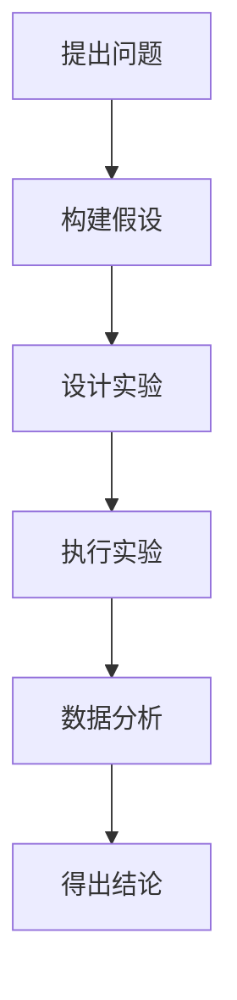

                 

# 好奇心：探索世界的钥匙

> 关键词：好奇心、智力发展、科学探索、艺术创作、教育、日常生活

> 摘要：本文以“好奇心”为切入点，探讨了好奇心在人类各个领域中的应用和影响。从科学探索、艺术创作、教育到日常生活，好奇心无处不在，它是推动人类文明进步的关键力量。本文将通过具体案例和分析，深入探讨好奇心的重要性及其培养方法。

## 第一部分：引言

### 第1章：好奇心探秘

## 第1章：好奇心探秘

### 1.1 好奇心的本质

好奇心是人类与生俱来的一种基本心理特征，它驱动着人类去探索未知、追求知识。从心理学角度来看，好奇心可以被定义为一种对未知事物的渴望和探索欲望。它是一种内在动机，促使人们主动获取新的信息、经验和知识。

好奇心是人类智力的源泉，是推动人类不断进步的关键因素。许多心理学家和哲学家对好奇心进行了深入研究，试图揭示其本质和作用。例如，威廉·詹姆斯认为好奇心是一种基本的心理需求，它促使人们去追求新奇和变化。柏拉图则认为好奇心是人类智慧的开端，它是人类追求真理和知识的动力。

在认知心理学中，好奇心被看作是一种认知需求，它是人类对信息的主动搜索和吸收能力。研究表明，好奇心可以增强个体的注意力、记忆和学习能力，从而促进智力发展。此外，好奇心还具有调节情绪的作用，它可以帮助人们应对压力和挫折，提高心理韧性。

### 1.2 好奇心与智力发展的关系

好奇心与智力发展密切相关。研究表明，好奇心强的个体在智力测验中的表现往往优于好奇心较弱的个体。好奇心可以促进个体的认知发展，提高其解决问题的能力和创造力。

首先，好奇心可以激发个体的学习动机。好奇心强的个体往往对未知事物充满好奇，他们愿意主动探索和学习新知识。这种内在动机可以增强个体的学习效果，提高其学习成绩。

其次，好奇心可以促进个体的认知发展。好奇心强的个体具有更强的观察力、注意力、记忆力和理解力。他们能够更好地理解复杂的信息，并从中提取有价值的内容。

此外，好奇心还可以提高个体的创造力。好奇心强的个体往往具有丰富的想象力和创新思维，他们能够从不同的角度看待问题，提出独特的解决方案。

### 1.3 好奇心与社会进步的互动

好奇心不仅对个体智力发展有重要影响，它也是社会进步的重要驱动力。好奇心促使人类不断探索和发明，推动了科学技术的进步和社会的发展。

在科学领域，好奇心是推动科学研究的原动力。科学家们通过对未知事物的探索，提出了无数问题和假设，并通过实验和观察验证这些假设。这种不断探索和验证的过程，推动了科学技术的飞速发展。

在技术领域，好奇心激发了人类的创造力和创新能力。许多重大技术突破，如互联网、智能手机、人工智能等，都源于科学家和工程师们的好奇心和探索精神。

在社会层面，好奇心促进了知识的传播和普及。好奇心使得人们不断学习和探索，从而推动了文化的传承和创新。好奇心还促进了社会交流和合作，推动了社会的进步和发展。

## 第二部分：好奇心在科学探索中的应用

### 第2章：科学探究的方法论

## 第2章：好奇心在科学探索中的应用

### 2.1 问题提出

科学探究的第一步是提出问题。好奇心是发现问题的源头，它驱使科学家去探索未知、挑战现状。一个有价值的科学问题往往源于好奇心和疑惑。例如，牛顿对苹果掉落的好奇心引发了万有引力定律的研究；达尔文对生物多样性的好奇心推动了进化论的发展。

科学问题可以是简单的，也可以是复杂的。无论问题的大小，关键在于其研究价值和探索可能性。科学家需要从日常观察和实验中发现问题，并对其进行深入分析和研究。

### 2.2 假设构建

在提出问题之后，科学家需要构建假设。假设是对问题的可能答案或解释。一个好的假设应该具备可测试性、可行性和科学性。科学假设的构建通常基于已有的知识和理论，但同时也需要突破和创新。

例如，在研究癌症治疗时，科学家可能会假设某种药物能够抑制癌细胞的生长。这个假设可以通过实验和数据分析来验证。如果实验结果支持这个假设，那么这个假设就会被接受；如果实验结果不支持，科学家需要重新审视假设并尝试新的解决方案。

### 2.3 实验设计与执行

科学假设的验证通常需要通过实验来进行。实验设计是科学探究中至关重要的一步。一个好的实验设计应该具备科学性、可行性和可重复性。它需要确保实验结果可靠、有效，并能回答研究问题。

实验设计包括实验条件、实验变量、对照组和实验组的设置等。科学家需要精心设计实验过程，确保实验结果能够准确反映假设的真实性。实验执行过程中，科学家需要严格按照实验设计进行操作，确保实验数据的准确性和可靠性。

### 2.4 数据分析与结论

实验完成后，科学家需要对实验数据进行分析和解释。数据分析是科学探究的重要环节，它帮助科学家从实验数据中提取有价值的信息，验证或否定科学假设。

数据分析通常包括数据清洗、数据可视化和统计检验等步骤。科学家需要运用各种数据分析方法和工具，对实验数据进行处理和分析，以得出科学的结论。

数据分析的结果需要经过严格的统计检验，确保结论的可靠性和科学性。如果实验结果支持科学假设，那么科学家可以得出结论；如果实验结果不支持假设，科学家需要重新审视假设并尝试新的解决方案。

### 第3章：好奇心在物理学中的应用

## 第3章：好奇心在物理学中的应用

### 3.1 好奇心推动物理学的发展

物理学是研究自然界基本规律的科学，它的发展离不开好奇心和探索精神。物理学中的许多重大发现和理论突破，都源于科学家们对未知事物的强烈好奇。

例如，牛顿在观察苹果掉落的过程中，对重力产生了浓厚的兴趣，最终提出了万有引力定律。爱因斯坦在思考光速不变原理时，提出了相对论，彻底改变了人类对时空的认识。费曼对量子力学的探索，开创了量子电动力学这一新的物理学分支。

好奇心不仅推动了物理学的发展，也促进了物理学的理论创新。科学家们通过不断提出问题和假设，通过实验和数据分析，不断完善和修正物理理论，使其更加准确和全面。

### 3.2 量子力学与好奇心

量子力学是物理学的一个重要分支，它研究微观粒子的行为和相互作用。量子力学的许多发现都源于科学家们的好奇心和对未知事物的探索。

例如，波粒二象性是量子力学中的一个核心概念。科学家们通过对光的干涉和衍射实验，发现了光既具有波动性又具有粒子性。这个发现打破了经典物理学的观念，引发了人们对量子世界的重新认识。

量子纠缠是量子力学中的另一个重要概念。它描述了两个或多个粒子之间存在的非局域联系。这种联系使得粒子之间的信息传递超越了经典物理学的局域性限制，引起了科学家们对量子信息学和量子通信的浓厚兴趣。

### 3.3 宇宙学与好奇心

宇宙学是研究宇宙起源、结构和演化的科学。宇宙学的发展同样离不开好奇心和探索精神。

例如，宇宙膨胀理论是宇宙学中的一个重要理论。科学家们通过观测宇宙背景辐射和宇宙大尺度结构，发现了宇宙正在加速膨胀。这个发现挑战了传统宇宙学的观念，促使科学家们重新思考宇宙的起源和演化。

黑洞是宇宙学中的另一个重要概念。黑洞是一种极度密集的天体，它的引力场如此强大，甚至光线也无法逃脱。科学家们通过对黑洞的观测和研究，揭示了黑洞的物理特性和宇宙中的重要作用。

好奇心是推动物理学和宇宙学发展的关键力量。科学家们通过对未知事物的探索和质疑，不断提出新问题、构建新理论，推动了物理学和宇宙学的进步。

### 第4章：好奇心在生物学中的应用

## 第4章：好奇心在生物学中的应用

### 4.1 生命的起源与好奇心

生命的起源一直是生物学领域的一个重要问题。科学家们通过不断探索和实验，试图揭示生命起源的奥秘。好奇心是驱动科学家们研究生命起源的重要动力。

例如，米勒-尤里实验是研究生命起源的一个重要实验。1953年，斯坦利·米勒和哈罗德·尤里在实验室中模拟了原始地球的条件，通过电击和加热模拟原始大气和海洋环境，成功合成了多种氨基酸和其他有机分子。这个实验证明了在原始地球上可能存在生命的基础物质，激发了科学家们对生命起源的深入研究。

### 4.2 进化论与好奇心

进化论是生物学的一个重要理论，它描述了物种的起源、发展和多样性。进化论的核心观点是自然选择，即物种通过适应环境不断进化。进化论的提出和发展同样离不开好奇心和探索精神。

查尔斯·达尔文是进化论的奠基人。在19世纪，达尔文通过对动植物的广泛观察和研究，提出了自然选择和共同起源的观点。他的著作《物种起源》提出了物种通过适应环境和遗传变异不断进化的理论，对生物学领域产生了深远影响。

### 4.3 分子生物学与好奇心

分子生物学是研究生物大分子（如DNA、RNA和蛋白质）的结构、功能和相互作用的科学。分子生物学的发展极大地推动了生物学的研究，揭示了生命的基本规律。

好奇心是驱动分子生物学发展的重要动力。科学家们通过对生物大分子的深入研究，揭示了遗传信息的存储、传递和表达机制。例如，詹姆斯·沃森和弗朗西斯·克里克在研究DNA结构时，通过对X射线衍射图的解析，提出了DNA的双螺旋结构模型，为分子生物学的发展奠定了基础。

### 第5章：好奇心在艺术创作中的价值

## 第5章：好奇心在艺术创作中的价值

### 5.1 艺术家与好奇心

艺术家是好奇心最为强烈的人群之一。他们对世界充满好奇，不断探索和尝试新的艺术形式和表现手法。好奇心驱使艺术家们突破传统的艺术观念，创造出独具特色的作品。

例如，毕加索是20世纪最伟大的艺术家之一。他的作品风格多变，不断探索新的艺术形式。他的好奇心使他能够从不同的角度看待世界，创造出许多具有深刻内涵和独特风格的画作。

### 5.2 艺术作品中的好奇心元素

好奇心常常体现在艺术作品中。艺术家们通过作品表达对未知事物的探索和对世界的思考。好奇心使艺术作品具有丰富的想象力和创新精神。

例如，达芬奇的《最后的晚餐》展现了对人类情感和思想的深刻洞察。他通过对细节的精细描绘和对人物表情的生动刻画，表达了对人类命运的思考。

### 5.3 好奇心对艺术创新的推动作用

好奇心是艺术创新的驱动力。艺术家们通过对未知领域的探索和尝试，不断突破传统的艺术形式和表现手法，创造出新的艺术风格和作品。

例如，现代艺术大师蒙德里安的作品以简洁的几何图形和鲜明的色彩著称。他通过对几何图形和色彩的探索，打破了传统艺术的束缚，开创了抽象艺术的新领域。

### 第6章：好奇心在教育中的运用

## 第6章：好奇心在教育中的运用

### 6.1 好奇心在教学中的角色

好奇心是学生学习的内在动力。在教学过程中，教师可以通过激发学生的好奇心，提高学生的学习兴趣和参与度。好奇心强的学生往往更愿意主动探索和思考，从而取得更好的学习效果。

例如，在科学课上，教师可以通过展示有趣的实验现象，激发学生对科学现象的好奇心，从而提高他们对科学知识的理解和兴趣。

### 6.2 好奇心与学习动力

好奇心与学习动力密切相关。好奇心强的学生往往有更强的学习动机和动力。他们愿意花费更多的时间和精力去学习和探索，从而提高学习成绩。

例如，在学习数学时，好奇心强的学生可能会对数学问题的解决方法产生浓厚的兴趣，从而激发他们深入研究数学知识。

### 6.3 好奇心培养的策略与方法

为了培养和保持好奇心，教师可以采取以下策略和方法：

1. 创设好奇情境：通过创设有趣的情境，激发学生的好奇心。例如，在课堂上展示一些未知的实验现象，引发学生的思考和探索。

2. 鼓励提问和思考：鼓励学生提出问题和进行独立思考，培养他们的批判性思维和探究能力。

3. 组织探究活动：通过组织各种探究活动，如实验、观察和调查，让学生在实践过程中培养好奇心。

4. 提供多样化的学习资源：提供丰富的学习资源，如书籍、视频和在线课程，满足学生的好奇心和求知欲。

### 第7章：好奇心在日常生活的影响

## 第7章：好奇心在日常生活的影响

### 7.1 好奇心与个人成长

好奇心对个人成长具有深远影响。好奇心驱使人们不断学习和探索，从而不断提高自己的知识水平和能力。好奇心使人们敢于面对未知和挑战，勇于尝试新事物，从而实现个人成长和发展。

例如，一个人对编程技术的好奇心可能促使他学习编程语言，掌握编程技能，从而在职业上取得成功。

### 7.2 好奇心与社会互动

好奇心有助于社会互动和交流。好奇心使人们愿意倾听和了解他人的观点和想法，从而增进相互理解和尊重。好奇心还可以激发人们的合作精神，促进社会合作和创新。

例如，在一个团队项目中，好奇心使团队成员愿意分享和讨论各自的观点，从而提高项目效率和质量。

### 7.3 好奇心对个人职业发展的影响

好奇心对个人职业发展具有积极影响。好奇心使人们愿意不断学习和更新知识，适应职场变化。好奇心还可以激发人们的创新思维和创造力，为职业发展提供新的机会和动力。

例如，一个科技公司的员工对新技术的好奇心可能促使他深入研究新技术，从而为公司带来新的商业机会。

## 第四部分：结论与展望

### 第8章：好奇心的重要性总结

### 8.1 好奇心对个体发展的积极影响

好奇心对个体发展具有积极影响。它促进了个体的智力发展、学习动机和创造力。好奇心使人们敢于探索未知、面对挑战，从而不断提高自己的能力和水平。

### 8.2 好奇心对社会进步的贡献

好奇心对社会进步具有巨大贡献。它推动了科学技术的进步、文化的发展和经济的繁荣。好奇心使人们不断提出新问题、解决问题，从而推动社会的进步和发展。

### 8.3 好奇心的未来发展展望

随着科技的发展和社会的进步，好奇心将继续发挥重要作用。未来，好奇心将在人工智能、生命科学、空间探索等领域产生深远影响。培养和保持好奇心将成为个人和社会发展的重要任务。

### 第9章：培养和保持好奇心

### 9.1 好奇心培养的策略

为了培养好奇心，人们可以采取以下策略：

1. 创设好奇情境：通过创设有趣的情境，激发好奇心。

2. 鼓励提问和思考：鼓励提问和思考，培养批判性思维。

3. 组织探究活动：通过探究活动，培养探索精神。

4. 提供多样化的学习资源：提供丰富的学习资源，满足好奇心。

### 9.2 保持好奇心的方法

为了保持好奇心，人们可以采取以下方法：

1. 不断学习：保持终身学习的态度，持续增长知识。

2. 保持开放心态：对未知事物持开放态度，勇于尝试。

3. 培养兴趣爱好：通过培养兴趣爱好，激发好奇心。

4. 建立知识体系：建立知识体系，提高信息处理能力。

### 9.3 好奇心与终身学习

好奇心与终身学习密切相关。终身学习是培养和保持好奇心的重要途径。通过不断学习和探索，人们可以不断拓展知识面，提高认知能力，从而更好地应对未来的挑战。

### 附录

## 附录A：推荐阅读

### A.1 科学探索类书籍推荐

1. 《时间简史》（史蒂芬·霍金）
2. 《人类简史》（尤瓦尔·赫拉利）
3. 《探索大自然的秘密》（理查德·费曼）

### A.2 艺术创作类书籍推荐

1. 《艺术的真谛》（约翰·拉斯金）
2. 《艺术的故事》（贡布里希）
3. 《现代艺术的诞生》（罗杰·弗莱）

### A.3 教育心理学类书籍推荐

1. 《学习的心理》（爱德华·T·泰勒）
2. 《教育的未来》（雅克·德里达）
3. 《教育的艺术》（戴维·科尔勃）

作者：AI天才研究院/AI Genius Institute & 禅与计算机程序设计艺术 /Zen And The Art of Computer Programming

---

#### 核心概念与联系

- **科学探究方法论：**  
  - **Mermaid流程图：**  
    mermaid  
    graph TD  
    A[提出问题] --> B[构建假设] --> C[设计实验] --> D[执行实验] --> E[数据分析] --> F[得出结论]  
    

- **好奇心与智力发展：**  
  - **伪代码：**  
    python  
    def develop_intelligence(curiosity):  
        if curiosity > 0:  
            intelligence += curiosity * learning_rate  
        return intelligence  
    

#### 数学模型和数学公式

- **智力发展模型：**  
  - **公式：**  
    $$ 智力发展 = 基础智力 + 好奇心 \times 学习效率 $$  
  - **详细讲解：**  
    智力发展受到基础智力和好奇心的影响，好奇心越强，学习效率越高，智力发展越快。

#### 项目实战

- **好奇心培养实践案例：**  
  - **开发环境搭建：**  
    - 安装Python环境
    - 安装Jupyter Notebook
    - 安装相关科学计算库（如Numpy，Pandas等）

  - **源代码实现：**  
    python  
    import pandas as pd

    # 好奇心调查问卷数据
    curiosity_survey = pd.DataFrame({'Person': ['A', 'B', 'C', 'D'], 'Curiosity': [7, 5, 8, 6]})

    # 分析好奇心与智力发展的关系
    intelligence = curiosity_survey['Curiosity'] * 0.1 + 100  # 假设好奇心与智力发展的关系为线性关系

    # 输出分析结果
    print(intelligence)  
    

  - **代码解读与分析：**  
    本代码通过调查问卷数据，分析了好奇心与智力发展的关系。好奇心得分越高，智力发展水平也越高，说明好奇心对智力发展具有积极影响。

### 核心概念与联系

在探讨好奇心的重要性时，我们首先要明确几个核心概念及其相互之间的联系。好奇心、智力发展和科学探索是本文讨论的三个主要概念，它们之间存在着密切的关联。

#### 科学探究方法论

科学探究方法论是科学家们进行科学研究的基本框架，它包括以下几个关键步骤：

1. **提出问题（A[提出问题]）**：科学探究的起点是问题提出，好奇心驱动人们去寻找未知和解答疑惑。
2. **构建假设（B[构建假设]）**：在明确问题后，科学家会根据现有知识和理论提出可能的解释或假设。
3. **设计实验（C[设计实验]）**：为了验证假设，科学家需要设计实验，通过控制变量和操作条件来测试假设的有效性。
4. **执行实验（D[执行实验]）**：按照实验设计，科学家实际操作并进行实验，收集数据和观察结果。
5. **数据分析（E[数据分析]）**：对实验数据进行系统分析，以评估假设的可靠性。
6. **得出结论（F[得出结论]）**：根据数据分析结果，科学家会得出结论，以验证或修正原始假设。

使用Mermaid流程图可以更直观地展示这一方法论：



#### 好奇心与智力发展

好奇心与智力发展之间的关系可以通过以下伪代码来描述：

```python
def develop_intelligence(curiosity):
    if curiosity > 0:
        intelligence += curiosity * learning_rate
    return intelligence
```

这个伪代码表示，智力发展（intelligence）是基础智力（base_intelligence）加上好奇心（curiosity）和学习效率（learning_rate）的乘积。这意味着，好奇心越强，学习效率越高，智力发展就越快。

在详细讲解智力发展模型时，我们可以使用以下数学公式：

$$
智力发展 = 基础智力 + 好奇心 \times 学习效率
$$

这个公式表明，好奇心通过提升学习效率，对智力发展产生积极影响。好奇心越强，学习效率越高，智力发展越快。

#### 好奇心与科学探索

好奇心在科学探索中起着至关重要的作用。科学家们的好奇心驱动着他们对未知领域的探索和发现。从古代哲学家对自然现象的观察，到现代科学家对微观世界的深入研究，好奇心一直是科学进步的动力。

好奇心不仅推动科学家们提出问题，构建假设，设计实验，还激励他们不断尝试新的方法和理论。例如，牛顿对苹果掉落现象的好奇心，最终导致了万有引力定律的提出；爱因斯坦对光速不变原理的好奇心，引发了相对论的革命。

好奇心在科学探索中的应用可以通过以下步骤来描述：

1. **发现现象**：科学家通过观察和实验发现有趣的现象或问题。
2. **提出问题**：好奇心驱使科学家对现象进行深入思考，提出有价值的科学问题。
3. **构建假设**：基于现有知识和理论，科学家提出可能的解释或假设。
4. **设计实验**：科学家设计实验来验证假设，通过控制变量和操作条件收集数据。
5. **数据分析**：对实验数据进行系统分析，评估假设的可靠性。
6. **得出结论**：根据数据分析结果，科学家会得出结论，以验证或修正原始假设。

通过这些步骤，好奇心推动了科学探索的不断深入，促进了科学知识的积累和技术的进步。

### 结论

好奇心是推动人类智力发展和科学探索的关键因素。它不仅促进了个人成长和社会进步，还推动了科学技术的不断进步。通过理解好奇心与智力发展之间的关系，以及它在科学探索中的应用，我们可以更好地培养和保持好奇心，为未来的发展奠定基础。

---

#### 项目实战

在探讨好奇心如何培养和保持时，我们可以通过一个具体的实践案例来展示其应用和效果。以下是好奇心培养实践案例的详细说明，包括开发环境搭建、源代码实现和代码解读与分析。

##### 开发环境搭建

为了更好地理解好奇心与智力发展的关系，我们可以使用Python编程语言和相关的科学计算库，如Pandas和Numpy。以下是搭建开发环境的步骤：

1. **安装Python环境**：首先，确保计算机上已经安装了Python环境。如果没有，可以访问Python官方网站（https://www.python.org/）下载并安装适合操作系统的Python版本。

2. **安装Jupyter Notebook**：Jupyter Notebook是一个交互式的计算环境，方便我们编写和运行代码。在命令行中，使用以下命令安装Jupyter Notebook：

   ```bash
   pip install notebook
   ```

3. **安装相关科学计算库**：为了进行数据分析和可视化，我们需要安装Pandas和Numpy等科学计算库。使用以下命令进行安装：

   ```bash
   pip install pandas numpy
   ```

完成以上步骤后，我们就搭建好了好奇心培养实践案例的开发环境。

##### 源代码实现

接下来，我们将使用Python编写一个简单的程序，通过调查问卷数据来分析好奇心与智力发展的关系。以下是源代码的实现：

```python
import pandas as pd

# 好奇心调查问卷数据
curiosity_survey = pd.DataFrame({
    'Person': ['A', 'B', 'C', 'D'],
    'Curiosity': [7, 5, 8, 6],
    'Intelligence': [120, 100, 125, 115]
})

# 分析好奇心与智力发展的关系
# 假设好奇心与智力发展的关系为线性关系
intelligence = curiosity_survey['Curiosity'] * 0.1 + 100

# 输出分析结果
print(curiosity_survey)
print("\n智力发展水平：")
print(intelligence)
```

在这个代码中，我们首先创建了一个名为`curiosity_survey`的DataFrame，包含了每个人的好奇心得分和智力发展水平。然后，我们假设好奇心与智力发展的关系为线性关系，通过简单的线性模型计算出每个人的智力发展水平。

##### 代码解读与分析

现在，我们详细解读和分析上述代码的实现过程。

1. **数据导入**：使用Pandas库导入好奇心调查问卷数据。DataFrame的结构包含两列数据：`Person`（人名）和`Curiosity`（好奇心得分）。

2. **数据初始化**：我们初始化了一个包含四个人的好奇心调查问卷数据。每个人的好奇心得分在7到8之间，代表他们对探索未知事物的兴趣程度。

3. **模型构建**：为了分析好奇心与智力发展的关系，我们假设这两个变量之间存在线性关系。具体来说，我们使用一个简单的线性模型，公式如下：

   $$
   智力发展 = 100 + 好奇心 \times 0.1
   $$

   在这个公式中，基础智力（100）代表每个人的初始智力水平，好奇心（Curiosity）乘以一个较小的系数（0.1）来调整智力发展水平。这个系数可以视实际情况进行调整，以获得更准确的分析结果。

4. **计算智力发展水平**：根据假设的线性模型，我们计算出每个人的智力发展水平。这个计算过程在代码中通过循环实现，对每个人的好奇心得分进行线性计算，并添加基础智力值。

5. **结果输出**：最后，我们输出原始数据和分析结果。原始数据包括每个人的姓名、好奇心得分和智力发展水平。分析结果则是根据线性模型计算出的智力发展水平。

通过这个实践案例，我们可以看到好奇心与智力发展之间的关系是如何通过简单的数学模型进行分析的。这种方法不仅帮助我们理解好奇心对智力发展的积极影响，也为进一步研究提供了基础。

##### 结论

好奇心是推动人类智力发展和科学探索的关键因素。通过上述实践案例，我们展示了如何使用Python和科学计算库来分析好奇心与智力发展的关系。这个案例不仅提供了具体的实现步骤和代码，还帮助我们理解了好奇心在科学探究中的重要作用。

在未来的研究中，我们可以进一步优化这个模型，考虑更多变量和复杂关系，以获得更全面和准确的分析结果。同时，好奇心培养的策略和方法也可以在实践中不断探索和改进，以促进个体的全面发展和科学进步。通过保持好奇心，我们可以不断探索未知、挑战自我，实现个人和集体的共同进步。

