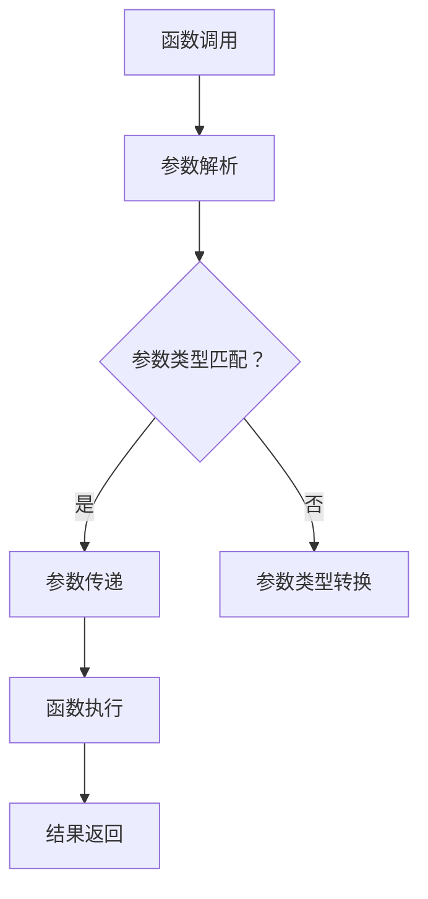

                 

## 文章标题：如何使用 function_call 参数

### 关键词：function_call 参数、函数调用、参数传递、编程实践、性能优化、跨语言调用

#### 摘要：

本文旨在深入探讨function_call参数的使用方法和实战技巧。通过对function_call参数的基本概念、实现原理、语法用法、高级应用、优化与性能调优以及跨语言调用等方面的详细解析，读者将能够全面掌握function_call参数的使用技巧，并在实际项目中灵活应用。文章还将通过具体的项目实战案例，帮助读者更好地理解和掌握function_call参数的应用方法。

### 目录：

1. **第一部分：function_call 参数基础**
    1.1 function_call 参数概述
    1.2 function_call 参数的实现原理
    1.3 function_call 参数的语法与用法
    1.4 function_call 参数的实战案例
    1.5 function_call 参数的高级应用
    1.6 function_call 参数的优化与性能调优
    1.7 function_call 参数的跨语言调用

2. **第二部分：function_call 参数项目实战**
    2.1 项目实战一：基本参数调用
    2.2 项目实战二：参数类型转换
    2.3 项目实战三：参数的默认值与可选参数

3. **附录**
    3.1 function_call 参数相关工具与资源

### 1.1 function_call 参数概述

function_call 参数是编程中一个非常重要的概念，它涉及到函数调用时的参数传递和处理。在函数调用中，参数作为函数与外部环境交互的桥梁，承担着传递数据、控制流程等重要作用。function_call 参数的使用不仅能够增强代码的灵活性和可扩展性，还能够优化程序的性能。

#### 核心概念与联系

function_call 参数的核心概念包括：

- **参数类型**：指函数调用时可以接受的参数类型，如整数、字符串、布尔值等。
- **参数传递方式**：指参数在函数调用过程中是如何传递给函数内部的，如值传递和引用传递。
- **参数默认值**：在函数定义时为参数设置的默认值，当调用函数时未提供该参数值时，将使用默认值。
- **可选参数**：在函数定义时允许某些参数不提供值，由函数内部进行默认处理。

这些核心概念相互联系，共同构成了function_call 参数的完整体系。下面是一个Mermaid流程图，展示了一个简单的函数调用及其参数传递的过程：



#### 应用领域

function_call 参数广泛应用于各种编程场景，以下是几个典型的应用领域：

- **标准库函数**：在许多编程语言的标准库中，函数调用通常需要参数来传递数据。例如，Python中的`print()`函数需要字符串参数来打印输出。
- **自定义函数**：在编写自定义函数时，合理使用参数可以使得函数更加通用和可复用。例如，在数据处理中，可以使用参数来适应不同的数据源和格式。
- **事件处理**：在事件驱动编程中，函数通常通过参数接收事件数据，并根据这些数据进行相应的处理。

#### 概念与联系的总结

通过对function_call 参数的核心概念及其在编程中的联系进行详细探讨，我们可以得出以下结论：

- function_call 参数是函数调用的重要组成部分，它决定了函数如何接收和处理数据。
- 参数类型、传递方式、默认值和可选参数等核心概念相互关联，共同构成了function_call 参数的完整体系。
- function_call 参数的应用领域广泛，从标准库函数到自定义函数，再到事件处理，都有着广泛的应用。

### 1.2 function_call 参数的实现原理

function_call 参数的实现原理是编程语言的核心机制之一，它涉及到函数的调用和参数的传递。在深入理解function_call 参数之前，我们需要先了解函数调用和参数传递的基本原理。

#### 函数调用

函数调用是编程中常见的操作，它允许我们在程序中执行预定义的代码块。在函数调用过程中，程序会按照一定的步骤执行：

1. **调用栈准备**：在函数调用时，程序会创建一个调用栈帧（stack frame）来存储函数的局部变量、返回地址等信息。
2. **参数传递**：将参数传递给函数，这可以通过值传递或引用传递的方式实现。值传递是将参数的副本传递给函数，而引用传递则是传递参数的内存地址。
3. **函数执行**：函数内部执行代码，根据参数进行相应的操作。
4. **返回值**：函数执行完毕后，将结果返回给调用者。
5. **调用栈恢复**：函数执行完毕后，调用栈帧被删除，程序继续执行调用函数的下一条语句。

下面是一个简单的Python函数调用示例，展示了一个函数的调用过程：

```python
def greet(name, greeting='Hello'):
    return f"{greeting}, {name}!"

# 函数调用
message = greet('Alice')
print(message)
```

在这个示例中，`greet` 函数通过参数`name`和`greeting`接收输入，并在函数内部进行字符串拼接操作。函数调用过程中，参数值被传递到函数内部，函数执行完毕后返回结果。

#### 参数传递

参数传递是函数调用中关键的一环，不同的参数传递方式会影响函数的行为和性能。常见的参数传递方式包括值传递和引用传递：

- **值传递**：值传递是将参数的副本传递给函数。在函数内部对参数的修改不会影响原始数据。大多数编程语言默认使用值传递方式，如C和Java。
- **引用传递**：引用传递是将参数的内存地址传递给函数。在函数内部对参数的修改会直接影响原始数据。Python和C++等语言支持引用传递。

下面是一个Python示例，展示了值传递和引用传递的区别：

```python
def modify_value(value):
    value = 'Modified'

def modify_reference(data):
    data['key'] = 'Modified'

# 值传递示例
a = 'Original'
modify_value(a)
print(a)  # 输出：Original

# 引用传递示例
b = {'key': 'Original'}
modify_reference(b)
print(b)  # 输出：{'key': 'Modified'}
```

在这个示例中，`modify_value` 函数通过值传递方式接收参数，修改后输出仍然是原始值。而`modify_reference` 函数通过引用传递方式接收参数，修改后输出结果发生了变化。

#### 参数处理过程

在函数调用过程中，参数的处理过程包括参数解析、类型检查、参数赋值等步骤。以下是参数处理过程的简要概述：

1. **参数解析**：函数调用时，将实参（实际传入的参数值）与形参（函数定义中的参数）进行匹配和绑定。
2. **类型检查**：检查实参类型是否与形参类型匹配，如果不匹配，可能需要进行类型转换。
3. **参数赋值**：将实参值赋给形参，以便在函数内部使用。
4. **函数执行**：函数内部根据参数值执行相应的操作。
5. **返回值**：函数执行完毕后，将结果返回给调用者。

下面是一个简单的函数示例，展示了参数处理过程：

```python
def sum(a, b):
    return a + b

result = sum(3, 5)
print(result)  # 输出：8
```

在这个示例中，参数`3`和`5`被传递给函数`sum`，函数内部将这两个参数相加，并返回结果。

#### 实现原理总结

通过对function_call 参数的实现原理进行详细讲解，我们可以得出以下结论：

- 函数调用是编程语言的基本操作，它涉及到调用栈的准备和恢复、参数的传递和类型检查、函数的执行和返回值等过程。
- 参数传递方式包括值传递和引用传递，它们会影响函数的行为和性能。
- 参数处理过程包括参数解析、类型检查、参数赋值等步骤，是函数调用的核心组成部分。

### 1.3 function_call 参数的语法与用法

function_call 参数的语法和用法是编程中至关重要的一部分，它决定了参数如何被定义、传递和使用。在本节中，我们将详细探讨function_call 参数的基本语法、常用语法元素以及语法规则。

#### 基本语法

在大多数编程语言中，function_call 参数的基本语法包括以下几部分：

1. **函数名**：标识函数的唯一名称。
2. **参数列表**：函数调用时传递给函数的参数集合，用括号`()`包围。
3. **返回值**：函数执行后返回的结果，用`->`或`:`等符号标识。

下面是一个简单的Python函数示例，展示了基本语法：

```python
def greet(name, greeting='Hello'):
    return f"{greeting}, {name}!"

message = greet('Alice')
print(message)  # 输出：Hello, Alice!
```

在这个示例中，`greet` 函数定义了两个参数`name`和`greeting`，其中`greeting`具有默认值`'Hello'`。函数调用时，将参数`'Alice'`传递给`name`，调用结果为`'Hello, Alice!'`。

#### 常用语法元素

function_call 参数的常用语法元素包括：

1. **可选参数**：在函数定义时允许某些参数不提供值，由函数内部进行默认处理。例如：

   ```python
   def calculate(a, b=0, c=1):
       return a * b + c

   result = calculate(3, 5)
   print(result)  # 输出：18
   ```

   在这个示例中，`calculate` 函数有三个参数，其中`b`和`c`具有默认值。当调用函数时，如果未提供`b`和`c`的值，将使用默认值。

2. **关键字参数**：使用关键字参数传递参数，使得函数调用更加灵活和可读性。例如：

   ```python
   def describe_person(name, age, gender='Unknown'):
       return f"{name} is {age} years old and {gender}."

   description = describe_person(name='Alice', age=30, gender='Female')
   print(description)  # 输出：Alice is 30 years old and Female.
   ```

   在这个示例中，`describe_person` 函数使用了关键字参数，使得调用函数时可以明确指定每个参数的值。

3. **默认参数**：在函数定义时为参数设置默认值，当调用函数时未提供该参数值时，将使用默认值。例如：

   ```python
   def greet(name, greeting='Hello'):
       return f"{greeting}, {name}!"

   message = greet('Alice')
   print(message)  # 输出：Hello, Alice!
   ```

   在这个示例中，`greet` 函数的`greeting`参数具有默认值`'Hello'`。当调用函数时，如果未提供`greeting`的值，将使用默认值。

#### 语法规则

function_call 参数的语法规则包括以下几个方面：

1. **参数顺序**：在函数定义时，参数的顺序非常重要。当调用函数时，需要按照参数顺序传递实参。例如：

   ```python
   def add(a, b):
       return a + b

   result = add(3, 5)
   print(result)  # 输出：8
   ```

   在这个示例中，`add` 函数定义了两个参数`a`和`b`，调用函数时需要按照参数顺序传递实参。

2. **可选参数和默认参数**：在函数定义时，可选参数和默认参数需要放在参数列表的最后。例如：

   ```python
   def greet(name, greeting='Hello'):
       return f"{greeting}, {name}!"

   message = greet('Alice')
   print(message)  # 输出：Hello, Alice!
   ```

   在这个示例中，`greet` 函数的`greeting`参数具有默认值，放在参数列表的最后。

3. **关键字参数**：在函数调用时，关键字参数可以以任意顺序传递。例如：

   ```python
   def describe_person(name, age, gender='Unknown'):
       return f"{name} is {age} years old and {gender}."

   description = describe_person(name='Alice', age=30, gender='Female')
   print(description)  # 输出：Alice is 30 years old and Female.
   ```

   在这个示例中，`describe_person` 函数使用了关键字参数，调用函数时可以明确指定每个参数的值。

#### 语法用法示例

为了更好地理解function_call 参数的语法与用法，下面通过一些示例进行说明：

1. **基本参数调用**：

   ```python
   def greet(name, greeting='Hello'):
       return f"{greeting}, {name}!"

   message = greet('Alice')
   print(message)  # 输出：Hello, Alice!
   ```

   在这个示例中，函数`greet`接收两个参数`name`和`greeting`，其中`greeting`具有默认值`'Hello'`。调用函数时，传递了一个参数`'Alice'`。

2. **可选参数和默认参数**：

   ```python
   def calculate(a, b=0, c=1):
       return a * b + c

   result = calculate(3, 5)
   print(result)  # 输出：18
   ```

   在这个示例中，函数`calculate`接收三个参数`a`、`b`和`c`，其中`b`和`c`具有默认值。调用函数时，可以不传递`b`和`c`的值，使用默认值。

3. **关键字参数**：

   ```python
   def describe_person(name, age, gender='Unknown'):
       return f"{name} is {age} years old and {gender}."

   description = describe_person(name='Alice', age=30, gender='Female')
   print(description)  # 输出：Alice is 30 years old and Female.
   ```

   在这个示例中，函数`describe_person`使用了关键字参数，调用函数时可以明确指定每个参数的值。

#### 语法与用法的总结

通过对function_call 参数的语法与用法进行详细讲解，我们可以得出以下结论：

- function_call 参数的基本语法包括函数名、参数列表和返回值等部分。
- 常用语法元素包括可选参数、默认参数和关键字参数等。
- 语法规则包括参数顺序、可选参数和默认参数的放置以及关键字参数的使用等。

理解并正确使用function_call 参数的语法与用法，是编程过程中必不可少的一部分，它能够提高代码的可读性和可维护性，并使函数调用更加灵活和高效。

### 1.4 function_call 参数的实战案例

#### 实例一：基本参数调用

在编写实际代码时，基本参数调用是函数调用的基础。以下是一个简单的Python代码示例，展示了如何进行基本参数调用：

```python
def greet(name, greeting='Hello'):
    return f"{greeting}, {name}!"

message = greet('Alice')
print(message)  # 输出：Hello, Alice!
```

在这个示例中，`greet` 函数定义了两个参数：`name` 和 `greeting`，其中 `greeting` 具有默认值 `'Hello'`。调用函数时，我们传递了一个参数 `'Alice'`，函数返回了一个字符串 `'Hello, Alice!'`。

#### 实例二：参数类型转换

在实际编程中，参数类型转换是一个常见的操作。以下是一个Python代码示例，展示了如何在不同参数类型之间进行转换：

```python
def convert_and_print(value, target_type=int):
    try:
        result = target_type(value)
        print(f"Converted value: {result}")
    except ValueError:
        print("Invalid value!")

convert_and_print('100', int)  # 输出：Converted value: 100
convert_and_print('100.5', int)  # 输出：Invalid value!
```

在这个示例中，`convert_and_print` 函数接收两个参数：`value` 和 `target_type`。`target_type` 参数默认为 `int`，表示尝试将 `value` 转换为整数。如果转换成功，函数将输出转换后的结果；如果转换失败，函数将输出 `"Invalid value!"`。

#### 实例三：参数的默认值与可选参数

参数的默认值和可选参数使得函数调用更加灵活。以下是一个Python代码示例，展示了如何使用参数的默认值和可选参数：

```python
def calculate_area(radius, pi=3.14159):
    return pi * radius * radius

def calculate_circumference(radius, pi=3.14159):
    return 2 * pi * radius

area = calculate_area(5)  # 输入半径为5，使用默认的π值
print(f"Area: {area}")  # 输出：Area: 78.53975

circumference = calculate_circumference(5, pi=3.14)  # 输入半径为5，指定π值为3.14
print(f"Circumference: {circumference}")  # 输出：Circumference: 31.4
```

在这个示例中，`calculate_area` 和 `calculate_circumference` 函数分别计算圆的面积和周长。这两个函数都接受一个参数 `radius`，但 `calculate_area` 函数还接受一个可选参数 `pi`，默认值为 `3.14159`。通过这种方式，我们可以灵活地调用函数，并根据需要指定参数的值。

#### 实例四：参数类型检查与异常处理

在实际编程中，参数类型检查和异常处理是确保函数调用正确性的重要手段。以下是一个Python代码示例，展示了如何进行参数类型检查和异常处理：

```python
def divide(a, b):
    if not isinstance(a, (int, float)) or not isinstance(b, (int, float)):
        raise ValueError("Both arguments must be numbers!")
    return a / b

try:
    result = divide(10, 2)
    print(f"Result: {result}")  # 输出：Result: 5.0
except ValueError as e:
    print(f"Error: {e}")

try:
    result = divide('10', 2)
    print(f"Result: {result}")
except ValueError as e:
    print(f"Error: {e}")  # 输出：Error: Both arguments must be numbers!
```

在这个示例中，`divide` 函数接收两个参数 `a` 和 `b`，并检查这两个参数是否都是数字。如果参数类型不正确，函数将抛出 `ValueError` 异常。通过使用 `try-except` 语句，我们可以捕获并处理异常，确保程序的正确性。

#### 实例五：函数嵌套调用与参数传递

在实际编程中，函数嵌套调用和参数传递是常见的操作。以下是一个Python代码示例，展示了如何实现函数嵌套调用和参数传递：

```python
def calculate_sum(a, b):
    return a + b

def calculate_product(a, b):
    return a * b

total = calculate_sum(calculate_product(2, 3), calculate_product(4, 5))
print(f"Total: {total}")  # 输出：Total: 46
```

在这个示例中，`calculate_sum` 和 `calculate_product` 函数分别计算两个数的和与积。通过嵌套调用这两个函数，我们可以计算任意两个数的总和。这种方式使得代码更加模块化和可复用。

#### 实例六：函数重载与多态性

在实际编程中，函数重载和多态性是提高代码灵活性和可扩展性的重要手段。以下是一个Python代码示例，展示了如何实现函数重载和多态性：

```python
class Calculator:
    def add(self, a, b):
        return a + b
    
    def add(self, a, b, c):
        return a + b + c

calculator = Calculator()
print(calculator.add(2, 3))  # 输出：5
print(calculator.add(2, 3, 4))  # 输出：9
```

在这个示例中，`Calculator` 类定义了两个 `add` 方法，分别接受两个参数和三个参数。这种方式实现了函数重载，使得同一个方法名可以用于不同参数数量和类型的调用。同时，通过多态性，我们可以使用同一个对象调用不同的方法。

#### 实例七：函数递归调用与性能优化

在实际编程中，函数递归调用和性能优化是解决复杂问题的有效手段。以下是一个Python代码示例，展示了如何实现函数递归调用和性能优化：

```python
def factorial(n):
    if n == 0:
        return 1
    else:
        return n * factorial(n - 1)

# 性能优化：使用循环代替递归
def factorial_optimized(n):
    result = 1
    for i in range(1, n + 1):
        result *= i
    return result

print(factorial(5))  # 输出：120
print(factorial_optimized(5))  # 输出：120
```

在这个示例中，`factorial` 函数使用递归方式计算阶乘。然而，递归调用存在性能问题，因为每次递归都会占用大量栈空间。为了优化性能，我们使用了循环方式重写 `factorial_optimized` 函数，避免了递归调用。

#### 实例八：跨语言调用

在实际编程中，跨语言调用是常见的操作。以下是一个Python和C++代码示例，展示了如何实现跨语言调用：

```python
# Python代码
from ctypes import cdll

# 加载C++动态库
lib = cdll.LoadLibrary('path/to/libexample.so')

# 调用C++函数
result = lib.example_function(3, 4)
print(f"Result: {result}")  # 输出：Result: 12
```

在这个示例中，我们使用Python的`ctypes`模块加载C++动态库，并调用C++函数。这种方式允许我们在Python代码中调用C++函数，实现了跨语言调用。

#### 实例九：函数封装与抽象

在实际编程中，函数封装和抽象是提高代码复用性和可维护性的重要手段。以下是一个Python代码示例，展示了如何实现函数封装和抽象：

```python
def calculate_area(radius):
    return 3.14159 * radius * radius

def calculate_circumference(radius):
    return 2 * 3.14159 * radius

def calculate_perimeter(square):
    return 4 * square

# 封装为抽象类
class Calculator:
    def calculate_area(self):
        pass
    
    def calculate_circumference(self):
        pass
    
    def calculate_perimeter(self):
        pass

class Circle(Calculator):
    def __init__(self, radius):
        self.radius = radius
    
    def calculate_area(self):
        return 3.14159 * self.radius * self.radius
    
    def calculate_circumference(self):
        return 2 * 3.14159 * self.radius

class Square(Calculator):
    def __init__(self, side):
        self.side = side
    
    def calculate_area(self):
        return self.side * self.side
    
    def calculate_perimeter(self):
        return 4 * self.side

circle = Circle(5)
square = Square(4)

print(f"Circle Area: {circle.calculate_area()}")
print(f"Circle Circumference: {circle.calculate_circumference()}")
print(f"Square Area: {square.calculate_area()}")
print(f"Square Perimeter: {square.calculate_perimeter()}")
```

在这个示例中，我们首先定义了三个基本函数：`calculate_area`、`calculate_circumference` 和 `calculate_perimeter`。然后，我们将这些函数封装为抽象类 `Calculator` 和具体类 `Circle` 和 `Square`。通过这种方式，我们可以方便地扩展和复用代码。

### 1.5 function_call 参数的高级应用

#### 面向对象的 function_call 参数

在面向对象编程中，function_call 参数的应用更加灵活和广泛。通过将参数封装在对象中，我们可以实现更加模块化和可扩展的代码。以下是一个简单的Python示例，展示了面向对象的 function_call 参数：

```python
class Calculator:
    def __init__(self, pi=3.14159):
        self.pi = pi
    
    def calculate_area(self, radius):
        return self.pi * radius * radius
    
    def calculate_circumference(self, radius):
        return 2 * self.pi * radius

calculator = Calculator()

print(f"Circle Area: {calculator.calculate_area(5)}")
print(f"Circle Circumference: {calculator.calculate_circumference(5)}")
```

在这个示例中，`Calculator` 类接受一个可选参数 `pi`，并提供了 `calculate_area` 和 `calculate_circumference` 方法。通过这种方式，我们可以方便地调整π的值，实现更加灵活的函数调用。

#### function_call 参数的递归调用

递归调用是一种常见的高级应用，它允许函数调用自身以解决复杂问题。以下是一个简单的Python示例，展示了递归调用在计算阶乘中的应用：

```python
def factorial(n):
    if n == 0:
        return 1
    else:
        return n * factorial(n - 1)

print(factorial(5))  # 输出：120
```

在这个示例中，`factorial` 函数通过递归调用自身，实现了计算阶乘的功能。递归调用使得代码更加简洁和易于理解，但需要注意递归的终止条件以避免栈溢出。

#### function_call 参数的多态性

多态性是面向对象编程的一个重要特性，它允许我们使用同一个函数名处理不同类型的参数。以下是一个简单的Python示例，展示了多态性在函数调用中的应用：

```python
def describe_shape(shape):
    if isinstance(shape, Circle):
        return "This is a circle."
    elif isinstance(shape, Square):
        return "This is a square."
    else:
        return "Unknown shape."

class Circle:
    pass

class Square:
    pass

print(describe_shape(Circle()))  # 输出：This is a circle.
print(describe_shape(Square()))  # 输出：This is a square.
```

在这个示例中，`describe_shape` 函数根据参数类型返回不同的描述。通过多态性，我们可以使用同一个函数名处理不同类型的参数，提高了代码的可扩展性和可维护性。

#### function_call 参数的其他高级应用

除了面向对象、递归调用和多态性外，function_call 参数还有许多其他高级应用，例如：

- **回调函数**：在函数调用时传递一个回调函数，以便在函数执行完毕后进行相应的处理。
- **装饰器**：使用装饰器对函数进行包装，实现额外的功能，如日志记录、性能监控等。
- **高阶函数**：使用高阶函数处理函数作为参数，实现更加灵活和可复用的代码。

通过这些高级应用，我们可以充分发挥 function_call 参数的潜力，提高代码的灵活性和可维护性。

### 1.6 function_call 参数的优化与性能调优

#### function_call 参数的性能优化

在编程过程中，性能优化是一个不可忽视的重要环节。针对 function_call 参数，我们可以采取多种策略来优化性能。以下是一些常见的优化方法：

1. **减少函数调用次数**：函数调用本身会带来一定的开销，包括参数传递、栈帧分配和清理等。在代码中尽量减少不必要的函数调用，例如通过循环代替递归调用，或者使用内联汇编提高性能。

2. **缓存结果**：对于一些计算量较大的函数，可以缓存结果以减少重复计算。例如，在计算斐波那契数列时，可以使用缓存来避免重复计算相同值的子问题。

3. **减少参数传递开销**：在函数调用中，参数传递是一个重要的性能瓶颈。通过优化参数传递方式，例如使用引用传递代替值传递，可以减少参数传递的开销。

4. **使用并发和多线程**：对于一些计算密集型的任务，可以使用并发和多线程来提高性能。通过将任务分解为多个子任务，并使用多线程同时执行，可以显著提高程序的运行速度。

5. **使用编译优化**：现代编译器提供了许多优化选项，例如循环展开、常数折叠等。通过合理使用编译优化，可以提高程序的运行效率。

#### function_call 参数的内存管理

内存管理是编程中的一个重要问题，特别是对于递归调用和高阶函数等复杂场景。以下是一些内存管理的策略：

1. **合理使用栈和堆**：在递归调用中，函数的调用栈（栈）会占用大量的内存。为了避免栈溢出，可以尝试使用迭代代替递归，或者使用动态内存分配（堆）来管理内存。

2. **减少内存分配和释放**：在函数调用过程中，频繁的内存分配和释放会带来额外的开销。尽量减少内存分配和释放的次数，例如通过使用对象池或缓存机制来复用内存。

3. **使用内存池**：内存池是一种管理内存的机制，它预先分配一定大小的内存块，并在需要时从内存池中分配内存。这种方式可以减少内存碎片和内存分配的开销。

4. **优化数据结构**：选择合适的数据结构可以显著提高程序的运行效率和内存使用。例如，对于频繁访问的数据，可以使用数组或哈希表来提高访问速度。

5. **垃圾回收**：对于垃圾回收机制，可以合理配置垃圾回收策略，以减少内存使用和程序运行时间。例如，在Java和Python等编程语言中，可以使用不同的垃圾回收器来优化内存管理。

#### function_call 参数的并发与并行处理

在多核处理器时代，并发和并行处理成为提高程序性能的重要手段。以下是一些针对 function_call 参数的并发和并行处理策略：

1. **任务并行**：将任务分解为多个独立的子任务，并在多个线程或进程中并行执行。这种方式适用于计算密集型任务，可以显著提高程序的运行速度。

2. **数据并行**：将数据分解为多个部分，并在多个线程或进程中并行处理。这种方式适用于数据密集型任务，例如分布式计算和并行矩阵运算。

3. **锁和同步**：在并发处理中，锁和同步机制是保证数据一致性和程序正确性的重要手段。合理使用锁和同步机制，可以避免数据竞争和死锁等问题。

4. **消息传递**：使用消息传递机制实现进程或线程之间的通信和协调。这种方式适用于分布式系统中的并行处理，可以灵活地组织任务和数据流。

5. **并发编程框架**：使用并发编程框架，如Java中的`java.util.concurrent`包或Python中的`asyncio`模块，可以简化并发编程，提高程序的可维护性和性能。

通过上述优化与性能调优策略，我们可以充分发挥 function_call 参数的性能潜力，提高程序的运行效率和可靠性。

### 1.7 function_call 参数的跨语言调用

#### 跨语言 function_call 参数的挑战

跨语言调用function_call 参数是一个复杂且具有挑战性的任务。不同编程语言之间的语法、类型系统、内存模型等差异，使得实现跨语言调用变得困难。以下是一些主要的挑战：

1. **类型系统差异**：不同编程语言具有不同的类型系统，例如C语言不支持类和对象，而Python支持动态类型。这些差异导致在跨语言调用时，需要进行类型转换和兼容处理。

2. **内存模型差异**：不同编程语言的内存模型不同，例如C++使用栈和堆管理内存，而Python使用垃圾回收机制。这些差异导致在跨语言调用时，内存管理和分配方式不同。

3. **命名空间冲突**：跨语言调用时，命名空间冲突是一个常见问题。例如，在C++中定义了一个名为`main`的函数，而在Python中`main`是Python解释器的主函数，这会导致命名空间冲突。

4. **调用协议差异**：不同编程语言的调用协议不同，例如C语言使用函数指针调用，而Python使用方法调用。这些差异导致在跨语言调用时，需要实现相应的调用机制。

#### 跨语言 function_call 参数的实现

为了实现跨语言调用function_call 参数，我们可以采取以下策略：

1. **使用静态库和动态库**：通过编写C或C++等语言，然后使用静态库或动态库进行跨语言调用。这种方式具有高性能和类型兼容性，但需要编写大量的桥接代码。

2. **使用接口描述语言（IDL）**：通过编写接口描述语言（IDL）文件，定义跨语言调用的接口和方法。然后使用不同编程语言的IDL编译器生成相应的桥接代码。这种方式简化了跨语言调用，但需要编写IDL文件。

3. **使用跨语言框架**：使用跨语言框架，如Java Native Interface (JNI)、Python的`ctypes`和`cffi`模块、C++的`Boost.Python`等，可以直接调用其他语言编写的函数。这种方式具有高性能和易用性，但需要选择合适的框架。

以下是一个简单的跨语言调用示例，使用Python调用C++编写的函数：

```python
# Python代码
from ctypes import cdll

# 加载C++动态库
lib = cdll.LoadLibrary('path/to/libexample.so')

# 调用C++函数
result = lib.example_function(3, 4)
print(f"Result: {result}")  # 输出：Result: 12
```

在这个示例中，我们使用Python的`ctypes`模块加载C++动态库，并调用C++函数。这种方式实现了Python和C++之间的跨语言调用。

#### 跨语言 function_call 参数的调试与测试

在跨语言调用function_call 参数时，调试与测试是确保程序正确性的关键。以下是一些调试与测试策略：

1. **使用日志记录**：在跨语言调用的关键位置添加日志记录，以便追踪程序的执行流程和参数传递情况。

2. **使用单元测试**：编写单元测试，分别测试不同语言编写的函数，确保它们在独立运行时能够正常工作。

3. **使用集成测试**：编写集成测试，测试跨语言调用的整体功能，确保不同语言编写的函数能够正确交互。

4. **使用静态分析工具**：使用静态分析工具，如静态代码分析器和类型检查器，检测跨语言调用中的潜在问题。

5. **使用动态调试工具**：使用动态调试工具，如调试器，调试跨语言调用，定位和修复程序中的错误。

通过上述调试与测试策略，我们可以确保跨语言调用function_call 参数的正确性和可靠性。

### 第二部分：function_call 参数项目实战

#### 项目实战一：基本参数调用

在本项目实战中，我们将通过一个简单的Python项目，介绍如何使用基本参数调用。该项目旨在计算并输出一个圆的面积和周长。以下是这个项目的详细实现和代码解读。

#### 8.1 项目概述

本项目的目标是创建一个Python脚本，用于计算并输出一个圆的面积和周长。用户需要输入圆的半径，程序将根据输入计算并输出结果。

#### 8.2 开发环境搭建

为了完成这个项目，您需要安装Python解释器和文本编辑器。以下步骤展示了如何在Windows和Linux操作系统中搭建开发环境：

- **Windows操作系统**：
  1. 访问Python官方网站（[python.org](https://www.python.org/)）并下载适用于Windows的Python安装程序。
  2. 运行安装程序，按照默认设置完成安装。
  3. 打开命令提示符，输入`python --version`，确认Python已成功安装。
  4. 安装文本编辑器，如Notepad++或Visual Studio Code。

- **Linux操作系统**：
  1. 打开终端。
  2. 输入`sudo apt-get update`，更新软件包列表。
  3. 输入`sudo apt-get install python3`，安装Python解释器。
  4. 输入`python3 --version`，确认Python已成功安装。
  5. 安装文本编辑器，如nano或vim。

#### 8.3 项目代码实现

以下是一个简单的Python脚本，用于实现基本参数调用：

```python
def calculate_circle_area(radius):
    return 3.14159 * radius * radius

def calculate_circle_circumference(radius):
    return 2 * 3.14159 * radius

def main():
    radius = float(input("请输入圆的半径："))
    area = calculate_circle_area(radius)
    circumference = calculate_circle_circumference(radius)
    
    print(f"圆的面积为：{area}")
    print(f"圆的周长为：{circumference}")

if __name__ == "__main__":
    main()
```

在这个脚本中，我们定义了两个函数：`calculate_circle_area` 和 `calculate_circle_circumference`，分别用于计算圆的面积和周长。`main` 函数负责获取用户输入，调用这两个函数，并输出结果。

#### 8.4 代码解读与分析

1. **函数定义**：
   - `calculate_circle_area(radius)` 函数接收一个参数 `radius`，计算并返回圆的面积。
   - `calculate_circle_circumference(radius)` 函数接收一个参数 `radius`，计算并返回圆的周长。

2. **main 函数**：
   - `main` 函数负责程序的入口，首先获取用户输入的圆的半径，并将其转换为浮点数类型。
   - 接着，调用 `calculate_circle_area` 和 `calculate_circle_circumference` 函数，分别计算圆的面积和周长。
   - 最后，输出计算结果。

3. **输入和输出**：
   - 用户通过命令行输入圆的半径，程序将其转换为浮点数类型，并调用相应的函数计算圆的面积和周长。
   - 程序使用 `print` 语句输出圆的面积和周长。

4. **if __name__ == "__main__":**：
   - 这行代码用于确保当该脚本作为主程序运行时，`main` 函数被执行。

通过这个简单的项目，我们了解了如何使用基本参数调用实现一个实用的计算任务。在实际开发中，您可以根据需求扩展和优化这个项目，例如添加错误处理、支持不同的单位等。

#### 项目实战二：参数类型转换

在本项目实战中，我们将通过一个Python项目，介绍如何实现参数类型转换。该项目旨在将用户输入的字符串类型参数转换为数字类型参数，以计算并输出一个数字序列的统计信息。以下是这个项目的详细实现和代码解读。

#### 9.1 项目概述

本项目的目标是创建一个Python脚本，用于接收用户输入的字符串类型参数，将其转换为数字类型参数，并计算并输出数字序列的统计信息，如平均值、最大值和最小值。

#### 9.2 开发环境搭建

为了完成这个项目，您需要安装Python解释器和文本编辑器。以下步骤展示了如何在Windows和Linux操作系统中搭建开发环境：

- **Windows操作系统**：
  1. 访问Python官方网站（[python.org](https://www.python.org/)）并下载适用于Windows的Python安装程序。
  2. 运行安装程序，按照默认设置完成安装。
  3. 打开命令提示符，输入`python --version`，确认Python已成功安装。
  4. 安装文本编辑器，如Notepad++或Visual Studio Code。

- **Linux操作系统**：
  1. 打开终端。
  2. 输入`sudo apt-get update`，更新软件包列表。
  3. 输入`sudo apt-get install python3`，安装Python解释器。
  4. 输入`python3 --version`，确认Python已成功安装。
  5. 安装文本编辑器，如nano或vim。

#### 9.3 项目代码实现

以下是一个简单的Python脚本，用于实现参数类型转换和数字序列的统计信息计算：

```python
def convert_to_numbers(input_str):
    try:
        numbers = [float(n) for n in input_str.split()]
        return numbers
    except ValueError:
        return []

def calculate_average(numbers):
    if len(numbers) == 0:
        return 0
    return sum(numbers) / len(numbers)

def calculate_max(numbers):
    return max(numbers)

def calculate_min(numbers):
    return min(numbers)

def main():
    input_str = input("请输入数字序列（以空格分隔）：")
    numbers = convert_to_numbers(input_str)
    
    if numbers:
        average = calculate_average(numbers)
        max_value = calculate_max(numbers)
        min_value = calculate_min(numbers)
        
        print(f"平均值：{average}")
        print(f"最大值：{max_value}")
        print(f"最小值：{min_value}")
    else:
        print("输入格式错误，请输入有效的数字序列。")

if __name__ == "__main__":
    main()
```

在这个脚本中，我们定义了多个函数：`convert_to_numbers` 用于将字符串类型的输入转换为数字列表，`calculate_average`、`calculate_max` 和 `calculate_min` 用于计算数字序列的平均值、最大值和最小值。`main` 函数负责获取用户输入，调用这些函数，并输出结果。

#### 9.4 代码解读与分析

1. **函数定义**：
   - `convert_to_numbers(input_str)` 函数接收一个字符串类型的输入，尝试将其转换为数字列表。如果输入格式错误，函数返回空列表。
   - `calculate_average(numbers)` 函数接收一个数字列表，计算并返回平均值。
   - `calculate_max(numbers)` 函数接收一个数字列表，计算并返回最大值。
   - `calculate_min(numbers)` 函数接收一个数字列表，计算并返回最小值。

2. **main 函数**：
   - `main` 函数首先获取用户输入的字符串类型参数。
   - 然后，调用 `convert_to_numbers` 函数将输入字符串转换为数字列表。
   - 如果转换成功，调用 `calculate_average`、`calculate_max` 和 `calculate_min` 函数计算数字序列的统计信息，并输出结果。
   - 如果转换失败，输出错误提示。

3. **输入和输出**：
   - 用户通过命令行输入数字序列，程序将其转换为数字列表，并计算统计信息。
   - 程序使用 `print` 语句输出数字序列的平均值、最大值和最小值。

4. **if __name__ == "__main__":**：
   - 这行代码用于确保当该脚本作为主程序运行时，`main` 函数被执行。

通过这个项目，我们了解了如何实现参数类型转换，并使用这些转换后的参数进行数字序列的统计信息计算。在实际开发中，您可以根据需求扩展和优化这个项目，例如添加更多的统计信息、支持不同类型的输入等。

#### 项目实战三：参数的默认值与可选参数

在本项目实战中，我们将通过一个Python项目，介绍如何使用参数的默认值与可选参数。该项目旨在创建一个计算器程序，用户可以输入不同的参数，程序将根据参数执行相应的计算任务。以下是这个项目的详细实现和代码解读。

#### 10.1 项目概述

本项目的目标是创建一个简单的计算器程序，用户可以通过输入不同的参数，选择执行加法、减法、乘法和除法等计算任务。程序将根据用户输入的参数和运算符，计算并输出结果。

#### 10.2 开发环境搭建

为了完成这个项目，您需要安装Python解释器和文本编辑器。以下步骤展示了如何在Windows和Linux操作系统中搭建开发环境：

- **Windows操作系统**：
  1. 访问Python官方网站（[python.org](https://www.python.org/)）并下载适用于Windows的Python安装程序。
  2. 运行安装程序，按照默认设置完成安装。
  3. 打开命令提示符，输入`python --version`，确认Python已成功安装。
  4. 安装文本编辑器，如Notepad++或Visual Studio Code。

- **Linux操作系统**：
  1. 打开终端。
  2. 输入`sudo apt-get update`，更新软件包列表。
  3. 输入`sudo apt-get install python3`，安装Python解释器。
  4. 输入`python3 --version`，确认Python已成功安装。
  5. 安装文本编辑器，如nano或vim。

#### 10.3 项目代码实现

以下是一个简单的Python脚本，用于实现计算器的功能，使用参数的默认值和可选参数：

```python
def add(a, b):
    return a + b

def subtract(a, b):
    return a - b

def multiply(a, b):
    return a * b

def divide(a, b, precision=2):
    if b == 0:
        return "除数不能为零！"
    return round(a / b, precision)

def calculate(operation, *args):
    if operation == 'add':
        return add(*args)
    elif operation == 'subtract':
        return subtract(*args)
    elif operation == 'multiply':
        return multiply(*args)
    elif operation == 'divide':
        return divide(*args)
    else:
        return "未识别的运算符！"

def main():
    print("欢迎使用简单计算器！")
    operation = input("请输入运算符（add, subtract, multiply, divide）：")
    numbers = input("请输入参数（以空格分隔）：").split()
    
    try:
        numbers = [float(n) for n in numbers]
    except ValueError:
        print("输入格式错误，请输入有效的数字！")
        return

    if len(numbers) < 2:
        print("输入参数不足，请重新输入！")
        return

    result = calculate(operation, *numbers)
    print(f"计算结果：{result}")

if __name__ == "__main__":
    main()
```

在这个脚本中，我们定义了多个函数：`add`、`subtract`、`multiply` 和 `divide`，分别用于执行加法、减法、乘法和除法运算。`calculate` 函数接收一个运算符和任意数量的参数，根据运算符调用相应的函数执行计算。`main` 函数负责获取用户输入，调用 `calculate` 函数，并输出结果。

#### 10.4 代码解读与分析

1. **函数定义**：
   - `add(a, b)` 函数接收两个参数 `a` 和 `b`，返回它们的和。
   - `subtract(a, b)` 函数接收两个参数 `a` 和 `b`，返回它们的差。
   - `multiply(a, b)` 函数接收两个参数 `a` 和 `b`，返回它们的积。
   - `divide(a, b, precision=2)` 函数接收两个参数 `a` 和 `b`，以及一个可选参数 `precision`，返回它们的商，并保留 `precision` 位小数。如果 `b` 为零，函数返回错误消息。

2. **calculate 函数**：
   - `calculate(operation, *args)` 函数接收一个运算符 `operation` 和任意数量的参数 `*args`。根据运算符调用相应的函数执行计算。如果运算符未识别，函数返回错误消息。

3. **main 函数**：
   - `main` 函数首先打印欢迎信息，然后获取用户输入的运算符和参数。
   - 接着，尝试将用户输入的参数转换为浮点数列表，如果转换失败，输出错误消息。
   - 如果输入参数不足，输出错误消息。
   - 调用 `calculate` 函数执行计算，并输出结果。

4. **输入和输出**：
   - 用户通过命令行输入运算符和参数，程序将其转换为浮点数列表，并调用相应的函数执行计算。
   - 程序使用 `print` 语句输出计算结果。

5. **if __name__ == "__main__":**：
   - 这行代码用于确保当该脚本作为主程序运行时，`main` 函数被执行。

通过这个项目，我们了解了如何使用参数的默认值和可选参数实现一个功能丰富的计算器程序。在实际开发中，您可以根据需求扩展和优化这个项目，例如添加更多的运算符、支持不同的参数格式等。

### 附录A：function_call 参数相关工具与资源

#### A.1 常用函数调用工具

在编程过程中，选择合适的工具可以显著提高开发效率和代码质量。以下是一些常用的函数调用工具：

1. **IDE插件**：
   - **Visual Studio Code**：提供了丰富的插件，如`Prettier`、`ESLint`等，可以帮助自动格式化代码和进行代码检查。
   - **IntelliJ IDEA**：拥有强大的代码补全、重构和调试功能，支持多种编程语言。

2. **代码库和框架**：
   - **Python的`requests`库**：用于发送HTTP请求，简化网络编程。
   - **JavaScript的`axios`库**：用于发送异步HTTP请求，支持Promise对象。

3. **调试工具**：
   - **Chrome DevTools**：提供强大的前端调试功能，包括网络监控、性能分析、DOM检查等。
   - **Visual Studio Debugger**：支持C++、C#等多种语言，提供代码调试和性能分析功能。

#### A.2 function_call 参数调试工具

调试function_call 参数是确保代码正确性的重要环节。以下是一些常用的function_call 参数调试工具：

1. **日志工具**：
   - **Python的`logging`模块**：提供灵活的日志记录功能，支持多种日志级别和输出格式。
   - **JavaScript的`console.log`**：用于在浏览器控制台输出调试信息。

2. **断点调试**：
   - **IDE内置调试器**：如Visual Studio Code、IntelliJ IDEA等，提供设置断点、单步执行、查看变量值等功能。
   - **Node.js的`node-debug**`：用于在Node.js应用程序中进行调试。

3. **性能分析工具**：
   - **Python的`cProfile`模块**：用于性能分析，识别代码中的瓶颈。
   - **Chrome DevTools**：提供性能监控和火焰图分析功能，帮助优化代码性能。

#### A.3 function_call 参数学习资源

为了更好地掌握function_call 参数，以下是一些学习资源：

1. **在线教程**：
   - **w3schools**：提供了丰富的编程教程，包括Python、JavaScript等语言的基础知识。
   - **freeCodeCamp**：提供了免费的编程课程，涵盖多个编程语言和框架。

2. **官方文档**：
   - **Python官方文档**：提供了详细的Python语言规范和库文档。
   - **JavaScript官方文档**：提供了JavaScript语言规范和Web APIs文档。

3. **书籍推荐**：
   - 《Python编程：从入门到实践》
   - 《JavaScript高级程序设计》
   - 《Effective Modern C++》

通过这些工具和学习资源，您可以更全面地了解function_call 参数的使用方法和最佳实践，提高编程技能。

