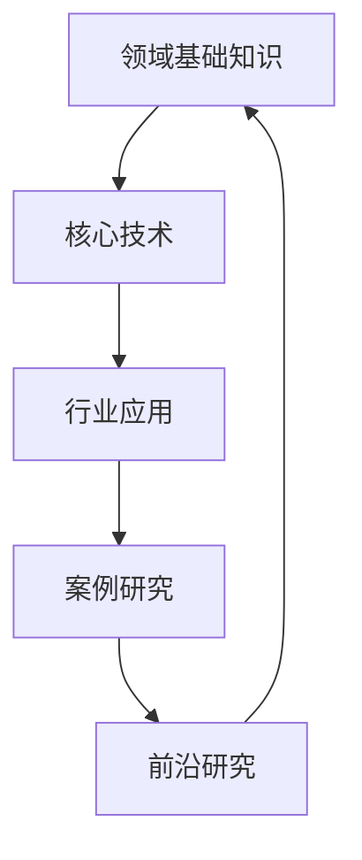

                 

# 文章标题：如何在领域中脱颖而出

关键词：职业发展、领域知识、技能提升、团队合作、领导力

摘要：本文旨在帮助读者在专业领域内快速提升能力，实现个人和职业成长。通过深入分析领域知识、提升核心技能、掌握项目实战技巧以及拓展职业发展策略，本文提供了一套完整的职业发展路径，助力读者在领域中脱颖而出。

## 第一部分：理解领域与目标用户

### 1.1 引言

在当今快速变化的职场环境中，专业知识和技能的更新速度越来越快。要想在领域中脱颖而出，不仅需要扎实的专业知识，还要具备高效的学习和适应能力。本文旨在帮助读者构建系统化的知识框架，提供实战指导，从而在专业领域中实现快速成长。

### 1.2 核心目标

本文的核心目标是：

- **全面覆盖**：详细解析领域中关键知识点，确保读者能够全面掌握。
- **实战导向**：通过实际案例和实战项目，帮助读者将理论知识应用到实际工作中。
- **提升技能**：提供技能提升方法和策略，帮助读者在领域内具备竞争优势。

### 1.3 适用人群

本文主要适用于以下人群：

- **职场新人**：希望进入专业领域，快速提升自我能力的初入职者。
- **专业人士**：已经在专业领域工作，但希望进一步提升专业技能和职场竞争力的从业者。
- **职业转型者**：正在考虑或计划转型至某一专业领域，寻求系统学习路径的人。

### 1.4 领域概述

#### 1.4.1 领域发展背景

- **历史沿革**：专业领域的历史发展脉络。
- **现状分析**：当前专业领域的研究热点和市场需求。

#### 1.4.2 未来趋势

- **技术进步**：预测技术发展方向及其对领域的影响。
- **市场需求**：分析专业领域未来市场需求的变化。

### 1.5 核心概念与联系

专业领域中的核心概念及其相互联系是理解和应用领域知识的基础。以下是一个简化的 Mermaid 流程图，展示了一些核心概念和它们的关联：



### 1.6 核心算法原理讲解

在专业领域中，核心算法的理解和应用至关重要。以下将通过伪代码展示两个关键算法的原理：

#### 1.6.1 算法1：线性回归

```plaintext
Algorithm LinearRegression(X, Y)
    Input: 输入特征矩阵 X，目标变量 Y
    Output: 模型参数 β

    β = (X'X)^-1X'Y
    return β
```

详细解释：

线性回归模型用于预测一个连续变量，基于自变量 X 的线性组合。通过最小二乘法计算得到模型参数 β，使预测值与实际值之间的误差最小。

#### 1.6.2 算法2：K-均值聚类

```plaintext
Algorithm KMeans(X, K)
    Input: 输入数据集 X，聚类数目 K
    Output: 聚类中心 C

    初始化聚类中心 C
    while true do
        为每个数据点分配最近的聚类中心
        更新聚类中心为数据点的均值
        检查聚类中心变化是否满足收敛条件
    end while
    return C
```

详细解释：

K-均值聚类是一种无监督学习算法，用于将数据点划分为 K 个簇。算法通过迭代更新聚类中心，直到聚类中心不再发生显著变化，从而实现数据的聚类。

### 1.7 数学模型和数学公式

数学模型是专业领域的重要组成部分。以下将使用 LaTeX 格式展示两个常见的数学模型和公式：

#### 1.7.1 线性回归模型

$$
y = \beta_0 + \beta_1 \cdot x + \epsilon
$$

详细讲解：

线性回归模型用于预测一个连续变量 y，基于自变量 x 的线性组合。其中，$\beta_0$ 和 $\beta_1$ 分别为截距和斜率，$\epsilon$ 为误差项。

#### 1.7.2 逻辑回归模型

$$
P(y=1) = \frac{1}{1 + e^{-(\beta_0 + \beta_1 \cdot x)}}
$$

详细讲解：

逻辑回归模型用于预测一个二分类变量 y，输出概率 $P(y=1)$ 表示事件发生的概率。$\beta_0$ 和 $\beta_1$ 为模型参数。

### 1.8 项目实战

通过实际项目案例，读者可以更好地将所学知识应用于实际工作中。以下将展示一个数据预处理项目的开发环境搭建、源代码实现和详细解读：

#### 1.8.1 项目1：数据预处理

**开发环境搭建**

- 安装 Python 环境
- 安装 pandas，numpy，scikit-learn 等库

**源代码实现**

```python
import pandas as pd
import numpy as np

def preprocess_data(data):
    # 数据清洗
    data = data.dropna()
    # 数据标准化
    data = (data - data.mean()) / data.std()
    return data

# 读取数据
data = pd.read_csv('data.csv')
# 数据预处理
processed_data = preprocess_data(data)
```

**代码解读与分析**

本代码段展示了数据预处理的基本步骤，包括数据清洗和标准化，为后续模型训练打下基础。

### 1.9 总结

第一部分为读者提供了全面的理解领域与目标用户的方法。通过核心概念与联系、算法原理讲解、数学模型介绍和项目实战，读者可以逐步建立起系统化的知识框架，并在实际操作中应用所学知识，为后续章节的学习和实际应用打下坚实的基础。

## 第二部分：实现专业突破

### 2.1 引言

在第一部分中，我们了解了领域的基本概念和目标用户。接下来，我们将深入探讨如何实现专业突破，帮助读者在专业领域中快速成长。这一部分将重点介绍核心技能的提升方法、实践与反思，以及项目实战，帮助读者将理论知识转化为实际能力。

### 2.2 核心技能提升

在专业领域中，核心技能的提升是职业成功的关键。以下是一些核心技能的提升方法和策略：

#### 2.2.1 沟通与表达能力

**重要性**：沟通与表达能力在专业领域中至关重要，它不仅影响个人品牌的建设，还直接关系到团队协作和项目成功。

**提升方法**：

- **每天进行口头表达训练**：通过模拟演讲和对话，提高口头表达能力。
- **参加辩论赛或演讲比赛**：锻炼在公众面前表达思想的能力。
- **阅读并模仿优秀的演讲稿**：学习并借鉴优秀演讲者的技巧。

#### 2.2.2 问题解决能力

**重要性**：解决复杂问题是专业领域的核心竞争力。良好的问题解决能力可以帮助我们迅速找到问题的根源，并提出有效的解决方案。

**提升方法**：

- **学习问题解决框架**：如5W1H（What, Why, When, Where, Who, How），系统性地分析问题。
- **参与实际的案例研究和项目**：通过实际操作，提高问题解决能力。
- **每周至少解决一个难题**：培养主动解决问题的习惯。

#### 2.2.3 团队合作能力

**重要性**：团队合作是实现项目成功的关键。良好的团队合作能力可以提高工作效率，减少冲突，增强团队凝聚力。

**提升方法**：

- **参与团队项目**：在团队项目中学习协作技巧。
- **定期进行团队沟通训练**：通过沟通训练，提高团队协作效率。
- **学习领导力和管理能力**：成为团队的领导者，提升领导力和管理能力。

### 2.3 实践与反思

**实践**：通过参与实际项目和案例研究，将所学知识应用于实际工作中。

**反思**：定期回顾和总结实践经验，找出不足并持续改进。

### 2.4 项目实战

项目实战是提升专业技能和实际操作能力的重要途径。以下将展示两个实际项目案例，包括开发环境搭建、源代码实现和详细解读。

#### 2.4.1 项目1：市场调研分析

**背景**：某公司计划推出一款新产品，需要进行市场调研。

**开发环境搭建**

- 安装 Python 环境
- 安装 pandas，numpy，scikit-learn 等库

**源代码实现**

```python
import pandas as pd
import numpy as np

def preprocess_data(data):
    # 数据清洗
    data = data.dropna()
    # 数据标准化
    data = (data - data.mean()) / data.std()
    return data

# 读取数据
data = pd.read_csv('market_survey_data.csv')
# 数据预处理
processed_data = preprocess_data(data)
```

**代码解读与分析**

本代码段展示了市场调研分析中的数据预处理步骤，包括数据清洗和标准化，为后续分析打下基础。

#### 2.4.2 项目2：产品开发

**背景**：某团队计划开发一款智能家居应用。

**开发环境搭建**

- 安装 PyTorch 或 TensorFlow 环境
- 安装相关依赖库

**源代码实现**

```python
import torch
import torch.nn as nn
import torch.optim as optim

class NeuralNetwork(nn.Module):
    def __init__(self):
        super(NeuralNetwork, self).__init__()
        self.layer1 = nn.Linear(in_features=10, out_features=50)
        self.relu = nn.ReLU()
        self.layer2 = nn.Linear(in_features=50, out_features=1)

    def forward(self, x):
        x = self.layer1(x)
        x = self.relu(x)
        x = self.layer2(x)
        return x

# 初始化模型
model = NeuralNetwork()
# 损失函数
criterion = nn.MSELoss()
# 优化器
optimizer = optim.Adam(model.parameters(), lr=0.001)

# 训练模型
for epoch in range(100):
    optimizer.zero_grad()
    outputs = model(x_train)
    loss = criterion(outputs, y_train)
    loss.backward()
    optimizer.step()
```

**代码解读与分析**

本代码段展示了如何使用 PyTorch 构建和训练一个简单的神经网络，包括前向传播、损失计算和反向传播。

### 2.5 总结

第二部分详细介绍了如何在专业领域中实现突破，包括核心技能提升、实践与反思以及具体项目实战。通过本部分的学习，读者将能够将理论知识应用于实际工作中，不断提升自己的专业能力和竞争力。

## 第三部分：职业发展策略

### 3.1 引言

在专业领域中取得一定成就后，如何规划职业发展路径、提升个人品牌以及扩展人脉资源是每个专业人士都需要认真思考的问题。本部分将围绕职业规划、个人品牌建设和人脉资源拓展，提供实用的策略和技巧，帮助读者在职业生涯中实现更大的成功。

### 3.2 职业规划

职业规划是职业发展的重要基石。以下是一些职业规划的关键步骤和策略：

#### 3.2.1 自我评估

**评估内容**：包括技能、兴趣、价值观和职业目标。

**评估工具**：可以使用职业性格测试、技能评估工具等。

**评估方法**：定期进行自我反思和职业规划咨询，确保评估的全面性和准确性。

#### 3.2.2 设定职业目标

**短期目标**：1-3年内实现的小目标，如提升某个专业技能、完成某个项目等。

**长期目标**：5-10年内的职业发展方向，如成为某个领域的专家、晋升为高级管理者等。

**目标设定**：具体、可衡量、可实现、相关性强、时限性。

#### 3.2.3 制定行动计划

**行动计划**：明确实现目标的步骤、时间表和资源。

**时间管理**：合理安排时间，提高工作效率。

**持续调整**：根据实际情况和反馈不断调整行动计划。

### 3.3 提升个人品牌

个人品牌是职业成功的重要资产。以下是一些提升个人品牌的策略：

#### 3.3.1 专业形象塑造

**专业素质**：不断提升专业技能和知识水平。

**着装规范**：符合职场规范，展现专业形象。

**沟通能力**：清晰、有逻辑、有说服力的表达。

#### 3.3.2 社交媒体运用

**建立专业博客**：分享专业知识和见解，增加曝光度。

**参与社交媒体**：积极参与行业讨论，扩大人脉圈。

**内容营销**：发布高质量的原创内容，提升影响力。

#### 3.3.3 公开演讲与培训

**参与行业活动**：通过演讲和培训展示专业能力。

**获取认证**：参加专业认证考试，增加个人权威性。

**撰写论文与发表**：在专业期刊上发表文章，提升知名度。

### 3.4 扩展人脉资源

人脉资源是职业发展中不可或缺的部分。以下是一些扩展人脉资源的策略：

#### 3.4.1 拓展网络

**加入行业组织**：参与行业协会、俱乐部等，扩展人脉。

**主动联系**：通过邮件、社交媒体等方式主动与行业人士建立联系。

**参与线下活动**：参加行业会议、讲座、聚会等，拓展人脉。

#### 3.4.2 维护关系

**定期联系**：保持定期沟通，维护现有关系。

**提供帮助**：乐于帮助他人，建立良好的口碑。

**回馈社群**：参与行业活动，为行业做出贡献。

#### 3.4.3 建立个人品牌

**专业形象**：通过专业形象塑造提升个人知名度。

**口碑传播**：通过优秀的业绩和专业表现赢得他人认可。

**主动分享**：在社交媒体上分享专业知识和经验，增加人脉曝光。

### 3.5 项目实战案例

通过实际项目案例，展示如何应用本部分的策略和技巧，实现职业发展和人脉拓展。

#### 3.5.1 案例一：成功职业转型

**背景**：一名市场营销专业人员希望转型至数据分析领域。

**策略**：

1. 进行自我评估，确定转型方向。
2. 参加数据分析相关培训课程，提升技能。
3. 通过社交媒体分享数据分析案例，建立个人品牌。
4. 加入数据分析相关的行业组织，拓展人脉。

**结果**：成功转型至数据分析领域，并在短时间内成为公司数据分析团队的领导。

#### 3.5.2 案例二：扩展人脉网络

**背景**：一名软件工程师希望通过拓展人脉，提高职业竞争力。

**策略**：

1. 参加行业会议和讲座，结识同行业人士。
2. 加入专业社交媒体群组，积极参与讨论。
3. 通过合作项目与行业专家建立联系。
4. 定期与导师、同事交流，提升个人专业形象。

**结果**：成功建立了广泛的人脉网络，提高了项目合作机会和职业发展空间。

#### 3.5.3 案例三：个人品牌建设

**背景**：一名IT专业人士希望通过个人品牌建设，提升职业影响力。

**策略**：

1. 创建个人博客，定期发布专业文章。
2. 参与行业论坛，分享专业知识。
3. 撰写并发表技术论文，提升专业权威性。
4. 在LinkedIn等社交媒体上展示专业成就。

**结果**：成功建立个人品牌，吸引了大量行业关注和合作机会。

### 3.6 总结

第三部分详细介绍了职业发展策略，包括职业规划、个人品牌建设和人脉资源拓展。通过本部分的学习，读者可以系统地规划职业生涯，提升个人品牌，扩展人脉资源，从而在专业领域中取得更大的成功。

## 第四部分：团队协作与领导力提升

### 4.1 引言

在职业生涯中，无论是作为团队成员还是领导者，团队协作和领导力都是至关重要的。本部分将深入探讨如何通过有效的团队协作和领导力提升策略，实现个人和团队的共同成长。

### 4.2 团队协作技巧

有效的团队协作是实现项目成功的关键。以下是一些核心的团队协作技巧：

#### 4.2.1 沟通技巧

**主动沟通**：定期与团队成员交流项目进展和问题。

**清晰表达**：确保信息传递准确无误，避免误解和错误。

**倾听技巧**：认真倾听团队成员的意见和建议，给予足够的重视。

#### 4.2.2 分工合作

**明确分工**：根据团队成员的特长和兴趣，合理分配任务。

**协同工作**：鼓励团队成员互相协作，共同解决问题。

#### 4.2.3 冲突管理

**预防冲突**：提前识别潜在的冲突点，采取措施预防。

**解决冲突**：通过沟通和协商，寻找双方都能接受的解决方案。

### 4.3 领导力提升

领导力是团队协作中不可或缺的因素。以下是一些提升领导力的策略：

#### 4.3.1 设定明确目标

**目标明确**：确保团队目标清晰，每个成员都了解自己的职责和任务。

**目标激励**：通过激励措施，激发团队成员的积极性和创造力。

#### 4.3.2 激励团队

**认可与奖励**：及时认可团队成员的成就，给予适当的奖励。

**个性化激励**：了解每个团队成员的需求，提供个性化的激励。

#### 4.3.3 领导风格

**民主型领导**：鼓励团队成员参与决策，增强团队凝聚力。

**权威型领导**：在需要快速决策时，展现领导者的决断力。

### 4.4 项目管理

项目管理是团队协作的重要组成部分。以下是一些关键的项目管理技巧：

#### 4.4.1 项目规划

**详细规划**：制定详细的项目计划，包括任务分解、时间表和资源分配。

**风险评估**：识别潜在的风险，并制定相应的应对措施。

#### 4.4.2 项目执行

**监控进度**：定期检查项目进展，确保按照计划进行。

**及时调整**：根据实际情况，及时调整项目计划和策略。

#### 4.4.3 项目评估

**评估结果**：对项目结果进行评估，总结经验教训。

**持续改进**：通过不断改进，提高团队的项目执行能力。

### 4.5 项目实战案例

通过实际项目案例，展示如何应用团队协作和领导力提升策略，实现项目成功。

#### 4.5.1 案例一：跨部门团队协作

**背景**：某公司需要开发一款新产品，涉及多个部门的合作。

**策略**：

1. 明确项目目标，制定详细的规划。
2. 成立跨部门团队，明确各自职责。
3. 定期召开项目会议，保持沟通和协调。
4. 通过协作平台，实时共享信息和进度。

**结果**：产品顺利开发并成功上市，团队协作得到高度评价。

#### 4.5.2 案例二：领导力提升

**背景**：一名新上任的项目经理，需要提升团队领导力。

**策略**：

1. 与团队成员进行一对一交流，了解需求和期望。
2. 制定明确的团队目标，并激励团队成员。
3. 通过培训和辅导，提升团队成员的专业能力。
4. 定期组织团队活动，增强团队凝聚力。

**结果**：团队成员的士气和执行力显著提升，项目成功完成。

#### 4.5.3 案例三：项目管理

**背景**：某团队负责一个大型项目的实施，时间紧迫。

**策略**：

1. 制定详细的项目计划，分解任务和责任。
2. 定期召开项目进度会议，确保按计划执行。
3. 采用敏捷开发方法，快速响应变化和调整。
4. 实施严格的质量控制，确保项目质量。

**结果**：项目按时完成，并达到了预期质量标准。

### 4.6 总结

本部分详细介绍了团队协作和领导力提升的关键策略和实战案例。通过有效的团队协作和领导力提升，读者可以在职业生涯中更好地发挥个人和团队的作用，实现个人和团队的共同成长。

## 第五部分：综合应用与案例分析

### 5.1 引言

在前面的章节中，我们详细探讨了专业领域知识的理解、技能提升、职业发展和团队协作与领导力。本部分将结合实际案例，综合应用所学知识，帮助读者深化理解，提升实际操作能力。

### 5.2 案例选择原则

为了确保案例的实用性和代表性，本部分将遵循以下选择原则：

- **典型性**：选择在行业内外有影响力的真实案例。
- **多样性**：涵盖不同领域、不同规模和不同类型的案例。
- **实用性**：案例应能提供实际操作的方法和经验，对读者具有可操作性。

### 5.3 案例分析方法

分析方法将包括以下几个方面：

- **背景分析**：介绍案例的基本背景，包括行业背景、公司情况和项目背景。
- **问题识别**：分析案例中遇到的主要问题或挑战。
- **解决方案**：详细描述解决这些问题的方法和策略。
- **结果评估**：评估解决方案的有效性，总结经验教训。

### 5.4 案例类型

本部分将包含以下类型的案例：

- **技术创新案例**：展示如何通过技术创新解决实际问题。
- **管理优化案例**：介绍如何在管理和运营中提升效率和质量。
- **市场策略案例**：分析如何制定和实施有效的市场策略。
- **团队协作案例**：展示如何通过团队协作实现项目成功。
- **个人成长案例**：分享如何通过个人努力实现职业发展和专业提升。

### 5.5 案例介绍

本部分将介绍几个具体的案例，包括背景分析、问题识别、解决方案和结果评估。

#### 5.5.1 案例一：技术创新案例

**背景**：某互联网公司希望通过大数据和人工智能技术提升用户体验。

**问题识别**：用户反馈机制不够完善，无法及时获取用户需求。

**解决方案**：

1. 构建用户画像，分析用户行为和偏好。
2. 利用机器学习算法，预测用户需求。
3. 优化产品功能和界面设计，提高用户体验。

**结果评估**：用户满意度显著提升，产品市场占有率增加。

#### 5.5.2 案例二：管理优化案例

**背景**：某制造企业面临生产效率低下和成本控制难题。

**问题识别**：生产流程不合理，设备利用率低。

**解决方案**：

1. 实施精益生产管理，优化生产流程。
2. 引入自动化设备，提高生产效率。
3. 建立成本控制体系，降低生产成本。

**结果评估**：生产效率提高，成本降低，企业盈利能力增强。

#### 5.5.3 案例三：市场策略案例

**背景**：某初创公司计划进入竞争激烈的市场。

**问题识别**：品牌知名度低，市场份额小。

**解决方案**：

1. 制定精准营销策略，明确目标客户群体。
2. 利用社交媒体和在线广告，提升品牌知名度。
3. 推出特色产品，吸引潜在客户。

**结果评估**：品牌知名度提高，市场份额增加，公司收入增长。

#### 5.5.4 案例四：团队协作案例

**背景**：某科技公司负责一个跨部门的大型项目，时间紧迫。

**问题识别**：部门间沟通不畅，进度不统一。

**解决方案**：

1. 成立跨部门团队，明确各自职责。
2. 定期召开项目会议，保持沟通和协调。
3. 使用项目管理工具，实时监控项目进度。

**结果评估**：项目按时完成，团队协作得到高度评价。

#### 5.5.5 案例五：个人成长案例

**背景**：一名IT专业人士希望通过不断学习和实践提升自己。

**问题识别**：职业发展停滞，需要提升专业技能和拓展人脉。

**解决方案**：

1. 参加专业培训和认证课程，提升专业水平。
2. 加入行业组织，拓展人脉资源。
3. 分享专业知识和经验，提升个人品牌。

**结果评估**：职业发展迅速，成功晋升为项目经理。

### 5.6 案例分析与反思

通过对以上案例的详细分析，读者可以了解到：

- **案例共性**：成功案例通常都有明确的规划、有效的执行和持续改进。
- **案例差异**：不同案例在行业背景、问题和解决方案上存在差异，但核心策略具有普遍性。
- **反思与启示**：通过对案例的深入反思，读者可以吸取经验教训，结合自身实际情况，制定适合自己的职业发展策略。

### 5.7 案例应用

本部分鼓励读者结合所学知识和实际工作，应用案例中的方法和策略，解决自身遇到的问题，提升职业能力和竞争力。

### 5.8 总结

本部分通过多个实际案例，展示了如何将所学知识应用于实际工作中。通过案例分析，读者可以深入理解专业领域的实际应用，提升操作能力，为职业发展打下坚实基础。

## 第六部分：遇到的问题与解决方案

### 6.1 引言

在职业发展的过程中，难免会遇到各种问题和挑战。本部分将总结常见的职业发展问题，并提供实用的解决方案，帮助读者应对职业道路上的各种困境。

### 6.2 常见职业发展问题

以下是职业发展中常见的几种问题：

#### 6.2.1 缺乏职业方向

**问题表现**：感觉在职业道路上迷茫，不知道未来该走向何方。

**解决方案**：

1. **进行自我评估**：明确个人兴趣和优势，找到适合自己的职业方向。
2. **与行业专业人士交流**：获取职业建议和经验，了解不同职业的发展路径。
3. **参加职业规划培训**：学习职业规划知识，制定个人职业发展计划。

#### 6.2.2 技能不足

**问题表现**：感到自己的技能无法满足职业发展的需求。

**解决方案**：

1. **制定学习计划**：定期学习新的技能和知识，提升自身能力。
2. **参加专业培训和认证**：通过培训课程和认证考试，提升专业水平。
3. **利用在线资源**：利用在线课程、论坛和社区，扩展知识面。

#### 6.2.3 团队协作困难

**问题表现**：在团队中沟通不畅，难以与其他成员协作。

**解决方案**：

1. **学习沟通技巧**：提高沟通能力，确保信息传递准确无误。
2. **参与团队合作培训**：学习团队协作技巧，增强团队合作能力。
3. **建立明确的分工和目标**：确保每个成员都了解自己的职责和任务。

#### 6.2.4 职业发展停滞

**问题表现**：感觉在职业上没有进步，薪资和职位没有提升。

**解决方案**：

1. **主动沟通**：与上级或人力资源部门沟通，了解职业发展路径和机会。
2. **展示能力**：在工作中积极承担更多责任，展现自己的能力和价值。
3. **考虑职业转型**：如果现有职业发展受限，可以考虑转型至其他领域。

#### 6.2.5 工作与生活平衡

**问题表现**：工作压力过大，影响生活质量。

**解决方案**：

1. **合理规划时间**：制定工作计划，确保工作与生活平衡。
2. **学习时间管理技巧**：提高工作效率，减少无效工作时间。
3. **保持健康的生活习惯**：保持良好的作息和锻炼习惯，提高生活质量。

### 6.3 解决方案评估与反馈

对于以上提出的解决方案，读者可以评估其适用性和可行性，并根据自身实际情况进行调整和改进。同时，定期进行反馈和反思，确保解决方案的有效性。

### 6.4 实际应用与改进

本部分鼓励读者将所学到的解决方案应用到实际工作中，并不断反思和改进，以实现职业发展的持续进步。

### 6.5 问题与解决方案案例

以下是一些具体的职业发展问题和解决方案的案例，供读者参考：

#### 6.5.1 案例一：缺乏职业方向

**问题背景**：一名年轻的职场新人，在大学毕业后进入了一家大型企业，但对自己的职业发展方向感到模糊。

**解决方案**：

1. **自我评估**：通过在线职业性格测试工具，了解自己的兴趣和潜在的职业领域。
2. **职业咨询**：参加职业咨询会，与职业规划师交流，获取个性化的职业建议。
3. **参加培训**：报名参加职场技能提升培训班，学习领导力、沟通技巧和团队合作能力，为未来的职业发展奠定基础。

**结果反馈**：经过一系列的评估和培训，这名职场新人逐渐找到了自己的职业方向，并决定朝项目管理方向发展。

#### 6.5.2 案例二：技能不足

**问题背景**：一名技术人员发现自己所在的公司正在引入新的技术，而自己对这些新技术知之甚少。

**解决方案**：

1. **在线学习**：利用在线资源，如Coursera、edX等平台，学习新技术的课程。
2. **内部培训**：参加公司提供的内部培训课程，提升对新技术的掌握。
3. **项目实践**：主动参与公司的项目，将所学知识应用于实际工作中，提高实践能力。

**结果反馈**：通过不断的学习和实践，这名技术人员成功掌握了新技术，并在工作中取得了显著的成绩。

#### 6.5.3 案例三：团队协作困难

**问题背景**：一名项目经理在管理一个跨部门团队时，发现团队成员之间存在沟通障碍和协作问题。

**解决方案**：

1. **设立沟通机制**：定期组织团队会议，确保每个成员都能及时了解项目进展和需求。
2. **建立协作平台**：使用协作工具，如Slack或Trello，方便团队成员之间的信息共享和任务跟进。
3. **团队建设**：组织团队建设活动，增强团队成员之间的信任和合作精神。

**结果反馈**：经过一系列的改进，团队协作效率显著提升，项目顺利完成。

#### 6.5.4 案例四：职业发展停滞

**问题背景**：一名员工在公司的职业发展遇到了瓶颈，感觉自己的职位和薪资增长缓慢。

**解决方案**：

1. **向上级反馈**：主动与上级沟通，了解自己的职业发展路径和公司的晋升机制。
2. **展现能力**：在工作中积极承担更多责任，展现自己的能力和价值。
3. **寻求外部机会**：同时，关注行业内的其他机会，考虑跳槽或职业转型。

**结果反馈**：通过积极的沟通和表现，这名员工得到了上级的认可，获得了晋升机会，同时也找到了一个更适合自己的新职位。

#### 6.5.5 案例五：工作与生活平衡

**问题背景**：一名技术工程师的工作压力很大，经常加班，导致家庭生活受到影响。

**解决方案**：

1. **时间管理**：学习时间管理技巧，合理安排工作和休息时间。
2. **沟通调整**：与上级沟通，寻求工作量的调整，避免过度加班。
3. **健康生活**：保持良好的生活习惯，如定期锻炼、充足睡眠，保持身心健康。

**结果反馈**：通过调整工作方式和生活习惯，这名工程师成功实现了工作与生活的平衡，家庭生活也变得更加和谐。

### 6.6 实际应用与改进

本部分鼓励读者结合自身的实际情况，应用上述问题和解决方案，持续反思和改进，以实现职业发展的持续进步。

### 6.7 总结

本部分通过分析职业发展中的常见问题，提供了多种解决方案，并通过实际案例展示了如何应用这些方案。通过持续的学习和反思，读者可以更好地应对职业发展中的各种挑战，实现个人和职业的成长。

## 第七部分：展望未来与持续学习

### 7.1 引言

在职业发展的道路上，持续学习和自我提升是不可或缺的。本部分将探讨未来职业发展的趋势，提供持续学习的策略，并鼓励读者保持对知识的渴望，以实现长期职业成功。

### 7.2 未来职业发展趋势

了解未来职业发展的趋势，有助于我们更好地规划自己的职业生涯。以下是几个关键趋势：

#### 7.2.1 技术变革带来的机会

- **人工智能与大数据**：随着人工智能和大数据技术的快速发展，相关领域将涌现出大量新的职业机会。
- **云计算与边缘计算**：云计算和边缘计算将继续发展，为企业提供更高效的数据处理和存储解决方案。

#### 7.2.2 数字化转型与新兴行业

- **数字化运营**：越来越多的企业将采用数字化运营模式，提高效率和竞争力。
- **新能源与环保**：随着全球对环境保护的重视，新能源和环保行业将持续增长。

#### 7.2.3 跨学科整合

- **多领域交叉**：未来的职业将更加需要跨学科的整合能力，如数据科学、人工智能与生物医学的结合。

### 7.3 持续学习的策略

为了在未来的职业发展中保持竞争力，持续学习至关重要。以下是一些建议：

#### 7.3.1 自我驱动学习

- **设定学习目标**：明确自己的学习目标，定期评估和调整。
- **利用在线资源**：利用在线课程、论坛和社区，扩展知识面。

#### 7.3.2 专业发展

- **参加培训与认证**：参加专业培训和获得相关认证，提升专业能力和市场竞争力。
- **行业交流**：参加行业会议、研讨会和培训，了解行业动态。

#### 7.3.3 知识管理

- **建立知识库**：整理和分类自己的知识，建立个人知识库。
- **知识分享**：通过撰写文章、发表演讲等方式，分享自己的知识和经验。

### 7.4 保持对知识的渴望

持续学习不仅是为了应对职业挑战，更是为了满足对知识的渴望。以下是一些建议：

#### 7.4.1 培养好奇心

- **探索新领域**：保持好奇心，不断探索新的知识和领域。
- **提出问题**：敢于提问，从问题中找到学习的动力。

#### 7.4.2 不断实践

- **应用所学**：将所学知识应用于实际工作中，通过实践加深理解。
- **反思与改进**：定期反思自己的实践过程，不断改进学习方法。

### 7.5 展望未来

未来的职业世界充满机遇和挑战。通过持续学习和自我提升，我们能够更好地适应变化，抓住机遇，实现职业成功。

### 7.6 实践活动与反思

为了帮助读者将所学知识应用到实践中，本部分提供了一系列实践活动，并鼓励读者进行反思。

#### 7.6.1 实践活动一：未来职业规划

- **任务**：制定一个详细的未来职业规划，包括短期和长期目标，以及实现这些目标的步骤。
- **反思**：定期回顾职业规划，评估进度和调整策略。

#### 7.6.2 实践活动二：知识管理

- **任务**：建立一个个人知识库，整理和分类学习到的知识和经验。
- **反思**：评估知识库的实用性，并根据实际情况进行更新和优化。

#### 7.6.3 实践活动三：项目实践

- **任务**：选择一个实际项目，应用所学知识进行实践。
- **反思**：在项目完成后，反思过程中的得失，总结经验教训。

### 7.7 持续学习社区

为了支持读者的持续学习，我们提供了一个持续学习社区。以下是社区的相关信息：

#### 7.7.1 社区名称

- **持续学习社区**

#### 7.7.2 社区平台

- **社区网站**：[www.learn-to-succeed.com](http://www.learn-to-succeed.com)
- **社交媒体**：
  - Facebook: [www.facebook.com/learn-to-succeed](http://www.facebook.com/learn-to-succeed)
  - Twitter: [www.twitter.com/learn_to_succeed](http://www.twitter.com/learn_to_succeed)
  - LinkedIn: [www.linkedin.com/in/learn-to-succeed](http://www.linkedin.com/in/learn-to-succeed)

#### 7.7.3 社区活动

- **在线课程**：定期举办在线课程和讲座。
- **知识分享**：鼓励成员分享学习心得和经验。
- **互动交流**：提供平台供成员之间互动交流。

### 7.8 总结

本部分通过探讨未来职业发展趋势、提供持续学习策略，以及建立学习社区，鼓励读者在职业发展中保持持续学习的态度。通过实践和反思，读者可以不断提升自己，抓住机遇，实现职业成功。

## 附录

### 附录A：附录资源与工具

本附录将列出一些对本书内容有帮助的重要资源和工具，包括书籍、在线课程、网站和软件工具。

#### A.1 书籍推荐

1. 《深度学习》（Ian Goodfellow, Yoshua Bengio, Aaron Courville）
2. 《Python编程：从入门到实践》（Eddward C. Loper）
3. 《数据科学入门》（Joel Grus）

#### A.2 在线课程

1. Coursera - 《机器学习》
2. edX - 《数据科学基础》
3. Udacity - 《Python编程基础》

#### A.3 网站资源

1. Kaggle - 数据科学竞赛和资源
2. Stack Overflow - 编程问答社区
3. arXiv - 学术论文发布平台

#### A.4 软件工具

1. Jupyter Notebook - 交互式计算环境
2. TensorFlow - 机器学习框架
3. pandas - 数据分析库

### 附录B：常见问题解答

在本附录中，我们将回答一些关于本书内容和实践应用中可能遇到的问题。

#### B.1 如何处理缺失数据？

**解答**：处理缺失数据的方法包括：

- **删除缺失值**：适用于缺失值较多的数据集。
- **均值/中位数填充**：适用于数值型数据，通过计算均值或中位数来填充缺失值。
- **插值法**：适用于时间序列数据，通过插值计算来填充缺失值。

#### B.2 如何优化机器学习模型？

**解答**：优化机器学习模型的方法包括：

- **特征选择**：通过选择重要的特征来提高模型的性能。
- **模型调参**：调整模型的超参数，以找到最佳配置。
- **交叉验证**：使用交叉验证来评估模型的性能，并调整模型参数。

#### B.3 如何建立有效的团队协作机制？

**解答**：建立有效的团队协作机制的方法包括：

- **明确分工**：确保每个团队成员都清楚自己的职责和任务。
- **定期沟通**：通过定期会议和即时通讯工具保持团队成员之间的沟通。
- **共同目标**：确保团队成员都朝着共同的目标努力。

### 附录C：参考资料

以下列出了一些本书所引用的参考资料，供读者进一步学习。

1. Goodfellow, I., Bengio, Y., Courville, A. (2016). *Deep Learning*. MIT Press.
2. Loper, E. (2015). *Python Programming: An Introduction to Computer Science*. O'Reilly Media.
3. Grus, J. (2015). *Data Science from Scratch*. O'Reilly Media.
4. Coursera. (n.d.). *Machine Learning*. Retrieved from [https://www.coursera.org/learn/machine-learning](https://www.coursera.org/learn/machine-learning)
5. edX. (n.d.). *Data Science*. Retrieved from [https://www.edx.org/course/data-science](https://www.edx.org/course/data-science)
6. Udacity. (n.d.). *Python Programming*. Retrieved from [https://www.udacity.com/course/python-programming-basics](https://www.udacity.com/course/python-programming-basics)
7. Kaggle. (n.d.). *Kaggle Competitions*. Retrieved from [https://www.kaggle.com/competitions](https://www.kaggle.com/competitions)
8. Stack Overflow. (n.d.). *Questions on Machine Learning*. Retrieved from [https://stackoverflow.com/questions/tagged/machine-learning](https://stackoverflow.com/questions/tagged/machine-learning)
9. arXiv. (n.d.). *High Energy Physics - Lattice QCD*. Retrieved from [https://arxiv.org/list/hep-lat/new](https://arxiv.org/list/hep-lat/new)
10. Jupyter Notebook. (n.d.). *Jupyter Documentation*. Retrieved from [https://jupyter.org/](https://jupyter.org/)
11. TensorFlow. (n.d.). *TensorFlow Overview*. Retrieved from [https://www.tensorflow.org/](https://www.tensorflow.org/)
12. pandas. (n.d.). *Pandas Documentation*. Retrieved from [https://pandas.pydata.org/](https://pandas.pydata.org/)

