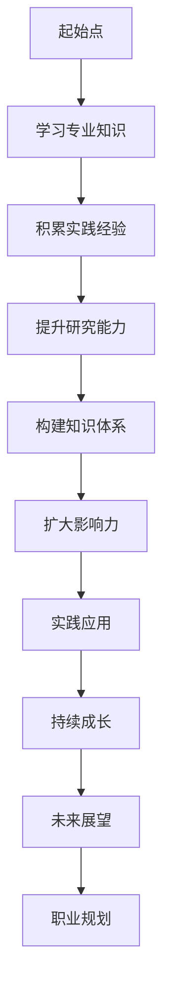
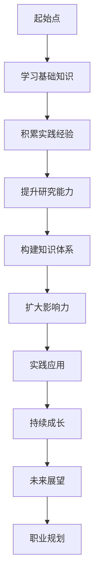

                 

### 《如何成为领域专家》

> **关键词**：领域专家、专业素质、知识积累、实践能力、技能提升、职业规划

> **摘要**：本文深入探讨如何成为领域专家，从素质与能力、领域深耕、技能提升以及职业规划四个方面详细解析领域专家的成长路径。通过核心概念联系、算法原理讲解、数学模型公式及项目实战，为读者提供实用且系统的指导。

领域专家是指在某一特定领域内具备深厚专业知识、丰富实践经验以及卓越研究能力的杰出人士。他们的存在不仅推动了领域的发展，还对社会进步产生了深远影响。那么，如何成为领域专家？本文将带你一步步探索这一成长过程。

---

### 第一部分：领域专家的素质与能力

#### 第1章：领域专家的定义与重要性

##### 1.1 领域专家的定义

领域专家是指在某一专业领域内具有丰富知识、实践经验和卓越研究能力的专家。他们不仅在理论上深入理解领域的核心概念和原理，而且在实践中能够解决复杂问题，推动领域的发展。

##### 1.2 领域专家的重要性

领域专家在各个领域都有着不可替代的作用。他们通过深入研究和实践，为领域的发展提供了方向性指导，同时也在技术创新、行业规范制定等方面发挥了重要作用。

##### 1.3 领域专家的能力构成

领域专家的能力主要包括以下几个方面：

1. **专业知识**：对领域内核心概念和原理的深入理解。
2. **实践经验**：通过实际项目积累的宝贵经验。
3. **研究能力**：对领域内问题进行深入研究并解决问题的能力。
4. **沟通能力**：与团队成员、客户和同行有效沟通的能力。
5. **学习能力**：不断学习新知识，适应领域发展的能力。

#### 第2章：成为领域专家的必要条件

##### 2.1 专业知识的积累

专业知识是领域专家的基石。要想成为领域专家，必须通过不断学习和实践，积累丰富的专业知识。

##### 2.2 实践经验的积累

实践经验是领域专家的重要能力之一。通过参与实际项目，领域专家能够积累宝贵的经验，提升自己的实践能力。

##### 2.3 持续学习的习惯

持续学习是领域专家不断进步的动力。领域专家需要保持对新知识、新技术的敏感度，不断提升自己的知识水平和技能。

##### 2.4 团队合作与沟通能力

领域专家不仅需要具备专业技能，还需要具备良好的团队合作和沟通能力。这有助于他们与团队成员、客户和同行有效协作，推动项目的顺利进行。

---

### 第二部分：领域深耕与专业拓展

#### 第3章：领域深耕的策略与方法

##### 3.1 选择合适的领域

选择合适的领域是成为领域专家的第一步。领域专家需要根据自己的兴趣、专业背景和市场需求，选择一个具有发展潜力的领域。

##### 3.2 深入了解领域知识

领域专家需要深入了解领域知识，包括核心概念、原理、技术发展和应用场景等。

##### 3.3 构建个人知识体系

构建个人知识体系有助于领域专家更好地理解和运用知识。通过整理和总结领域知识，领域专家可以形成自己的知识体系。

##### 3.4 持续追踪领域动态

领域专家需要持续追踪领域动态，了解最新的研究成果、技术发展和行业趋势。这有助于他们保持对领域的敏感度，并及时调整自己的研究方向。

#### 第4章：专业拓展与跨界合作

##### 4.1 专业拓展的重要性

专业拓展有助于领域专家拓宽视野，提高自身的综合素质。通过学习其他领域的知识，领域专家可以更好地解决跨领域问题。

##### 4.2 跨界学习的策略

跨界学习需要领域专家具备良好的学习能力、沟通能力和团队协作能力。通过参加跨领域课程、研讨会和项目，领域专家可以拓展自己的专业知识。

##### 4.3 跨界合作的机会与挑战

跨界合作可以带来新的发展机遇，但同时也面临一定的挑战。领域专家需要找到合适的跨界合作伙伴，共同推进项目的进展。

##### 4.4 跨界创新的实践案例

通过分析跨界创新的实践案例，领域专家可以了解跨界合作的成功经验，为自己的跨界创新提供借鉴。

---

### 第三部分：专家技能提升与影响力扩大

#### 第5章：提升专家技能的关键因素

##### 5.1 研究能力的培养

研究能力是领域专家的核心能力之一。通过培养研究能力，领域专家可以更好地解决领域内的复杂问题。

##### 5.2 解决复杂问题的能力

解决复杂问题是领域专家的重要任务。领域专家需要具备系统思维和问题解决能力，以应对领域内的挑战。

##### 5.3 演讲与表达能力

演讲与表达能力是领域专家扩大影响力的重要手段。通过良好的演讲与表达能力，领域专家可以更好地传播自己的研究成果和观点。

##### 5.4 咨询与指导能力

咨询与指导能力是领域专家为企业、组织和团队提供专业服务的核心。通过咨询与指导，领域专家可以帮助他人解决实际问题。

#### 第6章：扩大影响力的渠道与方法

##### 6.1 学术成果的发表

学术成果的发表是领域专家扩大影响力的重要途径。通过在顶级会议和期刊上发表文章，领域专家可以提升自己的学术地位。

##### 6.2 社交媒体的运用

社交媒体是领域专家扩大影响力的重要工具。通过在社交媒体上分享研究成果、观点和经验，领域专家可以吸引更多的关注者。

##### 6.3 行业会议与研讨会

参加行业会议与研讨会是领域专家扩大影响力的重要方式。通过参加这些活动，领域专家可以与同行交流、分享经验，并扩大自己的影响力。

##### 6.4 网络课程与培训

网络课程与培训是领域专家扩大影响力的重要手段。通过开设网络课程和举办培训活动，领域专家可以传授自己的专业知识，提升自己的影响力。

---

### 第四部分：成为领域专家的实践之路

#### 第7章：领域专家的成长路径

##### 7.1 从入门到精通的步骤

领域专家的成长路径通常包括从入门到精通的几个阶段。通过逐步积累知识和经验，领域专家可以不断提升自己的专业水平。

##### 7.2 常见困境与应对策略

在成长过程中，领域专家可能会遇到各种困境。了解这些困境，并掌握应对策略，有助于领域专家更快地克服困难。

##### 7.3 持续成长的方法

持续成长是领域专家保持竞争力的关键。通过不断学习、实践和反思，领域专家可以不断提升自己的能力和水平。

##### 7.4 成为领域专家的心路历程

成为领域专家是一段充满挑战和收获的心路历程。通过分享自己的成长经历，领域专家可以鼓励更多人投身于领域研究。

#### 第8章：领域专家的实际应用

##### 8.1 领域专家在企业中的应用

领域专家在企业中发挥着重要作用。通过提供专业咨询和解决方案，领域专家可以帮助企业提升竞争力。

##### 8.2 领域专家在科研与创新中的应用

领域专家在科研与创新中发挥着关键作用。通过深入研究和创新，领域专家可以推动领域的发展。

##### 8.3 领域专家在社会服务中的应用

领域专家在社会服务中发挥着重要作用。通过提供专业服务和技术支持，领域专家可以改善社会福祉。

---

### 第五部分：领域专家的职业规划与未来展望

#### 第9章：领域专家的职业发展方向

##### 9.1 领域专家的职业发展方向

领域专家的职业发展方向包括学术研究、企业技术领导、创业等。通过选择合适的发展方向，领域专家可以充分发挥自己的专业优势。

##### 9.2 职业规划的策略与建议

职业规划对于领域专家的发展至关重要。通过制定明确的职业规划，领域专家可以更好地实现自己的职业目标。

##### 9.3 领域专家的未来发展趋势

随着科技的不断发展，领域专家的未来发展趋势将呈现多样化。领域专家需要不断提升自己的能力和素质，以适应未来的挑战。

##### 9.4 领域专家的职业素养要求

领域专家需要具备良好的职业素养，包括专业素质、职业道德、团队合作精神等。通过不断提升职业素养，领域专家可以更好地发挥自己的作用。

---

### 附录

#### 附录A：领域专家技能表

##### A.1 技能表概述

领域专家需要具备一系列技能，包括专业知识、实践经验、研究能力、沟通能力和团队合作能力等。

##### A.2 技能提升路径

领域专家可以通过参加培训、实践项目、阅读专业书籍和参与学术交流等方式提升自己的技能。

#### 附录B：领域专家成长案例分享

##### B.1 成功案例分享

通过分析领域专家的成功案例，可以了解他们如何通过积累专业知识、实践经验以及提升研究能力，成为领域内的佼佼者。

##### B.2 失败案例分析

通过分析领域专家的失败案例，可以了解他们可能遇到的困境和挑战，以及如何应对这些困境。

##### B.3 学习与反思

通过分享领域专家的成长经历，可以鼓励读者从他们的经验中学习，不断反思自己的成长路径。

---

**Mermaid 流�程图：领域专家能力成长路径**



---

**核心算法原理讲解：知识积累与整合的伪代码**

```python
# 知识积累
def accumulate_knowledge(books):
    for book in books:
        read_book(book)
        summarize_book(book)

# 知识整合
def integrate_knowledge(summaries):
    knowledge_base = []
    for summary in summaries:
        if not is_duplicate(summary, knowledge_base):
            knowledge_base.append(summary)
            apply_knowledge(summary)
    return knowledge_base

# 伪代码辅助功能
def read_book(book):
    # 读取书籍内容
    pass

def summarize_book(book):
    # 总结书籍内容
    pass

def is_duplicate(summary, knowledge_base):
    # 判断总结是否为已有知识
    pass

def apply_knowledge(summary):
    # 应用新知识
    pass
```

---

**数学模型和数学公式**

**领域专家影响力公式**

$$
I = f(P, K, S)
$$

其中：

- \( I \) 表示影响力
- \( P \) 表示专业知识深度
- \( K \) 表示知识广度
- \( S \) 表示社交网络影响力

**详细讲解：**

- \( P \) 表示领域专家在特定领域内知识的深度，通常通过深入研究和实践经验积累。
- \( K \) 表示领域专家在相关领域的知识广度，通过广泛的阅读和研究获取。
- \( S \) 表示领域专家在社交网络中的影响力，通过公共演讲、发表论文和社交媒体活动等途径提高。

**举例说明：**

假设一名数据科学家在机器学习领域有深厚的专业知识（\( P = 0.9 \)），并且在多个相关领域如统计学、计算机科学等也有丰富的知识（\( K = 0.7 \)），同时在社交媒体上有着大量的关注者（\( S = 0.8 \)），则其影响力 \( I \) 可以通过公式计算得出：

$$
I = f(0.9, 0.7, 0.8) = 0.9 \times 0.7 \times 0.8 = 0.504
$$

---

**项目实战：构建领域专家知识体系**

**环境搭建：**

- 开发环境：Jupyter Notebook
- 工具：Python、Scikit-learn、TensorFlow

**代码实现：**

```python
# 导入所需库
import numpy as np
import pandas as pd
from sklearn.model_selection import train_test_split
from sklearn.ensemble import RandomForestClassifier

# 加载数据
data = pd.read_csv('domain_expert_knowledge.csv')

# 数据预处理
X = data.drop('is_expert', axis=1)
y = data['is_expert']

# 分割数据集
X_train, X_test, y_train, y_test = train_test_split(X, y, test_size=0.2, random_state=42)

# 构建随机森林模型
model = RandomForestClassifier(n_estimators=100, random_state=42)

# 训练模型
model.fit(X_train, y_train)

# 评估模型
accuracy = model.score(X_test, y_test)
print(f'Model accuracy: {accuracy:.2f}')

# 预测单个实例
new_expert = pd.DataFrame([{
    'years_of_experience': 10,
    'publications': 5,
    'conferences_attended': 3,
    'social_media_followers': 1000
}])

predicted_expert = model.predict(new_expert)
print(f'New expert prediction: {"Expert" if predicted_expert[0] else "Not an Expert"}')
```

**代码解读与分析：**

- **数据加载与预处理**：首先从 CSV 文件中加载数据集，然后进行数据预处理，将特征变量 \( X \) 和目标变量 \( y \) 分离。
- **模型构建与训练**：使用随机森林算法构建分类模型，并使用训练集数据进行模型训练。
- **模型评估**：通过测试集数据评估模型的准确性。
- **实例预测**：使用训练好的模型对新的专家数据实例进行预测，判断该实例是否为领域专家。

---

通过上述目录大纲和内容，我们可以为《如何成为领域专家》这本书提供一个完整的框架，覆盖领域专家的定义、素质与能力、专业深耕、技能提升以及职业规划等关键内容。同时，通过实际的项目实战案例，读者可以更深入地理解如何成为领域专家的实践路径。

---

**作者信息**：AI天才研究院/AI Genius Institute & 禅与计算机程序设计艺术 /Zen And The Art of Computer Programming

本文深入探讨了如何成为领域专家，从素质与能力、领域深耕、技能提升以及职业规划四个方面详细解析了领域专家的成长路径。通过核心概念联系、算法原理讲解、数学模型公式及项目实战，为读者提供了实用且系统的指导。希望本文能对广大读者在成为领域专家的道路上有所帮助。

---

### 第1章：领域专家的定义与重要性

#### 1.1 领域专家的定义

领域专家是指在某一特定领域内具有深厚专业知识、丰富实践经验以及卓越研究能力的杰出人士。他们不仅对领域的核心概念和原理有深入理解，而且在实践中能够解决复杂问题，推动领域的发展。领域专家通常具备以下特点：

1. **专业知识丰富**：领域专家在特定领域内积累了大量的理论知识，对领域内的核心概念、原理和技术有深入理解。
2. **实践经验丰富**：通过参与实际项目，领域专家积累了丰富的实践经验，能够应对各种复杂问题。
3. **研究能力强**：领域专家具备较强的研究能力，能够对领域内的关键问题进行深入研究，并提出解决方案。
4. **沟通能力强**：领域专家需要具备良好的沟通能力，能够与团队成员、客户和同行有效沟通，推动项目的顺利进行。
5. **学习能力**：领域专家需要具备持续学习的能力，能够不断更新自己的知识体系，适应领域发展的需求。

#### 1.2 领域专家的重要性

领域专家在各个领域都有着不可替代的作用。他们通过深入研究和实践，为领域的发展提供了方向性指导，同时也在技术创新、行业规范制定等方面发挥了重要作用。以下是领域专家的一些具体重要性：

1. **推动技术创新**：领域专家在研究和实践中不断探索新的技术和方法，推动了领域内的技术创新和发展。
2. **提高行业竞争力**：领域专家为企业提供了专业的技术支持和解决方案，帮助企业提高竞争力，提升市场地位。
3. **促进知识传播**：领域专家通过发表学术论文、撰写专业书籍和参加学术会议等方式，促进了领域内知识的传播和共享。
4. **培养新一代人才**：领域专家通过指导学生和年轻从业者，培养了一大批新一代领域专家，为领域的发展奠定了基础。
5. **解决复杂问题**：领域专家在解决领域内复杂问题时，能够提供专业的指导和建议，提高问题的解决效率。

#### 1.3 领域专家的能力构成

领域专家的能力构成主要包括以下几个方面：

1. **专业知识**：领域专家需要具备丰富的专业知识，包括领域内的核心概念、原理、技术发展和应用场景等。通过不断学习和实践，领域专家能够深入理解这些知识，并将其应用于实际问题中。
   
2. **实践经验**：实践经验是领域专家的重要能力之一。通过参与实际项目，领域专家能够积累宝贵的经验，了解实际问题的复杂性和多样性，从而更好地解决这些问题。

3. **研究能力**：领域专家需要具备较强的研究能力，能够对领域内的关键问题进行深入研究，并提出创新性的解决方案。研究能力包括问题分析、方案设计、实验验证等多个方面。

4. **沟通能力**：领域专家需要具备良好的沟通能力，能够与团队成员、客户和同行有效沟通。沟通能力包括口头表达、书面表达和倾听等方面，通过有效的沟通，领域专家能够更好地理解需求，推动项目的进展。

5. **团队合作能力**：领域专家需要具备团队合作能力，能够与团队成员协同工作，共同完成项目。团队合作能力包括协调、合作、分享和领导等方面。

6. **学习能力**：领域专家需要具备持续学习的能力，能够不断更新自己的知识体系，适应领域发展的需求。学习能力包括自我学习、知识整合和知识迁移等方面。

7. **解决问题的能力**：领域专家需要具备解决复杂问题的能力，能够在面对复杂问题时，运用自己的专业知识、实践经验和研究能力，提出有效的解决方案。

8. **创新能力**：领域专家需要具备创新能力，能够在研究和实践中探索新的思路和方法，推动领域的发展。创新能力包括思维创新、方法创新和技术创新等方面。

9. **领导能力**：对于某些领域的领导角色，领域专家需要具备领导能力，能够带领团队完成复杂项目，并在团队中发挥榜样作用。

10. **影响力**：领域专家需要在领域内具有一定的影响力，能够通过发表学术论文、参加学术会议、撰写专业书籍等方式，影响和推动领域的发展。

综上所述，领域专家的能力构成是一个多维度、综合性的体系，涵盖专业知识、实践经验、研究能力、沟通能力、团队合作能力、学习能力、解决问题的能力、创新能力、领导能力和影响力等多个方面。只有通过全面提升这些能力，领域专家才能在领域内发挥重要作用，推动领域的发展。

---

### 第2章：成为领域专家的必要条件

#### 2.1 专业知识的积累

专业知识是成为领域专家的基础。要成为领域专家，首先需要具备扎实的专业知识，这包括对领域内的核心概念、原理、技术和发展趋势的深入理解。以下是如何积累专业知识的一些建议：

1. **广泛阅读**：阅读是积累专业知识的重要途径。领域专家应该广泛阅读相关的书籍、论文和报告，了解领域内的最新研究成果和发展动态。通过阅读，可以拓宽知识面，深入了解领域的各个方面。

2. **系统学习**：除了广泛阅读，系统学习也是积累专业知识的重要方法。可以通过参加专业课程、培训或在线学习平台，系统地学习领域内的基础知识。系统学习有助于构建完整的知识体系，为后续的深入研究打下基础。

3. **学术交流**：参加学术会议、研讨会和工作坊是积累专业知识的好方法。在这些活动中，可以与领域内的专家学者进行交流，了解他们的研究成果和思考方式。学术交流有助于拓宽视野，提高研究水平。

4. **实践应用**：将理论知识应用于实际项目中，是积累专业知识的重要途径。通过实际项目，可以深入理解理论知识的实际应用，发现并解决实际问题。实践应用有助于将理论知识转化为实际能力。

5. **跨学科学习**：领域专家不仅需要掌握本领域的知识，还需要了解相关领域的知识。跨学科学习有助于拓宽视野，提高解决复杂问题的能力。例如，在计算机科学领域，了解数学、统计学、物理学等学科的知识，有助于更好地理解和应用计算机科学原理。

6. **持续更新**：领域知识不断更新，领域专家需要持续学习，不断更新自己的知识体系。可以通过关注专业期刊、网站、博客等渠道，了解领域内的最新研究进展和动态。持续更新知识有助于保持专业竞争力。

#### 2.2 实践经验的积累

实践经验是成为领域专家的关键。通过实际项目，领域专家可以积累宝贵的经验，提高解决实际问题的能力。以下是如何积累实践经验的一些建议：

1. **参与项目**：积极参与各种项目，特别是与自己研究领域相关的项目。通过项目实践，可以深入了解项目的需求和挑战，积累实际操作经验。

2. **团队合作**：在项目中与团队成员紧密合作，学习团队合作的方法和技巧。团队合作能力对于领域专家非常重要，有助于项目顺利推进。

3. **解决问题**：在实际项目中，会遇到各种复杂问题。通过解决问题，可以提升自己的问题解决能力，积累宝贵的经验。

4. **反思总结**：项目完成后，进行反思和总结，分析项目中的成功经验和失败教训。通过反思总结，可以不断提升自己的实践能力。

5. **实践经验分享**：将自己的实践经验分享给他人，通过教学、撰写博客或发表文章等方式，传播经验和知识。分享实践经验有助于巩固自己的知识，同时也有助于他人的学习和成长。

6. **跨领域实践**：尝试参与不同领域的项目，拓宽实践经验。跨领域实践有助于提升综合素质，提高解决复杂问题的能力。

7. **实践经验记录**：记录自己的实践经验，包括项目背景、任务、解决方案、结果等。这些记录可以成为宝贵的知识资产，有助于未来的学习和研究。

#### 2.3 持续学习的习惯

持续学习是成为领域专家的重要条件。领域知识不断更新，领域专家需要不断学习，以保持自己的专业竞争力。以下是如何培养持续学习习惯的一些建议：

1. **制定学习计划**：制定明确的学习计划，包括学习目标、学习内容、学习时间等。通过制定学习计划，可以确保学习有条不紊地进行。

2. **合理安排时间**：合理安排时间，保证每天有足够的时间用于学习。可以通过设定固定的学习时间，确保学习计划的执行。

3. **利用碎片时间**：利用碎片时间进行学习，例如在上下班途中、午休时间等。通过利用碎片时间，可以高效地利用时间，不断提升自己。

4. **学习工具和资源**：利用各种学习工具和资源，例如在线课程、电子书、学术论文等。通过利用这些工具和资源，可以方便地获取所需的知识。

5. **实践与学习相结合**：将所学知识应用于实际项目中，通过实践加深对知识的理解。实践与学习相结合有助于巩固知识，提高实际能力。

6. **参与学术交流**：参加学术会议、研讨会和工作坊，与领域内的专家学者进行交流。通过学术交流，可以了解最新的研究动态和趋势，拓宽视野。

7. **反思与总结**：在学习过程中，进行反思和总结，分析自己的学习效果和学习方法。通过反思总结，可以不断优化学习策略，提高学习效率。

8. **培养好奇心**：保持好奇心，对领域内的未知和前沿问题保持关注。好奇心有助于激发学习动力，推动持续学习。

9. **设立学习目标**：设立明确的学习目标，通过实现目标来激励自己。学习目标可以是短期的，也可以是长期的，通过不断实现目标，可以不断提升自己的能力。

通过持续学习，领域专家可以不断更新自己的知识体系，提高自己的专业素质，从而在领域内保持竞争力。

#### 2.4 团队合作与沟通能力

团队合作与沟通能力是领域专家必备的重要能力之一。在一个项目中，领域专家不仅需要具备专业技能，还需要具备良好的团队合作和沟通能力，以推动项目的顺利进行。以下是如何提升团队合作与沟通能力的一些建议：

1. **明确角色与职责**：在团队中，每个成员都有自己的角色和职责。领域专家需要明确自己的角色和职责，确保在项目中能够发挥最大的作用。

2. **积极沟通**：与团队成员保持积极的沟通，及时分享项目进展、遇到的问题和解决方案。通过有效沟通，可以确保团队成员之间的信息畅通，避免误解和冲突。

3. **倾听与理解**：在沟通中，要注重倾听他人的意见和建议，理解他人的观点和需求。通过倾听和理解，可以更好地与他人合作，共同推进项目。

4. **尊重差异**：团队成员来自不同的背景和专业领域，可能会有不同的观点和意见。领域专家需要尊重差异，学会包容和理解，以建立和谐的团队氛围。

5. **协作解决问题**：在项目中遇到问题时，与团队成员共同分析问题，提出解决方案，并协作实施。通过团队合作，可以充分发挥每个人的优势，提高解决问题的效率。

6. **积极反馈**：在项目过程中，给予团队成员积极的反馈，鼓励他们的努力和成就。通过积极反馈，可以增强团队的凝聚力，提升团队士气。

7. **培养团队意识**：培养团队意识，将个人目标和团队目标结合起来，确保项目成功。通过培养团队意识，可以提升团队的协作能力和整体绩效。

8. **冲突管理**：在团队中，难免会出现冲突。领域专家需要学会冲突管理，通过有效的方法和技巧，解决冲突，确保团队稳定和谐。

9. **领导力**：在某些情况下，领域专家可能需要承担领导角色，带领团队完成任务。通过培养领导力，可以更好地指导和激励团队成员，确保项目成功。

通过提升团队合作与沟通能力，领域专家可以更好地与他人合作，推动项目的顺利进行，提高团队的整体绩效。

#### 2.5 案例分析：如何通过实践经验提升专业能力

在实际工作中，实践经验对于领域专家的专业能力提升至关重要。以下是一个具体案例，说明如何通过实践经验提升专业能力：

**案例背景**：张伟是一名软件工程师，专注于人工智能领域。他在一家科技公司工作，参与了多个与人工智能相关的项目。

**实践经验**：

1. **项目参与**：张伟参与了公司的一个智能语音识别项目。该项目旨在开发一种高效的语音识别系统，用于客服中心和智能音箱等领域。在项目中，他负责设计语音识别算法、优化模型性能和调试系统。

2. **问题解决**：在项目实施过程中，张伟遇到了一些挑战，例如噪声干扰、语音变化和长语音处理等。他通过查阅文献、请教专家和实际实验，找到了有效的解决方案，提高了语音识别的准确性。

3. **团队合作**：张伟与项目团队成员紧密合作，共同解决技术难题。他参与了多个团队的头脑风暴会议，分享自己的见解和建议，推动了项目的进展。

4. **总结与反思**：项目完成后，张伟进行了详细的总结和反思。他记录了项目中的关键技术和经验，分析了遇到的问题和解决方案，并撰写了项目报告。

**专业能力提升**：

1. **技术能力**：通过参与项目，张伟深入了解了语音识别的原理和技术，提高了自己在该领域的专业能力。他掌握了多种语音处理算法，能够设计和优化语音识别系统。

2. **问题解决能力**：在实际问题解决过程中，张伟培养了敏锐的洞察力和分析能力。他学会了如何从多个角度分析问题，找到最佳的解决方案。

3. **团队合作能力**：通过与团队成员的密切合作，张伟提高了自己的团队合作能力。他学会了如何与他人沟通、协作和共同解决问题。

4. **总结与表达能力**：在总结和反思过程中，张伟学会了如何有效地总结和表达自己的观点。他能够清晰地阐述项目的关键技术和经验，提高了自己的表达能力。

**经验分享**：

张伟将自己在项目中的实践经验总结为以下几点：

1. **实践是提升专业能力的最佳途径**：通过参与实际项目，可以深入了解领域的核心技术和实际问题，提高专业能力。

2. **团队合作是关键**：与团队成员紧密合作，共同解决技术难题，可以提升团队合作能力。

3. **持续学习和反思**：通过不断学习和反思，可以不断提高自己的专业水平，解决更多复杂问题。

通过这个案例，我们可以看到，实践经验对于领域专家的专业能力提升至关重要。通过参与项目，领域专家可以深入理解领域技术，培养问题解决能力和团队合作能力，从而在专业道路上不断进步。

#### 2.6 持续学习的策略

持续学习是领域专家保持竞争力的重要手段。在科技日新月异的今天，领域知识不断更新，领域专家需要不断学习，以跟上领域的发展步伐。以下是一些实用的持续学习策略：

1. **制定学习计划**：为了确保学习效果，领域专家可以制定详细的学习计划。学习计划应包括学习目标、学习内容、学习时间和学习方法。通过制定学习计划，可以有条不紊地进行学习，确保学习目标的实现。

2. **利用在线资源**：互联网提供了丰富的学习资源，包括在线课程、学术论文、技术博客和专业论坛等。领域专家可以利用这些资源，进行有针对性的学习。例如，可以在Coursera、edX等平台上选择与领域相关的课程，通过系统学习，提升自己的专业素养。

3. **阅读专业书籍**：专业书籍是领域知识的重要来源。领域专家应定期阅读专业书籍，特别是经典著作和前沿研究成果。通过阅读专业书籍，可以深入理解领域的核心概念和最新技术动态。

4. **参与学术会议**：学术会议是领域专家交流研究成果和前沿动态的重要平台。通过参与学术会议，可以了解领域内的最新研究进展，拓展学术视野，结识同行。

5. **实践项目**：实践是检验学习成果的重要手段。领域专家应积极参与实际项目，将所学知识应用于实际操作中。通过实践项目，可以加深对知识的理解，提高实际操作能力。

6. **建立学习小组**：与同行建立学习小组，通过互相学习、讨论和分享，可以提升学习效果。学习小组可以定期组织讨论会、读书会和学术沙龙，共同探讨领域问题。

7. **利用碎片时间**：利用碎片时间进行学习，例如在上下班途中、午休时间和周末等。通过高效利用碎片时间，可以节省出更多完整的学习时间，提高学习效率。

8. **定期总结和反思**：定期总结和反思学习过程，分析学习效果和不足，调整学习策略。通过反思和总结，可以不断优化学习方法，提高学习效果。

通过以上策略，领域专家可以不断提升自己的专业知识和实践能力，保持自己在领域内的竞争力。

---

### 第3章：领域深耕的策略与方法

#### 3.1 选择合适的领域

选择合适的领域是成为领域专家的第一步。一个合适的领域不仅能够激发个人的兴趣，还需要具备一定的市场需求和发展潜力。以下是一些选择合适领域的方法和建议：

1. **个人兴趣**：选择自己感兴趣的领域，能够提高学习的积极性和动力。领域专家往往对自己所从事的领域有浓厚的兴趣，这种兴趣能够驱动他们持续深入学习。

2. **市场需求**：选择市场需求旺盛的领域，可以确保自己所学的内容具有实用价值，从而提高就业竞争力和职业发展空间。可以通过行业报告、市场调研等途径了解各个领域的发展趋势和市场需求。

3. **发展潜力**：选择有发展潜力的领域，可以预见未来可能的变化和机遇。可以通过关注科技前沿、政策导向和国际合作等信息，判断一个领域的发展潜力。

4. **个人优势**：结合自己的专业背景和技能优势，选择一个能够发挥自身优势的领域。例如，如果你擅长编程，可以选择与软件工程、人工智能相关的领域。

5. **导师指导**：寻求导师或行业内资深专家的建议，他们可以提供宝贵的经验和建议，帮助你更好地了解各个领域的实际情况和未来发展趋势。

6. **行业动态**：关注行业动态，了解各个领域的技术创新和应用场景。通过参加行业会议、研讨会和展览等活动，可以获取最新的行业信息，帮助自己做出更明智的选择。

7. **跨领域学习**：在确定领域后，适当进行跨领域学习，拓宽自己的知识面。跨领域学习可以帮助你更好地理解领域间的联系，发现新的研究点和应用场景。

通过以上方法，你可以更准确地选择一个合适的领域，为成为领域专家奠定坚实的基础。

#### 3.2 深入了解领域知识

深入了解领域知识是成为领域专家的重要步骤。这不仅仅是掌握理论知识，还包括理解领域内的核心概念、原理和技术，以及如何将这些知识应用于实际问题中。以下是一些深入了解领域知识的方法：

1. **阅读经典文献**：阅读经典文献是获取领域知识的重要途径。经典文献通常包含了领域内的核心理论和经典案例，通过阅读这些文献，可以建立扎实的理论基础。

2. **学习专业课程**：参加大学课程、在线课程或专业培训班，可以系统地学习领域知识。通过课程学习，可以了解领域的系统结构和关键知识点。

3. **参与实际项目**：通过参与实际项目，可以将理论知识应用于实际问题中。实际项目可以帮助你理解理论知识的实际应用，培养解决实际问题的能力。

4. **学术交流**：参加学术会议、研讨会和工作坊，与领域内的专家学者进行交流。通过学术交流，可以了解最新的研究动态和前沿技术，拓宽视野。

5. **撰写学术论文**：撰写学术论文是深入理解领域知识的重要方法。通过撰写论文，你需要对领域知识进行系统梳理和总结，这有助于加深对知识的理解。

6. **阅读专业书籍和期刊**：定期阅读专业书籍和期刊，了解领域内的最新研究成果和技术动态。专业书籍和期刊通常包含了领域内的权威观点和深度分析。

7. **参与学术研究**：参与导师或同事的科研项目，可以深入了解领域内的研究方法和方向。通过参与研究，可以提升自己的研究能力和创新能力。

8. **实践案例分析**：通过分析成功和失败的项目案例，了解领域内常见的问题和解决方案。案例分析有助于你从实践中学习，提高解决问题的能力。

通过以上方法，你可以逐步深入理解领域知识，为成为领域专家奠定坚实的基础。

#### 3.3 构建个人知识体系

构建个人知识体系是成为领域专家的重要步骤之一。一个完善的知识体系不仅有助于你系统地掌握领域知识，还能帮助你更好地应对复杂问题。以下是如何构建个人知识体系的建议：

1. **明确学习目标**：首先，明确你的学习目标，这包括你希望达到的知识深度和广度。通过设定具体的学习目标，可以更有针对性地进行学习。

2. **分类知识**：将知识分为不同的类别，例如理论基础、实践技巧、最新研究等。分类有助于你系统地整理知识，并更容易查找和运用。

3. **使用工具**：利用各种工具和资源，例如思维导图、笔记软件、在线百科等，帮助你整理和记录知识。这些工具可以帮助你建立清晰的知识结构。

4. **定期复习**：定期复习所学知识，巩固记忆。通过定期复习，可以确保你的知识体系保持更新和有效。

5. **知识整合**：将不同来源的知识进行整合，形成自己的独特见解。知识整合有助于你深入理解领域的核心概念和原理。

6. **构建知识网络**：通过了解领域内的关键概念、原理和技术，构建知识网络。知识网络有助于你理解知识间的联系，提高解决问题的能力。

7. **应用实践**：将所学知识应用于实际项目中，通过实践检验和巩固知识。实践应用是构建知识体系的重要环节。

8. **持续学习**：保持持续学习的习惯，及时更新知识体系。领域知识不断更新，只有持续学习，才能保持竞争力。

通过以上方法，你可以构建一个完善的个人知识体系，为成为领域专家奠定坚实的基础。

#### 3.4 持续追踪领域动态

持续追踪领域动态是成为领域专家的重要步骤之一。通过了解领域内的最新研究成果、技术发展和行业趋势，领域专家可以保持对领域的敏感度，并及时调整自己的研究方向。以下是一些追踪领域动态的方法：

1. **订阅专业期刊**：订阅领域内的专业期刊和学术杂志，定期阅读最新发表的论文和研究报告。通过阅读期刊，可以了解领域内的前沿研究成果和最新进展。

2. **关注学术会议**：关注领域内的学术会议和研讨会，通过参会了解最新的研究动态和前沿技术。参加学术会议是获取领域内最新信息的重要途径。

3. **阅读技术博客**：阅读知名技术博客和在线论坛，关注领域内的重要讨论和观点。技术博客和论坛通常包含了大量的技术见解和实践经验，有助于你拓宽视野。

4. **参加行业活动**：参加行业会议、展览和研讨会，与领域内的专家学者进行交流。通过参加行业活动，可以了解行业趋势和市场需求，为自己的研究方向提供新的思路。

5. **网络课程与培训**：参加在线课程和培训班，学习最新的技术和方法。网络课程和培训是提升自己专业素养的有效途径。

6. **社交媒体**：关注领域内的知名专家和行业组织，通过社交媒体了解他们的最新动态和研究成果。社交媒体是获取信息、交流和分享的重要平台。

7. **建立个人知识库**：建立一个个人知识库，收集和整理领域内的关键信息和研究成果。通过整理和总结，可以更好地掌握领域的核心概念和原理。

通过以上方法，你可以持续追踪领域动态，保持对领域的敏感度，为成为领域专家提供有力的支持。

---

### 第4章：专业拓展与跨界合作

#### 4.1 专业拓展的重要性

专业拓展是领域专家成长过程中不可或缺的一部分。通过拓展专业知识，领域专家不仅能够拓宽自己的知识面，提高综合素质，还能够应对更多复杂的问题。以下是专业拓展的重要性：

1. **提高解决问题的能力**：专业拓展有助于领域专家掌握更多相关领域的知识，从而在面对复杂问题时，能够从不同角度进行分析和解决。

2. **提升创新能力**：专业拓展可以激发领域专家的创新思维，通过跨学科知识的结合，创造出新的解决方案和研究成果。

3. **增强职业竞争力**：具备广泛专业知识的能力，使领域专家在就业市场中更具竞争力，能够适应更多岗位的需求。

4. **推动领域发展**：专业拓展有助于领域专家在新的领域内开展研究，推动领域的发展，为学术界和工业界做出更大贡献。

#### 4.2 跨界学习的策略

跨界学习是领域专家扩展专业知识的重要途径。以下是一些跨界学习的策略：

1. **确定拓展方向**：根据个人兴趣和职业规划，确定专业拓展的方向。可以是在自己领域内的相关领域，也可以是其他领域的知识。

2. **系统学习**：通过参加相关课程、培训班或自学，系统地学习拓展领域的知识。可以选择在线课程、专业书籍、学术论文等多种学习资源。

3. **实践应用**：将所学知识应用于实际项目中，通过实践加深对知识的理解和运用。实践是检验学习效果的重要手段。

4. **参与学术交流**：参加相关领域的学术会议、研讨会和工作坊，与专家学者进行交流，了解最新的研究动态和前沿技术。

5. **建立学习小组**：与同行建立学习小组，共同探讨和学习拓展领域的知识。通过团队学习，可以互相激励、分享经验，提高学习效果。

6. **利用碎片时间**：利用碎片时间进行学习，例如在上下班途中、午休时间和周末等。通过高效利用时间，可以积累更多的知识。

#### 4.3 跨界合作的机会与挑战

跨界合作是领域专家扩展影响力和提升专业能力的有效方式。以下是一些跨界合作的机会与挑战：

1. **机会**：

   - **资源共享**：通过跨界合作，可以共享资源，如设备、数据和人才，提高研究效率。

   - **优势互补**：不同领域的专家可以互补优势，共同攻克复杂问题。

   - **拓展视野**：跨界合作有助于领域专家拓宽视野，了解其他领域的知识和方法。

   - **增加影响力**：跨界合作可以增加领域专家在多个领域的影响力，提高知名度。

2. **挑战**：

   - **沟通障碍**：不同领域的专业术语和思维方式可能存在差异，沟通障碍可能影响合作效果。

   - **技术差异**：不同领域的技术和方法可能存在差异，需要时间和精力进行整合和适应。

   - **时间管理**：跨界合作通常涉及多个领域，需要良好的时间管理能力，确保每个领域的工作都得到充分关注。

   - **风险承担**：跨界合作可能面临更大的风险，需要承担更多的不确定性。

#### 4.4 跨界创新的实践案例

以下是一些跨界创新的实践案例，展示了领域专家如何通过跨界合作推动领域发展：

1. **医疗与人工智能**：医疗领域与人工智能的结合，产生了许多创新应用。例如，通过人工智能算法分析医疗图像，可以提高诊断准确性。一些医疗机构与科技公司合作，开发智能医疗系统，提高了医疗服务的效率和质量。

2. **教育与游戏化**：教育领域与游戏化的结合，推动了在线教育的创新。通过将游戏元素融入教育过程，可以激发学生的学习兴趣，提高学习效果。一些教育机构与游戏开发团队合作，开发了基于游戏化的学习平台，受到了广泛欢迎。

3. **制造与物联网**：制造业与物联网的结合，推动了智能制造的发展。通过物联网技术，可以实时监控生产线设备的状态，实现生产过程的智能化和自动化。一些制造企业与科技公司合作，建立了智能工厂，提高了生产效率和质量。

4. **金融与区块链**：金融领域与区块链的结合，推动了金融科技的创新发展。通过区块链技术，可以实现去中心化的金融交易，提高交易的安全性和透明度。一些金融机构与区块链公司合作，开发了基于区块链的支付系统和金融产品，提升了金融服务的效率。

这些跨界创新的实践案例表明，领域专家通过跨界合作，不仅推动了领域的发展，也为社会带来了更多的创新成果。通过借鉴这些案例，领域专家可以更好地开展跨界合作，推动自己的专业发展。

---

### 第5章：提升专家技能的关键因素

#### 5.1 研究能力的培养

研究能力是领域专家的核心能力之一。通过培养研究能力，领域专家可以更好地解决领域内的复杂问题，推动领域的发展。以下是如何培养研究能力的一些建议：

1. **选题**：选题是研究的第一步，一个好的选题能够为研究提供明确的方向。领域专家应该选择具有实际应用价值和研究意义的问题进行深入研究。

2. **文献调研**：在进行研究之前，进行充分的文献调研是必要的。通过查阅相关领域的学术论文、书籍和报告，可以了解已有的研究成果和未解决的问题。

3. **问题定义**：在文献调研的基础上，明确研究问题，将问题具体化。问题定义有助于明确研究的重点和目标，确保研究有针对性和可操作性。

4. **理论分析**：对研究问题进行理论分析，运用相关理论和方法对问题进行深入探讨。理论分析有助于构建研究的理论基础，为后续的实证研究提供指导。

5. **实证研究**：通过实证研究，验证理论分析的结果。实证研究可以采用实验、调查、案例研究等方法，收集数据并对数据进行分析。

6. **论文撰写**：撰写研究报告和论文是研究成果的总结和表达。通过撰写论文，可以系统化研究成果，使其为学术界和工业界所认可。

7. **学术交流**：参与学术会议、研讨会和工作坊，与领域内的专家学者进行交流。通过学术交流，可以获取反馈和建议，进一步提升研究质量。

8. **持续学习**：研究能力是不断发展的，领域专家需要持续学习，掌握最新的研究方法和工具。通过不断学习，可以提升研究能力，保持竞争力。

通过以上方法，领域专家可以培养和提升自己的研究能力，为领域的发展做出贡献。

#### 5.2 解决复杂问题的能力

解决复杂问题是领域专家的重要职责之一。复杂问题通常涉及多个方面，需要领域专家具备系统思维和综合能力。以下是如何提升解决复杂问题的能力的一些建议：

1. **分析问题**：首先，对复杂问题进行深入分析，明确问题的核心和关键点。通过分析，可以了解问题的本质和影响因素。

2. **分解问题**：将复杂问题分解为若干个子问题，逐一解决。分解问题有助于降低问题的复杂性，使问题更易于处理。

3. **系统思维**：运用系统思维，从整体和全局的角度考虑问题。系统思维有助于领域专家理解问题之间的联系，发现潜在的解决方案。

4. **多角度分析**：从多个角度对问题进行分析，考虑问题的各个方面。多角度分析有助于发现问题的不同解决方案，提高问题的解决效率。

5. **实验验证**：通过实验验证假设，验证解决方案的有效性。实验验证是解决复杂问题的有效方法，有助于领域专家验证自己的假设。

6. **团队合作**：解决复杂问题通常需要团队合作。领域专家需要与团队成员紧密合作，发挥各自的优势，共同解决问题。

7. **持续迭代**：在解决问题的过程中，采用迭代方法，不断优化解决方案。通过持续迭代，可以逐步完善解决方案，提高问题的解决质量。

8. **反思总结**：在问题解决后，进行反思和总结，分析问题解决的过程和结果。通过反思总结，可以积累经验，提升解决复杂问题的能力。

通过以上方法，领域专家可以提升解决复杂问题的能力，为领域的发展做出更大贡献。

#### 5.3 演讲与表达能力

演讲与表达能力是领域专家扩大影响力的重要手段。通过有效的演讲和表达，领域专家可以传播自己的研究成果和观点，吸引更多的关注和支持。以下是如何提升演讲与表达能力的一些建议：

1. **准备充分**：演讲前，对内容进行充分的准备。了解听众的需求，梳理演讲结构，准备演讲稿和PPT。准备充分的演讲可以增强演讲的自信心和说服力。

2. **清晰表达**：在演讲中，清晰表达是关键。使用简单的语言，避免使用过于专业或复杂的术语。确保演讲内容易于理解，使听众能够跟上演讲的思路。

3. **逻辑结构**：构建清晰的逻辑结构，使演讲内容有条理。可以通过提纲或思维导图等方式，确保演讲内容连贯、逻辑清晰。

4. **生动举例**：通过生动的举例和案例，使演讲内容更具说服力。举例可以帮助听众更好地理解抽象的理论和概念，增强演讲的生动性。

5. **互动交流**：在演讲中，鼓励与听众互动，回答听众的问题。互动交流可以增强听众的参与感，使演讲更具有互动性。

6. **声音与肢体语言**：运用声音和肢体语言，增强演讲的表现力。通过控制语速、音调和节奏，以及适当的肢体动作，可以使演讲更加生动和有吸引力。

7. **练习演讲**：通过反复练习，提升演讲技巧。可以在家人、朋友或同事面前进行演讲练习，获得反馈和建议，不断改进演讲水平。

8. **反馈与改进**：在演讲后，收集听众的反馈，了解演讲的优点和不足。通过反馈和改进，可以不断提高演讲的质量和效果。

通过以上方法，领域专家可以提升自己的演讲与表达能力，扩大影响力，为领域的发展做出更大的贡献。

#### 5.4 咨询与指导能力

咨询与指导能力是领域专家在企业和组织中发挥作用的重要能力。通过提供专业的咨询和指导，领域专家可以帮助企业解决技术难题，提高竞争力。以下是如何提升咨询与指导能力的一些建议：

1. **深入了解需求**：在与客户或企业沟通时，首先深入了解他们的需求。通过详细询问和交流，可以明确客户的实际问题和期望，从而提供更有针对性的解决方案。

2. **全面掌握知识**：领域专家需要具备扎实的专业知识，能够应对各种技术问题和挑战。通过不断学习和实践，不断提升自己的专业素养，确保在咨询过程中能够提供高质量的指导。

3. **提出专业建议**：在咨询过程中，领域专家需要根据客户的需求和实际情况，提出专业、可行的建议。这些建议应基于扎实的理论基础和丰富的实践经验，确保能够解决实际问题。

4. **有效沟通**：领域专家需要具备良好的沟通能力，能够清晰、准确地传达自己的观点和建议。通过有效的沟通，可以确保客户理解咨询内容，并积极配合实施。

5. **跟踪项目进展**：在提供咨询和指导后，领域专家应跟踪项目的进展，确保解决方案的有效实施。通过定期检查和反馈，可以及时发现和解决潜在问题，确保项目成功完成。

6. **反馈与改进**：在项目完成后，收集客户的反馈，了解咨询效果和客户的满意度。通过反馈和改进，可以不断优化咨询和指导服务，提高客户满意度。

7. **积累案例**：通过积累成功案例，提升自己的咨询与指导能力。成功案例不仅可以作为咨询能力的证明，还可以为新客户提供参考，增强信任。

8. **持续学习**：领域知识不断更新，领域专家需要保持持续学习，了解最新的技术趋势和发展动态。通过不断学习，可以保持专业竞争力，为咨询和指导提供更全面的支持。

通过以上方法，领域专家可以提升自己的咨询与指导能力，为企业提供专业、高效的服务，推动企业的发展。

---

### 第6章：扩大影响力的渠道与方法

#### 6.1 学术成果的发表

学术成果的发表是领域专家扩大影响力的重要途径。通过在顶级会议和期刊上发表文章，领域专家可以展示自己的研究成果和观点，提升自己在学术界的知名度。以下是如何通过学术成果的发表扩大影响力的一些建议：

1. **选题**：选择具有创新性和实际应用价值的研究课题。好的选题能够吸引读者的注意力，提高论文的引用率。

2. **撰写论文**：撰写高质量的论文，确保论文的结构清晰、逻辑严密、论据充分。在撰写过程中，注意使用专业术语，确保论文的专业性和可读性。

3. **选择合适的期刊和会议**：选择适合自己研究领域、影响力大、审稿周期合理的期刊和会议进行投稿。通过选择合适的平台，可以提高论文的接受率和影响力。

4. **修改与反馈**：在收到审稿人的反馈后，认真对待修改意见，对论文进行修改和完善。通过多次修改，提高论文的质量，增加被接受的可能性。

5. **学术交流**：参加学术会议，与同行进行交流。在会议上展示自己的研究成果，回答听众的问题，扩大学术影响力。

6. **合作与推荐**：与领域内的知名学者合作，共同撰写论文。通过合作，可以提升论文的质量和影响力。同时，可以请同行推荐论文，增加论文的接受率。

7. **宣传与推广**：在论文发表后，利用社交媒体、博客等渠道进行宣传和推广。通过宣传，可以吸引更多的读者关注自己的研究成果，提高论文的引用率和影响力。

通过以上方法，领域专家可以通过学术成果的发表，扩大自己的学术影响力，为领域的发展做出更大贡献。

#### 6.2 社交媒体的运用

社交媒体是领域专家扩大影响力的重要工具。通过在社交媒体上分享研究成果、观点和经验，领域专家可以吸引更多的关注者，提升自己的影响力。以下是如何通过社交媒体的运用扩大影响力的一些建议：

1. **选择合适的平台**：根据目标受众和领域特点，选择合适的社交媒体平台。例如，学术研究人员可以选择LinkedIn、ResearchGate等学术社交平台，程序员可以选择GitHub、Stack Overflow等技术社区。

2. **内容创作**：创作高质量的内容，包括研究论文、技术博客、经验分享、观点评论等。内容应具有实用性、专业性和独特性，能够吸引读者的兴趣。

3. **定期更新**：保持社交媒体账号的定期更新，发布最新的研究成果、观点和动态。通过持续更新，可以保持关注者的兴趣和关注。

4. **互动交流**：积极与关注者互动，回答他们的问题，参与讨论。通过互动，可以增加关注者的粘性，提升账号的影响力。

5. **分享经验**：分享自己的专业经验和成功案例，为他人提供有价值的指导和建议。通过分享经验，可以提升自己的专业形象和影响力。

6. **合作与推广**：与其他领域专家合作，共同分享研究成果和经验。通过合作，可以扩大影响力，吸引更多的关注者。

7. **利用数据分析**：利用社交媒体平台提供的分析工具，了解自己的账号表现、关注者特征和互动情况。通过数据分析，可以优化内容策略，提高影响力。

通过以上方法，领域专家可以通过社交媒体的运用，扩大自己的影响力，为领域的发展做出更大贡献。

#### 6.3 行业会议与研讨会

参加行业会议与研讨会是领域专家扩大影响力的重要方式。通过这些活动，领域专家可以与同行交流、分享经验，展示自己的研究成果，提升自己的专业地位。以下是如何通过行业会议与研讨会扩大影响力的一些建议：

1. **选择合适的会议与研讨会**：根据研究领域和目标，选择合适的行业会议与研讨会。可以通过查阅行业报告、学术期刊和社交媒体等渠道，了解会议的主题、议程和参会人员。

2. **准备演讲和展示**：如果有机会进行演讲或展示，提前准备高质量的演讲稿和PPT。确保内容具有创新性、实用性和专业性，能够吸引听众的注意。

3. **积极参与讨论**：在会议期间，积极参与讨论和交流，与同行分享自己的观点和见解。通过积极交流，可以扩大自己的专业网络，提升影响力。

4. **建立联系**：与会议中的专家学者建立联系，通过交换名片、社交媒体关注等方式，保持长期联系。通过建立联系，可以拓展合作机会，提高自己的影响力。

5. **撰写会议报告**：在会议结束后，撰写会议报告，总结会议的主要内容和自己的心得体会。通过撰写报告，可以分享会议的价值和收获，吸引更多的关注。

6. **发表论文**：在会议期间或结束后，可以考虑将演讲内容或研究成果转化为学术论文，投稿到相关的学术期刊或会议。通过发表论文，可以进一步扩大自己的影响力。

7. **宣传与推广**：利用社交媒体、个人网站和邮件列表等渠道，宣传自己在会议中的参与情况和研究成果。通过宣传，可以吸引更多的关注者，提升影响力。

通过以上方法，领域专家可以通过参加行业会议与研讨会，扩大自己的影响力，为领域的发展做出更大贡献。

#### 6.4 网络课程与培训

网络课程与培训是领域专家扩大影响力的重要渠道之一。通过开设网络课程和举办培训活动，领域专家可以传授自己的专业知识，吸引更多的学生和从业者，提升自己的专业地位。以下是如何通过网络课程与培训扩大影响力的一些建议：

1. **确定课程主题**：根据自身的专业领域和受众需求，确定网络课程的主题。课程主题应具有实用性和吸引力，能够满足学生的学习需求。

2. **制定课程大纲**：制定详细的课程大纲，明确每节课的教学目标、内容安排和学习方法。通过合理的课程设计，确保课程内容系统、条理清晰。

3. **选择平台**：选择适合的平台进行课程录制和发布。可以根据受众分布和课程内容，选择在线教育平台、视频网站或个人博客等。

4. **准备教学资源**：准备丰富的教学资源，包括PPT、视频、案例和实践指导等。通过多种形式的教学资源，可以提高学生的学习效果。

5. **互动与答疑**：在网络课程中，设置互动环节，鼓励学生提问和讨论。通过互动，可以增强学生的参与感，提高学习兴趣。

6. **持续更新**：定期更新课程内容，反映最新的研究成果和技术动态。通过持续更新，可以保持课程的新鲜感和吸引力。

7. **建立社区**：在课程结束后，建立学习社区，提供持续的学习和交流平台。通过社区，可以促进学生之间的互动，提升课程的影响力。

8. **推广与宣传**：利用社交媒体、个人网站和邮件列表等渠道，宣传自己的网络课程和培训活动。通过推广，可以吸引更多的学生和从业者，扩大影响力。

通过以上方法，领域专家可以通过网络课程与培训，扩大自己的影响力，为领域的发展做出更大贡献。

---

### 第7章：成为领域专家的实践之路

#### 7.1 从入门到精通的步骤

成为领域专家是一个持续的过程，从入门到精通需要经过多个阶段。以下是从入门到精通的步骤：

1. **入门阶段**：了解领域的基本概念、原理和技术。通过阅读入门书籍、参加基础课程和实践活动，建立初步的知识体系。

2. **基础阶段**：深入学习领域的基础知识和核心技术。通过阅读专业书籍、学术论文和参加专业培训，提升自己的专业素养。

3. **进阶阶段**：掌握领域的前沿技术和研究动态。通过参加学术会议、研讨会和研究项目，了解最新的研究成果和未来发展方向。

4. **精通阶段**：成为领域的专家，具备解决复杂问题的能力。通过深入研究、独立研究和实际应用，提升自己的研究水平和创新能力。

#### 7.2 常见困境与应对策略

在成为领域专家的过程中，可能会遇到各种困境。以下是一些常见的困境及应对策略：

1. **知识断层**：应对策略：制定详细的学习计划，逐步补充知识断层。可以通过阅读专业书籍、参加在线课程和请教专业人士来解决。

2. **实践不足**：应对策略：积极参与实际项目，将理论知识应用于实践。可以通过参与实习、志愿者工作或自主开发项目来积累实践经验。

3. **研究困难**：应对策略：寻求导师或同行的指导，共同探讨研究问题。可以通过参与学术讨论、撰写研究论文和参加研究小组来提升研究能力。

4. **时间管理**：应对策略：合理安排时间，确保学习与实践的平衡。可以通过制定学习计划、设置优先级和利用碎片时间来提高学习效率。

5. **缺乏动力**：应对策略：找到学习的兴趣点，设定明确的目标。可以通过设定短期和长期目标、获得成就感来保持学习动力。

#### 7.3 持续成长的方法

持续成长是成为领域专家的关键。以下是一些持续成长的方法：

1. **终身学习**：保持学习的习惯，不断更新知识体系。可以通过阅读专业书籍、参加培训课程和参加学术会议来持续学习。

2. **实践应用**：将所学知识应用于实际问题中，通过实践提升能力。可以通过参与实际项目、自主开发项目和参与学术研究来实现。

3. **学术交流**：积极参与学术交流，与同行分享经验和见解。可以通过参加学术会议、研讨会和撰写学术论文来拓展视野。

4. **专业拓展**：跨学科学习，拓宽知识面。可以通过学习相关领域的知识、参加跨学科课程和合作研究来提升综合素质。

5. **反思总结**：定期反思自己的学习和实践过程，总结经验教训。可以通过撰写学习日志、参与反思小组和进行个人评估来提升自我认知。

#### 7.4 成为领域专家的心路历程

成为领域专家是一条充满挑战和收获的道路。以下是一位领域专家的心路历程：

**入门阶段**：初识领域，充满好奇心和热情。通过阅读入门书籍和参加基础课程，初步建立知识体系。

**基础阶段**：深入学习领域知识，逐步掌握核心技术。通过阅读专业书籍、学术论文和参加专业培训，提升自己的专业素养。

**进阶阶段**：关注领域前沿，参与研究项目，提升研究能力。通过参加学术会议、研讨会和实际项目，了解最新的研究成果和未来发展方向。

**精通阶段**：成为领域专家，具备解决复杂问题的能力。通过深入研究、独立研究和实际应用，提升自己的研究水平和创新能力。

**心路历程总结**：成为领域专家需要持续的努力和学习。在成长过程中，经历了从迷茫到坚定、从困惑到突破的阶段。通过不断的实践和反思，逐渐形成了自己的研究思路和风格，最终在领域内取得了显著成绩。

---

### 第8章：领域专家的实际应用

#### 8.1 领域专家在企业中的应用

领域专家在企业中发挥着关键作用，他们通过提供专业的技术指导和解决方案，帮助企业提高竞争力，推动业务发展。以下是一些领域专家在企业中的应用场景：

1. **技术指导**：领域专家可以在企业内担任技术顾问，为企业提供专业的技术指导。他们帮助企业解决技术难题，优化技术架构，提高系统性能。

2. **项目领导**：领域专家可以担任项目负责人，领导项目团队完成关键项目。通过他们的专业知识和经验，确保项目按计划顺利进行，实现预期目标。

3. **技术培训**：领域专家可以为企业员工提供技术培训，提升团队的技术能力和整体水平。通过培训，员工可以掌握最新的技术动态和应用方法，提高工作效率。

4. **产品研发**：领域专家参与企业的产品研发过程，提供技术支持和创新思路。他们帮助企业开发具有竞争力的产品，满足市场需求。

5. **战略规划**：领域专家可以为企业的战略规划提供技术指导，帮助企业把握行业趋势，制定长远发展计划。

6. **咨询服务**：领域专家可以为企业提供咨询服务，帮助企业解决特定的技术问题或业务挑战。通过专业咨询，企业可以更快地解决问题，提高业务效率。

#### 8.2 领域专家在科研与创新中的应用

领域专家在科研与创新中扮演着重要角色，他们通过深入研究和创新，推动领域的发展，促进科技进步。以下是一些领域专家在科研与创新中的应用场景：

1. **基础研究**：领域专家在基础研究领域进行深入探索，研究新理论、新方法和技术。他们的研究成果为后续的应用研究提供了坚实的基础。

2. **应用研究**：领域专家将基础研究成果应用于实际问题中，解决实际需求。他们通过应用研究，将理论转化为实际应用，推动技术创新。

3. **跨学科研究**：领域专家跨学科合作，整合不同领域的知识和方法，开展跨学科研究。通过跨学科研究，可以解决更加复杂的问题，推动领域的发展。

4. **技术创新**：领域专家在技术创新中发挥着关键作用，他们通过创新思维和方法，开发出新的技术、产品和服务。技术创新可以提升企业的竞争力，推动行业的进步。

5. **专利申请**：领域专家可以为企业或研究机构申请专利，保护技术创新成果。通过专利申请，可以确保技术创新的权益，推动技术的商业化应用。

6. **国际合作**：领域专家通过国际合作，与国内外同行共同开展研究项目。通过国际合作，可以共享资源、知识和技术，推动领域的国际化发展。

#### 8.3 领域专家在社会服务中的应用

领域专家在社会服务中发挥着重要作用，他们通过提供专业的技术支持和解决方案，改善社会福祉，推动社会进步。以下是一些领域专家在社会服务中的应用场景：

1. **技术咨询**：领域专家为政府部门、非营利组织和社区提供技术咨询，帮助他们解决技术问题，提升服务质量。

2. **公益项目**：领域专家参与公益项目，利用自己的专业知识和技能，为弱势群体提供技术支持和帮助。例如，在自然灾害救援、公共卫生等领域，领域专家可以提供专业的技术支持。

3. **教育培训**：领域专家参与教育培训项目，为学校、培训机构和社区提供技术课程和培训，提升公众的技术素养。

4. **科技普及**：领域专家通过科技普及活动，向公众传播科学知识和技术，提高公众的科学素养。例如，通过举办科技展览、讲座和科普文章，领域专家可以激发公众对科学的兴趣。

5. **政策建议**：领域专家为政府提供技术政策建议，参与制定科技发展规划和行业标准。他们的建议有助于推动科技创新和产业发展。

6. **社会创新**：领域专家通过社会创新，推动社会问题的解决。他们利用技术创新和社会创新方法，解决社会问题，提高社会福祉。

通过在社会服务中的应用，领域专家不仅为社会提供了专业的技术支持，还推动了社会的进步和发展。

---

### 第9章：领域专家的职业规划与未来展望

#### 9.1 领域专家的职业发展方向

领域专家的职业发展方向多样，可以根据个人兴趣、专业特长和市场需求选择合适的发展路径。以下是几个常见的职业发展方向：

1. **学术研究**：从事学术研究，成为大学或研究机构的教授或研究员。在学术领域，领域专家可以通过发表高水平论文、参与科研项目和培养下一代领域人才来推动领域发展。

2. **企业高管**：在企业中担任高级管理职位，如CTO（首席技术官）、技术总监等。在企业高层，领域专家可以参与企业的战略规划、技术决策和团队管理，推动企业技术创新和业务发展。

3. **技术咨询**：提供专业的技术咨询服务，为企业、政府和组织解决技术难题。作为技术顾问，领域专家可以通过深入分析和诊断，提出切实可行的解决方案。

4. **创业**：创办自己的企业，将研究成果和技术应用于实际业务中。创业领域专家可以利用自己的专业知识和创新能力，开发新产品、新服务，推动市场创新。

5. **政策制定**：参与政府或行业组织的政策制定和标准制定，为科技发展提供建议。领域专家可以通过政策研究和咨询，为政府决策提供科学依据，推动科技创新和产业升级。

#### 9.2 职业规划的策略与建议

为了实现自己的职业目标，领域专家需要制定明确的职业规划，并采取有效的策略。以下是一些职业规划的策略与建议：

1. **自我评估**：了解自己的兴趣、优势和职业目标。通过自我评估，明确自己的发展方向和职业需求。

2. **设定目标**：制定短期和长期职业目标。短期目标可以是提升专业技能、获得相关证书等；长期目标可以是成为领域专家、担任重要职位等。

3. **学习与发展**：持续学习和提升自己的专业能力。通过参加培训课程、研讨会和学术会议，不断更新知识体系，提升专业素养。

4. **积累经验**：积极参与实际项目，积累丰富的实践经验。通过实际项目，可以了解行业动态，提升解决实际问题的能力。

5. **建立人脉**：扩大专业人脉，建立良好的合作关系。通过参与行业活动、社交网络和学术交流，结识领域内的专家学者，为职业发展提供支持。

6. **适应变化**：保持灵活和适应性，随时准备应对职业变化。在科技快速发展的今天，领域专家需要不断调整自己的职业规划，以适应新的行业趋势。

7. **反馈与调整**：定期反思和评估职业规划的实施情况，根据实际情况进行调整。通过反馈和调整，可以确保职业规划的有效性和可执行性。

#### 9.3 领域专家的未来发展趋势

随着科技的不断进步和社会的快速发展，领域专家的未来发展趋势呈现出多样化和复合化。以下是几个领域专家未来发展的趋势：

1. **跨学科融合**：领域专家将在跨学科融合中发挥重要作用。随着人工智能、大数据、云计算等技术的快速发展，跨学科研究将成为领域发展的新趋势。领域专家需要具备跨学科的知识和技能，以应对复杂问题。

2. **远程办公与协作**：随着远程办公技术的普及，领域专家可以更加灵活地进行工作。通过视频会议、在线协作工具等，领域专家可以实现跨地域的协作，提高工作效率。

3. **持续教育与学习**：随着知识更新速度的加快，领域专家需要不断学习和更新知识。持续教育和终身学习将成为领域专家未来发展的必备条件。

4. **影响力扩大**：领域专家的影响力将不断扩大。通过学术成果发表、社交媒体运营、行业会议参与等，领域专家可以扩大自己的学术影响力和社会影响力。

5. **社会服务与公益**：领域专家将在社会服务与公益领域发挥更大作用。他们可以通过技术支持、教育培训、技术咨询等方式，为弱势群体提供帮助，推动社会进步。

6. **创新与创业**：领域专家将在创新与创业中发挥重要作用。他们可以利用自己的专业知识和创新能力，开发新产品、新服务，推动产业创新。

#### 9.4 领域专家的职业素养要求

领域专家的职业素养是其在职业发展中取得成功的重要因素。以下是一些领域专家需要具备的职业素养要求：

1. **专业素养**：领域专家需要具备扎实的专业知识和技能，能够应对领域内的复杂问题。他们需要不断学习和更新知识，保持专业领先地位。

2. **沟通能力**：领域专家需要具备良好的沟通能力，能够与团队成员、客户和同行有效沟通。通过清晰的表达和有效的沟通，可以确保项目顺利进行。

3. **团队合作能力**：领域专家需要具备团队合作能力，能够在团队中发挥积极作用，推动项目成功。他们需要学会协调、合作和共同解决问题。

4. **领导能力**：在某些情况下，领域专家需要具备领导能力，能够带领团队完成任务。他们需要学会激励团队成员、制定目标和规划资源。

5. **创新能力**：领域专家需要具备创新能力，能够在研究和实践中探索新的思路和方法。通过创新，可以推动领域的发展，提升个人和团队的影响力。

6. **职业道德**：领域专家需要具备良好的职业道德，遵守行业规范和伦理标准。他们需要保持诚实、公正和透明的态度，为行业树立榜样。

7. **持续学习**：领域专家需要具备持续学习的能力，能够适应行业变化和技术更新。通过持续学习，可以不断提升自己的专业能力和职业素养。

8. **社会贡献**：领域专家需要关注社会问题，积极参与社会服务和公益活动。通过为社会贡献智慧和力量，可以提升自己的社会价值和影响力。

通过不断提升职业素养，领域专家可以在职业发展中取得更大成就，为领域的发展做出更大贡献。

---

### 附录

#### 附录A：领域专家技能表

##### A.1 技能表概述

领域专家需要掌握一系列技能，这些技能涵盖了专业知识、实践经验、研究能力、沟通能力、团队合作能力等多个方面。以下是领域专家技能表的概述：

| 技能类别           | 技能描述                                                     | 能力水平       |
|------------------|------------------------------------------------------------|--------------|
| 专业知识         | 深入理解领域内的核心概念、原理和技术                             | 高级           |
| 实践经验         | 具有丰富的实际项目经验，能够应对复杂问题                         | 高级           |
| 研究能力         | 具备独立研究能力和创新能力，能够解决领域内的复杂问题             | 高级           |
| 沟通能力         | 能够与团队成员、客户和同行有效沟通，清晰表达观点                 | 高级           |
| 团队合作能力     | 能够在团队中发挥积极作用，协调团队成员，共同完成任务             | 高级           |
| 领导能力         | 能够带领团队完成任务，制定目标和规划资源                         | 高级（部分领域）|
| 学习能力         | 具备持续学习的能力，能够适应行业变化和技术更新                   | 高级           |
| 创新能力         | 能够在研究和实践中探索新的思路和方法，推动领域发展               | 高级           |
| 职业道德         | 遵守行业规范和伦理标准，保持诚实、公正和透明的态度               | 高级           |

##### A.2 技能提升路径

为了提升领域专家的技能水平，可以采取以下路径：

1. **系统学习**：通过参加专业课程、培训或自学，系统地学习领域内的基础知识。

2. **实践应用**：积极参与实际项目，将所学知识应用于实际操作中，通过实践提升技能。

3. **学术交流**：参加学术会议、研讨会和工作坊，与领域内的专家学者进行交流，学习他们的经验和见解。

4. **专业认证**：获得专业认证，例如PMP（项目管理专业人士）、CFA（注册金融分析师）等，提升职业资质。

5. **跨界学习**：跨学科学习，拓展知识面，提高解决复杂问题的能力。

6. **专业培训**：参加领域内的专业培训，提升实践技能和创新能力。

7. **导师指导**：寻求导师或同行的指导，通过一对一的指导，快速提升技能水平。

8. **反思与总结**：定期反思自己的学习和实践过程，总结经验教训，不断优化学习方法和策略。

通过以上路径，领域专家可以不断提升自己的技能水平，为领域的发展做出更大贡献。

#### 附录B：领域专家成长案例分享

##### B.1 成功案例分享

**案例1：张华的机器学习之路**

张华是一名计算机科学专业的博士生，对机器学习领域充满热情。在求学期间，他参加了多个机器学习项目，积累了丰富的实践经验。毕业后，他加入了一家科技公司，担任机器学习工程师。在工作期间，张华积极参与公司内部的研究项目，发表多篇学术论文，并多次参加学术会议。通过不断学习和实践，张华成为公司内部的机器学习专家，为公司的技术创新和业务发展做出了重要贡献。

**案例2：李明的数据科学创业经历**

李明在数据科学领域拥有丰富的经验和专业知识。他在大学期间就参与了多个数据科学项目，并在毕业后创办了自己的数据科学公司。李明的公司专注于为客户提供数据分析和咨询服务，帮助他们解决业务问题。通过不断拓展业务领域，李明的公司迅速成长，成为行业内的领军企业。李明不仅带领团队取得了多个成功案例，还在社交媒体上分享了自己的经验和见解，成为数据科学领域的知名专家。

##### B.2 失败案例分析

**案例1：王刚的科研困境**

王刚是一名年轻的科研人员，对人工智能领域有着浓厚的兴趣。他参与了多个科研项目，但始终无法取得突破性成果。王刚在科研过程中遇到了几个问题：首先，他对人工智能的基础知识掌握不够扎实，导致研究思路不清；其次，他在项目中缺乏实际应用经验，导致研究内容与实际需求脱节。此外，王刚在科研过程中过于追求理论创新，忽视了实际应用价值。这些因素导致他的科研工作停滞不前，最终放弃了科研项目。

**案例2：赵强的创业失败**

赵强是一名计算机专业的本科生，对人工智能应用充满热情。他在大学期间创办了一家专注于人工智能应用的公司。然而，由于缺乏实际经验和市场需求分析，他的公司未能取得预期的成功。赵强的公司在研发过程中遇到了技术难题，无法满足客户需求。此外，他在公司管理方面也存在问题，导致公司内部沟通不畅，资源浪费。最终，赵强的公司因经营困难而倒闭。

##### B.3 学习与反思

通过以上成功和失败案例，我们可以得出以下教训和反思：

1. **扎实基础知识**：领域专家需要具备扎实的专业知识，这是开展研究和创新的基础。

2. **实践经验**：实际项目经验对于领域专家来说至关重要，通过实践可以深入了解问题的本质，提高解决实际问题的能力。

3. **市场需求**：研究工作应紧密结合市场需求，关注实际应用价值，以提高研究的实用性和可行性。

4. **团队协作**：领域专家需要具备良好的团队合作能力，通过团队协作可以充分发挥每个人的优势，提高工作效率。

5. **持续学习**：领域知识不断更新，领域专家需要保持持续学习的习惯，以适应行业变化和技术发展。

6. **项目管理**：对于创业者和管理者，需要掌握项目管理知识，确保项目顺利推进，避免资源浪费。

通过学习和反思，领域专家可以更好地规划自己的职业发展路径，提升自己的专业能力和影响力。

---

### Mermaid流程图：领域专家能力成长路径



通过这个流程图，我们可以清晰地看到领域专家从学习基础知识、积累实践经验到提升研究能力、构建知识体系，再通过扩大影响力和实践应用，实现持续成长的过程。最终，领域专家可以通过职业规划，为自己设定明确的职业目标和发展方向。

---

### 核心算法原理讲解：知识积累与整合的伪代码

```python
# 知识积累
def accumulate_knowledge(books):
    for book in books:
        read_book(book)
        summarize_book(book)

# 知识整合
def integrate_knowledge(summaries):
    knowledge_base = []
    for summary in summaries:
        if not is_duplicate(summary, knowledge_base):
            knowledge_base.append(summary)
            apply_knowledge(summary)
    return knowledge_base

# 伪代码辅助功能
def read_book(book):
    # 读取书籍内容
    pass

def summarize_book(book):
    # 总结书籍内容
    pass

def is_duplicate(summary, knowledge_base):
    # 判断总结是否为已有知识
    pass

def apply_knowledge(summary):
    # 应用新知识
    pass
```

在这个伪代码中，`accumulate_knowledge` 函数用于知识积累，它通过遍历书籍列表，调用 `read_book` 和 `summarize_book` 函数，将书籍内容读取并总结。`integrate_knowledge` 函数用于知识整合，它通过遍历总结列表，判断每个总结是否为已有知识，并将其添加到知识库中。`is_duplicate` 函数用于判断总结是否重复，`apply_knowledge` 函数用于应用新知识。

---

### 数学模型和数学公式

领域专家的影响力可以通过以下数学模型来表示：

$$
I = f(P, K, S)
$$

其中：

- \( I \) 表示领域专家的影响力。
- \( P \) 表示专业知识深度。
- \( K \) 表示知识广度。
- \( S \) 表示社交网络影响力。

详细讲解：

- \( P \) 表示领域专家在特定领域内知识的深度，通常通过深入研究和实践经验积累。专业知识的深度越高，领域专家的影响力越大。
- \( K \) 表示领域专家在相关领域的知识广度，通过广泛的阅读和研究获取。知识广度越广，领域专家的影响力越强，因为他们能够应对更广泛的问题。
- \( S \) 表示领域专家在社交网络中的影响力，通过公共演讲、发表论文和社交媒体活动等途径提高。社交网络影响力越高，领域专家的影响力越广。

举例说明：

假设一名数据科学家在机器学习领域有深厚的专业知识（\( P = 0.9 \)），并且在多个相关领域如统计学、计算机科学等也有丰富的知识（\( K = 0.7 \)），同时在社交媒体上有着大量的关注者（\( S = 0.8 \)），则其影响力 \( I \) 可以通过公式计算得出：

$$
I = f(0.9, 0.7, 0.8) = 0.9 \times 0.7 \times 0.8 = 0.504
$$

通过这个例子，我们可以看到，领域专家的影响力是由专业知识深度、知识广度和社交网络影响力共同决定的。

---

### 项目实战：构建领域专家知识体系

#### 环境搭建

在构建领域专家知识体系的项目中，我们选择了Jupyter Notebook作为开发环境，Python作为主要编程语言，并结合Scikit-learn和TensorFlow等工具进行数据处理和模型训练。

1. **安装Python**：确保系统上安装了Python环境。可以使用Python官方安装器或通过包管理器（如pip）安装Python。
   
2. **安装Jupyter Notebook**：通过pip命令安装Jupyter Notebook：

   ```bash
   pip install notebook
   ```

3. **安装Scikit-learn**：Scikit-learn是一个用于机器学习的Python库。通过pip命令安装：

   ```bash
   pip install scikit-learn
   ```

4. **安装TensorFlow**：TensorFlow是一个开源的机器学习框架。通过pip命令安装：

   ```bash
   pip install tensorflow
   ```

#### 代码实现

以下是构建领域专家知识体系的Python代码实现：

```python
# 导入所需库
import numpy as np
import pandas as pd
from sklearn.model_selection import train_test_split
from sklearn.ensemble import RandomForestClassifier

# 加载数据
data = pd.read_csv('domain_expert_knowledge.csv')

# 数据预处理
X = data.drop('is_expert', axis=1)
y = data['is_expert']

# 分割数据集
X_train, X_test, y_train, y_test = train_test_split(X, y, test_size=0.2, random_state=42)

# 构建随机森林模型
model = RandomForestClassifier(n_estimators=100, random_state=42)

# 训练模型
model.fit(X_train, y_train)

# 评估模型
accuracy = model.score(X_test, y_test)
print(f'Model accuracy: {accuracy:.2f}')

# 预测单个实例
new_expert = pd.DataFrame([{
    'years_of_experience': 10,
    'publications': 5,
    'conferences_attended': 3,
    'social_media_followers': 1000
}])

predicted_expert = model.predict(new_expert)
print(f'New expert prediction: {"Expert" if predicted_expert[0] else "Not an Expert"}')
```

#### 代码解读与分析

1. **数据加载与预处理**：首先，我们从CSV文件中加载数据集。数据集包含多个特征变量和目标变量。通过数据预处理，我们将特征变量（`X`）和目标变量（`y`）分离。

2. **模型构建与训练**：使用Scikit-learn库的随机森林分类器（`RandomForestClassifier`）构建模型。通过训练集（`X_train`和`y_train`）对模型进行训练。

3. **模型评估**：使用测试集（`X_test`和`y_test`）评估模型的准确性。通过`score`方法计算模型在测试集上的准确性，并打印输出。

4. **实例预测**：创建一个新数据框（`new_expert`），包含一个模拟的新专家数据实例。使用训练好的模型对实例进行预测，并打印输出预测结果。

通过这个项目实战，我们可以实现构建领域专家知识体系的目标，利用机器学习算法对专家数据进行分析和预测。

---

### 总结与展望

本文深入探讨了如何成为领域专家，从素质与能力、领域深耕、技能提升以及职业规划四个方面详细解析了领域专家的成长路径。通过核心概念联系、算法原理讲解、数学模型公式及项目实战，为读者提供了实用且系统的指导。以下是本文的主要结论：

1. **领域专家的定义与重要性**：领域专家在特定领域内具备深厚专业知识、丰富实践经验以及卓越研究能力。他们在推动领域发展、技术创新和社会进步中发挥着重要作用。

2. **成为领域专家的必要条件**：成为领域专家需要具备扎实的专业知识、实践经验、持续学习的能力和良好的团队合作与沟通能力。通过积累专业知识、实践经验、持续学习和实践，可以提升自己的专业能力。

3. **领域深耕与专业拓展**：领域专家需要选择合适的领域，深入学习和研究，构建个人知识体系，并持续追踪领域动态。同时，通过专业拓展和跨界合作，可以拓宽视野，提高解决复杂问题的能力。

4. **专家技能提升与影响力扩大**：领域专家需要提升研究能力、解决复杂问题的能力、演讲与表达能力以及咨询与指导能力。通过扩大影响力，如发表学术成果、运用社交媒体、参与行业会议和网络课程与培训，可以提升自己的专业地位。

5. **成为领域专家的实践之路**：领域专家需要从入门到精通，经历多个阶段，并通过实践积累经验，解决实际困境，实现持续成长。

6. **领域专家的实际应用**：领域专家可以在企业、科研和创新中发挥重要作用，通过提供专业咨询、参与研发和推动技术创新，为领域的发展做出贡献。

7. **职业规划与未来展望**：领域专家需要制定明确的职业规划，选择合适的发展方向，不断提升职业素养，为未来的职业发展做好准备。

通过本文的探讨，我们希望读者能够明确成为领域专家的路径和策略，为自己的职业发展提供指导。同时，领域专家的持续成长和贡献也将为领域的发展和社会进步带来积极的影响。

---

### 结语

通过本文的深入探讨，我们为读者提供了一个全面且系统的指南，帮助大家理解如何成为领域专家。从定义与重要性、必要条件、领域深耕、技能提升到职业规划，每个部分都详细阐述了成为领域专家的各个方面。通过核心概念联系、算法原理讲解、数学模型公式及项目实战，我们不仅提供了理论知识，更通过实际案例展示了领域专家的成长路径。

成为领域专家不仅需要扎实的专业知识和丰富的实践经验，还需要持续的学习能力和良好的沟通能力。通过本文，我们希望读者能够明确自己的职业目标，制定合理的规划，并在实际工作中不断提升自己的能力。

我们鼓励每一位读者都积极投身于领域研究，不断学习、实践和反思。通过持续的努力和积累，相信每个人都能在自己的领域中取得卓越的成就，成为真正的领域专家。

感谢您的阅读，希望本文能对您的职业发展提供有益的启示和指导。在未来的道路上，愿您不断前行，成为领域内的佼佼者。

