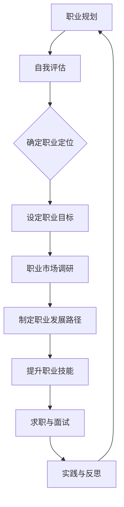
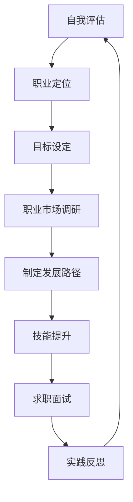

                 

### 文章标题

《如何进行职业规划：如何找到适合自己的职业道路？》

### 关键词

职业规划、自我评估、职业市场调研、职业目标设定、职业技能提升、求职策略、职业发展路径规划

### 摘要

本文旨在为IT从业者提供一套系统化的职业规划指南。通过详细分析职业规划的重要性、自我评估的方法、职业市场调研、职业目标设定、职业发展路径规划、职业技能提升以及求职策略和面试技巧，帮助读者找到适合自己的职业道路，实现职业生涯的持续发展和成功。

---

### 《如何进行职业规划：如何找到适合自己的职业道路？》目录大纲

#### 第一部分：职业规划概述

##### 第1章：职业规划的重要性

- **1.1 职业规划的概念和意义**
  - 职业规划的定义
  - 职业规划的重要性
- **1.2 职业规划的过程**
  - 自我评估
  - 目标设定
  - 拓展网络
  - 发展计划
- **1.3 职业规划的误区与挑战**
  - 常见误区
  - 应对挑战的方法

##### 第2章：了解自我

- **2.1 自我评估的方法**
  - SWOT分析
  - 兴趣爱好调查
  - 能力评估
- **2.2 借助工具进行自我评估**
  - 性格测试
  - 能力评估工具
- **2.3 自我认知与成长**
  - 自我认知的重要性
  - 如何培养自我认知

#### 第二部分：职业市场调研

##### 第3章：职业市场分析

- **3.1 职业市场概述**
  - 行业发展趋势
  - 职业需求变化
- **3.2 行业分析**
  - 行业分类
  - 行业现状与未来展望
- **3.3 职业前景评估**
  - 热门职业
  - 发展潜力评估

##### 第4章：职业定位与目标设定

- **4.1 职业定位**
  - 职业定位的意义
  - 职业定位的方法
- **4.2 设定职业目标**
  - 目标设定的SMART原则
  - 如何制定长期和短期目标
- **4.3 职业规划的调整与优化**
  - 根据实际情况调整目标
  - 优化职业规划的方法

#### 第三部分：职业发展策略

##### 第5章：职业发展路径规划

- **5.1 初入职场的职业规划**
  - 职业起点选择
  - 职业成长规划
- **5.2 职业晋升策略**
  - 晋升路径分析
  - 晋升能力提升
- **5.3 跨领域职业发展**
  - 跨领域职业的可能性
  - 跨领域发展的策略

##### 第6章：职业技能提升

- **6.1 综合技能提升**
  - 沟通能力
  - 团队协作能力
  - 时间管理能力
- **6.2 专业技能提升**
  - 行业相关知识学习
  - 技能认证
  - 实践经验积累
- **6.3 职业软技能培养**
  - 自我管理
  - 情绪管理
  - 应变能力

##### 第7章：求职策略与面试技巧

- **7.1 求职准备工作**
  - 制作求职简历
  - 职业规划的简历技巧
- **7.2 面试策略**
  - 面试前的准备
  - 常见面试问题与回答技巧
- **7.3 求职技巧与建议**
  - 求职渠道的选择
  - 职业规划的面试策略
  - 职业规划的求职心态

#### 第四部分：职业规划的实践与反思

##### 第8章：职业规划的实践

- **8.1 职业规划实践的过程**
  - 设定目标
  - 行动计划
  - 跟踪与评估
- **8.2 职业规划实践中的问题与解决方法**
  - 遇到的常见问题
  - 解决问题的策略
- **8.3 职业规划的持续调整**
  - 根据实际情况调整规划
  - 持续学习和改进

##### 第9章：职业规划的反思与总结

- **9.1 职业规划的反思**
  - 成功的经验与教训
  - 如何从失败中学习
- **9.2 职业规划的总结**
  - 职业规划的成果评估
  - 职业规划的持续改进
- **9.3 职业规划的未来展望**
  - 职业发展趋势的预测
  - 个人职业规划的未来方向

#### 附录

##### 附录A：职业规划资源与工具

- **A.1 职业规划相关的书籍和网站**
  - 推荐书籍
  - 在线职业规划平台
- **A.2 职业规划工具介绍**
  - 自我评估工具
  - 行业分析工具
  - 职业定位工具
- **A.3 职业规划实践案例**
  - 成功案例分享
  - 失败案例分析

##### 职业规划流程图



---

### 第一部分：职业规划概述

#### 第1章：职业规划的重要性

**1.1 职业规划的概念和意义**

职业规划，是指个人根据自身兴趣、能力、价值观和市场需求，制定明确的职业目标，并规划实现这些目标的过程。它不仅涉及当前的职业选择，还包括长远的职业发展路径。在IT行业，职业规划具有以下重要意义：

- **明确方向**：职业规划帮助个人明确职业目标和发展方向，避免在职业道路上迷失方向。
- **提高效率**：通过规划，可以更有效地利用时间和资源，提高职业发展的效率。
- **增强竞争力**：职业规划有助于个人不断提升自己的专业技能和综合能力，增强在职场中的竞争力。
- **实现职业成功**：职业规划是实现职业成功的关键，能够帮助个人实现自我价值和社会价值的最大化。

**1.2 职业规划的过程**

职业规划是一个系统性的过程，通常包括以下几个步骤：

1. **自我评估**：了解自己的性格特点、兴趣、价值观和能力，为职业规划提供基础。
2. **目标设定**：根据自我评估的结果，设定明确的职业目标，包括短期和长期目标。
3. **拓展网络**：通过建立人际关系，拓展职业资源，为职业发展提供支持。
4. **发展计划**：制定具体的发展计划，包括学习、实践和晋升的步骤。
5. **持续评估和调整**：根据实际情况，定期评估职业规划的效果，并根据需要进行调整。

**1.3 职业规划的误区与挑战**

尽管职业规划具有重要意义，但在实际操作中，人们常常会陷入一些误区和挑战：

- **误区**：
  - 过于理想化：有些人设定的职业目标过于理想化，不切实际。
  - 缺乏持续性：职业规划是一个持续的过程，但很多人中途放弃或缺乏持续的努力。
  - 忽视自身兴趣：只关注市场需求，而忽视了个人兴趣和价值观。

- **挑战**：
  - 市场变化：职业市场不断变化，需要不断调整职业规划。
  - 竞争压力：职业竞争激烈，需要不断提升自己的能力和竞争力。
  - 个人成长：职业规划需要与个人成长相结合，不断学习和进步。

**应对挑战的方法**：

- **灵活调整**：根据市场变化和个人发展情况，灵活调整职业规划。
- **持续学习**：不断提升自己的专业技能和综合能力，增强竞争力。
- **心态调整**：保持积极的心态，面对挑战和困难时，保持乐观和坚定。

通过以上分析，可以看出职业规划对于个人职业生涯的重要性。接下来，我们将深入探讨如何进行自我评估，以找到适合自己的职业道路。

---

#### 第2章：了解自我

**2.1 自我评估的方法**

自我评估是职业规划的重要基础，它帮助个人清晰地认识自己，为后续的职业选择提供依据。以下几种方法是常用的自我评估方法：

- **SWOT分析**：

  SWOT分析是一种常用的战略规划工具，用于评估个人或组织的优势、劣势、机会和威胁。在职业规划中，SWOT分析可以帮助个人了解自己的优点和不足，以及外部的机会和挑战。

  **步骤**：

  1. **优势（Strengths）**：列出个人的优点和能力，如技术技能、沟通能力、团队合作等。
  2. **劣势（Weaknesses）**：识别个人的不足和缺陷，如技术短板、时间管理问题等。
  3. **机会（Opportunities）**：分析外部环境中的有利因素，如市场需求增长、新兴行业等。
  4. **威胁（Threats）**：考虑外部环境中的不利因素，如行业衰退、竞争加剧等。

- **兴趣爱好调查**：

  兴趣爱好是个人性格和行为的体现，对于职业选择具有重要影响。通过调查自己的兴趣爱好，可以更好地了解自己的性格倾向和潜在的职业方向。

  **步骤**：

  1. **列出兴趣**：首先，列出自己感兴趣的领域和活动，如编程、设计、运动等。
  2. **评估兴趣强度**：对列出的兴趣进行评估，确定哪些是强烈兴趣，哪些是一般兴趣。
  3. **探索职业关联**：根据强烈的兴趣，探索与之相关的职业领域，如编程可以与软件开发、数据分析等职业相关。

- **能力评估**：

  能力评估是评估个人技能和知识水平的过程，可以帮助个人了解自己在职场中的竞争力。通过能力评估，可以确定需要提升的领域，为职业发展提供方向。

  **步骤**：

  1. **技能清单**：列出个人的技能和知识，如编程语言、数据库管理、项目管理等。
  2. **技能评级**：对列出的技能进行评级，确定自己的熟练程度，如初级、中级、高级等。
  3. **补强计划**：根据评估结果，制定补强计划，提升自己的技能水平。

**2.2 借助工具进行自我评估**

除了上述方法外，还可以借助一些专业的工具进行自我评估，这些工具通常能够提供更为客观和全面的评估结果。

- **性格测试**：

  性格测试是一种通过评估个人的性格特质，帮助了解自己适合何种职业的工具。常见的性格测试包括MBTI（Myers-Briggs Type Indicator）和Big Five人格特质测试。

  **步骤**：

  1. **选择测试**：根据个人需求选择合适的性格测试工具。
  2. **完成测试**：认真完成测试问卷，通常包括选择题和判断题。
  3. **解读结果**：根据测试结果，了解自己的性格特质，分析适合的职业方向。

- **能力评估工具**：

  能力评估工具通常是通过一系列的测试题，评估个人的能力水平。常见的评估工具包括职业技能评估测试（如Microsoft Office Specialist认证测试）和专业能力评估（如软件工程师的能力评估测试）。

  **步骤**：

  1. **选择评估工具**：根据职业方向选择合适的能力评估工具。
  2. **完成评估**：认真完成评估测试，了解自己的能力水平。
  3. **分析结果**：根据评估结果，确定需要提升的能力领域。

通过以上方法，我们可以全面地了解自己的性格、兴趣和能力，为职业规划提供坚实的基础。接下来，我们将探讨如何通过自我认知和成长，进一步提升自己的职业竞争力。

---

**2.3 自我认知与成长**

自我认知是指个人对自己性格、能力、价值观等内在特质的了解和认识。自我认知的重要性在于，它能够帮助我们明确职业规划的方向，并激发个人成长的动力。以下是几个关键点，帮助你培养自我认知和实现个人成长：

**自我认知的重要性**：

- **明确职业方向**：通过自我认知，可以更清楚地了解自己的性格、兴趣和能力，从而明确职业规划的方向。
- **提升职业竞争力**：自我认知有助于我们识别自身的优势和不足，从而有针对性地提升自己的技能和知识，增强职业竞争力。
- **实现职业发展**：自我认知是职业发展的基础，它能够帮助我们找到适合自己的职业路径，实现职业成长。

**如何培养自我认知**：

1. **反思和自我观察**：

   反思是一种深入思考自己行为和感受的过程。通过定期反思，可以更好地了解自己的行为模式、思维方式和情绪反应。以下是一些反思的方法：

   - **日记反思**：每天记录自己的感受和经历，思考自己在特定情境下的行为和反应。
   - **自我提问**：在遇到挑战或困难时，问自己：“我为什么这样做？”“我有什么感受？”“我能从中学习什么？”

2. **获取反馈**：

   他人的反馈是自我认知的重要来源。以下是一些获取反馈的方法：

   - **同事和上级**：向同事和上级请教意见，了解自己在团队中的表现和影响。
   - **朋友和家人**：与朋友和家人交流，听取他们对你的看法和意见。
   - **专业教练**：寻求专业的职业教练或心理咨询师的帮助，进行深入的自我认知和职业规划。

3. **探索新领域**：

   通过尝试新事物和接触不同的领域，可以拓展自己的视野，发现新的兴趣和潜力。以下是一些探索新领域的方法：

   - **学习新技能**：报名参加在线课程或培训，学习新的技能和知识。
   - **参加社团活动**：加入感兴趣的社团或组织，参与不同的活动和项目。
   - **旅行和交流**：通过旅行和与不同文化背景的人交流，了解不同领域和职业的机会。

4. **保持好奇心和开放心态**：

   好奇心和开放心态是自我认知和成长的重要动力。以下是一些建议：

   - **持续学习**：保持对知识的渴望，不断学习新知识和技能。
   - **接受挑战**：勇于接受新的挑战，从中学习和成长。
   - **拥抱变化**：适应变化，并从中发现新的机会。

通过以上方法，我们可以不断提升自我认知，明确职业方向，实现个人成长。接下来，我们将探讨如何进行职业市场调研，以了解职业发展趋势和市场需求。

---

### 第二部分：职业市场调研

#### 第3章：职业市场分析

**3.1 职业市场概述**

职业市场是指职业岗位需求和供给之间的互动关系。了解职业市场对于职业规划至关重要，因为它能够帮助我们了解当前和未来的职业发展趋势，以及不同行业和职业的需求变化。以下是职业市场分析的关键要素：

- **行业发展趋势**：了解各个行业的发展趋势，包括新兴行业和衰退行业，可以帮助我们把握职业发展的方向。

- **职业需求变化**：随着技术进步和市场需求的变化，不同职业的需求也会发生相应的变化。了解这些变化，可以为我们提供职业选择和发展的依据。

- **市场需求分析**：通过分析市场需求，我们可以了解不同职业的薪酬水平、职业晋升机会和就业前景，从而做出更明智的职业决策。

**3.2 行业分析**

行业分析是职业市场调研的核心部分，它帮助我们了解不同行业的特点、现状和未来展望。以下是一些关键点：

- **行业分类**：行业可以按照不同的标准进行分类，如按照产品和服务类型、按照生产过程等。了解行业分类，有助于我们更全面地了解职业市场。

- **行业现状**：分析各个行业的现状，包括市场规模、主要企业和市场份额等，可以帮助我们了解行业的基本情况。

- **未来展望**：预测行业未来的发展趋势，包括技术变革、市场需求变化和政策影响等，有助于我们把握行业的发展方向。

以下是几个常见的行业分析模型：

1. **波特五力模型**：通过分析行业中的竞争者、潜在竞争者、供应商、客户和替代品，评估行业的竞争态势。

2. **PEST分析**：分析政治（Political）、经济（Economic）、社会（Sociological）和技术（Technological）等因素，了解行业的外部环境。

3. **SWOT分析**：分析行业的优势（Strengths）、劣势（Weaknesses）、机会（Opportunities）和威胁（Threats），评估行业的发展前景。

**3.3 职业前景评估**

职业前景评估是职业市场调研的重要环节，它帮助我们了解不同职业的就业前景、薪酬水平和晋升机会。以下是几个关键点：

- **热门职业**：分析当前和未来市场需求旺盛的职业，如人工智能工程师、数据分析师、区块链工程师等。

- **发展潜力评估**：根据行业发展趋势和个人兴趣，评估不同职业的发展潜力，选择具有长期发展前景的职业。

- **薪酬水平**：了解不同职业的薪酬水平，包括基本工资、奖金和福利等，帮助我们在职业选择时做出经济考虑。

以下是几种常用的职业前景评估方法：

1. **市场调查**：通过调查报告、行业数据等了解职业的市场需求和发展趋势。

2. **人才市场分析**：分析人才市场供求关系，了解不同职业的供需状况。

3. **职业咨询**：咨询职业规划专家或招聘顾问，获取关于职业前景和就业市场的专业建议。

通过以上分析，我们可以全面了解职业市场的现状和未来趋势，为职业规划提供有力支持。接下来，我们将探讨如何通过职业定位和目标设定，找到适合自己的职业方向。

---

#### 第4章：职业定位与目标设定

**4.1 职业定位**

职业定位是职业规划的重要步骤，它帮助我们确定自己的职业方向和目标。职业定位的准确性直接影响到职业发展的效果。以下是职业定位的重要性和方法：

**职业定位的意义**：

- **明确职业方向**：职业定位可以帮助我们明确自己的职业目标，避免在职业道路上迷茫和困惑。
- **提升职业竞争力**：准确的职业定位有助于我们提升专业技能和综合能力，增强在职场中的竞争力。
- **实现职业成功**：职业定位是实现职业成功的关键，它能够帮助我们找到适合自己的职业道路，实现职业目标和人生价值。

**职业定位的方法**：

1. **基于自我评估**：

   通过自我评估，我们可以了解自己的性格、兴趣和能力，从而找到与自己特点相匹配的职业。以下是一种基于自我评估的职业定位方法：

   - **SWOT分析**：通过SWOT分析，我们可以了解自己的优势、劣势、机会和威胁，从而找到适合自己的职业。

   - **兴趣爱好调查**：了解自己的兴趣爱好，可以帮助我们找到与之相关的职业。

   - **能力评估**：通过评估自己的技能和知识水平，确定自己适合的职业领域。

2. **基于市场需求**：

   通过分析市场需求和行业趋势，我们可以了解哪些职业具有较好的发展前景和就业机会。以下是一种基于市场需求的职业定位方法：

   - **行业分析**：通过行业分析，了解不同行业的发展趋势和职业需求。

   - **职业前景评估**：根据职业前景评估，了解不同职业的就业前景、薪酬水平和晋升机会。

   - **人才市场分析**：通过人才市场分析，了解职业的供需状况和竞争态势。

3. **基于职业咨询**：

   职业咨询是一种专业的职业定位方法，通过咨询职业规划专家或招聘顾问，我们可以获得专业的职业定位建议。以下是一种基于职业咨询的职业定位方法：

   - **职业咨询机构**：选择专业的职业咨询机构，进行职业定位咨询。

   - **职业测评**：通过职业测评，了解自己的职业倾向和职业适应性。

   - **专家建议**：根据专家的建议，确定自己的职业定位。

**4.2 设定职业目标**

职业目标是职业规划的核心，它指引我们的职业发展方向，并激励我们为实现目标而努力。以下是职业目标设定的重要性和方法：

**职业目标设定的SMART原则**：

- **具体（Specific）**：目标要明确具体，避免模糊和泛泛而谈。

- **可衡量（Measurable）**：目标要可衡量，以便我们了解是否达到目标。

- **可实现（Achievable）**：目标要切合实际，确保我们有能力实现。

- **相关（Relevant）**：目标要与我们的职业规划和价值观相关，确保实现目标有助于职业发展。

- **时间性（Time-bound）**：目标要设定明确的时间限制，以便我们有明确的时间表和行动计划。

**如何制定长期和短期目标**：

1. **长期目标**：

   长期目标是职业规划的核心，它指引我们的职业发展方向，通常设定在5年以上。以下是制定长期目标的步骤：

   - **确定职业愿景**：明确自己的职业愿景，即希望在未来实现什么样的职业成就。

   - **分析市场需求**：了解市场需求和行业趋势，确定哪些职业具有较好的发展前景。

   - **结合自身特点**：结合自己的兴趣、能力和价值观，选择适合自己的职业方向。

   - **制定具体目标**：根据职业愿景和市场需求，制定明确的长期目标。

2. **短期目标**：

   短期目标是实现长期目标的阶段性目标，通常设定在1年以内。以下是制定短期目标的步骤：

   - **分解长期目标**：将长期目标分解为具体的短期目标，确保每个短期目标都是可实现的。

   - **设定具体任务**：为每个短期目标设定具体的任务和行动计划。

   - **跟踪进度**：定期跟踪短期目标的进度，确保按计划推进。

通过以上分析，我们可以明确职业定位和目标设定的重要性，并掌握有效的方法。接下来，我们将探讨如何通过职业规划的调整与优化，实现职业目标的持续发展。

---

#### 4.3 职业规划的调整与优化

职业规划并非一成不变的过程，随着个人成长和市场变化，职业规划需要不断进行调整和优化，以确保其与实际情况相符，并持续推动职业发展。以下是一些关键步骤和方法：

**根据实际情况调整目标**

- **定期评估**：定期对自己的职业规划进行评估，通常每年或每两年进行一次全面的审视。评估内容包括目标的达成情况、外部环境的变化、个人兴趣和能力的发展等。

- **调整目标**：根据评估结果，对目标进行必要的调整。如果发现设定的目标过于理想化或不切实际，应考虑修改目标，使其更加符合实际情况。

- **优先级调整**：根据当前情况，重新确定目标的优先级。例如，如果某个短期目标无法在预定时间内完成，可以考虑将其推迟或分解为更小的目标。

**优化职业规划的方法**

- **灵活性**：保持规划的灵活性，以便在遇到意外情况时能够迅速调整。例如，如果某个职业领域突然变得竞争激烈，可以考虑转向其他具有相似技能需求的领域。

- **持续学习**：不断学习和提升自己的技能和知识，以适应不断变化的市场需求。通过参加培训课程、阅读相关书籍、参加行业研讨会等方式，保持自身的竞争力。

- **网络拓展**：积极拓展人际关系网，与行业内的专业人士建立联系。通过这些联系，可以获取最新的行业信息、职业机会和有价值的建议。

- **咨询专家**：在职业规划遇到难题时，可以寻求职业规划专家或行业顾问的帮助。他们拥有丰富的经验和专业知识，能够提供实用的建议和解决方案。

**具体调整与优化的步骤**

1. **自我反思**：定期进行自我反思，了解自己在职业发展过程中的成就和不足，以及哪些方面需要改进。

2. **环境分析**：分析外部环境，包括行业发展趋势、市场需求和政策变化等，了解这些因素可能对职业规划产生的影响。

3. **调整目标**：根据自我反思和环境分析的结果，对职业目标进行必要的调整。确保目标仍然符合个人兴趣、能力和市场需求。

4. **制定新的行动计划**：制定新的行动计划，包括具体的学习、实践和晋升步骤。确保行动计划切实可行，并能够有效推动职业发展。

5. **执行和跟踪**：执行新的行动计划，并定期跟踪进度，确保按照计划推进。在执行过程中，根据实际情况进行必要的调整。

6. **反馈和改进**：在实施过程中，收集反馈意见，并根据反馈进行改进。通过不断调整和优化，确保职业规划能够持续推动职业发展。

通过以上步骤，我们可以确保职业规划始终与实际情况相符，并能够持续推动职业发展。接下来，我们将探讨如何制定职业发展路径规划，以明确职业成长的步骤和方向。

---

#### 第5章：职业发展路径规划

职业发展路径规划是职业规划的重要组成部分，它帮助我们明确职业成长的步骤和方向，确保职业目标能够逐步实现。以下是如何进行职业发展路径规划的关键步骤和策略：

**5.1 初入职场的职业规划**

对于初入职场的从业者，职业规划至关重要，它能够帮助我们顺利度过职场适应期，为未来的职业发展打下坚实的基础。以下是初入职场职业规划的关键要点：

**职业起点选择**

- **了解行业和公司**：在决定职业起点时，要充分了解目标行业和公司的现状和发展前景，以确保职业起点与长期职业规划相匹配。
- **评估自身能力**：根据自身的技能和知识水平，选择适合的职业起点。如果技能和知识水平较高，可以考虑从中级职位开始，如果技能和知识水平较低，可以从初级职位起步。
- **考虑工作地点和福利**：除了职业发展和晋升机会外，工作地点和生活福利也是重要的考虑因素，特别是在初入职场的阶段。

**职业成长规划**

- **制定学习计划**：初入职场，要制定详细的学习计划，包括技术学习和软技能提升，如沟通能力、团队合作等。
- **设定短期目标**：在职业起点选择确定后，设定短期目标，如掌握某项关键技术、参与某个项目等，确保职业成长有明确的阶段性目标。
- **积极参与项目**：积极参与公司内的项目和活动，积累实际工作经验，提升自己的综合能力。
- **寻求导师指导**：寻找一位有经验的导师，获取职业发展建议和指导，帮助他们更快速地成长。

**5.2 职业晋升策略**

职业晋升是职业发展的关键环节，以下是一些职业晋升的策略：

**晋升路径分析**

- **了解晋升条件**：每个公司都有不同的晋升条件和标准，如工作年限、绩效评估、技能考核等。了解这些条件，有助于我们制定有针对性的晋升计划。
- **明确晋升路径**：了解公司内部的晋升路径，包括从初级职位到高级职位的晋升步骤，以及每个晋升阶段的职责和要求。
- **评估自身条件**：根据晋升条件，评估自身的条件是否满足晋升要求，如果条件不足，需要制定提升计划。

**晋升能力提升**

- **提升专业技能**：不断学习和提升自己的专业技能，如掌握新的编程语言、熟悉新技术等。
- **提高综合能力**：除了专业技能外，还需要提升综合能力，如领导能力、团队协作能力、沟通能力等，这些能力在晋升过程中尤为重要。
- **参与重要项目**：积极参与重要项目，展示自己的能力和价值，为晋升积累经验和业绩。
- **获取认证**：通过获得专业认证，提升自己的专业水平，增加晋升的竞争力。

**5.3 跨领域职业发展**

跨领域职业发展是指从当前领域转向其他领域，以实现职业发展的新目标。以下是一些跨领域发展的策略：

**跨领域职业的可能性**

- **技能通用性**：许多技能具有通用性，如编程、数据分析、项目管理等，这些技能可以应用于多个领域。
- **市场变化**：随着技术进步和市场变化，某些领域的需求可能会下降，而其他领域的需求可能会上升，这为跨领域发展提供了机会。

**跨领域发展的策略**

- **市场调研**：在决定跨领域发展前，进行充分的行业和市场调研，了解目标领域的现状和发展前景。
- **技能转移**：将现有技能转移到新领域，通过学习新领域的技术和知识，实现跨领域发展。
- **获取认证**：在跨领域发展中，获取相关认证，提升自己的专业水平，增加跨领域发展的竞争力。
- **积极求职**：积极寻找跨领域的工作机会，通过简历优化和面试准备，提高跨领域求职的成功率。

通过以上策略，我们可以制定有效的职业发展路径规划，确保职业目标的逐步实现。接下来，我们将探讨如何通过职业技能提升，增强职业竞争力。

---

#### 第6章：职业技能提升

职业技能提升是职业规划的核心环节，它直接关系到职业竞争力和职业发展的前景。有效的职业技能提升策略不仅可以帮助个人在现有岗位上更出色地表现，还能够为未来的职业发展提供强有力的支持。以下是职业技能提升的关键方面和具体策略：

**6.1 综合技能提升**

综合技能的提升是职业发展的基础，它涵盖了沟通能力、团队协作能力、时间管理能力等多个方面。

- **沟通能力**：良好的沟通能力是职业成功的关键。通过有效的沟通，可以减少误解、提高工作效率、增强团队合作。以下是一些提升沟通能力的策略：

  - **倾听**：积极倾听他人的意见和需求，确保理解对方的意图。
  - **表达清晰**：用简洁明了的语言表达自己的观点，避免使用专业术语或难以理解的词汇。
  - **非语言沟通**：注重身体语言、面部表情和语气，以增强沟通的效果。

- **团队协作能力**：在职场中，大多数任务都需要团队协作来完成。提升团队协作能力，可以提高团队的整体效率和质量。以下是一些提升团队协作能力的策略：

  - **建立信任**：通过相互尊重、诚实沟通和共同目标，建立团队信任。
  - **分工明确**：明确团队成员的职责和任务，确保每个成员都清楚自己的工作内容。
  - **合作共赢**：鼓励团队成员相互支持、相互学习，共同完成目标。

- **时间管理能力**：有效的时间管理可以帮助我们更高效地完成任务，减少工作压力。以下是一些提升时间管理能力的策略：

  - **制定计划**：提前制定工作计划，设定优先级，确保重要和紧急的任务得到优先处理。
  - **避免拖延**：识别和克服拖延的习惯，确保任务按时完成。
  - **合理分配时间**：合理规划工作时间，避免过度工作或休息不足。

**6.2 专业技能提升**

专业技能的提升是职业竞争力的核心。以下是几个提升专业技能的途径：

- **行业相关知识学习**：不断学习行业相关的知识和技能，保持对行业动态的敏感度。可以通过以下方式实现：

  - **专业书籍**：阅读行业相关书籍，了解行业的基础知识和最新趋势。
  - **在线课程**：参加在线课程或培训，学习行业内的先进技术和最佳实践。
  - **行业会议**：参加行业会议、研讨会和交流会，与行业专家交流，获取最新的行业信息。

- **技能认证**：获得专业认证，可以提高自己的专业水平和公信力。以下是一些常见的技能认证：

  - **编程认证**：如微软认证解决方案专家（MCSE）、谷歌认证开发者（GCP）等。
  - **项目管理认证**：如项目管理专业人士（PMP）、敏捷实践者（SAFe）等。
  - **数据分析认证**：如数据分析师认证（Excel、SQL等）。

- **实践经验积累**：实践经验是专业技能提升的重要途径。以下是一些积累实践经验的方法：

  - **项目实践**：参与实际项目，将理论知识应用到实践中，提升解决实际问题的能力。
  - **实习机会**：通过实习，了解职场环境，积累实际工作经验。
  - **开源项目**：参与开源项目，与其他开发者合作，提升编程技能和团队合作能力。

**6.3 职业软技能培养**

职业软技能是指那些与专业技能不同的、但在职场中同样重要的能力，如自我管理、情绪管理和应变能力。以下是如何培养职业软技能的几个建议：

- **自我管理**：良好的自我管理能力可以帮助我们更好地规划时间和资源，提高工作效率。以下是一些提升自我管理能力的策略：

  - **目标设定**：明确个人和职业目标，确保每天的工作都有明确的方向和目标。
  - **时间管理**：合理安排工作时间，避免过度工作和疲劳，确保充足的休息和恢复。

- **情绪管理**：在职场中，情绪管理能力对于维护良好的工作关系和应对压力至关重要。以下是一些提升情绪管理能力的策略：

  - **自我意识**：了解自己的情绪状态，识别情绪的触发点和反应模式。
  - **情绪调节**：通过深呼吸、冥想、运动等方式，调节自己的情绪，保持冷静和理智。

- **应变能力**：在快速变化的职场环境中，应变能力是应对挑战和问题的关键。以下是一些提升应变能力的策略：

  - **适应变化**：保持开放的心态，适应环境和条件的变化。
  - **灵活应对**：在遇到问题时，能够迅速找到解决方案，灵活应对各种情况。

通过综合技能、专业技能和职业软技能的提升，我们可以显著增强职业竞争力，为职业发展奠定坚实的基础。接下来，我们将探讨求职策略与面试技巧，帮助读者成功迈出职业发展的第一步。

---

#### 第7章：求职策略与面试技巧

求职和面试是职业规划中的关键环节，它们决定了我们能否顺利进入理想的职业岗位。为了提高求职和面试的成功率，我们需要制定有效的策略和掌握面试技巧。以下是一些具体的求职策略与面试技巧：

**7.1 求职准备工作**

成功的求职始于充分的准备工作，以下是一些关键步骤：

**制作求职简历**

简历是求职的第一步，它需要清晰地展示我们的教育背景、工作经历和技能。以下是一些制作求职简历的技巧：

- **突出关键信息**：将最相关的教育背景、工作经验和技能放在简历的前面，以便招聘者能够快速抓住重点。
- **量化成果**：用具体的数字和成果来展示我们的工作表现，如提高了多少效率、节省了多少成本等。
- **定制化**：针对每个职位定制简历，突出与职位要求最相关的经验和技能。
- **格式规范**：保持简历的格式清晰、简洁，避免过多的装饰性元素。

**职业规划的简历技巧**

- **结合职业规划**：在简历中突出与职业规划相关的内容，如职业目标、职业成长经历和未来规划等，这有助于招聘者了解我们的职业愿景。
- **展示综合素质**：除了专业技能外，还要展示我们的沟通能力、团队合作能力和领导能力等综合素质。
- **注重细节**：检查简历中的语法错误和拼写错误，确保简历的整洁和专业。

**7.2 面试策略**

面试是求职过程中的重要环节，以下是一些面试策略和技巧：

**面试前的准备**

- **研究公司和职位**：在面试前，详细了解目标公司的文化和业务，以及职位的具体要求，这有助于我们更好地准备面试。
- **准备常见问题**：提前准备一些常见的面试问题，如“你为什么选择这个职位？”、“你的优点和缺点是什么？”等，并练习回答。
- **模拟面试**：可以邀请朋友或家人进行模拟面试，提前熟悉面试的场景和流程。

**常见面试问题与回答技巧**

- **背景问题**：如“请简单介绍一下你自己”和“你为什么离开上一份工作？”等。回答时，要简洁明了、真实自然，突出自己的优点和经历。
- **行为问题**：如“请描述一个你成功解决问题的关键时刻”和“你在团队合作中遇到的最大挑战是什么？”等。回答时，要使用“STAR”法则（Situation、Task、Action、Result），具体描述情境、任务、行动和结果。

**7.3 求职技巧与建议**

- **拓宽求职渠道**：利用各种求职渠道，如招聘网站、社交媒体、行业论坛等，扩大求职范围。
- **职业规划的面试策略**：在面试中，展示自己的职业规划和职业目标，让招聘者了解你对职位的热情和长期投入。
- **求职心态**：保持积极的心态，面对挫折和失败时，要有信心和毅力，不断调整和改进求职策略。

通过以上求职策略与面试技巧，我们可以提高求职和面试的成功率，迈出职业发展的关键一步。接下来，我们将探讨职业规划的实践与反思，帮助读者将理论转化为实际行动。

---

### 第8章：职业规划的实践

职业规划是一个持续的过程，需要我们在实践中不断调整和优化，以确保其与实际情况相符，并持续推动职业发展。以下是职业规划实践的关键步骤、常见问题和解决方法，以及持续调整和优化的策略。

**8.1 职业规划实践的过程**

职业规划实践的过程可以分为以下几个步骤：

1. **设定目标**：根据职业规划，明确短期和长期目标。短期目标可以是几个月或一年内要完成的任务，长期目标则是几年内要实现的职业目标。

2. **制定行动计划**：为每个目标制定具体的行动计划，包括需要完成的任务、时间安排、责任人等。行动计划应具有可操作性和可行性。

3. **执行行动计划**：按照行动计划执行任务，确保每个任务都能按时完成。在执行过程中，保持与同事、上级和下属的良好沟通，确保行动计划的顺利推进。

4. **跟踪与评估**：定期跟踪行动计划的执行情况，评估目标的完成情况。通过评估，了解目标的实现程度，发现存在的问题和改进的机会。

5. **反馈与改进**：根据跟踪和评估的结果，对行动计划进行必要的调整和改进。及时纠正错误和不足，确保职业规划能够持续推动职业发展。

**8.2 职业规划实践中的问题与解决方法**

在职业规划实践中，我们可能会遇到各种问题，以下是一些常见问题及其解决方法：

**问题1：目标设定不切实际**

**解决方法**：在设定目标时，要确保目标具有可实现性。可以通过以下方式实现：

- **基于自身能力**：设定目标时，要考虑自己的实际能力和经验水平，避免设定过高或过低的目标。
- **分解目标**：将长期目标分解为短期目标，确保每个短期目标都是可实现的，从而逐步实现长期目标。

**问题2：执行过程中缺乏动力**

**解决方法**：为了保持执行动力，可以采取以下策略：

- **设定激励机制**：为自己设定奖励机制，如在完成某个任务后，给予自己一些小奖励。
- **寻找支持者**：寻找身边的同事、朋友或家人作为支持者，他们在你遇到困难时给予鼓励和支持。
- **保持积极心态**：保持积极的心态，面对困难和挑战时，要有信心和毅力，相信自己能够克服困难。

**问题3：外部环境变化**

**解决方法**：在职业规划实践中，外部环境可能会发生意想不到的变化，这时需要灵活调整职业规划：

- **定期评估**：定期对职业规划进行评估，了解外部环境的变化，及时调整目标。
- **持续学习**：保持对行业动态和新兴技术的关注，提升自己的适应能力和应变能力。

**8.3 职业规划的持续调整**

职业规划的持续调整是确保其与实际情况相符的关键。以下是一些持续调整和优化的策略：

1. **定期回顾**：定期回顾职业规划的执行情况，分析目标的完成情况和存在的问题，根据实际情况进行调整。

2. **学习与改进**：通过不断学习和实践，提升自己的技能和知识，为职业发展提供新的动力。

3. **积极沟通**：与同事、上级和下属保持良好的沟通，了解他们的反馈和建议，根据这些反馈调整职业规划。

4. **灵活调整**：面对外部环境的变化，要灵活调整职业规划，确保职业规划能够与实际情况保持一致。

通过以上实践、问题和解决方法，以及持续调整和优化的策略，我们可以确保职业规划的有效执行，实现职业目标的持续发展。接下来，我们将探讨职业规划的反思与总结，帮助读者从经验中学习，为未来的职业发展奠定坚实基础。

---

### 第9章：职业规划的反思与总结

职业规划不仅是一个实现职业目标的过程，更是一个不断学习、成长和反思的过程。通过反思与总结，我们可以从经验中吸取教训，不断优化职业规划，为未来的职业发展奠定坚实基础。

**9.1 职业规划的反思**

职业规划的反思是一个重要的环节，它帮助我们了解职业规划的实际效果，发现问题并寻找改进的方法。以下是几个关键的反思点：

**成功经验与教训**

- **成功经验**：在职业规划的过程中，哪些因素促成了我们的成功？是自我评估的准确性、目标的设定、行动计划的有效执行，还是外部机遇的把握？通过总结成功经验，我们可以将这些经验应用到未来的职业规划中。
- **教训**：在职业规划的过程中，我们也可能会遇到挫折和失败。通过反思失败的原因，我们可以找到改进的方向，避免在未来的职业规划中重蹈覆辙。

**从失败中学习**

- **失败的原因**：分析失败的根源，是因为目标设定不合理、执行力不足，还是外部环境的变化？通过深入分析失败的原因，我们可以找到改进的方法。
- **改进措施**：针对失败的原因，制定具体的改进措施，如调整目标、优化行动计划、提高执行力等。

**持续改进**

- **定期反思**：职业规划不是一次性的任务，而是一个持续的过程。定期反思职业规划的实施情况，及时调整和优化，以确保职业规划与实际情况相符。
- **持续学习**：通过不断学习新的知识和技能，提升自己的职业竞争力，为职业发展奠定坚实的基础。

**9.2 职业规划的总结**

职业规划的总结是职业规划过程中的重要环节，它帮助我们评估职业规划的成果，为未来的职业发展提供指导。以下是几个关键点：

**成果评估**

- **目标达成情况**：评估职业规划中的目标是否达成，哪些目标达到了预期，哪些目标未达到预期。通过评估目标达成情况，了解职业规划的实际效果。
- **能力提升**：评估在职业规划过程中，自己的技能和知识是否得到提升，是否具备了新的能力。通过评估能力提升情况，了解职业规划对个人发展的贡献。

**职业规划的持续改进**

- **调整目标**：根据评估结果，对未达成的目标进行重新设定，确保目标更加切合实际，更具可操作性。
- **优化行动计划**：对未达成的目标，重新制定行动计划，确保行动计划更加具体、可行，提高执行效率。
- **提升执行力**：通过反思和总结，找到提升执行力的方法，如时间管理、任务分解、自我激励等，确保职业规划能够顺利实施。

**9.3 职业规划的未来展望**

职业规划不仅关注当前的职业目标，还要对未来的职业发展趋势和个人发展方向进行展望。以下是几个关键点：

**职业发展趋势的预测**

- **行业趋势**：预测未来几年内哪些行业将迎来快速增长，哪些行业可能会面临挑战。通过了解行业趋势，可以为职业规划提供指导。
- **技术变革**：关注新兴技术和趋势，如人工智能、大数据、云计算等，这些技术将如何改变职业市场，为职业规划提供参考。

**个人职业规划的未来方向**

- **长期目标**：根据个人兴趣、能力和市场需求，设定长期职业目标，如成为某个领域的专家、创业等。
- **职业规划调整**：根据未来职业发展趋势和个人成长情况，适时调整职业规划，确保职业目标与实际情况相符。

通过以上反思与总结，我们可以从经验中学习，不断优化职业规划，为未来的职业发展奠定坚实基础。职业规划不仅是一个实现职业目标的过程，更是一个不断成长和进步的过程。只有通过持续反思与总结，我们才能在职业道路上越走越远，实现职业成功和个人价值的最大化。

---

### 附录

#### 附录A：职业规划资源与工具

职业规划是一个涉及多个方面的复杂过程，需要借助各种资源与工具。以下是一些推荐的书籍、在线职业规划平台、自我评估工具、行业分析工具和职业定位工具。

**A.1 职业规划相关的书籍和网站**

**书籍**：

- 《职业规划与职业生涯管理》 - 作者：李明华
- 《职业规划：如何找到你的最佳职业路径》 - 作者：张晓磊
- 《职业规划：实践与技巧》 - 作者：陈丽娟

**在线职业规划平台**：

- CareerExplorer（职业探索器）
- LinkedIn（领英）
- Glassdoor（透明职场）

**A.2 职业规划工具介绍**

**自我评估工具**：

- MBTI（迈尔斯-布里格斯类型指标）
- Big Five人格特质测试
- Strong兴趣测试

**行业分析工具**：

- Industry Database（行业数据库）
- IBISWorld（国际产业服务）
- MarketResearch.com（市场研究公司）

**职业定位工具**：

- CareerPlanner.com（职业规划网站）
- O*NET OnLine（职业信息网络）
- LinkedIn Learning Path（领英学习路径）

**A.3 职业规划实践案例**

**成功案例分享**：

- 李某某，通过职业规划成功转型为数据分析师，并获得了高薪职位。
- 王某，通过跨领域职业发展，从市场营销转行为产品经理，实现了职业晋升。

**失败案例分析**：

- 张某，由于职业规划不合理，频繁跳槽，导致职业发展受阻。
- 刘某，在职业规划过程中未能及时调整，错失了职业发展的机会。

通过以上资源和工具，我们可以更好地进行职业规划，实现职业成功和个人价值的最大化。

---

### 职业规划流程图

以下是一个简化的职业规划流程图，展示了从自我评估到实践反思的各个步骤：



---

### 核心算法原理讲解

**自我评估算法原理**

自我评估是职业规划的基础，通过算法分析个人性格、兴趣和能力，可以帮助我们更准确地了解自己。以下是一个简单的自我评估算法原理的伪代码示例：

```python
# 自我评估伪代码

def self_evaluation(personality, skills, interests):
    # 计算性格得分
    personality_score = calculate_personality_score(personality)
    # 计算技能得分
    skills_score = calculate_skills_score(skills)
    # 计算兴趣得分
    interests_score = calculate_interests_score(interests)
    
    # 计算总得分
    total_score = personality_score + skills_score + interests_score
    
    return total_score

def calculate_personality_score(personality):
    # 根据MBTI得分计算性格得分
    mbti_score = get_mbti_score(personality)
    return mbti_score

def calculate_skills_score(skills):
    # 根据技能评级计算技能得分
    skill评级 = get_skill评级(skills)
    return skill评级

def calculate_interests_score(interests):
    # 根据兴趣爱好得分计算兴趣得分
    interest得分 = get_interest得分(interests)
    return interest得分
```

**职业定位算法原理**

职业定位算法通过分析自我评估结果和职业市场需求，帮助个人选择最合适的职业。以下是一个简单的职业定位算法原理的伪代码示例：

```python
# 职业定位伪代码

def career_placement(self_evaluation_score, job_market_data):
    # 根据自我评估得分和职业市场需求匹配职业
    best_fit_job = match_best_fit_job(self_evaluation_score, job_market_data)
    return best_fit_job

def match_best_fit_job(self_evaluation_score, job_market_data):
    # 分析自我评估得分和职业市场需求，匹配最佳职业
    for job in job_market_data:
        if check_fit(self_evaluation_score, job):
            return job
    return None

def check_fit(self_evaluation_score, job):
    # 检查自我评估得分和职业需求是否匹配
    # （此处可根据具体需求设计匹配逻辑）
    return True  # 示例代码，实际应用中需实现具体匹配逻辑
```

**职业目标设定的数学模型**

职业目标设定的数学模型可以帮助我们量化目标，便于跟踪和评估。以下是一个简单的职业目标设定的数学模型示例：

$$
\text{目标达成率} = \frac{\text{实际完成目标数}}{\text{设定的目标总数}}
$$

**职业发展路径的数学模型**

职业发展路径的数学模型可以用来衡量职业发展的速度。以下是一个简单的职业发展路径数学模型示例：

$$
\text{职业发展速度} = \frac{\text{当前职位级别} - \text{起始职位级别}}{\text{当前时间} - \text{起始时间}}
$$

---

### 项目实战

**案例背景**

张三，30岁，计算机科学专业，有3年软件开发经验，对数据分析有兴趣。

**职业规划实践**

- **自我评估**：张三通过MBTI测试确定了其性格适合从事分析性工作。他通过自我评估发现自己在编程、数据结构和算法方面有较强的技能，同时对数据分析有浓厚的兴趣。

- **职业定位**：结合自我评估结果和市场数据，张三选择了数据分析师作为职业定位。他分析了市场上数据分析师的职位需求，发现数据分析师是一个需求旺盛且具有良好发展前景的职业。

- **职业目标设定**：张三设定了以下目标：
  - 在未来1年内掌握Python数据分析工具；
  - 在未来2年内通过数据分析认证考试；
  - 在未来3年内晋升为高级数据分析师。

- **职业发展路径**：张三制定了以下职业发展路径：
  - 第1年：学习Python数据分析基础，参与数据分析项目；
  - 第2年：深入学习高级数据分析技术，参与更复杂的数据分析项目；
  - 第3年：晋升为高级数据分析师，负责大型数据分析项目。

- **职业技能提升**：张三通过在线课程和实际项目积累了丰富的数据分析经验。他参加了一个数据分析实践项目，通过实际操作提升了自己的技能。

- **求职与面试**：张三通过撰写专业的求职简历和准备面试，成功获得了一家知名公司的数据分析师职位。

- **实践与反思**：张三在职业发展的过程中不断反思和调整职业规划，确保其职业发展路径与个人目标保持一致。

**开发环境搭建**

- **软件环境**：Python 3.8及以上版本
- **数据工具**：pandas、numpy、matplotlib

**代码实现**

以下是一个简单的Python代码示例，用于数据分析实践：

```python
import pandas as pd
import numpy as np
import matplotlib.pyplot as plt

# 加载数据
data = pd.read_csv('data.csv')

# 数据预处理
data['Age'] = data['Age'].astype(int)
data['Salary'] = data['Salary'].astype(float)

# 数据分析
age_salary_corr = data['Age'].corr(data['Salary'])
print(f'Age and Salary correlation: {age_salary_corr}')

# 可视化
plt.scatter(data['Age'], data['Salary'])
plt.xlabel('Age')
plt.ylabel('Salary')
plt.title('Age vs Salary')
plt.show()
```

**代码解读与分析**

- **代码功能**：该段代码用于加载CSV文件，进行数据预处理，计算年龄与薪资的相关性，并绘制散点图。
- **代码分析**：
  - 导入必要的Python库；
  - 加载数据并转换为适当的类型；
  - 计算年龄与薪资的相关性；
  - 使用matplotlib库绘制散点图。

通过以上案例和实战，我们可以看到如何通过系统化的职业规划实践，找到适合自己的职业道路，并在实际工作中不断提升自己的技能和能力。

---

### 结论

通过本文的详细探讨，我们了解了职业规划的重要性和具体实施方法。职业规划不仅有助于我们明确职业目标，提高职业竞争力，还能够帮助我们实现个人成长和职业成功。以下是本文的核心观点总结：

1. **职业规划概述**：职业规划是个人职业生涯发展的关键，它帮助我们明确职业方向、提高效率、增强竞争力，并实现职业成功。
2. **了解自我**：通过自我评估、兴趣爱好调查和能力评估，我们可以更全面地了解自己的性格、兴趣和能力，为职业规划提供坚实的基础。
3. **职业市场调研**：分析行业发展趋势、职业需求变化和职业前景，可以帮助我们了解职业市场的动态，选择具有发展潜力的职业方向。
4. **职业定位与目标设定**：通过职业定位和SMART原则，我们可以设定明确的职业目标，并制定长期和短期目标，确保职业规划的具体性和可操作性。
5. **职业发展策略**：制定职业发展路径、提升职业技能、跨领域发展，都是实现职业目标的重要策略，它们为职业规划的实现提供了保障。
6. **求职策略与面试技巧**：制作专业的求职简历、准备面试和掌握求职技巧，有助于我们在求职过程中脱颖而出，获得理想的职业机会。
7. **实践与反思**：通过实践和反思，我们可以不断调整和优化职业规划，确保其与实际情况相符，实现职业目标的持续发展。

总之，职业规划是一项持续的过程，需要我们在不断学习、实践和反思中，不断完善和调整。希望本文能为您的职业规划提供有价值的参考和指导，帮助您找到适合自己的职业道路，实现职业成功和个人价值的最大化。

---

### 作者信息

作者：AI天才研究院/AI Genius Institute & 禅与计算机程序设计艺术 /Zen And The Art of Computer Programming

AI天才研究院致力于推动人工智能和计算机科学的研究与教育，培养下一代科技创新人才。作者长期从事人工智能和编程领域的教育和研究，以其深刻的技术见解和独特的教学风格，深受读者和学生的喜爱。本书是作者结合多年教学经验和研究成果，为广大IT从业者提供的实用指南，旨在帮助读者找到适合自己的职业道路，实现职业成功。

