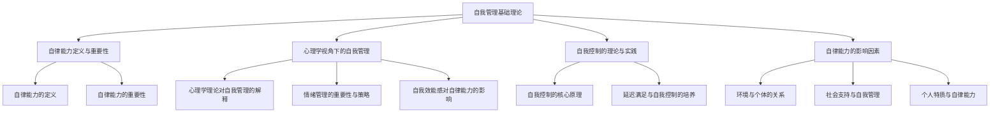

                 

# 文章标题：如何进行自我管理：如何提高自我控制和自律能力？

> 关键词：自我管理、自律能力、自我控制、行为策略、情绪管理、时间管理、习惯养成

> 摘要：本文将探讨自我管理的重要性和如何提高自律能力。我们将从基础理论、心理学视角、行为策略、习惯养成、情绪管理、正向激励以及实际应用等方面，详细分析如何进行自我管理，提高自我控制和自律能力。通过本文的阅读，您将掌握一系列实用的方法和技巧，帮助您在各个生活场景中实现自律，提升个人效能。

### 目录

1. **自我管理与自律能力的概念**
2. **心理学视角下的自我管理**
3. **自我控制的理论与实践**
4. **自律能力的影响因素**
5. **提高自律能力的方法**
   - **行为策略与时间管理**
   - **习惯养成与改变**
   - **情绪管理与压力应对**
   - **正向激励与自我激励**
   - **社会支持与网络资源**
6. **自律能力在具体情境中的应用**
   - **工作场景中的自律管理**
   - **学习情境中的自律培养**
   - **健康生活与自律**
7. **自律能力的自我评估与提升**
8. **附录**

### 第一部分：自我管理基础理论

#### 1.1 自我管理与自律能力的概念

自我管理（Self-Management）是指个体对自己行为、情感、时间和资源的主动控制。自律能力（Self-Discipline）是自我管理的一个重要组成部分，它体现在个体在面对诱惑和困难时，能够坚持目标，克服障碍，完成任务的自我控制能力。

自律能力的重要性在于，它直接影响到个体的工作效率、生活质量和社会适应能力。一个具备高自律能力的人，能够更好地规划时间、管理资源，保持积极心态，从而实现个人目标和价值。

#### 1.2 自我管理的多维度理解

自我管理可以从多个维度来理解：

- **时间管理**：合理安排时间，提高时间利用效率，避免拖延。
- **情感管理**：控制情绪波动，保持平和心态，应对压力和挑战。
- **行为管理**：规范行为，遵守规则，培养良好的行为习惯。
- **资源管理**：合理利用资源，包括时间、金钱、人际关系等。

#### 1.3 心理学视角下的自我管理

从心理学角度来看，自我管理涉及到以下几个核心概念：

- **自我效能感**：个体对自己完成特定任务的信心和预期效果。
- **延迟满足**：个体能够延迟即时满足，为了长远利益而等待。
- **情绪调节**：个体对情绪的认知和调节能力，包括积极情绪和消极情绪的处理。

这些心理学概念对于自我管理具有重要影响，我们需要在后续章节中进一步探讨。

#### 1.4 自我控制的理论与实践

自我控制（Self-Control）是指个体在行为选择过程中，对冲动和欲望的抑制能力。自我控制的理论基础包括以下几方面：

- **认知资源理论**：认为自我控制是一种有限的认知资源，需要消耗能量。
- **情境控制理论**：强调环境因素对自我控制的影响，个体可以通过改变环境来增强自我控制。
- **习惯形成理论**：习惯是自我控制的基础，通过养成良好习惯，可以增强自我控制能力。

在实践中，提升自我控制能力的方法包括：

- **明确目标**：设定清晰的个人目标，提高自我控制的动力。
- **时间规划**：合理安排时间，减少不必要的时间浪费。
- **环境调整**：优化环境，减少诱惑，增加自我控制的可能性。

#### 1.5 自律能力的影响因素

自律能力受到多种因素的影响，包括：

- **环境因素**：环境对自律能力具有显著影响，良好的环境有助于提升自律能力。
- **社会支持**：社会支持和鼓励可以增强个体的自律能力。
- **个人特质**：个人特质，如自我效能感、情绪调节能力、延迟满足能力等，对自律能力具有重要影响。

### 第二部分：提高自律能力的方法

#### 2.1 行为策略与时间管理

行为策略是提高自律能力的重要手段。以下是一些常见的行为策略：

- **设定具体目标**：明确的目标有助于提升自我控制能力。目标应当具体、可量化，并设定合理的时间期限。
- **制定计划**：制定详细的计划，将大目标分解为小步骤，有助于逐步实现目标。
- **克服拖延**：拖延是自律能力的天敌。可以通过以下方法克服拖延：
  - **时间管理**：合理规划时间，避免时间浪费。
  - **优先级排序**：将任务按重要程度和紧急程度排序，优先完成重要且紧急的任务。
  - **分解任务**：将大任务分解为小任务，逐步完成，减少心理压力。
- **自我监督**：通过自我监督，如记录任务完成情况，反思自我表现，增强自律意识。

#### 2.2 习惯养成与改变

习惯（Habit）是自我控制的基础。养成良好习惯，可以增强自律能力。以下是一些习惯养成和改变的方法：

- **习惯形成的过程**：习惯的形成需要一定的时间，通常需要持续30天以上的重复行为才能形成稳定的习惯。
- **习惯改变的步骤**：
  - **明确目标**：设定清晰的改变目标，如戒烟、早起等。
  - **制定计划**：制定具体的行动计划，包括每天需要完成的任务和时间安排。
  - **逐步实施**：逐步实施改变计划，避免一次性改变过多，造成心理和生理上的压力。
  - **持续激励**：通过正面激励，如奖励自己、与他人分享进步等，保持改变的动力。
- **习惯与自律能力的强化**：养成良好习惯，可以增强自律能力，使自我控制更加自然和容易。

#### 2.3 情绪管理与压力应对

情绪管理是提高自律能力的重要方面。以下是一些情绪管理和压力应对的策略：

- **情绪调节策略**：
  - **认知重构**：通过改变对事件的认识和解释，减少负面情绪的产生。
  - **情绪表达**：适当地表达情绪，避免情绪压抑。
  - **情绪转移**：将注意力从负面情绪转移到其他活动，如运动、阅读等。
- **压力应对方法**：
  - **时间管理**：合理安排时间，减少工作压力。
  - **休息与放松**：保持足够的休息时间，进行放松活动，如瑜伽、冥想等。
  - **寻求支持**：与他人交流，寻求帮助，减轻心理压力。

#### 2.4 正向激励与自我激励

正向激励和自我激励是提高自律能力的重要动力。以下是一些正向激励和自我激励的方法：

- **正面激励的作用**：正面激励可以增强个体的积极情绪，提高自律能力和工作效能。
- **自我激励的方法**：
  - **目标奖励**：设定目标，并在达成目标后给予奖励。
  - **自我表扬**：对自己的进步和成就给予肯定和表扬。
  - **分享成就**：与他人分享自己的成就，获得他人的认可和支持。

#### 2.5 社会支持与网络资源

社会支持和网络资源对于提高自律能力具有重要意义。以下是一些社会支持和网络资源的方法：

- **建立支持系统**：与家人、朋友或同事建立支持系统，互相鼓励和监督，共同提升自律能力。
- **利用网络资源**：利用互联网资源，如在线课程、论坛、博客等，获取自律能力提升的相关信息和资源。
- **加入社群**：加入自律能力提升的社群，与他人交流经验，互相学习，共同成长。

### 第三部分：自律能力在具体情境中的应用

#### 3.1 工作场景中的自律管理

在工作场景中，自律管理对于提高工作效率和职业发展至关重要。以下是一些工作场景中的自律管理策略：

- **职场自律的重要性**：职场自律直接影响到工作效率、团队协作和职业形象。
- **工作效率提升的策略**：
  - **时间管理**：合理安排工作时间，避免拖延和浪费时间。
  - **任务优先级排序**：将任务按重要程度和紧急程度排序，优先处理重要且紧急的任务。
  - **团队协作**：与团队成员建立良好的沟通和协作机制，共同完成任务。
- **团队协作中的自律要求**：在团队协作中，每个成员都应当保持自律，按时完成任务，保持良好的沟通和合作精神。

#### 3.2 学习情境中的自律培养

在学习情境中，自律培养对于提高学习效果和学术成就至关重要。以下是一些学习情境中的自律培养策略：

- **学术自律的核心要素**：学术自律包括时间管理、学习态度、学习计划等方面。
- **学习时间规划与自律**：
  - **设定学习目标**：明确学习目标，制定合理的计划和时间安排。
  - **制定学习计划**：将学习内容分解为具体的小任务，逐步完成。
  - **自律执行**：按时完成学习任务，保持学习的连续性和稳定性。
- **考试前的自律准备**：在考试前，保持良好的自律，合理安排复习时间，做好充分的复习准备。

#### 3.3 健康生活与自律

健康生活与自律密切相关。以下是一些健康生活与自律的策略：

- **健康生活方式的自律**：
  - **规律作息**：保持规律的作息时间，保证充足的睡眠。
  - **合理饮食**：保持健康的饮食习惯，适量摄入各种营养。
  - **锻炼与自律**：定期进行锻炼，保持身体的活力和健康。
- **健康饮食与自律**：
  - **合理安排饮食**：根据个人需求，合理安排饮食，避免过度摄入高热量、高脂肪的食物。
  - **自律执行**：坚持健康饮食，克服饮食诱惑，保持健康的生活习惯。

### 第四部分：自律能力的自我评估与提升

#### 4.1 自我评估与反思

自我评估是提高自律能力的重要步骤。以下是一些自我评估与反思的方法：

- **自律能力自我评估工具**：
  - **自律能力问卷**：通过填写自律能力问卷，了解自己的自律能力水平。
  - **自律能力评估表**：制定自律能力评估表，对自己的自律行为进行详细记录和分析。
- **反思与改进的策略**：
  - **定期反思**：定期对自己的自律行为进行反思，总结经验教训，发现问题和不足。
  - **制定改进计划**：根据反思结果，制定具体的改进计划，逐步提升自律能力。

#### 4.2 持续提升自律能力

持续提升自律能力是一个长期的过程。以下是一些持续提升自律能力的方法：

- **长期自律的维持方法**：
  - **习惯养成**：通过培养良好习惯，使自律行为成为自然的一部分。
  - **目标设定**：设定长期目标，保持自律的动力和方向。
- **自律能力提升的路径与策略**：
  - **学习与实践**：通过学习自律相关的知识和方法，结合实际生活和工作进行实践。
  - **反馈与调整**：定期进行自我评估和反思，根据反馈结果进行调整和改进。

### 第五部分：自律能力提升的资源推荐

#### 5.1 自律能力提升的资源推荐

为了帮助读者更好地提升自律能力，以下是一些自律能力提升的资源推荐：

- **自律能力提升的书籍**：
  - 《自控力》
  - 《拖延心理学》
  - 《高效能人士的七个习惯》
- **自律能力提升的文章**：
  - 《如何提高自律能力》
  - 《自律能力：如何管理你的时间和注意力》
  - 《如何养成自律的习惯》
- **自律能力提升的在线课程**：
  - Coursera上的《时间管理和个人效率》
  - Udemy上的《自律能力提升：如何养成好习惯》
  - edX上的《自我管理：提高生活和工作效率》
- **自律能力提升的社群**：
  - 在线学习社群，如Coursera学习社群、Udemy学习社群等
  - 专业论坛，如Reddit上的自律能力提升板块

### 附录

#### 5.2 附录内容

附录部分将包含以下内容：

- **自律能力提升的资源推荐**
- **自律能力培养的书籍与文章精选**
- **自律能力提升的在线课程与社群**

### Mermaid 流程图

以下是一个关于自我管理的Mermaid流程图，展示了各个部分之间的关系：



### 核心算法原理讲解

以下是一个关于自律能力评估与提升的伪代码示例：

```python
# 伪代码：自律能力评估与提升算法

function 自律能力评估(个体数据):
    初始化评估分数为0
    for each 行为记录 in 个体数据:
        if 行为符合自律标准:
            评估分数 += 1
        else:
            评估分数 -= 1
    return 评估分数

function 自律能力提升(个体数据, 目标设定):
    while 自律能力未达到目标:
        更新目标设定
        for each 行为记录 in 个体数据:
            if 行为记录未达到目标:
                应用激励策略
                更新行为记录
        重新评估自律能力
    return "自律能力提升成功"

自律能力评估(个体数据)
自律能力提升(个体数据, 目标设定)
```

### 数学模型和数学公式讲解

以下是一个关于延迟满足与自律能力的计算模型：

自律能力 = 延迟满足值 / 总时间

其中，延迟满足值计算如下：

延迟满足值 = ∑(1 / (1 + 延迟时间))

### 项目实战

#### 3.1 实例：工作场景中的自律管理

**开发环境搭建：**  
使用Jupyter Notebook作为开发环境，安装Python 3.8及以上版本，并配置相关的Python包，如numpy、pandas等。

**源代码实现：**

```python
import pandas as pd
import numpy as np

# 假设有一个 DataFrame，包含了员工的行为记录
data = pd.DataFrame({
    '任务': ['任务A', '任务B', '任务C', '任务D'],
    '完成时间': [3, 5, 2, 4],
    '设定时间': [4, 6, 3, 5]
})

# 计算延迟时间
data['延迟时间'] = data['设定时间'] - data['完成时间']

# 计算延迟满足值
data['延迟满足值'] = 1 / (1 + data['延迟时间'])

# 计算自律能力
data['自律能力'] = data['延迟满足值'] / data['完成时间']

# 输出自律能力评估结果
print(data[['任务', '完成时间', '设定时间', '延迟时间', '延迟满足值', '自律能力']])
```

**代码解读与分析：**  
- `data`: 存储了员工的行为记录，包括任务名称、完成时间、设定时间等。  
- `data['延迟时间']`: 计算每个任务的延迟时间，即设定时间与完成时间之差。  
- `data['延迟满足值']`: 对于每个任务，计算其延迟满足值，公式为 `1 / (1 + 延迟时间)`。  
- `data['自律能力']`: 对于每个任务，计算其自律能力，公式为 `延迟满足值 / 完成时间`。  
- 最后，输出每个任务的详细数据，包括任务名称、完成时间、设定时间、延迟时间、延迟满足值和自律能力。这有助于评估员工在工作中的自律能力。

通过这样的代码实现，可以量化员工在工作中的自律表现，为后续的自我评估和提升提供数据支持。

### 作者信息

作者：AI天才研究院/AI Genius Institute & 禅与计算机程序设计艺术 /Zen And The Art of Computer Programming

本文旨在为读者提供关于自我管理和自律能力的全面指南，帮助读者掌握提高自律能力的方法和技巧。通过本文的阅读和实践，相信您能够在各个生活场景中实现自律，提高个人效能，实现人生目标。希望本文对您有所启发和帮助。


