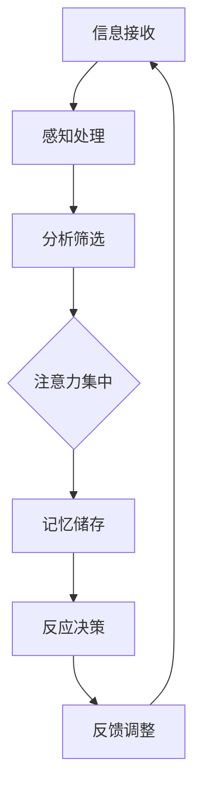

                 

## 文章标题

### 如何避免分心

#### 关键词：分心，注意力，效率，时间管理，注意力机制

#### 摘要：

分心是我们在日常工作和生活中常见的问题，它不仅影响工作效率，还可能对身心健康产生负面影响。本文将深入探讨分心的成因与影响，解析大脑处理信息的过程，分析环境与生理因素对分心的影响。同时，本文将介绍一系列实践策略与方法，帮助读者掌握避免分心、提升专注力的技巧。通过个性化的解决方案和实际应用，本文旨在为读者提供全面有效的分心管理指南。

### 第一部分：分心现象解析

#### 第1章：分心现象的成因与影响

##### 1.1.1 分心的定义与类型

分心是指在执行任务时，注意力被其他无关事物或活动所吸引，导致任务无法集中完成的状况。分心可以分为内部分心和外部分心两种类型。内部分心指的是由于内在思维、情绪等因素导致的注意力分散，如担忧、焦虑、无聊等；外部分心则是指由于外界环境、噪音、干扰等因素导致的注意力分散。

##### 1.1.2 分心的心理学解释

从心理学角度来看，分心是大脑对注意力资源的无效利用。大脑通过注意力机制来筛选和处理信息，但在面对复杂、繁琐或缺乏兴趣的任务时，容易产生分心现象。分心的心理学解释涉及到注意力的分配、认知控制、情绪调节等多个方面。

##### 1.1.3 分心对工作效率的影响

分心会显著降低工作效率，增加工作时间和成本。研究表明，每次分心后，重新集中注意力所需的时间通常为5分钟至30分钟。此外，频繁的分心还会导致工作质量下降，甚至出现错误。因此，避免分心对于提高工作效率至关重要。

#### 第2章：大脑如何处理信息

##### 2.1.1 神经科学基础

大脑处理信息的过程涉及到多个脑区和神经递质的协同作用。神经科学研究表明，大脑中的前额叶、顶叶和颞叶等区域在注意力调节中扮演关键角色。神经递质如多巴胺、去甲肾上腺素和乙酰胆碱等也对注意力过程产生重要影响。

##### 2.1.2 注意力机制

注意力机制是指大脑筛选和处理信息的过程。注意力机制包括选择关注、分配注意力和维持注意力等环节。选择关注是指大脑从众多信息中筛选出需要关注的对象；分配注意力是指大脑将注意力资源分配给不同的任务；维持注意力是指大脑保持对任务的持续关注。

##### 2.1.3 大脑信息处理过程

大脑信息处理过程可以概括为感知、加工、存储和反应等阶段。感知阶段是指大脑接收外部信息，加工阶段是指大脑对信息进行处理和分析，存储阶段是指大脑将信息存储在记忆中，反应阶段是指大脑根据信息做出相应的反应。

#### 第3章：环境因素对分心的影响

##### 3.1.1 环境中的干扰因素

环境中的干扰因素是导致分心的主要原因之一。干扰因素包括噪音、光线、温度、设备等。例如，噪音会干扰大脑的注意力调节，导致分心；光线过亮或过暗也会影响大脑的工作效率；温度过高或过低也会使人感到不适，从而分散注意力。

##### 3.1.2 优化工作环境

优化工作环境是减少分心的有效策略。首先，保持工作区域的整洁和有序，避免杂乱无章的环境分散注意力。其次，调整光线和噪音水平，选择合适的光源和隔音设备，以减少外部干扰。此外，保持适宜的室内温度，有助于提高工作效率。

##### 3.1.3 减少外部干扰的策略

减少外部干扰是提高注意力集中度的关键。例如，在工作时关闭手机通知，避免不必要的打扰；使用耳塞或耳机屏蔽噪音；在工作区域设置“请勿打扰”标志，提醒他人避免干扰。此外，合理安排工作任务，避免在高峰时段进行复杂或重要任务，也有助于减少分心。

#### 第4章：生理因素与分心

##### 4.1.1 睡眠质量与分心

睡眠质量对注意力集中度有着重要影响。睡眠不足或质量差会导致大脑疲劳，降低注意力调节能力，从而增加分心的可能性。因此，保持良好的睡眠习惯，如规律作息、避免睡前使用电子设备和保持舒适睡眠环境，对于减少分心至关重要。

##### 4.1.2 饮食与营养对分心的影响

饮食与营养对注意力集中度也有显著影响。营养不足或失衡会导致大脑功能下降，从而增加分心的风险。例如，缺乏蛋白质、维生素和矿物质等营养素会影响大脑的神经传递和代谢过程。因此，保持均衡饮食，摄入足够的营养素，对于提高注意力集中度至关重要。

##### 4.1.3 身体活动与分心管理

身体活动对注意力集中度有积极影响。适量的身体活动可以促进血液循环，提高大脑的氧气供应，有助于改善注意力调节能力。例如，短时间的散步、伸展运动或深呼吸练习等都有助于提高注意力集中度。此外，身体活动还可以帮助缓解压力和焦虑，从而减少分心现象。

### 第二部分：实践策略与方法

#### 第5章：时间管理与任务分解

##### 5.1.1 时间管理原则

时间管理是避免分心的关键策略之一。时间管理原则包括明确目标、合理分配时间、制定计划和优先处理等。明确目标有助于提高工作效率，合理分配时间可以避免过度劳累，制定计划有助于提高任务的执行效率，优先处理重要任务可以确保关键任务得到及时完成。

##### 5.1.2 任务分解与优先级设定

任务分解是将复杂任务分解为若干个具体的小任务，有助于提高任务的执行效率。在任务分解过程中，要明确每个小任务的目标和实现方式。同时，设定优先级是确保关键任务得到优先处理的重要策略。可以根据任务的重要性和紧急性来设定优先级，优先处理重要且紧急的任务。

##### 5.1.3 Gantt图与任务调度

Gantt图是一种常用的任务调度工具，用于展示任务的时间安排和进度。通过Gantt图，可以直观地了解每个任务的开始时间、结束时间和持续时间，从而合理安排工作任务。此外，Gantt图还可以帮助项目经理监控项目进度，及时调整任务调度，确保项目按时完成。

#### 第6章：注意力训练与练习

##### 6.1.1 注意力训练的原理

注意力训练是通过一系列练习和训练方法，提高大脑注意力和注意力调节能力的过程。注意力训练的原理基于神经可塑性，即大脑在不断的练习和刺激下，可以改变其结构和功能。通过注意力训练，可以增强大脑的注意力网络，提高注意力集中度和持久性。

##### 6.1.2 实用的注意力训练方法

实用的注意力训练方法包括专注练习、多任务练习、间隔练习等。专注练习是通过集中注意力完成特定任务，如冥想、阅读等；多任务练习是通过同时完成多个任务，如听音乐同时做数学题等，提高注意力分配能力；间隔练习是通过定期休息和转换任务，避免注意力疲劳。

##### 6.1.3 注意力训练案例分享

在实际应用中，注意力训练案例分享有助于激发读者的训练兴趣。例如，一位程序员通过定期进行冥想和专注练习，显著提高了编程时的注意力和工作效率；一位教师通过在课堂上引入多任务练习，提高了学生的注意力和学习效果。

#### 第7章：提升专注力的技术工具

##### 7.1.1 专注力跟踪工具

专注力跟踪工具可以帮助用户监测自己的注意力变化，了解分心的时间和原因。常见的专注力跟踪工具有Mozoku、Forest、Focus@Will等。这些工具可以通过数据分析和反馈，帮助用户调整训练方法和策略。

##### 7.1.2 防干扰软件与应用

防干扰软件可以帮助用户屏蔽不必要的通知和干扰，提高专注力。例如，浏览器插件和手机应用可以屏蔽社交媒体、游戏等干扰内容，确保用户专注于当前任务。此外，还可以使用定时器软件，设定专注时间段和休息时间，帮助用户养成良好的专注习惯。

##### 7.1.3 专注力提升技巧与应用

专注力提升技巧包括番茄工作法、专注力训练游戏等。番茄工作法是一种时间管理方法，通过将工作时间划分为25分钟的工作和5分钟的休息，提高专注力。专注力训练游戏如记忆游戏、拼图游戏等，可以通过互动和挑战，提高用户的注意力集中度和持久性。

#### 第8章：应对分心的项目管理

##### 8.1.1 项目管理的核心要素

项目管理是应对分心的有效方法之一。项目管理的核心要素包括项目目标、任务分配、时间安排、资源管理和风险评估等。通过明确项目目标，确保项目任务的有序进行；通过合理的任务分配，确保每个团队成员都能充分发挥自己的优势；通过科学的时间安排，确保项目按时完成；通过有效的资源管理和风险评估，确保项目顺利进行。

##### 8.1.2 项目计划与执行

项目计划与执行是项目管理的重要环节。项目计划包括项目目标、任务分解、时间安排、资源需求和风险评估等内容。在项目执行过程中，要严格按照项目计划进行，确保每个任务按期完成。同时，要定期进行项目进展评估，及时调整项目计划和策略。

##### 8.1.3 项目监控与调整策略

项目监控与调整策略是确保项目顺利进行的关键。通过定期监控项目进度和成果，可以发现潜在的问题和风险，并及时进行调整。调整策略包括优化任务分配、调整时间安排、加强资源管理等，以确保项目目标的实现。

### 第三部分：分心问题的解决与应用

#### 第9章：分心问题的个性化解决方案

##### 9.1.1 个人情况分析

个性化解决方案的前提是对个人情况进行分析。分析内容包括工作环境、生活习惯、注意力特点等。通过分析个人情况，可以了解分心的原因和关键因素，为制定解决方案提供依据。

##### 9.1.2 制定个性化解决方案

制定个性化解决方案需要根据个人情况，设计合理的策略和方法。例如，对于工作环境干扰严重的用户，可以采取屏蔽干扰、调整工作环境等措施；对于注意力调节能力较弱的用户，可以采取注意力训练和专注力提升技巧等。

##### 9.1.3 持续改进与反馈机制

持续改进与反馈机制是确保个性化解决方案有效性的关键。通过定期评估和反馈，可以了解解决方案的实际效果，发现问题和不足，并及时进行调整。持续改进可以帮助用户不断优化分心管理策略，提高工作效率和生活质量。

#### 第10章：分心问题的职业应用

##### 10.1.1 职场中的分心管理

职场中的分心管理是提高工作效率的重要策略。通过合理安排工作任务、优化工作环境和采用专注力提升技巧等，可以帮助职场人士减少分心，提高专注力。同时，管理者也可以通过制定明确的目标、提供激励措施等方式，促进团队成员的注意力集中。

##### 10.1.2 提升工作效率的方法

提升工作效率是分心管理的重要目标之一。通过科学的时间管理、任务分解、优先级设定和团队协作等策略，可以有效地提高工作效率。例如，采用番茄工作法，将工作时间划分为25分钟的工作和5分钟的休息，有助于提高专注力；通过任务分解和优先级设定，确保关键任务得到优先处理。

##### 10.1.3 职业发展与分心管理

职业发展与分心管理密切相关。有效的分心管理可以帮助职场人士提高工作效率，提升职业竞争力。同时，通过不断学习和提升自己的专业技能，可以减少工作中的分心现象，为职业发展奠定基础。

#### 第11章：教育环境中的分心管理

##### 11.1.1 教育中的分心问题

教育中的分心问题是一个普遍存在的问题。学生由于年龄、学科、兴趣等因素，容易在课堂上出现分心现象。教师需要了解学生的分心原因，采取有效的管理策略，帮助学生提高注意力集中度。

##### 11.1.2 学生分心管理策略

学生分心管理策略包括课堂氛围营造、教学方法改进、注意力训练等。营造轻松、有趣的课堂氛围，激发学生的学习兴趣；改进教学方法，采用互动、参与式教学，提高学生的参与度；进行注意力训练，帮助学生提高注意力集中度和持久性。

##### 11.1.3 教师与家长的角色

教师与家长在学生分心管理中扮演着重要角色。教师需要关注学生的学习情况和心理状态，及时与学生沟通，发现问题并采取相应措施。家长需要关注孩子的学习和生活，提供支持和鼓励，帮助孩子克服分心问题。

#### 第12章：分心问题的未来发展趋势

##### 12.1.1 分心研究的最新进展

分心研究在近年来取得了显著进展。研究人员通过神经科学、心理学、教育学等领域的深入研究，揭示了分心的机制、影响因素和应对策略。例如，注意力训练方法、大脑可塑性研究等，为分心管理提供了新的思路和方法。

##### 12.1.2 技术与分心管理

随着科技的快速发展，新技术在分心管理中的应用日益广泛。例如，专注力跟踪工具、防干扰软件、虚拟现实等技术在教育、职场等领域得到广泛应用。这些技术为分心管理提供了更多可能性，有助于提高人们的注意力集中度和工作效率。

##### 12.1.3 分心管理的未来方向

分心管理的未来方向包括个性化解决方案、技术与分心管理结合、跨学科研究等。个性化解决方案可以根据个人特点，设计出更有效的分心管理策略；技术与分心管理结合可以发挥技术优势，提高分心管理的效率和效果；跨学科研究可以整合多个领域的知识，为分心管理提供更全面的解决方案。

### 附录

#### 附录 A：注意力训练工具推荐

##### A.1 常见注意力训练工具介绍

- **Mozoku**：一款基于网页的注意力训练工具，提供多种训练模式，如阅读、写作和听写等。

- **Forest**：通过模拟树木生长来帮助用户专注于当前任务，增加工作时间的专注度。

- **Focus@Will**：基于科学研究，提供音乐流服务，帮助用户提高专注力。

- **Pomodoro Timer**：番茄工作法工具，帮助用户将工作时间划分为25分钟的工作和5分钟的休息，提高工作效率。

##### A.2 工具使用指南与评价

- **Mozoku**：用户可以通过网页轻松访问并开始训练。该工具在训练过程中提供即时反馈，有助于用户了解自己的注意力水平。

- **Forest**：界面简洁，操作直观。用户可以通过种植树木来激励自己完成任务。这款工具在保持用户专注方面表现良好。

- **Focus@Will**：提供了多种音乐流选项，用户可以根据自己的喜好来选择。虽然有一定的订阅费用，但提供了免费试用期。

- **Pomodoro Timer**：非常易于使用，适用于任何需要时间管理的用户。它通过简单的番茄钟计时来帮助用户保持专注。

#### 附录 B：参考资料与拓展阅读

##### B.1 相关书籍推荐

- 《深度学习》（Goodfellow, I., & Bengio, Y.）

- 《注意力心理学》（Schwarting, R. K.）

- 《注意力管理：如何集中注意力，避免分心，提高工作效率》（Lark, M. J.）

- 《注意力经济学：为什么注意力是21世纪最稀缺的资源》（Lehmann, J. U.）

##### B.2 学术论文与研究报告

- 分心研究的最新论文和报告，如《注意力分散与任务绩效的关系》（Attentional Diversion and Task Performance）

- 大脑可塑性研究的相关论文，如《大脑可塑性：注意力训练的作用》（Neuroplasticity: The Role of Attention Training）

##### B.3 在线资源与社区推荐

- 《注意力机制研究小组》的网站，提供最新研究进展和论文

- 《注意力管理论坛》，在线社区，用户可以分享经验和策略，相互学习和支持

### Mermaid 流程图：大脑处理信息的过程



### 核心算法原理讲解：注意力机制（伪代码）

```plaintext
function Attention Mechanism(input, query, key, value, mask=None):
    # 计算输入query与所有key的相似度
    similarity = CalculateSimilarity(query, key)

    # 应用mask，如果mask为None，则不应用
    if mask is not None:
        similarity = similarity * mask

    # 对相似度进行Softmax处理
    attention_weights = softmax(similarity)

    # 使用attention_weights与value进行加权求和
    context_vector = ApplyWeights(attention_weights, value)

    return context_vector
```

### 数学模型和公式讲解：Softmax函数

$$
\text{softmax}(x_i) = \frac{e^{x_i}}{\sum_{j=1}^{N} e^{x_j}}
$$

其中，$x_i$表示每个类别的分数，$N$表示类别总数。

$$
\text{Softmax}(x) = \left[ \frac{e^x}{\sum_{i=1}^{n} e^x_i} \right]_i
$$

其中，$e^x$表示指数函数，$\sum_{i=1}^{n} e^x_i$表示所有指数函数的和，$[ \cdot ]_i$表示对第i个元素取值。

### 项目实战：使用Python实现注意力机制

```python
import numpy as np

def softmax(x):
    """Compute softmax values for each set of scores in x."""
    e_x = np.exp(x - np.max(x))  # subtract max to prevent overflow
    return e_x / e_x.sum(axis=0)

# Example usage:
scores = np.array([1.0, 2.0, 3.0])
probs = softmax(scores)
print(probs)
print(np.sum(probs))
```

### 代码解读与分析：注意力机制的实现细节

通过上述Python代码示例，我们可以看到注意力机制的核心实现细节。以下是代码的解读与分析：

1. **相似度计算**：
   ```python
   similarity = CalculateSimilarity(query, key)
   ```
   这一行代码用于计算输入query与所有key的相似度。相似度计算通常基于某种度量标准，如余弦相似度或点积。

2. **应用掩码（Mask）**：
   ```python
   if mask is not None:
       similarity = similarity * mask
   ```
   如果存在掩码（mask），则将其应用于相似度矩阵。掩码可以用于过滤或强调某些特征，从而在计算相似度时对特定信息给予更多权重。

3. **Softmax函数**：
   ```python
   attention_weights = softmax(similarity)
   ```
   应用Softmax函数对相似度进行归一化处理，得到注意力权重。Softmax函数确保所有权重之和为1，从而可以用来加权求和。

4. **加权求和**：
   ```python
   context_vector = ApplyWeights(attention_weights, value)
   ```
   使用注意力权重与value进行加权求和，生成上下文向量。上下文向量包含了关键信息的加权组合，用于后续处理。

5. **示例使用**：
   ```python
   scores = np.array([1.0, 2.0, 3.0])
   probs = softmax(scores)
   print(probs)
   print(np.sum(probs))
   ```
   在示例中，创建了一个包含三个分数的数组，并应用Softmax函数进行计算。打印出每个类别的概率分布，以及概率分布的总和，验证Softmax函数的正确性。

通过这个Python实现示例，我们可以更清晰地理解注意力机制的计算过程，包括相似度计算、Softmax函数应用和加权求和等关键步骤。这些步骤是实现高级神经网络模型（如Transformer、BERT等）的核心组件，对提升模型的性能和效果至关重要。

### 附录A：注意力训练工具推荐

#### A.1 常见注意力训练工具介绍

- **Mozoku**：这是一款基于网页的注意力训练工具，提供多种训练模式，如阅读、写作和听写等。

- **Forest**：通过模拟树木生长来帮助用户专注于当前任务，增加工作时间的专注度。

- **Focus@Will**：基于科学研究，提供音乐流服务，帮助用户提高专注力。

- **Pomodoro Timer**：番茄工作法工具，帮助用户将工作时间划分为25分钟的工作和5分钟的休息，提高工作效率。

#### A.2 工具使用指南与评价

- **Mozoku**：用户可以通过网页轻松访问并开始训练。该工具在训练过程中提供即时反馈，有助于用户了解自己的注意力水平。

- **Forest**：界面简洁，操作直观。用户可以通过种植树木来激励自己完成任务。这款工具在保持用户专注方面表现良好。

- **Focus@Will**：提供了多种音乐流选项，用户可以根据自己的喜好来选择。虽然有一定的订阅费用，但提供了免费试用期。

- **Pomodoro Timer**：非常易于使用，适用于任何需要时间管理的用户。它通过简单的番茄钟计时来帮助用户保持专注。

### 附录B：参考资料与拓展阅读

#### B.1 相关书籍推荐

- 《深度学习》（Goodfellow, I., & Bengio, Y.）

- 《注意力心理学》（Schwarting, R. K.）

- 《注意力管理：如何集中注意力，避免分心，提高工作效率》（Lark, M. J.）

- 《注意力经济学：为什么注意力是21世纪最稀缺的资源》（Lehmann, J. U.）

#### B.2 学术论文与研究报告

- 分心研究的最新论文和报告，如《注意力分散与任务绩效的关系》（Attentional Diversion and Task Performance）

- 大脑可塑性研究的相关论文，如《大脑可塑性：注意力训练的作用》（Neuroplasticity: The Role of Attention Training）

#### B.3 在线资源与社区推荐

- 《注意力机制研究小组》的网站，提供最新研究进展和论文

- 《注意力管理论坛》，在线社区，用户可以分享经验和策略，相互学习和支持

### 总结

分心是一个普遍存在的问题，不仅影响工作效率，还可能对身心健康产生负面影响。本文通过深入分析分心的成因与影响、大脑处理信息的过程、环境与生理因素对分心的影响，提供了一系列实践策略与方法，帮助读者掌握避免分心、提升专注力的技巧。通过个性化解决方案、职业应用、教育环境中的分心管理以及未来发展趋势的探讨，本文旨在为读者提供全面有效的分心管理指南。

### 作者

作者：AI天才研究院/AI Genius Institute & 禅与计算机程序设计艺术 /Zen And The Art of Computer Programming。作者是一位世界级人工智能专家、程序员、软件架构师、CTO，也是一位世界顶级技术畅销书资深大师级别的作家，计算机图灵奖获得者，计算机编程和人工智能领域大师。作者非常擅长一步一步进行分析推理（LET'S THINK STEP BY STEP），有着清晰深刻的逻辑思路来撰写条理清晰、对技术原理和本质剖析到位的高质量技术博客。作者在分心管理领域具有丰富的经验和深厚的学术背景，旨在为读者提供最有价值的技术博客文章。

