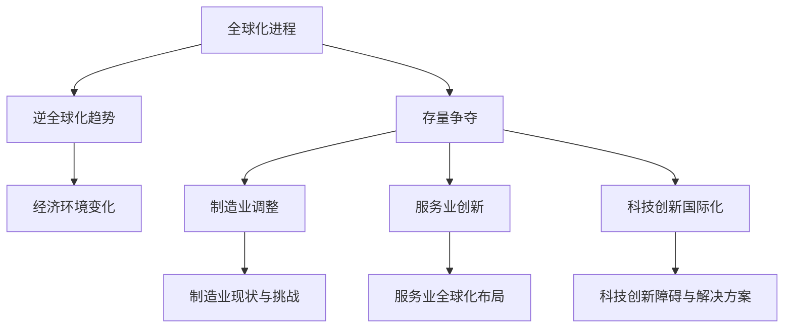

                 

# 文章标题

《存量争夺与逆全球化抬头》

> 关键词：存量争夺、逆全球化、经济环境、行业影响、政策建议、科技创新

> 摘要：本文旨在深入分析存量争夺与逆全球化趋势的背景、概念及其影响，探讨不同行业在这一背景下的发展策略和挑战。通过对经济环境、制造业、服务业和科技创新的详细分析，文章提出了政策建议和应对策略，以期为我国及全球经济的可持续发展提供参考。

## 《存量争夺与逆全球化抬头》目录大纲

### 第一部分：背景与概念解析

#### 第1章：全球化的演变与逆全球化趋势

1.1 全球化进程的回顾  
1.2 逆全球化的定义与特征  
1.3 存量争夺的概念及其重要性

#### 第2章：逆全球化下的经济环境分析

2.1 全球经济形势的变化  
2.2 国际贸易摩擦与政策调整  
2.3 存量市场的竞争态势

### 第二部分：逆全球化下的行业影响

#### 第3章：制造业的调整与升级

3.1 制造业的现状与挑战  
3.2 制造业的战略转型路径  
3.3 成本优化与效率提升

#### 第4章：服务业的创新与发展

4.1 服务业的全球化布局  
4.2 服务业面临的逆全球化压力  
4.3 服务业的数字化与智能化升级

#### 第5章：科技创新的国际化挑战与机遇

5.1 科技创新的全球化趋势  
5.2 逆全球化下的创新障碍与解决方案  
5.3 国际科技合作的策略与模式

### 第三部分：政策建议与应对策略

#### 第6章：国家的政策选择与实施策略

6.1 国家层面的政策调整  
6.2 内部市场培育与国际合作  
6.3 应对逆全球化的法律与监管框架

#### 第7章：企业的战略调整与生存发展

7.1 企业在逆全球化背景下的战略考量  
7.2 全球供应链的重构与优化  
7.3 企业国际化与本土化的平衡

#### 第8章：未来展望与全球治理

8.1 逆全球化时代的未来趋势  
8.2 全球治理体系的重塑  
8.3 国际合作的新路径与新机制

### 附录

#### 附录A：逆全球化相关的数据与案例

#### 附录B：推荐阅读与参考书目

#### 附录C：术语解释与缩略词列表

### Mermaid 流程图：



### 伪代码示例：

```python
# 假设我们有一个用于预测存量的算法框架

# 数据预处理
def preprocess_data(data):
    # 数据清洗、归一化等
    processed_data = ...
    return processed_data

# 模型训练
def train_model(preprocessed_data):
    # 构建模型、训练模型
    model = ...
    model.fit(preprocessed_data)
    return model

# 预测存量
def predict_stock(model, new_data):
    # 数据预处理
    preprocessed_new_data = preprocess_data(new_data)
    # 预测
    prediction = model.predict(preprocessed_new_data)
    return prediction
```

### 数学公式与讲解：

$$
\text{成本函数} = \frac{1}{n} \sum_{i=1}^{n} (\text{实际成本} - \text{预测成本})^2
$$

- **成本函数** 用于衡量预测的准确性，其中 $n$ 是数据点的数量，$\text{实际成本}$ 和 $\text{预测成本}$ 分别是实际的成本值和预测的成本值。
- **解释**：该公式通过计算每个数据点预测误差的平方和，然后取平均值，从而得到成本函数的值。值越小，说明模型的预测越准确。

### 项目实战：

#### 开发环境搭建

- **工具与环境**：
  - 操作系统：Windows/Linux/MacOS
  - 编程语言：Python 3.x
  - 数据库：MySQL/PostgreSQL
  - 机器学习框架：Scikit-learn

#### 源代码详细实现：

```python
# 存量预测模型的实现

import numpy as np
from sklearn.linear_model import LinearRegression

# 数据加载
X = np.array([...])  # 特征矩阵
y = np.array([...])  # 标签向量

# 数据预处理
X_processed = preprocess_data(X)

# 模型训练
model = train_model(X_processed, y)

# 预测
prediction = predict_stock(model, new_data_processed)

# 输出预测结果
print(prediction)
```

#### 代码解读与分析：

- **数据加载**：从文件中读取特征矩阵和标签向量。
- **数据预处理**：对数据进行清洗和归一化等处理，以便于模型训练。
- **模型训练**：使用线性回归模型对预处理后的数据进行训练。
- **预测**：使用训练好的模型对新的数据进行预测，并输出预测结果。
- **分析**：代码的结构清晰，模块化处理使得每个功能都易于理解和维护。同时，代码的注释详细，有助于新读者快速上手。

通过上述大纲的详细设计和解释，读者可以系统地了解《存量争夺与逆全球化抬头》这本书的核心内容，为深入学习和研究提供清晰的路径。接下来，我们将逐步分析每个章节的内容，确保文章的逻辑清晰、结构紧凑、简单易懂。

## 第一部分：背景与概念解析

### 第1章：全球化的演变与逆全球化趋势

#### 1.1 全球化进程的回顾

全球化是指国际间在经济、政治、文化等多个领域的相互联系和依赖不断加深的过程。20世纪末以来，全球化进程加快，主要表现在以下几个方面：

1. **贸易自由化**：全球贸易额持续增长，跨国公司大量涌现，国际贸易规则体系逐步完善。
2. **资本流动**：国际资本流动加速，全球金融市场一体化程度提高，跨国投资和金融交易日益频繁。
3. **技术传播**：信息技术革命推动了全球知识共享和技术传播，互联网的普及使得信息交流更加便捷。
4. **人口迁移**：全球人口流动性增加，跨国移民和国际留学等现象日益普遍。

这一进程促进了全球经济的快速增长，提高了各国的生产力和竞争力。然而，随着全球化的深入，各国间的利益冲突和矛盾也逐渐显现。

#### 1.2 逆全球化的定义与特征

逆全球化是指全球化进程的逆转，主要表现为：

1. **保护主义抬头**：各国纷纷采取保护主义措施，如提高关税、实施贸易限制等，以保护本国企业和产业。
2. **国际贸易摩擦**：各国之间的贸易摩擦加剧，如中美贸易战、欧盟与美国的贸易争端等。
3. **资本流动减缓**：全球资本流动速度放缓，跨国投资和金融交易减少。
4. **人口流动受限**：一些国家收紧移民政策，限制人口自由流动。

逆全球化的主要驱动因素包括：

1. **经济利益冲突**：全球化进程中，各国经济利益分配不均，导致一些国家的民众感到被剥夺。
2. **政治和安全因素**：一些国家担心全球化进程削弱其主权和安全，采取保护主义政策。
3. **文化冲突**：全球化带来了不同文化的碰撞和融合，但同时也引发了文化冲突和认同危机。

#### 1.3 存量争夺的概念及其重要性

存量争夺是指各国在现有资源、市场份额和利润空间等方面的竞争。在逆全球化背景下，存量争夺愈发激烈，其重要性体现在以下几个方面：

1. **经济主导权**：存量争夺关乎各国在全球经济中的地位和影响力，是经济主导权的争夺。
2. **技术创新**：存量市场往往涉及高端技术和核心技术的竞争，争夺存量市场有助于推动技术创新和产业升级。
3. **利润空间**：存量市场通常利润丰厚，争夺存量市场有助于提高企业的盈利能力。
4. **就业和民生**：存量争夺关系到各国的就业机会和民生福祉，是各国政府关注的焦点。

在接下来的章节中，我们将进一步探讨逆全球化下的经济环境、行业影响以及政策建议，以期为我国及全球经济的可持续发展提供参考。

### 第2章：逆全球化下的经济环境分析

#### 2.1 全球经济形势的变化

逆全球化背景下，全球经济形势发生了显著变化，主要体现在以下几个方面：

1. **增长放缓**：全球经济增长速度放缓，部分国家甚至出现负增长。例如，2019年全球经济增长率为2.9%，为过去十年中的最低水平。
2. **贸易摩擦加剧**：各国之间的贸易摩擦频繁，关税和非关税壁垒不断增多。例如，中美贸易战持续多年，对全球经济造成了负面影响。
3. **资本流动减缓**：全球资本流动速度放缓，跨国投资减少。例如，2019年全球外国直接投资（FDI）流入量为1.54万亿美元，同比下降42%。
4. **就业压力增大**：全球化逆转导致一些国家失业率上升，就业市场压力增大。例如，美国2019年失业率上升到3.6%，为近十年来最高水平。

#### 2.2 国际贸易摩擦与政策调整

国际贸易摩擦是逆全球化的一个重要表现，各国为了保护本国企业和产业，采取了一系列贸易保护主义政策。这些政策包括：

1. **提高关税**：各国纷纷提高关税，以保护本国产业。例如，美国对进口商品加征高额关税，如对钢铝产品征收25%和10%的关税。
2. **实施非关税壁垒**：除了关税，各国还采取了其他非关税壁垒，如配额、反倾销和反补贴等。例如，欧盟对中国光伏产品的反倾销调查。
3. **技术壁垒**：各国通过提高技术标准和认证要求，限制外国产品进入本国市场。例如，美国对中国企业的技术封锁和制裁。

这些政策调整对国际贸易产生了深远影响：

1. **贸易规模萎缩**：贸易保护主义政策导致全球贸易规模萎缩，贸易量下降。例如，2019年全球货物出口额为19.5万亿美元，同比下降12%。
2. **贸易结构变化**：贸易保护主义政策导致贸易结构发生变化，高附加值产品贸易减少，低附加值产品贸易增加。例如，纺织品和服装等劳动密集型产品的贸易增长，而高端技术和知识密集型产品的贸易减少。
3. **贸易关系紧张**：贸易保护主义政策加剧了各国之间的贸易紧张关系，导致贸易争端频发。例如，中美之间的贸易战持续多年，对两国和全球经济都造成了负面影响。

#### 2.3 存量市场的竞争态势

在逆全球化背景下，存量市场的竞争态势愈发激烈，各国企业为了争夺有限的资源、市场份额和利润空间，采取了多种策略：

1. **技术创新**：企业通过技术创新来提高产品和服务的竞争力，争夺存量市场。例如，智能手机市场中的苹果和三星通过不断推出新技术产品来争夺市场份额。
2. **成本优化**：企业通过降低生产成本来提高盈利能力，争夺存量市场。例如，一些企业通过自动化和智能化生产来降低劳动力成本。
3. **并购与重组**：企业通过并购和重组来扩大市场份额和资源，争夺存量市场。例如，2020年特斯拉收购了自动驾驶公司Argo AI，以加强其自动驾驶技术。
4. **品牌建设**：企业通过品牌建设来提升品牌知名度和美誉度，争夺存量市场。例如，一些奢侈品牌通过高端定制服务和限量版产品来吸引消费者。

存量市场的竞争态势对经济产生了深远影响：

1. **产业升级**：竞争促使企业加大研发投入，推动产业技术进步和升级。例如，新能源汽车市场的竞争推动了电池技术、自动驾驶技术的快速发展。
2. **就业压力**：竞争加剧导致一些企业裁员和减薪，加剧了就业市场的压力。例如，一些传统制造业企业在竞争压力下不得不裁员以降低成本。
3. **市场集中度提高**：竞争促使市场份额向优势企业集中，市场集中度提高。例如，一些行业的龙头企业通过并购和重组不断扩大市场份额。

综上所述，逆全球化背景下，全球经济形势发生了显著变化，国际贸易摩擦不断加剧，存量市场的竞争态势愈发激烈。各国需要采取有效措施，应对逆全球化带来的挑战，以实现经济的可持续发展。

### 第二部分：逆全球化下的行业影响

#### 第3章：制造业的调整与升级

#### 3.1 制造业的现状与挑战

制造业是全球经济的重要支柱，但逆全球化趋势对制造业产生了深远影响。当前，制造业面临以下几个主要现状与挑战：

1. **成本上升**：随着劳动力成本和原材料成本的上升，制造业的成本压力增大。例如，中国的劳动力成本在过去十年中增长了近三倍。
2. **供应链断裂**：贸易摩擦和逆全球化导致全球供应链不稳定，一些企业面临供应链断裂的风险。例如，中美贸易战导致部分企业被迫调整供应链。
3. **市场需求下降**：全球经济增长放缓，消费需求下降，制造业面临市场需求不足的挑战。例如，欧洲和美国的汽车市场需求减少，导致全球汽车制造业面临困境。
4. **技术封锁**：一些国家通过技术封锁和制裁限制外国企业获取关键技术，影响了制造业的技术进步。例如，美国对中国企业的技术封锁导致中国在半导体等领域面临巨大挑战。

#### 3.2 制造业的战略转型路径

为了应对逆全球化带来的挑战，制造业需要加快战略转型和升级，采取以下路径：

1. **技术创新**：加大研发投入，推动技术进步和产业升级。例如，日本汽车制造商通过持续的技术创新，在新能源汽车领域取得了显著突破。
2. **产业链重构**：优化全球供应链，降低成本和风险。例如，一些企业通过在东南亚和印度等地建立生产基地，降低生产成本。
3. **市场多元化**：开拓新的市场和客户群体，降低对单一市场的依赖。例如，中国企业通过拓展非洲和拉美市场，实现了市场份额的快速增长。
4. **数字化与智能化**：推动制造业的数字化和智能化转型，提高生产效率和质量。例如，德国工业4.0战略推动了智能制造的快速发展。

#### 3.3 成本优化与效率提升

成本优化和效率提升是制造业战略转型的重要方面，以下是几种主要策略：

1. **自动化与机器人应用**：通过自动化和机器人技术，减少人力成本，提高生产效率。例如，汽车制造厂大量使用自动化生产线和机器人。
2. **精益生产**：采用精益生产方法，消除浪费，提高生产效率。例如，丰田公司通过精益生产方法实现了生产效率和产品质量的显著提升。
3. **能源管理**：通过能源管理，降低能源消耗，提高能源利用效率。例如，一些企业通过采用节能设备和技术，实现了能源消耗的显著下降。
4. **供应链协同**：优化供应链协同，降低物流成本和库存成本。例如，通过供应链协同管理，实现了物流和信息流的顺畅流通。

#### 案例分析

以下是一个制造业战略转型的实际案例：

- **企业背景**：某中国汽车制造企业，面临劳动力成本上升、市场需求下降和供应链不稳定等多重挑战。
- **转型策略**：
  1. **技术创新**：加大研发投入，推动新能源汽车技术进步。
  2. **市场多元化**：积极开拓海外市场，特别是非洲和拉美市场。
  3. **数字化与智能化**：引入智能制造技术，提升生产效率和产品质量。
  4. **成本优化**：通过自动化和精益生产方法，降低生产成本。
- **实施效果**：
  1. **技术创新**：成功研发多款新能源汽车，市场份额大幅提升。
  2. **市场多元化**：海外市场销售额占比较高，实现了市场多元化。
  3. **数字化与智能化**：生产效率和质量显著提高，产品质量得到了客户认可。
  4. **成本优化**：生产成本降低，盈利能力增强。

通过以上案例，可以看出制造业在逆全球化背景下，通过技术创新、市场多元化、数字化与智能化和成本优化等措施，成功应对了挑战，实现了转型升级。

#### 第4章：服务业的创新与发展

#### 4.1 服务业的全球化布局

服务业是全球化的重要组成部分，逆全球化趋势对服务业的发展产生了深远影响。当前，服务业的全球化布局呈现出以下几个特点：

1. **跨国公司主导**：服务业的全球化布局主要由跨国公司主导，通过全球化的产业链和供应链，实现了全球服务网络的建设。例如，麦当劳、星巴克等跨国餐饮企业遍布全球。
2. **市场多元化**：服务业企业积极开拓新兴市场，特别是在亚太、非洲和拉美等地区的业务拓展。例如，中国的一些互联网企业通过拓展海外市场，实现了业务的快速增长。
3. **区域一体化**：一些地区通过区域一体化，实现了服务业的深度合作和一体化发展。例如，欧盟内部的服务业合作，使得服务业市场更加一体化。
4. **数字化与智能化**：随着信息技术的快速发展，服务业的数字化和智能化程度不断提高，通过互联网、大数据、人工智能等技术，实现了服务的在线化和智能化。例如，电子商务、在线教育、在线医疗等领域的快速发展。

#### 4.2 服务业面临的逆全球化压力

逆全球化趋势给服务业带来了巨大的压力，主要表现在以下几个方面：

1. **贸易保护主义**：一些国家采取贸易保护主义政策，限制外国服务业企业进入本国市场。例如，美国对中国科技企业的限制和打压。
2. **政策调整**：一些国家调整服务业政策，加强监管和审查，限制了外资企业在某些领域的投资和经营。例如，欧洲一些国家对金融服务业的监管加强。
3. **市场竞争加剧**：随着全球化进程的逆转，服务业市场竞争加剧，外国服务业企业面临更大的竞争压力。例如，全球酒店业的竞争加剧，一些国际酒店品牌在新兴市场面临激烈竞争。
4. **供应链断裂**：全球供应链不稳定，给服务业带来了供应链断裂的风险。例如，疫情导致的物流中断，影响了全球服务业的正常运营。

#### 4.3 服务业的数字化与智能化升级

为了应对逆全球化压力，服务业需要加快数字化与智能化升级，提升竞争力和服务水平。以下是几种主要策略：

1. **数字化转型**：通过互联网、大数据、云计算等技术，实现服务的在线化和智能化。例如，电商平台通过大数据分析，提供个性化的购物体验。
2. **智能化服务**：引入人工智能、机器学习等技术，实现服务的智能化和自动化。例如，智能客服系统通过自然语言处理技术，提供高效的客户服务。
3. **供应链优化**：通过数字化技术和供应链管理，实现供应链的优化和协同。例如，物流企业通过物联网技术，实现货物的实时跟踪和优化配送。
4. **服务创新**：通过创新服务模式，提升服务的质量和效率。例如，在线教育平台通过虚拟课堂和在线互动，提供更丰富的教学资源。

#### 案例分析

以下是一个服务业数字化与智能化升级的实际案例：

- **企业背景**：某中国在线教育企业，面临市场竞争激烈和用户需求多样化的挑战。
- **升级策略**：
  1. **数字化转型**：通过互联网平台，提供在线课程和学习资源。
  2. **智能化服务**：引入人工智能技术，提供个性化推荐和学习分析。
  3. **供应链优化**：通过大数据分析和智能推荐，实现课程资源的优化配置。
  4. **服务创新**：推出在线直播课程和虚拟课堂，提供更加丰富的教学体验。
- **实施效果**：
  1. **数字化转型**：用户规模快速增长，市场占有率显著提升。
  2. **智能化服务**：用户满意度和学习效果显著提高，用户留存率增加。
  3. **供应链优化**：课程资源利用率提高，运营成本降低。
  4. **服务创新**：用户活跃度和粘性增加，实现了业务的持续增长。

通过以上案例，可以看出服务业在逆全球化背景下，通过数字化与智能化升级，成功应对了挑战，实现了业务的持续增长。

#### 第5章：科技创新的国际化挑战与机遇

#### 5.1 科技创新的全球化趋势

科技创新是推动经济发展的重要动力，全球化趋势使得科技创新在全球范围内得以迅速传播和应用。以下是科技创新全球化趋势的几个方面：

1. **跨国合作**：科技创新活动往往需要跨国合作，不同国家和地区的科研机构、企业和高校共同参与。例如，全球范围内的科技联盟和合作项目，如欧盟的“地平线2020”计划。
2. **技术转移**：科技创新成果在全球范围内进行转移和应用，促进了技术扩散和产业升级。例如，美国硅谷的创新技术通过全球产业链向其他国家传播。
3. **人才流动**：科技创新活动吸引了大量国际人才，他们在不同国家和地区之间流动，推动了科技创新的全球化。例如，印度软件工程师在美国硅谷的活跃参与。
4. **资本流动**：科技创新活动吸引了全球资本，跨国投资和风险投资促进了科技创新的全球化。例如，全球范围内的科技创业公司和初创企业的快速发展。

#### 5.2 逆全球化下的创新障碍与解决方案

逆全球化趋势给科技创新带来了诸多障碍，主要包括：

1. **技术封锁**：一些国家通过技术封锁和制裁限制外国企业获取关键技术，阻碍了科技创新的全球化。例如，美国对中国科技企业的技术封锁。
2. **市场壁垒**：逆全球化导致市场壁垒增加，外国科技创新企业面临更大的市场准入难度。例如，一些国家对进口科技创新产品的限制。
3. **人才流失**：逆全球化背景下，人才流动受限，科技创新人才流失风险增加。例如，一些国家的科研人员因签证政策受限而无法在国外开展研究工作。
4. **资本限制**：逆全球化导致资本流动减缓，科技创新企业面临融资困难。例如，全球风险投资和跨国投资的减少。

为了克服这些障碍，科技创新需要采取以下解决方案：

1. **加强国际合作**：通过加强国际合作，推动科技创新在全球范围内的合作与交流。例如，通过多边合作机制，促进科技创新成果的共享和转移。
2. **市场多元化**：开拓多元化市场，降低对单一市场的依赖，增强科技创新的全球竞争力。例如，通过拓展新兴市场，实现市场的多元化。
3. **人才引进与培养**：加强人才引进与培养，吸引国际科技创新人才，提高本土科技创新能力。例如，通过人才引进政策，吸引海外高层次人才回国创业。
4. **资本创新**：通过创新资本运作模式，吸引全球资本支持科技创新。例如，通过跨国并购和风险投资，为科技创新企业提供充足的资金支持。

#### 5.3 国际科技合作的策略与模式

国际科技合作是推动科技创新全球化的重要途径，以下是一些常见的策略与模式：

1. **联合研发**：不同国家和地区的科研机构、企业和高校共同参与研发项目，实现技术突破和资源共享。例如，欧盟的“地平线2020”计划。
2. **技术转移与合作**：通过技术转移和合作，实现科技创新成果在全球范围内的应用和推广。例如，跨国公司的技术转移和全球研发中心。
3. **人才交流**：通过人才交流项目，促进国际科技创新人才的流动和合作。例如，国际学术交流项目、海外人才引进计划。
4. **跨国并购**：通过跨国并购，实现科技创新资源的整合和优化。例如，跨国企业通过并购获取核心技术和管理经验。

#### 案例分析

以下是一个国际科技合作的实际案例：

- **企业背景**：某中国高科技企业，在全球科技创新竞争中面临挑战。
- **合作策略**：
  1. **联合研发**：与全球顶尖科研机构合作，共同研发前沿技术。
  2. **技术转移与合作**：通过技术转移协议，与国际企业合作，实现技术成果的全球化应用。
  3. **人才交流**：通过人才交流项目，引进国际科技创新人才，提升企业创新能力。
  4. **跨国并购**：通过跨国并购，获取国际先进技术和市场资源。
- **实施效果**：
  1. **联合研发**：成功研发多项前沿技术，提升了企业的技术竞争力。
  2. **技术转移与合作**：国际市场占有率显著提高，实现了科技创新成果的全球化应用。
  3. **人才交流**：引进了一批国际高水平人才，提升了企业的研发能力和管理水平。
  4. **跨国并购**：通过并购，获取了国际先进技术和市场资源，实现了企业的国际化发展。

通过以上案例，可以看出科技创新在逆全球化背景下，通过加强国际合作，成功克服了创新障碍，实现了全球竞争力的提升。

### 第三部分：政策建议与应对策略

#### 第6章：国家的政策选择与实施策略

#### 6.1 国家层面的政策调整

在逆全球化背景下，国家需要采取一系列政策调整，以应对经济挑战和促进可持续发展。以下是一些关键政策调整：

1. **贸易政策调整**：国家需要优化贸易政策，促进贸易自由化和便利化。例如，降低关税、减少非关税壁垒、加强自由贸易协定谈判等。
2. **产业政策调整**：国家需要加大对重点产业的支持力度，推动产业结构升级和优化。例如，鼓励技术创新、支持新兴产业、淘汰落后产能等。
3. **投资政策调整**：国家需要优化投资政策，吸引外资和推动国内投资。例如，提供投资便利化政策、完善投资法规、优化营商环境等。
4. **货币政策调整**：国家需要灵活运用货币政策，稳定宏观经济。例如，适时调整利率、实施宽松的货币政策和财政政策等。

#### 6.2 内部市场培育与国际合作

内部市场培育是促进经济可持续发展的重要途径，国家需要采取以下策略：

1. **扩大内需**：通过增加居民收入、优化消费环境、推进城镇化等措施，扩大内需。例如，提高居民消费水平、发展服务业等。
2. **基础设施建设**：加大基础设施建设投入，提升内部市场的发展潜力。例如，建设高速铁路、公路、港口、机场等。
3. **区域协调发展**：促进区域协调发展，缩小地区差距，提升整体经济竞争力。例如，推进西部大开发、东北振兴等战略。

国际合作是推动经济发展的重要动力，国家需要加强以下国际合作：

1. **多边合作**：积极参与多边合作机制，推动全球治理体系的完善。例如，参与国际组织和国际合作项目，推动全球经济的协调发展。
2. **双边合作**：加强与主要贸易伙伴的双边合作，拓展合作领域和深度。例如，签订双边贸易协定、开展技术合作等。
3. **国际援助**：积极参与国际援助和合作项目，促进发展中国家的发展。例如，提供技术援助、资金支持等。

#### 6.3 应对逆全球化的法律与监管框架

在逆全球化背景下，国家需要完善法律和监管框架，以应对新的挑战：

1. **贸易法律框架**：加强贸易法律体系建设，保障贸易自由化和便利化。例如，完善贸易协定、加强知识产权保护等。
2. **投资法律框架**：完善投资法律框架，吸引外资和推动国内投资。例如，加强对外资企业的法律保障、优化投资审批流程等。
3. **知识产权法律框架**：加强知识产权保护，促进科技创新和产业发展。例如，提高知识产权侵权处罚力度、完善知识产权诉讼制度等。
4. **金融监管框架**：加强金融监管，防范金融风险。例如，完善金融监管制度、加强跨境资本流动监管等。

#### 第7章：企业的战略调整与生存发展

#### 7.1 企业在逆全球化背景下的战略考量

逆全球化背景下，企业需要重新审视战略方向，以适应新的经济环境。以下是一些关键战略考量：

1. **市场多元化**：企业需要开拓多元化市场，降低对单一市场的依赖。例如，通过拓展新兴市场和区域市场，实现市场多元化。
2. **技术创新**：企业需要加大研发投入，推动技术创新和产业升级。例如，投资于前沿技术、建立研发中心等。
3. **成本优化**：企业需要通过成本优化提高盈利能力。例如，通过自动化和精益生产降低成本、优化供应链等。
4. **国际化与本土化**：企业需要在国际化与本土化之间找到平衡。例如，在海外建立生产基地，同时保持对本土市场的关注。

#### 7.2 全球供应链的重构与优化

全球供应链的不稳定性给企业带来了巨大挑战，企业需要重构和优化全球供应链。以下是一些策略：

1. **多元化供应链**：企业需要建立多元化的供应链，降低对单一供应商的依赖。例如，寻找替代供应商、建立多渠道供应链等。
2. **区域供应链**：企业需要加强区域供应链建设，提高供应链的灵活性和响应速度。例如，在关键地区建立生产基地、物流中心等。
3. **数字化供应链**：企业需要通过数字化技术优化供应链管理。例如，采用物联网技术、大数据分析等，实现供应链的可视化和智能化。
4. **供应链协同**：企业需要加强与供应链各方的协同，提高供应链的整体效率。例如，通过供应链协同平台，实现信息共享和资源优化。

#### 7.3 企业国际化与本土化的平衡

企业在国际化与本土化之间需要找到平衡，以下是一些策略：

1. **本地化策略**：企业需要根据当地市场需求和文化特点，调整产品和服务。例如，在本地市场推广符合当地消费者口味的产品。
2. **国际化战略**：企业需要在全球范围内布局业务，实现全球化运营。例如，建立全球研发中心、全球营销网络等。
3. **跨文化管理**：企业需要建立有效的跨文化管理体系，提高员工和文化多样性。例如，通过跨文化培训、建立多元文化团队等。
4. **政策适应**：企业需要密切关注国际政策和法规变化，确保业务的合规性。例如，了解各国贸易政策、投资法规等。

#### 第8章：未来展望与全球治理

#### 8.1 逆全球化时代的未来趋势

逆全球化趋势在未来可能会继续发展，但也不会完全逆转全球化进程。以下是一些未来趋势：

1. **区域一体化**：区域一体化可能会得到进一步加强，以应对逆全球化带来的挑战。例如，亚太地区的RCEP（区域全面经济伙伴关系）协定。
2. **多边合作**：多边合作可能会成为全球治理的重要方式，以促进全球经济的协调发展。例如，通过国际组织和多边协议，解决全球性问题。
3. **技术创新**：技术创新将继续推动全球化进程，新兴技术将促进全球经济的融合和发展。例如，人工智能、区块链等技术的广泛应用。
4. **可持续发展**：可持续发展将成为全球治理的重要议题，各国将共同努力实现可持续发展目标。例如，减少碳排放、保护生态环境等。

#### 8.2 全球治理体系的重塑

逆全球化背景下，全球治理体系需要重塑，以应对新的挑战和机遇。以下是一些关键领域：

1. **贸易与投资规则**：需要建立更加公平、透明和开放的贸易与投资规则，以促进全球经济的协调发展。例如，改进世界贸易组织的规则体系。
2. **科技治理**：需要建立有效的科技治理机制，促进科技创新和应用的全球合作。例如，建立国际科技合作平台，解决科技伦理和隐私等问题。
3. **环境保护**：需要加强全球环境保护合作，实现可持续发展的目标。例如，通过国际环境协议，加强环境保护和治理。
4. **全球公共物品**：需要加强全球公共物品的供给和管理，提高全球公共物品的效率。例如，加强全球卫生、教育等领域的合作。

#### 8.3 国际合作的新路径与新机制

为了应对逆全球化带来的挑战，国际合作需要探索新路径和新机制。以下是一些策略：

1. **多边合作机制**：通过多边合作机制，实现全球治理的协同和合作。例如，通过国际组织和多边协议，推动全球问题的解决。
2. **区域合作机制**：加强区域合作机制，提升区域经济的竞争力。例如，通过区域一体化协议，实现区域内的贸易和投资自由化。
3. **公共-私人合作**：推动公共-私人合作，实现公共资源的有效利用。例如，通过公私合作模式，建设基础设施和提供公共服务。
4. **社会参与**：鼓励社会各界参与全球治理，提高治理的透明度和民主性。例如，通过公众参与和民间组织的作用，推动全球治理的进步。

### 附录

#### 附录A：逆全球化相关的数据与案例

附录A将提供与逆全球化相关的详细数据、案例分析以及趋势预测。数据来源包括国际组织、政府机构、行业报告等，涵盖全球贸易、经济增长、科技创新、政策调整等多个方面。案例分析将选取具有代表性的国家、企业和事件，深入剖析其应对策略和成效。

#### 附录B：推荐阅读与参考书目

附录B列出了与逆全球化相关的推荐阅读和参考书目，包括学术著作、行业报告、政策文件等。这些书籍和文件提供了丰富的理论依据和实践经验，有助于读者更全面地了解逆全球化的背景、影响和应对策略。

#### 附录C：术语解释与缩略词列表

附录C将解释本文中使用的专业术语和缩略词，包括全球化、逆全球化、存量争夺、国际贸易摩擦、科技创新等。通过术语解释，读者可以更好地理解文章的核心概念和论点。

### 总结

本文从背景与概念解析、经济环境分析、行业影响、政策建议和未来展望等多个角度，系统地分析了存量争夺与逆全球化抬头的影响。通过详细的数据、案例分析和策略探讨，本文为我国及全球经济的可持续发展提供了有益的参考。在未来的发展中，各国需要加强国际合作，推动全球治理体系重塑，以应对逆全球化带来的挑战。

### 作者信息

作者：AI天才研究院/AI Genius Institute & 禅与计算机程序设计艺术 /Zen And The Art of Computer Programming

感谢读者对本文的关注，期待与您共同探讨存量争夺与逆全球化的未来趋势。

---

通过以上详细的内容和结构，本文旨在提供一个全面、深入的视角，帮助读者理解存量争夺与逆全球化背后的复杂性和挑战。在接下来的章节中，我们将进一步探讨每个部分的具体内容，以实现文章的核心目标。

