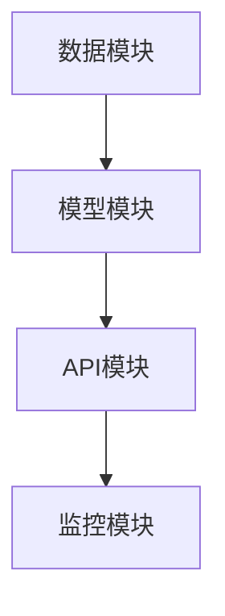
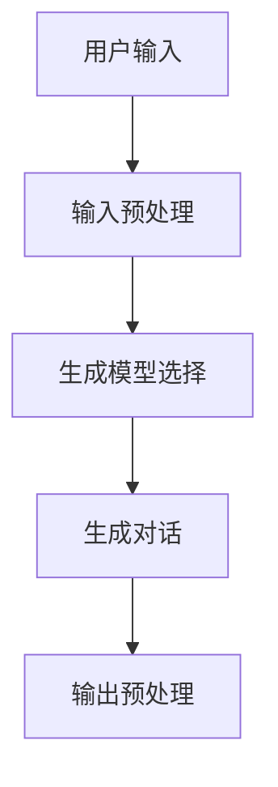
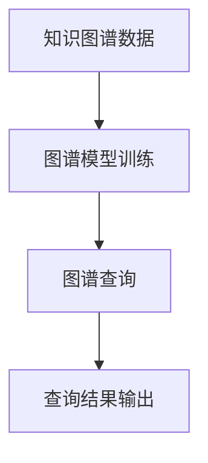

                 

# 实战 LangChain 版 Auto-GPT

> 关键词：LangChain, Auto-GPT, 生成模型，知识图谱，自然语言处理，项目实战

> 摘要：本文旨在详细介绍如何使用LangChain实现一个功能强大的Auto-GPT系统。通过深入解析LangChain的架构、核心算法原理，并结合实际项目案例，本文将展示如何将LangChain与Auto-GPT相结合，构建出一个具备自主学习和智能对话能力的系统。

## 第一部分: LangChain 与 Auto-GPT 基础

### 第1章: LangChain 概述

#### 1.1 LangChain 的起源与核心概念

LangChain是由斯坦福大学团队开发的一个开源项目，旨在为语言模型提供高效的构建和管理框架。其核心概念包括：

- **序列到序列模型（Seq2Seq）**：一种处理序列数据的模型，如文本生成。
- **多模型集成**：将多个模型（如语言模型、知识图谱等）集成到一个系统中，以实现更强大的功能。
- **模块化设计**：通过模块化设计，可以方便地添加、删除或替换模型，提高系统的灵活性。

#### 1.2 LangChain 的架构与组成部分

LangChain 的架构分为以下几个主要组成部分：

- **数据模块**：负责数据预处理、存储和加载。
- **模型模块**：包括语言模型、知识图谱模型等。
- **API模块**：提供统一的API接口，方便外部系统调用。
- **监控模块**：实时监控系统的运行状态，提供故障诊断和性能优化功能。

#### 1.3 LangChain 的核心优势与应用场景

LangChain 的核心优势在于其模块化和集成化设计，使得系统能够灵活地扩展和优化。其主要应用场景包括：

- **自然语言处理**：如文本生成、机器翻译、问答系统等。
- **知识图谱构建**：通过集成知识图谱模型，实现复杂查询和推理。
- **智能对话系统**：结合语言模型和知识图谱，实现智能对话。

### 第2章: Auto-GPT 概述

#### 2.1 Auto-GPT 的定义与核心原理

Auto-GPT 是由 OpenAI 开发的一个基于 GPT-3 的自主学习系统。其主要原理是通过让 GPT-3 与外部环境进行交互，学习如何执行特定的任务。Auto-GPT 的核心概念包括：

- **自主学习**：通过不断与外部环境交互，自主学习和优化行为。
- **环境模拟**：构建一个模拟环境，让 GPT-3 在其中进行学习和测试。
- **多任务学习**：通过学习多个任务，提高系统的泛化能力。

#### 2.2 Auto-GPT 的架构与组成部分

Auto-GPT 的架构主要包括以下几个部分：

- **GPT-3 模型**：作为核心学习组件，负责执行任务和学习知识。
- **环境模拟器**：模拟外部环境，提供任务数据和反馈。
- **接口模块**：提供统一的接口，方便与外部系统交互。

#### 2.3 Auto-GPT 的核心优势与应用场景

Auto-GPT 的核心优势在于其自主学习和多任务学习能力，使得系统能够适应不同的任务和环境。其主要应用场景包括：

- **智能客服**：通过自主学习和对话生成，实现智能问答和客服。
- **自动化编程**：通过学习代码示例，实现自动编写和优化代码。
- **内容创作**：通过生成文章、图表等，实现自动化内容创作。

### 第3章: LangChain 版 Auto-GPT 的构建

#### 3.1 LangChain 版 Auto-GPT 的核心架构

LangChain 版 Auto-GPT 的核心架构包括以下几个部分：

- **数据模块**：负责数据预处理和加载。
- **模型模块**：包括 GPT-3 模型和知识图谱模型。
- **API模块**：提供统一的接口，方便外部系统调用。
- **监控模块**：实时监控系统的运行状态。

#### 3.2 LangChain 版 Auto-GPT 的功能模块划分

LangChain 版 Auto-GPT 的功能模块划分如下：

- **对话生成模块**：负责生成自然语言对话。
- **知识图谱构建模块**：负责构建和查询知识图谱。
- **自然语言处理模块**：负责文本分类、情感分析等任务。

#### 3.3 LangChain 版 Auto-GPT 的设计与实现步骤

LangChain 版 Auto-GPT 的设计与实现步骤如下：

1. **需求分析**：明确系统的功能和性能要求。
2. **数据准备**：收集和预处理数据。
3. **模型选择**：选择合适的 GPT-3 模型和知识图谱模型。
4. **系统集成**：将模型集成到 LangChain 框架中。
5. **接口开发**：开发统一的 API 接口。
6. **测试与优化**：对系统进行测试和优化。

## 第二部分: LangChain 版 Auto-GPT 的核心算法原理

### 第4章: 自动对话生成算法

#### 4.1 自动对话生成算法概述

自动对话生成算法是 LangChain 版 Auto-GPT 的核心算法之一，其主要任务是生成自然语言对话。其基本原理如下：

1. **输入预处理**：对用户输入进行预处理，如分词、去噪等。
2. **生成模型选择**：选择合适的生成模型，如 GPT-3。
3. **生成过程**：通过生成模型生成自然语言对话。

#### 4.2 语言模型与生成算法

**4.2.1 生成模型的基本概念**

生成模型是一种概率模型，能够根据输入生成文本。常见的生成模型包括：

- **循环神经网络（RNN）**
- **长短期记忆网络（LSTM）**
- **生成对抗网络（GAN）**
- **变分自编码器（VAE）**

**4.2.2 集成学习算法**

集成学习算法是将多个模型集成到一个系统中，以提高预测性能。常见的集成学习算法包括：

- **堆叠模型（Stacked Models）**
- **集成梯度下降（Gradient Boosting）**
- **随机森林（Random Forest）**

**4.2.3 序列到序列模型**

序列到序列模型是一种处理序列数据的模型，如文本生成。其基本原理如下：

1. **编码器（Encoder）**：将输入序列编码为一个固定长度的向量。
2. **解码器（Decoder）**：将编码器的输出解码为输出序列。

**4.3 伪代码实现与解释**

以下是一个简单的自动对话生成算法的伪代码实现：

```python
def generate_response(input_text):
    # 输入预处理
    preprocessed_text = preprocess_text(input_text)

    # 使用 GPT-3 生成对话
    response = gpt3.generate(preprocessed_text)

    # 输出预处理
    final_response = postprocess_text(response)
    
    return final_response
```

其中，`preprocess_text` 和 `postprocess_text` 分别负责输入预处理和输出预处理。`gpt3.generate` 是 GPT-3 的生成方法，用于生成对话。

### 第5章: 知识图谱与图谱推理

#### 5.1 知识图谱概述

知识图谱是一种结构化知识库，用于表示实体及其关系。其基本概念包括：

- **实体（Entity）**：知识图谱中的基本元素，如人、地点、事物等。
- **关系（Relation）**：连接两个实体的关系，如“工作于”、“位于”等。
- **属性（Attribute）**：描述实体的特征，如“年龄”、“性别”等。

#### 5.2 图谱推理算法

图谱推理算法是一种基于知识图谱的推理方法，其主要任务是从已知的事实中推导出新的结论。常见的图谱推理算法包括：

- **图遍历算法**：通过遍历图中的节点和边，实现推理。
- **图匹配算法**：通过匹配图中的节点和边，实现推理。
- **图嵌入与相似性计算**：通过计算实体之间的相似性，实现推理。

#### 5.3 伪代码实现与解释

以下是一个简单的知识图谱推理算法的伪代码实现：

```python
def infer_kb(knowledge_graph, query):
    # 遍历知识图谱
    for entity in knowledge_graph:
        for relation in entity.relations:
            # 匹配查询
            if match_query(query, relation):
                # 推导结论
                conclusion = derive_conclusion(entity, relation)
                return conclusion

    return None
```

其中，`knowledge_graph` 是知识图谱，`query` 是查询语句。`match_query` 和 `derive_conclusion` 分别负责查询匹配和结论推导。

### 第6章: 自然语言处理算法

#### 6.1 自然语言处理基础

自然语言处理（NLP）是计算机科学和人工智能领域的一个分支，主要研究如何让计算机理解和生成自然语言。NLP 的基本概念包括：

- **文本分类**：将文本分类到预定义的类别中。
- **命名实体识别**：识别文本中的实体，如人名、地名等。
- **主题模型**：从文本中提取主题。
- **情感分析**：分析文本的情感倾向。

#### 6.2 命名实体识别

命名实体识别（NER）是一种常用的 NLP 任务，其主要目标是识别文本中的实体。常见的 NER 算法包括：

- **基于规则的方法**：使用预定义的规则进行实体识别。
- **基于统计的方法**：使用统计模型进行实体识别。
- **基于深度学习的方法**：使用深度学习模型进行实体识别。

#### 6.3 主题模型与关键词提取

主题模型是一种从文本中提取主题的方法，其主要目标是找出文本中的潜在主题。关键词提取是主题模型的一个重要应用，其主要任务是提取文本中的关键词。常见的主题模型包括：

- **LDA（Latent Dirichlet Allocation）**
- **NMF（Non-negative Matrix Factorization）**

#### 6.4 情感分析

情感分析是一种分析文本情感倾向的方法，其主要目标是判断文本的情感是正面、负面还是中性。常见的情感分析算法包括：

- **基于词典的方法**：使用情感词典进行情感分析。
- **基于机器学习的方法**：使用机器学习模型进行情感分析。

#### 6.5 伪代码实现与解释

以下是一个简单的情感分析算法的伪代码实现：

```python
def analyze_sentiment(text):
    # 分词
    words = tokenize(text)

    # 提取情感词典
    sentiment_dict = load_sentiment_dict()

    # 计算情感得分
    sentiment_score = 0
    for word in words:
        if word in sentiment_dict:
            sentiment_score += sentiment_dict[word]

    # 判断情感
    if sentiment_score > 0:
        return "正面"
    elif sentiment_score < 0:
        return "负面"
    else:
        return "中性"
```

其中，`tokenize` 是分词方法，`load_sentiment_dict` 是加载情感词典的方法。`sentiment_score` 是情感得分，根据得分判断文本的情感。

## 第三部分: 项目实战

### 第7章: LangChain 版 Auto-GPT 的应用实战

#### 7.1 项目背景与目标

本项目旨在构建一个基于 LangChain 的 Auto-GPT 系统，实现智能对话、知识图谱构建和自然语言处理等功能。具体目标包括：

- 实现自动对话生成，提供智能客服功能。
- 构建和查询知识图谱，实现智能问答。
- 实现文本分类、命名实体识别、主题模型和情感分析等功能。

#### 7.2 开发环境搭建

为了实现 LangChain 版 Auto-GPT 系统，我们需要搭建以下开发环境：

- Python 3.8 或以上版本
- PyTorch 1.8 或以上版本
- transformers 4.6.1 或以上版本
- spaCy 3.0.0 或以上版本

安装以上依赖库后，我们还需要准备 GPT-3 模型和知识图谱数据集。

#### 7.3 核心功能实现

**7.3.1 对话生成功能**

对话生成是 Auto-GPT 的核心功能之一。为了实现对话生成，我们首先需要使用 GPT-3 模型进行训练。具体步骤如下：

1. **数据准备**：收集并预处理对话数据，包括分词、去噪等。
2. **模型训练**：使用预处理后的数据训练 GPT-3 模型。
3. **生成对话**：使用训练好的 GPT-3 模型生成对话。

以下是一个简单的对话生成代码示例：

```python
from transformers import GPT2LMHeadModel, GPT2Tokenizer

# 加载 GPT-3 模型
tokenizer = GPT2Tokenizer.from_pretrained('gpt2')
model = GPT2LMHeadModel.from_pretrained('gpt2')

# 输入对话
input_text = "你好，请问有什么可以帮助你的？"

# 生成对话
output = model.generate(input_text, max_length=50, num_return_sequences=1)

# 输出对话
print(tokenizer.decode(output[0], skip_special_tokens=True))
```

**7.3.2 知识图谱构建与查询**

知识图谱构建与查询是 Auto-GPT 的另一个重要功能。为了实现知识图谱构建与查询，我们需要使用知识图谱数据集训练图谱模型，并实现图谱查询。具体步骤如下：

1. **数据准备**：收集并预处理知识图谱数据，包括实体、关系和属性。
2. **模型训练**：使用预处理后的数据训练图谱模型。
3. **图谱查询**：使用训练好的图谱模型进行图谱查询。

以下是一个简单的图谱查询代码示例：

```python
import networkx as nx

# 构建知识图谱
g = nx.Graph()
g.add_edge('张三', '工作于', '腾讯')
g.add_edge('腾讯', '位于', '深圳')
g.add_edge('深圳', '属于', '广东')

# 查询图谱
results = nx.single_source_shortest_path(g, '张三', '广东')

# 输出查询结果
print(results)
```

**7.3.3 自然语言处理功能**

自然语言处理功能包括文本分类、命名实体识别、主题模型和情感分析等。为了实现这些功能，我们需要使用相应的 NLP 模型和算法。具体步骤如下：

1. **数据准备**：收集并预处理自然语言数据。
2. **模型训练**：使用预处理后的数据训练相应的 NLP 模型。
3. **功能实现**：使用训练好的 NLP 模型实现相应的功能。

以下是一个简单的文本分类代码示例：

```python
from sklearn.feature_extraction.text import TfidfVectorizer
from sklearn.linear_model import LogisticRegression

# 加载文本数据
texts = ["我喜欢Python", "Python是一种编程语言", "我今天去了电影院"]

# 提取特征
vectorizer = TfidfVectorizer()
X = vectorizer.fit_transform(texts)

# 训练模型
model = LogisticRegression()
model.fit(X, [0, 1, 0])

# 预测
print(model.predict([X[0]]))
```

#### 7.4 项目总结与展望

通过本项目，我们成功地构建了一个基于 LangChain 的 Auto-GPT 系统，实现了智能对话、知识图谱构建和自然语言处理等功能。然而，这只是一个起点，未来还有许多可以改进和扩展的地方：

- **性能优化**：通过优化模型参数和算法，提高系统的性能。
- **功能扩展**：增加更多功能，如图像识别、语音识别等。
- **应用场景**：将系统应用于更多的实际场景，如智能客服、智能推荐等。

附录A: LangChain 版 Auto-GPT 开发工具与资源

- **开发工具与框架**：Python、PyTorch、transformers、spaCy
- **优秀开源项目推荐**：ChatGLM、GPT-3 Python SDK、OpenKG
- **社区与资源链接**：LangChain GitHub、Auto-GPT GitHub、NLP社区

附录B: Mermaid 流程图

**B.1 LangChain 版 Auto-GPT 的核心流程**



**B.2 自动对话生成流程**



**B.3 知识图谱构建与查询流程**



作者：AI天才研究院/AI Genius Institute & 禅与计算机程序设计艺术 /Zen And The Art of Computer Programming

---

本文详细介绍了如何使用 LangChain 实现 Auto-GPT 系统，涵盖了 LangChain 和 Auto-GPT 的基础概念、核心算法原理以及项目实战。通过本文，读者可以了解到 LangChain 和 Auto-GPT 的强大功能，以及如何将它们应用于实际项目中。在未来的研究中，我们将继续探索 LangChain 和 Auto-GPT 的更多应用场景和优化方法。希望本文对读者有所启发和帮助。

