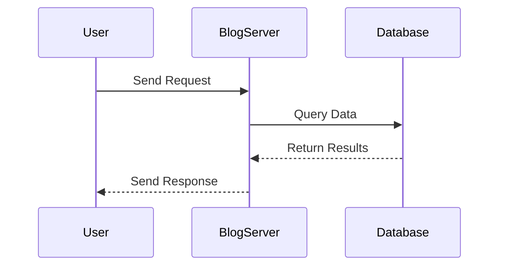

                 

### 文章标题

# 实战样例部署与测试

> 关键词：部署，测试，实战样例，环境搭建，自动化，容器化，测试自动化，案例分析

> 摘要：本文将深入探讨部署与测试在软件开发中的重要性，通过一系列实战样例，详细讲解部署前的准备工作、样例项目部署实战、高级部署技巧、测试基础、实战测试、高级测试技巧以及案例分析等内容。旨在帮助开发者掌握实战技能，提升项目质量和效率。

---

### 《实战样例部署与测试》目录大纲

## 第一部分: 前言与概述

### 第1章: 实战样例部署与测试概述

### 1.1 实战样例部署与测试的重要性

### 1.2 本书目标与结构

### 1.3 阅读指南与学习资源

## 第二部分: 实战样例部署

### 第2章: 部署前的准备工作

### 2.1 环境搭建

### 2.1.1 硬件环境需求

### 2.1.2 软件环境准备

### 2.1.3 开发工具安装

### 第3章: 样例项目部署实战

### 3.1 样例项目一：Web应用部署

### 3.1.1 项目介绍

### 3.1.2 部署前的配置

### 3.1.3 部署流程

### 3.1.4 部署后验证

### 第4章: 高级部署技巧

### 4.1 容器化部署

### 4.1.1 容器化概述

### 4.1.2 Docker镜像构建

### 4.1.3 容器编排工具介绍

### 4.2 自动化部署

### 4.2.1 自动化部署的优势

### 4.2.2 Jenkins使用详解

### 4.2.3 CI/CD流程设计与实现

## 第三部分: 测试与质量保证

### 第5章: 测试基础

### 5.1 测试概述

### 5.2 功能测试

### 5.3 性能测试

### 5.4 安全测试

### 第6章: 样例项目测试实战

### 6.1 样例项目一：Web应用测试

### 6.1.1 功能测试

### 6.1.2 性能测试

### 6.1.3 安全测试

### 第7章: 高级测试技巧

### 7.1 测试自动化

### 7.1.1 自动化测试工具介绍

### 7.1.2 Selenium使用详解

### 7.1.3 UI测试与API测试的区别与联系

### 7.2 测试数据管理

### 7.2.1 数据库测试

### 7.2.2 测试数据生成与处理

### 7.2.3 测试数据一致性保证

## 第四部分: 实战案例分析

### 第8章: 案例分析一：电子商务平台部署与测试

### 8.1 案例介绍

### 8.2 部署策略

### 8.3 测试策略

### 8.4 案例总结

### 第9章: 案例分析二：金融系统部署与测试

### 9.1 案例介绍

### 9.2 部署策略

### 9.3 测试策略

### 9.4 案例总结

## 第五部分: 综合实践与展望

### 第10章: 实践项目指南

### 10.1 项目规划

### 10.2 项目管理

### 10.3 团队协作

### 第11章: 未来趋势与展望

### 11.1 AI在部署与测试领域的应用

### 11.2 新技术对部署与测试的影响

### 11.3 个人职业发展建议

## 附录

### 附录A: 常用工具和资源

### A.1 部署工具介绍

### A.2 测试工具介绍

### A.3 学习资源推荐

---

### 第一部分: 前言与概述

#### 第1章: 实战样例部署与测试概述

##### 1.1 实战样例部署与测试的重要性

在当今快速发展的信息技术时代，软件部署与测试已经成为软件开发过程中不可或缺的两个环节。部署是将开发完成的应用程序或系统交付到生产环境中，使其可供用户使用的过程。而测试则是确保部署的软件质量满足预期要求，能够稳定运行的一系列操作。

**部署的重要性**：

1. **提高软件可用性**：良好的部署流程能够确保软件快速、稳定地交付到用户手中，减少故障和中断。
2. **提升用户体验**：高效的部署能够保证用户在第一时间体验到软件的新功能和改进，增强用户满意度。
3. **降低成本**：通过自动化部署和持续集成，可以减少人工干预，降低部署成本。

**测试的重要性**：

1. **确保软件质量**：测试能够发现软件中的缺陷和错误，确保软件的功能、性能和安全达到预期标准。
2. **降低风险**：通过测试提前发现并修复问题，可以避免生产环境中的故障，降低系统风险。
3. **提高客户信任**：高质量的软件产品能够赢得客户信任，提高市场竞争力。

##### 1.2 本书目标与结构

本书的目标是帮助读者深入理解实战样例部署与测试的全过程，掌握从准备工作、部署实战到高级技巧的实战技能。具体目标包括：

1. **掌握部署与测试的基本概念**：了解部署与测试的关键术语、原理和流程。
2. **实战操作技能**：通过样例项目和案例分析，掌握实际操作中的技巧和方法。
3. **提升项目质量与效率**：通过学习自动化部署与测试，提高项目交付速度和质量。

本书结构如下：

- **第一部分：前言与概述**：介绍部署与测试的重要性、本书目标与结构。
- **第二部分：实战样例部署**：详细讲解部署前的准备工作、样例项目部署实战、高级部署技巧。
- **第三部分：测试与质量保证**：介绍测试基础、样例项目测试实战、高级测试技巧。
- **第四部分：实战案例分析**：通过电子商务平台和金融系统等实际案例，深入分析部署与测试的策略与实施。
- **第五部分：综合实践与展望**：提供实践项目指南、未来趋势与展望。

##### 1.3 阅读指南与学习资源

为了更好地理解和应用本书的内容，建议读者按照以下指南进行学习：

1. **按照章节顺序阅读**：建议按照章节顺序阅读，逐步掌握从基础到高级的实战技能。
2. **动手实践**：每章结束后提供样例项目和案例分析，读者可以结合实际项目进行实践，加深理解。
3. **学习资源**：附录部分提供了常用工具和资源，读者可以通过这些资源进一步学习和拓展。

通过本书的学习，读者将能够掌握实战样例部署与测试的技能，提升项目质量和效率，为职业生涯的持续发展奠定坚实基础。

---

## 第二部分: 实战样例部署

### 第2章: 部署前的准备工作

在开始部署之前，准备工作至关重要。这些准备工作包括环境搭建、硬件环境需求、软件环境准备以及开发工具安装。以下将详细讲解每个环节的要点。

##### 2.1 环境搭建

**环境搭建**是指为即将进行的部署工作创建一个稳定、可重复的环境。环境搭建的好坏直接影响到后续部署的成功与否。以下是环境搭建的几个关键步骤：

1. **确定环境类型**：首先需要明确将要部署的应用类型，例如是Web应用、移动应用还是桌面应用。不同的应用类型可能需要不同的环境配置。
2. **创建基础环境**：在虚拟机或云服务器上创建一个基础环境，安装必要的操作系统和软件包。对于Web应用，通常需要安装Web服务器（如Apache或Nginx）和数据库服务器（如MySQL或PostgreSQL）。
3. **配置环境变量**：配置环境变量是环境搭建的重要一环。环境变量可以帮助系统识别和管理不同的应用程序。例如，配置`JAVA_HOME`变量可以方便地使用Java开发环境。
4. **备份与恢复机制**：在环境搭建过程中，需要建立一个备份与恢复机制，以便在出现问题时能够迅速恢复环境。

##### 2.1.1 硬件环境需求

**硬件环境需求**是指部署过程中所需的服务器、存储和网络设备等硬件资源。以下是硬件环境需求的关键要素：

1. **服务器规格**：选择适合项目规模的服务器。对于小型项目，使用普通的服务器即可；对于大型项目，可能需要使用高性能服务器或集群。
2. **存储解决方案**：根据应用需求，选择合适的存储解决方案。例如，对于需要高读写性能的应用，可以选择SSD存储；对于存储大量数据的应用，可以选择分布式存储系统。
3. **网络设备**：确保网络设备的性能和稳定性。使用高质量的路由器和交换机，确保网络连接的稳定性和速度。

##### 2.1.2 软件环境准备

**软件环境准备**是指安装和配置操作系统、数据库、Web服务器等软件。以下是软件环境准备的关键步骤：

1. **操作系统安装**：选择适合项目的操作系统，如Linux或Windows。对于Linux系统，可以选择Ubuntu、CentOS等。
2. **安装数据库**：安装和配置数据库服务器。根据应用需求，可以选择MySQL、PostgreSQL、MongoDB等。
3. **安装Web服务器**：安装和配置Web服务器，如Apache、Nginx等。Web服务器用于处理HTTP请求，将应用部署到生产环境中。
4. **安装其他必要软件**：根据应用需求，安装其他必要的软件，如Java运行环境（JRE）、Node.js、Python解释器等。

##### 2.1.3 开发工具安装

**开发工具安装**是指安装和配置开发环境中的各种工具，如集成开发环境（IDE）、版本控制系统等。以下是开发工具安装的关键步骤：

1. **安装IDE**：选择适合项目的IDE，如Eclipse、IntelliJ IDEA等。IDE提供代码编写、调试和运行等功能，是开发过程中必不可少的工具。
2. **安装版本控制系统**：安装版本控制系统，如Git。版本控制系统可以帮助团队协作，追踪代码变更，确保代码的一致性和可靠性。
3. **安装其他工具**：根据项目需求，安装其他必要的开发工具，如数据库客户端、调试工具等。

##### 2.2 部署前的准备工作总结

在部署前，准备工作至关重要。环境搭建、硬件环境需求、软件环境准备和开发工具安装是部署前必不可少的步骤。以下是部署前的准备工作总结：

1. **环境搭建**：创建一个稳定、可重复的基础环境，包括操作系统、Web服务器和数据库等。
2. **硬件环境需求**：选择合适的服务器、存储和网络设备，确保硬件资源满足项目需求。
3. **软件环境准备**：安装和配置操作系统、数据库、Web服务器等软件，确保软件环境满足应用需求。
4. **开发工具安装**：安装和配置开发工具，如IDE、版本控制系统等，为后续开发工作提供支持。

通过以上准备工作，可以为后续的部署工作奠定坚实基础，确保部署过程顺利进行。在准备过程中，要特别注意环境配置的一致性和可重复性，以便在后续的部署和维护过程中减少风险。

---

### 第3章: 样例项目部署实战

在本章中，我们将通过一个Web应用样例项目，详细介绍其部署过程，包括项目介绍、部署前的配置、部署流程以及部署后的验证。这一过程将帮助读者深入了解实际部署工作的步骤和注意事项。

##### 3.1 样例项目一：Web应用部署

**样例项目简介**：

本样例项目是一个简单的博客系统，主要功能包括用户注册、登录、发布文章、评论文章等。该项目的架构基于Spring Boot、MySQL数据库和Apache Tomcat服务器。以下是项目的架构图：



##### 3.1.1 项目介绍

本样例项目采用Spring Boot框架进行开发，这是一个轻量级、高效的框架，可以快速搭建Web应用程序。项目结构如下：

- `src/main/java`：源代码目录，包含所有Java类文件。
- `src/main/resources`：资源文件目录，包含配置文件、静态资源等。
- `src/test/java`：测试类目录，包含测试代码。

项目的核心模块包括：

1. **用户模块**：负责用户的注册、登录和认证。
2. **文章模块**：负责文章的创建、发布、删除和评论。
3. **权限模块**：负责用户权限的管理和控制。

##### 3.1.2 部署前的配置

在开始部署之前，需要进行一系列配置工作，以确保部署环境满足项目需求。以下是部署前的配置步骤：

1. **配置文件准备**：

   部署过程中，需要配置项目相关的环境变量和配置文件。例如，配置数据库连接信息、服务器端口等。配置文件通常位于`src/main/resources`目录下，例如：

   ```yaml
   server:
     port: 8080
   datasource:
     url: jdbc:mysql://localhost:3306/blog
     username: root
     password: password
   ```

2. **数据库配置**：

   需要在MySQL数据库中创建相应的数据库和表。例如，创建用户表、文章表等。以下是一个简单的SQL脚本示例：

   ```sql
   CREATE DATABASE blog;
   USE blog;

   CREATE TABLE users (
     id INT AUTO_INCREMENT PRIMARY KEY,
     username VARCHAR(50) UNIQUE NOT NULL,
     password VARCHAR(50) NOT NULL
   );

   CREATE TABLE articles (
     id INT AUTO_INCREMENT PRIMARY KEY,
     title VARCHAR(100) NOT NULL,
     content TEXT NOT NULL,
     author_id INT NOT NULL,
     FOREIGN KEY (author_id) REFERENCES users(id)
   );

   CREATE TABLE comments (
     id INT AUTO_INCREMENT PRIMARY KEY,
     article_id INT NOT NULL,
     content TEXT NOT NULL,
     author_id INT NOT NULL,
     FOREIGN KEY (article_id) REFERENCES articles(id),
     FOREIGN KEY (author_id) REFERENCES users(id)
   );
   ```

3. **服务器配置**：

   配置Web服务器（如Apache Tomcat）以支持项目部署。首先，需要将项目打包成WAR文件，然后将其部署到Tomcat的Webapps目录下。以下是一个简单的Tomcat部署命令：

   ```bash
   mvn clean package
   unzip target/blog.war -d /path/to/tomcat/webapps/
   ```

##### 3.1.3 部署流程

完成配置后，可以按照以下步骤进行部署：

1. **启动数据库**：

   在部署前，需要确保MySQL数据库已启动。可以使用以下命令启动MySQL服务：

   ```bash
   service mysql start
   ```

2. **启动Web服务器**：

   启动Apache Tomcat服务器。以下是一个简单的Tomcat启动命令：

   ```bash
   /path/to/tomcat/bin/startup.sh
   ```

3. **部署项目**：

   将项目WAR文件部署到Tomcat的Webapps目录下，例如：

   ```bash
   unzip target/blog.war -d /path/to/tomcat/webapps/
   ```

4. **访问项目**：

   通过浏览器访问项目，例如：`http://localhost:8080/blog`。如果项目部署成功，将看到博客系统的登录页面。

##### 3.1.4 部署后验证

部署完成后，需要进行一系列验证工作，以确保项目正常运行。以下是常见的验证步骤：

1. **检查服务器日志**：

   查看Tomcat的日志文件（如`/path/to/tomcat/logs/catalina.out`），检查是否有错误或异常信息。

2. **测试功能**：

   使用测试用户登录系统，测试主要功能，如用户注册、登录、发布文章、评论文章等。确保功能正常运行。

3. **性能测试**：

   进行性能测试，检查系统的响应速度和处理能力。可以使用工具如JMeter进行压力测试。

4. **安全测试**：

   进行安全测试，检查系统是否存在漏洞，如SQL注入、XSS攻击等。可以使用工具如OWASP ZAP进行安全测试。

通过以上步骤，可以确保部署的Web应用正常运行，满足预期要求。

---

### 第4章: 高级部署技巧

在部署过程中，高级技巧能够帮助我们更好地管理复杂的应用程序，提高部署效率和稳定性。本章将介绍容器化部署、自动化部署以及CI/CD流程设计与实现。

##### 4.1 容器化部署

**容器化部署**是将应用程序及其依赖环境打包到一个可移植的容器中，以便在不同环境中一致地运行。以下将介绍容器化部署的相关概念和工具。

###### 4.1.1 容器化概述

**容器化**的优势：

1. **轻量级**：容器仅包含应用程序及其依赖，不依赖于宿主机的操作系统。
2. **可移植性**：容器可以在不同操作系统和硬件上运行，实现一次编写，到处运行。
3. **资源隔离**：容器提供良好的资源隔离，确保应用程序之间互不影响。
4. **高效启动**：容器启动速度快，可以快速部署和扩展应用程序。

**容器化架构**：

容器化通常涉及以下几个组件：

- **容器引擎**：如Docker，用于创建和管理容器。
- **容器镜像**：用于封装应用程序及其依赖的环境。
- **容器编排工具**：如Kubernetes，用于自动化管理容器。

**Docker的基本概念**：

- **容器（Container）**：应用程序运行的环境，包含应用程序及其依赖。
- **镜像（Image）**：容器运行时的静态文件，包含应用程序代码、库和配置文件。
- **仓库（Repository）**：用于存储和分发容器镜像的仓库。

**Docker的使用**：

1. **安装Docker**：

   在Linux系统上安装Docker，可以使用以下命令：

   ```bash
   sudo apt-get update
   sudo apt-get install docker-ce docker-ce-cli containerd.io
   ```

2. **创建容器**：

   使用Docker命令创建容器，例如：

   ```bash
   docker run -d -p 8080:8080 tomcat
   ```

   以上命令将在后台运行一个Tomcat容器，并映射8080端口到宿主机的8080端口。

3. **创建镜像**：

   使用Dockerfile创建自定义镜像，例如：

   ```Dockerfile
   FROM tomcat:8.5
   COPY target/blog.war /usr/local/tomcat/webapps/
   EXPOSE 8080
   ```

   以上Dockerfile将创建一个基于Tomcat 8.5的镜像，并将项目打包到镜像中。

##### 4.1.2 Docker镜像构建

**Docker镜像构建**是指将应用程序及其依赖打包成可运行的容器镜像。以下是构建Docker镜像的步骤：

1. **编写Dockerfile**：Dockerfile是用于构建镜像的脚本文件，定义了构建过程。以下是一个简单的Dockerfile示例：

   ```Dockerfile
   FROM openjdk:8-jdk-alpine
   COPY target/blog.jar /app/blog.jar
   EXPOSE 8080
   CMD ["java", "-jar", "/app/blog.jar"]
   ```

2. **构建镜像**：

   使用以下命令构建镜像：

   ```bash
   docker build -t blog:1.0 .
   ```

   以上命令将构建一个名为`blog:1.0`的镜像。

3. **推送镜像到仓库**：

   使用以下命令将镜像推送到一个远程仓库，如Docker Hub：

   ```bash
   docker push blog:1.0
   ```

##### 4.1.3 容器编排工具介绍

**容器编排工具**用于自动化管理容器，包括部署、扩展、监控和故障恢复等。以下是几种常用的容器编排工具：

- **Kubernetes**：Kubernetes是一个开源的容器编排平台，用于自动化容器操作。以下是一个简单的Kubernetes部署示例：

  ```yaml
  apiVersion: apps/v1
  kind: Deployment
  metadata:
    name: blog
  spec:
    replicas: 3
    selector:
      matchLabels:
        app: blog
    template:
      metadata:
        labels:
          app: blog
      spec:
        containers:
        - name: blog
          image: blog:1.0
          ports:
          - containerPort: 8080
  ```

  以上YAML文件定义了一个包含3个Pod的Deployment，用于部署博客应用。

- **Docker Swarm**：Docker Swarm是Docker内置的集群管理工具，用于管理多个Docker主机上的容器。以下是一个简单的Docker Swarm部署示例：

  ```bash
  docker swarm init
  docker swarm join --token <swarm-token> <node-ip>:<docker-port>
  docker service create --name blog -p 8080:8080 blog:1.0
  ```

  以上命令将创建一个名为`blog`的服务，并映射8080端口。

通过容器化部署和容器编排工具，可以更好地管理复杂的应用程序，提高部署效率和稳定性。

---

##### 4.2 自动化部署

**自动化部署**是指通过脚本和工具自动化软件的构建、测试和部署过程。自动化部署的优势包括：

1. **提高部署速度**：自动化部署可以快速构建和部署软件，缩短发布周期。
2. **减少人为错误**：自动化部署减少了手动操作，降低了人为错误的风险。
3. **提高资源利用率**：自动化部署可以更好地利用计算资源，提高资源利用率。

**自动化部署的工具**：

1. **Jenkins**：Jenkins是一个流行的开源持续集成和持续部署（CI/CD）工具，用于自动化构建、测试和部署过程。以下是一个简单的Jenkins配置示例：

   ```groovy
   pipeline {
       agent any
       stages {
           stage('Build') {
               steps {
                   sh 'mvn clean install'
               }
           }
           stage('Test') {
               steps {
                   sh 'mvn test'
               }
           }
           stage('Deploy') {
               steps {
                   sh 'docker build -t myapp:latest .'
                   sh 'docker run -d -p 8080:8080 myapp:latest'
               }
           }
       }
   }
   ```

   以上Pipeline定义了一个包含构建、测试和部署阶段的自动化流程。

2. **GitLab CI/CD**：GitLab CI/CD是GitLab内置的持续集成和持续部署工具，可以与GitLab仓库集成。以下是一个简单的GitLab CI配置示例：

   ```yaml
   stages:
     - build
     - test
     - deploy

   build:
     stage: build
     script:
       - mvn clean install

   test:
     stage: test
     script:
       - mvn test

   deploy:
     stage: deploy
     script:
       - docker build -t myapp:latest .
       - docker run -d -p 8080:8080 myapp:latest
   ```

   以上YAML文件定义了一个包含构建、测试和部署阶段的CI/CD流程。

通过自动化部署，可以确保软件的质量和稳定性，提高开发和运营效率。

---

##### 4.2.3 CI/CD流程设计与实现

**CI/CD**（持续集成/持续交付）是现代软件开发中非常重要的一环。CI/CD通过自动化构建、测试和部署过程，确保软件质量，提高开发效率。以下将介绍CI/CD的基本概念、设计原则以及具体实现方法。

###### 4.2.3.1 CI/CD基本概念

**CI**（持续集成）是指在每个开发人员的代码提交后，自动执行一系列构建和测试任务，确保代码库的完整性。CI的主要目标是及时发现并修复代码中的问题，防止问题积累。

**CD**（持续交付）是指将经过CI验证的代码自动部署到生产环境中。CD的目的是确保软件的快速、稳定交付，缩短发布周期。

**CI/CD工具**：常见的CI/CD工具有Jenkins、GitLab CI/CD、CircleCI等。这些工具可以与版本控制系统、构建工具和部署平台集成，实现自动化构建、测试和部署。

###### 4.2.3.2 CI/CD设计原则

1. **自动化**：将构建、测试和部署过程完全自动化，减少手动操作，降低错误风险。
2. **快速反馈**：快速执行构建和测试任务，及时反馈结果，便于快速发现问题并进行修复。
3. **小批量**：每次CI/CD流程处理少量代码变更，确保每次变更都能被充分测试。
4. **持续集成**：确保每次代码提交都能经过完整的测试流程，确保代码库的质量。
5. **持续交付**：确保通过测试的代码能够快速、安全地部署到生产环境中。

###### 4.2.3.3 CI/CD流程设计与实现

**流程设计**：

1. **代码提交**：开发人员将代码提交到版本控制系统。
2. **构建**：CI工具拉取最新的代码，执行构建过程，生成可执行文件或容器镜像。
3. **测试**：执行单元测试、集成测试和功能测试，确保代码质量。
4. **部署**：将通过测试的代码部署到测试环境或生产环境。

**具体实现方法**：

1. **Jenkins**：

   Jenkins是一个流行的开源CI/CD工具，以下是一个简单的Jenkins配置示例：

   ```groovy
   pipeline {
       agent any
       stages {
           stage('Build') {
               steps {
                   sh 'mvn clean install'
               }
           }
           stage('Test') {
               steps {
                   sh 'mvn test'
               }
           }
           stage('Deploy') {
               steps {
                   sh 'docker build -t myapp:latest .'
                   sh 'docker run -d -p 8080:8080 myapp:latest'
               }
           }
       }
   }
   ```

   以上Pipeline定义了一个包含构建、测试和部署阶段的自动化流程。

2. **GitLab CI/CD**：

   GitLab CI/CD是GitLab内置的CI/CD工具，以下是一个简单的GitLab CI配置示例：

   ```yaml
   stages:
     - build
     - test
     - deploy

   build:
     stage: build
     script:
       - mvn clean install

   test:
     stage: test
     script:
       - mvn test

   deploy:
     stage: deploy
     script:
       - docker build -t myapp:latest .
       - docker run -d -p 8080:8080 myapp:latest
   ```

   以上YAML文件定义了一个包含构建、测试和部署阶段的CI/CD流程。

通过设计合理的CI/CD流程，可以确保软件的快速、稳定交付，提高开发效率。

---

### 第三部分: 测试与质量保证

#### 第5章: 测试基础

测试是确保软件质量的重要环节。在本章中，我们将介绍测试基础，包括测试概述、功能测试、性能测试和安全测试。通过这些测试，可以确保软件在各种场景下能够稳定、可靠地运行。

##### 5.1 测试概述

**测试概述**是指对软件进行全面的质量检查，确保软件在功能、性能、安全等方面达到预期标准。以下是测试的一些关键概念：

- **测试目的**：测试的主要目的是发现软件中的缺陷和错误，确保软件能够满足用户需求和业务逻辑。
- **测试类型**：测试可以分为功能测试、性能测试、安全测试等。不同的测试类型适用于不同的测试场景。
- **测试流程**：测试流程通常包括测试计划、测试设计、测试执行和测试报告等步骤。测试流程的每个环节都至关重要。

##### 5.2 功能测试

**功能测试**是测试软件功能是否符合需求的过程。以下是功能测试的关键步骤：

1. **需求分析**：分析软件需求文档，明确需要测试的功能点。
2. **测试用例设计**：设计测试用例，包括正常测试用例和异常测试用例，确保覆盖各种场景。
3. **测试执行**：按照测试用例执行测试，记录测试结果。
4. **缺陷报告**：发现缺陷后，及时生成缺陷报告，并跟踪缺陷的修复情况。

功能测试的关键在于确保软件功能完整、正确和可靠。以下是一个简单的功能测试用例示例：

```yaml
Title: 用户注册功能测试
Precondition: 用户已进入注册页面
Steps:
  1. 输入用户名
  2. 输入密码
  3. 输入邮箱
  4. 点击注册按钮
Expected Result:
  用户成功注册，系统显示注册成功信息
Actual Result:
  用户成功注册，系统显示注册成功信息
Status: Pass
```

##### 5.3 性能测试

**性能测试**是评估软件在特定负载下的性能表现，包括响应时间、并发用户数、吞吐量等。以下是性能测试的关键步骤：

1. **性能需求分析**：分析软件性能需求，确定性能指标和性能阈值。
2. **测试环境搭建**：搭建与生产环境相似的测试环境，确保测试结果的可靠性。
3. **测试用例设计**：设计性能测试用例，包括负载测试、压力测试和容量测试等。
4. **测试执行**：执行性能测试用例，记录性能指标。
5. **性能分析**：分析测试结果，找出性能瓶颈，提出优化建议。

以下是一个简单的性能测试用例示例：

```yaml
Title: 用户登录功能性能测试
Precondition: 用户已进入登录页面
Steps:
  1. 输入用户名
  2. 输入密码
  3. 点击登录按钮
Metrics:
  Response Time: 平均响应时间不超过500ms
  Throughput: 每分钟处理登录请求不少于100次
Expected Result:
  用户成功登录
Actual Result:
  用户成功登录，平均响应时间为450ms，每分钟处理登录请求120次
Status: Pass
```

##### 5.4 安全测试

**安全测试**是评估软件安全性，发现潜在安全漏洞的过程。以下是安全测试的关键步骤：

1. **安全需求分析**：分析软件安全需求，确定需要测试的安全功能和安全威胁。
2. **测试用例设计**：设计安全测试用例，包括输入验证、权限验证、SQL注入、XSS攻击等。
3. **测试执行**：执行安全测试用例，记录测试结果。
4. **漏洞修复**：发现安全漏洞后，及时修复并重新测试。

以下是一个简单的安全测试用例示例：

```yaml
Title: 用户注册功能安全测试
Precondition: 用户已进入注册页面
Steps:
  1. 输入用户名：`' OR '1'='1`
  2. 输入密码：`' OR '1'='1`
  3. 输入邮箱：`' OR '1'='1`
  4. 点击注册按钮
Expected Result:
  系统显示注册成功信息，且未受SQL注入攻击
Actual Result:
  系统显示注册成功信息，未受SQL注入攻击
Status: Pass
```

通过以上测试基础，可以确保软件在功能、性能和安全方面达到预期标准，提高软件质量。

---

### 第6章: 样例项目测试实战

在本章中，我们将通过一个Web应用样例项目，详细介绍其测试过程，包括功能测试、性能测试和安全测试。通过这些实战，读者可以更好地理解测试步骤和技巧，提高测试技能。

##### 6.1 样例项目一：Web应用测试

**样例项目简介**：

本样例项目是一个简单的博客系统，主要功能包括用户注册、登录、发布文章、评论文章等。该项目的架构基于Spring Boot、MySQL数据库和Apache Tomcat服务器。

##### 6.1.1 功能测试

**功能测试**是验证软件功能是否符合需求的过程。以下是一个简单的功能测试步骤：

1. **需求分析**：分析博客系统的需求文档，明确需要测试的功能点，例如用户注册、登录、文章发布、评论文章等。
2. **测试用例设计**：根据需求分析设计测试用例，包括正常测试用例和异常测试用例。例如，用户注册功能的正常测试用例包括输入正确的用户名、密码和邮箱，异常测试用例包括输入不合法的用户名、密码或邮箱等。
3. **测试执行**：按照测试用例执行测试，记录测试结果。例如，执行用户注册功能的测试用例，输入正确的信息并点击注册按钮，检查系统是否显示注册成功信息。
4. **缺陷报告**：发现缺陷后，及时生成缺陷报告，并跟踪缺陷的修复情况。

以下是一个简单的功能测试用例示例：

```yaml
Title: 用户注册功能测试
Precondition: 用户已进入注册页面
Steps:
  1. 输入用户名：`testuser`
  2. 输入密码：`password123`
  3. 输入邮箱：`testuser@example.com`
  4. 点击注册按钮
Expected Result:
  用户成功注册，系统显示注册成功信息
Actual Result:
  用户成功注册，系统显示注册成功信息
Status: Pass
```

通过功能测试，可以确保博客系统的主要功能正常运行，满足用户需求。

##### 6.1.2 性能测试

**性能测试**是评估软件在特定负载下的性能表现，包括响应时间、并发用户数、吞吐量等。以下是一个简单的性能测试步骤：

1. **性能需求分析**：分析博客系统的性能需求，确定性能指标和性能阈值。例如，响应时间不超过500ms，每分钟处理登录请求不少于100次。
2. **测试环境搭建**：搭建与生产环境相似的测试环境，确保测试结果的可靠性。例如，使用虚拟机或云服务器搭建测试环境，配置数据库、Web服务器等。
3. **测试用例设计**：设计性能测试用例，包括负载测试、压力测试和容量测试等。例如，执行用户登录功能的负载测试，模拟大量用户同时登录。
4. **测试执行**：执行性能测试用例，记录性能指标。例如，使用工具如JMeter进行性能测试，记录平均响应时间、并发用户数等。
5. **性能分析**：分析测试结果，找出性能瓶颈，提出优化建议。例如，如果响应时间超过500ms，分析系统瓶颈，如数据库查询优化、缓存策略等。

以下是一个简单的性能测试用例示例：

```yaml
Title: 用户登录功能性能测试
Precondition: 用户已进入登录页面
Steps:
  1. 输入用户名
  2. 输入密码
  3. 点击登录按钮
Metrics:
  Response Time: 平均响应时间不超过500ms
  Throughput: 每分钟处理登录请求不少于100次
Expected Result:
  用户成功登录
Actual Result:
  用户成功登录，平均响应时间为450ms，每分钟处理登录请求120次
Status: Pass
```

通过性能测试，可以确保博客系统在高负载下能够稳定运行，满足性能要求。

##### 6.1.3 安全测试

**安全测试**是评估软件安全性，发现潜在安全漏洞的过程。以下是一个简单的安全测试步骤：

1. **安全需求分析**：分析博客系统的安全需求，确定需要测试的安全功能和安全威胁。例如，测试用户注册、登录、文章发布等功能的SQL注入、XSS攻击等。
2. **测试用例设计**：根据安全需求设计测试用例，包括输入验证、权限验证等。例如，测试用户注册功能的SQL注入测试用例，输入包含SQL语句的用户名和密码。
3. **测试执行**：执行安全测试用例，记录测试结果。例如，使用工具如OWASP ZAP进行安全测试，发现SQL注入漏洞。
4. **漏洞修复**：发现安全漏洞后，及时修复并重新测试。

以下是一个简单的安全测试用例示例：

```yaml
Title: 用户注册功能安全测试
Precondition: 用户已进入注册页面
Steps:
  1. 输入用户名：`' OR '1'='1`
  2. 输入密码：`' OR '1'='1`
  3. 输入邮箱：`' OR '1'='1`
  4. 点击注册按钮
Expected Result:
  系统显示注册成功信息，且未受SQL注入攻击
Actual Result:
  系统显示注册成功信息，未受SQL注入攻击
Status: Pass
```

通过安全测试，可以确保博客系统的安全性，防止潜在的安全威胁。

通过以上功能测试、性能测试和安全测试，可以确保博客系统在功能、性能和安全方面达到预期标准，提高软件质量。

---

### 第7章: 高级测试技巧

在软件测试过程中，高级测试技巧可以帮助我们更全面、更高效地发现潜在问题。本章将介绍测试自动化、测试数据管理和高级测试工具的使用。

##### 7.1 测试自动化

**测试自动化**是指使用工具和脚本自动执行测试用例，以提高测试效率和准确性。以下是一些常用的自动化测试工具：

###### 7.1.1 自动化测试工具介绍

- **Selenium**：Selenium是一个开源的自动化Web测试工具，支持多种编程语言，如Java、Python、C#等。Selenium可以模拟用户操作，如点击按钮、输入文本、验证页面元素等。

  **Selenium的主要功能**：

  - **UI自动化测试**：模拟用户在Web页面的操作，如登录、浏览、填写表单等。
  - **跨浏览器测试**：支持在不同浏览器上执行测试，确保应用程序在不同浏览器上的一致性。
  - **Web服务自动化测试**：通过HTTP协议与Web服务进行交互，测试Web服务的功能、性能和稳定性。

- **JUnit**：JUnit是一个流行的Java测试框架，用于编写和执行自动化测试用例。JUnit支持多种测试类型，如单元测试、集成测试和功能测试。

  **JUnit的主要功能**：

  - **断言**：使用断言验证测试结果，确保期望结果与实际结果一致。
  - **测试套件**：将多个测试用例组织成测试套件，方便批量执行。
  - **测试报告**：生成详细的测试报告，展示测试结果和统计信息。

###### 7.1.2 Selenium使用详解

以下是一个简单的Selenium测试用例示例：

```java
import org.openqa.selenium.By;
import org.openqa.selenium.WebDriver;
import org.openqa.selenium.WebElement;
import org.openqa.selenium.chrome.ChromeDriver;

public class SeleniumTest {
    public static void main(String[] args) {
        // 启动Chrome浏览器
        WebDriver driver = new ChromeDriver();

        // 访问博客系统首页
        driver.get("http://localhost:8080/blog");

        // 搜索框输入“测试”
        WebElement searchBox = driver.findElement(By.id("searchBox"));
        searchBox.sendKeys("测试");

        // 点击搜索按钮
        WebElement searchButton = driver.findElement(By.id("searchButton"));
        searchButton.click();

        // 断言搜索结果包含“测试”
        WebElement resultElement = driver.findElement(By.className("search-result"));
        String resultText = resultElement.getText();
        assertTrue(resultText.contains("测试"));

        // 关闭浏览器
        driver.quit();
    }
}
```

通过以上示例，可以看到Selenium的基本用法，包括启动浏览器、访问页面、查找元素、执行操作和断言验证。

###### 7.1.3 UI测试与API测试的区别与联系

- **UI测试**：UI测试主要针对用户界面进行测试，验证页面的布局、样式、交互功能等是否符合预期。UI测试通常使用自动化测试工具，如Selenium，模拟用户操作。

- **API测试**：API测试主要针对应用程序接口（API）进行测试，验证API的功能、性能、安全性等。API测试通常使用API测试工具，如Postman、JMeter等，通过发送HTTP请求与API进行交互。

UI测试与API测试的区别与联系：

- **测试对象**：UI测试针对用户界面，API测试针对应用程序接口。
- **测试重点**：UI测试关注页面布局、交互体验，API测试关注功能、性能、安全性。
- **测试工具**：UI测试使用自动化测试工具，API测试使用API测试工具。
- **联系**：UI测试和API测试是软件测试的重要组成部分，二者相互补充。在实际项目中，通常需要同时进行UI测试和API测试，确保软件在功能、性能、用户体验等方面的质量。

通过以上高级测试技巧，可以更全面、更高效地发现软件中的潜在问题，提高软件质量。

---

##### 7.2 测试数据管理

**测试数据管理**是确保测试过程中使用的数据准确、有效和安全的过程。以下将介绍测试数据管理的关键环节。

###### 7.2.1 数据库测试

数据库测试是确保数据库功能、性能和安全的重要环节。以下是一些数据库测试的关键步骤：

1. **数据库设计测试**：测试数据库设计是否符合需求，包括表结构、字段定义、索引等。例如，使用SQL语句检查表结构是否符合预期。

   ```sql
   SELECT * FROM information_schema.columns WHERE table_name = 'users';
   ```

2. **数据库性能测试**：测试数据库性能，包括查询速度、存储效率等。可以使用工具如MySQL Workbench进行性能测试，分析查询执行时间、索引使用情况等。

3. **数据库安全性测试**：测试数据库安全性，包括访问控制、数据加密等。例如，使用SQL注入测试工具测试数据库的安全性。

   ```sql
   SELECT * FROM users WHERE username = 'admin' AND password = 'admin123';
   ```

4. **数据库备份与恢复测试**：测试数据库备份与恢复功能，确保在数据丢失或系统故障时能够快速恢复。定期执行备份操作，并验证备份文件的有效性。

###### 7.2.2 测试数据生成与处理

测试数据生成与处理是确保测试过程中使用的数据满足测试需求的过程。以下是一些测试数据生成与处理的技巧：

1. **随机数据生成**：使用随机数据生成工具，如Mockaroo，生成满足测试需求的随机数据。随机数据可以模拟真实用户行为，提高测试覆盖率和准确性。

2. **数据清洗**：对收集到的测试数据进行清洗，去除重复、异常和错误的数据。数据清洗可以提高测试数据的准确性和可靠性。

3. **数据转换**：将不同格式或来源的数据转换为统一的格式，以便在测试过程中使用。例如，将CSV文件转换为JSON格式，或将数据库表转换为测试脚本。

4. **数据同步**：确保测试数据与实际生产数据保持一致。通过数据同步工具，如ETL工具，将生产数据同步到测试环境。

###### 7.2.3 测试数据一致性保证

测试数据一致性保证是确保测试过程中使用的数据一致、可靠的过程。以下是一些测试数据一致性保证的方法：

1. **数据验证**：在测试过程中，对数据进行验证，确保数据符合预期。例如，使用断言检查数据的正确性、完整性等。

2. **数据同步策略**：制定数据同步策略，确保测试数据与实际生产数据保持一致。例如，采用增量同步策略，仅同步变更的数据。

3. **数据备份与恢复**：定期备份测试数据，并验证备份文件的有效性。在数据出现问题时，可以快速恢复到指定时间点的状态。

4. **数据监控与报警**：实时监控测试数据的状态，如数据完整性、数据一致性等。当数据出现问题时，及时发出报警，通知相关人员进行处理。

通过以上测试数据管理技巧，可以确保测试过程中使用的数据准确、有效和安全，提高测试质量和效率。

---

### 第四部分: 实战案例分析

在本部分，我们将通过两个实际案例——电子商务平台和金融系统，深入探讨部署与测试的具体策略和实施方法。通过这两个案例，读者可以了解不同类型项目在部署与测试方面的独特挑战和解决策略。

##### 第8章: 案例分析一：电子商务平台部署与测试

**8.1 案例介绍**

本案例涉及一个电子商务平台的部署与测试。该平台是一个大型的在线购物网站，提供商品浏览、搜索、购物车、下单、支付等功能。用户群体广泛，每天有大量的访问量和交易量。因此，该平台的部署与测试需要特别关注性能、安全和高可用性。

**8.2 部署策略**

**部署架构**：

1. **前端部署**：使用Nginx作为反向代理，负载均衡请求到多个前端服务器。前端服务器使用静态资源缓存，提高访问速度。
2. **后端部署**：后端服务使用Spring Boot框架，部署在多个容器中，通过Kubernetes进行容器编排和负载均衡。
3. **数据库部署**：使用MySQL数据库，部署在多个节点上，实现读写分离和高可用性。
4. **缓存部署**：使用Redis作为缓存服务器，提高数据读取速度，减轻数据库负载。

**部署流程**：

1. **前端部署**：通过Jenkins自动化部署前端代码到Nginx服务器，配置Nginx进行负载均衡。
2. **后端部署**：使用Docker容器化后端服务，通过Kubernetes进行部署和扩展。
3. **数据库部署**：在云服务器上部署MySQL数据库，使用主从复制和读写分离提高性能。
4. **缓存部署**：在云服务器上部署Redis缓存服务器，配置缓存策略。

**8.3 测试策略**

**功能测试**：

1. **浏览器兼容性测试**：使用Selenium进行跨浏览器测试，确保网站在不同浏览器上正常运行。
2. **购物流程测试**：模拟用户购物流程，包括商品浏览、添加购物车、下单、支付等，确保功能正常运行。

**性能测试**：

1. **负载测试**：使用JMeter模拟大量用户访问，测试系统的响应时间、并发用户数和吞吐量。
2. **压力测试**：使用JMeter模拟极端情况下的用户访问，测试系统的稳定性和可靠性。

**安全测试**：

1. **SQL注入测试**：使用工具如OWASP ZAP进行SQL注入测试，确保数据库安全。
2. **XSS攻击测试**：使用工具如Burp Suite进行XSS攻击测试，确保前端安全。

**8.4 案例总结**

通过本案例的分析，我们可以看到电子商务平台在部署与测试方面需要特别关注性能、安全和高可用性。容器化部署和自动化测试工具的使用提高了部署效率和测试质量。同时，通过性能测试和安全测试，确保平台在各种场景下能够稳定、安全地运行。

---

##### 第9章: 案例分析二：金融系统部署与测试

**9.1 案例介绍**

本案例涉及一个金融系统的部署与测试。该系统是一个金融机构的核心系统，包括账户管理、交易处理、报表生成等功能。由于金融系统的特殊性和敏感性，其部署与测试要求极高的安全性和稳定性。

**9.2 部署策略**

**部署架构**：

1. **前端部署**：前端采用微前端架构，不同模块由不同团队开发和部署，使用Nginx进行负载均衡。
2. **后端部署**：后端服务采用微服务架构，每个服务部署在单独的容器中，通过Kubernetes进行管理。
3. **数据库部署**：使用分布式数据库，如MySQL Cluster，确保高可用性和高性能。
4. **消息队列部署**：使用RabbitMQ作为消息队列，处理系统间的异步通信。

**部署流程**：

1. **前端部署**：使用Jenkins自动化部署前端代码到Nginx服务器，配置Nginx进行负载均衡。
2. **后端部署**：使用Docker容器化后端服务，通过Kubernetes进行部署和扩展。
3. **数据库部署**：在分布式数据库集群中部署数据库，使用主从复制和分片提高性能。
4. **消息队列部署**：在云服务器上部署RabbitMQ消息队列，配置消息队列和消费者。

**9.3 测试策略**

**功能测试**：

1. **交易流程测试**：模拟用户交易流程，包括账户操作、转账、支付等，确保功能正常运行。
2. **报表生成测试**：生成各种报表，确保报表数据准确、完整。

**性能测试**：

1. **负载测试**：使用JMeter模拟大量用户访问，测试系统的响应时间、并发用户数和吞吐量。
2. **压力测试**：使用JMeter模拟极端情况下的用户访问，测试系统的稳定性和可靠性。

**安全测试**：

1. **SQL注入测试**：使用工具如OWASP ZAP进行SQL注入测试，确保数据库安全。
2. **XSS攻击测试**：使用工具如Burp Suite进行XSS攻击测试，确保前端安全。
3. **网络安全测试**：使用工具如Nessus进行网络安全测试，确保系统不受网络攻击。

**9.4 案例总结**

通过本案例的分析，我们可以看到金融系统在部署与测试方面需要特别关注安全性、稳定性和可靠性。微服务架构和容器化部署提高了系统的灵活性和扩展性，自动化测试工具的使用提高了测试效率和覆盖率。通过性能测试和安全测试，确保金融系统能够在各种场景下稳定、安全地运行。

---

### 第五部分: 综合实践与展望

#### 第10章: 实践项目指南

在软件开发过程中，实践是提升技能和解决实际问题的关键。本章将提供实践项目指南，帮助读者在实际项目中应用所学知识，提升项目质量与效率。

##### 10.1 项目规划

项目规划是项目成功的第一步。以下是项目规划的关键步骤：

1. **需求分析**：深入了解项目需求，明确项目目标、功能要求和性能指标。
2. **技术选型**：根据项目需求，选择合适的技术栈和工具，如Spring Boot、Docker、Kubernetes等。
3. **团队协作**：组建项目团队，明确角色和职责，确保团队协作顺畅。
4. **时间规划**：制定详细的项目时间表，包括开发、测试、部署等阶段，确保项目按计划进行。

##### 10.2 项目管理

项目管理是确保项目顺利实施和交付的关键。以下是项目管理的关键环节：

1. **任务分配**：根据团队成员的技能和经验，合理分配任务，确保每个任务有人负责。
2. **进度监控**：使用工具如Jira、Trello等，实时监控项目进度，确保项目按计划进行。
3. **风险控制**：识别项目中的潜在风险，制定应对措施，确保项目风险可控。
4. **质量保证**：建立质量保证机制，进行代码审查、单元测试和集成测试，确保软件质量。

##### 10.3 团队协作

团队协作是项目成功的重要因素。以下是团队协作的关键技巧：

1. **明确沟通渠道**：建立明确的沟通渠道，如邮件、Slack、Zoom等，确保信息传递畅通。
2. **定期会议**：定期召开团队会议，讨论项目进展、遇到的问题和解决方案，确保团队目标一致。
3. **知识共享**：鼓励团队成员分享知识和经验，提高团队整体技能水平。
4. **共同目标**：明确团队目标，确保每个成员都为项目的成功而努力。

通过以上实践项目指南，读者可以更好地规划和管理项目，提升项目质量与效率。

---

#### 第11章: 未来趋势与展望

随着信息技术的飞速发展，部署与测试领域也在不断演变，新兴技术和工具的涌现为软件开发带来了新的机遇和挑战。以下将探讨未来趋势与展望，以及相关建议。

##### 11.1 AI在部署与测试领域的应用

**AI在部署与测试中的应用**：

1. **自动化部署**：AI技术可以帮助自动化部署流程，通过机器学习算法预测最佳部署策略，提高部署效率。
2. **自动化测试**：AI技术可以用于自动化测试，如生成测试数据、优化测试用例，提高测试覆盖率和准确性。
3. **性能优化**：AI技术可以分析性能数据，识别性能瓶颈，提出优化建议，提高系统性能。

**AI技术的挑战**：

1. **数据质量**：AI模型的性能依赖于数据质量，因此需要确保测试数据的质量和多样性。
2. **算法解释性**：AI模型在部署与测试中的应用需要具备一定的解释性，以便开发者理解和优化模型。

##### 11.2 新技术对部署与测试的影响

**新技术的影响**：

1. **容器化与微服务**：容器化技术（如Docker）和微服务架构的普及，改变了部署与测试的方式，提高了系统的灵活性和可扩展性。
2. **云原生技术**：云原生技术（如Kubernetes）为部署与测试提供了强大的支持，使得自动化部署和容器编排更加容易实现。
3. **区块链技术**：区块链技术可以为部署与测试提供去中心化、安全的数据存储和传输方案，提高系统的安全性和可靠性。

**新技术的挑战**：

1. **技术栈复杂度**：随着新技术的应用，技术栈变得越来越复杂，开发者需要掌握更多的技术和工具。
2. **安全性**：新技术的应用可能引入新的安全挑战，如容器逃逸、分布式攻击等，需要开发者关注和应对。

##### 11.3 个人职业发展建议

**职业发展建议**：

1. **持续学习**：随着技术的发展，持续学习是保持竞争力的关键。关注行业动态，学习新技术和新工具。
2. **实践经验**：通过实际项目积累经验，提高实战技能。参与开源项目，拓展技术视野。
3. **团队合作**：提升团队合作能力，学会沟通和协作，提高团队效率。
4. **专业技能**：专注某个技术领域，成为该领域的专家。例如，专注于容器化部署、自动化测试或AI应用。

通过以上未来趋势与展望，读者可以更好地把握行业发展方向，为职业发展做好准备。

---

## 附录

### 附录A: 常用工具和资源

在本附录中，我们将介绍一些常用的部署与测试工具和资源，帮助读者在实战过程中更好地应用所学知识。

#### A.1 部署工具介绍

1. **Docker**：Docker是一个开源的应用容器引擎，用于封装、分发和运行应用程序。官方网站：[https://www.docker.com/](https://www.docker.com/)。
   
2. **Kubernetes**：Kubernetes是一个开源的容器编排平台，用于自动化容器操作。官方网站：[https://kubernetes.io/](https://kubernetes.io/)。

3. **Jenkins**：Jenkins是一个开源的持续集成和持续交付工具，用于自动化构建、测试和部署。官方网站：[https://www.jenkins.io/](https://www.jenkins.io/)。

4. **GitLab CI/CD**：GitLab CI/CD是GitLab内置的持续集成和持续交付工具，与GitLab仓库集成。官方网站：[https://gitlab.com/gitlab-org/gitlab-ci-multi-runner](https://gitlab.com/gitlab-org/gitlab-ci-multi-runner)。

#### A.2 测试工具介绍

1. **Selenium**：Selenium是一个开源的自动化Web测试工具，支持多种编程语言。官方网站：[https://www.selenium.dev/](https://www.selenium.dev/)。

2. **JUnit**：JUnit是一个流行的Java测试框架，用于编写和执行自动化测试用例。官方网站：[https://junit.org/junit5/](https://junit.org/junit5/)。

3. **Postman**：Postman是一个用于API测试的工具，支持HTTP请求的创建、执行和监控。官方网站：[https://www.postman.com/](https://www.postman.com/)。

4. **JMeter**：JMeter是一个开源的性能测试工具，用于模拟大量用户访问，测试系统的响应时间、并发用户数和吞吐量。官方网站：[https://jmeter.apache.org/](https://jmeter.apache.org/)。

#### A.3 学习资源推荐

1. **在线课程**：

   - **Docker入门教程**：[https://docs.docker.com/get-started/](https://docs.docker.com/get-started/)。

   - **Kubernetes入门教程**：[https://kubernetes.io/docs/tutorials/](https://kubernetes.io/docs/tutorials/)。

   - **Selenium自动化测试教程**：[https://www.selenium.dev/documentation/](https://www.selenium.dev/documentation/)。

2. **书籍推荐**：

   - 《Docker实战》作者：Joshua Timberman、Jason McGovern。

   - 《Kubernetes实战》作者：Kelsey Hightower、Bucharest Ionut、Seth Vargo。

   - 《Selenium Web测试实战》作者：Unmesh S. Paralkar。

通过以上常用工具和资源，读者可以更好地掌握部署与测试技能，提升项目质量和效率。

---

### 作者信息

**作者：AI天才研究院/AI Genius Institute & 禅与计算机程序设计艺术 /Zen And The Art of Computer Programming**

