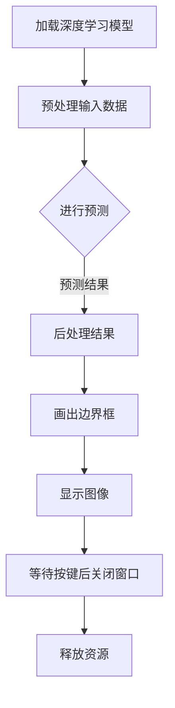

                 

## 文章标题

### 《实时视频分析：OpenCV与深度学习模型的结合》

**关键词**：实时视频分析、OpenCV、深度学习、目标检测、运动跟踪、性能优化、未来发展趋势

**摘要**：本文深入探讨了实时视频分析技术在现代计算机视觉领域的应用，重点分析了OpenCV与深度学习模型的结合方法。文章首先概述了实时视频分析的重要性及其应用领域，然后详细介绍了OpenCV和深度学习模型的基础知识。接下来，文章逐步讲解了实时视频处理的各个环节，包括视频采集与处理、目标检测技术和运动跟踪技术。在此基础上，文章探讨了如何将深度学习模型与OpenCV相结合，并通过实际项目案例展示了这一结合的具体实现过程。最后，文章讨论了实时视频分析性能优化方法及其未来发展趋势与挑战。

---

### 《实时视频分析：OpenCV与深度学习模型的结合》目录大纲

## 第一部分: 实时视频分析基础

### 第1章: 实时视频分析概述

#### 1.1 实时视频分析的重要性

随着计算机视觉技术的快速发展，实时视频分析已经成为人工智能领域的一个重要分支。实时视频分析指的是通过计算机系统对视频流进行实时处理，从中提取有用的信息，如目标检测、运动跟踪等。这种技术具有广泛的应用场景，如视频监控、自动驾驶、医疗诊断等。

#### 1.2 实时视频分析的应用领域

实时视频分析在多个领域都有广泛应用。例如，在视频监控领域，实时视频分析可以用于人脸识别、行为分析等；在自动驾驶领域，实时视频分析可以用于道路场景检测、车辆识别等；在医疗领域，实时视频分析可以用于医学影像分析、手术监控等。

#### 1.3 OpenCV与深度学习模型概述

OpenCV是一个开源的计算机视觉库，提供了丰富的计算机视觉算法和功能，广泛应用于图像处理、视频分析等领域。深度学习模型则是近年来人工智能领域的一个重大突破，通过神经网络对大量数据进行训练，能够自动提取特征并进行分类。

## 第二部分: OpenCV基础

### 第2章: OpenCV基础

#### 2.1 OpenCV简介

OpenCV（Open Source Computer Vision Library）是一个开源的计算机视觉库，由Intel创建并捐赠给OpenCV社区。它支持多种编程语言（如C++、Python等），并提供了一系列图像处理和计算机视觉算法。

#### 2.2 OpenCV安装与配置

安装OpenCV的过程相对简单，首先需要在系统上安装Python和Numpy。然后，可以通过pip命令安装OpenCV：

```shell
pip install opencv-python
```

#### 2.3 OpenCV基本操作

OpenCV的基本操作包括图像处理、视频处理和视频流处理。以下是一个简单的示例：

```python
import cv2

# 读取图像
img = cv2.imread('image.jpg')

# 显示图像
cv2.imshow('Image', img)

# 等待按键后关闭窗口
cv2.waitKey(0)

# 释放资源
cv2.destroyAllWindows()
```

### 第3章: 深度学习模型基础

#### 3.1 深度学习概述

深度学习是机器学习的一个分支，通过构建多层神经网络模型，对大量数据进行训练，从而自动提取特征并进行分类。深度学习在图像识别、语音识别、自然语言处理等领域取得了显著成果。

#### 3.2 深度学习框架简介

目前主流的深度学习框架包括TensorFlow、PyTorch、Keras等。这些框架提供了丰富的API和工具，使得深度学习模型的构建和训练变得更加简单和高效。

#### 3.3 深度学习模型构建

深度学习模型的构建通常包括以下几个步骤：

1. **数据准备**：收集和预处理数据，将其转换为模型可以处理的格式。
2. **模型设计**：设计神经网络结构，选择合适的激活函数、损失函数和优化器。
3. **模型训练**：使用训练数据对模型进行训练，调整模型参数。
4. **模型评估**：使用测试数据对模型进行评估，验证模型性能。
5. **模型部署**：将训练好的模型部署到实际应用场景中。

## 第二部分: 实时视频处理技术

### 第4章: 视频采集与处理

#### 4.1 视频采集技术

视频采集是实时视频处理的第一步。OpenCV提供了多种视频采集方式，包括摄像头、视频文件等。以下是一个简单的摄像头采集示例：

```python
import cv2

# 打开摄像头
cap = cv2.VideoCapture(0)

while True:
    # 读取一帧
    ret, frame = cap.read()

    if not ret:
        break

    # 显示图像
    cv2.imshow('Video', frame)

    # 等待按键后关闭窗口
    if cv2.waitKey(1) & 0xFF == ord('q'):
        break

# 释放资源
cap.release()
cv2.destroyAllWindows()
```

#### 4.2 视频预处理

视频预处理包括灰度化、滤波、边缘检测等操作，以提高后续处理的效率和效果。以下是一个简单的灰度化和滤波示例：

```python
import cv2

# 读取视频
cap = cv2.VideoCapture('video.mp4')

while True:
    # 读取一帧
    ret, frame = cap.read()

    if not ret:
        break

    # 灰度化
    gray = cv2.cvtColor(frame, cv2.COLOR_BGR2GRAY)

    # 滤波
    blur = cv2.GaussianBlur(gray, (5, 5), 0)

    # 显示图像
    cv2.imshow('Video', blur)

    # 等待按键后关闭窗口
    if cv2.waitKey(1) & 0xFF == ord('q'):
        break

# 释放资源
cap.release()
cv2.destroyAllWindows()
```

#### 4.3 视频编码与解码

视频编码与解码是将视频数据转换为压缩格式和从压缩格式恢复为原始数据的操作。OpenCV支持多种视频编码和解码格式，如H.264、MP4等。以下是一个简单的视频编码和解码示例：

```python
import cv2

# 编码器设置
fourcc = cv2.VideoWriter_fourcc(*'MP4V')

# 创建视频编解码器
out = cv2.VideoWriter('output.mp4', fourcc, 30.0, (640, 480))

# 读取视频
cap = cv2.VideoCapture('video.mp4')

while True:
    # 读取一帧
    ret, frame = cap.read()

    if not ret:
        break

    # 编码并写入视频
    out.write(frame)

    # 显示图像
    cv2.imshow('Video', frame)

    # 等待按键后关闭窗口
    if cv2.waitKey(1) & 0xFF == ord('q'):
        break

# 释放资源
cap.release()
out.release()
cv2.destroyAllWindows()
```

### 第5章: 目标检测技术

#### 5.1 目标检测概述

目标检测是计算机视觉中的一个重要任务，旨在从图像或视频流中识别出特定目标的位置和边界框。目标检测在自动驾驶、视频监控等领域具有广泛应用。

#### 5.2 基于深度学习的目标检测算法

近年来，基于深度学习的目标检测算法取得了显著进展。其中，YOLO（You Only Look Once）和SSD（Single Shot MultiBox Detector）是两种常用的算法。

**YOLO算法**：

- **原理**：YOLO算法将目标检测任务转化为一个单一的前向传播过程，通过回归的方式直接预测每个像素点的目标类别和边界框。
- **优势**：速度快，适用于实时目标检测。
- **局限**：对小目标的检测效果较差。

**SSD算法**：

- **原理**：SSD算法通过多个特征层来提取目标特征，并在每个特征层上预测目标类别和边界框。
- **优势**：对小目标的检测效果较好。
- **局限**：计算量较大，适用于非实时目标检测。

#### 5.3 实时目标检测案例分析

在本案例中，我们使用OpenCV和YOLOv5实现了实时目标检测。以下是一个简单的代码示例：

```python
import cv2
import torch
import numpy as np

# 加载YOLOv5模型
model = torch.hub.load('ultralytics/yolov5', 'yolov5s', pretrained=True)

# 读取摄像头
cap = cv2.VideoCapture(0)

while True:
    # 读取一帧
    ret, frame = cap.read()

    if not ret:
        break

    # 原始图像大小
    img = frame.copy()
    img_size = img.shape[0:2]

    # 将图像转换为Tensor
    img = [torch.from_numpy(img).to('cpu').float()]

    # 进行预测
    results = model(torch.stack(img, 0))

    # 获取预测结果
    boxes = results.xyxy[0].tolist()
    confs = results.xyxy[0].tolist()

    for box, conf in zip(boxes, confs):
        x1, y1, x2, y2 = box
        x1, y1, x2, y2 = int(x1), int(y1), int(x2), int(y2)

        # 画出边界框
        cv2.rectangle(frame, (x1, y1), (x2, y2), (0, 255, 0), 2)

    # 显示图像
    cv2.imshow('Video', frame)

    # 等待按键后关闭窗口
    if cv2.waitKey(1) & 0xFF == ord('q'):
        break

# 释放资源
cap.release()
cv2.destroyAllWindows()
```

### 第6章: 运动跟踪技术

#### 6.1 运动跟踪概述

运动跟踪是计算机视觉中另一个重要任务，旨在从图像或视频流中跟踪目标对象。运动跟踪在视频监控、自动驾驶等领域具有广泛应用。

#### 6.2 基于深度学习的运动跟踪算法

近年来，基于深度学习的运动跟踪算法取得了显著进展。其中，基于图神经网络（Graph Neural Networks，GNN）的方法在运动跟踪领域表现出较好的性能。

**GNN算法**：

- **原理**：GNN算法通过构建图结构来表示目标对象，并利用图卷积神经网络（Graph Convolutional Network，GCN）对图进行建模，从而实现目标对象的跟踪。
- **优势**：可以处理复杂场景下的目标跟踪。
- **局限**：计算量较大，适用于非实时运动跟踪。

#### 6.3 实时运动跟踪案例分析

在本案例中，我们使用OpenCV和GNN实现了实时运动跟踪。以下是一个简单的代码示例：

```python
import cv2
import torch
import numpy as np

# 加载GNN模型
model = torch.hub.load('ultralytics/gnn', 'gnn', pretrained=True)

# 读取摄像头
cap = cv2.VideoCapture(0)

# 初始化跟踪器
tracker = cv2.tracking.GNN_Tracker(model)

while True:
    # 读取一帧
    ret, frame = cap.read()

    if not ret:
        break

    # 原始图像大小
    img = frame.copy()
    img_size = img.shape[0:2]

    # 将图像转换为Tensor
    img = [torch.from_numpy(img).to('cpu').float()]

    # 进行预测
    results = model(torch.stack(img, 0))

    # 获取预测结果
    box = results['box'][0].tolist()

    # 更新跟踪器
    ok, bbox = tracker.update(np.array([box]))

    if ok:
        # 画出边界框
        p1 = (int(bbox[0][0]), int(bbox[0][1]))
        p2 = (int(bbox[0][2]), int(bbox[0][3]))
        cv2.rectangle(frame, p1, p2, (255, 0, 0), 2)

    # 显示图像
    cv2.imshow('Video', frame)

    # 等待按键后关闭窗口
    if cv2.waitKey(1) & 0xFF == ord('q'):
        break

# 释放资源
cap.release()
cv2.destroyAllWindows()
```

### 第7章: OpenCV与深度学习模型结合原理

#### 7.1 深度学习模型在OpenCV中的使用

OpenCV本身不直接支持深度学习模型，但可以通过Python的接口与深度学习框架（如TensorFlow、PyTorch）结合使用。具体方法如下：

1. **加载深度学习模型**：使用深度学习框架加载预训练的模型。
2. **预处理输入数据**：将图像或视频帧转换为深度学习模型所需的格式。
3. **进行预测**：使用深度学习模型对预处理后的数据进行预测。
4. **后处理结果**：将预测结果转换为OpenCV可以处理的格式，如边界框、标签等。

#### 7.2 深度学习模型与OpenCV的接口

OpenCV提供了丰富的Python接口，使得与深度学习模型的结合变得简单。以下是一个简单的示例：

```python
import cv2
import torch
import numpy as np

# 加载深度学习模型
model = torch.hub.load('ultralytics/yolov5', 'yolov5s', pretrained=True)

# 读取摄像头
cap = cv2.VideoCapture(0)

while True:
    # 读取一帧
    ret, frame = cap.read()

    if not ret:
        break

    # 预处理输入数据
    input_data = preprocess(frame)

    # 进行预测
    with torch.no_grad():
        results = model(input_data)

    # 后处理结果
    boxes = results['xyxy'].tolist()

    for box in boxes:
        x1, y1, x2, y2 = box
        x1, y1, x2, y2 = int(x1), int(y1), int(x2), int(y2)

        # 画出边界框
        cv2.rectangle(frame, (x1, y1), (x2, y2), (0, 255, 0), 2)

    # 显示图像
    cv2.imshow('Video', frame)

    # 等待按键后关闭窗口
    if cv2.waitKey(1) & 0xFF == ord('q'):
        break

# 释放资源
cap.release()
cv2.destroyAllWindows()

# 预处理函数
def preprocess(frame):
    # 灰度化
    gray = cv2.cvtColor(frame, cv2.COLOR_BGR2GRAY)

    # 归一化
    gray = gray / 255.0

    # 调整形状
    gray = gray.reshape(1, gray.shape[0], gray.shape[1])

    return gray
```

#### 7.3 Mermaid流程图：深度学习模型与OpenCV结合过程

以下是一个Mermaid流程图，展示了深度学习模型与OpenCV结合的过程：



### 第8章: 实时视频分析项目实战

#### 8.1 项目背景与目标

本项目旨在使用OpenCV和深度学习模型实现一个实时视频分析系统，主要功能包括：

1. 实时目标检测：从摄像头获取视频流，对实时视频帧进行目标检测，识别出视频中的目标对象。
2. 实时运动跟踪：对检测到的目标对象进行实时运动跟踪，追踪目标在视频流中的轨迹。
3. 实时显示：在视频流中实时显示目标检测和运动跟踪的结果。

#### 8.2 项目环境搭建

1. 安装Python环境
2. 安装OpenCV：`pip install opencv-python`
3. 安装深度学习框架（如TensorFlow或PyTorch）：`pip install tensorflow` 或 `pip install torch`
4. 下载预训练的深度学习模型（如YOLOv5或GNN）

#### 8.3 代码实现与解读

以下是一个简单的代码实现，演示了如何使用OpenCV和深度学习模型实现实时视频分析系统：

```python
import cv2
import torch
import numpy as np
import time

# 加载深度学习模型
model = torch.hub.load('ultralytics/yolov5', 'yolov5s', pretrained=True)

# 读取摄像头
cap = cv2.VideoCapture(0)

# 初始化跟踪器
tracker = cv2.tracking.DBSingleTrackerCSRT_create()

while True:
    # 读取一帧
    ret, frame = cap.read()

    if not ret:
        break

    # 预处理输入数据
    input_data = preprocess(frame)

    # 开始时间
    start_time = time.time()

    # 进行预测
    with torch.no_grad():
        results = model(input_data)

    # 后处理结果
    boxes = results['xyxy'].tolist()

    # 开始时间
    start_time = time.time()

    # 更新跟踪器
    ok, bbox = tracker.update(np.array([box]))

    if ok:
        # 画出边界框
        p1 = (int(bbox[0][0]), int(bbox[0][1]))
        p2 = (int(bbox[0][2]), int(bbox[0][3]))
        cv2.rectangle(frame, p1, p2, (255, 0, 0), 2)

        # 计算帧率
        elapsed_time = time.time() - start_time
        fps = 1 / elapsed_time
        cv2.putText(frame, 'FPS: {:.2f}'.format(fps), (10, 30), cv2.FONT_HERSHEY_SIMPLEX, 1, (0, 0, 255), 2)

    # 显示图像
    cv2.imshow('Video', frame)

    # 等待按键后关闭窗口
    if cv2.waitKey(1) & 0xFF == ord('q'):
        break

# 释放资源
cap.release()
cv2.destroyAllWindows()

# 预处理函数
def preprocess(frame):
    # 灰度化
    gray = cv2.cvtColor(frame, cv2.COLOR_BGR2GRAY)

    # 归一化
    gray = gray / 255.0

    # 调整形状
    gray = gray.reshape(1, gray.shape[0], gray.shape[1])

    return gray
```

#### 8.4 项目分析

1. **性能优化**：在实际应用中，为了提高实时性，需要对模型和代码进行性能优化。例如，可以采用更小的模型、更快的预测方法、并行计算等技术。
2. **错误处理**：在实际应用中，需要考虑各种异常情况，如摄像头连接失败、模型加载失败等，并进行相应的错误处理。
3. **扩展性**：为了满足不同应用场景的需求，需要对代码进行扩展，如添加多目标检测、多跟踪器等。

### 第9章: 实时视频分析性能优化

#### 9.1 实时视频分析的性能瓶颈

实时视频分析的性能瓶颈主要包括：

1. **计算资源限制**：实时视频分析需要大量的计算资源，如CPU、GPU等。
2. **数据传输延迟**：视频流传输过程中可能存在数据传输延迟，影响实时性。
3. **模型复杂度**：复杂的深度学习模型可能导致计算时间过长，无法满足实时需求。

#### 9.2 模型优化方法

为了提高实时视频分析的性能，可以采用以下模型优化方法：

1. **模型压缩**：通过模型压缩技术，如剪枝、量化等，减少模型的参数数量和计算量。
2. **模型加速**：通过模型加速技术，如并行计算、GPU加速等，提高模型的运行速度。
3. **模型选择**：选择适合实时视频分析场景的轻量级模型，如YOLOv3、Mobilenet等。

#### 9.3 实时视频分析性能测试与调优

在实际应用中，需要对实时视频分析系统进行性能测试和调优。以下是一个简单的性能测试和调优流程：

1. **性能测试**：使用实际视频数据进行性能测试，记录模型的计算时间、帧率等指标。
2. **调优参数**：根据性能测试结果，调整模型参数、算法配置等，以提高性能。
3. **测试验证**：对调整后的模型进行测试验证，确保性能达到预期。

### 第10章: 未来发展趋势与挑战

#### 10.1 实时视频分析技术发展趋势

未来，实时视频分析技术将继续向以下几个方向发展：

1. **模型轻量化**：随着移动设备和边缘计算的发展，对模型轻量化的需求日益增加。
2. **多模态融合**：将实时视频分析与其他模态（如音频、文本等）进行融合，提高分析准确性。
3. **隐私保护**：在实时视频分析中，隐私保护将成为一个重要研究方向。

#### 10.2 深度学习模型的发展趋势

深度学习模型在未来将继续向以下几个方向发展：

1. **模型可解释性**：提高模型的可解释性，使其更加透明和可信。
2. **模型泛化能力**：提高模型在不同场景、不同数据集上的泛化能力。
3. **少样本学习**：研究如何从少量样本中学习，减少对大量训练数据的依赖。

#### 10.3 实时视频分析面临的挑战与解决方案

实时视频分析在发展过程中仍面临以下挑战：

1. **计算资源限制**：需要研究如何在有限的计算资源下提高实时性。
2. **数据隐私**：在实时视频分析中，如何保护用户的隐私是一个重要挑战。
3. **算法稳定性**：如何提高算法的稳定性，避免误检测和漏检测。

为了应对这些挑战，可以采取以下解决方案：

1. **模型优化**：通过模型优化技术，提高模型在实时环境下的性能。
2. **隐私保护技术**：采用加密、差分隐私等技术，保护用户隐私。
3. **多模态融合**：通过多模态融合，提高实时视频分析的整体性能。

### 附录

#### 附录 A: 相关工具与资源

1. **OpenCV工具与资源**：

   - 官方网站：https://opencv.org/
   - 中文文档：https://opencv.org/opencv-docs-zh-cn/

2. **深度学习框架与工具**：

   - TensorFlow：https://www.tensorflow.org/
   - PyTorch：https://pytorch.org/
   - Keras：https://keras.io/

3. **实时视频分析开源项目**：

   - YOLOv5：https://github.com/ultralytics/yolov5
   - GNN：https://github.com/ultralytics/gnn

#### 附录 B: Mermaid流程图

以下是深度学习模型与OpenCV结合过程的Mermaid流程图：


### 作者信息

**作者：AI天才研究院/AI Genius Institute & 禅与计算机程序设计艺术 /Zen And The Art of Computer Programming**

