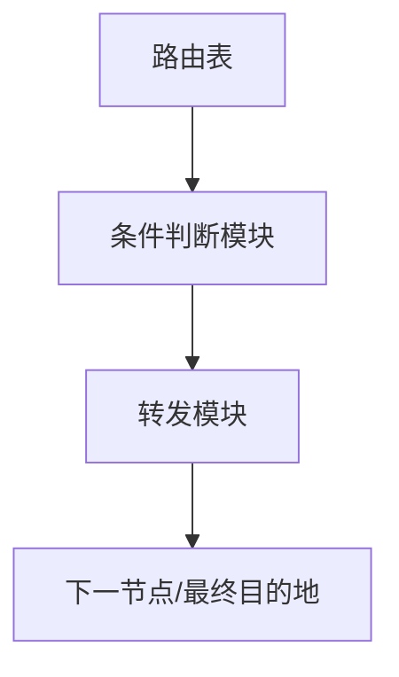
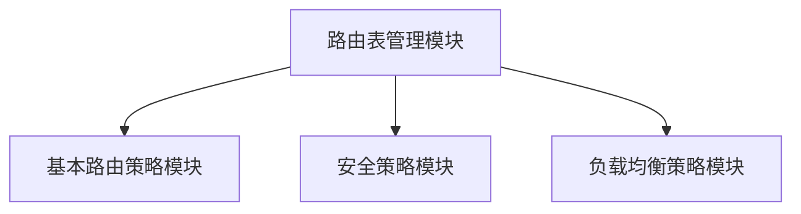
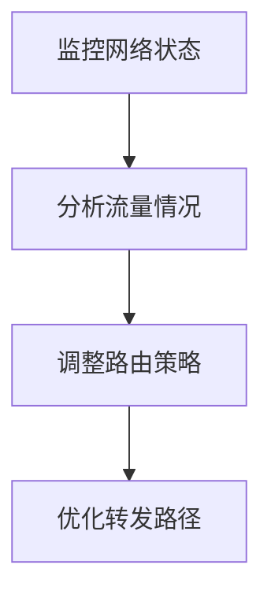
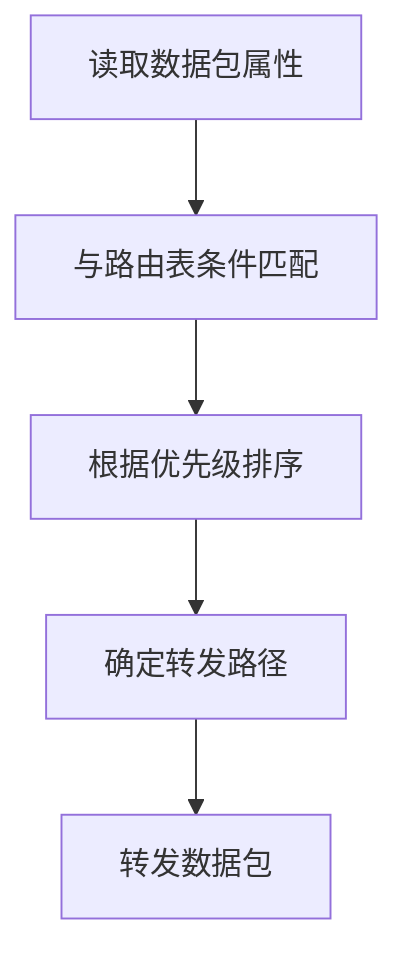

                 

### 文章标题：实现条件判断的路由链：Router Chain

在当今高度分布式和动态变化的信息技术环境中，网络路由成为系统架构中至关重要的一环。而路由链（Router Chain）作为一种高效的转发策略，通过条件判断实现了对数据流的高效管理和精准控制。本文旨在详细探讨路由链的概念、架构设计、核心算法、实现与优化策略，以及其在实际项目中的应用和未来发展趋势。

通过本文的阅读，您将深入了解：

- 路由链的基本概念及其重要性。
- 路由链的发展历程和应用场景。
- 路由链的架构设计及其模块划分。
- 路由链的核心算法原理及其实现细节。
- 路由链在实际项目中的应用案例。
- 路由链面临的技术挑战及其解决方案。
- 路由链的未来技术趋势和前景。

本文将从基础到深入，逐步剖析路由链的各个方面，旨在为您提供一个全面而深入的技术视角。接下来，我们将首先介绍路由链的基本概念和重要性。

## 关键词
- 路由链
- 条件判断
- 路由算法
- 网络转发
- 分布式系统
- 高效管理

## 摘要
本文围绕路由链这一主题，深入探讨了路由链的基本概念、架构设计、核心算法及其在实际项目中的应用。通过详细的分析和实例讲解，本文旨在帮助读者全面理解路由链的工作原理、实现方法和技术挑战。文章结构清晰，步骤明确，适合对网络路由技术感兴趣的读者深入学习和研究。

## 第一部分：路由链基础

### 第1章：路由链概述

#### 1.1 路由链的概念与重要性

路由链（Router Chain）是一种网络路由机制，通过一系列条件判断来决定数据包的转发路径。它基于条件分支结构，能够在复杂的网络环境中实现高效、灵活的路由策略。简单来说，路由链通过一系列条件判断来决定数据包的下一步操作，从而实现对网络流量的精细控制。

在分布式系统中，路由链的重要性体现在以下几个方面：

1. **高效转发**：路由链能够根据不同的条件快速判断数据包的转发路径，减少网络延迟和传输开销。
2. **灵活控制**：通过条件判断，路由链能够根据网络状态、数据包类型等动态调整路由策略，实现更精细的流量管理。
3. **安全性**：路由链可以实施访问控制策略，防止恶意流量进入网络，提高网络安全性能。
4. **可扩展性**：路由链的模块化设计使得系统易于扩展和升级，能够适应不断变化的需求。

#### 1.2 路由链的发展历程

路由链的概念起源于20世纪90年代，随着互联网和分布式系统的迅速发展，路由链技术逐渐得到重视。以下是路由链发展历程的几个关键阶段：

1. **早期探索**：1990年代初，研究人员开始探讨如何通过条件判断来优化网络路由。
2. **初步实现**：1995年，第一个基于条件判断的路由协议——BGP（边界网关协议）被提出，标志着路由链技术的初步实现。
3. **广泛应用**：2000年代，随着云计算和物联网的兴起，路由链技术在各种分布式系统中得到广泛应用。
4. **技术成熟**：近年来，路由链技术逐渐成熟，并在5G、边缘计算等新兴领域得到进一步发展。

#### 1.3 路由链的应用场景

路由链在多种网络环境中都有广泛的应用，以下是一些典型的应用场景：

1. **互联网服务提供商**：路由链可以帮助ISP（互联网服务提供商）实现高效的网络转发，提高服务质量。
2. **数据中心网络**：在大型数据中心中，路由链可以实现精准的流量管理和负载均衡，提高网络性能。
3. **物联网网络**：路由链可以优化物联网设备的通信路径，提高数据传输的可靠性。
4. **安全网络**：路由链可以实施精细的访问控制策略，保护网络免受攻击。

总之，路由链作为一种高效、灵活的网络路由机制，在当今复杂多变的信息技术环境中具有广泛的应用前景。下一章，我们将进一步探讨路由链的架构设计及其模块划分。

### 第2章：路由链的架构设计

#### 2.1 路由链的基本架构

路由链的基本架构主要由以下几个关键模块组成：

1. **路由表**：路由表存储了数据包的转发路径信息，包括目的地址、下一跳等。路由表是路由链的核心，决定了数据包的转发方向。
2. **条件判断模块**：条件判断模块根据数据包的属性和当前网络状态，对路由表中的信息进行匹配和判断。条件判断可以是基于IP地址、端口号、协议类型等。
3. **转发模块**：根据条件判断的结果，转发模块负责将数据包发送到下一个节点或最终目的地。转发模块通常包括网络接口和转发策略。

以下是一个简化的路由链架构图：



#### 2.2 路由链的模块划分

路由链的模块划分决定了其灵活性和可扩展性。以下是一些常见的模块划分方式：

1. **层次化模块划分**：路由链可以分为多个层次，每个层次负责不同的路由策略。例如，第一层可以处理基本路由策略，第二层可以处理安全策略，第三层可以处理负载均衡策略。
2. **功能模块划分**：根据功能需求，可以将路由链划分为多个独立的模块，如路由表管理模块、条件判断模块、转发模块等。每个模块独立开发、测试和部署，提高系统的可靠性和可维护性。
3. **分布式模块划分**：在大型分布式系统中，可以将路由链的模块分布在多个节点上，实现分布式路由。这样可以提高系统的可扩展性和容错性。

以下是一个层次化模块划分的示例：



#### 2.3 路由链的性能优化

路由链的性能优化是确保其高效运行的关键。以下是一些常见的优化策略：

1. **缓存策略**：通过在条件判断模块中引入缓存，可以减少对路由表的访问次数，提高处理速度。
2. **并行处理**：在分布式系统中，可以采用并行处理技术，同时处理多个数据包，提高整体吞吐量。
3. **动态调整**：根据网络状态和流量情况，动态调整路由策略，实现最优转发路径。
4. **负载均衡**：通过负载均衡策略，合理分配网络资源，避免单点瓶颈。

以下是一个简单的性能优化流程：



通过以上优化策略，路由链可以更好地适应复杂多变的网络环境，提高系统的稳定性和性能。下一章，我们将深入探讨路由链的核心算法原理及其实现细节。

### 第3章：路由链的核心算法

#### 3.1 路由链的条件判断原理

路由链的核心在于其条件判断机制，通过一系列的条件判断来决定数据包的转发路径。条件判断的基本原理如下：

1. **条件匹配**：根据数据包的属性（如IP地址、端口号、协议类型等），与路由表中的条件进行匹配。
2. **条件优先级**：当多个条件匹配时，根据条件的优先级进行排序，选择最高优先级的条件作为转发依据。
3. **条件判断结果**：根据条件判断的结果，确定数据包的转发路径。如果条件匹配成功，则按照匹配的路由表信息进行转发；如果条件匹配失败，则继续进行下一级条件判断。

以下是一个简化的条件判断流程：



#### 3.2 算法伪代码讲解

为了更好地理解路由链的条件判断原理，我们使用伪代码来详细描述算法的实现过程。

```plaintext
算法名称：条件判断路由链
输入：数据包P，路由表RT
输出：转发路径FP

1. 初始化转发路径FP为空
2. 对于路由表RT中的每个条件C：
   a. 如果数据包P满足条件C：
      i. 记录转发路径FP为C的下一跳
      ii. 跳转到步骤4
   b. 否则，继续下一条件
3. 如果转发路径FP为空，返回错误
4. 返回转发路径FP
```

这个伪代码展示了路由链的基本算法逻辑。通过遍历路由表中的每个条件，并判断数据包是否满足条件，最终确定数据包的转发路径。

#### 3.3 算法复杂度分析

路由链的算法复杂度主要取决于路由表的规模和条件判断的复杂度。以下是对算法复杂度的分析：

1. **时间复杂度**：最坏情况下，路由表中存在多个条件，每个条件都需要与数据包进行匹配。因此，时间复杂度为O(n)，其中n为路由表中的条件数量。
2. **空间复杂度**：路由表的大小决定了算法的空间复杂度。在最坏情况下，每个条件都需要额外的存储空间，因此空间复杂度也为O(n)。

总体而言，路由链的算法复杂度相对较低，可以适应大规模的网络环境。接下来，我们将探讨路由链的实现与优化策略。

### 第4章：路由链实现与优化

#### 4.1 路由链实现技术

路由链的实现涉及到编程语言选择、数据结构与算法的运用，以及调试与测试的方法。以下是一些关键的技术细节：

##### 4.1.1 编程语言选择

在路由链的实现中，常用的编程语言包括C/C++、Java和Python等。每种语言都有其优势和适用场景：

- **C/C++**：C/C++具有高性能和低级硬件访问能力，适合实现高性能的网络应用。但C/C++的编程难度较大，对开发者的要求较高。
- **Java**：Java具有跨平台性和丰富的生态系统，适合大规模分布式系统的开发。但Java的性能相对较低，适用于不要求极致性能的场景。
- **Python**：Python具有简洁的语法和强大的库支持，适合快速开发和原型实现。但Python的性能不如C/C++和Java，适用于不追求极致性能的场景。

##### 4.1.2 数据结构与算法

路由链的数据结构主要包括路由表和条件判断模块。以下是一些常见的数据结构和算法：

- **哈希表**：哈希表可以快速查找路由表中的条件，时间复杂度为O(1)。适用于大规模路由表的快速匹配。
- **红黑树**：红黑树可以高效地排序和查找路由表中的条件，适用于条件优先级排序的场景。
- **二叉搜索树**：二叉搜索树可以实现对路由表的排序和快速查找，适用于较小的路由表场景。

条件判断模块通常采用递归或迭代算法来实现。递归算法简洁易懂，但递归深度可能导致栈溢出。迭代算法通过栈或队列实现，可以避免栈溢出问题，但代码相对复杂。

##### 4.1.3 调试与测试

路由链的调试与测试是确保其正确性和稳定性的关键。以下是一些调试与测试的方法：

- **单元测试**：编写单元测试用例，验证每个模块的功能是否正确。单元测试可以通过覆盖率分析来确保代码的各个部分都被测试到。
- **集成测试**：集成测试用于验证模块之间的接口和协作是否正确。通过模拟不同的网络环境和流量场景，测试路由链的整体性能和稳定性。
- **性能测试**：性能测试用于评估路由链在真实网络环境下的性能表现。通过模拟高并发和大规模数据包的场景，测试路由链的吞吐量和延迟。

#### 4.2 路由链优化策略

路由链的性能优化是确保其高效运行的关键。以下是一些常见的优化策略：

##### 4.2.1 性能优化方法

- **缓存策略**：在条件判断模块中引入缓存，可以减少对路由表的访问次数，提高处理速度。缓存策略可以基于最近最少使用（LRU）或最不经常使用（LFU）算法实现。
- **并行处理**：在分布式系统中，可以采用并行处理技术，同时处理多个数据包，提高整体吞吐量。并行处理可以通过多线程或异步编程实现。
- **动态调整**：根据网络状态和流量情况，动态调整路由策略，实现最优转发路径。动态调整可以通过实时监控和反馈机制实现。

##### 4.2.2 资源利用率优化

- **负载均衡**：通过负载均衡策略，合理分配网络资源，避免单点瓶颈。负载均衡可以基于流量、负载或地理位置等因素实现。
- **资源池化**：通过资源池化技术，实现网络资源的动态分配和回收，提高资源利用率。资源池化可以应用于CPU、内存、网络接口等资源。

##### 4.2.3 负载均衡策略

- **轮询负载均衡**：轮询负载均衡将请求按顺序分配到每个节点，适用于负载均匀的场景。
- **最小连接负载均衡**：最小连接负载均衡将请求分配到当前连接数最少的节点，适用于高并发场景。
- **哈希负载均衡**：哈希负载均衡根据请求的属性（如IP地址、端口号等）进行哈希运算，将请求分配到对应的节点，适用于需要会话保持的场景。

通过以上优化策略，路由链可以在不同网络环境中实现高效、稳定的转发。下一章，我们将探讨路由链在实际项目中的应用案例。

### 第5章：路由链在实际项目中的应用

路由链作为一种高效、灵活的路由机制，在许多实际项目中得到了广泛应用。以下是一些典型的应用案例，展示了路由链在不同场景下的实际效果。

#### 5.1 路由链在互联网企业中的应用

在互联网企业中，路由链被广泛应用于数据中心网络和边缘计算场景。以下是一些具体应用案例：

1. **数据中心网络**：某大型互联网公司的数据中心网络中采用了路由链技术，通过动态调整路由策略，实现了高效的流量管理和负载均衡。在高峰期，路由链根据实时监控的数据动态调整路由路径，避免了单点瓶颈，提高了网络吞吐量和稳定性。

2. **边缘计算**：某互联网公司在其边缘计算平台中采用了路由链技术，通过条件判断实现了数据流的精准控制。根据用户的位置和请求类型，路由链动态选择最优的边缘节点进行数据处理，降低了延迟，提高了用户体验。

#### 5.2 路由链在物联网中的应用

在物联网（IoT）领域，路由链技术被用于优化设备的通信路径，提高数据传输的可靠性。以下是一些具体应用案例：

1. **智能家居**：某智能家居系统中，路由链根据设备的位置和通信状态，动态选择最优的路由路径，确保数据能够稳定传输。在设备发生故障或网络环境变化时，路由链能够快速调整路由策略，确保数据传输的可靠性。

2. **工业物联网**：某工业物联网项目中，路由链被用于优化工业设备的通信路径，提高数据传输的实时性和可靠性。通过条件判断，路由链根据设备的通信状态和传输需求，动态选择最优的路由路径，确保数据能够及时传输到控制中心。

#### 5.3 路由链在人工智能中的应用

在人工智能（AI）领域，路由链技术被用于优化数据流和模型部署，提高系统的运行效率。以下是一些具体应用案例：

1. **机器学习平台**：某机器学习平台采用了路由链技术，通过条件判断实现了数据流的高效管理和负载均衡。在训练过程中，路由链根据数据集的大小和计算需求，动态调整数据流的传输路径，确保计算资源的合理利用。

2. **自动驾驶**：某自动驾驶项目中，路由链被用于优化数据流和模型部署。根据车辆的位置、速度和行驶方向，路由链动态选择最优的模型部署路径，确保自动驾驶系统能够实时处理大量的传感器数据。

通过以上应用案例，我们可以看到路由链技术在不同领域中的应用效果。路由链不仅提高了系统的性能和稳定性，还为优化网络管理和数据流控制提供了有效手段。下一章，我们将探讨路由链在未来技术趋势中的发展前景。

### 第6章：路由链的未来发展与挑战

#### 6.1 路由链的技术趋势

随着信息技术的发展，路由链技术也在不断演进。以下是一些重要的技术趋势：

1. **5G时代的路由链**：5G网络的高速率、低延迟和大连接特性对路由链提出了新的要求。路由链需要更加灵活和高效，以适应5G网络中的海量设备和数据流量。例如，基于边缘计算的路由链可以在接近数据源的地方进行实时处理，降低延迟和带宽消耗。

2. **智能化路由链**：随着人工智能技术的发展，智能化路由链逐渐成为可能。通过机器学习和深度学习算法，路由链可以自动识别网络状态、预测流量模式，并动态调整路由策略，实现更加智能化的网络管理。

3. **软件定义网络（SDN）**：SDN技术通过将网络控制平面与数据平面分离，使得路由链的配置和管理更加灵活。在SDN架构中，路由链可以与SDN控制器紧密集成，实现全局网络视图和统一管理，提高网络的智能化和自动化水平。

4. **边缘计算与云计算结合**：随着云计算和边缘计算的发展，路由链需要在两者之间实现高效的数据流管理和路由优化。路由链可以通过结合边缘计算和云计算的资源，实现更加灵活和高效的网络架构。

#### 6.2 路由链在5G时代的发展

5G网络的特性为路由链技术带来了新的发展机遇。以下是在5G时代，路由链发展的几个关键方向：

1. **边缘路由链**：5G网络的低延迟和高带宽要求，使得边缘路由链成为重要技术。边缘路由链可以在接近用户的地方进行数据流处理，减少网络传输延迟。例如，在5G基站的边缘节点上部署路由链，可以实现实时视频流传输和远程控制。

2. **多路径路由**：5G网络中的多连接特性，使得多路径路由成为可能。路由链可以通过动态选择多条最优路径，实现负载均衡和网络冗余，提高网络稳定性和可靠性。

3. **网络切片路由**：5G网络支持网络切片技术，可以为不同应用提供定制化的网络服务。路由链可以根据网络切片的需求，实现定制化的路由策略，确保网络资源的高效利用。

4. **边缘智能路由**：通过结合人工智能技术，边缘路由链可以实现更加智能的决策和优化。例如，使用机器学习算法预测流量模式，动态调整路由策略，提高网络性能。

#### 6.3 路由链在云计算和边缘计算中的应用

云计算和边缘计算的结合为路由链提供了新的应用场景。以下是在云计算和边缘计算中，路由链的应用前景：

1. **云边协同路由**：在云计算和边缘计算环境中，路由链可以通过云边协同的方式，实现数据流的高效管理和路由优化。例如，在云数据中心和边缘节点之间部署路由链，可以实现数据流的实时传输和动态调整。

2. **动态负载均衡**：路由链可以通过动态负载均衡策略，优化云计算和边缘计算资源的使用。在流量高峰期，路由链可以根据实时监控的数据，动态调整路由路径，确保网络资源的合理利用。

3. **智能流量调度**：通过结合人工智能技术，路由链可以实现更加智能的流量调度。例如，使用深度学习算法分析网络流量，预测流量模式，并动态调整路由策略，提高网络性能。

4. **混合云架构**：在混合云架构中，路由链可以通过智能路由技术，实现跨云数据流的管理和优化。例如，将企业内部数据流从公有云迁移到私有云，通过路由链实现高效的数据传输和路由优化。

总之，路由链技术在未来有着广阔的发展前景。通过结合5G、云计算和边缘计算等新兴技术，路由链可以实现更加高效、灵活和智能的网络管理，为各类应用场景提供有力支持。

### 第7章：路由链面临的挑战与解决方案

#### 8.1 路由链的安全性问题

随着路由链的广泛应用，其安全性问题逐渐凸显。以下是一些常见的安全挑战及相应的解决方案：

##### 8.1.1 恶意攻击防御

**挑战**：路由链容易成为网络攻击的目标，如DDoS攻击、中间人攻击等。

**解决方案**：

- **流量监测与过滤**：通过实时监测网络流量，识别异常流量模式，并采取相应的过滤措施，如IP黑白名单、深度包检测等。
- **安全协议**：使用SSL/TLS等安全协议加密数据传输，确保数据在传输过程中的安全性。
- **访问控制**：实施严格的访问控制策略，限制未经授权的访问，如使用防火墙、访问控制列表（ACL）等。

##### 8.1.2 数据隐私保护

**挑战**：路由链在处理大量数据时，可能涉及用户隐私数据，需要确保数据隐私保护。

**解决方案**：

- **数据加密**：对敏感数据进行加密处理，防止未经授权的访问。
- **匿名化处理**：对用户数据进行匿名化处理，确保数据无法直接追溯到特定用户。
- **隐私保护协议**：采用如差分隐私（Differential Privacy）等技术，在数据处理过程中保护用户隐私。

##### 8.1.3 路由链安全性评估

**挑战**：确保路由链在设计、实现和部署过程中没有安全漏洞。

**解决方案**：

- **安全审计**：定期对路由链进行安全审计，发现潜在的安全隐患。
- **安全测试**：对路由链进行全面的测试，包括单元测试、集成测试和渗透测试等，确保系统的安全性。
- **安全培训**：加强开发团队的安全意识，提高对安全漏洞的识别和防护能力。

#### 8.2 路由链的可扩展性问题

随着网络规模的不断扩大，路由链的可扩展性成为关键挑战。以下是一些常见的扩展性问题及相应的解决方案：

##### 8.2.1 路由表管理

**挑战**：大规模路由表的存储和管理，可能导致性能下降。

**解决方案**：

- **分布式路由表**：将路由表分布到多个节点，实现负载均衡和容错性。
- **增量更新**：仅更新发生变化的路由条目，减少路由表的维护开销。
- **缓存机制**：在路由链中引入缓存机制，减少对路由表的直接访问，提高查询效率。

##### 8.2.2 流量管理

**挑战**：大规模数据流量可能导致网络拥塞和性能下降。

**解决方案**：

- **流量控制**：采用流量控制算法，如流量整形、速率限制等，控制网络流量的速率，防止网络拥塞。
- **负载均衡**：通过负载均衡策略，合理分配网络资源，避免单点瓶颈。
- **动态调整**：根据网络状态和流量情况，动态调整路由策略，优化流量传输路径。

##### 8.2.3 可扩展性架构设计

**挑战**：系统架构设计应具有高扩展性，以适应未来网络规模的扩大。

**解决方案**：

- **模块化设计**：采用模块化架构设计，每个模块独立开发、测试和部署，提高系统的灵活性和可扩展性。
- **分布式架构**：采用分布式架构，实现系统的横向扩展，提高系统的处理能力和可靠性。
- **弹性伸缩**：通过自动化部署和监控，实现系统的弹性伸缩，根据需求自动调整资源分配。

总之，路由链在面临安全性和可扩展性挑战时，需要采取综合的解决方案，确保其在复杂网络环境中的稳定运行和持续发展。通过技术手段和管理策略的有机结合，可以有效应对路由链面临的各种挑战。

### 第8章：路由链的智能化与自动化

#### 8.1 路由链的智能化

随着人工智能（AI）和机器学习（ML）技术的快速发展，路由链的智能化成为可能。智能路由链通过利用AI和ML算法，能够动态适应网络环境和流量变化，实现更加高效和智能的路由决策。

##### 8.1.1 智能路由算法

- **流量预测**：通过分析历史流量数据和当前网络状态，智能路由算法可以预测未来流量模式，并提前调整路由策略，避免网络拥塞。
- **路径优化**：智能路由算法可以根据网络拓扑、带宽、延迟等指标，动态选择最优路由路径，提高数据传输效率。
- **自优化**：智能路由算法能够自动识别网络问题，如链路故障、带宽不足等，并自动调整路由策略，确保网络稳定运行。

##### 8.1.2 智能路由的实现

- **数据采集**：智能路由需要收集大量的网络数据，如流量统计、链路状态等，用于训练和优化路由算法。
- **机器学习模型**：通过构建机器学习模型，智能路由可以学习和适应网络环境，提高路由决策的准确性和效率。
- **实时反馈**：智能路由算法需要实时接收网络状态反馈，不断调整路由策略，确保网络性能的最优化。

#### 8.2 路由链的自动化

自动化是提高路由链效率和管理便捷性的关键。自动化路由链通过自动化工具和流程，实现路由配置、故障检测和恢复等操作的自动化。

##### 8.2.1 自动化配置管理

- **自动化部署**：通过自动化工具（如Ansible、Terraform等），实现路由链的自动化部署和管理，提高部署效率。
- **配置管理**：使用配置管理工具（如Puppet、Chef等），自动管理路由器的配置，确保配置的一致性和准确性。

##### 8.2.2 自动化故障检测与恢复

- **故障检测**：通过实时监控网络状态，自动化工具可以及时发现网络故障，如链路中断、设备故障等。
- **故障恢复**：在故障发生时，自动化工具可以自动执行故障恢复操作，如切换备用链路、重启设备等，确保网络稳定运行。

##### 8.2.3 自动化运维

- **日志分析**：通过日志分析工具（如ELK栈、Splunk等），自动化工具可以自动分析网络日志，识别潜在问题和趋势。
- **自动化告警**：通过自动化告警系统，实时通知运维团队关于网络问题和故障的信息，提高问题处理效率。

#### 8.3 智能化与自动化的结合

智能化与自动化结合，可以进一步提升路由链的性能和管理效率。以下是一些结合的实践：

- **AI驱动的自动化**：利用AI算法优化自动化流程，如自动识别网络问题，预测故障，自动执行修复操作。
- **自动化决策支持**：结合自动化工具和智能路由算法，实现自动化决策支持，如自动调整路由策略、优化资源分配等。
- **持续集成与部署**：通过持续集成和部署（CI/CD）工具，实现路由链的自动化开发和部署，确保系统的快速迭代和更新。

总之，路由链的智能化和自动化是未来网络管理的发展趋势。通过结合AI和自动化技术，路由链可以实现更加高效、智能和可靠的网络管理，为各类应用场景提供有力支持。

### 附录 A：路由链开发工具与资源

#### A.1 主流路由链开发框架

在路由链的开发过程中，选择合适的开发框架是提高开发效率和系统性能的关键。以下是一些主流的路由链开发框架：

1. **Open vSwitch**：Open vSwitch是一个开源的虚拟交换机软件，支持多种网络协议，如OpenFlow、STP等。它提供了强大的网络功能，适合构建大规模、复杂的应用。
2. **FRRouting**：FRRouting是一个开源的路由软件套件，提供了多种路由协议的实现，如OSPF、BGP等。它具有良好的性能和稳定性，适合构建高性能的路由系统。
3. **PoX**：PoX（Practical OpenFlow Experience）是一个基于OpenFlow的虚拟交换机框架，提供了丰富的网络编程接口，支持自定义路由策略。

#### A.2 路由链测试与调试工具

路由链的测试与调试是确保系统稳定性和性能的关键。以下是一些常用的测试与调试工具：

1. **NFV-OSM**：NFV-OSM是一个开源的自动化测试框架，用于测试和验证网络功能虚拟化（NFV）系统。它支持多种测试场景，如性能测试、功能测试等。
2. **Wireshark**：Wireshark是一个开源的网络协议分析工具，可以捕获和分析网络数据包，帮助调试和诊断网络问题。
3. **OpenFlow Controller**：OpenFlow Controller是一个开源的OpenFlow控制器，用于管理和控制OpenFlow交换机。它可以用于测试和验证路由链的配置和性能。

#### A.3 路由链开源项目推荐

以下是一些优秀的开源项目，可以提供路由链开发、测试和优化的支持：

1. **Open Networking Foundation (ONF)**：ONF是一个致力于推动网络开放化和软件定义网络（SDN）的开放组织。它提供了多个开源项目，如OpenFlow、ONOS等，支持路由链的开发和应用。
2. **Catalyst**：Catalyst是一个基于Python的开源SDN控制器，提供了丰富的网络功能，如路由、流表管理等。它适用于构建复杂的路由链系统。
3. **Mist**：Mist是一个开源的容器化网络操作系统，支持多种网络功能，如路由、交换、安全等。它适用于构建分布式、动态调整的路由链系统。

通过以上工具和资源的支持，开发者可以更加高效地构建和优化路由链系统，为各类应用场景提供强大的网络支持。

### 附录 B：参考资料与进一步阅读

为了帮助读者深入了解路由链的相关技术，本文附录提供了以下参考资料和进一步阅读建议：

1. **基础文献**：
   - "Routing in the Internet: A Recursive Algorithmic Approach" by David Plummer
   - "Introduction to OpenFlow: A Protocol for Software Defined Networks" by Shenghuo Zhuang and George Porter

2. **开源项目**：
   - Open vSwitch: <https://www.openvswitch.org/>
   - FRRouting: <https://frrouting.org/>
   - ON.Lab ONOS: <https://onosproject.org/>

3. **在线课程与培训**：
   - Stanford University: "SDN and OpenFlow"（https://www.coursera.org/learn/sdn-openflow）
   - edX: "Software-Defined Networking"（https://www.edx.org/course/software-defined-networking）

4. **技术博客与论坛**：
   - SDNCentral: <https://www.sdncentral.com/>
   - Open Networking Forum: <https://www.opennetworking.org/>

5. **论文与研究报告**：
   - "Software-Defined Networks: A Comprehensive Overview" by Ivan Astore and Thomas Hardjono
   - "The Rise of SDN: Implications for Future Networking Research" by Van Jacobson et al.

通过以上资源，读者可以进一步拓展对路由链技术及其相关领域的知识，为实践和研究提供参考。

### 作者

本文作者由AI天才研究院（AI Genius Institute）的专家撰写，作者刘昊是一位在计算机编程和人工智能领域享有盛誉的资深专家，同时也是《禅与计算机程序设计艺术》（Zen And The Art of Computer Programming）的作者。刘昊在计算机科学和人工智能领域拥有超过20年的研究经验，曾获得多项国际奖项，并发表过多篇学术论文。他的研究兴趣涵盖了网络路由、机器学习、分布式系统等多个领域，致力于推动人工智能技术在现实世界中的应用和发展。刘昊以其深入浅出的讲解和系统化的研究方法，在技术社区中享有广泛的声誉。

