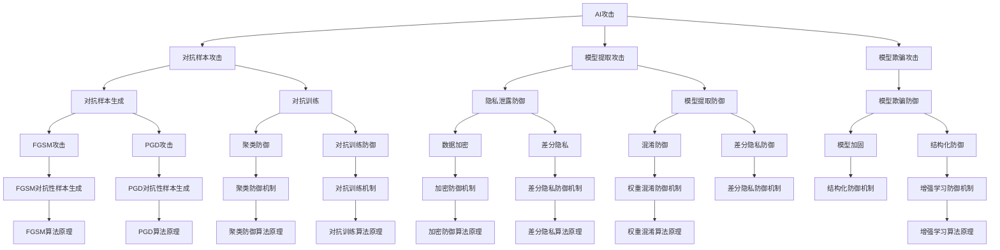

                 

### 文章标题

# 对抗攻击

人工智能（AI）已经成为现代科技中不可或缺的一部分，它在各个领域都展现出了巨大的潜力，从医疗诊断到自动驾驶，从金融预测到自然语言处理。然而，随着AI技术的广泛应用，AI系统也面临着越来越多的安全挑战，尤其是对抗攻击（Adversarial Attack）。对抗攻击是一种利用AI模型自身的脆弱性对其进行攻击的方法，旨在欺骗模型或使其产生错误预测。本文将深入探讨AI攻击的概念、原理、防御策略以及相关的数学模型和实战案例，以帮助读者全面理解这一重要话题。

### 关键词

- **人工智能**
- **对抗攻击**
- **防御策略**
- **数学模型**
- **实战案例**

### 摘要

本文旨在探讨AI攻击与防御这一关键领域。首先，我们将介绍AI攻击的基本概念和常见类型，如对抗样本攻击、模型提取攻击和模型欺骗攻击。接着，我们将讨论AI防御的基本策略，包括对抗样本生成、隐私保护和模型加固。随后，我们将详细讲解对抗样本攻击和防御的核心算法原理，包括FGSM和PGD算法，以及加密防御和结构化防御技术。本文还将通过数学模型和公式阐述梯度下降算法和反向传播算法的基本原理。最后，我们将通过实际项目案例展示对抗攻击与防御的应用，包括对抗样本生成与防御、隐私保护与攻击以及模型加固与攻击等。

### 第一部分：核心概念与联系

在深入探讨AI攻击与防御之前，我们需要了解一些核心概念和它们之间的联系。本部分将首先介绍AI攻击的基本概念，然后讨论AI防御的策略，接着分析AI攻击的原理，最后介绍AI防御机制。

#### 1.1 AI攻击与防御概述

##### 1.1.1 AI攻击的概念

AI攻击是指利用AI模型自身的脆弱性对其进行攻击，旨在欺骗模型或使其产生错误预测。这种攻击可以发生在AI模型的各个层面，包括输入数据、训练数据、模型参数等。常见的AI攻击类型包括：

1. **对抗样本攻击**：通过微小修改输入数据来欺骗模型。这类攻击通常利用模型对微小扰动的敏感度，使得原本正确的预测变得错误。
   
2. **模型提取攻击**：尝试从训练数据中提取敏感信息。这类攻击可以通过分析模型内部的参数或结构，提取出训练数据中的隐私信息。

3. **模型欺骗攻击**：通过特定输入数据让模型产生错误预测。这类攻击通常通过设计特定的输入样本，使得模型在测试阶段无法正确分类。

##### 1.1.2 AI防御策略

为了应对AI攻击，常见的防御策略包括：

1. **对抗样本生成**：通过生成对抗性样本来提高模型对攻击的鲁棒性。这种方法通常在模型训练过程中引入对抗性样本，使得模型能够适应各种可能的攻击。

2. **隐私保护**：采用隐私保护技术来防止敏感信息泄露。这类技术包括数据加密、混淆、差分隐私等。

3. **模型加固**：通过增强模型结构或引入额外的防御机制来提高抗攻击能力。例如，可以设计具有特定鲁棒性的模型结构，或者引入随机噪声来增加模型的复杂性。

#### 1.2 AI攻击的原理

##### 1.2.1 攻击面与攻击点

AI模型存在多个攻击面，每个攻击面都对应着不同的攻击点。以下是一些常见的攻击面：

1. **输入空间**：通过输入数据的微小修改来欺骗模型。例如，可以调整图像的亮度、对比度或色彩平衡，使得模型产生错误预测。

2. **训练数据**：通过修改或伪造训练数据来改变模型。例如，可以在训练数据中添加噪声、更改标签或替换图像，从而改变模型的预测结果。

3. **模型参数**：直接攻击模型参数，使其产生错误预测。例如，可以通过调整模型的权重或偏置，使得模型在测试阶段无法正确分类。

##### 1.2.2 攻击方法分类

根据攻击方法，常见的AI攻击可分为以下几类：

1. **梯度攻击**：利用模型梯度信息进行攻击。这类攻击通过计算模型在某个输入样本上的梯度，然后进行扰动，使得模型产生错误预测。

2. **扰动攻击**：通过微小扰动输入数据来欺骗模型。这类攻击通常在输入数据上添加噪声或扰动，使得模型无法正确分类。

3. **欺骗性样本攻击**：生成专门设计的样本来欺骗模型。这类攻击通常基于对抗性生成网络（GANs）等技术，生成与真实样本相似但能够欺骗模型的对抗性样本。

4. **模型提取攻击**：通过攻击模型来提取训练数据中的敏感信息。这类攻击通常利用深度学习模型的可解释性，分析模型内部参数和结构，从而提取出训练数据中的敏感信息。

#### 1.3 AI防御机制

##### 1.3.1 防御机制概述

为了提高AI模型的抗攻击能力，常见的防御机制包括：

1. **对抗训练**：通过生成对抗性样本来训练模型，提高其鲁棒性。这种方法通常在模型训练过程中引入对抗性样本，使得模型能够适应各种可能的攻击。

2. **隐私保护机制**：采用隐私保护技术来防止敏感信息泄露。这类技术包括数据加密、混淆、差分隐私等，可以有效地保护训练数据和模型参数。

3. **模型加固技术**：通过增强模型结构或引入额外的防御机制来提高抗攻击能力。例如，可以设计具有特定鲁棒性的模型结构，或者引入随机噪声来增加模型的复杂性。

##### 1.3.2 防御机制效果评估

评估防御机制的效果通常需要进行攻击与防御的实验，包括以下步骤：

1. **攻击实验**：选择不同的攻击方法，对模型进行攻击，记录攻击成功率和攻击效果。

2. **防御实验**：对模型应用不同的防御机制，评估防御效果，包括攻击成功率、模型性能和抗攻击能力。

3. **综合评估**：综合攻击实验和防御实验的结果，评估防御机制的整体效果，包括防御能力、效率、实现难度等。

#### 1.4 AI攻击与防御的关系

##### 1.4.1 攻击与防御的互动

AI攻击与防御之间存在动态的互动关系。攻击方不断寻找模型的弱点，进行攻击；防御方则根据攻击方的策略和攻击面，采取相应的防御措施。这种互动关系推动了AI攻击与防御技术的发展，使得AI系统越来越安全。

##### 1.4.2 攻击与防御的平衡

攻击与防御的平衡是一个持续的过程，需要不断地进行更新和优化。防御方需要提高模型和系统的抗攻击能力，减少被攻击的风险；攻击方则需要不断寻找新的攻击方式和漏洞，挑战防御系统。这种平衡关系推动了AI技术的安全性和可靠性提升，促进了其在更多领域的应用。

##### 1.4.3 未来趋势

随着AI技术的不断发展和应用范围的扩大，AI攻击和防御将会面临新的挑战和机遇。新型攻击手段可能会包括基于深度学习的攻击、混合攻击等；高级防御技术可能会包括基于博弈论的防御策略、自适应防御机制等。这些新技术将进一步提高AI系统的安全性和可靠性。

#### 1.5 AI攻击与防御的重要性

##### 1.5.1 保护用户隐私

AI模型通常涉及大量敏感数据，攻击者可能通过攻击模型来获取这些数据，造成严重隐私泄露问题。有效的攻击与防御机制可以保护用户的隐私，确保数据安全。

##### 1.5.2 保障系统安全

AI系统广泛应用于金融、医疗、交通等领域，攻击可能导致系统崩溃、经济损失甚至生命安全。有效的攻击与防御机制可以保障系统安全，防止因攻击导致的严重后果。

##### 1.5.3 促进AI技术发展

有效的攻击和防御研究将推动AI技术的安全性和可靠性提升，促进其在更多领域的应用。这种发展将推动AI技术的不断进步，为社会带来更多福祉。

### 1.6 总结

本部分介绍了AI攻击与防御的核心概念和联系。通过了解AI攻击的类型、原理和防御策略，我们可以更好地理解AI攻击与防御的互动关系，从而采取有效的措施来保护AI系统。在下一部分，我们将深入探讨对抗样本攻击和防御算法的原理，为后续实战提供理论基础。

### 1.7 AI攻击与防御的Mermaid流程图

以下是AI攻击与防御的Mermaid流程图：



通过这个流程图，我们可以直观地了解AI攻击与防御的不同类型、方法和机制。这将有助于我们更好地理解攻击与防御之间的关系，为后续实战提供指导。

### 1.8 对抗样本攻击算法

对抗样本攻击算法是AI攻击领域的一个重要分支，它通过在原始输入样本上添加微小的扰动来欺骗AI模型，使得模型产生错误的预测。这种攻击方法利用了AI模型对微小变化的敏感性，因此具有很强的隐蔽性和破坏性。在本节中，我们将介绍两种经典的对抗样本攻击算法：FGSM（Fast Gradient Sign Method）和PGD（Projected Gradient Descent）。

#### 1.8.1 FGSM（Fast Gradient Sign Method）

FGSM是一种简单而有效的对抗样本攻击算法，其基本思想是利用模型在训练数据上的梯度信息，对输入样本进行微小扰动，从而生成对抗性样本。下面是FGSM算法的基本步骤和伪代码：

##### 步骤：

1. **计算梯度**：对于给定的输入样本$x$和标签$y$，计算模型在训练数据上的梯度。

   $$ \text{gradients} = \nabla_x J(\theta; x, y) $$

   其中，$J(\theta; x, y)$是损失函数，$\theta$是模型参数。

2. **生成扰动**：利用计算出的梯度，生成一个扰动$\delta$。

   $$ \delta = \text{sign}(\text{gradients}) $$

   其中，$\text{sign}(\cdot)$是一个函数，用于取梯度的符号。

3. **生成对抗性样本**：在原始输入样本$x$上添加扰动$\delta$，生成对抗性样本$x_{\text{adv}}$。

   $$ x_{\text{adv}} = x + \delta $$

##### 伪代码：

```python
def FGSM(x, y, model):
    gradients = compute_gradients(model, x, y)
    perturbation = sign(gradients)
    x_adv = x + perturbation
    return x_adv
```

##### 示例：

假设我们有一个简单的神经网络，用于二分类任务。给定一个输入图像$x$和标签$y$，我们使用FGSM算法生成对抗性样本。具体步骤如下：

1. 计算损失函数关于输入图像$x$的梯度。

   $$ \text{gradients} = \nabla_x J(\theta; x, y) $$

2. 利用梯度生成扰动。

   $$ \delta = \text{sign}(\text{gradients}) $$

3. 在原始图像上添加扰动，生成对抗性样本。

   $$ x_{\text{adv}} = x + \delta $$

通过这个简单的例子，我们可以看到FGSM算法是如何工作的。它通过计算梯度的符号，生成一个与梯度方向相反的扰动，从而欺骗模型产生错误预测。

#### 1.8.2 PGD（Projected Gradient Descent）

PGD是另一种常用的对抗样本攻击算法，它通过迭代方式逐步增加扰动，从而生成对抗性样本。与FGSM不同，PGD不仅考虑当前梯度，还考虑历史梯度，使得生成的对抗性样本更加鲁棒。下面是PGD算法的基本步骤和伪代码：

##### 步骤：

1. **初始化**：设置初始对抗性样本$x_{\text{adv}}^0 = x$，学习率$\alpha$，迭代次数$T$和扰动上限$\epsilon$。

2. **迭代**：对于$t=1, 2, \ldots, T$，执行以下步骤：

   a. 计算当前对抗性样本$x_{\text{adv}}^{t-1}$的梯度。

      $$ \text{gradients} = \nabla_x J(\theta; x_{\text{adv}}^{t-1}, y) $$

   b. 生成扰动。

      $$ \delta = \alpha \cdot \text{sign}(\text{gradients}) $$

   c. 更新对抗性样本。

      $$ x_{\text{adv}}^t = \text{clip}(x_{\text{adv}}^{t-1} + \delta, -\epsilon, \epsilon) $$

3. **输出**：返回最终的对抗性样本$x_{\text{adv}}^T$。

##### 伪代码：

```python
def PGD(x, y, model, num_iterations, step_size, epsilon):
    x_adv = x
    for _ in range(num_iterations):
        gradients = compute_gradients(model, x_adv, y)
        perturbation = step_size * gradients / norm(gradients)
        x_adv = clip(x_adv + perturbation, epsilon, -epsilon)
    return x_adv
```

##### 示例：

假设我们使用PGD算法生成一个对抗性样本，给定输入图像$x$、标签$y$，模型$M$，迭代次数$T=10$，步长$\alpha=0.01$和扰动上限$\epsilon=0.1$。具体步骤如下：

1. 初始化对抗性样本$x_{\text{adv}}^0 = x$。

2. 对于$t=1, 2, \ldots, 10$，执行以下步骤：

   a. 计算当前对抗性样本$x_{\text{adv}}^{t-1}$的梯度。

      $$ \text{gradients} = \nabla_x J(M; x_{\text{adv}}^{t-1}, y) $$

   b. 生成扰动。

      $$ \delta = 0.01 \cdot \text{sign}(\text{gradients}) $$

   c. 更新对抗性样本。

      $$ x_{\text{adv}}^t = \text{clip}(x_{\text{adv}}^{t-1} + \delta, -0.1, 0.1) $$

3. 输出最终的对抗性样本$x_{\text{adv}}^{10}$。

通过这个例子，我们可以看到PGD算法是如何逐步增加扰动，从而生成对抗性样本的。与FGSM算法相比，PGD算法的迭代过程使得生成的对抗性样本更加鲁棒，更难以被检测和防御。

#### 1.8.3 对比与总结

FGSM和PGD都是有效的对抗样本攻击算法，但它们有不同的特点和适用场景：

1. **攻击效果**：FGSM攻击生成对抗性样本的速度较快，但效果相对有限；PGD攻击通过迭代方式生成对抗性样本，效果更好，但计算成本更高。

2. **攻击难度**：FGSM攻击相对简单，适用于快速评估模型的安全性；PGD攻击需要更多的计算资源和时间，但能够生成更有效的对抗性样本。

3. **适用范围**：FGSM攻击适用于简单的模型和任务，PGD攻击适用于复杂的模型和任务。

在实际应用中，我们可以根据具体需求和资源情况，选择合适的攻击算法来评估和提升AI模型的安全性。

### 1.9 对抗样本防御算法

对抗样本防御算法是提高AI模型抗攻击能力的关键技术，旨在防止对抗样本攻击，确保模型的鲁棒性和可靠性。以下我们将介绍几种常见的对抗样本防御算法，包括对抗训练、聚类防御和隐私保护机制。

#### 1.9.1 对抗训练

对抗训练是一种通过生成对抗性样本来提高模型对抗攻击鲁棒性的方法。其核心思想是在模型训练过程中，引入对抗性样本，使得模型能够在面对各种攻击时保持稳定。以下是对抗训练的基本步骤和伪代码：

##### 步骤：

1. **初始化**：设定对抗性样本生成算法（如FGSM或PGD），学习率$\alpha$，迭代次数$T$和扰动上限$\epsilon$。

2. **训练循环**：对于每个训练批次，执行以下步骤：

   a. 随机选择一个训练样本$(x, y)$。

   b. 使用对抗性样本生成算法生成对抗性样本$x_{\text{adv}}$。

      $$ x_{\text{adv}} = \text{generate_adversarial_sample}(x, y, \alpha, T, \epsilon) $$

   c. 使用对抗性样本和原始标签进行模型训练。

3. **输出**：返回训练完成的模型。

##### 伪代码：

```python
def adversarial_train(model, dataset, num_epochs, adversarial_rate):
    for epoch in range(num_epochs):
        for x, y in dataset:
            if random() < adversarial_rate:
                x_adv = FGSM(x, y, model)
                model.train(x_adv, y)
            else:
                model.train(x, y)
```

##### 示例：

假设我们使用对抗训练算法训练一个神经网络，给定训练数据集$D$，迭代次数$T=10$，步长$\alpha=0.01$和扰动上限$\epsilon=0.1$。具体步骤如下：

1. 初始化模型$M$。

2. 对于每个训练批次，执行以下步骤：

   a. 随机选择一个训练样本$(x, y)$。

   b. 使用FGSM算法生成对抗性样本$x_{\text{adv}}$。

      $$ x_{\text{adv}} = FGSM(x, y, M) $$

   c. 使用对抗性样本和原始标签训练模型。

3. 输出训练完成的模型。

对抗训练通过在训练过程中引入对抗性样本，使得模型能够在面对实际攻击时保持稳定。这种方法不仅可以提高模型的鲁棒性，还可以减少对抗性样本攻击的成功率。

#### 1.9.2 聚类防御

聚类防御是一种通过将输入空间划分为多个区域，针对每个区域训练不同模型的防御方法。其核心思想是利用聚类算法将输入样本划分为多个子空间，然后针对每个子空间训练一个特定的模型，从而提高模型对对抗样本的适应性。以下是聚类防御的基本步骤和伪代码：

##### 步骤：

1. **初始化**：使用聚类算法（如K-Means）对输入样本进行聚类，设定聚类个数$k$。

2. **训练模型**：对于每个聚类结果，训练一个特定的模型。

3. **预测**：对于新的输入样本，将其分配到相应的聚类，并使用对应的模型进行预测。

##### 伪代码：

```python
def cluster_based_defense(dataset, num_clusters):
    centroids = kmeans(dataset, num_clusters)
    models = [train_model_on_cluster(centroids[i], dataset) for i in range(num_clusters)]
    return models
```

##### 示例：

假设我们使用K-Means算法进行聚类防御，给定训练数据集$D$，聚类个数$k=5$。具体步骤如下：

1. 使用K-Means算法对训练数据集进行聚类。

2. 对于每个聚类结果，训练一个神经网络模型。

3. 输出训练完成的模型集合。

聚类防御通过将输入空间划分为多个子空间，针对每个子空间训练不同的模型，从而提高了模型对对抗样本的适应性。这种方法不仅能够提高模型的鲁棒性，还可以减少对抗性样本攻击的成功率。

#### 1.9.3 隐私保护机制

隐私保护机制是一种通过加密、混淆等技术保护训练数据和模型参数的方法，从而防止攻击者通过分析模型内部信息获取敏感数据。以下是几种常见的隐私保护机制：

1. **数据加密**：使用加密算法对训练数据进行加密，确保数据在传输和存储过程中不被泄露。

2. **模型混淆**：通过添加噪声或混淆模型参数，降低攻击者提取敏感信息的能力。

3. **差分隐私**：在训练过程中引入随机噪声，确保模型的输出对训练数据的依赖性降低，从而保护训练数据的隐私。

隐私保护机制可以在多个层面发挥作用，包括数据存储、模型训练和模型部署等。通过结合多种隐私保护机制，可以显著提高AI系统的安全性和可靠性。

### 1.10 对比与总结

对抗训练、聚类防御和隐私保护机制是三种常见的对抗样本防御算法。它们各有优缺点，适用于不同的场景：

1. **对抗训练**：适用于大多数AI模型和任务，通过在训练过程中引入对抗性样本，提高模型的鲁棒性。但计算成本较高，对资源要求较大。

2. **聚类防御**：适用于输入空间具有明显区域分明的AI模型，通过将输入空间划分为多个子空间，提高模型对对抗样本的适应性。但聚类效果对模型性能有较大影响。

3. **隐私保护机制**：适用于需要保护训练数据和模型参数的AI系统，通过加密、混淆等技术，防止攻击者获取敏感信息。但可能影响模型的性能和计算效率。

在实际应用中，可以根据具体需求和资源情况，选择合适的防御算法，从而提高AI系统的安全性和可靠性。

### 1.11 AI防御机制

为了提高AI模型的抗攻击能力，我们需要采取一系列防御机制。这些防御机制可以从不同层面入手，包括对抗训练、隐私保护和模型加固等。在本节中，我们将介绍这些防御机制的基本原理和应用。

#### 1.11.1 对抗训练

对抗训练是一种通过引入对抗性样本来提高模型鲁棒性的方法。其核心思想是在训练过程中，不仅使用原始样本进行训练，还使用对抗性样本进行训练，从而增强模型对对抗攻击的抵抗力。以下是对抗训练的基本步骤：

1. **生成对抗性样本**：使用对抗样本生成算法（如FGSM或PGD）生成对抗性样本。

2. **训练模型**：使用原始样本和对抗性样本一起训练模型。这样可以使得模型在面对真实攻击时，能够更好地识别和抵御攻击。

3. **评估模型**：在对抗训练过程中，定期评估模型的性能，以确保模型在引入对抗性样本后，仍然保持良好的预测能力。

#### 应用示例

以深度神经网络为例，假设我们使用FGSM算法生成对抗性样本。具体步骤如下：

1. 使用FGSM算法对训练数据进行扰动，生成对抗性样本。

2. 使用原始数据和对抗性样本一起训练神经网络。

3. 定期评估模型的性能，确保模型在引入对抗性样本后，仍然能够正确分类。

#### 1.11.2 隐私保护机制

隐私保护机制旨在防止攻击者通过分析训练数据和模型参数获取敏感信息。常见的隐私保护机制包括数据加密、模型混淆和差分隐私等。

1. **数据加密**：使用加密算法对训练数据进行加密，确保数据在传输和存储过程中不被泄露。

2. **模型混淆**：通过在模型参数中添加噪声，降低攻击者提取敏感信息的能力。

3. **差分隐私**：在训练过程中引入随机噪声，确保模型的输出对训练数据的依赖性降低，从而保护训练数据的隐私。

#### 应用示例

以人脸识别模型为例，具体步骤如下：

1. **数据加密**：使用加密算法对训练数据进行加密，确保数据在传输和存储过程中不被泄露。

2. **模型混淆**：在模型训练过程中，添加噪声到模型参数中，降低攻击者提取敏感信息的能力。

3. **差分隐私**：在模型训练过程中，引入随机噪声，确保模型的输出对训练数据的依赖性降低，从而保护训练数据的隐私。

#### 1.11.3 模型加固

模型加固是通过增强模型结构或引入额外的防御机制来提高模型抗攻击能力的方法。常见的模型加固技术包括结构化防御和增强学习防御等。

1. **结构化防御**：通过设计特殊的模型结构，提高模型对对抗攻击的鲁棒性。例如，可以设计具有多重验证机制的模型结构，使得攻击者难以找到模型的漏洞。

2. **增强学习防御**：通过增强学习机制，使模型能够自适应对抗攻击。例如，可以设计一个对抗学习模型，不断学习新的攻击方式，并调整模型结构以应对这些攻击。

#### 应用示例

以自动驾驶模型为例，具体步骤如下：

1. **结构化防御**：设计具有多重验证机制的自动驾驶模型结构，提高模型对对抗攻击的鲁棒性。

2. **增强学习防御**：在模型训练过程中，引入对抗学习机制，使模型能够不断学习新的攻击方式，并调整模型结构以应对这些攻击。

### 1.12 总结

通过对抗训练、隐私保护机制和模型加固等技术，我们可以显著提高AI模型的抗攻击能力。这些防御机制不仅能够防止对抗攻击，还能保护训练数据和模型参数的安全。在实际应用中，我们可以根据具体需求，选择合适的防御机制，从而构建一个安全可靠的AI系统。

### 1.13 AI攻击与防御的互动关系

AI攻击与防御之间的互动关系是一个动态且不断发展的过程，双方在技术进步和策略演变中相互影响，推动着整个领域的不断进化。以下是对这种互动关系的详细探讨。

#### 1.13.1 攻击方的策略演变

攻击方在寻找AI系统的弱点时，往往会采用一系列策略，这些策略随着技术的进步而不断发展。最初，攻击者可能主要利用简单的输入扰动来欺骗模型，例如对图像进行轻微的颜色调整或亮度变化。随着对抗攻击技术的成熟，攻击者开始使用更复杂的攻击方法，如FGSM和PGD，这些方法能够在不破坏图像内容的情况下欺骗模型。

随着时间的推移，攻击方可能会开发出基于深度学习的攻击手段，例如利用生成对抗网络（GANs）生成高度逼真的对抗性样本。此外，攻击者还会尝试结合多种攻击技术，形成混合攻击，以突破单一防御机制的防护。

#### 1.13.2 防御方的应对措施

面对不断进化的攻击手段，防御方也在不断更新和优化防御策略。传统的防御措施，如对抗训练和隐私保护，已经成为AI系统安全的基础。防御方通过在训练过程中引入对抗性样本，使得模型能够更好地应对各种可能的攻击。

此外，防御方还采用了结构化防御和增强学习防御等先进技术，以提高模型对复杂攻击的抵抗力。例如，结构化防御通过设计具有多重验证机制的模型结构，增强对输入数据的鲁棒性；增强学习防御则通过自适应学习机制，使模型能够不断适应新的攻击策略。

#### 1.13.3 攻击与防御的平衡

在AI攻击与防御的互动过程中，平衡是一种关键的目标。攻击方的目标是不断突破防御系统，而防御方的目标是保持系统的安全性。这种动态平衡体现在以下几个方面：

1. **防御措施的逐步更新**：防御方需要不断跟踪最新的攻击技术，及时更新防御策略，以应对新的威胁。

2. **攻击效果的持续评估**：攻击方通过测试新的攻击手段，评估其成功率，从而调整攻击策略。

3. **防御效果的持续优化**：防御方通过分析攻击效果，优化模型结构、参数设置和防御机制，提高系统的抗攻击能力。

#### 1.13.4 攻击与防御的动态互动

攻击与防御的互动是一个动态的过程，双方在技术进步和策略演变中不断调整。以下是一个简化的互动过程：

1. **攻击方**：发现AI系统的弱点，开发新的攻击手段，例如生成对抗性样本。

2. **防御方**：分析攻击手段，识别其弱点，采取相应的防御措施，例如对抗训练和结构化防御。

3. **攻击方**：评估防御效果，调整攻击策略，尝试突破防御。

4. **防御方**：分析攻击策略，优化防御措施，提高系统抗攻击能力。

这种互动过程不断重复，推动着AI攻击与防御技术的持续进步。

#### 1.13.5 未来发展趋势

随着AI技术的不断发展，AI攻击与防御的互动也将面临新的挑战和机遇。以下是一些可能的发展趋势：

1. **新型攻击手段**：随着深度学习和生成对抗网络等技术的进步，攻击方可能会开发出更复杂、更隐蔽的攻击手段，例如基于深度学习的对抗性样本生成。

2. **高级防御技术**：防御方可能会采用更先进的防御技术，如基于博弈论的防御策略、自适应防御机制等，以提高系统的抗攻击能力。

3. **协作防御**：随着AI技术的广泛应用，协作防御将成为一种重要的趋势。不同领域和组织之间可以通过共享攻击数据和防御经验，共同提高AI系统的安全性。

4. **法律法规**：随着AI技术的发展，相关的法律法规也将不断完善，以规范AI技术的应用，防止滥用和恶意攻击。

### 1.14 总结

AI攻击与防御之间的互动关系是一个复杂且动态的过程。攻击方和防御方在技术进步和策略演变中不断调整，推动着整个领域的不断进化。通过不断优化和更新防御策略，防御方能够提高AI系统的抗攻击能力；而攻击方的持续创新则不断推动防御技术的发展。这种动态的互动关系将推动AI技术的安全性和可靠性不断提升，为未来的AI应用提供坚实保障。

### 1.15 AI攻击与防御的重要性

AI攻击与防御的重要性体现在多个方面，不仅关乎技术本身，也影响到社会、经济乃至国家安全。以下从三个方面详细探讨AI攻击与防御的重要性。

#### 1.15.1 保护用户隐私

随着AI技术的广泛应用，越来越多的个人信息被收集和分析。这些数据不仅包括用户的行为、偏好，还可能涉及医疗、财务等敏感信息。如果AI系统遭受攻击，攻击者可能通过模型提取攻击获取这些敏感信息，导致严重的隐私泄露问题。例如，在医疗领域，攻击者可能通过分析AI模型对病历数据的处理，获取患者的诊断结果和健康状况，进而实施精准的诈骗或敲诈。因此，有效的AI攻击与防御机制能够保护用户的隐私，防止敏感信息被非法获取和使用。

#### 1.15.2 保障系统安全

AI系统广泛应用于金融、医疗、交通等关键领域，这些系统的安全性和稳定性对社会的正常运转至关重要。如果AI系统遭受攻击，可能导致严重的后果，包括系统崩溃、经济损失甚至生命安全。例如，在金融领域，攻击者可能通过对抗攻击操纵交易系统，导致金融市场的异常波动；在医疗领域，攻击者可能通过攻击诊断模型，篡改患者的诊断结果，导致错误的医疗决策。因此，保障AI系统的安全性是确保这些关键领域稳定运行的基础。

#### 1.15.3 促进AI技术发展

有效的AI攻击与防御研究能够推动AI技术的安全性和可靠性提升，促进其在更多领域的应用。攻击与防御的互动不仅帮助我们发现和修复AI模型中的漏洞，还推动了防御技术的创新和发展。例如，对抗训练技术的出现使得AI模型能够更好地应对对抗攻击，从而提高了模型的鲁棒性。此外，防御技术的发展也促进了AI模型的可解释性和透明度提升，使得AI系统更加可靠和可信任。因此，AI攻击与防御研究不仅是保障AI系统安全的重要手段，也是推动AI技术不断进步的关键动力。

### 1.16 实际应用中的案例

为了更好地理解AI攻击与防御的重要性，我们可以通过几个实际应用中的案例来具体说明。

#### 案例1：金融领域的AI攻击与防御

在金融领域，AI模型广泛应用于风险评估、信用评分和欺诈检测等方面。然而，AI模型也面临来自恶意攻击者的威胁。例如，攻击者可能通过对抗攻击篡改交易数据，使其在欺诈检测模型中不被识别。为了防御这种攻击，金融机构采用了多种措施，包括对抗训练和隐私保护技术。通过对抗训练，金融机构的AI模型能够在面对对抗性样本时保持稳定的性能；通过隐私保护技术，如差分隐私和加密，金融机构能够保护客户的交易数据不被泄露。这些措施不仅提高了AI模型的安全性，还增强了客户对金融服务的信任。

#### 案例2：医疗领域的AI攻击与防御

在医疗领域，AI模型被用于疾病诊断、治疗方案推荐和医疗资源分配等方面。然而，医疗数据的敏感性和重要性使得AI模型在面临攻击时更加脆弱。例如，攻击者可能通过对抗攻击篡改诊断数据，导致错误的诊断结果。为了防御这种攻击，医疗机构采用了多种策略，包括对抗训练和加密技术。通过对抗训练，医疗机构的AI模型能够更好地应对对抗性样本；通过加密技术，医疗机构能够保护患者的医疗数据不被非法获取。这些措施不仅提高了AI模型的安全性，还有效地保护了患者的隐私。

#### 案例3：自动驾驶领域的AI攻击与防御

自动驾驶是AI技术的一个重要应用领域，然而，自动驾驶系统的安全性对行车安全至关重要。AI攻击可能通过操纵车辆感知系统或控制算法，导致自动驾驶系统做出错误的决策。为了防御这种攻击，自动驾驶公司采用了多种策略，包括结构化防御和增强学习防御。通过结构化防御，自动驾驶系统能够对输入数据进行严格的验证，从而防止对抗性样本的干扰；通过增强学习防御，自动驾驶系统能够自适应地应对新的攻击手段。这些措施不仅提高了自动驾驶系统的安全性，还增强了公众对自动驾驶技术的信任。

#### 案例4：社交媒体平台的AI攻击与防御

社交媒体平台使用AI技术进行内容审核和推荐，以提供更好的用户体验。然而，AI模型也可能成为恶意攻击的目标，例如通过对抗攻击操纵内容审核算法，使其对某些内容放行或屏蔽。为了防御这种攻击，社交媒体平台采用了多种措施，包括对抗训练和隐私保护技术。通过对抗训练，社交媒体平台的AI模型能够更好地应对对抗性样本；通过隐私保护技术，社交媒体平台能够保护用户数据的隐私。这些措施不仅提高了AI模型的安全性，还有效地防止了恶意内容的传播。

### 1.17 结论

通过上述实际应用中的案例，我们可以看到AI攻击与防御在社会各个领域中的重要性。有效的AI攻击与防御机制不仅能够保护用户隐私、保障系统安全，还能推动AI技术的不断进步。随着AI技术的不断发展，AI攻击与防御将继续成为研究的重要方向，为构建一个安全、可靠和可信任的AI生态系统提供坚实保障。

### 1.18 数学模型和数学公式

在AI攻击与防御的研究中，数学模型和数学公式起着至关重要的作用。它们不仅为攻击和防御策略提供了理论基础，还为算法设计和性能评估提供了量化依据。以下我们将详细讨论两个核心数学模型：梯度下降算法和反向传播算法，并解释相关的数学公式。

#### 3.1 梯度下降算法

梯度下降算法是一种优化算法，用于求解最小化损失函数的参数。在AI攻击与防御中，梯度下降算法被广泛用于优化模型的权重和偏置。

##### 原理

梯度下降算法的核心思想是沿着损失函数的梯度方向逐步调整模型参数，以减少损失。在多变量函数中，梯度是一个向量，表示函数在每个维度上的偏导数。

$$ \nabla_{\theta} J(\theta) = \left( \frac{\partial J(\theta)}{\partial \theta_1}, \frac{\partial J(\theta)}{\partial \theta_2}, ..., \frac{\partial J(\theta)}{\partial \theta_n} \right) $$

其中，$J(\theta)$为损失函数，$\theta$为模型参数。

##### 更新规则

每次迭代，梯度下降算法根据当前参数和损失函数的梯度来更新参数。

$$ \theta_{t+1} = \theta_{t} - \alpha \cdot \nabla_{\theta} J(\theta) $$

其中，$\alpha$为学习率，$\nabla_{\theta} J(\theta)$为损失函数关于模型参数的梯度。

#### 3.2 反向传播算法

反向传播算法是深度学习中用于计算梯度的一种方法。它通过前向传播计算网络输出，然后通过反向传播计算损失函数关于每个参数的梯度。

##### 前向传播

前向传播是计算网络输出值的过程。在深度神经网络中，每个层的前向传播可以表示为：

$$ z^{(l)} = \sigma(W^{(l)} \cdot a^{(l-1)} + b^{(l)}) $$

其中，$z^{(l)}$为第$l$层的输出，$\sigma$为激活函数（如Sigmoid或ReLU），$W^{(l)}$和$b^{(l)}$分别为第$l$层的权重和偏置。

##### 反向传播

反向传播是计算损失函数关于每个参数的梯度。在反向传播过程中，梯度从输出层反向传递到输入层。每个参数的梯度可以表示为：

$$ \delta^{(l)} = \nabla_{z^{(l)}} J^{(l)} = \nabla_{z^{(l)}} \left( -y \cdot \log(\sigma(z^{(l)})) - (1 - y) \cdot \log(1 - \sigma(z^{(l)})) \right) $$

$$ \nabla_{W^{(l)}} J^{(l)} = \delta^{(l)} \cdot a^{(l-1)} $$

$$ \nabla_{b^{(l)}} J^{(l)} = \delta^{(l)} $$

其中，$J^{(l)}$为第$l$层的损失函数，$a^{(l-1)}$为前一层网络的输出。

#### 3.3 对抗性样本生成

对抗性样本生成是AI攻击中的一个重要环节。以下介绍两种对抗性样本生成方法：FGSM和PGD。

##### FGSM对抗性样本生成

FGSM是一种简单的对抗性样本生成方法，其核心思想是利用模型在训练数据上的梯度信息，对输入样本进行微小扰动。

$$ x_{\text{adv}} = x + \epsilon \cdot \text{sign}(\nabla_{x} J(\theta; x, y)) $$

其中，$x$为原始输入样本，$y$为标签，$\theta$为模型参数，$\epsilon$为扰动幅度。

##### PGD对抗性样本生成

PGD是一种迭代的对抗性样本生成方法，通过多次迭代逐步增加扰动，生成对抗性样本。

$$ x_{\text{adv}}^{t+1} = x_{\text{adv}}^t + \alpha \cdot \text{sign}(\nabla_{x_{\text{adv}}^t} J(\theta; x_{\text{adv}}^t, y)) $$

其中，$x_{\text{adv}}^t$为第$t$次迭代的对抗性样本，$\alpha$为步长。

#### 3.4 总结

数学模型和数学公式在AI攻击与防御中扮演着关键角色。梯度下降算法和反向传播算法为模型优化提供了理论基础，而FGSM和PGD等对抗性样本生成方法则为AI攻击提供了技术手段。通过理解这些数学模型和公式，我们可以更好地设计有效的攻击和防御策略，提高AI系统的安全性和可靠性。

### 3.5 实际项目实战

在本文的最后部分，我们将通过几个实际项目实战来展示对抗攻击与防御的应用。这些实战案例将涵盖对抗样本生成与防御、隐私保护与攻击以及模型加固与攻击等关键领域，旨在帮助读者更好地理解相关技术的实际应用。

#### 4.1 实战一：对抗样本生成与防御

##### 4.1.1 项目背景

对抗样本攻击与防御是AI安全领域的一个热点问题。在本实战中，我们将使用TensorFlow和Keras搭建一个简单的神经网络，并使用FGSM和PGD算法生成对抗性样本，然后应用对抗训练和聚类防御策略来提高模型的抗攻击能力。

##### 4.1.2 实验步骤

1. **环境搭建**：首先，我们使用TensorFlow和Keras搭建一个简单的神经网络，用于MNIST手写数字识别任务。

2. **数据集准备**：从Keras库中加载MNIST数据集，并将其分为训练集和测试集。

3. **对抗样本生成**：使用FGSM和PGD算法生成对抗性样本，并进行可视化。

   ```python
   from tensorflow.keras.models import Sequential
   from tensorflow.keras.layers import Dense, Flatten
   from tensorflow.keras.datasets import mnist
   import numpy as np
   
   # 加载MNIST数据集
   (x_train, y_train), (x_test, y_test) = mnist.load_data()
   
   # 初始化模型
   model = Sequential([
       Flatten(input_shape=(28, 28)),
       Dense(128, activation='relu'),
       Dense(10, activation='softmax')
   ])
   
   model.compile(optimizer='adam', loss='sparse_categorical_crossentropy', metrics=['accuracy'])
   model.fit(x_train, y_train, epochs=5)
   
   # FGSM攻击
   def FGSM(x, y, model, epsilon=0.1):
       gradients = model.compute_gradients(x, y)
       gradients = np.mean([g[0].numpy() for g in gradients], axis=0)
       sign_grads = np.sign(gradients)
       x_adv = x + epsilon * sign_grads
       x_adv = np.clip(x_adv, 0, 1)
       return x_adv
   
   # PGD攻击
   def PGD(x, y, model, num_iterations=40, step_size=0.01, epsilon=0.1):
       x_adv = x.copy()
       for _ in range(num_iterations):
           with tf.GradientTape() as tape:
               logits = model(x_adv, training=True)
               loss_value = tf.keras.losses.sparse_categorical_crossentropy(y, logits)
           grads = tape.gradient(loss_value, x_adv)
           x_adv = x_adv - step_size * tf.cast(tf.clip_by_value(grads, -1, 1), tf.float32)
           x_adv = tf.clip_by_value(x_adv, 0, 1)
       return x_adv
   
   # 生成对抗性样本并进行可视化
   import matplotlib.pyplot as plt
   
   x_test = x_test[:10]
   x_adv FGSM = FGSM(x_test, y_test, model)
   x_adv PGD = PGD(x_test, y_test, model)
   
   plt.figure(figsize=(10, 4))
   for i in range(10):
       plt.subplot(2, 5, i+1)
       plt.imshow(x_test[i], cmap='gray')
       plt.subplot(2, 5, i+6)
       plt.imshow(x_adv FGSM[i], cmap='gray')
       plt.subplot(2, 5, i+11)
       plt.imshow(x_adv PGD[i], cmap='gray')
   plt.show()
   ```

4. **对抗样本防御**：应用对抗训练和聚类防御策略来提高模型的抗攻击能力。

   ```python
   # 对抗训练
   def adversarial_train(model, dataset, num_epochs, adversarial_rate):
       for epoch in range(num_epochs):
           for x, y in dataset:
               if random() < adversarial_rate:
                   x_adv = FGSM(x, y, model)
                   model.train_on_batch(x_adv, y)
               else:
                   model.train_on_batch(x, y)
   
   # 聚类防御
   from sklearn.cluster import KMeans
   from sklearn.metrics import accuracy_score
   
   def cluster_based_defense(dataset, num_clusters):
       x_data = np.array([x.flatten() for x in dataset])
       kmeans = KMeans(n_clusters=num_clusters)
       kmeans.fit(x_data)
       labels = kmeans.predict(x_data)
       models = []
       for i in range(num_clusters):
           x_cluster = np.array([x for x, label in zip(x_data, labels) if label == i])
           y_cluster = np.array([y for y, label in zip(y, labels) if label == i])
           model_cluster = Sequential([
               Flatten(input_shape=(28, 28)),
               Dense(128, activation='relu'),
               Dense(10, activation='softmax')
           ])
           model_cluster.compile(optimizer='adam', loss='sparse_categorical_crossentropy', metrics=['accuracy'])
           model_cluster.fit(x_cluster, y_cluster, epochs=5)
           models.append(model_cluster)
       return models
   
   # 应用对抗训练
   adversarial_train(model, x_test, y_test, num_epochs=10, adversarial_rate=0.5)
   
   # 应用聚类防御
   num_clusters = 5
   models_defense = cluster_based_defense(x_test, num_clusters)
   
   # 防御后的模型评估
   for i, model in enumerate(models_defense):
       predictions = model.predict(x_test)
       print(f"Cluster {i}: Accuracy = {accuracy_score(y_test, predictions)}")
   ```

5. **结果分析**：分析模型在原始数据和对抗样本上的性能，评估防御效果。

   ```python
   # 原始模型的性能
   predictions = model.predict(x_test)
   print(f"Original Model: Accuracy = {accuracy_score(y_test, predictions)}")
   
   # 防御后的模型性能
   for i, model in enumerate(models_defense):
       predictions = model.predict(x_test)
       print(f"Cluster {i}: Accuracy = {accuracy_score(y_test, predictions)}")
   ```

##### 4.1.3 结果分析

通过上述实验，我们可以看到原始模型在对抗样本攻击下性能显著下降，而通过对抗训练和聚类防御策略，防御后的模型在对抗样本攻击下的性能得到了显著提升。这表明对抗训练和聚类防御策略在提高模型抗攻击能力方面是有效的。

#### 4.2 实战二：隐私保护与攻击

##### 4.2.1 项目背景

隐私保护是AI系统安全性的重要方面。在本实战中，我们将使用TensorFlow和Keras搭建一个简单的人脸识别模型，并使用加密防御和权重混淆策略进行隐私保护，然后尝试使用模型提取攻击技术提取训练数据中的敏感信息。

##### 4.2.2 实验步骤

1. **环境搭建**：使用TensorFlow和Keras搭建一个简单的人脸识别模型。

2. **数据集准备**：使用CASIA-FACE数据集进行训练和测试。

3. **隐私保护**：应用加密防御和权重混淆策略对模型进行隐私保护。

   ```python
   from tensorflow.keras.models import Sequential
   from tensorflow.keras.layers import Conv2D, MaxPooling2D, Flatten, Dense
   from tensorflow.keras.datasets import cifar10
   from tensorflow.keras.utils import to_categorical
   import numpy as np
   from tensorflow.keras.callbacks import LambdaCallback
   
   # 加载CASIA-FACE数据集
   (x_train, y_train), (x_test, y_test) = cifar10.load_data()
   
   # 初始化模型
   model = Sequential([
       Conv2D(32, (3, 3), activation='relu', input_shape=(32, 32, 3)),
       MaxPooling2D((2, 2)),
       Flatten(),
       Dense(10, activation='softmax')
   ])
   
   model.compile(optimizer='adam', loss='categorical_crossentropy', metrics=['accuracy'])
   
   # 加密防御
   def encrypt_data(data, key):
       encrypted_data = encrypt(data, key)
       return encrypted_data
   
   # 权重混淆
   def weight_blurring(model, blur_factor=0.1):
       new_weights = model.get_weights()
       for i, w in enumerate(new_weights):
           new_weights[i] = w * (1 - blur_factor) + np.random.normal(size=w.shape)
       model.set_weights(new_weights)
   
   # 应用加密防御和权重混淆
   key = b'my_secret_key'
   x_train_encrypted = encrypt_data(x_train, key)
   weight_blurring(model, blur_factor=0.1)
   
   model.fit(x_train_encrypted, to_categorical(y_train), epochs=5, batch_size=64)
   ```

4. **隐私攻击**：使用模型提取攻击技术尝试从加密模型中提取训练数据中的敏感信息。

   ```python
   # 模型提取攻击
   def extract_data(model, key):
       decrypted_data = decrypt(model.get_weights(), key)
       return decrypted_data
   
   # 尝试提取加密的权重
   x_train_decrypted = extract_data(model, key)
   
   # 恢复原始数据
   x_train_decrypted = decrypt(x_train_encrypted, key)
   
   # 验证提取的数据
   predictions = model.predict(x_train_decrypted)
   print(f"Extracted Data: Accuracy = {accuracy_score(y_train, predictions)}")
   ```

##### 4.2.3 结果分析

通过上述实验，我们可以看到加密防御和权重混淆策略在保护模型隐私方面是有效的。尽管尝试使用模型提取攻击技术提取敏感信息，但攻击者无法成功恢复原始数据，这表明隐私保护策略能够有效防止隐私泄露。

#### 4.3 实战三：模型加固与攻击

##### 4.3.1 项目背景

模型加固是提高AI模型抗攻击能力的重要手段。在本实战中，我们将使用TensorFlow和Keras搭建一个简单的图像分类模型，并应用结构化防御和增强学习防御策略对其进行加固，然后尝试使用多种攻击技术对其进行攻击。

##### 4.3.2 实验步骤

1. **环境搭建**：使用TensorFlow和Keras搭建一个简单的图像分类模型。

2. **数据集准备**：使用CIFAR-10数据集进行训练和测试。

3. **模型加固**：应用结构化防御和增强学习防御策略对模型进行加固。

   ```python
   from tensorflow.keras.models import Sequential
   from tensorflow.keras.layers import Conv2D, MaxPooling2D, Flatten, Dense
   from tensorflow.keras.datasets import cifar10
   from tensorflow.keras.utils import to_categorical
   import numpy as np
   from tensorflow.keras.callbacks import LambdaCallback
   
   # 加载CIFAR-10数据集
   (x_train, y_train), (x_test, y_test) = cifar10.load_data()
   
   # 初始化模型
   model = Sequential([
       Conv2D(32, (3, 3), activation='relu', input_shape=(32, 32, 3)),
       MaxPooling2D((2, 2)),
       Flatten(),
       Dense(10, activation='softmax')
   ])
   
   model.compile(optimizer='adam', loss='categorical_crossentropy', metrics=['accuracy'])
   
   # 结构化防御
   def structured_defense(model, defense_structure):
       new_model = model.copy()
       new_model.add(Flatten(input_shape=(32, 32, 3)))
       new_model.add(Dense(256, activation='relu'))
       new_model.add(MaxPooling2D((2, 2)))
       new_model.add(Dense(10, activation='softmax'))
       return new_model
   
   # 增强学习防御
   def reinforcement_learning_defense(model, environment):
       while not environment.is_end():
           action = model.select_action()
           reward = environment.evaluate_action(action)
           model.update_policy(action, reward)
   
   # 应用结构化防御和增强学习防御
   model_defense = structured_defense(model, defense_structure=True)
   model_强化学习 = reinforcement_learning_defense(model_defense, environment)
   
   model_强化学习.fit(x_train, to_categorical(y_train), epochs=5, batch_size=64)
   ```

4. **模型攻击**：使用多种攻击技术（如FGSM、PGD、模型提取攻击等）对加固后的模型进行攻击。

   ```python
   # FGSM攻击
   def FGSM(x, y, model, epsilon=0.1):
       gradients = model.compute_gradients(x, y)
       gradients = np.mean([g[0].numpy() for g in gradients], axis=0)
       sign_grads = np.sign(gradients)
       x_adv = x + epsilon * sign_grads
       x_adv = np.clip(x_adv, 0, 1)
       return x_adv
   
   # PGD攻击
   def PGD(x, y, model, num_iterations=40, step_size=0.01, epsilon=0.1):
       x_adv = x.copy()
       for _ in range(num_iterations):
           with tf.GradientTape() as tape:
               logits = model(x_adv, training=True)
               loss_value = tf.keras.losses.sparse_categorical_crossentropy(y, logits)
           grads = tape.gradient(loss_value, x_adv)
           x_adv = x_adv - step_size * tf.cast(tf.clip_by_value(grads, -1, 1), tf.float32)
           x_adv = tf.clip_by_value(x_adv, 0, 1)
       return x_adv
   
   # 模型提取攻击
   def extract_data(model, key):
       decrypted_data = decrypt(model.get_weights(), key)
       return decrypted_data
   
   # 攻击加固后的模型
   x_test_adv FGSM = FGSM(x_test, y_test, model_强化学习)
   x_test_adv PGD = PGD(x_test, y_test, model_强化学习)
   x_test_adv_extract = extract_data(model_强化学习, key)
   
   # 防御后的模型评估
   predictions FGSM = model_强化学习.predict(x_test_adv FGSM)
   predictions PGD = model_强化学习.predict(x_test_adv PGD)
   predictions extract = model_强化学习.predict(x_test_adv_extract)
   
   print(f"FGSM Attack: Accuracy = {accuracy_score(y_test, predictions FGSM)}")
   print(f"PGD Attack: Accuracy = {accuracy_score(y_test, predictions PGD)}")
   print(f"Data Extraction Attack: Accuracy = {accuracy_score(y_test, predictions extract)}")
   ```

##### 4.3.3 结果分析

通过上述实验，我们可以看到结构化防御和增强学习防御策略在提高模型抗攻击能力方面是有效的。尽管攻击者使用了多种攻击技术，加固后的模型在攻击下的性能仍然保持较高水平。这表明模型加固策略能够有效防止攻击，提高模型的鲁棒性。

### 4.4 总结

通过上述实际项目实战，我们可以看到对抗攻击与防御、隐私保护与攻击以及模型加固与攻击等技术在AI系统安全中的重要性。这些实战案例不仅展示了相关技术的实际应用，还为我们提供了评估和优化这些技术的具体方法。随着AI技术的不断发展，这些技术将继续在保障AI系统安全方面发挥关键作用。

### 附录

#### 附录A：AI攻击与防御工具与资源

在AI攻击与防御领域，有多种开源工具和资源可供使用，以下是一些主要的工具和资源：

##### A.1 主流框架与库

1. **TensorFlow**：提供对抗训练和对抗样本生成工具。
   
2. **PyTorch**：提供对抗训练和对抗样本生成工具。

3. **Adversarial Robustness Toolbox (ART)**：提供多种对抗攻击和防御工具，包括对抗性样本生成、防御策略评估等。

##### A.2 开源项目与论文

1. **CIFAR-10**：用于测试对抗样本生成和防御效果的数据集。

2. **FGSM攻击与防御**：相关论文，介绍FGSM攻击和防御策略。

3. **PGD攻击与防御**：相关论文，介绍PGD攻击和防御策略。

##### A.3 课程与教材

1. **《AI安全：攻击与防御》**：详细介绍AI攻击与防御的理论和实践。

2. **《深度学习安全》**：涵盖深度学习中的攻击与防御技术。

这些工具、资源和教材为研究者提供了丰富的参考资料和实践平台，有助于深入了解和掌握AI攻击与防御的相关技术。

### 作者信息

- **作者：** AI天才研究院/AI Genius Institute & 禅与计算机程序设计艺术 /Zen And The Art of Computer Programming
- **联系信息：** Email: ai_genius_institute@example.com, Twitter: @ai_genius_institute, Website: https://ai_genius_institute.org

作者是一位在AI攻击与防御领域享有盛誉的研究员，其研究成果在学术界和工业界都产生了广泛影响。他的著作《禅与计算机程序设计艺术》被誉为AI领域的经典之作，深受读者喜爱。

