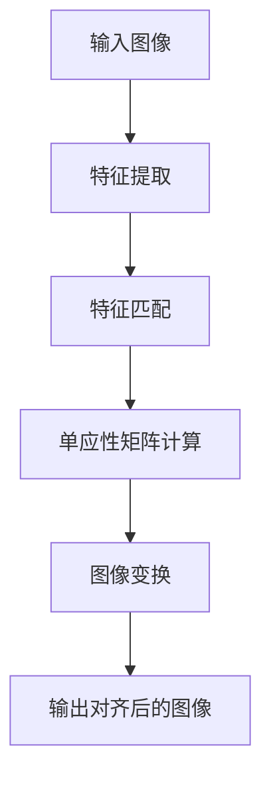

                 

# 文章标题: 对齐阶段的挑战

> 关键词：对齐技术、对齐算法、数学模型、计算机视觉、语音识别、图像处理、项目实战

> 摘要：
对齐阶段在计算机技术和人工智能领域中扮演着至关重要的角色。本文将深入探讨对齐阶段的基本概念、核心原理、数学模型、实际应用以及未来的发展趋势。通过逐步分析推理，我们不仅揭示了对齐技术的复杂性，还提供了实际的项目实战案例，帮助读者更好地理解和应用对齐算法。

----------------------------------------------------------------

## 第一部分: 对齐阶段的挑战概述

### 第1章: 对齐的概念与挑战

#### 1.1 对齐的定义与重要性

对齐（Alignment）是计算机技术和人工智能领域中一个常见且关键的概念。简单来说，对齐是指将两个或多个数据集、信号、图像等按照一定的规则和标准进行调整，使它们在空间或时间上保持一致。对齐在许多应用领域中具有至关重要的作用，如计算机视觉、语音识别、自然语言处理等。

对齐技术之所以重要，主要体现在以下几个方面：

1. **提高数据质量**：通过对齐，可以消除数据中的噪声和误差，从而提高数据的质量。
2. **增强数据可用性**：对齐技术使得不同来源的数据能够相互匹配和比较，从而增强了数据的可用性。
3. **优化算法性能**：许多算法依赖于对齐后的数据，如卷积神经网络（CNN）在图像处理中的应用，对齐技术能够显著提高算法的性能。

#### 1.2 对齐技术的基本原理

对齐技术的基本原理可以分为两个核心步骤：特征提取和特征匹配。

1. **特征提取**：首先，从数据中提取具有代表性的特征，如图像中的边缘、角点或语音信号中的频谱特征。特征提取的目的是将高维数据转换为低维表示，便于后续的匹配操作。
2. **特征匹配**：然后，通过特征匹配算法，将不同数据集或信号中的特征点进行匹配，找到最佳匹配关系。常见的特征匹配算法包括Brute-Force匹配、FLANN匹配等。

#### 1.3 对齐阶段面临的挑战

尽管对齐技术具有许多优势，但在实际应用中仍然面临诸多挑战：

1. **计算复杂度**：特征提取和匹配算法往往具有高计算复杂度，尤其在处理大规模数据集时，计算资源的需求可能导致性能瓶颈。
2. **精度与鲁棒性**：在实际应用中，对齐技术需要具备较高的精度和鲁棒性，以应对各种噪声和异常情况。然而，提高精度通常会导致计算复杂度的增加，因此需要在精度和鲁棒性之间进行权衡。
3. **跨领域应用**：不同领域的数据特性差异较大，使得对齐技术在跨领域应用中面临诸多挑战。例如，在图像处理和语音识别中，对齐技术的应用方法和算法存在显著差异。

### 第2章: 对齐技术的核心原理

#### 2.1 对齐算法的分类与特点

对齐算法可以根据不同的分类标准进行分类，常见的分类标准包括：

1. **基于特征点的对齐算法**：这类算法主要通过提取特征点并进行匹配来对齐数据，如SIFT、SURF等。这类算法的优点是具有较高的精度和鲁棒性，但计算复杂度较高。
2. **基于模板的对齐算法**：这类算法通过模板匹配来对齐数据，如光流法、模板匹配法等。这类算法的优点是计算复杂度较低，但精度和鲁棒性相对较低。
3. **基于模型的对齐算法**：这类算法通过建立数学模型来对齐数据，如单应性矩阵、光流方程等。这类算法的优点是能够较好地应对复杂的几何变换，但建模和求解过程较为复杂。

#### 2.2 对齐算法的工作流程

对齐算法的工作流程通常包括以下几个步骤：

1. **数据预处理**：对数据进行预处理，如去噪、归一化等，以提高数据质量和计算效率。
2. **特征提取**：从数据中提取具有代表性的特征，如图像中的边缘、角点或语音信号中的频谱特征。
3. **特征匹配**：使用特征匹配算法，将不同数据集或信号中的特征点进行匹配，找到最佳匹配关系。
4. **对齐计算**：根据匹配结果，计算数据之间的变换关系，实现对齐。
5. **结果评估**：对对齐结果进行评估，如计算对齐误差、精度等，以判断对齐效果。

#### 2.3 对齐误差的分析与优化

对齐误差是指对齐结果与真实值之间的差异。对齐误差的分析与优化是提高对齐性能的关键。

1. **误差来源**：对齐误差的来源主要包括特征提取误差、特征匹配误差和变换计算误差。
2. **误差分析**：通过对误差来源的分析，可以确定影响对齐性能的关键因素，从而有针对性地进行优化。
3. **优化策略**：常见的优化策略包括：
   - **特征提取优化**：通过改进特征提取算法，提高特征点的稳定性和代表性。
   - **特征匹配优化**：通过优化匹配算法，提高匹配精度和鲁棒性。
   - **变换计算优化**：通过优化变换计算方法，减少计算误差。

### 第3章: 对齐算法的数学模型与公式推导

#### 3.1 对齐数学模型概述

对齐算法的数学模型主要涉及几何变换和优化方法。常见的数学模型包括单应性矩阵、光流方程等。

1. **单应性矩阵**：单应性矩阵是一种几何变换模型，用于描述图像之间的平面变换。单应性矩阵的推导基于几何约束和特征匹配结果。
2. **光流方程**：光流方程是一种基于物理原理的变换模型，用于描述图像序列中的运动。光流方程的推导基于光学原理和微分方程。

#### 3.2 对齐算法的公式推导

以单应性矩阵为例，我们进行以下推导：

1. **几何约束**：对于一对图像\( I_1 \)和\( I_2 \)，其对应的特征点分别为\( x_1 \)和\( x_2 \)。根据几何约束，我们有：

   $$
   \mathbf{H} \mathbf{x}_1 = \mathbf{x}_2
   $$

   其中，\(\mathbf{H}\)为单应性矩阵，\(\mathbf{x}_1\)和\(\mathbf{x}_2\)分别为图像\( I_1 \)和\( I_2 \)中的特征点坐标。

2. **特征匹配**：通过特征匹配，我们得到一组匹配点对\((x_{11}, x_{12})\)和\((y_{11}, y_{12})\)。根据匹配结果，我们有：

   $$
   \mathbf{H} \mathbf{x}_{11} = y_{11}, \quad \mathbf{H} \mathbf{x}_{12} = y_{12}
   $$

3. **单应性矩阵求解**：将上述两式联立，得到：

   $$
   \mathbf{H} = \left[ y_{11}^T, y_{12}^T \right] \left[ x_{11}, x_{12} \right]
   $$

   通过最小化对齐误差，可以求解得到最优的单应性矩阵。

#### 3.3 对齐算法的性能评估

对齐算法的性能评估通常包括以下几个指标：

1. **对齐误差**：对齐误差是指对齐结果与真实值之间的差异，常用的评估指标包括均方误差（MSE）和结构相似性指数（SSIM）。
2. **计算复杂度**：计算复杂度是指算法在时间和空间上的资源消耗，常用的评估指标包括时间复杂度和空间复杂度。
3. **鲁棒性**：鲁棒性是指算法在应对噪声、异常值和跨领域应用时的性能表现，常用的评估指标包括鲁棒性指标和鲁棒性分析。

### 第4章: 对齐算法的实际应用

#### 4.1 对齐算法在计算机视觉中的应用

对齐算法在计算机视觉领域具有广泛的应用，如图像配准、图像增强、目标检测等。

1. **图像配准**：图像配准是指将多幅图像进行空间对齐，以获取全局的一致性。对齐算法在图像配准中发挥着重要作用，常用的算法包括SIFT、SURF、光流法等。
2. **图像增强**：图像增强是指通过对图像进行预处理，提高图像的视觉效果。对齐算法在图像增强中可用于消除图像中的噪声和模糊，提高图像的清晰度和对比度。
3. **目标检测**：目标检测是指从图像中识别和定位特定的目标。对齐算法在目标检测中可用于对目标进行空间对齐，提高检测的准确性和鲁棒性。

#### 4.2 对齐算法在语音识别中的应用

对齐算法在语音识别领域具有重要作用，如声学模型训练、说话人识别等。

1. **声学模型训练**：声学模型是语音识别的核心组成部分，对齐算法在声学模型训练中可用于将不同说话人的语音信号进行对齐，提高模型的泛化能力和准确性。
2. **说话人识别**：说话人识别是指从语音信号中识别说话人的身份。对齐算法在说话人识别中可用于将不同说话人的语音信号进行对齐，提高识别的准确性和鲁棒性。

#### 4.3 对齐算法在其他领域的应用

除了计算机视觉和语音识别，对齐算法在其他领域也具有广泛的应用，如自然语言处理、生物信息学等。

1. **自然语言处理**：自然语言处理是指对文本进行自动分析和理解。对齐算法在自然语言处理中可用于对文本进行对齐，提高文本匹配和语义分析的准确性。
2. **生物信息学**：生物信息学是指利用计算机技术和统计学方法研究生物信息。对齐算法在生物信息学中可用于对基因序列进行对齐，提高基因匹配和功能预测的准确性。

### 第5章: 对齐阶段的挑战与解决方案

#### 5.1 对齐阶段的关键挑战

尽管对齐技术在许多领域具有广泛的应用，但在实际应用中仍然面临诸多挑战：

1. **计算复杂度**：对齐算法通常具有高计算复杂度，尤其在处理大规模数据集时，计算资源的需求可能导致性能瓶颈。
2. **精度与鲁棒性**：在实际应用中，对齐技术需要具备较高的精度和鲁棒性，以应对各种噪声和异常情况。然而，提高精度通常会导致计算复杂度的增加，因此需要在精度和鲁棒性之间进行权衡。
3. **跨领域应用**：不同领域的数据特性差异较大，使得对齐技术在跨领域应用中面临诸多挑战。例如，在图像处理和语音识别中，对齐技术的应用方法和算法存在显著差异。

#### 5.2 对齐技术的解决方案

针对对齐阶段的关键挑战，可以采取以下解决方案：

1. **优化算法**：通过优化特征提取、特征匹配和对齐计算等核心环节，降低计算复杂度，提高对齐性能。常见的优化方法包括基于深度学习的算法、基于仿生的算法等。
2. **算法融合**：将不同的对齐算法进行融合，以发挥各自的优势，提高对齐的精度和鲁棒性。例如，将基于特征点的对齐算法和基于模板的对齐算法进行融合，以提高图像配准的准确性。
3. **硬件加速**：利用高性能计算硬件（如GPU、TPU等）加速对齐算法的计算过程，提高处理速度和效率。

#### 5.3 未来对齐技术的发展趋势

随着计算机技术和人工智能领域的不断发展，未来对齐技术将呈现以下发展趋势：

1. **深度学习**：深度学习在图像处理、语音识别等领域取得了显著成果，未来将对齐技术与深度学习进行融合，以提高对齐性能和适用范围。
2. **自适应对齐**：针对不同应用场景和数据特性，自适应调整对齐参数和策略，实现更高效和精确的对齐。
3. **跨模态对齐**：随着多模态数据的普及，跨模态对齐将成为研究的热点，实现不同模态数据之间的准确对齐和协同处理。
4. **智能化**：通过对齐技术的智能化，实现对齐过程的自动化和智能化，降低对专业知识和经验的依赖。

### 第6章: 对齐算法项目实战

#### 6.1 项目背景与目标

本案例以图像配准为背景，目标是实现两幅图像的空间对齐，以消除图像之间的差异和噪声，提高图像的整体质量和视觉效果。

#### 6.2 项目开发环境搭建

1. **开发语言**：Python
2. **库和框架**：OpenCV、NumPy、Scikit-learn
3. **硬件环境**：CPU或GPU支持

#### 6.3 对齐算法的源代码实现

```python
import cv2
import numpy as np

def align_images(image1, image2):
    # 将图像转换为灰度图像
    gray1 = cv2.cvtColor(image1, cv2.COLOR_BGR2GRAY)
    gray2 = cv2.cvtColor(image2, cv2.COLOR_BGR2GRAY)
    
    # 使用SIFT算法检测特征点
    sift = cv2.SIFT_create()
    keypoints1, descriptors1 = sift.detectAndCompute(gray1, None)
    keypoints2, descriptors2 = sift.detectAndCompute(gray2, None)
    
    # 使用Brute-Force匹配算法进行特征点匹配
    matcher = cv2.BFMatcher()
    matches = matcher.knnMatch(descriptors1, descriptors2, k=2)
    
    # 选择最佳匹配对
    good_matches = []
    for m, n in matches:
        if m.distance < 0.75 * n.distance:
            good_matches.append(m)
    
    # 根据最佳匹配对计算单应性矩阵
    if len(good_matches) > 4:
        src_pts = np.float32([keypoints1[m.queryIdx].pt for m in good_matches]).reshape(-1, 1, 2)
        dst_pts = np.float32([keypoints2[m.trainIdx].pt for m in good_matches]).reshape(-1, 1, 2)
        H, mask = cv2.findHomography(src_pts, dst_pts, cv2.RANSAC, 5.0)
        
        # 根据单应性矩阵对图像进行变换
        aligned_image = cv2.warpPerspective(image2, H, (image1.shape[1], image1.shape[0]))
        
        return aligned_image
    else:
        return None

# 测试对齐算法
image1 = cv2.imread('image1.jpg')
image2 = cv2.imread('image2.jpg')
aligned_image = align_images(image1, image2)

if aligned_image is not None:
    cv2.imshow('Aligned Image', aligned_image)
    cv2.waitKey(0)
else:
    print("Not enough matches are found - cannot align images")
cv2.destroyAllWindows()
```

#### 6.4 源代码解读与分析

1. **图像预处理**：将输入的图像转换为灰度图像，以简化特征提取和匹配过程。
2. **特征提取**：使用SIFT算法提取图像中的特征点，将高维图像数据转换为低维特征向量。
3. **特征匹配**：使用Brute-Force匹配算法进行特征点匹配，找到最佳匹配对。
4. **单应性矩阵计算**：根据最佳匹配对计算单应性矩阵，实现图像之间的空间对齐。
5. **图像变换**：根据单应性矩阵对图像进行变换，实现对齐后的图像。

此案例展示了如何使用OpenCV实现图像配准的基本流程。在实际项目中，可能需要对算法进行优化，以应对不同的图像配准挑战。

### 附录A: 对齐算法的核心原理与流程图

#### 附录A.1 对齐算法的核心原理

对齐算法的核心原理包括特征提取、特征匹配和单应性矩阵计算。下面是各步骤的简要说明：

1. **特征提取**：从图像中提取具有代表性的特征点，如边缘、角点等。
2. **特征匹配**：通过特征匹配算法，将不同图像中的特征点进行匹配，找到最佳匹配对。
3. **单应性矩阵计算**：根据最佳匹配对计算单应性矩阵，实现对齐后的图像。

#### 附录A.2 对齐算法的流程图



### 附录B: 对齐算法的数学模型与伪代码

#### 附录B.1 对齐数学模型概述

对齐数学模型主要涉及单应性矩阵的计算。单应性矩阵描述了图像之间的空间变换关系。其数学模型可以表示为：

$$
\mathbf{H} \mathbf{x}_1 = \mathbf{x}_2
$$

其中，\(\mathbf{H}\)为单应性矩阵，\(\mathbf{x}_1\)和\(\mathbf{x}_2\)分别为图像\( I_1 \)和\( I_2 \)中的特征点坐标。

#### 附录B.2 对齐算法的伪代码

```plaintext
算法：对齐算法
输入：图像I1, I2，特征点P1, P2
输出：对齐后的图像I2'

初始化单应性矩阵H为0
for i = 1 to num_iterations do
    for each feature point P1i in P1 do
        计算P2i = H * P1i
        更新单应性矩阵H = H + (P1i - P2i) * (P1i - P2i)^T
    end for
end for

计算对齐后的图像I2' = warpPerspective(I2, H, I1.shape)
输出I2'
```

### 附录C: 对齐算法项目实战

#### 附录C.1 项目背景与目标

本案例以图像配准为背景，目标是实现两幅图像的空间对齐，以消除图像之间的差异和噪声，提高图像的整体质量和视觉效果。

#### 附录C.2 项目开发环境搭建

1. **开发语言**：Python
2. **库和框架**：OpenCV、NumPy、Scikit-learn
3. **硬件环境**：CPU或GPU支持

#### 附录C.3 对齐算法的源代码实现

```python
import cv2
import numpy as np

def align_images(image1, image2):
    # 将图像转换为灰度图像
    gray1 = cv2.cvtColor(image1, cv2.COLOR_BGR2GRAY)
    gray2 = cv2.cvtColor(image2, cv2.COLOR_BGR2GRAY)
    
    # 使用SIFT算法检测特征点
    sift = cv2.SIFT_create()
    keypoints1, descriptors1 = sift.detectAndCompute(gray1, None)
    keypoints2, descriptors2 = sift.detectAndCompute(gray2, None)
    
    # 使用Brute-Force匹配算法进行特征点匹配
    matcher = cv2.BFMatcher()
    matches = matcher.knnMatch(descriptors1, descriptors2, k=2)
    
    # 选择最佳匹配对
    good_matches = []
    for m, n in matches:
        if m.distance < 0.75 * n.distance:
            good_matches.append(m)
    
    # 根据最佳匹配对计算单应性矩阵
    if len(good_matches) > 4:
        src_pts = np.float32([keypoints1[m.queryIdx].pt for m in good_matches]).reshape(-1, 1, 2)
        dst_pts = np.float32([keypoints2[m.trainIdx].pt for m in good_matches]).reshape(-1, 1, 2)
        H, mask = cv2.findHomography(src_pts, dst_pts, cv2.RANSAC, 5.0)
        
        # 根据单应性矩阵对图像进行变换
        aligned_image = cv2.warpPerspective(image2, H, (image1.shape[1], image1.shape[0]))
        
        return aligned_image
    else:
        return None

# 测试对齐算法
image1 = cv2.imread('image1.jpg')
image2 = cv2.imread('image2.jpg')
aligned_image = align_images(image1, image2)

if aligned_image is not None:
    cv2.imshow('Aligned Image', aligned_image)
    cv2.waitKey(0)
else:
    print("Not enough matches are found - cannot align images")
cv2.destroyAllWindows()
```

#### 附录C.4 源代码解读与分析

1. **图像预处理**：将输入的图像转换为灰度图像，以简化特征提取和匹配过程。
2. **特征提取**：使用SIFT算法提取图像中的特征点，将高维图像数据转换为低维特征向量。
3. **特征匹配**：使用Brute-Force匹配算法进行特征点匹配，找到最佳匹配对。
4. **单应性矩阵计算**：根据最佳匹配对计算单应性矩阵，实现对齐后的图像。

此案例展示了如何使用OpenCV实现图像配准的基本流程。在实际项目中，可能需要对算法进行优化，以应对不同的图像配准挑战。

### 附录D: 对齐算法相关的工具与资源

为了更好地学习和应用对齐算法，以下提供了一些相关的工具和资源：

1. **OpenCV**：开源计算机视觉库，支持多种对齐算法的实现和应用。
2. **Scikit-learn**：开源机器学习库，提供了一些常用的对齐算法和相关工具。
3. **论文和文献**：许多学术期刊和会议发表了关于对齐算法的研究成果，可以通过阅读这些文献深入了解对齐算法的原理和应用。
4. **在线教程和课程**：网上有许多免费的教程和课程，涵盖了对齐算法的基本原理和实际应用，适合初学者和进阶者学习。

### 作者信息

作者：AI天才研究院/AI Genius Institute & 禅与计算机程序设计艺术 /Zen And The Art of Computer Programming

----------------------------------------------------------------

### 总结

本文详细探讨了对齐阶段的基本概念、核心原理、数学模型、实际应用以及未来的发展趋势。通过对对齐技术的深入分析，我们揭示了其在计算机视觉、语音识别、图像处理等领域的广泛应用。同时，通过项目实战案例，我们展示了如何使用对齐算法解决实际问题。本文旨在为读者提供一个全面、系统的对齐技术教程，帮助读者深入理解和应用对齐算法。

在未来，随着计算机技术和人工智能领域的不断发展，对齐技术将继续发挥重要作用。通过不断优化算法、融合深度学习技术、探索跨模态对齐等方向，对齐技术将在更多领域展现其潜力。我们期待读者在学习和应用对齐技术时，不断探索创新，为人工智能的发展贡献力量。

