                 

# 工业革命后的经济爆发期分析

## 关键词
- 工业革命
- 经济增长
- 技术创新
- 国际贸易
- 金融体系
- 劳动力市场
- 全球化

## 摘要
本文旨在分析工业革命后经济爆发期的背景、技术创新、国际贸易、金融体系、劳动力市场以及社会经济影响等多个方面。通过逐步推理和深入分析，揭示工业革命对全球经济体系的深远影响，以及其对当代经济的启示。

### 第一部分: 工业革命后的经济变革

#### 第1章: 工业革命后的经济结构变化

##### 1.1 工业革命的定义与影响

**工业革命的定义**：
工业革命是指18世纪末至19世纪初，英国从传统的农业社会向工业社会转变的历史过程。这一转变的主要特征是机械化生产取代了手工劳动，蒸汽动力取代了人力和动物动力，从而大幅提高了生产效率。

**工业革命的影响**：
工业革命引发了深远的社会、经济和技术变革。首先，它大幅提升了生产效率，使得商品生产变得更加快速和廉价。其次，工业革命促进了城市化进程，大量农村人口涌入城市，为工业提供了劳动力资源。此外，工业革命还推动了全球贸易的发展，为世界经济的全球化奠定了基础。

**工业革命的经济影响**：
1. **生产效率的提升**：机械化生产使得生产效率大幅提升，商品生产成本降低，市场供应增加。
2. **劳动力市场变化**：工业化带来了劳动力市场的变革，劳动力从农村向城市转移，形成了新的劳动力市场结构。
3. **全球贸易的发展**：工业革命促进了全球贸易的发展，欧洲成为世界贸易的中心，国际贸易额迅速增长。
4. **经济结构的转变**：工业革命后，经济结构从以农业为主转向以工业为主，工业在国民经济中的比重逐渐增加。

**图1-1 工业革命后的经济结构变化**
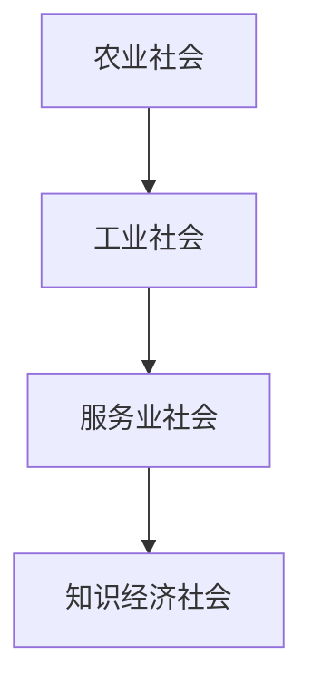

##### 1.2 工业革命后的经济体系

**市场经济体系的形成**：
工业革命后，市场经济体系逐渐取代了封建经济体系。市场经济强调自由竞争和自由贸易，政府干预经济活动的程度大幅降低。

**资本主义经济体系的崛起**：
工业革命后，资本主义经济体系逐渐崛起。资本主义强调生产资料的私有制和资本积累，资本家通过投资和生产获取利润。

**图1-2 工业革命后的经济体系演变**
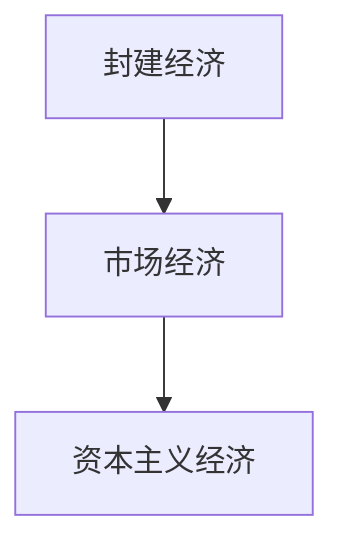

**经济全球化的趋势**：
工业革命后，经济全球化趋势开始显现。各国之间的贸易和资本流动增加，国际分工和全球价值链逐渐形成。

#### 第2章: 工业革命后的技术创新与扩散

##### 2.1 主要技术创新

**蒸汽机的发明**：
蒸汽机的发明是工业革命的标志性技术。它通过将热能转化为机械能，极大地提高了生产效率。蒸汽机的应用使得大规模机械化生产成为可能。

**纺织机械的发明**：
纺织机械的发明和改进，使得纺织业生产效率大幅提升。纺织机械的自动化程度提高，生产成本降低，纺织品供应增加。

**铁路和蒸汽船的发展**：
铁路和蒸汽船的发展极大地缩短了货物运输时间，促进了国际贸易的发展。铁路网络的建设使得商品可以更快地从产地运送到市场，蒸汽船则使得国际贸易更加便捷。

**图2-1 工业革命的主要技术创新**
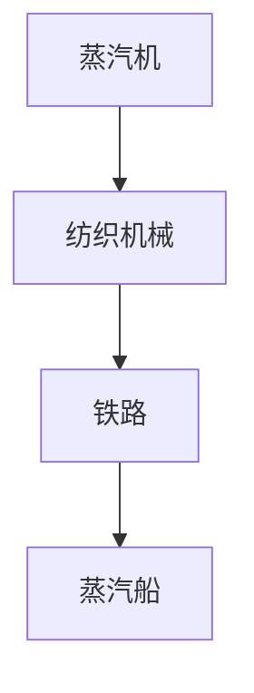

##### 2.2 技术创新扩散

**国内扩散**：
工业革命的技术创新首先在英国国内迅速扩散。蒸汽机和纺织机械的应用使得生产效率大幅提升，各地的工业化进程加速。

**国际扩散**：
英国的技术创新逐渐传播到欧洲大陆和美洲，推动了全球经济的快速发展。欧洲大陆国家纷纷引进英国的技术，进行工业化改造。美洲大陆则通过殖民扩张，将英国的技术引入到自己的经济体系中。

**图2-2 技术创新的国际扩散**
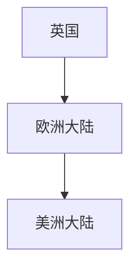

##### 2.3 技术创新对经济的影响

**生产效率的提升**：
技术创新是提高生产效率的重要手段。蒸汽机和纺织机械的应用使得生产效率大幅提升，生产成本降低。

**经济增长的推动**：
技术创新是经济增长的重要驱动力。通过提高生产效率和降低成本，技术创新促进了商品的大规模生产和流通，从而推动了经济的快速发展。

### 第二部分: 工业革命后的国际贸易与全球化

#### 第3章: 工业革命后的国际贸易增长

##### 3.1 自由贸易政策的兴起

**自由贸易政策的定义**：
自由贸易政策是指政府取消对国际贸易的限制，降低关税，允许商品和服务自由流动。自由贸易政策是工业革命后，英国等西方国家推动国际贸易的重要手段。

**自由贸易政策的影响**：
自由贸易政策的实施，降低了贸易壁垒，促进了国际贸易的发展。通过国际贸易，各国可以充分发挥各自的比较优势，实现资源的最佳配置。

**图3-1 自由贸易政策的影响**
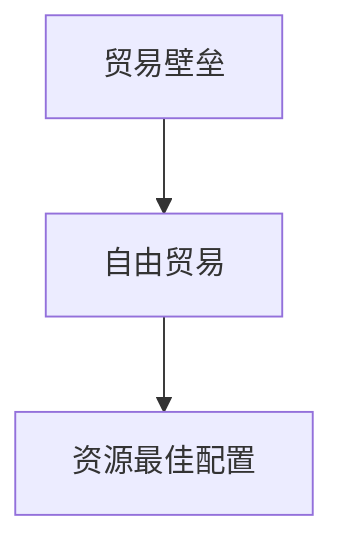

##### 3.2 国际贸易体系的形成

**国际贸易体系的定义**：
国际贸易体系是指各国通过贸易协议和规则，实现商品和服务的跨国流动的体系。国际贸易体系是全球化的重要组成部分。

**国际贸易体系的影响**：
国际贸易体系的形成，为全球贸易提供了规则和框架。通过国际贸易体系，各国可以更加稳定和公平地进行贸易活动，促进了全球经济的快速发展。

**图3-2 国际贸易体系的影响**
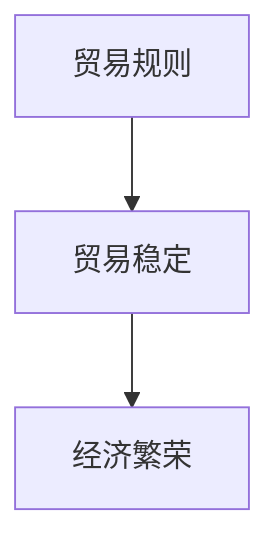

##### 3.3 国际贸易对经济的影响

**经济增长的推动**：
国际贸易是推动经济增长的重要力量。通过国际贸易，各国可以发挥各自的比较优势，实现资源的最佳配置，提高生产效率。

**生产效率的提升**：
国际贸易促进了技术创新和扩散。通过国际贸易，各国可以引进先进的技术和设备，提高生产效率，降低生产成本。

**图3-3 国际贸易对经济的影响**
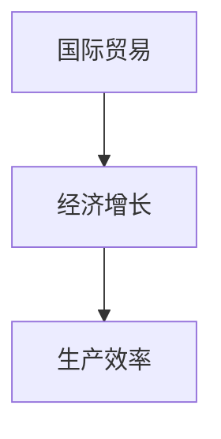

#### 第4章: 工业革命后的金融体系演变

##### 4.1 股票市场的兴起

**股票市场的定义**：
股票市场是指股份公司通过发行股票筹集资本的市场。股票市场的出现，为企业和投资者提供了新的融资渠道。

**股票市场的功能**：
1. **融资功能**：股票市场为企业提供了筹集资金的重要途径，企业可以通过发行股票筹集资本，扩大生产规模。
2. **投资功能**：股票市场为投资者提供了投资渠道，投资者可以通过购买股票获得资本收益。

**股票市场的影响**：
股票市场的兴起，促进了资本的集中和流通，为经济发展提供了强大的动力。股票市场的存在，使得企业可以更加便捷地获得资金，提高了生产效率。

**图4-1 股票市场的兴起**
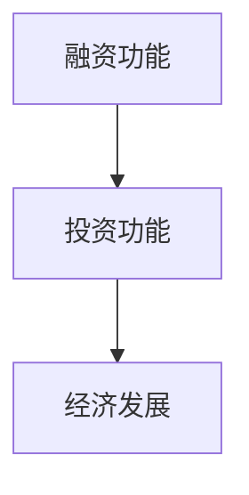

##### 4.2 银行体系的演变

**商业银行的崛起**：
商业银行在工业革命后迅速发展，成为经济活动的重要支柱。商业银行通过吸收存款，发放贷款，为经济发展提供了资金支持。

**银行体系的职能**：
1. **支付结算**：银行体系为经济活动提供了支付结算服务，使得货币流通更加便捷。
2. **信贷服务**：银行体系通过发放贷款，支持了企业的生产和投资活动。

**银行体系的影响**：
银行体系的发展，提高了资本的利用效率，促进了经济的快速发展。银行体系的存在，使得企业可以更加便捷地获得资金支持，提高了生产效率。

**图4-2 银行体系的演变**
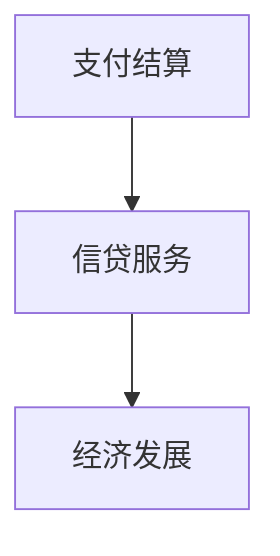

##### 4.3 金融体系对经济的影响

**资本积累**：
金融体系为经济发展提供了资本积累的渠道。通过筹集和分配资金，金融体系支持了工业化进程，推动了经济的快速发展。

**经济发展**：
金融体系的发展，促进了经济的快速发展。通过提供资金支持和支付结算服务，金融体系为经济发展提供了强大的动力。

**图4-3 金融体系对经济的影响**
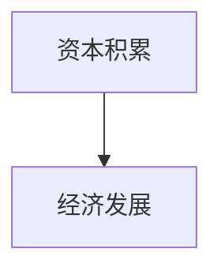

### 第三部分: 工业革命后的劳动力市场变化

#### 第5章: 工业革命后的劳动力市场变化

##### 5.1 劳动力市场的形成

**劳动力市场的定义**：
劳动力市场是指劳动力供求的场所，劳动者通过劳动力市场与企业之间建立劳动关系。

**劳动力市场的功能**：
1. **劳动力配置**：劳动力市场通过供求关系，实现了劳动力的合理配置，提高了生产效率。
2. **劳动力流动**：劳动力市场为劳动者提供了就业机会，同时为企业提供了劳动力资源，促进了劳动力的流动。

**劳动力市场的特点**：
1. **流动性**：劳动力市场具有较高的流动性，劳动者可以在不同行业和企业之间流动，寻找更好的工作机会。
2. **竞争性**：劳动力市场具有竞争性，劳动者的工资水平取决于其技能和市场需求。

**图5-1 劳动力市场的特点**
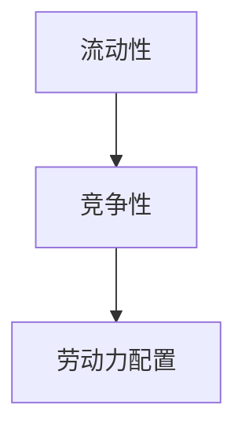

##### 5.2 劳动力市场的特点

**劳动力的供求关系**：
劳动力市场是劳动力供求关系的反映。在劳动力市场中，企业是需求方，劳动者是供给方。供求关系的变化会影响劳动力的价格和就业状况。

**劳动力的技能结构**：
劳动力市场的技能结构随着工业革命的推进发生了显著变化。从传统的手工业向机械化、自动化转变，劳动者的技能需求也发生了变化，对技术工人和专业人才的需求增加。

**图5-2 劳动力市场的供求关系和技能结构**
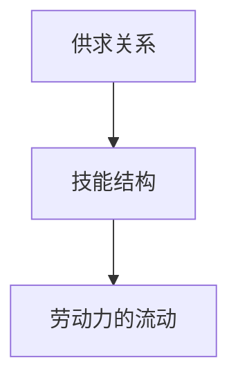

##### 5.3 劳动力市场对经济的影响

**生产效率**：
劳动力市场的发展促进了生产效率的提升。通过劳动力的合理配置和流动，企业可以找到最合适的劳动力，提高生产效率。

**经济增长**：
劳动力市场的发展为经济增长提供了动力。通过劳动力的培养和流动，企业可以不断创新和提高竞争力，推动经济的快速发展。

**图5-3 劳动力市场对经济的影响**
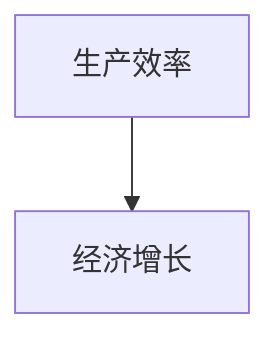

### 第四部分: 工业革命后的社会经济影响

#### 第6章: 工业革命后的城市化进程

##### 6.1 城市化的定义与影响

**城市化的定义**：
城市化是指人口从农村向城市迁移的过程，城市成为工业和服务业的主要聚集地。

**城市化的影响**：
1. **经济影响**：城市化促进了经济的发展，城市成为工业和服务业的重要中心，吸引了大量的资本和劳动力。
2. **社会影响**：城市化改变了社会结构，城市人口比例增加，生活方式和价值观念发生变化。
3. **环境影响**：城市化带来了城市环境问题，如污染、交通拥堵等，需要采取相应的环境保护措施。

**图6-1 城市化的影响**
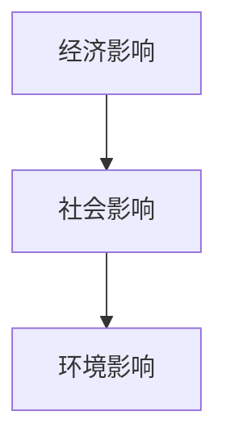

##### 6.2 社会结构的变革

**工业资产阶级的崛起**：
工业革命后，工业资产阶级迅速崛起，成为社会的主要阶级力量。工业资产阶级通过掌握生产资料，获得了巨大的经济利益和社会地位。

**工人阶级的形成**：
随着工业革命的推进，工人阶级逐渐形成，成为工业生产的重要力量。工人阶级通过团结和斗争，争取自身的权益，推动了社会的进步。

**图6-2 社会结构的变革**
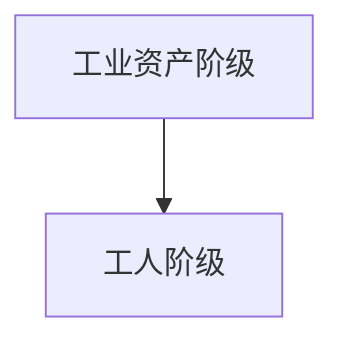

##### 6.3 社会福利制度的建立

**社会福利制度的定义**：
社会福利制度是政府为保障公民基本生活权利而建立的制度，包括社会保障、医疗保险、失业救济等。

**社会福利制度的影响**：
社会福利制度的建立，提高了人民的生活水平，减少了社会不平等现象，促进了社会的稳定和发展。

**图6-3 社会福利制度的影响**
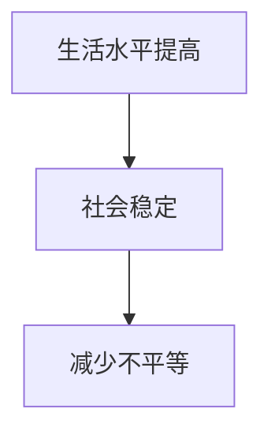

### 第五部分: 工业革命后的经济理论发展

#### 第7章: 工业革命与经济学理论的关系

##### 7.1 经济学理论的演变

**古典经济学**：
古典经济学强调自由竞争和市场机制的作用，主张政府对经济的干预应尽量减少。古典经济学的重要代表人物有亚当·斯密和大卫·李嘉图。

**新古典经济学**：
新古典经济学在古典经济学的基础上，进一步探讨了市场机制的不完善和市场失灵问题，提出了政府干预的理论基础。新古典经济学的重要代表人物有马歇尔和庇古。

**现代经济学**：
现代经济学在古典经济学和新古典经济学的基础上，继续发展，探讨了更多复杂的经济问题，如经济增长、通货膨胀、失业等。现代经济学的重要代表人物有凯恩斯和索洛。

**图7-1 经济学理论的演变**
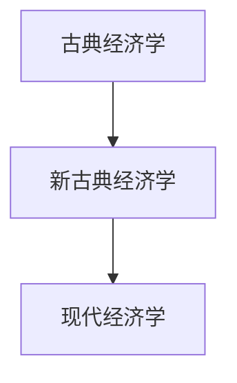

##### 7.2 主要经济学理论的介绍

**古典经济学**：
古典经济学主张自由竞争和市场机制的作用。其核心理论包括劳动价值论、比较优势理论和国际分工理论。

**新古典经济学**：
新古典经济学强调市场机制的有效性，同时认识到市场失灵的问题。其核心理论包括价格机制、边际效用理论和一般均衡理论。

**现代经济学**：
现代经济学在古典经济学和新古典经济学的基础上，进一步探讨了复杂的经济问题。其核心理论包括宏观经济政策、经济增长理论和经济发展理论。

**图7-2 主要经济学理论的介绍**
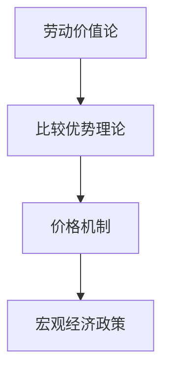

##### 7.3 经济学理论对经济发展的指导意义

**政策制定**：
经济学理论为政府制定经济政策提供了理论依据。通过经济学理论，政府可以更好地理解经济运行的规律，制定有效的经济政策。

**企业发展**：
经济学理论为企业提供了解决经济问题的方法和策略。通过经济学理论，企业可以更好地理解市场需求，优化资源配置，提高竞争力。

**图7-3 经济学理论对经济发展的指导意义**
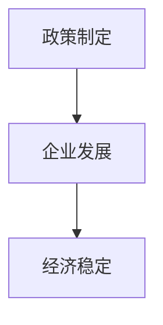

### 第六部分: 工业革命后的经济挑战与未来展望

#### 第8章: 工业革命后的经济挑战

##### 8.1 资源短缺

**资源短缺的定义**：
资源短缺是指人类对自然资源的消耗速度超过资源的再生速度，导致资源供应不足以满足需求。

**资源短缺的原因**：
1. **人口增长**：全球人口持续增长，对资源的需求不断上升。
2. **技术限制**：现有技术的限制使得资源的利用效率不高，难以满足日益增长的需求。
3. **环境破坏**：过度开采和环境污染导致资源枯竭。

**应对策略**：
1. **技术创新**：通过科技创新，提高资源利用效率，减少资源浪费。
2. **可持续利用**：推动资源的可持续利用，建立资源节约型社会。

**图8-1 资源短缺的应对策略**
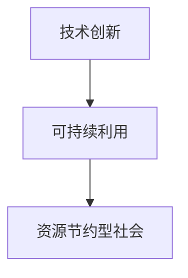

##### 8.2 环境污染

**环境污染的定义**：
环境污染是指环境中的有毒有害物质超过环境的自净能力，对人类和其他生物造成危害。

**环境污染的原因**：
1. **工业生产**：工业生产过程中产生的废气、废水和固体废物对环境造成污染。
2. **交通运输**：交通运输过程中产生的尾气和噪音对环境造成污染。
3. **农业活动**：农业活动中的农药和化肥对土壤和水体造成污染。

**应对策略**：
1. **环保法规**：制定严格的环保法规，限制污染物的排放。
2. **清洁生产**：推广清洁生产技术，减少工业生产过程中的污染物排放。
3. **环境治理**：对受污染的环境进行治理和修复，恢复生态平衡。

**图8-2 环境污染的应对策略**
```mermaid
graph TD
    A[环保法规] --> B[清洁生产]
    B --> C[环境治理]
```

#### 第9章: 工业革命后的全球经济体系演变

##### 9.1 全球经济体系的演变

**全球经济一体化的趋势**：
全球经济一体化的趋势日益明显，各国之间的经济联系日益紧密。全球经济一体化体现在国际贸易、资本流动、技术交流等多个方面。

**全球经济体系的结构**：
全球经济体系由发达国家和发展中国家组成。发达国家在全球经济体系中占据主导地位，而发展中国家则在全球经济中扮演重要角色。

**图9-1 全球经济体系的结构**
```mermaid
graph TD
    A[发达国家] --> B[发展中国家]
    B --> C[全球经济一体化]
```

##### 9.2 全球经济体系的影响

**经济增长**：
全球经济体系促进了全球经济的快速增长。通过国际贸易和投资，各国可以实现资源的最佳配置，提高生产效率，推动经济增长。

**经济竞争**：
全球经济体系也带来了经济竞争。各国为了在国际市场中占据有利地位，需要提高自身的竞争力，推动技术创新和产业升级。

**图9-2 全球经济体系的影响**
```mermaid
graph TD
    A[经济增长] --> B[经济竞争]
    B --> C[技术创新]
```

### 第七部分: 工业革命后的经济地理分布

#### 第10章: 工业革命后的经济地理分布变化

##### 10.1 经济地理分布的定义与变化

**经济地理分布的定义**：
经济地理分布是指经济活动在地理空间上的分布情况，包括产业分布、人口分布和资源分布等。

**工业革命后的经济地理分布变化**：
工业革命后，经济地理分布发生了显著变化。从以农村为主转向以城市为主，从单一国家经济转向跨国经济。城市化进程加速，城市成为工业和服务业的主要聚集地，国际分工和全球价值链逐渐形成。

**图10-1 工业革命后的经济地理分布变化**
```mermaid
graph TD
    A[农村经济] --> B[城市经济]
    B --> C[跨国经济]
```

##### 10.2 经济地理分布的影响

**经济发展**：
经济地理分布的变化促进了经济的发展。城市化进程提高了生产效率，城市成为经济发展的中心。跨国经济通过国际贸易和投资，促进了全球资源的最佳配置，提高了生产效率。

**社会结构**：
经济地理分布的变化也影响了社会结构。城市化进程加速，人口从农村向城市迁移，社会阶层结构发生变化。跨国经济带来了文化交流和融合，改变了人们的价值观念和生活方式。

**图10-2 经济地理分布的影响**
```mermaid
graph TD
    A[经济发展] --> B[社会结构]
    B --> C[文化交流]
```

### 第八部分: 工业革命后的经济制度变革

#### 第11章: 工业革命后的经济制度变革

##### 11.1 经济制度的定义与演变

**经济制度的定义**：
经济制度是指社会在经济活动中所遵循的规则和机制，包括产权制度、市场制度、分配制度等。

**工业革命后的经济制度演变**：
工业革命后，经济制度发生了重大变革。封建经济制度逐渐被市场经济制度和资本主义经济制度取代。市场经济制度强调自由竞争和自由贸易，资本主义经济制度强调生产资料的私有制和资本积累。

**图11-1 经济制度的演变**
```mermaid
graph TD
    A[封建经济制度] --> B[市场经济制度]
    B --> C[资本主义经济制度]
```

##### 11.2 主要经济制度的变革

**资本主义经济制度的崛起**：
资本主义经济制度在工业革命后迅速崛起，成为主导经济制度。资本主义经济制度强调生产资料的私有制和资本积累，通过市场机制实现资源配置。

**社会主义经济制度的发展**：
在工业革命后的某些国家，社会主义经济制度也得到发展。社会主义经济制度强调公有制和计划经济，通过国家调控实现经济发展。

**图11-2 主要经济制度的变革**
```mermaid
graph TD
    A[资本主义经济制度] --> B[社会主义经济制度]
```

##### 11.3 经济制度对经济的影响

**经济发展**：
经济制度对经济发展有着重要的影响。资本主义经济制度通过市场机制和资本积累，推动了经济的快速发展。社会主义经济制度通过国家调控和公有制，实现了经济的稳定发展。

**社会公平**：
经济制度也是实现社会公平的重要手段。资本主义经济制度通过市场竞争和资本积累，可能会导致社会不平等。社会主义经济制度通过国家调控和公有制，可以减少社会不平等现象，提高人民的生活水平。

**图11-3 经济制度对经济的影响**
```mermaid
graph TD
    A[经济发展] --> B[社会公平]
```

### 第九部分: 工业革命后的经济全球化趋势

#### 第12章: 工业革命后的经济全球化趋势

##### 12.1 全球化的定义与特征

**全球化的定义**：
全球化是指世界各国在经济、政治、文化等领域的相互联系和依赖程度不断加深的过程。

**全球化的特征**：
1. **跨国性**：全球化涉及多个国家和地区，跨越国界，形成全球范围内的经济、政治和文化交流。
2. **互动性**：全球化促进了各国之间的互动，各国在经济、政治和文化等方面的相互影响和依赖程度加深。
3. **多样性**：全球化使得不同国家和地区的经济、政治和文化特征得以保留和传承，形成了多样化的全球化模式。

**图12-1 全球化的特征**
```mermaid
graph TD
    A[跨国性] --> B[互动性]
    B --> C[多样性]
```

##### 12.2 全球化的影响

**经济增长**：
全球化促进了全球经济的快速发展。通过国际贸易和投资，各国可以实现资源的最佳配置，提高生产效率，推动经济增长。

**经济竞争**：
全球化带来了经济竞争的加剧。各国为了在国际市场中占据有利地位，需要提高自身的竞争力，推动技术创新和产业升级。

**文化交融**：
全球化促进了文化的交融和融合。不同国家和地区的文化在交流中相互影响，形成了多元文化的格局。

**图12-2 全球化的影响**
```mermaid
graph TD
    A[经济增长] --> B[经济竞争]
    B --> C[文化交融]
```

##### 12.3 全球化的挑战与应对

**挑战**：
全球化带来了许多挑战，如经济不平等、文化冲突、环境问题等。

**应对策略**：
1. **加强国际合作**：通过加强国际合作，建立全球治理体系，共同应对全球性的挑战。
2. **促进经济平衡发展**：通过政策调整，促进发展中国家和发达国家的经济平衡发展，减少经济不平等现象。
3. **环境保护**：通过制定环保法规和推行可持续发展的理念，保护环境和生态系统。

**图12-3 全球化的挑战与应对**
```mermaid
graph TD
    A[加强国际合作] --> B[经济平衡发展]
    B --> C[环境保护]
```

## 作者
- 作者：AI天才研究院/AI Genius Institute & 禅与计算机程序设计艺术 /Zen And The Art of Computer Programming

## 参考文献
- 《工业革命史》，作者：罗伯特·C·艾伦
- 《经济学原理》，作者：曼昆
- 《全球化与中国经济发展》，作者：李稻葵
- 《环境经济学》，作者：保罗·R·埃里希
- 《城市化与社会发展》，作者：俞孔坚
- 《资本主义经济学》，作者：马克思·韦伯
- 《社会主义经济学》，作者：罗莎·卢森堡
- 《全球政治经济学》，作者：罗伯特·吉尔平
- 《世界经济地理》，作者：保罗·克鲁格曼

