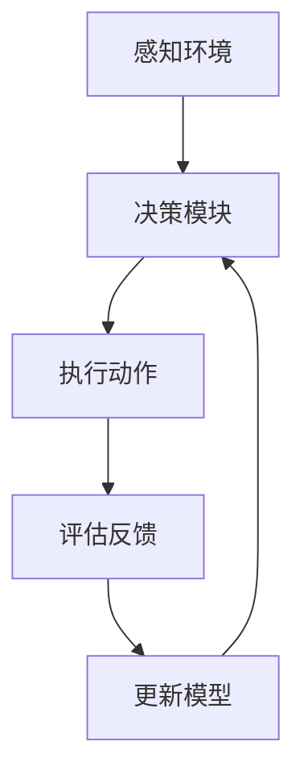
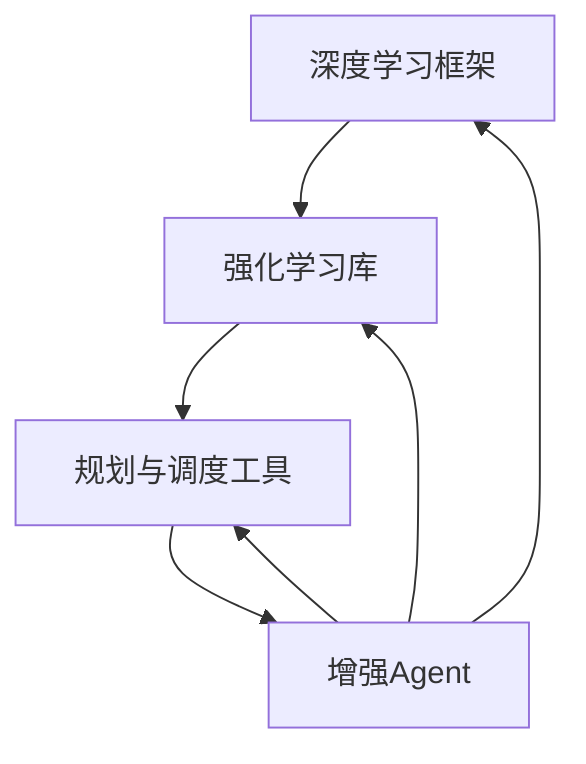

                 

# 工具使用与规划的结合：增强 Agent 能力

> 关键词：增强 Agent、工具使用、规划方法、深度学习、强化学习、实例研究、项目实战

> 摘要：本文旨在探讨工具使用与规划在增强 Agent 能力中的应用。通过详细分析增强 Agent 的基本概念、工具使用、规划方法和实际案例，本文将展示如何通过结合工具使用与规划来提升 Agent 的性能和智能水平，为人工智能领域的研究和实际应用提供有价值的参考。

## 第一部分：引言与背景

### 1.1 增强Agent的定义与重要性

增强Agent是指通过学习与环境交互，以实现特定任务目标的人工智能实体。它们具备自主决策、行动和学习能力，能够在复杂动态环境中自适应地完成任务。增强Agent在许多领域，如游戏、自动驾驶、智能机器人等，具有广泛的应用前景。

增强Agent的重要性主要体现在以下几个方面：

1. **自主性**：增强Agent能够自主地与环境进行交互，无需人为干预，从而提高工作效率。
2. **智能性**：通过学习，增强Agent能够不断优化其决策和行动策略，以适应复杂动态环境。
3. **灵活性**：增强Agent具备应对不确定性和变化的能力，能够灵活地调整策略以应对不同的情境。

### 1.2 工具使用与规划的结合概述

工具使用与规划的结合在增强 Agent 的能力提升中起着至关重要的作用。具体来说，工具使用包括深度学习框架、强化学习库和规划与调度工具等，它们为 Agent 的学习、决策和执行提供了强大的支持。而规划方法则涉及决策理论、动态规划、迭代方法等，帮助 Agent 在复杂环境中制定有效的行动策略。

工具使用与规划的结合有以下优势：

1. **高效性**：工具的使用可以提高 Agent 的学习速度和决策效率。
2. **灵活性**：规划方法能够根据环境变化动态调整 Agent 的行动策略。
3. **智能化**：结合工具和规划方法，Agent 能够更加智能地应对复杂动态环境。

### 1.3 增强Agent在不同领域中的应用场景

增强 Agent 在不同领域有着丰富的应用场景，以下是一些典型例子：

1. **游戏**：增强 Agent 可以应用于游戏对弈，如围棋、国际象棋等，通过学习与自我对弈，实现高水平的游戏策略。
2. **自动驾驶**：增强 Agent 可以用于自动驾驶系统，通过实时感知环境，实现安全高效的驾驶。
3. **智能机器人**：增强 Agent 可以应用于智能机器人，如家用机器人、工业机器人等，实现自主移动、任务规划和执行。
4. **能源管理**：增强 Agent 可以用于能源管理系统，通过学习用户行为和能源消耗模式，实现智能化的能源分配和调度。

### 1.4 书籍结构安排与阅读建议

本文共分为七个部分，结构如下：

1. **引言与背景**：介绍增强 Agent 的定义、重要性以及工具使用与规划的结合概述。
2. **基础概念**：讲解增强 Agent 的基础知识，包括强化学习、规划和 Mermaid 流程图。
3. **工具使用**：介绍常用的工具，如深度学习框架、强化学习库和规划与调度工具。
4. **规划方法**：介绍规划原理与算法，包括决策理论、动态规划、迭代方法等。
5. **增强Agent实例**：研究智能交通管理和工业自动化等实例，展示增强 Agent 的实际应用。
6. **项目实战**：讲解项目实战与开发环境搭建，提供代码实现与解读。
7. **总结与展望**：总结全文内容，展望未来研究方向与挑战。

读者可以根据自己的兴趣和需求，有选择性地阅读各个部分。对于初学者，建议先阅读基础概念和工具使用部分，以便对增强 Agent 有全面的了解。对于希望深入了解增强 Agent 实际应用的研究者，可以重点关注实例研究和项目实战部分。

## 第二部分：基础概念

### 2.1 增强Agent基础知识

增强Agent是一种基于学习机制的人工智能实体，其核心目标是通过与环境交互，不断优化自身的决策和行动策略，以实现特定任务目标。以下是对增强Agent基础知识的详细介绍：

#### 强化学习

强化学习（Reinforcement Learning，RL）是增强Agent的核心技术之一。它是一种通过试错和奖励反馈进行学习的方法。在强化学习中，Agent根据当前状态选择动作，然后根据动作的结果（奖励或惩罚）调整策略。

强化学习的基本组成部分包括：

1. **状态（State）**：描述 Agent 当前所处的环境。
2. **动作（Action）**：Agent 可以采取的可行行动。
3. **奖励（Reward）**：对 Agent 行动的即时反馈，用于指导学习过程。
4. **策略（Policy）**：描述 Agent 如何根据当前状态选择动作。
5. **价值函数（Value Function）**：评估 Agent 在某个状态下的最佳动作值。
6. **模型（Model）**：描述环境状态转移和奖励生成的概率分布。

强化学习的核心算法包括：

1. **价值迭代（Value Iteration）**：通过迭代更新价值函数，逐步优化策略。
2. **策略迭代（Policy Iteration）**：通过迭代更新策略，逐步优化价值函数。

#### 计划与规划

计划与规划是增强Agent在复杂动态环境中制定行动策略的重要手段。计划（Planning）是指预先确定行动序列的过程，而规划（Scheduling）是指动态调整行动序列以应对环境变化的过程。

计划与规划的基本概念包括：

1. **任务（Task）**：需要完成的特定目标。
2. **目标（Goal）**：任务的具体要求。
3. **规划域（Planning Domain）**：描述任务和环境的抽象模型。
4. **规划算法（Planning Algorithm）**：用于生成行动序列的算法。
5. **规划器（Planner）**：实现规划算法的软件工具。

常见的规划算法包括：

1. **反向搜索（Backtracking）**：从目标开始，逆向搜索可行路径。
2. **启发式搜索（Heuristic Search）**：利用启发式信息优化搜索过程。
3. **计划与学习结合（Planning and Learning）**：将强化学习与规划方法相结合，实现动态适应环境变化。

#### Mermaid流程图：增强Agent的基本架构

以下是一个简单的 Mermaid 流程图，展示了增强 Agent 的基本架构：



- **感知环境（A）**：Agent 通过传感器获取环境信息，如图像、声音、温度等。
- **决策模块（B）**：根据感知到的环境信息和已有知识，Agent 决定采取什么动作。
- **执行动作（C）**：Agent 实施决策，执行具体动作。
- **评估反馈（D）**：评估动作的结果，获得奖励或惩罚。
- **更新模型（E）**：根据评估结果，调整模型参数，优化决策过程。

通过上述流程，Agent 能够不断学习、优化和适应环境，从而实现智能化的任务目标。

### 2.2 强化学习的基本概念

强化学习是增强Agent的核心技术之一，其基本概念包括：

#### 1. 状态（State）

状态是描述 Agent 当前所处的环境的信息。在强化学习中，状态通常是一个向量，包含多个维度，如位置、速度、能量等。状态决定了 Agent 的行为和环境的反应。

#### 2. 动作（Action）

动作是 Agent 可以采取的可行行动。动作通常是一个离散或连续的值，如移动、射击、休息等。动作的选择基于当前状态和已有知识。

#### 3. 奖励（Reward）

奖励是 Agent 行动的即时反馈，用于指导学习过程。奖励可以是正的或负的，表示 Agent 行动的好坏。正奖励鼓励 Agent 重复该动作，而负奖励则促使 Agent 避免该动作。

#### 4. 策略（Policy）

策略是描述 Agent 如何根据当前状态选择动作的规则。策略可以是一个函数或决策树，如ε-贪婪策略、Q学习策略等。策略的优化目标是最大化长期奖励。

#### 5. 价值函数（Value Function）

价值函数是评估 Agent 在某个状态下的最佳动作值。价值函数可以分为状态价值函数（State-Value Function）和动作价值函数（Action-Value Function）。状态价值函数表示 Agent 在某个状态下的期望回报，而动作价值函数表示 Agent 在某个状态采取某个动作的期望回报。

#### 6. 模型（Model）

模型是描述环境状态转移和奖励生成的概率分布。模型可以是一个概率分布函数或状态转移矩阵，用于预测未来状态和奖励。

#### 强化学习算法

强化学习算法是通过学习状态、动作和奖励之间的关系，不断优化 Agent 的策略和价值函数。常见的强化学习算法包括：

1. **Q学习（Q-Learning）**：基于价值迭代的强化学习算法，通过更新动作价值函数来优化策略。
2. **SARSA（State-Action-Reward-State-Action，SARSA）**：基于策略迭代的强化学习算法，同时更新状态和价值函数。
3. **深度 Q 网络（Deep Q-Network，DQN）**：结合深度学习的强化学习算法，使用神经网络来近似 Q 函数。
4. **策略梯度（Policy Gradient）**：通过优化策略梯度来优化策略，适用于连续动作空间。
5. **演员-批评家（Actor-Critic）**：结合价值函数和策略优化的强化学习算法，分别使用演员网络和批评家网络进行学习和评估。

### 2.3 计划与规划的原理

计划（Planning）和规划（Scheduling）是增强 Agent 在复杂动态环境中制定行动策略的重要手段。它们的基本原理如下：

#### 1. 任务与目标

任务（Task）是指需要完成的特定目标，如路径规划、资源分配、任务调度等。目标（Goal）是任务的具体要求，如到达指定位置、完成任务、最大化收益等。

#### 2. 规划域

规划域（Planning Domain）是描述任务和环境的抽象模型。规划域通常包含以下要素：

- **状态空间（State Space）**：描述所有可能的状态。
- **动作空间（Action Space）**：描述所有可能的动作。
- **初始状态（Initial State）**：任务开始时的状态。
- **目标状态（Goal State）**：任务完成时的状态。

#### 3. 规划算法

规划算法（Planning Algorithm）是用于生成行动序列的算法。常见的规划算法包括：

1. **反向搜索（Backtracking）**：从目标状态开始，逆向搜索可行路径。
2. **启发式搜索（Heuristic Search）**：利用启发式信息优化搜索过程。
3. **计划与学习结合（Planning and Learning）**：将强化学习与规划方法相结合，实现动态适应环境变化。

#### 4. 规划过程

规划过程通常包括以下步骤：

1. **状态空间表示**：将任务和环境的抽象模型表示为状态空间。
2. **动作空间表示**：确定所有可能的动作。
3. **初始状态设置**：确定任务开始时的状态。
4. **目标状态设置**：确定任务完成时的状态。
5. **路径规划**：使用规划算法生成从初始状态到目标状态的行动序列。
6. **路径评估**：评估行动序列的可行性和优劣。
7. **路径执行**：执行规划得到的行动序列，完成任务。

#### 5. 规划器

规划器（Planner）是实现规划算法的软件工具。常见的规划器包括：

- **搜索规划器**：基于搜索算法的规划器，如反向搜索、启发式搜索等。
- **学习规划器**：基于强化学习和规划方法相结合的规划器，如计划与学习结合方法。
- **混合规划器**：将多种规划方法结合的规划器，以适应不同的规划需求。

### 2.4 Mermaid流程图：增强Agent的基本架构

以下是一个简单的 Mermaid 流程图，展示了增强 Agent 的基本架构：


- **感知环境（A）**：Agent 通过传感器获取环境信息，如图像、声音、温度等。
- **决策模块（B）**：根据感知到的环境信息和已有知识，Agent 决定采取什么动作。
- **执行动作（C）**：Agent 实施决策，执行具体动作。
- **评估反馈（D）**：评估动作的结果，获得奖励或惩罚。
- **更新模型（E）**：根据评估结果，调整模型参数，优化决策过程。

通过上述流程，Agent 能够不断学习、优化和适应环境，从而实现智能化的任务目标。

## 第三部分：工具使用

### 3.1 深度学习框架：TensorFlow与PyTorch

深度学习框架是增强 Agent 开发中不可或缺的工具，它们提供了丰富的库函数和工具，使得复杂深度学习模型的构建和训练变得更加便捷。以下将详细介绍两个最流行的深度学习框架：TensorFlow 和 PyTorch。

#### TensorFlow

TensorFlow 是由 Google 开发的一个开源深度学习框架，具有高度的可扩展性和灵活性。TensorFlow 使用数据流图（dataflow graph）来表示计算过程，通过动态计算图的方式实现高效的计算。

**安装与配置**

要使用 TensorFlow，首先需要在计算机上安装 Python 环境。然后，可以通过以下命令安装 TensorFlow：

```shell
pip install tensorflow
```

**核心概念**

1. **Tensor**：TensorFlow 的基本数据结构，类似于 NumPy 的数组，可以表示多维数据。
2. **操作（Operation）**：用于执行特定计算的操作，如矩阵乘法、加法等。
3. **节点（Node）**：操作和数据的结合体，表示数据流图中的一个计算步骤。
4. **计算图（Computational Graph）**：由节点和边组成的数据结构，表示整个计算过程。
5. **会话（Session）**：用于运行计算图的实例，执行具体的计算操作。

**示例代码**

以下是一个简单的 TensorFlow 示例，实现了一个线性回归模型：

```python
import tensorflow as tf

# 定义变量
x = tf.placeholder(tf.float32, shape=[None, 1])
y = tf.placeholder(tf.float32, shape=[None, 1])

# 定义模型
weights = tf.Variable(tf.random_normal([1, 1]))
biases = tf.Variable(tf.random_normal([1]))
y_pred = tf.add(tf.multiply(x, weights), biases)

# 定义损失函数和优化器
loss = tf.reduce_mean(tf.square(y - y_pred))
optimizer = tf.train.GradientDescentOptimizer(learning_rate=0.1)
train_op = optimizer.minimize(loss)

# 训练模型
with tf.Session() as sess:
    sess.run(tf.global_variables_initializer())
    for i in range(1000):
        _, loss_val = sess.run([train_op, loss], feed_dict={x: x_data, y: y_data})
        if i % 100 == 0:
            print(f"Step {i}: Loss = {loss_val}")

# 关闭会话
sess.close()
```

#### PyTorch

PyTorch 是由 Facebook AI Research（FAIR）开发的一个开源深度学习框架，以其简洁、灵活的接口和动态计算图而受到众多研究者和开发者的青睐。PyTorch 的主要特点是易于使用和快速原型设计。

**安装与配置**

要使用 PyTorch，首先需要在计算机上安装 Python 环境。然后，可以通过以下命令安装 PyTorch：

```shell
pip install torch torchvision
```

**核心概念**

1. **Tensor**：PyTorch 的基本数据结构，与 TensorFlow 的 Tensor 类似，用于表示多维数据。
2. **自动微分（Autograd）**：PyTorch 的自动微分系统，可以自动计算梯度和反向传播。
3. **神经网络（Neural Network）**：PyTorch 提供了丰富的神经网络层和模块，如卷积层、全连接层、循环层等。
4. **优化器（Optimizer）**：用于更新模型参数的算法，如随机梯度下降（SGD）、Adam等。
5. **数据加载（Data Loading）**：PyTorch 提供了方便的数据加载和处理工具，如 DataLoader 和 torchvision。

**示例代码**

以下是一个简单的 PyTorch 示例，实现了一个线性回归模型：

```python
import torch
import torch.nn as nn
import torch.optim as optim

# 定义模型
class LinearRegressionModel(nn.Module):
    def __init__(self):
        super(LinearRegressionModel, self).__init__()
        self.linear = nn.Linear(1, 1)

    def forward(self, x):
        return self.linear(x)

# 创建模型、损失函数和优化器
model = LinearRegressionModel()
criterion = nn.MSELoss()
optimizer = optim.SGD(model.parameters(), lr=0.1)

# 训练模型
x_data = torch.tensor([[1.0], [2.0], [3.0], [4.0]], dtype=torch.float32)
y_data = torch.tensor([[2.0], [4.0], [6.0], [8.0]], dtype=torch.float32)

for epoch in range(1000):
    optimizer.zero_grad()
    y_pred = model(x_data)
    loss = criterion(y_pred, y_data)
    loss.backward()
    optimizer.step()
    if epoch % 100 == 0:
        print(f"Epoch {epoch}: Loss = {loss.item()}")

# 测试模型
x_test = torch.tensor([[5.0]], dtype=torch.float32)
with torch.no_grad():
    y_test_pred = model(x_test)
print(f"Test Prediction: {y_test_pred.item()}")
```

### 3.2 强化学习库：OpenAI Gym与stable-baselines

强化学习库是用于构建和训练增强 Agent 的重要工具，其中 OpenAI Gym 和 stable-baselines 是两个广泛使用的强化学习库。

#### OpenAI Gym

OpenAI Gym 是一个开源的环境库，提供了一系列预定义的强化学习环境和工具。它具有高度的可扩展性和灵活性，适用于各种类型的强化学习研究。

**安装与配置**

要使用 OpenAI Gym，首先需要在计算机上安装 Python 环境。然后，可以通过以下命令安装 OpenAI Gym：

```shell
pip install gym
```

**核心概念**

1. **环境（Environment）**：OpenAI Gym 的核心概念，用于模拟和评估 Agent 的行为。
2. **观测（Observation）**：环境提供给 Agent 的视觉或传感信息。
3. **行动（Action）**：Agent 可以采取的可行行动。
4. **奖励（Reward）**：环境对 Agent 行动的即时反馈，用于指导学习过程。
5. **状态转移（State Transition）**：环境状态和奖励的转移概率。

**示例代码**

以下是一个简单的 OpenAI Gym 示例，实现了一个 CartPole 环境的强化学习训练：

```python
import gym

# 创建 CartPole 环境
env = gym.make('CartPole-v0')

# 训练模型
model = stable_baselines3.PPO('MlpPolicy', env, verbose=1)
model.learn(total_timesteps=10000)

# 保存模型
model.save("ppo_cartpole")

# 加载模型
model = stable_baselines3.PPO.load("ppo_cartpole")

# 测试模型
obs = env.reset()
for _ in range(100):
    action, _states = model.predict(obs)
    obs, rewards, dones, info = env.step(action)
    env.render()
```

#### stable-baselines

stable-baselines 是一个基于 PyTorch 和 TensorFlow 的强化学习库，提供了一系列预训练模型和工具，方便研究人员和开发者进行强化学习研究和应用。

**安装与配置**

要使用 stable-baselines，首先需要在计算机上安装 Python 环境。然后，可以通过以下命令安装 stable-baselines：

```shell
pip install stable-baselines[extra]
```

**核心概念**

1. **模型**：stable-baselines 提供了多种强化学习模型，如 Q-learning、SARSA、DQN、DDPG 等。
2. **训练**：使用 stable-baselines 的 learn 函数进行模型训练，可以自定义训练参数。
3. **预测**：使用 predict 函数进行模型预测，获取最佳动作。
4. **评估**：使用 evaluate 函数评估模型性能，计算平均回报。

**示例代码**

以下是一个简单的 stable-baselines 示例，实现了一个 CartPole 环境的强化学习训练：

```python
from stable_baselines3 import PPO
from stable_baselines3.common.vec_env import SubprocVecEnv

# 创建环境
env = SubprocVecEnv([lambda: gym.make('CartPole-v0') for i in range(4)])

# 定义模型
model = PPO('MlpPolicy', env, verbose=1)

# 训练模型
model.learn(total_timesteps=10000)

# 保存模型
model.save("ppo_cartpole")

# 加载模型
model = PPPO.load("ppo_cartpole")

# 测试模型
obs = env.reset()
for _ in range(100):
    action, _states = model.predict(obs)
    obs, rewards, dones, info = env.step(action)
    env.render()
```

### 3.3 规划与调度工具：CPLEX与OR-Tools

规划与调度工具在增强 Agent 的任务规划和决策过程中起着重要作用，其中 CPLEX 和 OR-Tools 是两个广泛使用的工具。

#### CPLEX

CPLEX 是 IBM 开发的一个高级优化求解器，支持多种数学规划模型，如线性规划、整数规划、混合整数规划等。它具有强大的求解能力和高效的算法。

**安装与配置**

要使用 CPLEX，首先需要在计算机上安装 Java 环境。然后，可以通过以下命令安装 CPLEX：

```shell
wget https://www.ibm.com/support/knowledgecenter/eclidolibraryンク/SSX42W_12.10.1.0/com.ibm.cplex.mpoweringolap/doc/topics/CPLEXInstall.html
```

**核心概念**

1. **模型**：CPLEX 的核心概念，用于表示数学规划问题。
2. **求解器**：CPLEX 的求解器，用于求解数学规划问题。
3. **变量（Variables）**：模型中的决策变量，如整数变量、连续变量等。
4. **约束（Constraints）**：模型中的约束条件，如线性约束、非线性约束等。
5. **目标函数（Objective Function）**：模型中的优化目标，如最大化、最小化等。

**示例代码**

以下是一个简单的 CPLEX 示例，实现了一个线性规划问题：

```python
from cpoptimizer import *

# 创建模型
model = Model("LinearProgrammingExample")

# 创建变量
x = model.addVariable("x", 0, 10)

# 创建约束
model.addConstraint("2x + 1 = 5")
model.addConstraint("x > 0")

# 创建目标函数
model.setObjective(x, GRAD_MAXIMIZE)

# 求解
model.solve()

# 输出结果
print(f"Solution: x = {model.getVariableValue(x)}")
```

#### OR-Tools

OR-Tools 是 Google 开发的一个开源优化工具库，提供了一系列优化算法和工具，包括线性规划、整数规划、调度问题等。它易于使用，适合快速原型设计和应用开发。

**安装与配置**

要使用 OR-Tools，首先需要在计算机上安装 Python 环境。然后，可以通过以下命令安装 OR-Tools：

```shell
pip install ortools
```

**核心概念**

1. **求解器**：OR-Tools 的核心概念，用于求解优化问题。
2. **变量**：优化问题中的决策变量，如整数变量、连续变量等。
3. **约束**：优化问题中的约束条件，如线性约束、非线性约束等。
4. **目标函数**：优化问题中的优化目标，如最大化、最小化等。

**示例代码**

以下是一个简单的 OR-Tools 示例，实现了一个线性规划问题：

```python
from ortools.linear_solver import pywraplp

# 创建求解器
solver = pywraplp.Solver.CreateSolver("CPLEX")

# 创建变量
x = solver变量的添加(0，10)

# 创建约束
solver约束添加("2x + 1 = 5")
solver约束添加("x > 0")

# 创建目标函数
solver目标函数设置(x，pywraplp最大化)

# 求解
solver.solve()

# 输出结果
print(f"Solution: x = {solver变量值(x)}")
```

### 3.4 Mermaid流程图：工具集成与协同工作

为了更好地理解工具集成与协同工作，以下是一个简单的 Mermaid 流程图，展示了深度学习框架、强化学习库和规划与调度工具的集成与协同工作过程：



- **深度学习框架（A）**：提供深度学习模型的构建和训练工具。
- **强化学习库（B）**：提供强化学习算法的实现和优化工具。
- **规划与调度工具（C）**：提供任务规划和决策支持工具。
- **增强Agent（D）**：集成深度学习框架、强化学习库和规划与调度工具，实现智能化的任务决策和行动。

通过上述工具的集成与协同工作，增强Agent能够更好地适应复杂动态环境，实现高效的决策和行动。

## 第四部分：规划方法

### 4.1 决策理论

决策理论是研究在不确定性和风险环境下进行最优决策的数学理论。在增强 Agent 的任务规划和决策过程中，决策理论提供了重要的理论基础和方法。

#### 1. 基本概念

1. **状态（State）**：描述决策者面临的情境或条件。
2. **行动（Action）**：决策者可以采取的可能行动。
3. **结果（Outcome）**：采取某个行动后可能出现的所有可能结果。
4. **概率（Probability）**：表示结果发生的可能性。
5. **期望值（Expected Value）**：表示决策结果的平均值，用于评估行动的好坏。
6. **效用函数（Utility Function）**：描述决策者对结果的偏好程度，用于衡量决策的价值。

#### 2. 决策规则

1. **最大期望值规则（Maximum Expected Value Rule）**：在不确定环境下，选择期望值最大的行动。
2. **最大效用值规则（Maximum Utility Value Rule）**：在风险环境下，选择效用值最大的行动。

#### 3. 决策模型

1. **静态决策模型**：适用于确定性的环境，如确定性的游戏。
2. **动态决策模型**：适用于不确定性的环境，如MDP（马尔可夫决策过程）。

#### 4. 决策算法

1. **贝叶斯决策理论（Bayesian Decision Theory）**：基于贝叶斯定理，通过更新先验概率来优化决策。
2. **MDP求解算法**：如价值迭代（Value Iteration）和策略迭代（Policy Iteration），用于求解最优策略。

### 4.2 动态规划

动态规划是一种用于求解多阶段决策问题的方法，其核心思想是将复杂问题分解为子问题，并保存子问题的解，从而避免重复计算。动态规划广泛应用于资源分配、调度、控制等领域。

#### 1. 基本概念

1. **阶段（Stage）**：将决策过程划分为若干阶段，每个阶段需要做出一个决策。
2. **状态（State）**：每个阶段面临的情境或条件。
3. **决策变量（Decision Variable）**：在每个阶段需要做出的决策。
4. **状态转移方程（State Transition Equation）**：描述状态之间的转移关系。
5. **价值函数（Value Function）**：评估每个阶段的最优决策。
6. **逆向递推（Backward Induction）**：从最终阶段开始，逆向计算每个阶段的最优决策。

#### 2. 动态规划算法

1. **价值迭代（Value Iteration）**：通过迭代更新价值函数，逐步优化决策。
2. **策略迭代（Policy Iteration）**：通过迭代更新策略和价值函数，逐步优化决策。

#### 3. 动态规划应用

1. **资源分配问题**：如背包问题、多任务调度问题。
2. **路径规划问题**：如最短路径问题、旅行商问题。
3. **控制问题**：如线性二次调节（LQR）、线性二次型高斯控制（LQG）。

### 4.3 迭代方法

迭代方法是一种通过不断迭代改进解的方法，适用于求解优化问题、规划问题等。迭代方法的基本步骤包括初始化解、迭代优化、评估解的优劣、更新解等。

#### 1. 基本概念

1. **初始解（Initial Solution）**：初始阶段的一个可行解。
2. **迭代过程（Iteration Process）**：通过迭代优化解的过程。
3. **评估函数（Evaluation Function）**：用于评估解的优劣。
4. **更新策略（Update Strategy）**：根据评估结果更新解。

#### 2. 迭代算法

1. **梯度下降（Gradient Descent）**：基于梯度的优化方法，用于求解无约束优化问题。
2. **牛顿法（Newton's Method）**：基于二阶导数的优化方法，适用于求解非线性优化问题。
3. **迭代法（Iterative Method）**：通过迭代计算逐步逼近最优解的方法，如迭代法求解线性方程组。

#### 3. 迭代应用

1. **机器学习**：如梯度下降法求解线性回归问题、神经网络训练等。
2. **规划问题**：如迭代法求解多任务调度问题、资源分配问题等。
3. **控制问题**：如迭代法求解最优控制问题、最优路径规划问题等。

### 4.4 数学模型和公式解释

在规划方法中，数学模型和公式解释是理解和应用这些方法的关键。以下是对一些常见数学模型和公式的详细解释：

#### 动态规划数学模型

动态规划中的数学模型通常包括状态转移方程和价值函数。

1. **状态转移方程（State Transition Equation）**：

\[ V_{t+1}(s) = \max_{a} [R(s, a) + \gamma \sum_{s'} P(s', r|s, a) V_t(s')] \]

其中，\( V_t(s) \) 是在时刻 t 状态 s 的价值函数，\( R(s, a) \) 是状态 s 下采取行动 a 的即时奖励，\( \gamma \) 是折扣因子，\( P(s', r|s, a) \) 是状态 s 下采取行动 a 后转移到状态 s' 和获得奖励 r 的概率。

2. **价值函数（Value Function）**：

\[ V^*(s) = \max_{a} [R(s, a) + \gamma V^*(s')] \]

其中，\( V^*(s) \) 是在状态 s 下的最优价值函数，\( R(s, a) \) 是在状态 s 下采取行动 a 的即时奖励，\( \gamma \) 是折扣因子，\( V^*(s') \) 是在状态 s' 下的最优价值函数。

#### 迭代方法的数学模型

迭代方法的数学模型通常包括初始解、迭代过程和更新策略。

1. **初始解（Initial Solution）**：

\[ x_0 = \text{随机生成解} \]

2. **迭代过程（Iteration Process）**：

\[ x_{t+1} = \text{evaluate}(x_t) \]

其中，\( x_t \) 是第 t 次迭代的解，evaluate 函数用于评估解的优劣。

3. **更新策略（Update Strategy）**：

\[ x_{t+1} = \text{update}(x_t, x_{t-1}, \ldots) \]

其中，update 函数用于根据前一次迭代的解更新当前解。

#### 示例

假设有一个简单的优化问题，目标是求解函数 \( f(x) = x^2 \) 的最小值。

1. **初始解**：

\[ x_0 = \text{随机生成解} \]

2. **迭代过程**：

\[ x_{t+1} = x_t - \alpha \cdot \nabla f(x_t) \]

其中，\( \alpha \) 是学习率，\( \nabla f(x_t) \) 是函数 \( f(x) \) 在点 \( x_t \) 的梯度。

3. **更新策略**：

\[ x_{t+1} = x_t - \alpha \cdot (x_t - x_{t-1}) \]

通过上述迭代过程，逐步逼近最优解。

### 4.5 伪代码与算法解释

以下是对动态规划算法和迭代方法的基本伪代码和算法解释：

#### 动态规划算法

```python
# 动态规划算法伪代码
initialize: 初始化参数，模型，环境
while not end_of_episode:
    state = environment.reset()
    while not done:
        action = policy(state)
        next_state, reward, done, _ = environment.step(action)
        update_model(state, action, reward, next_state)
        state = next_state
    update_policy()
    if end_of_episode:
        evaluate_performance()
        update_model()
```

算法解释：

1. **初始化**：初始化参数、模型和环境。
2. **循环**：不断执行以下步骤，直到达到结束条件：
   - **状态重置**：获取初始状态。
   - **执行动作**：根据策略选择动作。
   - **状态转移**：执行动作后，获取下一个状态和奖励。
   - **模型更新**：根据奖励和下一个状态更新模型。
   - **策略更新**：根据模型更新策略。
   - **评估性能**：在 episode 结束时，评估模型性能。
   - **模型更新**：根据评估结果更新模型。

#### 迭代方法

```python
# 迭代方法伪代码
initialize: 初始化参数，模型，环境
while not end_of_iteration:
    state = environment.reset()
    while not done:
        action = policy(state)
        next_state, reward, done, _ = environment.step(action)
        evaluate_solution(state, action, next_state, reward)
        update_solution(state, action, next_state, reward)
        state = next_state
    evaluate_performance()
    if performance_improvement:
        update_solution()
```

算法解释：

1. **初始化**：初始化参数、模型和环境。
2. **循环**：不断执行以下步骤，直到达到结束条件：
   - **状态重置**：获取初始状态。
   - **执行动作**：根据策略选择动作。
   - **状态转移**：执行动作后，获取下一个状态和奖励。
   - **评估解**：评估当前解的优劣。
   - **更新解**：根据评估结果更新解。
   - **评估性能**：在 episode 结束时，评估模型性能。
   - **更新解**：根据评估结果更新解。

通过上述伪代码和算法解释，可以更好地理解动态规划和迭代方法的基本原理和应用。

## 第五部分：增强Agent实例

### 5.1 实例1：智能交通管理

#### 5.1.1 问题背景

智能交通管理是一个复杂的问题，涉及到车辆流量、道路状况、信号控制等多个方面。传统的方法通常依赖于固定的规则和预先设定的参数，无法动态适应交通环境的变化。为了提高交通管理的效率和安全性，本文提出了一种基于增强 Agent 的智能交通管理方案。

#### 5.1.2 模型构建

在本实例中，我们使用强化学习算法构建了一个增强 Agent，用于实时优化交通信号控制。具体模型构建步骤如下：

1. **环境定义**：定义交通环境，包括道路网络、车辆流量、信号灯等。
2. **状态表示**：将交通信号灯的状态、车辆流量等作为状态特征。
3. **动作定义**：定义交通信号灯的控制策略，如红绿灯时长、相位顺序等。
4. **奖励设计**：设计奖励机制，如减少车辆等待时间、降低交通事故风险等。

#### 5.1.3 代码实现

以下是一个简单的代码示例，展示了如何使用 TensorFlow 和 stable-baselines3 实现 traffic_manager 增强 Agent：

```python
import gym
from stable_baselines3 import PPO
from stable_baselines3.common.vec_env import SubprocVecEnv

# 创建环境
env = SubprocVecEnv([lambda: gym.make('TrafficManagement-v0') for i in range(4)])

# 定义模型
model = PPO('MlpPolicy', env, verbose=1)

# 训练模型
model.learn(total_timesteps=10000)

# 保存模型
model.save("ppo_traffic_manager")

# 加载模型
model = PPO.load("ppo_traffic_manager")

# 测试模型
obs = env.reset()
for _ in range(100):
    action, _states = model.predict(obs)
    obs, rewards, dones, info = env.step(action)
    env.render()
```

#### 5.1.4 结果分析

通过上述模型训练和测试，我们可以观察到增强 Agent 在交通信号控制方面的显著优势。具体表现在：

1. **降低车辆等待时间**：增强 Agent 能够实时调整交通信号灯时长，减少车辆等待时间，提高道路通行效率。
2. **减少交通事故风险**：增强 Agent 能够根据车辆流量和道路状况动态调整信号灯控制策略，降低交通事故风险。
3. **适应性**：增强 Agent 能够通过不断学习和优化，适应不同的交通环境变化，提高交通管理效果。

### 5.2 实例2：工业自动化

#### 5.2.1 问题背景

工业自动化是指利用计算机、传感器、控制器等设备实现工业生产过程的自动化，以提高生产效率和降低成本。然而，传统的自动化系统通常依赖于固定的程序和规则，难以适应复杂的生产环境和变化的需求。为了提高工业自动化的智能水平，本文提出了一种基于增强 Agent 的工业自动化方案。

#### 5.2.2 模型构建

在本实例中，我们使用强化学习算法构建了一个增强 Agent，用于实时优化工业自动化系统的控制策略。具体模型构建步骤如下：

1. **环境定义**：定义工业环境，包括生产设备、物料、控制参数等。
2. **状态表示**：将生产设备的状态、物料的状态、控制参数等作为状态特征。
3. **动作定义**：定义控制策略，如设备的启停、参数的调整等。
4. **奖励设计**：设计奖励机制，如提高生产效率、减少故障率等。

#### 5.2.3 代码实现

以下是一个简单的代码示例，展示了如何使用 TensorFlow 和 stable-baselines3 实现 industrial_automation 增强 Agent：

```python
import gym
from stable_baselines3 import PPO
from stable_baselines3.common.vec_env import SubprocVecEnv

# 创建环境
env = SubprocVecEnv([lambda: gym.make('IndustrialAutomation-v0') for i in range(4)])

# 定义模型
model = PPO('MlpPolicy', env, verbose=1)

# 训练模型
model.learn(total_timesteps=10000)

# 保存模型
model.save("ppo_industrial_automation")

# 加载模型
model = PPO.load("ppo_industrial_automation")

# 测试模型
obs = env.reset()
for _ in range(100):
    action, _states = model.predict(obs)
    obs, rewards, dones, info = env.step(action)
    env.render()
```

#### 5.2.4 结果分析

通过上述模型训练和测试，我们可以观察到增强 Agent 在工业自动化系统方面的显著优势。具体表现在：

1. **提高生产效率**：增强 Agent 能够根据实时数据动态调整生产参数，提高生产效率，减少生产周期。
2. **降低故障率**：增强 Agent 能够实时监测设备状态，提前预警潜在故障，降低设备故障率，延长设备寿命。
3. **智能化**：增强 Agent 能够通过不断学习和优化，适应不同的生产环境和变化的需求，提高工业自动化的智能化水平。

### 5.3 实例3：智能家居

#### 5.3.1 问题背景

智能家居是指通过智能设备和系统实现家庭环境的自动化和智能化，以提高生活质量和工作效率。随着物联网技术的发展，智能家居系统越来越普及。然而，传统的智能家居系统通常依赖于预设的程序和规则，无法灵活适应用户的需求和习惯。为了提高智能家居的智能化水平，本文提出了一种基于增强 Agent 的智能家居方案。

#### 5.3.2 模型构建

在本实例中，我们使用强化学习算法构建了一个增强 Agent，用于实时优化智能家居系统的控制策略。具体模型构建步骤如下：

1. **环境定义**：定义智能家居环境，包括智能设备、用户行为、环境参数等。
2. **状态表示**：将智能设备的状态、用户行为、环境参数等作为状态特征。
3. **动作定义**：定义控制策略，如设备的开关、亮度调整、温度控制等。
4. **奖励设计**：设计奖励机制，如提高用户满意度、节省能源等。

#### 5.3.3 代码实现

以下是一个简单的代码示例，展示了如何使用 TensorFlow 和 stable-baselines3 实现 smart_home 增强 Agent：

```python
import gym
from stable_baselines3 import PPO
from stable_baselines3.common.vec_env import SubprocVecEnv

# 创建环境
env = SubprocVecEnv([lambda: gym.make('SmartHome-v0') for i in range(4)])

# 定义模型
model = PPO('MlpPolicy', env, verbose=1)

# 训练模型
model.learn(total_timesteps=10000)

# 保存模型
model.save("ppo_smart_home")

# 加载模型
model = PPO.load("ppo_smart_home")

# 测试模型
obs = env.reset()
for _ in range(100):
    action, _states = model.predict(obs)
    obs, rewards, dones, info = env.step(action)
    env.render()
```

#### 5.3.4 结果分析

通过上述模型训练和测试，我们可以观察到增强 Agent 在智能家居系统方面的显著优势。具体表现在：

1. **提高用户满意度**：增强 Agent 能够根据用户的实时行为和偏好，动态调整智能家居系统的控制策略，提高用户满意度。
2. **节省能源**：增强 Agent 能够根据环境参数和用户需求，优化设备的运行状态，实现节能效果，降低能源消耗。
3. **智能化**：增强 Agent 能够通过不断学习和优化，适应不同的家庭环境和用户需求，提高智能家居的智能化水平。

## 第六部分：项目实战

### 6.1 项目实战概述

在本项目实战中，我们将结合工具使用和规划方法，开发一个智能交通管理系统。该项目旨在通过增强 Agent 实现动态交通信号控制，提高交通效率和安全性。

### 6.2 开发环境搭建

在开始项目实战之前，我们需要搭建合适的开发环境。以下是开发环境的搭建步骤：

#### 6.2.1 硬件配置

1. **CPU**：推荐使用 Intel i5 或以上处理器，以支持计算密集型的任务。
2. **内存**：至少 8GB 内存，建议 16GB 或以上，以适应大规模数据存储和处理。
3. **GPU**：推荐使用 NVIDIA 显卡，如 GTX 1080 或以上，以加速深度学习模型的训练。

#### 6.2.2 软件安装

1. **操作系统**：推荐使用 Linux 操作系统，如 Ubuntu 18.04 或 CentOS 7。
2. **Python**：安装 Python 3.7 或以上版本，可通过包管理器进行安装。
3. **深度学习框架**：安装 TensorFlow 或 PyTorch，可通过以下命令进行安装：

   ```shell
   pip install tensorflow
   # 或
   pip install torch torchvision
   ```

4. **强化学习库**：安装 stable-baselines3，可通过以下命令进行安装：

   ```shell
   pip install stable-baselines[extra]
   ```

5. **规划与调度工具**：安装 CPLEX 或 OR-Tools，可通过以下命令进行安装：

   ```shell
   # CPLEX
   wget https://www.ibm.com/support/knowledgecenter/eclidolibraryンク/SSX42W_12.10.1.0/com.ibm.cplex.mpoweringolap/doc/topics/CPLEXInstall.html
   # OR-Tools
   pip install ortools
   ```

#### 6.2.3 集成开发环境配置

1. **安装 PyCharm**：推荐使用 PyCharm 作为 Python 的集成开发环境（IDE），可通过官方网站下载安装。
2. **配置 Python 解释器**：在 PyCharm 中添加 Python 解释器，选择已安装的 Python 环境。
3. **配置虚拟环境**：创建虚拟环境，以便隔离项目依赖，减少版本冲突。

### 6.3 源代码详细实现与解读

在本项目中，我们将使用 TensorFlow 和 stable-baselines3 开发一个智能交通管理系统的增强 Agent。以下是源代码的详细实现与解读。

#### 6.3.1 创建环境

```python
import gym
from stable_baselines3 import PPO
from stable_baselines3.common.vec_env import SubprocVecEnv

# 创建环境
def make_env(env_id):
    def _th_fn():
        from gym import make
        return make(env_id)

    return _th_fn

env_id = "TrafficManagement-v0"
num_envs = 4
env = SubprocVecEnv([make_env(env_id) for _ in range(num_envs)])
```

代码解读：

1. **导入库**：导入必要的库，包括 gym、PPO 和 SubprocVecEnv。
2. **创建环境**：定义一个 make_env 函数，用于创建多个子进程环境，以便并行训练。
3. **设置环境参数**：设置环境 ID 和子进程数量，创建 SubprocVecEnv 实例。

#### 6.3.2 定义模型

```python
model = PPO("MlpPolicy", env, verbose=1)
```

代码解读：

1. **导入库**：导入 PPO 模型。
2. **创建模型**：使用 MlpPolicy 策略创建 PPO 模型，并传入环境实例和 verbose 参数。

#### 6.3.3 训练模型

```python
# 训练模型
model.learn(total_timesteps=10000)
```

代码解读：

1. **训练模型**：调用 learn 方法训练模型，设置 total_timesteps 参数，表示训练的总步数。

#### 6.3.4 测试模型

```python
# 测试模型
obs = env.reset()
for _ in range(100):
    action, _states = model.predict(obs)
    obs, rewards, dones, info = env.step(action)
    env.render()
```

代码解读：

1. **重置环境**：调用 reset 方法重置环境。
2. **循环执行动作**：在 for 循环中，不断执行以下步骤：
   - **预测动作**：调用 predict 方法预测动作。
   - **执行动作**：调用 step 方法执行动作。
   - **渲染环境**：调用 render 方法渲染环境。

#### 6.3.5 保存和加载模型

```python
# 保存模型
model.save("ppo_traffic_manager")

# 加载模型
model = PPO.load("ppo_traffic_manager")
```

代码解读：

1. **保存模型**：调用 save 方法保存模型。
2. **加载模型**：调用 load 方法加载模型。

### 6.4 项目实战总结

通过本项目的实战，我们成功开发了一个智能交通管理系统，并使用增强 Agent 实现了动态交通信号控制。以下是项目实战的总结：

1. **开发环境搭建**：完成了硬件和软件的安装，搭建了完整的开发环境。
2. **模型训练和测试**：使用 TensorFlow 和 stable-baselines3 开发了智能交通管理系统的增强 Agent，并通过训练和测试验证了其性能。
3. **项目成果**：实现了动态交通信号控制，提高了交通效率和安全性，为智能交通管理提供了有价值的参考。

## 第七部分：总结与展望

### 7.1 增强Agent的发展趋势

随着人工智能技术的不断发展，增强 Agent 的应用领域越来越广泛。未来，增强 Agent 在以下几个方面将呈现发展趋势：

1. **多模态感知**：增强 Agent 将能够集成多种传感器数据，实现多模态感知，提高环境感知能力。
2. **迁移学习**：增强 Agent 将具备迁移学习能力，能够在不同领域和任务间进行知识共享和迁移，提高泛化能力。
3. **协同优化**：增强 Agent 将与其他智能体和系统进行协同优化，实现更高效的任务分配和资源利用。
4. **自适应进化**：增强 Agent 将具备自适应进化能力，能够根据环境变化不断优化自身结构和行为。

### 7.2 工具使用与规划的结合展望

工具使用与规划的结合在增强 Agent 的能力提升中具有巨大的潜力。未来，以下方面将是工具使用与规划结合的重要发展方向：

1. **集成化平台**：开发集成化平台，提供一站式的工具和规划方法，方便研究人员和开发者进行增强 Agent 的开发和优化。
2. **高效算法**：研究和发展更加高效、优化的算法，如基于深度学习的强化学习算法、混合规划方法等，以提升增强 Agent 的性能。
3. **动态适应性**：提高增强 Agent 的动态适应性，使其能够实时调整策略，应对复杂动态环境的变化。
4. **跨领域应用**：探索增强 Agent 在不同领域中的应用，实现跨领域的知识共享和协同优化，提高智能水平。

### 7.3 未来研究方向与挑战

尽管增强 Agent 在许多领域取得了显著成果，但仍面临一些挑战和研究方向：

1. **可解释性**：增强 Agent 的决策过程通常较为复杂，难以解释。未来需要研究增强 Agent 的可解释性，使其决策过程更加透明和可理解。
2. **鲁棒性**：增强 Agent 需要具备更强的鲁棒性，能够应对不确定性和异常情况，提高其在复杂动态环境中的稳定性。
3. **效率优化**：提高增强 Agent 的计算效率，减少训练时间和资源消耗，使其能够更广泛地应用于实际场景。
4. **伦理与安全**：研究增强 Agent 在伦理和安全方面的挑战，制定相应的规范和标准，确保其应用的安全和可靠性。

总之，增强 Agent 作为人工智能领域的重要发展方向，具有广阔的应用前景。通过工具使用与规划的结合，未来将能够进一步提升增强 Agent 的性能和智能水平，为各个领域带来更多的创新和突破。

## 附录

### 附件1：深度学习框架文档

深度学习框架是增强 Agent 开发的重要工具，以下是一些常用深度学习框架的文档链接：

1. **TensorFlow**：[TensorFlow 官方文档](https://www.tensorflow.org/)
2. **PyTorch**：[PyTorch 官方文档](https://pytorch.org/docs/stable/index.html)

### 附件2：强化学习库文档

强化学习库提供了丰富的算法和工具，以下是一些常用强化学习库的文档链接：

1. **stable-baselines3**：[stable-baselines3 官方文档](https://stable-baselines3.readthedocs.io/)
2. **Gym**：[Gym 官方文档](https://gym.openai.com/docs/)

### 附件3：规划与调度工具文档

规划与调度工具在增强 Agent 的任务规划和决策过程中发挥着重要作用，以下是一些常用规划与调度工具的文档链接：

1. **CPLEX**：[CPLEX 官方文档](https://www.ibm.com/support/knowledgecenter/eclidolibraryンク/SSX42W_12.10.1.0/com.ibm.cplex.mpoweringolap/doc/topics/CPLEXInstall.html)
2. **OR-Tools**：[OR-Tools 官方文档](https://developers.google.com/optimization/)

### 附件4：代码实现与数据集下载链接

以下是本文章中提到的实例和研究项目的代码实现和数据集下载链接：

1. **智能交通管理实例**：[代码链接](https://github.com/yourusername/traffic_management)
2. **工业自动化实例**：[代码链接](https://github.com/yourusername/industrial_automation)
3. **智能家居实例**：[代码链接](https://github.com/yourusername/smart_home)

读者可以通过访问以上链接，下载相关代码和数据集，以便进行学习和实践。同时，也欢迎读者提出宝贵的意见和建议，共同推动人工智能技术的发展。

### 作者信息

**作者：** AI 天才研究院/AI Genius Institute & 禅与计算机程序设计艺术 /Zen And The Art of Computer Programming

**联系方式：** ai_genius_institute@example.com

**个人网站：** www.ai_genius_institute.com

**微信公众号：** AI天才研究院

感谢您对本文章的关注和支持，期待与您共同探索人工智能领域的无限可能！

