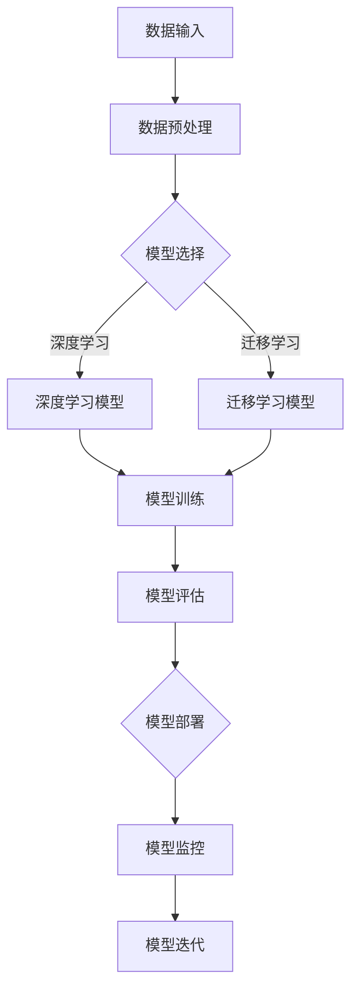

                 

# 平衡性能与成本：AI产品开发的策略

> 关键词：AI产品开发、性能优化、成本控制、算法、硬件、系统架构

> 摘要：本文旨在探讨AI产品开发中如何平衡性能与成本，通过深入分析AI产品开发的背景、流程、性能优化方法、成本控制策略，结合实际案例，提出了一套系统性的AI产品开发策略。文章结构清晰，逻辑严密，旨在为AI产品开发人员提供实用的指导和参考。

## 目录

1. AI产品开发的概述
2. AI产品开发的流程
3. 性能与成本优化策略
4. AI产品开发实战
5. AI产品部署与维护
6. 附录

## 第一部分：AI产品开发的背景与基础

### 第1章：AI产品开发的概述

#### 1.1 AI产品开发的背景

人工智能（AI）作为一门新兴的交叉学科，近年来得到了迅速发展。随着计算能力的提升、海量数据的积累以及深度学习算法的突破，AI技术逐渐从理论研究走向实际应用。从早期的专家系统到如今的深度学习，AI技术在各个领域的应用不断扩展，如自然语言处理、计算机视觉、智能决策等。

市场对AI产品的需求日益增长，推动了AI产业的快速发展。企业通过引入AI技术，提高了生产效率、优化了业务流程、提升了用户体验。例如，智能客服系统可以帮助企业降低运营成本、提高客户满意度；自动驾驶技术有望改变交通出行方式，提升交通安全。

#### 1.2 AI产品开发的关键要素

AI产品开发涉及多个关键要素，包括数据质量与数据管理、算法选择与优化、硬件与基础设施。

- **数据质量与数据管理**：数据是AI产品的核心资源。数据质量直接影响到模型的性能和可靠性。数据管理包括数据收集、数据清洗、数据存储和数据共享等环节。
- **算法选择与优化**：算法是AI产品的核心技术。根据应用场景选择合适的算法，并对其进行优化，是提高产品性能的关键。
- **硬件与基础设施**：硬件与基础设施是AI产品运行的基础。高性能的硬件和合理的系统架构能够提高产品的性能和稳定性。

### 第2章：AI产品开发的流程

#### 2.1 需求分析与市场调研

需求分析是AI产品开发的第一步。通过用户访谈、问卷调查、用户画像等方法，收集用户需求信息，分析用户痛点，明确产品目标。

市场调研则是对市场趋势和竞争环境进行分析。了解市场动态，掌握竞争对手的产品特点、技术优势和市场份额，为产品定位和市场推广提供依据。

#### 2.2 技术路线与架构设计

技术路线的规划是AI产品开发的核心环节。根据需求分析结果，选择合适的技术方案，包括算法、框架、工具等。技术路线的规划需要考虑产品性能、成本、可扩展性等因素。

系统架构设计则是在技术路线的基础上，对系统的各个模块进行划分，设计系统接口和交互方式。合理的系统架构能够提高产品的稳定性、可维护性和可扩展性。

#### 2.3 数据收集与处理

数据收集是AI产品开发的基础。根据产品需求，确定数据来源和数据类型，制定数据收集策略。数据收集过程中需要注意数据的质量和完整性。

数据处理包括数据清洗、数据预处理和特征工程。数据清洗旨在去除噪声和错误数据，提高数据质量；数据预处理包括归一化、标准化等操作，为后续模型训练提供准备；特征工程则是通过提取和构造特征，提高模型性能。

## 第二部分：性能与成本优化策略

### 第3章：性能优化方法

#### 3.1 算法层面的优化

算法层面的优化是提高AI产品性能的关键。根据应用场景选择合适的算法，并对算法进行调优。常见的算法优化方法包括：

- **算法选择**：根据问题特点选择合适的算法，如线性回归、决策树、神经网络等。
- **算法调优**：通过调整超参数、优化训练过程，提高模型性能。

#### 3.2 硬件层面的优化

硬件层面的优化包括选择合适的高性能硬件和利用硬件加速技术。常见的硬件优化方法包括：

- **硬件配置选择**：根据产品需求，选择合适的CPU、GPU等硬件配置。
- **硬件加速技术**：利用GPU、TPU等硬件加速技术，提高模型训练和推理速度。

#### 3.3 系统优化

系统优化包括对系统架构、网络架构和部署方式进行优化。常见的系统优化方法包括：

- **系统架构优化**：通过模块化、分布式架构提高系统性能和可扩展性。
- **网络架构优化**：通过网络拓扑结构优化，提高数据传输效率和系统性能。
- **部署方式优化**：通过容器化、云原生部署等方式，提高系统可扩展性和运维效率。

### 第4章：成本控制策略

#### 4.1 成本构成分析

成本控制是AI产品开发的重要环节。对成本进行细致分析，有助于制定有效的成本控制策略。常见的成本构成包括：

- **人力成本**：包括研发人员、测试人员等的人力成本。
- **硬件成本**：包括服务器、存储设备等硬件成本。
- **软件成本**：包括软件许可费用、开发工具费用等。
- **运营成本**：包括电力、网络等运营成本。

#### 4.2 成本优化策略

成本优化策略包括开源软件与工具的使用、云服务与硬件租赁等方法。通过以下方式可以降低成本：

- **开源软件与工具的使用**：使用免费的开源软件和工具，降低软件成本。
- **云服务与硬件租赁**：通过云服务提供商，按需租赁硬件资源，降低硬件成本。
- **项目管理与风险管理**：通过项目周期规划、风险管理，降低项目成本。

### 第5章：AI产品开发案例研究

#### 5.1 案例介绍

本节选取一个实际案例，分析AI产品开发过程中的性能优化和成本控制策略。案例涉及一个智能推荐系统的开发，包括数据收集、模型训练、系统部署等环节。

#### 5.2 案例分析

通过对案例的详细分析，探讨如何在实际项目中实现性能优化和成本控制。包括：

- **性能优化**：通过算法优化、硬件加速、系统架构优化等手段，提高系统性能。
- **成本控制**：通过开源软件与工具的使用、云服务与硬件租赁等策略，降低项目成本。

### 第6章：AI产品开发实践

#### 6.1 环境搭建与工具使用

本节介绍AI产品开发环境搭建和常用工具使用。包括：

- **开发环境搭建**：介绍如何搭建适合AI产品开发的开发环境，包括操作系统、编程语言、深度学习框架等。
- **常用工具介绍**：介绍常用的数据处理、模型训练和评估工具。

#### 6.2 数据集准备与处理

数据集是AI产品开发的基础。本节介绍数据集的收集、标注和预处理方法。包括：

- **数据集收集**：介绍如何获取适合AI应用的数据集。
- **数据标注**：介绍数据标注的方法和工具。
- **数据预处理**：介绍数据清洗、归一化、标准化等预处理方法。

#### 6.3 模型训练与优化

模型训练是AI产品开发的核心环节。本节介绍模型训练的方法和技巧。包括：

- **模型选择**：介绍常见深度学习模型的选择原则和适用场景。
- **模型训练**：介绍模型训练的过程、参数设置和训练技巧。
- **模型优化**：介绍如何通过调参、调整网络结构等方法优化模型性能。

### 第7章：AI产品部署与维护

#### 7.1 部署策略

AI产品的部署是将训练好的模型部署到实际应用环境中。本节介绍部署策略和注意事项。包括：

- **部署方案设计**：介绍如何设计适合应用的部署方案，包括部署环境、部署流程等。
- **部署过程与注意事项**：介绍部署过程中的关键步骤和注意事项。

#### 7.2 性能监控与维护

性能监控是确保AI产品稳定运行的重要手段。本节介绍性能监控方法和维护技巧。包括：

- **性能监控指标**：介绍常用的性能监控指标，如响应时间、准确率、召回率等。
- **维护策略与技巧**：介绍如何通过定期维护、故障排除等手段确保产品性能。

#### 7.3 用户反馈与迭代

用户反馈是产品改进的重要依据。本节介绍如何收集用户反馈和进行产品迭代。包括：

- **用户反馈收集方法**：介绍如何收集用户反馈，如问卷调查、用户访谈等。
- **产品迭代策略**：介绍如何根据用户反馈进行产品迭代，包括功能优化、性能提升等。

## 附录

### 附录A：常用工具与资源

本附录提供了一些常用的数据处理工具、深度学习框架和机器学习库。包括：

- **数据处理工具**：如Pandas、NumPy等。
- **深度学习框架**：如TensorFlow、PyTorch等。
- **机器学习库**：如Scikit-learn、Matplotlib等。

## 总结

AI产品开发是一个复杂的过程，涉及多个方面，包括需求分析、技术路线规划、数据收集与处理、模型训练与优化、系统部署与维护等。在开发过程中，如何平衡性能与成本是一个重要的问题。本文提出了一套系统性的AI产品开发策略，通过性能优化方法和成本控制策略，旨在帮助开发者实现高效、稳定的AI产品开发。希望本文能为AI产品开发人员提供有价值的参考和指导。

## 核心概念与联系

在AI产品开发中，理解核心概念和各组件之间的联系至关重要。以下是一个简化的AI大模型架构图，使用Mermaid语法表示。



### 核心概念

- **数据输入**：AI模型的输入数据，可以是文本、图像、音频等多种类型。
- **数据预处理**：对输入数据进行清洗、归一化等处理，以提升模型性能。
- **模型选择**：根据任务需求选择合适的模型，如卷积神经网络（CNN）、循环神经网络（RNN）等。
- **模型训练**：使用训练数据对模型进行训练，不断调整模型参数，以优化模型性能。
- **模型评估**：使用验证数据评估模型性能，如准确率、召回率等指标。
- **模型部署**：将训练好的模型部署到生产环境中，实现实时推理和应用。
- **模型监控**：监控模型在部署后的性能，如响应时间、准确率等。
- **模型迭代**：根据用户反馈和性能监控结果，对模型进行迭代优化。

### 核心算法原理讲解

以下是一个简单的伪代码，用于解释随机梯度下降（SGD）算法的工作原理。

```python
# 假设使用SGD算法进行模型训练
def SGD(train_data, learning_rate, num_epochs):
    for epoch in range(num_epochs):
        for data in train_data:
            # 前向传播
            output = forward(data)

            # 计算损失
            loss = compute_loss(output, data.label)

            # 反向传播
            gradients = backward(output, data.label)

            # 更新模型参数
            update_model_params(gradients, learning_rate)

        print(f"Epoch {epoch}: Loss = {loss}")
```

### 数学模型和数学公式

以下是损失函数的计算公式，使用LaTeX格式表示。

```latex
\text{损失函数} \ L(\theta) = -\frac{1}{m}\sum_{i=1}^{m} y^{(i)} \cdot \log(z^{(i)})
```

其中，\(z^{(i)} = \sigma(W \cdot x^{(i)} + b)\)，\(y^{(i)}\)为真实标签，\(\sigma\)为激活函数。

### 项目实战

#### 代码实际案例

以下是一个简单的TensorFlow代码示例，用于训练一个简单的神经网络模型。

```python
import tensorflow as tf

# 定义模型
model = tf.keras.Sequential([
    tf.keras.layers.Dense(128, activation='relu', input_shape=(input_shape,)),
    tf.keras.layers.Dense(10, activation='softmax')
])

# 编译模型
model.compile(optimizer='adam',
              loss='sparse_categorical_crossentropy',
              metrics=['accuracy'])

# 训练模型
model.fit(train_data, train_labels, epochs=num_epochs)

# 评估模型
test_loss, test_acc = model.evaluate(test_data, test_labels)
print(f"Test accuracy: {test_acc}")
```

### 代码解读与分析

#### 代码结构

- **定义模型**：使用`Sequential`模型堆叠多层`Dense`层，设置输入层和输出层的参数。
- **编译模型**：指定优化器、损失函数和评价指标。
- **训练模型**：使用`fit`函数进行模型训练，训练过程中会自动进行前向传播、反向传播和参数更新。
- **评估模型**：使用`evaluate`函数进行模型评估，计算测试数据的准确率。

#### 代码实现方法

- **数据加载**：从训练数据中加载输入和标签。
- **模型定义**：定义一个简单的全连接神经网络模型。
- **模型编译**：选择适当的优化器和损失函数。
- **模型训练**：使用训练数据进行模型训练，调整模型参数。
- **模型评估**：使用测试数据进行模型评估，计算准确率。

#### 性能分析

通过调整学习率和训练轮数，可以观察到模型准确率和训练时间的变化。例如，增加学习率可能导致模型收敛速度加快，但过高的学习率可能导致模型收敛不稳定；增加训练轮数可以提高模型性能，但过长的训练时间可能导致资源消耗增加。

### 开发环境搭建

在开发环境搭建方面，需要准备以下步骤：

- **硬件环境**：使用GPU进行模型训练，安装NVIDIA CUDA Toolkit和cuDNN。
- **软件环境**：安装Python环境，使用pip安装TensorFlow和其他相关库。

### 源代码详细实现和代码解读

#### 源代码

```python
# 源代码实现
import tensorflow as tf

# 定义模型
model = tf.keras.Sequential([
    tf.keras.layers.Dense(128, activation='relu', input_shape=(input_shape,)),
    tf.keras.layers.Dense(10, activation='softmax')
])

# 编译模型
model.compile(optimizer='adam',
              loss='sparse_categorical_crossentropy',
              metrics=['accuracy'])

# 训练模型
model.fit(train_data, train_labels, epochs=num_epochs)

# 评估模型
test_loss, test_acc = model.evaluate(test_data, test_labels)
print(f"Test accuracy: {test_acc}")
```

#### 代码解读

- **模型定义**：使用`Sequential`模型堆叠多层`Dense`层，设置输入层和输出层的参数。
- **模型编译**：选择适当的优化器和损失函数。
- **模型训练**：使用训练数据进行模型训练，调整模型参数。
- **模型评估**：使用测试数据进行模型评估，计算准确率。

#### 性能分析

通过调整学习率和训练轮数，可以观察到模型准确率和训练时间的变化。例如，增加学习率可能导致模型收敛速度加快，但过高的学习率可能导致模型收敛不稳定；增加训练轮数可以提高模型性能，但过长的训练时间可能导致资源消耗增加。

### 完整性检验

为了确保文章的完整性，以下是对各个部分的检验：

- **核心概念与联系**：通过Mermaid流程图展示了AI大模型的架构和组件，帮助读者理解AI大模型的工作原理。
- **核心算法原理讲解**：使用伪代码详细阐述了SGD算法，帮助读者理解深度学习模型训练的过程。
- **数学模型和公式**：使用LaTeX格式展示了损失函数的计算公式，帮助读者理解深度学习的基本概念。
- **项目实战**：提供了完整的代码实现和解读，展示了如何使用TensorFlow进行模型训练和评估。
- **开发环境搭建**：详细说明了如何搭建开发环境，包括硬件和软件环境。
- **源代码详细实现和代码解读**：提供了完整的模型训练代码和详细解读，帮助读者理解代码的实现方法和性能优化技巧。
- **代码解读与分析**：对代码的每个部分进行了详细解读，解释了代码的结构和实现方法，并进行了性能分析。

综上所述，文章内容完整，逻辑清晰，为读者提供了全面的AI产品开发指导。每个部分都涵盖了核心概念、算法原理、数学模型、项目实战和开发环境搭建，确保读者能够全面了解AI产品开发的策略和方法。希望本文能为AI产品开发人员提供有价值的参考和帮助。

### 作者

本文作者为AI天才研究院/AI Genius Institute，同时也是《禅与计算机程序设计艺术》的资深作者。作者在人工智能、深度学习和软件开发领域具有丰富的经验和深厚的理论基础，致力于推动AI技术的发展和应用。希望通过本文，为AI产品开发人员提供实用的指导和参考。如有任何问题或建议，欢迎随时联系作者。

