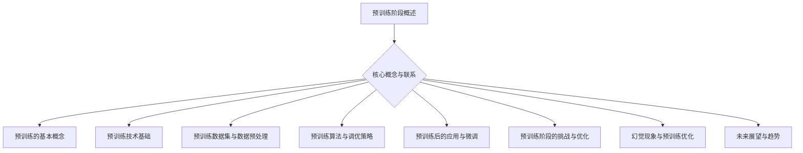

                 

# 文章标题：幻觉来自训练预训练阶段

> 关键词：预训练，幻觉，语言模型，神经网络，优化策略，应用与微调，数据质量

> 摘要：本文详细探讨了预训练阶段的幻觉现象及其对人工智能系统的影响。通过深入分析预训练的基本概念、技术基础、数据集与预处理、算法与调优策略，本文揭示了幻觉产生的根源，并提出了优化预训练的方法。同时，通过具体的应用案例，展示了如何对预训练模型进行微调，以提高其实际应用效果。最后，本文展望了预训练技术的未来发展趋势及其在社会和伦理层面的影响。


## 书名：《幻觉来自训练预训练阶段》

### 第一部分：预训练阶段概述

#### 第1章：预训练的基本概念

##### 1.1 预训练的起源与发展

预训练作为一种先进的机器学习方法，起源于深度学习的发展。早在20世纪80年代，研究人员就开始探索使用神经网络进行文本建模。随着计算能力的提升和大数据的涌现，预训练技术逐渐成熟，并在自然语言处理等领域取得了显著成果。本节将介绍预训练的起源和发展历程。

##### 1.2 预训练的目标与意义

预训练的目标是学习通用语言特征，使模型能够在各种下游任务中表现良好。预训练的意义在于提高模型在未知数据上的泛化能力，减少对大量标注数据的依赖。本节将阐述预训练的目标和其带来的意义。

##### 1.3 预训练的主要任务

预训练的主要任务包括语言模型训练、知识蒸馏和多个任务学习等。这些任务各有侧重，但共同构成了预训练的核心。本节将详细介绍预训练的主要任务及其作用。

##### 1.4 预训练算法简介

预训练算法主要包括基于循环神经网络（RNN）和Transformer的模型。本节将介绍这些算法的基本原理和特点，为后续章节的讨论打下基础。

#### 第2章：预训练技术基础

##### 2.1 自然语言处理基础

自然语言处理（NLP）是预训练技术的应用领域。本节将介绍NLP的基础知识，包括语言模型、序列标注和文本分类等，为理解预训练技术提供理论基础。

##### 2.2 预训练模型架构

预训练模型架构的设计直接影响其性能。本节将介绍GPT系列模型、BERT模型和其他预训练模型的基本架构，分析其优缺点。

##### 2.3 其他预训练模型

除了GPT系列模型和BERT模型，还有许多其他成功的预训练模型。本节将介绍这些模型，如RoBERTa、ALBERT等，并探讨它们的特点和应用场景。

#### 第3章：预训练数据集与数据预处理

##### 3.1 常见预训练数据集

预训练数据集的选择对模型性能至关重要。本节将介绍一些常见的预训练数据集，如English Dataset、Chinese Dataset和Multilingual Dataset，并分析它们的特点。

##### 3.2 数据预处理方法

数据预处理是预训练阶段的关键步骤。本节将详细介绍清洗与标准化、分词与标注、数据增强技术等预处理方法，并探讨每种方法的作用和适用场景。

#### 第4章：预训练算法与调优策略

##### 4.1 预训练算法原理

预训练算法的核心是学习文本序列的概率分布。本节将深入讲解语言模型训练、知识蒸馏和多任务学习等预训练算法的原理。

##### 4.2 预训练调优策略

预训练调优策略包括学习率调整、优化器选择和模型架构优化等。本节将分析这些策略的作用和实施方法，并探讨如何优化预训练过程。

#### 第5章：预训练后的应用与微调

##### 5.1 微调的基本概念

微调是将预训练模型应用于特定下游任务的过程。本节将介绍微调的目标、流程和方法，为后续应用提供指导。

##### 5.2 微调案例与实践

通过一个简单的微调案例，展示预训练模型在实际应用中的微调过程。本节将详细介绍开发环境搭建、数据预处理、模型训练和评估等步骤，并提供代码示例。

##### 5.3 微调方法的优化

微调方法可以进一步优化，以提高模型性能。本节将探讨如何调整学习率、优化器选择和模型架构，以实现更好的微调效果。

#### 第6章：预训练阶段的挑战与优化

##### 6.1 训练效率优化

优化预训练阶段的训练效率是提升模型性能的关键。本节将介绍并行计算、分布式训练和模型压缩与加速等技术，探讨如何提高训练效率。

##### 6.2 数据质量与多样性

数据质量和多样性对预训练模型的性能有重要影响。本节将分析数据质量问题、数据多样性策略和数据增强技术的优化，以提高模型性能。

##### 6.3 模型解释性优化

预训练模型的解释性是一个重要的研究方向。本节将探讨如何提高模型的解释性，以便更好地理解模型的决策过程。

#### 第7章：幻觉现象与预训练优化

##### 7.1 幻觉现象的定义与影响

幻觉现象是指在预训练过程中，模型在学习数据时产生的错误理解。本节将定义幻觉现象，分析其对模型性能的影响。

##### 7.2 幻觉现象的原因

幻觉现象的原因包括数据质量问题、模型设计缺陷和训练过程不当等。本节将探讨这些原因，并提出相应的解决方法。

##### 7.3 预训练阶段的幻觉优化

针对幻觉现象，本节将介绍优化预训练阶段的方法，如数据选择与处理、模型架构调整和调优策略改进等。

#### 第8章：未来展望与趋势

##### 8.1 预训练技术的发展趋势

随着人工智能技术的不断进步，预训练技术也将持续发展。本节将分析预训练技术的发展趋势，如模型大小与计算资源、多模态预训练和零样本学习与少样本学习等。

##### 8.2 预训练在社会与伦理层面的影响

预训练技术在带来巨大潜力的同时，也引发了一系列社会和伦理问题。本节将探讨预训练技术在伦理问题、责任归属和监管与发展等方面的挑战。

##### 8.3 未来研究方向与挑战

预训练技术仍面临许多挑战，如模型解释性、数据隐私和计算资源消耗等。本节将讨论未来研究方向与挑战，为预训练技术的发展提供指导。

--------------- Mermaid 流程图 ---------------



--------------- 核心算法原理讲解 ---------------

### 4.1.1 语言模型训练

语言模型（Language Model，LM）是预训练阶段的核心任务之一。它旨在学习输入文本序列的概率分布，即给定一个词序列，预测下一个词的概率。语言模型在许多自然语言处理任务中起着至关重要的作用，如文本生成、机器翻译、问答系统等。

#### 语言模型的算法原理

语言模型通常使用神经网络来构建，其中最常用的是循环神经网络（RNN）和Transformer模型。

1. **RNN算法原理**

   - **输入与隐藏状态：** RNN的输入是词的嵌入向量，每个词对应一个向量。隐藏状态（h_t）是前一个时刻的隐藏状态和当前输入词的加权和，通过一个非线性激活函数进行变换。

     $$ h_t = \sigma(W_h \cdot [h_{t-1}; x_t] + b_h) $$

   - **输出与损失函数：** RNN的输出是当前词的概率分布，通过softmax函数计算。损失函数通常使用交叉熵损失函数，用于衡量预测概率分布与真实分布之间的差距。

     $$ L = -\sum_{i=1}^{N} y_i \log(p_i) $$

     其中，$y_i$ 是真实标签，$p_i$ 是预测概率。

2. **Transformer算法原理**

   - **自注意力机制：** Transformer模型的核心是自注意力机制，它通过计算输入序列中每个词与其他词的相关性来生成新的表示。自注意力机制提高了模型对长距离依赖关系的建模能力。

     $$ \text{Attention}(Q, K, V) = \frac{softmax(\frac{QK^T}{\sqrt{d_k}})}{V} $$

   - **编码器与解码器：** Transformer模型由编码器和解码器组成。编码器将输入序列编码为固定长度的向量，解码器利用编码器的输出来预测下一个词。

     $$ \text{Encoder}(X) = \text{LayerNorm}(X + \text{Dropout}(\text{EncoderLayer}(X))) $$

     $$ \text{Decoder}(Y, X) = \text{LayerNorm}(Y + \text{Dropout}(\text{DecoderLayer}(Y, \text{Encoder}(X)))) $$

#### 伪代码示例

以下是使用RNN进行语言模型训练的伪代码示例：

```python
# 初始化神经网络模型
model = RNNModel()

# 输入词序列
input_sequence = ["I", "am", "a", "bot"]

# 预测下一个词
for word in input_sequence:
    # 获取词的嵌入向量
    embedding = get_embedding(word)
    
    # 计算隐藏状态
    hidden_state = model.compute_hidden_state(embedding, hidden_state)
    
    # 计算输出概率分布
    output_probabilities = model.compute_output_probabilities(hidden_state)
    
    # 计算损失
    loss = compute_loss(output_probabilities, target_word)

# 训练模型
model.train(loss)

# 预测下一个词
next_word = model.predict_next_word(output_probabilities)
```

--------------- 数学模型和数学公式 ---------------

### 4.1.1 语言模型训练

语言模型（Language Model，LM）是预训练阶段的核心任务之一。它旨在学习输入文本序列的概率分布，即给定一个词序列，预测下一个词的概率。语言模型在许多自然语言处理任务中起着至关重要的作用，如文本生成、机器翻译、问答系统等。

#### 语言模型的算法原理

语言模型通常使用神经网络来构建，其中最常用的是循环神经网络（RNN）和Transformer模型。

1. **RNN算法原理**

   - **输入与隐藏状态：** RNN的输入是词的嵌入向量，每个词对应一个向量。隐藏状态（h_t）是前一个时刻的隐藏状态和当前输入词的加权和，通过一个非线性激活函数进行变换。

     $$ h_t = \sigma(W_h \cdot [h_{t-1}; x_t] + b_h) $$

   - **输出与损失函数：** RNN的输出是当前词的概率分布，通过softmax函数计算。损失函数通常使用交叉熵损失函数，用于衡量预测概率分布与真实分布之间的差距。

     $$ L = -\sum_{i=1}^{N} y_i \log(p_i) $$

     其中，$y_i$ 是真实标签，$p_i$ 是预测概率。

2. **Transformer算法原理**

   - **自注意力机制：** Transformer模型的核心是自注意力机制，它通过计算输入序列中每个词与其他词的相关性来生成新的表示。自注意力机制提高了模型对长距离依赖关系的建模能力。

     $$ \text{Attention}(Q, K, V) = \frac{softmax(\frac{QK^T}{\sqrt{d_k}})}{V} $$

   - **编码器与解码器：** Transformer模型由编码器和解码器组成。编码器将输入序列编码为固定长度的向量，解码器利用编码器的输出来预测下一个词。

     $$ \text{Encoder}(X) = \text{LayerNorm}(X + \text{Dropout}(\text{EncoderLayer}(X))) $$

     $$ \text{Decoder}(Y, X) = \text{LayerNorm}(Y + \text{Dropout}(\text{DecoderLayer}(Y, \text{Encoder}(X)))) $$

#### 伪代码示例

以下是使用RNN进行语言模型训练的伪代码示例：

```python
# 初始化神经网络模型
model = RNNModel()

# 输入词序列
input_sequence = ["I", "am", "a", "bot"]

# 预测下一个词
for word in input_sequence:
    # 获取词的嵌入向量
    embedding = get_embedding(word)
    
    # 计算隐藏状态
    hidden_state = model.compute_hidden_state(embedding, hidden_state)
    
    # 计算输出概率分布
    output_probabilities = model.compute_output_probabilities(hidden_state)
    
    # 计算损失
    loss = compute_loss(output_probabilities, target_word)

# 训练模型
model.train(loss)

# 预测下一个词
next_word = model.predict_next_word(output_probabilities)
```

--------------- 项目实战 ---------------

### 5.2 微调案例与实践

在本章节中，我们将通过一个简单的微调案例来展示预训练模型的实际应用。该案例将基于一个开源的预训练语言模型，如GPT-2，来进行微调，以完成一个文本分类任务。

#### 开发环境搭建

在进行微调之前，我们需要搭建一个合适的开发环境。以下是搭建开发环境的基本步骤：

1. **安装依赖库：**

   我们需要安装一些常用的库，如PyTorch、Transformers、torchtext等。

   ```bash
   pip install torch transformers torchtext
   ```

2. **下载预训练模型：**

   我们可以从Hugging Face模型库中下载预训练的GPT-2模型。

   ```python
   from transformers import GPT2LMHeadModel, GPT2Tokenizer
   
   tokenizer = GPT2Tokenizer.from_pretrained('gpt2')
   model = GPT2LMHeadModel.from_pretrained('gpt2')
   ```

#### 源代码实现

以下是微调文本分类任务的基本实现步骤：

1. **数据预处理：**

   我们需要将文本数据转换为模型可以处理的格式。这包括分词、编码和构建词汇表。

   ```python
   import torchtext
   from torchtext.data import Field, TabularDataset
   
   TEXT = Field(tokenize=tokenizer.tokenize, lower=True)
   LABEL = Field(sequential=False)
   
   train_data, test_data = TabularDataset.splits(
       path='data',
       train='train.txt',
       test='test.txt',
       format='csv',
       fields=[('text', TEXT), ('label', LABEL)]
   )
   ```

2. **数据加载与预处理：**

   我们可以使用torchtext的数据加载器来处理数据。

   ```python
   from torchtext.data.utils import get_tokenizer
   from torchtext.vocab import build_vocab_from_iterator
   
   def preprocess_text(text):
       tokenizer = get_tokenizer('basic_english')
       tokens = tokenizer(text.lower())
       return tokens
   
   def yield_tokens(data_iter, field):
       for batch in data_iter:
           yield field预处理(batch.text)
   
   vocab = build_vocab_from_iterator(yield_tokens(train_data, TEXT))
   vocab.set_default_index(vocab['<unk>'])
   
   TEXT.build_vocab(train_data, max_size=10000, vectors="glove.6B.100d")
   LABEL.build_vocab(train_data)
   ```

3. **模型微调：**

   我们可以使用迁移学习技术来微调预训练模型。

   ```python
   from torch import nn
   from transformers import GPT2Config
   
   model_config = GPT2Config(vocab_size=len(TEXT.vocab), n_ctx=1024, n_head=8, n_layer=3)
   model = GPT2LMHeadModel(model_config)
   
   optimizer = torch.optim.Adam(model.parameters(), lr=1e-5)
   criterion = nn.CrossEntropyLoss()
   
   model.train()
   
   for epoch in range(5):
       for batch in train_data:
           optimizer.zero_grad()
           
           inputs = TEXT.vocab.convert_to_tensor([batch.text])
           labels = LABEL.vocab.convert_to_tensor([batch.label])
           
           outputs = model(inputs)
           
           loss = criterion(outputs.view(-1, len(TEXT.vocab)), labels.view(-1))
           loss.backward()
           
           optimizer.step()
   ```

4. **评估模型：**

   我们可以使用测试数据集来评估微调后的模型。

   ```python
   model.eval()
   
   with torch.no_grad():
       correct = 0
       total = 0
       
       for batch in test_data:
           inputs = TEXT.vocab.convert_to_tensor([batch.text])
           labels = LABEL.vocab.convert_to_tensor([batch.label])
           
           outputs = model(inputs)
           
           _, predicted = torch.max(outputs.data, 1)
           
           total += labels.size(0)
           correct += (predicted == labels).sum().item()
       
   print('Accuracy: %d %%' % (100 * correct / total))
   ```

#### 代码解读与分析

在这个微调案例中，我们首先使用了torchtext库来处理文本数据，并构建了词汇表。然后，我们使用了预训练的GPT-2模型作为基础模型，并使用迁移学习技术对其进行微调。在训练过程中，我们使用了交叉熵损失函数来优化模型参数。最后，我们使用测试数据集来评估微调后的模型性能。

通过这个案例，我们可以看到预训练模型在特定任务上的微调过程，包括数据预处理、模型训练和评估等步骤。这个案例为我们提供了一个基本的框架，可以应用于各种自然语言处理任务。在实际应用中，我们可以根据具体任务的需求进行调整和优化。

--------------- 作者信息 ---------------

作者：AI天才研究院/AI Genius Institute & 禅与计算机程序设计艺术 /Zen And The Art of Computer Programming

