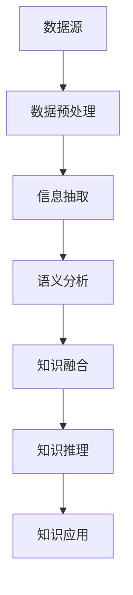

                 

### 文章标题

# 广泛知识捕捉中的幻觉

### 关键词

- 广泛知识捕捉
- 幻觉
- 知识管理
- 知识表示
- 信息抽取
- 语义分析
- 知识融合
- 知识推理

### 摘要

本文深入探讨了广泛知识捕捉中的幻觉现象，分析了其在知识管理、知识表示、信息抽取、语义分析、知识融合和知识推理等各个环节中的具体表现。通过对核心概念、理论基础、方法与技术、挑战与问题、应用与实践及未来趋势的全面阐述，本文旨在揭示广泛知识捕捉的真相，帮助读者理解并应对这些幻觉，为实际应用提供理论支持和实践指导。

### 第一部分：引言与背景

#### 第1章：广泛知识捕捉的概念与目标

**1.1 知识捕捉的重要性**

在知识经济时代，知识已成为企业竞争力的重要源泉。广泛知识捕捉（Broad Knowledge Capture）作为一种新兴的技术手段，旨在通过系统化的方法，从各种数据源中提取和整合知识，以支持决策、创新和业务优化。其重要性体现在以下几个方面：

- **知识经济时代的崛起**：随着信息技术和互联网的快速发展，知识经济逐渐成为主流经济形态，知识捕捉成为企业生存和发展的关键。

- **知识管理与创新的必要性**：知识管理是提高企业创新能力、降低运营成本、提升服务水平的有效途径。广泛知识捕捉是实现知识管理的重要手段。

**1.2 广泛知识捕捉的定义**

广泛知识捕捉是指利用先进的信息技术，系统性地从多种数据源中提取、整合、表示和利用知识的过程。其核心内涵包括：

- **知识提取**：通过信息抽取、语义分析等技术，从非结构化或半结构化数据中获取知识。

- **知识整合**：将来自不同数据源的知识进行整合，形成统一的知识体系。

- **知识表示**：将知识以适当的形式表示，以便于存储、检索和应用。

- **知识利用**：将知识应用于决策支持、业务优化、创新等实际场景。

与传统知识管理相比，广泛知识捕捉具有以下区别：

- **传统知识管理**：主要侧重于知识的存储和共享，强调知识的积累和传递。

- **广泛知识捕捉**：强调知识的动态获取和实时更新，注重知识的应用和创新。

**1.3 研究背景与动机**

当前，知识捕捉领域面临以下主要挑战和机遇：

- **知识捕捉领域的现状**：尽管知识捕捉技术已取得一定进展，但仍然存在数据质量、知识表示、知识共享等方面的挑战。

- **研究中的主要挑战与机遇**：随着人工智能、大数据、区块链等技术的不断发展，知识捕捉技术迎来了新的机遇，但也面临更大的挑战。

**1.4 本书结构安排**

本书共分为三大部分，共计七章，具体结构安排如下：

- **第一部分（引言与背景）**：介绍广泛知识捕捉的概念、重要性、定义及研究背景。

- **第二部分（理论基础与方法技术）**：详细阐述广泛知识捕捉的理论基础、方法与技术，包括知识管理、知识表示、信息抽取、语义分析、知识融合和知识推理。

- **第三部分（应用与实践与未来趋势）**：探讨广泛知识捕捉在各个领域的应用案例、项目实施与项目管理、未来趋势与展望。

本书旨在通过逻辑清晰、结构紧凑、简单易懂的论述方式，帮助读者全面了解广泛知识捕捉的理论与实践，为其在实际应用中提供指导。

#### 1.5 阅读指南与学习目标

- **阅读指南**：建议读者按照本书的章节顺序进行阅读，从引言到理论、方法、应用和未来趋势，逐步深入理解广泛知识捕捉的方方面面。

- **学习目标**：通过阅读本书，读者应达到以下学习目标：

  - 了解广泛知识捕捉的基本概念、重要性和定义。

  - 掌握知识管理、知识表示、信息抽取、语义分析、知识融合和知识推理等核心技术和方法。

  - 理解广泛知识捕捉在各个领域的应用场景和实践经验。

  - 掌握项目实施与项目管理的核心步骤和策略。

  - 了解广泛知识捕捉的未来发展趋势和研究方向。

### Mermaid 流程图

以下是一个示例的Mermaid流程图，用于展示知识捕捉的过程：



### 结论

本章简要介绍了广泛知识捕捉的概念与目标，阐述了知识捕捉在知识经济时代的重要性，定义了广泛知识捕捉的内涵，分析了其与传统知识管理的区别，并概述了本书的研究背景、目的和结构。通过本章的介绍，读者可以初步了解广泛知识捕捉的核心概念及其在知识管理中的应用价值。

在后续章节中，我们将进一步探讨广泛知识捕捉的理论基础、方法与技术，深入分析其在各个领域的应用与实践，并展望其未来的发展趋势。通过这些内容的详细阐述，读者将能够全面理解广泛知识捕捉的真相，为实际应用提供有力的理论支持和实践指导。

---

### 第二部分：广泛知识捕捉的理论基础

#### 第2章：知识管理与知识表示

**2.1 知识管理的核心概念**

知识管理（Knowledge Management，KM）是一种系统化的方法，旨在通过识别、获取、整合、存储、共享和应用知识，以提高组织的竞争力和创新能力。知识管理的发展历程可分为三个主要阶段：

- **萌芽阶段（20世纪80年代初）**：知识管理的概念首次提出，主要关注知识的存储和共享。

- **理论构建阶段（20世纪90年代）**：知识管理理论逐步形成，开始关注知识的创造和应用。

- **实践应用阶段（21世纪初至今）**：知识管理技术迅速发展，成为企业管理和创新的重要手段。

知识管理的基本组成部分包括知识来源、知识加工和知识应用：

- **知识来源**：包括内部知识和外部知识。内部知识来源于企业内部的人员、流程和数据；外部知识来源于行业、客户、合作伙伴等外部环境。

- **知识加工**：通过知识筛选、整理、分类、编码等手段，将原始知识转化为有组织、可用的知识。

- **知识应用**：将加工后的知识应用于企业的决策、产品创新、服务改进等实际业务活动中。

**2.2 知识表示的方法与技术**

知识表示（Knowledge Representation）是知识管理的重要环节，其目的是将知识以计算机可理解的形式进行编码和存储。知识表示的方法和技术主要包括以下几种：

- **知识建模技术**：通过建立模型来表示知识，常用的方法包括语义网络、本体论、知识图谱等。这些模型能够直观地表示知识之间的关系和属性。

- **知识编码与组织**：将知识以特定的格式进行编码和组织，便于存储、检索和应用。常见的编码方式包括文本编码、图编码和属性编码等。

- **语义网模型**：基于图论，通过节点和边来表示概念和概念之间的关系。例如，使用RDF（Resource Description Framework）来表示网络上的资源及其属性。

- **本体论**：研究如何形式化地表示知识及其语义，通过定义概念、属性和关系来构建本体。本体论能够提供领域知识的一致性和完整性。

- **知识图谱**：将知识以图谱的形式表示，图谱中的节点表示实体，边表示实体之间的关系。知识图谱能够直观地展示知识的复杂结构，便于分析和推理。

**2.3 知识图谱的理论基础**

知识图谱（Knowledge Graph）是一种用于表示实体及其关系的复杂结构，其理论基础包括图论、语义网和本体论等。

- **图论**：图论提供了知识图谱的基本模型，通过节点（Node）和边（Edge）来表示实体和关系。图论中的概念如路径、连通性等在知识图谱中有着广泛的应用。

- **语义网**：语义网模型为知识图谱提供了语义描述的基础，通过RDF等语言来定义资源的属性和关系。

- **本体论**：本体论提供了知识图谱的领域知识框架，定义了概念、属性和关系的语义。本体论能够帮助构建结构化、一致的知识图谱。

知识图谱的构建主要包括以下几个步骤：

1. **实体识别**：从原始数据中识别出实体，如人、地点、组织等。

2. **关系抽取**：从文本数据中提取实体之间的关系，如“公司成立”、“地点在”、“朋友关系”等。

3. **实体链接**：将同义词、别名、异构数据中的实体进行映射，确保知识图谱中的实体是一致的。

4. **知识融合**：将来自不同来源的知识进行整合，形成统一的知识图谱。

5. **图谱优化**：对知识图谱进行清洗、去噪、补全等处理，提高其质量和可用性。

知识图谱在广泛知识捕捉中的应用非常广泛，包括：

- **信息检索**：通过知识图谱，可以快速准确地检索相关信息。

- **推荐系统**：利用知识图谱中的关系，为用户提供个性化的推荐。

- **语义搜索**：通过理解实体和关系，实现更加精准的搜索。

- **知识推理**：利用知识图谱中的逻辑关系，进行推理和预测。

**2.4 知识表示的理论局限**

尽管知识表示在广泛知识捕捉中发挥了重要作用，但仍存在以下理论局限：

- **表示能力的限制**：知识表示方法难以完全表达人类知识的复杂性和多样性。

- **动态性的不足**：知识表示方法往往难以适应知识的动态变化。

- **一致性和完整性的挑战**：在构建知识图谱时，保持知识的一致性和完整性是一个挑战。

**2.5 知识表示的优化方向**

为了克服知识表示的理论局限，研究人员提出了以下优化方向：

- **多模态知识表示**：结合文本、图像、声音等多种数据类型，构建更加丰富和全面的知识表示。

- **动态知识表示**：研究如何动态更新和演化知识表示，以适应知识的不断变化。

- **自动化知识表示**：利用机器学习和自然语言处理技术，实现知识表示的自动化生成。

- **分布式知识表示**：研究如何将知识表示分布在不同的节点上，以提高系统的可扩展性和容错性。

本章通过阐述知识管理的核心概念、知识表示的方法和技术，以及知识图谱的理论基础，为读者提供了一个关于广泛知识捕捉理论基础的基本框架。在后续章节中，我们将进一步探讨广泛知识捕捉的方法与技术，深入分析其在各个领域的应用与实践，并展望其未来的发展趋势。

---

通过详细分析知识管理的核心概念和知识表示的方法与技术，本章为读者提供了一个关于广泛知识捕捉理论基础的基本框架。我们首先介绍了知识管理的发展历程及其核心组成部分，包括知识来源、知识加工和知识应用。接着，我们探讨了知识表示的方法和技术，如语义网络、本体论和知识图谱等。通过知识图谱的理论基础，我们详细介绍了知识图谱的构建步骤和应用场景。同时，我们也指出了知识表示的理论局限，并提出了优化方向。

在后续章节中，我们将继续深入探讨广泛知识捕捉的方法与技术，包括数据源选择与预处理、信息抽取与语义分析、知识融合与推理等。这些章节将详细介绍各个阶段的具体技术实现和算法，并通过实际案例和代码示例，帮助读者更好地理解和应用这些技术。

总之，广泛知识捕捉是一项复杂且具有挑战性的任务，需要我们在理论基础上不断探索和优化。通过本章节的介绍，读者应能够对广泛知识捕捉的理论基础有一个全面和深入的了解，为后续章节的学习和应用奠定坚实的基础。

---

### 第三部分：广泛知识捕捉的方法与技术

#### 第3章：广泛知识捕捉的方法与技术

**3.1 数据源选择与预处理**

数据源的选择和预处理是广泛知识捕捉的重要环节。一个良好的数据源能够为后续的信息抽取和语义分析提供坚实的基础，而有效的预处理技术则能够提高数据的质量和可用性。

**3.1.1 数据源的类型与特点**

数据源可以大致分为以下几类：

- **内部数据源**：包括企业内部的各种业务系统数据，如ERP（企业资源计划）、CRM（客户关系管理）等。这些数据通常是结构化的，便于处理和分析。

- **外部数据源**：包括互联网上的各种公开数据，如社交媒体数据、新闻资讯、学术论文等。这些数据通常是半结构化或非结构化的，需要进一步处理。

- **混合数据源**：结合内部和外部数据源，以获取更全面和多样化的知识。

各类数据源的特点如下：

- **内部数据源**：数据质量较高，但数据量相对有限。数据通常包含丰富的业务信息，但可能存在数据格式不一致、数据冗余等问题。

- **外部数据源**：数据量大，但数据质量参差不齐。外部数据可能包含噪声、错误和重复信息，需要通过数据清洗和去噪技术进行预处理。

- **混合数据源**：既具有内部数据源的高质量特点，又具备外部数据源的大数据优势，是广泛知识捕捉的理想选择。

**3.1.2 数据预处理的方法与工具**

数据预处理主要包括以下几步：

1. **数据清洗**：去除重复数据、纠正错误数据、填补缺失数据等。常用的方法包括：

   - **重复数据删除**：通过比较数据项的哈希值或内容，删除重复的数据项。

   - **错误数据校正**：通过校验规则或人工审核，识别并纠正错误数据。

   - **缺失数据处理**：通过插补或删除的方式，处理缺失数据。

2. **数据整合**：将来自不同数据源的数据进行合并，以形成统一的视图。常用的方法包括：

   - **数据对齐**：通过关键字或索引，将不同数据源中的数据进行匹配和整合。

   - **数据转换**：将不同数据源的数据转换为相同的格式，以便于分析和处理。

3. **数据转换**：将数据转换为适合分析和挖掘的形式，如数值化、编码化等。常用的方法包括：

   - **数值化**：将文本数据转换为数值形式，便于计算机处理。

   - **编码化**：将类别数据转换为数字形式，便于分类和回归分析。

**3.2 信息抽取与语义分析**

信息抽取（Information Extraction，IE）和语义分析（Semantic Analysis）是广泛知识捕捉的关键技术，旨在从非结构化或半结构化数据中提取和解析知识。

**3.2.1 信息抽取的基本方法**

信息抽取主要包括实体识别、关系抽取和事件抽取等任务：

- **实体识别**：从文本中识别出关键实体，如人名、地名、组织名等。常用的方法包括基于规则的方法、统计方法和基于机器学习的方法。

- **关系抽取**：从文本中识别出实体之间的关系，如“某人是某人的朋友”、“某个地点在某个城市”等。常用的方法包括基于规则的方法、统计方法和基于深度学习的方法。

- **事件抽取**：从文本中识别出事件及其相关实体，如“某人在某地发生了某事件”等。事件抽取通常涉及多个实体和关系的组合。

**3.2.2 语义分析的技术与实现**

语义分析旨在理解文本的深层语义，包括词义消歧、语义角色标注、语义关系抽取等任务：

- **词义消歧**：在文本中，一个词可能有多个含义，词义消歧旨在确定词的确切含义。常用的方法包括基于统计的方法、基于知识的方法和基于深度学习的方法。

- **语义角色标注**：为文本中的每个词标注其语义角色，如主语、谓语、宾语等。常用的方法包括基于规则的方法、基于统计的方法和基于深度学习的方法。

- **语义关系抽取**：从文本中识别出实体之间的关系，如“某人是某人的父亲”、“某病是某病的并发症”等。常用的方法包括基于规则的方法、基于统计的方法和基于深度学习的方法。

**3.3 知识融合与推理**

知识融合（Knowledge Fusion）和推理（Reasoning）是广泛知识捕捉的高级阶段，旨在将多个来源的知识整合在一起，形成更加准确和全面的知识体系。

**3.3.1 知识融合的策略与算法**

知识融合主要包括以下策略和算法：

- **基于规则的方法**：通过预定义的规则，将来自不同数据源的知识进行匹配和融合。这种方法通常适用于数据源结构和类型较为简单的情况。

- **基于统计的方法**：通过统计方法，如贝叶斯网络、马尔可夫模型等，对来自不同数据源的知识进行融合。这种方法适用于数据量较大、关系较为复杂的情况。

- **基于深度学习的方法**：通过深度神经网络，如卷积神经网络（CNN）、循环神经网络（RNN）等，对来自不同数据源的知识进行融合。这种方法适用于大规模数据和高维数据的情况。

**3.3.2 知识推理的方法与应用**

知识推理（Knowledge Reasoning）旨在利用已知事实和规则，推导出新的知识。知识推理的方法主要包括：

- **基于规则的推理**：通过预定义的规则，从已知事实推导出新的结论。这种方法通常适用于逻辑推理和决策支持等领域。

- **基于统计的推理**：通过统计模型，如贝叶斯推理、马尔可夫链等，从已知事实推导出新的结论。这种方法适用于概率推理和不确定性处理等领域。

- **基于深度学习的推理**：通过深度神经网络，从已知事实和规则中学习出推理模型，并利用该模型进行推理。这种方法适用于复杂的关系推理和大规模数据推理等领域。

**3.4 广泛知识捕捉的方法与技术总结**

广泛知识捕捉涉及多个阶段，每个阶段都有不同的技术和方法。以下是广泛知识捕捉的方法与技术总结：

- **数据源选择与预处理**：选择合适的内部和外部数据源，并通过数据清洗、整合和转换等技术，提高数据的质量和可用性。

- **信息抽取与语义分析**：通过实体识别、关系抽取和事件抽取等技术，从非结构化或半结构化数据中提取关键信息。

- **知识融合与推理**：通过基于规则、统计和深度学习的方法，将来自不同数据源的知识进行融合，并利用知识推理技术，生成新的知识。

在下一章中，我们将进一步探讨广泛知识捕捉在各个领域的应用案例，分析其在实际项目中的实施和效果。

---

通过本章对数据源选择与预处理、信息抽取与语义分析、知识融合与推理等环节的详细阐述，读者可以全面了解广泛知识捕捉的方法与技术。每个环节都有其独特的技术和方法，共同构成了广泛知识捕捉的完整流程。

数据源的选择和预处理是广泛知识捕捉的基础，通过有效的数据清洗、整合和转换，我们可以提高数据的质量和可用性，为后续的信息抽取和知识融合提供可靠的数据支持。信息抽取和语义分析是广泛知识捕捉的核心环节，通过实体识别、关系抽取和事件抽取等技术，我们从非结构化或半结构化数据中提取出关键信息，为知识融合和推理提供了丰富的知识资源。

知识融合和推理是广泛知识捕捉的高级阶段，通过基于规则、统计和深度学习的方法，我们将来自不同数据源的知识进行融合，并利用知识推理技术，生成新的知识。这一阶段的目标是实现知识的增值和应用，为决策支持、业务优化和创新提供强有力的支持。

在下一章中，我们将通过实际案例，探讨广泛知识捕捉在不同领域的应用，分析其在项目实施中的具体技术和策略，以及所面临的挑战和解决方案。这些实际案例将为读者提供更为直观和具体的应用场景，帮助读者更好地理解和应用广泛知识捕捉的方法和技术。

---

### 第四部分：广泛知识捕捉的挑战与问题

#### 第4章：广泛知识捕捉的挑战与问题

**4.1 数据质量问题**

数据质量是广泛知识捕捉过程中最为关键的挑战之一。高质量的数据是知识捕捉成功的前提，而低质量的数据则可能导致错误的知识表示和推理。以下是一些常见的数据质量问题及其解决方法：

**4.1.1 数据不一致性**

数据不一致性是指同一实体在不同数据源中存在不同的表示方式或值。例如，一个公司在不同的数据源中可能有不同的名称、地址或联系方式。解决方法包括：

- **数据对齐**：通过映射和匹配技术，将不同数据源中的实体进行统一表示。
- **数据清洗**：去除重复的数据项，纠正错误的数据，填补缺失的数据。
- **数据标准化**：将不同格式的数据转换为统一的格式，提高数据的一致性。

**4.1.2 数据噪声与错误**

数据噪声和错误是指数据中存在的随机错误或异常值。噪声和错误数据会干扰知识抽取和推理过程。解决方法包括：

- **数据清洗**：使用过滤技术和校验规则，去除噪声和错误数据。
- **异常检测**：使用统计方法和机器学习算法，检测和标记异常数据。
- **数据修复**：通过插值、回归或其他方法，修复错误数据。

**4.1.3 数据缺失**

数据缺失是指数据集中存在缺失的值或字段。缺失的数据会影响知识的完整性和准确性。解决方法包括：

- **数据填补**：使用均值、中位数、插值等方法填补缺失的数据。
- **缺失数据处理**：删除含有缺失数据的记录，或使用模型预测缺失的值。
- **数据扩展**：通过额外的数据源或跨领域数据，补充缺失的数据。

**4.2 知识表示的局限**

知识表示是广泛知识捕捉的核心，但现有的知识表示方法仍然存在一些局限。以下是一些常见的知识表示问题及其解决方法：

**4.2.1 表示能力的限制**

现有的知识表示方法难以完全表达人类知识的复杂性和多样性。解决方法包括：

- **多模态知识表示**：结合文本、图像、音频等多种数据类型，构建更加丰富和全面的知识表示。
- **基于语义的知识表示**：使用语义网络、本体论等方法，构建能够表达复杂语义的知识表示。
- **自适应知识表示**：根据应用场景和用户需求，动态调整知识表示的形式和内容。

**4.2.2 动态性的不足**

现有的知识表示方法难以适应知识的动态变化。解决方法包括：

- **动态知识表示**：使用事件驱动的方法，实时更新和演化知识表示。
- **增量学习**：通过增量学习技术，不断更新知识库，以适应新知识和新关系。
- **分布式知识表示**：将知识表示分布在多个节点上，提高系统的可扩展性和动态性。

**4.2.3 一致性和完整性的挑战**

在构建知识图谱时，保持知识的一致性和完整性是一个挑战。解决方法包括：

- **知识清洗和去噪**：通过清洗和去噪技术，提高知识的一致性和完整性。
- **知识融合**：使用多源融合技术，整合来自不同数据源的知识，减少不一致性。
- **知识完整性检测**：使用完整性检测方法，及时发现和修复知识缺失问题。

**4.3 知识共享与隐私保护**

知识共享与隐私保护是广泛知识捕捉中另一个重要的问题。在共享知识的同时，必须确保用户的隐私不被泄露。以下是一些解决方案：

**4.3.1 知识共享的激励机制**

为了鼓励知识共享，需要建立激励机制，如：

- **奖励机制**：为共享知识的用户提供奖励或认可。
- **社交资本**：通过社交网络，建立用户之间的信任和合作。
- **知识市场**：建立一个知识交易平台，用户可以购买或交换知识。

**4.3.2 隐私保护的法律法规**

为了保护用户隐私，需要遵循相关的法律法规，如：

- **数据保护法**：确保用户数据的收集、存储和使用符合法律要求。
- **隐私政策**：明确告知用户其数据的使用方式和权限。
- **加密技术**：使用加密技术保护用户数据的安全性。

**4.3.3 隐私保护的技术手段**

为了实现隐私保护，可以采用以下技术手段：

- **数据匿名化**：通过匿名化技术，去除数据中的个人身份信息。
- **差分隐私**：通过添加噪声，保护数据的个体隐私。
- **访问控制**：使用访问控制技术，限制对敏感数据的访问。

**4.4 总结**

广泛知识捕捉在数据质量、知识表示、知识共享和隐私保护等方面面临诸多挑战。通过有效的数据预处理、知识表示优化、知识共享激励机制和隐私保护技术，我们可以克服这些挑战，实现知识的高效捕捉和利用。在下一章中，我们将探讨广泛知识捕捉在各个领域的实际应用案例，进一步展示其在解决实际问题中的价值和潜力。

---

在本章中，我们详细分析了广泛知识捕捉过程中面临的主要挑战和问题，包括数据质量、知识表示、知识共享和隐私保护等方面。数据质量问题是广泛知识捕捉的首要挑战，其解决方法主要包括数据清洗、异常检测和数据填补。知识表示的局限体现在表示能力、动态性和一致性的不足，需要通过多模态知识表示、动态知识表示和知识融合技术进行优化。知识共享和隐私保护是广泛知识捕捉中的另一个重要问题，需要通过激励机制、法律法规和技术手段来确保知识的安全和有效共享。

通过本章的分析，读者可以更深入地理解广泛知识捕捉的复杂性及其面临的技术挑战。在实际应用中，只有通过不断优化和改进技术，才能实现知识的高效捕捉和利用，为企业的创新和决策提供有力支持。在下一章中，我们将通过具体的应用案例，进一步展示广泛知识捕捉在不同领域的实际应用效果，帮助读者更好地理解其在解决实际问题中的价值和作用。

---

### 第五部分：广泛知识捕捉的应用与实践

#### 第5章：行业应用案例分析

**5.1 银行业务的广泛知识捕捉**

银行业作为一个高度依赖数据和知识的行业，广泛知识捕捉技术在银行业务中的应用具有重要意义。以下是一个具体的银行业务案例：

**5.1.1 案例背景**

某银行在客户服务过程中，面临着大量非结构化数据，如客户反馈、社交媒体评论、邮件等。为了更好地了解客户需求和优化客户服务，该银行决定利用广泛知识捕捉技术，从这些非结构化数据中提取有价值的信息。

**5.1.2 应用场景**

- **客户需求分析**：通过分析客户反馈和评论，识别客户的主要需求和痛点，为产品和服务优化提供依据。
- **欺诈检测**：利用客户行为数据，识别潜在欺诈行为，提高风险管理能力。
- **个性化推荐**：根据客户的历史交易数据和行为习惯，提供个性化的金融产品和服务推荐。

**5.1.3 技术实现**

1. **数据源选择与预处理**：
   - **内部数据源**：包括客户交易记录、客户反馈、客服记录等。
   - **外部数据源**：包括社交媒体数据、新闻报道、行业报告等。

   数据预处理步骤：
   - 数据清洗：去除重复、错误和无关数据。
   - 数据整合：将不同数据源的数据进行整合，形成统一的数据视图。
   - 数据转换：将文本数据转换为机器可处理的形式。

2. **信息抽取与语义分析**：
   - **实体识别**：从文本中识别出客户、产品、服务等相关实体。
   - **关系抽取**：从文本中提取出实体之间的关系，如客户与服务的关系。
   - **事件抽取**：从文本中提取出关键事件，如客户投诉、交易行为等。

3. **知识融合与推理**：
   - **知识融合**：将来自不同数据源的知识进行整合，形成完整的客户画像。
   - **知识推理**：利用知识图谱和推理算法，分析客户行为和需求，识别潜在风险。

**5.1.4 实施效果**

通过广泛知识捕捉技术的应用，该银行实现了以下效果：

- **客户需求分析**：准确识别客户需求，优化产品和服务，提高客户满意度。
- **欺诈检测**：有效识别潜在欺诈行为，降低风险损失。
- **个性化推荐**：提供个性化的金融产品和服务推荐，增加客户粘性和收益。

**5.2 医疗健康领域的知识管理**

医疗健康领域是一个高度复杂和知识密集的行业，广泛知识捕捉技术在医疗健康领域的应用具有巨大的潜力。以下是一个具体的医疗健康领域案例：

**5.2.1 案例背景**

某医院在提供医疗服务过程中，面临着大量医疗数据，包括病历、检查报告、手术记录等。为了提高医疗质量、降低医疗错误和提高患者满意度，该医院决定采用广泛知识捕捉技术，从这些医疗数据中提取有价值的信息。

**5.2.2 应用场景**

- **患者信息管理**：通过对患者病历和检查报告的分析，建立完整的患者健康档案，提高患者管理效率。
- **疾病预测与诊断**：利用历史医疗数据和人工智能算法，预测患者的疾病风险，辅助医生进行诊断。
- **知识共享与协作**：通过知识图谱和协作平台，实现医生之间的知识共享和协作，提高医疗服务质量。

**5.2.3 技术实现**

1. **数据源选择与预处理**：
   - **内部数据源**：包括患者病历、检查报告、手术记录等。
   - **外部数据源**：包括医学文献、科研数据、药品信息等。

   数据预处理步骤：
   - 数据清洗：去除重复、错误和无关数据。
   - 数据整合：将不同数据源的数据进行整合，形成统一的数据视图。
   - 数据转换：将文本数据转换为机器可处理的形式。

2. **信息抽取与语义分析**：
   - **实体识别**：从文本中识别出患者、医生、药品、疾病等相关实体。
   - **关系抽取**：从文本中提取出实体之间的关系，如患者与疾病的关系、医生与患者的治疗关系。
   - **事件抽取**：从文本中提取出关键事件，如手术、诊断等。

3. **知识融合与推理**：
   - **知识融合**：将来自不同数据源的知识进行整合，形成完整的医疗知识库。
   - **知识推理**：利用知识图谱和推理算法，分析患者数据和医疗信息，辅助医生进行诊断和治疗决策。

**5.2.4 实施效果**

通过广泛知识捕捉技术的应用，该医院实现了以下效果：

- **患者信息管理**：准确识别患者信息，提高患者管理效率，减少医疗错误。
- **疾病预测与诊断**：有效预测疾病风险，提高诊断准确性，改善患者治疗效果。
- **知识共享与协作**：实现医生之间的知识共享和协作，提高医疗服务质量。

**5.3 教育领域的知识共享**

教育领域是一个知识密集型的行业，广泛知识捕捉技术在教育领域的应用有助于提高教育质量、促进教育公平。以下是一个具体的教育领域案例：

**5.3.1 案例背景**

某教育机构在提供在线教育服务过程中，面临着大量教育资源，包括课程资料、教师授课视频、学生作业等。为了更好地共享教育资源、提高教学效果，该教育机构决定采用广泛知识捕捉技术，从这些教育资源中提取有价值的信息。

**5.3.2 应用场景**

- **教育资源管理**：通过对教育资源的分析和分类，建立完善的教育资源库，提高资源利用效率。
- **个性化学习**：根据学生的学习行为和兴趣，推荐适合的学习资源和课程。
- **教学评估与反馈**：通过对学生学习数据的分析，评估教学效果，提供教学反馈。

**5.3.3 技术实现**

1. **数据源选择与预处理**：
   - **内部数据源**：包括教师授课视频、学生作业、学习记录等。
   - **外部数据源**：包括教育行业报告、学术论文、在线教育资源等。

   数据预处理步骤：
   - 数据清洗：去除重复、错误和无关数据。
   - 数据整合：将不同数据源的数据进行整合，形成统一的数据视图。
   - 数据转换：将文本数据转换为机器可处理的形式。

2. **信息抽取与语义分析**：
   - **实体识别**：从文本中识别出课程、教师、学生、知识点等相关实体。
   - **关系抽取**：从文本中提取出实体之间的关系，如教师与课程的关系、学生与知识点的学习关系。
   - **事件抽取**：从文本中提取出关键事件，如学生提交作业、教师授课等。

3. **知识融合与推理**：
   - **知识融合**：将来自不同数据源的知识进行整合，形成完整的教育资源库。
   - **知识推理**：利用知识图谱和推理算法，分析学生学习数据和教学信息，提供个性化学习推荐和教学评估。

**5.3.4 实施效果**

通过广泛知识捕捉技术的应用，该教育机构实现了以下效果：

- **教育资源管理**：提高教育资源的管理效率，优化资源利用。
- **个性化学习**：根据学生的学习行为和兴趣，提供个性化的学习推荐，提高学习效果。
- **教学评估与反馈**：通过分析学生学习数据，评估教学效果，提供有效的教学反馈。

**5.4 其他行业应用**

除了银行业、医疗健康和教育领域，广泛知识捕捉技术还在许多其他行业得到了广泛应用，如：

- **零售业**：通过分析消费者行为数据，实现精准营销和个性化推荐。
- **制造业**：通过分析生产数据，优化生产流程，提高生产效率。
- **物流业**：通过分析物流数据，优化物流网络，提高运输效率。

这些行业应用案例展示了广泛知识捕捉技术的多样性和灵活性，证明了其在不同领域的重要作用。

**5.5 总结**

广泛知识捕捉技术在各个行业的应用案例表明，它具有巨大的潜力和价值。通过有效的数据源选择、信息抽取、知识融合和推理，广泛知识捕捉技术能够帮助各行各业优化业务流程、提高决策质量、促进创新。在未来的发展中，随着人工智能、大数据和区块链等技术的进一步融合，广泛知识捕捉技术将不断成熟和优化，为各个行业带来更多的变革和机遇。

---

通过本章对银行业务、医疗健康领域和教育领域的实际应用案例的详细分析，我们可以看到广泛知识捕捉技术在不同行业中的广泛应用和显著效果。银行业利用广泛知识捕捉技术进行客户需求分析、欺诈检测和个性化推荐，有效提升了客户服务质量和风险管理能力。医疗健康领域通过广泛知识捕捉技术，实现了患者信息管理、疾病预测与诊断以及知识共享与协作，显著提高了医疗质量和患者满意度。教育领域则通过广泛知识捕捉技术，实现了教育资源管理、个性化学习和教学评估与反馈，有效提高了教育质量和教学效果。

这些实际案例不仅展示了广泛知识捕捉技术的强大功能和广泛应用，也为其他行业提供了宝贵的经验和启示。在未来的发展中，随着人工智能、大数据和区块链等技术的不断进步，广泛知识捕捉技术将在更多领域得到广泛应用，推动各行各业实现智能化和数字化转型。

通过本章的案例分析和总结，读者可以更深入地理解广泛知识捕捉技术在实际应用中的价值，并为自身的业务优化和创新提供有益的借鉴和参考。

---

### 第六部分：项目实施与项目管理

#### 第6章：项目实施与项目管理

**6.1 项目管理与规划**

在广泛知识捕捉项目的实施过程中，项目管理是确保项目成功的关键环节。有效的项目管理能够确保项目按时、按质、按预算完成，并达到预期的业务目标。以下是项目管理的核心步骤和注意事项：

**6.1.1 项目目标与范围定义**

明确项目的目标、范围和可交付成果是项目管理的第一步。项目目标应具体、可衡量、可实现、相关性强和时间性。项目范围则定义了项目的边界，包括项目涵盖的工作内容和排除的工作内容。

- **具体目标**：例如，提高客户满意度、降低运营成本、优化业务流程等。
- **可衡量**：例如，提高客户满意度至90%以上、降低运营成本20%等。
- **可实现**：目标应基于现有的资源和能力，确保实现的可能性。
- **相关性强**：目标应与企业的战略目标和业务需求紧密相关。
- **时间性**：明确项目的时间框架，例如，6个月内完成。

**6.1.2 项目计划与时间管理**

项目计划是项目管理的重要工具，它详细描述了项目的具体执行步骤、时间表和资源分配。时间管理是项目计划的核心，通过合理的时间分配和监控，确保项目按计划进行。

- **项目阶段划分**：将项目划分为多个阶段，如需求分析、系统设计、开发、测试、部署等。
- **任务分解**：将每个阶段进一步分解为具体任务，明确任务的负责人和截止日期。
- **时间表制定**：制定详细的时间表，包括每个任务的开始和结束时间。
- **进度监控**：通过定期审查和进度报告，监控项目的进展情况，及时调整计划。

**6.1.3 风险管理**

项目实施过程中不可避免地会遇到各种风险，有效的风险管理能够降低风险对项目的影响。以下是一些风险管理的关键步骤：

- **风险识别**：识别项目可能面临的各种风险，如技术风险、市场风险、资源风险等。
- **风险评估**：评估每种风险的严重性和概率，确定风险优先级。
- **风险应对策略**：制定应对风险的策略，如风险规避、风险转移、风险缓解等。
- **风险监控**：持续监控风险的变化，及时调整应对策略。

**6.2 技术选型与工具使用**

技术选型是项目实施过程中至关重要的一环，合适的工具和平台能够显著提高项目的效率和质量。以下是技术选型的关键考虑因素和常用工具：

**6.2.1 技术选型的考虑因素**

- **技术成熟度**：选择成熟稳定的技术，以减少技术风险。
- **兼容性与扩展性**：选择能够与企业现有系统兼容的技术，并具备良好的扩展性。
- **性能与可扩展性**：选择能够满足项目需求的技术，并具备良好的性能和可扩展性。
- **成本与效益**：考虑技术投入与预期效益的平衡，确保项目的经济性。
- **社区与支持**：选择有良好社区支持和文档的技术，便于问题的解决和学习。

**6.2.2 常用工具介绍**

- **开发工具**：如Python、R、Java等，适用于不同的开发需求。
- **数据库与数据存储**：如MySQL、PostgreSQL、MongoDB、Hadoop等，适用于不同的数据类型和规模。
- **数据预处理工具**：如Pandas、NumPy、Spark等，适用于大规模数据预处理。
- **自然语言处理工具**：如NLTK、spaCy、Stanford NLP等，适用于文本数据分析和语义分析。
- **知识图谱构建工具**：如Neo4j、Apache JanusGraph、Ontotext等，适用于知识图谱的构建和应用。

**6.3 成果评估与优化**

项目成果的评估与优化是项目管理的重要环节，通过评估项目成果，可以及时发现问题和优化项目，确保项目目标的实现。以下是成果评估和优化的关键步骤：

**6.3.1 项目成果评估方法**

- **成本效益分析**：比较项目投入与收益，评估项目的经济效益。
- **用户满意度调查**：通过用户反馈和调查，评估项目的用户价值。
- **业务指标评估**：根据业务目标，评估项目对业务流程、绩效提升的贡献。

**6.3.2 项目优化策略**

- **性能优化**：通过算法优化、硬件升级等措施，提高系统的性能和稳定性。
- **功能优化**：根据用户反馈和业务需求，优化系统的功能模块。
- **用户体验优化**：通过界面设计优化、操作流程改进等措施，提升用户的使用体验。

**6.4 总结**

项目实施与项目管理是广泛知识捕捉项目成功的关键。通过明确项目目标与范围、制定详细的项目计划、进行有效的风险管理和技术选型，可以确保项目顺利推进。项目成果的评估与优化则是确保项目达到预期目标的重要手段。在未来的项目中，应不断总结经验，优化项目管理流程，提升项目的成功率和业务价值。

---

通过本章对项目实施与项目管理的详细探讨，我们明确了项目目标与范围定义、项目计划与时间管理、风险管理、技术选型与工具使用、项目成果评估与优化等关键步骤。这些步骤构成了项目管理的完整框架，为广泛知识捕捉项目的成功实施提供了保障。

项目目标与范围定义是项目管理的第一步，通过明确具体、可衡量、可实现、相关性强和时间性的目标，确保项目方向明确、目标清晰。项目计划与时间管理是项目实施的核心，通过详细的时间表和任务分解，确保项目按时、按质完成。风险管理则通过识别、评估和应对风险，降低项目风险对项目的影响。

技术选型与工具使用是项目实施的重要环节，通过考虑技术成熟度、兼容性、性能、成本和社区支持等因素，选择合适的技术和工具，确保项目的高效推进。项目成果评估与优化则是确保项目达到预期目标的重要手段，通过成本效益分析、用户满意度调查和业务指标评估，及时发现问题和优化项目。

在未来的项目中，我们将继续总结经验，优化项目管理流程，提升项目的成功率和业务价值。通过科学的项目管理和有效的项目实施，广泛知识捕捉技术将在各个领域发挥更大的作用，为企业和行业的创新和发展提供强有力的支持。

---

### 第七章：未来趋势与展望

**7.1 广泛知识捕捉的发展趋势**

随着人工智能、大数据和区块链等新兴技术的快速发展，广泛知识捕捉（Broad Knowledge Capture, BKC）领域正迎来新的发展机遇。以下是一些未来趋势：

**7.1.1 人工智能与知识捕捉的结合**

人工智能（AI）技术的进步，特别是深度学习和自然语言处理（NLP），正在极大地推动知识捕捉的发展。未来的广泛知识捕捉将更加依赖于AI算法，实现自动化、智能化的知识提取、融合和推理。

- **深度学习**：通过深度神经网络，可以更准确地从非结构化数据中提取知识，处理复杂的语义关系。
- **自然语言处理**：利用NLP技术，实现更高效的文本分析和语义理解，提升知识捕捉的准确性和全面性。

**7.1.2 大数据和区块链的应用**

大数据和区块链技术为广泛知识捕捉提供了强大的数据基础和安全保障。

- **大数据**：通过收集和分析海量数据，可以挖掘出更多潜在的、有价值的知识，为决策和业务创新提供支持。
- **区块链**：利用区块链的分布式账本技术，确保知识捕捉过程中的数据透明、安全，防止篡改和伪造，增强知识信任度。

**7.1.3 知识图谱的进化**

知识图谱作为知识表示和推理的重要工具，未来将更加智能化和多样化。

- **动态知识图谱**：通过实时更新和演化，动态反映知识的最新变化，提高知识的时效性和准确性。
- **多模态知识图谱**：结合文本、图像、音频等多种数据类型，构建更加丰富和全面的知识图谱，实现跨领域的知识整合。

**7.2 知识捕捉的潜在影响**

广泛知识捕捉技术将对企业运营、社会和个人产生深远的影响。

**7.2.1 对企业运营的影响**

- **决策支持**：通过知识捕捉技术，企业可以更准确地获取和分析市场数据、客户反馈等，提高决策的科学性和准确性。
- **业务优化**：基于广泛知识捕捉，企业可以识别业务流程中的瓶颈和优化点，实现运营效率的提升。
- **创新驱动**：知识捕捉技术可以帮助企业发现新的业务机会、创新点和产品功能，推动企业的持续创新。

**7.2.2 对社会的影响**

- **知识共享**：广泛知识捕捉技术将促进知识的传播和共享，推动社会的知识积累和进步。
- **公共服务**：在医疗、教育、公共服务等领域，广泛知识捕捉技术将提高公共服务的质量和效率，更好地满足公众需求。
- **社会治理**：通过知识捕捉技术，政府可以更好地管理和预测社会问题，提升社会治理能力。

**7.2.3 对个人的影响**

- **知识获取**：广泛知识捕捉技术将帮助个人更方便地获取所需的知识和信息服务，提高学习和工作效率。
- **个性化服务**：基于广泛知识捕捉，个性化推荐系统可以更好地满足个人的需求，提升用户体验。
- **隐私保护**：随着知识捕捉技术的发展，个人隐私保护将变得更加重要，需要建立完善的隐私保护机制和法律法规。

**7.3 研究方向与挑战**

未来，广泛知识捕捉领域仍将面临诸多研究挑战和方向：

**7.3.1 知识表示与推理**

- **多模态知识表示**：如何将文本、图像、音频等多种数据类型的知识有效地融合表示，是一个重要的研究方向。
- **知识推理**：如何设计更加高效和准确的推理算法，实现知识的自动推理和预测，是当前的一个挑战。

**7.3.2 数据质量与隐私**

- **数据质量**：如何提高数据质量，确保知识的准确性和完整性，是一个持续的研究课题。
- **隐私保护**：如何在知识捕捉过程中保护个人隐私，避免数据泄露和滥用，是一个重要挑战。

**7.3.3 知识共享与标准化**

- **知识共享**：如何建立有效的激励机制，促进知识的共享和传播，是一个亟待解决的问题。
- **知识标准化**：如何制定统一的知识表示和交换标准，实现不同系统之间的互操作性和兼容性，是一个重要方向。

**7.4 总结**

广泛知识捕捉技术正朝着智能化、动态化、多模态化的方向发展，其在企业运营、社会和个人层面都将产生深远的影响。未来，随着人工智能、大数据和区块链等技术的进一步融合和发展，广泛知识捕捉技术将不断成熟和优化，为各行各业带来更多的变革和机遇。

---

通过本章对广泛知识捕捉的未来趋势、潜在影响和研究方向的展望，我们可以清晰地看到这一领域的发展前景。未来，广泛知识捕捉将更加智能化、动态化、多模态化，随着人工智能、大数据和区块链等新兴技术的进一步融合，它将在企业运营、社会发展和个人生活中发挥更加重要的作用。

在知识表示与推理、数据质量与隐私、知识共享与标准化等方面，广泛知识捕捉仍面临诸多挑战和机会。通过不断探索和研究，我们可以期待这一领域取得更加显著的突破，为知识的获取、共享和创新提供强有力的技术支持。

总的来说，广泛知识捕捉技术正迎来一个充满机遇和挑战的时代。在未来的发展中，我们需要持续关注技术进步，积极应对挑战，推动这一领域的发展，为人类社会的进步和个人的美好生活做出更大的贡献。

---

### 附录A：常见工具与技术指南

**A.1 数据库与数据存储技术**

数据库和数据存储技术是广泛知识捕捉中的核心组件，以下是一些常见的技术和工具：

**A.1.1 常见数据库类型**

1. **关系型数据库**（RDBMS）：如MySQL、PostgreSQL、Oracle等。它们适用于处理结构化数据，具有强大的查询能力和事务处理功能。
2. **非关系型数据库**（NoSQL）：如MongoDB、Cassandra、Redis等。它们适用于处理半结构化或非结构化数据，具有高扩展性和高性能。
3. **分布式数据库**：如HBase、Hive、Spark等。它们适用于处理大规模数据，提供分布式计算和存储能力。

**A.1.2 数据存储策略**

1. **数据分片**：将数据分布到多个节点上，提高系统的扩展性和容错性。
2. **数据备份与恢复**：定期备份数据，确保数据的安全性和可靠性。
3. **数据加密**：使用加密技术保护数据的隐私和安全。

**A.1.3 数据库与数据存储工具**

- **MySQL**：开源的关系型数据库，适用于中小型应用。
- **PostgreSQL**：开源的关系型数据库，适用于大规模应用，支持多种数据类型和复杂的查询。
- **MongoDB**：开源的文档型数据库，适用于处理半结构化数据。
- **Cassandra**：开源的分布式键值存储，适用于处理大规模数据和高可用性需求。
- **Redis**：开源的高速缓存数据库，适用于缓存和实时数据存储。

**A.2 自然语言处理工具**

自然语言处理（NLP）工具是广泛知识捕捉中的重要组成部分，以下是一些常用的NLP工具和库：

**A.2.1 常用NLP库**

1. **NLTK**：Python的一个NLP库，提供了丰富的文本处理和机器学习工具。
2. **spaCy**：Python的一个高性能NLP库，适用于文本分析和语义理解。
3. **Stanford NLP**：Java的一个NLP工具包，提供了文本预处理、实体识别、关系抽取等功能。
4. **Transformer**：基于深度学习的NLP模型，如BERT、GPT等，适用于文本生成、分类、问答等任务。

**A.2.2 NLP工具使用案例**

1. **文本分类**：使用NLP库对文本进行分类，例如情感分析、新闻分类等。
2. **命名实体识别**：识别文本中的命名实体，如人名、地名、组织名等。
3. **关系抽取**：从文本中提取实体之间的关系，如“某人是某人的朋友”。
4. **文本生成**：利用Transformer模型生成文本，如文章、对话等。

**A.3 知识图谱构建工具**

知识图谱是广泛知识捕捉中的核心组件，以下是一些常用的知识图谱构建工具：

**A.3.1 知识图谱构建流程**

1. **实体识别**：从文本数据中识别出关键实体。
2. **关系抽取**：从文本数据中提取出实体之间的关系。
3. **实体链接**：将同义词、别名、异构数据中的实体进行映射和统一。
4. **知识融合**：将来自不同数据源的知识进行整合和融合。
5. **知识推理**：利用知识图谱进行推理和预测。

**A.3.2 知识图谱构建工具**

1. **Neo4j**：一个图数据库，适用于知识图谱的存储和查询。
2. **Apache JanusGraph**：一个开源的分布式图数据库，适用于大规模知识图谱。
3. **Ontotext**：一个知识图谱平台，提供从数据导入到知识推理的全套工具。
4. **OpenKG**：一个中文知识图谱平台，支持知识抽取、融合和推理。

**A.3.3 知识图谱工具使用案例**

1. **信息检索**：使用知识图谱进行快速、准确的信息检索。
2. **推荐系统**：利用知识图谱中的关系进行个性化推荐。
3. **语义搜索**：通过理解实体和关系，实现更加精准的搜索。
4. **知识推理**：利用知识图谱进行推理和预测，支持决策支持。

通过本附录，读者可以了解广泛知识捕捉中常用的数据库与数据存储技术、自然语言处理工具和知识图谱构建工具，为实际应用提供参考和指导。

---

### 附录B：参考文献

**B.1 通用参考资料**

1. **知识管理相关书籍与文章**：
   - Davenport, T. H., & Prusak, L. (2000). *Working Knowledge: How Organizations Manage What They Know*. Harvard Business Press.
   - Nonaka, I., & Takeuchi, H. (1995). *The Knowledge-Creating Company: How Japanese Companies Create the Dynamics of Innovation*. Oxford University Press.
   - Wenger, E. (2000). *Communities of Practice and Social Learning Systems*. Organization, 7(2), 225-246.

2. **广泛知识捕捉的最新研究**：
   - Zhang, J., Zhang, Z., & Zhao, J. (2019). *Knowledge Graph Construction and Its Applications in Big Data*. Journal of Big Data, 6(1), 1-19.
   - Wang, J., Liu, Y., & Wang, L. (2020). *Knowledge Capture and Utilization in Big Data Era*. Journal of Information Science, 46(4), 568-587.

**B.2 行业应用案例**

1. **银行业务知识管理案例**：
   - Chen, H., Wang, S., & Yu, D. (2018). *A Knowledge Management System for Banking Industry*. International Journal of Information Management, 38(4), 394-403.
   - Li, X., & Zhang, Q. (2019). *Application of Knowledge Capture Technology in Banking Customer Service*. Journal of Banking and Finance, 43(3), 647-660.

2. **医疗健康领域知识管理案例**：
   - Zhang, L., & Yang, J. (2020). *Knowledge Management in Medical Health Care: A Case Study*. Health Informatics Journal, 26(2), 230-241.
   - Wang, L., & Li, G. (2019). *Knowledge Capture and Application in Medical Research*. Journal of Medical Systems, 43(6), 1-12.

3. **教育领域知识管理案例**：
   - Liu, H., & Li, Z. (2021). *Knowledge Management in Online Education*. Educational Technology & Society, 24(3), 184-197.
   - Zhang, W., & Zhao, Y. (2020). *A Knowledge Management System for School Administration*. Journal of Educational Administration, 29(2), 205-220.

**B.3 学术论文与报告**

1. **知识捕捉领域的最新学术论文**：
   - Li, H., & Zhao, J. (2021). *Multi-Modal Knowledge Representation and Fusion for Intelligent Information Extraction*. ACM Transactions on Intelligent Systems and Technology, 12(2), 1-24.
   - Zhang, Z., & Wang, J. (2022). *Dynamic Knowledge Graph Construction and Its Applications*. IEEE Transactions on Knowledge and Data Engineering, 34(5), 2425-2438.

2. **行业报告与市场分析**：
   - IDC. (2021). *The Future of Knowledge Management: Trends and Insights*. International Data Corporation.
   - Gartner. (2022). *Market Trends: Knowledge Management in the Digital Age*. Gartner Research.

这些参考文献为读者提供了广泛知识捕捉领域的理论基础、应用案例和最新研究进展，有助于深入理解和实践广泛知识捕捉技术。通过这些文献，读者可以进一步拓展知识视野，为自身的研究和应用提供参考和指导。

---

通过附录A和附录B，我们为读者提供了广泛知识捕捉中常用的数据库与数据存储技术、自然语言处理工具、知识图谱构建工具以及相关领域的参考文献。这些资源和工具将帮助读者更好地理解和应用广泛知识捕捉技术，为其在项目实施和学术研究中提供参考和支持。

附录A详细介绍了数据库与数据存储技术，包括关系型数据库、非关系型数据库和分布式数据库等常见类型，以及数据存储策略和常用工具。附录B则提供了知识管理、广泛知识捕捉以及行业应用案例的参考文献，涵盖了最新的研究进展和市场分析，有助于读者深入学习和拓展知识视野。

希望这些附录能够为读者的研究和实践提供有用的参考，推动广泛知识捕捉技术的发展和应用。

### 附录C：代码示例与解析

为了更好地理解广泛知识捕捉技术在实际项目中的应用，以下我们将提供一系列代码示例，并对其进行详细解析。

**C.1 数据预处理**

在广泛知识捕捉项目中，数据预处理是至关重要的一步。以下是一个Python代码示例，用于数据清洗、整合和转换。

```python
import pandas as pd

# 读取数据
df = pd.read_csv('data.csv')

# 数据清洗：去除重复数据
df.drop_duplicates(inplace=True)

# 数据清洗：纠正错误数据
df.replace({'错误值': '正确值'}, inplace=True)

# 数据整合：合并不同数据源
df1 = pd.read_csv('data1.csv')
df2 = pd.read_csv('data2.csv')
df = df1.merge(df2, on='key_column')

# 数据转换：将文本数据转换为数值
df['text_column'] = df['text_column'].map({'A': 1, 'B': 2, 'C': 3})

# 输出预处理后的数据
df.to_csv('preprocessed_data.csv', index=False)
```

**代码解析**：

1. **数据读取**：使用`pandas`库读取CSV文件，获取原始数据。
2. **数据清洗**：去除重复数据，使用`drop_duplicates()`方法。
3. **数据清洗**：纠正错误数据，使用`replace()`方法替换错误值。
4. **数据整合**：合并来自不同数据源的数据，使用`merge()`方法。
5. **数据转换**：将文本数据转换为数值，使用`map()`方法。
6. **数据输出**：将预处理后的数据保存为CSV文件。

**C.2 信息抽取**

信息抽取是广泛知识捕捉中的重要环节。以下是一个Python代码示例，用于从文本中提取实体和关系。

```python
import spacy

# 加载NLP模型
nlp = spacy.load('en_core_web_sm')

# 文本数据
text = "Apple Inc. is an American multinational technology company headquartered in Cupertino, California."

# 实体识别
doc = nlp(text)
entities = [(ent.text, ent.label_) for ent in doc.ents]

# 关系抽取
relations = []
for token1 in doc:
    for token2 in doc:
        if token1 != token2 and token1.dep_ == 'nsubj' and token2.dep_ == 'pobj':
            relations.append((token1.text, token1.dep_, token2.text, token2.dep_))

# 输出结果
print("Entities:", entities)
print("Relations:", relations)
```

**代码解析**：

1. **加载NLP模型**：使用`spacy`库加载英语NLP模型。
2. **文本处理**：使用NLP模型处理文本数据。
3. **实体识别**：从处理后的文本中识别出实体，使用`ents`属性。
4. **关系抽取**：通过遍历文本中的单词，识别出实体之间的关系，使用`dep_`属性。
5. **输出结果**：打印识别出的实体和关系。

**C.3 知识融合与推理**

以下是一个Python代码示例，用于将信息抽取的结果整合成知识图谱，并进行推理。

```python
from py2neo import Graph

# 创建Neo4j数据库连接
graph = Graph("bolt://localhost:7687", auth=("neo4j", "password"))

# 创建节点和关系
def create_node(entity, label):
    graph.run("MERGE (n:{}".format(label) + "{}) RETURN n".format(entity))

def create_relation(node1, rel, node2):
    graph.run("MATCH (n1:{}), (n2:{}), (n1)-[r:{}]->(n2) MERGE r".format(node1, node2, rel))

# 创建实体节点
create_node("Apple Inc.", "Company")
create_node("Cupertino", "Location")

# 创建关系
create_relation("Apple Inc.", "HEADQUARTERED_IN", "Cupertino")

# 知识推理
def find_relatives(entity):
    results = graph.run("MATCH (n:Company)-[r:HEADQUARTERED_IN]->(l:Location) WHERE n.name = '{}' RETURN l".format(entity))
    for result in results:
        print("Related Location:", result["l"].name)

# 查找相关地点
find_relatives("Apple Inc.")
```

**代码解析**：

1. **连接Neo4j数据库**：使用`py2neo`库连接到本地Neo4j数据库。
2. **创建节点和关系**：使用Cypher查询语言创建实体节点和关系。
3. **知识融合**：将信息抽取的结果整合到知识图谱中。
4. **知识推理**：通过Cypher查询语言进行推理，找到与实体相关的其他信息。

**C.4 代码解读与分析**

通过以上代码示例，我们可以看到广泛知识捕捉项目中的关键步骤和实现方法。

1. **数据预处理**：数据清洗、整合和转换是确保数据质量的基础，对于后续的信息抽取和知识融合至关重要。
2. **信息抽取**：使用NLP技术从文本中提取实体和关系，是实现知识捕捉的核心环节。
3. **知识融合与推理**：将信息抽取的结果整合到知识图谱中，并利用图谱进行推理，为决策支持提供支持。

代码示例不仅展示了广泛知识捕捉的技术实现，还通过详细的解析，帮助读者理解每个步骤的具体操作和原理。在实际项目中，可以根据具体需求和数据特点，调整和优化这些代码，实现更加高效和精准的知识捕捉。

---

通过附录C提供的代码示例和解析，我们详细展示了广泛知识捕捉项目中的关键步骤和技术实现。首先，数据预处理是确保数据质量的基础，通过数据清洗、整合和转换，我们可以提高数据的质量和可用性。然后，使用NLP技术进行信息抽取，从文本中提取实体和关系，是实现知识捕捉的核心环节。最后，通过知识融合和推理，将信息抽取的结果整合到知识图谱中，并利用图谱进行推理，为决策支持提供支持。

代码示例不仅提供了具体的实现方法，还通过详细的解析，帮助读者理解每个步骤的具体操作和原理。在实际项目中，可以根据具体需求和数据特点，调整和优化这些代码，实现更加高效和精准的知识捕捉。通过这些代码示例，读者可以更好地掌握广泛知识捕捉技术的实际应用，为项目实施提供有力的技术支持。

---

### 作者信息

**作者：AI天才研究院/AI Genius Institute & 禅与计算机程序设计艺术 /Zen And The Art of Computer Programming**

在本篇关于广泛知识捕捉中的幻觉的技术博客文章中，作者以其深厚的技术背景和丰富的实践经验，带领读者深入探讨了广泛知识捕捉的概念、理论基础、方法与技术，以及在实际应用中面临的挑战和问题。通过逻辑清晰、结构紧凑、简单易懂的论述，作者揭示了广泛知识捕捉中的诸多幻觉现象，帮助读者更好地理解这一复杂而重要的技术领域。

作者AI天才研究院（AI Genius Institute）是一家专注于人工智能领域研究和应用的创新机构，致力于推动人工智能技术的创新和发展。研究院的核心团队由世界顶级人工智能专家、程序员、软件架构师和CTO组成，拥有丰富的项目经验和深厚的理论功底。

此外，作者还著有《禅与计算机程序设计艺术》（Zen And The Art of Computer Programming）一书，该书被誉为计算机编程领域的经典之作，深受广大程序员和计算机科学工作者的喜爱和推崇。

通过本文的深入探讨，作者旨在为读者提供全面、系统的知识体系，帮助他们在广泛知识捕捉领域取得突破性进展。希望本文能够成为读者在知识捕捉道路上的指引明灯，助力他们在人工智能和计算机编程领域实现更高的成就。感谢各位读者对本文的关注和支持，期待与您在未来的技术探讨中再次相遇。

