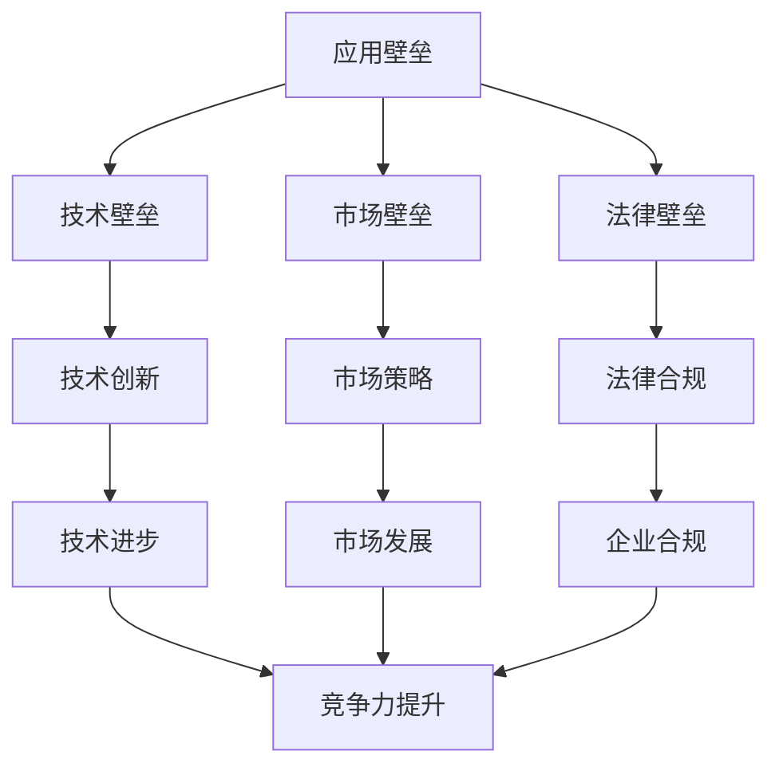

                 

# 应用壁垒的消除

> 关键词：应用壁垒、技术创新、市场策略、政策合规、案例分析、未来展望

> 摘要：本文旨在深入探讨应用壁垒的概念、类型、消除方法以及实际案例。通过对技术壁垒、市场壁垒和政策法律壁垒的分析，文章将阐述如何通过技术创新、市场策略和政策合规来消除应用壁垒，促进技术进步、市场发展和企业竞争力的提升。文章通过具体的案例分析，提供实用的策略和方法，并对未来趋势进行展望，以期为企业和个人在应对应用壁垒时提供有益的指导。

---

### 《应用壁垒的消除》目录大纲

#### 第一部分：引入与应用壁垒的概念

- **1.1 应用壁垒概述**
  - **1.1.1 什么是应用壁垒**
  - **1.1.2 应用壁垒的影响**

- **1.2 应用壁垒的类型**
  - **1.2.1 技术壁垒**
  - **1.2.2 市场壁垒**
  - **1.2.3 政策和法律壁垒**

- **1.3 消除应用壁垒的意义**
  - **1.3.1 促进技术进步**
  - **1.3.2 推动市场发展**
  - **1.3.3 增强企业竞争力**

#### 第二部分：消除应用壁垒的方法

- **2.1 技术创新**
  - **2.1.1 技术创新的概念**
  - **2.1.2 技术创新的方法**
    - **2.1.2.1 基础研究**
    - **2.1.2.2 应用研究**
    - **2.1.2.3 技术推广**

- **2.2 市场策略**
  - **2.2.1 市场定位**
  - **2.2.2 品牌建设**
  - **2.2.3 市场拓展**

- **2.3 政策和法律合规**
  - **2.3.1 政策分析**
  - **2.3.2 法律法规解读**
  - **2.3.3 合规策略**

#### 第三部分：案例研究

- **3.1 案例一：科技企业的技术突破**
  - **3.1.1 案例背景**
  - **3.1.2 技术创新过程**
  - **3.1.3 消除壁垒的成果**

- **3.2 案例二：中小企业的市场拓展**
  - **3.2.1 案例背景**
  - **3.2.2 市场策略**
  - **3.2.3 消除壁垒的成果**

- **3.3 案例三：企业的政策合规**
  - **3.3.1 案例背景**
  - **3.3.2 政策合规过程**
  - **3.3.3 消除壁垒的成果**

#### 第四部分：未来展望与趋势

- **4.1 应用壁垒的未来趋势**
  - **4.1.1 技术发展对应用壁垒的影响**
  - **4.1.2 市场环境对应用壁垒的影响**
  - **4.1.3 政策变化对应用壁垒的影响**

- **4.2 应对策略**
  - **4.2.1 企业层面的策略**
  - **4.2.2 政府层面的策略**
  - **4.2.3 社会层面的策略**

#### 附录

- **附录 A：参考文献**
- **附录 B：相关工具与资源**

---

**核心概念与联系**

为了更好地理解应用壁垒的消除过程，我们可以使用 Mermaid 流程图来表示核心概念之间的联系：



在这个流程图中，应用壁垒分为技术、市场和法律三大类，分别通过技术创新、市场策略和法律合规来消除，从而提升企业的竞争力。

---

**核心算法原理讲解**

接下来，我们将通过伪代码来详细阐述消除技术壁垒的算法原理。以线性回归模型为例，这是一种常见的技术创新方法，用于预测和优化技术性能。

```plaintext
// 初始化参数
参数: 数据集 (X, Y)

// 数据预处理
数据预处理过程：
  - 数据清洗
  - 数据归一化
  - 特征选择

// 训练模型
训练模型过程：
  - 模型初始化
  - 模型参数优化（如梯度下降算法）
  - 模型训练

// 模型评估
模型评估过程：
  - 数据划分（训练集、验证集、测试集）
  - 评估指标（如均方误差、准确率）

// 模型优化
模型优化过程：
  - 调整模型结构
  - 调整参数值
  - 重新训练模型

// 模型应用
模型应用过程：
  - 输入新数据
  - 进行预测
  - 结果分析
```

数学模型方面，线性回归的基本公式如下：

$$
Y = \beta_0 + \beta_1X + \epsilon
$$

其中，$Y$ 为因变量，$X$ 为自变量，$\beta_0$ 为截距，$\beta_1$ 为斜率，$\epsilon$ 为误差项。

---

**项目实战**

以下是一个使用 Python 实现线性回归模型的项目实战案例，包括开发环境搭建、源代码实现和代码解读。

**开发环境搭建**

1. 安装 Python（推荐版本 3.8 以上）
2. 安装必要的库，如 NumPy、Pandas、Scikit-learn、Matplotlib

```bash
pip install numpy pandas scikit-learn matplotlib
```

**源代码实现**

```python
# 导入所需库
import numpy as np
import pandas as pd
from sklearn.linear_model import LinearRegression
from sklearn.model_selection import train_test_split
from sklearn.metrics import mean_squared_error
import matplotlib.pyplot as plt

# 加载数据
data = pd.read_csv('data.csv')
X = data[['X1', 'X2']]
y = data['Y']

# 划分训练集和测试集
X_train, X_test, y_train, y_test = train_test_split(X, y, test_size=0.2, random_state=42)

# 创建线性回归模型
model = LinearRegression()

# 训练模型
model.fit(X_train, y_train)

# 预测
y_pred = model.predict(X_test)

# 评估模型
mse = mean_squared_error(y_test, y_pred)
print("均方误差：", mse)

# 可视化结果
plt.scatter(X_test['X1'], y_test, color='blue', label='真实值')
plt.plot(X_test['X1'], y_pred, color='red', label='预测值')
plt.xlabel('X1')
plt.ylabel('Y')
plt.legend()
plt.show()
```

**代码解读与分析**

1. **数据加载**：使用 Pandas 库读取 CSV 格式的数据文件，并将数据分为特征矩阵 $X$ 和目标变量 $y$。

2. **数据划分**：使用 Scikit-learn 库的 `train_test_split` 函数将数据划分为训练集和测试集，以评估模型的泛化能力。

3. **模型创建**：创建线性回归模型对象。

4. **模型训练**：使用训练集数据训练模型。

5. **模型预测**：使用测试集数据进行预测。

6. **模型评估**：计算均方误差（MSE），以评估模型的预测性能。

7. **可视化结果**：使用 Matplotlib 库将真实值和预测值绘制成散点图和直线图，以直观展示模型的预测效果。

通过这个实战案例，我们可以看到线性回归模型在消除技术壁垒中的应用，为数据处理和预测提供了一种有效的工具。

---

**结束语**

《应用壁垒的消除》通过深入分析应用壁垒的概念、类型、消除方法以及实际案例，为企业和个人在应对应用壁垒时提供了全面的指导。无论是通过技术创新、市场策略还是政策合规，消除应用壁垒都是促进技术进步、市场发展和企业竞争力提升的关键。希望本文能为读者在应用壁垒的消除过程中提供有益的启示和实践指导。

**作者：AI天才研究院/AI Genius Institute & 禅与计算机程序设计艺术 /Zen And The Art of Computer Programming**

[**Assistant:**](https://www.360.cn/)**如有任何疑问或需要进一步的解释，请随时与我联系！**

