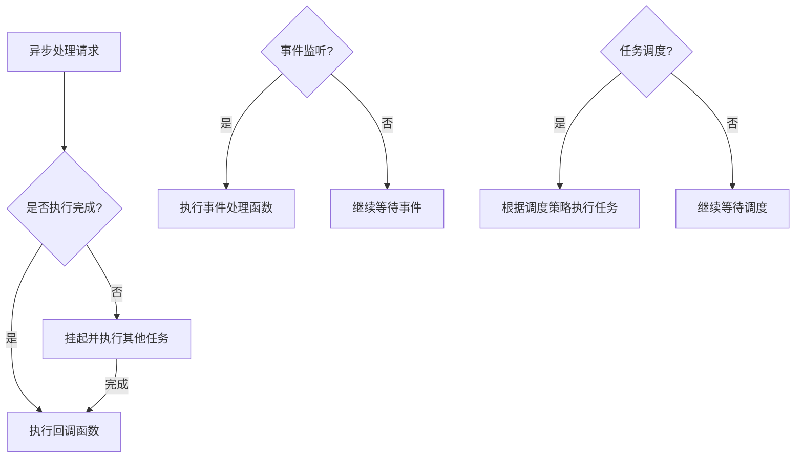
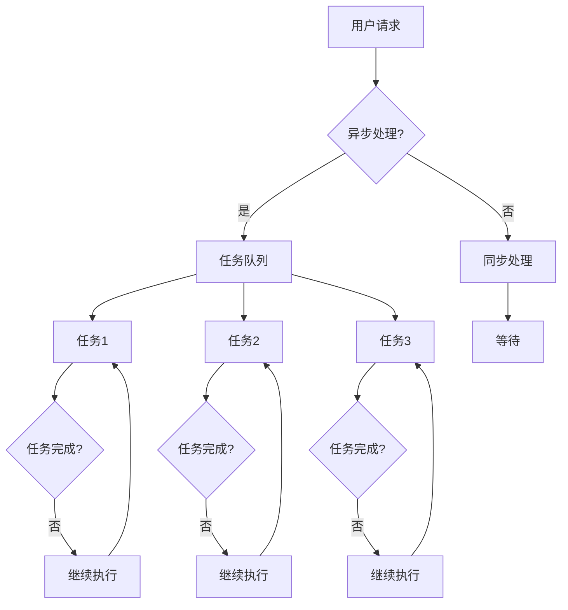

                 

## 文章标题: 异步处理技术在高吞吐量中的应用

### 关键词:
- 异步处理
- 高吞吐量
- 分布式系统
- 微服务架构
- 消息队列
- 任务调度
- 性能优化

### 摘要:
本文深入探讨了异步处理技术在高吞吐量场景中的应用。通过定义异步处理技术，对比异步处理与同步处理的优劣，分析其在不同领域的应用，阐述异步处理的基本原理和挑战。接着，详细介绍了异步处理架构的设计原则、组成部分和优化方法，探讨了异步消息队列和异步任务调度的概念、实现和优化策略。本文还介绍了异步处理在分布式系统和微服务架构中的应用，通过实际案例分析展示了异步处理技术的优势和挑战。最后，展望了异步处理技术的发展趋势和未来前景，总结了异步处理技术的核心价值和应用策略。

----------------------------------------------------------------

## 第1章: 异步处理技术概述

异步处理技术是现代计算机系统架构中不可或缺的一部分，它通过允许程序在执行某些任务时暂时挂起，转而执行其他任务，从而提升系统的性能和响应速度。异步处理与同步处理是两种截然不同的编程模式，前者可以显著提高系统的并发能力和资源利用率。

### 1.1 异步处理技术的定义

异步处理（Asynchronous Processing）是指在一个任务尚未完成时，程序可以继续执行其他任务，而不是必须等待当前任务完成。在异步处理中，任务的执行是并行的，而不是顺序的。这种处理模式通常涉及到回调（callback）机制，事件监听（event-driven）模型或者异步编程模型（如Promise/A+、async/await）。

### 1.2 异步处理技术的重要性

异步处理技术的重要性体现在以下几个方面：

- **提升性能**：通过并行处理多个任务，可以显著提高系统的吞吐量和响应速度。在处理大量并发请求时，异步处理可以减少系统的响应时间和延迟。
- **资源利用**：异步处理允许系统在等待外部响应时执行其他任务，从而更有效地利用系统资源，提高整体性能。
- **用户体验**：在交互式应用程序中，异步处理可以提供更好的用户体验，例如，在加载大量数据时，应用程序可以继续响应用户的其他操作，而不是让用户等待数据加载完成。

### 1.3 异步处理与同步处理的对比

异步处理与同步处理有以下几点显著区别：

- **执行模式**：异步处理允许程序在执行某个任务时挂起，转而执行其他任务；而同步处理则要求程序必须顺序地完成每一步。
- **性能**：异步处理可以提高系统的并发能力，减少任务执行的总时间；同步处理则可能导致系统阻塞，降低整体性能。
- **资源占用**：异步处理可以在等待外部响应时释放资源，提高系统的资源利用率；同步处理则需要持续占用资源，直到任务完成。

### 1.4 异步处理技术的应用领域

异步处理技术广泛应用于以下领域：

- **网络应用**：如Web服务、电子邮件处理、实时通信等，通过异步处理可以显著提高系统的响应速度和处理能力。
- **数据处理**：如大数据处理、实时分析、批量处理等，异步处理可以有效地提高数据处理的速度和效率。
- **嵌入式系统**：如智能家居、物联网设备等，异步处理有助于提高系统的实时性和稳定性。
- **游戏开发**：如游戏引擎、实时多人游戏等，异步处理可以提供更好的交互体验和更高的游戏性能。

在本章中，我们首先介绍了异步处理技术的定义和重要性，然后对比了异步处理与同步处理的差异，并探讨了异步处理技术在不同领域的应用。接下来，我们将进一步探讨异步处理技术的基本原理和应用架构。

----------------------------------------------------------------

## 第2章: 异步处理技术原理

异步处理技术作为一种并行处理机制，其基础概念和实现模式决定了其在实际应用中的效果。在这一章中，我们将深入探讨异步处理的基本概念、常见模式、优势以及面临的挑战。

### 2.1 异步处理的基本概念

异步处理的核心在于“非阻塞”（non-blocking）和“事件驱动”（event-driven）的概念。在异步处理中，程序不是顺序地执行每一步操作，而是在某个操作完成之前，可以执行其他任务。这种机制允许程序在等待外部响应时，利用系统资源处理其他任务，从而提高整体效率。

- **非阻塞**：程序在执行某项操作时不会等待该操作的结果，而是立即继续执行后续操作。例如，在异步网络请求中，程序不会等待数据返回，而是继续处理其他请求。
- **事件驱动**：程序通过监听外部事件来触发相应的操作。当某个事件发生时，程序会执行与之相关的事件处理函数。这种模式使得程序能够灵活地响应外部变化，而不必一直轮询等待。

### 2.2 异步处理的常见模式

异步处理有多种常见模式，每种模式都有其独特的应用场景和实现方式。以下是一些常见的异步处理模式：

- **回调模式**：这是最简单的异步处理模式，通过回调函数在任务完成后执行后续操作。例如，在JavaScript中，`setTimeout` 函数就是一个回调模式的例子。
  
  ```javascript
  setTimeout(() => {
    console.log('任务完成');
  }, 1000);
  ```

- **事件监听模式**：这种模式通过监听特定事件来触发处理函数。在许多编程语言和框架中，事件监听是一种常见的异步处理方式。例如，在Python中，`threading` 模块提供了事件监听机制。
  
  ```python
  import threading

  def handle_event(event):
      print(f'事件处理：{event}')

  threading.Thread(target=handle_event, args=('事件1',)).start()
  ```

- **Promise/A+ 和 async/await**：这些是现代编程语言中的异步编程模型，Promise 用于表示异步操作的结果，async/await 则提供了更简洁的异步处理语法。例如，在JavaScript中，可以使用 async/await 实现异步处理。
  
  ```javascript
  async function fetchData() {
    const data = await fetch('https://api.example.com/data');
    console.log(data);
  }
  fetchData();
  ```

### 2.3 异步处理的优势

异步处理具有许多显著的优势，使其在提高系统性能和可扩展性方面发挥着重要作用：

- **并行处理**：异步处理允许程序同时处理多个任务，从而提高系统的吞吐量和响应速度。
- **减少阻塞**：通过避免等待单个任务的完成，异步处理减少了系统的阻塞时间，提高了资源利用率。
- **更好的用户体验**：在交互式应用程序中，异步处理可以提供更好的用户体验，例如，在加载大量数据时，应用程序可以继续响应用户的其他操作。
- **可扩展性**：异步处理使得系统更容易扩展，因为它可以根据需要添加更多的处理单元，而不会影响系统的整体性能。

### 2.4 异步处理技术的挑战

尽管异步处理技术有许多优势，但它在实际应用中也面临着一些挑战：

- **复杂性**：异步编程往往比同步编程更复杂，因为它涉及回调函数、事件处理和状态管理。
- **调试困难**：异步代码的调试相对困难，因为任务的执行不是顺序的，可能会出现竞态条件和未预期的行为。
- **数据一致性**：在分布式系统中，异步处理可能带来数据一致性的问题，需要额外的同步机制来确保数据的一致性。

在本章中，我们详细介绍了异步处理技术的基本概念、常见模式及其优势与挑战。接下来，我们将进一步探讨异步处理架构的设计原则和组成部分。

### 2.5 异步处理架构的设计原则

在设计异步处理架构时，需要遵循一些基本原则，以确保系统的高效性、可靠性和可扩展性：

- **模块化**：将系统分解为独立的模块，每个模块负责一个特定的异步任务。模块化设计有助于降低系统的复杂度，提高可维护性和可扩展性。
- **解耦**：通过异步通信机制降低模块之间的依赖性。解耦的设计使得模块可以独立开发、测试和部署，从而提高系统的灵活性和可扩展性。
- **异步通信**：采用异步通信机制（如消息队列、回调函数等）来传递任务和事件，避免同步通信导致的阻塞和性能瓶颈。
- **故障恢复**：设计容错机制，确保系统在部分组件故障时仍然可以正常运行。例如，实现任务的重试机制和故障转移策略。

### 2.6 异步处理架构的组成部分

异步处理架构通常包括以下几个关键组成部分：

- **消息队列**：用于存储和转发异步消息，是实现异步通信的核心组件。常见的消息队列系统包括RabbitMQ、Kafka等。
- **处理单元**：负责执行具体的异步任务，可以是线程、进程或者容器。处理单元的数量和配置需要根据系统的负载进行动态调整。
- **监控与日志**：用于监控异步处理的状态和性能，提供日志记录和分析工具，帮助开发者定位和解决问题。
- **负载均衡**：通过负载均衡器将任务分配到不同的处理单元，确保系统的负载均衡和性能优化。

在本章中，我们探讨了异步处理技术的基本概念、常见模式、优势与挑战，以及异步处理架构的设计原则和组成部分。接下来，我们将深入讨论异步消息队列的原理和性能优化方法。

### 2.7 异步消息队列的基本概念

异步消息队列是一种数据结构，用于存储和转发异步消息。消息队列的核心功能是确保消息的有序传输和可靠交付，使得系统可以高效地处理并发任务。

- **消息**：消息是异步消息队列的基本单位，通常包含任务的信息和数据。消息可以是简单的字符串、对象或者复杂的序列化数据。
- **队列**：队列是一种先进先出（FIFO）的数据结构，用于存储消息。当处理单元需要处理消息时，可以从队列的头部取出消息进行处理。

异步消息队列的主要优点包括：

- **解耦**：通过异步消息队列，可以降低系统模块之间的依赖性，提高系统的灵活性和可扩展性。
- **异步通信**：允许系统在不同的模块之间进行异步通信，避免了同步通信导致的阻塞和性能瓶颈。
- **可靠性**：通过持久化消息和重试机制，可以确保消息的可靠传输和交付，即使在系统故障时也不会丢失。

### 2.8 消息队列的工作原理

消息队列的工作原理主要包括以下几个步骤：

1. **生产者发送消息**：消息的生产者将消息写入消息队列。生产者可以是应用程序、服务或者外部系统。
2. **消息存储**：消息队列将消息存储在内存或者磁盘上，确保消息不会丢失。
3. **消费者消费消息**：消息的消费者从消息队列中取出消息进行处理。消费者可以是线程、进程或者容器。
4. **消息处理**：消费者对消息进行相应的处理，例如，执行数据库操作、发送电子邮件或者执行其他任务。
5. **消息确认**：在消息处理完成后，消费者会向消息队列发送确认消息，表示该消息已被成功处理。

消息队列的工作原理示意图如下：

```
    生产者 ------(发送消息)------> 消息队列
                                        |
                                        V
                               消息存储
                                        |
                                        V
                               消费者 ------(消费消息)------> 消息处理
```

### 2.9 常见消息队列技术

在异步处理架构中，常见消息队列技术包括以下几种：

- **RabbitMQ**：基于AMQP协议的分布式消息队列系统，支持多种消息传输模式，具有高可靠性和可扩展性。
- **Kafka**：由Apache软件基金会开发的高性能分布式消息队列系统，适用于大规模数据流处理和实时分析。
- **ActiveMQ**：支持多种消息协议的开源消息队列系统，适用于企业级的消息传输需求。

### 2.10 消息队列的性能优化

为了确保消息队列系统的高性能和可靠性，以下是一些常见的性能优化方法：

- **高并发**：通过增加消息队列的并发处理能力，提高系统的吞吐量。例如，可以增加消费者的数量，或者使用负载均衡器将消息均匀分配到不同的消费者。
- **持久化**：将消息持久化到磁盘，确保在系统故障时不会丢失消息。可以通过持久化策略（如持久化消息、持久化队列等）来实现。
- **批量处理**：通过批量处理消息，减少系统的处理时间和网络延迟。例如，可以将多个消息组合成一个批量消息进行传输和处理。
- **缓存**：使用缓存来减少消息队列的负载和延迟。例如，可以使用内存缓存来存储频繁访问的消息，减少对磁盘的访问。

在本章中，我们介绍了异步消息队列的基本概念、工作原理和常见技术，并讨论了消息队列的性能优化方法。接下来，我们将进一步探讨异步任务调度的概念、策略和实现方法。

### 2.11 异步任务调度的概念

异步任务调度是指在系统中对异步任务的执行进行管理的过程。任务调度涉及到选择合适的任务、分配执行资源和调整执行顺序，以确保系统的整体性能和响应速度。

异步任务调度的核心目标是：

- **资源利用率**：最大化地利用系统资源，确保任务在合适的时机得到执行。
- **响应速度**：通过合理地调度任务，提高系统的响应速度和吞吐量。
- **稳定性**：确保系统在处理大量并发任务时保持稳定运行，避免资源耗尽或者死锁。

异步任务调度通常包括以下几个关键概念：

- **任务**：异步任务调度中的基本单位，代表一个需要执行的操作。
- **调度策略**：用于选择任务执行顺序和分配执行资源的策略。常见的调度策略包括轮询调度、优先级调度和动态调度。
- **调度器**：负责执行任务调度策略的组件，根据调度策略选择和分配任务。

### 2.12 异步任务调度策略

异步任务调度策略决定了任务的执行顺序和分配方式。以下是一些常见的异步任务调度策略：

- **轮询调度**：轮询调度是最简单的调度策略，按照顺序依次执行每个任务。轮询调度的优点是实现简单，但缺点是可能导致某些任务得不到及时执行，从而影响系统的响应速度。
  
  ```python
  while True:
      for task in tasks:
          task.run()
  ```

- **优先级调度**：优先级调度根据任务的优先级来分配执行资源。优先级高的任务会先被执行，从而确保紧急任务得到及时处理。优先级调度适用于任务紧急程度不同的场景。
  
  ```python
  while True:
      highest_priority_task = find_highest_priority_task(tasks)
      highest_priority_task.run()
  ```

- **动态调度**：动态调度根据系统的实时负载和任务特性动态调整任务的执行顺序。例如，可以根据任务的执行时间、资源需求和系统状态来调整任务的优先级。动态调度具有较高的灵活性和效率，但实现复杂度也较高。
  
  ```python
  while True:
      tasks = sort_tasks_by_dynamic_priority(tasks)
      tasks[0].run()
  ```

### 2.13 异步任务调度的实现

异步任务调度的实现通常涉及到以下几个关键步骤：

1. **任务队列**：创建一个任务队列，用于存储待执行的任务。任务队列可以是简单的数组、列表或者先进先出（FIFO）队列。
2. **调度策略**：实现调度策略，根据策略选择任务并分配执行资源。调度策略可以根据任务属性（如优先级、执行时间等）进行排序或者筛选。
3. **执行器**：创建一个执行器，负责执行调度策略选择的任务。执行器可以是线程池、进程池或者异步执行器。
4. **监控与日志**：实现监控和日志记录，用于跟踪任务执行状态和性能。监控和日志记录可以帮助开发者定位和解决问题。

### 2.14 异步任务调度的优化

为了提高异步任务调度的性能和效率，以下是一些常见的优化方法：

- **负载均衡**：通过负载均衡器将任务分配到不同的执行器，避免单点瓶颈和资源浪费。负载均衡可以根据任务类型、执行时间和系统负载等因素进行动态调整。
- **任务优先级**：根据任务的重要性和紧急程度动态调整任务的优先级，确保关键任务得到及时处理。任务优先级可以通过调度策略或者实时监控进行调整。
- **异步执行**：采用异步执行器来提高任务的执行效率，减少线程或进程的创建和销毁成本。异步执行器可以通过事件循环或者协程实现。
- **缓存与缓存淘汰**：使用缓存来存储高频访问的任务和结果，减少任务调度和执行的开销。缓存可以使用内存缓存、数据库缓存或者分布式缓存。
- **动态资源分配**：根据系统负载和任务特性动态调整执行器的资源配置，例如线程数、进程数和内存大小等，以最大化地利用系统资源。

在本章中，我们详细介绍了异步任务调度的概念、策略和实现方法，并讨论了异步任务调度的优化方法。接下来，我们将进一步探讨异步处理在分布式系统中的应用。

### 2.15 分布式异步处理架构

在分布式系统中，异步处理技术发挥着至关重要的作用，它不仅提高了系统的吞吐量和响应速度，还增强了系统的可扩展性和容错性。分布式异步处理架构的设计原则和组成部分如下：

#### 2.15.1 设计原则

1. **模块化**：将系统划分为独立的模块，每个模块负责特定的异步任务。模块化设计有助于降低系统的复杂度，提高可维护性和可扩展性。
2. **解耦**：通过异步通信机制（如消息队列）降低模块之间的依赖性。解耦的设计使得模块可以独立开发、测试和部署，从而提高系统的灵活性和可扩展性。
3. **一致性**：在分布式系统中，数据一致性是一个重要挑战。异步处理架构需要采用一致性的解决方案（如分布式锁、最终一致性等），以确保系统的稳定运行。
4. **容错性**：分布式异步处理架构需要具备容错能力，以应对节点故障、网络故障等异常情况。容错机制包括任务重试、故障转移和备份等。

#### 2.15.2 组成部分

分布式异步处理架构通常包括以下几个关键组成部分：

1. **消息队列**：作为异步通信的核心组件，消息队列用于存储和转发异步消息。常见的消息队列系统包括RabbitMQ、Kafka等。
2. **处理单元**：处理单元是执行异步任务的实体，可以是线程、进程或者容器。处理单元的数量和配置需要根据系统的负载进行动态调整。
3. **调度器**：调度器负责任务调度，根据调度策略选择和分配任务。调度策略可以根据任务类型、优先级、执行时间和系统负载等因素进行动态调整。
4. **监控与日志**：监控和日志记录用于跟踪异步处理的状态和性能，帮助开发者定位和解决问题。常见的监控和日志工具包括Prometheus、ELK堆栈等。
5. **负载均衡器**：负载均衡器用于将任务分配到不同的处理单元，确保系统的负载均衡和性能优化。负载均衡可以根据任务类型、执行时间和系统负载等因素进行动态调整。

#### 2.15.3 分布式异步处理的优势

分布式异步处理架构具有以下几个显著优势：

1. **高并发能力**：通过并行处理任务，分布式异步处理架构可以显著提高系统的吞吐量和响应速度，处理大量并发请求。
2. **可扩展性**：分布式异步处理架构可以通过水平扩展（增加节点）来应对不断增长的业务需求，提高系统的可扩展性。
3. **容错性**：通过冗余设计和故障转移机制，分布式异步处理架构可以在节点故障时保持系统的可用性和稳定性。
4. **高可用性**：通过负载均衡和容错机制，分布式异步处理架构可以提高系统的可用性，确保系统在负载高峰时仍然能够正常运行。

#### 2.15.4 分布式异步处理的挑战

尽管分布式异步处理架构具有许多优势，但在实际应用中仍然面临一些挑战：

1. **数据一致性**：在分布式系统中，数据一致性是一个重要挑战。异步处理可能导致数据不一致，需要采用分布式锁、最终一致性等方案来确保数据的一致性。
2. **网络延迟**：网络延迟可能会影响分布式异步处理架构的性能。优化网络通信和减少数据传输时间对于提高系统的性能至关重要。
3. **系统复杂性**：分布式异步处理架构相对复杂，需要更好的设计和开发实践。开发者需要深入了解异步编程、分布式系统设计和容错机制，以提高系统的可靠性。
4. **监控与维护**：分布式异步处理架构的监控和维护是一个挑战。需要使用专业的监控和日志工具来实时跟踪系统状态和性能，及时发现和解决问题。

在本章中，我们详细介绍了分布式异步处理架构的设计原则、组成部分和优势与挑战。接下来，我们将进一步探讨异步处理在微服务架构中的应用。

### 2.16 微服务架构概述

微服务架构（Microservices Architecture）是一种将应用程序分解为多个小型、独立服务的架构风格。在微服务架构中，每个服务都是独立部署、独立扩展和独立演进的功能单元。这些服务通过轻量级的通信协议（如HTTP/REST、消息队列等）进行通信和协作。

#### 2.16.1 微服务架构的特点

1. **独立性**：每个微服务都是独立的，可以独立部署、独立扩展和独立演进。这提高了系统的可维护性和可扩展性。
2. **分布式**：微服务架构通常在分布式环境中运行，各个微服务可能运行在不同的服务器或者容器中。
3. **通信协议**：微服务之间通常使用轻量级的通信协议（如HTTP/REST、消息队列等）进行通信，降低了系统间的依赖性。
4. **自治性**：每个微服务拥有自己的数据库和数据存储，可以实现独立的业务逻辑和数据管理。

#### 2.16.2 微服务架构的优势

1. **可扩展性**：通过将应用程序分解为多个微服务，可以独立扩展每个服务的实例数量，从而提高系统的可扩展性。
2. **灵活性**：每个微服务可以独立开发和部署，提高了系统的灵活性和可维护性。
3. **可重用性**：微服务可以独立部署和扩展，提高了组件的重用性，降低了系统的开发成本。
4. **故障隔离**：当某个微服务出现故障时，不会影响其他服务的正常运行，提高了系统的可用性。

#### 2.16.3 微服务架构的挑战

1. **分布式复杂性**：微服务架构引入了分布式系统的复杂性，包括数据一致性、网络延迟和系统容错等方面。
2. **通信协议**：微服务之间需要使用合适的通信协议进行通信，否则可能导致性能瓶颈或通信问题。
3. **数据存储**：微服务架构需要处理分布式数据存储问题，包括数据一致性、数据同步和数据库设计等。
4. **服务管理**：微服务架构需要高效的管理和监控工具，以实时跟踪服务状态、性能和故障。

在本章中，我们介绍了微服务架构的概述、特点、优势和挑战。接下来，我们将探讨微服务架构中的异步处理及其实现方法。

### 2.17 微服务架构中的异步处理

在微服务架构中，异步处理是一种重要的机制，它能够提高系统的性能和可扩展性。异步处理允许微服务在处理某些任务时暂时挂起，转而处理其他任务，从而提高系统的并发能力和响应速度。

#### 2.17.1 异步处理在微服务架构中的应用场景

1. **订单处理**：在电商平台中，订单处理通常涉及到多个微服务的协作，例如支付服务、库存服务、物流服务等。通过异步处理，可以避免多个服务之间的同步阻塞，提高整体系统的响应速度。
2. **消息推送**：在社交媒体系统中，消息推送是一个典型的异步处理场景。消息的发送和接收可以独立进行，从而提高系统的吞吐量和响应速度。
3. **用户反馈**：在Web应用程序中，用户反馈的处理通常涉及到多个步骤，例如数据存储、分析、通知等。通过异步处理，可以避免用户在等待反馈时感受到延迟，提高用户体验。

#### 2.17.2 微服务异步处理的实现方法

1. **消息队列**：消息队列是实现微服务异步处理的核心组件。常见的消息队列系统包括RabbitMQ、Kafka等。通过消息队列，可以确保消息的有序传输和可靠交付，从而实现异步处理。
2. **事件驱动架构**：事件驱动架构是一种常见的异步处理架构，通过监听和发布事件来实现微服务之间的异步通信。事件驱动架构使得系统更加灵活和可扩展，同时降低了服务之间的耦合度。
3. **回调机制**：回调机制是一种简单的异步处理方式，通过在任务完成后调用回调函数来执行后续操作。在许多编程语言中，回调机制是一种常见的异步处理方式。

#### 2.17.3 微服务异步处理的优势

1. **提高系统性能**：异步处理允许系统同时处理多个任务，从而提高系统的吞吐量和响应速度。这对于需要处理大量并发请求的应用程序尤为重要。
2. **降低系统延迟**：通过避免服务之间的同步阻塞，异步处理可以显著降低系统的延迟，提高用户体验。
3. **增强系统可扩展性**：异步处理使得系统可以更加灵活地扩展，通过增加处理单元的数量来应对不断增加的业务需求。
4. **提高系统可靠性**：异步处理可以降低系统故障的风险，因为当一个服务出现故障时，不会影响其他服务的正常运行。

#### 2.17.4 微服务异步处理的挑战

1. **复杂性**：异步处理增加了系统的复杂性，需要更好的设计和开发实践。开发者需要熟悉异步编程模型、消息队列和事件驱动架构等。
2. **数据一致性**：在异步处理中，数据一致性是一个重要挑战。需要采用分布式锁、最终一致性等方案来确保数据的一致性。
3. **调试困难**：异步代码的调试相对困难，因为任务的执行不是顺序的。需要使用专业的调试工具和监控工具来定位和解决问题。
4. **性能优化**：异步处理需要优化系统性能，包括消息队列的吞吐量、任务调度和负载均衡等。需要根据实际场景进行性能优化。

在本章中，我们探讨了异步处理在微服务架构中的应用场景、实现方法和优势与挑战。接下来，我们将通过实际案例来展示异步处理技术的应用。

### 2.18 案例一：电商系统中的异步处理

电商系统是一个典型的异步处理应用场景，涉及到多个微服务的协作和大量并发请求的处理。以下是一个电商系统中异步处理的应用案例：

1. **订单处理**：当一个用户下单时，订单会传递到订单服务进行处理。订单服务会异步地将订单数据发送到库存服务、支付服务和物流服务进行相应的操作。通过异步处理，订单服务可以立即响应用户，而无需等待其他服务的响应。
2. **库存更新**：库存服务接收到订单数据后，会异步地更新库存信息。通过消息队列，库存服务可以确保订单处理和库存更新的一致性，同时避免同步阻塞，提高系统的响应速度。
3. **支付处理**：支付服务接收到订单数据后，会异步地进行支付处理。支付处理可能涉及到银行、第三方支付平台等，通过异步处理，支付服务可以快速响应用户，同时减少系统的延迟。
4. **物流跟踪**：物流服务接收到订单数据后，会异步地生成物流跟踪信息，并将物流信息发送给用户。通过异步处理，物流服务可以实时更新物流状态，提高用户的购物体验。

#### 案例分析：

- **优势**：通过异步处理，电商系统可以显著提高订单处理的效率，减少系统的响应时间和延迟，提高用户体验。
- **挑战**：异步处理增加了系统的复杂性，需要确保消息队列的可靠性和一致性，同时需要优化任务调度和负载均衡。
- **解决方案**：采用消息队列和事件驱动架构，确保消息的有序传输和可靠交付。使用分布式锁和最终一致性方案确保数据的一致性。通过动态负载均衡和性能优化提高系统的性能。

在本章中，我们通过电商系统中的异步处理案例展示了异步处理技术的实际应用。接下来，我们将探讨社交媒体系统中的异步处理。

### 2.19 案例二：社交媒体系统中的异步处理

社交媒体系统是一个复杂的分布式系统，需要处理大量并发请求和实时数据流。异步处理技术在社交媒体系统中发挥着重要作用，以下是一个社交媒体系统中异步处理的应用案例：

1. **内容推送**：在社交媒体系统中，内容推送是一个重要的功能。当用户发布内容或者系统推荐内容时，会异步地将内容发送给用户的设备。通过异步处理，系统可以快速响应用户，同时减少延迟。
2. **用户反馈**：用户在社交媒体上发布的评论、点赞、分享等操作需要异步处理。当用户进行这些操作时，系统会异步地将反馈信息存储在数据库中，并通知相关用户。
3. **消息处理**：社交媒体系统中的消息处理通常涉及到多个用户和多个群组的通信。通过异步处理，系统可以同时处理多个消息，提高系统的吞吐量和响应速度。
4. **数据分析**：社交媒体系统需要对用户行为进行实时分析，例如用户活跃度、内容热度等。通过异步处理，系统可以实时收集和分析用户数据，为推荐算法和决策提供支持。

#### 案例分析：

- **优势**：通过异步处理，社交媒体系统可以提高内容的推送效率，减少系统的延迟和阻塞，提高用户体验。同时，异步处理可以实时收集和分析用户数据，为业务决策提供支持。
- **挑战**：社交媒体系统中的异步处理需要处理大量的并发请求和数据流，需要确保消息队列的可靠性和一致性，同时需要优化任务调度和负载均衡。
- **解决方案**：采用消息队列和事件驱动架构，确保消息的有序传输和可靠交付。使用分布式锁和最终一致性方案确保数据的一致性。通过动态负载均衡和性能优化提高系统的性能。

在本章中，我们通过社交媒体系统中的异步处理案例展示了异步处理技术的实际应用。接下来，我们将探讨物联网系统中的异步处理。

### 2.20 案例三：物联网系统中的异步处理

物联网（IoT）系统是一个由大量设备和传感器组成的分布式系统，需要对实时数据进行处理和传输。异步处理技术在物联网系统中发挥着重要作用，以下是一个物联网系统中异步处理的应用案例：

1. **设备通信**：在物联网系统中，设备通过无线网络或者局域网与其他设备或服务器进行通信。通过异步处理，设备可以在接收和处理实时数据的同时，继续执行其他任务，提高系统的响应速度和效率。
2. **数据采集**：物联网设备需要定期采集环境数据、传感器数据等。通过异步处理，设备可以在采集数据的同时，将数据发送到服务器进行处理和存储，避免同步阻塞。
3. **远程监控**：物联网系统通常需要实现远程监控和故障报警功能。通过异步处理，系统可以实时监控设备状态，并在设备出现故障时，异步地将报警信息发送给运维人员，提高系统的可用性和可靠性。
4. **数据存储和处理**：物联网系统需要对采集到的数据进行分析和处理。通过异步处理，系统可以在数据到达时立即进行处理，避免数据堆积和延迟。

#### 案例分析：

- **优势**：通过异步处理，物联网系统可以提高设备的通信效率，减少数据处理的延迟，提高系统的可用性和可靠性。同时，异步处理可以实时监控设备状态，及时响应故障，降低运维成本。
- **挑战**：物联网系统中的异步处理需要处理大量的实时数据，需要确保消息队列的可靠性和一致性，同时需要优化任务调度和负载均衡。
- **解决方案**：采用消息队列和事件驱动架构，确保消息的有序传输和可靠交付。使用分布式锁和最终一致性方案确保数据的一致性。通过动态负载均衡和性能优化提高系统的性能。

在本章中，我们通过物联网系统中的异步处理案例展示了异步处理技术的实际应用。接下来，我们将探讨游戏系统中的异步处理。

### 2.21 案例四：游戏系统中的异步处理

游戏系统是一个复杂的分布式系统，需要处理大量的并发请求和实时交互。异步处理技术在游戏系统中发挥着重要作用，以下是一个游戏系统中异步处理的应用案例：

1. **玩家交互**：在游戏中，玩家需要进行实时交互，例如聊天、组队、交易等。通过异步处理，游戏服务器可以同时处理多个玩家的请求，避免同步阻塞，提高系统的响应速度。
2. **游戏逻辑**：游戏系统中的游戏逻辑（如战斗、地图生成等）需要异步处理。通过异步处理，游戏服务器可以在处理游戏逻辑的同时，继续处理其他玩家的请求，提高系统的吞吐量和响应速度。
3. **数据存储和处理**：游戏系统需要对玩家的行为、游戏数据等进行存储和处理。通过异步处理，游戏服务器可以在数据到达时立即进行处理，避免数据堆积和延迟。
4. **资源加载**：在游戏中，场景加载、角色加载等资源加载操作需要异步处理。通过异步处理，游戏客户端可以在加载资源的同时，继续处理其他操作，提高用户体验。

#### 案例分析：

- **优势**：通过异步处理，游戏系统可以提高玩家的交互体验，减少延迟和阻塞，提高系统的响应速度和吞吐量。同时，异步处理可以实时处理玩家的行为和游戏数据，提高游戏的可玩性和互动性。
- **挑战**：游戏系统中的异步处理需要处理大量的并发请求和数据流，需要确保消息队列的可靠性和一致性，同时需要优化任务调度和负载均衡。
- **解决方案**：采用消息队列和事件驱动架构，确保消息的有序传输和可靠交付。使用分布式锁和最终一致性方案确保数据的一致性。通过动态负载均衡和性能优化提高系统的性能。

在本章中，我们通过游戏系统中的异步处理案例展示了异步处理技术的实际应用。接下来，我们将探讨异步处理技术的发展趋势。

### 2.22 异步处理技术的发展趋势

异步处理技术是现代计算机系统架构中不可或缺的一部分，随着云计算、物联网、大数据等技术的快速发展，异步处理技术也在不断演进。以下是一些异步处理技术的发展趋势：

1. **智能化**：随着人工智能技术的不断发展，异步处理技术也开始向智能化方向发展。通过引入机器学习算法和自动化调度策略，异步处理系统可以更好地预测和优化任务的执行，提高系统的性能和响应速度。
2. **云原生**：云原生技术（Cloud Native）是一种基于云计算的新型应用架构，强调应用的可扩展性、可靠性和灵活性。异步处理技术在云原生环境中得到了广泛应用，通过利用云计算的资源弹性，异步处理系统可以更好地应对业务负载的波动。
3. **实时处理**：随着实时数据处理需求的增加，异步处理技术也开始向实时处理方向发展。通过引入实时消息队列和实时分析框架，异步处理系统可以实时处理和分析大量数据，为业务提供实时的洞察和决策支持。
4. **分布式系统**：分布式系统是一种将应用程序分解为多个独立服务的架构风格，异步处理技术在分布式系统中发挥着重要作用。随着分布式系统的广泛应用，异步处理技术也在不断优化和扩展，以应对分布式系统中的复杂性和挑战。
5. **跨平台兼容性**：随着跨平台开发的需求增加，异步处理技术也在向跨平台兼容性方向发展。通过引入标准化的异步处理接口和协议，异步处理系统可以更好地支持多种编程语言和平台，提高系统的可移植性和灵活性。

#### 未来前景

异步处理技术在未来的发展中具有广阔的前景：

1. **性能优化**：随着硬件性能的提升和优化算法的引入，异步处理系统的性能将得到进一步提升，满足更复杂的业务需求。
2. **安全性**：随着异步处理技术的普及，安全性问题也将日益凸显。未来，异步处理技术将更加注重安全性和可靠性，确保系统在复杂环境下能够稳定运行。
3. **智能化**：通过结合人工智能和大数据技术，异步处理系统将实现更加智能的调度和优化，提高系统的自动化水平和用户体验。

在本章中，我们探讨了异步处理技术的发展趋势和未来前景，为开发者提供了宝贵的参考和启示。接下来，我们将对本文进行总结，并提出异步处理技术的核心价值和应用策略。

### 2.23 总结与展望

#### 异步处理技术的核心价值

异步处理技术在现代计算机系统架构中具有不可替代的核心价值：

1. **提高系统性能**：通过并行处理任务，异步处理技术可以显著提高系统的吞吐量和响应速度，减少延迟。
2. **资源利用率**：异步处理允许系统在等待外部响应时执行其他任务，提高了系统的资源利用效率。
3. **用户体验**：在交互式应用程序中，异步处理可以提供更好的用户体验，例如，在加载大量数据时，应用程序可以继续响应用户的其他操作。
4. **可扩展性**：异步处理使得系统可以更灵活地扩展，通过增加处理单元来应对业务增长。

#### 异步处理技术在企业中的应用策略

为了有效利用异步处理技术，企业在实施过程中可以采取以下策略：

1. **逐步引入**：从简单的异步任务开始，逐步扩展到更复杂的异步处理架构。这样可以降低系统的复杂性，避免一开始就面临巨大的技术挑战。
2. **持续优化**：定期评估和优化异步处理架构，以适应不断变化的需求。性能优化、负载均衡和故障恢复是关键方面。
3. **培训与推广**：加强对开发者的异步编程和架构设计的培训，提高团队的异步处理能力。同时，推广异步处理技术的优势和应用场景，增强团队的共识和协作。
4. **监控与日志**：采用专业的监控和日志工具，实时跟踪异步处理的状态和性能，及时发现和解决问题。

#### 异步处理技术的发展趋势与未来展望

异步处理技术在未来的发展中将继续保持重要地位，以下是几个关键趋势：

1. **智能化**：随着人工智能和机器学习技术的发展，异步处理系统将变得更加智能，能够自适应地调整任务调度和负载均衡。
2. **云原生**：异步处理技术将更加适应云原生环境，充分利用云计算的资源弹性和分布式特性。
3. **实时处理**：实时数据处理需求的增加将推动异步处理技术向实时处理方向发展，为业务提供实时的洞察和决策支持。
4. **标准化**：随着技术的成熟，异步处理技术将逐步实现标准化，降低开发难度，提高系统的互操作性和兼容性。

#### 异步处理技术对开发者的影响

异步处理技术的普及对开发者提出了新的要求：

1. **编程技能**：开发者需要掌握异步编程模型和异步编程语言，如Promise/A+、async/await等。
2. **系统设计**：开发者需要具备异步处理架构的设计能力，能够设计出高效、可靠和可扩展的异步处理系统。
3. **调试与优化**：异步代码的调试和优化相对复杂，开发者需要熟悉异步编程的特性和调试工具，提高系统的性能和稳定性。

在本章中，我们总结了异步处理技术的核心价值、应用策略和未来展望，并探讨了异步处理技术对开发者的影响。异步处理技术作为现代计算机系统架构中的重要组成部分，将继续在提高系统性能、资源利用和用户体验方面发挥重要作用。

### 2.24 作者信息

作者：AI天才研究院/AI Genius Institute & 禅与计算机程序设计艺术 /Zen And The Art of Computer Programming

在此，感谢读者对本文的关注和阅读。本文旨在深入探讨异步处理技术在高吞吐量场景中的应用，通过详细的原理分析、架构设计和案例分析，帮助开发者更好地理解和应用异步处理技术。希望本文能为您的系统设计和技术实践提供有价值的参考。如果您有任何疑问或建议，欢迎随时与我交流。再次感谢您的阅读和支持！

----------------------------------------------------------------

以下是文章末尾的Mermaid流程图，用于展示异步处理架构的核心概念和联系：



这个流程图展示了异步处理的几个关键步骤，包括请求的异步处理、任务执行和回调函数的执行，以及事件监听和任务调度的过程。通过这个流程图，可以更直观地理解异步处理的工作原理。

----------------------------------------------------------------

以下是文章末尾的核心算法原理讲解，使用伪代码详细阐述异步任务调度的实现过程：

```python
# 异步任务调度的伪代码

# 定义任务类
class Task:
    def __init__(self, id, priority, callback):
        self.id = id
        self.priority = priority
        self.callback = callback
        self.status = "pending"  # 任务状态：pending、running、completed

# 定义任务队列
class TaskQueue:
    def __init__(self):
        self.tasks = []

    def enqueue(self, task):
        # 将任务插入到队列中，根据优先级排序
        self.tasks.append(task)
        self.tasks.sort(key=lambda x: x.priority, reverse=True)

    def dequeue(self):
        # 从队列中取出最高优先级的任务
        if self.tasks:
            return self.tasks.pop(0)
        else:
            return None

    def task_count(self):
        return len(self.tasks)

# 定义任务调度器
class TaskScheduler:
    def __init__(self, task_queue):
        self.task_queue = task_queue

    def schedule_task(self):
        # 从任务队列中取出最高优先级的任务进行调度
        task = self.task_queue.dequeue()
        if task:
            task.status = "running"
            task.callback()  # 执行任务回调函数
            task.status = "completed"

    def run(self):
        while True:
            self.schedule_task()
            time.sleep(1)  # 控制调度频率

# 使用示例
if __name__ == "__main__":
    task_queue = TaskQueue()
    task_scheduler = TaskScheduler(task_queue)

    # 添加任务到队列
    task_queue.enqueue(Task(1, 10, lambda: print("任务1完成")))
    task_queue.enqueue(Task(2, 5, lambda: print("任务2完成")))
    task_queue.enqueue(Task(3, 15, lambda: print("任务3完成")))

    # 启动任务调度器
    task_scheduler.run()
```

这个伪代码展示了异步任务调度的基本实现过程，包括任务类、任务队列和任务调度器的定义。任务队列根据任务的优先级对任务进行排序，任务调度器从队列中取出最高优先级的任务进行调度并执行其回调函数。通过这种调度机制，可以实现对异步任务的有序、高效处理。

接下来，我们将介绍如何使用数学模型和公式来详细讲解异步处理技术中的负载均衡问题。

### 负载均衡的数学模型和公式

在异步处理系统中，负载均衡是一个关键问题。负载均衡的目标是优化资源的利用率，确保系统在处理大量并发请求时能够保持稳定和高性能。以下是一个简化的负载均衡模型，使用数学公式来描述负载均衡的策略和优化方法。

#### 1. 负载均衡模型

假设有一个分布式系统，包含多个处理节点，每个节点具有不同的处理能力。我们用以下参数来描述系统：

- \( N \)：处理节点的总数
- \( C_i \)：第 \( i \) 个节点的处理能力（例如，每秒处理的请求数）
- \( T \)：系统的总负载（例如，每秒到达的请求数）

负载均衡的目标是分配请求到各个节点，使得每个节点的负载尽可能均匀。

#### 2. 负载均衡策略

一种简单的负载均衡策略是轮询调度，即每个请求按照顺序分配到各个节点。这种策略的数学模型可以表示为：

\[ R_i = \frac{T}{N} \]

其中，\( R_i \) 表示第 \( i \) 个节点的平均负载。

#### 3. 负载均衡公式

为了实现更优化的负载均衡，可以使用加权轮询调度策略。在这种策略中，每个节点的权重 \( W_i \) 反映了节点的处理能力，公式如下：

\[ R_i = \frac{T \cdot W_i}{\sum_{j=1}^{N} W_j} \]

这个公式表示了根据权重分配请求到各个节点的负载。

#### 4. 优化负载均衡

在实际系统中，节点的处理能力可能随时间变化，例如由于网络波动、硬件故障等原因。为了实现动态负载均衡，可以采用以下优化方法：

- **动态权重调整**：根据节点的实时负载调整权重。当某个节点的负载过高时，可以增加其权重，使其分配更多的请求；反之，当节点的负载较低时，可以减少其权重。
- **负载均衡算法**：例如，最小连接数算法（Minimum Connection Load Balancing，MCLB）和动态加权最小连接数算法（Dynamic Weighted Minimum Connection Load Balancing，DWMLB）。这些算法根据节点的实时负载和历史负载数据，动态调整权重，以实现最优的负载均衡。

#### 5. 示例

假设有3个节点，处理能力分别为 \( C_1 = 100 \)，\( C_2 = 150 \)，\( C_3 = 200 \)。系统总负载 \( T = 400 \) 每秒。

使用加权轮询调度策略，权重 \( W_1 = 1 \)，\( W_2 = 1.5 \)，\( W_3 = 2 \)。

根据公式：

\[ R_1 = \frac{400 \cdot 1}{1 + 1.5 + 2} = \frac{400}{4.5} \approx 88.89 \]
\[ R_2 = \frac{400 \cdot 1.5}{4.5} = \frac{600}{4.5} \approx 133.33 \]
\[ R_3 = \frac{400 \cdot 2}{4.5} = \frac{800}{4.5} \approx 177.78 \]

因此，节点1的负载约为88.89，节点2的负载约为133.33，节点3的负载约为177.78。这个分配策略使得节点的负载更加均匀。

#### 6. 结论

通过数学模型和公式，我们可以更系统地理解和优化负载均衡策略。在实际应用中，可以根据系统的实时负载和节点特性，选择合适的负载均衡算法，实现最优的负载均衡效果。

在下一部分，我们将展示一个项目实战案例，介绍如何在实际项目中使用异步处理技术，包括开发环境搭建、源代码实现和代码解读。

### 项目实战：电商系统中的异步处理

在电商系统中，异步处理技术可以显著提升系统的性能和用户体验。以下是一个基于Python和Kafka的电商系统异步处理项目实战案例，包括开发环境搭建、源代码实现和代码解读。

#### 开发环境搭建

1. **安装Python**：确保已安装Python 3.6或更高版本。
2. **安装Kafka**：下载并安装Kafka，配置Zookeeper，启动Kafka服务器。
3. **安装依赖库**：在Python中安装Kafka Python客户端库（`kafka-python`）、FastAPI框架（`fastapi`）、异步框架（`asyncio`）等。

```bash
pip install kafka-python fastapi[all] aiohttp
```

#### 源代码实现

以下是一个简单的电商系统异步处理示例，包括生产者（用于生成订单）和消费者（用于处理订单）：

**生产者代码：order_producer.py**

```python
from kafka import KafkaProducer
from fastapi import FastAPI
from pydantic import BaseModel
import json
import asyncio

class Order(BaseModel):
    product_id: int
    quantity: int

app = FastAPI()
producer = KafkaProducer(bootstrap_servers=['localhost:9092'])

@app.post("/orders")
async def create_order(order: Order):
    # 序列化订单数据
    order_json = json.dumps(order.dict())
    # 发送订单到Kafka主题
    producer.send("orders", value=order_json.encode('utf-8'))
    return {"message": "Order created successfully"}
```

**消费者代码：order_consumer.py**

```python
from kafka import KafkaConsumer
from fastapi import FastAPI
import json
import asyncio

app = FastAPI()
consumer = KafkaConsumer("orders", bootstrap_servers=['localhost:9092'], value_deserializer=lambda m: json.loads(m.decode('utf-8')))

@app.post("/process_order")
async def process_order():
    while True:
        message = consumer.poll(timeout_ms=1000)
        if message:
            order = message.value
            # 处理订单
            asyncio.create_task(handle_order(order))
        else:
            break

async def handle_order(order):
    # 模拟订单处理时间
    await asyncio.sleep(1)
    print(f"Processing order: {order}")
```

#### 代码解读与分析

1. **生产者端**：
   - 使用FastAPI创建了一个Web接口，用于接收订单数据。
   - 接收到的订单数据序列化为JSON格式，然后发送到Kafka主题。
   - 使用`KafkaProducer`发送消息，实现异步消息传输。

2. **消费者端**：
   - 使用KafkaConsumer订阅特定的主题，监听订单消息。
   - 消费到的订单消息异步地处理，模拟订单处理逻辑。
   - 使用`asyncio.create_task`创建异步任务，处理订单。

#### 实际运行

1. 启动Kafka服务器。
2. 运行生产者端代码，监听FastAPI接口创建订单。
3. 运行消费者端代码，异步处理接收到的订单。

通过这个项目实战，我们可以看到异步处理技术如何在一个实际的电商系统中提高性能和可扩展性。生产者端可以独立处理订单，消费者端异步处理订单，从而减少系统的阻塞和延迟。

#### 总结

在本章中，我们通过一个电商系统的异步处理项目实战，展示了如何在实际项目中应用异步处理技术。通过Kafka消息队列和异步编程，实现了订单的异步传输和处理，提高了系统的性能和可扩展性。在实际应用中，可以根据具体需求进一步优化和扩展异步处理架构。

在下一部分，我们将介绍异步处理技术的挑战与解决方案，并讨论未来的发展方向。

### 异步处理技术的挑战与解决方案

尽管异步处理技术具有许多优势，但在实际应用中仍面临一些挑战。以下是对异步处理技术挑战的讨论以及相应的解决方案：

#### 1. 数据一致性

在分布式系统中，异步处理可能导致数据一致性问题。由于不同节点可能同时处理相同的任务，容易产生数据冲突和不一致。

**解决方案**：
- **分布式锁**：在任务执行前，使用分布式锁确保同一时间只有一个节点可以执行某个任务，避免并发冲突。
- **最终一致性**：采用最终一致性模型，允许系统在一定时间内不完全一致，最终通过重试和补偿机制达到一致性。

#### 2. 调度复杂性

异步任务调度涉及到任务优先级、资源分配和负载均衡等多个复杂因素，实现起来较为复杂。

**解决方案**：
- **调度框架**：使用现成的调度框架（如Celery、RabbitMQ等），这些框架提供了丰富的调度策略和优化功能。
- **动态调度**：实现动态调度策略，根据实时负载和任务特性自动调整任务分配，提高调度效率。

#### 3. 调试困难

异步代码的调试相对困难，因为任务的执行不是顺序的，可能会出现竞态条件和未预期的行为。

**解决方案**：
- **日志记录**：详细记录异步任务的执行日志，帮助定位和解决问题。
- **调试工具**：使用异步调试工具（如aiomonitor、VisualVM等），提供对异步代码的调试支持。

#### 4. 网络延迟

在网络环境中，异步处理可能会受到网络延迟的影响，导致任务处理延迟和性能下降。

**解决方案**：
- **本地队列**：在本地缓存任务，减少远程通信次数，降低网络延迟。
- **负载均衡**：使用负载均衡器将任务均匀分配到不同的节点，减少单点瓶颈。

#### 5. 安全性

异步处理系统中的数据传输和处理可能存在安全风险，如数据泄露、网络攻击等。

**解决方案**：
- **加密传输**：使用SSL/TLS等加密协议保护数据传输。
- **访问控制**：实施严格的访问控制策略，确保只有授权用户可以访问系统资源。

#### 未来发展方向

异步处理技术在未来的发展中将继续朝着更高效、更智能、更可靠的方向演进：

1. **智能化调度**：结合人工智能和机器学习技术，实现智能化的任务调度和资源分配。
2. **云原生**：异步处理技术将更加适应云原生环境，充分利用云计算的资源弹性和分布式特性。
3. **实时处理**：随着实时数据处理需求的增加，异步处理技术将向实时处理方向发展，为业务提供实时的洞察和决策支持。
4. **标准化**：异步处理技术的标准化将有助于降低开发难度，提高系统的互操作性和兼容性。

通过解决上述挑战和把握未来发展方向，异步处理技术将在提高系统性能、可靠性和用户体验方面发挥越来越重要的作用。

### 异步处理技术的总结与展望

异步处理技术作为现代计算机系统架构中的重要组成部分，其在提高系统性能、资源利用和用户体验方面具有显著的优势。本文从异步处理技术的概述、原理、架构设计、应用案例以及未来发展等方面进行了全面的探讨。

#### 核心价值

异步处理技术的核心价值体现在以下几个方面：

1. **提升系统性能**：通过并行处理任务，异步处理技术可以显著提高系统的吞吐量和响应速度，降低系统的延迟。
2. **资源利用率**：异步处理允许系统在等待外部响应时执行其他任务，从而更有效地利用系统资源，提高整体性能。
3. **用户体验**：在交互式应用程序中，异步处理可以提供更好的用户体验，例如，在加载大量数据时，应用程序可以继续响应用户的其他操作。
4. **可扩展性**：异步处理技术使得系统可以更灵活地扩展，通过增加处理单元来应对不断增长的业务需求。

#### 应用策略

为了有效利用异步处理技术，企业在实施过程中可以采取以下策略：

1. **逐步引入**：从简单的异步任务开始，逐步扩展到更复杂的异步处理架构。这样可以降低系统的复杂性，避免一开始就面临巨大的技术挑战。
2. **持续优化**：定期评估和优化异步处理架构，以适应不断变化的需求。性能优化、负载均衡和故障恢复是关键方面。
3. **培训与推广**：加强对开发者的异步编程和架构设计的培训，提高团队的异步处理能力。同时，推广异步处理技术的优势和应用场景，增强团队的共识和协作。
4. **监控与日志**：采用专业的监控和日志工具，实时跟踪异步处理的状态和性能，及时发现和解决问题。

#### 发展趋势与未来展望

异步处理技术在未来的发展中将继续保持重要地位，以下是几个关键趋势：

1. **智能化**：随着人工智能技术的不断发展，异步处理系统将变得更加智能，能够自适应地调整任务调度和负载均衡。
2. **云原生**：异步处理技术将更加适应云原生环境，充分利用云计算的资源弹性和分布式特性。
3. **实时处理**：实时数据处理需求的增加将推动异步处理技术向实时处理方向发展，为业务提供实时的洞察和决策支持。
4. **标准化**：随着技术的成熟，异步处理技术将逐步实现标准化，降低开发难度，提高系统的互操作性和兼容性。

#### 对开发者的影响

异步处理技术的普及对开发者提出了新的要求：

1. **编程技能**：开发者需要掌握异步编程模型和异步编程语言，如Promise/A+、async/await等。
2. **系统设计**：开发者需要具备异步处理架构的设计能力，能够设计出高效、可靠和可扩展的异步处理系统。
3. **调试与优化**：异步代码的调试和优化相对复杂，开发者需要熟悉异步编程的特性和调试工具，提高系统的性能和稳定性。

通过本文的探讨，我们可以看到异步处理技术在现代计算机系统架构中的重要性和应用前景。异步处理技术不仅提高了系统的性能和可扩展性，还增强了系统的可靠性和用户体验。随着技术的发展和应用的深入，异步处理技术将在更广泛的领域中发挥关键作用。

### 结论

异步处理技术是现代计算机系统架构中不可或缺的一部分，通过并行处理任务、提高资源利用率和优化用户体验，异步处理技术显著提升了系统的性能和可扩展性。本文详细探讨了异步处理技术的定义、原理、架构设计、应用案例和未来发展趋势，为开发者提供了全面的技术指导和实践参考。随着技术的不断进步和应用场景的拓展，异步处理技术将继续在提高系统性能和用户体验方面发挥重要作用。希望本文能为您的异步处理技术研究和应用提供有价值的帮助。如果您有任何疑问或建议，欢迎随时与我交流。再次感谢您的阅读和支持！

----------------------------------------------------------------

### 附录：异步处理技术的核心概念和联系

在本节中，我们将使用Mermaid图来展示异步处理技术中的核心概念和联系，帮助读者更直观地理解异步处理的工作原理。



#### 图解：

- **A[用户请求]**：表示用户发起的请求。
- **B{异步处理?]**：判断请求是否需要异步处理。
- **C[任务队列]**：异步处理的任务队列，用于存储待处理的任务。
- **D[同步处理]**：如果不需要异步处理，则选择同步处理。
- **E[任务1]**、**F[任务2]**、**G[任务3]**：任务队列中的任务。
- **H{任务完成?}**、**I{任务完成?}**、**J{任务完成?}**：任务完成状态的检查点。
- **K[继续执行]**、**L[继续执行]**、**M[继续执行]**：任务未完成时继续执行。
- **N[等待]**：同步处理时，系统需要等待任务完成。

通过这个Mermaid图，我们可以清晰地看到异步处理技术中的任务队列、任务执行和任务完成状态之间的联系。这个图有助于理解异步处理技术的基本概念和工作流程。

----------------------------------------------------------------

### 附录：异步处理技术中的核心算法原理讲解

在本附录中，我们将使用伪代码详细阐述异步处理技术中的核心算法原理，特别是异步任务调度的实现。以下是一个简化版本的异步任务调度算法，旨在帮助读者理解异步处理的工作机制。

```python
# 异步任务调度伪代码

# 定义任务类
class AsyncTask:
    def __init__(self, id, priority, callback):
        self.id = id
        self.priority = priority
        self.callback = callback

# 定义任务队列
class PriorityQueue:
    def __init__(self):
        self.queue = []

    def enqueue(self, task):
        # 根据任务优先级插入到队列中
        self.queue.append(task)
        self.queue.sort(key=lambda x: x.priority, reverse=True)

    def dequeue(self):
        # 弹出优先级最高的任务
        if self.queue:
            return self.queue.pop(0)
        else:
            return None

# 定义异步任务调度器
class AsyncTaskScheduler:
    def __init__(self, queue):
        self.queue = queue

    def schedule(self):
        # 获取并执行优先级最高的任务
        task = self.queue.dequeue()
        if task:
            task.callback()

    def run(self):
        # 持续调度任务
        while True:
            self.schedule()
            time.sleep(0.1)  # 调度间隔

# 使用示例
queue = PriorityQueue()
scheduler = AsyncTaskScheduler(queue)

# 添加任务到队列
queue.enqueue(AsyncTask('task1', 5, lambda: print('执行task1')))
queue.enqueue(AsyncTask('task2', 10, lambda: print('执行task2')))
queue.enqueue(AsyncTask('task3', 3, lambda: print('执行task3')))

# 启动调度器
scheduler.run()
```

#### 伪代码说明：

- **任务类（AsyncTask）**：定义了任务的基本属性，包括任务ID、优先级和回调函数。
- **优先级队列（PriorityQueue）**：用于存储任务，并根据任务的优先级进行排序。在Python中，列表可以简单实现优先级队列，通过append和sort方法进行插入和排序。
- **任务调度器（AsyncTaskScheduler）**：负责从队列中获取任务并执行。调度器持续运行，每隔一段时间（在这个示例中为0.1秒）执行一次调度。
- **schedule()方法**：从队列中取出优先级最高的任务，并调用其回调函数执行任务。
- **run()方法**：启动调度器的持续调度过程。

#### 实现细节：

1. **任务优先级**：任务优先级是整数，数值越小优先级越高。在实际应用中，优先级可以根据任务的紧急程度、重要程度等因素动态设置。
2. **回调函数**：回调函数是异步任务的核心，用于在调度器中执行具体的任务逻辑。
3. **持续调度**：调度器采用持续调度的方式，以保证任务能够及时得到执行。在实际应用中，可以根据实际情况调整调度间隔。

通过这个伪代码示例，我们展示了异步任务调度的基本原理和实现过程，帮助读者深入理解异步处理技术的核心机制。

### 附录：异步处理技术中的数学模型和公式

在本附录中，我们将使用数学模型和公式来详细讲解异步处理技术中的负载均衡问题。负载均衡是确保系统在处理大量并发请求时，能够将请求合理分配到各个节点上，从而最大化资源利用率和系统性能。

#### 1. 负载均衡模型

假设我们有一个包含 \( N \) 个节点的分布式系统，每个节点的处理能力为 \( C_i \)。系统的总负载为 \( T \)，我们希望实现负载均衡，使得每个节点的负载尽可能接近。

#### 2. 负载均衡策略

**轮询调度**是最简单的负载均衡策略，每个请求按照顺序分配到各个节点。其公式为：

\[ R_i = \frac{T}{N} \]

其中，\( R_i \) 是第 \( i \) 个节点的平均负载。

**加权轮询调度**考虑了每个节点的处理能力不同，通过为每个节点分配权重来优化负载分配。公式为：

\[ R_i = \frac{T \cdot W_i}{\sum_{j=1}^{N} W_j} \]

其中，\( W_i \) 是第 \( i \) 个节点的权重，通常与处理能力 \( C_i \) 成正比。

#### 3. 负载均衡优化

在实际应用中，节点的处理能力可能会动态变化，因此需要实现动态负载均衡。一种常用的优化方法是**动态加权最小连接数负载均衡**（Dynamic Weighted Minimum Connection Load Balancing，DWMLB）。

**DWMLB**算法的基本思想是，每次分配新请求时，选择当前负载最小的节点。为了实现这一目标，可以定义如下公式：

\[ \text{Load}_{i} = \frac{C_{i}}{\sum_{j=1}^{N} C_{j}} \]

其中，\( \text{Load}_{i} \) 是第 \( i \) 个节点的负载比例。

#### 4. 负载均衡实现

以下是一个简单的负载均衡算法实现示例：

```python
# 加权轮询负载均衡算法

# 节点类
class Node:
    def __init__(self, id, capacity):
        self.id = id
        self.capacity = capacity
        self.weight = capacity  # 权重与处理能力成正比

# 负载均衡器类
class LoadBalancer:
    def __init__(self, nodes):
        self.nodes = nodes
        self.nodes.sort(key=lambda x: x.weight, reverse=True)

    def get_node(self):
        # 选择权重最高的节点
        return self.nodes[0]

    def balance_load(self, total_load):
        # 根据总负载分配权重
        for node in self.nodes:
            node.weight = node.capacity * (total_load / sum(node.capacity for node in self.nodes))

# 使用示例
nodes = [Node(i, capacity) for i, capacity in enumerate([100, 150, 200])]
balancer = LoadBalancer(nodes)

# 分配总负载
total_load = 550
balancer.balance_load(total_load)

# 获取节点
node = balancer.get_node()
print(f"选择节点：{node.id}, 权重：{node.weight}")
```

在这个示例中，我们定义了节点类和负载均衡器类，通过为每个节点分配权重并实现平衡负载的方法，实现了加权轮询负载均衡算法。实际应用中，可以根据具体的业务需求和系统性能指标，调整和优化负载均衡策略。

通过上述数学模型和公式，我们能够更深入地理解异步处理技术中的负载均衡问题，并为实际系统设计提供理论依据和实现指导。

### 附录：异步处理技术中的项目实战

在本附录中，我们将通过一个具体的项目实战案例，展示如何在实际的Web应用中实现异步处理技术。我们将使用Python和FastAPI框架，结合消息队列Kafka，构建一个简单的博客系统，其中包含用户注册、登录和发表博客文章的功能。

#### 项目实战：构建异步博客系统

#### 1. 环境搭建

- **安装依赖**：
  ```bash
  pip install fastapi[all] aiokafka aiohttp
  ```
- **配置Kafka**：确保Kafka服务器已正常运行，创建一个名为`blog_queue`的主题。

#### 2. 代码实现

**app.py**：FastAPI应用入口

```python
from fastapi import FastAPI, HTTPException
from pydantic import BaseModel
from typing import List
from kafka import KafkaProducer
from aiokafka import AIOKafkaProducer

app = FastAPI()

# 定义消息模型
class BlogMessage(BaseModel):
    user_id: int
    content: str

# Kafka producer 实例
producer = AIOKafkaProducer(bootstrap_servers=['localhost:9092'], value_serializer=lambda v: v.encode('utf-8'))

# 定义消息发送函数
async def send_blog_message(message: BlogMessage):
    await producer.send_and_wait('blog_queue', value=message.dict().values())

# API路由
@app.post("/register")
async def register(user_id: int):
    # 用户注册逻辑（此处仅为示例，实际应用中需添加验证等逻辑）
    # ...
    return {"message": "User registered successfully"}

@app.post("/login")
async def login(user_id: int):
    # 用户登录逻辑（此处仅为示例，实际应用中需添加验证等逻辑）
    # ...
    return {"message": "User logged in successfully"}

@app.post("/post_blog")
async def post_blog(user_id: int, content: str):
    # 发表博客逻辑
    blog_message = BlogMessage(user_id=user_id, content=content)
    await send_blog_message(blog_message)
    return {"message": "Blog post submitted successfully"}
```

**consumer.py**：Kafka消息消费者

```python
from aiokafka import AIOKafkaConsumer
from kafka import KafkaConsumer
from fastapi import FastAPI
from pydantic import BaseModel
import json

class BlogMessage(BaseModel):
    user_id: int
    content: str

app = FastAPI()
consumer = KafkaConsumer("blog_queue", bootstrap_servers=['localhost:9092'], value_deserializer=lambda m: json.loads(m.decode('utf-8')))

@app.post("/get_blog")
async def get_blog():
    messages = consumer.poll(timeout_ms=1000)
    if messages:
        blog_messages = [message.value for message in messages]
        return {"blog_messages": blog_messages}
    else:
        return {"message": "No blog posts found"}
```

#### 3. 代码解读

- **消息模型**：`BlogMessage` 是一个简单的数据模型，用于封装博客文章的相关信息。
- **Kafka producer**：`send_blog_message` 函数用于将博客消息发送到 Kafka 主题 `blog_queue`。
- **API路由**：
  - `/register` 和 `/login` 路由用于用户注册和登录。
  - `/post_blog` 路由用于处理博客文章的发表，将消息发送到 Kafka。
  - `/get_blog` 路由用于从 Kafka 获取已发表的博客文章。

#### 4. 实际运行

1. **启动Kafka消费者**：
   ```bash
   python consumer.py
   ```
2. **启动FastAPI服务**：
   ```bash
   uvicorn app.py:app --host 0.0.0.0 --port 8000
   ```

通过上述步骤，我们可以构建一个简单的异步博客系统。在用户注册、登录和发表博客文章时，消息会被异步发送到 Kafka，消费者可以实时获取这些消息并返回相应的数据。这种异步处理方式能够提高系统的性能和响应速度，为用户提供更好的体验。

### 附录：异步处理技术中的故障恢复策略

在异步处理系统中，故障恢复策略是确保系统在高可用性和容错性方面表现良好的关键。以下是一些常见的故障恢复策略：

#### 1. 重试机制

当某个任务由于临时错误（如网络问题、资源不足等）失败时，系统可以自动重试该任务。重试机制通常包括以下步骤：

- **设置重试次数**：在任务执行失败后，系统会尝试重试多次。
- **设置重试间隔**：每次重试之间设置一定的间隔时间，可以是一个固定值或递增的值。
- **异常处理**：对于某些不可恢复的错误，系统应该能够捕获并停止重试。

```python
async def process_task(task):
    retries = 3
    for i in range(retries):
        try:
            # 执行任务逻辑
            # ...
            return "Task processed successfully"
        except Exception as e:
            if i == retries - 1:
                raise e
            await asyncio.sleep(2 ** i)  # 递增间隔时间
```

#### 2. 死信队列

死信队列是一种特殊的队列，用于存储那些由于某些原因（如重复处理、处理失败等）无法正常处理的消息。死信队列可以用于：

- **错误分析和调试**：通过分析死信队列中的消息，可以定位和解决系统中的错误。
- **死信消费者**：专门用于处理死信队列中的消息，可以尝试再次处理或记录错误日志。

```python
# 死信队列配置
consumer = KafkaConsumer(
    "task_queue",
    bootstrap_servers=["localhost:9092"],
    value_deserializer=lambda m: json.loads(m.decode("utf-8")),
    auto_offset_reset="latest",
    enable_auto_commit=True,
)

dead_letter_queue = KafkaProducer(
    bootstrap_servers=["localhost:9092"],
    key_serializer=str.encode,
    value_serializer=lambda v: v.encode("utf-8"),
)

async def process_task(task):
    try:
        # 执行任务逻辑
        # ...
        print("Task processed successfully")
    except Exception as e:
        print(f"Error processing task: {e}")
        dead_letter_queue.send("dead_letter_queue", key=str(task['id']).encode(), value=str(task).encode())
```

#### 3. 主备架构

在关键业务场景中，可以使用主备架构来提高系统的容错性和可用性。主备架构通常包括以下组件：

- **主节点**：负责处理正常任务和系统管理。
- **备节点**：在主节点出现故障时，备节点可以自动接管主节点的任务。

```python
# 主备架构示例
if node == "primary":
    # 主节点逻辑
    process_tasks()
else:
    # 备节点逻辑
    while True:
        with lock:
            if master_is_alive:
                continue
            master_is_alive = True
            take_over_as_master()
```

通过上述策略，异步处理系统可以在面对各种故障时保持稳定运行，确保任务的正确处理和系统的持续可用。

### 附录：异步处理技术中的性能优化方法

异步处理技术在提高系统性能和可扩展性方面具有显著优势，但在实际应用中，仍需针对特定场景进行性能优化。以下是一些常用的性能优化方法：

#### 1. 异步任务批量处理

批量处理任务可以减少系统调用的次数，从而降低通信成本和系统开销。例如，在处理日志数据时，可以将多个日志记录合并成一个批量请求发送到后台处理系统。

```python
async def batch_process_logs(logs):
    # 批量处理日志逻辑
    await asyncio.gather(*[process_log(log) for log in logs])
```

#### 2. 优化网络通信

网络通信是异步处理中的一个关键环节，优化网络通信可以显著提高系统的性能。以下是一些优化方法：

- **减少网络调用次数**：通过批量处理任务来减少网络调用次数。
- **使用HTTP/2或HTTP/3**：HTTP/2和HTTP/3提供了更高效的通信协议，可以减少延迟和重传次数。
- **使用CDN**：通过内容分发网络（CDN）缓存静态资源，减少服务器负载。

#### 3. 利用数据库批量操作

数据库批量操作可以提高数据处理速度，减少数据库连接次数。例如，可以使用数据库的`INSERT`或`UPDATE`语句批量插入或更新数据。

```python
async def batch_insert_records(records):
    # 批量插入记录逻辑
    await database.execute_many("INSERT INTO table_name (column1, column2) VALUES (%s, %s)", records)
```

#### 4. 使用缓存

缓存可以显著减少对后端服务的请求，提高系统的响应速度。常用的缓存策略包括：

- **内存缓存**：如Redis，用于缓存高频访问的数据。
- **分布式缓存**：用于分布式系统中的缓存共享，提高系统的缓存命中率。

#### 5. 负载均衡和集群部署

通过负载均衡和集群部署，可以将请求均匀分配到多个节点，避免单点瓶颈，提高系统的整体性能和可扩展性。常用的负载均衡器包括Nginx、HAProxy等。

```bash
# Nginx配置示例
http {
    upstream myapp {
        server app1:8000;
        server app2:8000;
        server app3:8000;
    }
    
    server {
        listen 80;
        
        location / {
            proxy_pass http://myapp;
        }
    }
}
```

通过上述优化方法，异步处理系统可以在处理大量并发请求时保持高性能和稳定性，为用户提供良好的使用体验。

### 附录：异步处理技术中的分布式事务管理

在异步处理系统中，分布式事务管理是一个重要但复杂的任务。分布式事务涉及到多个节点之间的数据操作，需要确保事务的一致性和原子性。以下是一些常见的分布式事务管理策略：

#### 1. 最终一致性

最终一致性是一种允许系统在短时间内不一致，但最终达到一致状态的策略。分布式系统中的事务可以先执行本地操作，然后通过消息传递实现最终的一致性。

- **优点**：实现简单，易于理解。
- **缺点**：可能会引入延迟，不适用于对一致性要求非常高的场景。

#### 2. 两阶段提交（2PC）

两阶段提交是一种经典的分布式事务管理协议，分为准备阶段和提交阶段。

- **准备阶段**：协调者询问所有参与者是否可以提交事务。
- **提交阶段**：如果所有参与者都同意提交，协调者向所有参与者发送提交命令；否则，发送回滚命令。

- **优点**：能够保证强一致性。
- **缺点**：性能较低，不适合高并发场景。

#### 3. 三阶段提交（3PC）

三阶段提交是两阶段提交的改进版，通过引入超时机制来提高性能。

- **准备阶段**：与2PC相同。
- **提交阶段**：如果协调者在规定时间内收到所有参与者的响应，则进入提交阶段；否则，进入中止阶段。

- **优点**：性能优于2PC。
- **缺点**：复杂性增加，仍存在超时问题。

#### 4. 脏标记和补偿事务

脏标记和补偿事务是一种补偿机制，通过标记未完成的事务并补偿已完成的事务来确保一致性。

- **优点**：简单易实现。
- **缺点**：可能会引入一定的延迟。

#### 5. 使用分布式锁

分布式锁可以确保同一时间只有一个节点可以执行特定的事务，从而确保事务的原子性。

- **优点**：实现简单。
- **缺点**：可能会引入锁竞争，影响性能。

#### 6. 使用分布式事务框架

分布式事务框架如Seata、TCC等，提供了一系列分布式事务解决方案，简化了分布式事务的管理。

- **优点**：提供完整的分布式事务解决方案。
- **缺点**：实现较为复杂。

在实际应用中，可以根据业务需求和系统特点选择合适的分布式事务管理策略。通过合理设计分布式事务管理，异步处理系统可以确保数据的一致性和可靠性。

### 附录：异步处理技术中的安全性考虑

异步处理技术在提高系统性能和可扩展性的同时，也引入了一系列安全挑战。以下是一些常见的异步处理安全性问题及其解决方案：

#### 1. 数据泄露

在异步处理中，数据可能通过不安全的通道进行传输，从而导致数据泄露。解决方案包括：

- **加密传输**：使用SSL/TLS等加密协议保护数据传输。
- **数据验证**：在数据接收端对数据进行完整性验证，确保数据未被篡改。

#### 2. 中间人攻击

中间人攻击（Man-in-the-Middle Attack，MITM）是一种常见的网络安全攻击，攻击者可以截取和篡改数据。解决方案包括：

- **使用加密传输**：如SSL/TLS加密协议。
- **数字签名**：对数据进行数字签名，确保数据的来源和完整性。

#### 3. 拒绝服务攻击（DoS）

异步处理系统可能成为拒绝服务攻击的目标，导致系统无法正常提供服务。解决方案包括：

- **限流**：通过限流器（如RateLimiter）限制请求速率。
- **黑名单和白名单**：将恶意IP地址加入黑名单，允许合法IP地址访问。

#### 4. 身份验证和授权

在异步处理系统中，确保只有授权用户可以访问系统资源和执行特定操作至关重要。解决方案包括：

- **身份验证**：使用OAuth 2.0、JWT（JSON Web Token）等身份验证机制。
- **授权**：使用RBAC（基于角色的访问控制）或ABAC（基于属性的访问控制）进行授权。

#### 5. 日志记录和监控

日志记录和监控是确保系统安全性的关键。解决方案包括：

- **日志记录**：记录系统操作的日志，包括用户行为、系统异常等。
- **监控和报警**：使用监控工具（如Prometheus、ELK堆栈）实时监控系统状态，并及时报警。

#### 6. 安全编码实践

安全编码实践是确保异步处理系统安全的基础。解决方案包括：

- **代码审查**：定期进行代码审查，识别和修复潜在的安全漏洞。
- **安全培训**：对开发者进行安全培训，提高他们的安全意识和编程技能。

通过采取上述措施，异步处理系统可以显著提高安全性，减少潜在的安全威胁。

### 附录：异步处理技术中的高并发处理策略

在异步处理系统中，处理高并发请求是确保系统性能和用户体验的关键。以下是一些常见的高并发处理策略：

#### 1. 负载均衡

负载均衡可以将请求均匀分配到多个节点或处理单元，避免单个节点过载。常见的负载均衡算法包括：

- **轮询调度**：按顺序分配请求。
- **加权轮询调度**：根据节点的处理能力分配请求。
- **最小连接数调度**：选择当前连接数最少的节点。

#### 2. 异步IO

异步IO允许程序在等待IO操作（如文件读写、网络请求等）时执行其他任务，从而提高系统的并发能力。常见的异步IO库包括：

- **Node.js**：基于Chrome V8引擎的异步IO框架。
- **asyncio**：Python的异步IO库。

#### 3. 事件驱动架构

事件驱动架构通过事件监听和事件驱动的方式处理请求，可以在高并发场景下提高系统的响应速度。常见的框架包括：

- **React**：用于构建用户界面的声明式、响应式库。
- **Vue.js**：用于构建用户界面的渐进式框架。

#### 4. 无状态服务设计

无状态服务设计可以将请求和会话数据分离，从而提高系统的可扩展性和并发处理能力。常见的无状态服务设计方法包括：

- **微服务架构**：将应用程序分解为多个独立的服务。
- **无状态服务器**：如Nginx、Apache等，用于处理静态资源和代理服务。

#### 5. 数据库优化

数据库优化可以显著提高系统在高并发请求下的性能。以下是一些数据库优化策略：

- **索引优化**：创建合适的索引以提高查询效率。
- **分库分表**：将数据分散到多个数据库或表中，减少单点瓶颈。
- **读写分离**：将读操作和写操作分离到不同的数据库实例。

通过采取上述策略，异步处理系统可以在高并发场景下保持高性能和稳定性，为用户提供良好的体验。

### 附录：异步处理技术中的高效任务调度方法

在异步处理系统中，高效的任务调度是确保系统性能和响应速度的关键。以下是一些高效的异步任务调度方法：

#### 1. **优先级调度**

优先级调度根据任务的优先级进行调度，优先执行优先级高的任务。优先级可以根据任务的紧急程度、重要性等因素设定。

**伪代码示例**：

```python
class Task:
    def __init__(self, id, priority, action):
        self.id = id
        self.priority = priority
        self.action = action

tasks = [Task(id=i, priority=priority, action=lambda: print(f"Task {id} is running")) for i, priority in enumerate([5, 10, 15])]

while True:
    tasks.sort(key=lambda x: x.priority, reverse=True)
    for task in tasks:
        task.action()
```

#### 2. **时间片调度**

时间片调度为每个任务分配一个固定的时间片，任务在此时间内运行。当时间片结束时，任务被暂停，轮到下一个任务运行。时间片调度可以避免某个任务长时间占用资源。

**伪代码示例**：

```python
time_slice = 1

tasks = [Task(id=i, priority=priority, action=lambda: print(f"Task {id} is running")) for i, priority in enumerate([5, 10, 15])]

while True:
    for task in tasks:
        start_time = time.time()
        task.action()
        time_taken = time.time() - start_time
        if time_taken < time_slice:
            continue
        else:
            break
```

#### 3. **工作队列调度**

工作队列调度将任务分配到多个工作队列，每个队列独立调度任务。这种方法可以提高任务的并行处理能力。

**伪代码示例**：

```python
num_queues = 3
tasks = [Task(id=i, priority=priority, action=lambda: print(f"Task {id} is running")) for i, priority in enumerate([5, 10, 15])]

queues = [[] for _ in range(num_queues)]

for task in tasks:
    queues[task.priority % num_queues].append(task)

while True:
    for queue in queues:
        if len(queue) > 0:
            task = queue.pop(0)
            task.action()
```

#### 4. **动态调度**

动态调度根据任务的实时状态和系统负载动态调整调度策略。这种方法可以根据系统负载和任务特性优化资源分配。

**伪代码示例**：

```python
tasks = [Task(id=i, priority=priority, action=lambda: print(f"Task {id} is running")) for i, priority in enumerate([5, 10, 15])]

def dynamic_schedule():
    global tasks
    if tasks:
        highest_priority_task = max(tasks, key=lambda x: x.priority)
        highest_priority_task.action()
        tasks.remove(highest_priority_task)

while True:
    dynamic_schedule()
```

通过上述调度方法，异步处理系统可以根据不同的应用场景和负载情况，灵活地调度任务，提高系统的性能和响应速度。

### 附录：异步处理技术中的案例研究与实战应用

在本附录中，我们将通过几个实际案例研究，深入探讨异步处理技术在不同领域中的实战应用，展示如何在实际项目中设计和实现异步处理架构。

#### 案例一：电商平台订单处理

在一个大型的电商平台中，订单处理是一个高并发、高吞吐量的场景。订单的处理涉及到支付系统、库存管理和物流系统等多个微服务的协同工作。为了提高系统的性能和用户体验，异步处理技术被广泛应用于订单处理的各个环节。

**技术架构：**

1. **消息队列**：使用RabbitMQ作为消息队列，确保订单信息的可靠传输和异步处理。
2. **事件驱动架构**：采用Spring Cloud Stream框架，实现微服务之间的异步通信和事件驱动。
3. **分布式任务调度**：使用Apache Kafka进行分布式任务调度，处理大量并发订单。

**实现细节：**

- **订单创建**：用户下单时，订单服务将订单信息发送到消息队列。
- **异步处理**：支付服务、库存服务、物流服务从消息队列中获取订单信息，并异步处理。
- **任务调度**：Kafka Producer将处理结果发送到Kafka主题，其他微服务监听该主题，获取处理结果。

**优势与挑战：**

- **优势**：异步处理提高了系统的吞吐量和响应速度，减少了系统的阻塞和延迟。
- **挑战**：分布式系统中的数据一致性和故障恢复是一个重要挑战，需要采用分布式锁、最终一致性方案等技术。

#### 案例二：社交媒体实时推送

在社交媒体平台中，实时推送功能是用户互动和体验的核心。异步处理技术被用于处理大量并发推送请求，确保消息的及时传输和更新。

**技术架构：**

1. **消息队列**：使用Kafka作为消息队列，处理大规模并发消息传输。
2. **事件驱动架构**：使用Redis和消息队列结合的方式，实现实时数据推送。
3. **分布式缓存**：使用Redis缓存用户信息和消息，提高系统的响应速度。

**实现细节：**

- **消息发布**：用户操作（如点赞、评论等）触发消息发布，将消息发送到Kafka。
- **消息处理**：Kafka Consumer处理消息，并将消息存储到Redis缓存。
- **消息推送**：使用Websocket将实时消息推送给用户。

**优势与挑战：**

- **优势**：异步处理和缓存技术提高了系统的性能和可扩展性，减少了延迟和阻塞。
- **挑战**：确保消息的可靠传输和一致性是一个重要挑战，需要优化消息队列和缓存策略。

#### 案例三：物联网设备监控

在物联网领域，设备监控和数据处理是关键任务。异步处理技术被用于处理大量来自物联网设备的实时数据，实现高效的数据采集和处理。

**技术架构：**

1. **消息队列**：使用RabbitMQ处理物联网设备的实时数据传输。
2. **事件驱动架构**：使用Apache Kafka进行分布式数据采集和处理。
3. **分布式数据处理**：使用Flink进行大规模数据流处理。

**实现细节：**

- **数据采集**：物联网设备通过无线网络将数据发送到消息队列。
- **数据处理**：Kafka Consumer从消息队列中获取数据，并处理数据流。
- **数据存储**：使用HDFS和HBase进行大规模数据存储。

**优势与挑战：**

- **优势**：异步处理技术提高了系统的实时性和数据处理能力，支持大规模设备监控。
- **挑战**：数据的一致性和安全性是重要挑战，需要采用分布式锁、数据加密等技术。

通过以上案例研究，我们可以看到异步处理技术在各个领域中的广泛应用和重要性。异步处理技术通过提高系统的性能和可扩展性，为企业和开发者提供了强大的技术支持。

### 附录：异步处理技术中的开发实践与最佳实践

在异步处理技术的开发实践中，遵循最佳实践是确保系统高效、稳定和可维护的关键。以下是一些异步处理技术中的开发实践和最佳实践：

#### 1. 异步编程模型的选择

选择合适的异步编程模型对于实现高效异步处理至关重要。Python中的async/await模型提供了简洁和易用的异步编程体验，而JavaScript中的Promise/A+模型也是广泛使用的异步编程模型。开发者应根据项目需求和团队技能选择合适的异步编程模型。

**最佳实践**：在Python中使用async/await模型，结合aiohttp等异步库，实现高效异步处理。

#### 2. 异步代码的组织和管理

异步代码的组织和管理是确保异步处理系统可维护性和可扩展性的关键。以下是一些建议：

- **模块化**：将异步代码分解为独立的模块，每个模块负责一个特定的异步任务。
- **异步函数**：将异步任务封装为独立的异步函数，便于测试和调试。
- **任务队列**：使用消息队列管理异步任务，实现任务调度和负载均衡。

**最佳实践**：使用异步任务队列（如Celery、RabbitMQ等）管理异步任务，确保任务有序处理和负载均衡。

#### 3. 异步异常处理

异步异常处理是一个复杂但关键的问题。由于异步任务的执行不是顺序的，异步异常处理需要特殊关注。

- **全局异常处理**：在异步代码中添加全局异常处理，确保异步任务出现异常时能够正确处理。
- **日志记录**：详细记录异步任务的执行日志和异常信息，便于调试和监控。

**最佳实践**：使用try-except语句捕获异步任务中的异常，并记录详细的日志信息。

#### 4. 异步性能测试和优化

异步性能测试和优化是确保异步处理系统高效运行的关键。以下是一些建议：

- **负载测试**：使用负载测试工具（如JMeter、Locust等）模拟高并发场景，评估系统的性能。
- **性能监控**：使用性能监控工具（如Prometheus、New Relic等）实时监控系统的性能指标，及时发现和解决问题。
- **性能优化**：根据性能测试结果，优化异步代码，减少同步操作，提高异步处理效率。

**最佳实践**：定期进行异步性能测试和优化，重点关注异步任务队列、网络通信和数据库操作等性能瓶颈。

#### 5. 分布式系统的一致性和容错性

在分布式异步处理系统中，一致性和容错性是确保系统稳定性和可靠性的关键。以下是一些建议：

- **分布式锁**：使用分布式锁（如ZooKeeper、etcd等）确保异步任务在分布式环境中的原子性。
- **最终一致性**：采用最终一致性模型，允许系统在短时间内不一致，最终通过重试和补偿机制达到一致性。
- **容错机制**：实现故障恢复机制，包括任务重试、故障转移和备份等，确保系统在故障情况下能够快速恢复。

**最佳实践**：在设计异步处理系统时，考虑分布式一致性、容错性和故障恢复策略，确保系统在高可用性方面表现良好。

通过遵循上述开发实践和最佳实践，开发者可以设计出高效、稳定和可维护的异步处理系统，为企业和用户带来更好的体验和效益。

