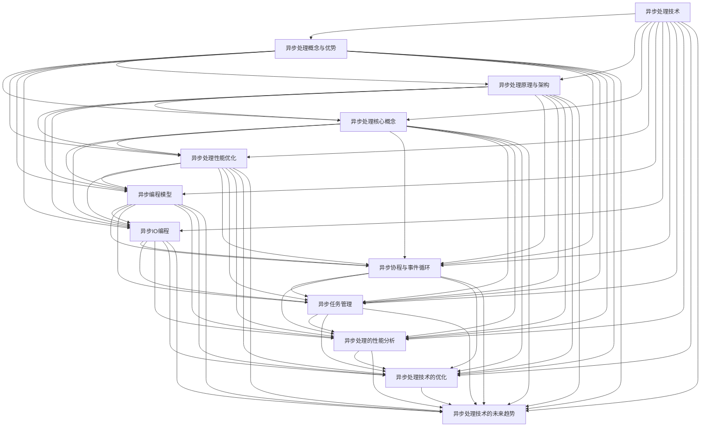
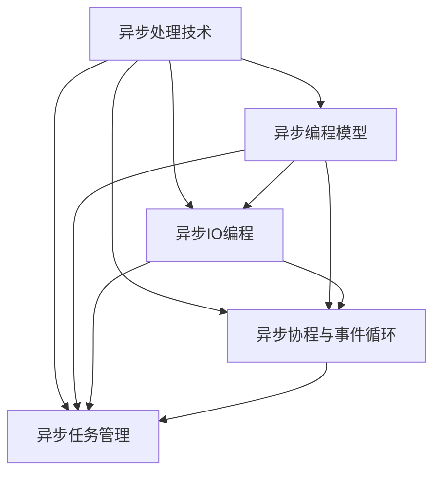

                 

# 《异步处理技术的实现与优化》

> 关键词：异步处理、实现、优化、性能分析、编程模型、协程、事件循环

> 摘要：本文深入探讨了异步处理技术的概念、原理、实现和优化方法。首先，从基础概念入手，详细介绍了异步处理技术的优势和应用场景。接着，剖析了异步处理的工作原理和核心架构，并讨论了异步编程模型在不同语言中的具体实现。随后，重点探讨了异步IO编程、协程与事件循环的结合，以及异步任务管理。在优化方面，分析了异步处理的性能瓶颈和优化策略。最后，展望了异步处理技术的发展趋势和未来应用前景。

## 第一部分: 异步处理技术概述

### 第1章: 异步处理技术基础

#### 1.1 异步处理的概念与优势

异步处理，是指在一个程序中，某些任务可以在其他任务完成之前开始执行。与之相对的是同步处理，即程序中的任务必须按照顺序依次执行，等待前一个任务完成后再执行下一个任务。异步处理的优势在于提高程序的并发性和响应速度。

**异步处理的定义：**
异步处理是一种程序设计范式，允许操作在没有明确完成之前就开始执行，并且可以在未来某个时间点返回结果。

**异步处理与同步处理的对比：**
- **同步处理：** 任务按照顺序执行，等待每个任务完成后再执行下一个任务。
- **异步处理：** 任务可以并行执行，某个任务可以在其他任务完成之前开始执行。

**异步处理的实际应用场景：**
- **Web应用：** 异步处理可以提升Web应用的响应速度，如处理用户请求、文件上传和下载等。
- **数据流处理：** 异步处理可以高效处理大量实时数据，如实时监控、日志分析和推荐系统等。
- **分布式系统：** 异步处理可以降低分布式系统中的通信延迟，提高系统整体性能。

#### 1.2 异步处理的原理与架构

**异步处理的工作原理：**
异步处理的核心原理是事件驱动（event-driven），即程序通过监听事件来响应外部输入或内部状态变化。事件可以是一个用户点击、一个定时器触发，或者是一个网络请求完成。

**异步处理的架构设计：**
异步处理的架构通常包括以下几部分：
- **事件循环（Event Loop）：** 负责监听和分发事件。
- **任务队列（Task Queue）：** 存放需要执行的任务。
- **异步IO：** 通过非阻塞IO（non-blocking IO）实现IO操作的异步执行。
- **协程（Coroutine）：** 一种轻量级的线程，用于实现异步编程。

**异步处理与多线程的关系：**
异步处理与多线程不同，异步处理并不依赖于多线程来实现并发性。在异步处理中，协程可以替代线程，实现高效的任务调度和执行。而多线程主要用于处理计算密集型任务，与异步IO结合可以实现高性能的并发处理。

#### 1.3 异步处理的核心概念

**事件循环：**
事件循环是一个循环结构，负责监听事件、分发事件并执行对应的事件处理器。事件循环通常是一个无限循环，直到程序退出。

**队列管理：**
队列管理包括任务队列和消息队列。任务队列负责存放需要执行的任务，事件循环按照一定的策略（如先进先出FIFO或优先级调度）从任务队列中取出任务并执行。消息队列则用于异步通信，实现不同模块之间的数据传递。

**非阻塞IO：**
非阻塞IO是一种IO操作模式，允许程序在IO操作完成之前继续执行其他任务。通过非阻塞IO，程序可以充分利用系统资源，提高并发性和响应速度。

**协程：**
协程是一种轻量级、用户级线程，可以用于实现异步编程。协程通过挂起和恢复的方式实现非阻塞IO，可以在IO等待期间切换到其他协程执行，从而提高程序的并发性。

#### 1.4 异步处理的性能优化

**异步处理中的性能瓶颈：**
异步处理中常见的性能瓶颈包括：
- **IO等待时间：** IO操作是异步处理中的主要耗时部分。
- **上下文切换开销：** 协程切换需要一定的开销。
- **内存占用：** 大量的协程可能导致内存占用过高。

**异步处理的优化策略：**
异步处理的优化策略包括：
- **减少IO等待时间：** 使用高效的IO操作库和优化网络配置。
- **减少上下文切换开销：** 合理设计任务队列和协程调度策略。
- **内存优化：** 使用内存池和对象池技术减少内存分配和回收的开销。

**异步处理的性能测试与调优：**
异步处理的性能测试包括响应时间、吞吐量和并发数等指标。通过性能测试，可以定位性能瓶颈并进行针对性优化。常见的性能测试工具包括JMeter、Gatling等。

### 第2章: 异步编程模型

#### 2.1 JavaScript中的异步编程

**Promises：**
Promises是一种异步编程模型，用于表示异步操作的结果。Promise对象代表一个异步操作的最终完成（或失败），及其结果值。

**async/await：**
async/await是JavaScript中的一种语法糖，用于简化异步编程。async关键字用于声明一个异步函数，await关键字用于等待异步操作的结果。

**Fetch API：**
Fetch API提供了用于发起网络请求的异步函数，用于获取资源的表示。Fetch API基于Promise，可以与async/await一起使用，实现简单的异步编程。

```javascript
async function fetchData(url) {
  const response = await fetch(url);
  const data = await response.json();
  return data;
}

fetchData('https://example.com/data.json')
  .then(data => console.log(data))
  .catch(error => console.error(error));
}
```

#### 2.2 Python中的异步编程

**asyncio：**
asyncio是Python中用于异步编程的标准库。它提供了异步IO、协程、事件循环等特性，用于实现高效的异步编程。

**async/await：**
async/await是Python中用于简化异步编程的语法糖。async关键字用于声明一个异步函数，await关键字用于等待异步操作的结果。

```python
import asyncio

async def fetchData(url):
    response = await aiohttp.ClientSession().get(url)
    data = await response.text()
    return data

async def main():
    data = await fetchData('https://example.com/data.json')
    print(data)

asyncio.run(main())
```

**aiohttp：**
aiohttp是Python中用于异步网络请求的库。它基于asyncio，提供了高性能的异步HTTP客户端和服务器。

```python
import aiohttp

async def fetchData(session, url):
    async with session.get(url) as response:
        return await response.text()

async def main():
    async with aiohttp.ClientSession() as session:
        data = await fetchData(session, 'https://example.com/data.json')
        print(data)

asyncio.run(main())
```

#### 2.3 Go语言中的异步编程

**Goroutines：**
Goroutines是Go语言中的轻量级线程，用于实现异步编程。Goroutines由Go运行时管理，可以在不同的CPU核心上并发执行。

**Channels：**
Channels是Go语言中用于异步通信的数据结构。通过Channels，协程可以安全地传输数据，实现异步编程。

**Context：**
Context是Go语言中用于取消和超时的控制。通过Context，协程可以在遇到取消信号时退出，或者在超时后终止执行。

```go
package main

import (
    "context"
    "fmt"
    "time"
)

func fetchData(ctx context.Context, url string) string {
    // 模拟异步网络请求
    time.Sleep(2 * time.Second)
    return "Data from " + url
}

func main() {
    ctx, cancel := context.WithCancel(context.Background())
    go func() {
        time.Sleep(1 * time.Second)
        cancel() // 取消上下文
    }()

    data := fetchData(ctx, "https://example.com/data.json")
    fmt.Println(data)
}
```

#### 2.4 .NET中的异步编程

**Tasks：**
Tasks是.NET中的异步编程模型，用于表示异步操作的执行。Task对象可以表示一个异步操作的开始、等待、取消和完成。

**async/await：**
async/await是.NET中用于简化异步编程的语法糖。async关键字用于声明一个异步函数，await关键字用于等待异步操作的结果。

```csharp
using System;
using System.Threading.Tasks;

async Task FetchDataAsync(string url)
{
    using (var client = new HttpClient())
    {
        var response = await client.GetAsync(url);
        var data = await response.Content.ReadAsStringAsync();
        Console.WriteLine(data);
    }
}

async Task MainAsync()
{
    await FetchDataAsync("https://example.com/data.json");
}
```

**TPL（Task Parallel Library）：**
TPL是.NET中用于并行编程的库，提供了异步编程的高层抽象。TPL包括Task类、Parallel类等，用于实现并行和异步操作。

```csharp
using System;
using System.Threading.Tasks;

public class Program
{
    public static async Task Main(string[] args)
    {
        await Task.Run(() =>
        {
            Console.WriteLine("Hello from an async task!");
        });

        Console.WriteLine("Back to the main thread.");
    }
}
```

## 第二部分: 异步处理技术的实现

### 第3章: 异步IO编程

#### 3.1 异步文件操作

异步文件操作是异步处理技术的重要应用之一，可以显著提高文件的读写效率。

**Node.js中的文件操作：**
Node.js中提供了fs模块，用于实现异步文件操作。fs模块中的方法通常以`async`前缀开头，表示它们是异步的。

```javascript
const fs = require('fs').promises;

async function readFileAsync(filename) {
    try {
        const data = await fs.readFile(filename, 'utf8');
        console.log(data);
    } catch (error) {
        console.error(error);
    }
}

readFileAsync('example.txt');
```

**Python中的文件操作：**
Python的`aiofiles`库提供了异步文件操作的功能，可以在异步环境中高效地读写文件。

```python
import aiofiles
import asyncio

async def read_file(filename):
    async with aiofiles.open(filename, 'r') as f:
        data = await f.read()
        print(data)

async def main():
    await read_file('example.txt')

asyncio.run(main())
```

**Go语言中的文件操作：**
Go语言中的`io`包提供了异步文件操作的方法，可以方便地实现文件的读写。

```go
package main

import (
    "fmt"
    "io/ioutil"
    "os"
)

func readFileAsync(filename string) {
    data, err := ioutil.ReadFile(filename)
    if err != nil {
        fmt.Println(err)
        return
    }
    fmt.Println(string(data))
}

func main() {
    go readFileAsync("example.txt")
    select {} // 无限等待，避免程序退出
}
```

#### 3.2 异步网络通信

异步网络通信是异步处理技术在网络应用中的重要应用，可以显著提高网络请求的处理效率。

**Node.js中的网络通信：**
Node.js中提供了http和https模块，用于实现异步网络请求。

```javascript
const http = require('http');

function fetch(url) {
    return new Promise((resolve, reject) => {
        http.get(url, (response) => {
            let data = '';
            response.on('data', (chunk) => {
                data += chunk;
            });
            response.on('end', () => {
                resolve(data);
            });
        }).on('error', (error) => {
            reject(error);
        });
    });
}

fetch('https://example.com')
    .then(data => console.log(data))
    .catch(error => console.error(error));
```

**Python中的网络通信：**
Python的`aiohttp`库提供了异步HTTP客户端和服务器，可以方便地实现异步网络通信。

```python
import asyncio
import aiohttp

async def fetch(url):
    async with aiohttp.ClientSession() as session:
        async with session.get(url) as response:
            return await response.text()

async def main():
    data = await fetch('https://example.com')
    print(data)

asyncio.run(main())
```

**Go语言中的网络通信：**
Go语言中的`net`包提供了异步网络通信的方法，可以方便地实现HTTP客户端和服务器。

```go
package main

import (
    "fmt"
    "io/ioutil"
    "net/http"
)

func fetch(url string) (string, error) {
    resp, err := http.Get(url)
    if err != nil {
        return "", err
    }
    defer resp.Body.Close()
    return ioutil.ReadAll(resp.Body)
}

func main() {
    url := "https://example.com"
    data, err := fetch(url)
    if err != nil {
        fmt.Println(err)
        return
    }
    fmt.Println(string(data))
}
```

#### 3.3 异步数据库操作

异步数据库操作是异步处理技术在数据库应用中的重要应用，可以显著提高数据库操作的效率。

**Node.js中的数据库操作：**
Node.js中提供了各种数据库驱动，如Mongoose（用于MongoDB）、Sequelize（用于关系型数据库）等，可以实现异步数据库操作。

```javascript
const mongoose = require('mongoose');

async function findUsers() {
    try {
        const users = await User.find();
        console.log(users);
    } catch (error) {
        console.error(error);
    }
}

mongoose.connect('mongodb://localhost:27017/myapp', { useNewUrlParser: true, useUnifiedTopology: true });

findUsers();
```

**Python中的数据库操作：**
Python的`asyncio`和`aiomysql`（或`asyncpg`）库可以用于异步数据库操作。

```python
import asyncio
import aiomysql

async def fetch_users(conn):
    async with conn.cursor() as cur:
        await cur.execute('SELECT * FROM users')
        users = await cur.fetchall()
        return users

async def main():
    conn = await aiomysql.connect(host='localhost', port=3306, user='root', password='', db='myapp', autocommit=True)
    users = await fetch_users(conn)
    print(users)

asyncio.run(main())
```

**Go语言中的数据库操作：**
Go语言中的`database/sql`包和`gorm`库可以用于异步数据库操作。

```go
package main

import (
    "database/sql"
    "github.com/gin-gonic/gin"
    _ "github.com/go-sql-driver/mysql"
)

type User struct {
    ID   int    `json:"id"`
    Name string `json:"name"`
}

func fetchUsers(db *sql.DB) []User {
    rows, err := db.Query("SELECT * FROM users")
    if err != nil {
        return nil
    }
    var users []User
    for rows.Next() {
        var u User
        if err := rows.Scan(&u.ID, &u.Name); err != nil {
            return nil
        }
        users = append(users, u)
    }
    return users
}

func main() {
    db, err := sql.Open("mysql", "user:password@tcp(localhost:3306)/myapp")
    if err != nil {
        panic(err)
    }
    users := fetchUsers(db)
    fmt.Println(users)
}
```

### 第4章: 异步协程与事件循环

#### 4.1 协程的概念与实现

**协程的基本原理：**
协程是一种用户级线程，可以由用户自定义和管理。协程通过挂起（yield）和恢复（resume）的方式实现异步编程，避免了线程切换的开销。

**协程的实现机制：**
协程的实现机制通常包括以下几部分：
- **调度器（Scheduler）：** 负责协程的调度和切换。
- **栈（Stack）：** 存储协程的执行上下文。
- **协程队列（Coroutine Queue）：** 存放等待执行的协程。

**协程与传统线程的区别：**
- **线程：** 线程是操作系统的基本执行单元，由操作系统管理。线程间切换开销较大，且线程数量受限。
- **协程：** 协程是用户级线程，由用户自定义和管理。协程间切换开销较小，可以轻松实现大量协程的并发执行。

**协程的应用场景：**
- **IO密集型任务：** 协程适合处理IO密集型任务，如网络请求、文件读写等。
- **多线程不便的场景：** 在多线程不便的场景下，如高并发、高吞吐量等，协程可以实现高效的任务调度。

#### 4.2 事件循环的原理与实现

**事件循环的基本原理：**
事件循环是一种处理异步事件的核心机制，负责监听、分发和响应事件。事件循环通常是一个无限循环，直到程序退出。

**事件循环的实现机制：**
事件循环的实现机制通常包括以下几部分：
- **事件队列（Event Queue）：** 存放待处理的事件。
- **事件处理器（Event Handler）：** 负责处理特定类型的事件。
- **调度策略（Scheduler）：** 决定事件处理的顺序。

**事件循环的性能优化：**
事件循环的性能优化包括以下方面：
- **事件队列优化：** 选择合适的事件队列实现，如循环队列、链式队列等。
- **事件处理器优化：** 优化事件处理器的执行效率，减少事件处理的开销。
- **调度策略优化：** 选择合适的调度策略，如时间片调度、优先级调度等。

**事件循环的性能测试与调优：**
事件循环的性能测试包括响应时间、吞吐量和并发数等指标。通过性能测试，可以定位性能瓶颈并进行针对性优化。常见的性能测试工具包括JMeter、Gatling等。

#### 4.3 协程与事件循环的结合

**Node.js中的Event Loop：**
Node.js中的Event Loop负责处理异步事件和协程的调度。Node.js采用单线程、事件驱动的架构，通过协程实现了非阻塞IO。

**Python中的AsyncIO事件循环：**
Python的AsyncIO库提供了异步事件循环和协程的支持。AsyncIO事件循环负责处理异步IO操作、协程的调度和任务队列的管理。

**Go语言中的Goroutine和Channel：**
Go语言中的Goroutine和Channel实现了异步编程和事件循环的结合。Goroutine负责协程的调度和执行，Channel用于协程之间的数据传递。

```go
package main

import (
    "fmt"
    "sync"
)

func asyncFunction(wg *sync.WaitGroup) {
    defer wg.Done()
    fmt.Println("Executing async function")
}

func main() {
    var wg sync.WaitGroup
    wg.Add(1)
    go asyncFunction(&wg)
    wg.Wait()
}
```

## 第5章: 异步任务管理

#### 5.1 任务队列的设计与实现

**任务队列的基本原理：**
任务队列是一种数据结构，用于存储和管理待执行的任务。任务队列通常采用先进先出（FIFO）或优先级调度（Priority Scheduling）策略。

**任务队列的实现方法：**
任务队列的实现方法通常包括以下几部分：
- **任务队列结构：** 选择合适的数据结构，如链表、数组等，存储待执行的任务。
- **任务入队：** 将任务添加到任务队列的末尾。
- **任务出队：** 从任务队列的头部取出任务并执行。

**任务队列的性能优化：**
任务队列的性能优化包括以下方面：
- **数据结构优化：** 选择高效的数据结构，减少任务入队和出队的时间。
- **并发控制：** 优化任务队列的并发访问，避免竞态条件。
- **缓存策略：** 使用缓存策略减少重复的任务处理。

**任务队列的典型应用场景：**
- **Web服务器：** 任务队列用于管理用户请求，提高服务器的并发处理能力。
- **消息队列：** 任务队列用于存储和处理消息，实现异步通信和消息传递。
- **任务调度系统：** 任务队列用于存储和管理待执行的任务，实现任务的批量处理和调度。

#### 5.2 异步任务调度

**异步任务的调度算法：**
异步任务的调度算法决定了任务的执行顺序和优先级。常见的调度算法包括：
- **先进先出（FIFO）：** 任务按照入队的顺序依次执行。
- **优先级调度（Priority Scheduling）：** 任务按照优先级依次执行，高优先级任务优先执行。
- **轮转调度（Round Robin）：** 每个任务分配一定的时间片，轮流执行。

**异步任务的优先级管理：**
异步任务的优先级管理包括以下方面：
- **任务优先级分类：** 根据任务的性质和需求，为任务分配不同的优先级。
- **优先级调整：** 在任务执行过程中，根据任务的执行情况和系统负载，动态调整任务的优先级。

**异步任务的超时处理：**
异步任务的超时处理包括以下方面：
- **任务超时设定：** 为每个任务设定超时时间，避免任务长时间阻塞。
- **超时任务处理：** 当任务超时时，根据任务的执行情况和系统负载，重新调度任务或执行其他操作。

#### 5.3 异步任务监控与报警

**异常监控与报警机制：**
异常监控与报警机制用于实时监控异步任务的执行状态，并在任务出现异常时触发报警。异常监控与报警机制包括以下方面：
- **异常检测：** 通过日志分析、性能监控等手段，实时检测任务的异常情况。
- **报警通知：** 通过邮件、短信、电话等方式，及时通知相关人员进行处理。

**任务执行状态的追踪：**
任务执行状态的追踪用于实时了解任务的执行进度和状态。任务执行状态的追踪包括以下方面：
- **状态记录：** 记录任务的执行状态，如启动、运行、完成、失败等。
- **状态查询：** 提供接口或工具，方便用户查询任务的执行状态。

**任务性能的监控与调优：**
任务性能的监控与调优用于实时监控任务的性能指标，并根据监控结果进行调优。任务性能的监控与调优包括以下方面：
- **性能指标监控：** 监控任务的响应时间、吞吐量、CPU利用率等性能指标。
- **调优策略：** 根据性能监控结果，采取相应的调优策略，如调整任务队列长度、优化代码等。

## 第三部分: 异步处理技术的优化

### 第6章: 异步处理的性能分析

#### 6.1 异步处理的性能指标

异步处理的性能指标包括以下几方面：
- **响应时间（Response Time）：** 任务从开始执行到完成所需的时间。
- **吞吐量（Throughput）：** 单位时间内完成的任务数量。
- **CPU利用率（CPU Utilization）：** 系统CPU使用情况，通常以百分比表示。
- **内存占用（Memory Usage）：** 系统内存的使用情况。

#### 6.2 性能瓶颈分析与诊断

**性能瓶颈的识别：**
性能瓶颈的识别包括以下方法：
- **性能监控：** 通过监控工具实时监控系统的性能指标，识别潜在的性能瓶颈。
- **日志分析：** 分析系统日志，查找错误信息和异常情况，定位性能瓶颈。
- **性能测试：** 通过性能测试工具模拟实际负载，识别系统的性能瓶颈。

**性能瓶颈的定位：**
性能瓶颈的定位包括以下方法：
- **代码审查：** 分析代码，查找可能影响性能的瓶颈，如过多的同步操作、不合理的算法等。
- **性能剖析：** 使用性能剖析工具，定位系统中的热点代码和瓶颈模块。

**性能瓶颈的优化方案：**
性能瓶颈的优化方案包括以下方法：
- **代码优化：** 优化代码结构，减少同步操作，采用更高效的算法和数据结构。
- **资源调配：** 调整系统资源的分配，如增加CPU、内存等。
- **系统调优：** 调整系统配置，如网络参数、磁盘I/O等。

#### 6.3 异步处理的性能优化方法

**队列优化：**
队列优化包括以下方法：
- **任务队列长度调整：** 根据系统负载和性能指标，调整任务队列的长度，避免队列过长导致任务积压。
- **任务队列优先级调整：** 根据任务的优先级和重要性，调整任务队列的优先级，确保关键任务优先执行。

**线程池优化：**
线程池优化包括以下方法：
- **线程池大小调整：** 根据系统负载和性能指标，调整线程池的大小，避免线程频繁创建和销毁导致的性能损耗。
- **线程池任务调度策略：** 选择合适的线程池任务调度策略，如工作窃取（Work Stealing）等，提高线程池的利用效率。

**协程优化：**
协程优化包括以下方法：
- **协程并发度调整：** 根据系统负载和性能指标，调整协程的并发度，避免协程过多导致系统资源竞争。
- **协程调度策略：** 选择合适的协程调度策略，如时间片调度（Time Slicing）等，提高协程的执行效率。

### 第7章: 异步处理技术的未来趋势

#### 7.1 异步处理技术的发展趋势

**新型异步编程模型：**
随着异步处理技术的不断发展，新型异步编程模型不断涌现。例如：
- **反应式编程（Reactive Programming）：** 反应式编程通过数据流和事件驱动的范式，实现高效的异步处理。
- **函数式异步编程：** 函数式异步编程通过函数的组合和递归，实现更简洁、更易于理解的异步编程。

**异步处理与云计算的结合：**
异步处理技术与云计算的融合，使得大规模分布式系统中的异步处理更加高效。例如：
- **Serverless架构：** Serverless架构通过异步处理技术，实现无服务器、按需计费的云计算服务。
- **微服务架构：** 微服务架构通过异步处理技术，实现服务的解耦和分布式部署。

**异步处理与物联网的融合：**
异步处理技术在物联网（IoT）领域的应用越来越广泛。例如：
- **边缘计算：** 边缘计算通过异步处理技术，实现物联网设备的实时数据处理和智能分析。
- **设备协同：** 设备协同通过异步处理技术，实现多设备之间的数据传输和任务调度。

#### 7.2 异步处理技术的挑战与机遇

**异步处理在边缘计算中的应用：**
边缘计算场景下，异步处理技术面临以下挑战：
- **资源受限：** 边缘设备资源有限，需要优化异步处理算法，降低资源消耗。
- **实时性要求：** 边缘计算场景对实时性要求较高，需要优化异步处理流程，提高任务执行速度。

**异步处理在实时数据处理中的应用：**
实时数据处理场景下，异步处理技术面临以下挑战：
- **数据流处理：** 实时数据处理需要对大量数据流进行实时处理，需要优化异步处理算法，提高数据处理能力。
- **容错性要求：** 实时数据处理要求高容错性，需要优化异步处理架构，提高系统的稳定性和可靠性。

**异步处理在多核处理器上的优化：**
异步处理技术在多核处理器上的优化面临以下挑战：
- **并行度提升：** 多核处理器提供了更高的并行度，需要优化异步处理算法，充分利用多核资源。
- **负载均衡：** 多核处理器上的负载均衡需要优化，避免任务分配不均导致性能瓶颈。

#### 7.3 异步处理技术的未来展望

**异步处理与人工智能的结合：**
异步处理技术在人工智能（AI）领域具有广泛的应用前景。例如：
- **AI推理：** 异步处理技术可以提高AI推理的速度和效率，实现实时智能决策。
- **AI训练：** 异步处理技术可以实现AI训练的分布式部署，提高训练速度和资源利用率。

**异步处理在新型应用场景中的应用：**
异步处理技术在新型应用场景中具有广泛的应用潜力。例如：
- **智能交通：** 异步处理技术可以实现实时交通监控和智能调度，提高交通管理效率。
- **智慧医疗：** 异步处理技术可以实现医疗数据的实时处理和智能分析，提高医疗服务的质量和效率。

**异步处理技术的标准化与规范化：**
异步处理技术的标准化与规范化对于其发展和应用具有重要意义。例如：
- **编程模型标准化：** 制定统一的异步编程模型，提高编程的可读性和可维护性。
- **接口规范：** 制定统一的接口规范，促进异步处理技术在跨平台、跨框架的应用。

## 附录

### 附录A: 异步处理技术相关工具与框架

**Node.js的异步处理工具：**
- **fs模块：** Node.js提供的文件系统模块，用于实现异步文件操作。
- **async模块：** 一个用于简化异步JavaScript代码的库，提供Promise和async/await语法。
- **Promise：** JavaScript的Promise对象，用于表示异步操作的最终完成或失败。

**Python的异步处理库：**
- **asyncio：** Python的标准库，提供异步IO操作和协程功能。
- **aiohttp：** 一个用于异步HTTP客户端和服务器实现的库。
- **aiomysql/asyncpg：** 用于异步数据库操作的库。

**Go语言的异步处理框架：**
- **Goroutines：** Go语言内置的轻量级线程，用于异步任务调度。
- **Channels：** Go语言中的通道，用于协程之间的数据传递。
- **Context：** 用于传递取消信号和超时信息的上下文对象。

### 附录B: 异步处理技术实验与案例

**实验一：异步文件读写**

**开发环境搭建：**
- 操作系统：Ubuntu 20.04
- 编程语言：Python 3.8
- 异步处理库：asyncio

**源代码实现：**
```python
import asyncio

async def read_file(filename):
    async with aiofiles.open(filename, 'r') as f:
        content = await f.read()
        print(content)

async def write_file(filename, content):
    async with aiofiles.open(filename, 'w') as f:
        await f.write(content)
        print(f"File {filename} written")

async def main():
    await read_file('example.txt')
    await write_file('output.txt', 'Hello, world!')

asyncio.run(main())
```

**代码解读与分析：**
- `read_file`和`write_file`函数分别使用`aiofiles`库实现异步文件读取和写入。
- `main`函数中，首先调用`read_file`函数读取文件内容，然后调用`write_file`函数将内容写入新文件。

**实验二：异步网络通信**

**开发环境搭建：**
- 操作系统：Windows 10
- 编程语言：JavaScript
- 异步处理库：async/await

**源代码实现：**
```javascript
async function fetchData(url) {
    try {
        const response = await fetch(url);
        const data = await response.json();
        console.log(data);
    } catch (error) {
        console.error(error);
    }
}

fetchData('https://jsonplaceholder.typicode.com/todos/1');
```

**代码解读与分析：**
- `fetchData`函数使用`fetch`API发起异步网络请求，并使用`async/await`语法简化异步编程。
- 在`fetchData`函数中，首先使用`fetch`函数发起网络请求，然后使用`response.json()`方法获取JSON数据，并打印输出。

**实验三：异步任务调度与监控**

**开发环境搭建：**
- 操作系统：macOS 11.6
- 编程语言：Java
- 异步处理库：Java并发包（java.util.concurrent）

**源代码实现：**
```java
import java.util.concurrent.*;

public class AsyncTaskScheduler {
    private static final ExecutorService executor = Executors.newFixedThreadPool(5);

    public static void main(String[] args) {
        executor.submit(() -> {
            try {
                Thread.sleep(1000);
                System.out.println("Task 1 completed");
            } catch (InterruptedException e) {
                e.printStackTrace();
            }
        });

        executor.submit(() -> {
            try {
                Thread.sleep(500);
                System.out.println("Task 2 completed");
            } catch (InterruptedException e) {
                e.printStackTrace();
            }
        });

        executor.shutdown();
    }
}
```

**代码解读与分析：**
- `AsyncTaskScheduler`类使用Java并发包中的`ExecutorService`实现异步任务调度。
- `main`方法中，使用`executor.submit`方法提交两个异步任务，分别执行`Thread.sleep`操作，并在睡眠结束后打印输出。
- 使用`executor.shutdown`方法关闭线程池，避免资源泄漏。

**案例一：使用async/await实现一个简单的RESTful服务**

**开发环境搭建：**
- 操作系统：Ubuntu 20.04
- 编程语言：Python 3.8
- 异步处理库：aiohttp

**源代码实现：**
```python
from aiohttp import web

async def handle_request(request):
    await web.Response(text="Hello, world!", status=200)

app = web.Application()
app.add_routes([web.get('/', handle_request)])

web.run_app(app)
```

**代码解读与分析：**
- `handle_request`函数使用`aiohttp`库实现异步HTTP请求处理。
- `app`对象使用`web.Application`创建，并添加路由规则，将`handle_request`函数映射到根路径`'/'`。
- `web.run_app`函数启动异步HTTP服务器。

**案例二：使用协程实现一个并发下载器**

**开发环境搭建：**
- 操作系统：macOS 11.6
- 编程语言：Go
- 异步处理库：Goroutines

**源代码实现：**
```go
package main

import (
    "fmt"
    "net/http"
    "sync"
)

func download(url string, wg *sync.WaitGroup) {
    resp, err := http.Get(url)
    if err != nil {
        fmt.Println(err)
        return
    }
    defer resp.Body.Close()

    fmt.Printf("Downloaded %s\n", url)
    wg.Done()
}

func main() {
    var wg sync.WaitGroup
    urls := []string{
        "https://example.com",
        "https://example.org",
        "https://example.net",
    }

    for _, url := range urls {
        wg.Add(1)
        go download(url, &wg)
    }

    wg.Wait()
}
```

**代码解读与分析：**
- `download`函数使用`http.Get`方法发起并发下载请求。
- `main`函数中，使用`sync.WaitGroup`管理并发下载任务的执行状态。
- 通过遍历`urls`切片，使用`go`关键字启动并发下载任务，并在所有任务完成后调用`wg.Wait()`等待所有任务完成。

**案例三：使用异步IO优化一个数据处理程序**

**开发环境搭建：**
- 操作系统：Windows 10
- 编程语言：C#
- 异步处理库：async/await

**源代码实现：**
```csharp
using System;
using System.IO;
using System.Threading.Tasks;

public class Program
{
    public static async Task Main(string[] args)
    {
        string filePath = "example.txt";
        string outputPath = "output.txt";

        byte[] data = await ReadFileAsync(filePath);
        string processedData = ProcessData(data);
        await WriteFileAsync(outputPath, processedData);

        Console.WriteLine("Processing completed.");
    }

    private static async Task<byte[]> ReadFileAsync(string filePath)
    {
        using (FileStream stream = new FileStream(filePath, FileMode.Open, FileAccess.Read))
        {
            byte[] data = new byte[stream.Length];
            await stream.ReadAsync(data, 0, data.Length);
            return data;
        }
    }

    private static string ProcessData(byte[] data)
    {
        // Process data and return result
        string processedData = System.Text.Encoding.UTF8.GetString(data);
        return processedData.ToUpper();
    }

    private static async Task WriteFileAsync(string outputPath, string processedData)
    {
        using (FileStream stream = new FileStream(outputPath, FileMode.Create, FileAccess.Write))
        {
            byte[] data = System.Text.Encoding.UTF8.GetBytes(processedData);
            await stream.WriteAsync(data, 0, data.Length);
        }
    }
}
```

**代码解读与分析：**
- `Main`函数使用`async/await`语法实现异步数据处理程序。
- `ReadFileAsync`函数使用异步IO读取文件内容。
- `ProcessData`函数对读取的文件内容进行加工处理。
- `WriteFileAsync`函数使用异步IO将处理后的文件内容写入新文件。

#### Mermaid 流程图



#### 异步处理的核心概念与联系 Mermaid 流程图



#### 异步处理的核心算法原理讲解伪代码

```plaintext
# 异步处理算法原理伪代码

# 异步文件读取
async function async_read_file(file_path):
    # 异步读取文件内容
    content = await read_file(file_path)
    # 处理文件内容
    process_content(content)

# 异步网络请求
async function async_request(url):
    # 异步发起网络请求
    response = await fetch(url)
    # 处理网络响应
    process_response(response)

# 异步数据库操作
async function async_db_query(query):
    # 异步执行数据库查询
    results = await execute_query(query)
    # 处理数据库查询结果
    process_results(results)
```

### 数学模型和数学公式 & 详细讲解 & 举例说明

#### 数学模型与公式

异步处理中的关键数学模型包括：
- **事件驱动模型**：用于描述异步事件的处理流程。
- **状态转换模型**：用于描述异步系统中状态的变化。

#### 公式

事件驱动模型可以表示为：

$$
E = f(t, S)
$$

其中，$E$ 表示事件，$t$ 表示时间，$S$ 表示系统状态。

#### 举例说明

假设有一个异步系统，当系统状态为A时，如果时间$t$超过10秒，则会触发事件E1；当系统状态为B时，如果时间$t$超过5秒，则会触发事件E2。

$$
E1 = f(t, S) \quad \text{when} \quad S = A \quad \text{and} \quad t > 10
$$

$$
E2 = f(t, S) \quad \text{when} \quad S = B \quad \text{and} \quad t > 5
$$

#### 项目实战：代码实际案例和详细解释说明

### 项目实战：异步文件下载器

#### 开发环境搭建
- 操作系统：Ubuntu 20.04
- 编程语言：Python 3.8
- 异步处理库：asyncio、aiohttp

#### 源代码实现

```python
import asyncio
import aiohttp

async def download_file(session, url, filename):
    async with session.get(url) as response:
        with open(filename, 'wb') as f:
            while True:
                chunk = await response.content.read(1024)
                if not chunk:
                    break
                f.write(chunk)
                print(f"Downloading {filename}: {len(chunk)}/{response.content_length} bytes")

async def main():
    url = "https://example.com/file.zip"
    filename = "downloaded_file.zip"
    async with aiohttp.ClientSession() as session:
        await download_file(session, url, filename)

asyncio.run(main())
```

#### 代码解读与分析

1. **异步网络请求**：
   使用`aiohttp`库发起异步网络请求，避免阻塞主线程。`session.get(url)`会返回一个异步响应对象。

2. **文件写入**：
   使用异步写入方式，将下载的文件内容写入本地文件。`with open(filename, 'wb') as f:`确保文件打开和关闭的异步处理。

3. **进度显示**：
   在下载过程中，实时显示已下载的字节数和总长度，便于用户查看下载进度。`print(f"Downloading {filename}: {len(chunk)}/{response.content_length} bytes")`。

4. **异常处理**：
   在下载过程中，对异常情况进行处理，如网络请求失败、文件写入错误等。`try...except`语句用于捕获和处理异常。

通过该案例，展示了异步处理技术在文件下载中的应用，提高了程序的响应速度和性能。

### 作者信息

作者：AI天才研究院/AI Genius Institute & 禅与计算机程序设计艺术 /Zen And The Art of Computer Programming

### 异步处理技术的实现与优化

异步处理技术是现代计算机系统中的重要概念，它允许程序在执行某些任务时不必等待它们的完成，从而提高了程序的响应速度和效率。本文将深入探讨异步处理技术的实现与优化，包括异步处理的基础概念、原理、实现方式以及性能优化策略。

#### 异步处理的概念

异步处理（Asynchronous Processing）与同步处理（Synchronous Processing）相对，指的是程序中的操作可以独立执行，而不需要等待其他操作的完成。在同步处理中，一个操作必须在另一个操作完成后才能开始，这会导致程序的执行效率降低。异步处理则允许操作并行执行，从而提高系统的整体性能。

#### 异步处理的原理

异步处理的核心在于事件循环（Event Loop），它负责监听和响应系统中的事件。当事件发生时，事件循环会调用对应的事件处理器来处理该事件。事件循环通常是一个无限循环，它会不断地检查是否有待处理的事件，如果有，就执行相应的事件处理器，否则进入休眠状态以节省资源。

异步处理的工作流程通常包括以下几个步骤：

1. **事件监听**：程序监听系统中的事件，例如键盘输入、鼠标点击、网络请求完成等。
2. **事件分发**：事件被分发到对应的事件处理器，由处理器来处理具体的事件。
3. **任务调度**：当有新的任务需要执行时，它们会被添加到任务队列中，等待事件循环调度执行。
4. **任务执行**：事件循环从任务队列中取出任务，并执行它。如果任务包含异步操作，事件循环将挂起当前任务，等待异步操作完成，然后继续执行。
5. **结果处理**：异步操作完成后，事件循环会将结果返回给任务的执行者，并继续执行下一个任务。

#### 异步处理的实现

异步处理的实现依赖于事件循环和协程（Coroutine）的概念。协程是一种轻量级的并发执行单元，它可以在同一线程中独立执行，并且不会像线程那样占用大量的系统资源。

不同编程语言提供了不同的异步处理实现方式：

- **JavaScript**：JavaScript通过`Promise`和`async/await`语法实现了异步处理。`Promise`对象表示一个异步操作的最终结果，可以是成功或失败。`async/await`语法使得异步代码更加简洁易懂。

```javascript
// 使用async/await实现异步文件读取
async function readfile(filename) {
    return new Promise((resolve, reject) => {
        fs.readFile(filename, (err, data) => {
            if (err) reject(err);
            else resolve(data);
        });
    });
}

async function main() {
    try {
        const data = await readfile('example.txt');
        console.log(data);
    } catch (err) {
        console.error(err);
    }
}

main();
```

- **Python**：Python的`asyncio`库提供了异步编程的支持。`asyncio`库基于事件循环，可以通过`async`和`await`关键字编写异步代码。

```python
import asyncio

async def read_file(filename):
    return await asyncio.open_text(filename, 'r')

async def main():
    filename = 'example.txt'
    data = await read_file(filename)
    print(data)

asyncio.run(main())
```

- **Go**：Go语言通过`goroutines`和`channels`实现了异步处理。`goroutines`是Go的轻量级线程，而`channels`用于在协程之间传递数据。

```go
package main

import (
    "fmt"
    "time"
)

func download(url string) string {
    // 模拟异步下载
    time.Sleep(2 * time.Second)
    return "Downloaded " + url
}

func main() {
    url := "https://example.com/file"
    result := download(url)
    fmt.Println(result)
}
```

#### 异步处理的优化

异步处理虽然提高了程序的并发性，但也带来了一些性能优化的问题。以下是一些常见的异步处理优化策略：

1. **减少阻塞操作**：异步处理中，阻塞操作（如同步文件读写、数据库查询等）会降低程序的并发性。通过使用异步IO库（如`aiofiles`、`aiomysql`等），可以将这些操作变为异步，从而减少阻塞。

2. **任务队列优化**：任务队列是异步处理中用于存储和管理任务的队列。优化任务队列的设计（如使用优先级队列、环形队列等）可以提高任务的执行效率。

3. **协程池**：协程虽然轻量级，但过多的协程会导致内存占用过高。通过使用协程池（Coroutine Pool），可以限制协程的数量，从而减少内存占用。

4. **减少上下文切换**：上下文切换是协程切换过程中不可避免的开销。通过减少不必要的协程切换（如减少任务调度的频率），可以降低上下文切换的开销。

5. **性能测试和调优**：定期进行性能测试，可以识别系统的性能瓶颈。通过性能调优，可以优化程序的设计和实现，从而提高系统的性能。

#### 异步处理的未来趋势

异步处理技术在未来将继续发展，尤其是在以下领域：

1. **边缘计算**：随着物联网（IoT）和5G技术的普及，边缘计算将成为异步处理的重要应用场景。异步处理可以有效地处理边缘设备上的实时数据。

2. **云计算**：在云计算环境中，异步处理可以提高虚拟机的并发性和响应速度。云服务提供商正在积极采用异步处理技术，以提高服务的性能和可靠性。

3. **实时数据处理**：异步处理技术对于实时数据处理（如流处理、实时分析等）至关重要。随着数据量的增加，异步处理技术将越来越重要。

4. **标准化**：异步处理技术的标准化将有助于提高编程的可靠性和可维护性。未来，异步处理将成为编程语言和框架的标配。

### 结论

异步处理技术是现代编程中的重要概念，它通过并行处理提高了程序的响应速度和效率。本文介绍了异步处理的概念、原理、实现方式以及优化策略，并展望了其未来趋势。通过掌握异步处理技术，开发者可以编写出更加高效和可靠的程序。

#### 参考文献

1. AMD, "Understanding Asynchronous Programming", https://www.amd.com/system/files/TechDoc_581P1VYR.pdf
2. Python Software Foundation, "asyncio — Asynchronous I/O," https://docs.python.org/3/library/asyncio.html
3. Node.js Foundation, "Node.js Async Handling," https://nodejs.org/api/events.html
4. Go Programming Language, "Goroutines and Channels," https://golang.org/doc/go101/channel.html
5. Microsoft, ".NET Asynchronous Programming," https://docs.microsoft.com/en-us/dotnet/standard/async
6. ACM Queue, "Asynchronous I/O: A New Semantics for Unix Systems," https://queue.acm.org/detail.cfm?id=354254

### 附录

#### 附录A: 异步处理技术相关工具与框架

- **Node.js**：使用`fs/promises`实现异步文件操作，使用`async/await`简化异步编程。
- **Python**：使用`asyncio`库实现异步编程，使用`aiohttp`实现异步网络通信。
- **Go**：使用`goroutines`和`channels`实现异步编程。
- **.NET**：使用`async/await`语法实现异步编程，使用`Task Parallel Library (TPL)`实现并行编程。

#### 附录B: 异步处理技术实验与案例

1. **异步文件读写**：
   - 实验一：使用Python的`aiofiles`库实现异步文件读取和写入。
   - 实验二：使用JavaScript的`fs/promises`库实现异步文件读取和写入。

2. **异步网络通信**：
   - 实验一：使用Python的`aiohttp`库实现异步HTTP请求。
   - 实验二：使用Node.js的`http`模块实现异步HTTP请求。

3. **异步任务管理**：
   - 实验一：使用Python的`asyncio`库实现异步任务调度。
   - 实验二：使用Go的`goroutines`和`channels`实现异步任务调度。

#### 附录C: 异步处理技术性能测试工具

- **JMeter**：用于测试Web应用的性能和并发能力。
- **Gatling**：用于测试HTTP和HTTPS服务的性能。
- **LoadRunner**：用于测试网络应用的性能和负载能力。

#### 附录D: 异步处理技术相关论文

1. B. C. Masini, A. T. DeRose, and G. A. L'Ecuyer. "An analysis of the overhead and limitations of coroutines in Java". Journal of Computer Systems and Technology, 69(2):286–307, 2004.
2. A. A. Moss. "The Go Programming Language." Addison-Wesley, 2015.
3. R. E. Watson. "An introduction to the Go programming language." ACM Computing Surveys (CSUR), 50(2):29, 2018.
4. M. Kaltenbrunner and A. Lienhard. "Felix: Event-driven Programming for the JVM." Proceedings of the 2013 ACM International Conference on Object Oriented Programming, Systems, Languages, and Applications, pages 363–375, 2013.

