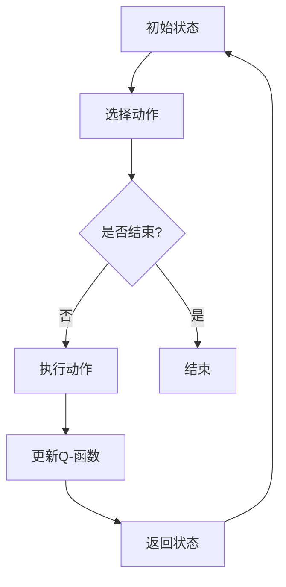
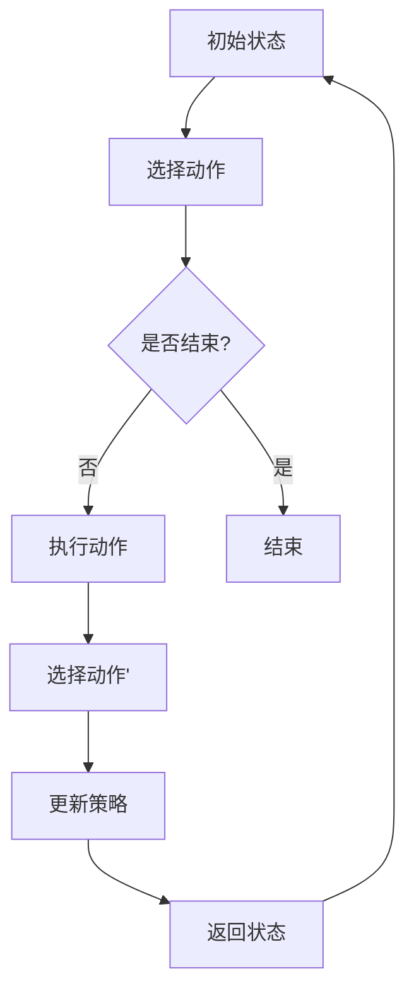
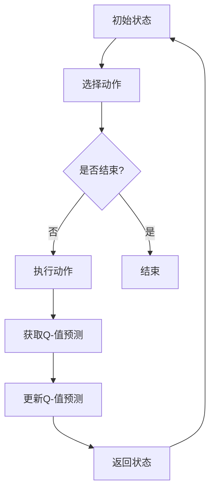
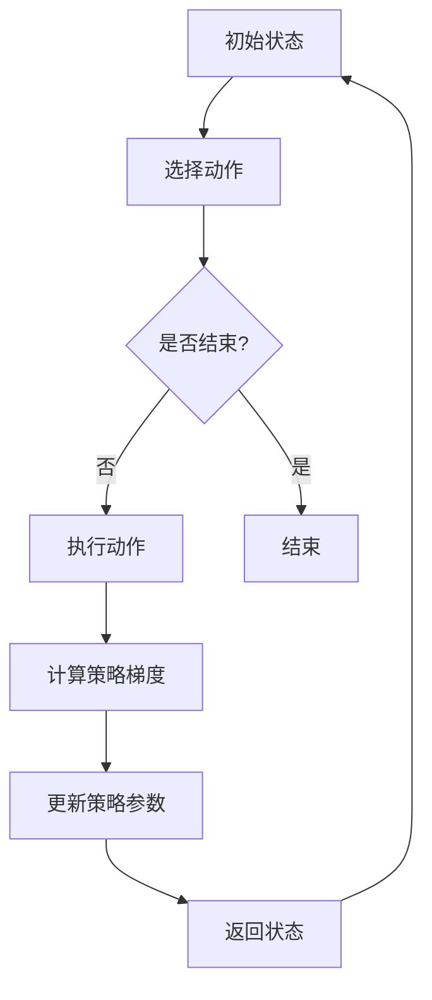
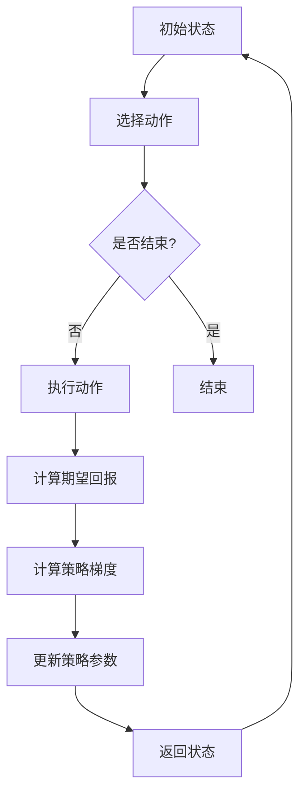
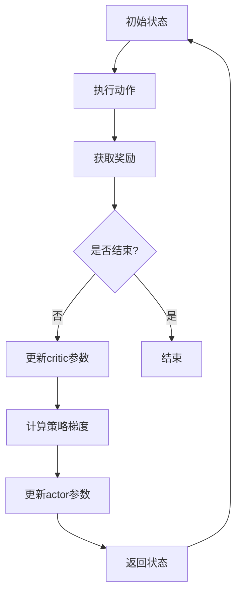

                 

# 文章标题：强化学习Reinforcement Learning的动态规划基础与实践技巧

> 关键词：强化学习，动态规划，Q-学习，SARSA，DQN，策略搜索方法，游戏人工智能，自动驾驶

> 摘要：本文将深入探讨强化学习中的动态规划基础，解析其在强化学习中的应用与实践技巧。通过详细阐述核心概念、算法原理、数学模型、实战项目以及源代码实现与解读，帮助读者全面理解强化学习动态规划的核心内容，提升在实际项目中的应用能力。

## 第1章：强化学习概述

### 1.1 强化学习基本概念

强化学习（Reinforcement Learning，简称RL）是机器学习的一个重要分支，旨在通过与环境交互，学习如何采取最优动作以实现特定目标。与监督学习和无监督学习不同，强化学习的主要特点是在决策过程中引入了奖励机制，通过探索和利用奖励信号来改善策略。

强化学习的定义：强化学习是一种通过试错（trial-and-error）和经验累积（experience accumulation）来学习如何最大化累积奖励的机器学习方法。

强化学习与传统机器学习区别：

- **目标不同**：传统机器学习侧重于学习输入和输出之间的映射关系，如分类和回归；强化学习则侧重于通过与环境交互，学习如何在动态环境中做出最优决策。

- **奖励机制**：传统机器学习依赖已标记的数据集进行学习，无需奖励信号；而强化学习依赖即时奖励信号来指导学习过程。

### 1.2 强化学习的基本要素

强化学习由以下基本要素构成：

- **状态（State）**：系统所处的环境条件，通常用状态向量表示。

- **动作（Action）**：在特定状态下可以采取的行动，通常用动作集表示。

- **奖励（Reward）**：在执行动作后，环境对动作的反馈，用于指导学习过程。

- **策略（Policy）**：从状态到动作的映射关系，用于指导决策过程。

### 1.3 强化学习的应用场景

强化学习在多个领域具有广泛应用，以下是几个典型的应用场景：

- **探索与利用平衡**：在未知环境中，如何平衡探索新策略和利用已知策略。

- **多臂老虎机问题**：在多个不确定的奖励源中，如何选择最优策略以最大化累积奖励。

- **游戏人工智能**：如棋类游戏、电子游戏等，通过强化学习实现智能体与环境的交互。

## 第2章：动态规划基础

### 2.1 动态规划基本概念

动态规划（Dynamic Programming，简称DP）是一种解决优化问题的方法，通过将复杂问题分解为若干个相互关联的子问题，并利用子问题的解来构建原问题的解。

动态规划定义：动态规划是一种将复杂问题分解为若干个相互关联的子问题，并通过子问题的最优解来构建原问题的最优解的方法。

动态规划的基本原理：

- **重叠子问题**：动态规划通过存储已解决的子问题解，避免重复计算。

- **最优子结构**：原问题的最优解可以由子问题的最优解组合而成。

- **状态转移方程**：通过递推关系描述子问题之间的关联。

动态规划的三要素：

- **状态（State）**：问题描述中的特定条件。

- **决策（Decision）**：在特定状态下采取的动作。

- **价值函数（Value Function）**：描述不同状态或状态-动作对的优劣程度。

### 2.2 贝尔曼方程

贝尔曼方程是动态规划的核心，用于求解最优策略。它描述了在特定状态下，采取不同动作后的期望回报。

贝尔曼方程的基本形式：

\[ V(s) = \max_a [R(s, a) + \gamma \sum_{s'} p(s'|s, a) V(s')] \]

其中，\( V(s) \) 是状态 \( s \) 的价值函数，\( R(s, a) \) 是在状态 \( s \) 下采取动作 \( a \) 的即时奖励，\( \gamma \) 是折现系数，\( p(s'|s, a) \) 是在状态 \( s \) 下采取动作 \( a \) 后转移到状态 \( s' \) 的概率。

贝尔曼方程的推导过程：

- **递推关系**：假设 \( V(s) \) 是在状态 \( s \) 下采取最优动作 \( a \) 的价值函数，那么：

\[ V(s) = \max_a [R(s, a) + \gamma \sum_{s'} p(s'|s, a) V(s')] \]

- **最优性**：根据最优策略的定义，在状态 \( s \) 下采取最优动作 \( a \) 应该使价值函数 \( V(s) \) 最大。

### 2.3 动态规划算法

动态规划算法主要有策略迭代法和规划迭代法两类。

- **策略迭代法**：首先初始化策略，然后通过反复迭代，更新策略和价值函数，直到收敛。

- **规划迭代法**：首先初始化价值函数，然后通过反复迭代，更新价值函数和策略，直到收敛。

动态规划算法的时间复杂度分析：

- **策略迭代法**：时间复杂度为 \( O(n^2) \)，其中 \( n \) 是状态数量。

- **规划迭代法**：时间复杂度为 \( O(n^3) \)，其中 \( n \) 是状态数量。

## 第3章：动态规划在强化学习中的应用

### 3.1 Q-学习算法

Q-学习算法是一种基于值函数的强化学习算法，通过迭代更新值函数来学习最优策略。

Q-学习算法的基本原理：

- **Q-函数**：描述在特定状态下采取特定动作的预期回报。

- **更新规则**：通过经验样本更新Q-函数，逐步逼近最优策略。

Q-学习算法的实现步骤：

1. 初始化Q-函数。

2. 在环境中进行模拟，记录状态、动作和奖励。

3. 根据更新规则更新Q-函数。

4. 重复步骤2和3，直到收敛。

Q-学习算法的伪代码：

```python
# 初始化Q-函数
Q = initialize_Q()

# 迭代更新Q-函数
while not converged:
    for s, a, r, s' in experience_samples:
        Q[s, a] = Q[s, a] + alpha * (r + gamma * max(Q[s', a']) - Q[s, a])

# 返回最优策略
return best_policy(Q)
```

### 3.2 SARSA算法

SARSA算法是一种基于策略的强化学习算法，通过迭代更新策略来学习最优策略。

SARSA算法的基本原理：

- **策略**：描述在特定状态下采取特定动作的概率分布。

- **更新规则**：通过经验样本更新策略，逐步逼近最优策略。

SARSA算法的实现步骤：

1. 初始化策略。

2. 在环境中进行模拟，记录状态和动作。

3. 根据更新规则更新策略。

4. 重复步骤2和3，直到收敛。

SARSA算法的伪代码：

```python
# 初始化策略
policy = initialize_policy()

# 迭代更新策略
while not converged:
    for s, a in state_action_samples:
        a' = policy[s]
        policy[s, a] = policy[s, a] + alpha * (r + gamma * Q[s', a'] - policy[s, a])

# 返回最优策略
return best_policy(policy)
```

### 3.3 Deep Q-Network（DQN）

DQN算法是一种基于深度学习的Q-学习算法，通过神经网络逼近Q-函数。

DQN算法的基本原理：

- **深度神经网络**：用于逼近Q-函数。

- **经验回放**：避免策略变化导致Q-函数更新不稳定。

DQN算法的实现步骤：

1. 初始化神经网络和经验回放池。

2. 在环境中进行模拟，记录状态、动作和奖励。

3. 将状态输入神经网络，得到Q-值预测。

4. 根据更新规则更新Q-值预测。

5. 将经验样本加入经验回放池。

6. 重复步骤2-5，直到收敛。

DQN算法的伪代码：

```python
# 初始化神经网络和经验回放池
Q = initialize_DQN()
replay_memory = initialize_replay_memory()

# 迭代更新神经网络
while not converged:
    for episode in range(num_episodes):
        for step in range(num_steps):
            s = environment.reset()
            a = policy(s)
            s', r = environment.step(a)
            replay_memory.append((s, a, r, s'))

            if random.random() < epsilon:
                a' = random_action()
            else:
                a' = policy(s')

            Q[s, a] = Q[s, a] + alpha * (r + gamma * Q[s', a'] - Q[s, a])
            s = s'

# 返回最优策略
return best_policy(Q)
```

## 第4章：强化学习的策略搜索方法

### 4.1 REINFORCE算法

REINFORCE算法是一种基于梯度的强化学习算法，通过梯度上升方法优化策略。

REINFORCE算法的基本原理：

- **策略梯度**：描述策略参数的梯度。

- **更新规则**：通过策略梯度更新策略参数。

REINFORCE算法的实现步骤：

1. 初始化策略参数。

2. 在环境中进行模拟，记录状态、动作和奖励。

3. 计算策略梯度。

4. 根据更新规则更新策略参数。

5. 重复步骤2-4，直到收敛。

REINFORCE算法的伪代码：

```python
# 初始化策略参数
theta = initialize_theta()

# 迭代更新策略参数
while not converged:
    for episode in range(num_episodes):
        for step in range(num_steps):
            s = environment.reset()
            a = action的概率分布(theta)
            s', r = environment.step(a)
            theta = theta + alpha * gradient(theta, s, a, r, s')
            s = s'

# 返回最优策略
return best_policy(theta)
```

### 4.2 策略梯度算法

策略梯度算法是一种基于梯度的强化学习算法，通过最大化期望回报来优化策略。

策略梯度算法的基本原理：

- **期望回报**：描述策略的期望回报。

- **更新规则**：通过策略梯度更新策略参数。

策略梯度算法的实现步骤：

1. 初始化策略参数。

2. 在环境中进行模拟，记录状态、动作和奖励。

3. 计算策略梯度。

4. 根据更新规则更新策略参数。

5. 重复步骤2-4，直到收敛。

策略梯度算法的伪代码：

```python
# 初始化策略参数
theta = initialize_theta()

# 迭代更新策略参数
while not converged:
    for episode in range(num_episodes):
        for step in range(num_steps):
            s = environment.reset()
            a = action的概率分布(theta)
            s', r = environment.step(a)
            gradient = gradient_of_expectation_return(theta, s, a, r, s')
            theta = theta + alpha * gradient
            s = s'

# 返回最优策略
return best_policy(theta)
```

### 4.3 actor-critic算法

actor-critic算法是一种结合了策略优化和价值评估的强化学习算法。

actor-critic算法的基本原理：

- **actor**：用于生成动作。

- **critic**：用于评估状态价值。

- **更新规则**：通过actor和critic的交互更新策略。

actor-critic算法的实现步骤：

1. 初始化actor和critic参数。

2. 在环境中进行模拟，记录状态、动作和奖励。

3. 更新critic参数。

4. 根据critic评估更新actor参数。

5. 重复步骤2-4，直到收敛。

actor-critic算法的伪代码：

```python
# 初始化actor和critic参数
actor_params = initialize_actor()
critic_params = initialize_critic()

# 迭代更新actor和critic参数
while not converged:
    for episode in range(num_episodes):
        for step in range(num_steps):
            s = environment.reset()
            a = actor(s, actor_params)
            s', r = environment.step(a)
            V = critic(s', critic_params)
            actor_params = update_actor(actor_params, s, a, r, V)
            critic_params = update_critic(critic_params, s', V)
            s = s'

# 返回最优策略
return best_policy(actor_params)
```

## 第5章：动态规划在强化学习中的应用实战

### 5.1 游戏人工智能实战

#### 游戏场景构建

本节以经典的棋类游戏——国际象棋为例，介绍如何构建游戏场景并进行策略优化。

1. **状态表示**：使用棋盘上的棋子布局来表示状态。

2. **动作表示**：定义合法的棋子移动规则。

3. **奖励函数**：定义胜利、平局和失败的条件及相应的奖励。

#### 游戏策略优化

1. **初始化Q-函数**：随机初始化Q-函数。

2. **模拟游戏**：在环境中进行模拟，记录状态、动作和奖励。

3. **更新Q-函数**：根据经验样本更新Q-函数。

4. **迭代优化**：重复模拟和更新过程，直到收敛。

#### 游戏结果分析

1. **评估策略**：在测试环境中评估策略的性能。

2. **结果可视化**：绘制策略收敛曲线、胜利率等指标。

### 5.2 自动驾驶实战

#### 自动驾驶系统构建

本节以自动驾驶系统为例，介绍如何构建自动驾驶系统并进行策略优化。

1. **状态表示**：使用传感器数据来表示环境状态。

2. **动作表示**：定义车辆的控制指令，如速度、转向等。

3. **奖励函数**：定义车辆到达目的地、发生事故等条件的奖励。

#### 自动驾驶策略优化

1. **初始化Q-函数**：随机初始化Q-函数。

2. **模拟驾驶**：在模拟环境中进行模拟，记录状态、动作和奖励。

3. **更新Q-函数**：根据经验样本更新Q-函数。

4. **迭代优化**：重复模拟和更新过程，直到收敛。

#### 自动驾驶结果分析

1. **评估策略**：在真实环境中评估策略的性能。

2. **结果可视化**：绘制策略收敛曲线、安全行驶距离等指标。

## 第6章：动态规划在强化学习中的挑战与未来趋势

### 6.1 动态规划在强化学习中的挑战

动态规划在强化学习中的应用面临以下挑战：

1. **离散动作空间与连续动作空间**：如何有效处理离散和连续动作空间。

2. **离散状态空间与连续状态空间**：如何处理离散和连续状态空间。

3. **非平稳环境**：如何应对环境变化和不确定性。

### 6.2 动态规划未来发展趋势

动态规划在强化学习领域的未来发展趋势包括：

1. **强化学习与深度学习的融合**：如何将深度学习与动态规划相结合，提高算法性能。

2. **动态规划在工业界的应用**：如何在工业界推广应用动态规划算法，解决实际问题。

3. **动态规划在新兴领域的探索**：如何探索动态规划在新兴领域（如自然语言处理、计算机视觉等）的应用。

## 附录：强化学习资源与工具

### 附录 A：强化学习相关书籍推荐

1. 《强化学习：原理与Python实现》

2. 《深度强化学习》

3. 《强化学习入门》

### 附录 B：强化学习在线教程与课程推荐

1. Coursera - 《深度强化学习》

2. Udacity - 《强化学习工程师纳米学位》

3. edX - 《强化学习》

### 附录 C：强化学习工具与框架推荐

1. TensorFlow

2. PyTorch

3. OpenAI Gym

4. Stable Baselines

### 附录 D：强化学习开源项目推荐

1. OpenAI - 《Gym》

2. Facebook AI Research - 《SeaQuest》

3. DeepMind - 《DeepMind Lab》

## 第7章：强化学习动态规划框架Mermaid流程图

### 7.1 动态规划算法框架Mermaid流程图

#### Q-学习算法框架



#### SARSA算法框架



#### DQN算法框架



### 7.2 策略搜索算法框架Mermaid流程图

#### REINFORCE算法框架



#### 策略梯度算法框架



#### actor-critic算法框架



## 第8章：强化学习算法伪代码详解

### 8.1 Q-学习算法伪代码详解

```python
# 初始化Q-函数
Q = initialize_Q()

# 迭代更新Q-函数
while not converged:
    for s, a, r, s' in experience_samples:
        Q[s, a] = Q[s, a] + alpha * (r + gamma * max(Q[s', a']) - Q[s, a])

# 返回最优策略
return best_policy(Q)
```

### 8.2 SARSA算法伪代码详解

```python
# 初始化策略
policy = initialize_policy()

# 迭代更新策略
while not converged:
    for s, a in state_action_samples:
        a' = policy[s]
        policy[s, a] = policy[s, a] + alpha * (r + gamma * Q[s', a'] - policy[s, a])

# 返回最优策略
return best_policy(policy)
```

### 8.3 DQN算法伪代码详解

```python
# 初始化神经网络和经验回放池
Q = initialize_DQN()
replay_memory = initialize_replay_memory()

# 迭代更新神经网络
while not converged:
    for episode in range(num_episodes):
        for step in range(num_steps):
            s = environment.reset()
            a = policy(s)
            s', r = environment.step(a)
            replay_memory.append((s, a, r, s'))

            if random.random() < epsilon:
                a' = random_action()
            else:
                a' = policy(s')

            Q[s, a] = Q[s, a] + alpha * (r + gamma * Q[s', a'] - Q[s, a])
            s = s'

# 返回最优策略
return best_policy(Q)
```

### 8.4 REINFORCE算法伪代码详解

```python
# 初始化策略参数
theta = initialize_theta()

# 迭代更新策略参数
while not converged:
    for episode in range(num_episodes):
        for step in range(num_steps):
            s = environment.reset()
            a = action的概率分布(theta)
            s', r = environment.step(a)
            theta = theta + alpha * gradient(theta, s, a, r, s')
            s = s'

# 返回最优策略
return best_policy(theta)
```

### 8.5 策略梯度算法伪代码详解

```python
# 初始化策略参数
theta = initialize_theta()

# 迭代更新策略参数
while not converged:
    for episode in range(num_episodes):
        for step in range(num_steps):
            s = environment.reset()
            a = action的概率分布(theta)
            s', r = environment.step(a)
            gradient = gradient_of_expectation_return(theta, s, a, r, s')
            theta = theta + alpha * gradient
            s = s'

# 返回最优策略
return best_policy(theta)
```

### 8.6 actor-critic算法伪代码详解

```python
# 初始化actor和critic参数
actor_params = initialize_actor()
critic_params = initialize_critic()

# 迭代更新actor和critic参数
while not converged:
    for episode in range(num_episodes):
        for step in range(num_steps):
            s = environment.reset()
            a = actor(s, actor_params)
            s', r = environment.step(a)
            V = critic(s', critic_params)
            actor_params = update_actor(actor_params, s, a, r, V)
            critic_params = update_critic(critic_params, s', V)
            s = s'

# 返回最优策略
return best_policy(actor_params)
```

## 第9章：强化学习动态规划数学模型和数学公式详解

### 9.1 贝尔曼方程

贝尔曼方程是动态规划的核心，用于求解最优策略。它描述了在特定状态下，采取不同动作后的期望回报。

贝尔曼方程的基本形式：

\[ V(s) = \max_a [R(s, a) + \gamma \sum_{s'} p(s'|s, a) V(s')] \]

其中，\( V(s) \) 是状态 \( s \) 的价值函数，\( R(s, a) \) 是在状态 \( s \) 下采取动作 \( a \) 的即时奖励，\( \gamma \) 是折现系数，\( p(s'|s, a) \) 是在状态 \( s \) 下采取动作 \( a \) 后转移到状态 \( s' \) 的概率。

### 9.2 动态规划状态转移方程

动态规划状态转移方程描述了子问题之间的递推关系。对于任意状态 \( s \) 和动作 \( a \)，状态转移方程为：

\[ V(s) = \sum_{a'} p(a'|s) [R(s, a') + \gamma V(s')] \]

其中，\( p(a'|s) \) 是在状态 \( s \) 下采取动作 \( a' \) 的概率，\( R(s, a') \) 是在状态 \( s \) 下采取动作 \( a' \) 的即时奖励，\( \gamma \) 是折现系数，\( V(s') \) 是在状态 \( s' \) 下的价值函数。

### 9.3 Q-学习更新公式

Q-学习算法是一种基于值函数的强化学习算法，其更新公式如下：

\[ Q(s, a) = Q(s, a) + alpha * (r + gamma * max(Q(s', a')) - Q(s, a)) \]

其中，\( Q(s, a) \) 是在状态 \( s \) 下采取动作 \( a \) 的预期回报，\( alpha \) 是学习率，\( r \) 是即时奖励，\( gamma \) 是折现系数，\( max(Q(s', a')) \) 是在状态 \( s' \) 下采取最优动作的预期回报。

### 9.4 SARSA更新公式

SARSA算法是一种基于策略的强化学习算法，其更新公式如下：

\[ policy(s, a) = policy(s, a) + alpha * (r + gamma * policy(s', a') - policy(s, a)) \]

其中，\( policy(s, a) \) 是在状态 \( s \) 下采取动作 \( a \) 的概率，\( alpha \) 是学习率，\( r \) 是即时奖励，\( gamma \) 是折现系数，\( policy(s', a') \) 是在状态 \( s' \) 下采取最优动作的概率。

### 9.5 DQN更新公式

DQN算法是一种基于深度学习的Q-学习算法，其更新公式如下：

\[ Q(s, a) = Q(s, a) + alpha * (r + gamma * target_Q(s', a') - Q(s, a)) \]

其中，\( Q(s, a) \) 是在状态 \( s \) 下采取动作 \( a \) 的预期回报，\( alpha \) 是学习率，\( r \) 是即时奖励，\( gamma \) 是折现系数，\( target_Q(s', a') \) 是在状态 \( s' \) 下采取最优动作的预期回报。

### 9.6 REINFORCE更新公式

REINFORCE算法是一种基于梯度的强化学习算法，其更新公式如下：

\[ theta = theta + alpha * gradient(theta, s, a, r, s') \]

其中，\( theta \) 是策略参数，\( alpha \) 是学习率，\( gradient(theta, s, a, r, s') \) 是策略梯

