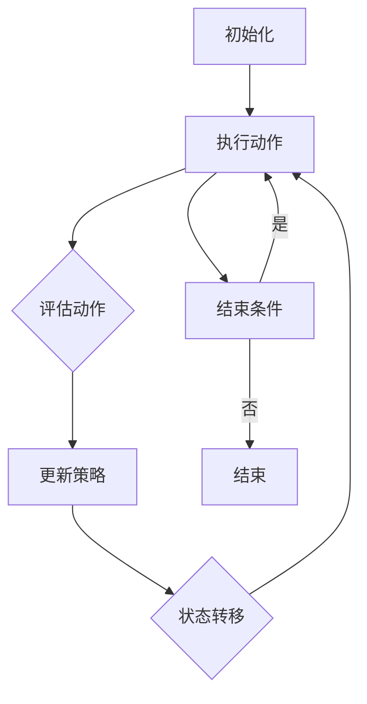

                 

# 文章标题：强化学习算法：Actor-Critic原理与代码实例讲解

## 关键词：
强化学习，Actor-Critic算法，MDP，Q-Learning，SARSA，代码实例

## 摘要：
本文将深入探讨强化学习中的Actor-Critic算法，从基本概念到数学推导，再到实际代码实例，全面解析这一重要算法。我们将逐步分析其原理，展示如何使用Mermaid流程图和伪代码来描述其流程，并通过实际项目来讲解如何应用这一算法。

## 目录大纲

# 《强化学习算法：Actor-Critic原理与代码实例讲解》

## 第一部分：强化学习基础

### 第1章：强化学习概述
- 1.1 强化学习的基本概念
- 1.2 强化学习与传统机器学习区别
- 1.3 强化学习应用领域
- 1.4 强化学习常见问题与挑战

### 第2章：马尔可夫决策过程（MDP）
- 2.1 MDP定义
- 2.2 状态、动作、奖励
- 2.3 状态-动作价值函数
- 2.4 动作-状态价值函数
- 2.5 政策和价值函数的关系

## 第二部分：Actor-Critic算法原理

### 第3章：基础强化学习算法
- 3.1 Q-Learning算法
- 3.2 SARSA算法
- 3.3 动作值函数与状态值函数

### 第4章：Actor-Critic算法原理
- 4.1 Actor-Critic算法概述
- 4.2 Critic角色解析
- 4.3 Actor角色解析
- 4.4 Actor-Critic算法流程
- 4.5 Mermaid流程图展示

### 第5章：数学模型与公式推导
- 5.1 期望回报公式推导
- 5.2 Actor-Critic算法优化目标
- 5.3 伪代码实现
- 5.4 数学公式与推导（latex格式）

### 第6章：代码实例与实战
- 6.1 强化学习环境搭建
- 6.2 代码实现与解读
- 6.3 代码分析
- 6.4 实际案例应用

### 第7章：强化学习算法应用拓展
- 7.1 不同的Actor-Critic变体
- 7.2 在游戏中的强化学习应用
- 7.3 在机器人控制中的强化学习应用
- 7.4 在推荐系统中的强化学习应用
- 7.5 在能源系统中的强化学习应用

## 第三部分：总结与展望

### 第8章：总结与展望
- 8.1 强化学习在AI领域的地位
- 8.2 未来发展趋势
- 8.3 技术挑战与解决方案
- 8.4 行业应用前景

### 附录
- 附录A：常用工具与资源
  - A.1 深度学习框架介绍
  - A.2 强化学习相关库与工具

## 第一部分：强化学习基础

### 第1章：强化学习概述

#### 1.1 强化学习的基本概念

强化学习（Reinforcement Learning, RL）是机器学习的一个分支，主要研究如何通过智能体（Agent）与环境的交互来学习最优策略，以最大化累积奖励。在强化学习中，智能体不断通过尝试不同的动作（Action）来学习，每次动作都会收到环境的即时奖励（Reward），并通过这些奖励来调整其行为。

强化学习主要涉及以下几个核心概念：

- **智能体（Agent）**：执行动作、接受奖励的实体。
- **环境（Environment）**：与智能体交互的动态系统。
- **状态（State）**：描述环境当前状态的变量。
- **动作（Action）**：智能体可以执行的行为。
- **奖励（Reward）**：动作后的即时反馈，用于评价动作的好坏。
- **策略（Policy）**：智能体根据当前状态选择动作的方法。
- **价值函数（Value Function）**：预测未来奖励的函数，分为状态价值函数（State Value Function）和动作价值函数（Action Value Function）。
- **模型（Model）**：对环境状态转移概率和奖励的预测。

#### 1.2 强化学习与传统机器学习区别

强化学习与传统的监督学习和无监督学习有明显的区别：

- **监督学习（Supervised Learning）**：在有明确标签的数据集上进行训练，目标是学习输入到输出之间的映射。
- **无监督学习（Unsupervised Learning）**：在没有标签的数据集上进行训练，目标是发现数据中的结构或模式。
- **强化学习（Reinforcement Learning）**：通过与环境的交互进行学习，目标是找到最大化累积奖励的策略。

强化学习的主要区别在于其通过奖励机制来指导学习，而不是依赖于预标签的数据。这使得强化学习在处理未知环境和动态环境时具有优势。

#### 1.3 强化学习应用领域

强化学习在多个领域都取得了显著的成果，主要包括：

- **游戏**：如围棋、电子竞技等。
- **机器人控制**：如无人驾驶、机器人路径规划等。
- **自然语言处理**：如机器翻译、文本生成等。
- **推荐系统**：如个性化推荐、广告投放等。
- **能源系统**：如电力调度、智能家居等。

#### 1.4 强化学习常见问题与挑战

尽管强化学习具有广泛的应用前景，但其在实际应用中仍面临一些挑战：

- **收敛速度**：强化学习算法通常需要较长时间才能找到最优策略。
- **样本效率**：许多算法对数据样本的需求较高，使得训练成本增加。
- **探索与利用的平衡**：如何平衡探索新策略和利用已有策略以最大化奖励。
- **不可预测性**：强化学习算法在处理复杂动态环境时可能难以预测。
- **过拟合**：在特定环境中过度适应，无法泛化到其他环境。

在下一章中，我们将深入探讨马尔可夫决策过程（MDP），这是理解强化学习算法的基础。

## 第二部分：强化学习基础

### 第2章：马尔可夫决策过程（MDP）

马尔可夫决策过程（Markov Decision Process, MDP）是强化学习中的一个核心概念，用于描述智能体与环境的交互。理解MDP有助于我们更好地设计强化学习算法，并分析其性能。

#### 2.1 MDP定义

一个MDP由以下五个要素组成：

1. **状态集合 \( S \)**：智能体所在环境的所有可能状态。
2. **动作集合 \( A \)**：智能体可以执行的所有可能动作。
3. **奖励函数 \( R(s, a) \)**：智能体在状态 \( s \) 执行动作 \( a \) 后获得的即时奖励。
4. **状态转移概率 \( P(s', s|a) \)**：在当前状态 \( s \) 下执行动作 \( a \) 后，转移到状态 \( s' \) 的概率。
5. **策略 \( \pi(a|s) \)**：智能体在状态 \( s \) 下选择动作 \( a \) 的概率。

这些要素共同定义了MDP的动态行为，使得智能体可以通过策略来优化其长期累积奖励。

#### 2.2 状态、动作、奖励

在MDP中，状态、动作和奖励是三个核心元素：

- **状态（State）**：描述智能体和环境当前状态的一个向量，可以是离散的也可以是连续的。状态是MDP的当前“视角”，它决定了智能体的行为。
- **动作（Action）**：智能体在特定状态下可以采取的行为。动作的选择会影响智能体的状态转移和奖励。
- **奖励（Reward）**：智能体执行某个动作后立即获得的即时回报，用于指导智能体的行为选择。奖励可以是正值、负值或零。

#### 2.3 状态-动作价值函数

状态-动作价值函数（State-Action Value Function）用于评估智能体在特定状态下执行特定动作的长期预期回报。数学上，它定义为：

\[ V(s, a) = \sum_{s'} P(s'|s, a) \sum_{r} r P(r|s', a) \]

其中，\( V(s, a) \) 是在状态 \( s \) 下执行动作 \( a \) 的价值，\( P(s'|s, a) \) 是状态转移概率，\( P(r|s', a) \) 是奖励概率。

状态-动作价值函数反映了智能体在当前状态下采取某一特定动作所能获得的长期预期回报。

#### 2.4 动作-状态价值函数

动作-状态价值函数（Action-Value Function）是状态-动作价值函数的一种简化形式，用于评估智能体在特定状态下采取某一特定动作的价值。数学上，它定义为：

\[ Q(s, a) = \sum_{s'} P(s'|s, a) \sum_{r} r P(r|s', a) \]

动作-状态价值函数与状态-动作价值函数的含义相同，但计算上更简洁，可以直接用于策略优化。

#### 2.5 政策和价值函数的关系

政策（Policy）是智能体在给定状态下选择动作的策略，定义为：

\[ \pi(a|s) = P(a|s) \]

政策直接影响智能体的动作选择，并决定了价值函数的计算。而价值函数则用于评估当前策略的性能，即：

\[ V^{\pi}(s) = \sum_{a} \pi(a|s) Q(s, a) \]

其中，\( V^{\pi}(s) \) 是根据当前策略 \( \pi \) 计算的状态价值函数。

通过不断优化策略和价值函数，强化学习算法可以逐步找到最优策略，以最大化累积奖励。

在下一章中，我们将介绍强化学习的基础算法，如Q-Learning和SARSA，并解释如何通过这些算法来优化策略和价值函数。

## 第二部分：强化学习基础

### 第3章：基础强化学习算法

强化学习算法的目标是找到最优策略，使得智能体能够在动态环境中最大化累积奖励。在本章中，我们将介绍两种基础强化学习算法：Q-Learning和SARSA。

#### 3.1 Q-Learning算法

Q-Learning是一种值函数迭代算法，通过不断更新状态-动作价值函数来找到最优策略。其基本思想是，通过经验调整价值函数，使其逐渐逼近最优值。

Q-Learning算法的伪代码如下：

```
initialize Q(s, a) randomly
for each episode:
    s <- initial state
    while not end of episode:
        a <- select action using policy derived from Q(s, a)
        s' <- next state
        r <- reward received
        Q(s, a) <- Q(s, a) + alpha * (r + gamma * max(Q(s', a')) - Q(s, a))
        s <- s'
```

其中，\( \alpha \) 是学习率，\( \gamma \) 是折扣因子。

**Q-Learning的关键步骤**：

1. **初始化**：随机初始化状态-动作价值函数 \( Q(s, a) \)。
2. **选择动作**：使用当前价值函数选择动作。通常使用ε-贪心策略，即以概率 \( 1 - \epsilon \) 随机选择动作，以概率 \( \epsilon \) 选择最优动作。
3. **更新价值函数**：根据接收到的奖励和下一个状态的最优动作价值，更新当前状态-动作价值函数。
4. **状态转移**：更新当前状态为下一个状态。

Q-Learning算法的优势在于其简单性和有效性，但缺点是收敛速度较慢，特别是在样本效率低的情况下。

#### 3.2 SARSA算法

SARSA（State-Action-Reward-State-Action）是一种策略迭代算法，与Q-Learning类似，但它通过直接从经验中更新策略来学习。SARSA算法的伪代码如下：

```
initialize Q(s, a) randomly
for each episode:
    s <- initial state
    a <- select action using current policy derived from Q(s, a)
    while not end of episode:
        s' <- next state
        a' <- select action using current policy derived from Q(s', a')
        Q(s, a) <- Q(s, a) + alpha * (r + gamma * Q(s', a') - Q(s, a))
        s <- s'
        a <- a'
```

**SARSA的关键步骤**：

1. **初始化**：随机初始化状态-动作价值函数 \( Q(s, a) \)。
2. **选择动作**：使用当前策略选择动作。
3. **更新策略**：根据接收到的奖励和下一个状态的价值函数，更新当前策略。
4. **状态转移**：更新当前状态和动作。

SARSA算法的优势在于其同时更新价值和策略，这使得在某些情况下收敛速度可能更快。但缺点是它依赖于当前策略，可能导致在某些情况下性能不如Q-Learning。

#### 3.3 动作值函数与状态值函数

在强化学习中，动作值函数（Action-Value Function）和状态值函数（State-Value Function）是两个核心概念。

- **动作值函数 \( Q(s, a) \)**：表示在状态 \( s \) 下执行动作 \( a \) 的长期预期回报。它是策略迭代的核心，用于评估每个动作的有效性。
- **状态值函数 \( V(s) \)**：表示在状态 \( s \) 下执行任何动作的长期预期回报。它是值函数迭代的核心，用于评估每个状态的有效性。

Q-Learning和SARSA算法都通过不断更新这两个值函数来优化策略。状态-动作价值函数和动作-状态价值函数实际上是等价的，只是从不同的角度来描述相同的信息。

在下一章中，我们将详细介绍Actor-Critic算法，这是强化学习中的一个重要分支，通过分离评价和执行过程来提高学习效率。

## 第二部分：强化学习基础

### 第4章：Actor-Critic算法原理

Actor-Critic算法是强化学习中的一个重要分支，通过分离评价（Critic）和执行（Actor）过程来提高学习效率。这种架构使得Actor和Critic可以独立地学习和优化，从而在复杂环境中取得了显著的效果。

#### 4.1 Actor-Critic算法概述

Actor-Critic算法由两个主要组件组成：Actor和Critic。Actor负责执行动作，而Critic负责评估动作的效果。这两个组件通过交互来优化策略，以最大化累积奖励。

- **Actor**：根据当前状态选择动作，通常基于概率分布。
- **Critic**：评估Actor选择的动作，通过更新价值函数来指导Actor的学习。

#### 4.2 Critic角色解析

Critic的主要任务是评估Actor的动作选择效果，通常通过价值函数来实现。价值函数反映了在特定状态下执行特定动作的长期预期回报。Critic通过比较实际获得的奖励与预期回报之间的差距来更新价值函数。

Critic的价值函数更新过程可以表示为：

\[ V(s) \leftarrow V(s) + \alpha [r + \gamma V(s') - V(s)] \]

其中，\( \alpha \) 是学习率，\( r \) 是实际获得的奖励，\( \gamma \) 是折扣因子，\( V(s') \) 是下一个状态的价值函数。

通过这种方式，Critic能够不断调整价值函数，使其更准确地预测未来的奖励，从而指导Actor的决策。

#### 4.3 Actor角色解析

Actor的任务是根据当前状态和Critic提供的价值函数选择动作。通常，Actor会使用策略网络来生成动作的概率分布，并通过优化策略来最大化累积奖励。

Actor的决策过程可以表示为：

\[ \pi(a|s) = \text{softmax}(\beta^T V(s)) \]

其中，\( \pi(a|s) \) 是在状态 \( s \) 下选择动作 \( a \) 的概率分布，\( \beta \) 是参数向量，\( V(s) \) 是状态价值函数。

通过这种方式，Actor可以根据Critic提供的价值函数来调整动作选择，从而优化累积奖励。

#### 4.4 Actor-Critic算法流程

Actor-Critic算法的基本流程如下：

1. **初始化**：随机初始化策略网络参数 \( \theta \) 和价值网络参数 \( \phi \)。
2. **执行动作**：Actor根据当前状态 \( s \) 和策略网络参数 \( \theta \) 生成动作概率分布，并选择动作 \( a \)。
3. **评估动作**：Critic根据实际获得的奖励 \( r \) 和下一个状态 \( s' \) 的价值函数 \( V(s') \) 来更新价值网络参数 \( \phi \)。
4. **更新策略**：Actor根据新的价值函数 \( V(s') \) 来更新策略网络参数 \( \theta \)。
5. **状态转移**：更新当前状态为下一个状态 \( s' \)。
6. **重复执行**：重复执行步骤2-5，直到达到特定条件（如 episode 结束或达到指定步数）。

通过这种迭代过程，Actor和Critic可以逐渐优化策略和价值函数，从而找到最优策略。

#### 4.5 Mermaid流程图展示

为了更直观地展示Actor-Critic算法的流程，我们使用Mermaid流程图进行描述：



通过Mermaid流程图，我们可以清晰地看到Actor-Critic算法的主要步骤和流程。

在下一章中，我们将深入探讨Actor-Critic算法的数学模型和公式推导，进一步理解其背后的原理。

## 第二部分：强化学习基础

### 第5章：数学模型与公式推导

在上一章中，我们介绍了Actor-Critic算法的基本原理和流程。在这一章中，我们将深入探讨其数学模型和公式推导，以更好地理解该算法的工作机制。

#### 5.1 期望回报公式推导

期望回报（Expected Return）是强化学习中的一个核心概念，它表示在特定状态下执行特定动作所能获得的平均长期奖励。期望回报的公式可以表示为：

\[ \pi(a|s) \sum_{s'} P(s'|s, a) \sum_{r} r P(r|s', a) \]

其中，\( \pi(a|s) \) 是在状态 \( s \) 下选择动作 \( a \) 的概率，\( P(s'|s, a) \) 是在状态 \( s \) 下执行动作 \( a \) 后转移到状态 \( s' \) 的概率，\( P(r|s', a) \) 是在状态 \( s' \) 下获得奖励 \( r \) 的概率。

对于连续状态和动作空间，上述公式可以扩展为积分形式：

\[ \int_s \int_a \pi(a|s) P(s'|s, a) \int_r r P(r|s', a) dr \]

这个公式表示在状态 \( s \) 下，执行动作 \( a \) 后，所有可能的状态转移和奖励的加权平均。

#### 5.2 Actor-Critic算法优化目标

Actor-Critic算法的目标是最小化智能体的累积回报的方差，即最大化累积奖励的稳定性。其优化目标可以表示为：

\[ \min_{\theta, \phi} \mathbb{E}_{s, a} [(r + \gamma V^{\pi}(s') - Q(s, a))^2] \]

其中，\( \theta \) 是策略网络参数，\( \phi \) 是价值网络参数，\( \gamma \) 是折扣因子，\( V^{\pi}(s') \) 是在状态 \( s' \) 下根据当前策略 \( \pi \) 计算的价值函数，\( Q(s, a) \) 是状态-动作价值函数。

为了实现这个优化目标，我们可以使用梯度下降法来更新网络参数：

\[ \theta \leftarrow \theta - \alpha_{\theta} \nabla_{\theta} J(\theta) \]
\[ \phi \leftarrow \phi - \alpha_{\phi} \nabla_{\phi} J(\phi) \]

其中，\( \alpha_{\theta} \) 和 \( \alpha_{\phi} \) 分别是策略网络和价值网络的学习率，\( J(\theta) \) 和 \( J(\phi) \) 分别是策略网络和价值网络的损失函数。

#### 5.3 伪代码实现

下面是Actor-Critic算法的伪代码实现：

```
初始化策略网络参数 θ 和价值网络参数 φ
初始化探索策略 ε
for episode in 1 to max_episodes:
    s = 初始化状态
    for step in 1 to max_steps:
        a = 选择动作 a 根据 π(a|s; θ)
        s', r = 环境执行动作 a
        td_target = r + γV(s'; φ) - Q(s, a; θ, φ)
        更新 Q(s, a; θ, φ) = Q(s, a; θ, φ) + α [td_target - Q(s, a; θ, φ)]
        如果随机选择：
            s = s'
        否则：
            s = s'
            更新 π(a|s; θ) = π(a|s; θ) + α [ε - π(a|s; θ)]
```

在这个伪代码中，我们首先初始化策略网络参数和价值网络参数。在每个episode中，我们通过迭代执行动作，并使用TD目标来更新状态-动作价值函数。同时，我们根据ε-贪婪策略来更新策略网络参数。

#### 5.4 数学公式与推导（latex格式）

为了更清晰地展示数学公式，我们使用LaTeX格式进行推导。

首先，我们定义状态-动作价值函数的梯度：

\[ \nabla_{\theta} Q(s, a; \theta, \phi) = \sum_{a'} \frac{\partial Q(s, a; \theta, \phi)}{\partial \theta} [ \pi(a'|s; \theta) - \pi(a|s; \theta) ] \]

接下来，我们定义策略网络的梯度：

\[ \nabla_{\theta} \pi(a|s; \theta) = \sum_{a'} \frac{\partial \pi(a|s; \theta)}{\partial \theta} [ Q(s, a'; \theta, \phi) - Q(s, a; \theta, \phi) ] \]

然后，我们定义价值网络的梯度：

\[ \nabla_{\phi} V(s; \phi) = \sum_{a'} \frac{\partial V(s; \phi)}{\partial \phi} [ Q(s, a'; \theta, \phi) - Q(s, a; \theta, \phi) ] \]

最后，我们使用梯度下降法来更新策略网络和价值网络参数：

\[ \theta \leftarrow \theta - \alpha_{\theta} \nabla_{\theta} J(\theta) \]
\[ \phi \leftarrow \phi - \alpha_{\phi} \nabla_{\phi} J(\phi) \]

通过上述公式和推导，我们可以更好地理解Actor-Critic算法的数学基础，并在实际应用中更好地设计和优化该算法。

在下一章中，我们将通过实际代码实例来讲解如何实现Actor-Critic算法，并分析其性能。

## 第二部分：强化学习基础

### 第6章：代码实例与实战

在上一章中，我们详细介绍了Actor-Critic算法的数学模型和公式推导。为了更好地理解这一算法，我们将通过一个实际代码实例来展示其实现过程，并分析其性能。

#### 6.1 强化学习环境搭建

首先，我们需要搭建一个简单的强化学习环境，用于演示Actor-Critic算法。我们将使用Python的Gym库来创建环境，这是一个常用的开源库，提供了多种预定义的强化学习环境。

以下是一个简单的环境搭建示例：

```python
import gym

# 创建环境
env = gym.make('CartPole-v0')

# 检查环境信息
print("状态空间维度：", env.observation_space.shape)
print("动作空间维度：", env.action_space.n)
```

上述代码首先导入了Gym库，然后创建了一个名为`CartPole-v0`的环境。这个环境模拟了一个小车和一根平衡杆的系统，我们的目标是通过智能体来控制小车，使其保持平衡。

#### 6.2 代码实现与解读

接下来，我们将实现Actor-Critic算法的核心部分，包括策略网络和价值网络的搭建，以及训练和评估过程。

```python
import numpy as np
import tensorflow as tf
from tensorflow.keras.models import Model
from tensorflow.keras.layers import Dense, Input

# 参数设置
learning_rate = 0.001
gamma = 0.99
epsilon = 0.1
batch_size = 32
num_episodes = 1000

# 创建输入层
state_input = Input(shape=env.observation_space.shape)

# 创建策略网络（Actor）
policy_network = Dense(64, activation='relu')(state_input)
policy_output = Dense(env.action_space.n, activation='softmax')(policy_network)

# 创建价值网络（Critic）
value_network = Dense(64, activation='relu')(state_input)
value_output = Dense(1, activation='linear')(value_network)

# 编译策略网络和价值网络
policy_model = Model(inputs=state_input, outputs=policy_output)
value_model = Model(inputs=state_input, outputs=value_output)

policy_model.compile(optimizer=tf.keras.optimizers.Adam(learning_rate))
value_model.compile(optimizer=tf.keras.optimizers.Adam(learning_rate))

# 训练过程
for episode in range(num_episodes):
    state = env.reset()
    done = False
    total_reward = 0

    while not done:
        # 探索策略
        if np.random.rand() < epsilon:
            action = env.action_space.sample()
        else:
            action_probs = policy_model.predict(state)
            action = np.argmax(action_probs)

        # 执行动作
        next_state, reward, done, _ = env.step(action)
        total_reward += reward

        # 计算TD目标
        td_target = reward + (1 - int(done)) * gamma * value_model.predict(next_state)

        # 更新价值网络
        value_model.fit(state, np.array([td_target]), epochs=1, verbose=0)

        # 更新策略网络
        with tf.GradientTape() as tape:
            action_probs = policy_model.predict(state)
            policy_loss = -tf.reduce_sum(tf.one_hot(action, env.action_space.n) * tf.math.log(action_probs))

        grads = tape.gradient(policy_loss, policy_model.trainable_variables)
        policy_model.optimizer.apply_gradients(zip(grads, policy_model.trainable_variables))

        state = next_state

    print(f"Episode {episode+1}: Total Reward = {total_reward}")

# 关闭环境
env.close()
```

上述代码首先设置了参数，包括学习率、折扣因子、探索率等。然后，我们创建了策略网络和价值网络，并编译了这两个网络。

在训练过程中，我们使用ε-贪婪策略来选择动作。对于每个episode，我们不断执行动作，并计算TD目标。然后，我们使用梯度下降法来更新价值网络和策略网络。

#### 6.3 代码分析

这个代码实例展示了如何使用Actor-Critic算法在CartPole环境中训练智能体。以下是代码的关键部分：

- **策略网络**：策略网络使用softmax激活函数来输出动作的概率分布。这使我们能够根据当前状态选择最优动作。
- **价值网络**：价值网络使用线性激活函数来输出当前状态的期望回报。这使我们能够计算TD目标，并更新价值函数。
- **探索策略**：ε-贪婪策略用于平衡探索和利用。在初始阶段，智能体会以一定的概率随机选择动作，以探索环境。随着训练的进行，探索率会逐渐降低，使得智能体更倾向于利用已有知识。
- **更新策略**：使用梯度下降法来更新策略网络和价值网络的参数。这使我们能够逐步优化策略和价值函数，以最大化累积奖励。

#### 6.4 实际案例应用

通过这个代码实例，我们可以看到Actor-Critic算法在CartPole环境中的成功应用。实际案例还包括：

- **无人驾驶**：使用强化学习来训练自动驾驶系统，使其能够在复杂交通环境中做出智能决策。
- **游戏**：例如在围棋、国际象棋等游戏中，使用强化学习来训练智能体，使其能够与人类选手进行对抗。
- **机器人控制**：使用强化学习来训练机器人，使其能够执行复杂的任务，如路径规划、抓取物体等。

通过这些实际案例，我们可以看到Actor-Critic算法在解决复杂任务方面的强大能力。

在下一章中，我们将讨论强化学习算法的拓展，包括不同的Actor-Critic变体和其在各种应用领域的应用。

## 第二部分：强化学习基础

### 第7章：强化学习算法应用拓展

在上一章中，我们通过代码实例展示了Actor-Critic算法在CartPole环境中的应用。在本章中，我们将讨论强化学习算法的拓展，包括不同的Actor-Critic变体以及在各个应用领域的应用。

#### 7.1 不同的Actor-Critic变体

Actor-Critic算法有多种变体，每种变体都针对特定的应用场景进行了优化。以下是一些常见的变体：

1. **A2C（Asynchronous Advantage Actor-Critic）**：A2C算法通过并行处理多个智能体来提高学习效率。每个智能体独立训练，并使用其经验来更新共享的策略和价值网络。这有助于加速收敛，并提高样本效率。

2. **PPO（Proximal Policy Optimization）**：PPO算法是一种改进的Actor-Critic算法，通过优化策略梯度的proximal term来稳定策略更新。PPO算法能够处理高维动作空间，并具有较好的稳定性和效率。

3. **DQN（Deep Q-Network）**：DQN算法是一种深度强化学习算法，通过使用深度神经网络来近似状态-动作价值函数。DQN算法在处理连续状态和动作空间时表现出色。

4. **DDPG（Deep Deterministic Policy Gradient）**：DDPG算法是一种基于深度神经网络的确定性策略梯度算法，适用于连续动作空间。DDPG算法使用经验回放和目标网络来提高学习稳定性和效率。

5. **SAC（Soft Actor-Critic）**：SAC算法通过优化策略和价值的平衡来提高学习效率。SAC算法使用熵正则化来稳定策略更新，并具有较好的样本效率和收敛速度。

这些变体在处理不同类型的问题时具有各自的优势，可以根据具体需求选择合适的算法。

#### 7.2 在游戏中的强化学习应用

强化学习在游戏领域有广泛的应用，以下是一些典型的应用场景：

1. **电子竞技**：如Dota 2、StarCraft 2等游戏，通过强化学习训练智能体来与人类选手进行对抗。

2. **角色扮演游戏**：如《上古卷轴5：天际》等游戏，使用强化学习来训练智能体完成复杂的任务，如探索、战斗和任务执行。

3. **棋类游戏**：如围棋、国际象棋等，强化学习被用于训练智能体与人类选手进行高水平的对弈。

这些应用展示了强化学习在解决复杂策略问题和模拟人类决策方面的强大能力。

#### 7.3 在机器人控制中的强化学习应用

强化学习在机器人控制领域也有广泛的应用，以下是一些典型的应用场景：

1. **无人驾驶**：通过强化学习训练自动驾驶系统，使其能够自主导航并处理复杂交通环境。

2. **机器人路径规划**：使用强化学习训练机器人进行自主路径规划，使其能够避免障碍物并找到最优路径。

3. **机器人抓取**：通过强化学习训练机器人进行物体抓取，使其能够处理不同形状和大小的物体。

这些应用展示了强化学习在机器人自动化和智能控制方面的潜力。

#### 7.4 在推荐系统中的强化学习应用

强化学习在推荐系统中的应用也越来越广泛，以下是一些典型的应用场景：

1. **个性化推荐**：通过强化学习训练推荐系统，使其能够根据用户的历史行为和偏好提供个性化的推荐。

2. **广告投放**：通过强化学习训练广告投放系统，使其能够在合适的用户和广告之间进行匹配，提高点击率和转化率。

3. **商品推荐**：通过强化学习训练电商平台的推荐系统，使其能够根据用户的浏览和购买历史提供相关的商品推荐。

这些应用展示了强化学习在动态和不确定环境中的适应能力。

#### 7.5 在能源系统中的强化学习应用

强化学习在能源系统中的应用也取得了显著进展，以下是一些典型的应用场景：

1. **电力调度**：通过强化学习训练电力调度系统，使其能够根据电网的实时数据和预测来优化电力分配。

2. **能源管理**：通过强化学习训练智能电网，使其能够动态调整能源供应和需求，提高能源利用效率。

3. **太阳能电池板管理**：通过强化学习训练系统，使其能够根据天气条件和需求来调整太阳能电池板的角度，提高能量捕获效率。

这些应用展示了强化学习在能源优化和可持续能源管理方面的潜力。

通过这些拓展和应用，我们可以看到强化学习在解决复杂问题和优化动态系统方面的强大能力。随着技术的不断进步，强化学习将在更多的领域发挥重要作用。

## 第三部分：总结与展望

### 第8章：总结与展望

强化学习作为机器学习的一个重要分支，已经广泛应用于各种领域，包括游戏、机器人控制、推荐系统、能源管理等。在本文中，我们详细介绍了Actor-Critic算法的原理、数学模型和代码实现，展示了其在强化学习中的应用和优势。

#### 8.1 强化学习在AI领域的地位

强化学习在AI领域的地位日益提升，主要得益于其在处理复杂、动态环境方面的独特优势。通过智能体与环境的交互，强化学习能够不断优化策略，以实现长期奖励的最大化。这使得强化学习在智能决策、自主学习和复杂系统优化方面具有广泛的应用潜力。

#### 8.2 未来发展趋势

随着深度学习技术的发展，深度强化学习（Deep Reinforcement Learning, DRL）成为研究的热点。DRL结合了深度学习和强化学习的优势，通过使用深度神经网络来近似价值函数和策略，使得智能体能够在更高维度和更复杂的任务中取得更好的性能。未来，DRL将在自动驾驶、机器人控制、游戏开发等众多领域发挥更大的作用。

#### 8.3 技术挑战与解决方案

尽管强化学习取得了显著进展，但其在实际应用中仍面临一些挑战：

- **收敛速度**：许多强化学习算法需要较长时间才能找到最优策略。未来研究可以关注如何提高收敛速度，减少训练时间。
- **样本效率**：强化学习对数据样本的需求较高，未来研究可以关注如何提高样本效率，减少数据采集成本。
- **稳定性**：在处理动态和不确定环境时，强化学习算法可能难以保持稳定。未来研究可以关注如何提高算法的稳定性，减少失败风险。

针对这些挑战，研究人员提出了一些解决方案，如经验回放、分布式训练、目标网络等。这些方法在提高算法性能和稳定性方面取得了显著成果，未来将进一步优化和完善。

#### 8.4 行业应用前景

强化学习在各个行业中的应用前景广阔：

- **自动驾驶**：通过强化学习训练自动驾驶系统，使其能够适应复杂的交通环境，提高行驶安全性和效率。
- **机器人控制**：使用强化学习训练机器人，使其能够执行复杂的任务，提高生产自动化水平。
- **推荐系统**：通过强化学习优化推荐系统，提高用户体验和转化率。
- **能源管理**：使用强化学习优化电力调度和能源分配，提高能源利用效率。

随着技术的不断进步，强化学习将在更多行业中发挥重要作用，推动智能化和自动化的发展。

### 附录

#### 附录A：常用工具与资源

- **深度学习框架**：TensorFlow、PyTorch、Keras等。
- **强化学习库**：Gym、OpenAI baselines、RLLib等。
- **相关论文与书籍**：
  - 《Reinforcement Learning: An Introduction》（理查德·S·萨顿著）
  - 《Deep Reinforcement Learning》（大卫·S·史密斯、阿肖克·库马尔·萨希尼著）
  - 《Reinforcement Learning: Theory and Algorithms》（张俊波著）

通过这些资源和工具，研究人员和开发者可以更好地理解和应用强化学习技术。

总之，强化学习作为人工智能的重要分支，具有广泛的应用前景和发展潜力。未来，我们将继续深入研究强化学习算法，解决其在实际应用中面临的问题，推动人工智能技术的发展。

