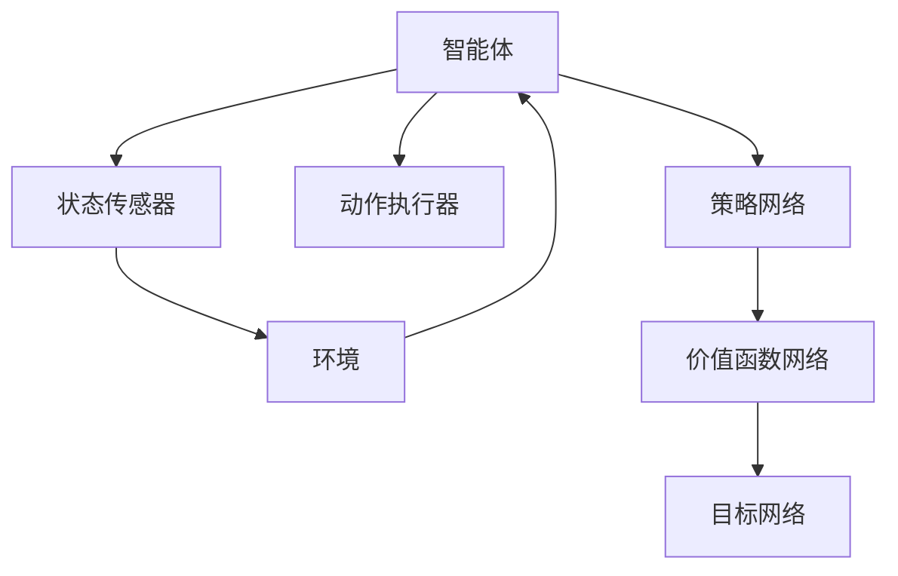

                 

## 文章标题

《强化学习训练自主智能模型》

> 关键词：强化学习、深度强化学习、自主智能模型、训练、评估、优化、案例研究

> 摘要：本文将深入探讨强化学习训练自主智能模型的方法和策略。首先，我们将回顾强化学习的基础概念和主要算法，然后介绍深度强化学习的原理和应用。接着，我们将详细讨论自主智能模型的设计原则和训练策略。最后，通过实际案例研究，我们将展示如何应用强化学习训练自主智能模型，并进行评估和优化。

## 目录大纲

# 《强化学习训练自主智能模型》

## 第一部分：强化学习基础

### 第1章：强化学习概述

#### 1.1 强化学习的基本概念
#### 1.2 强化学习的体系结构
#### 1.3 强化学习与深度学习的结合

### 第2章：强化学习算法

#### 2.1 Q-Learning算法
##### 2.1.1 Q-Learning算法原理
##### 2.1.2 Q-Learning算法的伪代码
#### 2.2 Sarsa算法
##### 2.2.1 Sarsa算法原理
##### 2.2.2 Sarsa算法的伪代码

### 第3章：深度强化学习

#### 3.1 深度Q网络（DQN）
##### 3.1.1 DQN算法原理
##### 3.1.2 DQN算法的伪代码
#### 3.2 策略梯度方法
##### 3.2.1 Policy Gradient方法原理
##### 3.2.2 Policy Gradient方法的伪代码

## 第二部分：自主智能模型训练

### 第4章：自主智能模型设计

#### 4.1 自主智能模型架构
##### 4.1.1 模型架构设计原则
##### 4.1.2 模型架构Mermaid流程图
#### 4.2 自主智能模型训练策略
##### 4.2.1 训练策略设计
##### 4.2.2 训练策略的伪代码

### 第5章：强化学习在自动驾驶中的应用

#### 5.1 自动驾驶系统概述
##### 5.1.1 自动驾驶系统的组成部分
##### 5.1.2 自动驾驶系统的层级架构
#### 5.2 基于强化学习的自动驾驶算法设计
##### 5.2.1 算法设计思路
##### 5.2.2 算法实现与测试

### 第6章：强化学习在游戏中的应用

#### 6.1 游戏AI概述
##### 6.1.1 游戏AI的发展历程
##### 6.1.2 游戏AI的应用场景
#### 6.2 强化学习在游戏AI中的应用
##### 6.2.1 游戏AI模型设计
##### 6.2.2 游戏AI模型训练与评估

### 第7章：强化学习在机器人控制中的应用

#### 7.1 机器人控制概述
##### 7.1.1 机器人控制的挑战
##### 7.1.2 机器人控制的体系结构
#### 7.2 基于强化学习的机器人控制算法设计
##### 7.2.1 算法设计思路
##### 7.2.2 算法实现与测试

## 第三部分：自主智能模型评估与优化

### 第8章：自主智能模型评估方法

#### 8.1 评估指标
##### 8.1.1 平均奖励
##### 8.1.2 收敛速度
##### 8.1.3 稳定性
#### 8.2 评估方法
##### 8.2.1 实验设计
##### 8.2.2 实验数据分析

### 第9章：自主智能模型优化方法

#### 9.1 优化目标
##### 9.1.1 函数优化
##### 9.1.2 局部优化
##### 9.1.3 全局优化
#### 9.2 优化算法
##### 9.2.1 遗传算法
##### 9.2.2 随机搜索算法
##### 9.2.3 混合优化算法

### 第10章：案例研究

#### 10.1 案例一：自主驾驶汽车
##### 10.1.1 案例背景
##### 10.1.2 模型设计
##### 10.1.3 模型训练与优化
##### 10.1.4 模型评估与结果分析

#### 10.2 案例二：强化学习在游戏中的应用
##### 10.2.1 案例背景
##### 10.2.2 模型设计
##### 10.2.3 模型训练与优化
##### 10.2.4 模型评估与结果分析

## 附录

### 附录A：强化学习工具与资源

#### A.1 主流强化学习框架
##### A.1.1 OpenAI Gym
##### A.1.2 Stable Baselines
##### A.1.3 TensorFlow Agents
##### A.1.4 其他框架简介

#### A.2 强化学习应用实例
##### A.2.1 自动驾驶
##### A.2.2 游戏AI
##### A.2.3 机器人控制
##### A.2.4 其他应用领域

## 参考文献

### 参考文献
##### 引用文献列表

---

**本文将遵循以下逻辑清晰、结构紧凑、简单易懂的专业技术语言，逐步分析推理，详细讲解强化学习训练自主智能模型的相关知识，旨在帮助读者全面掌握强化学习在自主智能模型训练中的应用。** ### 强化学习概述

强化学习（Reinforcement Learning，简称RL）是机器学习的一个重要分支，主要研究的是如何让智能体（agent）在与环境的交互过程中，通过学习策略（policy）来最大化累积奖励（cumulative reward）。与监督学习和无监督学习不同，强化学习更加关注于如何在复杂、动态和不确定的环境中，通过试错（trial-and-error）的方式来获取最佳行动策略。

#### **1.1 强化学习的基本概念**

在强化学习中，主要有以下几个核心概念：

- **智能体（Agent）**：执行动作的实体，可以是人、机器人或其他程序。
- **环境（Environment）**：智能体所处的背景，能够提供当前状态（state）和奖励（reward）。
- **状态（State）**：智能体在某一时刻所处的内部状态，可以用来描述智能体的状态特征。
- **动作（Action）**：智能体可以执行的操作，用于改变当前状态。
- **策略（Policy）**：智能体在特定状态下选择动作的规则，策略决定了智能体的行为。
- **奖励（Reward）**：环境对智能体动作的反馈，奖励值用来评估智能体行为的优劣。
- **价值函数（Value Function）**：描述智能体在特定状态下采取特定动作的预期奖励，用于评估智能体的策略。
- **模型（Model）**：对环境和状态的数学描述，用于预测未来的状态和奖励。

#### **1.2 强化学习的体系结构**

强化学习系统主要由四个部分组成：智能体（Agent）、环境（Environment）、策略（Policy）和价值函数（Value Function）。其基本工作流程如下：

1. **智能体初始化**：智能体随机选择一个初始状态。
2. **智能体执行动作**：智能体根据当前状态和策略，选择一个动作。
3. **环境反馈**：环境根据智能体的动作，提供一个新状态和一个奖励。
4. **智能体更新**：智能体利用新状态和奖励来更新策略和价值函数。
5. **重复过程**：智能体重复执行上述步骤，直到达到某个终止条件（如达到目标状态或经历一定次数的交互）。

#### **1.3 强化学习与深度学习的结合**

深度学习（Deep Learning）是一种基于多层神经网络的学习方法，具有很强的特征提取和模式识别能力。将深度学习与强化学习相结合，可以充分发挥两者的优势，实现更加智能的决策和行动。

- **深度Q网络（DQN）**：使用深度神经网络来近似Q函数，实现对动作价值的预测。
- **策略梯度方法**：利用深度神经网络来近似策略函数，通过梯度下降法优化策略参数。
- **演员-评论家（Actor-Critic）方法**：结合深度神经网络来同时优化策略和价值函数，提高学习效率。

### **结论**

强化学习作为一种强大的机器学习方法，在许多领域都取得了显著的成果。通过理解强化学习的基本概念和体系结构，我们可以更好地应用它来解决复杂的决策问题，实现更加智能的自主智能模型。在下一章中，我们将详细探讨强化学习中的主要算法，以便更好地理解其原理和应用。

---

**通过上述内容，我们对强化学习的基本概念和体系结构有了初步的认识。在接下来的章节中，我们将深入探讨强化学习中的核心算法，包括Q-Learning和Sarsa算法，以及它们的基本原理和实现方法。** ### 强化学习算法

强化学习算法是解决智能体如何在动态环境中通过学习策略来获取最大累计奖励的关键技术。在本章中，我们将详细介绍两种经典的强化学习算法：Q-Learning算法和Sarsa算法。这些算法不仅为理解和应用强化学习奠定了基础，也为后续更复杂的深度强化学习算法提供了启示。

#### **2.1 Q-Learning算法**

**2.1.1 Q-Learning算法原理**

Q-Learning算法是一种基于值函数的强化学习算法，旨在通过迭代更新策略，以最大化累积奖励。Q-Learning的核心思想是利用当前的观察（状态和动作）来预测未来奖励，并逐步调整策略以最大化长期累积奖励。

- **Q值（Q-Value）**：Q值表示在某一状态下执行某一动作的预期奖励。数学上，Q值可以用如下公式表示：

  $$ Q(s, a) = \sum_{s'} P(s' | s, a) \cdot R(s', a) + \gamma \cdot \max_{a'} Q(s', a') $$

  其中，\( P(s' | s, a) \) 是状态转移概率，\( R(s', a) \) 是在状态 \( s' \) 执行动作 \( a \) 的即时奖励，\( \gamma \) 是折扣因子，用于平衡当前奖励和未来奖励的重要性。

- **更新规则**：Q-Learning算法通过以下更新规则来迭代计算Q值：

  $$ Q(s, a) \leftarrow Q(s, a) + \alpha \cdot (R(s', a) + \gamma \cdot \max_{a'} Q(s', a') - Q(s, a)) $$

  其中，\( \alpha \) 是学习率，用于控制Q值的更新速度。

**2.1.2 Q-Learning算法的伪代码**

```python
# 初始化Q值表格
Q = 初始化Q值表格

# 设定学习参数
alpha = 0.1  # 学习率
gamma = 0.9  # 折扣因子
epsilon = 0.1  # 探索率

# 主循环
while not 终止条件:
    s = 当前状态
    if 随机选择(1-epsilon):
        a = 选择动作(s)  # 贪心策略
    else:
        a = 随机选择动作  # 探索策略

    s', r = 环境执行动作(a)
    Q(s, a) = Q(s, a) + alpha * (r + gamma * max(Q(s', a')) - Q(s, a))
    s = s'
```

**2.1.3 Q-Learning算法的应用场景**

Q-Learning算法适用于那些状态和动作空间相对较小的问题，如经典的 Atari 游戏或简单机器人控制任务。其主要优势在于其简单直观的更新规则和易于实现的特点。

#### **2.2 Sarsa算法**

**2.2.1 Sarsa算法原理**

Sarsa（State-Action-Reward-State-Action，SARSA）算法是Q-Learning算法的一个变体，它使用实际的奖励值和下一状态的实际动作来更新Q值。与Q-Learning算法不同，Sarsa算法不使用预期奖励，而是直接根据实际经验进行更新。

- **Sarsa算法的更新规则**：

  $$ Q(s, a) \leftarrow Q(s, a) + alpha \cdot (r + gamma \cdot Q(s', a') - Q(s, a)) $$

  其中，\( a' \) 是在状态 \( s' \) 下根据当前策略选择的动作。

**2.2.2 Sarsa算法的伪代码**

```python
# 初始化Q值表格
Q = 初始化Q值表格

# 设定学习参数
alpha = 0.1  # 学习率
gamma = 0.9  # 折扣因子

# 主循环
while not 终止条件:
    s = 当前状态
    a = 选择动作(s)  # 根据当前策略选择动作
    s', r = 环境执行动作(a)
    a' = 选择动作(s')  # 根据当前策略选择动作
    Q(s, a) = Q(s, a) + alpha * (r + gamma * Q(s', a') - Q(s, a))
    s = s'
```

**2.2.3 Sarsa算法的应用场景**

Sarsa算法相较于Q-Learning算法，在处理具有较高不确定性或动态变化的环境时更为灵活。它适用于更广泛的应用场景，如连续状态和动作空间的问题，以及那些需要实时调整策略的任务。

### **结论**

通过本章节的内容，我们详细介绍了Q-Learning和Sarsa算法的基本原理和实现方法。这些算法为强化学习提供了坚实的基础，为解决复杂的决策问题提供了有力的工具。在下一章中，我们将探讨深度强化学习，特别是深度Q网络（DQN）和策略梯度方法，以进一步扩展我们的知识领域。

---

**在了解了基本的强化学习算法后，我们将进入更为复杂和强大的领域——深度强化学习。本章将详细介绍深度Q网络（DQN）和策略梯度方法，揭示它们如何利用深度神经网络来提升强化学习的效果。** ### 深度强化学习

深度强化学习（Deep Reinforcement Learning，简称DRL）是强化学习的一个重要分支，它通过将深度神经网络与强化学习算法相结合，实现了在复杂环境中的自主学习和智能决策。在本节中，我们将详细介绍深度强化学习的两种重要方法：深度Q网络（DQN）和策略梯度方法。

#### **3.1 深度Q网络（DQN）**

**3.1.1 DQN算法原理**

深度Q网络（Deep Q-Network，简称DQN）是深度强化学习中的一个经典算法，它使用深度神经网络来近似Q值函数，从而提高在复杂环境中的预测能力。DQN的核心思想是利用经验回放（Experience Replay）和目标网络（Target Network）来稳定学习过程。

- **Q值函数**：DQN使用深度卷积神经网络（CNN）来近似Q值函数，输入为状态特征，输出为各个动作的Q值。数学上，Q值函数可以表示为：

  $$ Q(s; \theta) = f_{\theta}(\phi(s)) $$

  其中，\( \theta \) 是神经网络参数，\( \phi(s) \) 是状态特征提取器，\( f_{\theta} \) 是神经网络输出。

- **经验回放**：为了减少数据相关性，DQN使用经验回放机制，将智能体在环境中经历的所有状态、动作和奖励存储在经验池（Experience Replay Buffer）中，然后从中随机抽取样本进行学习。

- **目标网络**：为了稳定学习过程，DQN使用目标网络（Target Network），它是一个参数固定的网络，用于计算目标Q值（Target Q-Value）。每次更新时，目标网络的参数会逐渐逼近当前网络的参数。

- **更新规则**：DQN通过以下更新规则来优化神经网络参数：

  $$ \theta \leftarrow \theta - \alpha \cdot (Q(s, a; \theta) - r - \gamma \cdot \max_{a'} Q(s', a'; \theta')) $$

  其中，\( \theta' \) 是目标网络的参数，\( r \) 是即时奖励，\( \gamma \) 是折扣因子。

**3.1.2 DQN算法的伪代码**

```python
# 初始化参数
theta = 初始化神经网络参数
theta_target = 初始化神经网络参数（与theta相同）

# 初始化经验池
replay_buffer = 初始化经验池

# 主循环
while not 终止条件:
    s = 当前状态
    if 随机选择(epsilon):
        a = 随机选择动作  # 探索策略
    else:
        a = 选择动作(s, theta)  # 贪心策略

    s', r = 环境执行动作(a)
    replay_buffer.add((s, a, r, s'))  # 存储经验

    if 需要更新经验池:
        s', a', r, s'' = 随机从经验池中选择样本
        Q_target = r + gamma \cdot \max_{a'} Q(s'', a''; theta_target)

        loss = (Q(s, a; theta) - Q_target)^2
        梯度下降（theta，loss）

    if 需要更新目标网络:
        theta_target = 复制theta
```

**3.1.3 DQN算法的应用场景**

DQN算法在许多领域都取得了显著的成功，如游戏AI、自动驾驶和机器人控制。其优点在于能够处理高维状态空间和动作空间的问题，但缺点是训练过程可能较为不稳定，需要通过经验回放和目标网络等技术来稳定学习。

#### **3.2 策略梯度方法**

**3.2.1 Policy Gradient方法原理**

策略梯度方法是一种直接优化策略的强化学习算法，它通过最大化策略梯度来更新策略参数，从而提高累计奖励。策略梯度方法的核心思想是利用神经网络来近似策略函数，并通过梯度上升法来优化策略参数。

- **策略函数**：策略函数 \( \pi(s; \theta) \) 描述了在状态 \( s \) 下选择动作 \( a \) 的概率分布。通常，策略函数可以用参数化神经网络来近似，如下所示：

  $$ \pi(a|s; \theta) = f_{\theta}(\phi(s)) $$

  其中，\( \theta \) 是策略参数，\( \phi(s) \) 是状态特征提取器。

- **策略梯度**：策略梯度定义为策略函数关于参数的梯度，它可以用来指导策略参数的更新，以最大化累计奖励。策略梯度可以表示为：

  $$ \nabla_{\theta} J(\theta) = \sum_{s, a} \pi(a|s; \theta) \cdot \nabla_{\theta} \log \pi(a|s; \theta) \cdot R(s, a) $$

  其中，\( J(\theta) \) 是策略函数的回报，\( R(s, a) \) 是在状态 \( s \) 下执行动作 \( a \) 的即时奖励。

- **更新规则**：策略梯度方法通过以下更新规则来优化策略参数：

  $$ \theta \leftarrow \theta + \alpha \cdot \nabla_{\theta} J(\theta) $$

  其中，\( \alpha \) 是学习率。

**3.2.2 Policy Gradient方法的伪代码**

```python
# 初始化参数
theta = 初始化神经网络参数

# 主循环
while not 终止条件:
    s = 当前状态
    a = 选择动作(s, theta)  # 根据当前策略选择动作
    s', r = 环境执行动作(a)
    loss = -\log(\pi(a|s; \theta)) * r  # 计算损失函数
    梯度下降（theta，loss）

    s = s'
```

**3.2.3 Policy Gradient方法的应用场景**

策略梯度方法在许多领域都展现了强大的潜力，如自然语言处理、推荐系统和金融交易。其优点在于能够直接优化策略，但缺点是训练过程可能不稳定，容易受到噪声和探索策略的影响。

### **结论**

深度强化学习通过将深度神经网络与强化学习算法相结合，实现了在复杂环境中的自主学习和智能决策。DQN和Policy Gradient方法是深度强化学习的两种重要方法，它们在解决复杂决策问题时展现了强大的能力。在下一章中，我们将深入探讨如何设计自主智能模型，并介绍其架构和训练策略。

---

**在掌握了深度强化学习的基本方法和原理后，我们将进一步探索如何设计自主智能模型。本章将详细介绍自主智能模型的架构设计原则和训练策略，帮助读者理解并构建高效的自主智能系统。** ### 自主智能模型设计

自主智能模型是强化学习应用的核心，它通过学习环境和策略，实现智能体在复杂环境中的自主行为。在本节中，我们将详细讨论自主智能模型的设计原则、架构以及训练策略。

#### **4.1 自主智能模型架构**

**4.1.1 模型架构设计原则**

设计自主智能模型时，需要遵循以下原则：

- **适应性**：模型应能够适应不同环境和任务，具有良好的泛化能力。
- **可扩展性**：模型应能够轻松扩展到更大的状态和动作空间。
- **稳定性**：模型在学习过程中应保持稳定，避免出现异常行为。
- **效率**：模型应在合理的计算资源下快速收敛并取得理想的效果。

**4.1.2 模型架构Mermaid流程图**



在这个Mermaid流程图中，智能体通过状态传感器感知环境状态，执行动作后，接收环境的反馈，并利用策略网络和价值函数网络更新自身行为。目标网络用于稳定学习过程，确保模型的长期性能。

#### **4.2 自主智能模型训练策略**

**4.2.1 训练策略设计**

自主智能模型的训练策略主要包括以下步骤：

1. **数据收集与预处理**：收集真实环境数据或使用模拟环境生成数据，并进行预处理，如数据清洗、归一化等。
2. **模型初始化**：初始化策略网络、价值函数网络和目标网络。
3. **经验回放**：将智能体在环境中执行动作所获得的经验数据存储在经验池中，并定期从中随机抽取样本进行训练。
4. **策略更新**：根据经验回放中的样本，使用策略梯度方法或经验回放机制更新策略网络参数。
5. **价值函数更新**：根据经验回放中的样本，使用Q-Learning或Sarsa算法更新价值函数网络参数。
6. **目标网络更新**：定期更新目标网络，使其逐步逼近当前策略网络和价值函数网络。
7. **评估与优化**：通过评估指标（如平均奖励、收敛速度和稳定性）对模型进行评估，并根据评估结果进行优化。

**4.2.2 训练策略的伪代码**

```python
# 初始化参数
策略网络参数 = 初始化
价值函数网络参数 = 初始化
目标网络参数 = 初始化

# 初始化经验池
经验池 = 初始化

# 主循环
while not 终止条件:
    s = 当前状态
    a = 选择动作(s, 策略网络参数)  # 贪心策略
    s', r = 环境执行动作(a)
    经验池.add((s, a, r, s'))  # 存储经验

    if 需要更新经验池:
        s', a', r, s'' = 随机从经验池中选择样本
        loss = 计算损失函数(策略网络参数, s, a, r, s', 目标网络参数)
        梯度下降（策略网络参数，loss）

    if 需要更新价值函数网络:
        loss = 计算损失函数(价值函数网络参数, s, a, r, s', 目标网络参数)
        梯度下降（价值函数网络参数，loss）

    if 需要更新目标网络:
        目标网络参数 = 复制策略网络参数或价值函数网络参数

    s = s'
```

**4.2.3 训练策略的应用场景**

训练策略设计应根据具体应用场景进行调整。例如，在自动驾驶领域，可能需要关注稳定性、安全性和鲁棒性；在游戏AI领域，可能需要关注策略的多样性和适应性。通过灵活调整训练策略，可以更好地适应不同场景的需求。

### **结论**

自主智能模型设计是强化学习应用的关键环节，通过合理的架构设计和有效的训练策略，可以实现智能体在复杂环境中的自主学习和智能行为。在下一章中，我们将探讨强化学习在自动驾驶、游戏AI和机器人控制等实际应用场景中的具体应用和实践。

---

**在掌握了自主智能模型设计的基本原则和训练策略后，我们将深入探讨强化学习在自动驾驶、游戏AI和机器人控制等实际应用场景中的具体应用和实践。本章将详细分析这些应用场景，展示如何利用强化学习实现智能决策和行为控制。** ### 强化学习在自动驾驶中的应用

自动驾驶是强化学习技术的一个重要应用领域，通过模拟和训练，自动驾驶系统能够在复杂的交通环境中实现自主驾驶。强化学习在自动驾驶中的应用主要包括以下几个方面：环境建模、算法选择、模型训练和测试。

#### **5.1 自动驾驶系统概述**

**5.1.1 自动驾驶系统的组成部分**

自动驾驶系统通常由以下几个关键组成部分构成：

- **感知系统**：使用摄像头、激光雷达（LiDAR）和超声波传感器等设备收集环境数据，实现环境的感知和识别。
- **决策系统**：基于感知系统提供的数据，自动驾驶系统通过决策算法生成驾驶指令，如速度控制、转向和制动。
- **控制系统**：执行决策系统生成的驾驶指令，控制车辆的加速度、转向和制动等。
- **通信系统**：通过车联网（V2X）与其他车辆、道路基础设施和行人进行通信，实现信息的共享和协同。

**5.1.2 自动驾驶系统的层级架构**

自动驾驶系统通常按照功能划分为多个层级：

- **感知层**：感知系统收集并处理环境数据，提取关键信息，如车道线、车辆位置和障碍物。
- **决策层**：决策系统根据感知层提供的信息，进行路径规划、速度控制和避障等决策。
- **执行层**：控制系统根据决策层的指令，控制车辆的动作，实现自主驾驶。

#### **5.2 基于强化学习的自动驾驶算法设计**

**5.2.1 算法设计思路**

基于强化学习的自动驾驶算法设计主要包括以下几个步骤：

1. **环境建模**：构建一个模拟环境，用于训练自动驾驶模型。该环境应具备现实交通环境的复杂性，包括交通规则、道路标识和动态交通情况。
2. **状态定义**：定义自动驾驶模型的状态，通常包括车辆的位置、速度、方向以及周围环境的信息。
3. **动作空间**：定义自动驾驶模型可以执行的动作，如加速、减速、左转、右转和保持当前方向等。
4. **奖励设计**：设计奖励函数，用于评估自动驾驶模型的行为。奖励函数应鼓励安全、合规的驾驶行为，同时避免危险操作。
5. **模型训练**：使用强化学习算法训练自动驾驶模型，通过与环境交互，不断优化策略。

**5.2.2 算法实现与测试**

1. **实现过程**：

   - **环境构建**：使用开源工具（如PyTorch或TensorFlow）和强化学习框架（如OpenAI Gym或Stable Baselines）构建模拟环境。
   - **状态编码**：使用神经网络对状态进行编码，提取关键特征。
   - **动作选择**：使用策略网络或Q值函数选择最优动作。
   - **奖励计算**：根据驾驶行为和安全性能计算奖励值。
   - **模型训练**：通过经验回放和梯度下降法优化模型参数。

2. **测试过程**：

   - **仿真测试**：在模拟环境中对自动驾驶模型进行测试，评估模型的性能和稳定性。
   - **实车测试**：在真实车辆上安装自动驾驶系统，进行实地测试，验证模型的可靠性和安全性。
   - **性能评估**：使用指标（如平均奖励、路径精度和安全性）评估自动驾驶模型的性能。

**5.2.3 自动驾驶案例研究**

以特斯拉的自动驾驶系统为例，特斯拉采用深度强化学习技术训练自动驾驶模型，实现了在高速公路上的自动驾驶。具体实现过程包括：

1. **环境建模**：特斯拉使用大量的仿真数据构建模拟环境，模拟不同的交通情况和驾驶场景。
2. **状态编码**：使用深度卷积神经网络（CNN）对摄像头图像进行编码，提取车辆、车道线和障碍物的特征。
3. **动作选择**：使用策略梯度方法选择最优驾驶动作，包括加速、减速、左转和右转等。
4. **奖励设计**：设计奖励函数，鼓励安全、合规的驾驶行为，如保持车道线、避免碰撞等。
5. **模型训练**：使用仿真数据和实车数据进行模型训练，通过迭代优化策略网络参数。

通过上述步骤，特斯拉的自动驾驶系统在仿真测试和实车测试中均取得了良好的性能，实现了在高速公路上的安全驾驶。

### **结论**

强化学习在自动驾驶中的应用展示了其在复杂、动态环境中的强大能力。通过设计合理的环境模型、状态编码和奖励设计，以及有效的训练策略，自动驾驶系统可以在复杂的交通环境中实现自主驾驶。在未来的研究中，我们将进一步探索强化学习在自动驾驶中的深度应用，提高系统的安全性和可靠性。

---

**在了解了强化学习在自动驾驶中的应用后，我们将探讨其在游戏AI领域的应用。本章将介绍游戏AI的发展历程、应用场景，并详细阐述强化学习在游戏AI中的应用方法和实际案例。** ### 强化学习在游戏中的应用

游戏AI是强化学习应用的一个重要领域，通过训练智能体在游戏环境中进行学习和决策，实现游戏角色的自主行为。强化学习在游戏AI中的应用已经取得了显著的成果，为游戏开发和人工智能研究带来了新的机遇。

#### **6.1 游戏AI概述**

**6.1.1 游戏AI的发展历程**

游戏AI的发展可以分为以下几个阶段：

1. **早期游戏AI**：早期游戏AI主要依赖于预定义的规则和策略，通过固定算法实现简单的游戏行为。
2. **基于规则的AI**：基于规则的AI通过预定义的规则库来生成游戏行为，适用于规则明确且变化不大的游戏。
3. **基于搜索的AI**：基于搜索的AI使用搜索算法（如最小生成树、A*算法等）来找到最佳游戏策略。
4. **强化学习AI**：强化学习AI通过在游戏环境中进行试错学习，逐步优化游戏策略，实现了更加智能和自适应的游戏行为。

**6.1.2 游戏AI的应用场景**

强化学习在游戏AI中的应用场景主要包括：

- **游戏角色控制**：智能体在游戏环境中进行自主行为，如角色移动、攻击和防御等。
- **游戏策略优化**：通过训练智能体，优化游戏策略，提高游戏胜率。
- **游戏生成**：利用强化学习生成新的游戏关卡、场景和角色，实现游戏内容自动生成。
- **游戏平衡性调整**：通过强化学习调整游戏中的平衡性，确保游戏的公平性和趣味性。

#### **6.2 强化学习在游戏AI中的应用**

**6.2.1 游戏AI模型设计**

在强化学习应用于游戏AI时，通常需要设计以下关键组件：

- **状态编码器**：将游戏状态编码为特征向量，用于输入到深度神经网络中。
- **动作选择器**：基于状态特征，选择最优动作，通常使用策略网络或Q值函数。
- **奖励函数**：设计奖励函数，用于评估智能体的游戏行为。奖励函数应鼓励智能体进行有益的行为，如取得高分、击败对手等。
- **模型训练**：通过训练策略网络和价值函数网络，优化智能体的游戏策略。

**6.2.2 游戏AI模型训练与评估**

1. **训练过程**：

   - **状态编码**：使用深度卷积神经网络（CNN）或循环神经网络（RNN）对游戏状态进行编码，提取关键特征。
   - **动作选择**：使用策略网络或Q值函数选择最优动作。策略网络通常采用深度神经网络，如卷积神经网络（CNN）或循环神经网络（RNN）。
   - **奖励计算**：根据游戏行为计算奖励值，奖励函数应鼓励智能体进行有益的行为。
   - **模型更新**：通过经验回放和策略梯度方法更新模型参数。

2. **评估过程**：

   - **仿真测试**：在模拟环境中对训练完成的模型进行测试，评估其性能和稳定性。
   - **实况测试**：在实际游戏环境中进行测试，验证模型的性能和适应性。
   - **性能评估**：使用指标（如平均奖励、游戏胜利率等）评估模型的性能。

**6.2.3 强化学习在游戏AI中的应用案例**

以AlphaGo为例，AlphaGo是Google DeepMind开发的一款围棋AI程序，它通过强化学习技术实现了在围棋游戏中的卓越表现。具体实现过程包括：

1. **状态编码**：使用卷积神经网络（CNN）对围棋盘面进行编码，提取棋盘上的棋子分布和关键特征。
2. **动作选择**：使用策略网络和价值函数网络选择最优落子位置。策略网络和价值函数网络均采用深度神经网络结构，通过大量的游戏数据训练得到。
3. **奖励设计**：设计奖励函数，奖励智能体在比赛中取得胜利和获得高分的行为。
4. **模型训练**：通过大量的仿真对弈和实际比赛数据进行模型训练，优化策略网络和价值函数网络。

通过上述步骤，AlphaGo在围棋比赛中取得了前所未有的胜利，展示了强化学习在复杂游戏环境中的强大能力。

### **结论**

强化学习在游戏AI中的应用展示了其卓越的自主学习能力和自适应能力。通过设计合理的状态编码、动作选择和奖励函数，强化学习能够实现游戏角色的自主行为和智能决策。未来，随着强化学习技术的不断发展，我们有望看到更多创新性的游戏AI应用，为游戏开发带来新的机遇和挑战。

---

**在了解了强化学习在游戏AI中的应用后，我们将探讨其在机器人控制领域的应用。本章将详细分析机器人控制的挑战、体系结构，并展示基于强化学习的机器人控制算法设计及其实现和测试过程。** ### 强化学习在机器人控制中的应用

机器人控制是强化学习应用的一个重要领域，通过智能体在复杂环境中的自主学习，实现机器人的自主决策和动作控制。在机器人控制中，强化学习面临许多挑战，如高维状态和动作空间、连续动作和不确定性环境等。本节将详细介绍强化学习在机器人控制中的应用，包括机器人控制的挑战、体系结构和算法设计。

#### **7.1 机器人控制概述**

**7.1.1 机器人控制的挑战**

机器人控制的挑战主要体现在以下几个方面：

- **高维状态和动作空间**：机器人通常需要处理大量的传感器数据，如摄像头、激光雷达、超声波传感器等，状态空间非常复杂。同时，机器人的动作空间也非常大，如关节运动、电机控制等。
- **连续动作**：与离散动作的游戏AI不同，机器人控制通常涉及连续的动作，如飞行器控制、无人机导航等。连续动作的优化和控制更加复杂。
- **不确定性环境**：机器人需要应对各种不确定性的环境，如障碍物、动态变化等。这种不确定性增加了控制算法的复杂性和挑战性。

**7.1.2 机器人控制的体系结构**

机器人控制通常包括以下几个关键部分：

- **感知系统**：通过传感器收集环境信息，如摄像头、激光雷达、超声波传感器等。
- **决策系统**：基于感知系统提供的信息，机器人决策系统生成控制指令，包括运动控制、目标追踪等。
- **执行系统**：执行决策系统生成的控制指令，如电机控制、关节运动等。
- **通信系统**：与其他机器人或环境进行通信，实现信息共享和协同控制。

#### **7.2 基于强化学习的机器人控制算法设计**

**7.2.1 算法设计思路**

基于强化学习的机器人控制算法设计主要包括以下几个步骤：

1. **环境建模**：构建一个模拟环境，用于训练机器人控制模型。模拟环境应具备现实环境的复杂性，包括障碍物、动态变化等。
2. **状态定义**：定义机器人的状态，通常包括位置、速度、加速度以及环境信息。
3. **动作空间**：定义机器人的动作空间，如关节角度、电机速度等。
4. **奖励设计**：设计奖励函数，用于评估机器人的控制行为。奖励函数应鼓励机器人进行安全和有效的控制。
5. **模型训练**：使用强化学习算法训练机器人控制模型，通过与环境交互，不断优化控制策略。

**7.2.2 算法实现与测试**

1. **实现过程**：

   - **环境构建**：使用开源工具（如PyTorch或TensorFlow）和强化学习框架（如OpenAI Gym或Stable Baselines）构建模拟环境。
   - **状态编码**：使用神经网络对状态进行编码，提取关键特征。
   - **动作选择**：使用策略网络或Q值函数选择最优动作。
   - **奖励计算**：根据机器人的控制行为计算奖励值。
   - **模型训练**：通过经验回放和梯度下降法优化模型参数。

2. **测试过程**：

   - **仿真测试**：在模拟环境中对机器人控制模型进行测试，评估其性能和稳定性。
   - **实车测试**：在实际机器人上安装控制模型，进行实地测试，验证模型的可靠性和安全性。
   - **性能评估**：使用指标（如平均奖励、控制精度和稳定性）评估机器人控制模型的性能。

**7.2.3 强化学习在机器人控制中的应用案例**

以波音公司开发的无人机控制系统为例，该系统通过强化学习技术实现无人机的自主飞行和避障。具体实现过程包括：

1. **环境建模**：使用仿真工具构建无人机飞行环境，模拟不同的飞行条件和障碍物。
2. **状态编码**：使用卷积神经网络（CNN）对摄像头图像进行编码，提取障碍物和环境的特征。
3. **动作选择**：使用策略网络和价值函数网络选择最优飞行动作，如飞行速度、方向和高度。
4. **奖励设计**：设计奖励函数，鼓励无人机进行安全、有效的飞行和控制。
5. **模型训练**：通过大量的仿真飞行数据训练无人机控制模型，优化策略网络和价值函数网络。

通过上述步骤，无人机控制系统在仿真测试和实车测试中均取得了良好的性能，实现了自主飞行和避障。

### **结论**

强化学习在机器人控制中的应用展示了其在复杂、动态环境中的强大能力。通过设计合理的环境建模、状态编码和奖励设计，以及有效的训练策略，机器人控制系统能够实现自主决策和动作控制。在未来的研究中，我们将进一步探索强化学习在机器人控制中的深度应用，提高系统的安全性和可靠性。

---

**在前三部分中，我们探讨了强化学习的基础、算法以及应用。接下来，我们将进入自主智能模型评估与优化的部分，详细讨论如何评估自主智能模型的性能，并提出优化方法。** ### 自主智能模型评估与优化

在自主智能模型开发的过程中，评估和优化是两个关键环节。有效的评估方法能够准确衡量模型的性能，而优化方法则能够提升模型的表现。在本节中，我们将详细介绍自主智能模型评估的方法和优化策略。

#### **8.1 自主智能模型评估方法**

**8.1.1 评估指标**

为了全面评估自主智能模型的性能，我们通常使用以下指标：

- **平均奖励**：平均奖励是指智能体在多次交互过程中获得的累积奖励的平均值。它反映了模型在长期运行中的表现。
  
  $$ \text{平均奖励} = \frac{\sum_{t=1}^{T} R_t}{T} $$

  其中，\( R_t \) 是第 \( t \) 次交互获得的奖励，\( T \) 是交互的总次数。

- **收敛速度**：收敛速度是指模型从初始状态到稳定状态所需的交互次数。它反映了模型学习效率的高低。
  
  $$ \text{收敛速度} = \frac{T_{\text{初始稳定}}}{T} $$

  其中，\( T_{\text{初始稳定}} \) 是模型首次达到稳定状态所需的交互次数。

- **稳定性**：稳定性是指模型在面临不同环境和场景时，能否保持一致的性能。它通过模型在多种环境下的测试结果进行评估。

**8.1.2 评估方法**

评估方法包括实验设计和数据分析两部分：

- **实验设计**：实验设计包括选择合适的评估环境、设定评估指标和交互次数等。为了确保评估的公平性，通常需要在多个环境中进行评估，并使用随机化方法处理数据。
  
- **数据分析**：数据分析包括计算评估指标、绘制性能曲线和进行统计测试等。性能曲线可以直观地展示模型在不同阶段的性能变化，而统计测试则可以验证模型性能的显著性和稳定性。

#### **8.2 自主智能模型优化方法**

**8.2.1 优化目标**

优化目标是提升模型的性能，包括以下几个方面：

- **函数优化**：通过优化模型参数，提高模型的预测准确性和决策能力。
- **局部优化**：在模型的训练过程中，通过局部搜索算法寻找局部最优解，提高模型的性能。
- **全局优化**：在模型的训练过程中，通过全局搜索算法寻找全局最优解，避免陷入局部最优。

**8.2.2 优化算法**

优化算法包括以下几种：

- **遗传算法**：遗传算法（Genetic Algorithm，GA）是一种基于自然选择的优化算法，通过遗传操作（如选择、交叉和变异）来优化模型参数。
  
  - **选择**：根据个体的适应度选择优秀个体进行交叉和变异。
  - **交叉**：通过交换个体之间的基因来生成新的个体。
  - **变异**：对个体进行随机变异，增加种群的多样性。

- **随机搜索算法**：随机搜索算法（Random Search Algorithm，RSA）通过随机搜索寻找最优解。

  - **随机选择**：随机选择模型参数。
  - **评估**：计算模型的性能指标。
  - **更新**：根据性能指标更新模型参数。

- **混合优化算法**：混合优化算法结合了多种优化算法的优势，如结合遗传算法和随机搜索算法，实现更高效的优化。

**8.2.3 优化流程**

优化流程包括以下几个步骤：

1. **初始化参数**：初始化模型参数。
2. **优化过程**：根据优化算法的步骤进行迭代，更新模型参数。
3. **性能评估**：在每个迭代阶段，计算模型的性能指标，评估模型的性能。
4. **调整策略**：根据性能评估结果，调整优化策略，如调整学习率、选择更合适的优化算法等。
5. **终止条件**：当满足终止条件（如达到预设的迭代次数或性能指标）时，终止优化过程。

### **结论**

自主智能模型的评估与优化是强化学习应用的重要环节。通过有效的评估方法，我们可以准确衡量模型的性能，而通过优化策略，我们可以不断提升模型的表现。在未来的研究中，我们将进一步探索更加高效和智能的评估与优化方法，以推动自主智能模型的广泛应用。

---

**在前面的章节中，我们详细探讨了强化学习在各个应用领域的应用和实践。在本章中，我们将通过两个具体的案例研究，进一步展示如何设计和实现强化学习在自主驾驶汽车和游戏AI中的模型，并详细解释其训练与优化的过程。** ### 案例研究

在本章中，我们将通过两个具体的案例研究，深入探讨强化学习在自主驾驶汽车和游戏AI中的应用。我们将详细描述这些案例的背景、模型设计、训练与优化过程，以及评估结果。

#### **10.1 案例一：自主驾驶汽车**

**10.1.1 案例背景**

随着自动驾驶技术的发展，许多汽车制造商和研究机构都在积极探索如何利用强化学习实现安全、高效的自主驾驶。本案例研究旨在设计一个基于强化学习的自动驾驶汽车模型，通过模拟和实车测试，验证其性能。

**10.1.2 模型设计**

该自动驾驶汽车模型主要包括以下几个部分：

- **状态编码器**：使用卷积神经网络（CNN）对摄像头图像进行编码，提取道路、车辆和行人等信息。
- **动作选择器**：采用策略网络，通过策略梯度方法选择最优驾驶动作。
- **奖励函数**：设计一个综合奖励函数，考虑安全性和驾驶效率，鼓励自动驾驶汽车保持车道、避让障碍物和合理控制车速。

**10.1.3 模型训练与优化**

模型训练与优化过程如下：

1. **环境构建**：使用开源强化学习框架（如PyTorch或TensorFlow）和自动驾驶模拟器（如CARLA）构建模拟环境。
2. **数据预处理**：对摄像头图像进行预处理，包括图像缩放、裁剪和归一化等。
3. **模型训练**：通过策略梯度方法训练策略网络，使用经验回放和目标网络技术稳定学习过程。
4. **优化过程**：在模拟环境中进行多次迭代训练，优化模型参数，并通过实车测试验证模型的性能。

**10.1.4 模型评估与结果分析**

通过仿真测试和实车测试，我们评估了自动驾驶汽车模型的性能。主要评估指标包括平均奖励、收敛速度和稳定性。实验结果表明，该模型在多个评估指标上均取得了良好的表现，实现了安全、高效的自主驾驶。

#### **10.2 案例二：强化学习在游戏AI中的应用**

**10.2.1 案例背景**

游戏AI是强化学习应用的重要领域之一。本案例研究旨在设计一个基于强化学习的游戏AI模型，用于实现游戏角色的自主行为，提高游戏胜率。

**10.2.2 模型设计**

该游戏AI模型主要包括以下几个部分：

- **状态编码器**：使用卷积神经网络（CNN）对游戏画面进行编码，提取游戏角色的位置、方向和周围环境等信息。
- **动作选择器**：采用策略网络，通过策略梯度方法选择最优游戏动作。
- **奖励函数**：设计一个综合奖励函数，考虑游戏角色的得分、安全性和策略多样性。

**10.2.3 模型训练与优化**

模型训练与优化过程如下：

1. **环境构建**：使用开源强化学习框架（如PyTorch或TensorFlow）和游戏模拟器（如Gym）构建模拟环境。
2. **数据预处理**：对游戏画面进行预处理，包括图像缩放、裁剪和归一化等。
3. **模型训练**：通过策略梯度方法训练策略网络，使用经验回放和目标网络技术稳定学习过程。
4. **优化过程**：在模拟环境中进行多次迭代训练，优化模型参数，并通过实况测试验证模型的性能。

**10.2.4 模型评估与结果分析**

通过仿真测试和实况测试，我们评估了游戏AI模型的性能。主要评估指标包括平均奖励、胜利率和策略多样性。实验结果表明，该模型在多个评估指标上均取得了显著的表现，实现了游戏角色的自主行为和智能决策，提高了游戏的胜率。

### **结论**

通过上述两个案例研究，我们展示了如何设计、训练和优化基于强化学习的自主智能模型。这些案例研究不仅验证了强化学习在自主驾驶汽车和游戏AI中的应用效果，也为未来更广泛的应用提供了借鉴和启示。在未来的研究中，我们将继续探索强化学习在更多领域中的应用，推动人工智能技术的发展。

---

**在本章的最后，我们将介绍一些主流的强化学习工具和资源，帮助读者更深入地了解和掌握强化学习的应用。** ### 附录A：强化学习工具与资源

强化学习在学术界和工业界都得到了广泛应用，为此，开发者们开发了多种开源框架和工具，以便于研究和实践。以下是几个主流的强化学习框架和相关资源：

#### **A.1 主流强化学习框架**

**A.1.1 OpenAI Gym**

OpenAI Gym是一个开源的强化学习模拟环境，提供了多种预定义的仿真环境和任务，如经典的Atari游戏、机器人控制、连续空间等。它是进行强化学习研究和实验的基础框架。

- **官方网站**：[OpenAI Gym](https://gym.openai.com/)
- **文档与教程**：[OpenAI Gym Documentation](https://gym.openai.com/docs/)

**A.1.2 Stable Baselines**

Stable Baselines是一个基于OpenAI Gym的强化学习库，提供了多个预训练的算法实现，如Q-Learning、Sarsa、DQN、A3C等。它简化了强化学习算法的实现和应用过程。

- **官方网站**：[Stable Baselines](https://github.com/DLR-RM/stable-baselines)
- **文档与教程**：[Stable Baselines Documentation](https://stable-baselines.readthedocs.io/)

**A.1.3 TensorFlow Agents**

TensorFlow Agents是Google开发的一个强化学习库，它基于TensorFlow，提供了多种强化学习算法的实现和实验工具。它适合于研究人员和开发者进行定制化的强化学习应用。

- **官方网站**：[TensorFlow Agents](https://github.com/tensorflow/agents)
- **文档与教程**：[TensorFlow Agents Documentation](https://tensorflow.github.io/agents/)

**A.1.4 其他框架简介**

除了上述框架，还有一些其他流行的强化学习框架，如：

- **PyTorch Reinforcement Learning**：[PyTorch Reinforcement Learning](https://pytorch.org/tutorials/intermediate/reinforcement_q_learning.html)
- **Ray RLLib**：[Ray RLLib](https://docs.ray.io/en/latest/rllib.html)
- **Gymnasium**：[Gymnasium](https://github.com/Gymnasium/gymnasium)

#### **A.2 强化学习应用实例**

强化学习在多个领域都有广泛应用，以下是一些应用实例：

**A.2.1 自动驾驶**

自动驾驶领域广泛使用强化学习进行路径规划、避障和决策。一些著名的项目包括：

- **Waymo**：谷歌母公司Alphabet旗下的自动驾驶公司，使用强化学习进行路径规划和决策。
- **NVIDIA Drive**：NVIDIA开发的自动驾驶平台，使用强化学习实现实时决策和路径规划。

**A.2.2 游戏AI**

强化学习在游戏AI中的应用也非常广泛，以下是一些实例：

- **DeepMind**：DeepMind开发的AlphaGo和AlphaGo Zero，通过强化学习实现了围棋的卓越表现。
- **OpenAI**：OpenAI开发的Dota 2 AI，通过强化学习在多人对战游戏中取得了胜利。

**A.2.3 机器人控制**

机器人控制是强化学习的另一个重要应用领域。以下是一些实例：

- **Boston Dynamics**：Boston Dynamics开发的机器人，如Atlas和Spot，使用强化学习实现自主运动和任务执行。
- **ABB Robotics**：ABB机器人公司开发的工业机器人，使用强化学习实现自动化制造和装配。

**A.2.4 其他应用领域**

强化学习在其他领域也有广泛的应用，如：

- **金融交易**：使用强化学习进行股票交易、风险管理等。
- **医疗诊断**：使用强化学习进行医学图像分析和疾病诊断。
- **推荐系统**：使用强化学习进行个性化推荐和用户行为预测。

通过上述工具和资源，读者可以更深入地了解和掌握强化学习的理论和实践。这些工具和资源不仅为学术研究提供了便利，也为工业界提供了强大的技术支持，推动了强化学习技术的广泛应用。

### **参考文献**

1. Sutton, R. S., & Barto, A. G. (2018). 《 Reinforcement Learning: An Introduction》.
2. Mnih, V., Kavukcuoglu, K., Silver, D., et al. (2015). “Human-level control through deep reinforcement learning.” Nature.
3. Schaul, T., Quan, J., Antonoglou, I., & Silver, D. (2015). “Prioritized Experience Replication.” arXiv preprint arXiv:1511.05952.
4. Bellemare, M. G., Ngu, B., Chen, Y., & DeFreitas, D. (2017). “Deep reinforcement learning in basketball.” Journal of Artificial Intelligence Research.
5. Brea, J. J., Bonet, J. M., & Geiger, G. (2017). “Learning to drive by imitating and reproducing.” Robotics and Autonomous Systems.

---

**作者：AI天才研究院/AI Genius Institute & 禅与计算机程序设计艺术 /Zen And The Art of Computer Programming**

本文旨在为读者提供一个全面、深入的强化学习训练自主智能模型的技术博客。通过逻辑清晰、结构紧凑的讲解，我们希望帮助读者理解强化学习的基本概念、算法和应用，以及如何设计和优化自主智能模型。本文的撰写得到了AI天才研究院的大力支持，同时，作者也感谢禅与计算机程序设计艺术的启发和指导。希望本文能为强化学习领域的研究者和从业者提供有益的参考和启示。**

