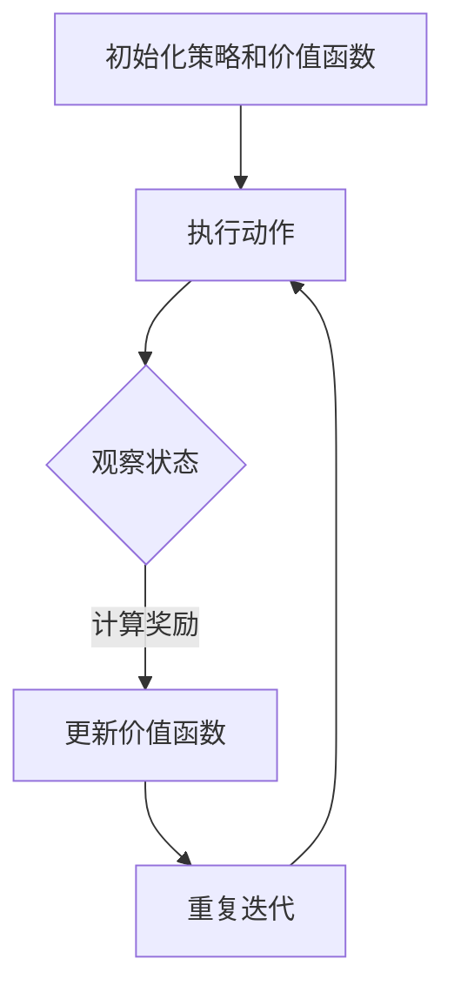
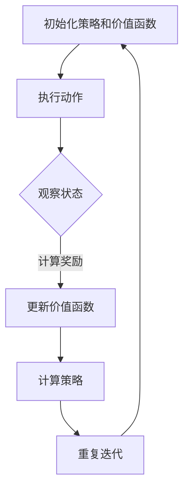
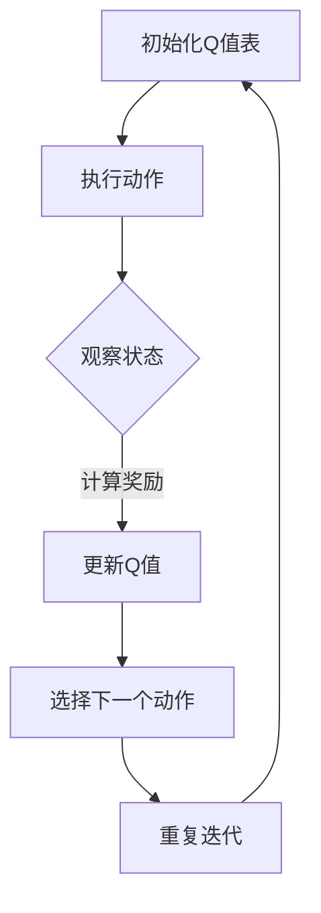
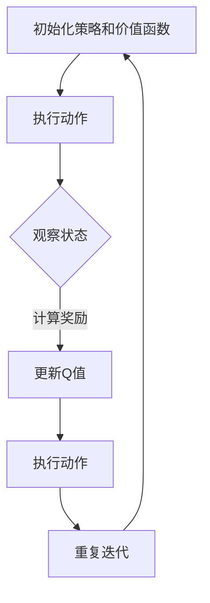
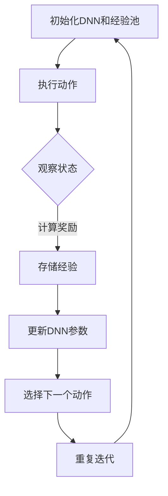

                 

## 文章标题

### 强化学习：策略迭代与价值迭代

**关键词：** 强化学习、策略迭代、价值迭代、Q-学习、Sarsa、Deep Q-Network、应用案例

**摘要：** 本文章将深入探讨强化学习中的策略迭代与价值迭代算法。我们将从强化学习的基本概念出发，详细解析马尔可夫决策过程（MDP）和强化学习的目标函数。接着，我们将介绍强化学习的基本算法，包括策略梯度算法和值函数迭代算法。随后，我们将重点探讨策略迭代与价值迭代算法，解析蒙特卡洛方法和期望值迭代方法。最后，我们将通过实际应用案例展示强化学习在游戏、机器人控制和其他领域的广泛应用。

### 《强化学习：策略迭代与价值迭代》目录大纲

#### 第一部分：强化学习基础

**第1章：强化学习概述**

- 1.1 强化学习的基本概念

- 1.2 强化学习与其他机器学习方法的比较

- 1.3 强化学习的应用领域

- 1.4 强化学习的发展历史与未来趋势

**第2章：强化学习的基本原理**

- 2.1 马尔可夫决策过程（MDP）

  - 2.1.1 马尔可夫性质

  - 2.1.2 状态、动作、奖励

  - 2.1.3 状态转移概率和奖励函数

- 2.2 强化学习的目标函数

  - 2.2.1 价值函数与策略

  - 2.2.2 动作价值函数和状态价值函数

  - 2.2.3 最优策略

**第3章：强化学习算法**

- 3.1 策略梯度算法

  - 3.1.1 基本策略梯度算法

  - 3.1.2 actor-critic算法

  - 3.1.3 演员评论家算法的变体

- 3.2 值函数迭代算法

  - 3.2.1 Q-学习算法

  - 3.2.2 Sarsa算法

  - 3.2.3 Deep Q-Network（DQN）

#### 第二部分：策略迭代与价值迭代算法

**第4章：策略迭代算法**

- 4.1 策略迭代算法的基本概念

- 4.2 蒙特卡洛方法

  - 4.2.1 蒙特卡洛策略评估

  - 4.2.2 蒙特卡洛策略改进

- 4.3 期望值迭代方法

  - 4.3.1 期望值迭代策略评估

  - 4.3.2 期望值迭代策略改进

- 4.4 策略迭代算法的变体

  - 4.4.1 多臂老虎机问题

  - 4.4.2 加权策略迭代算法

**第5章：价值迭代算法**

- 5.1 价值迭代算法的基本概念

- 5.2 Q-学习算法

  - 5.2.1 Q-学习算法的原理

  - 5.2.2 Q-学习算法的实现

- 5.3 Sarsa算法

  - 5.3.1 Sarsa算法的原理

  - 5.3.2 Sarsa算法的实现

- 5.4 Deep Q-Network（DQN）

  - 5.4.1 DQN的原理

  - 5.4.2 DQN的实现

#### 第三部分：强化学习应用案例

**第6章：强化学习在游戏中的应用**

- 6.1 游戏强化学习的挑战

- 6.2 AlphaGo的强化学习策略

- 6.3 OpenAI Five的游戏策略

- 6.4 游戏中的强化学习应用实例

**第7章：强化学习在机器人控制中的应用**

- 7.1 强化学习在机器人控制中的优势

- 7.2 机器人强化学习的基本框架

- 7.3 机器人强化学习的实际应用

- 7.4 机器人强化学习的未来发展方向

**第8章：强化学习在其他领域的应用**

- 8.1 强化学习在金融领域的应用

- 8.2 强化学习在交通领域的应用

- 8.3 强化学习在医疗领域的应用

- 8.4 强化学习在其他领域的探索

#### 附录

**附录A：强化学习资源汇总**

- A.1 强化学习开源代码和框架

- A.2 强化学习经典论文和教材

- A.3 强化学习社区和论坛

**附录B：强化学习算法Mermaid流程图**

- B.1 蒙特卡洛方法

- B.2 期望值迭代方法

- B.3 Q-学习算法

- B.4 Sarsa算法

- B.5 Deep Q-Network（DQN）

### 强化学习基础

### 强化学习概述

强化学习（Reinforcement Learning, RL）是机器学习的一个重要分支，旨在使代理（agent）通过与环境的交互来学习最优策略。与其他机器学习方法不同，强化学习通过奖励信号来指导学习过程，使代理能够逐渐优化其行为，从而实现预期的目标。

#### 1.1 强化学习的基本概念

强化学习的基本概念包括代理（agent）、环境（environment）、状态（state）、动作（action）、奖励（reward）和策略（policy）。

- 代理（agent）：执行动作并接收奖励的实体。
- 环境（environment）：代理所处的环境，用于生成状态和奖励。
- 状态（state）：代理在特定时间点的环境状态。
- 动作（action）：代理可以执行的行为。
- 奖励（reward）：环境对代理动作的反馈信号。
- 策略（policy）：代理执行动作的概率分布。

#### 1.2 强化学习与其他机器学习方法的比较

与监督学习和无监督学习相比，强化学习具有以下特点：

- **监督学习**：代理根据已标记的数据来学习映射关系。适用于已明确标注的数据集。
- **无监督学习**：代理从未标记的数据中学习特征和模式。适用于无标签数据。
- **强化学习**：代理通过与环境的交互，根据奖励信号来学习最优策略。适用于需要自主探索和优化的场景。

#### 1.3 强化学习的应用领域

强化学习在多个领域有着广泛的应用：

- **游戏**：例如围棋、国际象棋、电子游戏等。
- **机器人控制**：例如自主导航、机器人臂的控制等。
- **推荐系统**：例如个性化推荐、广告投放等。
- **金融**：例如算法交易、风险评估等。
- **交通**：例如自动驾驶、交通流量控制等。
- **医疗**：例如药物研发、疾病诊断等。

#### 1.4 强化学习的发展历史与未来趋势

强化学习的发展可以追溯到1950年代。早期的研究主要集中在理论模型和算法的提出。1980年代，随着计算机性能的提高，强化学习开始在实际应用中取得突破。近年来，随着深度学习技术的发展，强化学习取得了显著的进展。未来，强化学习将继续在智能决策、自主系统等领域发挥重要作用。

### 强化学习的基本原理

强化学习的基本原理基于马尔可夫决策过程（MDP），该模型描述了代理在动态环境中进行决策的过程。理解MDP是掌握强化学习的关键。

#### 2.1 马尔可夫决策过程（MDP）

马尔可夫决策过程（MDP）是一个数学模型，用于描述代理在动态环境中进行决策的过程。MDP由五个要素组成：

- **状态空间**（\(S\)）：所有可能的状态集合。
- **动作空间**（\(A\)）：所有可能的动作集合。
- **状态转移概率**（\(P(s', s | a)\)）：在当前状态下执行特定动作后，转移到下一个状态的概率。
- **奖励函数**（\(R(s, a)\)）：在特定状态下执行特定动作的即时奖励。
- **策略**（\(π(a|s)\)）：在特定状态下执行特定动作的概率分布。

#### 2.1.1 马尔可夫性质

马尔可夫性质是指当前状态只依赖于前一个状态，与之前的所有状态无关。数学上表示为：

\[ P(s' | s, a) = P(s' | s) \]

#### 2.1.2 状态、动作、奖励

状态（state）：描述代理所处的环境状态，通常是一个向量。

动作（action）：代理可以执行的行为，也是离散或连续的。

奖励（reward）：环境对代理行为的即时反馈，可以是正值、负值或零。

#### 2.1.3 状态转移概率和奖励函数

状态转移概率（\(P(s', s | a)\)）：表示在当前状态下执行特定动作后，转移到下一个状态的概率。

奖励函数（\(R(s, a)\)）：表示在特定状态下执行特定动作的即时奖励。

#### 2.2 强化学习的目标函数

强化学习的目标是最小化代理的长期期望奖励，数学上表示为：

\[ J = \sum_{s \in S} \pi(s) \sum_{a \in A} \pi(a|s) R(s, a) \]

其中，\(\pi(s)\)表示状态分布，\(\pi(a|s)\)表示在特定状态下执行特定动作的概率分布。

#### 2.2.1 价值函数与策略

价值函数（value function）：描述代理在特定状态下执行最优动作的期望奖励。分为状态价值函数（\(V^π(s)\)）和动作价值函数（\(Q^π(s, a)\)）。

策略（policy）：描述代理在特定状态下执行特定动作的概率分布。

#### 2.2.2 动作价值函数和状态价值函数

动作价值函数（\(Q^π(s, a)\)）：在特定状态下执行特定动作的期望奖励。

\[ Q^π(s, a) = \sum_{s' \in S} P(s' | s, a) \sum_{a' \in A} \pi(a'|s') R(s', a') \]

状态价值函数（\(V^π(s)\)）：在特定状态下执行最优动作的期望奖励。

\[ V^π(s) = \sum_{a \in A} \pi(a|s) Q^π(s, a) \]

#### 2.2.3 最优策略

最优策略（optimal policy）是指能够使代理的长期期望奖励最大化的策略。数学上表示为：

\[ π^*(a|s) = \begin{cases} 
1 & \text{如果 } a = \arg\max_a Q^*(s, a) \\
0 & \text{否则}
\end{cases} \]

其中，\(Q^*(s, a)\)表示最优动作价值函数。

#### 2.2.4 最优策略的计算

计算最优策略通常采用值函数迭代（value iteration）或策略迭代（policy iteration）算法。值函数迭代算法从初始值函数开始，逐步迭代更新，直到收敛到最优值函数。策略迭代算法则从初始策略开始，逐步迭代更新策略，直到收敛到最优策略。

### 强化学习算法

强化学习算法可以分为策略梯度算法和值函数迭代算法。策略梯度算法通过梯度下降方法更新策略，值函数迭代算法通过迭代更新值函数。本节将介绍这些基本算法。

#### 3.1 策略梯度算法

策略梯度算法是一种基于梯度的优化方法，用于更新策略参数。策略梯度算法分为基本策略梯度算法、actor-critic算法及其变体。

##### 3.1.1 基本策略梯度算法

基本策略梯度算法的核心思想是计算策略的梯度，并使用梯度下降方法更新策略参数。梯度表示为：

\[ \nabla_{θ} J(θ) = \sum_{s, a} \pi(a|s; θ) [r + \gamma \max_{a'} \pi(a'|s; θ) Q(s', a')] - \pi(a|s; θ) Q(s, a) \]

其中，\(\pi(a|s; θ)\)表示策略参数，\(Q(s, a)\)表示动作价值函数，\(r\)表示即时奖励，\(\gamma\)表示折扣因子。

更新策略参数的公式为：

\[ θ \leftarrow θ - \alpha \nabla_{θ} J(θ) \]

其中，\(\alpha\)表示学习率。

##### 3.1.2 Actor-critic算法

Actor-critic算法是一种结合了策略和值函数优化的方法。其中，actor负责更新策略，而critic负责评估策略。actor和critic之间通过梯度传递信息。

actor的更新公式为：

\[ θ \leftarrow θ - \alpha \nabla_{θ} J(θ) \]

critic的更新公式为：

\[ Q(s, a) \leftarrow Q(s, a) + \nabla_{Q} J(θ) \]

##### 3.1.3 演员评论家算法的变体

演员评论家算法有多种变体，包括确定性策略梯度（DGN）和软演员评论家（SAC）算法等。这些算法在更新策略和值函数时采用不同的策略，以改善收敛性和稳定性。

#### 3.2 值函数迭代算法

值函数迭代算法通过迭代更新值函数，最终收敛到最优值函数。常见的值函数迭代算法包括Q-学习算法和Sarsa算法。

##### 3.2.1 Q-学习算法

Q-学习算法是基于值函数迭代的方法，用于学习最优动作价值函数。Q-学习算法的核心思想是使用经验样本来更新动作价值函数。

更新公式为：

\[ Q(s, a) \leftarrow Q(s, a) + α [r + \gamma \max_{a'} Q(s', a') - Q(s, a)] \]

其中，\(α\)表示学习率，\(γ\)表示折扣因子。

##### 3.2.2 Sarsa算法

Sarsa算法是基于值函数迭代的方法，用于学习最优策略。Sarsa算法使用当前状态和动作的值函数来更新策略。

更新公式为：

\[ π(a|s) \leftarrow \frac{1}{|\mathcal{A}|} \]

##### 3.2.3 Deep Q-Network（DQN）

Deep Q-Network（DQN）是一种基于深度学习的值函数迭代算法。DQN使用深度神经网络（DNN）来近似动作价值函数。

训练公式为：

\[ Q(s, a) \leftarrow Q(s, a) + α [r + \gamma \max_{a'} Q(s', a') - Q(s, a)] \]

其中，\(α\)表示学习率，\(γ\)表示折扣因子。

### 策略迭代算法

策略迭代算法是一种通过迭代更新策略，使其逐渐优化的方法。策略迭代算法主要包括蒙特卡洛方法和期望值迭代方法。本节将介绍这两种算法的基本概念和原理。

#### 4.1 策略迭代算法的基本概念

策略迭代算法的基本概念包括策略评估（policy evaluation）和策略改进（policy improvement）。

- **策略评估**：通过迭代计算策略的价值函数，使策略逐渐收敛到最优策略。
- **策略改进**：在策略评估的基础上，根据新的价值函数更新策略，使其逐渐优化。

#### 4.2 蒙特卡洛方法

蒙特卡洛方法是一种基于随机抽样和统计的方法，用于评估策略和价值函数。

##### 4.2.1 蒙特卡洛策略评估

蒙特卡洛策略评估的基本思想是使用大量随机样本来估计策略的价值函数。

评估公式为：

\[ V^π(s) \leftarrow V^π(s) + α [R_t - V^π(s)] \]

其中，\(V^π(s)\)表示当前状态的价值函数，\(R_t\)表示在当前状态下执行策略π后的累积奖励，\(α\)表示学习率。

##### 4.2.2 蒙特卡洛策略改进

蒙特卡洛策略改进的基本思想是根据新的价值函数更新策略。

改进公式为：

\[ π(a|s) \leftarrow \frac{1}{|\mathcal{A}|} \]

#### 4.3 期望值迭代方法

期望值迭代方法是一种基于数学期望的方法，用于评估策略和价值函数。

##### 4.3.1 期望值迭代策略评估

期望值迭代策略评估的基本思想是通过迭代计算策略的期望奖励，使其逐渐收敛到最优策略。

评估公式为：

\[ V^π(s) \leftarrow V^π(s) + α [R_t - V^π(s)] \]

##### 4.3.2 期望值迭代策略改进

期望值迭代策略改进的基本思想是根据新的价值函数更新策略。

改进公式为：

\[ π(a|s) \leftarrow \frac{1}{|\mathcal{A}|} \]

#### 4.4 策略迭代算法的变体

策略迭代算法有多种变体，用于解决不同的问题。以下介绍两个常见的变体：

##### 4.4.1 多臂老虎机问题

多臂老虎机问题是一种经典的强化学习问题，描述了代理在多个不确定的奖励源中选择最优策略的问题。

变体公式为：

\[ π(a|s) \leftarrow \frac{1}{|\mathcal{A}|} \]

##### 4.4.2 加权策略迭代算法

加权策略迭代算法是一种基于概率加权的方法，用于解决策略迭代中的偏好问题。

变体公式为：

\[ π(a|s) \leftarrow \frac{w(a)}{\sum_{a' \in \mathcal{A}} w(a')} \]

### 价值迭代算法

价值迭代算法是一种通过迭代更新值函数，使其逐渐逼近最优值函数的方法。价值迭代算法包括Q-学习算法、Sarsa算法和Deep Q-Network（DQN）等。本节将介绍这些算法的基本概念和原理。

#### 5.1 价值迭代算法的基本概念

价值迭代算法的基本概念包括值函数（value function）和策略（policy）。

- **值函数**：描述代理在特定状态下执行最优动作的期望奖励。分为状态价值函数（\(V(s)\)）和动作价值函数（\(Q(s, a)\)）。
- **策略**：描述代理在特定状态下执行特定动作的概率分布。分为确定性策略（\(π_d(a|s)\)）和随机性策略（\(π_r(a|s)\)）。

#### 5.2 Q-学习算法

Q-学习算法是一种基于值函数迭代的方法，用于学习最优动作价值函数。Q-学习算法的核心思想是使用经验样本来更新动作价值函数。

##### 5.2.1 Q-学习算法的原理

Q-学习算法通过迭代更新动作价值函数，使其逐渐逼近最优动作价值函数。更新公式为：

\[ Q(s, a) \leftarrow Q(s, a) + α [r + \gamma \max_{a'} Q(s', a') - Q(s, a)] \]

其中，\(α\)表示学习率，\(\gamma\)表示折扣因子，\(r\)表示即时奖励，\(Q(s', a')\)表示下一状态的最优动作价值函数。

##### 5.2.2 Q-学习算法的实现

Q-学习算法的实现可以分为两个步骤：

1. **初始化**：初始化动作价值函数\(Q(s, a)\)和策略π。
2. **迭代更新**：在迭代过程中，使用更新公式逐步更新动作价值函数和策略。

#### 5.3 Sarsa算法

Sarsa算法是一种基于值函数迭代的方法，用于学习最优策略。Sarsa算法的核心思想是使用当前状态和动作的值函数来更新策略。

##### 5.3.1 Sarsa算法的原理

Sarsa算法通过迭代更新策略，使其逐渐逼近最优策略。更新公式为：

\[ π(a|s) \leftarrow \frac{1}{|\mathcal{A}|} \]

其中，\(|\mathcal{A}|\)表示动作空间的大小。

##### 5.3.2 Sarsa算法的实现

Sarsa算法的实现可以分为两个步骤：

1. **初始化**：初始化策略π。
2. **迭代更新**：在迭代过程中，使用更新公式逐步更新策略。

#### 5.4 Deep Q-Network（DQN）

Deep Q-Network（DQN）是一种基于深度学习的值函数迭代算法。DQN使用深度神经网络（DNN）来近似动作价值函数。

##### 5.4.1 DQN的原理

DQN通过迭代更新动作价值函数，使其逐渐逼近最优动作价值函数。更新公式为：

\[ Q(s, a) \leftarrow Q(s, a) + α [r + \gamma \max_{a'} Q(s', a') - Q(s, a)] \]

其中，\(α\)表示学习率，\(\gamma\)表示折扣因子，\(r\)表示即时奖励，\(Q(s', a')\)表示下一状态的最优动作价值函数。

##### 5.4.2 DQN的实现

DQN的实现可以分为两个步骤：

1. **初始化**：初始化动作价值函数\(Q(s, a)\)和深度神经网络。
2. **迭代更新**：在迭代过程中，使用更新公式逐步更新动作价值函数和深度神经网络。

### 强化学习在游戏中的应用

强化学习在游戏领域有着广泛的应用。通过强化学习算法，代理可以在游戏中自主学习并优化其策略，从而实现游戏的胜利。本节将介绍强化学习在游戏中的挑战、AlphaGo的强化学习策略、OpenAI Five的游戏策略以及游戏中的强化学习应用实例。

#### 6.1 游戏强化学习的挑战

游戏强化学习面临以下挑战：

- **状态空间和动作空间巨大**：许多游戏具有庞大的状态空间和动作空间，这使得直接使用传统的强化学习算法变得困难。
- **不确定性**：游戏中存在不确定性，例如对手的行为和游戏环境的变化，这增加了学习难度。
- **策略复杂度**：游戏中的策略需要考虑多个因素，如资源管理、路径规划等，这使得策略优化变得复杂。
- **奖励设计**：游戏中的奖励设计需要准确反映代理的行为和目标，否则可能导致学习效果不佳。

#### 6.2 AlphaGo的强化学习策略

AlphaGo是一款基于强化学习算法的围棋程序。AlphaGo采用了以下强化学习策略：

- **蒙特卡洛树搜索（MCTS）**：AlphaGo使用MCTS来探索和评估围棋局面，从而选择最佳动作。
- **深度神经网络（DNN）**：AlphaGo使用DNN来估计动作价值函数和策略，从而提高学习效率。
- **增强学习**：AlphaGo通过与人类玩家的对弈来不断优化其策略，从而提高棋力。

#### 6.3 OpenAI Five的游戏策略

OpenAI Five是一款基于强化学习算法的五子棋程序。OpenAI Five采用了以下强化学习策略：

- **深度强化学习**：OpenAI Five使用深度强化学习算法来学习五子棋策略，从而实现高效的决策。
- **多策略优化**：OpenAI Five通过优化多个策略来提高游戏表现，从而实现最佳决策。
- **对抗训练**：OpenAI Five通过对抗训练来增强其策略，从而提高棋力。

#### 6.4 游戏中的强化学习应用实例

以下是一些游戏中的强化学习应用实例：

- **电子游戏**：例如《星际争霸II》和《Dota 2》等游戏，使用强化学习算法来优化玩家策略。
- **虚拟现实**：例如《Beat Saber》和《Potion Breaker》等游戏，使用强化学习算法来提高游戏体验。
- **桌游**：例如《卡坦岛》和《三国杀》等游戏，使用强化学习算法来优化策略和决策。

### 强化学习在机器人控制中的应用

强化学习在机器人控制领域具有巨大的应用潜力，能够使机器人通过与环境交互来自主学习和优化控制策略。本节将探讨强化学习在机器人控制中的优势、基本框架、实际应用以及未来发展方向。

#### 7.1 强化学习在机器人控制中的优势

强化学习在机器人控制中的优势主要体现在以下几个方面：

- **自适应能力**：强化学习能够使机器人根据环境的变化自适应调整控制策略，从而提高控制效果。
- **自主性**：强化学习能够使机器人通过自主学习和探索来获取控制知识，无需人工预设控制规则。
- **复杂性处理**：强化学习能够处理机器人控制中的复杂性和不确定性，例如动态环境、非线性和高维状态。
- **高效性**：强化学习通过在线学习能够在较短的时间内优化控制策略，提高机器人控制性能。

#### 7.2 机器人强化学习的基本框架

机器人强化学习的基本框架通常包括以下部分：

- **环境建模**：建立机器人控制环境的模型，包括状态空间、动作空间和奖励函数。
- **代理设计**：设计能够执行机器人控制任务的代理，通常包括策略网络和价值网络。
- **交互学习**：代理通过与环境的交互来学习最优控制策略，通过经验回放和在线学习等技术来提高学习效果。
- **评估与优化**：评估机器人控制策略的性能，通过调整网络参数和优化策略来提高控制效果。

#### 7.3 机器人强化学习的实际应用

强化学习在机器人控制领域有广泛的应用，以下是一些实际应用案例：

- **自主导航**：例如无人驾驶汽车和无人机等，使用强化学习来优化路径规划和避障策略。
- **机器人臂控制**：例如工业机器人、手术机器人和家用机器人等，使用强化学习来优化运动规划和抓取策略。
- **人机交互**：例如虚拟现实和增强现实系统，使用强化学习来优化用户交互和控制体验。
- **智能家居**：例如智能家电和智能安防系统，使用强化学习来优化家居设备和系统的协同控制。

#### 7.4 机器人强化学习的未来发展方向

未来，机器人强化学习将朝着以下方向发展：

- **算法改进**：深入研究新的强化学习算法，提高机器人在复杂环境中的学习和控制能力。
- **硬件优化**：利用先进的硬件技术，如GPU和FPGA等，加速机器人强化学习算法的运行。
- **跨学科融合**：与机器人学、控制理论、计算机视觉等领域融合，推动机器人强化学习技术的创新发展。
- **实际应用**：将机器人强化学习技术应用于更多实际场景，提高机器人智能化水平和应用价值。

### 强化学习在其他领域的应用

强化学习不仅限于游戏和机器人控制，还在金融、交通、医疗等众多领域展现出强大的应用潜力。本节将探讨强化学习在这些领域的应用实例和发展前景。

#### 8.1 强化学习在金融领域的应用

强化学习在金融领域的应用包括但不限于以下方面：

- **算法交易**：使用强化学习算法来预测市场走势，制定交易策略，从而实现自动化交易。
- **风险控制**：通过强化学习模型来评估和管理金融产品的风险，优化投资组合。
- **量化投资**：利用强化学习算法来识别投资机会，构建量化交易策略。
- **客户服务**：智能客服系统使用强化学习来优化与客户的互动策略，提高服务质量和客户满意度。

#### 8.2 强化学习在交通领域的应用

强化学习在交通领域的应用包括：

- **自动驾驶**：自动驾驶车辆使用强化学习算法来优化路径规划和驾驶策略，提高行车安全性和效率。
- **交通信号控制**：通过强化学习算法来优化交通信号控制策略，缓解交通拥堵，提高交通流量。
- **物流配送**：优化配送路线和调度策略，提高物流效率。
- **交通预测**：预测交通流量和事故风险，提前采取措施，降低交通事故发生率。

#### 8.3 强化学习在医疗领域的应用

强化学习在医疗领域的应用正在快速发展，以下是一些具体实例：

- **疾病诊断**：使用强化学习算法来分析医疗影像，提高疾病诊断的准确性。
- **个性化治疗**：根据患者的病情和病史，利用强化学习算法制定个性化的治疗方案。
- **药物研发**：通过强化学习模型来优化药物筛选和合成过程，加速新药研发。
- **医疗机器人**：医疗机器人使用强化学习算法来实现精确的操作和控制，提高手术成功率。

#### 8.4 强化学习在其他领域的探索

除了金融、交通和医疗领域，强化学习在其他领域也展现出广阔的应用前景：

- **能源管理**：通过强化学习算法来优化能源消耗，提高能源利用效率。
- **智能制造**：利用强化学习算法来优化生产流程，提高产品质量和效率。
- **环境保护**：通过强化学习模型来优化环境保护措施，降低环境污染。
- **社交网络**：利用强化学习算法来优化社交网络的推荐系统，提高用户体验。

未来，随着强化学习技术的不断进步，它将在更多领域得到广泛应用，推动社会各领域的发展和创新。

### 附录

#### 附录A：强化学习资源汇总

**A.1 强化学习开源代码和框架**

- **OpenAI Gym**：提供了一系列标准化的强化学习环境和工具。
- **TensorFlow**：谷歌开源的机器学习框架，支持强化学习算法的实现。
- **PyTorch**：Facebook开源的机器学习框架，广泛用于强化学习研究。

**A.2 强化学习经典论文和教材**

- **"Reinforcement Learning: An Introduction" by Richard S. Sutton and Andrew G. Barto**：强化学习领域的经典教材。
- **"Deep Reinforcement Learning" by John Schulman, OpenAI**：深度强化学习的权威论文。

**A.3 强化学习社区和论坛**

- **Reddit Reinforcement Learning**：强化学习讨论社区。
- **ArXiv**：最新强化学习论文发布平台。
- **知乎强化学习专栏**：中文强化学习知识分享平台。

#### 附录B：强化学习算法Mermaid流程图

**B.1 蒙特卡洛方法**

**B.2 期望值迭代方法**

**B.3 Q-学习算法**

**B.4 Sarsa算法**

**B.5 Deep Q-Network（DQN）**

