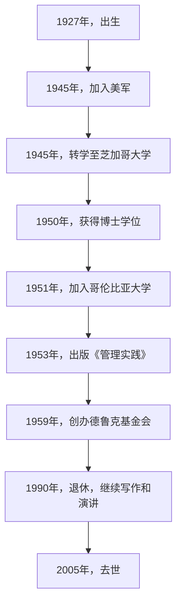

                 

# 《彼得·德鲁克：管理的本质，是激发人的善意和潜能》

> 关键词：彼得·德鲁克、管理本质、激发善意、潜能、管理实践

> 摘要：本文旨在探讨管理大师彼得·德鲁克对管理本质的见解，特别是他强调的管理核心——激发人的善意和潜能。通过逻辑清晰、结构紧凑的叙述，本文将分章节详细阐述彼得·德鲁克的管理理念，包括沟通与合作、管理实践与自我提升、管理创新与社会责任以及未来管理趋势，以期为现代管理者提供有益的启示和指导。

---

#### 第一部分：彼得·德鲁克与管理的本质

### 第1章：彼得·德鲁克简介

#### 1.1 彼得·德鲁克生平与贡献

### 1.1.1 彼得·德鲁克的成长背景

**成长背景流程图：**


### 1.1.2 彼得·德鲁克的主要著作

**主要著作列表：**
- 《管理的实践》（1954年）
- 《管理科学》（1964年）
- 《成果管理》（1973年）
- 《创新与企业家精神》（1985年）
- 《执行力》（1999年）

### 1.2 管理的本质：激发人的善意和潜能

#### 1.2.1 彼得·德鲁克的管理观

**管理观：**
彼得·德鲁克认为，管理的本质是激发人的善意和潜能，使其在组织中发挥最大的价值。他认为，管理者应关注人的成长、潜能的挖掘以及激励机制的建立。

**管理原则：**
- 确定人的价值和贡献
- 提供成长和发展的机会
- 创造良好的工作环境
- 设定明确的绩效目标
- 提供反馈和指导

#### 1.2.2 激发人的善意和潜能的管理原则

**激发善意：**
- 建立信任和尊重
- 提供有意义的任务
- 关注员工的成长和幸福

**激发潜能：**
- 提供培训和指导
- 创造协作和团队精神
- 提供挑战和机会

---

#### 第二部分：管理中的沟通与合作

### 第2章：管理中的沟通

#### 2.1 沟通的重要性

**沟通重要性公式：**
\[ \text{沟通效果} = \text{信息传递} \times \text{理解程度} \times \text{信任水平} \]

#### 2.1.1 有效沟通的基本要素

**有效沟通要素：**
- 清晰的信息传递
- 充分的反馈机制
- 正面的沟通态度
- 适当的沟通渠道

**伪代码：**
```python
def effective_communication(message, feedback, attitude, channel):
    if message is clear and feedback is provided:
        if attitude is positive and channel is appropriate:
            return communication_success
    return communication_failure
```

#### 2.1.2 提高沟通效率的方法

**提高沟通效率方法：**
- 精简信息，突出重点
- 倾听对方意见，关注对方需求
- 定期进行沟通会议，建立沟通机制
- 使用多种沟通渠道，确保信息传递全面

### 第3章：团队合作

#### 3.1 团队合作的重要性

**团队合作优势：**
- 提高问题解决能力
- 促进知识共享和创新
- 增强组织凝聚力

**破解团队合作难题：**
- 明确团队目标和职责
- 建立良好的沟通机制
- 提供培训和激励机制
- 解决内部冲突，保持团队和谐

#### 3.2 团队成员的激发与激励

**激发成员善意：**
- 建立信任和尊重
- 提供有意义的工作任务
- 关注成员成长和幸福

**激励成员潜能：**
- 提供培训和发展机会
- 创造协作和团队精神
- 设定明确的绩效目标和奖励机制

---

#### 第三部分：管理实践与自我提升

### 第4章：管理的实践智慧

#### 4.1 管理实践中的问题解决

**常见管理问题：**
- 目标不明确
- 沟通不畅
- 激励不足
- 决策失误

**解决方法：**
- 设定明确的目标和计划
- 建立有效的沟通机制
- 创造积极的激励环境
- 培养良好的决策习惯

#### 4.2 管理实践的反思与调整

**反思管理实践：**
- 定期回顾管理实践的效果
- 分析问题产生的原因
- 反思自己的管理风格和方法

**调整管理实践：**
- 根据反思结果进行调整
- 学习先进的管理理念和方法
- 坚持实践和改进，不断提升管理水平

---

### 第5章：自我提升与管理能力

#### 5.1 管理能力的自我评估

**评估工具：**
- 管理能力自我评估问卷
- 管理能力评估模型

**根据评估结果制定自我提升计划：**
- 确定自己的优势和不足
- 制定针对性的提升计划
- 持续学习和实践，不断提升管理能力

#### 5.2 持续学习与职业发展

**学习策略：**
- 阅读经典管理著作
- 参加管理培训和研讨会
- 与同行交流和学习
- 结合实践，不断反思和总结

**职业发展路径：**
- 管理层晋升
- 专业技能提升
- 创业和自主管理

---

#### 第四部分：管理创新与社会责任

### 第6章：管理创新

#### 6.1 管理创新的动力

**内在动力：**
- 对现状的不满
- 对未来的期待
- 对个人价值的追求

**外在环境：**
- 技术的进步
- 市场的需求
- 政策的引导

#### 6.2 管理创新的实践

**创新案例分享：**
- 亚马逊的“物流创新”
- 苹果公司的“产品创新”

**创新方法与工具：**
- 思维导图
- 设计思维
- 快速原型开发

---

### 第7章：社会责任与管理

#### 7.1 管理者与社会责任

**社会责任概念：**
- 企业对社会和环境的影响
- 管理者对员工和社区的关怀

**管理者承担社会责任的途径：**
- 环境保护
- 社会公益
- 诚信经营

#### 7.2 企业社会责任实践

**评估方法：**
- 企业社会责任报告
- 社会责任指数

**实践案例：**
- 可口可乐公司的“减塑行动”
- 微软的“技术公益项目”

---

#### 第五部分：未来管理与组织变革

### 第8章：未来管理的趋势

#### 8.1 数字化与自动化

**数字化管理发展趋势：**
- 数据驱动的决策
- 云计算和大数据的应用
- 智能化系统的集成

**自动化技术对管理的影响：**
- 提高生产效率和降低成本
- 调整组织结构和岗位需求
- 增强管理透明度和可控性

#### 8.2 创新组织形式

**创新型组织特征：**
- 弹性和敏捷
- 知识共享和开放性
- 灵活的工作方式和团队文化

**创新型组织的建设策略：**
- 简化管理层次，提高决策效率
- 培养创新文化和创新思维
- 利用信息技术和工具支持创新

---

### 第9章：组织变革与管理

#### 9.1 变革管理的挑战

**变革管理难点：**
- 文化阻力
- 组织惯性
- 沟通不畅

**应对策略：**
- 高层领导的支持和承诺
- 建立变革管理团队
- 提供培训和沟通渠道
- 逐步推进，分阶段实施

#### 9.2 变革中的领导力

**领导者在变革中的角色：**
- 明确变革目标
- 建立变革愿景
- 激发员工参与和积极性
- 解决变革中的问题和冲突

**培养变革领导力的方法：**
- 提升变革管理能力
- 学习变革管理理论和实践
- 积极参与变革实践，不断总结经验

---

#### 第六部分：管理理论与应用

### 第10章：彼得·德鲁克的管理理论

#### 10.1 管理理论的发展历程

**传统管理理论：**
- 泰勒的科学管理理论
- 法约尔的管理过程理论
- 马克斯·韦伯的官僚组织理论

**当代管理理论：**
- 经验主义管理理论
- 系统管理理论
- 质量管理理论

#### 10.2 彼得·德鲁克的管理思想

**管理本质：**
- 激发人的善意和潜能
- 关注人的成长和发展

**管理实践原则：**
- 确定人的价值和贡献
- 提供成长和发展的机会
- 创造良好的工作环境
- 设定明确的绩效目标
- 提供反馈和指导

---

### 第11章：管理理论在实践中的应用

#### 11.1 管理理论在组织管理中的应用

**组织规划与设计：**
- 确定组织目标和结构
- 设定组织战略和策略
- 设计组织文化和价值观

**领导与激励：**
- 培养领导力和管理能力
- 设定绩效目标和奖励机制
- 关注员工成长和激励

#### 11.2 管理理论在项目管理中的应用

**项目规划与控制：**
- 制定项目计划和预算
- 确定项目进度和质量
- 实施项目监控和管理

**项目风险管理：**
- 识别项目风险
- 评估项目风险影响
- 制定项目风险应对策略

---

### 附录：彼得·德鲁克管理理论精选案例

#### 附录A：管理案例一

**案例背景：**
- 企业面临市场竞争加剧和内部管理问题
- 需要提高生产效率，降低成本

**管理问题：**
- 缺乏明确的目标和计划
- 沟通不畅，信息传递不及时
- 员工积极性不高，缺乏激励

**彼得·德鲁克的管理思路：**
- 设定明确的目标和计划，提高执行力
- 建立有效的沟通机制，确保信息畅通
- 提供培训和激励机制，激发员工潜能

**案例结果与反思：**
- 企业生产效率显著提高
- 员工积极性增强，团队凝聚力提升
- 需要持续关注管理实践，不断改进和优化

#### 附录B：管理案例二

**案例背景：**
- 企业面临产品创新不足，市场竞争压力增大
- 需要推动产品创新，提升竞争力

**管理问题：**
- 缺乏创新文化和创新思维
- 研发资源有限，缺乏有效利用
- 市场需求变化快，产品更新周期长

**彼得·德鲁克的管理思路：**
- 建立创新文化和创新机制，鼓励员工创新
- 优化研发流程，提高研发效率
- 加强市场调研，快速响应市场变化

**案例结果与反思：**
- 企业产品创新取得显著成果，市场竞争力提升
- 创新文化和创新机制逐渐形成，持续推动企业进步
- 需要继续关注市场和员工需求，保持创新活力

---

**作者：AI天才研究院/AI Genius Institute & 禅与计算机程序设计艺术 /Zen And The Art of Computer Programming** 

本文通过系统地阐述彼得·德鲁克的管理理念，旨在为现代管理者提供有益的启示。在实际管理中，激发人的善意和潜能是管理的核心，管理者需要通过有效的沟通与合作、持续的学习与实践、创新思维和社会责任来提升管理水平和组织效能。未来，随着数字化和自动化的推进，管理者更需要具备前瞻性和创新能力，以应对不断变化的管理环境。通过本文的深入探讨，希望读者能够更好地理解和应用彼得·德鲁克的管理智慧，为企业的持续发展和个人的职业成长助力。

