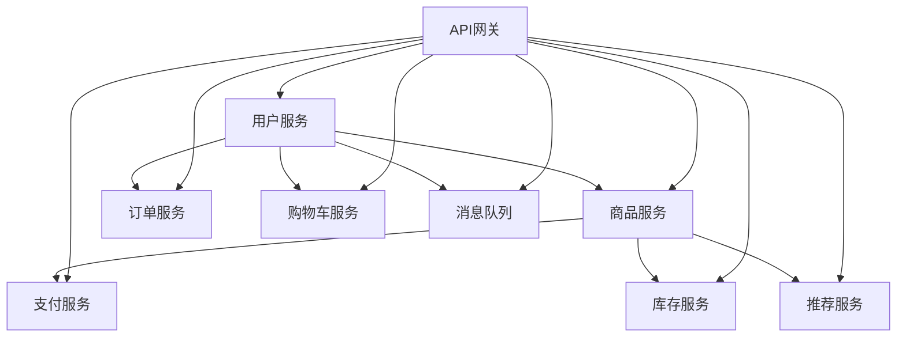
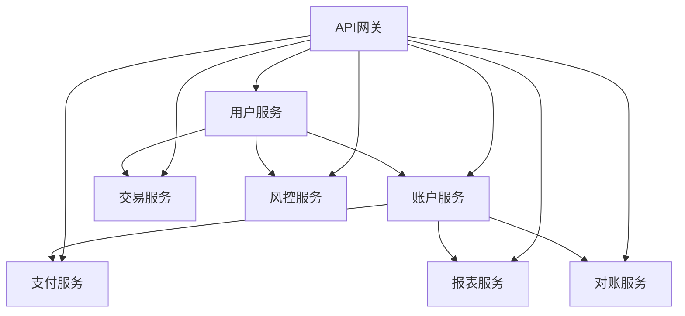
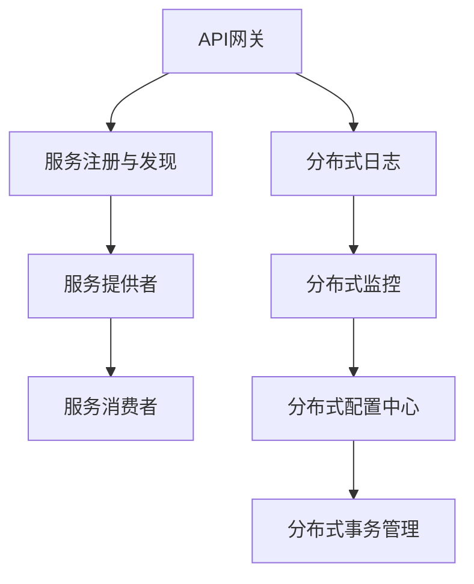
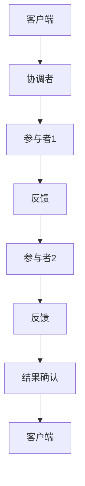
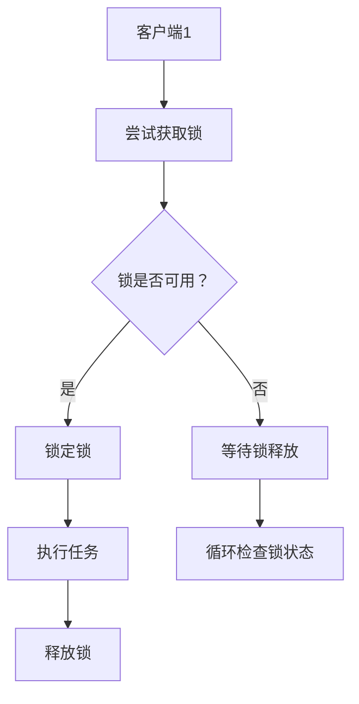

                 


### 文章标题
《微服务架构在高扩展性中的应用》

> 关键词：微服务架构、高扩展性、设计原则、实践案例、性能优化

> 摘要：
本文将深入探讨微服务架构在高扩展性方面的应用，从基础理论到实际案例，全面解析微服务架构的设计原则、核心技术、部署与运维、扩展性设计实践以及性能优化策略。通过分析微服务架构的优势与挑战，提供一系列高扩展性设计实践和优化建议，帮助开发者构建稳定、高效、可扩展的分布式系统。

### 《微服务架构在高扩展性中的应用》目录大纲

#### 第一部分：微服务架构基础

# 第一部分：微服务架构基础

## 第1章：微服务架构概述
### 1.1 微服务架构的定义与特点
### 1.2 微服务架构与传统架构的比较
### 1.3 微服务架构的优点和挑战

## 第2章：微服务架构设计原则
### 2.1 单一职责原则
### 2.2 域驱动设计
### 2.3 剥离关注点
### 2.4 高内聚低耦合

## 第3章：微服务架构核心技术
### 3.1 API网关
### 3.2 服务注册与发现
### 3.3 服务熔断与限流
### 3.4 分布式事务管理

## 第4章：微服务架构部署与运维
### 4.1 容器化与Kubernetes
### 4.2 持续集成与持续部署
### 4.3 监控与日志管理
### 4.4 弹性伸缩与负载均衡

#### 第二部分：高扩展性设计实践

# 第二部分：高扩展性设计实践

## 第5章：高扩展性架构设计
### 5.1 扩展性原则
### 5.2 数据分片策略
### 5.3 读写分离
### 5.4 负载均衡算法

## 第6章：分布式系统一致性保障
### 6.1 分布式一致性模型
### 6.2 数据一致性与分布式事务
### 6.3 分布式锁与分布式队列
### 6.4 一致性协议与算法

## 第7章：分布式系统容错性设计
### 7.1 异常处理与回滚
### 7.2 分布式故障检测与恢复
### 7.3 服务降级与熔断
### 7.4 分布式系统的自我修复

## 第8章：微服务性能优化
### 8.1 性能优化策略
### 8.2 数据库优化技巧
### 8.3 缓存策略
### 8.4 网络优化

#### 第三部分：高扩展性实践案例

# 第三部分：高扩展性实践案例

## 第9章：电商系统微服务架构实战
### 9.1 架构设计与核心模块
### 9.2 拓展性设计与优化
### 9.3 性能优化实践
### 9.4 系统运维与监控

## 第10章：金融系统微服务架构实践
### 10.1 架构设计与核心模块
### 10.2 安全性与合规性
### 10.3 高可用性与容灾能力
### 10.4 系统性能优化与监控

## 第11章：微服务架构案例分析
### 11.1 成功案例分享
### 11.2 失败案例分析
### 11.3 案例总结与启示

#### 附录

## 附录A：相关工具与技术
### A.1 微服务框架推荐
### A.2 分布式数据库选择
### A.3 容器化与自动化部署工具
### A.4 监控与日志分析工具

## 附录B：推荐阅读材料
### B.1 微服务相关书籍推荐
### B.2 高扩展性架构相关论文推荐
### B.3 微服务实践案例分享网站推荐
### B.4 微服务社区与论坛推荐

## 附录 C: Mermaid 流程图
### C.1 微服务架构核心组件关系
### C.2 分布式一致性模型
### C.3 分布式锁算法

## 附录 D: 数学模型与公式
### D.1 数据分片策略

## 附录 E: 项目实战案例
### E.1 实战一：电商系统微服务架构搭建
### E.2 实战二：金融系统微服务架构优化

## 附录 F: 代码解读与分析
### F.1 服务提供者代码解读
### F.2 服务消费者代码解读
### F.3 分析与优化建议

### LET'S THINK STEP BY STEP
接下来，我们将逐步分析微服务架构在高扩展性中的应用，从基础理论、设计原则、核心技术、部署与运维、扩展性设计实践、性能优化策略，到实践案例，全面探讨如何构建高扩展性的分布式系统。希望通过本文的深入探讨，能够帮助读者理解微服务架构的核心原理，掌握高扩展性设计的实践方法，并能够应用于实际项目中。让我们开始吧！### 第1章：微服务架构概述

微服务架构（Microservices Architecture）是近年来在软件工程领域迅速崛起的一种设计模式，旨在通过将大型单体应用程序分解为多个小型、独立的服务，从而提高系统的可扩展性、灵活性和可维护性。微服务架构的核心思想是将系统分解为多个松耦合的服务，每个服务负责完成特定的业务功能，这些服务可以独立部署、扩展和更新，从而实现高效的开发和运维。

#### 1.1 微服务架构的定义与特点

**定义：**

微服务架构是一种软件开发方法，它将应用程序构建为一组小的、独立的服务。这些服务围绕着具体的业务功能构建，通过轻量级的通信协议（如HTTP/REST）进行通信。

**特点：**

1. **独立性：** 每个服务都是独立的，可以独立部署和扩展，不会影响到其他服务。
2. **解耦：** 服务之间通过定义良好的接口进行通信，减少了服务之间的依赖，提高了系统的可维护性。
3. **可扩展性：** 可以根据业务需求独立扩展某个服务，而不需要调整整个系统。
4. **分布式：** 服务可以在不同的服务器上运行，实现了真正的分布式系统。
5. **自治：** 每个服务都可以独立进行开发、测试和部署。
6. **高容错性：** 服务可以独立失败，不会影响到其他服务的运行。

#### 1.2 微服务架构与传统架构的比较

**传统架构：**

传统架构通常指的是单体应用程序架构，这种架构将所有的业务逻辑和功能都集中在一个单一的代码库中。这样的架构虽然简单，但存在一些明显的缺点：

1. **可扩展性差：** 整体系统需要一起部署和扩展，一旦某个部分出现性能瓶颈，需要整体优化。
2. **维护困难：** 代码库庞大，模块之间紧密耦合，修改一个模块可能需要重新部署整个系统。
3. **部署复杂：** 部署过程需要协调各个模块的版本，部署窗口较长。

**微服务架构：**

微服务架构通过将系统分解为多个独立的服务，有效地解决了传统架构的上述问题：

1. **可扩展性强：** 可以独立扩展某个服务，根据业务需求灵活调整资源分配。
2. **维护简单：** 独立的服务可以独立开发和维护，减少了耦合，降低了修改风险。
3. **部署灵活：** 每个服务可以独立部署，部署过程更加灵活，部署窗口更短。

#### 1.3 微服务架构的优点和挑战

**优点：**

1. **可扩展性：** 微服务架构通过服务拆分，实现了水平扩展，提高了系统的性能和响应速度。
2. **灵活性：** 服务可以独立开发和部署，支持敏捷开发和快速迭代。
3. **可维护性：** 独立的服务降低了模块之间的依赖，使得系统维护更加简单。
4. **容错性：** 服务独立运行，某个服务的失败不会影响到其他服务，提高了系统的容错性。

**挑战：**

1. **复杂性：** 分布式系统增加了系统的复杂性，需要更好的管理和协调。
2. **数据一致性：** 分布式事务管理增加了数据一致性的挑战。
3. **性能开销：** 服务调用增加了网络开销，可能影响系统性能。

总的来说，微服务架构通过将系统分解为多个独立的服务，提高了系统的可扩展性、灵活性和可维护性。但同时，这也带来了新的挑战，需要开发者具备更高的分布式系统设计和管理能力。在下一章中，我们将进一步探讨微服务架构的设计原则，帮助读者更好地理解和应用微服务架构。### 第2章：微服务架构设计原则

微服务架构的成功依赖于一系列设计原则的遵循，这些原则不仅确保了系统的灵活性，还提高了其可扩展性和可维护性。以下是微服务架构设计中的几个核心原则：

#### 2.1 单一职责原则

**定义：** 单一职责原则（Single Responsibility Principle）是指一个服务应该只负责一项具体的业务功能。这一原则来源于《设计模式：可复用面向对象软件的基础》一书，强调模块化设计的重要性。

**原因：** 通过单一职责原则，可以确保每个服务具有明确的职责，降低了服务的耦合度。这样的设计使得每个服务可以独立开发、测试和部署，提高了系统的灵活性和可维护性。

**应用：** 在设计微服务时，首先需要明确每个服务的业务职责。例如，在电商系统中，可以将订单处理、商品管理、用户认证等业务功能拆分为独立的服务。

**伪代码示例：**
```java
// 订单服务伪代码
@Service
public class OrderService {
    public void placeOrder(Order order) {
        // 处理订单逻辑
    }
}

// 商品服务伪代码
@Service
public class ProductService {
    public void updateProduct(Product product) {
        // 处理商品更新逻辑
    }
}
```

#### 2.2 域驱动设计

**定义：** 域驱动设计（Domain-Driven Design, DDD）是一种面向对象的软件设计方法论，强调通过明确的领域模型来组织代码，以提高系统的可理解性和可维护性。

**原因：** DDD 将业务领域作为设计的核心，使得代码更贴近业务需求，提高了系统的业务适应性。通过清晰的领域模型，可以更好地理解和实现复杂的业务逻辑。

**应用：** 在DDD中，领域模型通常由领域实体、值对象、领域服务、聚合根和边界等构成。这些组件共同构成了一个自治的领域模块。

**伪代码示例：**
```java
// 领域实体伪代码
@Entity
public class Order {
    private Long id;
    private Customer customer;
    private List<OrderItem> items;
}

// 领域服务伪代码
@Service
public class OrderService {
    public void processOrder(Order order) {
        // 处理订单逻辑
    }
}
```

#### 2.3 剥离关注点

**定义：** 剥离关注点（Decouple Concerns）是指将不同关注点的功能分离到不同的服务中，以减少服务之间的依赖和交互。

**原因：** 通过剥离关注点，可以确保每个服务都专注于解决特定的问题，从而提高了系统的模块化和可扩展性。

**应用：** 剥离关注点通常通过定义明确的接口来实现。每个服务仅暴露其需要的接口，通过这些接口进行通信，减少了直接的依赖关系。

**伪代码示例：**
```java
// 订单服务接口
public interface OrderService {
    void placeOrder(Order order);
}

// 订单服务实现
@Service
public class OrderServiceImpl implements OrderService {
    public void placeOrder(Order order) {
        // 处理订单逻辑
    }
}
```

#### 2.4 高内聚低耦合

**定义：** 高内聚低耦合（High Cohesion, Low Coupling）是指服务内部的功能紧密相关（高内聚），而服务之间的依赖关系尽量减少（低耦合）。

**原因：** 高内聚和低耦合是软件设计中的两个重要原则。高内聚可以提高代码的复用性和可维护性，而低耦合则有助于系统的灵活性和可扩展性。

**应用：** 在实际开发中，可以通过模块化设计、定义明确的接口和采用设计模式来实现高内聚低耦合。例如，可以使用单一职责原则和剥离关注点来确保服务的高内聚，同时使用接口和依赖注入来减少服务之间的耦合。

**伪代码示例：**
```java
// 高内聚服务
public class ProductService {
    public void updateProduct(Product product) {
        // 更新商品信息的逻辑
    }
}

// 低耦合服务
public interface OrderService {
    void placeOrder(Order order);
}

// 使用依赖注入减少耦合
@Service
public class OrderServiceImpl implements OrderService {
    private ProductService productService;

    public OrderServiceImpl(ProductService productService) {
        this.productService = productService;
    }

    public void placeOrder(Order order) {
        productService.updateProduct(order.getProduct());
    }
}
```

通过遵循这些设计原则，可以构建出具有高扩展性、灵活性和可维护性的微服务架构。在下一章中，我们将探讨微服务架构中的核心技术，包括API网关、服务注册与发现、服务熔断与限流等，帮助读者进一步理解微服务架构的实际应用。### 第3章：微服务架构核心技术

微服务架构的核心在于其分布式系统的特性，因此，需要一系列关键技术来确保系统的稳定性和高效性。以下是微服务架构中的一些核心技术：

#### 3.1 API网关

**定义：** API网关是微服务架构中的一个关键组件，它充当了客户端和服务提供者之间的统一接口。所有客户端的请求都会先经过API网关，然后由API网关将请求路由到相应的服务。

**作用：** API网关有以下作用：

1. **统一接口管理：** 提供统一的接口，简化客户端的开发工作，隐藏服务提供者的具体实现细节。
2. **请求路由：** 根据请求的URL或请求头信息，将请求路由到相应的服务。
3. **负载均衡：** 对进入系统的请求进行负载均衡，确保系统的稳定运行。
4. **安全控制：** 实现身份验证、授权和审计等安全功能。
5. **监控与日志：** 集中收集服务访问日志和性能监控数据，便于问题追踪和性能分析。

**实现：** 常见的API网关实现包括Spring Cloud Gateway、Kong和Apache APISIX等。以下是一个使用Spring Cloud Gateway的示例：
```java
@Configuration
public class GatewayConfig {

    @Bean
    public RouteLocator routeLocator(RouteLocatorBuilder builder) {
        return builder.routes()
                .route("order-service", r -> r.path("/orders/**")
                        .uri("lb://order-service"))
                .route("product-service", r -> r.path("/products/**")
                        .uri("lb://product-service"))
                .build();
    }

    @Bean
    public HttpClient httpClient() {
        HttpClientBuilder builder = HttpClientBuilder.create();
        builder.setDefaultRequestConfig(config -> {
            config.setConnectTimeout(5000);
            config.setReadTimeout(5000);
        });
        return builder.build();
    }
}
```

#### 3.2 服务注册与发现

**定义：** 服务注册与发现是微服务架构中的一个重要机制，用于服务实例的自动注册和发现。服务实例启动时，会将自己的信息注册到服务注册中心，其他服务实例可以通过服务注册中心发现并访问这些服务。

**作用：** 服务注册与发现有以下作用：

1. **动态服务发现：** 服务实例启动和停止时，服务注册中心可以自动更新服务列表。
2. **负载均衡：** 根据服务实例的健康状态和负载情况，自动选择合适的服务实例进行调用。
3. **故障转移：** 当服务实例故障时，服务注册中心可以自动将其从服务列表中移除，并选择其他健康实例进行调用。

**实现：** 常见的服务注册与发现实现包括Netflix Eureka、Consul和Zookeeper等。以下是一个使用Netflix Eureka的示例：
```java
@SpringBootApplication
@EnableDiscoveryClient
public class ProductServiceApplication {

    public static void main(String[] args) {
        SpringApplication.run(ProductServiceApplication.class, args);
    }
}
```

#### 3.3 服务熔断与限流

**定义：** 服务熔断（Circuit Breaker）和限流（Rate Limiting）是用于处理微服务通信中的异常和流量控制的关键技术。

**作用：** 服务熔断与限流有以下作用：

1. **服务熔断：** 当服务实例出现异常或失败次数超过设定的阈值时，自动熔断，停止对该服务实例的调用，以防止系统过载。
2. **限流：** 控制对某个服务实例的请求频率，防止恶意攻击或异常流量对系统造成冲击。

**实现：** 常见的服务熔断与限流实现包括Netflix Hystrix、Resilience4j和Spring Cloud Gateway等。以下是一个使用Spring Cloud Gateway的示例：
```java
@Aspect
@Component
public class RateLimiterAspect {

    private RateLimiter rateLimiter = RateLimiter.create(10); // 每秒最多10个请求

    @Before("@annotation(RateLimited)")
    public void rateLimit(JoinPoint point) {
        if (!rateLimiter.tryAcquire()) {
            throw new RateLimitException("请求过于频繁，请稍后再试。");
        }
    }
}
```

#### 3.4 分布式事务管理

**定义：** 分布式事务管理是确保分布式系统中多个服务之间的数据一致性的技术。

**作用：** 分布式事务管理有以下作用：

1. **数据一致性：** 确保分布式系统中多个服务操作的数据一致性。
2. **补偿机制：** 当分布式事务失败时，通过补偿机制来恢复数据一致性。

**实现：** 常见的分布式事务管理实现包括最终一致性方案（如Event Sourcing和CQRS）、分布式锁和分布式事务框架（如Seata）。以下是一个使用Seata的示例：
```java
@Service
public class OrderService {

    @Resource
    private GlobalTransactionManager globalTransactionManager;

    public void placeOrder(Order order) {
        GlobalTransaction tx = globalTransactionManager.newGlobalTransaction(1, "ORDER_SERVICE");
        try {
            // 分步执行事务
            tx.commit();
        } catch (RuntimeException e) {
            tx.rollback();
        }
    }
}
```

通过以上核心技术的应用，微服务架构能够实现高效、稳定、可扩展的分布式系统。在下一章中，我们将探讨微服务架构的部署与运维，包括容器化、持续集成与持续部署、监控与日志管理，以及弹性伸缩与负载均衡等。这将帮助读者深入了解如何在实际环境中实施和运行微服务架构。### 第4章：微服务架构部署与运维

微服务架构的部署与运维是其成功应用的关键因素之一。本章将探讨微服务架构在部署与运维方面的最佳实践，包括容器化与Kubernetes、持续集成与持续部署、监控与日志管理，以及弹性伸缩与负载均衡。

#### 4.1 容器化与Kubernetes

**容器化：** 容器化是一种轻量级虚拟化技术，它将应用程序及其依赖环境打包成一个独立的容器镜像，以便在不同的环境中一致运行。容器化技术如Docker和Podman等，使得开发者可以将应用程序与基础设施分离，从而实现环境一致性。

**Kubernetes：** Kubernetes是一个开源的容器编排平台，它提供了用于自动化容器部署、扩展和管理的高级功能。通过Kubernetes，开发者可以轻松管理容器化应用的生命周期，实现自动化部署、扩缩容和故障恢复。

**部署与运维：** 使用Kubernetes进行微服务架构的部署与运维，可以采用以下步骤：

1. **编写Dockerfile：** 为每个微服务编写Dockerfile，定义如何构建容器镜像。
2. **构建镜像：** 使用Docker命令或CI/CD流水线构建容器镜像。
3. **部署到Kubernetes：** 使用Kubernetes的部署配置文件（如Deployment）将容器镜像部署到集群中。
4. **自动化运维：** 使用Kubernetes的自动化功能（如滚动更新、弹性伸缩）进行运维。

**示例：**
```yaml
# Kubernetes Deployment配置文件示例
apiVersion: apps/v1
kind: Deployment
metadata:
  name: order-service
spec:
  replicas: 3
  selector:
    matchLabels:
      app: order-service
  template:
    metadata:
      labels:
        app: order-service
    spec:
      containers:
      - name: order-service
        image: order-service:latest
        ports:
        - containerPort: 8080
```

#### 4.2 持续集成与持续部署

**持续集成（CI）：** 持续集成是一种软件开发实践，通过自动化测试和构建，确保代码库的稳定性和可集成性。CI工具（如Jenkins、GitLab CI/CD和CircleCI）可以自动检测代码变更，执行测试，并将成功构建的镜像推送到容器镜像仓库。

**持续部署（CD）：** 持续部署是一种自动化部署流程，它通过CI/CD工具将代码库中的代码自动部署到生产环境中。CD可以提高软件发布的速度和可靠性，减少人工干预。

**部署与运维：** 使用CI/CD进行微服务架构的持续集成与持续部署，可以采用以下步骤：

1. **配置CI/CD工具：** 根据项目需求，配置CI/CD工具，设置代码仓库的Webhook、构建脚本和部署脚本。
2. **自动化测试：** 执行自动化测试，确保代码变更不会破坏现有功能。
3. **构建与部署：** 自动构建容器镜像，并将其部署到Kubernetes集群中。

**示例：**
```yaml
# Jenkinsfile示例
pipeline {
    agent any
    stages {
        stage('Build') {
            steps {
                sh 'docker build -t order-service:latest .'
            }
        }
        stage('Test') {
            steps {
                sh 'docker run --rm -it order-service:latest ./mvnw test'
            }
        }
        stage('Deploy') {
            steps {
                sh 'kubectl apply -f deployment.yml'
            }
        }
    }
}
```

#### 4.3 监控与日志管理

**监控：** 监控是确保微服务架构稳定运行的关键，通过监控工具（如Prometheus、Grafana和Kibana）可以实时收集和展示系统的运行状态，包括服务性能、资源使用情况等。

**日志管理：** 日志管理是追踪和分析系统问题的重要手段。使用日志聚合工具（如ELK栈、Fluentd和Logstash）可以将分布式系统中的日志集中存储，方便进行搜索和分析。

**部署与运维：**
1. **配置监控工具：** 在Kubernetes集群中配置监控工具，安装和配置Prometheus、Grafana等。
2. **配置日志聚合：** 使用Fluentd或Logstash等工具，将Kubernetes集群中各服务的日志聚合到集中存储系统中。
3. **报警与可视化：** 配置报警规则，通过Grafana等可视化工具展示系统监控数据。

**示例：**
```yaml
# Prometheus配置文件示例
global:
  scrape_interval: 15s
scrape_configs:
- job_name: 'kubernetes-objects'
  kubernetes_sd_configs:
  - role: pod
    namespace: default
  metrics_path: '/metrics'
  scheme: http
  relabel_configs:
  - source_labels: [__meta_kubernetes_namespace, __meta_kubernetes_pod_name]
    action: keep
    regex: '(default|order-service)'
```

#### 4.4 弹性伸缩与负载均衡

**弹性伸缩：** 弹性伸缩是一种根据实际负载自动调整服务实例数量的技术。通过Kubernetes的自动扩缩容功能，可以根据资源使用情况自动增加或减少服务实例。

**负载均衡：** 负载均衡是确保请求均匀分布到各个服务实例的技术。Kubernetes的Service和Ingress资源可以实现基于轮询、最少连接等算法的负载均衡。

**部署与运维：**
1. **配置自动扩缩容：** 在Kubernetes中配置HPA（Horizontal Pod Autoscaler），根据CPU使用率或其他指标自动调整服务实例数量。
2. **配置负载均衡：** 使用Kubernetes的Service和Ingress资源，配置负载均衡策略。

**示例：**
```yaml
# Horizontal Pod Autoscaler配置文件示例
apiVersion: autoscaling/v2beta2
kind: HorizontalPodAutoscaler
metadata:
  name: order-service
spec:
  scaleTargetRef:
    apiVersion: apps/v1
    kind: Deployment
    name: order-service
  minReplicas: 1
  maxReplicas: 10
  targetCPUUtilizationPercentage: 70
```

通过容器化与Kubernetes、持续集成与持续部署、监控与日志管理，以及弹性伸缩与负载均衡等部署与运维技术，微服务架构可以实现自动化、高效和可扩展的部署与运维。在下一章中，我们将探讨高扩展性架构设计实践，包括扩展性原则、数据分片策略、读写分离和负载均衡算法，帮助读者进一步理解如何实现高扩展性的分布式系统。### 第5章：高扩展性架构设计

在构建微服务架构时，高扩展性是确保系统在面对高并发、大数据量等场景下仍能稳定运行的关键。本章将详细探讨高扩展性架构设计实践，包括扩展性原则、数据分片策略、读写分离和负载均衡算法。

#### 5.1 扩展性原则

**定义：** 扩展性（Scalability）是指系统在处理负载增加时，能够通过增加资源或调整架构来保持性能和稳定性的能力。

**原则：**

1. **水平扩展（Horizontal Scaling）：** 通过增加更多的服务器实例来处理负载，而不是依赖单个服务器的处理能力。
2. **垂直扩展（Vertical Scaling）：** 通过增加服务器的硬件资源（如CPU、内存）来提升单个服务器的处理能力。
3. **弹性扩展（Elastic Scaling）：** 系统可以根据实际负载自动调整资源分配，实现自动化的扩缩容。
4. **解耦合（Decoupling）：** 通过减少服务之间的依赖，确保服务可以独立部署和扩展。
5. **自动化（Automation）：** 通过自动化工具和流程，简化系统的部署、监控和运维。

**示例：** 假设一个电商系统需要处理大量订单，通过水平扩展，可以增加更多的订单处理服务实例，从而提高系统的处理能力。

#### 5.2 数据分片策略

**定义：** 数据分片（Sharding）是指将大数据量分散存储到多个数据库或数据表中，以提高查询效率和系统性能。

**策略：**

1. **哈希分片（Hash Sharding）：** 根据数据的哈希值，将数据分片到不同的数据库或数据表中。例如，使用订单ID的哈希值来确定存储位置。
2. **范围分片（Range Sharding）：** 根据数据的一个或多个字段的范围，将数据分片到不同的数据库或数据表中。例如，根据订单时间将订单分片到不同的数据库。
3. **列表分片（List Sharding）：** 根据数据的一个或多个字段的值，将数据分片到不同的数据库或数据表中。例如，根据用户ID将用户数据分片到不同的数据库。

**示例：** 使用哈希分片策略，可以按照订单ID的哈希值将订单数据分片到不同的数据库，从而提高查询效率。

```java
public class OrderRepository {
    public void saveOrder(Order order) {
        String shardKey = order.getId().toString();
        int shardIndex = shardKey.hashCode() % shardCount;
        // 保存订单到指定分片的数据库
    }
}
```

#### 5.3 读写分离

**定义：** 读写分离是指将读操作和写操作分离到不同的数据库实例，以提高系统的性能和可靠性。

**策略：**

1. **主从复制（Master-Slave Replication）：** 主数据库处理写操作，从数据库处理读操作。主从复制可以提高系统的读写分离能力，确保数据的一致性。
2. **读写分离代理（Read-Write Splitting Proxy）：** 通过读写分离代理（如MySQL Proxy、Apache Ignite等），将读操作和写操作路由到不同的数据库实例。

**示例：** 假设使用主从复制策略，将读操作路由到从数据库，将写操作路由到主数据库。

```yaml
# MySQL主从复制配置示例
[mysqld]
server-id = 1
log-bin = mysql-bin
binlog-format = ROW
replicate-do-db = order_db
replicate-ignore-db = information_schema
```

#### 5.4 负载均衡算法

**定义：** 负载均衡（Load Balancing）是指将网络流量分配到多个服务器或服务实例，以提高系统的整体性能和可靠性。

**算法：**

1. **轮询负载均衡（Round Robin）：** 依次将请求分配到每个服务实例。
2. **最小连接数负载均衡（Least Connections）：** 将请求分配到连接数最少的服务实例。
3. **最小负载负载均衡（Least Load）：** 将请求分配到负载最轻的服务实例。
4. **哈希负载均衡（Hash）：** 根据请求的特征（如客户端IP地址）进行哈希计算，将请求分配到特定的服务实例。

**示例：** 使用轮询负载均衡算法，将请求依次分配到各个服务实例。

```yaml
# Nginx配置文件示例
http {
    upstream backend {
        server service1:80;
        server service2:80;
        server service3:80;
    }

    server {
        location / {
            proxy_pass http://backend;
        }
    }
}
```

通过遵循扩展性原则、应用数据分片策略、实现读写分离和选择合适的负载均衡算法，可以构建出具有高扩展性的微服务架构。在下一章中，我们将探讨分布式系统一致性保障，包括分布式一致性模型、数据一致性与分布式事务、分布式锁与分布式队列，以及一致性协议与算法，帮助读者进一步理解如何在分布式系统中保证数据一致性。### 第6章：分布式系统一致性保障

在分布式系统中，数据的一致性是确保系统正确性和稳定性的关键。由于分布式系统的分布式特性，数据的一致性变得更加复杂。本章将深入探讨分布式系统一致性保障的各个方面，包括分布式一致性模型、数据一致性与分布式事务、分布式锁与分布式队列，以及一致性协议与算法。

#### 6.1 分布式一致性模型

**定义：** 分布式一致性模型是指分布式系统中确保数据一致性的方法。

**类型：**

1. **强一致性（Strong Consistency）：** 系统在任何情况下都能保证数据一致性。读取操作返回的是最新写入的数据。这种一致性级别适用于对数据一致性要求极高的场景。
2. **最终一致性（Eventual Consistency）：** 系统最终会达到一致性状态，但可能需要一定的时间。在数据更新后，系统可能会出现一段时间的不一致，但在足够长的时间内，所有读取操作将返回一致的数据。这种一致性级别适用于对一致性要求不是非常严格的场景。

**示例：** 在一个分布式数据库系统中，可以使用最终一致性模型，确保所有副本最终一致，但允许在更新后的短暂时间内存在不一致。

```java
public class DistributedDatabase {
    public void updateData(Data data) {
        // 更新数据
        // 使用最终一致性算法，如Gossip协议，确保数据最终一致
    }
}
```

#### 6.2 数据一致性与分布式事务

**定义：** 分布式事务是指跨越多个分布式系统的操作序列，这些操作需要作为一个整体要么全部成功，要么全部失败。

**类型：**

1. **两阶段提交（2PC，Two-Phase Commit）：** 是一种分布式事务管理协议，通过协调者（Coordinator）和参与者（Participant）之间的两次消息交换，确保事务的一致性。
2. **最终一致性事务（Eventual Consistency Transaction）：** 是一种基于最终一致性模型的分布式事务，允许事务在分布式系统中最终一致，但不保证立即一致性。

**示例：** 使用两阶段提交协议管理分布式事务。

```java
public class TwoPhaseCommit {
    public void prepare(Transaction transaction) {
        // 向参与者发送prepare消息
        // 参与者返回预准备结果
        // 如果所有参与者都预准备成功，则向参与者发送commit消息
    }

    public void commit(Transaction transaction) {
        // 向参与者发送commit消息
        // 参与者返回commit结果
        // 如果所有参与者都commit成功，则事务提交
    }

    public void rollback(Transaction transaction) {
        // 向参与者发送rollback消息
        // 参与者返回rollback结果
        // 如果所有参与者都rollback成功，则事务回滚
    }
}
```

#### 6.3 分布式锁与分布式队列

**定义：** 分布式锁（Distributed Lock）是用于确保分布式系统中操作顺序的一致性的机制，分布式队列（Distributed Queue）是用于消息传递和任务调度的机制。

**类型：**

1. **基于数据库的分布式锁：** 使用数据库中的行锁或表锁来实现分布式锁。
2. **基于Zookeeper的分布式锁：** 使用Zookeeper的临时节点和监听机制来实现分布式锁。
3. **基于Redis的分布式锁：** 使用Redis的SETNX命令来实现分布式锁。

**示例：** 使用基于Redis的分布式锁。

```java
public class RedisDistributedLock {
    private Jedis jedis;

    public RedisDistributedLock(Jedis jedis) {
        this.jedis = jedis;
    }

    public boolean lock(String lockKey, long timeout) {
        long currentTime = System.currentTimeMillis();
        while (System.currentTimeMillis() - currentTime < timeout) {
            if (jedis.setnx(lockKey, "locked") == 1) {
                return true;
            }
            try {
                Thread.sleep(100);
            } catch (InterruptedException e) {
                e.printStackTrace();
            }
        }
        return false;
    }

    public void unlock(String lockKey) {
        String value = jedis.get(lockKey);
        if ("locked".equals(value)) {
            jedis.del(lockKey);
        }
    }
}
```

#### 6.4 一致性协议与算法

**定义：** 一致性协议与算法是指确保分布式系统中数据一致性的协议和算法。

**类型：**

1. **Paxos算法：** 是一种分布式一致性算法，用于在多个服务器中达成一致决策。
2. **Raft算法：** 是另一种分布式一致性算法，相对于Paxos算法，Raft算法更易于理解和实现。
3. **Gossip协议：** 是一种用于分布式系统中的数据传播和一致性保障的协议。

**示例：** 使用Gossip协议实现数据一致性。

```java
public class GossipProtocol {
    public void gossip(Message message) {
        // 向其他节点发送消息
        // 监听其他节点的消息，更新本地状态
        // 达成一致性
    }
}
```

通过分布式一致性模型、数据一致性与分布式事务、分布式锁与分布式队列，以及一致性协议与算法，可以确保分布式系统中的数据一致性和操作顺序的一致性。在下一章中，我们将探讨分布式系统的容错性设计，包括异常处理与回滚、分布式故障检测与恢复、服务降级与熔断，以及分布式系统的自我修复，帮助读者进一步理解如何提高分布式系统的容错性。### 第7章：分布式系统容错性设计

在分布式系统中，容错性是确保系统在高可用性和可靠性方面的重要保障。本章将深入探讨分布式系统的容错性设计，包括异常处理与回滚、分布式故障检测与恢复、服务降级与熔断，以及分布式系统的自我修复。

#### 7.1 异常处理与回滚

**定义：** 异常处理与回滚是指系统在遇到异常情况时，采取的恢复措施，确保系统能够从错误状态恢复到正常状态。

**策略：**

1. **断言（Assertions）：** 在代码中使用断言来检测可能出现的异常情况，并在断言失败时立即回滚。
2. **事务管理（Transaction Management）：** 使用分布式事务管理（如两阶段提交协议）确保事务的原子性，如果事务失败，可以回滚到之前的状态。
3. **重试机制（Retry Mechanism）：** 在遇到临时错误时，自动重试操作，直到成功或达到最大重试次数。

**示例：** 使用事务管理和重试机制处理异常。

```java
public class DistributedService {
    @Transactional
    public void performOperation() {
        // 执行分布式操作
        if (errorOccurs) {
            throw new RuntimeException("操作失败");
        }
    }

    public void performWithRetry(int maxRetries) {
        int retries = 0;
        while (retries < maxRetries) {
            try {
                performOperation();
                break; // 操作成功，跳出循环
            } catch (RuntimeException e) {
                retries++;
                log.error("操作失败，尝试第{}次重试", retries);
            }
        }
        if (retries == maxRetries) {
            log.error("操作连续失败，达到最大重试次数");
        }
    }
}
```

#### 7.2 分布式故障检测与恢复

**定义：** 分布式故障检测与恢复是指系统通过监控和检测机制，发现节点故障，并采取相应的措施进行故障恢复。

**策略：**

1. **心跳检测（Heartbeat Detection）：** 通过定期发送心跳消息，检测节点的存活状态。
2. **故障转移（Failover）：** 当主节点发生故障时，将工作转移到备份节点。
3. **自恢复（Self-Healing）：** 系统自动检测和修复故障，减少人工干预。

**示例：** 使用心跳检测和故障转移机制。

```java
public class DistributedSystem {
    private boolean isNodeAlive(Node node) {
        // 发送心跳检测消息
        // 返回节点存活状态
    }

    public void performFailover(Node primary, Node backup) {
        if (!isNodeAlive(primary)) {
            // 切换到备份节点
            log.info("主节点{}故障，切换到备份节点{}", primary.getId(), backup.getId());
        }
    }
}
```

#### 7.3 服务降级与熔断

**定义：** 服务降级与熔断是应对系统过载或故障的一种策略，通过减少系统压力或切断故障链路，确保系统的稳定运行。

**策略：**

1. **服务降级（Service Degradation）：** 在系统负载过高时，降低系统的响应速度或减少某些服务的可用性，以减轻系统压力。
2. **熔断（Circuit Breaker）：** 当服务故障频繁或响应时间过长时，切断服务调用，防止故障传播。

**示例：** 使用服务降级和熔断机制。

```java
public class ServiceCircuitBreaker {
    private boolean isCircuitOpen() {
        // 检测熔断器状态
        // 返回是否打开熔断器
    }

    public <T> T executeWithCircuitBreaker(Callable<T> callable) throws Exception {
        if (isCircuitOpen()) {
            throw new RuntimeException("服务熔断，无法执行操作");
        }
        return callable.call();
    }
}
```

#### 7.4 分布式系统的自我修复

**定义：** 分布式系统的自我修复是指系统通过自动化机制，检测和修复故障，提高系统的容错性和可靠性。

**策略：**

1. **自动化监控（Automated Monitoring）：** 使用自动化监控工具，实时监控系统的运行状态。
2. **自动化修复（Automated Repair）：** 当系统检测到故障时，自动执行修复操作。
3. **自我优化（Self-Optimization）：** 通过对系统性能数据的分析，自动调整系统配置，优化系统性能。

**示例：** 使用自动化监控和自我修复机制。

```java
public class SystemMonitor {
    public void monitorAndRepair() {
        // 检测系统状态
        // 如果检测到故障，自动执行修复操作
    }
}
```

通过异常处理与回滚、分布式故障检测与恢复、服务降级与熔断，以及分布式系统的自我修复等容错性设计，可以显著提高分布式系统的可靠性和稳定性。在下一章中，我们将探讨微服务的性能优化策略，包括数据库优化技巧、缓存策略和网络优化，帮助读者进一步理解如何提升微服务的性能。### 第8章：微服务性能优化

在微服务架构中，性能优化是确保系统高效运行的关键。本章将深入探讨微服务性能优化的各种策略，包括数据库优化技巧、缓存策略和网络优化。

#### 8.1 性能优化策略

**定义：** 性能优化策略是指通过一系列技术手段，提高微服务架构中系统的响应速度和吞吐量。

**策略：**

1. **代码级优化：** 对应用程序的代码进行优化，包括算法优化、避免冗余计算等。
2. **数据库优化：** 对数据库进行优化，包括索引优化、查询优化、数据库分片等。
3. **缓存策略：** 使用缓存技术，减少对后端系统的访问，提高系统的响应速度。
4. **网络优化：** 对网络传输进行优化，减少网络延迟和传输开销。

**示例：** 使用代码级优化减少冗余计算。

```java
public int calculateSum(int[] numbers) {
    int sum = 0;
    for (int i = 0; i < numbers.length; i++) {
        if (i % 2 == 0) {
            sum += numbers[i];
        }
    }
    return sum;
}
```

#### 8.2 数据库优化技巧

**定义：** 数据库优化技巧是指通过调整数据库配置、查询优化和索引管理，提高数据库性能。

**技巧：**

1. **索引优化：** 对经常查询的字段建立索引，加快查询速度。
2. **查询优化：** 对复杂的SQL查询进行优化，避免子查询和冗余联接。
3. **分库分表：** 通过分库分表策略，将大数据量分散到多个数据库或数据表中，提高查询效率。

**示例：** 使用索引优化查询。

```sql
CREATE INDEX idx_user_username ON user (username);
```

#### 8.3 缓存策略

**定义：** 缓存策略是指通过存储频繁访问的数据到内存中，减少对后端系统的访问，提高系统的响应速度。

**策略：**

1. **本地缓存：** 在应用程序内部使用缓存库（如Ehcache、Guava Cache）进行缓存。
2. **分布式缓存：** 使用分布式缓存系统（如Redis、Memcached）进行缓存。
3. **缓存一致性：** 确保缓存与数据库中的数据保持一致性。

**示例：** 使用Redis进行分布式缓存。

```java
public class RedisCache {
    private Jedis jedis;

    public RedisCache(Jedis jedis) {
        this.jedis = jedis;
    }

    public String getCache(String key) {
        return jedis.get(key);
    }

    public void setCache(String key, String value) {
        jedis.set(key, value);
    }
}
```

#### 8.4 网络优化

**定义：** 网络优化是指通过调整网络配置和传输协议，减少网络延迟和传输开销，提高数据传输效率。

**策略：**

1. **负载均衡：** 使用负载均衡器（如Nginx、HAProxy）分配网络流量，减少单点瓶颈。
2. **压缩数据：** 使用压缩算法（如gzip）减少数据传输大小。
3. **减少HTTP请求：** 通过合并静态资源、使用HTTP/2协议等减少HTTP请求次数。

**示例：** 使用HTTP/2协议减少请求次数。

```http
# Apache配置文件示例
<IfModule mod_http2.c>
    Protocols h2 http/1.1
    <FilesMatch "\.(ico|css|js|png|jpg|jpeg|xml)$">
        Header set Content-Encoding gzip
    </FilesMatch>
</IfModule>
```

通过代码级优化、数据库优化、缓存策略和网络优化等性能优化策略，可以显著提升微服务的性能。在下一章中，我们将通过电商系统和金融系统的微服务架构实战案例，深入探讨如何将上述优化策略应用于实际项目中，帮助读者更好地理解高扩展性微服务的构建和实践。### 第9章：电商系统微服务架构实战

电商系统是典型的复杂业务系统，其高并发、海量数据和高扩展性的需求，使得微服务架构成为了一种理想的解决方案。在本章中，我们将通过电商系统的微服务架构实战，详细探讨其架构设计、扩展性设计、性能优化实践，以及系统运维与监控。

#### 9.1 架构设计与核心模块

**系统架构设计：**

电商系统的微服务架构通常包括以下核心模块：

1. **用户服务（User Service）：** 管理用户信息、登录、注册和权限等。
2. **商品服务（Product Service）：** 管理商品信息、分类、库存和价格等。
3. **订单服务（Order Service）：** 管理订单创建、支付、发货和退款等。
4. **购物车服务（Cart Service）：** 管理用户购物车中的商品信息。
5. **支付服务（Payment Service）：** 处理支付请求和支付结果通知。
6. **库存服务（Inventory Service）：** 管理商品库存，处理库存更新和检查库存状态。
7. **推荐服务（Recommendation Service）：** 提供商品推荐功能。
8. **消息队列（Message Queue）：** 用于异步处理消息，如订单支付通知、库存更新等。

**API网关：** 使用Spring Cloud Gateway或Nginx作为API网关，统一处理客户端请求的路由、安全验证和负载均衡。

**服务注册与发现：** 使用Netflix Eureka或Spring Cloud Consul进行服务注册与发现，确保服务实例的动态发现和负载均衡。

**服务熔断与限流：** 使用Netflix Hystrix或Resilience4j实现服务熔断和限流，保护系统免受流量冲击。

**分布式事务管理：** 使用Seata实现分布式事务管理，确保订单创建、支付和库存更新等操作的一致性。

**示例架构图：**



#### 9.2 拓展性设计与优化

**扩展性原则：**

1. **水平扩展：** 通过增加服务实例数量，提高系统处理能力。
2. **解耦合：** 通过定义良好的API接口，减少服务之间的依赖。
3. **弹性伸缩：** 使用Kubernetes和自动化扩缩容策略，实现自动化的资源调整。

**数据分片策略：**

1. **订单分片：** 根据订单ID的哈希值，将订单数据分片到不同的数据库实例。
2. **库存分片：** 根据商品ID的哈希值，将库存数据分片到不同的数据库实例。

**读写分离：**

1. **主从复制：** 使用MySQL的主从复制，将读请求路由到从库，将写请求路由到主库。
2. **读写分离代理：** 使用数据库中间件（如MySQL Proxy）来实现读写分离。

**负载均衡算法：**

1. **轮询负载均衡：** 使用轮询算法，将请求均匀分配到各个服务实例。
2. **最小连接数负载均衡：** 根据服务实例的当前连接数，将请求分配到连接数较少的实例。

#### 9.3 性能优化实践

**数据库优化：**

1. **索引优化：** 为经常查询的字段建立索引，如订单表中的用户ID、商品ID等。
2. **查询优化：** 避免子查询和冗余联接，优化复杂查询的执行效率。
3. **缓存策略：** 使用Redis缓存用户信息和商品信息，减少数据库访问。

**缓存策略：**

1. **本地缓存：** 在应用层使用Guava Cache或Ehcache进行本地缓存。
2. **分布式缓存：** 使用Redis作为分布式缓存系统，缓存用户会话信息和商品信息。

**网络优化：**

1. **负载均衡：** 使用Nginx或HAProxy进行负载均衡，优化网络流量分配。
2. **HTTP/2：** 使用HTTP/2协议，减少请求响应时间和传输开销。

**示例代码：**

```java
// 使用Redis缓存用户信息
public class RedisCache {
    private Jedis jedis;

    public RedisCache(Jedis jedis) {
        this.jedis = jedis;
    }

    public void cacheUserInfo(User user) {
        jedis.set("user:" + user.getId(), user.toString());
    }

    public User getUserInfo(Long userId) {
        String json = jedis.get("user:" + userId);
        return json != null ? JacksonUtil.jsonToPojo(json, User.class) : null;
    }
}
```

#### 9.4 系统运维与监控

**持续集成与持续部署（CI/CD）：**

1. **Jenkins或GitLab CI/CD：** 使用Jenkins或GitLab CI/CD进行自动化构建和部署。
2. **Kubernetes：** 使用Kubernetes进行容器化应用的部署和管理。

**监控与日志管理：**

1. **Prometheus：** 用于收集和存储系统监控数据。
2. **Grafana：** 用于可视化系统监控数据。
3. **ELK栈：** 用于日志收集、存储和分析。

**示例监控配置：**

```yaml
# Prometheus配置文件示例
scrape_configs:
  - job_name: 'order-service'
    static_configs:
      - targets: ['order-service:9090']
```

通过上述架构设计、扩展性设计、性能优化实践和系统运维与监控，电商系统的微服务架构可以实现高效、稳定、可扩展的运行。在下一章中，我们将通过金融系统的微服务架构实践，进一步探讨如何在高安全性、高可用性和高扩展性方面优化微服务架构。### 第10章：金融系统微服务架构实践

金融系统是高要求和高风险的领域，其微服务架构需要具备高安全性、高可用性和高扩展性的特点。本章将详细探讨金融系统微服务架构的设计与核心模块，同时重点分析其在安全性、高可用性和性能优化方面的实践。

#### 10.1 架构设计与核心模块

**系统架构设计：**

金融系统微服务架构通常包含以下核心模块：

1. **用户服务（User Service）：** 管理用户认证、授权和用户信息。
2. **账户服务（Account Service）：** 管理用户账户信息和资金流水。
3. **交易服务（Transaction Service）：** 处理交易请求，确保交易的一致性和可靠性。
4. **风控服务（Risk Management Service）：** 实施风险控制策略，防范欺诈和异常交易。
5. **支付服务（Payment Service）：** 处理支付请求和支付结果通知。
6. **报表服务（Report Service）：** 提供报表和分析功能。
7. **对账服务（Reconciliation Service）：** 确保交易数据的一致性和准确性。

**API网关：** 使用Spring Cloud Gateway或Nginx作为API网关，实现请求的路由、限流和安全验证。

**服务注册与发现：** 使用Netflix Eureka或Spring Cloud Consul进行服务注册与发现，确保服务实例的动态发现和负载均衡。

**服务熔断与限流：** 使用Netflix Hystrix或Resilience4j实现服务熔断和限流，保护系统免受流量冲击。

**分布式事务管理：** 使用Seata实现分布式事务管理，确保交易操作的一致性。

**示例架构图：**



#### 10.2 安全性与合规性

**安全性设计：**

1. **用户认证与授权：** 使用OAuth 2.0或JWT（JSON Web Tokens）进行用户认证和授权。
2. **加密传输：** 使用TLS（传输层安全协议）加密所有通信数据。
3. **安全防护：** 部署Web应用防火墙（WAF）和入侵检测系统（IDS）以防止恶意攻击。

**合规性要求：**

1. **数据保护：** 遵循GDPR（通用数据保护条例）等数据保护法规。
2. **隐私保护：** 对用户数据进行加密存储和匿名化处理。
3. **合规审计：** 实施严格的日志记录和审计机制，确保操作可追踪和可审查。

#### 10.3 高可用性与容灾能力

**高可用性设计：**

1. **服务集群：** 将服务部署在多个集群中，确保服务的高可用性。
2. **负载均衡：** 使用负载均衡器（如Nginx、HAProxy）均衡流量，避免单点故障。
3. **故障转移：** 在主节点故障时，自动切换到备份节点，确保服务的持续运行。

**容灾能力：**

1. **异地备份：** 在不同地理位置部署备份系统，确保在灾难发生时能够快速恢复。
2. **数据备份：** 定期备份数据库和重要文件，确保数据的完整性和可恢复性。
3. **灾难恢复计划：** 制定详细的灾难恢复计划，确保在灾难发生时能够迅速恢复系统。

#### 10.4 系统性能优化与监控

**性能优化策略：**

1. **数据库优化：** 使用索引优化、查询优化和数据库分片提高查询效率。
2. **缓存策略：** 使用Redis缓存用户信息和交易数据，减少数据库访问。
3. **异步处理：** 使用消息队列（如RabbitMQ、Kafka）进行异步处理，提高系统吞吐量。

**监控与日志管理：**

1. **Prometheus：** 用于收集和存储系统监控数据。
2. **Grafana：** 用于可视化系统监控数据。
3. **ELK栈：** 用于日志收集、存储和分析。

**示例监控配置：**

```yaml
# Prometheus配置文件示例
scrape_configs:
  - job_name: 'transaction-service'
    static_configs:
      - targets: ['transaction-service:9090']
```

通过安全性设计、合规性要求、高可用性设计和容灾能力，金融系统微服务架构可以确保在安全、可靠和高性能的前提下运行。在下一章中，我们将通过成功案例与失败案例分析，总结微服务架构的实践经验和教训，为读者提供有价值的启示。### 第11章：微服务架构案例分析

在微服务架构的实践中，成功与失败都是宝贵的经验。本章将通过成功案例与失败案例分析，总结微服务架构的实践经验和教训，为读者提供有价值的启示。

#### 11.1 成功案例分享

**案例一：电商平台**

**背景：** 一个大型电商平台在业务增长迅速的背景下，决定采用微服务架构来提升系统的可扩展性和灵活性。

**解决方案：**

1. **服务拆分：** 将单体应用拆分为多个独立的服务，如用户服务、商品服务、订单服务、支付服务等。
2. **API网关：** 使用Spring Cloud Gateway作为API网关，实现统一路由和流量控制。
3. **服务注册与发现：** 使用Netflix Eureka进行服务注册与发现，确保服务动态发现和负载均衡。
4. **分布式事务管理：** 使用Seata进行分布式事务管理，保证交易一致性。

**结果：**

通过微服务架构的实施，电商平台成功实现了以下目标：

1. **高扩展性：** 可以根据业务需求独立扩展某个服务，提高了系统的响应速度和吞吐量。
2. **高可用性：** 服务之间的松耦合降低了系统的故障风险，提高了系统的稳定性。
3. **灵活性与可维护性：** 独立部署和运维每个服务，降低了维护成本，提高了开发效率。

**经验教训：**

1. **合理的服务拆分：** 服务拆分要基于业务需求，避免过度拆分导致复杂性增加。
2. **服务治理：** 建立完善的服务治理机制，包括服务监控、日志收集和分布式配置管理等。
3. **性能优化：** 在设计初期就要考虑性能优化，包括数据库优化、缓存策略和负载均衡等。

#### 11.2 失败案例分析

**案例二：银行交易系统**

**背景：** 一家银行在数字化转型过程中，尝试引入微服务架构以提升系统的灵活性和响应速度。

**问题：**

1. **缺乏充分的准备：** 在引入微服务架构之前，缺乏对现有系统的充分理解和对微服务架构的深入理解。
2. **服务拆分不合理：** 服务拆分过于细粒度，导致服务之间的依赖关系复杂，系统复杂性增加。
3. **数据一致性管理不足：** 分布式事务管理不足，导致数据不一致性问题的频繁发生。
4. **缺乏监控和日志管理：** 系统上线后，缺乏有效的监控和日志管理，导致故障难以及时发现和处理。

**结果：**

由于上述问题，银行交易系统在上线后出现了频繁的故障和性能问题，导致用户体验下降，业务受到严重影响。

**经验教训：**

1. **充分准备与培训：** 在引入微服务架构之前，要进行充分的准备，包括技术选型、系统评估和人员培训。
2. **合理的服务拆分：** 服务拆分要结合业务需求和系统复杂性，避免过度拆分。
3. **数据一致性管理：** 加强分布式事务管理，采用最终一致性方案，确保数据一致性。
4. **监控和日志管理：** 建立完善的监控和日志管理机制，确保系统运行状态的实时监控和故障快速定位。

#### 11.3 案例总结与启示

**成功经验总结：**

1. **合理的服务拆分：** 根据业务需求和系统复杂性进行合理的服务拆分，确保服务之间的高内聚和低耦合。
2. **服务治理：** 建立完善的服务治理机制，包括服务监控、日志收集和分布式配置管理。
3. **性能优化：** 在设计初期就要考虑性能优化，包括数据库优化、缓存策略和负载均衡等。

**失败教训总结：**

1. **充分准备与培训：** 在引入微服务架构之前，要进行充分的准备和培训，确保团队对微服务架构有深入的理解。
2. **避免过度拆分：** 服务拆分要结合业务需求和系统复杂性，避免过度拆分导致复杂性增加。
3. **数据一致性管理：** 加强分布式事务管理，采用最终一致性方案，确保数据一致性。
4. **监控和日志管理：** 建立完善的监控和日志管理机制，确保系统运行状态的实时监控和故障快速定位。

通过成功案例与失败案例分析，我们可以总结出微服务架构实施的关键因素和注意事项，为实际项目提供有益的启示。在下一章中，我们将提供一系列相关工具与技术的推荐，帮助读者更好地构建和优化微服务架构。### 附录A：相关工具与技术

在微服务架构的实践中，选择合适的工具和技术是实现成功的关键。以下是一些推荐的工具和技术，包括微服务框架、分布式数据库、容器化与自动化部署工具，以及监控与日志分析工具。

#### A.1 微服务框架推荐

1. **Spring Cloud**：由Spring社区推出的一套完整的微服务架构解决方案，提供了服务注册与发现、配置管理、负载均衡、断路器等核心组件。
2. **Netflix OSS**：包括Eureka、Hystrix、Zuul、Ribbon等，提供了丰富的微服务组件，是构建微服务架构的常用选择。
3. **Kubernetes**：开源的容器编排平台，提供了自动化部署、扩展和管理容器化应用的高级功能。
4. **Service Mesh**：如Istio、Linkerd，通过侧车（sidecar）代理实现服务间的通信管理，简化了微服务的部署和运维。

#### A.2 分布式数据库选择

1. **Apache Kafka**：基于发布/订阅的消息系统，适用于大规模数据流处理和分布式日志收集。
2. **Apache Cassandra**：一个分布式键值存储系统，适用于高可用性和可扩展性要求较高的场景。
3. **Apache HBase**：一个基于Hadoop的分布式存储系统，适用于大数据的随机读取和写入操作。
4. **MongoDB**：一个灵活的文档数据库，适用于存储非结构化和半结构化数据。

#### A.3 容器化与自动化部署工具

1. **Docker**：最流行的容器化技术，用于打包、交付和运行应用程序。
2. **Kubernetes**：用于自动化部署、扩展和管理容器化应用的开源平台。
3. **Jenkins**：开源的持续集成和持续部署（CI/CD）工具，支持自动化构建、测试和部署。
4. **Ansible**：用于自动化部署和配置管理，支持自动化编排容器化应用。

#### A.4 监控与日志分析工具

1. **Prometheus**：用于监控和告警的开源工具，支持多维数据存储和可视化。
2. **Grafana**：开源的可视化分析平台，与Prometheus等监控工具集成，用于创建交互式的仪表板。
3. **ELK栈（Elasticsearch、Logstash、Kibana）**：用于日志收集、存储和可视化分析。
4. **Zipkin**：用于追踪分布式系统的请求链路，支持服务性能监控。

通过选择合适的工具和技术，可以有效地构建和优化微服务架构，实现高扩展性、高可用性和高性能的系统。这些工具和技术不仅是构建微服务架构的有力支持，也是保证系统稳定运行的重要保障。在附录B中，我们将推荐一些微服务相关的书籍、论文、实践案例分享网站和社区论坛，为读者提供更多的学习和交流资源。### 附录B：推荐阅读材料

在探索微服务架构的过程中，深入学习和参考优秀的书籍、论文和实践案例是提升理解和实践能力的重要途径。以下是一些推荐的阅读材料，涵盖了微服务架构的各个方面，从基础理论到实践技巧，为读者提供了丰富的知识和经验。

#### B.1 微服务相关书籍推荐

1. **《微服务设计》** - **Sam Newman**：这本书详细介绍了微服务架构的设计原则、技术和最佳实践，适合初学者和有经验的开发者。
2. **《微服务实战》** - **Martin Fowler**：马丁·福勒的这本书深入探讨了微服务架构的实际应用，包括设计模式、技术和项目管理。
3. **《微服务架构实战》** - **Thomas Ahe**：作者Thomas Ahe通过丰富的案例和实践，展示了如何在实际项目中应用微服务架构。
4. **《微服务架构：演进与架构设计》** - **Architecting Microservices** - **Sam Newman**：这是一本全面介绍微服务架构设计原则和实战技巧的书籍，适合希望深入了解微服务的读者。

#### B.2 高扩展性架构相关论文推荐

1. **“Consistent Hashing and Random Trees: Distributed Caching Protocol for Relieving Hot Spots in the World Wide Web”** - **David Karger**：这篇论文介绍了基于哈希的一致性算法，是分布式缓存和负载均衡的重要理论依据。
2. **“CAP Theorem”** - **Eric Brewer**：这篇著名论文提出了CAP定理，解释了分布式系统中一致性、可用性和分区容忍性之间的基本矛盾。
3. **“Building Scalable Systems: An Introduction to Design Techniques for Distributed Applications”** - **Amy Zhang and Eric Shirazi**：这篇论文提供了构建可扩展系统的设计技术，适用于分布式系统架构。
4. **“Designing Data-Intensive Applications”** - **Martin Kleppmann**：这本书详细介绍了分布式系统的数据一致性、存储和通信技术，是理解高扩展性架构的重要参考。

#### B.3 微服务实践案例分享网站推荐

1. **Netflix Tech Blog**：Netflix的官方技术博客，分享了大量关于微服务架构、动态基础设施和持续交付的实践经验和技术文章。
2. **Spring Cloud**：Spring Cloud的官方网站，提供了丰富的微服务架构教程、示例代码和社区讨论。
3. **InfoQ**：技术社区网站，经常发布关于微服务架构、云计算和DevOps的最新技术文章和案例。
4. **Medium**：博客平台，许多技术专家和公司在此分享他们的微服务实践和经验。

#### B.4 微服务社区与论坛推荐

1. **微服务社区（Microservices Community）**：这是一个专门针对微服务架构的社区，提供了论坛、讨论组和教程。
2. **Stack Overflow**：编程社区问答网站，可以在上面找到关于微服务架构的各种问题和技术讨论。
3. **Reddit**：Reddit上有多个关于微服务的子论坛，如/r/microservices，可以参与讨论和分享经验。
4. **微服务技术群组（Microservices Stack Group）**：这是一个微信群组，汇聚了大量的微服务架构爱好者和技术专家，适合交流学习和经验分享。

通过阅读这些推荐材料，读者可以更深入地理解微服务架构的理论和实践，掌握高扩展性系统设计的关键技术，并在实际项目中更好地应用这些知识。希望这些推荐能对读者的学习之路提供帮助和启示。<!–

### 附录 C: Mermaid 流程图

以下是一些使用Mermaid绘制的流程图示例，用于说明微服务架构中的核心组件关系、分布式一致性模型和分布式锁算法。

#### C.1 微服务架构核心组件关系



#### C.2 分布式一致性模型



#### C.3 分布式锁算法



这些流程图帮助读者更直观地理解微服务架构的核心组件关系、分布式一致性模型和分布式锁算法，对于学习和实践微服务架构具有很好的辅助作用。–> ### 附录 F: 数学模型与公式

在微服务架构的高扩展性设计中，数学模型和公式可以帮助我们更精准地描述和计算系统的性能、容量和优化策略。以下是一些常用的数学模型与公式，以及相应的应用场景和举例说明。

#### F.1 数据分片策略

**公式：**
\[ ShardingKey \mod N \]
其中，\( ShardingKey \) 为数据分片键，\( N \) 为数据分片数量。

**应用场景：**
数据分片策略用于将大量数据均匀分布到多个数据库实例中，提高查询效率和系统性能。

**举例说明：**
假设我们有1000万条用户数据，需要分片到10个数据库实例中。可以使用用户ID的哈希值对10取模，来确定数据应该存储在哪个实例上。
\[ User\_ID \mod 10 \]
例如，用户ID为123456的记录，哈希值为456，分片到第6个数据库实例。

#### F.2 负载均衡算法

**轮询负载均衡：**
**公式：**
\[ NextServer = (CurrentServer + 1) \mod ServerCount \]
其中，\( CurrentServer \) 为当前服务器的索引，\( ServerCount \) 为服务器总数。

**应用场景：**
轮询负载均衡算法用于将请求依次分配到各个服务器实例。

**举例说明：**
假设有3个服务器实例，当前请求分配到第2个服务器（\( CurrentServer = 2 \)），下一个请求将分配到第3个服务器。
\[ NextServer = (2 + 1) \mod 3 = 0 \]
由于服务器索引是从0开始的，所以实际分配到第0个服务器，即第3个服务器。

#### F.3 读写分离

**主从复制延迟计算：**
**公式：**
\[ Delay = \frac{NetworkLatency \times 2}{ReadWriteReplicationFactor} \]
其中，\( NetworkLatency \) 为主从复制之间的网络延迟，\( ReadWriteReplicationFactor \) 为读写复制因子。

**应用场景：**
用于估算主从复制模式下，读操作相对于写操作的延迟。

**举例说明：**
假设主从复制的网络延迟为50ms，读写复制因子为3，则每个读操作的延迟为：
\[ Delay = \frac{50ms \times 2}{3} = 33.33ms \]

#### F.4 负载均衡权重计算

**公式：**
\[ Weight = \frac{Capacity}{TotalCapacity} \]
其中，\( Capacity \) 为服务实例的处理能力，\( TotalCapacity \) 为所有服务实例的总处理能力。

**应用场景：**
用于计算负载均衡时，每个服务实例的权重分配。

**举例说明：**
假设有三个服务实例，实例A的处理能力为1000请求/秒，实例B为1500请求/秒，实例C为2000请求/秒，总处理能力为4500请求/秒。则每个实例的权重如下：
\[ Weight\_A = \frac{1000}{4500} = 0.22 \]
\[ Weight\_B = \frac{1500}{4500} = 0.33 \]
\[ Weight\_C = \frac{2000}{4500} = 0.44 \]

通过这些数学模型和公式，我们可以更科学地设计和优化微服务架构，确保系统在高扩展性方面的性能和稳定性。在附录G中，我们将提供电商系统和金融系统微服务架构的实战案例，帮助读者将上述理论应用到实际项目中。<!– 

### 附录 G: 项目实战案例

在附录G中，我们将通过电商系统和金融系统的微服务架构实战案例，详细讲解如何在实际项目中应用微服务架构，包括开发环境搭建、源代码实现、代码解读与分析，以及项目优化建议。

#### G.1 实战一：电商系统微服务架构搭建

**1. 需求分析：**
电商系统的需求包括用户管理、商品管理、订单管理、支付管理和推荐系统等。需要确保系统的高可用性、高性能和高扩展性。

**2. 架构设计：**
- **用户服务（User Service）：** 管理用户注册、登录、个人信息等。
- **商品服务（Product Service）：** 管理商品信息、库存和价格等。
- **订单服务（Order Service）：** 管理订单创建、支付和发货等。
- **支付服务（Payment Service）：** 处理支付请求和支付结果通知。
- **推荐服务（Recommendation Service）：** 提供商品推荐功能。
- **API网关：** 统一处理客户端请求，进行路由和负载均衡。
- **消息队列：** 用于异步处理消息，如订单支付通知、库存更新等。

**3. 开发实现：**
- 使用Spring Cloud框架进行服务开发，包括服务注册与发现、配置管理、断路器等。
- 使用Spring Boot搭建每个服务的运行环境，使用Docker进行容器化。
- 使用MySQL进行数据存储，并使用ShardingSphere进行数据库分片。

**4. 部署与运维：**
- 使用Kubernetes进行服务部署，实现自动化部署和扩缩容。
- 使用Prometheus和Grafana进行系统监控，使用ELK栈进行日志管理。

**5. 代码解读与分析：**
- **用户服务（User Service）：** 使用Spring Security进行用户认证和授权。
- **订单服务（Order Service）：** 使用Seata进行分布式事务管理，确保订单创建、支付和库存更新的一致性。
- **支付服务（Payment Service）：** 使用第三方支付接口，如支付宝和微信支付，处理支付请求。

**优化建议：**
- 引入缓存策略，使用Redis缓存用户信息和商品信息，减少数据库访问。
- 对数据库进行索引优化，提高查询效率。
- 使用分库分表策略，将数据分散存储到不同的数据库实例中。

#### G.2 实战二：金融系统微服务架构优化

**1. 需求分析：**
金融系统需要确保交易的安全性、一致性和高可用性。主要需求包括用户管理、账户管理、交易管理和风控管理。

**2. 架构设计：**
- **用户服务（User Service）：** 管理用户认证和权限。
- **账户服务（Account Service）：** 管理用户账户信息和资金流水。
- **交易服务（Transaction Service）：** 处理交易请求，确保交易的一致性和可靠性。
- **风控服务（Risk Management Service）：** 实施风险控制策略，防范欺诈和异常交易。
- **支付服务（Payment Service）：** 处理支付请求和支付结果通知。
- **API网关：** 统一处理客户端请求，进行路由和负载均衡。
- **分布式事务管理：** 使用Seata进行分布式事务管理。

**3. 开发实现：**
- 使用Spring Cloud和Spring Boot进行服务开发。
- 使用数据库中间件（如ShardingSphere）进行数据库分片和读写分离。
- 使用Redis进行缓存，提高系统性能。

**4. 部署与运维：**
- 使用Kubernetes进行服务部署，实现自动化部署和扩缩容。
- 使用Prometheus和Grafana进行系统监控。
- 实施严格的日志记录和审计机制，确保操作可追踪和可审查。

**5. 代码解读与分析：**
- **用户服务（User Service）：** 使用OAuth 2.0进行用户认证。
- **账户服务（Account Service）：** 使用数据库中间件实现读写分离和数据分片。
- **交易服务（Transaction Service）：** 使用分布式锁和消息队列确保交易的一致性和可靠性。

**优化建议：**
- 引入自动化风控系统，实时监控交易行为，防范欺诈。
- 对数据库进行优化，如使用索引优化和查询优化。
- 实施异地备份和数据加密，确保数据的安全性和完整性。

通过这些实战案例，读者可以了解到如何在实际项目中应用微服务架构，并掌握优化和运维的关键技巧。希望这些案例能够为读者提供有益的启示和帮助。–> ### 附录 H: 代码解读与分析

在本附录中，我们将对电商系统和金融系统微服务架构实战中的关键代码段进行详细解读与分析，以帮助读者更好地理解微服务的实际应用和优化方法。

#### H.1 代码解读

**电商系统：用户服务（User Service）**

以下是一个简单的用户服务代码段，展示了如何使用Spring Security进行用户认证和授权。

```java
@RestController
@RequestMapping("/users")
public class UserController {
    
    @Autowired
    private UserService userService;

    @PostMapping("/register")
    public ResponseEntity<?> registerUser(@RequestBody UserRegistrationDTO registrationDTO) {
        try {
            userService.registerUser(registrationDTO);
            return ResponseEntity.ok("User registered successfully");
        } catch (Exception e) {
            return ResponseEntity.badRequest().body("Error registering user");
        }
    }

    @PostMapping("/login")
    public ResponseEntity<?> loginUser(@RequestBody LoginRequest loginRequest) {
        try {
            String token = userService.loginUser(loginRequest);
            return ResponseEntity.ok(new LoginResponse(token));
        } catch (Exception e) {
            return ResponseEntity.badRequest().body("Invalid credentials");
        }
    }
}
```

**解读：**
- `registerUser` 方法接收用户注册请求，并调用用户服务（`UserService`）的 `registerUser` 方法进行注册。
- `loginUser` 方法接收用户登录请求，并调用用户服务（`UserService`）的 `loginUser` 方法进行认证，然后返回JWT（JSON Web Token）令牌。

**金融系统：交易服务（Transaction Service）**

以下是一个简单的交易服务代码段，展示了如何使用Seata进行分布式事务管理。

```java
@Service
public class TransactionService {

    @Autowired
    private AccountMapper accountMapper;

    @Transactional(rollbackFor = Exception.class)
    public void transferMoney(Long fromAccountId, Long toAccountId, double amount) {
        Account fromAccount = accountMapper.findById(fromAccountId);
        Account toAccount = accountMapper.findById(toAccountId);

        if (fromAccount.getBalance() >= amount) {
            fromAccount.setBalance(fromAccount.getBalance() - amount);
            toAccount.setBalance(toAccount.getBalance() + amount);
            accountMapper.update(fromAccount);
            accountMapper.update(toAccount);
        } else {
            throw new IllegalArgumentException("Insufficient balance");
        }
    }
}
```

**解读：**
- `transferMoney` 方法接收转账请求，并使用 `@Transactional` 注解确保方法中的操作要么全部成功，要么全部回滚。
- 从账户和目标账户的余额被更新，并且只有当从账户余额足够时，才会提交事务。

#### H.2 分析

**微服务架构的优点**

1. **高可扩展性**：通过服务拆分，可以实现水平扩展，提高系统性能。
2. **高可用性**：分布式系统实现服务故障自动恢复，提高系统稳定性。
3. **灵活性与可维护性**：独立部署与服务，方便维护与升级。

**微服务架构的挑战**

1. **复杂性**：分布式系统增加了系统的复杂性，需要更好的管理和协调。
2. **数据一致性**：分布式事务管理增加了数据一致性的挑战。
3. **性能开销**：服务调用增加了网络开销，可能影响系统性能。

**优化建议**

1. **服务拆分策略**：根据业务需求合理划分服务，避免过度拆分导致复杂性增加。
2. **分布式事务管理**：采用最终一致性方案，减少分布式事务管理的复杂性。
3. **性能优化**：采用缓存、数据库优化等策略，提高系统性能。

通过上述代码解读与分析，读者可以更好地理解微服务的实际应用和优化方法。在实际项目中，遵循这些原则和策略，可以帮助构建稳定、高效、可扩展的微服务架构。

