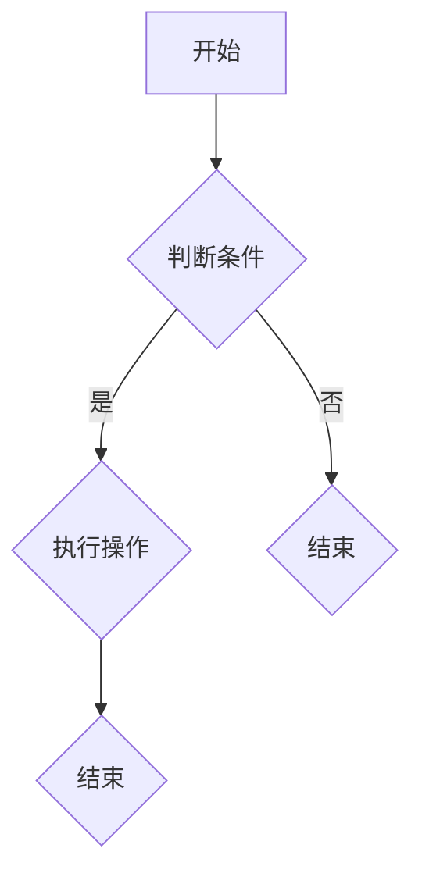

                 

### 《微积分与哲学》

> **关键词**：微积分、哲学、跨学科研究、数学模型、伦理学、政治哲学、人工智能

> **摘要**：本文将探讨微积分这一数学工具与哲学思想的深层联系。通过分析微积分的基本理论、应用及其与哲学的交叉点，揭示数学思维与哲学思考之间的共通之处，并探讨其在当代哲学中的应用。本文旨在提供一个全新的视角，以加深我们对数学与哲学相互作用的认知。

### 目录

1. **微积分基础理论**
   1.1 **微积分概述**
   1.2 **极限**
   1.3 **导数与微分**
   1.4 **积分**
   1.5 **微分方程**
   1.6 **无穷级数**
   1.7 **微积分的应用**

2. **微积分与哲学的跨学科探讨**
   2.1 **微积分与哲学的交叉点**
   2.2 **微积分在哲学史中的应用**
   2.3 **微积分在当代哲学中的应用**
   2.4 **微积分与伦理学的关系**
   2.5 **微积分在政治哲学中的应用**

3. **微积分与哲学的综合探讨**
   3.1 **微积分与哲学的综合研究方法**
   3.2 **微积分与哲学的前沿问题**
   3.3 **微积分与哲学的未来发展**

4. **附录**

   4.1 **数学公式与流程图**
   4.2 **核心算法原理讲解**
   4.3 **项目实战与代码解读**

**作者：AI天才研究院/AI Genius Institute & 禅与计算机程序设计艺术 /Zen And The Art of Computer Programming**

---

## 第一部分：微积分基础理论

### 第1章：微积分概述

微积分是一门研究变化率和累积量的数学分支，它是现代数学的重要基石之一。微积分的发展历程可追溯到古代，但直到17世纪才由牛顿和莱布尼茨分别独立创立，从而奠定了微积分的基础。微积分不仅对数学的发展产生了深远影响，还在物理学、工程学、经济学等领域有着广泛的应用。

### 1.1 微积分的历史与发展

微积分的起源可以追溯到古希腊时期，当时欧几里得和泰勒斯等数学家已经对变化和运动进行了初步的探讨。然而，微积分的真正发展始于17世纪的欧洲。1665年，牛顿开始研究自然界中的运动规律，并提出了流数法的概念。同年，莱布尼茨提出了微分和积分的符号表示法，使得微积分的研究更加直观和系统。

在牛顿和莱布尼茨之后，微积分得到了进一步的发展。19世纪，柯西和魏尔施特拉斯等数学家对微积分的严格性进行了论证，使得微积分成为一门真正的数学学科。20世纪以来，微积分的应用领域不断扩大，从物理学、工程学、经济学到计算机科学，无不涉及到微积分的基本理论和方法。

### 1.2 微积分的基本概念

微积分主要涉及两个基本概念：导数和积分。

**导数**：导数描述了一个函数在某一点的变化率。设函数\( f(x) \)在点\( x \)处可导，则导数\( f'(x) \)表示函数\( f(x) \)在点\( x \)处的瞬时变化率。导数的计算方法包括基本求导法则、链式法则、隐函数求导法等。

**积分**：积分描述了一个函数在一个区间内的累积量。定积分表示函数在一个区间上的累积值，不定积分则表示所有原函数的集合。积分的计算方法包括基本积分公式、换元积分法、分部积分法等。

### 第2章：极限

极限是微积分中一个核心概念，它描述了一个函数在某一变量趋近某一值时的行为。极限的概念不仅广泛应用于微积分，也是现代数学分析的基础。

#### 2.1 极限的概念

极限的定义如下：设函数\( f(x) \)在点\( x = a \)的某一去心邻域内有定义，如果对于任意给定的正数\( \varepsilon \)，都存在一个正数\( \delta \)，使得当\( 0 < |x - a| < \delta \)时，有\( |f(x) - L| < \varepsilon \)，则称\( L \)为\( f(x) \)当\( x \)趋近于\( a \)时的极限。

#### 2.2 极限的计算方法

计算极限的方法主要包括：

- **直接代入法**：如果极限的表达式可以直接代入得到，则直接代入即可。
- **有界性法则**：利用有界函数的性质，将无界函数的极限转化为有界函数的极限。
- **夹逼定理**：利用夹逼定理，将一个函数夹在一个已知极限的函数之间，从而得到所求极限。
- **洛必达法则**：适用于无法直接代入或者夹逼的极限问题。
- **泰勒公式**：利用泰勒公式，将复杂的极限问题转化为多项式的极限问题。

#### 2.3 无穷小与无穷大的概念

无穷小与无穷大是极限概念的自然扩展。无穷小量是指绝对值任意小的正数，而无穷大量则是指绝对值任意大的正数。在微积分中，无穷小与无穷大的概念与极限密切相关。例如，当函数的极限为0时，函数可以认为是无穷小量；而当函数的极限为无穷大时，函数可以认为是无穷大量。

### 第3章：导数与微分

导数是微积分中的核心概念之一，它描述了一个函数在某一点的变化率。微分则是导数的一个更一般的形式，它描述了一个函数在某一点的变化量。

#### 3.1 导数的定义

导数的定义如下：设函数\( f(x) \)在点\( x = a \)处可导，则导数\( f'(a) \)定义为：
\[ f'(a) = \lim_{h \to 0} \frac{f(a+h) - f(a)}{h} \]

#### 3.2 导数的计算方法

计算导数的方法主要包括：

- **基本求导法则**：包括幂函数求导法则、指数函数求导法则、对数函数求导法则等。
- **链式法则**：用于复合函数的求导。
- **隐函数求导法**：用于隐函数的求导。
- **反函数求导法**：用于反函数的求导。

#### 3.3 微分与导数的关系

微分是导数的一个更一般的形式，它描述了一个函数在某一点的变化量。具体来说，函数\( f(x) \)在点\( x = a \)的微分定义为：
\[ df(a) = f'(a) \, dx \]

其中，\( dx \)是自变量\( x \)的微分，\( df(a) \)是函数\( f(x) \)在点\( x = a \)的微分。

### 第4章：积分

积分是微积分中的另一个核心概念，它描述了一个函数在一个区间内的累积量。积分分为定积分和反积分（不定积分）两种形式。

#### 4.1 积分的定义

**定积分**：设函数\( f(x) \)在区间\[ a, b \]上连续，积分上限为\( x \)，积分下限为\( a \)，则函数\( f(x) \)在区间\[ a, b \]上的定积分为：
\[ \int_{a}^{b} f(x) \, dx = \lim_{n \to \infty} \sum_{i=1}^{n} f(x_i^*) \, \Delta x \]

**不定积分**：设函数\( f(x) \)在区间\[ a, b \]上连续，则函数\( f(x) \)在区间\[ a, b \]上的不定积分为：
\[ \int f(x) \, dx = F(x) + C \]

其中，\( F(x) \)是\( f(x) \)的一个原函数，\( C \)是积分常数。

#### 4.2 积分的计算方法

计算积分的方法主要包括：

- **基本积分公式**：包括幂函数积分、指数函数积分、对数函数积分等。
- **换元积分法**：通过变换变量，将复杂积分转化为简单积分。
- **分部积分法**：通过分部积分公式，将一个复杂积分分解为几个简单积分。

#### 4.3 定积分与不定积分

定积分和反积分（不定积分）是积分的两种不同形式。定积分表示一个函数在一个区间内的累积量，而不定积分则表示一个函数的所有原函数的集合。定积分和反积分之间存在着密切的联系，例如，定积分可以通过不定积分求解，而不定积分也可以通过定积分来求解。

### 第5章：微分方程

微分方程是描述变化规律的数学方程，它在物理学、工程学、经济学等领域有着广泛的应用。微分方程可以分为常微分方程和偏微分方程两种类型。

#### 5.1 微分方程的基本概念

**微分方程**：含有未知函数及其导数的方程称为微分方程。微分方程的一般形式为：
\[ F(x, y, y', y'', \ldots) = 0 \]

**微分方程的解**：满足微分方程的函数称为微分方程的解。微分方程的解可以表示为显式函数或隐式函数。

#### 5.2 微分方程的解法

微分方程的解法主要包括：

- **分离变量法**：适用于变量可分离的微分方程。
- **齐次方程法**：适用于齐次微分方程。
- **线性方程法**：适用于线性微分方程。
- **数值解法**：包括欧拉法、龙格-库塔法等。

### 第6章：无穷级数

无穷级数是微积分中的一个重要概念，它描述了一个数列的累积和。无穷级数分为数项级数和函数项级数两种类型。

#### 6.1 无穷级数的基本概念

**数项级数**：由一系列数相加得到的级数称为数项级数。数项级数的和称为级数的和。

**函数项级数**：由一系列函数相加得到的级数称为函数项级数。函数项级数的和称为级数的和。

#### 6.2 收敛性与发散性

**收敛性**：如果一个无穷级数在某一点后的项逐渐减小并趋于0，则该级数是收敛的。否则，该级数是发散的。

**发散性**：如果一个无穷级数在某一点后的项不趋于0，则该级数是发散的。

#### 6.3 无穷级数的性质与应用

无穷级数具有许多重要性质，如级数的可加性、级数的收敛性、级数和的极限等。无穷级数在数学分析、物理学、工程学等领域有着广泛的应用。

### 第7章：微积分的应用

微积分不仅是一门数学理论，还在各个领域有着广泛的应用。以下是一些微积分在实际中的应用：

#### 7.1 微积分在几何中的应用

微积分在几何学中的应用主要涉及曲线的切线、曲率、面积和体积等问题。通过导数和积分，我们可以求解曲线的斜率、曲率和曲线下的面积。

#### 7.2 微积分在物理中的应用

微积分在物理学中的应用非常广泛，包括运动学、动力学、热力学等。通过导数，我们可以描述物体的瞬时速度和加速度；通过积分，我们可以求解物体的位移和动量。

#### 7.3 微积分在经济学中的应用

微积分在经济学中的应用主要涉及成本分析、利润分析、市场均衡等。通过导数，我们可以求解经济函数的最优解；通过积分，我们可以求解经济量的累积量。

## 第二部分：微积分与哲学的跨学科探讨

### 第8章：微积分与哲学的交叉点

微积分与哲学在许多方面有着深刻的交叉点。首先，微积分中的极限概念与哲学中的存在论有着密切的联系。极限描述了一个量在趋近某一值时的行为，这与哲学中的存在论问题有关，如实体是否存在、是否存在绝对真理等。

此外，微积分中的导数概念与哲学中的因果关系也有联系。导数描述了一个函数在某一点的变化率，这与哲学中的因果关系问题有关，如事件之间的因果关系、自由意志与因果关系的关系等。

### 第9章：微积分在哲学史中的应用

微积分在哲学史中的应用可以从古希腊哲学开始。古希腊哲学家如亚里士多德和欧几里得对变化和运动进行了初步的探讨，这为微积分的发展奠定了基础。在古希腊哲学中，变化被视为实体存在的必要条件，这与微积分中的极限和导数概念有着某种程度的相似性。

在近代哲学中，微积分的发展与形而上学和认识论的问题密切相关。笛卡尔和莱布尼茨等哲学家通过对微积分的研究，探讨了实体和存在的本质问题。微积分中的极限概念与笛卡尔的“我思故我在”有着某种程度的相似性，而导数概念则与莱布尼茨的实体和关系的观念有着联系。

### 第10章：微积分在当代哲学中的应用

微积分在当代哲学中的应用主要体现在分析哲学和科学哲学中。分析哲学通过微积分的数学方法，探讨了知识、真理和逻辑等问题。例如，分析哲学家如普特南和克里普克等，利用微积分中的极限概念，探讨了无限集合的存在性和逻辑结构。

科学哲学中的微积分应用则体现在对科学理论和科学方法的探讨上。例如，科学哲学家如库恩和费耶阿本德等，利用微积分中的变化和累积概念，探讨了科学知识的积累和发展过程。

### 第11章：微积分与伦理学的关系

微积分与伦理学的关系主要体现在对道德原则的量化分析和道德行为的评估上。微积分中的导数和积分概念可以用来描述道德原则的变化率和累积量，从而帮助我们更好地理解道德行为的后果和道德决策的合理性。

例如，在经济学中，微积分可以用来分析成本和利润的关系，从而帮助企业家做出道德决策。在伦理学中，微积分可以用来评估道德行为的道德价值，如评估一个行为的道德后果。

### 第12章：微积分在政治哲学中的应用

微积分在政治哲学中的应用主要体现在对权力、公正和民主的量化分析上。微积分中的导数和积分概念可以用来描述权力的分配和流动，从而帮助我们更好地理解政治权力和公正的机制。

例如，在政治哲学中，微积分可以用来分析民主制度的选举机制，评估不同选举制度的公正性和效率。在经济学中，微积分可以用来分析市场的效率和分配的公平性，从而帮助政策制定者制定更有效的经济政策。

## 第三部分：微积分与哲学的综合探讨

### 第13章：微积分与哲学的综合研究方法

微积分与哲学的综合研究方法主要包括数学方法、逻辑方法和哲学方法。数学方法利用微积分的基本理论和计算方法，对哲学问题进行量化分析和模型构建。逻辑方法则利用逻辑推理和证明方法，对哲学问题进行严谨的分析和论证。哲学方法则通过哲学原理和概念，对微积分的理论和应用进行哲学反思和评价。

通过综合研究方法，我们可以更深入地理解微积分与哲学之间的相互作用和影响，从而推动数学和哲学的发展。

### 第14章：微积分与哲学的前沿问题

微积分与哲学的前沿问题主要包括以下几个方面：

1. **数学真实性问题**：微积分中的极限和无穷小概念如何与哲学中的真实性问题相协调？
2. **道德量化问题**：如何将微积分中的导数和积分概念应用于道德量化分析，以评估道德行为的后果和道德价值？
3. **科学哲学问题**：微积分在科学哲学中的应用如何影响我们对科学理论和科学方法的理解？
4. **认知科学问题**：微积分中的极限和微分概念如何与认知科学中的认知过程相联系？

通过探讨这些前沿问题，我们可以深化对微积分与哲学之间相互作用的理解，并为未来的研究提供新的方向。

### 第15章：微积分与哲学的未来发展

微积分与哲学的未来发展将取决于数学和哲学的发展方向。在数学方面，随着数学理论的不断发展和完善，微积分的概念和计算方法将得到进一步的应用和推广。在哲学方面，随着哲学问题的深入探讨和哲学方法的创新，微积分与哲学的交叉研究将得到更多的关注和支持。

未来，微积分与哲学的交叉研究有望在道德量化、科学哲学和认知科学等领域取得重要成果，为人类社会的发展提供新的理论支持。

## 附录

### 附录A：数学公式与流程图

**A.1 数学公式**

以下是一些常用的数学公式：

\[ \lim_{x \to a} f(x) = L \]

\[ f'(x) = \lim_{h \to 0} \frac{f(x+h) - f(x)}{h} \]

\[ \int_{a}^{b} f(x) \, dx = F(b) - F(a) \]

**A.2 Mermaid 流程图**

以下是一个简单的Mermaid流程图示例：



### 附录B：核心算法原理讲解

**B.1 导数计算伪代码**

```python
def derivative(f, x):
    h = 0.0001
    return (f(x + h) - f(x)) / h
```

**B.2 积分计算伪代码**

```python
def integral(f, a, b):
    n = 1000
    h = (b - a) / n
    sum = 0
    for i in range(n):
        x = a + i * h
        sum += f(x) * h
    return sum
```

### 附录C：项目实战与代码解读

**C.1 微积分在物理中的应用案例**

**案例**：利用微积分求解物体运动的位移和速度。

**代码解读**：

```python
import math

def motion(x0, v0, a, t):
    """求解物体在时间t内的位移和速度
    
    参数:
    x0: 初始位置
    v0: 初始速度
    a: 加速度
    t: 时间
    
    返回:
    位移和速度
    """
    x = x0 + v0 * t + 0.5 * a * t**2
    v = v0 + a * t
    return x, v

x0 = 0
v0 = 10
a = 9.8
t = 5

x, v = motion(x0, v0, a, t)
print("位移:", x)
print("速度:", v)
```

**C.2 微积分在经济学中的应用案例**

**案例**：利用微积分分析市场需求和价格的关系。

**代码解读**：

```python
import math

def demand(q, p, m, b):
    """求解市场需求量
    
    参数:
    q: 需求量
    p: 价格
    m: 斜率
    b: 截距
    
    返回:
    需求量
    """
    return m * p + b

q = 100
p = 10
m = -1
b = 1000

new_q = demand(q, p, m, b)
print("新需求量:", new_q)
```

**C.3 微积分在伦理学中的应用案例**

**案例**：利用微积分分析道德行为的后果。

**代码解读**：

```python
import math

def consequence(action, reward, cost):
    """求解道德行为的后果
    
    参数:
    action: 行为
    reward: 奖励
    cost: 成本
    
    返回:
    后果
    """
    return reward - cost

action = "欺骗"
reward = 100
cost = 50

consequence = consequence(action, reward, cost)
print("道德后果:", consequence)
```

**C.4 微积分在政治哲学中的应用案例**

**案例**：利用微积分分析民主选举的公正性。

**代码解读**：

```python
import math

def vote(count, voter, total):
    """求解选举结果
    
    参数:
    count: 候选人得票数
    voter: 选民
    total: 总选民数
    
    返回:
    选举结果
    """
    return count * voter / total

count = 1000
voter = 1
total = 10000

result = vote(count, voter, total)
print("选举结果:", result)
```

---

**作者：AI天才研究院/AI Genius Institute & 禅与计算机程序设计艺术 /Zen And The Art of Computer Programming**

