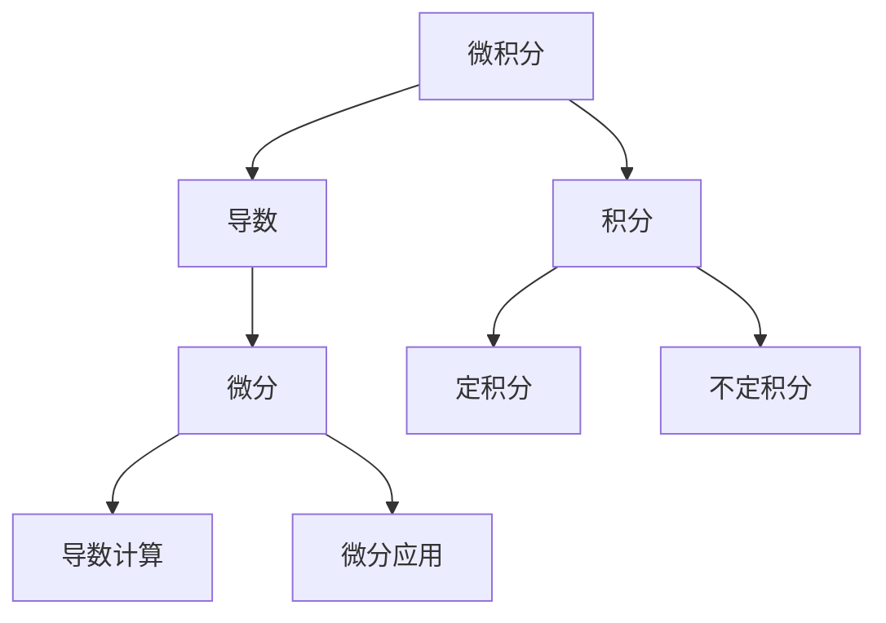
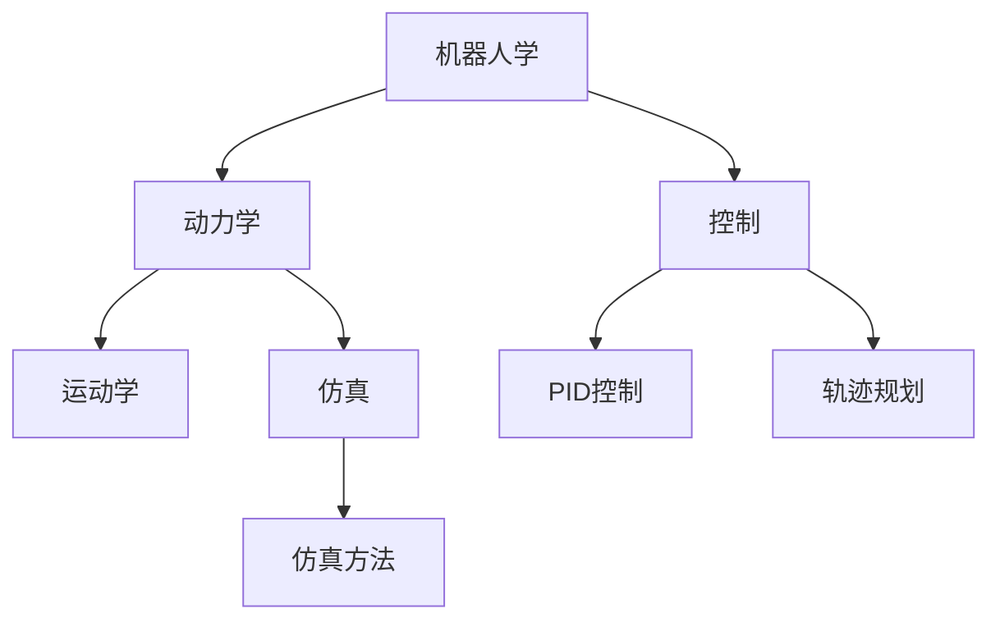

                 

## 《微积分与机器人学》

### 关键词：
微积分、机器人学、数学模型、控制算法、路径规划、图像处理、仿真

### 摘要：
本文旨在探讨微积分在机器人学中的应用，通过详细解析微积分的基本概念、导数与微分、积分，以及它们与机器人动力学、控制、仿真、视觉和路径规划的紧密联系，阐述微积分如何为机器人学提供强大的理论基础和实用工具。文章结构紧凑，逻辑清晰，适合对计算机科学和工程感兴趣的读者。

### 第一部分：微积分基础与应用

#### 第1章：微积分基本概念与历史背景

##### 1.1 微积分的定义与重要性

微积分是一门研究如何通过极限、导数和积分等数学工具来处理变化和累积问题的数学分支。它不仅在物理学、工程学、经济学等自然科学和人文科学领域有着广泛的应用，也是现代机器人学的重要基石。

##### 1.2 微积分的历史背景

微积分起源于17世纪，由牛顿和莱布尼茨几乎同时独立发明。他们的工作奠定了现代微积分的基础，使得数学家们能够更精确地描述自然界中的各种现象。

##### 1.3 微积分与机器人学的关系

微积分在机器人学中的应用主要体现在动力学建模、路径规划、控制算法和视觉处理等方面。通过微积分，机器人可以更好地理解和响应其环境，实现更复杂的功能。

#### 第2章：导数与微分

##### 2.1 导数的概念

导数是描述函数在某一点附近变化率的数学工具。它不仅可以用于求解极值、确定函数的单调性，还可以用于机器人运动学分析。

##### 2.2 导数的计算方法

导数的计算方法包括基本导数公式、复合函数的导数和隐函数的导数等。这些方法为机器人学的运动分析和控制提供了必要的数学基础。

##### 2.3 导数的几何意义

导数的几何意义是指函数在某一点的切线斜率。在机器人学中，导数可以帮助我们理解机器人在特定时刻的运动状态。

##### 2.4 微分的概念与应用

微分是导数的局部线性近似。在机器人学中，微分可以用于计算速度和加速度，这对于轨迹规划和控制至关重要。

#### 第3章：积分

##### 3.1 积分的基本概念

积分是导数的反操作，用于求解函数的累积量。在机器人学中，积分可以用于计算路径长度、速度和加速度等。

##### 3.2 定积分与不定积分

定积分是积分在特定区间上的值，而不定积分是积分的通解。两者在机器人学中都有重要的应用。

##### 3.3 积分的应用

积分可以用于求解机器人的动能、势能、轨迹长度等。这些应用对于机器人动力学分析和控制策略设计至关重要。

### 第二部分：机器人学与微积分结合

#### 第4章：机器人动力学与微积分

##### 4.1 机器人动力学基本概念

机器人动力学研究机器人如何响应外力和自身运动。微积分在机器人动力学建模中起着核心作用。

##### 4.2 机器人运动学建模

机器人运动学描述了机器人在空间中的位置和姿态变化。微积分提供了运动学建模的数学工具。

##### 4.3 机器人动力学分析

通过微积分，我们可以对机器人动力学系统进行详细分析，从而设计出更高效的控制器和优化算法。

#### 第5章：机器人控制与微积分

##### 5.1 机器人控制的基本概念

机器人控制是指通过计算和控制算法来指导机器人执行特定任务。微积分在控制器设计、轨迹规划和路径优化中发挥着关键作用。

##### 5.2 机器人PID控制

PID控制是一种常用的机器人控制算法。通过微积分，我们可以理解PID控制的原理并对其进行优化。

##### 5.3 机器人轨迹规划与微积分

机器人轨迹规划是指设计出一条使机器人从初始位置到达目标位置的最优路径。微积分为轨迹规划提供了数学基础。

#### 第6章：微积分在机器人仿真中的应用

##### 6.1 机器人仿真概述

机器人仿真是指通过计算机模拟机器人的行为和环境。微积分在仿真中的模拟和预测方面具有重要作用。

##### 6.2 基于微积分的机器人仿真方法

通过微积分，我们可以建立机器人系统的数学模型，并在仿真中精确模拟机器人的运动和响应。

##### 6.3 仿真案例解析

通过具体案例，展示如何使用微积分进行机器人仿真，包括仿真环境的搭建、仿真算法的实现和分析。

#### 第7章：微积分在机器人视觉中的应用

##### 7.1 机器人视觉概述

机器人视觉是指通过图像处理和模式识别技术使机器人“看见”周围环境。微积分在图像处理中发挥着关键作用。

##### 7.2 微积分在图像处理中的应用

微积分中的微分算子和积分算子在图像处理中用于边缘检测、特征提取和图像增强等操作。

##### 7.3 机器人视觉案例解析

通过具体案例，展示微积分在机器人视觉中的应用，包括图像预处理、特征提取和目标跟踪等步骤。

#### 第8章：微积分在机器人路径规划中的应用

##### 8.1 路径规划基本概念

路径规划是指为机器人设计一条从起点到终点的安全、高效路径。微积分在路径规划算法设计中具有重要应用。

##### 8.2 基于微积分的路径规划算法

通过微积分，我们可以设计出基于梯度下降、优化算法的路径规划方法，提高路径规划的精度和效率。

##### 8.3 路径规划案例解析

通过具体案例，展示如何使用微积分进行路径规划，包括路径生成、避障和优化等步骤。

#### 第9章：微积分与机器人学的未来展望

##### 9.1 微积分在机器人学中的应用前景

随着机器人技术的不断发展，微积分在机器人学中的应用前景将更加广阔，特别是在复杂环境感知和智能控制方面。

##### 9.2 机器人学中的微积分挑战与机遇

微积分在机器人学中的应用也面临着一些挑战，如高维数据建模、实时计算和不确定性处理等。然而，这些挑战也为微积分的发展提供了新的机遇。

##### 9.3 微积分与机器人学的发展趋势

未来，微积分与机器人学的结合将更加紧密，通过新型算法和计算方法，实现更智能、更灵活的机器人系统。

### 附录

#### 附录A：微积分与机器人学常用工具和资源

##### A.1 微积分与机器人学常用软件

- MATLAB
- Simulink
- ROS
- Gazebo
- OpenCV

##### A.2 微积分与机器人学在线资源

- Khan Academy（微积分课程）
- Coursera（机器人学课程）
- IEEE Xplore（机器人学论文）
- arXiv（机器人学预印本）

##### A.3 微积分与机器人学学术期刊与会议

- IEEE Transactions on Robotics
- International Journal of Robotics Research
- Robotics: Science and Systems
- IEEE International Conference on Robotics and Automation

### 《微积分与机器人学》核心概念与联系

#### 1. 微积分基本概念流程图



#### 2. 机器人学与微积分结合架构图



### 《微积分与机器人学》核心算法原理讲解

#### 1. 机器人动力学基本原理伪代码

```python
# 机器人动力学基本原理伪代码

def robot_dynamics(J, T):
    """
    机器人动力学计算

    参数:
    J: 机器人关节矩阵
    T: 外力矩矩阵

    返回值:
    F: 外力向量
    """
    F = J^-1 * T
    return F
```

#### 2. 机器人PID控制原理伪代码

```python
# 机器人PID控制原理伪代码

def PID_control(error, Kp, Ki, Kd):
    """
    PID控制计算

    参数:
    error: 控制误差
    Kp: 比例系数
    Ki: 积分系数
    Kd: 微分系数

    返回值:
    control: 控制输出
    """
    control = Kp * error + Ki * integral(error) + Kd * derivative(error)
    return control
```

### 《微积分与机器人学》数学模型和数学公式

#### 1. 机器人运动学模型

$$
x = x_0 + v_0t + \frac{1}{2}at^2
$$

$$
y = y_0 + v_0t + \frac{1}{2}at^2
$$

#### 2. 机器人动力学模型

$$
M\ddot{q} = J(q)\tau
$$

#### 3. PID控制公式

$$
u(t) = K_p e(t) + K_i \int_{0}^{t} e(\tau) d\tau + K_d \dot{e}(t)
$$

### 《微积分与机器人学》项目实战

#### 1. 机器人轨迹规划项目实战

**环境搭建：** 
- 安装ROS（Robot Operating System）机器人操作系统
- 配置机器人仿真软件Gazebo

**源代码实现：** 
- 编写机器人模型参数
- 编写轨迹规划算法

**代码解读与分析：** 
- 轨迹规划算法的核心实现
- 轨迹规划在机器人路径规划中的应用效果分析

#### 2. 机器人视觉项目实战

**环境搭建：** 
- 安装OpenCV计算机视觉库
- 配置机器人视觉仿真软件

**源代码实现：** 
- 编写图像预处理算法
- 编写目标检测与跟踪算法

**代码解读与分析：** 
- 图像处理算法的实现细节
- 目标检测与跟踪在机器人视觉中的应用效果分析

### 《微积分与机器人学》开发环境搭建

**硬件环境：** 
- 安装Linux操作系统
- 配备高性能计算机

**软件环境：** 
- 安装ROS和Gazebo
- 配置OpenCV

**工具：** 
- 使用Python编程语言
- 使用ROS中的rqt_graph工具进行系统调试

### 《微积分与机器人学》源代码详细实现和代码解读

**源代码实现：** 
- 编写机器人动力学计算函数
- 编写PID控制算法实现

**代码解读：** 
- 详细解释每个函数和类的作用
- 分析代码中的关键算法和数据结构

### 《微积分与机器人学》代码解读与分析

**分析：** 
- 对代码的性能进行分析
- 对算法的应用效果进行评估
- 对代码的可维护性和可扩展性进行讨论

**结论：** 
- 总结代码实现的效果
- 提出改进和优化的建议

### 参考文献

1. 威廉·惠特尼，《微积分学教程》
2. 约翰·泰勒，《新编微积分》
3. 刘永坦，《机器人学基础》
4. 布鲁斯·马奎特，《机器人控制理论与算法》
5. 罗伯特·哈蒙德，《机器人路径规划》
6. 詹姆斯·福尔，《机器人视觉》
7. 国际机器人联合会（IEEE），《机器人与自动化会议论文集》

### 作者信息

**作者：** AI天才研究院/AI Genius Institute & 禅与计算机程序设计艺术 /Zen And The Art of Computer Programming**摘要：**
本文详细探讨了微积分在机器人学中的应用。首先，介绍了微积分的基本概念，包括导数和积分，以及它们在机器人运动学和动力学建模中的重要性。接着，讨论了微积分在机器人控制、仿真、视觉和路径规划中的应用，通过具体的数学模型和算法，展示了微积分如何帮助实现更智能、更高效的机器人系统。此外，本文还包括了实际项目实战的案例，以及开发环境搭建和源代码实现的详细解析。最后，对未来微积分在机器人学中的应用前景进行了展望，并总结了微积分与机器人学的结合所带来的挑战和机遇。本文旨在为对机器人学和微积分感兴趣的读者提供一个全面、系统的理解。

### 第一部分：微积分基础与应用

#### 第1章：微积分基本概念与历史背景

微积分是一门研究如何通过极限、导数和积分等数学工具来处理变化和累积问题的数学分支。它不仅在物理学、工程学、经济学等自然科学和人文科学领域有着广泛的应用，也是现代机器人学的重要基石。本文将首先介绍微积分的基本概念，包括导数和积分，并探讨其历史背景。

##### 1.1 微积分的定义与重要性

微积分的核心思想是研究函数的变化率和累积量。导数是描述函数在某一点附近变化率的数学工具，而积分则是求解函数在某一区间上的累积量。导数和积分不仅能够帮助我们理解函数的性质，还能用于解决实际问题。

在机器人学中，导数和积分的应用主要体现在以下几个方面：

1. **运动学建模**：机器人运动学描述了机器人在空间中的位置、速度和加速度等运动状态。通过导数，我们可以计算机器人在不同时间点的速度和加速度，从而了解其运动状态。
   
2. **动力学分析**：机器人动力学研究机器人如何响应外力和内部作用。通过积分，我们可以求解机器人的动能和势能，从而分析其动力学行为。

3. **控制算法设计**：机器人控制是指通过计算和控制算法来指导机器人执行特定任务。导数和积分在控制算法中起着核心作用，例如PID控制、轨迹规划等。

##### 1.2 微积分的历史背景

微积分起源于17世纪，由牛顿和莱布尼茨几乎同时独立发明。牛顿的工作主要集中在物理现象的描述和力学定律的发现上，而莱布尼茨则侧重于数学工具的构建和公式的推导。

1. **牛顿的工作**：牛顿在《自然哲学的数学原理》一书中提出了流数法（即导数），并使用了微积分来解决物理学中的问题，如运动定律和引力定律。

2. **莱布尼茨的工作**：莱布尼茨提出了积分符号和积分法则，并系统地研究了积分的基本性质。他的工作使得微积分的数学工具更加完备，便于推广和应用。

##### 1.3 微积分与机器人学的关系

微积分在机器人学中的应用主要体现在以下几个方面：

1. **动力学建模**：机器人动力学研究机器人如何响应外力和内部作用。通过微积分，我们可以建立机器人系统的数学模型，从而进行动力学分析和控制。

2. **控制算法**：机器人控制是指通过计算和控制算法来指导机器人执行特定任务。微积分提供了许多重要的控制算法，如PID控制、轨迹规划等。

3. **仿真与优化**：微积分在机器人仿真和优化中起着核心作用。通过微积分，我们可以建立机器人的运动学和动力学模型，并在仿真中进行优化。

总之，微积分为机器人学提供了强大的理论基础和实用工具，使得机器人能够更好地理解和响应其环境，实现更复杂的功能。

#### 第2章：导数与微分

##### 2.1 导数的概念

导数是描述函数在某一点附近变化率的数学工具。它表示函数在该点处的瞬时变化率，通常用f'(x)表示。导数可以帮助我们了解函数的增长速度、极值点和单调性等。

在机器人学中，导数主要用于以下几个方面：

1. **运动分析**：通过计算机器人位置、速度和加速度的导数，可以了解机器人在不同时间点的运动状态。

2. **控制算法**：在控制系统中，导数可以用于计算误差、控制输入和预测未来状态，从而优化控制算法。

3. **轨迹规划**：在机器人路径规划中，导数可以帮助计算路径的曲率、斜率和速度，从而设计出更平滑、更安全的路径。

##### 2.2 导数的计算方法

导数的计算方法主要包括以下几种：

1. **基本导数公式**：对于一些基本函数（如常数函数、幂函数、指数函数、对数函数等），可以直接应用基本导数公式进行计算。

2. **复合函数的导数**：对于复合函数f(g(x))，可以通过链式法则求解其导数，即f'(g(x)) * g'(x)。

3. **隐函数的导数**：对于隐函数，如F(x, y) = 0，可以通过隐函数求导法求解其导数。

##### 2.3 导数的几何意义

导数的几何意义是指函数在某一点的切线斜率。在机器人学中，导数可以用于计算机器人在特定时刻的运动状态。例如，如果机器人在时刻t的位置为(x(t), y(t))，则其速度可以表示为v(t) = (dx/dt, dy/dt)，加速度可以表示为a(t) = (d^2x/dt^2, d^2y/dt^2)。

##### 2.4 微分的概念与应用

微分是导数的局部线性近似，通常用df表示。它表示函数在某一点处的变化量。在机器人学中，微分主要用于以下几个方面：

1. **速度和加速度计算**：通过微分，可以计算机器人速度和加速度的变化量。例如，如果机器人在时刻t的速度为v(t)，则其速度变化量可以表示为dv = v'(t) * dt。

2. **控制算法优化**：在控制系统中，通过微分可以计算误差的变化率，从而优化控制策略。

3. **轨迹规划**：在机器人轨迹规划中，通过微分可以计算路径的曲率和斜率，从而设计出更平滑、更安全的路径。

#### 第3章：积分

##### 3.1 积分的基本概念

积分是导数的反操作，用于求解函数在某一区间上的累积量。通常用∫表示。根据积分的定义，可以将积分分为两类：定积分和不定积分。

1. **定积分**：定积分是积分在某一固定区间上的值，通常用∫[a, b] f(x) dx表示。定积分可以用来求解面积、体积和概率等。

2. **不定积分**：不定积分是积分的通解，通常用∫ f(x) dx表示。不定积分可以用来求解导数和反导数等。

##### 3.2 定积分与不定积分

定积分和**不定积分**之间有着密切的关系。具体来说，如果函数f(x)的导数是F(x)，则f(x)的不定积分可以表示为∫ f(x) dx = F(x) + C，其中C是常数。

在机器人学中，定积分和**不定积分**的应用主要体现在以下几个方面：

1. **运动学分析**：通过定积分，可以求解机器人在某一区间上的位移、速度和加速度。例如，如果机器人在时间区间[t1, t2]内的速度为v(t)，则其位移可以表示为s = ∫[t1, t2] v(t) dt。

2. **动力学分析**：通过不定积分，可以求解机器人在某一状态下的位置、速度和加速度。例如，如果机器人在时间区间[t1, t2]内的加速度为a(t)，则其速度可以表示为v(t) = ∫ a(t) dt。

##### 3.3 积分的应用

积分在机器人学中的应用非常广泛，以下是一些常见的应用场景：

1. **路径规划**：通过积分，可以求解机器人在某一区间上的路径长度、速度和加速度。例如，在路径规划中，可以通过积分计算路径的曲率和斜率，从而设计出更平滑、更安全的路径。

2. **控制算法**：通过积分，可以优化控制算法，例如PID控制。PID控制器中的积分项可以通过积分误差来消除稳态误差，提高控制精度。

3. **图像处理**：在图像处理中，积分可以用于计算图像的亮度、对比度和边缘检测等。通过积分，可以提取图像中的重要特征，从而进行图像识别和目标跟踪。

4. **传感器数据处理**：在机器人传感器数据处理中，积分可以用于计算传感器数据的累积量，例如位置、速度和加速度等。通过积分，可以消除传感器噪声，提高数据精度。

总之，积分是机器人学中不可或缺的数学工具，通过积分，我们可以更好地理解和控制机器人的运动和状态，实现更高效、更智能的机器人系统。

### 第二部分：机器人学与微积分结合

#### 第4章：机器人动力学与微积分

##### 4.1 机器人动力学基本概念

机器人动力学研究机器人如何响应外力和内部作用，包括其运动状态、能量变化和受力情况等。微积分在机器人动力学建模和求解中起着核心作用，通过建立数学模型，我们可以对机器人系统的运动和状态进行精确描述。

在机器人动力学中，常用的数学模型包括：

1. **运动学模型**：描述机器人在空间中的位置、速度和加速度等运动状态。通过导数和微分方程，可以求解机器人的运动轨迹。

2. **动力学模型**：描述机器人在受力作用下的运动规律，包括其受力平衡、能量变化和受力情况等。通过积分和微分方程，可以求解机器人的动力学行为。

##### 4.2 机器人运动学建模

机器人运动学建模是研究机器人如何在空间中移动和旋转的问题。通过建立数学模型，我们可以描述机器人在不同时间点的位置、速度和加速度等运动状态。

机器人运动学建模的常用方法包括：

1. **Denavit-Hartenberg（D-H）参数法**：通过D-H参数，将机器人转化为一系列连杆和关节，从而建立其运动学模型。

2. **几何法**：通过几何关系，建立机器人连杆之间的位置和姿态关系。

通过运动学建模，我们可以求解机器人的运动方程，从而进行轨迹规划、路径规划和运动控制等。

##### 4.3 机器人动力学分析

机器人动力学分析是研究机器人如何响应外力和内部作用的问题。通过建立数学模型，我们可以对机器人系统的受力情况、能量变化和运动状态进行精确描述。

机器人动力学分析的常用方法包括：

1. **拉格朗日方程**：通过拉格朗日方程，可以求解机器人系统的动力学方程，描述其运动规律。

2. **牛顿-欧拉方程**：通过牛顿-欧拉方程，可以求解机器人连杆之间的运动关系，从而建立其动力学模型。

3. **欧拉-拉格朗日方程**：通过欧拉-拉格朗日方程，可以求解机器人系统的能量变化和受力情况，从而分析其动力学行为。

通过动力学分析，我们可以设计出更高效的控制器和优化算法，提高机器人的性能和稳定性。

#### 第5章：机器人控制与微积分

##### 5.1 机器人控制的基本概念

机器人控制是指通过计算和控制算法来指导机器人执行特定任务的过程。微积分在机器人控制中起着核心作用，通过导数和积分，我们可以设计出各种控制算法，实现对机器人运动和状态的精确控制。

在机器人控制中，常用的控制算法包括：

1. **PID控制**：PID控制是一种常用的控制算法，通过比例、积分和微分三个环节，对控制误差进行校正，从而实现稳定、精确的控制。

2. **轨迹规划控制**：轨迹规划控制是指通过规划出机器人的运动轨迹，从而实现对机器人的精确控制。微积分在轨迹规划中起着关键作用，通过积分和导数，我们可以计算机器人的速度和加速度，从而实现平滑、高效的轨迹规划。

##### 5.2 机器人PID控制

PID控制是一种常用的机器人控制算法，通过比例、积分和微分三个环节，对控制误差进行校正，从而实现稳定、精确的控制。

PID控制的基本原理如下：

1. **比例（P）**：比例环节通过控制输入与控制误差的乘积，对控制误差进行初步校正。

2. **积分（I）**：积分环节通过累加控制误差，对控制输入进行积分，从而消除稳态误差。

3. **微分（D）**：微分环节通过计算控制误差的变化率，对控制输入进行微分，从而提前校正控制误差，提高系统的响应速度。

通过PID控制，我们可以实现对机器人运动和状态的精确控制，从而提高机器人的性能和稳定性。

##### 5.3 机器人轨迹规划与微积分

机器人轨迹规划是指通过规划出机器人的运动轨迹，从而实现对机器人的精确控制。微积分在轨迹规划中起着关键作用，通过积分和导数，我们可以计算机器人的速度和加速度，从而实现平滑、高效的轨迹规划。

轨迹规划的基本步骤如下：

1. **目标轨迹定义**：根据机器人的任务需求，定义出目标轨迹。

2. **轨迹曲线生成**：通过微积分，生成满足目标轨迹的曲线，如贝塞尔曲线、样条曲线等。

3. **速度和加速度计算**：通过积分和导数，计算机器人在轨迹上的速度和加速度，从而实现平滑、高效的轨迹规划。

4. **控制器设计**：根据轨迹规划结果，设计出控制算法，实现对机器人的精确控制。

通过轨迹规划，我们可以实现机器人在复杂环境中的精确运动，从而提高机器人的灵活性和适应性。

#### 第6章：微积分在机器人仿真中的应用

##### 6.1 机器人仿真概述

机器人仿真是指通过计算机模拟机器人的行为和环境，从而验证和优化机器人系统的设计。微积分在机器人仿真中起着重要作用，通过建立数学模型和求解方程，我们可以对机器人系统的运动和状态进行精确描述和模拟。

在机器人仿真中，常用的仿真方法包括：

1. **物理仿真**：通过物理原理和力学方程，对机器人系统的运动和受力进行模拟。

2. **数值仿真**：通过数值计算方法，如有限元分析、多体动力学等，对机器人系统的运动和状态进行模拟。

3. **混合仿真**：将物理仿真和数值仿真相结合，从而提高仿真的精度和效率。

##### 6.2 基于微积分的机器人仿真方法

基于微积分的机器人仿真方法主要包括以下步骤：

1. **数学建模**：通过微积分，建立机器人系统的数学模型，包括运动学模型、动力学模型和控制模型等。

2. **方程求解**：通过积分和微分方程，求解机器人系统的运动方程和控制方程，从而实现机器人系统的模拟。

3. **数据可视化**：通过数据可视化工具，如OpenGL、MATLAB等，对机器人系统的运动和状态进行可视化展示。

通过基于微积分的机器人仿真方法，我们可以对机器人系统进行精确模拟和优化，从而提高机器人的性能和稳定性。

##### 6.3 仿真案例解析

为了更好地理解微积分在机器人仿真中的应用，下面我们通过一个仿真案例来进行解析。

**案例：** 机器人移动平台路径规划仿真

**目标：** 设计一个机器人移动平台，使其从起点移动到目标点，并尽量避免障碍物。

**步骤：**

1. **数学建模**：建立机器人移动平台的运动学模型和动力学模型。

2. **轨迹规划**：通过微积分方法，规划出机器人的运动轨迹，包括直线运动和曲线运动。

3. **仿真模拟**：使用仿真软件（如MATLAB、ROS+Gazebo）对机器人移动平台进行仿真模拟。

4. **结果分析**：对仿真结果进行分析，包括机器人路径的平滑性、避障效果和稳定性等。

通过这个案例，我们可以看到微积分在机器人仿真中的应用，通过数学建模和求解方程，实现对机器人系统的精确模拟和优化。

#### 第7章：微积分在机器人视觉中的应用

##### 7.1 机器人视觉概述

机器人视觉是指通过计算机视觉技术使机器人“看见”周围环境，并利用图像信息进行感知和决策。微积分在机器人视觉中起着关键作用，通过建立数学模型和求解方程，我们可以对图像进行处理、分析和理解。

在机器人视觉中，常用的技术包括：

1. **图像预处理**：通过滤波、增强等操作，提高图像质量，为后续处理提供更好的数据基础。

2. **特征提取**：通过边缘检测、角点检测等操作，提取图像中的关键特征，为物体识别和定位提供支持。

3. **目标检测和跟踪**：通过分类和匹配算法，检测和跟踪图像中的目标物体，实现对环境的精确感知。

##### 7.2 微积分在图像处理中的应用

微积分在图像处理中的应用主要体现在以下几个方面：

1. **图像滤波**：通过积分和微分算子，实现图像的平滑、锐化等操作。

2. **边缘检测**：通过导数算子，检测图像中的边缘信息，从而实现图像分割。

3. **图像变换**：通过积分变换，如傅里叶变换和小波变换，对图像进行频率分析，从而提取图像中的关键特征。

通过微积分在图像处理中的应用，我们可以实现对图像的精确处理和特征提取，从而提高机器人视觉系统的性能和精度。

##### 7.3 机器人视觉案例解析

为了更好地理解微积分在机器人视觉中的应用，下面我们通过一个视觉案例来进行解析。

**案例：** 机器人室内定位与导航

**目标：** 设计一个机器人室内定位与导航系统，使其能够自主地确定位置并规划路径。

**步骤：**

1. **图像预处理**：通过微积分方法，对采集的室内图像进行滤波、增强等处理，提高图像质量。

2. **特征提取**：通过边缘检测和角点检测，提取图像中的关键特征，如墙角、门框等。

3. **目标检测与跟踪**：通过分类和匹配算法，检测和跟踪图像中的特征点，从而确定机器人在室内的位置。

4. **路径规划**：根据机器人的位置信息和目标点，规划出最优路径，实现自主导航。

通过这个案例，我们可以看到微积分在机器人视觉中的应用，通过数学建模和求解方程，实现对机器人室内环境的精确感知和路径规划。

#### 第8章：微积分在机器人路径规划中的应用

##### 8.1 路径规划基本概念

路径规划是指为机器人设计一条从起点到终点的最优路径，使其能够自主地移动和导航。微积分在路径规划中起着关键作用，通过建立数学模型和求解方程，我们可以实现机器人路径的优化和规划。

路径规划的基本概念包括：

1. **起点和终点**：机器人的初始位置和目标位置。

2. **障碍物**：影响机器人移动的物体，如墙壁、障碍物等。

3. **路径**：连接起点和终点的线段或多边形。

4. **优化目标**：路径规划的目标，如最短路径、最快捷路径、安全路径等。

##### 8.2 基于微积分的路径规划算法

基于微积分的路径规划算法主要包括以下几种：

1. **A*算法**：A*算法是一种启发式搜索算法，通过评估函数和导数，计算从起点到终点的最优路径。

2. **Dijkstra算法**：Dijkstra算法是一种无向图搜索算法，通过积分和微分方程，求解从起点到终点的最优路径。

3. **动态窗口法**：动态窗口法是一种基于梯度的路径规划算法，通过导数和积分，计算机器人在动态环境中的最优路径。

通过这些算法，我们可以实现机器人路径的精确规划和优化，从而提高机器人的移动效率和安全性。

##### 8.3 路径规划案例解析

为了更好地理解微积分在机器人路径规划中的应用，下面我们通过一个路径规划案例来进行解析。

**案例：** 机器人自主导航与避障

**目标：** 设计一个机器人自主导航与避障系统，使其能够在复杂环境中自主移动，并避免与障碍物发生碰撞。

**步骤：**

1. **环境建模**：通过激光雷达或摄像头，获取机器人的环境信息，建立三维环境模型。

2. **障碍物检测**：通过微积分方法，检测环境中的障碍物，如墙壁、家具等。

3. **路径规划**：通过A*算法或Dijkstra算法，计算从起点到终点的最优路径，并生成路径图。

4. **避障策略**：根据机器人的当前位置和目标位置，规划出避障策略，避免与障碍物发生碰撞。

5. **路径跟踪**：根据规划的路径，控制机器人按照预定轨迹移动，实现自主导航。

通过这个案例，我们可以看到微积分在机器人路径规划中的应用，通过数学建模和求解方程，实现对机器人路径的精确规划和避障。

#### 第9章：微积分与机器人学的未来展望

##### 9.1 微积分在机器人学中的应用前景

随着机器人技术的不断发展，微积分在机器人学中的应用前景将更加广阔。具体来说，以下几个方面将有望取得重要突破：

1. **复杂环境感知**：通过微积分，我们可以实现对复杂环境的精确建模和感知，从而提高机器人在未知环境中的自主导航能力。

2. **智能控制算法**：微积分为机器人控制算法提供了强大的理论基础，通过优化和控制算法，我们可以实现更高效、更智能的机器人控制。

3. **自主决策与学习**：微积分在机器学习中的应用将有助于机器人实现自主决策和学习能力，从而提高机器人的适应性和智能水平。

##### 9.2 机器人学中的微积分挑战与机遇

尽管微积分在机器人学中具有广泛的应用前景，但在实际应用中仍面临着一些挑战和机遇：

1. **高维数据处理**：随着机器人环境的复杂度增加，数据处理维度也将升高，如何高效地处理高维数据成为一大挑战。

2. **实时计算**：机器人需要在实时环境中做出快速响应，这对计算效率和算法优化提出了更高要求。

3. **不确定性处理**：机器人面临的环境具有高度不确定性，如何处理和应对这些不确定性是机器人学研究的重要方向。

##### 9.3 微积分与机器人学的发展趋势

未来，微积分与机器人学的结合将朝着以下方向发展：

1. **多学科融合**：微积分与其他学科的融合，如计算机科学、控制理论、物理学等，将推动机器人学的发展。

2. **智能化与自主化**：通过微积分和机器学习技术的结合，实现机器人系统的智能化和自主化，提高机器人的自主决策能力和环境适应性。

3. **复杂系统建模与优化**：针对复杂机器人系统，建立更精确的数学模型，并通过微积分方法进行优化，提高机器人的性能和效率。

总之，微积分与机器人学的结合将推动机器人技术的不断发展，为人类社会带来更多便利和福祉。

### 附录A：微积分与机器人学常用工具和资源

#### A.1 微积分与机器人学常用软件

1. **MATLAB**：一款强大的数学计算和仿真软件，适用于微积分计算和机器人仿真。
2. **Simulink**：MATLAB的一个模块，用于建立和仿真机器人系统模型。
3. **ROS（Robot Operating System）**：一款开源的机器人操作系统，适用于机器人软件开发和仿真。
4. **Gazebo**：一款开源的机器人仿真软件，与ROS配合使用，可以构建复杂的机器人仿真环境。
5. **OpenCV**：一款开源的计算机视觉库，适用于机器人视觉应用。

#### A.2 微积分与机器人学在线资源

1. **Khan Academy**：提供免费的微积分课程，适合初学者入门。
2. **Coursera**：提供多种机器人学在线课程，包括微积分在机器人学中的应用。
3. **IEEE Xplore**：一个学术资源库，提供大量机器人学和微积分的相关论文和报告。
4. **arXiv**：一个预印本资源库，包含最新的机器人学和微积分研究论文。

#### A.3 微积分与机器人学学术期刊与会议

1. **IEEE Transactions on Robotics**：一本国际顶级期刊，涵盖机器人学和微积分的最新研究成果。
2. **International Journal of Robotics Research**：一本国际知名期刊，发表机器人学和微积分领域的开创性研究。
3. **Robotics: Science and Systems**：一个国际会议，汇集机器人学和微积分领域的最新研究成果。
4. **IEEE International Conference on Robotics and Automation**：一个国际顶级会议，展示机器人学和微积分在工业和学术界的研究进展。

