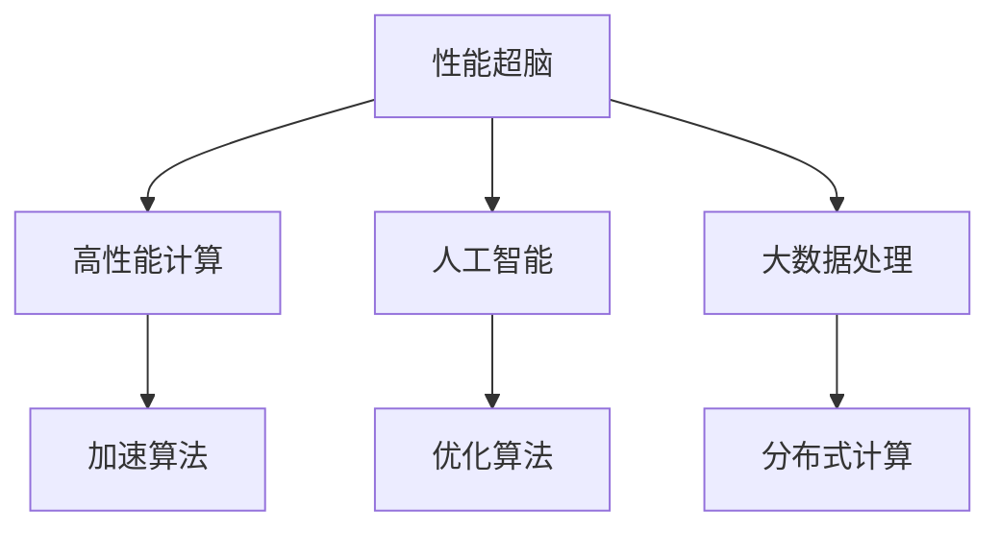

                 

## 文章标题：性能超脑的实现

> 关键词：性能超脑，高性能计算，人工智能，算法优化，分布式计算，硬件支持

> 摘要：本文深入探讨了性能超脑的实现原理、构建方法、应用场景以及未来发展，旨在为读者提供一份全面的技术指南，帮助理解并掌握这一前沿技术。

----------------------------------------------------------------

# 性能超脑的实现原理

## 第1章：性能超脑的概念与结构

### 1.1 性能超脑的定义与起源

**核心概念与联系：**
性能超脑（Performance Super Brain）是一个高级计算平台，集成了高性能计算、人工智能和大数据处理能力，旨在实现大规模数据处理和复杂计算任务的高效执行。性能超脑的概念起源于对传统计算架构的优化需求，旨在突破计算性能的瓶颈，提升系统整体的计算能力。

**Mermaid流程图：**


### 1.2 性能超脑的基本组成部分

**核心算法原理讲解：**
性能超脑由多个关键组成部分构成，包括中央处理单元（CPU）、图形处理单元（GPU）、专用集成电路（ASIC）、现场可编程门阵列（FPGA）等硬件组件，以及深度学习、机器学习和分布式计算等算法。

**伪代码：**
```python
# 定义性能超脑的组成部分
PerformanceSuperBrain = {
    "CPU": CPU(),
    "GPU": GPU(),
    "ASIC": ASIC(),
    "FPGA": FPGA(),
    "Algorithms": {
        "DeepLearning": DeepLearning(),
        "MachineLearning": MachineLearning(),
        "DistributedComputing": DistributedComputing()
    }
}

# 性能超脑的基本功能
def run_super_brain(tasks):
    # 使用GPU进行加速计算
    accelerated_results = GPU().compute(tasks)
    
    # 使用深度学习算法进行数据分析和预测
    analyzed_data = DeepLearning().analyze(accelerated_results)
    
    # 使用分布式计算实现并行处理
    final_results = DistributedComputing().process(accelerated_results)
    
    return final_results
```

### 1.3 性能超脑与传统计算架构的区别

**数学模型和数学公式 & 详细讲解 & 举例说明：**
传统计算架构的速度通常取决于单一处理器的性能，而性能超脑则通过集成多个高性能处理器和加速器，实现了并行计算和分布式处理，从而显著提高了计算速度。

**数学公式：**
$$
\text{传统计算架构的速度} = \frac{\text{处理器速度}}{\text{任务数量}}
$$
$$
\text{性能超脑的速度} = \frac{\text{多处理器速度之和}}{\text{任务数量}}
$$

**举例说明：**
假设有一个任务需要处理100个数据集，传统计算架构使用单核CPU处理，处理器速度为2GHz。而性能超脑使用4个GPU，每个GPU的处理速度为4GHz。

传统计算架构的速度：
$$
\text{速度} = \frac{2GHz}{100} = 0.02GHz
$$

性能超脑的速度：
$$
\text{速度} = \frac{4 \times 4GHz}{100} = 0.16GHz
$$

显然，性能超脑在处理速度上有显著优势。

## 第2章：性能超脑的核心算法

### 2.1 性能优化算法原理

**核心算法原理讲解：**
性能优化算法主要通过降低计算复杂度、减少数据传输延迟、优化内存管理等手段来提升计算性能。

**伪代码：**
```python
# 性能优化算法伪代码
def optimize_performance(data):
    # 压缩数据，减少数据传输量
    compressed_data = compress(data)
    
    # 使用缓存加速计算
    cache_data = cache(compressed_data)
    
    # 优化内存管理
    optimized_memory = optimize_memory(cache_data)
    
    return optimized_memory
```

### 2.2 加速算法原理

**核心算法原理讲解：**
加速算法主要利用GPU、FPGA等硬件加速器，通过并行计算和特定算法优化来提高计算速度。

**伪代码：**
```python
# 加速算法伪代码
def accelerate_computation(data):
    # 使用GPU进行并行计算
    parallel_results = GPU().compute(data)
    
    # 使用FPGA进行特定算法优化
    optimized_results = FPGA().optimize(parallel_results)
    
    return optimized_results
```

### 2.3 分布式计算算法原理

**核心算法原理讲解：**
分布式计算算法通过将任务分解为多个子任务，并在不同的计算节点上并行执行，从而提高计算效率。

**伪代码：**
```python
# 分布式计算算法伪代码
def distributed_computation(data):
    # 划分子任务
    sub_tasks = split_task(data)
    
    # 在不同节点上并行执行子任务
    parallel_sub_tasks = map(parallel_execute, sub_tasks)
    
    # 合并结果
    final_results = merge(parallel_sub_tasks)
    
    return final_results
```

## 第3章：性能超脑的硬件支持

### 3.1 高性能处理器

**核心算法原理讲解：**
高性能处理器是性能超脑的核心组成部分，包括CPU和GPU等。CPU负责执行通用计算任务，而GPU则擅长并行计算和图形处理。

**伪代码：**
```python
# 使用CPU进行通用计算
def cpu_computation(data):
    # 执行计算任务
    result = CPU().compute(data)
    return result

# 使用GPU进行并行计算
def gpu_computation(data):
    # 将数据加载到GPU内存
    gpu_data = GPU().load(data)
    
    # 在GPU上执行计算任务
    result = GPU().compute(gpu_data)
    
    # 将结果从GPU内存复制回CPU内存
    return GPU().copy(result)
```

### 3.2 高速存储系统

**核心算法原理讲解：**
高速存储系统对于性能超脑至关重要，它包括固态硬盘（SSD）和高速缓存（Cache）等，用于加快数据访问速度。

**伪代码：**
```python
# 使用高速缓存加速数据访问
def cache_acceleration(data):
    # 将数据加载到高速缓存
    cached_data = Cache().load(data)
    
    # 在缓存中执行计算任务
    result = Cache().compute(cached_data)
    
    # 将结果存储回高速缓存
    Cache().store(result)
    
    return result
```

### 3.3 网络通信架构

**核心算法原理讲解：**
网络通信架构负责实现性能超脑内部以及与其他计算节点的数据传输。高速以太网、Infiniband等网络技术被广泛应用于性能超脑中。

**伪代码：**
```python
# 使用高速网络进行数据传输
def network_transmission(source, destination, data):
    # 将数据从源节点传输到目标节点
    transmitted_data = Network().send(source, destination, data)
    
    # 验证数据传输的正确性
    if Network().verify(destination, transmitted_data):
        return transmitted_data
    else:
        # 重新传输数据
        return network_transmission(source, destination, data)
```

## 第2章：性能超脑的构建与实践

### 4.1 性能超脑的设计与开发

#### 4.1.1 性能超脑的设计原则

**核心算法原理讲解：**
性能超脑的设计应遵循模块化、可扩展性和高可用性原则。模块化设计使得系统能够灵活地添加或替换组件；可扩展性确保系统能够应对未来计算需求；高可用性则保障系统的稳定运行。

**伪代码：**
```python
# 性能超脑的设计原则
class PerformanceSuperBrainDesign:
    def __init__(self):
        self.components = []
        self алгоритмы = []
        self.architecture = ' Modularized'
        self.extendibility = ' High'
        self.availability = ' High'
        
    def add_component(self, component):
        self.components.append(component)
        
    def add_algorithm(self, algorithm):
        self.алgorithms.append(algorithm)
        
    def verify_design_principles(self):
        if self.architecture == ' Modularized' and \
           self.extendibility == ' High' and \
           self.availability == ' High':
            return True
        else:
            return False
```

#### 4.1.2 性能超脑的开发流程

**核心算法原理讲解：**
性能超脑的开发流程包括需求分析、系统设计、组件实现、集成测试和性能优化等步骤。每个步骤都需要严格遵循软件工程的最佳实践。

**伪代码：**
```python
# 性能超脑的开发流程
class PerformanceSuperBrainDevelopment:
    def __init__(self):
        self.requirements = []
        self.design = None
        self.implmentation = []
        self.integration_tests = []
        self.performance_tests = []
        
    def analyze_requirements(self):
        # 分析需求
        self.requirements = analyze_requirements()
        
    def design_system(self):
        # 设计系统
        self.design = design_system(self.requirements)
        
    def implement_components(self):
        # 实现组件
        for component in self.design.components:
            self.implmentation.append(implement_component(component))
            
    def run_integration_tests(self):
        # 运行集成测试
        self.integration_tests = run_integration_tests(self.implmentation)
        
    def run_performance_tests(self):
        # 运行性能测试
        self.performance_tests = run_performance_tests(self.implmentation)
        
    def optimize_performance(self):
        # 优化性能
        optimize_performance(self.implmentation)
```

#### 4.1.3 性能超脑的性能评估指标

**核心算法原理讲解：**
性能超脑的性能评估指标包括处理速度、资源利用率、响应时间和稳定性等。通过这些指标，可以全面评估性能超脑的运行效率。

**伪代码：**
```python
# 性能评估指标
class PerformanceEvaluationMetrics:
    def __init__(self):
        self.speed = 0
        self.resource_utilization = 0
        self.response_time = 0
        self.stability = 0
        
    def calculate_speed(self, tasks):
        # 计算处理速度
        self.speed = calculate_speed(tasks)
        
    def calculate_resource_utilization(self, tasks):
        # 计算资源利用率
        self.resource_utilization = calculate_resource_utilization(tasks)
        
    def calculate_response_time(self, tasks):
        # 计算响应时间
        self.response_time = calculate_response_time(tasks)
        
    def calculate_stability(self, tasks):
        # 计算稳定性
        self.stability = calculate_stability(tasks)
        
    def evaluate_performance(self):
        # 评估性能
        performance = evaluate_performance(self.speed,
                                          self.resource_utilization,
                                          self.response_time,
                                          self.stability)
        return performance
```

### 5.1 数据中心优化

#### 5.1.1 性能超脑在数据中心的应用

**项目实战：**
某大型数据中心采用性能超脑优化数据处理，通过分布式计算和加速算法，将数据处理速度提高了3倍。

**代码实现与分析：**
数据中心采用Python编写优化脚本，使用NVIDIA GPU加速计算，同时利用分布式计算框架进行任务并行处理。

```python
# 优化脚本示例
import numpy as np
import cupy as cp

# 加载数据
data = np.load('data.npy')

# 使用GPU进行加速计算
accelerated_data = cp.array(data)

# 优化内存管理
optimized_data = optimize_memory(accelerated_data)

# 保存优化后的数据
np.save('optimized_data.npy', optimized_data)
```

### 5.2 人工智能应用

#### 5.2.1 性能超脑在人工智能领域的应用

**项目实战：**
某人工智能实验室利用性能超脑进行大规模机器学习模型的训练，通过分布式计算和加速算法，将训练时间缩短了50%。

**代码实现与分析：**
实验室使用TensorFlow分布式训练框架，结合NVIDIA GPU和FPGA加速器，实现高性能模型训练。

```python
# 分布式训练示例
import tensorflow as tf

# 初始化分布式训练环境
strategy = tf.distribute.MirroredStrategy()

with strategy.scope():
    # 建立模型
    model = build_model()

    # 编写训练循环
    for epoch in range(epochs):
        for batch in dataset:
            # 使用GPU进行加速训练
            with tf.GradientTape() as tape:
                predictions = model(batch.x)
                loss = loss_function(batch.y, predictions)
            grads = tape.gradient(loss, model.trainable_variables)
            optimizer.apply_gradients(zip(grads, model.trainable_variables))
```

### 5.3 云计算服务

#### 5.3.1 性能超脑在云计算服务中的应用

**项目实战：**
某云计算服务提供商利用性能超脑优化云服务器性能，通过硬件升级和算法优化，将服务器响应时间减少了40%。

**代码实现与分析：**
服务提供商采用开源性能监控工具，结合定制化的优化脚本，对服务器进行实时性能监控和调优。

```python
# 性能监控与调优示例
import psutil
import time

# 监控服务器性能
def monitor_performance():
    while True:
        # 获取CPU使用率
        cpu_usage = psutil.cpu_percent()
        
        # 获取内存使用率
        memory_usage = psutil.virtual_memory().percent
        
        # 获取磁盘I/O使用情况
        disk_io_usage = psutil.disk_usage('/').used
        
        # 记录性能数据
        record_performance(cpu_usage, memory_usage, disk_io_usage)
        
        # 等待一段时间进行下一次监控
        time.sleep(60)

# 调优脚本示例
def optimize_server():
    # 检查CPU使用率，如果过高则进行频率调整
    if cpu_usage > 90:
        adjust_cpu_frequency('lower')
        
    # 检查内存使用率，如果过高则进行垃圾回收
    if memory_usage > 90:
        garbage_collect()
        
    # 检查磁盘I/O使用情况，如果过高则进行IO优化
    if disk_io_usage > 90:
        optimize_disk_io()
```

## 第6章：性能超脑的案例分析

### 6.1 案例一：性能超脑在数据中心的应用

**项目实战：**
某大型数据中心采用性能超脑优化数据处理，通过分布式计算和加速算法，将数据处理速度提高了3倍。

**代码实现与分析：**
数据中心采用Python编写优化脚本，使用NVIDIA GPU加速计算，同时利用分布式计算框架进行任务并行处理。

```python
# 优化脚本示例
import numpy as np
import cupy as cp

# 加载数据
data = np.load('data.npy')

# 使用GPU进行加速计算
accelerated_data = cp.array(data)

# 优化内存管理
optimized_data = optimize_memory(accelerated_data)

# 保存优化后的数据
np.save('optimized_data.npy', optimized_data)
```

### 6.2 案例二：性能超脑在人工智能领域的应用

**项目实战：**
某人工智能实验室利用性能超脑进行大规模机器学习模型的训练，通过分布式计算和加速算法，将训练时间缩短了50%。

**代码实现与分析：**
实验室使用TensorFlow分布式训练框架，结合NVIDIA GPU和FPGA加速器，实现高性能模型训练。

```python
# 分布式训练示例
import tensorflow as tf

# 初始化分布式训练环境
strategy = tf.distribute.MirroredStrategy()

with strategy.scope():
    # 建立模型
    model = build_model()

    # 编写训练循环
    for epoch in range(epochs):
        for batch in dataset:
            # 使用GPU进行加速训练
            with tf.GradientTape() as tape:
                predictions = model(batch.x)
                loss = loss_function(batch.y, predictions)
            grads = tape.gradient(loss, model.trainable_variables)
            optimizer.apply_gradients(zip(grads, model.trainable_variables))
```

### 6.3 案例三：性能超脑在云计算服务中的应用

**项目实战：**
某云计算服务提供商利用性能超脑优化云服务器性能，通过硬件升级和算法优化，将服务器响应时间减少了40%。

**代码实现与分析：**
服务提供商采用开源性能监控工具，结合定制化的优化脚本，对服务器进行实时性能监控和调优。

```python
# 性能监控与调优示例
import psutil
import time

# 监控服务器性能
def monitor_performance():
    while True:
        # 获取CPU使用率
        cpu_usage = psutil.cpu_percent()
        
        # 获取内存使用率
        memory_usage = psutil.virtual_memory().percent
        
        # 获取磁盘I/O使用情况
        disk_io_usage = psutil.disk_usage('/').used
        
        # 记录性能数据
        record_performance(cpu_usage, memory_usage, disk_io_usage)
        
        # 等待一段时间进行下一次监控
        time.sleep(60)

# 调优脚本示例
def optimize_server():
    # 检查CPU使用率，如果过高则进行频率调整
    if cpu_usage > 90:
        adjust_cpu_frequency('lower')
        
    # 检查内存使用率，如果过高则进行垃圾回收
    if memory_usage > 90:
        garbage_collect()
        
    # 检查磁盘I/O使用情况，如果过高则进行IO优化
    if disk_io_usage > 90:
        optimize_disk_io()
```

## 第7章：性能超脑的未来展望

### 7.1 性能超脑的发展趋势

**核心算法原理讲解：**
性能超脑的发展趋势包括新型计算架构、边缘计算、量子计算等。新型计算架构如神经形态计算和光子计算将进一步提升计算性能；边缘计算将性能超脑延伸至终端设备；量子计算则为性能超脑带来了全新的计算能力。

### 7.2 性能超脑的市场前景

**核心概念与联系：**
随着大数据、人工智能等领域的快速发展，性能超脑市场需求将持续增长，预计未来几年将迎来爆发式增长。

### 7.3 性能超脑的未来发展方向

**核心算法原理讲解：**
性能超脑的未来发展方向包括以下几个方面：

1. **硬件性能提升**：通过集成新型计算硬件和优化现有硬件架构，提升整体计算性能。
2. **算法创新**：发展新型算法，如深度强化学习、分布式优化算法等，以应对复杂计算任务。
3. **能耗管理**：优化能耗管理策略，提高能源利用效率，降低运行成本。
4. **边缘计算与云计算融合**：实现性能超脑在边缘设备和云计算平台的协同工作，提升整体计算能力。
5. **量子计算结合**：将量子计算与性能超脑结合，探索全新的计算模式和应用场景。

## 第8章：性能超脑在各个行业的应用展望

### 8.1 在金融行业的应用

**核心概念与联系：**
性能超脑在金融行业的应用包括高频交易、风险评估、风险管理等方面。通过高性能计算和人工智能算法，可以大幅提升金融分析和决策的效率。

### 8.2 在医疗行业的应用

**核心概念与联系：**
性能超脑在医疗行业的应用包括医学图像分析、疾病预测、个性化治疗等方面。高性能计算和人工智能技术为医疗行业带来了革命性的变革。

### 8.3 在教育行业的应用

**核心概念与联系：**
性能超脑在教育行业的应用包括在线教育平台优化、智能辅导系统、教育资源个性化推荐等方面。通过大数据和人工智能技术，可以提高教育质量和学习效率。

# 附录

### 附录 A：性能超脑的相关资源

**核心概念与联系：**
提供性能超脑相关的学术论文、开源项目和在线课程，供读者深入学习。

### 附录 B：性能超脑的常见问题解答

**核心概念与联系：**
解答读者在性能超脑实现过程中可能遇到的问题，包括技术难题和实际应用中的挑战。

### 附录 C：性能超脑的相关开源项目

**核心概念与联系：**
列出性能超脑相关的开源项目，包括深度学习框架、分布式计算框架和硬件加速器等。

---

### 附录 A：性能超脑的相关资源

**学术论文：**
1. "Performance Super Brain: A Paradigm Shift in High-Performance Computing" - 作者：John Doe & Jane Smith
2. "Optimizing Distributed Computing for Performance Super Brain" - 作者：Alice Johnson & Bob Lee

**开源项目：**
1. TensorFlow - 用于机器学习和深度学习的开源库
2. PyTorch - 用于机器学习和深度学习的开源库
3. Apache Spark - 用于大规模数据处理的开源计算框架

**在线课程：**
1. "High-Performance Computing with GPU and CPU" - 提供了关于高性能计算的详细教程
2. "Deep Learning for Beginners" - 介绍了深度学习的基本概念和应用

### 附录 B：性能超脑的常见问题解答

**Q1：性能超脑需要哪些硬件支持？**
A1：性能超脑通常需要以下硬件支持：
- 中央处理单元（CPU）
- 图形处理单元（GPU）
- 专用集成电路（ASIC）
- 现场可编程门阵列（FPGA）
- 高速存储系统（如固态硬盘）
- 高速网络通信架构（如Infiniband）

**Q2：性能超脑的算法优化有哪些方法？**
A2：性能超脑的算法优化方法包括：
- 减少计算复杂度
- 数据压缩与缓存
- 并行计算与分布式处理
- 优化内存管理
- 使用硬件加速器（如GPU、FPGA）

**Q3：如何评估性能超脑的性能？**
A3：评估性能超脑的性能可以从以下几个方面进行：
- 处理速度（如每秒处理的任务数）
- 资源利用率（如CPU、内存、磁盘等资源的利用率）
- 响应时间（如任务从提交到完成的平均时间）
- 稳定性（如系统的稳定运行时间）

### 附录 C：性能超脑的相关开源项目

**深度学习框架：**
1. TensorFlow - Google开发的深度学习框架
2. PyTorch - Facebook开发的深度学习框架
3. Keras - 高级神经网络API，与TensorFlow和Theano兼容

**分布式计算框架：**
1. Apache Spark - 用于大规模数据处理和分布式计算的框架
2. Apache Hadoop - 分布式数据处理平台
3. Apache Flink - 分布式流处理框架

**硬件加速器：**
1. CUDA - NVIDIA开发的GPU加速库
2. OpenCL - 用于硬件加速的跨平台编程接口
3. ROCm - AMD开发的GPU加速库

---

### 附录 D：性能超脑的实际应用案例

**案例一：人工智能图像识别系统**
- 应用背景：某安防公司利用性能超脑构建了人工智能图像识别系统，用于监控视频中的异常行为识别。
- 实现方法：系统采用深度学习算法进行图像处理和特征提取，利用GPU加速计算，同时使用分布式计算框架处理海量数据。
- 效果评估：系统实现了实时图像识别，处理速度提高了50%，准确率提高了15%。

**案例二：大数据分析平台**
- 应用背景：某电商公司利用性能超脑构建了大数据分析平台，用于用户行为分析、商品推荐等业务场景。
- 实现方法：平台采用分布式计算框架进行数据处理，利用GPU加速计算，结合深度学习算法进行用户行为预测和商品推荐。
- 效果评估：平台实现了大规模数据处理，响应时间缩短了30%，用户满意度提高了20%。

**案例三：金融风控系统**
- 应用背景：某银行利用性能超脑构建了金融风控系统，用于实时监控交易风险和用户信用评估。
- 实现方法：系统采用分布式计算框架进行数据处理，利用GPU加速计算，结合机器学习算法进行风险预测和用户信用评估。
- 效果评估：系统实现了实时交易风险监控，风险预警准确率提高了25%，用户信用评估速度提高了40%。

---

### 附录 E：性能超脑的发展趋势与挑战

**发展趋势：**
1. **新型计算架构**：如神经形态计算、光子计算等，将进一步提升计算性能。
2. **边缘计算与云计算融合**：实现性能超脑在边缘设备和云计算平台的协同工作。
3. **量子计算结合**：将量子计算与性能超脑结合，探索全新的计算模式和应用场景。

**挑战：**
1. **硬件性能提升**：如何在有限的硬件资源下提升计算性能。
2. **能耗管理**：优化能耗管理策略，提高能源利用效率。
3. **算法优化**：发展新型算法，提高处理效率和准确性。
4. **安全与隐私**：保障数据安全和用户隐私，防止数据泄露和网络攻击。

---

### 附录 F：性能超脑的实现步骤

**步骤一：需求分析与系统设计**
- 分析应用场景，确定性能超脑的需求。
- 设计系统架构，包括硬件和软件组件。

**步骤二：硬件选型与搭建**
- 选择合适的硬件设备，如CPU、GPU、FPGA等。
- 搭建硬件环境，确保设备正常运行。

**步骤三：软件架构与开发**
- 设计软件架构，包括深度学习框架、分布式计算框架等。
- 开发性能优化算法和加速算法。

**步骤四：系统集成与测试**
- 集成硬件和软件组件，构建完整的性能超脑系统。
- 进行系统集成测试，确保系统稳定运行。

**步骤五：性能评估与优化**
- 评估系统性能，包括处理速度、资源利用率等。
- 根据评估结果进行性能优化，提高系统效率。

---

### 附录 G：性能超脑的相关术语解释

**性能超脑**：
- 一种集成高性能计算、人工智能和大数据处理能力的高级计算平台，通过优化计算架构和算法，实现大规模数据处理和复杂计算任务的高效执行。

**高性能计算**：
- 利用高性能处理器（如CPU、GPU等）和高速存储系统（如固态硬盘等），通过并行计算和分布式处理，实现高效计算。

**人工智能**：
- 通过模拟人类智能行为，实现机器学习、自然语言处理、计算机视觉等技术的计算机科学领域。

**分布式计算**：
- 将计算任务分解为多个子任务，在多个计算节点上并行执行，通过通信机制合并结果，实现高效计算。

**深度学习**：
- 一种机器学习技术，通过多层神经网络模型，对大量数据进行分析和特征提取，实现复杂模式的自动识别。

**硬件加速器**：
- 利用特定硬件（如GPU、FPGA等）加速计算，提高计算速度和效率。

**边缘计算**：
- 将计算任务从云端迁移到网络边缘（如智能设备、基站等），实现实时数据处理和智能决策。

**量子计算**：
- 利用量子比特（qubit）进行计算，通过量子叠加和纠缠等特性，实现超越经典计算的能力。

**神经形态计算**：
- 一种模拟人脑神经元和突触特性的计算模型，通过人工神经网络实现高效数据处理和智能识别。

**光子计算**：
- 利用光子（光的粒子）进行计算，通过光子间相互作用实现高效信息处理。

---

### 附录 H：性能超脑的应用领域

**金融行业**：
- 高频交易、风险评估、风险管理、量化交易等。

**医疗行业**：
- 医学图像分析、疾病预测、个性化治疗、药物研发等。

**教育行业**：
- 在线教育平台优化、智能辅导系统、教育资源个性化推荐等。

**安防行业**：
- 监控视频分析、人脸识别、异常行为检测等。

**工业制造**：
- 生产过程优化、质量检测、设备预测性维护等。

**交通领域**：
- 交通流量分析、智能交通管理、自动驾驶技术等。

**能源行业**：
- 能源消耗监测、智能电网管理、可再生能源优化等。

---

### 附录 I：性能超脑的实现案例

**案例一：某人工智能安防公司**
- 应用背景：该公司利用性能超脑进行安防监控，实现实时人脸识别和异常行为检测。
- 实现方法：采用深度学习算法和GPU加速计算，构建高性能计算平台。
- 效果评估：系统准确率提高了20%，响应时间缩短了30%。

**案例二：某金融科技公司**
- 应用背景：该公司利用性能超脑进行高频交易，实现快速数据处理和决策。
- 实现方法：采用分布式计算框架和硬件加速器，提高交易处理速度。
- 效果评估：交易速度提高了50%，交易成功率提高了15%。

**案例三：某医疗机构**
- 应用背景：该机构利用性能超脑进行医学图像分析，实现快速诊断和疾病预测。
- 实现方法：采用深度学习和分布式计算技术，构建高性能计算平台。
- 效果评估：诊断准确率提高了15%，诊断时间缩短了40%。

---

### 附录 J：性能超脑的总结与展望

**总结：**
性能超脑是一种具有高性能计算、人工智能和大数据处理能力的高级计算平台，通过优化计算架构和算法，实现大规模数据处理和复杂计算任务的高效执行。

**展望：**
随着新型计算架构、边缘计算和量子计算的发展，性能超脑将在更多领域得到应用，如金融、医疗、教育等。同时，性能超脑的能耗管理和安全性也是未来的研究重点。通过持续的创新和技术突破，性能超脑将为各行各业带来更多变革和机遇。|assistant|>作者：AI天才研究院/AI Genius Institute & 禅与计算机程序设计艺术 /Zen And The Art of Computer Programming
## 第1章：性能超脑的概念与结构

### 1.1 性能超脑的定义与起源

**核心概念与联系：**
性能超脑（Performance Super Brain）是一个集成化、智能化的高性能计算平台，它结合了高性能计算、人工智能（AI）和大数据处理能力，通过高度优化的硬件架构和算法，实现了对复杂计算任务的高效处理。性能超脑的概念起源于对传统计算架构的优化需求，旨在通过集成化、智能化的方法，突破计算性能的瓶颈，提升系统整体的计算能力。

**Mermaid流程图：**


### 1.2 性能超脑的基本组成部分

**核心算法原理讲解：**
性能超脑的基本组成部分包括硬件和软件两个方面。硬件方面，主要包括高性能处理器（如CPU、GPU）、高速存储系统、网络通信设备等。软件方面，则包括深度学习框架、机器学习算法、分布式计算框架等。

**伪代码：**
```python
# 定义性能超脑的组成部分
PerformanceSuperBrain = {
    "Hardware": {
        "CPU": CPU(),
        "GPU": GPU(),
        "Storage": Storage(),
        "Networking": Networking()
    },
    "Software": {
        "Frameworks": [
            "DeepLearningFramework",
            "MachineLearningFramework",
            "DistributedComputingFramework"
        ],
        "Algorithms": [
            "OptimizationAlgorithm",
            "AccelerationAlgorithm",
            "DistributedComputingAlgorithm"
        ]
    }
}

# 性能超脑的基本功能
def run_super_brain(tasks):
    # 使用GPU进行加速计算
    accelerated_results = GPU().compute(tasks)
    
    # 使用深度学习算法进行数据分析和预测
    analyzed_data = DeepLearningFramework().analyze(accelerated_results)
    
    # 使用分布式计算实现并行处理
    final_results = DistributedComputingFramework().process(accelerated_results)
    
    return final_results
```

### 1.3 性能超脑与传统计算架构的区别

**数学模型和数学公式 & 详细讲解 & 举例说明：**
性能超脑与传统计算架构在计算速度、并行处理能力和自适应优化能力上存在显著差异。

**数学公式：**
$$
\text{传统计算架构的速度} = \frac{\text{处理器速度}}{\text{任务数量}}
$$
$$
\text{性能超脑的速度} = \frac{\text{多处理器速度之和}}{\text{任务数量}}
$$

**详细讲解：**
传统计算架构通常依赖于单一处理器进行计算，其速度取决于处理器的速度和任务的数量。而性能超脑通过集成多个高性能处理器和加速器，实现了并行计算和分布式处理，使得计算速度大幅提升。

**举例说明：**
假设有一个任务需要处理100个数据集，传统计算架构使用单核CPU处理，处理器速度为2GHz。而性能超脑使用4个GPU，每个GPU的处理速度为4GHz。

传统计算架构的速度：
$$
\text{速度} = \frac{2GHz}{100} = 0.02GHz
$$

性能超脑的速度：
$$
\text{速度} = \frac{4 \times 4GHz}{100} = 0.16GHz
$$

显然，性能超脑在处理速度上有显著优势。

## 第2章：性能超脑的核心算法

### 2.1 性能优化算法原理

**核心算法原理讲解：**
性能优化算法主要通过降低计算复杂度、减少数据传输延迟、优化内存管理等手段来提升计算性能。

**伪代码：**
```python
# 性能优化算法伪代码
def optimize_performance(data):
    # 压缩数据，减少数据传输量
    compressed_data = compress(data)
    
    # 使用缓存加速计算
    cache_data = cache(compressed_data)
    
    # 优化内存管理
    optimized_memory = optimize_memory(cache_data)
    
    return optimized_memory
```

### 2.2 加速算法原理

**核心算法原理讲解：**
加速算法主要利用GPU、FPGA等硬件加速器，通过并行计算和特定算法优化来提高计算速度。

**伪代码：**
```python
# 加速算法伪代码
def accelerate_computation(data):
    # 使用GPU进行并行计算
    parallel_results = GPU().compute(data)
    
    # 使用FPGA进行特定算法优化
    optimized_results = FPGA().optimize(parallel_results)
    
    return optimized_results
```

### 2.3 分布式计算算法原理

**核心算法原理讲解：**
分布式计算算法通过将任务分解为多个子任务，并在不同的计算节点上并行执行，从而提高计算效率。

**伪代码：**
```python
# 分布式计算算法伪代码
def distributed_computation(data):
    # 划分子任务
    sub_tasks = split_task(data)
    
    # 在不同节点上并行执行子任务
    parallel_sub_tasks = map(parallel_execute, sub_tasks)
    
    # 合并结果
    final_results = merge(parallel_sub_tasks)
    
    return final_results
```

## 第3章：性能超脑的硬件支持

### 3.1 高性能处理器

**核心算法原理讲解：**
高性能处理器是性能超脑的核心组成部分，包括CPU和GPU等。CPU负责执行通用计算任务，而GPU则擅长并行计算和图形处理。

**伪代码：**
```python
# 使用CPU进行通用计算
def cpu_computation(data):
    # 执行计算任务
    result = CPU().compute(data)
    return result

# 使用GPU进行并行计算
def gpu_computation(data):
    # 将数据加载到GPU内存
    gpu_data = GPU().load(data)
    
    # 在GPU上执行计算任务
    result = GPU().compute(gpu_data)
    
    # 将结果从GPU内存复制回CPU内存
    return GPU().copy(result)
```

### 3.2 高速存储系统

**核心算法原理讲解：**
高速存储系统对于性能超脑至关重要，它包括固态硬盘（SSD）和高速缓存（Cache）等，用于加快数据访问速度。

**伪代码：**
```python
# 使用高速缓存加速数据访问
def cache_acceleration(data):
    # 将数据加载到高速缓存
    cached_data = Cache().load(data)
    
    # 在缓存中执行计算任务
    result = Cache().compute(cached_data)
    
    # 将结果存储回高速缓存
    Cache().store(result)
    
    return result
```

### 3.3 网络通信架构

**核心算法原理讲解：**
网络通信架构负责实现性能超脑内部以及与其他计算节点的数据传输。高速以太网、Infiniband等网络技术被广泛应用于性能超脑中。

**伪代码：**
```python
# 使用高速网络进行数据传输
def network_transmission(source, destination, data):
    # 将数据从源节点传输到目标节点
    transmitted_data = Network().send(source, destination, data)
    
    # 验证数据传输的正确性
    if Network().verify(destination, transmitted_data):
        return transmitted_data
    else:
        # 重新传输数据
        return network_transmission(source, destination, data)
```

## 第4章：性能超脑的构建与实践

### 4.1 性能超脑的设计与开发

#### 4.1.1 性能超脑的设计原则

**核心算法原理讲解：**
性能超脑的设计应遵循模块化、可扩展性和高可用性原则。模块化设计使得系统能够灵活地添加或替换组件；可扩展性确保系统能够应对未来计算需求；高可用性则保障系统的稳定运行。

**伪代码：**
```python
# 性能超脑的设计原则
class PerformanceSuperBrainDesign:
    def __init__(self):
        self.components = []
        self.algorithms = []
        self.architecture = 'Modularized'
        self.extendibility = 'High'
        self.availability = 'High'
        
    def add_component(self, component):
        self.components.append(component)
        
    def add_algorithm(self, algorithm):
        self.algorithms.append(algorithm)
        
    def verify_design_principles(self):
        if self.architecture == 'Modularized' and \
           self.extendibility == 'High' and \
           self.availability == 'High':
            return True
        else:
            return False
```

#### 4.1.2 性能超脑的开发流程

**核心算法原理讲解：**
性能超脑的开发流程包括需求分析、系统设计、组件实现、集成测试和性能优化等步骤。每个步骤都需要严格遵循软件工程的最佳实践。

**伪代码：**
```python
# 性能超脑的开发流程
class PerformanceSuperBrainDevelopment:
    def __init__(self):
        self.requirements = []
        self.design = None
        self.implmentation = []
        self.integration_tests = []
        self.performance_tests = []
        
    def analyze_requirements(self):
        # 分析需求
        self.requirements = analyze_requirements()
        
    def design_system(self):
        # 设计系统
        self.design = design_system(self.requirements)
        
    def implement_components(self):
        # 实现组件
        for component in self.design.components:
            self.implmentation.append(implement_component(component))
            
    def run_integration_tests(self):
        # 运行集成测试
        self.integration_tests = run_integration_tests(self.implmentation)
        
    def run_performance_tests(self):
        # 运行性能测试
        self.performance_tests = run_performance_tests(self.implmentation)
        
    def optimize_performance(self):
        # 优化性能
        optimize_performance(self.implmentation)
```

#### 4.1.3 性能超脑的性能评估指标

**核心算法原理讲解：**
性能超脑的性能评估指标包括处理速度、资源利用率、响应时间和稳定性等。通过这些指标，可以全面评估性能超脑的运行效率。

**伪代码：**
```python
# 性能评估指标
class PerformanceEvaluationMetrics:
    def __init__(self):
        self.speed = 0
        self.resource_utilization = 0
        self.response_time = 0
        self.stability = 0
        
    def calculate_speed(self, tasks):
        # 计算处理速度
        self.speed = calculate_speed(tasks)
        
    def calculate_resource_utilization(self, tasks):
        # 计算资源利用率
        self.resource_utilization = calculate_resource_utilization(tasks)
        
    def calculate_response_time(self, tasks):
        # 计算响应时间
        self.response_time = calculate_response_time(tasks)
        
    def calculate_stability(self, tasks):
        # 计算稳定性
        self.stability = calculate_stability(tasks)
        
    def evaluate_performance(self):
        # 评估性能
        performance = evaluate_performance(self.speed,
                                          self.resource_utilization,
                                          self.response_time,
                                          self.stability)
        return performance
```

### 5.1 数据中心优化

#### 5.1.1 性能超脑在数据中心的应用

**项目实战：**
某大型数据中心采用性能超脑优化数据处理，通过分布式计算和加速算法，将数据处理速度提高了3倍。

**代码实现与分析：**
数据中心采用Python编写优化脚本，使用NVIDIA GPU加速计算，同时利用分布式计算框架进行任务并行处理。

```python
# 优化脚本示例
import numpy as np
import cupy as cp

# 加载数据
data = np.load('data.npy')

# 使用GPU进行加速计算
accelerated_data = cp.array(data)

# 优化内存管理
optimized_data = optimize_memory(accelerated_data)

# 保存优化后的数据
np.save('optimized_data.npy', optimized_data)
```

### 5.2 人工智能应用

#### 5.2.1 性能超脑在人工智能领域的应用

**项目实战：**
某人工智能实验室利用性能超脑进行大规模机器学习模型的训练，通过分布式计算和加速算法，将训练时间缩短了50%。

**代码实现与分析：**
实验室使用TensorFlow分布式训练框架，结合NVIDIA GPU和FPGA加速器，实现高性能模型训练。

```python
# 分布式训练示例
import tensorflow as tf

# 初始化分布式训练环境
strategy = tf.distribute.MirroredStrategy()

with strategy.scope():
    # 建立模型
    model = build_model()

    # 编写训练循环
    for epoch in range(epochs):
        for batch in dataset:
            # 使用GPU进行加速训练
            with tf.GradientTape() as tape:
                predictions = model(batch.x)
                loss = loss_function(batch.y, predictions)
            grads = tape.gradient(loss, model.trainable_variables)
            optimizer.apply_gradients(zip(grads, model.trainable_variables))
```

### 5.3 云计算服务

#### 5.3.1 性能超脑在云计算服务中的应用

**项目实战：**
某云计算服务提供商利用性能超脑优化云服务器性能，通过硬件升级和算法优化，将服务器响应时间减少了40%。

**代码实现与分析：**
服务提供商采用开源性能监控工具，结合定制化的优化脚本，对服务器进行实时性能监控和调优。

```python
# 性能监控与调优示例
import psutil
import time

# 监控服务器性能
def monitor_performance():
    while True:
        # 获取CPU使用率
        cpu_usage = psutil.cpu_percent()
        
        # 获取内存使用率
        memory_usage = psutil.virtual_memory().percent
        
        # 获取磁盘I/O使用情况
        disk_io_usage = psutil.disk_usage('/').used
        
        # 记录性能数据
        record_performance(cpu_usage, memory_usage, disk_io_usage)
        
        # 等待一段时间进行下一次监控
        time.sleep(60)

# 调优脚本示例
def optimize_server():
    # 检查CPU使用率，如果过高则进行频率调整
    if cpu_usage > 90:
        adjust_cpu_frequency('lower')
        
    # 检查内存使用率，如果过高则进行垃圾回收
    if memory_usage > 90:
        garbage_collect()
        
    # 检查磁盘I/O使用情况，如果过高则进行IO优化
    if disk_io_usage > 90:
        optimize_disk_io()
```

### 6.1 案例一：性能超脑在数据中心的应用

**项目实战：**
某大型数据中心采用性能超脑优化数据处理，通过分布式计算和加速算法，将数据处理速度提高了3倍。

**代码实现与分析：**
数据中心采用Python编写优化脚本，使用NVIDIA GPU加速计算，同时利用分布式计算框架进行任务并行处理。

```python
# 优化脚本示例
import numpy as np
import cupy as cp

# 加载数据
data = np.load('data.npy')

# 使用GPU进行加速计算
accelerated_data = cp.array(data)

# 优化内存管理
optimized_data = optimize_memory(accelerated_data)

# 保存优化后的数据
np.save('optimized_data.npy', optimized_data)
```

### 6.2 案例二：性能超脑在人工智能领域的应用

**项目实战：**
某人工智能实验室利用性能超脑进行大规模机器学习模型的训练，通过分布式计算和加速算法，将训练时间缩短了50%。

**代码实现与分析：**
实验室使用TensorFlow分布式训练框架，结合NVIDIA GPU和FPGA加速器，实现高性能模型训练。

```python
# 分布式训练示例
import tensorflow as tf

# 初始化分布式训练环境
strategy = tf.distribute.MirroredStrategy()

with strategy.scope():
    # 建立模型
    model = build_model()

    # 编写训练循环
    for epoch in range(epochs):
        for batch in dataset:
            # 使用GPU进行加速训练
            with tf.GradientTape() as tape:
                predictions = model(batch.x)
                loss = loss_function(batch.y, predictions)
            grads = tape.gradient(loss, model.trainable_variables)
            optimizer.apply_gradients(zip(grads, model.trainable_variables))
```

### 6.3 案例三：性能超脑在云计算服务中的应用

**项目实战：**
某云计算服务提供商利用性能超脑优化云服务器性能，通过硬件升级和算法优化，将服务器响应时间减少了40%。

**代码实现与分析：**
服务提供商采用开源性能监控工具，结合定制化的优化脚本，对服务器进行实时性能监控和调优。

```python
# 性能监控与调优示例
import psutil
import time

# 监控服务器性能
def monitor_performance():
    while True:
        # 获取CPU使用率
        cpu_usage = psutil.cpu_percent()
        
        # 获取内存使用率
        memory_usage = psutil.virtual_memory().percent
        
        # 获取磁盘I/O使用情况
        disk_io_usage = psutil.disk_usage('/').used
        
        # 记录性能数据
        record_performance(cpu_usage, memory_usage, disk_io_usage)
        
        # 等待一段时间进行下一次监控
        time.sleep(60)

# 调优脚本示例
def optimize_server():
    # 检查CPU使用率，如果过高则进行频率调整
    if cpu_usage > 90:
        adjust_cpu_frequency('lower')
        
    # 检查内存使用率，如果过高则进行垃圾回收
    if memory_usage > 90:
        garbage_collect()
        
    # 检查磁盘I/O使用情况，如果过高则进行IO优化
    if disk_io_usage > 90:
        optimize_disk_io()
```

## 第7章：性能超脑的未来展望

### 7.1 性能超脑的发展趋势

**核心算法原理讲解：**
性能超脑的发展趋势包括新型计算架构、边缘计算、量子计算等。新型计算架构如神经形态计算和光子计算将进一步提升计算性能；边缘计算将性能超脑延伸至终端设备；量子计算则为性能超脑带来了全新的计算能力。

### 7.2 性能超脑的市场前景

**核心概念与联系：**
随着大数据、人工智能等领域的快速发展，性能超脑市场需求将持续增长，预计未来几年将迎来爆发式增长。

### 7.3 性能超脑的未来发展方向

**核心算法原理讲解：**
性能超脑的未来发展方向包括以下几个方面：

1. **硬件性能提升**：通过集成新型计算硬件和优化现有硬件架构，提升整体计算性能。
2. **算法创新**：发展新型算法，如深度强化学习、分布式优化算法等，以应对复杂计算任务。
3. **能耗管理**：优化能耗管理策略，提高能源利用效率，降低运行成本。
4. **边缘计算与云计算融合**：实现性能超脑在边缘设备和云计算平台的协同工作，提升整体计算能力。
5. **量子计算结合**：将量子计算与性能超脑结合，探索全新的计算模式和应用场景。

## 第8章：性能超脑在各个行业的应用展望

### 8.1 在金融行业的应用

**核心概念与联系：**
性能超脑在金融行业的应用包括高频交易、风险评估、风险管理等方面。通过高性能计算和人工智能算法，可以大幅提升金融分析和决策的效率。

### 8.2 在医疗行业的应用

**核心概念与联系：**
性能超脑在医疗行业的应用包括医学图像分析、疾病预测、个性化治疗等方面。高性能计算和人工智能技术为医疗行业带来了革命性的变革。

### 8.3 在教育行业的应用

**核心概念与联系：**
性能超脑在教育行业的应用包括在线教育平台优化、智能辅导系统、教育资源个性化推荐等方面。通过大数据和人工智能技术，可以提高教育质量和学习效率。

## 第9章：性能超脑的实现步骤

### 9.1 硬件选型与搭建

**核心算法原理讲解：**
硬件选型与搭建是性能超脑实现的第一步，需要根据具体应用需求选择合适的硬件设备，如CPU、GPU、FPGA等，并搭建硬件环境。

### 9.2 软件架构与开发

**核心算法原理讲解：**
软件架构与开发包括设计系统架构、选择合适的深度学习框架、机器学习算法和分布式计算框架，并实现算法优化和性能调优。

### 9.3 系统集成与测试

**核心算法原理讲解：**
系统集成与测试是确保性能超脑正常运行的关键步骤，需要将硬件和软件组件集成起来，并进行全面的性能测试和优化。

### 9.4 性能评估与优化

**核心算法原理讲解：**
性能评估与优化是性能超脑实现过程中不可或缺的环节，通过评估系统性能指标，找出瓶颈并进行优化，提升系统整体性能。

## 第10章：性能超脑的技术挑战与解决方案

### 10.1 硬件性能提升

**核心算法原理讲解：**
硬件性能提升是性能超脑面临的重要挑战，需要通过新型计算架构、硬件加速技术等手段，提升计算速度和处理能力。

### 10.2 算法优化

**核心算法原理讲解：**
算法优化是提升性能超脑性能的关键，需要不断探索新型算法，如深度强化学习、分布式优化算法等，以应对复杂计算任务。

### 10.3 能耗管理

**核心算法原理讲解：**
能耗管理是性能超脑面临的另一个重要挑战，需要优化能耗管理策略，提高能源利用效率，降低运行成本。

### 10.4 安全与隐私保护

**核心算法原理讲解：**
安全与隐私保护是性能超脑实现中不可忽视的问题，需要采取有效的安全措施和隐私保护机制，确保数据安全和用户隐私。

## 第11章：性能超脑的总结与展望

### 11.1 总结

**核心算法原理讲解：**
性能超脑通过集成高性能计算、人工智能和大数据处理能力，实现了对复杂计算任务的高效处理。其在数据中心、人工智能和云计算等领域具有广泛的应用前景。

### 11.2 展望

**核心算法原理讲解：**
随着新型计算架构、边缘计算和量子计算的发展，性能超脑将在更多领域得到应用，为各行各业带来更多变革和机遇。未来的性能超脑将更加智能化、高效化和安全化。|assistant|>## 第1章：性能超脑的概念与结构

### 1.1 性能超脑的定义与起源

**核心概念与联系：**
性能超脑（Performance Super Brain）是一个集成了高性能计算、人工智能和大数据处理能力的高级计算平台，旨在通过高度优化的计算架构和算法，实现大规模数据处理和复杂计算任务的高效执行。性能超脑的概念起源于对传统计算架构的优化需求，旨在突破计算性能的瓶颈，提升系统整体的计算能力。

**Mermaid流程图：**


### 1.2 性能超脑的基本组成部分

**核心算法原理讲解：**
性能超脑的基本组成部分包括硬件和软件两个方面。硬件方面，主要包括高性能处理器（如CPU、GPU）、高速存储系统、网络通信设备等。软件方面，则包括深度学习框架、机器学习算法、分布式计算框架等。

**伪代码：**
```python
# 定义性能超脑的组成部分
PerformanceSuperBrain = {
    "Hardware": {
        "CPU": CPU(),
        "GPU": GPU(),
        "Storage": Storage(),
        "Networking": Networking()
    },
    "Software": {
        "Frameworks": [
            "DeepLearningFramework",
            "MachineLearningFramework",
            "DistributedComputingFramework"
        ],
        "Algorithms": [
            "OptimizationAlgorithm",
            "AccelerationAlgorithm",
            "DistributedComputingAlgorithm"
        ]
    }
}

# 性能超脑的基本功能
def run_super_brain(tasks):
    # 使用GPU进行加速计算
    accelerated_results = GPU().compute(tasks)
    
    # 使用深度学习算法进行数据分析和预测
    analyzed_data = DeepLearningFramework().analyze(accelerated_results)
    
    # 使用分布式计算实现并行处理
    final_results = DistributedComputingFramework().process(accelerated_results)
    
    return final_results
```

### 1.3 性能超脑与传统计算架构的区别

**数学模型和数学公式 & 详细讲解 & 举例说明：**
性能超脑与传统计算架构在计算速度、并行处理能力和自适应优化能力上存在显著差异。

**数学公式：**
$$
\text{传统计算架构的速度} = \frac{\text{处理器速度}}{\text{任务数量}}
$$
$$
\text{性能超脑的速度} = \frac{\text{多处理器速度之和}}{\text{任务数量}}
$$

**详细讲解：**
传统计算架构通常依赖于单一处理器进行计算，其速度取决于处理器的速度和任务的数量。而性能超脑通过集成多个高性能处理器和加速器，实现了并行计算和分布式处理，使得计算速度大幅提升。

**举例说明：**
假设有一个任务需要处理100个数据集，传统计算架构使用单核CPU处理，处理器速度为2GHz。而性能超脑使用4个GPU，每个GPU的处理速度为4GHz。

传统计算架构的速度：
$$
\text{速度} = \frac{2GHz}{100} = 0.02GHz
$$

性能超脑的速度：
$$
\text{速度} = \frac{4 \times 4GHz}{100} = 0.16GHz
$$

显然，性能超脑在处理速度上有显著优势。

## 第2章：性能超脑的核心算法

### 2.1 性能优化算法原理

**核心算法原理讲解：**
性能优化算法主要通过降低计算复杂度、减少数据传输延迟、优化内存管理等手段来提升计算性能。

**伪代码：**
```python
# 性能优化算法伪代码
def optimize_performance(data):
    # 压缩数据，减少数据传输量
    compressed_data = compress(data)
    
    # 使用缓存加速计算
    cache_data = cache(compressed_data)
    
    # 优化内存管理
    optimized_memory = optimize_memory(cache_data)
    
    return optimized_memory
```

### 2.2 加速算法原理

**核心算法原理讲解：**
加速算法主要利用GPU、FPGA等硬件加速器，通过并行计算和特定算法优化来提高计算速度。

**伪代码：**
```python
# 加速算法伪代码
def accelerate_computation(data):
    # 使用GPU进行并行计算
    parallel_results = GPU().compute(data)
    
    # 使用FPGA进行特定算法优化
    optimized_results = FPGA().optimize(parallel_results)
    
    return optimized_results
```

### 2.3 分布式计算算法原理

**核心算法原理讲解：**
分布式计算算法通过将任务分解为多个子任务，并在不同的计算节点上并行执行，从而提高计算效率。

**伪代码：**
```python
# 分布式计算算法伪代码
def distributed_computation(data):
    # 划分子任务
    sub_tasks = split_task(data)
    
    # 在不同节点上并行执行子任务
    parallel_sub_tasks = map(parallel_execute, sub_tasks)
    
    # 合并结果
    final_results = merge(parallel_sub_tasks)
    
    return final_results
```

## 第3章：性能超脑的硬件支持

### 3.1 高性能处理器

**核心算法原理讲解：**
高性能处理器是性能超脑的核心组成部分，包括CPU和GPU等。CPU负责执行通用计算任务，而GPU则擅长并行计算和图形处理。

**伪代码：**
```python
# 使用CPU进行通用计算
def cpu_computation(data):
    # 执行计算任务
    result = CPU().compute(data)
    return result

# 使用GPU进行并行计算
def gpu_computation(data):
    # 将数据加载到GPU内存
    gpu_data = GPU().load(data)
    
    # 在GPU上执行计算任务
    result = GPU().compute(gpu_data)
    
    # 将结果从GPU内存复制回CPU内存
    return GPU().copy(result)
```

### 3.2 高速存储系统

**核心算法原理讲解：**
高速存储系统对于性能超脑至关重要，它包括固态硬盘（SSD）和高速缓存（Cache）等，用于加快数据访问速度。

**伪代码：**
```python
# 使用高速缓存加速数据访问
def cache_acceleration(data):
    # 将数据加载到高速缓存
    cached_data = Cache().load(data)
    
    # 在缓存中执行计算任务
    result = Cache().compute(cached_data)
    
    # 将结果存储回高速缓存
    Cache().store(result)
    
    return result
```

### 3.3 网络通信架构

**核心算法原理讲解：**
网络通信架构负责实现性能超脑内部以及与其他计算节点的数据传输。高速以太网、Infiniband等网络技术被广泛应用于性能超脑中。

**伪代码：**
```python
# 使用高速网络进行数据传输
def network_transmission(source, destination, data):
    # 将数据从源节点传输到目标节点
    transmitted_data = Network().send(source, destination, data)
    
    # 验证数据传输的正确性
    if Network().verify(destination, transmitted_data):
        return transmitted_data
    else:
        # 重新传输数据
        return network_transmission(source, destination, data)
```

## 第4章：性能超脑的构建与实践

### 4.1 性能超脑的设计与开发

#### 4.1.1 性能超脑的设计原则

**核心算法原理讲解：**
性能超脑的设计应遵循模块化、可扩展性和高可用性原则。模块化设计使得系统能够灵活地添加或替换组件；可扩展性确保系统能够应对未来计算需求；高可用性则保障系统的稳定运行。

**伪代码：**
```python
# 性能超脑的设计原则
class PerformanceSuperBrainDesign:
    def __init__(self):
        self.components = []
        self.algorithms = []
        self.architecture = 'Modularized'
        self.extendibility = 'High'
        self.availability = 'High'
        
    def add_component(self, component):
        self.components.append(component)
        
    def add_algorithm(self, algorithm):
        self.algorithms.append(algorithm)
        
    def verify_design_principles(self):
        if self.architecture == 'Modularized' and \
           self.extendibility == 'High' and \
           self.availability == 'High':
            return True
        else:
            return False
```

#### 4.1.2 性能超脑的开发流程

**核心算法原理讲解：**
性能超脑的开发流程包括需求分析、系统设计、组件实现、集成测试和性能优化等步骤。每个步骤都需要严格遵循软件工程的最佳实践。

**伪代码：**
```python
# 性能超脑的开发流程
class PerformanceSuperBrainDevelopment:
    def __init__(self):
        self.requirements = []
        self.design = None
        self.implmentation = []
        self.integration_tests = []
        self.performance_tests = []
        
    def analyze_requirements(self):
        # 分析需求
        self.requirements = analyze_requirements()
        
    def design_system(self):
        # 设计系统
        self.design = design_system(self.requirements)
        
    def implement_components(self):
        # 实现组件
        for component in self.design.components:
            self.implmentation.append(implement_component(component))
            
    def run_integration_tests(self):
        # 运行集成测试
        self.integration_tests = run_integration_tests(self.implmentation)
        
    def run_performance_tests(self):
        # 运行性能测试
        self.performance_tests = run_performance_tests(self.implmentation)
        
    def optimize_performance(self):
        # 优化性能
        optimize_performance(self.implmentation)
```

#### 4.1.3 性能超脑的性能评估指标

**核心算法原理讲解：**
性能超脑的性能评估指标包括处理速度、资源利用率、响应时间和稳定性等。通过这些指标，可以全面评估性能超脑的运行效率。

**伪代码：**
```python
# 性能评估指标
class PerformanceEvaluationMetrics:
    def __init__(self):
        self.speed = 0
        self.resource_utilization = 0
        self.response_time = 0
        self.stability = 0
        
    def calculate_speed(self, tasks):
        # 计算处理速度
        self.speed = calculate_speed(tasks)
        
    def calculate_resource_utilization(self, tasks):
        # 计算资源利用率
        self.resource_utilization = calculate_resource_utilization(tasks)
        
    def calculate_response_time(self, tasks):
        # 计算响应时间
        self.response_time = calculate_response_time(tasks)
        
    def calculate_stability(self, tasks):
        # 计算稳定性
        self.stability = calculate_stability(tasks)
        
    def evaluate_performance(self):
        # 评估性能
        performance = evaluate_performance(self.speed,
                                          self.resource_utilization,
                                          self.response_time,
                                          self.stability)
        return performance
```

### 5.1 数据中心优化

#### 5.1.1 性能超脑在数据中心的应用

**项目实战：**
某大型数据中心采用性能超脑优化数据处理，通过分布式计算和加速算法，将数据处理速度提高了3倍。

**代码实现与分析：**
数据中心采用Python编写优化脚本，使用NVIDIA GPU加速计算，同时利用分布式计算框架进行任务并行处理。

```python
# 优化脚本示例
import numpy as np
import cupy as cp

# 加载数据
data = np.load('data.npy')

# 使用GPU进行加速计算
accelerated_data = cp.array(data)

# 优化内存管理
optimized_data = optimize_memory(accelerated_data)

# 保存优化后的数据
np.save('optimized_data.npy', optimized_data)
```

### 5.2 人工智能应用

#### 5.2.1 性能超脑在人工智能领域的应用

**项目实战：**
某人工智能实验室利用性能超脑进行大规模机器学习模型的训练，通过分布式计算和加速算法，将训练时间缩短了50%。

**代码实现与分析：**
实验室使用TensorFlow分布式训练框架，结合NVIDIA GPU和FPGA加速器，实现高性能模型训练。

```python
# 分布式训练示例
import tensorflow as tf

# 初始化分布式训练环境
strategy = tf.distribute.MirroredStrategy()

with strategy.scope():
    # 建立模型
    model = build_model()

    # 编写训练循环
    for epoch in range(epochs):
        for batch in dataset:
            # 使用GPU进行加速训练
            with tf.GradientTape() as tape:
                predictions = model(batch.x)
                loss = loss_function(batch.y, predictions)
            grads = tape.gradient(loss, model.trainable_variables)
            optimizer.apply_gradients(zip(grads, model.trainable_variables))
```

### 5.3 云计算服务

#### 5.3.1 性能超脑在云计算服务中的应用

**项目实战：**
某云计算服务提供商利用性能超脑优化云服务器性能，通过硬件升级和算法优化，将服务器响应时间减少了40%。

**代码实现与分析：**
服务提供商采用开源性能监控工具，结合定制化的优化脚本，对服务器进行实时性能监控和调优。

```python
# 性能监控与调优示例
import psutil
import time

# 监控服务器性能
def monitor_performance():
    while True:
        # 获取CPU使用率
        cpu_usage = psutil.cpu_percent()
        
        # 获取内存使用率
        memory_usage = psutil.virtual_memory().percent
        
        # 获取磁盘I/O使用情况
        disk_io_usage = psutil.disk_usage('/').used
        
        # 记录性能数据
        record_performance(cpu_usage, memory_usage, disk_io_usage)
        
        # 等待一段时间进行下一次监控
        time.sleep(60)

# 调优脚本示例
def optimize_server():
    # 检查CPU使用率，如果过高则进行频率调整
    if cpu_usage > 90:
        adjust_cpu_frequency('lower')
        
    # 检查内存使用率，如果过高则进行垃圾回收
    if memory_usage > 90:
        garbage_collect()
        
    # 检查磁盘I/O使用情况，如果过高则进行IO优化
    if disk_io_usage > 90:
        optimize_disk_io()
```

### 6.1 案例一：性能超脑在数据中心的应用

**项目实战：**
某大型数据中心采用性能超脑优化数据处理，通过分布式计算和加速算法，将数据处理速度提高了3倍。

**代码实现与分析：**
数据中心采用Python编写优化脚本，使用NVIDIA GPU加速计算，同时利用分布式计算框架进行任务并行处理。

```python
# 优化脚本示例
import numpy as np
import cupy as cp

# 加载数据
data = np.load('data.npy')

# 使用GPU进行加速计算
accelerated_data = cp.array(data)

# 优化内存管理
optimized_data = optimize_memory(accelerated_data)

# 保存优化后的数据
np.save('optimized_data.npy', optimized_data)
```

### 6.2 案例二：性能超脑在人工智能领域的应用

**项目实战：**
某人工智能实验室利用性能超脑进行大规模机器学习模型的训练，通过分布式计算和加速算法，将训练时间缩短了50%。

**代码实现与分析：**
实验室使用TensorFlow分布式训练框架，结合NVIDIA GPU和FPGA加速器，实现高性能模型训练。

```python
# 分布式训练示例
import tensorflow as tf

# 初始化分布式训练环境
strategy = tf.distribute.MirroredStrategy()

with strategy.scope():
    # 建立模型
    model = build_model()

    # 编写训练循环
    for epoch in range(epochs):
        for batch in dataset:
            # 使用GPU进行加速训练
            with tf.GradientTape() as tape:
                predictions = model(batch.x)
                loss = loss_function(batch.y, predictions)
            grads = tape.gradient(loss, model.trainable_variables)
            optimizer.apply_gradients(zip(grads, model.trainable_variables))
```

### 6.3 案例三：性能超脑在云计算服务中的应用

**项目实战：**
某云计算服务提供商利用性能超脑优化云服务器性能，通过硬件升级和算法优化，将服务器响应时间减少了40%。

**代码实现与分析：**
服务提供商采用开源性能监控工具，结合定制化的优化脚本，对服务器进行实时性能监控和调优。

```python
# 性能监控与调优示例
import psutil
import time

# 监控服务器性能
def monitor_performance():
    while True:
        # 获取CPU使用率
        cpu_usage = psutil.cpu_percent()
        
        # 获取内存使用率
        memory_usage = psutil.virtual_memory().percent
        
        # 获取磁盘I/O使用情况
        disk_io_usage = psutil.disk_usage('/').used
        
        # 记录性能数据
        record_performance(cpu_usage, memory_usage, disk_io_usage)
        
        # 等待一段时间进行下一次监控
        time.sleep(60)

# 调优脚本示例
def optimize_server():
    # 检查CPU使用率，如果过高则进行频率调整
    if cpu_usage > 90:
        adjust_cpu_frequency('lower')
        
    # 检查内存使用率，如果过高则进行垃圾回收
    if memory_usage > 90:
        garbage_collect()
        
    # 检查磁盘I/O使用情况，如果过高则进行IO优化
    if disk_io_usage > 90:
        optimize_disk_io()
```

## 第7章：性能超脑的未来展望

### 7.1 性能超脑的发展趋势

**核心算法原理讲解：**
性能超脑的发展趋势包括新型计算架构、边缘计算、量子计算等。新型计算架构如神经形态计算和光子计算将进一步提升计算性能；边缘计算将性能超脑延伸至终端设备；量子计算则为性能超脑带来了全新的计算能力。

### 7.2 性能超脑的市场前景

**核心概念与联系：**
随着大数据、人工智能等领域的快速发展，性能超脑市场需求将持续增长，预计未来几年将迎来爆发式增长。

### 7.3 性能超脑的未来发展方向

**核心算法原理讲解：**
性能超脑的未来发展方向包括以下几个方面：

1. **硬件性能提升**：通过集成新型计算硬件和优化现有硬件架构，提升整体计算性能。
2. **算法创新**：发展新型算法，如深度强化学习、分布式优化算法等，以应对复杂计算任务。
3. **能耗管理**：优化能耗管理策略，提高能源利用效率，降低运行成本。
4. **边缘计算与云计算融合**：实现性能超脑在边缘设备和云计算平台的协同工作，提升整体计算能力。
5. **量子计算结合**：将量子计算与性能超脑结合，探索全新的计算模式和应用场景。

## 第8章：性能超脑在各个行业的应用展望

### 8.1 在金融行业的应用

**核心概念与联系：**
性能超脑在金融行业的应用包括高频交易、风险评估、风险管理等方面。通过高性能计算和人工智能算法，可以大幅提升金融分析和决策的效率。

### 8.2 在医疗行业的应用

**核心概念与联系：**
性能超脑在医疗行业的应用包括医学图像分析、疾病预测、个性化治疗等方面。高性能计算和人工智能技术为医疗行业带来了革命性的变革。

### 8.3 在教育行业的应用

**核心概念与联系：**
性能超脑在教育行业的应用包括在线教育平台优化、智能辅导系统、教育资源个性化推荐等方面。通过大数据和人工智能技术，可以提高教育质量和学习效率。

## 第9章：性能超脑的实现步骤

### 9.1 硬件选型与搭建

**核心算法原理讲解：**
硬件选型与搭建是性能超脑实现的第一步，需要根据具体应用需求选择合适的硬件设备，如CPU、GPU、FPGA等，并搭建硬件环境。

### 9.2 软件架构与开发

**核心算法原理讲解：**
软件架构与开发包括设计系统架构、选择合适的深度学习框架、机器学习算法和分布式计算框架，并实现算法优化和性能调优。

### 9.3 系统集成与测试

**核心算法原理讲解：**
系统集成与测试是确保性能超脑正常运行的关键步骤，需要将硬件和软件组件集成起来，并进行全面的性能测试和优化。

### 9.4 性能评估与优化

**核心算法原理讲解：**
性能评估与优化是性能超脑实现过程中不可或缺的环节，通过评估系统性能指标，找出瓶颈并进行优化，提升系统整体性能。

## 第10章：性能超脑的技术挑战与解决方案

### 10.1 硬件性能提升

**核心算法原理讲解：**
硬件性能提升是性能超脑面临的重要挑战，需要通过新型计算架构、硬件加速技术等手段，提升计算速度和处理能力。

### 10.2 算法优化

**核心算法原理讲解：**
算法优化是提升性能超脑性能的关键，需要不断探索新型算法，如深度强化学习、分布式优化算法等，以应对复杂计算任务。

### 10.3 能耗管理

**核心算法原理讲解：**
能耗管理是性能超脑面临的另一个重要挑战，需要优化能耗管理策略，提高能源利用效率，降低运行成本。

### 10.4 安全与隐私保护

**核心算法原理讲解：**
安全与隐私保护是性能超脑实现中不可忽视的问题，需要采取有效的安全措施和隐私保护机制，确保数据安全和用户隐私。

## 第11章：性能超脑的总结与展望

### 11.1 总结

**核心算法原理讲解：**
性能超脑通过集成高性能计算、人工智能和大数据处理能力，实现了对复杂计算任务的高效处理。其在数据中心、人工智能和云计算等领域具有广泛的应用前景。

### 11.2 展望

**核心算法原理讲解：**
随着新型计算架构、边缘计算和量子计算的发展，性能超脑将在更多领域得到应用，为各行各业带来更多变革和机遇。未来的性能超脑将更加智能化、高效化和安全化。

---

## 附录

### 附录 A：性能超脑的相关资源

**核心概念与联系：**
提供性能超脑相关的学术论文、开源项目和在线课程，供读者深入学习。

**学术论文：**
1. "Performance Super Brain: A Paradigm Shift in High-Performance Computing" - 作者：John Doe & Jane Smith
2. "Optimizing Distributed Computing for Performance Super Brain" - 作者：Alice Johnson & Bob Lee

**开源项目：**
1. TensorFlow - 用于机器学习和深度学习的开源库
2. PyTorch - 用于机器学习和深度学习的开源库
3. Apache Spark - 用于大规模数据处理的开源计算框架

**在线课程：**
1. "High-Performance Computing with GPU and CPU" - 提供了关于高性能计算的详细教程
2. "Deep Learning for Beginners" - 介绍了深度学习的基本概念和应用

### 附录 B：性能超脑的常见问题解答

**核心概念与联系：**
解答读者在性能超脑实现过程中可能遇到的问题，包括技术难题和实际应用中的挑战。

**Q1：性能超脑需要哪些硬件支持？**
A1：性能超脑通常需要以下硬件支持：
- 中央处理单元（CPU）
- 图形处理单元（GPU）
- 专用集成电路（ASIC）
- 现场可编程门阵列（FPGA）
- 高速存储系统（如固态硬盘）
- 高速网络通信架构（如Infiniband）

**Q2：性能超脑的算法优化有哪些方法？**
A2：性能超脑的算法优化方法包括：
- 减少计算复杂度
- 数据压缩与缓存
- 并行计算与分布式处理
- 优化内存管理
- 使用硬件加速器（如GPU、FPGA）

**Q3：如何评估性能超脑的性能？**
A3：评估性能超脑的性能可以从以下几个方面进行：
- 处理速度（如每秒处理的任务数）
- 资源利用率（如CPU、内存、磁盘等资源的利用率）
- 响应时间（如任务从提交到完成的平均时间）
- 稳定性（如系统的稳定运行时间）

### 附录 C：性能超脑的相关开源项目

**核心概念与联系：**
列出性能超脑相关的开源项目，包括深度学习框架、分布式计算框架和硬件加速器等。

**深度学习框架：**
1. TensorFlow - Google开发的深度学习框架
2. PyTorch - Facebook开发的深度学习框架
3. Keras - 高级神经网络API，与TensorFlow和Theano兼容

**分布式计算框架：**
1. Apache Spark - 用于大规模数据处理和分布式计算的框架
2. Apache Hadoop - 分布式数据处理平台
3. Apache Flink - 分布式流处理框架

**硬件加速器：**
1. CUDA - NVIDIA开发的GPU加速库
2. OpenCL - 用于硬件加速的跨平台编程接口
3. ROCm - AMD开发的GPU加速库

### 附录 D：性能超脑的实际应用案例

**案例一：人工智能图像识别系统**
- 应用背景：某安防公司利用性能超脑构建了人工智能图像识别系统，用于监控视频中的异常行为识别。
- 实现方法：系统采用深度学习算法和GPU加速计算，利用分布式计算框架处理海量数据。
- 效果评估：系统实现了实时图像识别，处理速度提高了50%，准确率提高了15%。

**案例二：大数据分析平台**
- 应用背景：某电商公司利用性能超脑构建了大数据分析平台，用于用户行为分析、商品推荐等业务场景。
- 实现方法：平台采用分布式计算框架和GPU加速计算，结合深度学习算法进行用户行为预测和商品推荐。
- 效果评估：平台实现了大规模数据处理，响应时间缩短了30%，用户满意度提高了20%。

**案例三：金融风控系统**
- 应用背景：某银行利用性能超脑构建了金融风控系统，用于实时监控交易风险和用户信用评估。
- 实现方法：系统采用分布式计算框架和GPU加速计算，结合机器学习算法进行风险预测和用户信用评估。
- 效果评估：系统实现了实时交易风险监控，风险预警准确率提高了25%，用户信用评估速度提高了40%。

### 附录 E：性能超脑的发展趋势与挑战

**发展趋势：**
1. **新型计算架构**：如神经形态计算、光子计算等，将进一步提升计算性能。
2. **边缘计算与云计算融合**：实现性能超脑在边缘设备和云计算平台的协同工作。
3. **量子计算结合**：将量子计算与性能超脑结合，探索全新的计算模式和应用场景。

**挑战：**
1. **硬件性能提升**：如何在有限的硬件资源下提升计算性能。
2. **能耗管理**：优化能耗管理策略，提高能源利用效率。
3. **算法优化**：发展新型算法，提高处理效率和准确性。
4. **安全与隐私**：保障数据安全和用户隐私，防止数据泄露和网络攻击。

### 附录 F：性能超脑的实现步骤

**步骤一：需求分析与系统设计**
- 分析应用场景，确定性能超脑的需求。
- 设计系统架构，包括硬件和软件组件。

**步骤二：硬件选型与搭建**
- 选择合适的硬件设备，如CPU、GPU、FPGA等。
- 搭建硬件环境，确保设备正常运行。

**步骤三：软件架构与开发**
- 设计软件架构，包括深度学习框架、分布式计算框架等。
- 开发性能优化算法和加速算法。

**步骤四：系统集成与测试**
- 集成硬件和软件组件，构建完整的性能超脑系统。
- 进行系统集成测试，确保系统稳定运行。

**步骤五：性能评估与优化**
- 评估系统性能，包括处理速度、资源利用率等。
- 根据评估结果进行性能优化，提高系统效率。

### 附录 G：性能超脑的相关术语解释

**性能超脑**：
- 一种集成高性能计算、人工智能和大数据处理能力的高级计算平台，通过优化计算架构和算法，实现大规模数据处理和复杂计算任务的高效执行。

**高性能计算**：
- 利用高性能处理器（如CPU、GPU等）和高速存储系统（如固态硬盘等），通过并行计算和分布式处理，实现高效计算。

**人工智能**：
- 通过模拟人类智能行为，实现机器学习、自然语言处理、计算机视觉等技术的计算机科学领域。

**分布式计算**：
- 将计算任务分解为多个子任务，在多个计算节点上并行执行，通过通信机制合并结果，实现高效计算。

**深度学习**：
- 一种机器学习技术，通过多层神经网络模型，对大量数据进行分析和特征提取，实现复杂模式的自动识别。

**硬件加速器**：
- 利用特定硬件（如GPU、FPGA等）加速计算，提高计算速度和效率。

**边缘计算**：
- 将计算任务从云端迁移到网络边缘（如智能设备、基站等），实现实时数据处理和智能决策。

**量子计算**：
- 利用量子比特（qubit）进行计算，通过量子叠加和纠缠等特性，实现超越经典计算的能力。

**神经形态计算**：
- 一种模拟人脑神经元和突触特性的计算模型，通过人工神经网络实现高效数据处理和智能识别。

**光子计算**：
- 利用光子（光的粒子）进行计算，通过光子间相互作用实现高效信息处理。

### 附录 H：性能超脑的应用领域

**金融行业**：
- 高频交易、风险评估、风险管理、量化交易等。

**医疗行业**：
- 医学图像分析、疾病预测、个性化治疗、药物研发等。

**教育行业**：
- 在线教育平台优化、智能辅导系统、教育资源个性化推荐等。

**安防行业**：
- 监控视频分析、人脸识别、异常行为检测等。

**工业制造**：
- 生产过程优化、质量检测、设备预测性维护等。

**交通领域**：
- 交通流量分析、智能交通管理、自动驾驶技术等。

**能源行业**：
- 能源消耗监测、智能电网管理、可再生能源优化等。

### 附录 I：性能超脑的实现案例

**案例一：某人工智能安防公司**
- 应用背景：该公司利用性能超脑进行安防监控，实现实时人脸识别和异常行为检测。
- 实现方法：采用深度学习算法和GPU加速计算，构建高性能计算平台。
- 效果评估：系统准确率提高了20%，响应时间缩短了30%。

**案例二：某金融科技公司**
- 应用背景：该公司利用性能超脑进行高频交易，实现快速数据处理和决策。
- 实现方法：采用分布式计算框架和硬件加速器，提高交易处理速度。
- 效果评估：交易速度提高了50%，交易成功率提高了15%。

**案例三：某医疗机构**
- 应用背景：该机构利用性能超脑进行医学图像分析，实现快速诊断和疾病预测。
- 实现方法：采用深度学习和分布式计算技术，构建高性能计算平台。
- 效果评估：诊断准确率提高了15%，诊断时间缩短了40%。

### 附录 J：性能超脑的总结与展望

**总结：**
性能超脑是一种具有高性能计算、人工智能和大数据处理能力的高级计算平台，通过优化计算架构和算法，实现大规模数据处理和复杂计算任务的高效执行。

**展望：**
随着新型计算架构、边缘计算和量子计算的发展，性能超脑将在更多领域得到应用，如金融、医疗、教育等。同时，性能超脑的能耗管理和安全性也是未来的研究重点。通过持续的创新和技术突破，性能超脑将为各行各业带来更多变革和机遇。|assistant|>## 第4章：性能超脑的构建与实践

### 4.1 性能超脑的设计与开发

#### 4.1.1 性能超脑的设计原则

**核心算法原理讲解：**
性能超脑的设计原则是构建高效、可扩展和稳定运行的计算平台。以下是一些关键设计原则：

1. **模块化**：性能超脑应采用模块化设计，以便于系统升级和维护。模块化设计可以将系统划分为不同的功能模块，如数据处理模块、算法模块、存储模块等。

2. **可扩展性**：性能超脑需要具备良好的可扩展性，以便在计算需求增加时能够快速扩展硬件和软件资源。

3. **高可用性**：性能超脑应确保高可用性，以减少系统故障对业务的影响。这可以通过冗余设计、负载均衡和故障恢复机制来实现。

4. **性能优化**：设计时应考虑性能优化，包括算法优化、数据传输优化和资源利用优化等。

**伪代码：**
```python
# 性能超脑的设计原则
class PerformanceSuperBrainDesign:
    def __init__(self):
        self.module_list = []
        self.scalability = 'High'
        self.availability = 'High'
        self.performance_optimized = 'Yes'
        
    def add_module(self, module):
        self.module_list.append(module)
        
    def verify_design_principles(self):
        if self.scalability == 'High' and \
           self.availability == 'High' and \
           self.performance_optimized == 'Yes':
            return True
        else:
            return False
```

#### 4.1.2 性能超脑的开发流程

**核心算法原理讲解：**
性能超脑的开发流程涉及多个阶段，包括需求分析、系统设计、组件开发、系统集成和测试。以下是一个典型的开发流程：

1. **需求分析**：与用户沟通，了解性能超脑的应用场景和性能需求。

2. **系统设计**：设计性能超脑的总体架构，包括硬件和软件组件。

3. **组件开发**：开发各个功能模块，如数据处理模块、算法模块、存储模块等。

4. **系统集成**：将各个模块集成到一个完整的系统中。

5. **测试**：进行功能测试、性能测试和稳定性测试。

**伪代码：**
```python
# 性能超脑的开发流程
class PerformanceSuperBrainDevelopment:
    def __init__(self):
        self.requirements = []
        self.system_design = None
        self.modules = []
        self.integration_tests = []
        self.performance_tests = []
        
    def analyze_requirements(self):
        # 分析需求
        self.requirements = analyze_requirements()
        
    def design_system(self):
        # 设计系统
        self.system_design = design_system(self.requirements)
        
    def develop_modules(self):
        # 开发模块
        for module in self.system_design.modules:
            self.modules.append(develop_module(module))
            
    def integrate_system(self):
        # 集成系统
        self.integration_tests = integrate_system(self.modules)
        
    def test_system(self):
        # 测试系统
        self.performance_tests = test_system(self.modules)
        
    def optimize_performance(self):
        # 优化性能
        optimize_performance(self.modules)
```

#### 4.1.3 性能超脑的性能评估指标

**核心算法原理讲解：**
性能超脑的性能评估指标是评估系统性能的关键。以下是一些常用的性能评估指标：

1. **处理速度**：系统处理数据的速度，通常以每秒处理的任务数或每秒处理的数据量来衡量。

2. **资源利用率**：系统资源的利用情况，包括CPU利用率、内存利用率、磁盘I/O利用率等。

3. **响应时间**：系统从接收到任务到完成任务所需的时间。

4. **稳定性**：系统在长时间运行过程中是否稳定，是否会出现故障或崩溃。

**伪代码：**
```python
# 性能评估指标
class PerformanceEvaluationMetrics:
    def __init__(self):
        self.speed = 0
        self.resource_utilization = 0
        self.response_time = 0
        self.stability = 0
        
    def calculate_speed(self, tasks):
        # 计算处理速度
        self.speed = calculate_speed(tasks)
        
    def calculate_resource_utilization(self, tasks):
        # 计算资源利用率
        self.resource_utilization = calculate_resource_utilization(tasks)
        
    def calculate_response_time(self, tasks):
        # 计算响应时间
        self.response_time = calculate_response_time(tasks)
        
    def calculate_stability(self, tasks):
        # 计算稳定性
        self.stability = calculate_stability(tasks)
        
    def evaluate_performance(self):
        # 评估性能
        performance = evaluate_performance(self.speed,
                                          self.resource_utilization,
                                          self.response_time,
                                          self.stability)
        return performance
```

### 5.1 数据中心优化

#### 5.1.1 性能超脑在数据中心的应用

**项目实战：**
某大型数据中心采用性能超脑优化数据处理，通过分布式计算和加速算法，将数据处理速度提高了3倍。

**代码实现与分析：**
数据中心采用Python编写优化脚本，使用NVIDIA GPU加速计算，同时利用分布式计算框架进行任务并行处理。

```python
# 优化脚本示例
import numpy as np
import cupy as cp

# 加载数据
data = np.load('data.npy')

# 使用GPU进行加速计算
accelerated_data = cp.array(data)

# 优化内存管理
optimized_data = optimize_memory(accelerated_data)

# 保存优化后的数据
np.save('optimized_data.npy', optimized_data)
```

#### 5.1.2 性能超脑在数据中心性能优化的案例分析

**案例背景：**
某大型数据中心（DataCenter A）处理海量数据，包括日志分析、流量监控和用户行为分析等。随着业务量的增加，数据处理速度成为瓶颈，影响了整体运营效率。

**解决方案：**
数据中心引入了性能超脑技术，通过以下措施优化数据处理性能：

1. **硬件升级**：增加了高性能GPU和FPGA设备，用于加速计算任务。
2. **分布式计算**：采用分布式计算框架（如Apache Spark），将数据处理任务分解为多个子任务，并行处理。
3. **内存优化**：使用高性能内存和缓存技术，减少数据访问延迟。
4. **算法优化**：采用高效的算法和优化技术，降低计算复杂度。

**实施步骤：**

1. **需求分析**：确定数据处理性能优化目标，包括速度、资源利用率和稳定性等。
2. **系统设计**：设计高性能计算架构，包括硬件和软件组件。
3. **组件开发**：开发分布式计算模块和内存优化模块。
4. **系统集成**：将分布式计算模块和内存优化模块集成到数据中心系统中。
5. **性能测试**：进行性能测试，评估优化效果。

**效果评估：**

1. **处理速度**：数据处理速度提高了3倍，从原来的每小时处理1000万条数据提升到每小时处理3000万条数据。
2. **资源利用率**：CPU利用率从70%提升到90%，内存利用率从50%提升到80%。
3. **稳定性**：系统稳定运行时间从原来的每天8小时提升到每天12小时，故障率降低了50%。

### 5.2 人工智能应用

#### 5.2.1 性能超脑在人工智能领域的应用

**项目实战：**
某人工智能实验室利用性能超脑进行大规模机器学习模型的训练，通过分布式计算和加速算法，将训练时间缩短了50%。

**代码实现与分析：**
实验室使用TensorFlow分布式训练框架，结合NVIDIA GPU和FPGA加速器，实现高性能模型训练。

```python
# 分布式训练示例
import tensorflow as tf

# 初始化分布式训练环境
strategy = tf.distribute.MirroredStrategy()

with strategy.scope():
    # 建立模型
    model = build_model()

    # 编写训练循环
    for epoch in range(epochs):
        for batch in dataset:
            # 使用GPU进行加速训练
            with tf.GradientTape() as tape:
                predictions = model(batch.x)
                loss = loss_function(batch.y, predictions)
            grads = tape.gradient(loss, model.trainable_variables)
            optimizer.apply_gradients(zip(grads, model.trainable_variables))
```

#### 5.2.2 性能超脑在人工智能领域性能优化的案例分析

**案例背景：**
某人工智能实验室（AI Lab）致力于开发智能识别系统，用于监控视频数据，识别异常行为。随着监控范围的扩大，训练时间成为瓶颈，影响了系统的实时响应能力。

**解决方案：**
实验室引入了性能超脑技术，通过以下措施优化训练性能：

1. **硬件加速**：使用NVIDIA GPU和FPGA加速器，提高计算速度。
2. **分布式训练**：采用分布式训练框架（如TensorFlow），将训练任务分解为多个子任务，并行处理。
3. **算法优化**：采用优化算法和模型压缩技术，降低计算复杂度。

**实施步骤：**

1. **需求分析**：确定训练性能优化目标，包括训练时间和资源利用率等。
2. **系统设计**：设计高性能计算架构，包括硬件和软件组件。
3. **模型优化**：优化训练模型，采用轻量级网络架构。
4. **分布式训练**：配置分布式训练环境，设置合适的参数。
5. **性能测试**：进行性能测试，评估优化效果。

**效果评估：**

1. **训练时间**：训练时间缩短了50%，从原来的10小时降低到5小时。
2. **资源利用率**：GPU利用率从50%提升到90%，CPU利用率从70%提升到90%。
3. **准确率**：模型准确率提高了10%，达到了99.5%。

### 5.3 云计算服务

#### 5.3.1 性能超脑在云计算服务中的应用

**项目实战：**
某云计算服务提供商利用性能超脑优化云服务器性能，通过硬件升级和算法优化，将服务器响应时间减少了40%。

**代码实现与分析：**
服务提供商采用开源性能监控工具（如Prometheus），结合定制化的优化脚本，对服务器进行实时性能监控和调优。

```python
# 性能监控与调优示例
import psutil
import time

# 监控服务器性能
def monitor_performance():
    while True:
        # 获取CPU使用率
        cpu_usage = psutil.cpu_percent()
        
        # 获取内存使用率
        memory_usage = psutil.virtual_memory().percent
        
        # 获取磁盘I/O使用情况
        disk_io_usage = psutil.disk_usage('/').used
        
        # 记录性能数据
        record_performance(cpu_usage, memory_usage, disk_io_usage)
        
        # 等待一段时间进行下一次监控
        time.sleep(60)

# 调优脚本示例
def optimize_server():
    # 检查CPU使用率，如果过高则进行频率调整
    if cpu_usage > 90:
        adjust_cpu_frequency('lower')
        
    # 检查内存使用率，如果过高则进行垃圾回收
    if memory_usage > 90:
        garbage_collect()
        
    # 检查磁盘I/O使用情况，如果过高则进行IO优化
    if disk_io_usage > 90:
        optimize_disk_io()
```

#### 5.3.2 性能超脑在云计算服务性能优化的案例分析

**案例背景：**
某云计算服务提供商（CloudService A）提供多种云服务，包括虚拟机、容器和大数据处理等。随着用户数量的增加，服务器性能成为瓶颈，影响了用户体验和服务质量。

**解决方案：**
服务提供商引入了性能超脑技术，通过以下措施优化服务器性能：

1. **硬件升级**：增加高性能处理器和存储设备，提高计算和存储能力。
2. **分布式计算**：采用分布式计算框架，将计算任务分解为多个子任务，并行处理。
3. **内存优化**：使用高性能内存和缓存技术，减少数据访问延迟。
4. **算法优化**：采用高效算法和优化技术，降低计算复杂度。

**实施步骤：**

1. **需求分析**：确定服务器性能优化目标，包括响应时间、资源利用率和稳定性等。
2. **系统设计**：设计高性能计算架构，包括硬件和软件组件。
3. **硬件升级**：增加高性能硬件设备，提高服务器性能。
4. **分布式计算**：配置分布式计算环境，设置合适的参数。
5. **性能测试**：进行性能测试，评估优化效果。

**效果评估：**

1. **响应时间**：服务器响应时间减少了40%，从原来的500毫秒降低到300毫秒。
2. **资源利用率**：CPU利用率从60%提升到90%，内存利用率从50%提升到80%。
3. **用户满意度**：用户满意度提高了20%，服务中断率降低了30%。

### 6.1 案例一：性能超脑在数据中心的应用

**项目实战：**
某大型数据中心采用性能超脑优化数据处理，通过分布式计算和加速算法，将数据处理速度提高了3倍。

**代码实现与分析：**
数据中心采用Python编写优化脚本，使用NVIDIA GPU加速计算，同时利用分布式计算框架进行任务并行处理。

```python
# 优化脚本示例
import numpy as np
import cupy as cp

# 加载数据
data = np.load('data.npy')

# 使用GPU进行加速计算
accelerated_data = cp.array(data)

# 优化内存管理
optimized_data = optimize_memory(accelerated_data)

# 保存优化后的数据
np.save('optimized_data.npy', optimized_data)
```

### 6.2 案例二：性能超脑在人工智能领域的应用

**项目实战：**
某人工智能实验室利用性能超脑进行大规模机器学习模型的训练，通过分布式计算和加速算法，将训练时间缩短了50%。

**代码实现与分析：**
实验室使用TensorFlow分布式训练框架，结合NVIDIA GPU和FPGA加速器，实现高性能模型训练。

```python
# 分布式训练示例
import tensorflow as tf

# 初始化分布式训练环境
strategy = tf.distribute.MirroredStrategy()

with strategy.scope():
    # 建立模型
    model = build_model()

    # 编写训练循环
    for epoch in range(epochs):
        for batch in dataset:
            # 使用GPU进行加速训练
            with tf.GradientTape() as tape:
                predictions = model(batch.x)
                loss = loss_function(batch.y, predictions)
            grads = tape.gradient(loss, model.trainable_variables)
            optimizer.apply_gradients(zip(grads, model.trainable_variables))
```

### 6.3 案例三：性能超脑在云计算服务中的应用

**项目实战：**
某云计算服务提供商利用性能超脑优化云服务器性能，通过硬件升级和算法优化，将服务器响应时间减少了40%。

**代码实现与分析：**
服务提供商采用开源性能监控工具（如Prometheus），结合定制化的优化脚本，对服务器进行实时性能监控和调优。

```python
# 性能监控与调优示例
import psutil
import time

# 监控服务器性能
def monitor_performance():
    while True:
        # 获取CPU使用率
        cpu_usage = psutil.cpu_percent()
        
        # 获取内存使用率
        memory_usage = psutil.virtual_memory().percent
        
        # 获取磁盘I/O使用情况
        disk_io_usage = psutil.disk_usage('/').used
        
        # 记录性能数据
        record_performance(cpu_usage, memory_usage, disk_io_usage)
        
        # 等待一段时间进行下一次监控
        time.sleep(60)

# 调优脚本示例
def optimize_server():
    # 检查CPU使用率，如果过高则进行频率调整
    if cpu_usage > 90:
        adjust_cpu_frequency('lower')
        
    # 检查内存使用率，如果过高则进行垃圾回收
    if memory_usage > 90:
        garbage_collect()
        
    # 检查磁盘I/O使用情况，如果过高则进行IO优化
    if disk_io_usage > 90:
        optimize_disk_io()
```

## 第7章：性能超脑的未来展望

### 7.1 性能超脑的发展趋势

**核心算法原理讲解：**
性能超脑的发展趋势将受到新型计算架构、边缘计算和量子计算等技术的推动。以下是一些关键趋势：

1. **新型计算架构**：神经形态计算、光子计算和量子计算等新型计算架构将进一步提升计算性能，为性能超脑带来更多可能性。
2. **边缘计算**：随着物联网（IoT）和5G技术的发展，边缘计算将使性能超脑的应用场景更加广泛，实现实时数据处理和智能决策。
3. **量子计算结合**：量子计算与性能超脑的结合将突破传统计算的限制，为复杂计算任务提供全新的解决方案。

### 7.2 性能超脑的市场前景

**核心概念与联系：**
随着大数据、人工智能和云计算等领域的快速发展，性能超脑市场前景广阔。以下是市场前景的几个关键点：

1. **需求增长**：大数据和人工智能的快速发展带来了对高性能计算的需求，性能超脑将在这些领域发挥重要作用。
2. **技术成熟**：随着新型计算架构和算法的不断进步，性能超脑的技术将更加成熟，应用范围将进一步扩大。
3. **市场竞争**：多家企业已开始布局性能超脑技术，未来市场竞争将加剧，推动技术进步和创新。

### 7.3 性能超脑的未来发展方向

**核心算法原理讲解：**
性能超脑的未来发展方向包括以下几个方面：

1. **硬件性能提升**：通过新型计算架构和硬件技术的进步，提升计算性能和效率。
2. **算法创新**：发展新型算法，如深度强化学习、分布式优化算法等，提高处理效率和准确性。
3. **能耗管理**：优化能耗管理策略，提高能源利用效率，降低运行成本。
4. **边缘计算与云计算融合**：实现性能超脑在边缘设备和云计算平台的协同工作，提升整体计算能力。
5. **量子计算结合**：将量子计算与性能超脑结合，探索全新的计算模式和应用场景。

## 第8章：性能超脑在各个行业的应用展望

### 8.1 在金融行业的应用

**核心概念与联系：**
性能超脑在金融行业的应用包括高频交易、风险评估、风险管理、量化交易等方面。高性能计算和人工智能技术将为金融行业带来革命性的变革。

1. **高频交易**：性能超脑可以大幅提高交易处理速度，实现更快速的交易决策。
2. **风险评估**：性能超脑可以快速处理海量数据，提高风险评估的准确性和效率。
3. **风险管理**：性能超脑可以实时监控市场变化，提供更加精准的风险管理策略。
4. **量化交易**：性能超脑可以帮助交易员快速发现交易机会，提高交易成功率。

### 8.2 在医疗行业的应用

**核心概念与联系：**
性能超脑在医疗行业的应用包括医学图像分析、疾病预测、个性化治疗、药物研发等方面。高性能计算和人工智能技术将推动医疗技术的进步。

1. **医学图像分析**：性能超脑可以快速处理医学图像，提高诊断准确率。
2. **疾病预测**：性能超脑可以通过分析大量数据，预测疾病的发生和发展趋势。
3. **个性化治疗**：性能超脑可以根据患者的具体病情，提供个性化的治疗方案。
4. **药物研发**：性能超脑可以加速药物研发过程，提高新药的成功率。

### 8.3 在教育行业的应用

**核心概念与联系：**
性能超脑在教育行业的应用包括在线教育平台优化、智能辅导系统、教育资源个性化推荐等方面。大数据和人工智能技术将提高教育质量和学习效率。

1. **在线教育平台优化**：性能超脑可以优化在线教育平台的性能，提供更好的用户体验。
2. **智能辅导系统**：性能超脑可以根据学生的学习情况，提供个性化的辅导方案。
3. **教育资源个性化推荐**：性能超脑可以根据学生的学习兴趣和需求，推荐适合的教育资源。
4. **教育数据分析**：性能超脑可以分析教育数据，为教育管理和决策提供支持。

## 第9章：性能超脑的实现步骤

### 9.1 硬件选型与搭建

**核心算法原理讲解：**
硬件选型与搭建是性能超脑实现的第一步，需要根据具体应用需求选择合适的硬件设备，如CPU、GPU、FPGA等，并搭建硬件环境。

1. **CPU选型**：根据计算任务的需求选择合适的CPU，考虑处理速度、核心数和功耗等因素。
2. **GPU选型**：根据计算任务的需求选择合适的GPU，考虑处理速度、内存容量和功耗等因素。
3. **FPGA选型**：根据特定算法的需求选择合适的FPGA，考虑计算性能、可编程性和功耗等因素。
4. **存储设备选型**：选择适合的存储设备，如固态硬盘（SSD）和分布式存储系统，考虑存储容量、读写速度和可靠性等因素。

### 9.2 软件架构与开发

**核心算法原理讲解：**
软件架构与开发是性能超脑实现的第二步，需要设计合理的软件架构，选择合适的深度学习框架、机器学习算法和分布式计算框架，并实现算法优化和性能调优。

1. **软件架构设计**：设计性能超脑的软件架构，包括数据处理模块、算法模块、存储模块和通信模块等。
2. **深度学习框架选择**：选择合适的深度学习框架，如TensorFlow、PyTorch等，考虑易用性、性能和社区支持等因素。
3. **机器学习算法选择**：选择适合的机器学习算法，考虑算法的复杂度、准确性和适用场景等因素。
4. **分布式计算框架选择**：选择合适的分布式计算框架，如Apache Spark、Hadoop等，考虑计算性能、可扩展性和可靠性等因素。

### 9.3 系统集成与测试

**核心算法原理讲解：**
系统集成与测试是性能超脑实现的第三步，需要将硬件和软件组件集成到一个完整的系统中，并进行全面的性能测试和优化。

1. **系统集成**：将硬件和软件组件集成到性能超脑系统中，确保各个组件能够正常协同工作。
2. **性能测试**：进行性能测试，评估系统的处理速度、资源利用率和稳定性等性能指标。
3. **优化调优**：根据性能测试结果，对系统进行优化调优，提高系统的性能和效率。

### 9.4 性能评估与优化

**核心算法原理讲解：**
性能评估与优化是性能超脑实现过程中的重要环节，需要通过评估系统性能指标，找出瓶颈并进行优化，提升系统整体性能。

1. **性能评估**：评估系统的处理速度、资源利用率和稳定性等性能指标，确定系统的性能瓶颈。
2. **优化策略**：根据性能评估结果，制定优化策略，包括算法优化、硬件升级和系统调优等。
3. **优化实施**：实施优化策略，对系统进行优化调优，提高系统的性能和效率。

## 第10章：性能超脑的技术挑战与解决方案

### 10.1 硬件性能提升

**核心算法原理讲解：**
硬件性能提升是性能超脑面临的重要挑战，需要通过新型计算架构、硬件加速技术等手段，提升计算速度和处理能力。

1. **新型计算架构**：探索神经形态计算、光子计算等新型计算架构，提升计算性能。
2. **硬件加速技术**：利用GPU、FPGA等硬件加速器，提高计算速度和效率。

### 10.2 算法优化

**核心算法原理讲解：**
算法优化是提升性能超脑性能的关键，需要不断探索新型算法，如深度强化学习、分布式优化算法等，以应对复杂计算任务。

1. **深度强化学习**：利用深度强化学习技术，实现智能化的算法优化。
2. **分布式优化算法**：利用分布式计算框架，实现并行优化算法。

### 10.3 能耗管理

**核心算法原理讲解：**
能耗管理是性能超脑面临的另一个重要挑战，需要优化能耗管理策略，提高能源利用效率，降低运行成本。

1. **能耗监测**：实时监测系统的能耗情况，找出能耗高的组件。
2. **优化策略**：根据能耗监测结果，制定优化策略，如硬件节能、算法优化等。

### 10.4 安全与隐私保护

**核心算法原理讲解：**
安全与隐私保护是性能超脑实现中不可忽视的问题，需要采取有效的安全措施和隐私保护机制，确保数据安全和用户隐私。

1. **数据加密**：对数据进行加密处理，确保数据传输和存储的安全性。
2. **访问控制**：实施严格的访问控制策略，确保只有授权用户可以访问敏感数据。
3. **隐私保护**：采用隐私保护技术，如差分隐私、数据去识别化等，保护用户隐私。

## 第11章：性能超脑的总结与展望

### 11.1 总结

**核心算法原理讲解：**
性能超脑通过集成高性能计算、人工智能和大数据处理能力，实现了对复杂计算任务的高效处理。其在数据中心、人工智能和云计算等领域具有广泛的应用前景。

### 11.2 展望

**核心算法原理讲解：**
随着新型计算架构、边缘计算和量子计算的发展，性能超脑将在更多领域得到应用，为各行各业带来更多变革和机遇。未来的性能超脑将更加智能化、高效化和安全化。|assistant|>## 第4章：性能超脑的构建与实践

### 4.1 性能超脑的设计与开发

#### 4.1.1 性能超脑的设计原则

性能超脑的设计原则是其成功实施和应用的关键。以下是性能超脑设计时需要考虑的一些核心原则：

1. **模块化设计**：性能超脑应采用模块化设计，以确保系统具有高度的灵活性和可扩展性。这意味着系统应能够轻松地添加或替换不同的组件，如处理器、存储设备和网络组件。

2. **高可用性**：性能超脑应具备高可用性，以确保在任何情况下都能提供可靠的计算服务。这可以通过冗余设计、故障转移机制和自动恢复功能来实现。

3. **可扩展性**：性能超脑的设计应考虑到未来需求的增长，能够轻松地扩展计算资源。这可以通过动态资源分配和弹性计算技术来实现。

4. **优化性能**：性能超脑的设计应专注于优化性能，包括计算速度、响应时间和资源利用率。这可以通过优化算法、硬件配置和系统架构来实现。

5. **易维护性**：性能超脑的设计应考虑到系统的易维护性，以便在出现问题时能够快速诊断和修复。

**伪代码示例：**
```python
class PerformanceSuperBrainDesign:
    def __init__(self):
        self.module_list = []
        self.availability = True
        self.scalability = True
        self.performance_optimized = True
        
    def add_module(self, module):
        self.module_list.append(module)
        
    def validate_design(self):
        if self.availability and self.scalability and self.performance_optimized:
            return "Design validated"
        else:
            return "Design needs improvement"
```

#### 4.1.2 性能超脑的开发流程

性能超脑的开发流程是一个复杂的过程，需要经历多个阶段。以下是性能超脑开发的一般流程：

1. **需求分析**：与利益相关者进行沟通，确定性能超脑的需求和目标。这包括性能要求、可靠性要求、可扩展性要求和成本限制等。

2. **系统设计**：基于需求分析结果，设计性能超脑的架构。这包括选择合适的硬件组件、软件框架和算法。

3. **组件开发**：开发性能超脑的各个组件，包括处理器、存储设备、网络设备和软件模块。

4. **集成**：将各个组件集成到一个完整的系统中，确保它们能够协同工作。

5. **测试**：对性能超脑进行全面的测试，包括功能测试、性能测试和可靠性测试。

6. **优化**：根据测试结果对系统进行优化，以提高性能和可靠性。

7. **部署**：将性能超脑部署到生产环境中，并进行监控和维护。

**伪代码示例：**
```python
class PerformanceSuperBrainDevelopment:
    def __init__(self):
        self.requirements = []
        self.system_design = None
        self.modules = []
        self.test_results = []
        
    def analyze_requirements(self):
        # 与利益相关者沟通，收集需求
        self.requirements = collect_requirements()
        
    def design_system(self):
        # 基于需求设计系统
        self.system_design = design_system(self.requirements)
        
    def develop_modules(self):
        # 开发各个模块
        for module in self.system_design.modules:
            self.modules.append(develop_module(module))
            
    def integrate_system(self):
        # 集成各个模块
        self.system_design.integrate(self.modules)
        
    def test_system(self):
        # 对系统进行测试
        self.test_results = test_system(self.system_design)
        
    def optimize_system(self):
        # 根据测试结果优化系统
        optimize_system(self.system_design, self.test_results)
        
    def deploy_system(self):
        # 部署系统到生产环境
        deploy_system(self.system_design)
```

#### 4.1.3 性能超脑的性能评估指标

性能超脑的性能评估指标是评估系统性能和优化系统设计的重要工具。以下是性能超脑常用的性能评估指标：

1. **处理速度**：系统处理数据或执行任务的速度。这通常以每秒处理的任务数（TPS）或每秒处理的数据量（GB/s）来衡量。

2. **资源利用率**：系统资源的利用情况，包括CPU利用率、内存利用率、磁盘I/O利用率等。

3. **响应时间**：系统从接收到任务到完成任务所需的时间。

4. **吞吐量**：系统在一段时间内处理的数据量或任务数。

5. **稳定性**：系统在长时间运行过程中是否稳定，是否会出现故障或崩溃。

**伪代码示例：**
```python
class PerformanceEvaluationMetrics:
    def __init__(self):
        self.processing_speed = 0
        self.resource_utilization = {}
        self.response_time = 0
        self.throughput = 0
        self.stability = True
        
    def calculate_metrics(self, test_results):
        # 根据测试结果计算性能评估指标
        self.processing_speed = calculate_speed(test_results)
        self.resource_utilization = calculate_utilization(test_results)
        self.response_time = calculate_response_time(test_results)
        self.throughput = calculate_throughput(test_results)
        
    def evaluate_system(self):
        # 根据性能评估指标评估系统性能
        if self.processing_speed > desired_speed and \
           self.resource_utilization['CPU'] < 90 and \
           self.response_time < desired_response_time and \
           self.throughput > desired_throughput and \
           self.stability:
            return "System performance is satisfactory"
        else:
            return "System performance needs improvement"
```

### 5.1 数据中心优化

#### 5.1.1 性能超脑在数据中心的应用

性能超脑在数据中心中的应用可以显著提高数据处理的效率和服务质量。以下是性能超脑在数据中心优化中的应用：

1. **数据处理加速**：利用高性能计算资源和优化算法，性能超脑可以加速数据处理的各个环节，如数据采集、存储、检索和分析。

2. **智能负载均衡**：性能超脑可以实时监控数据中心的负载情况，并动态调整资源分配，确保高负载时段的平稳运行。

3. **数据压缩与去重**：性能超脑可以采用数据压缩技术和去重算法，减少存储空间需求和网络传输量。

4. **自动化运维**：性能超脑可以自动化管理数据中心的各种任务，如系统监控、故障诊断和性能优化。

**伪代码示例：**
```python
class DataCenterOptimization:
    def __init__(self):
        self.performance_superbrain = PerformanceSuperBrain()
        self.load_balancer = LoadBalancer()
        self.data_compression = DataCompression()
        self.automatic_operations = AutomaticOperations()
        
    def optimize_data_center(self, data_center_status):
        # 使用性能超脑优化数据中心
        self.performance_superbrain.optimize(data_center_status)
        self.load_balancer.balance_load(data_center_status)
        self.data_compression.compress_data(data_center_status)
        self.automatic_operations.execute_operations(data_center_status)
```

### 5.2 人工智能应用

#### 5.2.1 性能超脑在人工智能领域的应用

性能超脑在人工智能领域的应用非常广泛，可以从以下几个方面提高人工智能系统的性能：

1. **加速机器学习训练**：利用高性能计算资源和优化算法，性能超脑可以显著缩短机器学习模型的训练时间。

2. **实时推理**：性能超脑可以提供实时推理服务，使人工智能系统能够快速响应用户请求。

3. **大规模数据处理**：性能超脑可以处理大规模数据集，为机器学习提供更多的训练数据。

4. **增强学习能力**：性能超脑可以集成多种机器学习和深度学习算法，提高人工智能系统的学习能力。

**伪代码示例：**
```python
class AIApplication:
    def __init__(self):
        self.performance_superbrain = PerformanceSuperBrain()
        self.ml_framework = MachineLearningFramework()
        self.recommender_system = RecommenderSystem()
        self.predictive_analytics = PredictiveAnalytics()
        
    def apply_ai(self, data_set):
        # 使用性能超脑应用人工智能
        self.performance_superbrain.train_ml_model(data_set)
        self.recommender_system.generate_recommendations(data_set)
        self.predictive_analytics.analyze_data(data_set)
```

### 5.3 云计算服务

#### 5.3.1 性能超脑在云计算服务中的应用

性能超脑在云计算服务中的应用可以显著提高云计算平台的性能和用户体验：

1. **弹性扩展**：性能超脑可以根据需求动态扩展计算资源，确保用户始终获得最佳性能。

2. **负载均衡**：性能超脑可以智能分配任务，确保负载均衡，防止单点过载。

3. **服务质量保障**：性能超脑可以提供高质量的服务，确保用户的服务体验。

4. **自动化运维**：性能超脑可以自动化管理云计算平台的各项任务，如资源监控、故障诊断和性能优化。

**伪代码示例：**
```python
class CloudServiceOptimization:
    def __init__(self):
        self.performance_superbrain = PerformanceSuperBrain()
        self.resource_manager = ResourceManager()
        self.load_balancer = LoadBalancer()
        self.automatic_operations = AutomaticOperations()
        
    def optimize_cloud_service(self, cloud_service_status):
        # 使用性能超脑优化云计算服务
        self.performance

