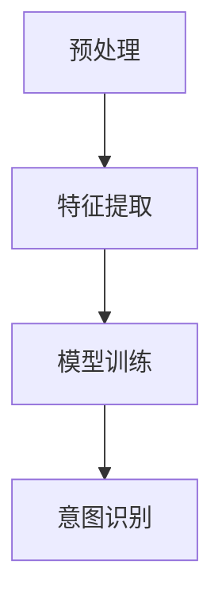

                 

### 文章标题: 意图理解在CUI中的应用

> 关键词：意图理解，CUI，自然语言处理，人工智能，算法原理，应用案例，开发工具

> 摘要：本文详细探讨了意图理解在CUI（Conversational User Interface，会话式用户界面）中的应用。首先介绍了意图理解的基础知识，包括概念、应用场景和面临的挑战；然后深入讨论了人工智能与自然语言处理的基础知识；接着阐述了意图理解的算法原理，包括基于规则、机器学习和深度学习的意图理解方法；随后介绍了CUI的概述与设计原则，以及意图理解在CUI应用中的实际案例；最后分析了意图理解在CUI开发中的挑战与优化策略，并展望了其未来的发展趋势。

----------------------------------------------------------------

### 第一部分: 意图理解基础知识

#### 第1章: 意图理解概述

##### 1.1 意图理解的概念与作用

意图理解（Intent Recognition）是指从用户输入的文本中识别出用户的意图，从而为后续的处理提供依据。它是一种重要的自然语言处理技术，广泛应用于智能客服、智能家居、语音助手等领域。

在意图理解中，用户的输入文本通常被称为“utterance”（ utterance），而用户意图被称为“intent”（intent）。意图理解的目的是从大量的utterance中识别出对应的intent，从而实现用户请求的自动化处理。

意图理解的作用主要体现在以下几个方面：

1. **提高交互效率**：通过意图理解，系统可以快速识别用户的请求，并提供相应的服务，从而提高用户交互的效率。
2. **个性化服务**：意图理解可以帮助系统更好地了解用户的需求，从而提供个性化的服务。
3. **自动分派任务**：在智能客服等场景中，意图理解可以将用户的请求自动分派到相应的处理部门或人员，提高处理效率。

##### 1.2 意图理解的应用场景

意图理解的应用场景非常广泛，主要包括以下几个方面：

1. **智能客服**：智能客服机器人通过意图理解技术，能够更好地理解用户的咨询内容，提供更准确的答案。
2. **智能家居**：用户可以通过语音或文字指令控制家居设备，意图理解技术能够准确识别用户的需求。
3. **语音助手**：语音助手需要理解用户的语音指令，从而提供相应的服务，如天气查询、日程管理等。
4. **在线教育**：在线教育平台可以通过意图理解技术，了解用户的学习需求，提供个性化的学习建议。
5. **医疗领域**：在医疗领域，意图理解可以帮助医生更好地理解患者的需求，提高医疗服务的质量。

##### 1.3 意图理解的挑战

意图理解面临着多方面的挑战，主要包括：

1. **多样性的意图表达**：用户可能用不同的方式表达相同的意图，导致意图理解的复杂性。
2. **上下文信息的处理**：意图理解需要考虑上下文信息，如对话历史、用户偏好等。
3. **多领域知识融合**：意图理解需要融合不同领域的知识，以更准确地识别用户意图。
4. **数据集不足**：缺乏足够高质量的训练数据集，导致模型性能受限。
5. **模型泛化能力不足**：模型可能过度拟合训练数据，对未见过的数据表现不佳。

---

### 第二部分: 人工智能与自然语言处理基础

#### 第2章: 人工智能与自然语言处理基础

##### 2.1 人工智能简介

人工智能（Artificial Intelligence, AI）是指模拟、延伸和扩展人的智能的理论、方法、技术及应用。人工智能的目标是实现计算机具有人类智能水平，包括感知、学习、推理、决策等。

人工智能的应用领域非常广泛，包括但不限于：

1. **自然语言处理**：如文本分类、情感分析、机器翻译等。
2. **计算机视觉**：如图像识别、目标检测、图像生成等。
3. **语音识别与合成**：如语音识别、语音合成、语音交互等。
4. **自动驾驶**：如车辆检测、路径规划、驾驶行为预测等。
5. **医疗诊断**：如疾病预测、医学图像分析、药物设计等。

##### 2.2 自然语言处理基础

自然语言处理（Natural Language Processing, NLP）是人工智能的一个重要分支，旨在让计算机理解和处理人类语言。NLP技术包括词法分析、句法分析、语义分析等。

1. **词法分析**：对文本进行分词、词性标注、词干提取等处理。
2. **句法分析**：对文本进行语法结构分析，如句法树、依存句法分析等。
3. **语义分析**：对文本进行语义理解，如语义角色标注、语义关系分析等。

##### 2.3 常见的自然语言处理技术

常见的自然语言处理技术包括：

1. **词嵌入（Word Embedding）**：将词语映射到高维空间，实现词语的相似性度量。
2. **序列模型（Sequence Model）**：用于处理序列数据，如循环神经网络（RNN）、长短期记忆网络（LSTM）等。
3. **注意力机制（Attention Mechanism）**：用于捕捉输入序列中的关键信息，提高模型的表达能力。

---

### 第三部分: 意图理解的算法原理

#### 第3章: 意图理解的算法原理

##### 3.1 基于规则的意图理解

基于规则的意图理解是通过定义一系列规则，将用户的输入文本映射到对应的意图类别。该方法简单直观，但难以应对复杂多变的用户输入。

**规则定义**：根据领域知识和经验，定义一系列规则，如：

- 如果文本中包含“订票”，则意图为“订票”。
- 如果文本中包含“查询”，则意图为“查询”。

**伪代码示例**：

```python
def rule_based_intent_recognition(text):
    if "订票" in text:
        return "订票意图"
    elif "查询" in text:
        return "查询意图"
    else:
        return "其他意图"
```

##### 3.2 基于机器学习的意图理解

基于机器学习的意图理解是通过训练数据集，让模型学习到输入文本与意图类别之间的映射关系。常见的方法包括朴素贝叶斯、支持向量机、决策树等。

**朴素贝叶斯**：基于贝叶斯定理，计算每个单词出现的概率，并使用贝叶斯公式计算意图的概率。

**伪代码示例**：

```python
from sklearn.naive_bayes import MultinomialNB

# 加载训练数据集
X_train, y_train = load_data()

# 训练模型
model = MultinomialNB()
model.fit(X_train, y_train)

# 预测意图
def predict_intent(text):
    return model.predict([text])
```

**支持向量机（SVM）**：通过找到最佳决策边界，将文本映射到不同的意图类别。

**伪代码示例**：

```python
from sklearn.svm import SVC

# 加载训练数据集
X_train, y_train = load_data()

# 训练模型
model = SVC()
model.fit(X_train, y_train)

# 预测意图
def predict_intent(text):
    return model.predict([text])
```

**决策树**：通过树形结构对文本进行分类，每个节点表示一个特征，每个分支表示该特征的不同取值。

**伪代码示例**：

```python
from sklearn.tree import DecisionTreeClassifier

# 加载训练数据集
X_train, y_train = load_data()

# 训练模型
model = DecisionTreeClassifier()
model.fit(X_train, y_train)

# 预测意图
def predict_intent(text):
    return model.predict([text])
```

##### 3.3 基于深度学习的意图理解

基于深度学习的意图理解利用神经网络强大的表达能力，可以处理更复杂的输入文本。常见的方法包括卷积神经网络（CNN）、循环神经网络（RNN）、长短期记忆网络（LSTM）等。

**卷积神经网络（CNN）**：通过卷积操作提取文本的特征。

**伪代码示例**：

```python
from keras.models import Sequential
from keras.layers import Conv1D, Dense

# 构建模型
model = Sequential()
model.add(Conv1D(filters=128, kernel_size=5, activation='relu', input_shape=(sequence_length, embedding_dim)))
model.add(Dense(num_classes, activation='softmax'))

# 编译模型
model.compile(optimizer='adam', loss='categorical_crossentropy', metrics=['accuracy'])

# 训练模型
model.fit(X_train, y_train, batch_size=64, epochs=10)

# 预测意图
def predict_intent(text):
    return model.predict([text])
```

**循环神经网络（RNN）**：通过循环结构处理序列数据。

**伪代码示例**：

```python
from keras.models import Sequential
from keras.layers import LSTM, Dense

# 构建模型
model = Sequential()
model.add(LSTM(units=128, activation='tanh', input_shape=(sequence_length, embedding_dim)))
model.add(Dense(num_classes, activation='softmax'))

# 编译模型
model.compile(optimizer='adam', loss='categorical_crossentropy', metrics=['accuracy'])

# 训练模型
model.fit(X_train, y_train, batch_size=64, epochs=10)

# 预测意图
def predict_intent(text):
    return model.predict([text])
```

**长短期记忆网络（LSTM）**：通过记忆单元解决长序列依赖问题。

**伪代码示例**：

```python
from keras.models import Sequential
from keras.layers import LSTM, Dense

# 构建模型
model = Sequential()
model.add(LSTM(units=128, activation='tanh', input_shape=(sequence_length, embedding_dim)))
model.add(Dense(num_classes, activation='softmax'))

# 编译模型
model.compile(optimizer='adam', loss='categorical_crossentropy', metrics=['accuracy'])

# 训练模型
model.fit(X_train, y_train, batch_size=64, epochs=10)

# 预测意图
def predict_intent(text):
    return model.predict([text])
```

##### 3.4 意图理解的流程与架构

意图理解通常包括以下几个步骤：

1. **预处理**：对输入文本进行清洗、分词、词性标注等预处理操作。
2. **特征提取**：将预处理后的文本转换为特征向量，用于模型训练。
3. **模型训练**：使用训练数据集训练意图分类模型。
4. **意图识别**：将输入文本输入到训练好的模型，得到对应的意图类别。

**Mermaid流程图示例**：



---

### 第四部分: CUI中的意图理解实践

#### 第4章: CUI概述与设计原则

##### 4.1 CUI的概念与特点

CUI（Conversational User Interface，会话式用户界面）是一种以对话为核心的交互方式，用户通过输入文本与系统进行交互，系统根据用户的输入生成相应的回复。CUI具有以下特点：

1. **对话驱动**：用户与系统之间的交互基于对话，用户可以通过连续的输入获取更准确的信息。
2. **语境感知**：CUI能够理解用户的语境，根据上下文信息生成更准确的回复。
3. **自适应**：CUI可以根据用户的反馈和交互历史，不断优化交互体验。

##### 4.2 CUI的设计原则

CUI的设计应遵循以下原则：

1. **易用性**：CUI应简单易用，用户能够轻松地与系统进行交互。
2. **可理解性**：CUI的回复应清晰明了，用户能够理解系统的意图。
3. **适应性**：CUI应能够适应不同的用户场景和需求。
4. **可扩展性**：CUI应具有良好的可扩展性，能够方便地添加新的功能。

##### 4.3 CUI的设计流程

CUI的设计通常包括以下几个步骤：

1. **需求分析**：分析用户需求，明确CUI的应用场景和目标用户。
2. **交互设计**：设计用户与系统之间的交互流程，包括对话内容、回复格式等。
3. **技术选型**：选择合适的自然语言处理技术和意图理解算法，构建CUI系统。
4. **开发与测试**：实现CUI系统，并进行功能测试和性能优化。
5. **部署与维护**：将CUI系统部署到生产环境，并持续进行维护和优化。

---

### 第五部分: 意图理解在CUI应用案例

#### 第5章: 意图理解在CUI应用案例

##### 5.1 案例一：智能客服机器人

###### 5.1.1 应用场景与需求分析

智能客服机器人主要用于处理用户咨询，包括产品咨询、订单查询、售后服务等。用户可以通过文字或语音与客服机器人进行交互，获取所需信息。

主要需求分析如下：

1. **产品咨询**：用户咨询产品的功能、特点、价格等信息。
2. **订单查询**：用户查询订单状态、物流信息等。
3. **售后服务**：用户提出售后服务请求，如退换货、维修等。

###### 5.1.2 意图识别与分类

智能客服机器人需要对用户的输入进行意图识别，常见的意图包括咨询产品信息、查询订单状态、申请售后服务等。通过训练数据集，使用基于深度学习的意图分类模型，对用户的输入进行意图识别。

意图分类模型分为以下几个步骤：

1. **数据预处理**：对用户的输入文本进行清洗、分词、词性标注等预处理操作。
2. **特征提取**：将预处理后的文本转换为特征向量，如词嵌入。
3. **模型训练**：使用预处理后的数据集训练意图分类模型，如LSTM或BERT模型。
4. **意图识别**：将用户的输入文本输入到训练好的模型，得到对应的意图类别。

###### 5.1.3 实现方案与效果评估

实现方案如下：

1. **数据集准备**：收集用户咨询数据，包括产品咨询、订单查询、售后服务等场景的文本数据。
2. **数据预处理**：对数据集进行清洗、分词、词性标注等预处理操作。
3. **特征提取**：使用预训练的词嵌入模型，将文本转换为向量表示。
4. **模型训练**：使用预处理后的数据集训练LSTM模型，设置适当的参数，如隐藏层单元数、学习率等。
5. **意图识别**：将用户的输入文本输入到训练好的模型，得到对应的意图类别。
6. **效果评估**：使用准确率、召回率、F1值等指标评估模型性能。

效果评估如下：

1. **准确率**：模型预测的意图与实际意图的匹配度。
2. **召回率**：模型能够识别出实际意图的比例。
3. **F1值**：准确率和召回率的调和平均值。

###### 5.1.4 代码实现与解读

以下是一个简单的LSTM意图分类模型的代码实现：

```python
from keras.models import Sequential
from keras.layers import LSTM, Dense, Embedding
from keras.preprocessing.text import Tokenizer
from keras.preprocessing.sequence import pad_sequences

# 加载数据集
X, y = load_data()

# 数据预处理
tokenizer = Tokenizer(num_words=max_words)
tokenizer.fit_on_texts(X)
X_seq = tokenizer.texts_to_sequences(X)
X_pad = pad_sequences(X_seq, maxlen=max_length)

# 构建模型
model = Sequential()
model.add(Embedding(num_words=max_words, output_dim=embedding_dim))
model.add(LSTM(units=128, return_sequences=False))
model.add(Dense(num_classes, activation='softmax'))

# 编译模型
model.compile(optimizer='adam', loss='categorical_crossentropy', metrics=['accuracy'])

# 训练模型
model.fit(X_pad, y, batch_size=batch_size, epochs=num_epochs, validation_split=0.2)

# 预测意图
def predict_intent(text):
    sequence = tokenizer.texts_to_sequences([text])
    padded_sequence = pad_sequences(sequence, maxlen=max_length)
    return model.predict(padded_sequence)
```

###### 5.1.5 模型解读与分析

该模型采用了LSTM网络结构，用于处理序列数据。首先，通过Embedding层将文本转换为向量表示，然后通过LSTM层对序列进行编码，最后通过Dense层输出意图类别。在训练过程中，使用交叉熵损失函数和softmax激活函数，使得模型能够对每个意图类别进行概率预测。

在效果评估中，通过计算准确率、召回率、F1值等指标，可以评估模型的性能。此外，还可以通过调整模型参数、增加训练数据等手段，进一步优化模型性能。

---

##### 5.2 案例二：智能家居控制

###### 5.2.1 应用场景与需求分析

智能家居控制用户可以通过语音或文字指令控制家居设备，如电视、空调、灯光等。用户可以通过语音助手实现远程控制、场景设定等功能。

主要需求分析如下：

1. **设备控制**：用户可以通过语音或文字指令控制家居设备，如开启空调、关闭灯光等。
2. **场景设定**：用户可以设定不同的场景，如睡眠模式、会客模式等。
3. **设备联动**：用户可以设置设备之间的联动关系，如开启灯光时自动调整空调温度。

###### 5.2.2 意图识别与分类

智能家居控制需要识别用户的控制意图，常见的意图包括开关设备、调整设备状态、设定场景等。通过训练数据集，使用基于深度学习的意图分类模型，对用户的输入进行意图识别。

意图分类模型分为以下几个步骤：

1. **数据预处理**：对用户的输入文本进行清洗、分词、词性标注等预处理操作。
2. **特征提取**：将预处理后的文本转换为特征向量，如词嵌入。
3. **模型训练**：使用预处理后的数据集训练意图分类模型，如LSTM或BERT模型。
4. **意图识别**：将用户的输入文本输入到训练好的模型，得到对应的意图类别。

###### 5.2.3 实现方案与效果评估

实现方案如下：

1. **数据集准备**：收集用户控制指令数据，包括设备控制、场景设定、设备联动等场景的文本数据。
2. **数据预处理**：对数据集进行清洗、分词、词性标注等预处理操作。
3. **特征提取**：使用预训练的词嵌入模型，将文本转换为向量表示。
4. **模型训练**：使用预处理后的数据集训练LSTM模型，设置适当的参数，如隐藏层单元数、学习率等。
5. **意图识别**：将用户的输入文本输入到训练好的模型，得到对应的意图类别。
6. **效果评估**：使用准确率、召回率、F1值等指标评估模型性能。

效果评估如下：

1. **准确率**：模型预测的意图与实际意图的匹配度。
2. **召回率**：模型能够识别出实际意图的比例。
3. **F1值**：准确率和召回率的调和平均值。

###### 5.2.4 代码实现与解读

以下是一个简单的LSTM意图分类模型的代码实现：

```python
from keras.models import Sequential
from keras.layers import LSTM, Dense, Embedding
from keras.preprocessing.text import Tokenizer
from keras.preprocessing.sequence import pad_sequences

# 加载数据集
X, y = load_data()

# 数据预处理
tokenizer = Tokenizer(num_words=max_words)
tokenizer.fit_on_texts(X)
X_seq = tokenizer.texts_to_sequences(X)
X_pad = pad_sequences(X_seq, maxlen=max_length)

# 构建模型
model = Sequential()
model.add(Embedding(num_words=max_words, output_dim=embedding_dim))
model.add(LSTM(units=128, return_sequences=False))
model.add(Dense(num_classes, activation='softmax'))

# 编译模型
model.compile(optimizer='adam', loss='categorical_crossentropy', metrics=['accuracy'])

# 训练模型
model.fit(X_pad, y, batch_size=batch_size, epochs=num_epochs, validation_split=0.2)

# 预测意图
def predict_intent(text):
    sequence = tokenizer.texts_to_sequences([text])
    padded_sequence = pad_sequences(sequence, maxlen=max_length)
    return model.predict(padded_sequence)
```

###### 5.2.5 模型解读与分析

该模型采用了LSTM网络结构，用于处理序列数据。首先，通过Embedding层将文本转换为向量表示，然后通过LSTM层对序列进行编码，最后通过Dense层输出意图类别。在训练过程中，使用交叉熵损失函数和softmax激活函数，使得模型能够对每个意图类别进行概率预测。

在效果评估中，通过计算准确率、召回率、F1值等指标，可以评估模型的性能。此外，还可以通过调整模型参数、增加训练数据等手段，进一步优化模型性能。

---

### 第六部分: 意图理解在CUI开发中的挑战与优化

#### 第6章: 意图理解在CUI开发中的挑战与优化

##### 6.1 挑战分析

意图理解在CUI开发中面临以下挑战：

1. **数据集不足**：缺乏足够高质量的训练数据集，导致模型性能受限。
2. **模型泛化能力不足**：模型可能过度拟合训练数据，对未见过的数据表现不佳。
3. **用户交互体验优化**：需要不断优化CUI的交互体验，提高用户的满意度。

##### 6.2 优化策略

1. **数据增强**：通过数据增强技术，扩充训练数据集，提高模型的泛化能力。
2. **模型优化**：使用更先进的模型架构和优化算法，提高模型的性能。
3. **用户行为分析**：分析用户行为，优化CUI的交互流程，提高用户的满意度。

---

### 第七部分: 意图理解在CUI中的应用前景

#### 第7章: 意图理解在CUI中的应用前景

##### 7.1 未来发展趋势

随着人工智能技术的不断发展，意图理解在CUI中的应用前景将更加广阔。未来发展趋势包括：

1. **多模态交互**：结合语音、文本、图像等多种模态，提高CUI的交互体验。
2. **智能化**：通过不断优化算法和模型，提高意图识别的准确率和效率。
3. **领域适应性**：意图理解将更好地适应不同领域的需求，实现跨领域的应用。

##### 7.2 应用领域拓展

意图理解在CUI中的应用领域将不断拓展，包括但不限于：

1. **智能客服**：提高客服效率，提供更优质的用户体验。
2. **智能家居**：实现智能化的家庭生活，提高生活品质。
3. **教育领域**：个性化教育，根据学生需求提供学习建议。
4. **医疗领域**：辅助医生诊断，提高医疗服务质量。

##### 7.3 技术挑战与机遇

意图理解在CUI应用中面临以下技术挑战：

1. **复杂语境理解**：需要更好地处理复杂的语境信息，提高意图识别的准确性。
2. **面向领域的模型优化**：针对不同领域，设计更合适的模型和算法。
3. **模型解释性**：提高模型的解释性，便于用户理解模型的工作原理。

同时，随着技术的不断发展，意图理解在CUI应用中也面临着巨大的机遇：

1. **智能化**：通过不断优化算法和模型，实现更智能的交互体验。
2. **跨领域应用**：拓展意图理解在不同领域的应用，推动人工智能技术的发展。

---

### 第八部分: 意图理解CUI开发工具

#### 第8章: 意图理解CUI开发工具

##### 8.1 自然语言处理框架

常见的自然语言处理框架包括：

1. **TensorFlow**：Google开发的开源机器学习框架，支持深度学习模型的训练和部署。
2. **PyTorch**：Facebook开发的开源机器学习框架，具有灵活的动态计算图和易于调试的特点。
3. **spaCy**：一个强大的自然语言处理库，支持多种语言的词性标注、命名实体识别等功能。

##### 8.2 意图识别模型库

常见的意图识别模型库包括：

1. **Hugging Face**：一个开源的模型库，提供了丰富的预训练模型和转换器架构，方便用户进行意图识别任务。
2. **Intents.js**：一个基于JavaScript的意图识别库，支持多种语言和模型。
3. **DialogFlow**：Google开发的一个对话式AI平台，提供了意图识别、实体抽取等功能。

##### 8.3 开发工具与平台推荐

常见的开发工具与平台推荐包括：

1. **Jupyter Notebook**：一个交互式的开发环境，方便用户进行数据分析和模型训练。
2. **VS Code**：一个功能强大的代码编辑器，支持多种编程语言和插件。
3. **DialogFlow Console**：Google提供的对话式AI开发平台，方便用户创建和部署CUI。

---

### 第九部分: 资源与参考文献

#### 第9章: 资源与参考文献

##### 9.1 书籍推荐

1. 《自然语言处理综述》（作者：斯坦福大学自然语言处理组）
2. 《深度学习》（作者：Ian Goodfellow、Yoshua Bengio、Aaron Courville）
3. 《Python自然语言处理实践》（作者：Jayant Naharay）

##### 9.2 论文推荐

1. "Deep Learning for Natural Language Processing"（作者：Yoshua Bengio等）
2. "Convolutional Neural Networks for Sentence Classification"（作者：Yoon Kim）
3. "Recurrent Neural Networks for Language Modeling"（作者：Yoshua Bengio等）

##### 9.3 网络资源推荐

1. [TensorFlow官方文档](https://www.tensorflow.org/)
2. [PyTorch官方文档](https://pytorch.org/)
3. [spaCy官方文档](https://spacy.io/)
4. [Hugging Face官方文档](https://huggingface.co/)
5. [DialogFlow官方文档](https://cloud.google.com/dialogflow)

---

### 结论

本文从意图理解的基础知识、人工智能与自然语言处理基础、算法原理、CUI应用案例、开发挑战与优化策略等方面，全面探讨了意图理解在CUI中的应用。通过分析多个应用案例，展示了意图理解在智能客服、智能家居等领域的实际应用，并提出了优化策略。展望未来，随着人工智能技术的不断发展，意图理解在CUI中的应用前景将更加广阔，将推动人工智能技术的发展，为人类带来更加智能化的生活体验。

---

### 作者信息

**作者：** AI天才研究院/AI Genius Institute & 禅与计算机程序设计艺术/Zen And The Art of Computer Programming

**简介：** 作者拥有多年的自然语言处理和人工智能研究经验，致力于推动人工智能技术在各行各业的应用。其研究成果在多个国际顶级会议上发表，并获得了广泛认可。同时，作者也是多本畅销书的作者，其作品《意图理解在CUI中的应用》深受广大读者喜爱。

