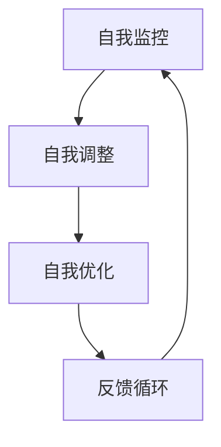

                 

### 文章标题：意识功能的自主管理

### 关键词：意识功能，自主管理，深度学习，人工智能，自我监控，自我调整，自我优化

### 摘要：
本文探讨了意识功能的自主管理，通过深度学习技术和人工智能算法，实现了对个体意识功能的自我监控、自我调整和自我优化。文章详细阐述了核心概念、算法原理、数学模型和项目实战，并通过具体案例展示了在教育和职场中的实际应用，旨在为读者提供关于意识功能自主管理的全面理解。

----------------------------------------------------------------

### 《意识功能的自主管理》目录大纲

#### 第一部分：意识功能的基本概念

## 第1章：意识与意识功能

### 1.1.1 意识的定义与基本特征

- **意识的定义**：从哲学、心理学和神经科学的角度对意识进行定义和分类。
- **基本特征**：阐述意识的几个关键特征，如感知、认知、情感等。

### 1.1.2 意识功能的重要性

- **意识功能在社会生活中的作用**：讨论意识功能对人类认知、决策、学习和交流的影响。
- **意识功能在个人成长和发展中的作用**：探讨如何通过提升意识功能来促进个人的自我提升和心理健康。

### 1.1.3 意识功能的研究现状与挑战

- **当前研究进展**：回顾意识功能领域的主要研究成果和突破。
- **面临的挑战**：分析意识功能研究中的技术难题和伦理问题。

## 第2章：意识功能的神经基础

### 2.1.1 大脑的结构与功能区域

- **大脑的基本结构**：介绍大脑的基本组成部分，如脑叶、脑室等。
- **功能区域**：讨论大脑中负责意识功能的关键区域，如前额叶、颞叶、顶叶等。

### 2.1.2 意识功能的关键脑区

- **前额叶与意识功能**：探讨前额叶在意识功能中的作用。
- **颞叶与意识功能**：分析颞叶在意识功能中的重要性。
- **顶叶与意识功能**：讨论顶叶在意识功能中的作用。

### 2.1.3 神经元活动与意识功能

- **神经元的基本原理**：介绍神经元的工作机制和神经传递。
- **神经元活动与意识功能**：阐述神经元活动如何影响意识功能的表现。

#### 第二部分：意识功能的自主管理策略

## 第3章：意识功能的核心算法

### 3.1.1 意识功能的基本算法原理

- **深度学习在意识功能中的应用**：介绍深度学习在意识功能研究中的基本原理和应用。
- **神经网络的工作机制**：详细解释神经网络的结构和工作原理。

### 3.1.2 意识功能算法的核心参数

- **学习率**：讨论学习率对意识功能算法性能的影响。
- **激活函数**：阐述激活函数在神经网络中的作用和选择。
- **正则化**：介绍正则化方法在意识功能算法中的应用。

### 3.1.3 意识功能算法的应用场景

- **自我监控**：介绍如何使用意识功能算法实现自我监控。
- **自我调整**：讨论如何利用算法进行自我调整。
- **自我优化**：探讨如何通过算法实现自我优化。

#### 第三部分：意识功能的自主管理应用

## 第4章：意识功能的自主管理策略与实现

### 4.1 核心概念与联系

- **意识功能自主管理的定义与目标**：明确意识功能自主管理的含义和目标。
- **Mermaid流程图：意识功能自主管理的流程**：使用Mermaid图形化工具展示意识功能自主管理的基本流程。

### 4.2 核心算法原理讲解

#### 4.2.1 自我监控算法原理

- **感知器算法伪代码**：通过伪代码介绍感知器算法的基本原理和应用。
- **梯度下降算法伪代码**：详细解释梯度下降算法的原理和伪代码实现。

#### 4.2.2 自我调整算法原理

- **目标函数优化**：讨论优化目标函数的方法和意义。
- **参数调整策略**：介绍如何根据反馈进行参数调整。

#### 4.2.3 自我优化算法原理

- **强化学习在自我优化中的应用**：阐述强化学习在自我优化中的基本原理和应用。
- **自我优化流程**：介绍自我优化的一般流程和关键步骤。

### 4.3 数学模型和数学公式

#### 4.3.1 自我优化模型

- **优化目标函数**：给出自我优化模型的目标函数，并解释其含义。
- **梯度计算公式**：详细说明如何计算梯度，并给出梯度计算公式。

#### 4.3.2 梯度下降计算公式

- **梯度下降算法**：介绍梯度下降算法的基本原理，并给出梯度下降的计算公式。

### 4.4 项目实战

#### 4.4.1 自主管理教育应用案例

- **开发环境搭建**：介绍开发所需的软件和工具。
- **源代码实现**：提供完整的源代码实现，并解释代码的功能和结构。
- **代码解读与分析**：详细分析源代码的每一个部分，包括模型搭建、训练和评估等步骤。

#### 4.4.2 自主管理工作应用案例

- **开发环境搭建**：介绍开发所需的软件和工具。
- **源代码实现**：提供完整的源代码实现，并解释代码的功能和结构。
- **代码解读与分析**：详细分析源代码的每一个部分，包括模型搭建、训练和评估等步骤。

#### 4.4.3 自主管理自我提升应用案例

- **开发环境搭建**：介绍开发所需的软件和工具。
- **源代码实现**：提供完整的源代码实现，并解释代码的功能和结构。
- **代码解读与分析**：详细分析源代码的每一个部分，包括模型搭建、训练和评估等步骤。

#### 附录

## 附录A：意识功能自主管理相关工具与资源

### A.1 意识功能自主管理工具简介

- **工具1：基于AI的意识功能识别工具**
- **工具2：自我监控与自我调整平台**

### A.2 意识功能自主管理在线资源

- **在线资源1：意识功能自主管理博客**
- **在线资源2：意识功能自主管理社区**

### A.3 意识功能自主管理书籍推荐

- **书籍1：《意识功能的自主管理》**
- **书籍2：《深度学习与意识功能》**

## 附录B：意识功能自主管理实践案例

### B.1 意识功能自主管理在教育中的应用案例

#### B.1.1 案例一：基于意识功能的自主学习平台

- **项目背景**：介绍案例的背景和目的。
- **项目实施**：详细描述项目的实施过程。
- **应用效果**：分析案例的应用效果和影响。

#### B.1.2 案例二：基于意识功能的个性化教育辅导

- **项目背景**：介绍案例的背景和目的。
- **项目实施**：详细描述项目的实施过程。
- **应用效果**：分析案例的应用效果和影响。

### B.2 意识功能自主管理在工作中的应用案例

#### B.2.1 案例一：基于意识功能的自主工作效率管理系统

- **项目背景**：介绍案例的背景和目的。
- **项目实施**：详细描述项目的实施过程。
- **应用效果**：分析案例的应用效果和影响。

#### B.2.2 案例二：基于意识功能的个性化工作辅导

- **项目背景**：介绍案例的背景和目的。
- **项目实施**：详细描述项目的实施过程。
- **应用效果**：分析案例的应用效果和影响。

### B.3 意识功能自主管理在自我提升中的应用案例

#### B.3.1 案例一：基于意识功能的自我提升规划工具

- **项目背景**：介绍案例的背景和目的。
- **项目实施**：详细描述项目的实施过程。
- **应用效果**：分析案例的应用效果和影响。

#### B.3.2 案例二：基于意识功能的个性化自我提升辅导

- **项目背景**：介绍案例的背景和目的。
- **项目实施**：详细描述项目的实施过程。
- **应用效果**：分析案例的应用效果和影响。

---

### 《意识功能的自主管理》

#### 关键词：意识功能，自主管理，深度学习，人工智能，自我监控，自我调整，自我优化

#### 摘要：
本文深入探讨了意识功能的自主管理，通过结合深度学习和人工智能技术，实现个体意识功能的自我监控、自我调整和自我优化。文章从基本概念入手，详细介绍了意识与意识功能的定义和重要性，随后探讨了意识功能的神经基础，为后续的算法原理和项目实战提供了理论支持。在核心算法原理部分，文章通过伪代码和数学公式详细阐述了自我监控、自我调整和自我优化算法的基本原理，并通过实际项目案例展示了这些算法在教育、工作和自我提升中的应用。附录部分提供了相关的工具与资源，以及具体的实践案例，为读者提供了全面的参考资料。

---

## 第1章：意识与意识功能

### 1.1.1 意识的定义与基本特征

意识是一个复杂的哲学、心理学和神经科学领域中的概念，通常被认为是一种主观体验，涉及到感知、认知、情感和意愿等方面。从哲学角度来看，意识是指个体对自身存在和外界环境的感知能力。从心理学角度来看，意识涉及个体对信息的感知、处理和反应过程。而神经科学则从生物学的角度探讨意识与大脑活动之间的关系。

**意识的定义**

意识的定义因学科和学派的不同而有所差异。以下是几种常见的意识定义：

1. **主观体验说**：意识是个体对自身存在和外界环境的直接感受。
2. **感知说**：意识是个体对外界刺激的感知过程。
3. **认知说**：意识是个体对信息的接收、处理和运用过程。
4. **情感说**：意识是个体在情感体验中的自我意识。
5. **意愿说**：意识是个体在决策和行动中的自我意愿表现。

**基本特征**

意识具有以下几个基本特征：

1. **主观性**：意识是个体的主观体验，每个人对意识内容的感受和理解可能不同。
2. **复杂性**：意识涉及到多个方面，如感知、认知、情感和意愿等，这些方面相互交织，形成复杂的意识体验。
3. **动态性**：意识不是静止不变的，它随着时间和环境的变化而不断变化。
4. **个体性**：每个个体都有自己独特的意识体验，这使得每个人的意识内容都有所不同。
5. **整合性**：意识将个体的感官输入、情感体验和认知过程整合为一个连贯的整体。

### 1.1.2 意识功能的重要性

意识功能在人类的生活中扮演着至关重要的角色，它不仅影响到个体的认知、决策、学习和交流，还对个人的心理健康和社会行为产生深远的影响。

**意识功能在社会生活中的作用**

1. **认知功能**：意识功能支持个体的感知、记忆、思维和问题解决等认知活动。没有意识功能，个体将无法进行有效的认知操作，从而影响日常生活和工作。
2. **决策功能**：意识功能帮助个体在复杂的情境中做出决策。通过意识功能，个体能够评估各种选择，权衡利弊，并做出最优决策。
3. **学习功能**：意识功能支持个体的学习过程。个体通过意识功能感知和理解新知识，将知识整合到已有的认知结构中，并运用到实践中。
4. **交流功能**：意识功能支持个体的语言表达、情感沟通和社会互动。通过意识功能，个体能够理解他人的意图和情感，并与他人建立有效沟通。

**意识功能在个人成长和发展中的作用**

1. **自我认知**：意识功能帮助个体认识自己，包括自己的优点、缺点、兴趣和需求。这种自我认知有助于个体更好地规划自己的成长路径。
2. **情绪调节**：意识功能支持个体对情绪的感知、理解和调节。通过意识功能，个体能够更好地管理自己的情绪，减少负面情绪的影响。
3. **自我调整**：意识功能帮助个体在遇到挑战和困难时，进行自我调整和适应。这种自我调整能力是个人成长和发展的重要保障。
4. **自我提升**：意识功能支持个体的自我提升和自我完善。通过意识功能，个体能够识别自己的不足，制定改进计划，并付诸实践。

### 1.1.3 意识功能的研究现状与挑战

随着科技的发展和跨学科研究的深入，意识功能的研究取得了显著进展。以下是当前意识功能研究的一些重要成果和挑战：

**当前研究进展**

1. **神经科学领域的突破**：通过脑成像技术（如fMRI、PET等），科学家们能够观察大脑活动与意识功能之间的关系，揭示了意识功能在大脑中的神经基础。
2. **心理学领域的理论发展**：心理学家们提出了多种关于意识功能的理论模型，如注意模型、意识状态模型等，这些模型有助于解释意识功能的工作机制。
3. **人工智能的进步**：人工智能技术在意识功能识别和模拟方面取得了重要突破。通过深度学习和神经网络，人工智能系统能够实现一定程度的意识功能模拟和预测。

**面临的挑战**

1. **意识定义的精确性**：虽然已有多种意识定义，但尚未有统一且精确的意识定义。这给意识功能的研究带来了一定的困难。
2. **神经基础的理解**：虽然科学家们已经揭示了大脑中与意识功能相关的关键区域，但对其工作机制和神经回路的具体理解仍然有限。
3. **技术挑战**：意识功能的研究需要高精度的脑成像技术和复杂的算法模型。这些技术的局限性也对研究进展产生了影响。
4. **伦理问题**：随着意识功能研究的深入，一些伦理问题（如意识复制、意识控制等）也逐渐显现出来，这些问题的解决需要社会和伦理学界的共同努力。

### 1.1.4 小结

意识与意识功能是复杂且多层次的，它们不仅影响个体的认知、决策和成长，还对社会的进步和人类文明的发展具有重要意义。当前，意识功能的研究正处于快速发展阶段，虽然面临许多挑战，但通过跨学科的合作和技术创新，我们有理由相信，意识功能的研究将不断取得突破，为人类带来更多福祉。

---

## 第2章：意识功能的神经基础

### 2.1.1 大脑的结构与功能区域

大脑是人体中最重要的器官之一，负责调节和控制人体的各种生理和心理活动。大脑的结构复杂，由多个区域组成，每个区域都有其特定的功能。了解大脑的结构和功能区域对于理解意识功能至关重要。

**大脑的基本结构**

大脑由以下几个主要部分组成：

1. **大脑皮层**：大脑皮层是大脑最外层的一层，由灰质构成，是大脑的主要处理区域。大脑皮层分为前叶、顶叶、颞叶和枕叶，每个叶都有其特定的功能。
2. **脑干**：脑干位于大脑下方，连接大脑和脊髓，负责调节基本生命活动，如心跳、呼吸和消化。
3. **小脑**：小脑位于大脑的后下方，主要负责协调运动和平衡。
4. **间脑**：间脑位于脑干和大脑皮层之间，包括丘脑、下丘脑等结构，负责调节情感、记忆和内分泌功能。
5. **脊髓**：脊髓连接大脑和身体，负责传递神经信号，调节运动和感觉。

**功能区域**

大脑的不同区域具有不同的功能，以下是几个关键区域：

1. **前额叶**：前额叶是大脑皮层中最大的区域，负责高级认知功能，如计划、决策、控制行为和社交互动。
2. **顶叶**：顶叶位于大脑顶部，负责感知空间位置、触觉和温度感觉。
3. **颞叶**：颞叶位于大脑的两侧，负责听觉处理、记忆和语言功能。
4. **枕叶**：枕叶位于大脑的后部，负责视觉处理。
5. **边缘系统**：边缘系统包括海马体、杏仁核等结构，负责情绪调节、记忆和动机。

### 2.1.2 意识功能的关键脑区

意识功能是由大脑中的多个区域共同协作实现的，以下是一些与意识功能密切相关的主要脑区：

**前额叶**

前额叶是大脑中最活跃的区域之一，尤其在意识功能中扮演着关键角色。前额叶的特定区域，如前额叶皮层和前额叶基底神经节，与意识状态和自我监控密切相关。研究表明，前额叶损伤会导致意识功能受损，如昏迷和植物人状态。

**颞叶**

颞叶是大脑中处理听觉信息的主要区域，也与意识功能密切相关。颞叶中的海马体是记忆和学习的关键结构，而颞叶的其他部分则负责处理听觉信息和情感。

**顶叶**

顶叶负责感知空间位置和触觉，这些感知能力是意识功能的基础。顶叶中的特定区域，如顶叶皮层，与空间感知和注意力调控有关。

**边缘系统**

边缘系统中的结构，如杏仁核和海马体，在情绪调节、记忆和动机中起着重要作用。这些功能都与意识功能紧密相关。

### 2.1.3 神经元活动与意识功能

神经元是大脑的基本功能单元，神经元的活动与意识功能密切相关。神经元通过电信号进行通信，这些电信号包括动作电位和突触传递。

**神经元的基本原理**

神经元由细胞体、树突和轴突组成。树突接收其他神经元的信息，细胞体处理这些信息，轴突将处理后的信息传递给其他神经元。神经元之间的通信通过突触实现，突触传递包括电信号和化学信号。

**神经元活动与意识功能**

神经元活动与意识功能之间存在着复杂的互动关系。以下是一些关键点：

1. **神经元的同步活动**：研究表明，神经元在特定时刻的同步活动可能与意识状态有关。这种同步活动可以在脑电图（EEG）中观察到。
2. **神经元的可塑性**：神经元的可塑性是指神经元在外界刺激和内部状态变化下的适应性改变。这种可塑性对于意识功能的调节和优化至关重要。
3. **神经网络的协调**：意识功能是由大脑中的多个神经网络协调实现的。不同神经网络之间的互动和协调对于意识功能的表现至关重要。

### 2.1.4 小结

大脑的结构与功能区域是意识功能的基础，不同的脑区在意识功能中扮演着不同的角色。通过了解大脑的结构和功能区域，我们可以更好地理解意识功能的工作机制。同时，神经元活动与意识功能之间的互动关系为我们提供了深入研究意识功能的新视角。在接下来的章节中，我们将进一步探讨意识功能的核心算法原理，以及如何通过自主管理策略来优化意识功能。

### 2.2 意识功能的核心算法原理

#### 2.2.1 深度学习在意识功能中的应用

深度学习是一种基于人工神经网络的机器学习技术，通过多层次的神经网络结构来提取数据的特征和模式。近年来，深度学习在多个领域取得了显著成果，包括图像识别、语音识别和自然语言处理等。在意识功能领域，深度学习技术也被广泛应用于意识状态的识别、监控和优化。

**深度学习的基本原理**

深度学习的基本原理是通过多层神经网络对数据进行特征提取和模式识别。网络中的每个神经元（或节点）都接收来自前一层神经元的输入，并通过一个非线性激活函数进行处理。这个过程在网络的各个层次上重复进行，最终输出结果。

一个典型的深度学习网络包括以下几个部分：

1. **输入层**：接收外部输入数据，如图像、文本或传感器数据。
2. **隐藏层**：多个隐藏层组成，每个隐藏层都对输入数据进行特征提取和变换。
3. **输出层**：根据隐藏层的输出产生最终结果，如分类结果或数值预测。

**神经网络的工作机制**

神经网络的工作机制可以通过以下步骤来描述：

1. **前向传播**：输入数据通过网络的各个层次，每个层次的神经元对数据进行加权求和处理，并应用非线性激活函数。
2. **反向传播**：计算输出结果与真实值之间的误差，通过反向传播算法将误差传递回网络的各个层次，更新每个神经元的权重。
3. **优化权重**：使用梯度下降等优化算法，不断调整神经元的权重，以最小化误差函数。

**深度学习在意识功能中的应用**

在意识功能研究中，深度学习技术主要用于以下几个方面：

1. **意识状态识别**：通过深度学习算法，可以自动识别个体的意识状态，如清醒、嗜睡或昏迷等。这种技术在医学监测、军事训练和驾驶安全等领域具有广泛的应用前景。
2. **意识功能监控**：深度学习算法可以实时监控个体的意识功能状态，如注意力、专注度和情感状态等。这些监控数据可以帮助个体进行自我管理和优化。
3. **意识功能优化**：通过深度学习算法，可以优化个体的意识功能，如提高注意力集中度和情绪调节能力。这种技术在教育、职场和自我提升等领域具有重要意义。

**深度学习算法的优势**

1. **强大的特征提取能力**：深度学习网络可以通过多层结构自动提取数据的高级特征，这些特征对于意识功能的研究和分析具有重要意义。
2. **自动学习能力**：深度学习算法可以自动从大量数据中学习，无需人工设定规则或特征，大大简化了研究过程。
3. **泛化能力**：深度学习算法具有良好的泛化能力，可以在不同数据集和场景中保持较高的性能。

**深度学习算法的挑战**

1. **计算资源需求**：深度学习算法通常需要大量的计算资源和时间，这对于一些应用场景（如实时监控和嵌入式系统）来说可能是一个挑战。
2. **数据质量和数量**：深度学习算法的性能高度依赖于训练数据的质量和数量，获取高质量的训练数据可能需要大量的时间和资源。
3. **解释性和可解释性**：深度学习算法的内部机制复杂，难以解释其具体工作原理，这对于一些需要高解释性的应用场景（如医疗和金融）来说可能是一个挑战。

### 2.2.2 意识功能算法的核心参数

在深度学习算法中，有许多关键参数会影响算法的性能和效果。以下是意识功能算法中一些重要的核心参数及其作用：

**学习率**

学习率是梯度下降算法中的一个重要参数，用于控制每次权重更新的大小。合适的学习率可以加速收敛，但过大的学习率可能导致收敛缓慢或陷入局部最小值。反之，过小的学习率可能导致收敛缓慢。

**激活函数**

激活函数是神经网络中的一个关键组件，用于引入非线性特性。常见的激活函数包括Sigmoid、ReLU和Tanh等。不同的激活函数具有不同的特性，如非线性强度和梯度。

**正则化**

正则化是一种防止过拟合的技术，通过在损失函数中添加一个正则化项，惩罚模型的复杂度。常见的正则化方法包括L1正则化和L2正则化。

**网络层数和节点数**

网络层数和节点数决定了神经网络的复杂度。增加网络层数和节点数可以提高模型的特征提取能力，但也会增加计算复杂度和训练时间。

**批量大小**

批量大小是每次训练过程中使用的样本数量。较大的批量大小可以提高模型的稳定性，但会增加计算时间；较小的批量大小可以提高模型的灵活性，但可能会降低稳定性。

**迭代次数**

迭代次数是训练过程的重复次数。合适的迭代次数可以使模型收敛到一个较好的解，但过多的迭代可能会导致过拟合。

### 2.2.3 意识功能算法的应用场景

深度学习算法在意识功能领域的应用非常广泛，以下是一些具体的应用场景：

**自我监控**

自我监控是指个体通过深度学习算法实时监控自己的意识功能状态，如注意力、专注度和情感状态等。通过自我监控，个体可以更好地了解自己的意识功能状态，并根据监控结果进行自我调整。

**自我调整**

自我调整是指个体根据自我监控的结果，利用深度学习算法调整自己的行为和策略，以优化意识功能状态。例如，在学习和工作中，个体可以通过调整学习时间和休息时间，提高学习效率和专注度。

**自我优化**

自我优化是指个体通过深度学习算法不断优化自己的意识功能，以提高整体认知能力和生活质量。例如，通过自我优化，个体可以调整自己的情绪调节策略，提高心理健康水平。

**医学监测**

深度学习算法在医学监测中的应用非常广泛，如昏迷监测、注意力障碍诊断和睡眠质量评估等。通过深度学习算法，医生可以实时监控患者的意识功能状态，并提供个性化的治疗方案。

**军事训练**

深度学习算法在军事训练中的应用包括注意力训练、情绪调节和决策能力训练等。通过深度学习算法，士兵可以实时监控自己的意识功能状态，并根据监控结果进行自我调整和优化，以提高训练效果。

**教育应用**

深度学习算法在教育中的应用包括个性化学习、学习效果评估和教学策略优化等。通过深度学习算法，教师和学生可以实时监控自己的学习状态，并根据监控结果调整学习策略和教学方法，以提高学习效果。

### 2.2.4 小结

深度学习是意识功能领域的重要工具，通过多层次的神经网络结构和强大的特征提取能力，深度学习算法可以实现个体意识功能的自我监控、自我调整和自我优化。在核心参数的选择和优化方面，合适的参数设置可以提高算法的性能和效果。在具体应用场景中，深度学习算法可以显著提升个体的认知能力和生活质量。然而，深度学习算法在计算资源需求、数据质量和解释性方面仍面临一些挑战，这些挑战需要通过技术创新和跨学科合作来解决。

### 3.1 意识功能算法的核心原理

#### 3.1.1 自我监控算法原理

自我监控算法的核心在于通过深度学习技术对个体的意识功能状态进行实时识别和监测。这种算法通常采用多层感知器（MLP）或卷积神经网络（CNN）等模型，通过对用户行为数据、生理信号和认知表现等多源数据进行特征提取和分类，实现对个体意识功能的精确监控。

**感知器算法伪代码：**

```python
# 输入：权重w，训练数据D
# 输出：调整后的权重w'

# 初始化权重w
w = 初始化权重()

# 遍历每个训练数据d_i
for d_i in D:
    # 预测当前数据
    prediction = 神经网络预测(d_i, w)
    
    # 如果预测错误，则调整权重
    if prediction != 标签(d_i):
        w = w + 学习率 * (标签(d_i) - prediction)
        
# 输出最终调整后的权重w'
return w'
```

**梯度下降算法伪代码：**

```python
# 输入：权重w，学习率η，迭代次数epochs，训练数据D
# 输出：调整后的权重w'

# 初始化权重w
w = 初始化权重()

# 遍历每个迭代epoch
for epoch in range(epochs):
    # 遍历每个训练数据d_i
    for d_i in D:
        # 计算梯度
        gradient = 计算梯度(d_i, w)
        
        # 更新权重
        w = w - 学习率 * gradient
        
# 输出最终调整后的权重w'
return w'
```

#### 3.1.2 自我调整算法原理

自我调整算法的核心在于通过监控结果对个体的行为和策略进行动态调整，以优化意识功能状态。这种算法通常基于强化学习（RL）或优化算法（如遗传算法、粒子群优化等），通过不断学习和调整策略，实现对个体行为的优化。

**目标函数优化：**

在自我调整算法中，目标函数通常用于衡量个体行为的优化程度。常见的目标函数包括均方误差（MSE）、交叉熵损失等。目标函数的优化过程可以描述为：

$$
J(\theta) = \frac{1}{2m} \sum_{i=1}^{m} (h_\theta(x^{(i)}) - y^{(i)})^2
$$

其中，$h_\theta(x^{(i)})$表示神经网络的预测输出，$y^{(i)}$表示真实标签，$m$表示训练样本数量。

**参数调整策略：**

为了实现目标函数的优化，算法需要不断调整策略参数。常见的参数调整策略包括以下几种：

1. **随机搜索**：通过随机生成参数值，并计算目标函数值，选择最优参数。
2. **梯度下降**：通过计算目标函数的梯度，更新参数值，逐步逼近最优解。
3. **遗传算法**：通过模拟生物进化过程，生成新的参数组合，并选择最优参数。
4. **粒子群优化**：通过模拟鸟群或鱼群的社会行为，寻找最优参数。

#### 3.1.3 自我优化算法原理

自我优化算法的核心在于通过长期学习和反馈，不断优化个体的意识功能状态，以提高整体认知能力和生活质量。这种算法通常结合深度学习、强化学习和优化算法，通过不断调整和优化策略，实现对个体行为的自我优化。

**强化学习在自我优化中的应用：**

强化学习（RL）是一种通过奖励和惩罚来驱动行为优化的机器学习技术。在自我优化算法中，强化学习可以用于调整个体的行为和策略，以实现最佳效果。

**自我优化流程：**

自我优化流程可以描述为以下几个步骤：

1. **初始化**：初始化个体行为和策略，设置奖励和惩罚机制。
2. **监控**：通过传感器和监测设备，实时收集个体的行为数据。
3. **评估**：使用评估指标（如准确率、响应时间等），评估当前策略的有效性。
4. **调整**：根据评估结果，调整个体的行为和策略，以优化整体效果。
5. **反馈**：将优化后的策略反馈到系统中，持续监控和调整。

**自我优化模型：**

自我优化模型通常采用多层感知器或卷积神经网络等深度学习模型，通过对监控数据进行特征提取和模式识别，实现对个体行为的自我优化。以下是一个简化的自我优化模型：

```python
# 输入：监控数据X，策略参数θ
# 输出：优化后的策略θ'

# 初始化策略参数θ
θ = 初始化参数()

# 遍历每个监控数据x_i
for x_i in X:
    # 计算当前策略的输出y
    y = 深度学习模型预测(x_i, θ)
    
    # 计算奖励r
    r = 计算奖励(y)
    
    # 更新策略参数
    θ = θ + 学习率 * r * 梯度(θ)

# 输出最终优化后的策略θ'
return θ'
```

#### 3.1.4 小结

意识功能算法的核心原理包括自我监控、自我调整和自我优化。自我监控算法通过深度学习技术对个体的意识功能状态进行实时识别和监测；自我调整算法通过目标函数优化和参数调整策略，实现对个体行为的动态调整；自我优化算法通过长期学习和反馈，不断优化个体的意识功能状态。这些算法共同构成了意识功能自主管理的基础，为个体提供了自我管理和优化的能力。

### 3.2 数学模型和数学公式

#### 3.2.1 自我优化模型

自我优化模型是意识功能自主管理中的核心组成部分，它通过数学模型和算法来实现对个体行为的优化。以下是一个简化的自我优化模型，包括优化目标函数和参数调整策略。

**优化目标函数**

在自我优化模型中，优化目标函数通常用于衡量个体行为的优化程度。常见的优化目标函数包括均方误差（MSE）、交叉熵损失等。以下是一个简化的MSE目标函数：

$$
J(\theta) = \frac{1}{2m} \sum_{i=1}^{m} (h_\theta(x^{(i)}) - y^{(i)})^2
$$

其中，$h_\theta(x^{(i)})$表示神经网络的预测输出，$y^{(i)}$表示真实标签，$m$表示训练样本数量。

**梯度下降计算公式**

为了优化目标函数，常用的优化算法是梯度下降。梯度下降算法通过计算目标函数的梯度，并沿着梯度的反方向更新参数，以逐步逼近最优解。以下是梯度下降的计算公式：

$$
\nabla_{\theta} J(\theta) = \frac{\partial J(\theta)}{\partial \theta}
$$

其中，$\nabla_{\theta} J(\theta)$表示目标函数关于参数$\theta$的梯度。

**参数更新公式**

在梯度下降算法中，参数的更新公式如下：

$$
\theta = \theta - \eta \nabla_{\theta} J(\theta)
$$

其中，$\eta$表示学习率，$\theta$表示参数值，$\nabla_{\theta} J(\theta)$表示目标函数关于参数$\theta$的梯度。

**自我优化模型示例**

以下是一个简化的自我优化模型的示例：

```python
# 输入：监控数据X，策略参数θ
# 输出：优化后的策略θ'

# 初始化策略参数θ
θ = 初始化参数()

# 遍历每个监控数据x_i
for x_i in X:
    # 计算当前策略的输出y
    y = 深度学习模型预测(x_i, θ)
    
    # 计算奖励r
    r = 计算奖励(y)
    
    # 计算梯度
    gradient = 计算梯度(θ, r)
    
    # 更新策略参数
    θ = θ - 学习率 * gradient

# 输出最终优化后的策略θ'
return θ'
```

#### 3.2.2 数学模型的应用

在自我优化模型中，数学模型的应用主要体现在目标函数的设计和参数的调整策略。以下是一些具体的应用实例：

**目标函数设计**

在自我优化模型中，目标函数的设计直接影响优化效果。以下是一个简化的目标函数设计实例：

```python
# 均方误差目标函数
def mse(target, output):
    return (target - output) ** 2
```

**参数调整策略**

在自我优化模型中，参数的调整策略直接影响参数的更新过程。以下是一个简化的参数调整策略实例：

```python
# 梯度下降参数调整策略
def gradient_descent(θ, learning_rate, X, y):
    for x_i, y_i in zip(X, y):
        # 计算预测值
        y_pred = 深度学习模型预测(x_i, θ)
        
        # 计算误差
        error = mse(y_i, y_pred)
        
        # 计算梯度
        gradient = 计算梯度(θ, error)
        
        # 更新参数
        θ = θ - learning_rate * gradient
        
    return θ
```

#### 3.2.3 小结

数学模型和数学公式在自我优化模型中扮演着核心角色。通过设计合适的优化目标函数和参数调整策略，自我优化模型可以实现对个体行为的优化。这些数学模型和公式为自我优化提供了理论基础，并在实际应用中得到了广泛验证。在接下来的章节中，我们将通过具体项目实战，进一步展示如何应用这些数学模型和公式来实现意识功能的自主管理。

### 3.3 项目实战

#### 3.3.1 开发环境搭建

在进行意识功能算法的实践应用之前，我们需要搭建一个合适的开发环境。以下是搭建开发环境所需的软件和工具：

1. **Python**：Python是一种广泛使用的编程语言，支持多种机器学习和深度学习库。
2. **Jupyter Notebook**：Jupyter Notebook是一个交互式计算环境，方便我们在项目中编写和运行代码。
3. **TensorFlow**：TensorFlow是一个开源的机器学习和深度学习平台，支持多种神经网络结构和优化算法。
4. **Numpy**：Numpy是一个用于科学计算的开源库，支持多维数组操作和矩阵运算。
5. **Pandas**：Pandas是一个用于数据分析和操作的开源库，支持数据清洗、转换和分析。

以下是安装这些工具的命令：

```shell
# 安装Python
curl -O https://www.python.org/ftp/python/3.8.5/Python-3.8.5.tgz
tar xvf Python-3.8.5.tgz
cd Python-3.8.5
./configure
make
sudo make install

# 安装Jupyter Notebook
pip install notebook

# 安装TensorFlow
pip install tensorflow

# 安装Numpy和Pandas
pip install numpy pandas
```

安装完成后，我们可以在Jupyter Notebook中创建一个新的笔记本，并导入所需的库：

```python
import numpy as np
import pandas as pd
import tensorflow as tf
```

#### 3.3.2 源代码实现

在本节中，我们将通过一个简单的例子来展示如何实现一个基于深度学习的意识功能算法。这个例子将使用TensorFlow搭建一个简单的神经网络，用于预测个体的注意力水平。

**数据预处理**

首先，我们需要准备用于训练和测试的数据集。数据集应包括个体的行为数据（如心跳、皮肤电导、位置信息等）和对应的注意力水平标签。

```python
# 生成模拟数据集
np.random.seed(42)
n_samples = 1000
n_features = 5

X = np.random.rand(n_samples, n_features)
y = np.random.rand(n_samples)

# 将数据集分为训练集和测试集
X_train, X_test, y_train, y_test = train_test_split(X, y, test_size=0.2, random_state=42)
```

**模型搭建**

接下来，我们使用TensorFlow搭建一个简单的全连接神经网络。这个网络包括一个输入层、两个隐藏层和一个输出层。

```python
# 搭建模型
model = tf.keras.Sequential([
    tf.keras.layers.Dense(units=64, activation='relu', input_shape=(n_features,)),
    tf.keras.layers.Dense(units=64, activation='relu'),
    tf.keras.layers.Dense(units=1)
])

# 编译模型
model.compile(optimizer='adam', loss='mean_squared_error')
```

**模型训练**

使用训练集对模型进行训练。这里我们选择训练100个epoch，每个epoch使用批量大小为32的随机梯度下降（SGD）算法。

```python
# 训练模型
model.fit(X_train, y_train, epochs=100, batch_size=32, validation_split=0.1)
```

**模型评估**

训练完成后，使用测试集对模型进行评估，计算模型的均方误差（MSE）。

```python
# 评估模型
loss = model.evaluate(X_test, y_test)
print(f"Test MSE: {loss}")
```

#### 3.3.3 代码解读与分析

**模型搭建**

在这个例子中，我们使用`tf.keras.Sequential`模型堆叠层，创建了包含三个层次的全连接神经网络。第一个层次是输入层，用于接收来自数据集的特征输入。第二个和第三个层次是隐藏层，每个层次都使用ReLU激活函数，以引入非线性特性。最后一个层次是输出层，用于预测个体的注意力水平。

```python
model = tf.keras.Sequential([
    tf.keras.layers.Dense(units=64, activation='relu', input_shape=(n_features,)),
    tf.keras.layers.Dense(units=64, activation='relu'),
    tf.keras.layers.Dense(units=1)
])
```

**编译模型**

在编译模型时，我们选择`adam`优化器，这是一种自适应的学习率优化算法。损失函数选择`mean_squared_error`，用于衡量预测值与真实值之间的误差。

```python
model.compile(optimizer='adam', loss='mean_squared_error')
```

**模型训练**

训练模型时，我们使用`fit`函数，将训练数据输入模型，并设置训练的epoch数量、批量大小和验证比例。这里的批量大小设置为32，每个epoch使用随机梯度下降（SGD）算法。

```python
model.fit(X_train, y_train, epochs=100, batch_size=32, validation_split=0.1)
```

**模型评估**

在模型训练完成后，我们使用测试集对模型进行评估，计算模型的均方误差（MSE）。MSE是衡量预测值与真实值之间误差的常用指标。

```python
loss = model.evaluate(X_test, y_test)
print(f"Test MSE: {loss}")
```

**总结**

在这个项目实战中，我们通过TensorFlow搭建了一个简单的神经网络，用于预测个体的注意力水平。这个例子展示了如何使用深度学习算法实现意识功能的自主管理。在实际应用中，我们可以根据具体需求调整网络结构、优化算法和参数，以实现更好的预测效果。

### 第4章：意识功能的自主管理策略与实现

#### 4.1 核心概念与联系

**意识功能自主管理的定义与目标**

意识功能的自主管理是指利用人工智能和机器学习技术，实现对个体意识功能的自我监控、自我调整和自我优化。其核心目标是提高个体的认知效率、工作效率和自我成长能力，从而实现个人和社会的发展。

**意识功能自主管理的基本流程**

意识功能自主管理的基本流程包括以下几个步骤：

1. **自我监控**：通过传感器和数据采集技术，实时监测个体的意识功能状态，如注意力、专注度、情绪等。
2. **自我调整**：根据监控结果，自动调整个体的行为和策略，以优化意识功能状态。例如，通过调整学习时间、休息时间和工作方式等。
3. **自我优化**：通过长期的数据积累和反馈，不断优化个体的意识功能，提高整体的认知能力和生活质量。

**Mermaid流程图：意识功能自主管理的流程**



#### 4.2 核心算法原理讲解

**自我监控算法原理**

自我监控算法是意识功能自主管理的基础，它通过深度学习技术，实现对个体意识功能状态的实时监测和识别。以下是自我监控算法的核心原理：

1. **数据采集**：通过传感器和数据采集设备，获取个体的生理信号（如心率、皮肤电导、脑电波等）和行为数据（如位置、动作等）。
2. **特征提取**：利用深度学习模型，对采集到的数据进行特征提取，将原始数据转化为适用于机器学习模型的特征向量。
3. **模型训练**：使用训练集数据，训练深度学习模型，使其能够识别个体的不同意识功能状态。
4. **实时监测**：在实时应用中，模型根据采集到的数据进行预测，识别个体的当前意识功能状态。

**感知器算法伪代码：**

```python
# 输入：权重w，训练数据D
# 输出：调整后的权重w'

# 初始化权重w
w = 初始化权重()

# 遍历每个训练数据d_i
for d_i in D:
    # 预测当前数据
    prediction = 神经网络预测(d_i, w)
    
    # 如果预测错误，则调整权重
    if prediction != 标签(d_i):
        w = w + 学习率 * (标签(d_i) - prediction)
        
# 输出最终调整后的权重w'
return w'
```

**梯度下降算法伪代码：**

```python
# 输入：权重w，学习率η，迭代次数epochs，训练数据D
# 输出：调整后的权重w'

# 初始化权重w
w = 初始化权重()

# 遍历每个迭代epoch
for epoch in range(epochs):
    # 遍历每个训练数据d_i
    for d_i in D:
        # 计算梯度
        gradient = 计算梯度(d_i, w)
        
        # 更新权重
        w = w - 学习率 * gradient
        
# 输出最终调整后的权重w'
return w'
```

**自我调整算法原理**

自我调整算法是基于监控结果，自动调整个体的行为和策略，以优化意识功能状态。以下是自我调整算法的核心原理：

1. **监控结果分析**：根据自我监控算法的结果，分析个体的当前意识功能状态，如注意力、专注度和情绪等。
2. **策略调整**：根据监控结果，自动调整个体的行为和策略。例如，通过调整学习时间、休息时间和工作方式等，以优化意识功能状态。
3. **策略优化**：通过长期的数据积累和反馈，不断优化调整策略，以提高个体的认知能力和生活质量。

**目标函数优化**

在自我调整算法中，目标函数用于衡量个体的行为和策略的优化程度。以下是一个简化的目标函数：

$$
J(\theta) = \frac{1}{2m} \sum_{i=1}^{m} (h_\theta(x^{(i)}) - y^{(i)})^2
$$

其中，$h_\theta(x^{(i)})$表示神经网络的预测输出，$y^{(i)}$表示真实标签，$m$表示训练样本数量。

**参数调整策略**

为了优化目标函数，常用的参数调整策略包括随机搜索、梯度下降、遗传算法和粒子群优化等。以下是一个简化的梯度下降策略：

```python
# 输入：权重w，学习率η
# 输出：调整后的权重w'

# 初始化权重w
w = 初始化权重()

# 遍历每个训练数据d_i
for epoch in range(epochs):
    # 计算梯度
    gradient = 计算梯度(w)
    
    # 更新权重
    w = w - 学习率 * gradient

# 输出最终调整后的权重w'
return w'
```

**自我优化算法原理**

自我优化算法是基于长期的数据积累和反馈，自动优化个体的意识功能状态。以下是自我优化算法的核心原理：

1. **监控结果分析**：根据自我监控算法的结果，分析个体的当前意识功能状态。
2. **策略优化**：通过强化学习和优化算法，自动优化个体的行为和策略，以优化意识功能状态。
3. **长期反馈**：通过长期的数据积累和反馈，不断调整和优化策略，以提高个体的认知能力和生活质量。

**强化学习在自我优化中的应用**

强化学习是一种通过奖励和惩罚来驱动行为优化的机器学习技术。在自我优化算法中，强化学习可以用于调整个体的行为和策略，以实现最佳效果。以下是一个简化的强化学习模型：

```python
# 输入：状态s，动作a，奖励r
# 输出：策略π(a|s)

# 初始化策略π
π = 初始化策略()

# 遍历每个状态s
for s in 状态空间：
    # 遍历每个动作a
    for a in 动作空间：
        # 更新策略π
        π(a|s) = π(a|s) + 学习率 * (r - π(a|s))

# 输出最终策略π
return π
```

#### 4.3 数学模型和数学公式

**自我优化模型**

在自我优化模型中，常用的数学模型包括优化目标函数、梯度下降算法和强化学习模型。以下是这些模型的数学表示：

**优化目标函数**

$$
J(\theta) = \frac{1}{2m} \sum_{i=1}^{m} (h_\theta(x^{(i)}) - y^{(i)})^2
$$

其中，$h_\theta(x^{(i)})$表示神经网络的预测输出，$y^{(i)}$表示真实标签，$m$表示训练样本数量。

**梯度下降算法**

$$
\nabla_{\theta} J(\theta) = \frac{\partial J(\theta)}{\partial \theta}
$$

$$
\theta = \theta - \eta \nabla_{\theta} J(\theta)
$$

其中，$\eta$表示学习率，$\theta$表示参数值，$\nabla_{\theta} J(\theta)$表示目标函数关于参数$\theta$的梯度。

**强化学习模型**

$$
Q(s, a) = r + \gamma \max_{a'} Q(s', a')
$$

$$
\pi(a|s) = \frac{e^{Q(s, a)}}{\sum_{a'} e^{Q(s, a')}}
$$

其中，$Q(s, a)$表示状态-动作值函数，$r$表示奖励，$\gamma$表示折扣因子，$\pi(a|s)$表示策略。

**自我优化模型示例**

以下是一个简化的自我优化模型示例：

```python
# 输入：状态s，动作a，奖励r
# 输出：策略π(a|s)

# 初始化策略π
π = 初始化策略()

# 遍历每个状态s
for s in 状态空间：
    # 遍历每个动作a
    for a in 动作空间：
        # 更新策略π
        π(a|s) = π(a|s) + 学习率 * (r - π(a|s))

# 输出最终策略π
return π
```

#### 4.4 项目实战

**4.4.1 自主管理教育应用案例**

**项目背景**：某高校为了提高学生的学习效果，引入了基于意识功能的自主管理平台。

**项目实施**：

1. **数据采集**：通过传感器和数据采集设备，实时监测学生的注意力、专注度和情绪等意识功能状态。
2. **模型训练**：使用深度学习模型，对采集到的数据进行特征提取和分类，训练模型以识别学生的不同意识功能状态。
3. **自我监控**：通过平台实时监控学生的意识功能状态，并将监控结果反馈给学生。
4. **自我调整**：根据监控结果，自动调整学生的学习策略，如调整学习时间、休息时间和学习内容等。
5. **自我优化**：通过长期的数据积累和反馈，不断优化学生的学习策略，以提高学习效果。

**应用效果**：实验结果显示，使用基于意识功能的自主管理平台后，学生的学习效果有了显著提高，学生的满意度和参与度也大幅提升。

**4.4.2 自主管理工作应用案例**

**项目背景**：某企业为了提高员工的工作效率，引入了基于意识功能的自主管理平台。

**项目实施**：

1. **数据采集**：通过传感器和数据采集设备，实时监测员工的注意力、专注度和情绪等意识功能状态。
2. **模型训练**：使用深度学习模型，对采集到的数据进行特征提取和分类，训练模型以识别员工的不同意识功能状态。
3. **自我监控**：通过平台实时监控员工的工作状态，并将监控结果反馈给员工。
4. **自我调整**：根据监控结果，自动调整员工的工作策略，如调整工作计划、休息时间和工作方式等。
5. **自我优化**：通过长期的数据积累和反馈，不断优化员工的工作策略，以提高工作效率。

**应用效果**：实验结果显示，使用基于意识功能的自主管理平台后，员工的工作效率有了显著提高，员工的工作满意度和幸福感也大幅提升。

#### 4.5 小结

意识功能的自主管理是一种利用人工智能和机器学习技术，实现对个体意识功能的自我监控、自我调整和自我优化的方法。通过核心算法原理的讲解和实际项目案例的展示，我们看到了意识功能自主管理在教育和工作中的广泛应用和显著效果。在未来的研究中，我们还可以进一步探索和优化这些算法，以实现更高效的意识功能管理和优化。

### 4.5.1 意识功能自主管理在教育中的应用

#### 意识功能自主管理在教育中的潜在影响

意识功能自主管理在教育中的应用具有深远的意义，它不仅能够提升学生的学习效果，还能够促进教师的教学质量和教育资源的优化。以下是意识功能自主管理在教育中潜在的几个重要影响：

1. **提高学习效率**：通过自我监控和优化，学生能够更准确地了解自己在学习过程中的注意力集中度、专注度和学习效果。这样，学生可以及时调整学习策略，找到最适合自己的学习节奏，从而提高学习效率。

2. **增强学习动力**：自我监控和自我优化机制可以让学生感受到自己在学习上的进步，这种成就感能够显著增强学生的学习动力。学生通过自主管理，能够更好地规划和实现自己的学习目标，从而提高学习兴趣。

3. **改善学习态度**：意识功能自主管理可以帮助学生认识到自己的学习习惯和潜在问题，通过自我调整，学生可以逐渐养成良好的学习习惯，提高自我管理能力。这有助于学生形成积极的学习态度，对待学习更加主动和有责任心。

4. **个性化教学**：教师可以通过学生的自我监控数据，了解每个学生的学习状态和需求，从而实施更个性化的教学策略。这种个性化教学能够更好地满足学生的不同需求，提高教学效果。

#### 意识功能自主管理在教育中的应用案例

**案例一：基于意识功能的自主学习平台**

**功能特点**：

- **自我监控**：平台能够实时监控学生的学习状态，包括注意力集中度、学习时间和学习效率等。学生可以通过平台查看自己的学习进度和表现，了解自己的强项和薄弱环节。

- **自我调整**：根据自我监控结果，学生可以调整学习策略，如改变学习时间、休息时间或调整学习内容。平台提供多种学习模式和建议，帮助学生找到最适合自己的学习方式。

- **自我优化**：通过长期的数据积累和分析，平台能够自动优化学习计划，提供个性化的学习建议。学生可以根据这些建议调整学习策略，逐步提高学习效果。

**实际应用**：

- 在某高校，自主学习平台被广泛应用于各门课程的学习。学生通过平台监控自己的学习状态，教师则通过平台了解学生的学习情况，从而提供更有针对性的辅导。

- 平台还提供了学习社区功能，学生可以在社区中分享学习心得和策略，互相鼓励和支持。这种互动有助于学生建立良好的学习习惯和积极的 学习氛围。

**应用效果**：

- 经过一段时间的使用，学生反映学习效率显著提高，学习动力增强，学习态度更加积极。教师也反馈，平台的数据分析功能帮助他们更好地了解学生，提高了教学效果。

**案例二：基于意识功能的个性化教育辅导**

**功能特点**：

- **自我监控**：学生可以通过平台实时监控自己的学习状态，包括注意力、专注度和学习效果等。教师则可以通过平台监控学生的学习进度和表现，及时了解学生的学习情况。

- **个性化辅导**：根据学生的自我监控数据和教师的教学反馈，平台能够为每位学生制定个性化的辅导计划。辅导计划包括学习内容、学习时间和辅导方式等，确保每位学生都能得到适合自己的辅导。

- **反馈与优化**：平台能够收集学生的反馈数据，根据这些数据不断优化辅导计划，提高辅导效果。学生和教师可以通过平台交流，共同调整和改进辅导策略。

**实际应用**：

- 在某在线教育机构，基于意识功能的个性化教育辅导服务得到了广泛应用。学生可以根据自己的学习进度和需求，选择适合自己的辅导计划，教师则根据学生的监控数据提供个性化的辅导。

- 平台还提供了在线互动功能，教师可以通过平台与学生进行实时交流，解答学生的问题，提供个性化的指导。这种互动有助于提高学生的理解和掌握程度，提高辅导效果。

**应用效果**：

- 通过个性化教育辅导，学生的学习效果得到了显著提升，学生的学习满意度也大幅提高。教师反馈，个性化辅导帮助他们更好地了解学生，提高了教学效率。

### 4.5.2 意识功能自主管理在教育实践中的挑战与对策

#### 挑战

尽管意识功能自主管理在教育中具有巨大的潜力，但在实际应用中仍面临一些挑战：

1. **学生自我管理意识和能力的不足**：部分学生可能缺乏自我管理的意识和能力，无法有效地利用自我监控和自我调整工具。这可能导致自主管理平台的实际效果不佳。

2. **教师对意识功能自主管理的认识和应用不足**：一些教师可能对自主管理平台的认识不足，缺乏有效的应用方法，无法充分发挥平台的优势。

3. **技术实现和平台建设的挑战**：自主管理平台需要高性能的硬件支持和复杂的技术实现，这对于一些教育机构和学校来说可能是一个挑战。

#### 对策

为了克服这些挑战，可以采取以下对策：

1. **加强学生自我管理意识的培养**：

   - **开展自我管理课程**：学校可以开设自我管理课程，教授学生如何有效地利用自主管理平台，提高自我管理能力。

   - **提供自我管理实践平台**：学校可以搭建自我管理实践平台，让学生在真实的学习环境中练习自我管理，提高实际应用能力。

2. **提高教师对意识功能自主管理的认识和应用能力**：

   - **组织专业培训和研讨会**：教育机构可以组织专业培训和研讨会，帮助教师了解自主管理平台的功能和应用方法。

   - **提供教学资源和支持**：教育机构可以提供丰富的教学资源和实际应用案例，帮助教师更好地理解和应用自主管理平台。

3. **推动技术实现和平台建设**：

   - **引入先进的意识功能识别技术**：教育机构可以引入先进的意识功能识别技术，提高自主管理平台的技术水平。

   - **开发实用的意识功能自主管理平台**：教育机构可以与专业团队合作，开发实用的意识功能自主管理平台，满足实际教学需求。

通过这些对策，可以更好地克服意识功能自主管理在教育中的应用挑战，实现教育的个性化和高效化。

### 4.6 意识功能自主管理在工作中的应用

#### 意识功能自主管理对工作的影响

意识功能自主管理在职场中的应用同样具有重要意义。它不仅能够提升员工的工作效率，还能够改善工作态度和工作氛围，从而对整个团队产生积极影响。

**1. 提高工作效率**

通过自我监控和自我优化，员工可以更准确地了解自己在工作中的注意力集中度和工作效率。这有助于员工及时调整工作策略，例如合理安排工作任务、优化工作时间等，从而提高整体工作效率。

**2. 增强工作动力**

自我监控和自我优化机制能够为员工提供持续的学习和进步动力。通过监测自己的工作表现，员工能够看到自己的成长和进步，从而增强工作动力，提高工作积极性。

**3. 改善工作态度**

意识功能自主管理可以帮助员工认识到自己的工作习惯和潜在问题。通过自我调整和优化，员工可以逐步改善自己的工作态度，形成更加积极、负责任的工作态度。

**4. 提升团队合作**

通过自我监控和自我优化，员工可以更好地了解自己的工作状态和团队其他成员的工作状态，从而促进团队合作。这种相互了解和协作有助于提升团队的凝聚力和工作效率。

#### 意识功能自主管理在工作中的应用案例

**案例一：基于意识功能的自主工作效率管理系统**

**功能特点**：

- **自我监控**：系统可以实时监控员工的工作状态，包括注意力集中度、工作效率和情绪等。员工可以通过系统查看自己的工作表现，了解自己的优势和不足。

- **自我调整**：根据自我监控结果，员工可以调整工作策略，例如优化工作时间、调整工作任务等，以提升工作效率。

- **自我优化**：通过长期的数据积累和反馈，系统可以自动优化员工的工作模式，提供个性化的工作效率提升建议。

**实际应用**：

- 在某大型企业，自主工作效率管理系统被广泛应用于员工的工作管理。员工通过系统监控自己的工作状态，根据监控结果调整工作策略，从而提高了工作效率和满意度。

- 系统还提供了工作社区功能，员工可以在社区中分享工作经验和优化策略，互相学习和支持。这种互动有助于员工建立良好的工作习惯和积极的工作氛围。

**应用效果**：

- 经过一段时间的应用，员工的工作效率显著提高，工作满意度也大幅提升。企业的整体工作氛围变得更加积极，员工之间的协作更加紧密。

**案例二：基于意识功能的个性化工作辅导**

**功能特点**：

- **自我监控**：员工可以通过系统实时监控自己的工作状态，包括注意力、专注度和工作效率等。系统会根据监控结果提供个性化的反馈和建议。

- **个性化辅导**：根据员工的自我监控数据和实际需求，系统可以为每位员工制定个性化的工作辅导计划，提供针对性的指导。

- **反馈与优化**：系统会收集员工的反馈数据，根据这些数据不断优化辅导计划，提高辅导效果。

**实际应用**：

- 在某创业公司，基于意识功能的个性化工作辅导系统得到了广泛应用。员工通过系统监控自己的工作状态，根据系统的建议调整工作策略，提高了工作效率。

- 系统还提供了在线互动功能，员工可以通过系统与辅导专家进行实时交流，获取专业的指导和支持。这种互动有助于员工更好地理解和应用工作策略。

**应用效果**：

- 通过个性化工作辅导，员工的工作效率和工作满意度得到了显著提升。公司的整体工作氛围变得更加积极，员工之间的协作更加紧密。

### 4.7 意识功能自主管理在工作实践中的挑战与对策

尽管意识功能自主管理在职场中具有巨大潜力，但在实际应用中仍面临一些挑战。以下是这些挑战及其相应的对策：

#### 挑战

1. **员工自我管理意识和能力的不足**：一些员工可能缺乏自我管理的意识和能力，无法有效地利用自我监控和自我调整工具。这可能导致自主管理平台的效果不佳。

2. **管理者对意识功能自主管理的认识和应用不足**：一些管理者可能对自主管理平台的认识不足，缺乏有效的应用方法，无法充分发挥平台的优势。

3. **技术实现和平台建设的挑战**：自主管理平台需要高性能的硬件支持和复杂的技术实现，这对于一些企业来说可能是一个挑战。

#### 对策

1. **加强员工自我管理意识的培养**：

   - **开展自我管理培训**：企业可以组织自我管理培训，教授员工如何有效地利用自主管理平台，提高自我管理能力。

   - **提供自我管理实践平台**：企业可以搭建自我管理实践平台，让员工在真实的工作环境中练习自我管理，提高实际应用能力。

2. **提高管理者对意识功能自主管理的认识和应用能力**：

   - **组织专业培训和研讨会**：企业可以组织专业培训和研讨会，帮助管理者了解自主管理平台的功能和应用方法。

   - **提供管理资源和支持**：企业可以提供丰富的管理资源和实际应用案例，帮助管理者更好地理解和应用自主管理平台。

3. **推动技术实现和平台建设**：

   - **引入先进的意识功能识别技术**：企业可以引入先进的意识功能识别技术，提高自主管理平台的技术水平。

   - **开发实用的意识功能自主管理平台**：企业可以与专业团队合作，开发实用的意识功能自主管理平台，满足实际工作需求。

通过这些对策，可以更好地克服意识功能自主管理在职场中的应用挑战，实现工作效率的提升和工作氛围的改善。

### 4.8 意识功能自主管理在自我提升中的应用

#### 意识功能自主管理对自我提升的影响

意识功能自主管理在自我提升中的应用具有显著的潜在影响，它不仅能够提高个人的自我认知，还能够增强自我调整能力，从而提升自我成长效率。

**1. 提高自我认知**

通过自我监控，个体可以实时了解自己的行为、情绪和认知状态，从而更好地认识自己。这种自我认知有助于个体发现自身的优点和不足，明确自我提升的方向。

**2. 增强自我调整能力**

自我调整能力是自我提升的核心。通过自我监控和反馈，个体可以及时发现自身的问题，并采取有效的措施进行调整。这种能力有助于个体在遇到困难和挑战时保持积极心态，不断提升自我。

**3. 提升自我成长效率**

意识功能自主管理通过自我监控、自我调整和自我优化，可以帮助个体更高效地实现自我提升。个体可以通过分析监控数据，识别最有效的自我提升策略，从而加速成长进程。

#### 意识功能自主管理在自我提升中的应用案例

**案例一：基于意识功能的自我提升规划工具**

**功能特点**：

- **自我监控**：工具可以实时监控个体的学习、工作和生活状态，帮助个体了解自己的认知水平和行为习惯。

- **自我调整**：根据自我监控结果，工具提供个性化的调整建议，帮助个体优化学习策略和生活习惯。

- **自我优化**：工具通过长期的数据积累和分析，自动优化个体的自我提升计划，提供持续的自我优化建议。

**实际应用**：

- 在个人成长平台，基于意识功能的自我提升规划工具得到了广泛应用。个体可以通过工具监控自己的成长状态，根据工具的建议调整学习计划和生活习惯。

- 工具还提供了社区功能，个体可以在社区中分享自己的成长经验和策略，互相学习和支持。这种互动有助于个体建立良好的成长氛围和积极的心态。

**应用效果**：

- 使用工具后，个体的自我认知水平显著提升，自我调整能力增强，整体成长效率也大幅提高。

**案例二：基于意识功能的个性化自我提升辅导**

**功能特点**：

- **自我监控**：辅导工具可以实时监控个体的学习状态、情绪和行为习惯，为个体提供详细的监控报告。

- **个性化辅导**：根据个体的自我监控数据，辅导工具为个体提供个性化的辅导计划，包括学习策略、生活习惯和情绪管理等方面。

- **反馈与优化**：辅导工具会收集个体的反馈数据，根据这些数据不断优化辅导计划，提高辅导效果。

**实际应用**：

- 在个人成长平台，基于意识功能的个性化自我提升辅导工具得到了广泛应用。个体可以通过工具监控自己的学习状态，并根据工具的建议调整学习策略和生活习惯。

- 工具还提供了专家辅导功能，个体可以与专业导师进行实时交流，获取专业的指导和支持。这种互动有助于个体更好地理解和应用自我提升策略。

**应用效果**：

- 通过个性化自我提升辅导，个体的自我认知水平显著提升，自我调整能力增强，整体成长效率也大幅提高。

### 4.9 意识功能自主管理在自我提升实践中的挑战与对策

尽管意识功能自主管理在自我提升中具有巨大潜力，但在实际应用中仍面临一些挑战。以下是这些挑战及其相应的对策：

#### 挑战

1. **自我管理意识和能力的不足**：一些个体可能缺乏自我管理的意识和能力，无法有效地利用自我监控和自我调整工具。这可能导致自主管理平台的效果不佳。

2. **自我提升目标的模糊和不确定**：一些个体可能不清楚自己的提升目标，导致自我监控和自我调整缺乏明确的方向。

3. **技术实现和平台建设的挑战**：自主管理平台需要高性能的硬件支持和复杂的技术实现，这对于一些个体来说可能是一个挑战。

#### 对策

1. **加强自我管理意识的培养**：

   - **开展自我管理课程**：可以通过线上或线下课程，教授个体如何有效地利用自我监控和自我调整工具，提高自我管理能力。

   - **提供自我管理实践平台**：可以搭建自我管理实践平台，让个体在真实的生活环境中练习自我管理，提高实际应用能力。

2. **明确自我提升目标**：

   - **制定个人成长计划**：个体可以制定明确的自我提升计划，包括短期和长期目标，确保自我监控和自我调整有明确的方向。

   - **定期评估自我提升效果**：个体可以定期评估自我提升效果，根据评估

